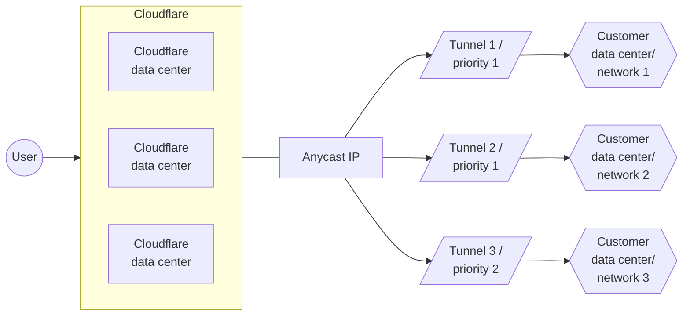

[Skip to content](#%5Ftop) 

Was this helpful?

YesNo

[ Edit page ](https://github.com/cloudflare/cloudflare-docs/edit/production/src/content/docs/style-guide/index.mdx) [ Report issue ](https://github.com/cloudflare/cloudflare-docs/issues/new/choose) 

Copy page

# Style Guide

Use this guide when writing any content for product, including the dashboard and documentation.

Understanding Cloudflare style is the first step in being able to write, review, and edit documentation. Adhering to Cloudflare style ensures consistency across the company's documentation and promotes the following benefits:

* A professional and reliable product image
* A seamless customer experience across Cloudflare products
* Minimized customer confusion
* Simplified translation process

To contribute to the documentation, visit the [contributor guide](https://developers.cloudflare.com/style-guide/contributions/).

## Available resources

* [ Components ](https://developers.cloudflare.com/style-guide/components/)  
   * [ Anchor heading ](https://developers.cloudflare.com/style-guide/components/anchor-heading/)  
   * [ API request ](https://developers.cloudflare.com/style-guide/components/api-request/)  
   * [ Available notifications ](https://developers.cloudflare.com/style-guide/components/available-notifications/)  
   * [ Badges ](https://developers.cloudflare.com/style-guide/components/badges/)  
   * [ Cards ](https://developers.cloudflare.com/style-guide/components/cards/)  
   * [ CURL ](https://developers.cloudflare.com/style-guide/components/curl/)  
   * [ DashButton ](https://developers.cloudflare.com/style-guide/components/dash-button/)  
   * [ Buttons ](https://developers.cloudflare.com/style-guide/components/buttons/)  
   * [ Descriptions ](https://developers.cloudflare.com/style-guide/components/description/)  
   * [ Details ](https://developers.cloudflare.com/style-guide/components/details/)  
   * [ Directory listing ](https://developers.cloudflare.com/style-guide/components/directory-listing/)  
   * [ Example ](https://developers.cloudflare.com/style-guide/components/example/)  
   * [ External resources ](https://developers.cloudflare.com/style-guide/components/external-resources/)  
   * [ Feature ](https://developers.cloudflare.com/style-guide/components/feature/)  
   * [ Feature table ](https://developers.cloudflare.com/style-guide/components/feature-table/)  
   * [ File tree ](https://developers.cloudflare.com/style-guide/components/file-tree/)  
   * [ GitHubCode ](https://developers.cloudflare.com/style-guide/components/github-code/)  
   * [ Glossary ](https://developers.cloudflare.com/style-guide/components/glossary/)  
   * [ Glossary definition ](https://developers.cloudflare.com/style-guide/components/glossary-definition/)  
   * [ Glossary tooltip ](https://developers.cloudflare.com/style-guide/components/glossary-tooltip/)  
   * [ Icons ](https://developers.cloudflare.com/style-guide/components/icons/)  
   * [ Inline badge ](https://developers.cloudflare.com/style-guide/components/inline-badge/)  
   * [ Link cards ](https://developers.cloudflare.com/style-guide/components/link-cards/)  
   * [ List tutorials ](https://developers.cloudflare.com/style-guide/components/list-tutorials/)  
   * [ Markdown ](https://developers.cloudflare.com/style-guide/components/markdown/)  
   * [ Package Managers ](https://developers.cloudflare.com/style-guide/components/package-managers/)  
   * [ Pages build preset ](https://developers.cloudflare.com/style-guide/components/pages-build-preset/)  
   * [ Plan ](https://developers.cloudflare.com/style-guide/components/plan/)  
   * [ Product availability text ](https://developers.cloudflare.com/style-guide/components/product-availability-text/)  
   * [ Product changelog ](https://developers.cloudflare.com/style-guide/components/product-changelog/)  
   * [ Product features ](https://developers.cloudflare.com/style-guide/components/product-features/)  
   * [ Public stats ](https://developers.cloudflare.com/style-guide/components/public-stats/)  
   * [ Related product ](https://developers.cloudflare.com/style-guide/components/related-product/)  
   * [ Render ](https://developers.cloudflare.com/style-guide/components/render/)  
   * [ Resources by selector ](https://developers.cloudflare.com/style-guide/components/resources-by-selector/)  
   * [ RSSButton ](https://developers.cloudflare.com/style-guide/components/rss-button/)  
   * [ Rule ID ](https://developers.cloudflare.com/style-guide/components/rule-id/)  
   * [ Steps ](https://developers.cloudflare.com/style-guide/components/steps/)  
   * [ Stream ](https://developers.cloudflare.com/style-guide/components/stream/)  
   * [ Subtract IP calculator ](https://developers.cloudflare.com/style-guide/components/subtract-ip-calculator/)  
   * [ Tabs ](https://developers.cloudflare.com/style-guide/components/tabs/)  
   * [ Type highlighting ](https://developers.cloudflare.com/style-guide/components/type-highlighting/)  
   * [ TypeScript example ](https://developers.cloudflare.com/style-guide/components/typescript-example/)  
   * [ Usage ](https://developers.cloudflare.com/style-guide/components/usage/)  
   * [ Width ](https://developers.cloudflare.com/style-guide/components/width/)  
   * [ WranglerCLI ](https://developers.cloudflare.com/style-guide/components/wrangler-cli/)  
   * [ WranglerCommand ](https://developers.cloudflare.com/style-guide/components/wrangler-command/)  
   * [ WranglerConfig ](https://developers.cloudflare.com/style-guide/components/wrangler-config/)  
   * [ WranglerNamespace ](https://developers.cloudflare.com/style-guide/components/wrangler-namespace/)  
   * [ YouTube ](https://developers.cloudflare.com/style-guide/components/youtube/)  
   * [ YouTube Videos ](https://developers.cloudflare.com/style-guide/components/youtube-videos/)
* [ AI tooling ](https://developers.cloudflare.com/style-guide/ai-tooling/)
* [ API docs content strategy ](https://developers.cloudflare.com/style-guide/api-content-strategy/)  
   * [ API content types ](https://developers.cloudflare.com/style-guide/api-content-strategy/api-content-types/)  
         * [ Get started - API ](https://developers.cloudflare.com/style-guide/api-content-strategy/api-content-types/get-started-api/)  
         * [ Resources ](https://developers.cloudflare.com/style-guide/api-content-strategy/api-content-types/resources/)  
         * [ Endpoints ](https://developers.cloudflare.com/style-guide/api-content-strategy/api-content-types/endpoints/)  
         * [ Deprecated APIs ](https://developers.cloudflare.com/style-guide/api-content-strategy/api-content-types/deprecated-apis/)  
         * [ Parameters ](https://developers.cloudflare.com/style-guide/api-content-strategy/api-content-types/parameters/)  
   * [ Guidelines for cURL commands ](https://developers.cloudflare.com/style-guide/api-content-strategy/guidelines-for-curl-commands/)  
   * [ Method types & common verbs ](https://developers.cloudflare.com/style-guide/api-content-strategy/method-types-and-command-verbs/)
* [ Contributions ](https://developers.cloudflare.com/style-guide/contributions/)
* [ Grammar ](https://developers.cloudflare.com/style-guide/grammar/)  
   * [ Parts of speech ](https://developers.cloudflare.com/style-guide/grammar/parts-of-speech/)  
         * [ Abbreviations ](https://developers.cloudflare.com/style-guide/grammar/parts-of-speech/abbreviations/)  
         * [ Acronyms ](https://developers.cloudflare.com/style-guide/grammar/parts-of-speech/acronyms/)  
         * [ Anthropomorphisms ](https://developers.cloudflare.com/style-guide/grammar/parts-of-speech/anthropomorphisms/)  
         * [ Capitalization ](https://developers.cloudflare.com/style-guide/grammar/parts-of-speech/capitalization/)  
         * [ Compound words ](https://developers.cloudflare.com/style-guide/grammar/parts-of-speech/compound-words/)  
         * [ Contractions ](https://developers.cloudflare.com/style-guide/grammar/parts-of-speech/contractions/)  
         * [ Nouns and pronouns ](https://developers.cloudflare.com/style-guide/grammar/parts-of-speech/nouns-and-pronouns/)  
         * [ Possessives ](https://developers.cloudflare.com/style-guide/grammar/parts-of-speech/possessives/)  
         * [ Prepositions ](https://developers.cloudflare.com/style-guide/grammar/parts-of-speech/prepositions/)  
         * [ Slang ](https://developers.cloudflare.com/style-guide/grammar/parts-of-speech/slang/)  
   * [ Punctuation marks and symbols ](https://developers.cloudflare.com/style-guide/grammar/punctuation-marks-and-symbols/)  
         * [ Ampersands ](https://developers.cloudflare.com/style-guide/grammar/punctuation-marks-and-symbols/ampersands/)  
         * [ Colons ](https://developers.cloudflare.com/style-guide/grammar/punctuation-marks-and-symbols/colons/)  
         * [ Commas ](https://developers.cloudflare.com/style-guide/grammar/punctuation-marks-and-symbols/commas/)  
         * [ Dashes ](https://developers.cloudflare.com/style-guide/grammar/punctuation-marks-and-symbols/dashes/)  
         * [ Exclamation points ](https://developers.cloudflare.com/style-guide/grammar/punctuation-marks-and-symbols/exclamation-points/)  
         * [ Percentages ](https://developers.cloudflare.com/style-guide/grammar/punctuation-marks-and-symbols/percentages/)  
         * [ Periods ](https://developers.cloudflare.com/style-guide/grammar/punctuation-marks-and-symbols/periods/)  
         * [ Quotation marks ](https://developers.cloudflare.com/style-guide/grammar/punctuation-marks-and-symbols/quotation-marks/)  
         * [ Semicolons ](https://developers.cloudflare.com/style-guide/grammar/punctuation-marks-and-symbols/semicolons/)
* [ Product docs content strategy ](https://developers.cloudflare.com/style-guide/documentation-content-strategy/)  
   * [ Content types ](https://developers.cloudflare.com/style-guide/documentation-content-strategy/content-types/)  
         * [ 3rd-party integration guide ](https://developers.cloudflare.com/style-guide/documentation-content-strategy/content-types/3rd-party-integration-guide/)  
         * [ Changelog ](https://developers.cloudflare.com/style-guide/documentation-content-strategy/content-types/changelog/)  
         * [ Concept ](https://developers.cloudflare.com/style-guide/documentation-content-strategy/content-types/concept/)  
         * [ Configuration ](https://developers.cloudflare.com/style-guide/documentation-content-strategy/content-types/configuration/)  
         * [ Design guide ](https://developers.cloudflare.com/style-guide/documentation-content-strategy/content-types/design-guide/)  
         * [ FAQ ](https://developers.cloudflare.com/style-guide/documentation-content-strategy/content-types/faq/)  
         * [ Get started ](https://developers.cloudflare.com/style-guide/documentation-content-strategy/content-types/get-started/)  
         * [ How to ](https://developers.cloudflare.com/style-guide/documentation-content-strategy/content-types/how-to/)  
         * [ Implementation guide ](https://developers.cloudflare.com/style-guide/documentation-content-strategy/content-types/implementation-guide/)  
         * [ Navigation ](https://developers.cloudflare.com/style-guide/documentation-content-strategy/content-types/navigation/)  
         * [ Overview ](https://developers.cloudflare.com/style-guide/documentation-content-strategy/content-types/overview/)  
         * [ Reference ](https://developers.cloudflare.com/style-guide/documentation-content-strategy/content-types/reference/)  
         * [ Reference architecture ](https://developers.cloudflare.com/style-guide/documentation-content-strategy/content-types/reference-architecture/)  
         * [ Reference architecture diagram ](https://developers.cloudflare.com/style-guide/documentation-content-strategy/content-types/reference-architecture-diagram/)  
         * [ How to select a content type ](https://developers.cloudflare.com/style-guide/documentation-content-strategy/content-types/select-content-type/)  
         * [ Solution guide ](https://developers.cloudflare.com/style-guide/documentation-content-strategy/content-types/solution-guide/)  
         * [ Troubleshooting ](https://developers.cloudflare.com/style-guide/documentation-content-strategy/content-types/troubleshooting/)  
         * [ Tutorial ](https://developers.cloudflare.com/style-guide/documentation-content-strategy/content-types/tutorial/)  
   * [ Component attributes ](https://developers.cloudflare.com/style-guide/documentation-content-strategy/component-attributes/)  
         * [ Context ](https://developers.cloudflare.com/style-guide/documentation-content-strategy/component-attributes/context/)  
         * [ Diagrams ](https://developers.cloudflare.com/style-guide/documentation-content-strategy/component-attributes/diagrams/)  
         * [ Dynamic lists ](https://developers.cloudflare.com/style-guide/documentation-content-strategy/component-attributes/dynamic-lists/)  
         * [ Examples ](https://developers.cloudflare.com/style-guide/documentation-content-strategy/component-attributes/examples/)  
         * [ Glossary entry ](https://developers.cloudflare.com/style-guide/documentation-content-strategy/component-attributes/glossary-entry/)  
         * [ Intended audience ](https://developers.cloudflare.com/style-guide/documentation-content-strategy/component-attributes/intended-audience/)  
         * [ Introduction ](https://developers.cloudflare.com/style-guide/documentation-content-strategy/component-attributes/introduction/)  
         * [ Last updated ](https://developers.cloudflare.com/style-guide/documentation-content-strategy/component-attributes/last-updated/)  
         * [ Links ](https://developers.cloudflare.com/style-guide/documentation-content-strategy/component-attributes/links/)  
         * [ Mathematical operations ](https://developers.cloudflare.com/style-guide/documentation-content-strategy/component-attributes/mathematical-operations/)  
         * [ Next steps ](https://developers.cloudflare.com/style-guide/documentation-content-strategy/component-attributes/next-steps/)  
         * [ Notes/tips/warnings ](https://developers.cloudflare.com/style-guide/documentation-content-strategy/component-attributes/notes-tips-warnings/)  
         * [ Prerequisites ](https://developers.cloudflare.com/style-guide/documentation-content-strategy/component-attributes/prerequisites/)  
         * [ Product descriptions ](https://developers.cloudflare.com/style-guide/documentation-content-strategy/component-attributes/product-descriptions/)  
         * [ Reference diagram ](https://developers.cloudflare.com/style-guide/documentation-content-strategy/component-attributes/reference-diagram/)  
         * [ Screenshots ](https://developers.cloudflare.com/style-guide/documentation-content-strategy/component-attributes/screenshots/)  
         * [ Steps/tasks/procedures ](https://developers.cloudflare.com/style-guide/documentation-content-strategy/component-attributes/steps-tasks-procedures/)  
         * [ Tables ](https://developers.cloudflare.com/style-guide/documentation-content-strategy/component-attributes/tables/)  
         * [ Titles ](https://developers.cloudflare.com/style-guide/documentation-content-strategy/component-attributes/titles/)  
   * [ Information architecture ](https://developers.cloudflare.com/style-guide/documentation-content-strategy/information-architecture/)  
   * [ Writing guidelines ](https://developers.cloudflare.com/style-guide/documentation-content-strategy/writing-guidelines/)  
   * [ File conventions ](https://developers.cloudflare.com/style-guide/documentation-content-strategy/file-conventions/)  
   * [ Accessibility guidelines ](https://developers.cloudflare.com/style-guide/documentation-content-strategy/accessibility/)
* [ How we docs ](https://developers.cloudflare.com/style-guide/how-we-docs/)  
   * [ Content reviews ](https://developers.cloudflare.com/style-guide/how-we-docs/reviews/)  
   * [ Image maintenance ](https://developers.cloudflare.com/style-guide/how-we-docs/image-maintenance/)  
   * [ Links ](https://developers.cloudflare.com/style-guide/how-we-docs/links/)  
   * [ Our site ](https://developers.cloudflare.com/style-guide/how-we-docs/our-site/)  
   * [ How we video ](https://developers.cloudflare.com/style-guide/how-we-docs/how-we-video/)  
         * [ Why and when we use videos ](https://developers.cloudflare.com/style-guide/how-we-docs/how-we-video/why-and-when-we-use-videos/)  
         * [ Video production workflow ](https://developers.cloudflare.com/style-guide/how-we-docs/how-we-video/video-production-workflow/)  
         * [ Integration in docs ](https://developers.cloudflare.com/style-guide/how-we-docs/how-we-video/integration-in-docs/)  
         * [ Maintenance ](https://developers.cloudflare.com/style-guide/how-we-docs/how-we-video/maintenance/)  
   * [ AI consumability ](https://developers.cloudflare.com/style-guide/how-we-docs/ai-consumability/)  
   * [ How we AI ](https://developers.cloudflare.com/style-guide/how-we-docs/how-we-ai/)  
         * [ When we use AI ](https://developers.cloudflare.com/style-guide/how-we-docs/how-we-ai/when-we-use-ai/)  
         * [ Prompt templates ](https://developers.cloudflare.com/style-guide/how-we-docs/how-we-ai/prompt-templates/)  
         * [ Prompt libraries ](https://developers.cloudflare.com/style-guide/how-we-docs/how-we-ai/prompt-libraries/)  
         * [ Control how AI crawls your docs ](https://developers.cloudflare.com/style-guide/how-we-docs/how-we-ai/control-ai-crawls/)  
         * [ Examples ](https://developers.cloudflare.com/style-guide/how-we-docs/how-we-ai/examples/)  
                  * [ CLUE ](https://developers.cloudflare.com/style-guide/how-we-docs/how-we-ai/examples/clue/)  
                  * [ Cloudspeaker ](https://developers.cloudflare.com/style-guide/how-we-docs/how-we-ai/examples/cloudspeaker/)  
   * [ Metadata ](https://developers.cloudflare.com/style-guide/how-we-docs/metadata/)  
   * [ Redirects ](https://developers.cloudflare.com/style-guide/how-we-docs/redirects/)
* [ Formatting ](https://developers.cloudflare.com/style-guide/formatting/)  
   * [ Code block guidelines ](https://developers.cloudflare.com/style-guide/formatting/code-block-guidelines/)  
   * [ Code conventions and format ](https://developers.cloudflare.com/style-guide/formatting/code-conventions-and-format/)  
   * [ Dates and times ](https://developers.cloudflare.com/style-guide/formatting/dates-and-times/)  
   * [ Example values ](https://developers.cloudflare.com/style-guide/formatting/example-values/)  
   * [ External references ](https://developers.cloudflare.com/style-guide/formatting/external-references/)  
   * [ File types and extensions ](https://developers.cloudflare.com/style-guide/formatting/file-types-and-extensions/)  
   * [ Footnotes ](https://developers.cloudflare.com/style-guide/formatting/footnotes/)  
   * [ Keyboard keys ](https://developers.cloudflare.com/style-guide/formatting/keyboard-keys/)  
   * [ Notes and other notation types ](https://developers.cloudflare.com/style-guide/formatting/notes-and-other-notation-types/)  
   * [ Numbers and units of measurement ](https://developers.cloudflare.com/style-guide/formatting/numbers-and-units-of-measurement/)  
   * [ Product name and pluralization ](https://developers.cloudflare.com/style-guide/formatting/product-name-and-pluralization/)  
   * [ Structure ](https://developers.cloudflare.com/style-guide/formatting/structure/)  
         * [ Links ](https://developers.cloudflare.com/style-guide/formatting/structure/links/)  
         * [ Lists ](https://developers.cloudflare.com/style-guide/formatting/structure/lists/)  
         * [ Paragraphs and line breaks ](https://developers.cloudflare.com/style-guide/formatting/structure/paragraphs-and-line-breaks/)  
         * [ Sentence structure ](https://developers.cloudflare.com/style-guide/formatting/structure/sentence-structure/)  
         * [ Tables ](https://developers.cloudflare.com/style-guide/formatting/structure/tables/)  
   * [ UI elements ](https://developers.cloudflare.com/style-guide/formatting/ui-elements/)  
   * [ URLs and domain names ](https://developers.cloudflare.com/style-guide/formatting/urls-and-domain-names/)
* [ Frontmatter ](https://developers.cloudflare.com/style-guide/frontmatter/)  
   * [ Banner ](https://developers.cloudflare.com/style-guide/frontmatter/banner/)  
   * [ Sidebar ](https://developers.cloudflare.com/style-guide/frontmatter/sidebar/)  
   * [ Custom properties ](https://developers.cloudflare.com/style-guide/frontmatter/custom-properties/)  
   * [ Tags ](https://developers.cloudflare.com/style-guide/frontmatter/tags/)

```json
{"@context":"https://schema.org","@type":"BreadcrumbList","itemListElement":[{"@type":"ListItem","position":1,"item":{"@id":"/directory/","name":"Directory"}},{"@type":"ListItem","position":2,"item":{"@id":"/style-guide/","name":"Style Guide"}}]}
```

---

---
title: Contributions
description: The Cloudflare Docs are open source and hosted on the cloudflare-docs repository on GitHub. This means that anyone, including those who are not part of the Cloudflare organization, can contribute to them. We welcome all suggestions that help keep our docs high quality and up to date.
image: https://developers.cloudflare.com/cf-twitter-card.png
---

[Skip to content](#%5Ftop) 

Was this helpful?

YesNo

[ Edit page ](https://github.com/cloudflare/cloudflare-docs/edit/production/src/content/docs/style-guide/contributions.mdx) [ Report issue ](https://github.com/cloudflare/cloudflare-docs/issues/new/choose) 

Copy page

# Contributions

The [Cloudflare Docs ↗](https://developers.cloudflare.com/) are open source and hosted on the [cloudflare-docs repository ↗](https://github.com/cloudflare/cloudflare-docs) on GitHub. This means that anyone, including those who are not part of the Cloudflare organization, can contribute to them. We welcome all suggestions that help keep our docs high quality and up to date.

To contribute to our docs, you will need to [create an account on GitHub ↗](https://docs.github.com/en/get-started/start-your-journey/creating-an-account-on-github) (if you do not have one already) and log in. Then you have three options:

* [GitHub issue](#create-a-github-issue): Quickly submit a general suggestion.
* [Quick edit (edit button)](#quick-edit): Quickly create a pull request. This is best if you want to edit a single page in your web browser and do not need to preview your changes.
* [Full development](#full-development): Create a pull request. This is best if you want to edit multiple pages and preview your changes. This can be done in your web browser (with [Codespaces ↗](https://docs.github.com/codespaces)) or on your local machine (with [Visual Studio Code ↗](https://code.visualstudio.com/)).

In addition to using the [Cloudflare Style Guide](https://developers.cloudflare.com/style-guide/) for guidance on grammar and style, we recommend browsing our [components](https://developers.cloudflare.com/style-guide/components/) to add additional formatting such as buttons, tabs, and collapsible sections.

## Create a GitHub issue

To create a GitHub issue:

1. [Log in to GitHub ↗](https://github.com/login) and go to the [cloudflare-docs repository ↗](https://github.com/cloudflare/cloudflare-docs).
2. Select **Issues** and then **New issue**.
3. Select the issue type, fill out the form, and select **Create**.

[Learn more about creating GitHub issues. ↗](https://docs.github.com/en/issues/tracking-your-work-with-issues/using-issues/creating-an-issue)

## Quick edit

To quickly create a pull request using the edit button:

1. [Log in to GitHub ↗](https://github.com/login).
2. Go to the page you want to edit in the [Cloudflare Docs ↗](https://developers.cloudflare.com/)
3. Select  
**Edit** or **Edit page**  
 Every page in the Cloudflare Docs (including this one) has an **Edit** button on the right sidebar and an **Edit page** button on the very bottom of the page. The page's Markdown opens.  
Note  
The first time you create a pull request in the cloudflare-docs repo, you will see a GitHub landing page that says "You need to fork this repository to propose changes." Select **Fork this repository**. All of your future pull requests for cloudflare-docs will write to a new branch on your fork.
4. Make your edits and select **Commit changes**.
5. In the form, update the **Commit message** with the product you changed in brackets and a brief description of your changes. For example “\[Images\] Fixed broken link."
6. Update the **Extended description** with more details about what you changed and why. The more details, the better.
7. Select **Propose changes** \> **Create pull request** \> **Create pull request** again.

## Full development

To edit and create a pull request with the [full development workflow ↗](https://docs.github.com/en/codespaces/developing-in-a-codespace/using-source-control-in-your-codespace):

1. [Log in to GitHub ↗](https://github.com/login) and [fork the cloudflare-docs repository ↗](https://docs.github.com/en/pull-requests/collaborating-with-pull-requests/working-with-forks/fork-a-repo).
2. If you are editing in your web browser (with [Codespaces ↗](https://docs.github.com/en/codespaces)), move on to step 3.  
If you are editing on your local machine (with [Visual Studio Code ↗](https://code.visualstudio.com/)):  
   * (Required) Install [Node.js ↗](https://nodejs.org/en) (version 22 or later).  
   * (Recommended, but not required) Install [Volta ↗](https://volta.sh/) for easier package management.  
   * (Required) [Clone the fork to your local machine. ↗](https://docs.github.com/en/repositories/creating-and-managing-repositories/cloning-a-repository)
3. Create a branch from your fork (or from your clone).
4. Make your edits.

Preview your edits

To preview your edits, you need to install `npm`.

Terminal window

```

npm install


```

Then, run `npm run dev`.

Terminal window

```

npm run dev


```

A link will appear in the terminal, `https://localhost:1111/`, where you can preview your edits. This link automatically updates with any new edits you make.

1. Commit your changes.
2. Push your commits to your branch and then back to your fork.
3. Return to GitHub and create a pull request from your committed changes. In the description form, add the product you changed in brackets and a brief description of your changes. For example “\[Images\] Fixed broken link."

## After you create an issue or PR

After you create an issue or PR, a member of the Cloudflare organization will review your suggestion. Here is what to expect:

* A member of the Cloudflare organization may tag others for technical or content reviews or feedback.
* If your suggestion requires more information, a member of the Cloudflare organization may comment with a follow-up or clarification question. If they add the `more-information-needed` tag, the issue or pull request will automatically close if you do not respond within 14 days.
* If your changes are approved:  
   * For GitHub issues, a Cloudflare member might create and link a new pull request that addresses your request. When they merge the PR, they will also close your issue.  
   * For GitHub PRs, the Cloudflare member will merge your PR.
* If your suggestion is not approved, the Cloudflare member will respond with the reasoning and close your issue or PR.

Thank you for contributing to our open-source ecosystem and being a part of the Cloudflare community.

```json
{"@context":"https://schema.org","@type":"BreadcrumbList","itemListElement":[{"@type":"ListItem","position":1,"item":{"@id":"/directory/","name":"Directory"}},{"@type":"ListItem","position":2,"item":{"@id":"/style-guide/","name":"Style Guide"}},{"@type":"ListItem","position":3,"item":{"@id":"/style-guide/contributions/","name":"Contributions"}}]}
```

---

---
title: Components
description: When you are contributing to the Cloudflare Docs, you can use our custom components to add additional formatting, such as buttons, tabs, and collapsible sections.
image: https://developers.cloudflare.com/cf-twitter-card.png
---

[Skip to content](#%5Ftop) 

Was this helpful?

YesNo

[ Edit page ](https://github.com/cloudflare/cloudflare-docs/edit/production/src/content/docs/style-guide/components/index.mdx) [ Report issue ](https://github.com/cloudflare/cloudflare-docs/issues/new/choose) 

Copy page

# Components

When you are [contributing to the Cloudflare Docs](https://developers.cloudflare.com/style-guide/contributions/), you can use our custom components to add additional formatting, such as buttons, tabs, and collapsible sections.

This guide shows you the basics of importing and adding a component to a page. Refer to each component page in this Style Guide to learn the specific props and requirements for each.

Our components are based on [Astro components ↗](https://docs.astro.build/en/basics/astro-components/) and are written in [MDX ↗](https://docs.astro.build/en/guides/markdown-content/), an extended version of Markdown. [Learn more about the Cloudflare Docs framework](https://developers.cloudflare.com/style-guide/how-we-docs/our-site/#site-framework).

## Add a component to a page

To add a component to a page:

1. Import the component to the page by adding this text directly below the [frontmatter](https://developers.cloudflare.com/style-guide/frontmatter/):  
```  
import { COMPONENT_NAME } from "~/components";  
;  
```  
For example, if you were to add [the DashButton component](https://developers.cloudflare.com/style-guide/components/dash-button/) to the [Images getting started page](https://developers.cloudflare.com/images/get-started/), the top of the MDX file corresponding to that page would look like the following:  
```  
---  
pcx_content_type: get-started  
title: Getting started  
sidebar:  
  order: 2  
---  
import { DashButton } from "~/components";  
;  
```
2. Add the component to the page by adding this text anywhere on the page you want the component to appear:  
```  
<COMPONENT_NAME PROP_NAME="PROP_VALUE" />  
```  
For example, if you were to add the `DashButton` component to some steps in the [Images getting started page](https://developers.cloudflare.com/images/get-started/), here is how the MDX file would look:  
```  
1. In the Cloudflare dashboard, go to the **Transformations** page.  
   <DashButton url="/?to=/:account/images/transformations" />  
2. Go to the specific zone where you want to enable transformations.  
```

This is how this example would display after it is published:


## Choose the right component

To choose the right component for your use case, browse this table which contains our most commonly used components and a visual example of each. For full documentation on all available components and their use cases, browse the individual component pages in this Style Guide.

| Component                                                                                              | Description & visual example                                                                                                                                                                                                                                                                                                   |
| ------------------------------------------------------------------------------------------------------ | ------------------------------------------------------------------------------------------------------------------------------------------------------------------------------------------------------------------------------------------------------------------------------------------------------------------------------ |
| [APIRequest](https://developers.cloudflare.com/style-guide/components/api-request/)                    | Styled API request block. Generate executable cURL API commands with the required API token permissions.                                                                                                       |
| [Badge](https://developers.cloudflare.com/style-guide/components/badges/)                              | Small descriptive pill. Label content with status, version, category, or other short metadata.                                                                                                                          |
| [DashButton](https://developers.cloudflare.com/style-guide/components/dash-button/)                    | Dashboard deep-link button. Directly link users from documentation into a specific, relevant section of the Cloudflare Dashboard.                                                                          |
| [Details](https://developers.cloudflare.com/style-guide/components/details/)                           | Click-to-expand content block. Hide non-essential, complex, or advanced technical content, allowing users to expand the section when needed.                                                                                 |
| [DirectoryListing](https://developers.cloudflare.com/style-guide/components/directory-listing)         | Auto-generated sub-page list. Automatically generate a navigable list of links to sub-pages within a specified documentation folder path.                                                         |
| [Feature](https://developers.cloudflare.com/style-guide/components/feature/)                           | Product feature list item. Highlight a product feature with a description and a direct link button.                                                                                                                 |
| [FeatureTable](https://developers.cloudflare.com/style-guide/components/feature-table/)                | Product plan comparison table. Display detailed feature information, including availability across different Cloudflare pricing plans.                                                                   |
| [GlossaryTooltip](https://developers.cloudflare.com/style-guide/components/glossary-tooltip/)          | Hover-activated glossary popup. Provide non-disruptive, hover-activated definitions for technical terms pulled from the documentation glossary.                                                              |
| [LinkCard](https://developers.cloudflare.com/style-guide/components/link-cards/)                       | Navigational cards. Present related tutorials, concepts, or guides in a visually engaging format.                                                                                                                  |
| [PackageManagers](https://developers.cloudflare.com/style-guide/components/package-managers)           | Command switcher tabs. Display equivalent installation or execution commands for different package managers.                                                                                      |
| [Plan](https://developers.cloudflare.com/style-guide/components/plan/)                                 | Product plan availability badge. Show the plan required for a product or specific feature.                                                                                                                               |
| [RelatedProduct](https://developers.cloudflare.com/style-guide/components/related-product/)            | Formatted product reference. Visually highlight and link to a specific, complementary Cloudflare product, also featuring the product's logo.                                                          |
| [ResourcesBySelector](https://developers.cloudflare.com/style-guide/components/resources-by-selector/) | Filterable code example library. Pull and display lists of code examples and resources based on tags and content type.                                                                      |
| [Stream](https://developers.cloudflare.com/style-guide/components/stream/)                             | Embeddable video player. Display a video player optimized for Cloudflare Stream.                                                                                                                                                |
| [Tabs and TabItem](https://developers.cloudflare.com/style-guide/components/tabs/)                     | Switchable content tabs. Allow easy switching between content views for different code languages or configuration methods.                                                                                                         |
| [Type and MetaInfo](https://developers.cloudflare.com/style-guide/components/type-highlighting/)       | Pill-shaped data type badge and metadata annotation about a field or property. Type indicates API parameter data types (String, Integer) and MetaInfo indicates metadata constraints (Required, Optional, Read-only).  |
| [WranglerConfig](https://developers.cloudflare.com/style-guide/components/wrangler-config/)            | Tabbed Wrangler config display. Show Wrangler configuration files (JSONC and TOML) and bindings with automatic format switching.                                                                                |
| [YouTube](https://developers.cloudflare.com/style-guide/components/youtube/)                           | Embeddable video player. Embeds a YouTube video player with a specified video ID.                                                                                                                                              |

```json
{"@context":"https://schema.org","@type":"BreadcrumbList","itemListElement":[{"@type":"ListItem","position":1,"item":{"@id":"/directory/","name":"Directory"}},{"@type":"ListItem","position":2,"item":{"@id":"/style-guide/","name":"Style Guide"}},{"@type":"ListItem","position":3,"item":{"@id":"/style-guide/components/","name":"Components"}}]}
```

---

---
title: Anchor heading
description: The AnchorHeading component defines headings. Specifically, AnchorHeading performs the following:
image: https://developers.cloudflare.com/cf-twitter-card.png
---

[Skip to content](#%5Ftop) 

Was this helpful?

YesNo

[ Edit page ](https://github.com/cloudflare/cloudflare-docs/edit/production/src/content/docs/style-guide/components/anchor-heading.mdx) [ Report issue ](https://github.com/cloudflare/cloudflare-docs/issues/new/choose) 

Copy page

# Anchor heading

The `AnchorHeading` component is used `29` times on `6` pages.

See all examples of pages that use AnchorHeading

Used **29** times.

**Pages**

**Partials**

* [src/content/partials/durable-objects/api-async-kv-legacy.mdx](https://github.com/cloudflare/cloudflare-docs/blob/production/src/content/partials/durable-objects/api-async-kv-legacy.mdx)
* [src/content/partials/networking-services/analytics/overview.mdx](https://github.com/cloudflare/cloudflare-docs/blob/production/src/content/partials/networking-services/analytics/overview.mdx)
* [src/content/partials/networking-services/reference/mtu-mss.mdx](https://github.com/cloudflare/cloudflare-docs/blob/production/src/content/partials/networking-services/reference/mtu-mss.mdx)
* [src/content/partials/networking-services/reference/traffic-steering.mdx](https://github.com/cloudflare/cloudflare-docs/blob/production/src/content/partials/networking-services/reference/traffic-steering.mdx)
* [src/content/partials/workers/wrangler-commands/containers.mdx](https://github.com/cloudflare/cloudflare-docs/blob/production/src/content/partials/workers/wrangler-commands/containers.mdx)
* [src/content/partials/workers/wrangler-commands/tunnel.mdx](https://github.com/cloudflare/cloudflare-docs/blob/production/src/content/partials/workers/wrangler-commands/tunnel.mdx)

The `AnchorHeading` component defines headings. Specifically, `AnchorHeading` performs the following:

1. Generates URL fragments corresponding to headings.
2. Formats URL fragments into compatible syntax. For example, a `&` is replaced with a `-`.
3. Creates a button to copy the URL at each fragment.
4. Allows heading fragments to be defined separately from the text of the heading itself.

## How to use AnchorHeading

```

import { AnchorHeading } from "~/components";


<AnchorHeading title="How to use AnchorHeading" slug="use-anchorheading" depth={2} />


```

Markdown files (including partials) have this behavior by default, applied via rehype plugins. Therefore, the `AnchorHeading` component is usually only required when writing headings yourself inside components, or when working on non-markdown files.

To override the ID given to a heading within Markdown, add an MDX comment at the end of the line:

## foo

```

## foo {/*bar*/}

{/* HTML: <h2 id="bar">foo</h2> */}


```

Note

The `AnchorHeading` component emulates the behavior of the [rehype-slug ↗](https://github.com/rehypejs/rehype-slug) and the [rehype-autolink-headings ↗](https://github.com/rehypejs/rehype-autolink-headings). It adds an `id` based on the output of [github-slugger ↗](https://github.com/Flet/github-slugger/) to the heading, as well as adding a button to copy a link to that particular heading.

```json
{"@context":"https://schema.org","@type":"BreadcrumbList","itemListElement":[{"@type":"ListItem","position":1,"item":{"@id":"/directory/","name":"Directory"}},{"@type":"ListItem","position":2,"item":{"@id":"/style-guide/","name":"Style Guide"}},{"@type":"ListItem","position":3,"item":{"@id":"/style-guide/components/","name":"Components"}},{"@type":"ListItem","position":4,"item":{"@id":"/style-guide/components/anchor-heading/","name":"Anchor heading"}}]}
```

---

---
title: API request
description: required
image: https://developers.cloudflare.com/cf-twitter-card.png
---

[Skip to content](#%5Ftop) 

Was this helpful?

YesNo

[ Edit page ](https://github.com/cloudflare/cloudflare-docs/edit/production/src/content/docs/style-guide/components/api-request.mdx) [ Report issue ](https://github.com/cloudflare/cloudflare-docs/issues/new/choose) 

Copy page

# API request

The `APIRequest` component is used `571` times on `235` pages.

See all examples of pages that use APIRequest

Used **571** times.

**Pages**

* [/ai-gateway/evaluations/add-human-feedback-api/](https://developers.cloudflare.com/ai-gateway/evaluations/add-human-feedback-api/)\-[Source](https://github.com/cloudflare/cloudflare-docs/blob/production/src/content/docs/ai-gateway/evaluations/add-human-feedback-api.mdx)
* [/api-shield/security/schema-validation/api/](https://developers.cloudflare.com/api-shield/security/schema-validation/api/)\-[Source](https://github.com/cloudflare/cloudflare-docs/blob/production/src/content/docs/api-shield/security/schema-validation/api.mdx)
* [/api-shield/security/volumetric-abuse-detection/](https://developers.cloudflare.com/api-shield/security/volumetric-abuse-detection/)\-[Source](https://github.com/cloudflare/cloudflare-docs/blob/production/src/content/docs/api-shield/security/volumetric-abuse-detection.mdx)
* [/byoip/address-maps/setup/](https://developers.cloudflare.com/byoip/address-maps/setup/)\-[Source](https://github.com/cloudflare/cloudflare-docs/blob/production/src/content/docs/byoip/address-maps/setup.mdx)
* [/byoip/get-started/](https://developers.cloudflare.com/byoip/get-started/)\-[Source](https://github.com/cloudflare/cloudflare-docs/blob/production/src/content/docs/byoip/get-started.mdx)
* [/byoip/service-bindings/cdn-and-spectrum/](https://developers.cloudflare.com/byoip/service-bindings/cdn-and-spectrum/)\-[Source](https://github.com/cloudflare/cloudflare-docs/blob/production/src/content/docs/byoip/service-bindings/cdn-and-spectrum.mdx)
* [/byoip/troubleshooting/prefix-validation/](https://developers.cloudflare.com/byoip/troubleshooting/prefix-validation/)\-[Source](https://github.com/cloudflare/cloudflare-docs/blob/production/src/content/docs/byoip/troubleshooting/prefix-validation.mdx)
* [/cache/advanced-configuration/cache-reserve/](https://developers.cloudflare.com/cache/advanced-configuration/cache-reserve/)\-[Source](https://github.com/cloudflare/cloudflare-docs/blob/production/src/content/docs/cache/advanced-configuration/cache-reserve.mdx)
* [/cache/advanced-configuration/serve-tailored-content/](https://developers.cloudflare.com/cache/advanced-configuration/serve-tailored-content/)\-[Source](https://github.com/cloudflare/cloudflare-docs/blob/production/src/content/docs/cache/advanced-configuration/serve-tailored-content.mdx)
* [/cache/advanced-configuration/vary-for-images/](https://developers.cloudflare.com/cache/advanced-configuration/vary-for-images/)\-[Source](https://github.com/cloudflare/cloudflare-docs/blob/production/src/content/docs/cache/advanced-configuration/vary-for-images.mdx)
* [/cache/how-to/cache-response-rules/create-api/](https://developers.cloudflare.com/cache/how-to/cache-response-rules/create-api/)\-[Source](https://github.com/cloudflare/cloudflare-docs/blob/production/src/content/docs/cache/how-to/cache-response-rules/create-api.mdx)
* [/cache/how-to/cache-rules/create-api/](https://developers.cloudflare.com/cache/how-to/cache-rules/create-api/)\-[Source](https://github.com/cloudflare/cloudflare-docs/blob/production/src/content/docs/cache/how-to/cache-rules/create-api.mdx)
* [/cache/how-to/purge-cache/purge-cache-key/](https://developers.cloudflare.com/cache/how-to/purge-cache/purge-cache-key/)\-[Source](https://github.com/cloudflare/cloudflare-docs/blob/production/src/content/docs/cache/how-to/purge-cache/purge-cache-key.mdx)
* [/cache/how-to/tiered-cache/](https://developers.cloudflare.com/cache/how-to/tiered-cache/)\-[Source](https://github.com/cloudflare/cloudflare-docs/blob/production/src/content/docs/cache/how-to/tiered-cache.mdx)
* [/china-network/reference/infrastructure/](https://developers.cloudflare.com/china-network/reference/infrastructure/)\-[Source](https://github.com/cloudflare/cloudflare-docs/blob/production/src/content/docs/china-network/reference/infrastructure.mdx)
* [/client-side-security/reference/api/](https://developers.cloudflare.com/client-side-security/reference/api/)\-[Source](https://github.com/cloudflare/cloudflare-docs/blob/production/src/content/docs/client-side-security/reference/api.mdx)
* [/cloudflare-for-platforms/cloudflare-for-saas/domain-support/custom-metadata/](https://developers.cloudflare.com/cloudflare-for-platforms/cloudflare-for-saas/domain-support/custom-metadata/)\-[Source](https://github.com/cloudflare/cloudflare-docs/blob/production/src/content/docs/cloudflare-for-platforms/cloudflare-for-saas/domain-support/custom-metadata.mdx)
* [/cloudflare-for-platforms/cloudflare-for-saas/performance/early-hints-for-saas/](https://developers.cloudflare.com/cloudflare-for-platforms/cloudflare-for-saas/performance/early-hints-for-saas/)\-[Source](https://github.com/cloudflare/cloudflare-docs/blob/production/src/content/docs/cloudflare-for-platforms/cloudflare-for-saas/performance/early-hints-for-saas.mdx)
* [/cloudflare-for-platforms/cloudflare-for-saas/security/certificate-management/enforce-mtls/](https://developers.cloudflare.com/cloudflare-for-platforms/cloudflare-for-saas/security/certificate-management/enforce-mtls/)\-[Source](https://github.com/cloudflare/cloudflare-docs/blob/production/src/content/docs/cloudflare-for-platforms/cloudflare-for-saas/security/certificate-management/enforce-mtls.mdx)
* [/cloudflare-for-platforms/cloudflare-for-saas/security/waf-for-saas/](https://developers.cloudflare.com/cloudflare-for-platforms/cloudflare-for-saas/security/waf-for-saas/)\-[Source](https://github.com/cloudflare/cloudflare-docs/blob/production/src/content/docs/cloudflare-for-platforms/cloudflare-for-saas/security/waf-for-saas/index.mdx)
* [/cloudflare-for-platforms/workers-for-platforms/configuration/tags/](https://developers.cloudflare.com/cloudflare-for-platforms/workers-for-platforms/configuration/tags/)\-[Source](https://github.com/cloudflare/cloudflare-docs/blob/production/src/content/docs/cloudflare-for-platforms/workers-for-platforms/configuration/tags.mdx)
* [/cloudflare-one/access-controls/ai-controls/linked-apps/](https://developers.cloudflare.com/cloudflare-one/access-controls/ai-controls/linked-apps/)\-[Source](https://github.com/cloudflare/cloudflare-docs/blob/production/src/content/docs/cloudflare-one/access-controls/ai-controls/linked-apps.mdx)
* [/cloudflare-one/access-controls/ai-controls/saas-mcp/](https://developers.cloudflare.com/cloudflare-one/access-controls/ai-controls/saas-mcp/)\-[Source](https://github.com/cloudflare/cloudflare-docs/blob/production/src/content/docs/cloudflare-one/access-controls/ai-controls/saas-mcp.mdx)
* [/cloudflare-one/access-controls/policies/policy-management/](https://developers.cloudflare.com/cloudflare-one/access-controls/policies/policy-management/)\-[Source](https://github.com/cloudflare/cloudflare-docs/blob/production/src/content/docs/cloudflare-one/access-controls/policies/policy-management.mdx)
* [/cloudflare-one/access-controls/service-credentials/service-tokens/](https://developers.cloudflare.com/cloudflare-one/access-controls/service-credentials/service-tokens/)\-[Source](https://github.com/cloudflare/cloudflare-docs/blob/production/src/content/docs/cloudflare-one/access-controls/service-credentials/service-tokens.mdx)
* [/cloudflare-one/insights/logs/audit-logs/](https://developers.cloudflare.com/cloudflare-one/insights/logs/audit-logs/)\-[Source](https://github.com/cloudflare/cloudflare-docs/blob/production/src/content/docs/cloudflare-one/insights/logs/audit-logs.mdx)
* [/cloudflare-one/insights/logs/filter-views/](https://developers.cloudflare.com/cloudflare-one/insights/logs/filter-views/)\-[Source](https://github.com/cloudflare/cloudflare-docs/blob/production/src/content/docs/cloudflare-one/insights/logs/filter-views.mdx)
* [/cloudflare-one/integrations/identity-providers/entra-id/](https://developers.cloudflare.com/cloudflare-one/integrations/identity-providers/entra-id/)\-[Source](https://github.com/cloudflare/cloudflare-docs/blob/production/src/content/docs/cloudflare-one/integrations/identity-providers/entra-id.mdx)
* [/cloudflare-one/integrations/identity-providers/generic-oidc/](https://developers.cloudflare.com/cloudflare-one/integrations/identity-providers/generic-oidc/)\-[Source](https://github.com/cloudflare/cloudflare-docs/blob/production/src/content/docs/cloudflare-one/integrations/identity-providers/generic-oidc.mdx)
* [/cloudflare-one/integrations/identity-providers/one-time-pin/](https://developers.cloudflare.com/cloudflare-one/integrations/identity-providers/one-time-pin/)\-[Source](https://github.com/cloudflare/cloudflare-docs/blob/production/src/content/docs/cloudflare-one/integrations/identity-providers/one-time-pin.mdx)
* [/cloudflare-one/networks/connectors/cloudflare-tunnel/configure-tunnels/remote-tunnel-permissions/](https://developers.cloudflare.com/cloudflare-one/networks/connectors/cloudflare-tunnel/configure-tunnels/remote-tunnel-permissions/)\-[Source](https://github.com/cloudflare/cloudflare-docs/blob/production/src/content/docs/cloudflare-one/networks/connectors/cloudflare-tunnel/configure-tunnels/remote-tunnel-permissions.mdx)
* [/cloudflare-one/networks/connectors/cloudflare-tunnel/get-started/create-remote-tunnel-api/](https://developers.cloudflare.com/cloudflare-one/networks/connectors/cloudflare-tunnel/get-started/create-remote-tunnel-api/)\-[Source](https://github.com/cloudflare/cloudflare-docs/blob/production/src/content/docs/cloudflare-one/networks/connectors/cloudflare-tunnel/get-started/create-remote-tunnel-api.mdx)
* [/cloudflare-one/networks/connectors/cloudflare-tunnel/use-cases/rdp/rdp-browser/](https://developers.cloudflare.com/cloudflare-one/networks/connectors/cloudflare-tunnel/use-cases/rdp/rdp-browser/)\-[Source](https://github.com/cloudflare/cloudflare-docs/blob/production/src/content/docs/cloudflare-one/networks/connectors/cloudflare-tunnel/use-cases/rdp/rdp-browser.mdx)
* [/cloudflare-one/networks/connectors/cloudflare-tunnel/use-cases/ssh/ssh-infrastructure-access/](https://developers.cloudflare.com/cloudflare-one/networks/connectors/cloudflare-tunnel/use-cases/ssh/ssh-infrastructure-access/)\-[Source](https://github.com/cloudflare/cloudflare-docs/blob/production/src/content/docs/cloudflare-one/networks/connectors/cloudflare-tunnel/use-cases/ssh/ssh-infrastructure-access.mdx)
* [/cloudflare-one/networks/resolvers-and-proxies/proxy-endpoints/](https://developers.cloudflare.com/cloudflare-one/networks/resolvers-and-proxies/proxy-endpoints/)\-[Source](https://github.com/cloudflare/cloudflare-docs/blob/production/src/content/docs/cloudflare-one/networks/resolvers-and-proxies/proxy-endpoints/index.mdx)
* [/cloudflare-one/remote-browser-isolation/isolation-policies/](https://developers.cloudflare.com/cloudflare-one/remote-browser-isolation/isolation-policies/)\-[Source](https://github.com/cloudflare/cloudflare-docs/blob/production/src/content/docs/cloudflare-one/remote-browser-isolation/isolation-policies.mdx)
* [/cloudflare-one/team-and-resources/devices/cloudflare-one-client/configure/device-profiles/](https://developers.cloudflare.com/cloudflare-one/team-and-resources/devices/cloudflare-one-client/configure/device-profiles/)\-[Source](https://github.com/cloudflare/cloudflare-docs/blob/production/src/content/docs/cloudflare-one/team-and-resources/devices/cloudflare-one-client/configure/device-profiles.mdx)
* [/cloudflare-one/team-and-resources/devices/cloudflare-one-client/configure/modes/device-information-only/](https://developers.cloudflare.com/cloudflare-one/team-and-resources/devices/cloudflare-one-client/configure/modes/device-information-only/)\-[Source](https://github.com/cloudflare/cloudflare-docs/blob/production/src/content/docs/cloudflare-one/team-and-resources/devices/cloudflare-one-client/configure/modes/device-information-only.mdx)
* [/cloudflare-one/team-and-resources/devices/cloudflare-one-client/configure/settings/external-disconnect/](https://developers.cloudflare.com/cloudflare-one/team-and-resources/devices/cloudflare-one-client/configure/settings/external-disconnect/)\-[Source](https://github.com/cloudflare/cloudflare-docs/blob/production/src/content/docs/cloudflare-one/team-and-resources/devices/cloudflare-one-client/configure/settings/external-disconnect.mdx)
* [/cloudflare-one/team-and-resources/devices/device-registration/](https://developers.cloudflare.com/cloudflare-one/team-and-resources/devices/device-registration/)\-[Source](https://github.com/cloudflare/cloudflare-docs/blob/production/src/content/docs/cloudflare-one/team-and-resources/devices/device-registration.mdx)
* [/cloudflare-one/team-and-resources/devices/user-side-certificates/custom-certificate/](https://developers.cloudflare.com/cloudflare-one/team-and-resources/devices/user-side-certificates/custom-certificate/)\-[Source](https://github.com/cloudflare/cloudflare-docs/blob/production/src/content/docs/cloudflare-one/team-and-resources/devices/user-side-certificates/custom-certificate.mdx)
* [/cloudflare-one/team-and-resources/devices/user-side-certificates/](https://developers.cloudflare.com/cloudflare-one/team-and-resources/devices/user-side-certificates/)\-[Source](https://github.com/cloudflare/cloudflare-docs/blob/production/src/content/docs/cloudflare-one/team-and-resources/devices/user-side-certificates/index.mdx)
* [/cloudflare-one/traffic-policies/dns-policies/common-policies/](https://developers.cloudflare.com/cloudflare-one/traffic-policies/dns-policies/common-policies/)\-[Source](https://github.com/cloudflare/cloudflare-docs/blob/production/src/content/docs/cloudflare-one/traffic-policies/dns-policies/common-policies.mdx)
* [/cloudflare-one/traffic-policies/dns-policies/timed-policies/](https://developers.cloudflare.com/cloudflare-one/traffic-policies/dns-policies/timed-policies/)\-[Source](https://github.com/cloudflare/cloudflare-docs/blob/production/src/content/docs/cloudflare-one/traffic-policies/dns-policies/timed-policies.mdx)
* [/cloudflare-one/traffic-policies/egress-policies/host-selectors/](https://developers.cloudflare.com/cloudflare-one/traffic-policies/egress-policies/host-selectors/)\-[Source](https://github.com/cloudflare/cloudflare-docs/blob/production/src/content/docs/cloudflare-one/traffic-policies/egress-policies/host-selectors.mdx)
* [/cloudflare-one/traffic-policies/get-started/dns/](https://developers.cloudflare.com/cloudflare-one/traffic-policies/get-started/dns/)\-[Source](https://github.com/cloudflare/cloudflare-docs/blob/production/src/content/docs/cloudflare-one/traffic-policies/get-started/dns.mdx)
* [/cloudflare-one/traffic-policies/http-policies/common-policies/](https://developers.cloudflare.com/cloudflare-one/traffic-policies/http-policies/common-policies/)\-[Source](https://github.com/cloudflare/cloudflare-docs/blob/production/src/content/docs/cloudflare-one/traffic-policies/http-policies/common-policies.mdx)
* [/cloudflare-one/traffic-policies/http-policies/granular-controls/](https://developers.cloudflare.com/cloudflare-one/traffic-policies/http-policies/granular-controls/)\-[Source](https://github.com/cloudflare/cloudflare-docs/blob/production/src/content/docs/cloudflare-one/traffic-policies/http-policies/granular-controls.mdx)
* [/cloudflare-one/traffic-policies/network-policies/common-policies/](https://developers.cloudflare.com/cloudflare-one/traffic-policies/network-policies/common-policies/)\-[Source](https://github.com/cloudflare/cloudflare-docs/blob/production/src/content/docs/cloudflare-one/traffic-policies/network-policies/common-policies.mdx)
* [/cloudflare-one/tutorials/user-selectable-egress-ips/](https://developers.cloudflare.com/cloudflare-one/tutorials/user-selectable-egress-ips/)\-[Source](https://github.com/cloudflare/cloudflare-docs/blob/production/src/content/docs/cloudflare-one/tutorials/user-selectable-egress-ips.mdx)
* [/data-localization/metadata-boundary/get-started/](https://developers.cloudflare.com/data-localization/metadata-boundary/get-started/)\-[Source](https://github.com/cloudflare/cloudflare-docs/blob/production/src/content/docs/data-localization/metadata-boundary/get-started.mdx)
* [/data-localization/regional-services/get-started/](https://developers.cloudflare.com/data-localization/regional-services/get-started/)\-[Source](https://github.com/cloudflare/cloudflare-docs/blob/production/src/content/docs/data-localization/regional-services/get-started.mdx)
* [/ddos-protection/botnet-threat-feed/](https://developers.cloudflare.com/ddos-protection/botnet-threat-feed/)\-[Source](https://github.com/cloudflare/cloudflare-docs/blob/production/src/content/docs/ddos-protection/botnet-threat-feed.mdx)
* [/dns/dns-firewall/random-prefix-attacks/setup/](https://developers.cloudflare.com/dns/dns-firewall/random-prefix-attacks/setup/)\-[Source](https://github.com/cloudflare/cloudflare-docs/blob/production/src/content/docs/dns/dns-firewall/random-prefix-attacks/setup.mdx)
* [/dns/dnssec/dnssec-active-migration/](https://developers.cloudflare.com/dns/dnssec/dnssec-active-migration/)\-[Source](https://github.com/cloudflare/cloudflare-docs/blob/production/src/content/docs/dns/dnssec/dnssec-active-migration.mdx)
* [/dns/dnssec/enable-nsec3/](https://developers.cloudflare.com/dns/dnssec/enable-nsec3/)\-[Source](https://github.com/cloudflare/cloudflare-docs/blob/production/src/content/docs/dns/dnssec/enable-nsec3.mdx)
* [/dns/dnssec/multi-signer-dnssec/setup/](https://developers.cloudflare.com/dns/dnssec/multi-signer-dnssec/setup/)\-[Source](https://github.com/cloudflare/cloudflare-docs/blob/production/src/content/docs/dns/dnssec/multi-signer-dnssec/setup.mdx)
* [/dns/foundation-dns/setup/](https://developers.cloudflare.com/dns/foundation-dns/setup/)\-[Source](https://github.com/cloudflare/cloudflare-docs/blob/production/src/content/docs/dns/foundation-dns/setup.mdx)
* [/dns/manage-dns-records/how-to/import-and-export/](https://developers.cloudflare.com/dns/manage-dns-records/how-to/import-and-export/)\-[Source](https://github.com/cloudflare/cloudflare-docs/blob/production/src/content/docs/dns/manage-dns-records/how-to/import-and-export.mdx)
* [/dns/manage-dns-records/reference/dns-record-types/](https://developers.cloudflare.com/dns/manage-dns-records/reference/dns-record-types/)\-[Source](https://github.com/cloudflare/cloudflare-docs/blob/production/src/content/docs/dns/manage-dns-records/reference/dns-record-types.mdx)
* [/dns/zone-setups/full-setup/setup/](https://developers.cloudflare.com/dns/zone-setups/full-setup/setup/)\-[Source](https://github.com/cloudflare/cloudflare-docs/blob/production/src/content/docs/dns/zone-setups/full-setup/setup.mdx)
* [/dns/zone-setups/partial-setup/setup/](https://developers.cloudflare.com/dns/zone-setups/partial-setup/setup/)\-[Source](https://github.com/cloudflare/cloudflare-docs/blob/production/src/content/docs/dns/zone-setups/partial-setup/setup.mdx)
* [/dns/zone-setups/zone-transfers/cloudflare-as-primary/dnssec-for-primary/](https://developers.cloudflare.com/dns/zone-setups/zone-transfers/cloudflare-as-primary/dnssec-for-primary/)\-[Source](https://github.com/cloudflare/cloudflare-docs/blob/production/src/content/docs/dns/zone-setups/zone-transfers/cloudflare-as-primary/dnssec-for-primary.mdx)
* [/dns/zone-setups/zone-transfers/cloudflare-as-primary/setup/](https://developers.cloudflare.com/dns/zone-setups/zone-transfers/cloudflare-as-primary/setup/)\-[Source](https://github.com/cloudflare/cloudflare-docs/blob/production/src/content/docs/dns/zone-setups/zone-transfers/cloudflare-as-primary/setup.mdx)
* [/dns/zone-setups/zone-transfers/cloudflare-as-secondary/dnssec-for-secondary/](https://developers.cloudflare.com/dns/zone-setups/zone-transfers/cloudflare-as-secondary/dnssec-for-secondary/)\-[Source](https://github.com/cloudflare/cloudflare-docs/blob/production/src/content/docs/dns/zone-setups/zone-transfers/cloudflare-as-secondary/dnssec-for-secondary.mdx)
* [/dns/zone-setups/zone-transfers/cloudflare-as-secondary/proxy-traffic/](https://developers.cloudflare.com/dns/zone-setups/zone-transfers/cloudflare-as-secondary/proxy-traffic/)\-[Source](https://github.com/cloudflare/cloudflare-docs/blob/production/src/content/docs/dns/zone-setups/zone-transfers/cloudflare-as-secondary/proxy-traffic.mdx)
* [/fundamentals/account/account-security/audit-logs/](https://developers.cloudflare.com/fundamentals/account/account-security/audit-logs/)\-[Source](https://github.com/cloudflare/cloudflare-docs/blob/production/src/content/docs/fundamentals/account/account-security/audit-logs.mdx)
* [/fundamentals/api/how-to/create-via-api/](https://developers.cloudflare.com/fundamentals/api/how-to/create-via-api/)\-[Source](https://github.com/cloudflare/cloudflare-docs/blob/production/src/content/docs/fundamentals/api/how-to/create-via-api.mdx)
* [/fundamentals/manage-members/dashboard-sso/](https://developers.cloudflare.com/fundamentals/manage-members/dashboard-sso/)\-[Source](https://github.com/cloudflare/cloudflare-docs/blob/production/src/content/docs/fundamentals/manage-members/dashboard-sso.mdx)
* [/learning-paths/secure-internet-traffic/build-dns-policies/create-list/](https://developers.cloudflare.com/learning-paths/secure-internet-traffic/build-dns-policies/create-list/)\-[Source](https://github.com/cloudflare/cloudflare-docs/blob/production/src/content/docs/learning-paths/secure-internet-traffic/build-dns-policies/create-list.mdx)
* [/learning-paths/secure-internet-traffic/build-dns-policies/create-policy/](https://developers.cloudflare.com/learning-paths/secure-internet-traffic/build-dns-policies/create-policy/)\-[Source](https://github.com/cloudflare/cloudflare-docs/blob/production/src/content/docs/learning-paths/secure-internet-traffic/build-dns-policies/create-policy.mdx)
* [/learning-paths/secure-internet-traffic/build-dns-policies/recommended-dns-policies/](https://developers.cloudflare.com/learning-paths/secure-internet-traffic/build-dns-policies/recommended-dns-policies/)\-[Source](https://github.com/cloudflare/cloudflare-docs/blob/production/src/content/docs/learning-paths/secure-internet-traffic/build-dns-policies/recommended-dns-policies.mdx)
* [/learning-paths/secure-internet-traffic/build-egress-policies/deploy-egress-ips/](https://developers.cloudflare.com/learning-paths/secure-internet-traffic/build-egress-policies/deploy-egress-ips/)\-[Source](https://github.com/cloudflare/cloudflare-docs/blob/production/src/content/docs/learning-paths/secure-internet-traffic/build-egress-policies/deploy-egress-ips.mdx)
* [/learning-paths/secure-internet-traffic/build-http-policies/browser-isolation/](https://developers.cloudflare.com/learning-paths/secure-internet-traffic/build-http-policies/browser-isolation/)\-[Source](https://github.com/cloudflare/cloudflare-docs/blob/production/src/content/docs/learning-paths/secure-internet-traffic/build-http-policies/browser-isolation.mdx)
* [/learning-paths/secure-internet-traffic/build-http-policies/data-loss-prevention/](https://developers.cloudflare.com/learning-paths/secure-internet-traffic/build-http-policies/data-loss-prevention/)\-[Source](https://github.com/cloudflare/cloudflare-docs/blob/production/src/content/docs/learning-paths/secure-internet-traffic/build-http-policies/data-loss-prevention.mdx)
* [/learning-paths/secure-internet-traffic/build-http-policies/recommended-http-policies/](https://developers.cloudflare.com/learning-paths/secure-internet-traffic/build-http-policies/recommended-http-policies/)\-[Source](https://github.com/cloudflare/cloudflare-docs/blob/production/src/content/docs/learning-paths/secure-internet-traffic/build-http-policies/recommended-http-policies.mdx)
* [/learning-paths/secure-internet-traffic/build-http-policies/tls-inspection/](https://developers.cloudflare.com/learning-paths/secure-internet-traffic/build-http-policies/tls-inspection/)\-[Source](https://github.com/cloudflare/cloudflare-docs/blob/production/src/content/docs/learning-paths/secure-internet-traffic/build-http-policies/tls-inspection.mdx)
* [/learning-paths/secure-internet-traffic/build-network-policies/recommended-network-policies/](https://developers.cloudflare.com/learning-paths/secure-internet-traffic/build-network-policies/recommended-network-policies/)\-[Source](https://github.com/cloudflare/cloudflare-docs/blob/production/src/content/docs/learning-paths/secure-internet-traffic/build-network-policies/recommended-network-policies.mdx)
* [/load-balancing/private-network/warp-to-tunnel/](https://developers.cloudflare.com/load-balancing/private-network/warp-to-tunnel/)\-[Source](https://github.com/cloudflare/cloudflare-docs/blob/production/src/content/docs/load-balancing/private-network/warp-to-tunnel.mdx)
* [/load-balancing/reference/migration-guides/health-monitor-notifications/](https://developers.cloudflare.com/load-balancing/reference/migration-guides/health-monitor-notifications/)\-[Source](https://github.com/cloudflare/cloudflare-docs/blob/production/src/content/docs/load-balancing/reference/migration-guides/health-monitor-notifications.mdx)
* [/logs/instant-logs/](https://developers.cloudflare.com/logs/instant-logs/)\-[Source](https://github.com/cloudflare/cloudflare-docs/blob/production/src/content/docs/logs/instant-logs.mdx)
* [/logs/logpush/examples/example-logpush-curl/](https://developers.cloudflare.com/logs/logpush/examples/example-logpush-curl/)\-[Source](https://github.com/cloudflare/cloudflare-docs/blob/production/src/content/docs/logs/logpush/examples/example-logpush-curl.mdx)
* [/logs/logpush/logpush-job/api-configuration/](https://developers.cloudflare.com/logs/logpush/logpush-job/api-configuration/)\-[Source](https://github.com/cloudflare/cloudflare-docs/blob/production/src/content/docs/logs/logpush/logpush-job/api-configuration.mdx)
* [/logs/logpush/logpush-job/custom-fields/](https://developers.cloudflare.com/logs/logpush/logpush-job/custom-fields/)\-[Source](https://github.com/cloudflare/cloudflare-docs/blob/production/src/content/docs/logs/logpush/logpush-job/custom-fields.mdx)
* [/logs/logpush/logpush-job/enable-destinations/datadog/](https://developers.cloudflare.com/logs/logpush/logpush-job/enable-destinations/datadog/)\-[Source](https://github.com/cloudflare/cloudflare-docs/blob/production/src/content/docs/logs/logpush/logpush-job/enable-destinations/datadog.mdx)
* [/logs/logpush/logpush-job/enable-destinations/egress-ip/](https://developers.cloudflare.com/logs/logpush/logpush-job/enable-destinations/egress-ip/)\-[Source](https://github.com/cloudflare/cloudflare-docs/blob/production/src/content/docs/logs/logpush/logpush-job/enable-destinations/egress-ip.mdx)
* [/logs/logpush/logpush-job/enable-destinations/elastic/](https://developers.cloudflare.com/logs/logpush/logpush-job/enable-destinations/elastic/)\-[Source](https://github.com/cloudflare/cloudflare-docs/blob/production/src/content/docs/logs/logpush/logpush-job/enable-destinations/elastic.mdx)
* [/logs/logpush/logpush-job/enable-destinations/http/](https://developers.cloudflare.com/logs/logpush/logpush-job/enable-destinations/http/)\-[Source](https://github.com/cloudflare/cloudflare-docs/blob/production/src/content/docs/logs/logpush/logpush-job/enable-destinations/http.mdx)
* [/logs/logpush/logpush-job/enable-destinations/ibm-cloud-logs/](https://developers.cloudflare.com/logs/logpush/logpush-job/enable-destinations/ibm-cloud-logs/)\-[Source](https://github.com/cloudflare/cloudflare-docs/blob/production/src/content/docs/logs/logpush/logpush-job/enable-destinations/ibm-cloud-logs.mdx)
* [/logs/logpush/logpush-job/enable-destinations/ibm-qradar/](https://developers.cloudflare.com/logs/logpush/logpush-job/enable-destinations/ibm-qradar/)\-[Source](https://github.com/cloudflare/cloudflare-docs/blob/production/src/content/docs/logs/logpush/logpush-job/enable-destinations/ibm-qradar.mdx)
* [/logs/logpush/logpush-job/enable-destinations/new-relic/](https://developers.cloudflare.com/logs/logpush/logpush-job/enable-destinations/new-relic/)\-[Source](https://github.com/cloudflare/cloudflare-docs/blob/production/src/content/docs/logs/logpush/logpush-job/enable-destinations/new-relic.mdx)
* [/logs/logpush/logpush-job/enable-destinations/r2/](https://developers.cloudflare.com/logs/logpush/logpush-job/enable-destinations/r2/)\-[Source](https://github.com/cloudflare/cloudflare-docs/blob/production/src/content/docs/logs/logpush/logpush-job/enable-destinations/r2.mdx)
* [/logs/logpush/logpush-job/enable-destinations/s3-compatible-endpoints/](https://developers.cloudflare.com/logs/logpush/logpush-job/enable-destinations/s3-compatible-endpoints/)\-[Source](https://github.com/cloudflare/cloudflare-docs/blob/production/src/content/docs/logs/logpush/logpush-job/enable-destinations/s3-compatible-endpoints.mdx)
* [/logs/logpush/logpush-job/enable-destinations/sentinelone/](https://developers.cloudflare.com/logs/logpush/logpush-job/enable-destinations/sentinelone/)\-[Source](https://github.com/cloudflare/cloudflare-docs/blob/production/src/content/docs/logs/logpush/logpush-job/enable-destinations/sentinelone.mdx)
* [/logs/logpush/logpush-job/enable-destinations/splunk/](https://developers.cloudflare.com/logs/logpush/logpush-job/enable-destinations/splunk/)\-[Source](https://github.com/cloudflare/cloudflare-docs/blob/production/src/content/docs/logs/logpush/logpush-job/enable-destinations/splunk.mdx)
* [/logs/logpush/logpush-job/filters/](https://developers.cloudflare.com/logs/logpush/logpush-job/filters/)\-[Source](https://github.com/cloudflare/cloudflare-docs/blob/production/src/content/docs/logs/logpush/logpush-job/filters.mdx)
* [/magic-transit/how-to/advertise-prefixes/](https://developers.cloudflare.com/magic-transit/how-to/advertise-prefixes/)\-[Source](https://github.com/cloudflare/cloudflare-docs/blob/production/src/content/docs/magic-transit/how-to/advertise-prefixes.mdx)
* [/pages/configuration/api/](https://developers.cloudflare.com/pages/configuration/api/)\-[Source](https://github.com/cloudflare/cloudflare-docs/blob/production/src/content/docs/pages/configuration/api.mdx)
* [/rules/cloud-connector/create-api/](https://developers.cloudflare.com/rules/cloud-connector/create-api/)\-[Source](https://github.com/cloudflare/cloudflare-docs/blob/production/src/content/docs/rules/cloud-connector/create-api.mdx)
* [/rules/compression-rules/examples/disable-all-brotli/](https://developers.cloudflare.com/rules/compression-rules/examples/disable-all-brotli/)\-[Source](https://github.com/cloudflare/cloudflare-docs/blob/production/src/content/docs/rules/compression-rules/examples/disable-all-brotli.mdx)
* [/rules/compression-rules/examples/disable-compression-avif/](https://developers.cloudflare.com/rules/compression-rules/examples/disable-compression-avif/)\-[Source](https://github.com/cloudflare/cloudflare-docs/blob/production/src/content/docs/rules/compression-rules/examples/disable-compression-avif.mdx)
* [/rules/compression-rules/examples/enable-zstandard/](https://developers.cloudflare.com/rules/compression-rules/examples/enable-zstandard/)\-[Source](https://github.com/cloudflare/cloudflare-docs/blob/production/src/content/docs/rules/compression-rules/examples/enable-zstandard.mdx)
* [/rules/compression-rules/examples/gzip-for-csv/](https://developers.cloudflare.com/rules/compression-rules/examples/gzip-for-csv/)\-[Source](https://github.com/cloudflare/cloudflare-docs/blob/production/src/content/docs/rules/compression-rules/examples/gzip-for-csv.mdx)
* [/rules/compression-rules/examples/only-brotli-url-path/](https://developers.cloudflare.com/rules/compression-rules/examples/only-brotli-url-path/)\-[Source](https://github.com/cloudflare/cloudflare-docs/blob/production/src/content/docs/rules/compression-rules/examples/only-brotli-url-path.mdx)
* [/rules/configuration-rules/create-api/](https://developers.cloudflare.com/rules/configuration-rules/create-api/)\-[Source](https://github.com/cloudflare/cloudflare-docs/blob/production/src/content/docs/rules/configuration-rules/create-api.mdx)
* [/rules/custom-errors/api-calls/](https://developers.cloudflare.com/rules/custom-errors/api-calls/)\-[Source](https://github.com/cloudflare/cloudflare-docs/blob/production/src/content/docs/rules/custom-errors/api-calls.mdx)
* [/rules/custom-errors/create-rules/](https://developers.cloudflare.com/rules/custom-errors/create-rules/)\-[Source](https://github.com/cloudflare/cloudflare-docs/blob/production/src/content/docs/rules/custom-errors/create-rules.mdx)
* [/rules/custom-errors/example-rules/](https://developers.cloudflare.com/rules/custom-errors/example-rules/)\-[Source](https://github.com/cloudflare/cloudflare-docs/blob/production/src/content/docs/rules/custom-errors/example-rules.mdx)
* [/rules/origin-rules/create-api/](https://developers.cloudflare.com/rules/origin-rules/create-api/)\-[Source](https://github.com/cloudflare/cloudflare-docs/blob/production/src/content/docs/rules/origin-rules/create-api.mdx)
* [/rules/snippets/create-api/](https://developers.cloudflare.com/rules/snippets/create-api/)\-[Source](https://github.com/cloudflare/cloudflare-docs/blob/production/src/content/docs/rules/snippets/create-api.mdx)
* [/rules/transform/managed-transforms/configure/](https://developers.cloudflare.com/rules/transform/managed-transforms/configure/)\-[Source](https://github.com/cloudflare/cloudflare-docs/blob/production/src/content/docs/rules/transform/managed-transforms/configure.mdx)
* [/rules/transform/request-header-modification/create-api/](https://developers.cloudflare.com/rules/transform/request-header-modification/create-api/)\-[Source](https://github.com/cloudflare/cloudflare-docs/blob/production/src/content/docs/rules/transform/request-header-modification/create-api.mdx)
* [/rules/transform/response-header-modification/create-api/](https://developers.cloudflare.com/rules/transform/response-header-modification/create-api/)\-[Source](https://github.com/cloudflare/cloudflare-docs/blob/production/src/content/docs/rules/transform/response-header-modification/create-api.mdx)
* [/rules/transform/url-rewrite/create-api/](https://developers.cloudflare.com/rules/transform/url-rewrite/create-api/)\-[Source](https://github.com/cloudflare/cloudflare-docs/blob/production/src/content/docs/rules/transform/url-rewrite/create-api.mdx)
* [/rules/url-forwarding/bulk-redirects/create-api/](https://developers.cloudflare.com/rules/url-forwarding/bulk-redirects/create-api/)\-[Source](https://github.com/cloudflare/cloudflare-docs/blob/production/src/content/docs/rules/url-forwarding/bulk-redirects/create-api.mdx)
* [/rules/url-forwarding/single-redirects/create-api/](https://developers.cloudflare.com/rules/url-forwarding/single-redirects/create-api/)\-[Source](https://github.com/cloudflare/cloudflare-docs/blob/production/src/content/docs/rules/url-forwarding/single-redirects/create-api.mdx)
* [/ruleset-engine/basic-operations/add-rule-phase-rulesets/](https://developers.cloudflare.com/ruleset-engine/basic-operations/add-rule-phase-rulesets/)\-[Source](https://github.com/cloudflare/cloudflare-docs/blob/production/src/content/docs/ruleset-engine/basic-operations/add-rule-phase-rulesets.mdx)
* [/ruleset-engine/basic-operations/deploy-rulesets/](https://developers.cloudflare.com/ruleset-engine/basic-operations/deploy-rulesets/)\-[Source](https://github.com/cloudflare/cloudflare-docs/blob/production/src/content/docs/ruleset-engine/basic-operations/deploy-rulesets.mdx)
* [/ruleset-engine/basic-operations/view-rulesets/](https://developers.cloudflare.com/ruleset-engine/basic-operations/view-rulesets/)\-[Source](https://github.com/cloudflare/cloudflare-docs/blob/production/src/content/docs/ruleset-engine/basic-operations/view-rulesets.mdx)
* [/ruleset-engine/custom-rulesets/add-rules-ruleset/](https://developers.cloudflare.com/ruleset-engine/custom-rulesets/add-rules-ruleset/)\-[Source](https://github.com/cloudflare/cloudflare-docs/blob/production/src/content/docs/ruleset-engine/custom-rulesets/add-rules-ruleset.mdx)
* [/ruleset-engine/custom-rulesets/create-custom-ruleset/](https://developers.cloudflare.com/ruleset-engine/custom-rulesets/create-custom-ruleset/)\-[Source](https://github.com/cloudflare/cloudflare-docs/blob/production/src/content/docs/ruleset-engine/custom-rulesets/create-custom-ruleset.mdx)
* [/ruleset-engine/custom-rulesets/deploy-custom-ruleset/](https://developers.cloudflare.com/ruleset-engine/custom-rulesets/deploy-custom-ruleset/)\-[Source](https://github.com/cloudflare/cloudflare-docs/blob/production/src/content/docs/ruleset-engine/custom-rulesets/deploy-custom-ruleset.mdx)
* [/ruleset-engine/managed-rulesets/override-examples/deploy-cmr-joomla-only/](https://developers.cloudflare.com/ruleset-engine/managed-rulesets/override-examples/deploy-cmr-joomla-only/)\-[Source](https://github.com/cloudflare/cloudflare-docs/blob/production/src/content/docs/ruleset-engine/managed-rulesets/override-examples/deploy-cmr-joomla-only.mdx)
* [/ruleset-engine/managed-rulesets/override-examples/deploy-cmr-wordpress-block/](https://developers.cloudflare.com/ruleset-engine/managed-rulesets/override-examples/deploy-cmr-wordpress-block/)\-[Source](https://github.com/cloudflare/cloudflare-docs/blob/production/src/content/docs/ruleset-engine/managed-rulesets/override-examples/deploy-cmr-wordpress-block.mdx)
* [/ruleset-engine/managed-rulesets/override-examples/enable-selected-rules/](https://developers.cloudflare.com/ruleset-engine/managed-rulesets/override-examples/enable-selected-rules/)\-[Source](https://github.com/cloudflare/cloudflare-docs/blob/production/src/content/docs/ruleset-engine/managed-rulesets/override-examples/enable-selected-rules.mdx)
* [/ruleset-engine/managed-rulesets/override-examples/override-ddos-rule-sensitivity/](https://developers.cloudflare.com/ruleset-engine/managed-rulesets/override-examples/override-ddos-rule-sensitivity/)\-[Source](https://github.com/cloudflare/cloudflare-docs/blob/production/src/content/docs/ruleset-engine/managed-rulesets/override-examples/override-ddos-rule-sensitivity.mdx)
* [/ruleset-engine/managed-rulesets/override-examples/override-ruleset-tag-rule/](https://developers.cloudflare.com/ruleset-engine/managed-rulesets/override-examples/override-ruleset-tag-rule/)\-[Source](https://github.com/cloudflare/cloudflare-docs/blob/production/src/content/docs/ruleset-engine/managed-rulesets/override-examples/override-ruleset-tag-rule.mdx)
* [/ruleset-engine/managed-rulesets/override-managed-ruleset/](https://developers.cloudflare.com/ruleset-engine/managed-rulesets/override-managed-ruleset/)\-[Source](https://github.com/cloudflare/cloudflare-docs/blob/production/src/content/docs/ruleset-engine/managed-rulesets/override-managed-ruleset.mdx)
* [/ruleset-engine/rulesets-api/add-rule/](https://developers.cloudflare.com/ruleset-engine/rulesets-api/add-rule/)\-[Source](https://github.com/cloudflare/cloudflare-docs/blob/production/src/content/docs/ruleset-engine/rulesets-api/add-rule.mdx)
* [/ruleset-engine/rulesets-api/create/](https://developers.cloudflare.com/ruleset-engine/rulesets-api/create/)\-[Source](https://github.com/cloudflare/cloudflare-docs/blob/production/src/content/docs/ruleset-engine/rulesets-api/create.mdx)
* [/ruleset-engine/rulesets-api/delete-rule/](https://developers.cloudflare.com/ruleset-engine/rulesets-api/delete-rule/)\-[Source](https://github.com/cloudflare/cloudflare-docs/blob/production/src/content/docs/ruleset-engine/rulesets-api/delete-rule.mdx)
* [/ruleset-engine/rulesets-api/delete/](https://developers.cloudflare.com/ruleset-engine/rulesets-api/delete/)\-[Source](https://github.com/cloudflare/cloudflare-docs/blob/production/src/content/docs/ruleset-engine/rulesets-api/delete.mdx)
* [/ruleset-engine/rulesets-api/update-rule/](https://developers.cloudflare.com/ruleset-engine/rulesets-api/update-rule/)\-[Source](https://github.com/cloudflare/cloudflare-docs/blob/production/src/content/docs/ruleset-engine/rulesets-api/update-rule.mdx)
* [/ruleset-engine/rulesets-api/update/](https://developers.cloudflare.com/ruleset-engine/rulesets-api/update/)\-[Source](https://github.com/cloudflare/cloudflare-docs/blob/production/src/content/docs/ruleset-engine/rulesets-api/update.mdx)
* [/ruleset-engine/rulesets-api/view/](https://developers.cloudflare.com/ruleset-engine/rulesets-api/view/)\-[Source](https://github.com/cloudflare/cloudflare-docs/blob/production/src/content/docs/ruleset-engine/rulesets-api/view.mdx)
* [/secrets-store/integrations/workers/](https://developers.cloudflare.com/secrets-store/integrations/workers/)\-[Source](https://github.com/cloudflare/cloudflare-docs/blob/production/src/content/docs/secrets-store/integrations/workers.mdx)
* [/secrets-store/manage-secrets/how-to/](https://developers.cloudflare.com/secrets-store/manage-secrets/how-to/)\-[Source](https://github.com/cloudflare/cloudflare-docs/blob/production/src/content/docs/secrets-store/manage-secrets/how-to.mdx)
* [/smart-shield/configuration/dedicated-egress-ips/setup/](https://developers.cloudflare.com/smart-shield/configuration/dedicated-egress-ips/setup/)\-[Source](https://github.com/cloudflare/cloudflare-docs/blob/production/src/content/docs/smart-shield/configuration/dedicated-egress-ips/setup.mdx)
* [/spectrum/about/byoip/](https://developers.cloudflare.com/spectrum/about/byoip/)\-[Source](https://github.com/cloudflare/cloudflare-docs/blob/production/src/content/docs/spectrum/about/byoip.mdx)
* [/spectrum/about/load-balancer/](https://developers.cloudflare.com/spectrum/about/load-balancer/)\-[Source](https://github.com/cloudflare/cloudflare-docs/blob/production/src/content/docs/spectrum/about/load-balancer.mdx)
* [/spectrum/about/static-ip/](https://developers.cloudflare.com/spectrum/about/static-ip/)\-[Source](https://github.com/cloudflare/cloudflare-docs/blob/production/src/content/docs/spectrum/about/static-ip.mdx)
* [/spectrum/get-started/](https://developers.cloudflare.com/spectrum/get-started/)\-[Source](https://github.com/cloudflare/cloudflare-docs/blob/production/src/content/docs/spectrum/get-started.mdx)
* [/spectrum/reference/analytics/](https://developers.cloudflare.com/spectrum/reference/analytics/)\-[Source](https://github.com/cloudflare/cloudflare-docs/blob/production/src/content/docs/spectrum/reference/analytics.mdx)
* [/speed/optimization/content/speed-brain/](https://developers.cloudflare.com/speed/optimization/content/speed-brain/)\-[Source](https://github.com/cloudflare/cloudflare-docs/blob/production/src/content/docs/speed/optimization/content/speed-brain.mdx)
* [/speed/optimization/protocol/http2-to-origin/](https://developers.cloudflare.com/speed/optimization/protocol/http2-to-origin/)\-[Source](https://github.com/cloudflare/cloudflare-docs/blob/production/src/content/docs/speed/optimization/protocol/http2-to-origin.mdx)
* [/ssl/client-certificates/byo-ca/](https://developers.cloudflare.com/ssl/client-certificates/byo-ca/)\-[Source](https://github.com/cloudflare/cloudflare-docs/blob/production/src/content/docs/ssl/client-certificates/byo-ca.mdx)
* [/ssl/edge-certificates/additional-options/cipher-suites/customize-cipher-suites/api/](https://developers.cloudflare.com/ssl/edge-certificates/additional-options/cipher-suites/customize-cipher-suites/api/)\-[Source](https://github.com/cloudflare/cloudflare-docs/blob/production/src/content/docs/ssl/edge-certificates/additional-options/cipher-suites/customize-cipher-suites/api.mdx)
* [/ssl/edge-certificates/additional-options/minimum-tls/](https://developers.cloudflare.com/ssl/edge-certificates/additional-options/minimum-tls/)\-[Source](https://github.com/cloudflare/cloudflare-docs/blob/production/src/content/docs/ssl/edge-certificates/additional-options/minimum-tls.mdx)
* [/ssl/edge-certificates/geokey-manager/setup/](https://developers.cloudflare.com/ssl/edge-certificates/geokey-manager/setup/)\-[Source](https://github.com/cloudflare/cloudflare-docs/blob/production/src/content/docs/ssl/edge-certificates/geokey-manager/setup.mdx)
* [/ssl/origin-configuration/authenticated-origin-pull/aws-alb-integration/](https://developers.cloudflare.com/ssl/origin-configuration/authenticated-origin-pull/aws-alb-integration/)\-[Source](https://github.com/cloudflare/cloudflare-docs/blob/production/src/content/docs/ssl/origin-configuration/authenticated-origin-pull/aws-alb-integration.mdx)
* [/ssl/origin-configuration/authenticated-origin-pull/set-up/manage-certificates/](https://developers.cloudflare.com/ssl/origin-configuration/authenticated-origin-pull/set-up/manage-certificates/)\-[Source](https://github.com/cloudflare/cloudflare-docs/blob/production/src/content/docs/ssl/origin-configuration/authenticated-origin-pull/set-up/manage-certificates.mdx)
* [/ssl/origin-configuration/ssl-modes/](https://developers.cloudflare.com/ssl/origin-configuration/ssl-modes/)\-[Source](https://github.com/cloudflare/cloudflare-docs/blob/production/src/content/docs/ssl/origin-configuration/ssl-modes/index.mdx)
* [/ssl/post-quantum-cryptography/pqc-to-origin/](https://developers.cloudflare.com/ssl/post-quantum-cryptography/pqc-to-origin/)\-[Source](https://github.com/cloudflare/cloudflare-docs/blob/production/src/content/docs/ssl/post-quantum-cryptography/pqc-to-origin.mdx)
* [/stream/examples/test-webhooks-locally/](https://developers.cloudflare.com/stream/examples/test-webhooks-locally/)\-[Source](https://github.com/cloudflare/cloudflare-docs/blob/production/src/content/docs/stream/examples/test-webhooks-locally.mdx)
* [/tunnel/advanced/tunnel-tokens/](https://developers.cloudflare.com/tunnel/advanced/tunnel-tokens/)\-[Source](https://github.com/cloudflare/cloudflare-docs/blob/production/src/content/docs/tunnel/advanced/tunnel-tokens.mdx)
* [/tunnel/setup/](https://developers.cloudflare.com/tunnel/setup/)\-[Source](https://github.com/cloudflare/cloudflare-docs/blob/production/src/content/docs/tunnel/setup.mdx)
* [/turnstile/get-started/widget-management/api/](https://developers.cloudflare.com/turnstile/get-started/widget-management/api/)\-[Source](https://github.com/cloudflare/cloudflare-docs/blob/production/src/content/docs/turnstile/get-started/widget-management/api.mdx)
* [/waf/account/custom-rulesets/create-api/](https://developers.cloudflare.com/waf/account/custom-rulesets/create-api/)\-[Source](https://github.com/cloudflare/cloudflare-docs/blob/production/src/content/docs/waf/account/custom-rulesets/create-api.mdx)
* [/waf/account/managed-rulesets/](https://developers.cloudflare.com/waf/account/managed-rulesets/)\-[Source](https://github.com/cloudflare/cloudflare-docs/blob/production/src/content/docs/waf/account/managed-rulesets/index.mdx)
* [/waf/account/rate-limiting-rulesets/create-api/](https://developers.cloudflare.com/waf/account/rate-limiting-rulesets/create-api/)\-[Source](https://github.com/cloudflare/cloudflare-docs/blob/production/src/content/docs/waf/account/rate-limiting-rulesets/create-api.mdx)
* [/waf/custom-rules/create-api/](https://developers.cloudflare.com/waf/custom-rules/create-api/)\-[Source](https://github.com/cloudflare/cloudflare-docs/blob/production/src/content/docs/waf/custom-rules/create-api.mdx)
* [/waf/custom-rules/custom-rulesets/](https://developers.cloudflare.com/waf/custom-rules/custom-rulesets/)\-[Source](https://github.com/cloudflare/cloudflare-docs/blob/production/src/content/docs/waf/custom-rules/custom-rulesets.mdx)
* [/waf/custom-rules/skip/api-examples/](https://developers.cloudflare.com/waf/custom-rules/skip/api-examples/)\-[Source](https://github.com/cloudflare/cloudflare-docs/blob/production/src/content/docs/waf/custom-rules/skip/api-examples.mdx)
* [/waf/detections/ai-security-for-apps/log-mode-vs-production-mode/](https://developers.cloudflare.com/waf/detections/ai-security-for-apps/log-mode-vs-production-mode/)\-[Source](https://github.com/cloudflare/cloudflare-docs/blob/production/src/content/docs/waf/detections/ai-security-for-apps/log-mode-vs-production-mode.mdx)
* [/waf/detections/leaked-credentials/api-calls/](https://developers.cloudflare.com/waf/detections/leaked-credentials/api-calls/)\-[Source](https://github.com/cloudflare/cloudflare-docs/blob/production/src/content/docs/waf/detections/leaked-credentials/api-calls.mdx)
* [/waf/detections/leaked-credentials/get-started/](https://developers.cloudflare.com/waf/detections/leaked-credentials/get-started/)\-[Source](https://github.com/cloudflare/cloudflare-docs/blob/production/src/content/docs/waf/detections/leaked-credentials/get-started.mdx)
* [/waf/detections/malicious-uploads/api-calls/](https://developers.cloudflare.com/waf/detections/malicious-uploads/api-calls/)\-[Source](https://github.com/cloudflare/cloudflare-docs/blob/production/src/content/docs/waf/detections/malicious-uploads/api-calls.mdx)
* [/waf/detections/malicious-uploads/get-started/](https://developers.cloudflare.com/waf/detections/malicious-uploads/get-started/)\-[Source](https://github.com/cloudflare/cloudflare-docs/blob/production/src/content/docs/waf/detections/malicious-uploads/get-started.mdx)
* [/waf/managed-rules/check-for-exposed-credentials/configure-api/](https://developers.cloudflare.com/waf/managed-rules/check-for-exposed-credentials/configure-api/)\-[Source](https://github.com/cloudflare/cloudflare-docs/blob/production/src/content/docs/waf/managed-rules/check-for-exposed-credentials/configure-api.mdx)
* [/waf/managed-rules/payload-logging/configure-api/](https://developers.cloudflare.com/waf/managed-rules/payload-logging/configure-api/)\-[Source](https://github.com/cloudflare/cloudflare-docs/blob/production/src/content/docs/waf/managed-rules/payload-logging/configure-api.mdx)
* [/waf/managed-rules/reference/exposed-credentials-check/](https://developers.cloudflare.com/waf/managed-rules/reference/exposed-credentials-check/)\-[Source](https://github.com/cloudflare/cloudflare-docs/blob/production/src/content/docs/waf/managed-rules/reference/exposed-credentials-check.mdx)
* [/waf/managed-rules/reference/owasp-core-ruleset/configure-api/](https://developers.cloudflare.com/waf/managed-rules/reference/owasp-core-ruleset/configure-api/)\-[Source](https://github.com/cloudflare/cloudflare-docs/blob/production/src/content/docs/waf/managed-rules/reference/owasp-core-ruleset/configure-api.mdx)
* [/waf/managed-rules/reference/sensitive-data-detection/](https://developers.cloudflare.com/waf/managed-rules/reference/sensitive-data-detection/)\-[Source](https://github.com/cloudflare/cloudflare-docs/blob/production/src/content/docs/waf/managed-rules/reference/sensitive-data-detection.mdx)
* [/waf/managed-rules/waf-exceptions/define-api/](https://developers.cloudflare.com/waf/managed-rules/waf-exceptions/define-api/)\-[Source](https://github.com/cloudflare/cloudflare-docs/blob/production/src/content/docs/waf/managed-rules/waf-exceptions/define-api.mdx)
* [/waf/rate-limiting-rules/create-api/](https://developers.cloudflare.com/waf/rate-limiting-rules/create-api/)\-[Source](https://github.com/cloudflare/cloudflare-docs/blob/production/src/content/docs/waf/rate-limiting-rules/create-api.mdx)
* [/waf/tools/replace-insecure-js-libraries/](https://developers.cloudflare.com/waf/tools/replace-insecure-js-libraries/)\-[Source](https://github.com/cloudflare/cloudflare-docs/blob/production/src/content/docs/waf/tools/replace-insecure-js-libraries.mdx)
* [/waf/tools/user-agent-blocking/](https://developers.cloudflare.com/waf/tools/user-agent-blocking/)\-[Source](https://github.com/cloudflare/cloudflare-docs/blob/production/src/content/docs/waf/tools/user-agent-blocking.mdx)
* [/waf/tools/zone-lockdown/](https://developers.cloudflare.com/waf/tools/zone-lockdown/)\-[Source](https://github.com/cloudflare/cloudflare-docs/blob/production/src/content/docs/waf/tools/zone-lockdown.mdx)
* [/waiting-room/additional-options/embed-waiting-room-in-iframe/](https://developers.cloudflare.com/waiting-room/additional-options/embed-waiting-room-in-iframe/)\-[Source](https://github.com/cloudflare/cloudflare-docs/blob/production/src/content/docs/waiting-room/additional-options/embed-waiting-room-in-iframe.mdx)
* [/waiting-room/additional-options/waiting-room-rules/bypass-rules/](https://developers.cloudflare.com/waiting-room/additional-options/waiting-room-rules/bypass-rules/)\-[Source](https://github.com/cloudflare/cloudflare-docs/blob/production/src/content/docs/waiting-room/additional-options/waiting-room-rules/bypass-rules.mdx)
* [/waiting-room/how-to/create-waiting-room/](https://developers.cloudflare.com/waiting-room/how-to/create-waiting-room/)\-[Source](https://github.com/cloudflare/cloudflare-docs/blob/production/src/content/docs/waiting-room/how-to/create-waiting-room.mdx)
* [/waiting-room/how-to/customize-waiting-room/](https://developers.cloudflare.com/waiting-room/how-to/customize-waiting-room/)\-[Source](https://github.com/cloudflare/cloudflare-docs/blob/production/src/content/docs/waiting-room/how-to/customize-waiting-room.mdx)
* [/waiting-room/how-to/edit-delete-waiting-room/](https://developers.cloudflare.com/waiting-room/how-to/edit-delete-waiting-room/)\-[Source](https://github.com/cloudflare/cloudflare-docs/blob/production/src/content/docs/waiting-room/how-to/edit-delete-waiting-room.mdx)
* [/waiting-room/how-to/monitor-waiting-room/](https://developers.cloudflare.com/waiting-room/how-to/monitor-waiting-room/)\-[Source](https://github.com/cloudflare/cloudflare-docs/blob/production/src/content/docs/waiting-room/how-to/monitor-waiting-room.mdx)
* [/workers-ai/features/fine-tunes/loras/](https://developers.cloudflare.com/workers-ai/features/fine-tunes/loras/)\-[Source](https://github.com/cloudflare/cloudflare-docs/blob/production/src/content/docs/workers-ai/features/fine-tunes/loras.mdx)
* [/workers-ai/features/fine-tunes/public-loras/](https://developers.cloudflare.com/workers-ai/features/fine-tunes/public-loras/)\-[Source](https://github.com/cloudflare/cloudflare-docs/blob/production/src/content/docs/workers-ai/features/fine-tunes/public-loras.mdx)

**Partials**

* [src/content/partials/byoip/service-bindings-account-info.mdx](https://github.com/cloudflare/cloudflare-docs/blob/production/src/content/partials/byoip/service-bindings-account-info.mdx)
* [src/content/partials/byoip/service-bindings-create-binding.mdx](https://github.com/cloudflare/cloudflare-docs/blob/production/src/content/partials/byoip/service-bindings-create-binding.mdx)
* [src/content/partials/byoip/validate-prefix-endpoint.mdx](https://github.com/cloudflare/cloudflare-docs/blob/production/src/content/partials/byoip/validate-prefix-endpoint.mdx)
* [src/content/partials/cloudflare-one/access/add-infrastructure-app.mdx](https://github.com/cloudflare/cloudflare-docs/blob/production/src/content/partials/cloudflare-one/access/add-infrastructure-app.mdx)
* [src/content/partials/cloudflare-one/access/add-target.mdx](https://github.com/cloudflare/cloudflare-docs/blob/production/src/content/partials/cloudflare-one/access/add-target.mdx)
* [src/content/partials/cloudflare-one/access/create-service-token.mdx](https://github.com/cloudflare/cloudflare-docs/blob/production/src/content/partials/cloudflare-one/access/create-service-token.mdx)
* [src/content/partials/cloudflare-one/access/rule-group.mdx](https://github.com/cloudflare/cloudflare-docs/blob/production/src/content/partials/cloudflare-one/access/rule-group.mdx)
* [src/content/partials/cloudflare-one/gateway/get-started/create-http-policy.mdx](https://github.com/cloudflare/cloudflare-docs/blob/production/src/content/partials/cloudflare-one/gateway/get-started/create-http-policy.mdx)
* [src/content/partials/cloudflare-one/gateway/get-started/create-network-policy.mdx](https://github.com/cloudflare/cloudflare-docs/blob/production/src/content/partials/cloudflare-one/gateway/get-started/create-network-policy.mdx)
* [src/content/partials/cloudflare-one/gateway/lists.mdx](https://github.com/cloudflare/cloudflare-docs/blob/production/src/content/partials/cloudflare-one/gateway/lists.mdx)
* [src/content/partials/cloudflare-one/gateway/policies/block-file-types.mdx](https://github.com/cloudflare/cloudflare-docs/blob/production/src/content/partials/cloudflare-one/gateway/policies/block-file-types.mdx)
* [src/content/partials/cloudflare-one/gateway/policies/dash-plus-api/dns/block-applications.mdx](https://github.com/cloudflare/cloudflare-docs/blob/production/src/content/partials/cloudflare-one/gateway/policies/dash-plus-api/dns/block-applications.mdx)
* [src/content/partials/cloudflare-one/gateway/policies/dash-plus-api/dns/block-content-categories.mdx](https://github.com/cloudflare/cloudflare-docs/blob/production/src/content/partials/cloudflare-one/gateway/policies/dash-plus-api/dns/block-content-categories.mdx)
* [src/content/partials/cloudflare-one/gateway/policies/dash-plus-api/dns/block-security-categories.mdx](https://github.com/cloudflare/cloudflare-docs/blob/production/src/content/partials/cloudflare-one/gateway/policies/dash-plus-api/dns/block-security-categories.mdx)
* [src/content/partials/cloudflare-one/gateway/policies/dash-plus-api/http/block-applications.mdx](https://github.com/cloudflare/cloudflare-docs/blob/production/src/content/partials/cloudflare-one/gateway/policies/dash-plus-api/http/block-applications.mdx)
* [src/content/partials/cloudflare-one/gateway/policies/dash-plus-api/http/block-content-categories.mdx](https://github.com/cloudflare/cloudflare-docs/blob/production/src/content/partials/cloudflare-one/gateway/policies/dash-plus-api/http/block-content-categories.mdx)
* [src/content/partials/cloudflare-one/gateway/policies/dash-plus-api/network/enforce-device-posture.mdx](https://github.com/cloudflare/cloudflare-docs/blob/production/src/content/partials/cloudflare-one/gateway/policies/dash-plus-api/network/enforce-device-posture.mdx)
* [src/content/partials/cloudflare-one/ssh/ssh-proxy-ca.mdx](https://github.com/cloudflare/cloudflare-docs/blob/production/src/content/partials/cloudflare-one/ssh/ssh-proxy-ca.mdx)
* [src/content/partials/cloudflare-one/upload-mtls-cert.mdx](https://github.com/cloudflare/cloudflare-docs/blob/production/src/content/partials/cloudflare-one/upload-mtls-cert.mdx)
* [src/content/partials/dns/add-mx-records.mdx](https://github.com/cloudflare/cloudflare-docs/blob/production/src/content/partials/dns/add-mx-records.mdx)
* [src/content/partials/dns/export-dns-records.mdx](https://github.com/cloudflare/cloudflare-docs/blob/production/src/content/partials/dns/export-dns-records.mdx)
* [src/content/partials/dns/internal-reference-zone-api.mdx](https://github.com/cloudflare/cloudflare-docs/blob/production/src/content/partials/dns/internal-reference-zone-api.mdx)
* [src/content/partials/dns/internal-zone-create-api.mdx](https://github.com/cloudflare/cloudflare-docs/blob/production/src/content/partials/dns/internal-zone-create-api.mdx)
* [src/content/partials/load-balancing/load-balancer-create-api.mdx](https://github.com/cloudflare/cloudflare-docs/blob/production/src/content/partials/load-balancing/load-balancer-create-api.mdx)
* [src/content/partials/load-balancing/monitor-create-api.mdx](https://github.com/cloudflare/cloudflare-docs/blob/production/src/content/partials/load-balancing/monitor-create-api.mdx)
* [src/content/partials/load-balancing/pool-create-api.mdx](https://github.com/cloudflare/cloudflare-docs/blob/production/src/content/partials/load-balancing/pool-create-api.mdx)
* [src/content/partials/logs/check-log-retention.mdx](https://github.com/cloudflare/cloudflare-docs/blob/production/src/content/partials/logs/check-log-retention.mdx)
* [src/content/partials/logs/disable-log-retention.mdx](https://github.com/cloudflare/cloudflare-docs/blob/production/src/content/partials/logs/disable-log-retention.mdx)
* [src/content/partials/logs/enable-log-retention.mdx](https://github.com/cloudflare/cloudflare-docs/blob/production/src/content/partials/logs/enable-log-retention.mdx)
* [src/content/partials/networking-services/mconn/network-options/app-aware-policies/breakout-prioritized.mdx](https://github.com/cloudflare/cloudflare-docs/blob/production/src/content/partials/networking-services/mconn/network-options/app-aware-policies/breakout-prioritized.mdx)
* [src/content/partials/networking-services/mconn/network-options/dhcp/dhcp-relay.mdx](https://github.com/cloudflare/cloudflare-docs/blob/production/src/content/partials/networking-services/mconn/network-options/dhcp/dhcp-relay.mdx)
* [src/content/partials/networking-services/mconn/network-options/dhcp/dhcp-server.mdx](https://github.com/cloudflare/cloudflare-docs/blob/production/src/content/partials/networking-services/mconn/network-options/dhcp/dhcp-server.mdx)
* [src/content/partials/networking-services/mconn/network-options/dhcp/dhcp-static-address-reservation.mdx](https://github.com/cloudflare/cloudflare-docs/blob/production/src/content/partials/networking-services/mconn/network-options/dhcp/dhcp-static-address-reservation.mdx)
* [src/content/partials/networking-services/mconn/network-options/network-segmentation.mdx](https://github.com/cloudflare/cloudflare-docs/blob/production/src/content/partials/networking-services/mconn/network-options/network-segmentation.mdx)
* [src/content/partials/networking-services/mnm/get-started.mdx](https://github.com/cloudflare/cloudflare-docs/blob/production/src/content/partials/networking-services/mnm/get-started.mdx)
* [src/content/partials/networking-services/mnm/tutorials/encrypt-network-flow-data.mdx](https://github.com/cloudflare/cloudflare-docs/blob/production/src/content/partials/networking-services/mnm/tutorials/encrypt-network-flow-data.mdx)
* [src/content/partials/networking-services/routing/configure-cloudflare-source-ips.mdx](https://github.com/cloudflare/cloudflare-docs/blob/production/src/content/partials/networking-services/routing/configure-cloudflare-source-ips.mdx)
* [src/content/partials/networking-services/routing/configure-routes.mdx](https://github.com/cloudflare/cloudflare-docs/blob/production/src/content/partials/networking-services/routing/configure-routes.mdx)
* [src/content/partials/networking-services/routing/configure-tunnels.mdx](https://github.com/cloudflare/cloudflare-docs/blob/production/src/content/partials/networking-services/routing/configure-tunnels.mdx)
* [src/content/partials/realtime/realtimekit/disable-a-meeting.mdx](https://github.com/cloudflare/cloudflare-docs/blob/production/src/content/partials/realtime/realtimekit/disable-a-meeting.mdx)
* [src/content/partials/realtime/realtimekit/end-a-session-backend.mdx](https://github.com/cloudflare/cloudflare-docs/blob/production/src/content/partials/realtime/realtimekit/end-a-session-backend.mdx)
* [src/content/partials/rules/origin-rules-api-change-host-header-dns-record.mdx](https://github.com/cloudflare/cloudflare-docs/blob/production/src/content/partials/rules/origin-rules-api-change-host-header-dns-record.mdx)
* [src/content/partials/rules/origin-rules-api-change-port.mdx](https://github.com/cloudflare/cloudflare-docs/blob/production/src/content/partials/rules/origin-rules-api-change-port.mdx)
* [src/content/partials/spectrum/spectrum-with-load-balancer-api.mdx](https://github.com/cloudflare/cloudflare-docs/blob/production/src/content/partials/spectrum/spectrum-with-load-balancer-api.mdx)
* [src/content/partials/ssl/aop-rollback-hostname-setup.mdx](https://github.com/cloudflare/cloudflare-docs/blob/production/src/content/partials/ssl/aop-rollback-hostname-setup.mdx)
* [src/content/partials/ssl/forward-client-certificate.mdx](https://github.com/cloudflare/cloudflare-docs/blob/production/src/content/partials/ssl/forward-client-certificate.mdx)
* [src/content/partials/waf/leaked-credentials-detection-enable.mdx](https://github.com/cloudflare/cloudflare-docs/blob/production/src/content/partials/waf/leaked-credentials-detection-enable.mdx)
* [src/content/partials/waf/managed-rulesets/api-account-example.mdx](https://github.com/cloudflare/cloudflare-docs/blob/production/src/content/partials/waf/managed-rulesets/api-account-example.mdx)
* [src/content/partials/waf/managed-rulesets/api-zone-example.mdx](https://github.com/cloudflare/cloudflare-docs/blob/production/src/content/partials/waf/managed-rulesets/api-zone-example.mdx)

## Import

```

import { APIRequest } from "~/components";


```

## Usage

Required API token permissions

At least one of the following [token permissions](https://developers.cloudflare.com/fundamentals/api/reference/permissions/)is required:
* `Domain API Gateway`

Update zone level schema validation settings

```

curl "https://api.cloudflare.com/client/v4/zones/$ZONE_ID/api_gateway/settings/schema_validation" \

  --request PUT \

  --header "Authorization: Bearer $CLOUDFLARE_API_TOKEN" \

  --json '{

    "validation_default_mitigation_action": "block"

  }'


```

Required API token permissions

At least one of the following [token permissions](https://developers.cloudflare.com/fundamentals/api/reference/permissions/)is required:
* `SSL and Certificates Write`

Delete TLS setting for hostname

```

curl "https://api.cloudflare.com/client/v4/zones/$ZONE_ID/hostnames/settings/ciphers/$HOSTNAME" \

  --request DELETE \

  --header "Authorization: Bearer $CLOUDFLARE_API_TOKEN"


```

Required API token permissions

At least one of the following [token permissions](https://developers.cloudflare.com/fundamentals/api/reference/permissions/)is required:
* `Images Write`

Create authenticated direct upload URL V2

```

curl "https://api.cloudflare.com/client/v4/accounts/$ACCOUNT_ID/images/v2/direct_upload" \

  --request POST \

  --header "Authorization: Bearer $CLOUDFLARE_API_TOKEN" \

  --form "requireSignedURLs=true" \

  --form "metadata={\"key\":\"value\"}"


```

Required API token permissions

At least one of the following [token permissions](https://developers.cloudflare.com/fundamentals/api/reference/permissions/)is required:
* `Cloud Connector Write`

Put Rules

```

curl "https://api.cloudflare.com/client/v4/zones/$ZONE_ID/cloud_connector/rules" \

  --request PUT \

  --header "X-Auth-Email: $CLOUDFLARE_EMAIL" \

  --header "X-Auth-Key: $CLOUDFLARE_API_KEY" \

  --json '[

    {

        "expression": "http.request.uri.path wildcard \"/images/*\"",

        "provider": "cloudflare_r2",

        "description": "Connect to R2 bucket containing images",

        "parameters": {

            "host": "mybucketcustomdomain.example.com"

        }

    }

  ]'


```

Required API token permissions

At least one of the following [token permissions](https://developers.cloudflare.com/fundamentals/api/reference/permissions/)is required:
* `Page Shield`
* `Domain Page Shield Read`
* `Domain Page Shield`
* `Page Shield Read`
* `Zone Settings Write`
* `Zone Settings Read`

List Page Shield scripts

```

curl "https://api.cloudflare.com/client/v4/zones/$ZONE_ID/page_shield/scripts?direction=asc" \

  --request GET \

  --header "X-Auth-Email: $CLOUDFLARE_EMAIL" \

  --header "X-Auth-Key: $CLOUDFLARE_API_KEY"


```

```

import { APIRequest } from "~/components";


<APIRequest

  path="/zones/{zone_id}/api_gateway/settings/schema_validation"

  method="PUT"

  json={{

    validation_default_mitigation_action: "block",

  }}

  code={{

    mark: [5, "block"],

  }}

  roles="Domain"

/>


<APIRequest

  path="/zones/{zone_id}/hostnames/settings/{setting_id}/{hostname}"

  method="DELETE"

  parameters={{

    setting_id: "ciphers",

  }}

/>


<APIRequest

  path="/accounts/{account_id}/images/v2/direct_upload"

  method="POST"

  form={{

    requireSignedURLs: true,

    metadata: '{"key":"value"}',

  }}

/>


<APIRequest

  path="/zones/{zone_id}/cloud_connector/rules"

  method="PUT"

  json={[

    {

      expression: 'http.request.uri.path wildcard "/images/*"',

      provider: "cloudflare_r2",

      description: "Connect to R2 bucket containing images",

      parameters: {

        host: "mybucketcustomdomain.example.com",

      },

    },

  ]}

/>


<APIRequest

  path="/zones/{zone_id}/page_shield/scripts"

  method="GET"

  parameters={{

    direction: "asc",

  }}

/>


```

## `<APIRequest>` Props

### `path`

**required**

**type:** `string`

The path for the API endpoint.

This can be found in our [API documentation ↗](https://api.cloudflare.com), under the name of the endpoint.

### `method`

**required**

**type:** `"GET" | "POST" | "PUT" | "PATCH" | "DELETE" | "HEAD"`

The HTTP method to use.

### `parameters`

**type:** `Record<string, any>`

The parameters to substitute - either in the URL path or as query parameters.

For example, `/zones/{zone_id}/page_shield/scripts` can be transformed into `/zones/123/page_shield/scripts?direction=asc` with the following:

```

parameters={{

  zone_id: "123",

  direction: "asc"

}}


```

If not provided, the component will default to an environment variable. For example, `{setting_id}` will be replaced with `$SETTING_ID`.

### `json`

**type:** `Record<string, any> | Record<string, any>[]`

The JSON payload to send.

If required properties are missing, the component will throw an error.

Functionally, [the \--json option ↗](https://everything.curl.dev/http/post/json.html) is equivalent to the `--data` option in cURL, but handles a few additional headers automatically.

### `form`

**type:** `Record<string, any>`

The FormData payload to send.

This field is not currently validated against the schema.

### `code`

**type:** `object`

An object of Expressive Code props, the following props are available:

* [Base Props ↗](https://expressive-code.com/key-features/code-component/#available-props)
* [Line Marker Props ↗](https://expressive-code.com/key-features/text-markers/#props)
* [Collapsible Sections Props ↗](https://expressive-code.com/plugins/collapsible-sections/#props)

### `roles`

**type:** `string | boolean`

**default:** `true`

If set to `true`, which is the default, all API token roles will show.

If set to `false`, API token roles will not be displayed.

If set to a string, the API token roles will be filtered using it as a substring (i.e, `roles="domain"` to filter out `Account API Gateway` and only leave `Domain API Gateway`).

```json
{"@context":"https://schema.org","@type":"BreadcrumbList","itemListElement":[{"@type":"ListItem","position":1,"item":{"@id":"/directory/","name":"Directory"}},{"@type":"ListItem","position":2,"item":{"@id":"/style-guide/","name":"Style Guide"}},{"@type":"ListItem","position":3,"item":{"@id":"/style-guide/components/","name":"Components"}},{"@type":"ListItem","position":4,"item":{"@id":"/style-guide/components/api-request/","name":"API request"}}]}
```

---

---
title: Available notifications
image: https://developers.cloudflare.com/cf-twitter-card.png
---

[Skip to content](#%5Ftop) 

Was this helpful?

YesNo

[ Edit page ](https://github.com/cloudflare/cloudflare-docs/edit/production/src/content/docs/style-guide/components/available-notifications.mdx) [ Report issue ](https://github.com/cloudflare/cloudflare-docs/issues/new/choose) 

Copy page

# Available notifications

The `AvailableNotifications` component is used `37` times on `28` pages.

See all examples of pages that use AvailableNotifications

Used **37** times.

**Pages**

* [/bots/reference/alerts/](https://developers.cloudflare.com/bots/reference/alerts/)\-[Source](https://github.com/cloudflare/cloudflare-docs/blob/production/src/content/docs/bots/reference/alerts.mdx)
* [/byoip/route-leak-detection/](https://developers.cloudflare.com/byoip/route-leak-detection/)\-[Source](https://github.com/cloudflare/cloudflare-docs/blob/production/src/content/docs/byoip/route-leak-detection.mdx)
* [/client-side-security/alerts/alert-types/](https://developers.cloudflare.com/client-side-security/alerts/alert-types/)\-[Source](https://github.com/cloudflare/cloudflare-docs/blob/production/src/content/docs/client-side-security/alerts/alert-types.mdx)
* [/cloudflare-for-platforms/cloudflare-for-saas/security/certificate-management/enforce-mtls/](https://developers.cloudflare.com/cloudflare-for-platforms/cloudflare-for-saas/security/certificate-management/enforce-mtls/)\-[Source](https://github.com/cloudflare/cloudflare-docs/blob/production/src/content/docs/cloudflare-for-platforms/cloudflare-for-saas/security/certificate-management/enforce-mtls.mdx)
* [/cloudflare-for-platforms/cloudflare-for-saas/security/certificate-management/webhook-definitions/](https://developers.cloudflare.com/cloudflare-for-platforms/cloudflare-for-saas/security/certificate-management/webhook-definitions/)\-[Source](https://github.com/cloudflare/cloudflare-docs/blob/production/src/content/docs/cloudflare-for-platforms/cloudflare-for-saas/security/certificate-management/webhook-definitions.mdx)
* [/cloudflare-one/access-controls/service-credentials/mutual-tls-authentication/](https://developers.cloudflare.com/cloudflare-one/access-controls/service-credentials/mutual-tls-authentication/)\-[Source](https://github.com/cloudflare/cloudflare-docs/blob/production/src/content/docs/cloudflare-one/access-controls/service-credentials/mutual-tls-authentication.mdx)
* [/cloudflare-one/access-controls/service-credentials/service-tokens/](https://developers.cloudflare.com/cloudflare-one/access-controls/service-credentials/service-tokens/)\-[Source](https://github.com/cloudflare/cloudflare-docs/blob/production/src/content/docs/cloudflare-one/access-controls/service-credentials/service-tokens.mdx)
* [/cloudflare-one/insights/dex/notifications/](https://developers.cloudflare.com/cloudflare-one/insights/dex/notifications/)\-[Source](https://github.com/cloudflare/cloudflare-docs/blob/production/src/content/docs/cloudflare-one/insights/dex/notifications.mdx)
* [/cloudflare-one/networks/connectors/cloudflare-tunnel/monitor-tunnels/notifications/](https://developers.cloudflare.com/cloudflare-one/networks/connectors/cloudflare-tunnel/monitor-tunnels/notifications/)\-[Source](https://github.com/cloudflare/cloudflare-docs/blob/production/src/content/docs/cloudflare-one/networks/connectors/cloudflare-tunnel/monitor-tunnels/notifications.mdx)
* [/ddos-protection/reference/alerts/](https://developers.cloudflare.com/ddos-protection/reference/alerts/)\-[Source](https://github.com/cloudflare/cloudflare-docs/blob/production/src/content/docs/ddos-protection/reference/alerts.mdx)
* [/dns/zone-setups/zone-transfers/cloudflare-as-secondary/alerts/](https://developers.cloudflare.com/dns/zone-setups/zone-transfers/cloudflare-as-secondary/alerts/)\-[Source](https://github.com/cloudflare/cloudflare-docs/blob/production/src/content/docs/dns/zone-setups/zone-transfers/cloudflare-as-secondary/alerts.mdx)
* [/health-checks/health-checks-analytics/](https://developers.cloudflare.com/health-checks/health-checks-analytics/)\-[Source](https://github.com/cloudflare/cloudflare-docs/blob/production/src/content/docs/health-checks/health-checks-analytics.mdx)
* [/load-balancing/load-balancers/create-load-balancer/](https://developers.cloudflare.com/load-balancing/load-balancers/create-load-balancer/)\-[Source](https://github.com/cloudflare/cloudflare-docs/blob/production/src/content/docs/load-balancing/load-balancers/create-load-balancer.mdx)
* [/load-balancing/pools/create-pool/](https://developers.cloudflare.com/load-balancing/pools/create-pool/)\-[Source](https://github.com/cloudflare/cloudflare-docs/blob/production/src/content/docs/load-balancing/pools/create-pool.mdx)
* [/logs/logpush/alerts-and-analytics/](https://developers.cloudflare.com/logs/logpush/alerts-and-analytics/)\-[Source](https://github.com/cloudflare/cloudflare-docs/blob/production/src/content/docs/logs/logpush/alerts-and-analytics.mdx)
* [/magic-transit/alerts/](https://developers.cloudflare.com/magic-transit/alerts/)\-[Source](https://github.com/cloudflare/cloudflare-docs/blob/production/src/content/docs/magic-transit/alerts.mdx)
* [/notifications/notification-available/](https://developers.cloudflare.com/notifications/notification-available/)\-[Source](https://github.com/cloudflare/cloudflare-docs/blob/production/src/content/docs/notifications/notification-available.mdx)
* [/radar/get-started/configure-alerts/](https://developers.cloudflare.com/radar/get-started/configure-alerts/)\-[Source](https://github.com/cloudflare/cloudflare-docs/blob/production/src/content/docs/radar/get-started/configure-alerts.mdx)
* [/security-center/brand-protection/](https://developers.cloudflare.com/security-center/brand-protection/)\-[Source](https://github.com/cloudflare/cloudflare-docs/blob/production/src/content/docs/security-center/brand-protection.mdx)
* [/ssl/edge-certificates/advanced-certificate-manager/manage-certificates/](https://developers.cloudflare.com/ssl/edge-certificates/advanced-certificate-manager/manage-certificates/)\-[Source](https://github.com/cloudflare/cloudflare-docs/blob/production/src/content/docs/ssl/edge-certificates/advanced-certificate-manager/manage-certificates.mdx)
* [/ssl/edge-certificates/universal-ssl/alerts/](https://developers.cloudflare.com/ssl/edge-certificates/universal-ssl/alerts/)\-[Source](https://github.com/cloudflare/cloudflare-docs/blob/production/src/content/docs/ssl/edge-certificates/universal-ssl/alerts.mdx)
* [/ssl/origin-configuration/authenticated-origin-pull/set-up/per-hostname/](https://developers.cloudflare.com/ssl/origin-configuration/authenticated-origin-pull/set-up/per-hostname/)\-[Source](https://github.com/cloudflare/cloudflare-docs/blob/production/src/content/docs/ssl/origin-configuration/authenticated-origin-pull/set-up/per-hostname.mdx)
* [/ssl/origin-configuration/authenticated-origin-pull/set-up/zone-level/](https://developers.cloudflare.com/ssl/origin-configuration/authenticated-origin-pull/set-up/zone-level/)\-[Source](https://github.com/cloudflare/cloudflare-docs/blob/production/src/content/docs/ssl/origin-configuration/authenticated-origin-pull/set-up/zone-level.mdx)
* [/stream/stream-live/webhooks/](https://developers.cloudflare.com/stream/stream-live/webhooks/)\-[Source](https://github.com/cloudflare/cloudflare-docs/blob/production/src/content/docs/stream/stream-live/webhooks.mdx)
* [/support/disruptive-maintenance/](https://developers.cloudflare.com/support/disruptive-maintenance/)\-[Source](https://github.com/cloudflare/cloudflare-docs/blob/production/src/content/docs/support/disruptive-maintenance.mdx)
* [/tunnel/monitoring/](https://developers.cloudflare.com/tunnel/monitoring/)\-[Source](https://github.com/cloudflare/cloudflare-docs/blob/production/src/content/docs/tunnel/monitoring.mdx)
* [/waf/reference/alerts/](https://developers.cloudflare.com/waf/reference/alerts/)\-[Source](https://github.com/cloudflare/cloudflare-docs/blob/production/src/content/docs/waf/reference/alerts.mdx)
* [/web-analytics/get-started/notifications/](https://developers.cloudflare.com/web-analytics/get-started/notifications/)\-[Source](https://github.com/cloudflare/cloudflare-docs/blob/production/src/content/docs/web-analytics/get-started/notifications.mdx)

**Partials**

## Components

Advanced Error Rate Alert

**Who is it for?**

Enterprise customers who want to receive a notification when Cloudflare detects edge and/or origin errors. Refer to [HTTP Traffic Alerts](https://developers.cloudflare.com/notifications/reference/traffic-alerts/) for more information.

**Other options / filters**

Available filters include:

* You can search and add domains from your list of domains.
* You can filter alerts by **edge status code**, **origin status code**, and the **IP Address**.
* You can also choose the trigger that fires the notification. Available triggers are **low sensitivity**, **medium sensitivity**, **high sensitivity**, or **very high sensitivity**.

You can also toggle Alert Grouping to receive separate alerts for your domain, edge status code, and/or origin status code.

**Included with**

Enterprise plans.

**What should you do if you receive one?**

1. Use the link in the notification you received to see which error codes Cloudflare is seeing.
2. Depending on the statuses you are alerting on, refer to [Troubleshooting Cloudflare 5XX errors](https://developers.cloudflare.com/support/troubleshooting/http-status-codes/cloudflare-5xx-errors/).

**Limitations**

Traffic Monitoring alerts are not sent for each individual events, but only when a spike in traffic reaches the threshold for an alert to be sent.

These thresholds cannot be configured. Service level objectives (SLOs) are used to determine the threshold.

Origin Error Rate Alert

**Who is it for?**

Enterprise customers who want to receive a notification when Cloudflare is unable to access their origin server. Refer to [HTTP Traffic Alerts](https://developers.cloudflare.com/notifications/reference/traffic-alerts/) for more information.

**Other options / filters**

Multiple filters available:

* You can search and add domains from your list of domains.
* You can also choose the trigger that fires the notification. Available triggers are **low sensitivity**, **medium sensitivity**, **high sensitivity**, or **very high sensitivity**.
**Included with**

Enterprise plans.

**What should you do if you receive one?**

1. Use the link in the Notification you received to see which error codes Cloudflare is seeing from your origin.
2. Refer to [Troubleshooting Cloudflare 5XX errors](https://developers.cloudflare.com/support/troubleshooting/http-status-codes/cloudflare-5xx-errors/) to learn how to troubleshoot these errors.

**Limitations**

Traffic Monitoring alerts are not sent for each individual events, but only when a spike in traffic reaches the threshold for an alert to be sent.

These thresholds cannot be configured. Service level objectives (SLOs) are used to determine the threshold.

Passive Origin Monitoring

**Who is it for?**

Customers who want to receive a notification when Cloudflare is unable to access their origin. Customers will only receive this notification when their origin is returning a `521` error.

**Other options / filters**

None.

**Included with**

All Cloudflare plans.

**What should you do if you receive one?**

Refer to [Troubleshooting Cloudflare 5XX errors](https://developers.cloudflare.com/support/troubleshooting/http-status-codes/cloudflare-5xx-errors/) to learn how to troubleshoot these errors.

**Limitations**

Traffic Monitoring alerts are not sent for each individual events, but only when a spike in traffic reaches the threshold for an alert to be sent.

For every account with this alert set up, you will not receive duplicate alerts within the same four-hour time frame. The alert received will contain the most recent set of origins returning 521s.

Traffic Anomalies Alert

**Who is it for?**

Enterprise customers who want to receive a notification when one zone is experiencing an unexpected spike or drop in traffic. Refer to [HTTP Traffic Alerts](https://developers.cloudflare.com/notifications/reference/traffic-alerts/) for more information.

**Other options / filters**

Multiple filters available:

* You can search and add domains from your list of domains.
* You can include or exclude traffic mitigated by the [Web Application Firewall (WAF)](https://developers.cloudflare.com/waf/).
* You can choose whether to be notified of either spikes or drops in traffic.
**Included with**

Enterprise plans.

**What should you do if you receive one?**

Use the link in the Notification you received to view if the spike or drop is significant enough to require further actions.

**Limitations**

Traffic Monitoring alerts are not sent for each individual events, but only when a spike in traffic reaches the threshold for an alert to be sent.

These thresholds cannot be configured. Z-score is used to determine the threshold.

Secondary DNS all Primaries Failing

**Who is it for?**

Enterprise customers who have at least one secondary zone in their account and want to receive a notification if all of their primary nameservers are failing.

**Other options / filters**

None.

**Included with**

Purchase of Secondary DNS

**What should you do if you receive one?**

1. Confirm that your primary nameservers are up and running.
2. Confirm that the [Access Control Lists (ACLs)](https://developers.cloudflare.com/dns/zone-setups/zone-transfers/access-control-lists/cloudflare-ip-addresses/) on your primary nameservers are configured correctly.
3. Confirm that your primary nameservers are configured correctly in your Cloudflare account (correct IP, port, TSIG).

```

import { AvailableNotifications } from "~/components";


<AvailableNotifications product="Traffic Monitoring" />

<AvailableNotifications

    product="dns"

    notificationFilter="Secondary DNS all Primaries Failing"

/>


```

## Notifications

/src/content/notifications/index.yaml

```

entries:

  - name: Expiring Access Service Token Alert

    audience: "[Access](/cloudflare-one/access-controls/policies/) customers who want to receive a notification when their service token is about to expire."

    availability: Purchase of Access

    associatedProducts: Cloudflare Access

    nextSteps: Extend the expiration date of the service token. For more details, refer to [Renew your service token](/cloudflare-one/access-controls/service-credentials/service-tokens/#renew-service-tokens).

    otherFilters: None.


  - name: Usage Based Billing

    audience: Customers who want to receive a notification when the usage of a product goes above a set level.

    availability: Professional plans or higher.

    associatedProducts: Billing

    nextSteps: Review your product usage and adjust the configuration and/or increase the alerting threshold.

    otherFilters: |-

      You can choose the product that you want to be notified about and the threshold that fires the notification. Thresholds depend on the product chosen.


      For example:


      * Argo Smart Routing has **Notify when total bytes of traffic exceeds** as a threshold.

      * Load Balancing has **Notify when total number of DNS Queries exceeds** as a threshold.


  - name: Bot Detection Alert

    audience: Enterprise customers who want to be notified when Cloudflare detects a spike in bot traffic on their zones.

    availability: Accounts with at least one Enterprise zone.

    associatedProducts: Bots

    nextSteps: Select the [Security Analytics](/waf/analytics/security-analytics/) link enclosed in the alert message. Contact support if additional advice is needed on how to investigate the attack further.

    otherFilters: None.

    additional_information: After an alert is created on the dashboard, it may take up to 30 minutes before sufficient data is available to begin detecting traffic anomalies. Verified bot traffic is excluded from bot alerts.


  - name: Custom Bot Detection Alert

    audience: Enterprise customers who want to be notified when Cloudflare detects a spike in bot traffic on their zones.

    availability: Accounts with at least one Enterprise zone.

    associatedProducts: Bots

    nextSteps: Select the [Security Analytics](/waf/analytics/security-analytics/) link enclosed in the alert message. Contact support if additional advice is needed on how to investigate the attack further.

    otherFilters: Refer to the [alert logic](/bots/reference/alerts/#alert-logic) for more information on additional filters or groupings.

    additional_information: |-

      After an alert is created on the dashboard, it may take up to 30 minutes before sufficient data is available to begin detecting traffic anomalies. Verified bot traffic is excluded from both basic and advanced bot alerts.


      Alerts with grouping could cause potential noise if you set them up for a high-traffic zone. Grouping alerts function as if you set up separate policies with a filter for each value. Alerts may trigger multiple values in the same group as long as the traffic for each value reaches the threshold of 200.


  - name: Brand Protection Alerts

    audience: Customers who want a summary of activity related to [Brand Protection](/security-center/brand-protection/).

    availability: Professional plans or higher.

    associatedProducts: Security Center

    nextSteps: Investigate and potentially block any suspicious domains that may be trying to impersonate your brand.

    otherFilters: You can set up Brand Protection Alerts on individual monitored queries. For more details, refer to [Brand Protection Alerts](/security-center/brand-protection/#brand-protection-alerts).


  - name: Brand Protection Digest

    audience: Customers who want a summary of activity related to [Brand Protection](/security-center/brand-protection/).

    availability: Professional plans or higher.

    associatedProducts: Security Center

    nextSteps: Investigate and potentially block any suspicious domains that may be trying to impersonate your brand.

    otherFilters: You can set up Brand Protection Digest on individual monitored queries. For more details, refer to [Brand Protection Alerts](/security-center/brand-protection/#brand-protection-alerts).


  - name: Logo Match Alerts

    audience: Customers who want to receive a notification when the [Brand Protection](/security-center/brand-protection/) system detects a new domain which is using the uploaded logo and might be infringing copyright.

    availability: Enterprise plans.

    associatedProducts: Security Center

    nextSteps: Review the domains and URLs that are potentially impersonating your brand.

    otherFilters: You can select the query that you want to be alerted on.


  - name: Security Insights

    audience: Customers who want to receive notifications based on security insights findings.

    availability: All Cloudflare plans.

    associatedProducts: Security Center

    nextSteps: Review the insight and decide whether you want to resolve it, archive it, or export it.

    otherFilters: You can select the insight(s) you want to be alerted on.


  - name: Abuse report

    audience: Customers who want to be alerted in the event that an abuse report is filed against their website.

    availability: All Cloudflare plans.

    associatedProducts: Security Center

    nextSteps: View our guidance on [customer abuse report obligations](/fundamentals/reference/report-abuse/abuse-report-obligations/) and more information on how to [view and submit abuse reports](/fundamentals/reference/report-abuse/submit-report/).

    otherFilters: You can filter the reports based on date, report status, report type, and domain.


  - name: Maintenance Notification

    audience: Customers interested in knowing about planned [Cloudflare maintenance](/support/troubleshooting/disruptive-maintenance/) for specific data centers. The notification lets you know when maintenance has been scheduled, changed, or canceled on an entire point of presence.

    availability: All Cloudflare plans.

    associatedProducts: Cloudflare Status

    nextSteps: If the notification is announcing new scheduled maintenance, you may want to add the maintenance to your calendar. During these maintenance windows, you may experience a slight increase in latency to the edge location which is under maintenance.

    otherFilters: You can filter maintenance notifications for specific points of presence and updates (scheduled, changed, canceled).


  - name: Incident Alerts

    audience: Customers interested in knowing about Cloudflare incidents. The notification lets you know when Cloudflare incidents are created, updated, and resolved.

    availability: All Cloudflare plans.

    associatedProducts: Cloudflare Status

    nextSteps: Review your [analytics](/analytics/) page to see if your domain is impacted.

    otherFilters: |-

      You can filter incident alerts to specific impact levels (minor, major, critical).


      Additionally, incident alerts can be filtered to incidents affecting specific components. By default, incident alerts will trigger a notification for incident updates across all impact levels and components.


      The impact level and affected components of an incident may change as the incident progresses. A notification will only be sent if the configured filters match at the time of the incident update. Updates will not be sent retroactively.


  - name: Secondary DNS all Primaries Failing

    audience: Enterprise customers who have at least one secondary zone in their account and want to receive a notification if all of their primary nameservers are failing.

    availability: Purchase of Secondary DNS

    associatedProducts: DNS

    nextSteps: |-

      1. Confirm that your primary nameservers are up and running.

      2. Confirm that the [Access Control Lists (ACLs)](/dns/zone-setups/zone-transfers/access-control-lists/cloudflare-ip-addresses/) on your primary nameservers are configured correctly.

      3. Confirm that your primary nameservers are configured correctly in your Cloudflare account (correct IP, port, TSIG).


    otherFilters: None.


  - name: Secondary DNS Primaries Failing

    audience: Enterprise customers who have at least one secondary zone and want to receive a notification if at least one of their primary nameservers is failing while transfers from at least one other primary are still successful.

    availability: Purchase of Secondary DNS.

    associatedProducts: DNS

    nextSteps: |-

      1. Confirm that your primary nameservers are up and running.

      2. Confirm that the [Access Control Lists (ACLs)](/dns/zone-setups/zone-transfers/access-control-lists/cloudflare-ip-addresses/) on your primary nameservers are configured correctly.

      3. Confirm that your primary nameservers are configured correctly in your Cloudflare account (correct IP, port, TSIG).


    otherFilters: None.


  - name: Secondary DNS Successfully Updated

    audience: Enterprise customers who have at least one secondary zone in their account and want to receive a notification on successful zone transfers.

    availability: Purchase of Secondary DNS.

    associatedProducts: DNS

    nextSteps: No action needed. Everything is working correctly.

    otherFilters: None.


  - name: Secondary DNS Warning

    audience: Customers who are using Cloudflare for Secondary DNS and want to receive notifications about warnings issued by the transferred zone.

    availability: Enterprise plans.

    associatedProducts: DNS

    nextSteps: |-

      Actions for failure notifications will depend on the type of failure.


    otherFilters: None.


  - name: HTTP DDoS Attack Alert

    audience: "[WAF](/waf/) or [CDN](/cache/) customers who want to receive a notification when Cloudflare has mitigated HTTP attacks that generate more than 100 requests per second."

    availability: All Cloudflare plans.

    associatedProducts: DDoS Protection

    nextSteps: No action needed. Refer to [DDoS alerts](/ddos-protection/reference/alerts/) for more information.

    otherFilters: None.


  - name: Layer 3/4 DDoS Attack Alert

    audience: "[BYOIP](/byoip/) and [Spectrum](/spectrum/) customers with [Network Analytics](/analytics/network-analytics/) who want to receive a notification when Cloudflare has mitigated attacks that generate an average of at least 12,000 packets per second over a five-second period, with a duration of one minute or more."

    availability: Purchase of Magic Transit and/or BYOIP.

    associatedProducts: DDoS Protection

    nextSteps: No action needed. Refer to [DDoS alerts](/ddos-protection/reference/alerts/) for more information.

    otherFilters: None.


  - name: Advanced HTTP DDoS Attack Alert

    audience: "[WAF](/waf/) or [CDN](/cache/) customers with the [Advanced DDoS Protection](/ddos-protection/) subscription who want to receive a notification when Cloudflare has mitigated attacks that generate more than the configured number of requests per second (100 rps by default)."

    availability: Enterprise plans with the Advanced DDoS Protection add-on.

    associatedProducts: DDoS Protection

    nextSteps: No action needed. Refer to [DDoS alerts](/ddos-protection/reference/alerts/) for more information.

    otherFilters: |-

      You can choose when to trigger a notification.


      Available filters include:


      * The zones in the account for which you wish to receive notifications.

      * The specific hostnames for which you wish to receive notifications.

      * The minimum requests-per-second rate that will trigger the alert (100 rps by default).


  - name: Advanced Layer 3/4 DDoS Attack Alert

    audience: "[BYOIP](/byoip/) and [Magic Transit](/magic-transit/) customers with [Network Analytics](/analytics/network-analytics/) who want to receive a notification when Cloudflare has mitigated attacks that generate more than the configured number of packets per second (12,000 pps by default)."

    availability: Purchase of Magic Transit and/or BYOIP (Enterprise plans).

    associatedProducts: DDoS Protection

    nextSteps: No action needed. Refer to [DDoS alerts](/ddos-protection/reference/alerts/) for more information.

    otherFilters: |-

      You can choose when to trigger a notification.


      Available filters include:


      * The IP prefixes for which you wish to receive notifications.

      * The specific IP addresses for which you wish to receive notifications.

      * The minimum packets-per-second rate that will trigger the alert (12,000 pps by default).

      * The minimum megabits-per-second rate that will trigger the alert.

      * The protocols for which you wish to receive notifications (all protocols by default).


      If you specify multiple filters, Cloudflare applies an `AND` logic. This means the alert will only trigger if all filters you set are true. Keep this in mind when setting up this alert with more than one filter.


  - name: Health Checks status notification

    audience: Customers who want to be warned about changes to server health as determined by [health checks](/health-checks/).

    availability: Professional plans or higher.

    associatedProducts: Health Checks

    nextSteps: Review your [health check analytics](/health-checks/health-checks-analytics/#common-error-codes).

    otherFilters: |-

      Available filters include:


      * You can search for and add health checks from your list of health checks.

      * You can choose a trigger to fire the notification when your server becomes **unhealthy**, **healthy**, or **either healthy or unhealthy**.


  - name: Pool Enablement

    audience: Customers who want to be warned about status changes (enabled/disabled) in their pools.

    availability: Purchase of [Load Balancing](/load-balancing/get-started/enable-load-balancing/).

    associatedProducts: Load Balancing

    nextSteps: No action is needed.

    otherFilters: |-

      Available filters include:


      * You can search for and add pools from your list of pools. If no pools are selected, the alert will apply to all pools in the account.

      * You can also choose the trigger that fires the notification when the Load Balancing pool is **enabled**, **disabled**, and **either enabled or disabled**.


  - name: Load Balancing Health Alert

    audience: Customers who want to be warned about [changes in health status](/load-balancing/understand-basics/health-details/) in their pools or origins.

    availability: Purchase of [Load Balancing](/load-balancing/get-started/enable-load-balancing/).

    associatedProducts: Load Balancing

    nextSteps: Evaluate [load balancing analytics](/load-balancing/reference/load-balancing-analytics/) to review changes in health status over time.

    otherFilters: |-

      Available filters include:


      * You can search for and add pools from your list of pools, as well as **Include future pools** (if all pools are selected).

      * You can choose the trigger that fires the notification when the health status becomes **unhealthy**, **healthy**, or **either unhealthy or healthy**

      * You can choose the trigger that fires the notification when the event source health status changes in **pool**, **origin**, or **either pool or origin**.


  - name: Failing Logpush Job Disabled

    audience: Enterprise customers who use [Logpush](/logs/) and want to monitor their job health.

    availability: Enterprise plans.

    associatedProducts: Logpush

    nextSteps: In the email for the notification, you can find the destination name for the failing Logpush job. With this destination name, you should be able to figure out which zone this relates to. There can be multiple reasons why a job fails, but it is best to test that the destination endpoint is healthy, and that necessary credentials are still working. You can also check that the destination has allowlisted [Cloudflare IPs](https://www.cloudflare.com/ips/).

    otherFilters: |-

      * Notification Name: A custom name for the notification.

      * Description (optional): A custom description for the notification.

      * Notification Email (can be multiple emails): The email address of the recipient for the notification.


  - name: Network Flow - Auto Advertisement

    audience: "[Magic Transit on-demand](/magic-transit/on-demand/) customers who use Flow-Based Monitoring and want alerts when Magic Transit is automatically enabled."

    availability: Purchase of Magic Transit.

    associatedProducts: Magic Transit

    nextSteps: No action is needed. You can go to the [Cloudflare dashboard](https://dash.cloudflare.com/?to=/:account/magic-transit) to review the health and status of your tunnels.

    otherFilters: None.


  - name: Network Flow - DDoS Attack

    audience: "[BYOIP](/byoip/) and [Spectrum](/spectrum/) customers with [Network Analytics](/analytics/network-analytics/) who want to receive a notification when Cloudflare has mitigated attacks that generate an average of at least 12,000 packets per second over a five-second period, with a duration of one minute or more."

    availability: Purchase of Magic Transit and/or BYOIP.

    associatedProducts: Magic Transit

    nextSteps: No action needed. Refer to [DDoS alerts](/ddos-protection/reference/alerts/) for more information.

    otherFilters: None.


  - name: Network Flow - Volumetric Attack

    audience: "[Magic Transit on-demand](/magic-transit/on-demand/) customers who are using Flow-Based Monitoring to detect attacks when Magic Transit is disabled."

    availability: Purchase of Magic Transit.

    associatedProducts: Magic Transit

    nextSteps: If you do not have auto advertisement enabled, you need to advertise your IP prefixes to enable Magic Transit. For more information, refer to [Dynamic advertisement](/byoip/concepts/dynamic-advertisement/).

    otherFilters: None.


  - name: Magic Tunnel Health Check Alert

    audience: Magic Transit and Cloudflare WAN customers who wish to receive alerts when the percentage of tunnel states meeting the selected service-level objective (SLO) drops below the defined threshold for a Magic Tunnel.

    availability: Purchase of Magic Transit and Cloudflare WAN.

    associatedProducts: Magic Transit

    nextSteps: Refer to the [Magic Transit tunnel health](/magic-transit/network-health/check-tunnel-health-dashboard/) or [Cloudflare WAN IPsec/GRE tunnel health](/cloudflare-wan/configuration/common-settings/check-tunnel-health-dashboard/) for more information on what the issue might be.

    otherFilters: |-

      * Notification Name: A custom name for the notification.

      * Description (optional): A custom description for the notification.

      * Notification Email (can be multiple emails): The email address of recipient for the notification.

      * Webhooks

      * Tunnels: Choose one or more tunnels to monitor.

      * SLO: Define SLO threshold for Magic Tunnel health alerts. Available options are _High_, _Medium_, and _Low_.


  - name: Project updates

    audience: Customers who want to receive notifications about project-level events in [Cloudflare Pages](/pages/).

    availability: All Cloudflare plans.

    associatedProducts: Pages

    nextSteps: For failed deployments, review our [debugging guide](/pages/configuration/debugging-pages/#check-your-build-log).

    otherFilters: |-

      Available filters include:


      * Pages projects

      * Environments

      * Different events: **Deployment started**, **Deployment failed**, or **Deployment success**


  - name: Client-side security New Code Change Detection Alert

    audience: "[Client-side security](/client-side-security/) customers who want to receive a notification when JavaScript dependencies change in the pages of their domain."

    availability: Customers with Client-Side Security Advanced.

    associatedProducts: Client-side security

    nextSteps: Investigate to confirm that it is an expected change.

    otherFilters: None.

    additional_information: Triggered daily. If configured with a zone filter, the alert is triggered immediately.


  - name: Client-side security New Domain Alert

    audience: "[Client-side security](/client-side-security/) customers who want to receive a notification when resources from new host domains appear in their domain."

    availability: Business plans or higher.

    associatedProducts: Client-side security

    nextSteps: Investigate to confirm that it is an expected change.

    otherFilters: None.

    additional_information: Triggered hourly. If configured with a zone filter, the alert is triggered immediately.


  - name: Client-side security New Malicious Domain Alert

    audience: "[Client-side security](/client-side-security/) customers who want to receive a notification when resources from a known malicious domain appear in their domain. For more information, refer to [Malicious script and connection detection](/client-side-security/how-it-works/malicious-script-detection/)."

    availability: Customers with Client-Side Security Advanced.

    associatedProducts: Client-side security

    nextSteps: |-

      Review the information in the client-side security dashboard about the detected malicious resources, then update the pages where those resources were detected.


      For more information, refer to [Review scripts and connections considered malicious](/client-side-security/detection/review-malicious-scripts/).

    otherFilters: None.


  - name: Client-side security New Malicious Script Alert

    audience: "[Client-side security](/client-side-security/) customers who want to receive a notification when Cloudflare classifies JavaScript dependencies in their domain as malicious. For more information, refer to [Malicious script and connection detection](/client-side-security/how-it-works/malicious-script-detection/)."

    availability: Customers with Client-Side Security Advanced.

    associatedProducts: Client-side security

    nextSteps: |-

      Review the information in the client-side security dashboard about the detected malicious resources, then update the pages where those resources were detected.


      For more information, refer to [Review scripts and connections considered malicious](/client-side-security/detection/review-malicious-scripts/).

    otherFilters: None.


  - name: Client-side security New Malicious URL Alert

    audience: "[Client-side security](/client-side-security/) customers who want to receive a notification when resources from a known malicious URL appear in their domain. For more information, refer to [Malicious script and connection detection](/client-side-security/how-it-works/malicious-script-detection/)."

    availability: Customers with Client-Side Security Advanced.

    associatedProducts: Client-side security

    nextSteps: |-

      Review the information in the client-side security dashboard about the detected malicious resources, then update the pages where those resources were detected.


      For more information, refer to [Review scripts and connections considered malicious](/client-side-security/detection/review-malicious-scripts/).

    otherFilters: None.


  - name: Client-side security New Resources Alert

    audience: "[Client-side security](/client-side-security/) customers who want to receive a notification when new resources appear in their domain."

    availability: Business plans or higher.

    associatedProducts: Client-side security

    nextSteps: Investigate to confirm that it is an expected change.

    otherFilters: None.

    additional_information: Triggered daily. If configured with a zone filter, the alert is triggered immediately.


  - name: Client-side security New Resource Exceeds Max URL Length Alert

    audience: "[Client-side security](/client-side-security/) customers who want to receive a notification when a resource's URL exceeds the maximum allowed length."

    availability: Business plans or higher.

    associatedProducts: Client-side security

    nextSteps: Manually check the resource.

    otherFilters: None.


  - name: Radar Alerts

    audience: Customers who want to receive a notification when traffic anomalies, outages, route hijacks, or route leaks are impacting one or more countries, regions, or autonomous systems (ASNs) of interest.

    availability: All Cloudflare plans.

    associatedProducts: Radar

    nextSteps: Further action will depend on your role. Refer to the [Radar documentation](/radar/) for more information.

    otherFilters: |-

      Filters include:

      * Notification type (anomaly, outage, route hijack, route leak)

      * Location (country or region)

      * Autonomous systems (ASNs)


      You have the option to send the notification via email, webhook, or PagerDuty.


  - name: Route Leak Detection Alert

    audience: "[BYOIP customers](/byoip/) who want to receive a notification when their prefixes are advertised in places they should not be."

    availability: Purchase of BYOIP.

    associatedProducts: Route Leak Detection

    nextSteps: Confirm your traffic is healthy. Reach out to your transit providers to ensure you are behaving as expected and ask them to follow up with any providers accepting the unauthorized routes.

    otherFilters: None.


  - name: Access mTLS Certificate Expiration Alert

    audience: "[Access](/cloudflare-one/access-controls/policies/) customers that use client certificates for mutual TLS authentication. This notification will be sent 30 and 14 days before the expiration of the certificate."

    availability: Purchase of [Access](/cloudflare-one/access-controls/service-credentials/mutual-tls-authentication/) and/or [Cloudflare for SaaS](/cloudflare-for-platforms/cloudflare-for-saas/security/certificate-management/enforce-mtls/).

    associatedProducts: SSL/TLS

    nextSteps: Upload a [renewed certificate](/cloudflare-one/access-controls/service-credentials/mutual-tls-authentication/#add-mtls-authentication-to-your-access-configuration).

    otherFilters: None.


  - name: Advanced Certificate Alert

    audience: Customers with [advanced certificates](/ssl/edge-certificates/advanced-certificate-manager/) that want to be alerted on validation, issuance, renewal, and expiration of certificates.

    availability: When an advanced certificate is validated, issued, renewed, or expired.

    associatedProducts: SSL/TLS

    nextSteps: Action only needed if notification is about a certificate that failed to be issued. Refer to [SSL expired or SSL mismatch errors](/ssl/troubleshooting/version-cipher-mismatch/) for more information.

    otherFilters: None.


  - name: Hostname-level Authenticated Origin Pulls Certificate Expiration Alert

    audience: |-

      Customers that upload their own certificate to use with hostname-level Authenticated Origin Pull (AOP) to secure connections from Cloudflare to their origin server.

      AOP certificate expiration notifications are sent 30 days and 14 days before the certificate expiry.

    availability: Authenticated Origin Pull.

    associatedProducts: SSL/TLS

    nextSteps: Upload a renewed certificate to use for [hostname-level AOP](/ssl/origin-configuration/authenticated-origin-pull/set-up/per-hostname/).

    otherFilters: None.


  - name: SSL for SaaS Custom Hostnames Alert

    audience: Customers with custom hostname certificates who want to receive a notification on validation, issuance, renewal, and expiration of certificates. For more details around data formatting for webhooks, refer to the [Cloudflare for SaaS docs](/cloudflare-for-platforms/cloudflare-for-saas/security/certificate-management/webhook-definitions/).

    availability: Purchase of [Cloudflare for SaaS](/cloudflare-for-platforms/cloudflare-for-saas/).

    associatedProducts: SSL/TLS

    nextSteps: You only need to take action if you are notified that you have a certificate that failed. You can find the reasons why a certificate is not being issued in [Troubleshooting SSL errors](/ssl/troubleshooting/general-ssl-errors/).

    otherFilters: None.


  - name: Universal SSL Alert

    audience: Customers with universal certificates who want to receive a notification on validation, issuance, renewal, and expiration notices.

    availability: All Cloudflare plans.

    associatedProducts: SSL/TLS

    nextSteps: You only need to take action if you are notified that you have a certificate that failed. You can find the reasons why a certificate is not being issued in [Troubleshooting SSL errors](/ssl/troubleshooting/general-ssl-errors/).

    otherFilters: None.


  - name: Zone-level Authenticated Origin Pulls Certificate Expiration Alert

    audience: |-

      Customers that upload their own certificate to use with zone-level Authenticated Origin Pull (AOP) to secure connections from Cloudflare to their origin server.

      AOP certificate expiration notifications are sent 30 days and 14 days before the certificate expiry.

    availability: Authenticated Origin Pull.

    associatedProducts: SSL/TLS

    nextSteps: Upload a renewed certificate to use for [zone-level AOP](/ssl/origin-configuration/authenticated-origin-pull/set-up/).

    otherFilters: None.


  - name: mTLS Certificate Store Certificate Expiration Alert

    audience: |-

      Customers that upload their own client certificates for mTLS via [bring your own CA](/ssl/client-certificates/byo-ca/).


      This notification will be sent 30 and 14 days before the expiration of the certificate.

    availability: |-

      [Bring your own CA](/ssl/client-certificates/byo-ca/).


      The mTLS Certificate Store refers to customer uploaded certificates and does not include client certificates generated with the [Cloudflare CA](/ssl/client-certificates/#how-it-works).

    associatedProducts: SSL/TLS

    nextSteps: Upload a renewed certificate.

    otherFilters: None.


  - name: Stream Live Notifications

    audience: Customers who are using [Stream](/stream/) and want to receive webhooks with the status of their videos.

    availability: Stream subscription.

    associatedProducts: Stream

    nextSteps: Stream notifications are entirely customizable by the customer. Action will depend on the customizations enabled.

    otherFilters: |-

      You can input Stream Live IDs to receive notifications only about those inputs. If left blank, you will receive a list for all inputs.


      The following input states will fire notifications. You can toggle them on or off:


      * `live_input.connected`

      * `live_input.disconnected`


  - name: Advanced Error Rate Alert

    audience: Enterprise customers who want to receive a notification when Cloudflare detects edge and/or origin errors. Refer to [HTTP Traffic Alerts](/notifications/reference/traffic-alerts/) for more information.

    availability: Enterprise plans.

    associatedProducts: Traffic Monitoring

    nextSteps: |-

      1. Use the link in the notification you received to see which error codes Cloudflare is seeing.

      2. Depending on the statuses you are alerting on, refer to [Troubleshooting Cloudflare 5XX errors](/support/troubleshooting/http-status-codes/cloudflare-5xx-errors/).

    otherFilters: |-

      Available filters include:


      * You can search and add domains from your list of domains.

      * You can filter alerts by **edge status code**, **origin status code**, and the **IP Address**.

      * You can also choose the trigger that fires the notification. Available triggers are **low sensitivity**, **medium sensitivity**, **high sensitivity**, or **very high sensitivity**.


      You can also toggle Alert Grouping to receive separate alerts for your domain, edge status code, and/or origin status code.

    limitations: |-

      Traffic Monitoring alerts are not sent for each individual events, but only when a spike in traffic reaches the threshold for an alert to be sent.


      These thresholds cannot be configured. Service level objectives (SLOs) are used to determine the threshold.


  - name: Origin Error Rate Alert

    audience: Enterprise customers who want to receive a notification when Cloudflare is unable to access their origin server. Refer to [HTTP Traffic Alerts](/notifications/reference/traffic-alerts/) for more information.

    availability: Enterprise plans.

    associatedProducts: Traffic Monitoring

    nextSteps: |-

      1. Use the link in the Notification you received to see which error codes Cloudflare is seeing from your origin.

      2. Refer to [Troubleshooting Cloudflare 5XX errors](/support/troubleshooting/http-status-codes/cloudflare-5xx-errors/) to learn how to troubleshoot these errors.

    otherFilters: |-

      Multiple filters available:


      * You can search and add domains from your list of domains.

      * You can also choose the trigger that fires the notification. Available triggers are **low sensitivity**, **medium sensitivity**, **high sensitivity**, or **very high sensitivity**.

    limitations: |-

      Traffic Monitoring alerts are not sent for each individual events, but only when a spike in traffic reaches the threshold for an alert to be sent.


      These thresholds cannot be configured. Service level objectives (SLOs) are used to determine the threshold.


  - name: Passive Origin Monitoring

    audience: Customers who want to receive a notification when Cloudflare is unable to access their origin. Customers will only receive this notification when their origin is returning a `521` error.

    availability: All Cloudflare plans.

    associatedProducts: Traffic Monitoring

    nextSteps: Refer to [Troubleshooting Cloudflare 5XX errors](/support/troubleshooting/http-status-codes/cloudflare-5xx-errors/) to learn how to troubleshoot these errors.

    otherFilters: None.

    limitations: |-

      Traffic Monitoring alerts are not sent for each individual events, but only when a spike in traffic reaches the threshold for an alert to be sent.


      For every account with this alert set up, you will not receive duplicate alerts within the same four-hour time frame. The alert received will contain the most recent set of origins returning 521s.


  - name: Traffic Anomalies Alert

    audience: Enterprise customers who want to receive a notification when one zone is experiencing an unexpected spike or drop in traffic. Refer to [HTTP Traffic Alerts](/notifications/reference/traffic-alerts/) for more information.

    availability: Enterprise plans.

    associatedProducts: Traffic Monitoring

    nextSteps: Use the link in the Notification you received to view if the spike or drop is significant enough to require further actions.

    otherFilters: |-

      Multiple filters available:


      * You can search and add domains from your list of domains.

      * You can include or exclude traffic mitigated by the [Web Application Firewall (WAF)](/waf/).

      * You can choose whether to be notified of either spikes or drops in traffic.

    limitations: |-

      Traffic Monitoring alerts are not sent for each individual events, but only when a spike in traffic reaches the threshold for an alert to be sent.


      These thresholds cannot be configured. Z-score is used to determine the threshold.


  - name: Block Review Rejection

    audience: Customers who want to be notified when Cloudflare Trust & Safety rejects a request for block removal.

    availability: All Cloudflare plans.

    associatedProducts: Trust and Safety Blocks

    nextSteps: Take care of any abuse on your website. Then, go to the [Cloudflare dashboard](https://dash.cloudflare.com/) and request a review.

    otherFilters: None.


  - name: New Blocks

    audience: Customers who want to be notified when Cloudflare Trust & Safety places a block on their website.

    availability: All Cloudflare plans.

    associatedProducts: Trust and Safety Blocks

    nextSteps: Take care of any abuse on your website. Then, go to the [Cloudflare dashboard](https://dash.cloudflare.com/) and request a review.

    otherFilters: None.


  - name: Removed Blocks

    audience: Customers who want to be notified when Cloudflare Trust & Safety removes a block from their website.

    availability: All Cloudflare plans.

    associatedProducts: Trust and Safety Blocks

    nextSteps: This is informational follow up.

    otherFilters: None.


  - name: Tunnel Creation or Deletion Event

    audience: Customers who want to receive a notification when Cloudflare Tunnels are created or deleted in their account.

    availability: All Cloudflare Zero Trust plans.

    associatedProducts: Tunnel

    nextSteps: No action is needed.

    otherFilters: None.


  - name: Tunnel Health Alert

    audience: Customers who want to be warned about changes in health status for their Cloudflare Tunnels.

    availability: All Cloudflare Zero Trust plans.

    associatedProducts: Tunnel

    nextSteps: Monitor tunnel health over time and consider deploying [`cloudflared` replicas or load balancers](/cloudflare-one/networks/connectors/cloudflare-tunnel/configure-tunnels/tunnel-availability/).

    otherFilters: None.

    additional_information: |-

      Refer to [Tunnel status](/cloudflare-one/networks/connectors/cloudflare-tunnel/troubleshoot-tunnels/common-errors/#tunnel-status) to review the list of possible tunnel statuses (`Healthy`, `Inactive`, `Down` and `Degraded`).


  - name: Device connectivity anomaly

    audience: Zero Trust customers who want to be notified when Cloudflare detects a spike or drop in the number of devices connected to the WARP client.

    availability: All Cloudflare Zero Trust plans.

    associatedProducts: DEX

    nextSteps: Review your [fleet status](/cloudflare-one/insights/dex/fleet-status/) to investigate why the spike or drop occurred and which devices are impacted.

    additional_information: To learn more about the alert logic, refer to [Z-score](/cloudflare-one/insights/dex/notifications/#z-score).

    otherFilters: |-

      - **Alert configuration**: Choose when to trigger a notification. Available options are _Connectivity spike_, _Connectivity drop_, and _Connectivity spike or drop_.

      - Filters:

        - **Colo**: Cloudflare data center that the device is connected to.

        - **Platform**: Operating system of the device.

        - **Version**: WARP client version (for example, `2024.3.409.0`).

        - **Mode**: [WARP mode](/cloudflare-one/team-and-resources/devices/cloudflare-one-client/configure/modes/) deployed on the device.


  - name: DEX test latency

    audience: Zero Trust customers who wish to receive alerts when there is a spike or drop in application latency, as measured by the HTTP test [Resource Fetch time](/cloudflare-one/insights/dex/tests/http/#test-results) or Traceroute test [Round trip time](/cloudflare-one/insights/dex/tests/traceroute/#test-results). Requires setting up a [DEX test](/cloudflare-one/insights/dex/tests/).

    availability: All Cloudflare Zero Trust plans.

    associatedProducts: DEX

    nextSteps: View your [test results](/cloudflare-one/insights/dex/tests/view-results/) to investigate why the spike occurred.

    additional_information: To learn more about the alert logic, refer to [Z-score](/cloudflare-one/insights/dex/notifications/#z-score).

    otherFilters: |-

      - **Alert configuration**: Choose when to trigger a notification. Available options are _Latency spike_, _Latency drop_, and _Latency spike or drop_.

      - Filters:

        - **Colo**: Cloudflare data center that the device is connected to.

        - **Platform**: Operating system of the device.

        - **Version**: WARP client version (for example, `2024.3.409.0`).

        - **Test name**: Choose which DEX test the alert should monitor. You will receive individual notifications for each test.


  - name: DEX test low availability

    audience: Zero Trust customers who wish to receive alerts when the percentage of successful HTTP or traceroute requests to an application drops below the selected service-level objective (SLO). Requires setting up a [DEX test](/cloudflare-one/insights/dex/tests/).

    availability: All Cloudflare Zero Trust plans.

    associatedProducts: DEX

    nextSteps: View your [test results](/cloudflare-one/insights/dex/tests/view-results/) to investigate why the degradation occurred.

    additional_information: To learn more about the alert logic, refer to [SLO](/cloudflare-one/insights/dex/notifications/#slo).

    otherFilters: |-

      - **Service Level Objective (SLO)**: Specify the availability threshold that will trigger an alert. Enter a percentage in `xx.x` format (for example, `98.0`).

      - Filters:

        - **Colo**: Cloudflare data center that the device is connected to.

        - **Platform**: Operating system of the device.

        - **Version**: WARP client version (for example, `2024.3.409.0`).

        - **Test name**: Choose which DEX test the alert should monitor. You will receive individual notifications for each test.


  - name: Advanced Security Events Alert

    audience: Enterprise customers who want to receive alerts about spikes in specific services that generate log entries in [Security Events](/waf/analytics/security-events/). For more information, refer to [WAF alerts](/waf/reference/alerts/).

    availability: Enterprise plans.

    associatedProducts: Web Application Firewall (WAF)

    nextSteps: Review the information in [Security Events](/waf/analytics/security-events/) to identify any possible attack or misconfiguration.

    otherFilters: |-

      A mandatory [`filters`](/api/resources/alerting/subresources/policies/methods/create/) selection is needed when you create a notification policy which includes the list of services and zones that you want to be alerted on.


      * You can search for and add domains from your list of Enterprise zones.

      * You can choose which services the alert should monitor (Managed Firewall, Rate Limiting, etc.).

      * You can filter events by a targeted action.

    additional_information: |-

      The mean time to detection is five minutes.


      When setting up this alert, you can select the services that will be monitored. Each selected service is monitored separately and can be selected as a filter.

    limitations: |-

      Security Events (WAF) alerts are not sent for each individual events, but only when a spike in traffic reaches the threshold for an alert to be sent.


      These thresholds cannot be configured. Z-score is used to determine the threshold.


  - name: Security Events Alert

    audience: Business and Enterprise customers who want to receive alerts about spikes across all services that generate log entries in [Security Events](/waf/analytics/security-events/). For more information, refer to [WAF alerts](/waf/reference/alerts/).

    availability: Business and Enterprise plans.

    associatedProducts: Web Application Firewall (WAF)

    nextSteps: Review the information in [Security Events](/waf/analytics/security-events/) to identify any possible attack or misconfiguration.

    otherFilters: |-

      A mandatory [`filters`](/api/resources/alerting/subresources/policies/methods/create/) selection is needed when you create a notification policy which includes the list of zones that you want to be alerted on.


      * You can also search for and add domains from your list of business or enterprise zones. The notification will be sent for the domains chosen.

      * You can filter events by a targeted action.

    additional_information: |-

      The mean time to detection is five minutes.


      When setting up this alert, you can select the services that will be monitored. Each selected service is monitored separately.

    limitations: |-

      Security Events (WAF) alerts are not sent for each individual events, but only when a spike in traffic reaches the threshold for an alert to be sent.


      These thresholds cannot be configured. Z-score is used to determine the threshold.


  - name: Weekly summary

    audience: Customers using [Web Analytics](/web-analytics/) to monitor their website's performance.

    availability: All Cloudflare plans.

    associatedProducts: Web Analytics

    nextSteps: No action is needed. This notification is a weekly summary with reports from your Web Analytics account. Refer to [Notifications](https://dash.cloudflare.com/?to=/:account/notifications) in the Cloudflare dashboard to refine your notifications settings.

    otherFilters: None.


  - name: Image Notifications

    audience: Customers using [Direct creator uploads](/images/upload-images/direct-creator-upload/) to upload images.

    availability: Cloudflare images subscription.

    associatedProducts: Cloudflare Images

    nextSteps: No action is needed.

    otherFilters: None.


  - name: Image Transformation Notifications

    audience: Customers who are using free image transformations and want to be notified if they exceed their free quota.

    availability: All Cloudflare plans.

    associatedProducts: Cloudflare Images

    nextSteps: No action is needed.

    otherFilters: None.


  - name: Connection Maintenance Alert

    audience: "[Classic CNI](/network-interconnect/classic-cni/) customers who want to be alerted to maintenance events that might affect Classic CNI."

    availability: Purchase of Cloudflare Network Interconnect (CNI).

    associatedProducts: Network Interconnect

    nextSteps: No action is needed.

    otherFilters: None.


```

```json
{"@context":"https://schema.org","@type":"BreadcrumbList","itemListElement":[{"@type":"ListItem","position":1,"item":{"@id":"/directory/","name":"Directory"}},{"@type":"ListItem","position":2,"item":{"@id":"/style-guide/","name":"Style Guide"}},{"@type":"ListItem","position":3,"item":{"@id":"/style-guide/components/","name":"Components"}},{"@type":"ListItem","position":4,"item":{"@id":"/style-guide/components/available-notifications/","name":"Available notifications"}}]}
```

---

---
title: Badges
description: Badges are a built-in component provided by Starlight. Use them to indicate a product is in beta, for example.
image: https://developers.cloudflare.com/cf-twitter-card.png
---

[Skip to content](#%5Ftop) 

Was this helpful?

YesNo

[ Edit page ](https://github.com/cloudflare/cloudflare-docs/edit/production/src/content/docs/style-guide/components/badges.mdx) [ Report issue ](https://github.com/cloudflare/cloudflare-docs/issues/new/choose) 

Copy page

# Badges

Badges are a built-in component provided by [Starlight ↗](https://starlight.astro.build/components/badges/). Use them to indicate a product is in beta, for example.

## Component

To adopt this styling in a React component, apply the `sl-badge` class to a `span` element.

Note Success Tip Caution Danger Default 

```

import { Badge } from "~/components";


<Badge text="Note" variant="note" />

<Badge text="Success" variant="success" />

<Badge text="Tip" variant="tip" />

<Badge text="Caution" variant="caution" />

<Badge text="Danger" variant="danger" />

<Badge text="Default" />


```

## Sidebar

Badges can be added to the sidebar via page frontmatter.

```

---

title: Hello World

sidebar:

  badge:

    variant: tip

    text: New

---


```

If you want to add the Beta badge to a product, omit the `variant:` entry:

```

---

title: Hello World

sidebar:

  badge:

    text: Beta

---


```

```json
{"@context":"https://schema.org","@type":"BreadcrumbList","itemListElement":[{"@type":"ListItem","position":1,"item":{"@id":"/directory/","name":"Directory"}},{"@type":"ListItem","position":2,"item":{"@id":"/style-guide/","name":"Style Guide"}},{"@type":"ListItem","position":3,"item":{"@id":"/style-guide/components/","name":"Components"}},{"@type":"ListItem","position":4,"item":{"@id":"/style-guide/components/badges/","name":"Badges"}}]}
```

---

---
title: Buttons
image: https://developers.cloudflare.com/cf-twitter-card.png
---

[Skip to content](#%5Ftop) 

Was this helpful?

YesNo

[ Edit page ](https://github.com/cloudflare/cloudflare-docs/edit/production/src/content/docs/style-guide/components/buttons.mdx) [ Report issue ](https://github.com/cloudflare/cloudflare-docs/issues/new/choose) 

Copy page

# Buttons

The `LinkButton` component is used `110` times on `57` pages.

See all examples of pages that use LinkButton

Used **110** times.

**Pages**

* [/ai-crawl-control/](https://developers.cloudflare.com/ai-crawl-control/)\-[Source](https://github.com/cloudflare/cloudflare-docs/blob/production/src/content/docs/ai-crawl-control/index.mdx)
* [/ai-search/](https://developers.cloudflare.com/ai-search/)\-[Source](https://github.com/cloudflare/cloudflare-docs/blob/production/src/content/docs/ai-search/index.mdx)
* [/analytics/analytics-engine/](https://developers.cloudflare.com/analytics/analytics-engine/)\-[Source](https://github.com/cloudflare/cloudflare-docs/blob/production/src/content/docs/analytics/analytics-engine/index.mdx)
* [/bots/plans/](https://developers.cloudflare.com/bots/plans/)\-[Source](https://github.com/cloudflare/cloudflare-docs/blob/production/src/content/docs/bots/plans/index.mdx)
* [/client-ip-geolocation/](https://developers.cloudflare.com/client-ip-geolocation/)\-[Source](https://github.com/cloudflare/cloudflare-docs/blob/production/src/content/docs/client-ip-geolocation/index.mdx)
* [/cloudflare-for-platforms/cloudflare-for-saas/](https://developers.cloudflare.com/cloudflare-for-platforms/cloudflare-for-saas/)\-[Source](https://github.com/cloudflare/cloudflare-docs/blob/production/src/content/docs/cloudflare-for-platforms/cloudflare-for-saas/index.mdx)
* [/cloudflare-for-platforms/](https://developers.cloudflare.com/cloudflare-for-platforms/)\-[Source](https://github.com/cloudflare/cloudflare-docs/blob/production/src/content/docs/cloudflare-for-platforms/index.mdx)
* [/cloudflare-for-platforms/workers-for-platforms/get-started/](https://developers.cloudflare.com/cloudflare-for-platforms/workers-for-platforms/get-started/)\-[Source](https://github.com/cloudflare/cloudflare-docs/blob/production/src/content/docs/cloudflare-for-platforms/workers-for-platforms/get-started.mdx)
* [/cloudflare-one/faq/](https://developers.cloudflare.com/cloudflare-one/faq/)\-[Source](https://github.com/cloudflare/cloudflare-docs/blob/production/src/content/docs/cloudflare-one/faq/index.mdx)
* [/cloudflare-one/](https://developers.cloudflare.com/cloudflare-one/)\-[Source](https://github.com/cloudflare/cloudflare-docs/blob/production/src/content/docs/cloudflare-one/index.mdx)
* [/cloudflare-one/team-and-resources/devices/cloudflare-one-client/download/beta-releases/](https://developers.cloudflare.com/cloudflare-one/team-and-resources/devices/cloudflare-one-client/download/beta-releases/)\-[Source](https://github.com/cloudflare/cloudflare-docs/blob/production/src/content/docs/cloudflare-one/team-and-resources/devices/cloudflare-one-client/download/beta-releases.mdx)
* [/cloudflare-one/team-and-resources/devices/cloudflare-one-client/download/](https://developers.cloudflare.com/cloudflare-one/team-and-resources/devices/cloudflare-one-client/download/)\-[Source](https://github.com/cloudflare/cloudflare-docs/blob/production/src/content/docs/cloudflare-one/team-and-resources/devices/cloudflare-one-client/download/index.mdx)
* [/cloudflare-one/troubleshooting/access/](https://developers.cloudflare.com/cloudflare-one/troubleshooting/access/)\-[Source](https://github.com/cloudflare/cloudflare-docs/blob/production/src/content/docs/cloudflare-one/troubleshooting/access.mdx)
* [/cloudflare-one/troubleshooting/browser-isolation/](https://developers.cloudflare.com/cloudflare-one/troubleshooting/browser-isolation/)\-[Source](https://github.com/cloudflare/cloudflare-docs/blob/production/src/content/docs/cloudflare-one/troubleshooting/browser-isolation.mdx)
* [/cloudflare-one/troubleshooting/casb/](https://developers.cloudflare.com/cloudflare-one/troubleshooting/casb/)\-[Source](https://github.com/cloudflare/cloudflare-docs/blob/production/src/content/docs/cloudflare-one/troubleshooting/casb.mdx)
* [/cloudflare-one/troubleshooting/dex/](https://developers.cloudflare.com/cloudflare-one/troubleshooting/dex/)\-[Source](https://github.com/cloudflare/cloudflare-docs/blob/production/src/content/docs/cloudflare-one/troubleshooting/dex.mdx)
* [/cloudflare-one/troubleshooting/dlp/](https://developers.cloudflare.com/cloudflare-one/troubleshooting/dlp/)\-[Source](https://github.com/cloudflare/cloudflare-docs/blob/production/src/content/docs/cloudflare-one/troubleshooting/dlp.mdx)
* [/cloudflare-one/troubleshooting/email-security/](https://developers.cloudflare.com/cloudflare-one/troubleshooting/email-security/)\-[Source](https://github.com/cloudflare/cloudflare-docs/blob/production/src/content/docs/cloudflare-one/troubleshooting/email-security.mdx)
* [/cloudflare-one/troubleshooting/gateway/](https://developers.cloudflare.com/cloudflare-one/troubleshooting/gateway/)\-[Source](https://github.com/cloudflare/cloudflare-docs/blob/production/src/content/docs/cloudflare-one/troubleshooting/gateway.mdx)
* [/cloudflare-one/troubleshooting/tunnel/](https://developers.cloudflare.com/cloudflare-one/troubleshooting/tunnel/)\-[Source](https://github.com/cloudflare/cloudflare-docs/blob/production/src/content/docs/cloudflare-one/troubleshooting/tunnel.mdx)
* [/cloudflare-one/troubleshooting/wan/connectivity/](https://developers.cloudflare.com/cloudflare-one/troubleshooting/wan/connectivity/)\-[Source](https://github.com/cloudflare/cloudflare-docs/blob/production/src/content/docs/cloudflare-one/troubleshooting/wan/connectivity.mdx)
* [/cloudflare-one/troubleshooting/wan/ipsec/](https://developers.cloudflare.com/cloudflare-one/troubleshooting/wan/ipsec/)\-[Source](https://github.com/cloudflare/cloudflare-docs/blob/production/src/content/docs/cloudflare-one/troubleshooting/wan/ipsec.mdx)
* [/cloudflare-one/troubleshooting/wan/routing-bgp/](https://developers.cloudflare.com/cloudflare-one/troubleshooting/wan/routing-bgp/)\-[Source](https://github.com/cloudflare/cloudflare-docs/blob/production/src/content/docs/cloudflare-one/troubleshooting/wan/routing-bgp.mdx)
* [/cloudflare-one/troubleshooting/wan/tunnel-health/](https://developers.cloudflare.com/cloudflare-one/troubleshooting/wan/tunnel-health/)\-[Source](https://github.com/cloudflare/cloudflare-docs/blob/production/src/content/docs/cloudflare-one/troubleshooting/wan/tunnel-health.mdx)
* [/cloudflare-one/troubleshooting/warp-client/](https://developers.cloudflare.com/cloudflare-one/troubleshooting/warp-client/)\-[Source](https://github.com/cloudflare/cloudflare-docs/blob/production/src/content/docs/cloudflare-one/troubleshooting/warp-client.mdx)
* [/containers/](https://developers.cloudflare.com/containers/)\-[Source](https://github.com/cloudflare/cloudflare-docs/blob/production/src/content/docs/containers/index.mdx)
* [/ddos-protection/change-log/http/](https://developers.cloudflare.com/ddos-protection/change-log/http/)\-[Source](https://github.com/cloudflare/cloudflare-docs/blob/production/src/content/docs/ddos-protection/change-log/http/index.mdx)
* [/ddos-protection/change-log/network/](https://developers.cloudflare.com/ddos-protection/change-log/network/)\-[Source](https://github.com/cloudflare/cloudflare-docs/blob/production/src/content/docs/ddos-protection/change-log/network/index.mdx)
* [/durable-objects/](https://developers.cloudflare.com/durable-objects/)\-[Source](https://github.com/cloudflare/cloudflare-docs/blob/production/src/content/docs/durable-objects/index.mdx)
* [/hyperdrive/](https://developers.cloudflare.com/hyperdrive/)\-[Source](https://github.com/cloudflare/cloudflare-docs/blob/production/src/content/docs/hyperdrive/index.mdx)
* [/kv/](https://developers.cloudflare.com/kv/)\-[Source](https://github.com/cloudflare/cloudflare-docs/blob/production/src/content/docs/kv/index.mdx)
* [/logs/faq/](https://developers.cloudflare.com/logs/faq/)\-[Source](https://github.com/cloudflare/cloudflare-docs/blob/production/src/content/docs/logs/faq/index.mdx)
* [/queues/](https://developers.cloudflare.com/queues/)\-[Source](https://github.com/cloudflare/cloudflare-docs/blob/production/src/content/docs/queues/index.mdx)
* [/r2/](https://developers.cloudflare.com/r2/)\-[Source](https://github.com/cloudflare/cloudflare-docs/blob/production/src/content/docs/r2/index.mdx)
* [/radar/](https://developers.cloudflare.com/radar/)\-[Source](https://github.com/cloudflare/cloudflare-docs/blob/production/src/content/docs/radar/index.mdx)
* [/realtime/realtimekit/](https://developers.cloudflare.com/realtime/realtimekit/)\-[Source](https://github.com/cloudflare/cloudflare-docs/blob/production/src/content/docs/realtime/realtimekit/index.mdx)
* [/realtime/sfu/](https://developers.cloudflare.com/realtime/sfu/)\-[Source](https://github.com/cloudflare/cloudflare-docs/blob/production/src/content/docs/realtime/sfu/index.mdx)
* [/reference-architecture/architectures/multi-vendor/](https://developers.cloudflare.com/reference-architecture/architectures/multi-vendor/)\-[Source](https://github.com/cloudflare/cloudflare-docs/blob/production/src/content/docs/reference-architecture/architectures/multi-vendor.mdx)
* [/sandbox/](https://developers.cloudflare.com/sandbox/)\-[Source](https://github.com/cloudflare/cloudflare-docs/blob/production/src/content/docs/sandbox/index.mdx)
* [/security-center/](https://developers.cloudflare.com/security-center/)\-[Source](https://github.com/cloudflare/cloudflare-docs/blob/production/src/content/docs/security-center/index.mdx)
* [/speed/observatory/](https://developers.cloudflare.com/speed/observatory/)\-[Source](https://github.com/cloudflare/cloudflare-docs/blob/production/src/content/docs/speed/observatory/index.mdx)
* [/stream/](https://developers.cloudflare.com/stream/)\-[Source](https://github.com/cloudflare/cloudflare-docs/blob/production/src/content/docs/stream/index.mdx)
* [/support/contacting-cloudflare-support/](https://developers.cloudflare.com/support/contacting-cloudflare-support/)\-[Source](https://github.com/cloudflare/cloudflare-docs/blob/production/src/content/docs/support/contacting-cloudflare-support.mdx)
* [/turnstile/get-started/](https://developers.cloudflare.com/turnstile/get-started/)\-[Source](https://github.com/cloudflare/cloudflare-docs/blob/production/src/content/docs/turnstile/get-started/index.mdx)
* [/waf/change-log/](https://developers.cloudflare.com/waf/change-log/)\-[Source](https://github.com/cloudflare/cloudflare-docs/blob/production/src/content/docs/waf/change-log/index.mdx)
* [/waiting-room/reference/configuration-settings/](https://developers.cloudflare.com/waiting-room/reference/configuration-settings/)\-[Source](https://github.com/cloudflare/cloudflare-docs/blob/production/src/content/docs/waiting-room/reference/configuration-settings.mdx)
* [/web-analytics/about/](https://developers.cloudflare.com/web-analytics/about/)\-[Source](https://github.com/cloudflare/cloudflare-docs/blob/production/src/content/docs/web-analytics/about.mdx)
* [/workers-ai/agents/](https://developers.cloudflare.com/workers-ai/agents/)\-[Source](https://github.com/cloudflare/cloudflare-docs/blob/production/src/content/docs/workers-ai/agents.mdx)
* [/workers-ai/](https://developers.cloudflare.com/workers-ai/)\-[Source](https://github.com/cloudflare/cloudflare-docs/blob/production/src/content/docs/workers-ai/index.mdx)
* [/workers/configuration/sites/](https://developers.cloudflare.com/workers/configuration/sites/)\-[Source](https://github.com/cloudflare/cloudflare-docs/blob/production/src/content/docs/workers/configuration/sites/index.mdx)
* [/workers/](https://developers.cloudflare.com/workers/)\-[Source](https://github.com/cloudflare/cloudflare-docs/blob/production/src/content/docs/workers/index.mdx)
* [/workers/playground/](https://developers.cloudflare.com/workers/playground/)\-[Source](https://github.com/cloudflare/cloudflare-docs/blob/production/src/content/docs/workers/playground.mdx)
* [/workers/testing/](https://developers.cloudflare.com/workers/testing/)\-[Source](https://github.com/cloudflare/cloudflare-docs/blob/production/src/content/docs/workers/testing/index.mdx)
* [/workers/testing/miniflare/](https://developers.cloudflare.com/workers/testing/miniflare/)\-[Source](https://github.com/cloudflare/cloudflare-docs/blob/production/src/content/docs/workers/testing/miniflare/index.mdx)
* [/workers/testing/vitest-integration/](https://developers.cloudflare.com/workers/testing/vitest-integration/)\-[Source](https://github.com/cloudflare/cloudflare-docs/blob/production/src/content/docs/workers/testing/vitest-integration/index.mdx)
* [/workflows/](https://developers.cloudflare.com/workflows/)\-[Source](https://github.com/cloudflare/cloudflare-docs/blob/production/src/content/docs/workflows/index.mdx)

**Partials**

* [src/content/partials/bots/buttons-plan-pages.mdx](https://github.com/cloudflare/cloudflare-docs/blob/production/src/content/partials/bots/buttons-plan-pages.mdx)

[ Get started ](https://developers.cloudflare.com/style-guide/components/buttons/) [ More information ](https://developers.cloudflare.com/style-guide/components/buttons/) [ Other stuff ](https://developers.cloudflare.com/style-guide/components/buttons/) 

```

import { LinkButton } from "~/components";


<LinkButton href="/style-guide/components/buttons/">Get started</LinkButton>

<LinkButton

  href="/style-guide/components/buttons/"

  variant="secondary"

  icon="external"

>

  More information

</LinkButton>

<LinkButton href="/style-guide/components/buttons/" variant="minimal">

  Other stuff

</LinkButton>


```

```json
{"@context":"https://schema.org","@type":"BreadcrumbList","itemListElement":[{"@type":"ListItem","position":1,"item":{"@id":"/directory/","name":"Directory"}},{"@type":"ListItem","position":2,"item":{"@id":"/style-guide/","name":"Style Guide"}},{"@type":"ListItem","position":3,"item":{"@id":"/style-guide/components/","name":"Components"}},{"@type":"ListItem","position":4,"item":{"@id":"/style-guide/components/buttons/","name":"Buttons"}}]}
```

---

---
title: Cards
description: Cards are a built-in component provided by Starlight.
image: https://developers.cloudflare.com/cf-twitter-card.png
---

[Skip to content](#%5Ftop) 

Was this helpful?

YesNo

[ Edit page ](https://github.com/cloudflare/cloudflare-docs/edit/production/src/content/docs/style-guide/components/cards.mdx) [ Report issue ](https://github.com/cloudflare/cloudflare-docs/issues/new/choose) 

Copy page

# Cards

The `Card` component is used `29` times on `27` pages.

See all examples of pages that use Card

Used **29** times.

**Pages**

* [/ai-crawl-control/](https://developers.cloudflare.com/ai-crawl-control/)\-[Source](https://github.com/cloudflare/cloudflare-docs/blob/production/src/content/docs/ai-crawl-control/index.mdx)
* [/learning-paths/china-network-overview/series/china-express-overview-2/](https://developers.cloudflare.com/learning-paths/china-network-overview/series/china-express-overview-2/)\-[Source](https://github.com/cloudflare/cloudflare-docs/blob/production/src/content/docs/learning-paths/china-network-overview/series/china-express-overview-2.mdx)
* [/learning-paths/china-network-overview/series/china-network-main-features-1/](https://developers.cloudflare.com/learning-paths/china-network-overview/series/china-network-main-features-1/)\-[Source](https://github.com/cloudflare/cloudflare-docs/blob/production/src/content/docs/learning-paths/china-network-overview/series/china-network-main-features-1.mdx)
* [/learning-paths/durable-objects-course/series/build-the-app-frontend-5/](https://developers.cloudflare.com/learning-paths/durable-objects-course/series/build-the-app-frontend-5/)\-[Source](https://github.com/cloudflare/cloudflare-docs/blob/production/src/content/docs/learning-paths/durable-objects-course/series/build-the-app-frontend-5.mdx)
* [/learning-paths/durable-objects-course/series/deploy-your-video-call-app-7/](https://developers.cloudflare.com/learning-paths/durable-objects-course/series/deploy-your-video-call-app-7/)\-[Source](https://github.com/cloudflare/cloudflare-docs/blob/production/src/content/docs/learning-paths/durable-objects-course/series/deploy-your-video-call-app-7.mdx)
* [/learning-paths/durable-objects-course/series/make-answer-webrtc-calls-6/](https://developers.cloudflare.com/learning-paths/durable-objects-course/series/make-answer-webrtc-calls-6/)\-[Source](https://github.com/cloudflare/cloudflare-docs/blob/production/src/content/docs/learning-paths/durable-objects-course/series/make-answer-webrtc-calls-6.mdx)
* [/learning-paths/durable-objects-course/series/real-time-messaging-with-websockets-4/](https://developers.cloudflare.com/learning-paths/durable-objects-course/series/real-time-messaging-with-websockets-4/)\-[Source](https://github.com/cloudflare/cloudflare-docs/blob/production/src/content/docs/learning-paths/durable-objects-course/series/real-time-messaging-with-websockets-4.mdx)
* [/learning-paths/durable-objects-course/series/serverless-websocket-backend-3/](https://developers.cloudflare.com/learning-paths/durable-objects-course/series/serverless-websocket-backend-3/)\-[Source](https://github.com/cloudflare/cloudflare-docs/blob/production/src/content/docs/learning-paths/durable-objects-course/series/serverless-websocket-backend-3.mdx)
* [/learning-paths/durable-objects-course/series/what-are-durable-objects-2/](https://developers.cloudflare.com/learning-paths/durable-objects-course/series/what-are-durable-objects-2/)\-[Source](https://github.com/cloudflare/cloudflare-docs/blob/production/src/content/docs/learning-paths/durable-objects-course/series/what-are-durable-objects-2.mdx)
* [/learning-paths/r2-intro/series/r2-1/](https://developers.cloudflare.com/learning-paths/r2-intro/series/r2-1/)\-[Source](https://github.com/cloudflare/cloudflare-docs/blob/production/src/content/docs/learning-paths/r2-intro/series/r2-1.mdx)
* [/learning-paths/r2-intro/series/r2-2/](https://developers.cloudflare.com/learning-paths/r2-intro/series/r2-2/)\-[Source](https://github.com/cloudflare/cloudflare-docs/blob/production/src/content/docs/learning-paths/r2-intro/series/r2-2.mdx)
* [/learning-paths/r2-intro/series/r2-3/](https://developers.cloudflare.com/learning-paths/r2-intro/series/r2-3/)\-[Source](https://github.com/cloudflare/cloudflare-docs/blob/production/src/content/docs/learning-paths/r2-intro/series/r2-3.mdx)
* [/learning-paths/r2-intro/series/r2-4/](https://developers.cloudflare.com/learning-paths/r2-intro/series/r2-4/)\-[Source](https://github.com/cloudflare/cloudflare-docs/blob/production/src/content/docs/learning-paths/r2-intro/series/r2-4.mdx)
* [/learning-paths/r2-intro/series/r2-5/](https://developers.cloudflare.com/learning-paths/r2-intro/series/r2-5/)\-[Source](https://github.com/cloudflare/cloudflare-docs/blob/production/src/content/docs/learning-paths/r2-intro/series/r2-5.mdx)
* [/learning-paths/sase-overview-course/series/connect-secure-from-any-network-to-anywhere-4/](https://developers.cloudflare.com/learning-paths/sase-overview-course/series/connect-secure-from-any-network-to-anywhere-4/)\-[Source](https://github.com/cloudflare/cloudflare-docs/blob/production/src/content/docs/learning-paths/sase-overview-course/series/connect-secure-from-any-network-to-anywhere-4.mdx)
* [/learning-paths/sase-overview-course/series/evolution-corporate-networks-1/](https://developers.cloudflare.com/learning-paths/sase-overview-course/series/evolution-corporate-networks-1/)\-[Source](https://github.com/cloudflare/cloudflare-docs/blob/production/src/content/docs/learning-paths/sase-overview-course/series/evolution-corporate-networks-1.mdx)
* [/learning-paths/sase-overview-course/series/protect-users-from-internet-risks-5/](https://developers.cloudflare.com/learning-paths/sase-overview-course/series/protect-users-from-internet-risks-5/)\-[Source](https://github.com/cloudflare/cloudflare-docs/blob/production/src/content/docs/learning-paths/sase-overview-course/series/protect-users-from-internet-risks-5.mdx)
* [/learning-paths/sase-overview-course/series/secure-remote-access-to-critical-infrastructure-3/](https://developers.cloudflare.com/learning-paths/sase-overview-course/series/secure-remote-access-to-critical-infrastructure-3/)\-[Source](https://github.com/cloudflare/cloudflare-docs/blob/production/src/content/docs/learning-paths/sase-overview-course/series/secure-remote-access-to-critical-infrastructure-3.mdx)
* [/learning-paths/sase-overview-course/series/stop-hosting-own-vpn-service-2/](https://developers.cloudflare.com/learning-paths/sase-overview-course/series/stop-hosting-own-vpn-service-2/)\-[Source](https://github.com/cloudflare/cloudflare-docs/blob/production/src/content/docs/learning-paths/sase-overview-course/series/stop-hosting-own-vpn-service-2.mdx)
* [/learning-paths/warp-overview-course/series/warp-basics-1/](https://developers.cloudflare.com/learning-paths/warp-overview-course/series/warp-basics-1/)\-[Source](https://github.com/cloudflare/cloudflare-docs/blob/production/src/content/docs/learning-paths/warp-overview-course/series/warp-basics-1.mdx)
* [/learning-paths/warp-overview-course/series/warp-basics-2/](https://developers.cloudflare.com/learning-paths/warp-overview-course/series/warp-basics-2/)\-[Source](https://github.com/cloudflare/cloudflare-docs/blob/production/src/content/docs/learning-paths/warp-overview-course/series/warp-basics-2.mdx)
* [/learning-paths/workflows-course/series/workflows-1/](https://developers.cloudflare.com/learning-paths/workflows-course/series/workflows-1/)\-[Source](https://github.com/cloudflare/cloudflare-docs/blob/production/src/content/docs/learning-paths/workflows-course/series/workflows-1.mdx)
* [/learning-paths/workflows-course/series/workflows-2/](https://developers.cloudflare.com/learning-paths/workflows-course/series/workflows-2/)\-[Source](https://github.com/cloudflare/cloudflare-docs/blob/production/src/content/docs/learning-paths/workflows-course/series/workflows-2.mdx)
* [/learning-paths/workflows-course/series/workflows-3/](https://developers.cloudflare.com/learning-paths/workflows-course/series/workflows-3/)\-[Source](https://github.com/cloudflare/cloudflare-docs/blob/production/src/content/docs/learning-paths/workflows-course/series/workflows-3.mdx)
* [/rules/snippets/](https://developers.cloudflare.com/rules/snippets/)\-[Source](https://github.com/cloudflare/cloudflare-docs/blob/production/src/content/docs/rules/snippets/index.mdx)
* [/security/](https://developers.cloudflare.com/security/)\-[Source](https://github.com/cloudflare/cloudflare-docs/blob/production/src/content/docs/security/index.mdx)

**Partials**

* [src/content/partials/networking-services/mconn/configure-connectors.mdx](https://github.com/cloudflare/cloudflare-docs/blob/production/src/content/partials/networking-services/mconn/configure-connectors.mdx)

Cards are a built-in component provided by [Starlight ↗](https://starlight.astro.build/components/cards/).

## Cards

Check this out 

Interesting content you want to highlight.

```

import { Card } from "~/components";


<Card title="Check this out" icon="puzzle">

  Interesting content you want to highlight.

</Card>


```

## List cards

Links 

* foo
* bar
* baz

```

import { ListCard } from "~/components";


<ListCard title="Links" icon="puzzle">


- foo

- bar

- baz


</ListCard>


```

## Link title cards

[Check this out](https://developers.cloudflare.com/style-guide/components/cards/) 

Interesting content you want to highlight.

```

import { LinkTitleCard } from "~/components";


<LinkTitleCard

  title="Check this out"

  icon="puzzle"

  href="/style-guide/components/cards/"

>

  Interesting content you want to highlight.

</LinkTitleCard>


```

## Card icons

Optionally, you can choose a corresponding icon from Starlight’s [Icons ↗](https://starlight.astro.build/reference/icons/#all-icons) for cards.

```json
{"@context":"https://schema.org","@type":"BreadcrumbList","itemListElement":[{"@type":"ListItem","position":1,"item":{"@id":"/directory/","name":"Directory"}},{"@type":"ListItem","position":2,"item":{"@id":"/style-guide/","name":"Style Guide"}},{"@type":"ListItem","position":3,"item":{"@id":"/style-guide/components/","name":"Components"}},{"@type":"ListItem","position":4,"item":{"@id":"/style-guide/components/cards/","name":"Cards"}}]}
```

---

---
title: CURL
description: The CURL component is used to display a cURL command for making HTTP requests.
image: https://developers.cloudflare.com/cf-twitter-card.png
---

[Skip to content](#%5Ftop) 

Was this helpful?

YesNo

[ Edit page ](https://github.com/cloudflare/cloudflare-docs/edit/production/src/content/docs/style-guide/components/curl.mdx) [ Report issue ](https://github.com/cloudflare/cloudflare-docs/issues/new/choose) 

Copy page

# CURL

The `CURL` component is used `9` times on `6` pages.

See all examples of pages that use CURL

Used **9** times.

**Pages**

* [/magic-transit/network-health/run-endpoint-health-checks/](https://developers.cloudflare.com/magic-transit/network-health/run-endpoint-health-checks/)\-[Source](https://github.com/cloudflare/cloudflare-docs/blob/production/src/content/docs/magic-transit/network-health/run-endpoint-health-checks.mdx)

**Partials**

* [src/content/partials/networking-services/cloudflare-wan/custom-ike-id-ipsec.mdx](https://github.com/cloudflare/cloudflare-docs/blob/production/src/content/partials/networking-services/cloudflare-wan/custom-ike-id-ipsec.mdx)
* [src/content/partials/networking-services/mconn/network-options/app-aware-policies/breakout-prioritized.mdx](https://github.com/cloudflare/cloudflare-docs/blob/production/src/content/partials/networking-services/mconn/network-options/app-aware-policies/breakout-prioritized.mdx)
* [src/content/partials/networking-services/mconn/network-options/app-aware-policies/netflow.mdx](https://github.com/cloudflare/cloudflare-docs/blob/production/src/content/partials/networking-services/mconn/network-options/app-aware-policies/netflow.mdx)
* [src/content/partials/networking-services/routing/configure-tunnels.mdx](https://github.com/cloudflare/cloudflare-docs/blob/production/src/content/partials/networking-services/routing/configure-tunnels.mdx)
* [src/content/partials/networking-services/tunnel-health/update-tunnel-health-checks-frequency.mdx](https://github.com/cloudflare/cloudflare-docs/blob/production/src/content/partials/networking-services/tunnel-health/update-tunnel-health-checks-frequency.mdx)

The `CURL` component is used to display a cURL command for making HTTP requests.

## Import

```

import { CURL } from "~/components";


```

## Usage

Terminal window

```

curl "https://httpbin.org/anything?foo=bar&bar=baz&bar=qux" \

  --request POST \

  --json '{

    "key": "va'\''l'\''ue"

  }'


```

Terminal window

```

curl "https://httpbin.org/anything" \

  --request POST \

  --form "key=value"


```

```

import { CURL } from "~/components";


<CURL

  url="https://httpbin.org/anything"

  method="POST"

  json={{

    key: "va'l'ue",

  }}

  query={{

    foo: "bar",

    bar: ["baz", "qux"],

  }}

  code={{

    mark: "value",

  }}

/>


<CURL

  url="https://httpbin.org/anything"

  method="POST"

  form={{

    key: "value",

  }}

  code={{

    mark: "value",

  }}

/>


```

## `<CURL>` Props

### `url`

**required**

**type:** `string`

The URL to make the request to.

### `method`

**type:** `"GET" | "HEAD" | "POST" | "PUT" | "DELETE" | "OPTIONS" | "PATCH"`

**default:** `"GET"`

The HTTP method to use for the request.

### `headers`

**type:** `Record<string, string>`

The headers to include in the request.

### `json`

**type:** `Record<string, any> | Record<string, any>[]`

JSON data to include in the request.

### `form`

**type:** `Record<string, any>`

The FormData payload to send.

### `query`

**type:** `Record<string, string | string[]>`

URL query parameters to append to the request URL.

### `code`

**type:** `object`

An object of Expressive Code props, the following props are available:

* [Base Props ↗](https://expressive-code.com/key-features/code-component/#available-props)
* [Line Marker Props ↗](https://expressive-code.com/key-features/text-markers/#props)
* [Collapsible Sections Props ↗](https://expressive-code.com/plugins/collapsible-sections/#props)

```json
{"@context":"https://schema.org","@type":"BreadcrumbList","itemListElement":[{"@type":"ListItem","position":1,"item":{"@id":"/directory/","name":"Directory"}},{"@type":"ListItem","position":2,"item":{"@id":"/style-guide/","name":"Style Guide"}},{"@type":"ListItem","position":3,"item":{"@id":"/style-guide/components/","name":"Components"}},{"@type":"ListItem","position":4,"item":{"@id":"/style-guide/components/curl/","name":"CURL"}}]}
```

---

---
title: DashButton
description: This component creates a LinkButton that links to a Cloudflare dashboard deeplink.
image: https://developers.cloudflare.com/cf-twitter-card.png
---

[Skip to content](#%5Ftop) 

Was this helpful?

YesNo

[ Edit page ](https://github.com/cloudflare/cloudflare-docs/edit/production/src/content/docs/style-guide/components/dash-button.mdx) [ Report issue ](https://github.com/cloudflare/cloudflare-docs/issues/new/choose) 

Copy page

# DashButton

The `DashButton` component is used `1005` times on `672` pages.

See all examples of pages that use DashButton

Used **1005** times.

**Pages**

* [/agents/api-reference/configuration/](https://developers.cloudflare.com/agents/api-reference/configuration/)\-[Source](https://github.com/cloudflare/cloudflare-docs/blob/production/src/content/docs/agents/api-reference/configuration.mdx)
* [/ai-crawl-control/configuration/ai-crawl-control-with-waf/](https://developers.cloudflare.com/ai-crawl-control/configuration/ai-crawl-control-with-waf/)\-[Source](https://github.com/cloudflare/cloudflare-docs/blob/production/src/content/docs/ai-crawl-control/configuration/ai-crawl-control-with-waf.mdx)
* [/ai-crawl-control/features/analyze-ai-traffic/](https://developers.cloudflare.com/ai-crawl-control/features/analyze-ai-traffic/)\-[Source](https://github.com/cloudflare/cloudflare-docs/blob/production/src/content/docs/ai-crawl-control/features/analyze-ai-traffic.mdx)
* [/ai-crawl-control/features/manage-ai-crawlers/](https://developers.cloudflare.com/ai-crawl-control/features/manage-ai-crawlers/)\-[Source](https://github.com/cloudflare/cloudflare-docs/blob/production/src/content/docs/ai-crawl-control/features/manage-ai-crawlers.mdx)
* [/ai-crawl-control/features/pay-per-crawl/use-pay-per-crawl-as-ai-owner/connect-to-stripe/](https://developers.cloudflare.com/ai-crawl-control/features/pay-per-crawl/use-pay-per-crawl-as-ai-owner/connect-to-stripe/)\-[Source](https://github.com/cloudflare/cloudflare-docs/blob/production/src/content/docs/ai-crawl-control/features/pay-per-crawl/use-pay-per-crawl-as-ai-owner/connect-to-stripe.mdx)
* [/ai-crawl-control/features/pay-per-crawl/use-pay-per-crawl-as-ai-owner/verify-ai-crawler/](https://developers.cloudflare.com/ai-crawl-control/features/pay-per-crawl/use-pay-per-crawl-as-ai-owner/verify-ai-crawler/)\-[Source](https://github.com/cloudflare/cloudflare-docs/blob/production/src/content/docs/ai-crawl-control/features/pay-per-crawl/use-pay-per-crawl-as-ai-owner/verify-ai-crawler.mdx)
* [/ai-crawl-control/features/pay-per-crawl/use-pay-per-crawl-as-site-owner/advanced-configuration/](https://developers.cloudflare.com/ai-crawl-control/features/pay-per-crawl/use-pay-per-crawl-as-site-owner/advanced-configuration/)\-[Source](https://github.com/cloudflare/cloudflare-docs/blob/production/src/content/docs/ai-crawl-control/features/pay-per-crawl/use-pay-per-crawl-as-site-owner/advanced-configuration.mdx)
* [/ai-crawl-control/features/pay-per-crawl/use-pay-per-crawl-as-site-owner/enable-in-account-settings/](https://developers.cloudflare.com/ai-crawl-control/features/pay-per-crawl/use-pay-per-crawl-as-site-owner/enable-in-account-settings/)\-[Source](https://github.com/cloudflare/cloudflare-docs/blob/production/src/content/docs/ai-crawl-control/features/pay-per-crawl/use-pay-per-crawl-as-site-owner/enable-in-account-settings.mdx)
* [/ai-crawl-control/features/pay-per-crawl/use-pay-per-crawl-as-site-owner/manage-payouts/](https://developers.cloudflare.com/ai-crawl-control/features/pay-per-crawl/use-pay-per-crawl-as-site-owner/manage-payouts/)\-[Source](https://github.com/cloudflare/cloudflare-docs/blob/production/src/content/docs/ai-crawl-control/features/pay-per-crawl/use-pay-per-crawl-as-site-owner/manage-payouts.mdx)
* [/ai-crawl-control/features/pay-per-crawl/use-pay-per-crawl-as-site-owner/monitor-activity/](https://developers.cloudflare.com/ai-crawl-control/features/pay-per-crawl/use-pay-per-crawl-as-site-owner/monitor-activity/)\-[Source](https://github.com/cloudflare/cloudflare-docs/blob/production/src/content/docs/ai-crawl-control/features/pay-per-crawl/use-pay-per-crawl-as-site-owner/monitor-activity.mdx)
* [/ai-crawl-control/features/pay-per-crawl/use-pay-per-crawl-as-site-owner/select-crawlers-to-charge/](https://developers.cloudflare.com/ai-crawl-control/features/pay-per-crawl/use-pay-per-crawl-as-site-owner/select-crawlers-to-charge/)\-[Source](https://github.com/cloudflare/cloudflare-docs/blob/production/src/content/docs/ai-crawl-control/features/pay-per-crawl/use-pay-per-crawl-as-site-owner/select-crawlers-to-charge.mdx)
* [/ai-crawl-control/features/pay-per-crawl/use-pay-per-crawl-as-site-owner/set-a-pay-per-crawl-price/](https://developers.cloudflare.com/ai-crawl-control/features/pay-per-crawl/use-pay-per-crawl-as-site-owner/set-a-pay-per-crawl-price/)\-[Source](https://github.com/cloudflare/cloudflare-docs/blob/production/src/content/docs/ai-crawl-control/features/pay-per-crawl/use-pay-per-crawl-as-site-owner/set-a-pay-per-crawl-price.mdx)
* [/ai-crawl-control/features/track-robots-txt/](https://developers.cloudflare.com/ai-crawl-control/features/track-robots-txt/)\-[Source](https://github.com/cloudflare/cloudflare-docs/blob/production/src/content/docs/ai-crawl-control/features/track-robots-txt.mdx)
* [/ai-crawl-control/get-started/](https://developers.cloudflare.com/ai-crawl-control/get-started/)\-[Source](https://github.com/cloudflare/cloudflare-docs/blob/production/src/content/docs/ai-crawl-control/get-started.mdx)
* [/ai-gateway/evaluations/add-human-feedback/](https://developers.cloudflare.com/ai-gateway/evaluations/add-human-feedback/)\-[Source](https://github.com/cloudflare/cloudflare-docs/blob/production/src/content/docs/ai-gateway/evaluations/add-human-feedback.mdx)
* [/ai-gateway/features/unified-billing/](https://developers.cloudflare.com/ai-gateway/features/unified-billing/)\-[Source](https://github.com/cloudflare/cloudflare-docs/blob/production/src/content/docs/ai-gateway/features/unified-billing.mdx)
* [/ai-gateway/reference/audit-logs/](https://developers.cloudflare.com/ai-gateway/reference/audit-logs/)\-[Source](https://github.com/cloudflare/cloudflare-docs/blob/production/src/content/docs/ai-gateway/reference/audit-logs.mdx)
* [/ai-search/configuration/data-source/website/](https://developers.cloudflare.com/ai-search/configuration/data-source/website/)\-[Source](https://github.com/cloudflare/cloudflare-docs/blob/production/src/content/docs/ai-search/configuration/data-source/website.mdx)
* [/ai-search/configuration/embed-search-snippets/](https://developers.cloudflare.com/ai-search/configuration/embed-search-snippets/)\-[Source](https://github.com/cloudflare/cloudflare-docs/blob/production/src/content/docs/ai-search/configuration/embed-search-snippets.mdx)
* [/ai-search/configuration/public-endpoint/](https://developers.cloudflare.com/ai-search/configuration/public-endpoint/)\-[Source](https://github.com/cloudflare/cloudflare-docs/blob/production/src/content/docs/ai-search/configuration/public-endpoint.mdx)
* [/ai-search/configuration/reranking/](https://developers.cloudflare.com/ai-search/configuration/reranking/)\-[Source](https://github.com/cloudflare/cloudflare-docs/blob/production/src/content/docs/ai-search/configuration/reranking.mdx)
* [/ai-search/configuration/system-prompt/](https://developers.cloudflare.com/ai-search/configuration/system-prompt/)\-[Source](https://github.com/cloudflare/cloudflare-docs/blob/production/src/content/docs/ai-search/configuration/system-prompt.mdx)
* [/ai-search/get-started/api/](https://developers.cloudflare.com/ai-search/get-started/api/)\-[Source](https://github.com/cloudflare/cloudflare-docs/blob/production/src/content/docs/ai-search/get-started/api.mdx)
* [/ai-search/get-started/dashboard/](https://developers.cloudflare.com/ai-search/get-started/dashboard/)\-[Source](https://github.com/cloudflare/cloudflare-docs/blob/production/src/content/docs/ai-search/get-started/dashboard.mdx)
* [/ai-search/get-started/](https://developers.cloudflare.com/ai-search/get-started/)\-[Source](https://github.com/cloudflare/cloudflare-docs/blob/production/src/content/docs/ai-search/get-started/index.mdx)
* [/ai-search/usage/mcp/](https://developers.cloudflare.com/ai-search/usage/mcp/)\-[Source](https://github.com/cloudflare/cloudflare-docs/blob/production/src/content/docs/ai-search/usage/mcp.mdx)
* [/ai-search/usage/public-endpoint/](https://developers.cloudflare.com/ai-search/usage/public-endpoint/)\-[Source](https://github.com/cloudflare/cloudflare-docs/blob/production/src/content/docs/ai-search/usage/public-endpoint.mdx)
* [/ai-search/usage/rest-api/](https://developers.cloudflare.com/ai-search/usage/rest-api/)\-[Source](https://github.com/cloudflare/cloudflare-docs/blob/production/src/content/docs/ai-search/usage/rest-api.mdx)
* [/analytics/account-and-zone-analytics/account-analytics/](https://developers.cloudflare.com/analytics/account-and-zone-analytics/account-analytics/)\-[Source](https://github.com/cloudflare/cloudflare-docs/blob/production/src/content/docs/analytics/account-and-zone-analytics/account-analytics.mdx)
* [/analytics/account-and-zone-analytics/zone-analytics/](https://developers.cloudflare.com/analytics/account-and-zone-analytics/zone-analytics/)\-[Source](https://github.com/cloudflare/cloudflare-docs/blob/production/src/content/docs/analytics/account-and-zone-analytics/zone-analytics.mdx)
* [/analytics/graphql-api/getting-started/authentication/api-token-auth/](https://developers.cloudflare.com/analytics/graphql-api/getting-started/authentication/api-token-auth/)\-[Source](https://github.com/cloudflare/cloudflare-docs/blob/production/src/content/docs/analytics/graphql-api/getting-started/authentication/api-token-auth.mdx)
* [/analytics/graphql-api/tutorials/capture-graphql-queries-from-dashboard/](https://developers.cloudflare.com/analytics/graphql-api/tutorials/capture-graphql-queries-from-dashboard/)\-[Source](https://github.com/cloudflare/cloudflare-docs/blob/production/src/content/docs/analytics/graphql-api/tutorials/capture-graphql-queries-from-dashboard.mdx)
* [/analytics/network-analytics/configure/displayed-data/](https://developers.cloudflare.com/analytics/network-analytics/configure/displayed-data/)\-[Source](https://github.com/cloudflare/cloudflare-docs/blob/production/src/content/docs/analytics/network-analytics/configure/displayed-data.mdx)
* [/analytics/network-analytics/get-started/](https://developers.cloudflare.com/analytics/network-analytics/get-started/)\-[Source](https://github.com/cloudflare/cloudflare-docs/blob/production/src/content/docs/analytics/network-analytics/get-started.mdx)
* [/api-shield/management-and-monitoring/api-routing/](https://developers.cloudflare.com/api-shield/management-and-monitoring/api-routing/)\-[Source](https://github.com/cloudflare/cloudflare-docs/blob/production/src/content/docs/api-shield/management-and-monitoring/api-routing.mdx)
* [/api-shield/management-and-monitoring/developer-portal/](https://developers.cloudflare.com/api-shield/management-and-monitoring/developer-portal/)\-[Source](https://github.com/cloudflare/cloudflare-docs/blob/production/src/content/docs/api-shield/management-and-monitoring/developer-portal.mdx)
* [/api-shield/management-and-monitoring/endpoint-labels/](https://developers.cloudflare.com/api-shield/management-and-monitoring/endpoint-labels/)\-[Source](https://github.com/cloudflare/cloudflare-docs/blob/production/src/content/docs/api-shield/management-and-monitoring/endpoint-labels.mdx)
* [/api-shield/management-and-monitoring/endpoint-management/](https://developers.cloudflare.com/api-shield/management-and-monitoring/endpoint-management/)\-[Source](https://github.com/cloudflare/cloudflare-docs/blob/production/src/content/docs/api-shield/management-and-monitoring/endpoint-management/index.mdx)
* [/api-shield/management-and-monitoring/endpoint-management/schema-learning/](https://developers.cloudflare.com/api-shield/management-and-monitoring/endpoint-management/schema-learning/)\-[Source](https://github.com/cloudflare/cloudflare-docs/blob/production/src/content/docs/api-shield/management-and-monitoring/endpoint-management/schema-learning.mdx)
* [/api-shield/security/api-discovery/](https://developers.cloudflare.com/api-shield/security/api-discovery/)\-[Source](https://github.com/cloudflare/cloudflare-docs/blob/production/src/content/docs/api-shield/security/api-discovery.mdx)
* [/api-shield/security/authentication-posture/](https://developers.cloudflare.com/api-shield/security/authentication-posture/)\-[Source](https://github.com/cloudflare/cloudflare-docs/blob/production/src/content/docs/api-shield/security/authentication-posture.mdx)
* [/api-shield/security/bola-vulnerability-detection/](https://developers.cloudflare.com/api-shield/security/bola-vulnerability-detection/)\-[Source](https://github.com/cloudflare/cloudflare-docs/blob/production/src/content/docs/api-shield/security/bola-vulnerability-detection.mdx)
* [/api-shield/security/jwt-validation/](https://developers.cloudflare.com/api-shield/security/jwt-validation/)\-[Source](https://github.com/cloudflare/cloudflare-docs/blob/production/src/content/docs/api-shield/security/jwt-validation/index.mdx)
* [/api-shield/security/jwt-validation/transform-rules/](https://developers.cloudflare.com/api-shield/security/jwt-validation/transform-rules/)\-[Source](https://github.com/cloudflare/cloudflare-docs/blob/production/src/content/docs/api-shield/security/jwt-validation/transform-rules.mdx)
* [/api-shield/security/schema-validation/](https://developers.cloudflare.com/api-shield/security/schema-validation/)\-[Source](https://github.com/cloudflare/cloudflare-docs/blob/production/src/content/docs/api-shield/security/schema-validation/index.mdx)
* [/api-shield/security/sequence-mitigation/manage-sequence-rules/](https://developers.cloudflare.com/api-shield/security/sequence-mitigation/manage-sequence-rules/)\-[Source](https://github.com/cloudflare/cloudflare-docs/blob/production/src/content/docs/api-shield/security/sequence-mitigation/manage-sequence-rules.mdx)
* [/argo-smart-routing/get-started/](https://developers.cloudflare.com/argo-smart-routing/get-started/)\-[Source](https://github.com/cloudflare/cloudflare-docs/blob/production/src/content/docs/argo-smart-routing/get-started.mdx)
* [/automatic-platform-optimization/get-started/activate-cf-wp-plugin/](https://developers.cloudflare.com/automatic-platform-optimization/get-started/activate-cf-wp-plugin/)\-[Source](https://github.com/cloudflare/cloudflare-docs/blob/production/src/content/docs/automatic-platform-optimization/get-started/activate-cf-wp-plugin.mdx)
* [/automatic-platform-optimization/get-started/confirm-dns-records/](https://developers.cloudflare.com/automatic-platform-optimization/get-started/confirm-dns-records/)\-[Source](https://github.com/cloudflare/cloudflare-docs/blob/production/src/content/docs/automatic-platform-optimization/get-started/confirm-dns-records.mdx)
* [/billing/cancel-subscription/](https://developers.cloudflare.com/billing/cancel-subscription/)\-[Source](https://github.com/cloudflare/cloudflare-docs/blob/production/src/content/docs/billing/cancel-subscription.mdx)
* [/billing/create-billing-profile/](https://developers.cloudflare.com/billing/create-billing-profile/)\-[Source](https://github.com/cloudflare/cloudflare-docs/blob/production/src/content/docs/billing/create-billing-profile.mdx)
* [/billing/invoices/](https://developers.cloudflare.com/billing/invoices/)\-[Source](https://github.com/cloudflare/cloudflare-docs/blob/production/src/content/docs/billing/invoices.mdx)
* [/billing/pay-invoices-overdue-balances/](https://developers.cloudflare.com/billing/pay-invoices-overdue-balances/)\-[Source](https://github.com/cloudflare/cloudflare-docs/blob/production/src/content/docs/billing/pay-invoices-overdue-balances.mdx)
* [/billing/update-billing-info/](https://developers.cloudflare.com/billing/update-billing-info/)\-[Source](https://github.com/cloudflare/cloudflare-docs/blob/production/src/content/docs/billing/update-billing-info.mdx)
* [/bots/account-abuse-protection/](https://developers.cloudflare.com/bots/account-abuse-protection/)\-[Source](https://github.com/cloudflare/cloudflare-docs/blob/production/src/content/docs/bots/account-abuse-protection.mdx)
* [/bots/additional-configurations/ai-labyrinth/](https://developers.cloudflare.com/bots/additional-configurations/ai-labyrinth/)\-[Source](https://github.com/cloudflare/cloudflare-docs/blob/production/src/content/docs/bots/additional-configurations/ai-labyrinth.mdx)
* [/bots/additional-configurations/block-ai-bots/](https://developers.cloudflare.com/bots/additional-configurations/block-ai-bots/)\-[Source](https://github.com/cloudflare/cloudflare-docs/blob/production/src/content/docs/bots/additional-configurations/block-ai-bots.mdx)
* [/bots/additional-configurations/detection-ids/account-takeover-detections/](https://developers.cloudflare.com/bots/additional-configurations/detection-ids/account-takeover-detections/)\-[Source](https://github.com/cloudflare/cloudflare-docs/blob/production/src/content/docs/bots/additional-configurations/detection-ids/account-takeover-detections.mdx)
* [/bots/additional-configurations/detection-ids/](https://developers.cloudflare.com/bots/additional-configurations/detection-ids/)\-[Source](https://github.com/cloudflare/cloudflare-docs/blob/production/src/content/docs/bots/additional-configurations/detection-ids/index.mdx)
* [/bots/additional-configurations/detection-ids/scraping-detections/](https://developers.cloudflare.com/bots/additional-configurations/detection-ids/scraping-detections/)\-[Source](https://github.com/cloudflare/cloudflare-docs/blob/production/src/content/docs/bots/additional-configurations/detection-ids/scraping-detections.mdx)
* [/bots/additional-configurations/managed-robots-txt/](https://developers.cloudflare.com/bots/additional-configurations/managed-robots-txt/)\-[Source](https://github.com/cloudflare/cloudflare-docs/blob/production/src/content/docs/bots/additional-configurations/managed-robots-txt.mdx)
* [/bots/additional-configurations/static-resources/](https://developers.cloudflare.com/bots/additional-configurations/static-resources/)\-[Source](https://github.com/cloudflare/cloudflare-docs/blob/production/src/content/docs/bots/additional-configurations/static-resources.mdx)
* [/bots/concepts/feedback-loop/](https://developers.cloudflare.com/bots/concepts/feedback-loop/)\-[Source](https://github.com/cloudflare/cloudflare-docs/blob/production/src/content/docs/bots/concepts/feedback-loop.mdx)
* [/bots/get-started/bot-fight-mode/](https://developers.cloudflare.com/bots/get-started/bot-fight-mode/)\-[Source](https://github.com/cloudflare/cloudflare-docs/blob/production/src/content/docs/bots/get-started/bot-fight-mode.mdx)
* [/bots/get-started/bot-management/](https://developers.cloudflare.com/bots/get-started/bot-management/)\-[Source](https://github.com/cloudflare/cloudflare-docs/blob/production/src/content/docs/bots/get-started/bot-management.mdx)
* [/bots/get-started/super-bot-fight-mode/](https://developers.cloudflare.com/bots/get-started/super-bot-fight-mode/)\-[Source](https://github.com/cloudflare/cloudflare-docs/blob/production/src/content/docs/bots/get-started/super-bot-fight-mode.mdx)
* [/bots/reference/alerts/](https://developers.cloudflare.com/bots/reference/alerts/)\-[Source](https://github.com/cloudflare/cloudflare-docs/blob/production/src/content/docs/bots/reference/alerts.mdx)
* [/bots/troubleshooting/wordpress-loopback-issue/](https://developers.cloudflare.com/bots/troubleshooting/wordpress-loopback-issue/)\-[Source](https://github.com/cloudflare/cloudflare-docs/blob/production/src/content/docs/bots/troubleshooting/wordpress-loopback-issue.mdx)
* [/browser-rendering/faq/](https://developers.cloudflare.com/browser-rendering/faq/)\-[Source](https://github.com/cloudflare/cloudflare-docs/blob/production/src/content/docs/browser-rendering/faq.mdx)
* [/browser-rendering/limits/](https://developers.cloudflare.com/browser-rendering/limits/)\-[Source](https://github.com/cloudflare/cloudflare-docs/blob/production/src/content/docs/browser-rendering/limits.mdx)
* [/browser-rendering/pricing/](https://developers.cloudflare.com/browser-rendering/pricing/)\-[Source](https://github.com/cloudflare/cloudflare-docs/blob/production/src/content/docs/browser-rendering/pricing.mdx)
* [/browser-rendering/reference/browser-close-reasons/](https://developers.cloudflare.com/browser-rendering/reference/browser-close-reasons/)\-[Source](https://github.com/cloudflare/cloudflare-docs/blob/production/src/content/docs/browser-rendering/reference/browser-close-reasons.mdx)
* [/browser-rendering/rest-api/](https://developers.cloudflare.com/browser-rendering/rest-api/)\-[Source](https://github.com/cloudflare/cloudflare-docs/blob/production/src/content/docs/browser-rendering/rest-api/index.mdx)
* [/browser-rendering/stagehand/](https://developers.cloudflare.com/browser-rendering/stagehand/)\-[Source](https://github.com/cloudflare/cloudflare-docs/blob/production/src/content/docs/browser-rendering/stagehand.mdx)
* [/byoip/address-maps/setup/](https://developers.cloudflare.com/byoip/address-maps/setup/)\-[Source](https://github.com/cloudflare/cloudflare-docs/blob/production/src/content/docs/byoip/address-maps/setup.mdx)
* [/byoip/route-leak-detection/](https://developers.cloudflare.com/byoip/route-leak-detection/)\-[Source](https://github.com/cloudflare/cloudflare-docs/blob/production/src/content/docs/byoip/route-leak-detection.mdx)
* [/byoip/service-bindings/cdn-and-spectrum/](https://developers.cloudflare.com/byoip/service-bindings/cdn-and-spectrum/)\-[Source](https://github.com/cloudflare/cloudflare-docs/blob/production/src/content/docs/byoip/service-bindings/cdn-and-spectrum.mdx)
* [/byoip/service-bindings/magic-transit-with-cdn/](https://developers.cloudflare.com/byoip/service-bindings/magic-transit-with-cdn/)\-[Source](https://github.com/cloudflare/cloudflare-docs/blob/production/src/content/docs/byoip/service-bindings/magic-transit-with-cdn.mdx)
* [/cache/advanced-configuration/cache-reserve/](https://developers.cloudflare.com/cache/advanced-configuration/cache-reserve/)\-[Source](https://github.com/cloudflare/cloudflare-docs/blob/production/src/content/docs/cache/advanced-configuration/cache-reserve.mdx)
* [/cache/advanced-configuration/crawler-hints/](https://developers.cloudflare.com/cache/advanced-configuration/crawler-hints/)\-[Source](https://github.com/cloudflare/cloudflare-docs/blob/production/src/content/docs/cache/advanced-configuration/crawler-hints.mdx)
* [/cache/advanced-configuration/early-hints/](https://developers.cloudflare.com/cache/advanced-configuration/early-hints/)\-[Source](https://github.com/cloudflare/cloudflare-docs/blob/production/src/content/docs/cache/advanced-configuration/early-hints.mdx)
* [/cache/advanced-configuration/serve-tailored-content/](https://developers.cloudflare.com/cache/advanced-configuration/serve-tailored-content/)\-[Source](https://github.com/cloudflare/cloudflare-docs/blob/production/src/content/docs/cache/advanced-configuration/serve-tailored-content.mdx)
* [/cache/cache-security/cache-deception-armor/](https://developers.cloudflare.com/cache/cache-security/cache-deception-armor/)\-[Source](https://github.com/cloudflare/cloudflare-docs/blob/production/src/content/docs/cache/cache-security/cache-deception-armor.mdx)
* [/cache/concepts/default-cache-behavior/](https://developers.cloudflare.com/cache/concepts/default-cache-behavior/)\-[Source](https://github.com/cloudflare/cloudflare-docs/blob/production/src/content/docs/cache/concepts/default-cache-behavior.mdx)
* [/cache/how-to/always-online/](https://developers.cloudflare.com/cache/how-to/always-online/)\-[Source](https://github.com/cloudflare/cloudflare-docs/blob/production/src/content/docs/cache/how-to/always-online.mdx)
* [/cache/how-to/cache-keys/](https://developers.cloudflare.com/cache/how-to/cache-keys/)\-[Source](https://github.com/cloudflare/cloudflare-docs/blob/production/src/content/docs/cache/how-to/cache-keys.mdx)
* [/cache/how-to/cache-response-rules/create-dashboard/](https://developers.cloudflare.com/cache/how-to/cache-response-rules/create-dashboard/)\-[Source](https://github.com/cloudflare/cloudflare-docs/blob/production/src/content/docs/cache/how-to/cache-response-rules/create-dashboard.mdx)
* [/cache/how-to/cache-rules/create-dashboard/](https://developers.cloudflare.com/cache/how-to/cache-rules/create-dashboard/)\-[Source](https://github.com/cloudflare/cloudflare-docs/blob/production/src/content/docs/cache/how-to/cache-rules/create-dashboard.mdx)
* [/cache/how-to/edge-browser-cache-ttl/set-browser-ttl/](https://developers.cloudflare.com/cache/how-to/edge-browser-cache-ttl/set-browser-ttl/)\-[Source](https://github.com/cloudflare/cloudflare-docs/blob/production/src/content/docs/cache/how-to/edge-browser-cache-ttl/set-browser-ttl.mdx)
* [/cache/how-to/purge-cache/purge-by-hostname/](https://developers.cloudflare.com/cache/how-to/purge-cache/purge-by-hostname/)\-[Source](https://github.com/cloudflare/cloudflare-docs/blob/production/src/content/docs/cache/how-to/purge-cache/purge-by-hostname.mdx)
* [/cache/how-to/purge-cache/purge-by-single-file/](https://developers.cloudflare.com/cache/how-to/purge-cache/purge-by-single-file/)\-[Source](https://github.com/cloudflare/cloudflare-docs/blob/production/src/content/docs/cache/how-to/purge-cache/purge-by-single-file.mdx)
* [/cache/how-to/purge-cache/purge-by-tags/](https://developers.cloudflare.com/cache/how-to/purge-cache/purge-by-tags/)\-[Source](https://github.com/cloudflare/cloudflare-docs/blob/production/src/content/docs/cache/how-to/purge-cache/purge-by-tags.mdx)
* [/cache/how-to/purge-cache/purge-everything/](https://developers.cloudflare.com/cache/how-to/purge-cache/purge-everything/)\-[Source](https://github.com/cloudflare/cloudflare-docs/blob/production/src/content/docs/cache/how-to/purge-cache/purge-everything.mdx)
* [/cache/how-to/purge-cache/purge\_by\_prefix/](https://developers.cloudflare.com/cache/how-to/purge-cache/purge%5Fby%5Fprefix/)\-[Source](https://github.com/cloudflare/cloudflare-docs/blob/production/src/content/docs/cache/how-to/purge-cache/purge%5Fby%5Fprefix.mdx)
* [/cache/how-to/tiered-cache/](https://developers.cloudflare.com/cache/how-to/tiered-cache/)\-[Source](https://github.com/cloudflare/cloudflare-docs/blob/production/src/content/docs/cache/how-to/tiered-cache.mdx)
* [/cache/performance-review/cache-analytics/](https://developers.cloudflare.com/cache/performance-review/cache-analytics/)\-[Source](https://github.com/cloudflare/cloudflare-docs/blob/production/src/content/docs/cache/performance-review/cache-analytics.mdx)
* [/cache/reference/development-mode/](https://developers.cloudflare.com/cache/reference/development-mode/)\-[Source](https://github.com/cloudflare/cloudflare-docs/blob/production/src/content/docs/cache/reference/development-mode.mdx)
* [/client-side-security/alerts/configure/](https://developers.cloudflare.com/client-side-security/alerts/configure/)\-[Source](https://github.com/cloudflare/cloudflare-docs/blob/production/src/content/docs/client-side-security/alerts/configure.mdx)
* [/client-side-security/best-practices/handle-an-alert/](https://developers.cloudflare.com/client-side-security/best-practices/handle-an-alert/)\-[Source](https://github.com/cloudflare/cloudflare-docs/blob/production/src/content/docs/client-side-security/best-practices/handle-an-alert.mdx)
* [/client-side-security/detection/monitor-connections-scripts/](https://developers.cloudflare.com/client-side-security/detection/monitor-connections-scripts/)\-[Source](https://github.com/cloudflare/cloudflare-docs/blob/production/src/content/docs/client-side-security/detection/monitor-connections-scripts.mdx)
* [/client-side-security/detection/review-changed-scripts/](https://developers.cloudflare.com/client-side-security/detection/review-changed-scripts/)\-[Source](https://github.com/cloudflare/cloudflare-docs/blob/production/src/content/docs/client-side-security/detection/review-changed-scripts.mdx)
* [/client-side-security/detection/review-malicious-scripts/](https://developers.cloudflare.com/client-side-security/detection/review-malicious-scripts/)\-[Source](https://github.com/cloudflare/cloudflare-docs/blob/production/src/content/docs/client-side-security/detection/review-malicious-scripts.mdx)
* [/client-side-security/get-started/](https://developers.cloudflare.com/client-side-security/get-started/)\-[Source](https://github.com/cloudflare/cloudflare-docs/blob/production/src/content/docs/client-side-security/get-started.mdx)
* [/client-side-security/reference/settings/](https://developers.cloudflare.com/client-side-security/reference/settings/)\-[Source](https://github.com/cloudflare/cloudflare-docs/blob/production/src/content/docs/client-side-security/reference/settings.mdx)
* [/cloudflare-challenges/challenge-types/challenge-pages/challenge-passage/](https://developers.cloudflare.com/cloudflare-challenges/challenge-types/challenge-pages/challenge-passage/)\-[Source](https://github.com/cloudflare/cloudflare-docs/blob/production/src/content/docs/cloudflare-challenges/challenge-types/challenge-pages/challenge-passage.mdx)
* [/cloudflare-challenges/concepts/clearance/](https://developers.cloudflare.com/cloudflare-challenges/concepts/clearance/)\-[Source](https://github.com/cloudflare/cloudflare-docs/blob/production/src/content/docs/cloudflare-challenges/concepts/clearance.mdx)
* [/cloudflare-for-platforms/cloudflare-for-saas/security/certificate-management/enforce-mtls/](https://developers.cloudflare.com/cloudflare-for-platforms/cloudflare-for-saas/security/certificate-management/enforce-mtls/)\-[Source](https://github.com/cloudflare/cloudflare-docs/blob/production/src/content/docs/cloudflare-for-platforms/cloudflare-for-saas/security/certificate-management/enforce-mtls.mdx)
* [/cloudflare-for-platforms/cloudflare-for-saas/security/waf-for-saas/](https://developers.cloudflare.com/cloudflare-for-platforms/cloudflare-for-saas/security/waf-for-saas/)\-[Source](https://github.com/cloudflare/cloudflare-docs/blob/production/src/content/docs/cloudflare-for-platforms/cloudflare-for-saas/security/waf-for-saas/index.mdx)
* [/cloudflare-for-platforms/cloudflare-for-saas/security/waf-for-saas/managed-rulesets/](https://developers.cloudflare.com/cloudflare-for-platforms/cloudflare-for-saas/security/waf-for-saas/managed-rulesets/)\-[Source](https://github.com/cloudflare/cloudflare-docs/blob/production/src/content/docs/cloudflare-for-platforms/cloudflare-for-saas/security/waf-for-saas/managed-rulesets.mdx)
* [/cloudflare-for-platforms/cloudflare-for-saas/start/enable/](https://developers.cloudflare.com/cloudflare-for-platforms/cloudflare-for-saas/start/enable/)\-[Source](https://github.com/cloudflare/cloudflare-docs/blob/production/src/content/docs/cloudflare-for-platforms/cloudflare-for-saas/start/enable.mdx)
* [/cloudflare-network-firewall/packet-captures/pcaps-bucket-setup/](https://developers.cloudflare.com/cloudflare-network-firewall/packet-captures/pcaps-bucket-setup/)\-[Source](https://github.com/cloudflare/cloudflare-docs/blob/production/src/content/docs/cloudflare-network-firewall/packet-captures/pcaps-bucket-setup.mdx)
* [/cloudflare-one/access-controls/ai-controls/saas-mcp/](https://developers.cloudflare.com/cloudflare-one/access-controls/ai-controls/saas-mcp/)\-[Source](https://github.com/cloudflare/cloudflare-docs/blob/production/src/content/docs/cloudflare-one/access-controls/ai-controls/saas-mcp.mdx)
* [/cloudflare-one/access-controls/applications/http-apps/authorization-cookie/cors/](https://developers.cloudflare.com/cloudflare-one/access-controls/applications/http-apps/authorization-cookie/cors/)\-[Source](https://github.com/cloudflare/cloudflare-docs/blob/production/src/content/docs/cloudflare-one/access-controls/applications/http-apps/authorization-cookie/cors.mdx)
* [/cloudflare-one/access-controls/policies/external-evaluation/](https://developers.cloudflare.com/cloudflare-one/access-controls/policies/external-evaluation/)\-[Source](https://github.com/cloudflare/cloudflare-docs/blob/production/src/content/docs/cloudflare-one/access-controls/policies/external-evaluation.mdx)
* [/cloudflare-one/access-controls/service-credentials/service-tokens/](https://developers.cloudflare.com/cloudflare-one/access-controls/service-credentials/service-tokens/)\-[Source](https://github.com/cloudflare/cloudflare-docs/blob/production/src/content/docs/cloudflare-one/access-controls/service-credentials/service-tokens.mdx)
* [/cloudflare-one/insights/logs/enable-logs/](https://developers.cloudflare.com/cloudflare-one/insights/logs/enable-logs/)\-[Source](https://github.com/cloudflare/cloudflare-docs/blob/production/src/content/docs/cloudflare-one/insights/logs/enable-logs.mdx)
* [/cloudflare-one/insights/network-visibility/diagnostics/buckets/](https://developers.cloudflare.com/cloudflare-one/insights/network-visibility/diagnostics/buckets/)\-[Source](https://github.com/cloudflare/cloudflare-docs/blob/production/src/content/docs/cloudflare-one/insights/network-visibility/diagnostics/buckets.mdx)
* [/cloudflare-one/insights/network-visibility/diagnostics/packet-captures/](https://developers.cloudflare.com/cloudflare-one/insights/network-visibility/diagnostics/packet-captures/)\-[Source](https://github.com/cloudflare/cloudflare-docs/blob/production/src/content/docs/cloudflare-one/insights/network-visibility/diagnostics/packet-captures.mdx)
* [/cloudflare-one/tutorials/access-workers/](https://developers.cloudflare.com/cloudflare-one/tutorials/access-workers/)\-[Source](https://github.com/cloudflare/cloudflare-docs/blob/production/src/content/docs/cloudflare-one/tutorials/access-workers.mdx)
* [/cloudflare-one/tutorials/ai-wrapper-tenant-control/](https://developers.cloudflare.com/cloudflare-one/tutorials/ai-wrapper-tenant-control/)\-[Source](https://github.com/cloudflare/cloudflare-docs/blob/production/src/content/docs/cloudflare-one/tutorials/ai-wrapper-tenant-control.mdx)
* [/cloudflare-one/tutorials/gitlab/](https://developers.cloudflare.com/cloudflare-one/tutorials/gitlab/)\-[Source](https://github.com/cloudflare/cloudflare-docs/blob/production/src/content/docs/cloudflare-one/tutorials/gitlab.mdx)
* [/cloudflare-one/tutorials/graphql-analytics/](https://developers.cloudflare.com/cloudflare-one/tutorials/graphql-analytics/)\-[Source](https://github.com/cloudflare/cloudflare-docs/blob/production/src/content/docs/cloudflare-one/tutorials/graphql-analytics.mdx)
* [/cloudflare-one/tutorials/kubectl/](https://developers.cloudflare.com/cloudflare-one/tutorials/kubectl/)\-[Source](https://github.com/cloudflare/cloudflare-docs/blob/production/src/content/docs/cloudflare-one/tutorials/kubectl.mdx)
* [/cloudflare-one/tutorials/r2-logs/](https://developers.cloudflare.com/cloudflare-one/tutorials/r2-logs/)\-[Source](https://github.com/cloudflare/cloudflare-docs/blob/production/src/content/docs/cloudflare-one/tutorials/r2-logs.mdx)
* [/d1/best-practices/read-replication/](https://developers.cloudflare.com/d1/best-practices/read-replication/)\-[Source](https://github.com/cloudflare/cloudflare-docs/blob/production/src/content/docs/d1/best-practices/read-replication.mdx)
* [/d1/best-practices/remote-development/](https://developers.cloudflare.com/d1/best-practices/remote-development/)\-[Source](https://github.com/cloudflare/cloudflare-docs/blob/production/src/content/docs/d1/best-practices/remote-development.mdx)
* [/d1/configuration/data-location/](https://developers.cloudflare.com/d1/configuration/data-location/)\-[Source](https://github.com/cloudflare/cloudflare-docs/blob/production/src/content/docs/d1/configuration/data-location.mdx)
* [/d1/get-started/](https://developers.cloudflare.com/d1/get-started/)\-[Source](https://github.com/cloudflare/cloudflare-docs/blob/production/src/content/docs/d1/get-started.mdx)
* [/d1/observability/audit-logs/](https://developers.cloudflare.com/d1/observability/audit-logs/)\-[Source](https://github.com/cloudflare/cloudflare-docs/blob/production/src/content/docs/d1/observability/audit-logs.mdx)
* [/d1/observability/billing/](https://developers.cloudflare.com/d1/observability/billing/)\-[Source](https://github.com/cloudflare/cloudflare-docs/blob/production/src/content/docs/d1/observability/billing.mdx)
* [/d1/observability/metrics-analytics/](https://developers.cloudflare.com/d1/observability/metrics-analytics/)\-[Source](https://github.com/cloudflare/cloudflare-docs/blob/production/src/content/docs/d1/observability/metrics-analytics.mdx)
* [/d1/tutorials/import-to-d1-with-rest-api/](https://developers.cloudflare.com/d1/tutorials/import-to-d1-with-rest-api/)\-[Source](https://github.com/cloudflare/cloudflare-docs/blob/production/src/content/docs/d1/tutorials/import-to-d1-with-rest-api.mdx)
* [/data-localization/how-to/cache/](https://developers.cloudflare.com/data-localization/how-to/cache/)\-[Source](https://github.com/cloudflare/cloudflare-docs/blob/production/src/content/docs/data-localization/how-to/cache.mdx)
* [/data-localization/how-to/cloudflare-for-saas/](https://developers.cloudflare.com/data-localization/how-to/cloudflare-for-saas/)\-[Source](https://github.com/cloudflare/cloudflare-docs/blob/production/src/content/docs/data-localization/how-to/cloudflare-for-saas.mdx)
* [/data-localization/how-to/load-balancing/](https://developers.cloudflare.com/data-localization/how-to/load-balancing/)\-[Source](https://github.com/cloudflare/cloudflare-docs/blob/production/src/content/docs/data-localization/how-to/load-balancing.mdx)
* [/data-localization/how-to/pages/](https://developers.cloudflare.com/data-localization/how-to/pages/)\-[Source](https://github.com/cloudflare/cloudflare-docs/blob/production/src/content/docs/data-localization/how-to/pages.mdx)
* [/data-localization/how-to/r2/](https://developers.cloudflare.com/data-localization/how-to/r2/)\-[Source](https://github.com/cloudflare/cloudflare-docs/blob/production/src/content/docs/data-localization/how-to/r2.mdx)
* [/data-localization/how-to/workers/](https://developers.cloudflare.com/data-localization/how-to/workers/)\-[Source](https://github.com/cloudflare/cloudflare-docs/blob/production/src/content/docs/data-localization/how-to/workers.mdx)
* [/data-localization/metadata-boundary/get-started/](https://developers.cloudflare.com/data-localization/metadata-boundary/get-started/)\-[Source](https://github.com/cloudflare/cloudflare-docs/blob/production/src/content/docs/data-localization/metadata-boundary/get-started.mdx)
* [/data-localization/regional-services/get-started/](https://developers.cloudflare.com/data-localization/regional-services/get-started/)\-[Source](https://github.com/cloudflare/cloudflare-docs/blob/production/src/content/docs/data-localization/regional-services/get-started.mdx)
* [/ddos-protection/advanced-ddos-systems/how-to/add-prefix-allowlist/](https://developers.cloudflare.com/ddos-protection/advanced-ddos-systems/how-to/add-prefix-allowlist/)\-[Source](https://github.com/cloudflare/cloudflare-docs/blob/production/src/content/docs/ddos-protection/advanced-ddos-systems/how-to/add-prefix-allowlist.mdx)
* [/ddos-protection/advanced-ddos-systems/how-to/add-prefix/](https://developers.cloudflare.com/ddos-protection/advanced-ddos-systems/how-to/add-prefix/)\-[Source](https://github.com/cloudflare/cloudflare-docs/blob/production/src/content/docs/ddos-protection/advanced-ddos-systems/how-to/add-prefix.mdx)
* [/ddos-protection/advanced-ddos-systems/how-to/create-filter/](https://developers.cloudflare.com/ddos-protection/advanced-ddos-systems/how-to/create-filter/)\-[Source](https://github.com/cloudflare/cloudflare-docs/blob/production/src/content/docs/ddos-protection/advanced-ddos-systems/how-to/create-filter.mdx)
* [/ddos-protection/advanced-ddos-systems/how-to/create-rule/](https://developers.cloudflare.com/ddos-protection/advanced-ddos-systems/how-to/create-rule/)\-[Source](https://github.com/cloudflare/cloudflare-docs/blob/production/src/content/docs/ddos-protection/advanced-ddos-systems/how-to/create-rule.mdx)
* [/ddos-protection/advanced-ddos-systems/how-to/exclude-prefix/](https://developers.cloudflare.com/ddos-protection/advanced-ddos-systems/how-to/exclude-prefix/)\-[Source](https://github.com/cloudflare/cloudflare-docs/blob/production/src/content/docs/ddos-protection/advanced-ddos-systems/how-to/exclude-prefix.mdx)
* [/ddos-protection/advanced-ddos-systems/overview/](https://developers.cloudflare.com/ddos-protection/advanced-ddos-systems/overview/)\-[Source](https://github.com/cloudflare/cloudflare-docs/blob/production/src/content/docs/ddos-protection/advanced-ddos-systems/overview/index.mdx)
* [/ddos-protection/botnet-threat-feed/](https://developers.cloudflare.com/ddos-protection/botnet-threat-feed/)\-[Source](https://github.com/cloudflare/cloudflare-docs/blob/production/src/content/docs/ddos-protection/botnet-threat-feed.mdx)
* [/ddos-protection/managed-rulesets/adaptive-protection/](https://developers.cloudflare.com/ddos-protection/managed-rulesets/adaptive-protection/)\-[Source](https://github.com/cloudflare/cloudflare-docs/blob/production/src/content/docs/ddos-protection/managed-rulesets/adaptive-protection.mdx)
* [/ddos-protection/managed-rulesets/http/http-overrides/configure-dashboard/](https://developers.cloudflare.com/ddos-protection/managed-rulesets/http/http-overrides/configure-dashboard/)\-[Source](https://github.com/cloudflare/cloudflare-docs/blob/production/src/content/docs/ddos-protection/managed-rulesets/http/http-overrides/configure-dashboard.mdx)
* [/ddos-protection/managed-rulesets/network/network-overrides/override-examples/](https://developers.cloudflare.com/ddos-protection/managed-rulesets/network/network-overrides/override-examples/)\-[Source](https://github.com/cloudflare/cloudflare-docs/blob/production/src/content/docs/ddos-protection/managed-rulesets/network/network-overrides/override-examples.mdx)
* [/dns/additional-options/analytics/](https://developers.cloudflare.com/dns/additional-options/analytics/)\-[Source](https://github.com/cloudflare/cloudflare-docs/blob/production/src/content/docs/dns/additional-options/analytics.mdx)
* [/dns/additional-options/dns-zone-defaults/](https://developers.cloudflare.com/dns/additional-options/dns-zone-defaults/)\-[Source](https://github.com/cloudflare/cloudflare-docs/blob/production/src/content/docs/dns/additional-options/dns-zone-defaults.mdx)
* [/dns/additional-options/reverse-zones/](https://developers.cloudflare.com/dns/additional-options/reverse-zones/)\-[Source](https://github.com/cloudflare/cloudflare-docs/blob/production/src/content/docs/dns/additional-options/reverse-zones.mdx)
* [/dns/cname-flattening/set-up-cname-flattening/](https://developers.cloudflare.com/dns/cname-flattening/set-up-cname-flattening/)\-[Source](https://github.com/cloudflare/cloudflare-docs/blob/production/src/content/docs/dns/cname-flattening/set-up-cname-flattening.mdx)
* [/dns/dns-firewall/analytics/](https://developers.cloudflare.com/dns/dns-firewall/analytics/)\-[Source](https://github.com/cloudflare/cloudflare-docs/blob/production/src/content/docs/dns/dns-firewall/analytics.mdx)
* [/dns/dns-firewall/setup/](https://developers.cloudflare.com/dns/dns-firewall/setup/)\-[Source](https://github.com/cloudflare/cloudflare-docs/blob/production/src/content/docs/dns/dns-firewall/setup.mdx)
* [/dns/dnssec/multi-signer-dnssec/setup/](https://developers.cloudflare.com/dns/dnssec/multi-signer-dnssec/setup/)\-[Source](https://github.com/cloudflare/cloudflare-docs/blob/production/src/content/docs/dns/dnssec/multi-signer-dnssec/setup.mdx)
* [/dns/faq/](https://developers.cloudflare.com/dns/faq/)\-[Source](https://github.com/cloudflare/cloudflare-docs/blob/production/src/content/docs/dns/faq.mdx)
* [/dns/foundation-dns/setup/](https://developers.cloudflare.com/dns/foundation-dns/setup/)\-[Source](https://github.com/cloudflare/cloudflare-docs/blob/production/src/content/docs/dns/foundation-dns/setup.mdx)
* [/dns/internal-dns/dns-views/](https://developers.cloudflare.com/dns/internal-dns/dns-views/)\-[Source](https://github.com/cloudflare/cloudflare-docs/blob/production/src/content/docs/dns/internal-dns/dns-views.mdx)
* [/dns/internal-dns/get-started/](https://developers.cloudflare.com/dns/internal-dns/get-started/)\-[Source](https://github.com/cloudflare/cloudflare-docs/blob/production/src/content/docs/dns/internal-dns/get-started.mdx)
* [/dns/internal-dns/internal-zones/reference-zones/](https://developers.cloudflare.com/dns/internal-dns/internal-zones/reference-zones/)\-[Source](https://github.com/cloudflare/cloudflare-docs/blob/production/src/content/docs/dns/internal-dns/internal-zones/reference-zones.mdx)
* [/dns/manage-dns-records/how-to/batch-record-changes/](https://developers.cloudflare.com/dns/manage-dns-records/how-to/batch-record-changes/)\-[Source](https://github.com/cloudflare/cloudflare-docs/blob/production/src/content/docs/dns/manage-dns-records/how-to/batch-record-changes.mdx)
* [/dns/manage-dns-records/how-to/create-dns-records/](https://developers.cloudflare.com/dns/manage-dns-records/how-to/create-dns-records/)\-[Source](https://github.com/cloudflare/cloudflare-docs/blob/production/src/content/docs/dns/manage-dns-records/how-to/create-dns-records.mdx)
* [/dns/manage-dns-records/how-to/import-and-export/](https://developers.cloudflare.com/dns/manage-dns-records/how-to/import-and-export/)\-[Source](https://github.com/cloudflare/cloudflare-docs/blob/production/src/content/docs/dns/manage-dns-records/how-to/import-and-export.mdx)
* [/dns/manage-dns-records/how-to/subdomains-outside-cloudflare/](https://developers.cloudflare.com/dns/manage-dns-records/how-to/subdomains-outside-cloudflare/)\-[Source](https://github.com/cloudflare/cloudflare-docs/blob/production/src/content/docs/dns/manage-dns-records/how-to/subdomains-outside-cloudflare.mdx)
* [/dns/nameservers/custom-nameservers/account-custom-nameservers/](https://developers.cloudflare.com/dns/nameservers/custom-nameservers/account-custom-nameservers/)\-[Source](https://github.com/cloudflare/cloudflare-docs/blob/production/src/content/docs/dns/nameservers/custom-nameservers/account-custom-nameservers.mdx)
* [/dns/nameservers/custom-nameservers/zone-custom-nameservers/](https://developers.cloudflare.com/dns/nameservers/custom-nameservers/zone-custom-nameservers/)\-[Source](https://github.com/cloudflare/cloudflare-docs/blob/production/src/content/docs/dns/nameservers/custom-nameservers/zone-custom-nameservers.mdx)
* [/dns/troubleshooting/dns-issues/](https://developers.cloudflare.com/dns/troubleshooting/dns-issues/)\-[Source](https://github.com/cloudflare/cloudflare-docs/blob/production/src/content/docs/dns/troubleshooting/dns-issues.mdx)
* [/dns/zone-setups/conversions/convert-full-to-secondary/](https://developers.cloudflare.com/dns/zone-setups/conversions/convert-full-to-secondary/)\-[Source](https://github.com/cloudflare/cloudflare-docs/blob/production/src/content/docs/dns/zone-setups/conversions/convert-full-to-secondary.mdx)
* [/dns/zone-setups/conversions/convert-partial-to-full/](https://developers.cloudflare.com/dns/zone-setups/conversions/convert-partial-to-full/)\-[Source](https://github.com/cloudflare/cloudflare-docs/blob/production/src/content/docs/dns/zone-setups/conversions/convert-partial-to-full.mdx)
* [/dns/zone-setups/conversions/convert-partial-to-secondary/](https://developers.cloudflare.com/dns/zone-setups/conversions/convert-partial-to-secondary/)\-[Source](https://github.com/cloudflare/cloudflare-docs/blob/production/src/content/docs/dns/zone-setups/conversions/convert-partial-to-secondary.mdx)
* [/dns/zone-setups/full-setup/setup/](https://developers.cloudflare.com/dns/zone-setups/full-setup/setup/)\-[Source](https://github.com/cloudflare/cloudflare-docs/blob/production/src/content/docs/dns/zone-setups/full-setup/setup.mdx)
* [/dns/zone-setups/zone-transfers/access-control-lists/create-new-list/](https://developers.cloudflare.com/dns/zone-setups/zone-transfers/access-control-lists/create-new-list/)\-[Source](https://github.com/cloudflare/cloudflare-docs/blob/production/src/content/docs/dns/zone-setups/zone-transfers/access-control-lists/create-new-list.mdx)
* [/dns/zone-setups/zone-transfers/cloudflare-as-primary/setup/](https://developers.cloudflare.com/dns/zone-setups/zone-transfers/cloudflare-as-primary/setup/)\-[Source](https://github.com/cloudflare/cloudflare-docs/blob/production/src/content/docs/dns/zone-setups/zone-transfers/cloudflare-as-primary/setup.mdx)
* [/dns/zone-setups/zone-transfers/cloudflare-as-secondary/dnssec-for-secondary/](https://developers.cloudflare.com/dns/zone-setups/zone-transfers/cloudflare-as-secondary/dnssec-for-secondary/)\-[Source](https://github.com/cloudflare/cloudflare-docs/blob/production/src/content/docs/dns/zone-setups/zone-transfers/cloudflare-as-secondary/dnssec-for-secondary.mdx)
* [/dns/zone-setups/zone-transfers/cloudflare-as-secondary/proxy-traffic/](https://developers.cloudflare.com/dns/zone-setups/zone-transfers/cloudflare-as-secondary/proxy-traffic/)\-[Source](https://github.com/cloudflare/cloudflare-docs/blob/production/src/content/docs/dns/zone-setups/zone-transfers/cloudflare-as-secondary/proxy-traffic.mdx)
* [/dns/zone-setups/zone-transfers/](https://developers.cloudflare.com/dns/zone-setups/zone-transfers/)\-[Source](https://github.com/cloudflare/cloudflare-docs/blob/production/src/content/docs/dns/zone-setups/zone-transfers/index.mdx)
* [/durable-objects/get-started/](https://developers.cloudflare.com/durable-objects/get-started/)\-[Source](https://github.com/cloudflare/cloudflare-docs/blob/production/src/content/docs/durable-objects/get-started.mdx)
* [/durable-objects/observability/data-studio/](https://developers.cloudflare.com/durable-objects/observability/data-studio/)\-[Source](https://github.com/cloudflare/cloudflare-docs/blob/production/src/content/docs/durable-objects/observability/data-studio.mdx)
* [/durable-objects/observability/metrics-and-analytics/](https://developers.cloudflare.com/durable-objects/observability/metrics-and-analytics/)\-[Source](https://github.com/cloudflare/cloudflare-docs/blob/production/src/content/docs/durable-objects/observability/metrics-and-analytics.mdx)
* [/durable-objects/reference/environments/](https://developers.cloudflare.com/durable-objects/reference/environments/)\-[Source](https://github.com/cloudflare/cloudflare-docs/blob/production/src/content/docs/durable-objects/reference/environments.mdx)
* [/email-routing/email-workers/edit-email-workers/](https://developers.cloudflare.com/email-routing/email-workers/edit-email-workers/)\-[Source](https://github.com/cloudflare/cloudflare-docs/blob/production/src/content/docs/email-routing/email-workers/edit-email-workers.mdx)
* [/email-routing/email-workers/enable-email-workers/](https://developers.cloudflare.com/email-routing/email-workers/enable-email-workers/)\-[Source](https://github.com/cloudflare/cloudflare-docs/blob/production/src/content/docs/email-routing/email-workers/enable-email-workers.mdx)
* [/email-routing/get-started/enable-email-routing/](https://developers.cloudflare.com/email-routing/get-started/enable-email-routing/)\-[Source](https://github.com/cloudflare/cloudflare-docs/blob/production/src/content/docs/email-routing/get-started/enable-email-routing.mdx)
* [/email-routing/setup/disable-email-routing/](https://developers.cloudflare.com/email-routing/setup/disable-email-routing/)\-[Source](https://github.com/cloudflare/cloudflare-docs/blob/production/src/content/docs/email-routing/setup/disable-email-routing.mdx)
* [/email-routing/setup/email-routing-addresses/](https://developers.cloudflare.com/email-routing/setup/email-routing-addresses/)\-[Source](https://github.com/cloudflare/cloudflare-docs/blob/production/src/content/docs/email-routing/setup/email-routing-addresses.mdx)
* [/email-routing/setup/mta-sts/](https://developers.cloudflare.com/email-routing/setup/mta-sts/)\-[Source](https://github.com/cloudflare/cloudflare-docs/blob/production/src/content/docs/email-routing/setup/mta-sts.mdx)
* [/email-routing/setup/subdomains/](https://developers.cloudflare.com/email-routing/setup/subdomains/)\-[Source](https://github.com/cloudflare/cloudflare-docs/blob/production/src/content/docs/email-routing/setup/subdomains.mdx)
* [/email-routing/troubleshooting/email-routing-dns-records/](https://developers.cloudflare.com/email-routing/troubleshooting/email-routing-dns-records/)\-[Source](https://github.com/cloudflare/cloudflare-docs/blob/production/src/content/docs/email-routing/troubleshooting/email-routing-dns-records.mdx)
* [/email-routing/troubleshooting/email-routing-spf-records/](https://developers.cloudflare.com/email-routing/troubleshooting/email-routing-spf-records/)\-[Source](https://github.com/cloudflare/cloudflare-docs/blob/production/src/content/docs/email-routing/troubleshooting/email-routing-spf-records.mdx)
* [/fundamentals/account/account-security/audit-logs/](https://developers.cloudflare.com/fundamentals/account/account-security/audit-logs/)\-[Source](https://github.com/cloudflare/cloudflare-docs/blob/production/src/content/docs/fundamentals/account/account-security/audit-logs.mdx)
* [/fundamentals/account/account-security/cloudflare-access/](https://developers.cloudflare.com/fundamentals/account/account-security/cloudflare-access/)\-[Source](https://github.com/cloudflare/cloudflare-docs/blob/production/src/content/docs/fundamentals/account/account-security/cloudflare-access.mdx)
* [/fundamentals/account/account-security/manage-active-sessions/](https://developers.cloudflare.com/fundamentals/account/account-security/manage-active-sessions/)\-[Source](https://github.com/cloudflare/cloudflare-docs/blob/production/src/content/docs/fundamentals/account/account-security/manage-active-sessions.mdx)
* [/fundamentals/account/account-security/scim-setup/authentik/](https://developers.cloudflare.com/fundamentals/account/account-security/scim-setup/authentik/)\-[Source](https://github.com/cloudflare/cloudflare-docs/blob/production/src/content/docs/fundamentals/account/account-security/scim-setup/authentik.mdx)
* [/fundamentals/account/create-account/](https://developers.cloudflare.com/fundamentals/account/create-account/)\-[Source](https://github.com/cloudflare/cloudflare-docs/blob/production/src/content/docs/fundamentals/account/create-account.mdx)
* [/fundamentals/account/find-account-and-zone-ids/](https://developers.cloudflare.com/fundamentals/account/find-account-and-zone-ids/)\-[Source](https://github.com/cloudflare/cloudflare-docs/blob/production/src/content/docs/fundamentals/account/find-account-and-zone-ids.mdx)
* [/fundamentals/api/get-started/ca-keys/](https://developers.cloudflare.com/fundamentals/api/get-started/ca-keys/)\-[Source](https://github.com/cloudflare/cloudflare-docs/blob/production/src/content/docs/fundamentals/api/get-started/ca-keys.mdx)
* [/fundamentals/api/get-started/keys/](https://developers.cloudflare.com/fundamentals/api/get-started/keys/)\-[Source](https://github.com/cloudflare/cloudflare-docs/blob/production/src/content/docs/fundamentals/api/get-started/keys.mdx)
* [/fundamentals/api/how-to/control-api-access/](https://developers.cloudflare.com/fundamentals/api/how-to/control-api-access/)\-[Source](https://github.com/cloudflare/cloudflare-docs/blob/production/src/content/docs/fundamentals/api/how-to/control-api-access.mdx)
* [/fundamentals/manage-domains/add-site/](https://developers.cloudflare.com/fundamentals/manage-domains/add-site/)\-[Source](https://github.com/cloudflare/cloudflare-docs/blob/production/src/content/docs/fundamentals/manage-domains/add-site.mdx)
* [/fundamentals/manage-domains/pause-cloudflare/](https://developers.cloudflare.com/fundamentals/manage-domains/pause-cloudflare/)\-[Source](https://github.com/cloudflare/cloudflare-docs/blob/production/src/content/docs/fundamentals/manage-domains/pause-cloudflare.mdx)
* [/fundamentals/manage-domains/remove-domain/](https://developers.cloudflare.com/fundamentals/manage-domains/remove-domain/)\-[Source](https://github.com/cloudflare/cloudflare-docs/blob/production/src/content/docs/fundamentals/manage-domains/remove-domain.mdx)
* [/fundamentals/manage-members/dashboard-sso/](https://developers.cloudflare.com/fundamentals/manage-members/dashboard-sso/)\-[Source](https://github.com/cloudflare/cloudflare-docs/blob/production/src/content/docs/fundamentals/manage-members/dashboard-sso.mdx)
* [/fundamentals/manage-members/scope/](https://developers.cloudflare.com/fundamentals/manage-members/scope/)\-[Source](https://github.com/cloudflare/cloudflare-docs/blob/production/src/content/docs/fundamentals/manage-members/scope.mdx)
* [/fundamentals/manage-members/user-groups/](https://developers.cloudflare.com/fundamentals/manage-members/user-groups/)\-[Source](https://github.com/cloudflare/cloudflare-docs/blob/production/src/content/docs/fundamentals/manage-members/user-groups.mdx)
* [/fundamentals/reference/report-abuse/submit-report/](https://developers.cloudflare.com/fundamentals/reference/report-abuse/submit-report/)\-[Source](https://github.com/cloudflare/cloudflare-docs/blob/production/src/content/docs/fundamentals/reference/report-abuse/submit-report.mdx)
* [/fundamentals/reference/under-attack-mode/](https://developers.cloudflare.com/fundamentals/reference/under-attack-mode/)\-[Source](https://github.com/cloudflare/cloudflare-docs/blob/production/src/content/docs/fundamentals/reference/under-attack-mode.mdx)
* [/fundamentals/user-profiles/2fa/](https://developers.cloudflare.com/fundamentals/user-profiles/2fa/)\-[Source](https://github.com/cloudflare/cloudflare-docs/blob/production/src/content/docs/fundamentals/user-profiles/2fa.mdx)
* [/fundamentals/user-profiles/account-recovery/](https://developers.cloudflare.com/fundamentals/user-profiles/account-recovery/)\-[Source](https://github.com/cloudflare/cloudflare-docs/blob/production/src/content/docs/fundamentals/user-profiles/account-recovery.mdx)
* [/fundamentals/user-profiles/customize-account/](https://developers.cloudflare.com/fundamentals/user-profiles/customize-account/)\-[Source](https://github.com/cloudflare/cloudflare-docs/blob/production/src/content/docs/fundamentals/user-profiles/customize-account.mdx)
* [/fundamentals/user-profiles/delete-account/](https://developers.cloudflare.com/fundamentals/user-profiles/delete-account/)\-[Source](https://github.com/cloudflare/cloudflare-docs/blob/production/src/content/docs/fundamentals/user-profiles/delete-account.mdx)
* [/fundamentals/user-profiles/login/](https://developers.cloudflare.com/fundamentals/user-profiles/login/)\-[Source](https://github.com/cloudflare/cloudflare-docs/blob/production/src/content/docs/fundamentals/user-profiles/login.mdx)
* [/fundamentals/user-profiles/verify-email-address/](https://developers.cloudflare.com/fundamentals/user-profiles/verify-email-address/)\-[Source](https://github.com/cloudflare/cloudflare-docs/blob/production/src/content/docs/fundamentals/user-profiles/verify-email-address.mdx)
* [/google-tag-gateway/](https://developers.cloudflare.com/google-tag-gateway/)\-[Source](https://github.com/cloudflare/cloudflare-docs/blob/production/src/content/docs/google-tag-gateway/index.mdx)
* [/health-checks/get-started/](https://developers.cloudflare.com/health-checks/get-started/)\-[Source](https://github.com/cloudflare/cloudflare-docs/blob/production/src/content/docs/health-checks/get-started.mdx)
* [/health-checks/health-checks-analytics/](https://developers.cloudflare.com/health-checks/health-checks-analytics/)\-[Source](https://github.com/cloudflare/cloudflare-docs/blob/production/src/content/docs/health-checks/health-checks-analytics.mdx)
* [/health-checks/how-to/health-checks-notifications/](https://developers.cloudflare.com/health-checks/how-to/health-checks-notifications/)\-[Source](https://github.com/cloudflare/cloudflare-docs/blob/production/src/content/docs/health-checks/how-to/health-checks-notifications.mdx)
* [/hyperdrive/configuration/tls-ssl-certificates-for-hyperdrive/](https://developers.cloudflare.com/hyperdrive/configuration/tls-ssl-certificates-for-hyperdrive/)\-[Source](https://github.com/cloudflare/cloudflare-docs/blob/production/src/content/docs/hyperdrive/configuration/tls-ssl-certificates-for-hyperdrive.mdx)
* [/hyperdrive/configuration/tune-connection-pool/](https://developers.cloudflare.com/hyperdrive/configuration/tune-connection-pool/)\-[Source](https://github.com/cloudflare/cloudflare-docs/blob/production/src/content/docs/hyperdrive/configuration/tune-connection-pool.mdx)
* [/hyperdrive/observability/metrics/](https://developers.cloudflare.com/hyperdrive/observability/metrics/)\-[Source](https://github.com/cloudflare/cloudflare-docs/blob/production/src/content/docs/hyperdrive/observability/metrics.mdx)
* [/images/get-started/](https://developers.cloudflare.com/images/get-started/)\-[Source](https://github.com/cloudflare/cloudflare-docs/blob/production/src/content/docs/images/get-started.mdx)
* [/images/manage-images/blur-variants/](https://developers.cloudflare.com/images/manage-images/blur-variants/)\-[Source](https://github.com/cloudflare/cloudflare-docs/blob/production/src/content/docs/images/manage-images/blur-variants.mdx)
* [/images/manage-images/configure-webhooks/](https://developers.cloudflare.com/images/manage-images/configure-webhooks/)\-[Source](https://github.com/cloudflare/cloudflare-docs/blob/production/src/content/docs/images/manage-images/configure-webhooks.mdx)
* [/images/manage-images/create-variants/](https://developers.cloudflare.com/images/manage-images/create-variants/)\-[Source](https://github.com/cloudflare/cloudflare-docs/blob/production/src/content/docs/images/manage-images/create-variants.mdx)
* [/images/manage-images/delete-images/](https://developers.cloudflare.com/images/manage-images/delete-images/)\-[Source](https://github.com/cloudflare/cloudflare-docs/blob/production/src/content/docs/images/manage-images/delete-images.mdx)
* [/images/manage-images/delete-variants/](https://developers.cloudflare.com/images/manage-images/delete-variants/)\-[Source](https://github.com/cloudflare/cloudflare-docs/blob/production/src/content/docs/images/manage-images/delete-variants.mdx)
* [/images/manage-images/edit-images/](https://developers.cloudflare.com/images/manage-images/edit-images/)\-[Source](https://github.com/cloudflare/cloudflare-docs/blob/production/src/content/docs/images/manage-images/edit-images.mdx)
* [/images/manage-images/enable-flexible-variants/](https://developers.cloudflare.com/images/manage-images/enable-flexible-variants/)\-[Source](https://github.com/cloudflare/cloudflare-docs/blob/production/src/content/docs/images/manage-images/enable-flexible-variants.mdx)
* [/images/manage-images/export-images/](https://developers.cloudflare.com/images/manage-images/export-images/)\-[Source](https://github.com/cloudflare/cloudflare-docs/blob/production/src/content/docs/images/manage-images/export-images.mdx)
* [/images/manage-images/serve-images/serve-from-custom-domains/](https://developers.cloudflare.com/images/manage-images/serve-images/serve-from-custom-domains/)\-[Source](https://github.com/cloudflare/cloudflare-docs/blob/production/src/content/docs/images/manage-images/serve-images/serve-from-custom-domains.mdx)
* [/images/manage-images/serve-images/serve-private-images/](https://developers.cloudflare.com/images/manage-images/serve-images/serve-private-images/)\-[Source](https://github.com/cloudflare/cloudflare-docs/blob/production/src/content/docs/images/manage-images/serve-images/serve-private-images.mdx)
* [/images/polish/activate-polish/](https://developers.cloudflare.com/images/polish/activate-polish/)\-[Source](https://github.com/cloudflare/cloudflare-docs/blob/production/src/content/docs/images/polish/activate-polish.mdx)
* [/images/transform-images/serve-images-custom-paths/](https://developers.cloudflare.com/images/transform-images/serve-images-custom-paths/)\-[Source](https://github.com/cloudflare/cloudflare-docs/blob/production/src/content/docs/images/transform-images/serve-images-custom-paths.mdx)
* [/images/upload-images/sourcing-kit/edit/](https://developers.cloudflare.com/images/upload-images/sourcing-kit/edit/)\-[Source](https://github.com/cloudflare/cloudflare-docs/blob/production/src/content/docs/images/upload-images/sourcing-kit/edit.mdx)
* [/images/upload-images/sourcing-kit/enable/](https://developers.cloudflare.com/images/upload-images/sourcing-kit/enable/)\-[Source](https://github.com/cloudflare/cloudflare-docs/blob/production/src/content/docs/images/upload-images/sourcing-kit/enable.mdx)
* [/images/upload-images/upload-dashboard/](https://developers.cloudflare.com/images/upload-images/upload-dashboard/)\-[Source](https://github.com/cloudflare/cloudflare-docs/blob/production/src/content/docs/images/upload-images/upload-dashboard.mdx)
* [/kv/concepts/kv-namespaces/](https://developers.cloudflare.com/kv/concepts/kv-namespaces/)\-[Source](https://github.com/cloudflare/cloudflare-docs/blob/production/src/content/docs/kv/concepts/kv-namespaces.mdx)
* [/kv/get-started/](https://developers.cloudflare.com/kv/get-started/)\-[Source](https://github.com/cloudflare/cloudflare-docs/blob/production/src/content/docs/kv/get-started.mdx)
* [/kv/observability/metrics-analytics/](https://developers.cloudflare.com/kv/observability/metrics-analytics/)\-[Source](https://github.com/cloudflare/cloudflare-docs/blob/production/src/content/docs/kv/observability/metrics-analytics.mdx)
* [/learning-paths/data-center-protection/troubleshooting/](https://developers.cloudflare.com/learning-paths/data-center-protection/troubleshooting/)\-[Source](https://github.com/cloudflare/cloudflare-docs/blob/production/src/content/docs/learning-paths/data-center-protection/troubleshooting.mdx)
* [/learning-paths/dns-best-practices/concepts/phase-2/](https://developers.cloudflare.com/learning-paths/dns-best-practices/concepts/phase-2/)\-[Source](https://github.com/cloudflare/cloudflare-docs/blob/production/src/content/docs/learning-paths/dns-best-practices/concepts/phase-2.mdx)
* [/learning-paths/dns-best-practices/concepts/phase-4/](https://developers.cloudflare.com/learning-paths/dns-best-practices/concepts/phase-4/)\-[Source](https://github.com/cloudflare/cloudflare-docs/blob/production/src/content/docs/learning-paths/dns-best-practices/concepts/phase-4.mdx)
* [/learning-paths/replace-vpn/build-policies/test-your-first-application/](https://developers.cloudflare.com/learning-paths/replace-vpn/build-policies/test-your-first-application/)\-[Source](https://github.com/cloudflare/cloudflare-docs/blob/production/src/content/docs/learning-paths/replace-vpn/build-policies/test-your-first-application.mdx)
* [/learning-paths/secure-your-email/configure-email-security/audit-logs/](https://developers.cloudflare.com/learning-paths/secure-your-email/configure-email-security/audit-logs/)\-[Source](https://github.com/cloudflare/cloudflare-docs/blob/production/src/content/docs/learning-paths/secure-your-email/configure-email-security/audit-logs.mdx)
* [/learning-paths/surge-readiness/concepts/](https://developers.cloudflare.com/learning-paths/surge-readiness/concepts/)\-[Source](https://github.com/cloudflare/cloudflare-docs/blob/production/src/content/docs/learning-paths/surge-readiness/concepts/index.mdx)
* [/learning-paths/surge-readiness/performance/caching/](https://developers.cloudflare.com/learning-paths/surge-readiness/performance/caching/)\-[Source](https://github.com/cloudflare/cloudflare-docs/blob/production/src/content/docs/learning-paths/surge-readiness/performance/caching.mdx)
* [/load-balancing/additional-options/load-balancing-rules/create-rules/](https://developers.cloudflare.com/load-balancing/additional-options/load-balancing-rules/create-rules/)\-[Source](https://github.com/cloudflare/cloudflare-docs/blob/production/src/content/docs/load-balancing/additional-options/load-balancing-rules/create-rules.mdx)
* [/load-balancing/additional-options/spectrum/](https://developers.cloudflare.com/load-balancing/additional-options/spectrum/)\-[Source](https://github.com/cloudflare/cloudflare-docs/blob/production/src/content/docs/load-balancing/additional-options/spectrum.mdx)
* [/load-balancing/get-started/enable-load-balancing/](https://developers.cloudflare.com/load-balancing/get-started/enable-load-balancing/)\-[Source](https://github.com/cloudflare/cloudflare-docs/blob/production/src/content/docs/load-balancing/get-started/enable-load-balancing.mdx)
* [/load-balancing/pools/cloudflare-pages-origin/](https://developers.cloudflare.com/load-balancing/pools/cloudflare-pages-origin/)\-[Source](https://github.com/cloudflare/cloudflare-docs/blob/production/src/content/docs/load-balancing/pools/cloudflare-pages-origin.mdx)
* [/load-balancing/private-network/warp-to-tunnel/](https://developers.cloudflare.com/load-balancing/private-network/warp-to-tunnel/)\-[Source](https://github.com/cloudflare/cloudflare-docs/blob/production/src/content/docs/load-balancing/private-network/warp-to-tunnel.mdx)
* [/load-balancing/understand-basics/adaptive-routing/](https://developers.cloudflare.com/load-balancing/understand-basics/adaptive-routing/)\-[Source](https://github.com/cloudflare/cloudflare-docs/blob/production/src/content/docs/load-balancing/understand-basics/adaptive-routing.mdx)
* [/log-explorer/custom-dashboards/](https://developers.cloudflare.com/log-explorer/custom-dashboards/)\-[Source](https://github.com/cloudflare/cloudflare-docs/blob/production/src/content/docs/log-explorer/custom-dashboards.mdx)
* [/log-explorer/faq/](https://developers.cloudflare.com/log-explorer/faq/)\-[Source](https://github.com/cloudflare/cloudflare-docs/blob/production/src/content/docs/log-explorer/faq.mdx)
* [/log-explorer/log-search/](https://developers.cloudflare.com/log-explorer/log-search/)\-[Source](https://github.com/cloudflare/cloudflare-docs/blob/production/src/content/docs/log-explorer/log-search.mdx)
* [/log-explorer/manage-datasets/](https://developers.cloudflare.com/log-explorer/manage-datasets/)\-[Source](https://github.com/cloudflare/cloudflare-docs/blob/production/src/content/docs/log-explorer/manage-datasets.mdx)
* [/logs/instant-logs/](https://developers.cloudflare.com/logs/instant-logs/)\-[Source](https://github.com/cloudflare/cloudflare-docs/blob/production/src/content/docs/logs/instant-logs.mdx)
* [/logs/logpush/alerts-and-analytics/](https://developers.cloudflare.com/logs/logpush/alerts-and-analytics/)\-[Source](https://github.com/cloudflare/cloudflare-docs/blob/production/src/content/docs/logs/logpush/alerts-and-analytics.mdx)
* [/logs/logpush/logpush-job/custom-fields/](https://developers.cloudflare.com/logs/logpush/logpush-job/custom-fields/)\-[Source](https://github.com/cloudflare/cloudflare-docs/blob/production/src/content/docs/logs/logpush/logpush-job/custom-fields.mdx)
* [/logs/logpush/logpush-job/enable-destinations/r2/](https://developers.cloudflare.com/logs/logpush/logpush-job/enable-destinations/r2/)\-[Source](https://github.com/cloudflare/cloudflare-docs/blob/production/src/content/docs/logs/logpush/logpush-job/enable-destinations/r2.mdx)
* [/logs/logpush/logpush-job/enable-destinations/splunk/](https://developers.cloudflare.com/logs/logpush/logpush-job/enable-destinations/splunk/)\-[Source](https://github.com/cloudflare/cloudflare-docs/blob/production/src/content/docs/logs/logpush/logpush-job/enable-destinations/splunk.mdx)
* [/logs/logpush/logpush-job/filters/](https://developers.cloudflare.com/logs/logpush/logpush-job/filters/)\-[Source](https://github.com/cloudflare/cloudflare-docs/blob/production/src/content/docs/logs/logpush/logpush-job/filters.mdx)
* [/logs/reference/change-notices/2023-02-01-security-fields-updates/](https://developers.cloudflare.com/logs/reference/change-notices/2023-02-01-security-fields-updates/)\-[Source](https://github.com/cloudflare/cloudflare-docs/blob/production/src/content/docs/logs/reference/change-notices/2023-02-01-security-fields-updates.mdx)
* [/magic-transit/how-to/advertise-prefixes/](https://developers.cloudflare.com/magic-transit/how-to/advertise-prefixes/)\-[Source](https://github.com/cloudflare/cloudflare-docs/blob/production/src/content/docs/magic-transit/how-to/advertise-prefixes.mdx)
* [/magic-transit/network-health/run-endpoint-health-checks/](https://developers.cloudflare.com/magic-transit/network-health/run-endpoint-health-checks/)\-[Source](https://github.com/cloudflare/cloudflare-docs/blob/production/src/content/docs/magic-transit/network-health/run-endpoint-health-checks.mdx)
* [/magic-transit/partners/kentik/](https://developers.cloudflare.com/magic-transit/partners/kentik/)\-[Source](https://github.com/cloudflare/cloudflare-docs/blob/production/src/content/docs/magic-transit/partners/kentik.mdx)
* [/multi-cloud-networking/get-started/](https://developers.cloudflare.com/multi-cloud-networking/get-started/)\-[Source](https://github.com/cloudflare/cloudflare-docs/blob/production/src/content/docs/multi-cloud-networking/get-started.mdx)
* [/multi-cloud-networking/manage-resources/](https://developers.cloudflare.com/multi-cloud-networking/manage-resources/)\-[Source](https://github.com/cloudflare/cloudflare-docs/blob/production/src/content/docs/multi-cloud-networking/manage-resources.mdx)
* [/network-error-logging/get-started/](https://developers.cloudflare.com/network-error-logging/get-started/)\-[Source](https://github.com/cloudflare/cloudflare-docs/blob/production/src/content/docs/network-error-logging/get-started.mdx)
* [/network-error-logging/how-to/](https://developers.cloudflare.com/network-error-logging/how-to/)\-[Source](https://github.com/cloudflare/cloudflare-docs/blob/production/src/content/docs/network-error-logging/how-to.mdx)
* [/network-interconnect/get-started/](https://developers.cloudflare.com/network-interconnect/get-started/)\-[Source](https://github.com/cloudflare/cloudflare-docs/blob/production/src/content/docs/network-interconnect/get-started.mdx)
* [/network-interconnect/monitoring-and-alerts/](https://developers.cloudflare.com/network-interconnect/monitoring-and-alerts/)\-[Source](https://github.com/cloudflare/cloudflare-docs/blob/production/src/content/docs/network-interconnect/monitoring-and-alerts.mdx)
* [/network/ipv6-compatibility/](https://developers.cloudflare.com/network/ipv6-compatibility/)\-[Source](https://github.com/cloudflare/cloudflare-docs/blob/production/src/content/docs/network/ipv6-compatibility.mdx)
* [/network/onion-routing/](https://developers.cloudflare.com/network/onion-routing/)\-[Source](https://github.com/cloudflare/cloudflare-docs/blob/production/src/content/docs/network/onion-routing.mdx)
* [/network/pseudo-ipv4/](https://developers.cloudflare.com/network/pseudo-ipv4/)\-[Source](https://github.com/cloudflare/cloudflare-docs/blob/production/src/content/docs/network/pseudo-ipv4.mdx)
* [/network/websockets/](https://developers.cloudflare.com/network/websockets/)\-[Source](https://github.com/cloudflare/cloudflare-docs/blob/production/src/content/docs/network/websockets.mdx)
* [/notifications/get-started/configure-pagerduty/](https://developers.cloudflare.com/notifications/get-started/configure-pagerduty/)\-[Source](https://github.com/cloudflare/cloudflare-docs/blob/production/src/content/docs/notifications/get-started/configure-pagerduty.mdx)
* [/notifications/get-started/configure-webhooks/](https://developers.cloudflare.com/notifications/get-started/configure-webhooks/)\-[Source](https://github.com/cloudflare/cloudflare-docs/blob/production/src/content/docs/notifications/get-started/configure-webhooks.mdx)
* [/notifications/get-started/](https://developers.cloudflare.com/notifications/get-started/)\-[Source](https://github.com/cloudflare/cloudflare-docs/blob/production/src/content/docs/notifications/get-started/index.mdx)
* [/pages/configuration/api/](https://developers.cloudflare.com/pages/configuration/api/)\-[Source](https://github.com/cloudflare/cloudflare-docs/blob/production/src/content/docs/pages/configuration/api.mdx)
* [/pages/configuration/build-caching/](https://developers.cloudflare.com/pages/configuration/build-caching/)\-[Source](https://github.com/cloudflare/cloudflare-docs/blob/production/src/content/docs/pages/configuration/build-caching.mdx)
* [/pages/configuration/build-configuration/](https://developers.cloudflare.com/pages/configuration/build-configuration/)\-[Source](https://github.com/cloudflare/cloudflare-docs/blob/production/src/content/docs/pages/configuration/build-configuration.mdx)
* [/pages/configuration/build-image/](https://developers.cloudflare.com/pages/configuration/build-image/)\-[Source](https://github.com/cloudflare/cloudflare-docs/blob/production/src/content/docs/pages/configuration/build-image.mdx)
* [/pages/configuration/build-watch-paths/](https://developers.cloudflare.com/pages/configuration/build-watch-paths/)\-[Source](https://github.com/cloudflare/cloudflare-docs/blob/production/src/content/docs/pages/configuration/build-watch-paths.mdx)
* [/pages/configuration/custom-domains/](https://developers.cloudflare.com/pages/configuration/custom-domains/)\-[Source](https://github.com/cloudflare/cloudflare-docs/blob/production/src/content/docs/pages/configuration/custom-domains.mdx)
* [/pages/configuration/debugging-pages/](https://developers.cloudflare.com/pages/configuration/debugging-pages/)\-[Source](https://github.com/cloudflare/cloudflare-docs/blob/production/src/content/docs/pages/configuration/debugging-pages.mdx)
* [/pages/configuration/deploy-hooks/](https://developers.cloudflare.com/pages/configuration/deploy-hooks/)\-[Source](https://github.com/cloudflare/cloudflare-docs/blob/production/src/content/docs/pages/configuration/deploy-hooks.mdx)
* [/pages/configuration/git-integration/](https://developers.cloudflare.com/pages/configuration/git-integration/)\-[Source](https://github.com/cloudflare/cloudflare-docs/blob/production/src/content/docs/pages/configuration/git-integration/index.mdx)
* [/pages/configuration/preview-deployments/](https://developers.cloudflare.com/pages/configuration/preview-deployments/)\-[Source](https://github.com/cloudflare/cloudflare-docs/blob/production/src/content/docs/pages/configuration/preview-deployments.mdx)
* [/pages/framework-guides/deploy-a-react-site/](https://developers.cloudflare.com/pages/framework-guides/deploy-a-react-site/)\-[Source](https://github.com/cloudflare/cloudflare-docs/blob/production/src/content/docs/pages/framework-guides/deploy-a-react-site.mdx)
* [/pages/framework-guides/deploy-a-vite3-project/](https://developers.cloudflare.com/pages/framework-guides/deploy-a-vite3-project/)\-[Source](https://github.com/cloudflare/cloudflare-docs/blob/production/src/content/docs/pages/framework-guides/deploy-a-vite3-project.mdx)
* [/pages/functions/bindings/](https://developers.cloudflare.com/pages/functions/bindings/)\-[Source](https://github.com/cloudflare/cloudflare-docs/blob/production/src/content/docs/pages/functions/bindings.mdx)
* [/pages/functions/debugging-and-logging/](https://developers.cloudflare.com/pages/functions/debugging-and-logging/)\-[Source](https://github.com/cloudflare/cloudflare-docs/blob/production/src/content/docs/pages/functions/debugging-and-logging.mdx)
* [/pages/functions/metrics/](https://developers.cloudflare.com/pages/functions/metrics/)\-[Source](https://github.com/cloudflare/cloudflare-docs/blob/production/src/content/docs/pages/functions/metrics.mdx)
* [/pages/functions/routing/](https://developers.cloudflare.com/pages/functions/routing/)\-[Source](https://github.com/cloudflare/cloudflare-docs/blob/production/src/content/docs/pages/functions/routing.mdx)
* [/pages/functions/smart-placement/](https://developers.cloudflare.com/pages/functions/smart-placement/)\-[Source](https://github.com/cloudflare/cloudflare-docs/blob/production/src/content/docs/pages/functions/smart-placement.mdx)
* [/pages/get-started/direct-upload/](https://developers.cloudflare.com/pages/get-started/direct-upload/)\-[Source](https://github.com/cloudflare/cloudflare-docs/blob/production/src/content/docs/pages/get-started/direct-upload.mdx)
* [/pages/how-to/build-commands-branches/](https://developers.cloudflare.com/pages/how-to/build-commands-branches/)\-[Source](https://github.com/cloudflare/cloudflare-docs/blob/production/src/content/docs/pages/how-to/build-commands-branches.mdx)
* [/pages/how-to/custom-branch-aliases/](https://developers.cloudflare.com/pages/how-to/custom-branch-aliases/)\-[Source](https://github.com/cloudflare/cloudflare-docs/blob/production/src/content/docs/pages/how-to/custom-branch-aliases.mdx)
* [/pages/how-to/deploy-a-wordpress-site/](https://developers.cloudflare.com/pages/how-to/deploy-a-wordpress-site/)\-[Source](https://github.com/cloudflare/cloudflare-docs/blob/production/src/content/docs/pages/how-to/deploy-a-wordpress-site.mdx)
* [/pages/how-to/npm-private-registry/](https://developers.cloudflare.com/pages/how-to/npm-private-registry/)\-[Source](https://github.com/cloudflare/cloudflare-docs/blob/production/src/content/docs/pages/how-to/npm-private-registry.mdx)
* [/pages/how-to/redirect-to-custom-domain/](https://developers.cloudflare.com/pages/how-to/redirect-to-custom-domain/)\-[Source](https://github.com/cloudflare/cloudflare-docs/blob/production/src/content/docs/pages/how-to/redirect-to-custom-domain.mdx)
* [/pages/how-to/use-direct-upload-with-continuous-integration/](https://developers.cloudflare.com/pages/how-to/use-direct-upload-with-continuous-integration/)\-[Source](https://github.com/cloudflare/cloudflare-docs/blob/production/src/content/docs/pages/how-to/use-direct-upload-with-continuous-integration.mdx)
* [/pages/how-to/use-worker-for-ab-testing-in-pages/](https://developers.cloudflare.com/pages/how-to/use-worker-for-ab-testing-in-pages/)\-[Source](https://github.com/cloudflare/cloudflare-docs/blob/production/src/content/docs/pages/how-to/use-worker-for-ab-testing-in-pages.mdx)
* [/pages/how-to/web-analytics/](https://developers.cloudflare.com/pages/how-to/web-analytics/)\-[Source](https://github.com/cloudflare/cloudflare-docs/blob/production/src/content/docs/pages/how-to/web-analytics.mdx)
* [/pages/how-to/www-redirect/](https://developers.cloudflare.com/pages/how-to/www-redirect/)\-[Source](https://github.com/cloudflare/cloudflare-docs/blob/production/src/content/docs/pages/how-to/www-redirect.mdx)
* [/pages/migrations/migrating-from-netlify/](https://developers.cloudflare.com/pages/migrations/migrating-from-netlify/)\-[Source](https://github.com/cloudflare/cloudflare-docs/blob/production/src/content/docs/pages/migrations/migrating-from-netlify.mdx)
* [/pages/migrations/migrating-from-workers/](https://developers.cloudflare.com/pages/migrations/migrating-from-workers/)\-[Source](https://github.com/cloudflare/cloudflare-docs/blob/production/src/content/docs/pages/migrations/migrating-from-workers.mdx)
* [/pages/migrations/migrating-jekyll-from-github-pages/](https://developers.cloudflare.com/pages/migrations/migrating-jekyll-from-github-pages/)\-[Source](https://github.com/cloudflare/cloudflare-docs/blob/production/src/content/docs/pages/migrations/migrating-jekyll-from-github-pages.mdx)
* [/pages/platform/known-issues/](https://developers.cloudflare.com/pages/platform/known-issues/)\-[Source](https://github.com/cloudflare/cloudflare-docs/blob/production/src/content/docs/pages/platform/known-issues.mdx)
* [/pages/tutorials/build-a-blog-using-nuxt-and-sanity/](https://developers.cloudflare.com/pages/tutorials/build-a-blog-using-nuxt-and-sanity/)\-[Source](https://github.com/cloudflare/cloudflare-docs/blob/production/src/content/docs/pages/tutorials/build-a-blog-using-nuxt-and-sanity.mdx)
* [/pages/tutorials/build-an-api-with-pages-functions/](https://developers.cloudflare.com/pages/tutorials/build-an-api-with-pages-functions/)\-[Source](https://github.com/cloudflare/cloudflare-docs/blob/production/src/content/docs/pages/tutorials/build-an-api-with-pages-functions.mdx)
* [/pipelines/getting-started/](https://developers.cloudflare.com/pipelines/getting-started/)\-[Source](https://github.com/cloudflare/cloudflare-docs/blob/production/src/content/docs/pipelines/getting-started.mdx)
* [/pipelines/pipelines/manage-pipelines/](https://developers.cloudflare.com/pipelines/pipelines/manage-pipelines/)\-[Source](https://github.com/cloudflare/cloudflare-docs/blob/production/src/content/docs/pipelines/pipelines/manage-pipelines.mdx)
* [/pipelines/sinks/manage-sinks/](https://developers.cloudflare.com/pipelines/sinks/manage-sinks/)\-[Source](https://github.com/cloudflare/cloudflare-docs/blob/production/src/content/docs/pipelines/sinks/manage-sinks.mdx)
* [/pipelines/streams/manage-streams/](https://developers.cloudflare.com/pipelines/streams/manage-streams/)\-[Source](https://github.com/cloudflare/cloudflare-docs/blob/production/src/content/docs/pipelines/streams/manage-streams.mdx)
* [/queues/configuration/consumer-concurrency/](https://developers.cloudflare.com/queues/configuration/consumer-concurrency/)\-[Source](https://github.com/cloudflare/cloudflare-docs/blob/production/src/content/docs/queues/configuration/consumer-concurrency.mdx)
* [/queues/event-subscriptions/manage-event-subscriptions/](https://developers.cloudflare.com/queues/event-subscriptions/manage-event-subscriptions/)\-[Source](https://github.com/cloudflare/cloudflare-docs/blob/production/src/content/docs/queues/event-subscriptions/manage-event-subscriptions.mdx)
* [/queues/examples/list-messages-from-dash/](https://developers.cloudflare.com/queues/examples/list-messages-from-dash/)\-[Source](https://github.com/cloudflare/cloudflare-docs/blob/production/src/content/docs/queues/examples/list-messages-from-dash.mdx)
* [/queues/examples/send-messages-from-dash/](https://developers.cloudflare.com/queues/examples/send-messages-from-dash/)\-[Source](https://github.com/cloudflare/cloudflare-docs/blob/production/src/content/docs/queues/examples/send-messages-from-dash.mdx)
* [/queues/platform/audit-logs/](https://developers.cloudflare.com/queues/platform/audit-logs/)\-[Source](https://github.com/cloudflare/cloudflare-docs/blob/production/src/content/docs/queues/platform/audit-logs.mdx)
* [/r2-sql/get-started/](https://developers.cloudflare.com/r2-sql/get-started/)\-[Source](https://github.com/cloudflare/cloudflare-docs/blob/production/src/content/docs/r2-sql/get-started.mdx)
* [/r2-sql/tutorials/end-to-end-pipeline/](https://developers.cloudflare.com/r2-sql/tutorials/end-to-end-pipeline/)\-[Source](https://github.com/cloudflare/cloudflare-docs/blob/production/src/content/docs/r2-sql/tutorials/end-to-end-pipeline.mdx)
* [/r2/api/tokens/](https://developers.cloudflare.com/r2/api/tokens/)\-[Source](https://github.com/cloudflare/cloudflare-docs/blob/production/src/content/docs/r2/api/tokens.mdx)
* [/r2/buckets/bucket-locks/](https://developers.cloudflare.com/r2/buckets/bucket-locks/)\-[Source](https://github.com/cloudflare/cloudflare-docs/blob/production/src/content/docs/r2/buckets/bucket-locks.mdx)
* [/r2/buckets/cors/](https://developers.cloudflare.com/r2/buckets/cors/)\-[Source](https://github.com/cloudflare/cloudflare-docs/blob/production/src/content/docs/r2/buckets/cors.mdx)
* [/r2/buckets/event-notifications/](https://developers.cloudflare.com/r2/buckets/event-notifications/)\-[Source](https://github.com/cloudflare/cloudflare-docs/blob/production/src/content/docs/r2/buckets/event-notifications.mdx)
* [/r2/buckets/local-uploads/](https://developers.cloudflare.com/r2/buckets/local-uploads/)\-[Source](https://github.com/cloudflare/cloudflare-docs/blob/production/src/content/docs/r2/buckets/local-uploads.mdx)
* [/r2/buckets/object-lifecycles/](https://developers.cloudflare.com/r2/buckets/object-lifecycles/)\-[Source](https://github.com/cloudflare/cloudflare-docs/blob/production/src/content/docs/r2/buckets/object-lifecycles.mdx)
* [/r2/data-catalog/get-started/](https://developers.cloudflare.com/r2/data-catalog/get-started/)\-[Source](https://github.com/cloudflare/cloudflare-docs/blob/production/src/content/docs/r2/data-catalog/get-started.mdx)
* [/r2/data-catalog/manage-catalogs/](https://developers.cloudflare.com/r2/data-catalog/manage-catalogs/)\-[Source](https://github.com/cloudflare/cloudflare-docs/blob/production/src/content/docs/r2/data-catalog/manage-catalogs.mdx)
* [/r2/data-migration/sippy/](https://developers.cloudflare.com/r2/data-migration/sippy/)\-[Source](https://github.com/cloudflare/cloudflare-docs/blob/production/src/content/docs/r2/data-migration/sippy.mdx)
* [/r2/data-migration/super-slurper/](https://developers.cloudflare.com/r2/data-migration/super-slurper/)\-[Source](https://github.com/cloudflare/cloudflare-docs/blob/production/src/content/docs/r2/data-migration/super-slurper.mdx)
* [/r2/get-started/](https://developers.cloudflare.com/r2/get-started/)\-[Source](https://github.com/cloudflare/cloudflare-docs/blob/production/src/content/docs/r2/get-started/index.mdx)
* [/r2/objects/delete-objects/](https://developers.cloudflare.com/r2/objects/delete-objects/)\-[Source](https://github.com/cloudflare/cloudflare-docs/blob/production/src/content/docs/r2/objects/delete-objects.mdx)
* [/r2/objects/download-objects/](https://developers.cloudflare.com/r2/objects/download-objects/)\-[Source](https://github.com/cloudflare/cloudflare-docs/blob/production/src/content/docs/r2/objects/download-objects.mdx)
* [/r2/objects/upload-objects/](https://developers.cloudflare.com/r2/objects/upload-objects/)\-[Source](https://github.com/cloudflare/cloudflare-docs/blob/production/src/content/docs/r2/objects/upload-objects.mdx)
* [/r2/platform/audit-logs/](https://developers.cloudflare.com/r2/platform/audit-logs/)\-[Source](https://github.com/cloudflare/cloudflare-docs/blob/production/src/content/docs/r2/platform/audit-logs.mdx)
* [/r2/platform/metrics-analytics/](https://developers.cloudflare.com/r2/platform/metrics-analytics/)\-[Source](https://github.com/cloudflare/cloudflare-docs/blob/production/src/content/docs/r2/platform/metrics-analytics.mdx)
* [/r2/reference/data-location/](https://developers.cloudflare.com/r2/reference/data-location/)\-[Source](https://github.com/cloudflare/cloudflare-docs/blob/production/src/content/docs/r2/reference/data-location.mdx)
* [/r2/tutorials/mastodon/](https://developers.cloudflare.com/r2/tutorials/mastodon/)\-[Source](https://github.com/cloudflare/cloudflare-docs/blob/production/src/content/docs/r2/tutorials/mastodon.mdx)
* [/r2/tutorials/postman/](https://developers.cloudflare.com/r2/tutorials/postman/)\-[Source](https://github.com/cloudflare/cloudflare-docs/blob/production/src/content/docs/r2/tutorials/postman.mdx)
* [/radar/investigate/url-scanner/](https://developers.cloudflare.com/radar/investigate/url-scanner/)\-[Source](https://github.com/cloudflare/cloudflare-docs/blob/production/src/content/docs/radar/investigate/url-scanner.mdx)
* [/registrar/account-options/domain-contact-updates/](https://developers.cloudflare.com/registrar/account-options/domain-contact-updates/)\-[Source](https://github.com/cloudflare/cloudflare-docs/blob/production/src/content/docs/registrar/account-options/domain-contact-updates.mdx)
* [/registrar/account-options/domain-management/](https://developers.cloudflare.com/registrar/account-options/domain-management/)\-[Source](https://github.com/cloudflare/cloudflare-docs/blob/production/src/content/docs/registrar/account-options/domain-management.mdx)
* [/registrar/account-options/icloud-domains/](https://developers.cloudflare.com/registrar/account-options/icloud-domains/)\-[Source](https://github.com/cloudflare/cloudflare-docs/blob/production/src/content/docs/registrar/account-options/icloud-domains.mdx)
* [/registrar/account-options/renew-domains/](https://developers.cloudflare.com/registrar/account-options/renew-domains/)\-[Source](https://github.com/cloudflare/cloudflare-docs/blob/production/src/content/docs/registrar/account-options/renew-domains.mdx)
* [/registrar/account-options/transfer-out-from-cloudflare/](https://developers.cloudflare.com/registrar/account-options/transfer-out-from-cloudflare/)\-[Source](https://github.com/cloudflare/cloudflare-docs/blob/production/src/content/docs/registrar/account-options/transfer-out-from-cloudflare.mdx)
* [/registrar/faq/](https://developers.cloudflare.com/registrar/faq/)\-[Source](https://github.com/cloudflare/cloudflare-docs/blob/production/src/content/docs/registrar/faq.mdx)
* [/registrar/get-started/register-domain/](https://developers.cloudflare.com/registrar/get-started/register-domain/)\-[Source](https://github.com/cloudflare/cloudflare-docs/blob/production/src/content/docs/registrar/get-started/register-domain.mdx)
* [/registrar/get-started/transfer-domain-to-cloudflare/](https://developers.cloudflare.com/registrar/get-started/transfer-domain-to-cloudflare/)\-[Source](https://github.com/cloudflare/cloudflare-docs/blob/production/src/content/docs/registrar/get-started/transfer-domain-to-cloudflare.mdx)
* [/registrar/top-level-domains/uk-domains/](https://developers.cloudflare.com/registrar/top-level-domains/uk-domains/)\-[Source](https://github.com/cloudflare/cloudflare-docs/blob/production/src/content/docs/registrar/top-level-domains/uk-domains.mdx)
* [/registrar/troubleshooting/](https://developers.cloudflare.com/registrar/troubleshooting/)\-[Source](https://github.com/cloudflare/cloudflare-docs/blob/production/src/content/docs/registrar/troubleshooting.mdx)
* [/rules/cloud-connector/create-dashboard/](https://developers.cloudflare.com/rules/cloud-connector/create-dashboard/)\-[Source](https://github.com/cloudflare/cloudflare-docs/blob/production/src/content/docs/rules/cloud-connector/create-dashboard.mdx)
* [/rules/cloud-connector/examples/route-images-to-s3/](https://developers.cloudflare.com/rules/cloud-connector/examples/route-images-to-s3/)\-[Source](https://github.com/cloudflare/cloudflare-docs/blob/production/src/content/docs/rules/cloud-connector/examples/route-images-to-s3.mdx)
* [/rules/cloud-connector/examples/send-eu-visitors-to-gcs/](https://developers.cloudflare.com/rules/cloud-connector/examples/send-eu-visitors-to-gcs/)\-[Source](https://github.com/cloudflare/cloudflare-docs/blob/production/src/content/docs/rules/cloud-connector/examples/send-eu-visitors-to-gcs.mdx)
* [/rules/cloud-connector/examples/serve-static-assets-from-azure/](https://developers.cloudflare.com/rules/cloud-connector/examples/serve-static-assets-from-azure/)\-[Source](https://github.com/cloudflare/cloudflare-docs/blob/production/src/content/docs/rules/cloud-connector/examples/serve-static-assets-from-azure.mdx)
* [/rules/compression-rules/create-dashboard/](https://developers.cloudflare.com/rules/compression-rules/create-dashboard/)\-[Source](https://github.com/cloudflare/cloudflare-docs/blob/production/src/content/docs/rules/compression-rules/create-dashboard.mdx)
* [/rules/configuration-rules/create-dashboard/](https://developers.cloudflare.com/rules/configuration-rules/create-dashboard/)\-[Source](https://github.com/cloudflare/cloudflare-docs/blob/production/src/content/docs/rules/configuration-rules/create-dashboard.mdx)
* [/rules/custom-errors/create-rules/](https://developers.cloudflare.com/rules/custom-errors/create-rules/)\-[Source](https://github.com/cloudflare/cloudflare-docs/blob/production/src/content/docs/rules/custom-errors/create-rules.mdx)
* [/rules/custom-errors/edit-error-pages/](https://developers.cloudflare.com/rules/custom-errors/edit-error-pages/)\-[Source](https://github.com/cloudflare/cloudflare-docs/blob/production/src/content/docs/rules/custom-errors/edit-error-pages.mdx)
* [/rules/normalization/manage/](https://developers.cloudflare.com/rules/normalization/manage/)\-[Source](https://github.com/cloudflare/cloudflare-docs/blob/production/src/content/docs/rules/normalization/manage.mdx)
* [/rules/origin-rules/create-dashboard/](https://developers.cloudflare.com/rules/origin-rules/create-dashboard/)\-[Source](https://github.com/cloudflare/cloudflare-docs/blob/production/src/content/docs/rules/origin-rules/create-dashboard.mdx)
* [/rules/origin-rules/tutorials/change-uri-path-and-host-header/](https://developers.cloudflare.com/rules/origin-rules/tutorials/change-uri-path-and-host-header/)\-[Source](https://github.com/cloudflare/cloudflare-docs/blob/production/src/content/docs/rules/origin-rules/tutorials/change-uri-path-and-host-header.mdx)
* [/rules/origin-rules/tutorials/point-to-pages-with-custom-domain/](https://developers.cloudflare.com/rules/origin-rules/tutorials/point-to-pages-with-custom-domain/)\-[Source](https://github.com/cloudflare/cloudflare-docs/blob/production/src/content/docs/rules/origin-rules/tutorials/point-to-pages-with-custom-domain.mdx)
* [/rules/origin-rules/tutorials/point-to-r2-bucket-with-custom-domain/](https://developers.cloudflare.com/rules/origin-rules/tutorials/point-to-r2-bucket-with-custom-domain/)\-[Source](https://github.com/cloudflare/cloudflare-docs/blob/production/src/content/docs/rules/origin-rules/tutorials/point-to-r2-bucket-with-custom-domain.mdx)
* [/rules/page-rules/how-to/url-forwarding/](https://developers.cloudflare.com/rules/page-rules/how-to/url-forwarding/)\-[Source](https://github.com/cloudflare/cloudflare-docs/blob/production/src/content/docs/rules/page-rules/how-to/url-forwarding.mdx)
* [/rules/page-rules/manage/](https://developers.cloudflare.com/rules/page-rules/manage/)\-[Source](https://github.com/cloudflare/cloudflare-docs/blob/production/src/content/docs/rules/page-rules/manage.mdx)
* [/rules/page-rules/troubleshooting/billing-and-subscription/](https://developers.cloudflare.com/rules/page-rules/troubleshooting/billing-and-subscription/)\-[Source](https://github.com/cloudflare/cloudflare-docs/blob/production/src/content/docs/rules/page-rules/troubleshooting/billing-and-subscription.mdx)
* [/rules/snippets/create-dashboard/](https://developers.cloudflare.com/rules/snippets/create-dashboard/)\-[Source](https://github.com/cloudflare/cloudflare-docs/blob/production/src/content/docs/rules/snippets/create-dashboard.mdx)
* [/rules/trace-request/how-to/](https://developers.cloudflare.com/rules/trace-request/how-to/)\-[Source](https://github.com/cloudflare/cloudflare-docs/blob/production/src/content/docs/rules/trace-request/how-to.mdx)
* [/rules/transform/managed-transforms/configure/](https://developers.cloudflare.com/rules/transform/managed-transforms/configure/)\-[Source](https://github.com/cloudflare/cloudflare-docs/blob/production/src/content/docs/rules/transform/managed-transforms/configure.mdx)
* [/rules/transform/request-header-modification/create-dashboard/](https://developers.cloudflare.com/rules/transform/request-header-modification/create-dashboard/)\-[Source](https://github.com/cloudflare/cloudflare-docs/blob/production/src/content/docs/rules/transform/request-header-modification/create-dashboard.mdx)
* [/rules/transform/response-header-modification/create-dashboard/](https://developers.cloudflare.com/rules/transform/response-header-modification/create-dashboard/)\-[Source](https://github.com/cloudflare/cloudflare-docs/blob/production/src/content/docs/rules/transform/response-header-modification/create-dashboard.mdx)
* [/rules/transform/url-rewrite/create-dashboard/](https://developers.cloudflare.com/rules/transform/url-rewrite/create-dashboard/)\-[Source](https://github.com/cloudflare/cloudflare-docs/blob/production/src/content/docs/rules/transform/url-rewrite/create-dashboard.mdx)
* [/rules/url-forwarding/bulk-redirects/create-dashboard/](https://developers.cloudflare.com/rules/url-forwarding/bulk-redirects/create-dashboard/)\-[Source](https://github.com/cloudflare/cloudflare-docs/blob/production/src/content/docs/rules/url-forwarding/bulk-redirects/create-dashboard.mdx)
* [/rules/url-forwarding/single-redirects/create-dashboard/](https://developers.cloudflare.com/rules/url-forwarding/single-redirects/create-dashboard/)\-[Source](https://github.com/cloudflare/cloudflare-docs/blob/production/src/content/docs/rules/url-forwarding/single-redirects/create-dashboard.mdx)
* [/secrets-store/integrations/workers/](https://developers.cloudflare.com/secrets-store/integrations/workers/)\-[Source](https://github.com/cloudflare/cloudflare-docs/blob/production/src/content/docs/secrets-store/integrations/workers.mdx)
* [/secrets-store/manage-secrets/how-to/](https://developers.cloudflare.com/secrets-store/manage-secrets/how-to/)\-[Source](https://github.com/cloudflare/cloudflare-docs/blob/production/src/content/docs/secrets-store/manage-secrets/how-to.mdx)
* [/security-center/app-security-reports/](https://developers.cloudflare.com/security-center/app-security-reports/)\-[Source](https://github.com/cloudflare/cloudflare-docs/blob/production/src/content/docs/security-center/app-security-reports.mdx)
* [/security-center/blocked-content/](https://developers.cloudflare.com/security-center/blocked-content/)\-[Source](https://github.com/cloudflare/cloudflare-docs/blob/production/src/content/docs/security-center/blocked-content.mdx)
* [/security-center/brand-protection/](https://developers.cloudflare.com/security-center/brand-protection/)\-[Source](https://github.com/cloudflare/cloudflare-docs/blob/production/src/content/docs/security-center/brand-protection.mdx)
* [/security-center/cloudforce-one/](https://developers.cloudflare.com/security-center/cloudforce-one/)\-[Source](https://github.com/cloudflare/cloudflare-docs/blob/production/src/content/docs/security-center/cloudforce-one/index.mdx)
* [/security-center/get-started/](https://developers.cloudflare.com/security-center/get-started/)\-[Source](https://github.com/cloudflare/cloudflare-docs/blob/production/src/content/docs/security-center/get-started.mdx)
* [/security-center/investigate/change-categorization/](https://developers.cloudflare.com/security-center/investigate/change-categorization/)\-[Source](https://github.com/cloudflare/cloudflare-docs/blob/production/src/content/docs/security-center/investigate/change-categorization.mdx)
* [/security-center/investigate/investigate-threats/](https://developers.cloudflare.com/security-center/investigate/investigate-threats/)\-[Source](https://github.com/cloudflare/cloudflare-docs/blob/production/src/content/docs/security-center/investigate/investigate-threats.mdx)
* [/security-center/security-insights/review-insights/](https://developers.cloudflare.com/security-center/security-insights/review-insights/)\-[Source](https://github.com/cloudflare/cloudflare-docs/blob/production/src/content/docs/security-center/security-insights/review-insights.mdx)
* [/security/analytics/](https://developers.cloudflare.com/security/analytics/)\-[Source](https://github.com/cloudflare/cloudflare-docs/blob/production/src/content/docs/security/analytics.mdx)
* [/security/](https://developers.cloudflare.com/security/)\-[Source](https://github.com/cloudflare/cloudflare-docs/blob/production/src/content/docs/security/index.mdx)
* [/security/overview/](https://developers.cloudflare.com/security/overview/)\-[Source](https://github.com/cloudflare/cloudflare-docs/blob/production/src/content/docs/security/overview.mdx)
* [/security/rules/](https://developers.cloudflare.com/security/rules/)\-[Source](https://github.com/cloudflare/cloudflare-docs/blob/production/src/content/docs/security/rules.mdx)
* [/security/settings/](https://developers.cloudflare.com/security/settings/)\-[Source](https://github.com/cloudflare/cloudflare-docs/blob/production/src/content/docs/security/settings.mdx)
* [/security/web-assets/](https://developers.cloudflare.com/security/web-assets/)\-[Source](https://github.com/cloudflare/cloudflare-docs/blob/production/src/content/docs/security/web-assets.mdx)
* [/spectrum/get-started/](https://developers.cloudflare.com/spectrum/get-started/)\-[Source](https://github.com/cloudflare/cloudflare-docs/blob/production/src/content/docs/spectrum/get-started.mdx)
* [/spectrum/how-to/enable-proxy-protocol/](https://developers.cloudflare.com/spectrum/how-to/enable-proxy-protocol/)\-[Source](https://github.com/cloudflare/cloudflare-docs/blob/production/src/content/docs/spectrum/how-to/enable-proxy-protocol.mdx)
* [/speed/observatory/faq/](https://developers.cloudflare.com/speed/observatory/faq/)\-[Source](https://github.com/cloudflare/cloudflare-docs/blob/production/src/content/docs/speed/observatory/faq.mdx)
* [/speed/observatory/run-speed-test/](https://developers.cloudflare.com/speed/observatory/run-speed-test/)\-[Source](https://github.com/cloudflare/cloudflare-docs/blob/production/src/content/docs/speed/observatory/run-speed-test.mdx)
* [/speed/optimization/content/fonts/](https://developers.cloudflare.com/speed/optimization/content/fonts/)\-[Source](https://github.com/cloudflare/cloudflare-docs/blob/production/src/content/docs/speed/optimization/content/fonts/index.mdx)
* [/speed/optimization/content/prefetch-urls/](https://developers.cloudflare.com/speed/optimization/content/prefetch-urls/)\-[Source](https://github.com/cloudflare/cloudflare-docs/blob/production/src/content/docs/speed/optimization/content/prefetch-urls.mdx)
* [/speed/optimization/content/rocket-loader/enable/](https://developers.cloudflare.com/speed/optimization/content/rocket-loader/enable/)\-[Source](https://github.com/cloudflare/cloudflare-docs/blob/production/src/content/docs/speed/optimization/content/rocket-loader/enable.mdx)
* [/speed/optimization/content/speed-brain/](https://developers.cloudflare.com/speed/optimization/content/speed-brain/)\-[Source](https://github.com/cloudflare/cloudflare-docs/blob/production/src/content/docs/speed/optimization/content/speed-brain.mdx)
* [/speed/optimization/protocol/0-rtt-connection-resumption/](https://developers.cloudflare.com/speed/optimization/protocol/0-rtt-connection-resumption/)\-[Source](https://github.com/cloudflare/cloudflare-docs/blob/production/src/content/docs/speed/optimization/protocol/0-rtt-connection-resumption.mdx)
* [/speed/optimization/protocol/http2-to-origin/](https://developers.cloudflare.com/speed/optimization/protocol/http2-to-origin/)\-[Source](https://github.com/cloudflare/cloudflare-docs/blob/production/src/content/docs/speed/optimization/protocol/http2-to-origin.mdx)
* [/ssl/client-certificates/byo-ca/](https://developers.cloudflare.com/ssl/client-certificates/byo-ca/)\-[Source](https://github.com/cloudflare/cloudflare-docs/blob/production/src/content/docs/ssl/client-certificates/byo-ca.mdx)
* [/ssl/client-certificates/create-a-client-certificate/](https://developers.cloudflare.com/ssl/client-certificates/create-a-client-certificate/)\-[Source](https://github.com/cloudflare/cloudflare-docs/blob/production/src/content/docs/ssl/client-certificates/create-a-client-certificate.mdx)
* [/ssl/client-certificates/enable-mtls/](https://developers.cloudflare.com/ssl/client-certificates/enable-mtls/)\-[Source](https://github.com/cloudflare/cloudflare-docs/blob/production/src/content/docs/ssl/client-certificates/enable-mtls.mdx)
* [/ssl/client-certificates/revoke-client-certificate/](https://developers.cloudflare.com/ssl/client-certificates/revoke-client-certificate/)\-[Source](https://github.com/cloudflare/cloudflare-docs/blob/production/src/content/docs/ssl/client-certificates/revoke-client-certificate.mdx)
* [/ssl/client-certificates/troubleshooting/](https://developers.cloudflare.com/ssl/client-certificates/troubleshooting/)\-[Source](https://github.com/cloudflare/cloudflare-docs/blob/production/src/content/docs/ssl/client-certificates/troubleshooting.mdx)
* [/ssl/edge-certificates/additional-options/always-use-https/](https://developers.cloudflare.com/ssl/edge-certificates/additional-options/always-use-https/)\-[Source](https://github.com/cloudflare/cloudflare-docs/blob/production/src/content/docs/ssl/edge-certificates/additional-options/always-use-https.mdx)
* [/ssl/edge-certificates/additional-options/automatic-https-rewrites/](https://developers.cloudflare.com/ssl/edge-certificates/additional-options/automatic-https-rewrites/)\-[Source](https://github.com/cloudflare/cloudflare-docs/blob/production/src/content/docs/ssl/edge-certificates/additional-options/automatic-https-rewrites.mdx)
* [/ssl/edge-certificates/additional-options/certificate-signing-requests/](https://developers.cloudflare.com/ssl/edge-certificates/additional-options/certificate-signing-requests/)\-[Source](https://github.com/cloudflare/cloudflare-docs/blob/production/src/content/docs/ssl/edge-certificates/additional-options/certificate-signing-requests.mdx)
* [/ssl/edge-certificates/additional-options/cipher-suites/customize-cipher-suites/dashboard/](https://developers.cloudflare.com/ssl/edge-certificates/additional-options/cipher-suites/customize-cipher-suites/dashboard/)\-[Source](https://github.com/cloudflare/cloudflare-docs/blob/production/src/content/docs/ssl/edge-certificates/additional-options/cipher-suites/customize-cipher-suites/dashboard.mdx)
* [/ssl/edge-certificates/additional-options/http-strict-transport-security/](https://developers.cloudflare.com/ssl/edge-certificates/additional-options/http-strict-transport-security/)\-[Source](https://github.com/cloudflare/cloudflare-docs/blob/production/src/content/docs/ssl/edge-certificates/additional-options/http-strict-transport-security.mdx)
* [/ssl/edge-certificates/additional-options/minimum-tls/](https://developers.cloudflare.com/ssl/edge-certificates/additional-options/minimum-tls/)\-[Source](https://github.com/cloudflare/cloudflare-docs/blob/production/src/content/docs/ssl/edge-certificates/additional-options/minimum-tls.mdx)
* [/ssl/edge-certificates/additional-options/opportunistic-encryption/](https://developers.cloudflare.com/ssl/edge-certificates/additional-options/opportunistic-encryption/)\-[Source](https://github.com/cloudflare/cloudflare-docs/blob/production/src/content/docs/ssl/edge-certificates/additional-options/opportunistic-encryption.mdx)
* [/ssl/edge-certificates/additional-options/tls-13/](https://developers.cloudflare.com/ssl/edge-certificates/additional-options/tls-13/)\-[Source](https://github.com/cloudflare/cloudflare-docs/blob/production/src/content/docs/ssl/edge-certificates/additional-options/tls-13.mdx)
* [/ssl/edge-certificates/additional-options/total-tls/enable/](https://developers.cloudflare.com/ssl/edge-certificates/additional-options/total-tls/enable/)\-[Source](https://github.com/cloudflare/cloudflare-docs/blob/production/src/content/docs/ssl/edge-certificates/additional-options/total-tls/enable.mdx)
* [/ssl/edge-certificates/advanced-certificate-manager/manage-certificates/](https://developers.cloudflare.com/ssl/edge-certificates/advanced-certificate-manager/manage-certificates/)\-[Source](https://github.com/cloudflare/cloudflare-docs/blob/production/src/content/docs/ssl/edge-certificates/advanced-certificate-manager/manage-certificates.mdx)
* [/ssl/edge-certificates/caa-records/](https://developers.cloudflare.com/ssl/edge-certificates/caa-records/)\-[Source](https://github.com/cloudflare/cloudflare-docs/blob/production/src/content/docs/ssl/edge-certificates/caa-records.mdx)
* [/ssl/edge-certificates/custom-certificates/renewing/](https://developers.cloudflare.com/ssl/edge-certificates/custom-certificates/renewing/)\-[Source](https://github.com/cloudflare/cloudflare-docs/blob/production/src/content/docs/ssl/edge-certificates/custom-certificates/renewing.mdx)
* [/ssl/edge-certificates/custom-certificates/uploading/](https://developers.cloudflare.com/ssl/edge-certificates/custom-certificates/uploading/)\-[Source](https://github.com/cloudflare/cloudflare-docs/blob/production/src/content/docs/ssl/edge-certificates/custom-certificates/uploading.mdx)
* [/ssl/edge-certificates/ech/](https://developers.cloudflare.com/ssl/edge-certificates/ech/)\-[Source](https://github.com/cloudflare/cloudflare-docs/blob/production/src/content/docs/ssl/edge-certificates/ech.mdx)
* [/ssl/edge-certificates/staging-environment/](https://developers.cloudflare.com/ssl/edge-certificates/staging-environment/)\-[Source](https://github.com/cloudflare/cloudflare-docs/blob/production/src/content/docs/ssl/edge-certificates/staging-environment.mdx)
* [/ssl/edge-certificates/universal-ssl/disable-universal-ssl/](https://developers.cloudflare.com/ssl/edge-certificates/universal-ssl/disable-universal-ssl/)\-[Source](https://github.com/cloudflare/cloudflare-docs/blob/production/src/content/docs/ssl/edge-certificates/universal-ssl/disable-universal-ssl.mdx)
* [/ssl/keyless-ssl/configuration/public-dns/](https://developers.cloudflare.com/ssl/keyless-ssl/configuration/public-dns/)\-[Source](https://github.com/cloudflare/cloudflare-docs/blob/production/src/content/docs/ssl/keyless-ssl/configuration/public-dns.mdx)
* [/ssl/origin-configuration/origin-ca/](https://developers.cloudflare.com/ssl/origin-configuration/origin-ca/)\-[Source](https://github.com/cloudflare/cloudflare-docs/blob/production/src/content/docs/ssl/origin-configuration/origin-ca/index.mdx)
* [/ssl/origin-configuration/origin-ca/troubleshooting/](https://developers.cloudflare.com/ssl/origin-configuration/origin-ca/troubleshooting/)\-[Source](https://github.com/cloudflare/cloudflare-docs/blob/production/src/content/docs/ssl/origin-configuration/origin-ca/troubleshooting.mdx)
* [/ssl/origin-configuration/ssl-tls-recommender/](https://developers.cloudflare.com/ssl/origin-configuration/ssl-tls-recommender/)\-[Source](https://github.com/cloudflare/cloudflare-docs/blob/production/src/content/docs/ssl/origin-configuration/ssl-tls-recommender.mdx)
* [/ssl/reference/compliance-and-vulnerabilities/](https://developers.cloudflare.com/ssl/reference/compliance-and-vulnerabilities/)\-[Source](https://github.com/cloudflare/cloudflare-docs/blob/production/src/content/docs/ssl/reference/compliance-and-vulnerabilities.mdx)
* [/ssl/troubleshooting/general-ssl-errors/](https://developers.cloudflare.com/ssl/troubleshooting/general-ssl-errors/)\-[Source](https://github.com/cloudflare/cloudflare-docs/blob/production/src/content/docs/ssl/troubleshooting/general-ssl-errors.mdx)
* [/stream/edit-videos/player-enhancements/](https://developers.cloudflare.com/stream/edit-videos/player-enhancements/)\-[Source](https://github.com/cloudflare/cloudflare-docs/blob/production/src/content/docs/stream/edit-videos/player-enhancements.mdx)
* [/stream/edit-videos/video-clipping/](https://developers.cloudflare.com/stream/edit-videos/video-clipping/)\-[Source](https://github.com/cloudflare/cloudflare-docs/blob/production/src/content/docs/stream/edit-videos/video-clipping.mdx)
* [/stream/examples/rtmps\_playback/](https://developers.cloudflare.com/stream/examples/rtmps%5Fplayback/)\-[Source](https://github.com/cloudflare/cloudflare-docs/blob/production/src/content/docs/stream/examples/rtmps%5Fplayback.mdx)
* [/stream/examples/srt\_playback/](https://developers.cloudflare.com/stream/examples/srt%5Fplayback/)\-[Source](https://github.com/cloudflare/cloudflare-docs/blob/production/src/content/docs/stream/examples/srt%5Fplayback.mdx)
* [/stream/faq/](https://developers.cloudflare.com/stream/faq/)\-[Source](https://github.com/cloudflare/cloudflare-docs/blob/production/src/content/docs/stream/faq.mdx)
* [/stream/get-started/](https://developers.cloudflare.com/stream/get-started/)\-[Source](https://github.com/cloudflare/cloudflare-docs/blob/production/src/content/docs/stream/get-started.mdx)
* [/stream/getting-analytics/fetching-bulk-analytics/](https://developers.cloudflare.com/stream/getting-analytics/fetching-bulk-analytics/)\-[Source](https://github.com/cloudflare/cloudflare-docs/blob/production/src/content/docs/stream/getting-analytics/fetching-bulk-analytics.mdx)
* [/stream/getting-analytics/](https://developers.cloudflare.com/stream/getting-analytics/)\-[Source](https://github.com/cloudflare/cloudflare-docs/blob/production/src/content/docs/stream/getting-analytics/index.mdx)
* [/stream/manage-video-library/using-webhooks/](https://developers.cloudflare.com/stream/manage-video-library/using-webhooks/)\-[Source](https://github.com/cloudflare/cloudflare-docs/blob/production/src/content/docs/stream/manage-video-library/using-webhooks.mdx)
* [/stream/pricing/](https://developers.cloudflare.com/stream/pricing/)\-[Source](https://github.com/cloudflare/cloudflare-docs/blob/production/src/content/docs/stream/pricing.mdx)
* [/stream/stream-live/custom-domains/](https://developers.cloudflare.com/stream/stream-live/custom-domains/)\-[Source](https://github.com/cloudflare/cloudflare-docs/blob/production/src/content/docs/stream/stream-live/custom-domains.mdx)
* [/stream/stream-live/download-stream-live-videos/](https://developers.cloudflare.com/stream/stream-live/download-stream-live-videos/)\-[Source](https://github.com/cloudflare/cloudflare-docs/blob/production/src/content/docs/stream/stream-live/download-stream-live-videos.mdx)
* [/stream/stream-live/simulcasting/](https://developers.cloudflare.com/stream/stream-live/simulcasting/)\-[Source](https://github.com/cloudflare/cloudflare-docs/blob/production/src/content/docs/stream/stream-live/simulcasting.mdx)
* [/stream/stream-live/start-stream-live/](https://developers.cloudflare.com/stream/stream-live/start-stream-live/)\-[Source](https://github.com/cloudflare/cloudflare-docs/blob/production/src/content/docs/stream/stream-live/start-stream-live.mdx)
* [/stream/stream-live/troubleshooting/](https://developers.cloudflare.com/stream/stream-live/troubleshooting/)\-[Source](https://github.com/cloudflare/cloudflare-docs/blob/production/src/content/docs/stream/stream-live/troubleshooting.mdx)
* [/stream/stream-live/watch-live-stream/](https://developers.cloudflare.com/stream/stream-live/watch-live-stream/)\-[Source](https://github.com/cloudflare/cloudflare-docs/blob/production/src/content/docs/stream/stream-live/watch-live-stream.mdx)
* [/stream/stream-live/webhooks/](https://developers.cloudflare.com/stream/stream-live/webhooks/)\-[Source](https://github.com/cloudflare/cloudflare-docs/blob/production/src/content/docs/stream/stream-live/webhooks.mdx)
* [/stream/transform-videos/](https://developers.cloudflare.com/stream/transform-videos/)\-[Source](https://github.com/cloudflare/cloudflare-docs/blob/production/src/content/docs/stream/transform-videos/index.mdx)
* [/stream/uploading-videos/upload-video-file/](https://developers.cloudflare.com/stream/uploading-videos/upload-video-file/)\-[Source](https://github.com/cloudflare/cloudflare-docs/blob/production/src/content/docs/stream/uploading-videos/upload-video-file.mdx)
* [/stream/viewing-videos/using-own-player/](https://developers.cloudflare.com/stream/viewing-videos/using-own-player/)\-[Source](https://github.com/cloudflare/cloudflare-docs/blob/production/src/content/docs/stream/viewing-videos/using-own-player/index.mdx)
* [/stream/viewing-videos/using-the-stream-player/](https://developers.cloudflare.com/stream/viewing-videos/using-the-stream-player/)\-[Source](https://github.com/cloudflare/cloudflare-docs/blob/production/src/content/docs/stream/viewing-videos/using-the-stream-player/index.mdx)
* [/stream/webrtc-beta/](https://developers.cloudflare.com/stream/webrtc-beta/)\-[Source](https://github.com/cloudflare/cloudflare-docs/blob/production/src/content/docs/stream/webrtc-beta.mdx)
* [/support/third-party-software/others/configure-cloudflare-and-heroku-over-https/](https://developers.cloudflare.com/support/third-party-software/others/configure-cloudflare-and-heroku-over-https/)\-[Source](https://github.com/cloudflare/cloudflare-docs/blob/production/src/content/docs/support/third-party-software/others/configure-cloudflare-and-heroku-over-https.mdx)
* [/support/troubleshooting/http-status-codes/cloudflare-1xxx-errors/error-1002/](https://developers.cloudflare.com/support/troubleshooting/http-status-codes/cloudflare-1xxx-errors/error-1002/)\-[Source](https://github.com/cloudflare/cloudflare-docs/blob/production/src/content/docs/support/troubleshooting/http-status-codes/cloudflare-1xxx-errors/error-1002.mdx)
* [/support/troubleshooting/http-status-codes/cloudflare-1xxx-errors/error-1020/](https://developers.cloudflare.com/support/troubleshooting/http-status-codes/cloudflare-1xxx-errors/error-1020/)\-[Source](https://github.com/cloudflare/cloudflare-docs/blob/production/src/content/docs/support/troubleshooting/http-status-codes/cloudflare-1xxx-errors/error-1020.mdx)
* [/support/troubleshooting/http-status-codes/cloudflare-5xx-errors/](https://developers.cloudflare.com/support/troubleshooting/http-status-codes/cloudflare-5xx-errors/)\-[Source](https://github.com/cloudflare/cloudflare-docs/blob/production/src/content/docs/support/troubleshooting/http-status-codes/cloudflare-5xx-errors/index.mdx)
* [/terraform/tutorial/initialize-terraform/](https://developers.cloudflare.com/terraform/tutorial/initialize-terraform/)\-[Source](https://github.com/cloudflare/cloudflare-docs/blob/production/src/content/docs/terraform/tutorial/initialize-terraform.mdx)
* [/tunnel/advanced/tunnel-tokens/](https://developers.cloudflare.com/tunnel/advanced/tunnel-tokens/)\-[Source](https://github.com/cloudflare/cloudflare-docs/blob/production/src/content/docs/tunnel/advanced/tunnel-tokens.mdx)
* [/tunnel/configuration/](https://developers.cloudflare.com/tunnel/configuration/)\-[Source](https://github.com/cloudflare/cloudflare-docs/blob/production/src/content/docs/tunnel/configuration.mdx)
* [/tunnel/monitoring/](https://developers.cloudflare.com/tunnel/monitoring/)\-[Source](https://github.com/cloudflare/cloudflare-docs/blob/production/src/content/docs/tunnel/monitoring.mdx)
* [/tunnel/setup/](https://developers.cloudflare.com/tunnel/setup/)\-[Source](https://github.com/cloudflare/cloudflare-docs/blob/production/src/content/docs/tunnel/setup.mdx)
* [/turnstile/additional-configuration/hostname-management/](https://developers.cloudflare.com/turnstile/additional-configuration/hostname-management/)\-[Source](https://github.com/cloudflare/cloudflare-docs/blob/production/src/content/docs/turnstile/additional-configuration/hostname-management/index.mdx)
* [/turnstile/get-started/widget-management/dashboard/](https://developers.cloudflare.com/turnstile/get-started/widget-management/dashboard/)\-[Source](https://github.com/cloudflare/cloudflare-docs/blob/production/src/content/docs/turnstile/get-started/widget-management/dashboard.mdx)
* [/turnstile/troubleshooting/rotate-secret-key/](https://developers.cloudflare.com/turnstile/troubleshooting/rotate-secret-key/)\-[Source](https://github.com/cloudflare/cloudflare-docs/blob/production/src/content/docs/turnstile/troubleshooting/rotate-secret-key.mdx)
* [/turnstile/turnstile-analytics/](https://developers.cloudflare.com/turnstile/turnstile-analytics/)\-[Source](https://github.com/cloudflare/cloudflare-docs/blob/production/src/content/docs/turnstile/turnstile-analytics/index.mdx)
* [/turnstile/tutorials/integrating-turnstile-waf-and-bot-management/](https://developers.cloudflare.com/turnstile/tutorials/integrating-turnstile-waf-and-bot-management/)\-[Source](https://github.com/cloudflare/cloudflare-docs/blob/production/src/content/docs/turnstile/tutorials/integrating-turnstile-waf-and-bot-management.mdx)
* [/turnstile/tutorials/login-pages/](https://developers.cloudflare.com/turnstile/tutorials/login-pages/)\-[Source](https://github.com/cloudflare/cloudflare-docs/blob/production/src/content/docs/turnstile/tutorials/login-pages.mdx)
* [/version-management/how-to/compare-versions/](https://developers.cloudflare.com/version-management/how-to/compare-versions/)\-[Source](https://github.com/cloudflare/cloudflare-docs/blob/production/src/content/docs/version-management/how-to/compare-versions.mdx)
* [/version-management/how-to/environments/](https://developers.cloudflare.com/version-management/how-to/environments/)\-[Source](https://github.com/cloudflare/cloudflare-docs/blob/production/src/content/docs/version-management/how-to/environments.mdx)
* [/version-management/how-to/versions/](https://developers.cloudflare.com/version-management/how-to/versions/)\-[Source](https://github.com/cloudflare/cloudflare-docs/blob/production/src/content/docs/version-management/how-to/versions.mdx)
* [/waf/account/custom-rulesets/create-dashboard/](https://developers.cloudflare.com/waf/account/custom-rulesets/create-dashboard/)\-[Source](https://github.com/cloudflare/cloudflare-docs/blob/production/src/content/docs/waf/account/custom-rulesets/create-dashboard.mdx)
* [/waf/account/managed-rulesets/deploy-dashboard/](https://developers.cloudflare.com/waf/account/managed-rulesets/deploy-dashboard/)\-[Source](https://github.com/cloudflare/cloudflare-docs/blob/production/src/content/docs/waf/account/managed-rulesets/deploy-dashboard.mdx)
* [/waf/account/rate-limiting-rulesets/create-dashboard/](https://developers.cloudflare.com/waf/account/rate-limiting-rulesets/create-dashboard/)\-[Source](https://github.com/cloudflare/cloudflare-docs/blob/production/src/content/docs/waf/account/rate-limiting-rulesets/create-dashboard.mdx)
* [/waf/analytics/security-analytics/](https://developers.cloudflare.com/waf/analytics/security-analytics/)\-[Source](https://github.com/cloudflare/cloudflare-docs/blob/production/src/content/docs/waf/analytics/security-analytics.mdx)
* [/waf/analytics/security-events/](https://developers.cloudflare.com/waf/analytics/security-events/)\-[Source](https://github.com/cloudflare/cloudflare-docs/blob/production/src/content/docs/waf/analytics/security-events.mdx)
* [/waf/concepts/](https://developers.cloudflare.com/waf/concepts/)\-[Source](https://github.com/cloudflare/cloudflare-docs/blob/production/src/content/docs/waf/concepts.mdx)
* [/waf/custom-rules/create-dashboard/](https://developers.cloudflare.com/waf/custom-rules/create-dashboard/)\-[Source](https://github.com/cloudflare/cloudflare-docs/blob/production/src/content/docs/waf/custom-rules/create-dashboard.mdx)
* [/waf/custom-rules/skip/](https://developers.cloudflare.com/waf/custom-rules/skip/)\-[Source](https://github.com/cloudflare/cloudflare-docs/blob/production/src/content/docs/waf/custom-rules/skip/index.mdx)
* [/waf/detections/ai-security-for-apps/get-started/](https://developers.cloudflare.com/waf/detections/ai-security-for-apps/get-started/)\-[Source](https://github.com/cloudflare/cloudflare-docs/blob/production/src/content/docs/waf/detections/ai-security-for-apps/get-started.mdx)
* [/waf/detections/ai-security-for-apps/log-mode-vs-production-mode/](https://developers.cloudflare.com/waf/detections/ai-security-for-apps/log-mode-vs-production-mode/)\-[Source](https://github.com/cloudflare/cloudflare-docs/blob/production/src/content/docs/waf/detections/ai-security-for-apps/log-mode-vs-production-mode.mdx)
* [/waf/detections/ai-security-for-apps/unsafe-topics/](https://developers.cloudflare.com/waf/detections/ai-security-for-apps/unsafe-topics/)\-[Source](https://github.com/cloudflare/cloudflare-docs/blob/production/src/content/docs/waf/detections/ai-security-for-apps/unsafe-topics.mdx)
* [/waf/detections/](https://developers.cloudflare.com/waf/detections/)\-[Source](https://github.com/cloudflare/cloudflare-docs/blob/production/src/content/docs/waf/detections/index.mdx)
* [/waf/detections/leaked-credentials/get-started/](https://developers.cloudflare.com/waf/detections/leaked-credentials/get-started/)\-[Source](https://github.com/cloudflare/cloudflare-docs/blob/production/src/content/docs/waf/detections/leaked-credentials/get-started.mdx)
* [/waf/detections/malicious-uploads/get-started/](https://developers.cloudflare.com/waf/detections/malicious-uploads/get-started/)\-[Source](https://github.com/cloudflare/cloudflare-docs/blob/production/src/content/docs/waf/detections/malicious-uploads/get-started.mdx)
* [/waf/feature-interoperability/](https://developers.cloudflare.com/waf/feature-interoperability/)\-[Source](https://github.com/cloudflare/cloudflare-docs/blob/production/src/content/docs/waf/feature-interoperability.mdx)
* [/waf/get-started/](https://developers.cloudflare.com/waf/get-started/)\-[Source](https://github.com/cloudflare/cloudflare-docs/blob/production/src/content/docs/waf/get-started.mdx)
* [/waf/managed-rules/check-for-exposed-credentials/upgrade-to-leaked-credentials-detection/](https://developers.cloudflare.com/waf/managed-rules/check-for-exposed-credentials/upgrade-to-leaked-credentials-detection/)\-[Source](https://github.com/cloudflare/cloudflare-docs/blob/production/src/content/docs/waf/managed-rules/check-for-exposed-credentials/upgrade-to-leaked-credentials-detection.mdx)
* [/waf/managed-rules/deploy-zone-dashboard/](https://developers.cloudflare.com/waf/managed-rules/deploy-zone-dashboard/)\-[Source](https://github.com/cloudflare/cloudflare-docs/blob/production/src/content/docs/waf/managed-rules/deploy-zone-dashboard.mdx)
* [/waf/managed-rules/payload-logging/configure/](https://developers.cloudflare.com/waf/managed-rules/payload-logging/configure/)\-[Source](https://github.com/cloudflare/cloudflare-docs/blob/production/src/content/docs/waf/managed-rules/payload-logging/configure.mdx)
* [/waf/managed-rules/payload-logging/view/](https://developers.cloudflare.com/waf/managed-rules/payload-logging/view/)\-[Source](https://github.com/cloudflare/cloudflare-docs/blob/production/src/content/docs/waf/managed-rules/payload-logging/view.mdx)
* [/waf/managed-rules/reference/sensitive-data-detection/](https://developers.cloudflare.com/waf/managed-rules/reference/sensitive-data-detection/)\-[Source](https://github.com/cloudflare/cloudflare-docs/blob/production/src/content/docs/waf/managed-rules/reference/sensitive-data-detection.mdx)
* [/waf/managed-rules/waf-exceptions/define-dashboard/](https://developers.cloudflare.com/waf/managed-rules/waf-exceptions/define-dashboard/)\-[Source](https://github.com/cloudflare/cloudflare-docs/blob/production/src/content/docs/waf/managed-rules/waf-exceptions/define-dashboard.mdx)
* [/waf/rate-limiting-rules/create-zone-dashboard/](https://developers.cloudflare.com/waf/rate-limiting-rules/create-zone-dashboard/)\-[Source](https://github.com/cloudflare/cloudflare-docs/blob/production/src/content/docs/waf/rate-limiting-rules/create-zone-dashboard.mdx)
* [/waf/rate-limiting-rules/find-rate-limit/](https://developers.cloudflare.com/waf/rate-limiting-rules/find-rate-limit/)\-[Source](https://github.com/cloudflare/cloudflare-docs/blob/production/src/content/docs/waf/rate-limiting-rules/find-rate-limit.mdx)
* [/waf/reference/legacy/old-rate-limiting/](https://developers.cloudflare.com/waf/reference/legacy/old-rate-limiting/)\-[Source](https://github.com/cloudflare/cloudflare-docs/blob/production/src/content/docs/waf/reference/legacy/old-rate-limiting/index.mdx)
* [/waf/reference/legacy/old-waf-managed-rules/upgrade/](https://developers.cloudflare.com/waf/reference/legacy/old-waf-managed-rules/upgrade/)\-[Source](https://github.com/cloudflare/cloudflare-docs/blob/production/src/content/docs/waf/reference/legacy/old-waf-managed-rules/upgrade.mdx)
* [/waf/reference/phases/](https://developers.cloudflare.com/waf/reference/phases/)\-[Source](https://github.com/cloudflare/cloudflare-docs/blob/production/src/content/docs/waf/reference/phases.mdx)
* [/waf/tools/browser-integrity-check/](https://developers.cloudflare.com/waf/tools/browser-integrity-check/)\-[Source](https://github.com/cloudflare/cloudflare-docs/blob/production/src/content/docs/waf/tools/browser-integrity-check.mdx)
* [/waf/tools/ip-access-rules/create/](https://developers.cloudflare.com/waf/tools/ip-access-rules/create/)\-[Source](https://github.com/cloudflare/cloudflare-docs/blob/production/src/content/docs/waf/tools/ip-access-rules/create.mdx)
* [/waf/tools/lists/create-dashboard/](https://developers.cloudflare.com/waf/tools/lists/create-dashboard/)\-[Source](https://github.com/cloudflare/cloudflare-docs/blob/production/src/content/docs/waf/tools/lists/create-dashboard.mdx)
* [/waf/tools/replace-insecure-js-libraries/](https://developers.cloudflare.com/waf/tools/replace-insecure-js-libraries/)\-[Source](https://github.com/cloudflare/cloudflare-docs/blob/production/src/content/docs/waf/tools/replace-insecure-js-libraries.mdx)
* [/waf/tools/scrape-shield/email-address-obfuscation/](https://developers.cloudflare.com/waf/tools/scrape-shield/email-address-obfuscation/)\-[Source](https://github.com/cloudflare/cloudflare-docs/blob/production/src/content/docs/waf/tools/scrape-shield/email-address-obfuscation.mdx)
* [/waf/tools/scrape-shield/hotlink-protection/](https://developers.cloudflare.com/waf/tools/scrape-shield/hotlink-protection/)\-[Source](https://github.com/cloudflare/cloudflare-docs/blob/production/src/content/docs/waf/tools/scrape-shield/hotlink-protection.mdx)
* [/waf/tools/user-agent-blocking/](https://developers.cloudflare.com/waf/tools/user-agent-blocking/)\-[Source](https://github.com/cloudflare/cloudflare-docs/blob/production/src/content/docs/waf/tools/user-agent-blocking.mdx)
* [/waf/tools/zone-lockdown/](https://developers.cloudflare.com/waf/tools/zone-lockdown/)\-[Source](https://github.com/cloudflare/cloudflare-docs/blob/production/src/content/docs/waf/tools/zone-lockdown.mdx)
* [/waiting-room/additional-options/waiting-room-rules/bypass-rules/](https://developers.cloudflare.com/waiting-room/additional-options/waiting-room-rules/bypass-rules/)\-[Source](https://github.com/cloudflare/cloudflare-docs/blob/production/src/content/docs/waiting-room/additional-options/waiting-room-rules/bypass-rules.mdx)
* [/waiting-room/how-to/waiting-room-dashboard/](https://developers.cloudflare.com/waiting-room/how-to/waiting-room-dashboard/)\-[Source](https://github.com/cloudflare/cloudflare-docs/blob/production/src/content/docs/waiting-room/how-to/waiting-room-dashboard.mdx)
* [/waiting-room/waiting-room-analytics/](https://developers.cloudflare.com/waiting-room/waiting-room-analytics/)\-[Source](https://github.com/cloudflare/cloudflare-docs/blob/production/src/content/docs/waiting-room/waiting-room-analytics.mdx)
* [/web-analytics/configuration-options/filters/](https://developers.cloudflare.com/web-analytics/configuration-options/filters/)\-[Source](https://github.com/cloudflare/cloudflare-docs/blob/production/src/content/docs/web-analytics/configuration-options/filters.mdx)
* [/web-analytics/configuration-options/rules/](https://developers.cloudflare.com/web-analytics/configuration-options/rules/)\-[Source](https://github.com/cloudflare/cloudflare-docs/blob/production/src/content/docs/web-analytics/configuration-options/rules.mdx)
* [/web-analytics/data-metrics/core-web-vitals/](https://developers.cloudflare.com/web-analytics/data-metrics/core-web-vitals/)\-[Source](https://github.com/cloudflare/cloudflare-docs/blob/production/src/content/docs/web-analytics/data-metrics/core-web-vitals.mdx)
* [/web-analytics/get-started/](https://developers.cloudflare.com/web-analytics/get-started/)\-[Source](https://github.com/cloudflare/cloudflare-docs/blob/production/src/content/docs/web-analytics/get-started/index.mdx)
* [/web3/how-to/enable-gateways/](https://developers.cloudflare.com/web3/how-to/enable-gateways/)\-[Source](https://github.com/cloudflare/cloudflare-docs/blob/production/src/content/docs/web3/how-to/enable-gateways.mdx)
* [/web3/how-to/manage-gateways/](https://developers.cloudflare.com/web3/how-to/manage-gateways/)\-[Source](https://github.com/cloudflare/cloudflare-docs/blob/production/src/content/docs/web3/how-to/manage-gateways.mdx)
* [/workers-ai/get-started/dashboard/](https://developers.cloudflare.com/workers-ai/get-started/dashboard/)\-[Source](https://github.com/cloudflare/cloudflare-docs/blob/production/src/content/docs/workers-ai/get-started/dashboard.mdx)
* [/workers-ai/get-started/rest-api/](https://developers.cloudflare.com/workers-ai/get-started/rest-api/)\-[Source](https://github.com/cloudflare/cloudflare-docs/blob/production/src/content/docs/workers-ai/get-started/rest-api.mdx)
* [/workers/ci-cd/builds/configuration/](https://developers.cloudflare.com/workers/ci-cd/builds/configuration/)\-[Source](https://github.com/cloudflare/cloudflare-docs/blob/production/src/content/docs/workers/ci-cd/builds/configuration.mdx)
* [/workers/ci-cd/builds/git-integration/](https://developers.cloudflare.com/workers/ci-cd/builds/git-integration/)\-[Source](https://github.com/cloudflare/cloudflare-docs/blob/production/src/content/docs/workers/ci-cd/builds/git-integration/index.mdx)
* [/workers/ci-cd/builds/](https://developers.cloudflare.com/workers/ci-cd/builds/)\-[Source](https://github.com/cloudflare/cloudflare-docs/blob/production/src/content/docs/workers/ci-cd/builds/index.mdx)
* [/workers/ci-cd/external-cicd/github-actions/](https://developers.cloudflare.com/workers/ci-cd/external-cicd/github-actions/)\-[Source](https://github.com/cloudflare/cloudflare-docs/blob/production/src/content/docs/workers/ci-cd/external-cicd/github-actions.mdx)
* [/workers/ci-cd/external-cicd/gitlab-cicd/](https://developers.cloudflare.com/workers/ci-cd/external-cicd/gitlab-cicd/)\-[Source](https://github.com/cloudflare/cloudflare-docs/blob/production/src/content/docs/workers/ci-cd/external-cicd/gitlab-cicd.mdx)
* [/workers/configuration/cron-triggers/](https://developers.cloudflare.com/workers/configuration/cron-triggers/)\-[Source](https://github.com/cloudflare/cloudflare-docs/blob/production/src/content/docs/workers/configuration/cron-triggers.mdx)
* [/workers/configuration/environment-variables/](https://developers.cloudflare.com/workers/configuration/environment-variables/)\-[Source](https://github.com/cloudflare/cloudflare-docs/blob/production/src/content/docs/workers/configuration/environment-variables.mdx)
* [/workers/configuration/placement/](https://developers.cloudflare.com/workers/configuration/placement/)\-[Source](https://github.com/cloudflare/cloudflare-docs/blob/production/src/content/docs/workers/configuration/placement.mdx)
* [/workers/configuration/previews/](https://developers.cloudflare.com/workers/configuration/previews/)\-[Source](https://github.com/cloudflare/cloudflare-docs/blob/production/src/content/docs/workers/configuration/previews.mdx)
* [/workers/configuration/routing/custom-domains/](https://developers.cloudflare.com/workers/configuration/routing/custom-domains/)\-[Source](https://github.com/cloudflare/cloudflare-docs/blob/production/src/content/docs/workers/configuration/routing/custom-domains.mdx)
* [/workers/configuration/routing/routes/](https://developers.cloudflare.com/workers/configuration/routing/routes/)\-[Source](https://github.com/cloudflare/cloudflare-docs/blob/production/src/content/docs/workers/configuration/routing/routes.mdx)
* [/workers/configuration/routing/workers-dev/](https://developers.cloudflare.com/workers/configuration/routing/workers-dev/)\-[Source](https://github.com/cloudflare/cloudflare-docs/blob/production/src/content/docs/workers/configuration/routing/workers-dev.mdx)
* [/workers/configuration/secrets/](https://developers.cloudflare.com/workers/configuration/secrets/)\-[Source](https://github.com/cloudflare/cloudflare-docs/blob/production/src/content/docs/workers/configuration/secrets.mdx)
* [/workers/configuration/versions-and-deployments/gradual-deployments/](https://developers.cloudflare.com/workers/configuration/versions-and-deployments/gradual-deployments/)\-[Source](https://github.com/cloudflare/cloudflare-docs/blob/production/src/content/docs/workers/configuration/versions-and-deployments/gradual-deployments.mdx)
* [/workers/configuration/versions-and-deployments/](https://developers.cloudflare.com/workers/configuration/versions-and-deployments/)\-[Source](https://github.com/cloudflare/cloudflare-docs/blob/production/src/content/docs/workers/configuration/versions-and-deployments/index.mdx)
* [/workers/configuration/versions-and-deployments/rollbacks/](https://developers.cloudflare.com/workers/configuration/versions-and-deployments/rollbacks/)\-[Source](https://github.com/cloudflare/cloudflare-docs/blob/production/src/content/docs/workers/configuration/versions-and-deployments/rollbacks.mdx)
* [/workers/examples/103-early-hints/](https://developers.cloudflare.com/workers/examples/103-early-hints/)\-[Source](https://github.com/cloudflare/cloudflare-docs/blob/production/src/content/docs/workers/examples/103-early-hints.mdx)
* [/workers/examples/images-workers/](https://developers.cloudflare.com/workers/examples/images-workers/)\-[Source](https://github.com/cloudflare/cloudflare-docs/blob/production/src/content/docs/workers/examples/images-workers.mdx)
* [/workers/get-started/dashboard/](https://developers.cloudflare.com/workers/get-started/dashboard/)\-[Source](https://github.com/cloudflare/cloudflare-docs/blob/production/src/content/docs/workers/get-started/dashboard.mdx)
* [/workers/observability/errors/](https://developers.cloudflare.com/workers/observability/errors/)\-[Source](https://github.com/cloudflare/cloudflare-docs/blob/production/src/content/docs/workers/observability/errors.mdx)
* [/workers/observability/logs/logpush/](https://developers.cloudflare.com/workers/observability/logs/logpush/)\-[Source](https://github.com/cloudflare/cloudflare-docs/blob/production/src/content/docs/workers/observability/logs/logpush.mdx)
* [/workers/observability/logs/real-time-logs/](https://developers.cloudflare.com/workers/observability/logs/real-time-logs/)\-[Source](https://github.com/cloudflare/cloudflare-docs/blob/production/src/content/docs/workers/observability/logs/real-time-logs.mdx)
* [/workers/observability/logs/workers-logs/](https://developers.cloudflare.com/workers/observability/logs/workers-logs/)\-[Source](https://github.com/cloudflare/cloudflare-docs/blob/production/src/content/docs/workers/observability/logs/workers-logs.mdx)
* [/workers/observability/metrics-and-analytics/](https://developers.cloudflare.com/workers/observability/metrics-and-analytics/)\-[Source](https://github.com/cloudflare/cloudflare-docs/blob/production/src/content/docs/workers/observability/metrics-and-analytics.mdx)
* [/workers/observability/query-builder/](https://developers.cloudflare.com/workers/observability/query-builder/)\-[Source](https://github.com/cloudflare/cloudflare-docs/blob/production/src/content/docs/workers/observability/query-builder.mdx)
* [/workers/platform/limits/](https://developers.cloudflare.com/workers/platform/limits/)\-[Source](https://github.com/cloudflare/cloudflare-docs/blob/production/src/content/docs/workers/platform/limits.mdx)
* [/workers/platform/pricing/](https://developers.cloudflare.com/workers/platform/pricing/)\-[Source](https://github.com/cloudflare/cloudflare-docs/blob/production/src/content/docs/workers/platform/pricing.mdx)
* [/workers/tutorials/deploy-a-realtime-chat-app/](https://developers.cloudflare.com/workers/tutorials/deploy-a-realtime-chat-app/)\-[Source](https://github.com/cloudflare/cloudflare-docs/blob/production/src/content/docs/workers/tutorials/deploy-a-realtime-chat-app.mdx)
* [/workers/tutorials/generate-youtube-thumbnails-with-workers-and-images/](https://developers.cloudflare.com/workers/tutorials/generate-youtube-thumbnails-with-workers-and-images/)\-[Source](https://github.com/cloudflare/cloudflare-docs/blob/production/src/content/docs/workers/tutorials/generate-youtube-thumbnails-with-workers-and-images.mdx)
* [/workers/wrangler/commands/general/](https://developers.cloudflare.com/workers/wrangler/commands/general/)\-[Source](https://github.com/cloudflare/cloudflare-docs/blob/production/src/content/docs/workers/wrangler/commands/general.mdx)
* [/workers/wrangler/migration/v1-to-v2/wrangler-legacy/commands/](https://developers.cloudflare.com/workers/wrangler/migration/v1-to-v2/wrangler-legacy/commands/)\-[Source](https://github.com/cloudflare/cloudflare-docs/blob/production/src/content/docs/workers/wrangler/migration/v1-to-v2/wrangler-legacy/commands.mdx)
* [/workflows/get-started/durable-agents/](https://developers.cloudflare.com/workflows/get-started/durable-agents/)\-[Source](https://github.com/cloudflare/cloudflare-docs/blob/production/src/content/docs/workflows/get-started/durable-agents.mdx)
* [/workflows/observability/metrics-analytics/](https://developers.cloudflare.com/workflows/observability/metrics-analytics/)\-[Source](https://github.com/cloudflare/cloudflare-docs/blob/production/src/content/docs/workflows/observability/metrics-analytics.mdx)
* [/zaraz/advanced/context-enricher/](https://developers.cloudflare.com/zaraz/advanced/context-enricher/)\-[Source](https://github.com/cloudflare/cloudflare-docs/blob/production/src/content/docs/zaraz/advanced/context-enricher.mdx)
* [/zaraz/advanced/import-export/](https://developers.cloudflare.com/zaraz/advanced/import-export/)\-[Source](https://github.com/cloudflare/cloudflare-docs/blob/production/src/content/docs/zaraz/advanced/import-export.mdx)
* [/zaraz/advanced/load-custom-managed-component/](https://developers.cloudflare.com/zaraz/advanced/load-custom-managed-component/)\-[Source](https://github.com/cloudflare/cloudflare-docs/blob/production/src/content/docs/zaraz/advanced/load-custom-managed-component.mdx)
* [/zaraz/advanced/logpush/](https://developers.cloudflare.com/zaraz/advanced/logpush/)\-[Source](https://github.com/cloudflare/cloudflare-docs/blob/production/src/content/docs/zaraz/advanced/logpush.mdx)
* [/zaraz/advanced/using-jsonata/](https://developers.cloudflare.com/zaraz/advanced/using-jsonata/)\-[Source](https://github.com/cloudflare/cloudflare-docs/blob/production/src/content/docs/zaraz/advanced/using-jsonata.mdx)
* [/zaraz/consent-management/custom-css/](https://developers.cloudflare.com/zaraz/consent-management/custom-css/)\-[Source](https://github.com/cloudflare/cloudflare-docs/blob/production/src/content/docs/zaraz/consent-management/custom-css.mdx)
* [/zaraz/consent-management/enable-consent-management/](https://developers.cloudflare.com/zaraz/consent-management/enable-consent-management/)\-[Source](https://github.com/cloudflare/cloudflare-docs/blob/production/src/content/docs/zaraz/consent-management/enable-consent-management.mdx)
* [/zaraz/consent-management/iab-tcf-compliance/](https://developers.cloudflare.com/zaraz/consent-management/iab-tcf-compliance/)\-[Source](https://github.com/cloudflare/cloudflare-docs/blob/production/src/content/docs/zaraz/consent-management/iab-tcf-compliance.mdx)
* [/zaraz/custom-actions/additional-fields/](https://developers.cloudflare.com/zaraz/custom-actions/additional-fields/)\-[Source](https://github.com/cloudflare/cloudflare-docs/blob/production/src/content/docs/zaraz/custom-actions/additional-fields.mdx)
* [/zaraz/custom-actions/create-action/](https://developers.cloudflare.com/zaraz/custom-actions/create-action/)\-[Source](https://github.com/cloudflare/cloudflare-docs/blob/production/src/content/docs/zaraz/custom-actions/create-action.mdx)
* [/zaraz/custom-actions/create-trigger/](https://developers.cloudflare.com/zaraz/custom-actions/create-trigger/)\-[Source](https://github.com/cloudflare/cloudflare-docs/blob/production/src/content/docs/zaraz/custom-actions/create-trigger.mdx)
* [/zaraz/custom-actions/edit-tools-and-actions/](https://developers.cloudflare.com/zaraz/custom-actions/edit-tools-and-actions/)\-[Source](https://github.com/cloudflare/cloudflare-docs/blob/production/src/content/docs/zaraz/custom-actions/edit-tools-and-actions.mdx)
* [/zaraz/custom-actions/edit-triggers/](https://developers.cloudflare.com/zaraz/custom-actions/edit-triggers/)\-[Source](https://github.com/cloudflare/cloudflare-docs/blob/production/src/content/docs/zaraz/custom-actions/edit-triggers.mdx)
* [/zaraz/embeds/](https://developers.cloudflare.com/zaraz/embeds/)\-[Source](https://github.com/cloudflare/cloudflare-docs/blob/production/src/content/docs/zaraz/embeds.mdx)
* [/zaraz/faq/](https://developers.cloudflare.com/zaraz/faq/)\-[Source](https://github.com/cloudflare/cloudflare-docs/blob/production/src/content/docs/zaraz/faq.mdx)
* [/zaraz/get-started/](https://developers.cloudflare.com/zaraz/get-started/)\-[Source](https://github.com/cloudflare/cloudflare-docs/blob/production/src/content/docs/zaraz/get-started.mdx)
* [/zaraz/history/preview-mode/](https://developers.cloudflare.com/zaraz/history/preview-mode/)\-[Source](https://github.com/cloudflare/cloudflare-docs/blob/production/src/content/docs/zaraz/history/preview-mode.mdx)
* [/zaraz/history/versions/](https://developers.cloudflare.com/zaraz/history/versions/)\-[Source](https://github.com/cloudflare/cloudflare-docs/blob/production/src/content/docs/zaraz/history/versions.mdx)
* [/zaraz/http-events-api/](https://developers.cloudflare.com/zaraz/http-events-api/)\-[Source](https://github.com/cloudflare/cloudflare-docs/blob/production/src/content/docs/zaraz/http-events-api.mdx)
* [/zaraz/monitoring/](https://developers.cloudflare.com/zaraz/monitoring/)\-[Source](https://github.com/cloudflare/cloudflare-docs/blob/production/src/content/docs/zaraz/monitoring/index.mdx)
* [/zaraz/pricing-info/](https://developers.cloudflare.com/zaraz/pricing-info/)\-[Source](https://github.com/cloudflare/cloudflare-docs/blob/production/src/content/docs/zaraz/pricing-info.mdx)
* [/zaraz/reference/settings/](https://developers.cloudflare.com/zaraz/reference/settings/)\-[Source](https://github.com/cloudflare/cloudflare-docs/blob/production/src/content/docs/zaraz/reference/settings.mdx)
* [/zaraz/variables/create-variables/](https://developers.cloudflare.com/zaraz/variables/create-variables/)\-[Source](https://github.com/cloudflare/cloudflare-docs/blob/production/src/content/docs/zaraz/variables/create-variables.mdx)
* [/zaraz/variables/edit-variables/](https://developers.cloudflare.com/zaraz/variables/edit-variables/)\-[Source](https://github.com/cloudflare/cloudflare-docs/blob/production/src/content/docs/zaraz/variables/edit-variables.mdx)
* [/zaraz/variables/worker-variables/](https://developers.cloudflare.com/zaraz/variables/worker-variables/)\-[Source](https://github.com/cloudflare/cloudflare-docs/blob/production/src/content/docs/zaraz/variables/worker-variables.mdx)
* [/zaraz/web-api/debug-mode/](https://developers.cloudflare.com/zaraz/web-api/debug-mode/)\-[Source](https://github.com/cloudflare/cloudflare-docs/blob/production/src/content/docs/zaraz/web-api/debug-mode.mdx)
* [/zaraz/web-api/ecommerce/](https://developers.cloudflare.com/zaraz/web-api/ecommerce/)\-[Source](https://github.com/cloudflare/cloudflare-docs/blob/production/src/content/docs/zaraz/web-api/ecommerce.mdx)

**Partials**

* [src/content/partials/ai-gateway/create-gateway.mdx](https://github.com/cloudflare/cloudflare-docs/blob/production/src/content/partials/ai-gateway/create-gateway.mdx)
* [src/content/partials/ai-gateway/logging.mdx](https://github.com/cloudflare/cloudflare-docs/blob/production/src/content/partials/ai-gateway/logging.mdx)
* [src/content/partials/api-shield/labels-add.mdx](https://github.com/cloudflare/cloudflare-docs/blob/production/src/content/partials/api-shield/labels-add.mdx)
* [src/content/partials/api-shield/mtls-create-rule.mdx](https://github.com/cloudflare/cloudflare-docs/blob/production/src/content/partials/api-shield/mtls-create-rule.mdx)
* [src/content/partials/api-shield/sequence-custom-rules.mdx](https://github.com/cloudflare/cloudflare-docs/blob/production/src/content/partials/api-shield/sequence-custom-rules.mdx)
* [src/content/partials/api-shield/set-up-session-identifiers.mdx](https://github.com/cloudflare/cloudflare-docs/blob/production/src/content/partials/api-shield/set-up-session-identifiers.mdx)
* [src/content/partials/bots/latest-ml-model-enable.mdx](https://github.com/cloudflare/cloudflare-docs/blob/production/src/content/partials/bots/latest-ml-model-enable.mdx)
* [src/content/partials/client-side-security/alerts-configure.mdx](https://github.com/cloudflare/cloudflare-docs/blob/production/src/content/partials/client-side-security/alerts-configure.mdx)
* [src/content/partials/client-side-security/rule-create.mdx](https://github.com/cloudflare/cloudflare-docs/blob/production/src/content/partials/client-side-security/rule-create.mdx)
* [src/content/partials/client-side-security/rule-review-violations.mdx](https://github.com/cloudflare/cloudflare-docs/blob/production/src/content/partials/client-side-security/rule-review-violations.mdx)
* [src/content/partials/cloudflare-challenges/javascript-detections-enable.mdx](https://github.com/cloudflare/cloudflare-docs/blob/production/src/content/partials/cloudflare-challenges/javascript-detections-enable.mdx)
* [src/content/partials/cloudflare-for-platforms/create-custom-hostname.mdx](https://github.com/cloudflare/cloudflare-docs/blob/production/src/content/partials/cloudflare-for-platforms/create-custom-hostname.mdx)
* [src/content/partials/cloudflare-for-platforms/delete-custom-hostname-dash.mdx](https://github.com/cloudflare/cloudflare-docs/blob/production/src/content/partials/cloudflare-for-platforms/delete-custom-hostname-dash.mdx)
* [src/content/partials/cloudflare-for-platforms/get-started-fallback-origin.mdx](https://github.com/cloudflare/cloudflare-docs/blob/production/src/content/partials/cloudflare-for-platforms/get-started-fallback-origin.mdx)
* [src/content/partials/cloudflare-for-platforms/txt-validation\_dashboard.mdx](https://github.com/cloudflare/cloudflare-docs/blob/production/src/content/partials/cloudflare-for-platforms/txt-validation%5Fdashboard.mdx)
* [src/content/partials/cloudflare-one/choose-team-name.mdx](https://github.com/cloudflare/cloudflare-docs/blob/production/src/content/partials/cloudflare-one/choose-team-name.mdx)
* [src/content/partials/cloudflare-one/tunnel/availability/load-balancer-create.mdx](https://github.com/cloudflare/cloudflare-docs/blob/production/src/content/partials/cloudflare-one/tunnel/availability/load-balancer-create.mdx)
* [src/content/partials/cloudflare-one/tunnel/dns-records-create.mdx](https://github.com/cloudflare/cloudflare-docs/blob/production/src/content/partials/cloudflare-one/tunnel/dns-records-create.mdx)
* [src/content/partials/d1/generate-d1-api-token.mdx](https://github.com/cloudflare/cloudflare-docs/blob/production/src/content/partials/d1/generate-d1-api-token.mdx)
* [src/content/partials/ddos-protection/create-notification.mdx](https://github.com/cloudflare/cloudflare-docs/blob/production/src/content/partials/ddos-protection/create-notification.mdx)
* [src/content/partials/ddos-protection/managed-rulesets/create-override.mdx](https://github.com/cloudflare/cloudflare-docs/blob/production/src/content/partials/ddos-protection/managed-rulesets/create-override.mdx)
* [src/content/partials/ddos-protection/managed-rulesets/delete-override.mdx](https://github.com/cloudflare/cloudflare-docs/blob/production/src/content/partials/ddos-protection/managed-rulesets/delete-override.mdx)
* [src/content/partials/dns/create-peer-server.mdx](https://github.com/cloudflare/cloudflare-docs/blob/production/src/content/partials/dns/create-peer-server.mdx)
* [src/content/partials/dns/dns-record-steps.mdx](https://github.com/cloudflare/cloudflare-docs/blob/production/src/content/partials/dns/dns-record-steps.mdx)
* [src/content/partials/dns/dnssec-cloudflare-steps.mdx](https://github.com/cloudflare/cloudflare-docs/blob/production/src/content/partials/dns/dnssec-cloudflare-steps.mdx)
* [src/content/partials/dns/export-dns-records.mdx](https://github.com/cloudflare/cloudflare-docs/blob/production/src/content/partials/dns/export-dns-records.mdx)
* [src/content/partials/dns/internal-dns-view-create-dash.mdx](https://github.com/cloudflare/cloudflare-docs/blob/production/src/content/partials/dns/internal-dns-view-create-dash.mdx)
* [src/content/partials/dns/internal-zone-create-dash.mdx](https://github.com/cloudflare/cloudflare-docs/blob/production/src/content/partials/dns/internal-zone-create-dash.mdx)
* [src/content/partials/dns/secondary-conversion-unlink.mdx](https://github.com/cloudflare/cloudflare-docs/blob/production/src/content/partials/dns/secondary-conversion-unlink.mdx)
* [src/content/partials/dns/tsig-create-dash.mdx](https://github.com/cloudflare/cloudflare-docs/blob/production/src/content/partials/dns/tsig-create-dash.mdx)
* [src/content/partials/fundamentals/add-account-members.mdx](https://github.com/cloudflare/cloudflare-docs/blob/production/src/content/partials/fundamentals/add-account-members.mdx)
* [src/content/partials/fundamentals/api-change-api-key.mdx](https://github.com/cloudflare/cloudflare-docs/blob/production/src/content/partials/fundamentals/api-change-api-key.mdx)
* [src/content/partials/fundamentals/api-roll-token.mdx](https://github.com/cloudflare/cloudflare-docs/blob/production/src/content/partials/fundamentals/api-roll-token.mdx)
* [src/content/partials/fundamentals/edit-member-permissions.mdx](https://github.com/cloudflare/cloudflare-docs/blob/production/src/content/partials/fundamentals/edit-member-permissions.mdx)
* [src/content/partials/fundamentals/remove-account-members.mdx](https://github.com/cloudflare/cloudflare-docs/blob/production/src/content/partials/fundamentals/remove-account-members.mdx)
* [src/content/partials/fundamentals/revoke-active-sessions.mdx](https://github.com/cloudflare/cloudflare-docs/blob/production/src/content/partials/fundamentals/revoke-active-sessions.mdx)
* [src/content/partials/fundamentals/ubb-recommendation.mdx](https://github.com/cloudflare/cloudflare-docs/blob/production/src/content/partials/fundamentals/ubb-recommendation.mdx)
* [src/content/partials/fundamentals/view-account-members.mdx](https://github.com/cloudflare/cloudflare-docs/blob/production/src/content/partials/fundamentals/view-account-members.mdx)
* [src/content/partials/fundamentals/view-audit-log.mdx](https://github.com/cloudflare/cloudflare-docs/blob/production/src/content/partials/fundamentals/view-audit-log.mdx)
* [src/content/partials/hyperdrive/create-hyperdrive-config.mdx](https://github.com/cloudflare/cloudflare-docs/blob/production/src/content/partials/hyperdrive/create-hyperdrive-config.mdx)
* [src/content/partials/logs/enable-logpush-job.mdx](https://github.com/cloudflare/cloudflare-docs/blob/production/src/content/partials/logs/enable-logpush-job.mdx)
* [src/content/partials/networking-services/analytics/network-analytics.mdx](https://github.com/cloudflare/cloudflare-docs/blob/production/src/content/partials/networking-services/analytics/network-analytics.mdx)
* [src/content/partials/networking-services/cloudflare-wan/third-party/fortinet.mdx](https://github.com/cloudflare/cloudflare-docs/blob/production/src/content/partials/networking-services/cloudflare-wan/third-party/fortinet.mdx)
* [src/content/partials/networking-services/cloudflare-wan/third-party/pfsense.mdx](https://github.com/cloudflare/cloudflare-docs/blob/production/src/content/partials/networking-services/cloudflare-wan/third-party/pfsense.mdx)
* [src/content/partials/networking-services/cloudflare-wan/third-party/ubiquiti.mdx](https://github.com/cloudflare/cloudflare-docs/blob/production/src/content/partials/networking-services/cloudflare-wan/third-party/ubiquiti.mdx)
* [src/content/partials/networking-services/ipsec-logs-troubleshooting.mdx](https://github.com/cloudflare/cloudflare-docs/blob/production/src/content/partials/networking-services/ipsec-logs-troubleshooting.mdx)
* [src/content/partials/networking-services/magic-user-role.mdx](https://github.com/cloudflare/cloudflare-docs/blob/production/src/content/partials/networking-services/magic-user-role.mdx)
* [src/content/partials/networking-services/mnm/get-started.mdx](https://github.com/cloudflare/cloudflare-docs/blob/production/src/content/partials/networking-services/mnm/get-started.mdx)
* [src/content/partials/networking-services/mnm/network-flow-free.mdx](https://github.com/cloudflare/cloudflare-docs/blob/production/src/content/partials/networking-services/mnm/network-flow-free.mdx)
* [src/content/partials/networking-services/mnm/rules/overview.mdx](https://github.com/cloudflare/cloudflare-docs/blob/production/src/content/partials/networking-services/mnm/rules/overview.mdx)
* [src/content/partials/networking-services/mnm/rules/rule-notifications.mdx](https://github.com/cloudflare/cloudflare-docs/blob/production/src/content/partials/networking-services/mnm/rules/rule-notifications.mdx)
* [src/content/partials/networking-services/mnm/rules/static-threshold.mdx](https://github.com/cloudflare/cloudflare-docs/blob/production/src/content/partials/networking-services/mnm/rules/static-threshold.mdx)
* [src/content/partials/networking-services/mnm/tutorials/graphql-analytics.mdx](https://github.com/cloudflare/cloudflare-docs/blob/production/src/content/partials/networking-services/mnm/tutorials/graphql-analytics.mdx)
* [src/content/partials/networking-services/routing/configure-cloudflare-source-ips.mdx](https://github.com/cloudflare/cloudflare-docs/blob/production/src/content/partials/networking-services/routing/configure-cloudflare-source-ips.mdx)
* [src/content/partials/networking-services/routing/mcn-cloudflare-wan-on-ramps.mdx](https://github.com/cloudflare/cloudflare-docs/blob/production/src/content/partials/networking-services/routing/mcn-cloudflare-wan-on-ramps.mdx)
* [src/content/partials/networking-services/troubleshoot-connectivity.mdx](https://github.com/cloudflare/cloudflare-docs/blob/production/src/content/partials/networking-services/troubleshoot-connectivity.mdx)
* [src/content/partials/networking-services/tunnel-health/magic-tunnel-health-alerts.mdx](https://github.com/cloudflare/cloudflare-docs/blob/production/src/content/partials/networking-services/tunnel-health/magic-tunnel-health-alerts.mdx)
* [src/content/partials/networking-services/tunnel-health/troubleshoot-tunnel-health.mdx](https://github.com/cloudflare/cloudflare-docs/blob/production/src/content/partials/networking-services/tunnel-health/troubleshoot-tunnel-health.mdx)
* [src/content/partials/pages/custom-domain-steps.mdx](https://github.com/cloudflare/cloudflare-docs/blob/production/src/content/partials/pages/custom-domain-steps.mdx)
* [src/content/partials/pages/deploy-to-pages-steps-no-preset.mdx](https://github.com/cloudflare/cloudflare-docs/blob/production/src/content/partials/pages/deploy-to-pages-steps-no-preset.mdx)
* [src/content/partials/pages/deploy-to-pages-steps-with-preset.mdx](https://github.com/cloudflare/cloudflare-docs/blob/production/src/content/partials/pages/deploy-to-pages-steps-with-preset.mdx)
* [src/content/partials/pages/get-started-git-connect-pages.mdx](https://github.com/cloudflare/cloudflare-docs/blob/production/src/content/partials/pages/get-started-git-connect-pages.mdx)
* [src/content/partials/pages/get-started-git-manage-site.mdx](https://github.com/cloudflare/cloudflare-docs/blob/production/src/content/partials/pages/get-started-git-manage-site.mdx)
* [src/content/partials/pages/web-analytics-setup.mdx](https://github.com/cloudflare/cloudflare-docs/blob/production/src/content/partials/pages/web-analytics-setup.mdx)
* [src/content/partials/queues/enable-queues.mdx](https://github.com/cloudflare/cloudflare-docs/blob/production/src/content/partials/queues/enable-queues.mdx)
* [src/content/partials/r2/create-bucket-steps.mdx](https://github.com/cloudflare/cloudflare-docs/blob/production/src/content/partials/r2/create-bucket-steps.mdx)
* [src/content/partials/r2/custom-domain-steps.mdx](https://github.com/cloudflare/cloudflare-docs/blob/production/src/content/partials/r2/custom-domain-steps.mdx)
* [src/content/partials/registrar/enable-dnssec.mdx](https://github.com/cloudflare/cloudflare-docs/blob/production/src/content/partials/registrar/enable-dnssec.mdx)
* [src/content/partials/rules/rules-templates.mdx](https://github.com/cloudflare/cloudflare-docs/blob/production/src/content/partials/rules/rules-templates.mdx)
* [src/content/partials/security-center/setup.mdx](https://github.com/cloudflare/cloudflare-docs/blob/production/src/content/partials/security-center/setup.mdx)
* [src/content/partials/spectrum/spectrum-with-load-balancer-dash.mdx](https://github.com/cloudflare/cloudflare-docs/blob/production/src/content/partials/spectrum/spectrum-with-load-balancer-dash.mdx)
* [src/content/partials/ssl/aop-enable-feature.mdx](https://github.com/cloudflare/cloudflare-docs/blob/production/src/content/partials/ssl/aop-enable-feature.mdx)
* [src/content/partials/ssl/change-encryption-mode-dash.mdx](https://github.com/cloudflare/cloudflare-docs/blob/production/src/content/partials/ssl/change-encryption-mode-dash.mdx)
* [src/content/partials/ssl/txt-validation-dashboard.mdx](https://github.com/cloudflare/cloudflare-docs/blob/production/src/content/partials/ssl/txt-validation-dashboard.mdx)
* [src/content/partials/version-management/edit-version.mdx](https://github.com/cloudflare/cloudflare-docs/blob/production/src/content/partials/version-management/edit-version.mdx)
* [src/content/partials/version-management/enable-versioning.mdx](https://github.com/cloudflare/cloudflare-docs/blob/production/src/content/partials/version-management/enable-versioning.mdx)
* [src/content/partials/version-management/promote-version.mdx](https://github.com/cloudflare/cloudflare-docs/blob/production/src/content/partials/version-management/promote-version.mdx)
* [src/content/partials/version-management/test-version.mdx](https://github.com/cloudflare/cloudflare-docs/blob/production/src/content/partials/version-management/test-version.mdx)
* [src/content/partials/waf/dash-configure-all-rules.mdx](https://github.com/cloudflare/cloudflare-docs/blob/production/src/content/partials/waf/dash-configure-all-rules.mdx)
* [src/content/partials/waf/dash-deploy-managed-ruleset-zone.mdx](https://github.com/cloudflare/cloudflare-docs/blob/production/src/content/partials/waf/dash-deploy-managed-ruleset-zone.mdx)
* [src/content/partials/waf/leaked-credentials-detection-enable.mdx](https://github.com/cloudflare/cloudflare-docs/blob/production/src/content/partials/waf/leaked-credentials-detection-enable.mdx)
* [src/content/partials/waf/managed-rules-browse-account.mdx](https://github.com/cloudflare/cloudflare-docs/blob/production/src/content/partials/waf/managed-rules-browse-account.mdx)
* [src/content/partials/waf/managed-rules-browse-zone-new-nav.mdx](https://github.com/cloudflare/cloudflare-docs/blob/production/src/content/partials/waf/managed-rules-browse-zone-new-nav.mdx)
* [src/content/partials/waf/managed-rules-browse-zone-sdd-new-nav.mdx](https://github.com/cloudflare/cloudflare-docs/blob/production/src/content/partials/waf/managed-rules-browse-zone-sdd-new-nav.mdx)
* [src/content/partials/web-analytics/web-analytics-proxied-setup.mdx](https://github.com/cloudflare/cloudflare-docs/blob/production/src/content/partials/web-analytics/web-analytics-proxied-setup.mdx)
* [src/content/partials/web3/create-gateway-dashboard.mdx](https://github.com/cloudflare/cloudflare-docs/blob/production/src/content/partials/web3/create-gateway-dashboard.mdx)
* [src/content/partials/workers/dash-creation-next-steps.mdx](https://github.com/cloudflare/cloudflare-docs/blob/production/src/content/partials/workers/dash-creation-next-steps.mdx)
* [src/content/partials/workers/get-started-dash.mdx](https://github.com/cloudflare/cloudflare-docs/blob/production/src/content/partials/workers/get-started-dash.mdx)

This component creates a [LinkButton](https://developers.cloudflare.com/style-guide/components/buttons/) that links to a Cloudflare dashboard deeplink.

While we recommend the use of `DashButton`, you can continue to use deeplinks (as a link, without the component), if necessary.

Where routes are stored

The list of available routes are generated by running a script that we manually trigger periodically. The script outputs the available paths in [src/content/dash-routes/index.json ↗](https://github.com/cloudflare/cloudflare-docs/blob/production/src/content/dash-routes/index.json).

The `DashButton` component then uses those routes to automatically generate the list of buttons on this page. The `DashButton` will fail to build if you edit the `url` prop to a route that is not listed in the `index.json` file.

Additionally, each run of the script overwrites the previous `/dash-routes/index.json` file. If you edit the this file manually, it will be overwritten in the next run of the script.

Therefore, only make manual changes to this file if both of the following are true:

* The link is already live in the dashboard.
* The name-change is confirmed, and there's no (or little) chance of rollback.

## Import

;

```

import { DashButton } from "~/components";


;


```

## Usage

### Core dashboard

1. In the Cloudflare dashboard, go to the **WAF** page.  
[ Go to **WAF** ](https://dash.cloudflare.com/?to=/:account/application-security/waf)
2. ...

```

import { DashButton } from "~/components";


1. In the Cloudflare dashboard, go to the **WAF** page.


   <DashButton url="/?to=/:account/application-security/waf" />


2. ...


```

### Zero Trust dashboard

1. Log in to Cloudflare One and go to the **AI controls** page.  
[ Go to **AI controls** ](https://one.dash.cloudflare.com/?to=/:account/access/ai-controls)
2. ...

```

import { DashButton } from "~/components";


1. Log in to Cloudflare One and go to the **AI controls** page.


   <DashButton url="/?to=/:account/access/ai-controls" zeroTrust />


2. ...


```

## `<DashButton>` Props

### `url`

**type:** `string`

The Cloudflare dashboard deeplink to navigate to. See the below list for available routes.

### `buttonName`

**type:** `string`

**default:** The name of the route.

Additional name to override the default name of the route.

### `zeroTrust`

**type:** `boolean`

**default:** `false`

Set to `true` to use the [Zero Trust dashboard routes](https://developers.cloudflare.com/style-guide/components/dash-button/#zero-trust-routes) instead of the [Cloudflare dashboard routes](https://developers.cloudflare.com/style-guide/components/dash-button/#core-routes).

## Available routes

### Core Routes

* **Account home**  
```  
<DashButton url="/?to=/:account/home" />  
```
* **Analytics & logs > Log Explorer > Log search**  
```  
<DashButton url="/?to=/:account/log-explorer/log-search" />  
```
* **Analytics & logs > Log Explorer > Custom dashboards**  
```  
<DashButton url="/?to=/:account/log-explorer/dashboards" />  
```
* **Analytics & logs > Log Explorer > Manage datasets**  
```  
<DashButton url="/?to=/:account/log-explorer/manage-sources" />  
```
* **Analytics & logs > Account analytics**  
```  
<DashButton url="/?to=/:account/analytics" />  
```
* **Analytics & logs > Web analytics**  
```  
<DashButton url="/?to=/:account/web-analytics" />  
```
* **Analytics & logs > Trace**  
```  
<DashButton url="/?to=/:account/trace" />  
```
* **Analytics & logs > Logpush**  
```  
<DashButton url="/?to=/:account/logs" />  
```
* **Domains**  
```  
<DashButton url="/?to=/:account/domains/overview" />  
```
* **Compute & AI > Workers & Pages**  
```  
<DashButton url="/?to=/:account/workers-and-pages" />  
```
* **Compute & AI > Observability**  
```  
<DashButton url="/?to=/:account/workers-and-pages/observability" />  
```
* **Compute & AI > Workers for Platforms**  
```  
<DashButton url="/?to=/:account/workers-for-platforms" />  
```
* **Compute & AI > Containers**  
```  
<DashButton url="/?to=/:account/workers/containers" />  
```
* **Compute & AI > Durable Objects**  
```  
<DashButton url="/?to=/:account/workers/durable-objects" />  
```
* **Compute & AI > Queues**  
```  
<DashButton url="/?to=/:account/workers/queues" />  
```
* **Compute & AI > Workflows**  
```  
<DashButton url="/?to=/:account/workers/workflows" />  
```
* **Compute & AI > Browser Rendering**  
```  
<DashButton url="/?to=/:account/workers/browser-rendering" />  
```
* **Compute & AI > AI Search**  
```  
<DashButton url="/?to=/:account/ai/ai-search" />  
```
* **Compute & AI > Workers AI**  
```  
<DashButton url="/?to=/:account/ai/workers-ai" />  
```
* **Compute & AI > AI Gateway**  
```  
<DashButton url="/?to=/:account/ai/ai-gateway" />  
```
* **Compute & AI > VPC**  
```  
<DashButton url="/?to=/:account/workers/vpc" />  
```
* **Compute & AI > Email Service > Email Routing**  
```  
<DashButton url="/?to=/:account/email-service/routing" />  
```
* **Compute & AI > Email Service > Email Sending**  
```  
<DashButton url="/?to=/:account/email-service/sending" />  
```
* **Compute & AI > Workers plans**  
```  
<DashButton url="/?to=/:account/workers/plans" />  
```
* **Storage & databases > R2 object storage > Overview**  
```  
<DashButton url="/?to=/:account/r2/overview" />  
```
* **Storage & databases > R2 object storage > Data migration**  
```  
<DashButton url="/?to=/:account/r2/slurper" />  
```
* **Storage & databases > Hyperdrive**  
```  
<DashButton url="/?to=/:account/workers/hyperdrive" />  
```
* **Storage & databases > Workers KV**  
```  
<DashButton url="/?to=/:account/workers/kv/namespaces" />  
```
* **Storage & databases > D1 SQL database**  
```  
<DashButton url="/?to=/:account/workers/d1" />  
```
* **Storage & databases > Analytics Engine**  
```  
<DashButton url="/?to=/:account/workers/analytics-engine" />  
```
* **Storage & databases > Pipelines > Pipelines**  
```  
<DashButton url="/?to=/:account/pipelines/overview" />  
```
* **Storage & databases > Pipelines > Streams**  
```  
<DashButton url="/?to=/:account/pipelines/streams" />  
```
* **Storage & databases > Pipelines > Sinks**  
```  
<DashButton url="/?to=/:account/pipelines/sinks" />  
```
* **Storage & databases > Vectorize**  
```  
<DashButton url="/?to=/:account/ai/vectorize" />  
```
* **Storage & databases > Secrets Store**  
```  
<DashButton url="/?to=/:account/secrets-store" />  
```
* **Media > Stream > Videos**  
```  
<DashButton url="/?to=/:account/stream/videos" />  
```
* **Media > Stream > Live inputs**  
```  
<DashButton url="/?to=/:account/stream/inputs" />  
```
* **Media > Stream > Transformations**  
```  
<DashButton url="/?to=/:account/stream/video-transformations" />  
```
* **Media > Stream > Analytics**  
```  
<DashButton url="/?to=/:account/stream/analytics" />  
```
* **Media > Images > Transformations**  
```  
<DashButton url="/?to=/:account/images/transformations" />  
```
* **Media > Images > Hosted images**  
```  
<DashButton url="/?to=/:account/images/hosted" />  
```
* **Media > Realtime > RealtimeKit**  
```  
<DashButton url="/?to=/:account/realtime/kit" />  
```
* **Media > Realtime > TURN Server**  
```  
<DashButton url="/?to=/:account/realtime/turn" />  
```
* **Media > Realtime > Serverless SFU**  
```  
<DashButton url="/?to=/:account/realtime/sfu" />  
```
* **Application security > Security insights**  
```  
<DashButton url="/?to=/:account/security-center" />  
```
* **Application security > Security analytics**  
```  
<DashButton url="/?to=/:account/security-center/analytics" />  
```
* **Application security > Security events**  
```  
<DashButton url="/?to=/:account/security-center/events" />  
```
* **Application security > WAF**  
```  
<DashButton url="/?to=/:account/application-security/waf" />  
```
* **Application security > Investigate**  
```  
<DashButton url="/?to=/:account/security-center/investigate" />  
```
* **Application security > Infrastructure**  
```  
<DashButton url="/?to=/:account/security-center/inventory" />  
```
* **Application security > Threat intelligence**  
```  
<DashButton url="/?to=/:account/security-center/threat-intelligence" />  
```
* **Application security > Brand protection**  
```  
<DashButton url="/?to=/:account/security-center/brand-protection" />  
```
* **Application security > Security reports**  
```  
<DashButton url="/?to=/:account/security-center/reports" />  
```
* **Application security > Turnstile**  
```  
<DashButton url="/?to=/:account/turnstile" />  
```
* **Zero Trust**  
```  
<DashButton url="https://one.dash.cloudflare.com" />  
```
* **Networking > Overview**  
```  
<DashButton url="/?to=/:account/magic-networks/overview" />  
```
* **Networking > Insights > Network analytics**  
```  
<DashButton url="/?to=/:account/networking-insights/analytics/network-analytics/transport-analytics" />  
```
* **Networking > Insights > Network health**  
```  
<DashButton url="/?to=/:account/networking-insights/health" />  
```
* **Networking > Insights > Network flow**  
```  
<DashButton url="/?to=/:account/networking-insights/analytics/network-analytics/flow-analytics" />  
```
* **Networking > Connectors**  
```  
<DashButton url="/?to=/:account/magic-networks/connections" />  
```
* **Networking > Interconnects**  
```  
<DashButton url="/?to=/:account/magic-networks/connections/cni-tunnels" />  
```
* **Networking > Routes**  
```  
<DashButton url="/?to=/:account/magic-networks/routes" />  
```
* **Networking > Firewall policies**  
```  
<DashButton url="/?to=/:account/network-security/magic_firewall" />  
```
* **Networking > L3/4 DDoS protection > DDoS Managed Rules**  
```  
<DashButton url="/?to=/:account/network-security/ddos" />  
```
* **Networking > IP addresses > Address space**  
```  
<DashButton url="/?to=/:account/ip-addresses/address-space" />  
```
* **Networking > IP addresses > Address maps**  
```  
<DashButton url="/?to=/:account/ip-addresses/proxy-ips" />  
```
* **Networking > Internal DNS**  
```  
<DashButton url="/?to=/:account/internal-dns" />  
```
* **Networking > DNS Firewall > Clusters**  
```  
<DashButton url="/?to=/:account/dns-firewall/clusters" />  
```
* **Networking > DNS Firewall > Analytics**  
```  
<DashButton url="/?to=/:account/dns-firewall/analytics" />  
```
* **Networking > Cloud integrations**  
```  
<DashButton url="/?to=/:account/mcn/integrations" />  
```
* **Delivery & performance > Bulk redirects**  
```  
<DashButton url="/?to=/:account/bulk-redirects" />  
```
* **Delivery & performance > Load Balancing**  
```  
<DashButton url="/?to=/:account/load-balancing" />  
```
* **Delivery & performance > Web tag management > Tag setup**  
```  
<DashButton url="/?to=/:account/tag-management/zaraz" />  
```
* **Delivery & performance > Web tag management > Consent**  
```  
<DashButton url="/?to=/:account/tag-management/consent" />  
```
* **Delivery & performance > Web tag management > History**  
```  
<DashButton url="/?to=/:account/tag-management/history" />  
```
* **Delivery & performance > Web tag management > Monitoring**  
```  
<DashButton url="/?to=/:account/tag-management/monitoring" />  
```
* **Delivery & performance > Web tag management > Settings**  
```  
<DashButton url="/?to=/:account/tag-management/settings" />  
```
* **Delivery & performance > Web tag management > Zaraz plans**  
```  
<DashButton url="/?to=/:account/tag-management/plans" />  
```
* **Delivery & performance > Web tag management > Google Tag Gateway**  
```  
<DashButton url="/?to=/:account/tag-management/google-tag-gateway" />  
```
* **Domain registration > Manage domains**  
```  
<DashButton url="/?to=/:account/registrar/domains" />  
```
* **Domain registration > Transfer domains**  
```  
<DashButton url="/?to=/:account/registrar/transfer" />  
```
* **Domain registration > Register domains**  
```  
<DashButton url="/?to=/:account/registrar/register" />  
```
* **Manage account > Members**  
```  
<DashButton url="/?to=/:account/members" />  
```
* **Manage account > Billing**  
```  
<DashButton url="/?to=/:account/billing" />  
```
* **Manage account > Account API tokens**  
```  
<DashButton url="/?to=/:account/api-tokens" />  
```
* **Manage account > Audit logs**  
```  
<DashButton url="/?to=/:account/audit-log" />  
```
* **Manage account > Notifications**  
```  
<DashButton url="/?to=/:account/notifications" />  
```
* **Manage account > Blocked content**  
```  
<DashButton url="/?to=/:account/blocked-content" />  
```
* **Manage account > Abuse reports**  
```  
<DashButton url="/?to=/:account/abuse-reports" />  
```
* **Manage account > Carbon Impact Report**  
```  
<DashButton url="/?to=/:account/carbon" />  
```
* **Manage account > Configurations**  
```  
<DashButton url="/?to=/:account/configurations" />  
```
* **Overview**  
```  
<DashButton url="/?to=/:account/:zone/" />  
```
* **Recents**  
```  
<DashButton url="N/A" />  
```
* **AI Crawl Control**  
```  
<DashButton url="/?to=/:account/:zone/ai" />  
```
* **Log Explorer > Log search**  
```  
<DashButton url="/?to=/:account/:zone/log-explorer/log-search" />  
```
* **Log Explorer > Custom dashboards**  
```  
<DashButton url="/?to=/:account/:zone/log-explorer/dashboards" />  
```
* **Log Explorer > Manage datasets**  
```  
<DashButton url="/?to=/:account/:zone/log-explorer/manage-sources" />  
```
* **Analytics & logs > HTTP Traffic**  
```  
<DashButton url="/?to=/:account/:zone/analytics/traffic" />  
```
* **Analytics & logs > Web analytics**  
```  
<DashButton url="/?to=/:account/:zone/analytics/web/overview" />  
```
* **Analytics & logs > Security**  
```  
<DashButton url="/?to=/:account/:zone/analytics/security" />  
```
* **Analytics & logs > Performance**  
```  
<DashButton url="/?to=/:account/:zone/analytics/performance" />  
```
* **Analytics & logs > Edge Reachability**  
```  
<DashButton url="/?to=/:account/:zone/analytics/edgeReachability" />  
```
* **Analytics & logs > Workers**  
```  
<DashButton url="/?to=/:account/:zone/analytics/workers" />  
```
* **Analytics & logs > Logpush**  
```  
<DashButton url="/?to=/:account/:zone/analytics/logs" />  
```
* **Analytics & logs > Instant Logs**  
```  
<DashButton url="/?to=/:account/:zone/analytics/instant-logs" />  
```
* **Version Management**  
```  
<DashButton url="/?to=/:account/:zone/versioning" />  
```
* **DNS > Records**  
```  
<DashButton url="/?to=/:account/:zone/dns/records" />  
```
* **DNS > Analytics**  
```  
<DashButton url="/?to=/:account/:zone/dns/analytics" />  
```
* **DNS > Settings**  
```  
<DashButton url="/?to=/:account/:zone/dns/settings" />  
```
* **Email > Email Routing**  
```  
<DashButton url="/?to=/:account/:zone/email/routing" />  
```
* **Email > DMARC Management**  
```  
<DashButton url="/?to=/:account/:zone/email/dmarc-management" />  
```
* **Email > Email Security**  
```  
<DashButton url="/?to=/:account/:zone/email/security" />  
```
* **Spectrum**  
```  
<DashButton url="/?to=/:account/:zone/spectrum" />  
```
* **SSL/TLS > Overview**  
```  
<DashButton url="/?to=/:account/:zone/ssl-tls" />  
```
* **SSL/TLS > Edge Certificates**  
```  
<DashButton url="/?to=/:account/:zone/ssl-tls/edge-certificates" />  
```
* **SSL/TLS > Staging Certificates**  
```  
<DashButton url="/?to=/:account/:zone/ssl-tls/staging-certificates" />  
```
* **SSL/TLS > Client Certificates**  
```  
<DashButton url="/?to=/:account/:zone/ssl-tls/client-certificates" />  
```
* **SSL/TLS > Origin Server**  
```  
<DashButton url="/?to=/:account/:zone/ssl-tls/origin" />  
```
* **SSL/TLS > Custom Hostnames**  
```  
<DashButton url="/?to=/:account/:zone/ssl-tls/custom-hostnames" />  
```
* **Security > Overview**  
```  
<DashButton url="/?to=/:account/:zone/security/overview" />  
```
* **Security > Analytics**  
```  
<DashButton url="/?to=/:account/:zone/security/analytics" />  
```
* **Security > Web assets**  
```  
<DashButton url="/?to=/:account/:zone/security/web-assets" />  
```
* **Security > Security rules**  
```  
<DashButton url="/?to=/:account/:zone/security/security-rules" />  
```
* **Security > Settings**  
```  
<DashButton url="/?to=/:account/:zone/security/settings" />  
```
* **Access**  
```  
<DashButton url="/?to=/:account/:zone/access" />  
```
* **Speed > Observatory**  
```  
<DashButton url="/?to=/:account/:zone/speed" />  
```
* **Speed > Real user monitoring**  
```  
<DashButton url="/?to=/:account/:zone/speed/rum" />  
```
* **Speed > Synthetic monitoring**  
```  
<DashButton url="/?to=/:account/:zone/speed/test" />  
```
* **Speed > Settings**  
```  
<DashButton url="/?to=/:account/:zone/speed/optimization" />  
```
* **Speed > Smart Shield**  
```  
<DashButton url="/?to=/:account/:zone/speed/smart-shield" />  
```
* **Caching > Overview**  
```  
<DashButton url="/?to=/:account/:zone/caching" />  
```
* **Caching > Configuration**  
```  
<DashButton url="/?to=/:account/:zone/caching/configuration" />  
```
* **Caching > Cache Rules**  
```  
<DashButton url="/?to=/:account/:zone/caching/cache-rules" />  
```
* **Caching > Tiered Cache**  
```  
<DashButton url="/?to=/:account/:zone/caching/tiered-cache" />  
```
* **Caching > Cache Reserve**  
```  
<DashButton url="/?to=/:account/:zone/caching/cache-reserve" />  
```
* **Workers Routes**  
```  
<DashButton url="/?to=/:account/:zone/workers" />  
```
* **Rules > Overview**  
```  
<DashButton url="/?to=/:account/:zone/rules/overview" />  
```
* **Rules > Snippets**  
```  
<DashButton url="/?to=/:account/:zone/rules/snippets" />  
```
* **Rules > Cloud Connector**  
```  
<DashButton url="/?to=/:account/:zone/rules/cloud-connector" />  
```
* **Rules > Trace**  
```  
<DashButton url="/?to=/:account/:zone/rules/trace/search" />  
```
* **Rules > Page Rules**  
```  
<DashButton url="/?to=/:account/:zone/rules/page-rules" />  
```
* **Rules > Settings**  
```  
<DashButton url="/?to=/:account/:zone/rules/settings" />  
```
* **Error Pages**  
```  
<DashButton url="/?to=/:account/:zone/error-pages" />  
```
* **Network**  
```  
<DashButton url="/?to=/:account/:zone/network" />  
```
* **Traffic > Argo Smart Routing**  
```  
<DashButton url="/?to=/:account/:zone/traffic" />  
```
* **Traffic > Load Balancing**  
```  
<DashButton url="/?to=/:account/:zone/traffic/load-balancing" />  
```
* **Traffic > Load Balancing Analytics**  
```  
<DashButton url="/?to=/:account/:zone/traffic/load-balancing-analytics" />  
```
* **Traffic > Health Checks**  
```  
<DashButton url="/?to=/:account/:zone/traffic/health-checks" />  
```
* **Traffic > Health Check Analytics**  
```  
<DashButton url="/?to=/:account/:zone/traffic/health-check-analytics" />  
```
* **Traffic > Waiting Room**  
```  
<DashButton url="/?to=/:account/:zone/traffic/waiting-rooms" />  
```
* **Scrape Shield**  
```  
<DashButton url="/?to=/:account/:zone/content-protection" />  
```
* **Web3**  
```  
<DashButton url="/?to=/:account/:zone/web3" />  
```
* **Configurations**  
```  
<DashButton url="/profile/managed-profile" />  
```
* **API Tokens**  
```  
<DashButton url="/profile/api-tokens" />  
```
* **Active sessions**  
```  
<DashButton url="/profile/sessions" />  
```
* **Organizations**  
```  
<DashButton url="/organizations" />  
```
* **Accounts**  
```  
<DashButton url="/" />  
```
* **Websites**  
```  
<DashButton url="/zones" />  
```
* **My Profile**  
```  
<DashButton url="/profile" />  
```
* **Tenants**  
```  
<DashButton url="/partners/tenant" />  
```

### Zero Trust Routes

* **Access settings**  
```  
<DashButton url="/?to=/:account/access-controls/settings" />  
```
* ```  
<DashButton url="/?to=/:account/access-controls/settings/app-launcher" />  
```
* **Targets**  
```  
<DashButton url="/?to=/:account/access-controls/targets" />  
```
* **AI controls**  
```  
<DashButton url="/?to=/:account/access/ai-controls" />  
```
* **AI controls**  
```  
<DashButton url="/?to=/:account/access/ai-controls/mcp-server" />  
```
* **AI controls**  
```  
<DashButton url="/?to=/:account/access/ai-controls/mcp-server-portal" />  
```
* **Applications**  
```  
<DashButton url="/?to=/:account/access/apps" />  
```
* ```  
<DashButton url="/?to=/:account/access/apps/add" />  
```
* ```  
<DashButton url="/?to=/:account/access/apps/bookmark" />  
```
* ```  
<DashButton url="/?to=/:account/access/apps/edit" />  
```
* ```  
<DashButton url="/?to=/:account/access/apps/infra" />  
```
* ```  
<DashButton url="/?to=/:account/access/apps/mcp" />  
```
* ```  
<DashButton url="/?to=/:account/access/apps/policy-tester" />  
```
* ```  
<DashButton url="/?to=/:account/access/apps/private-policy-rules" />  
```
* ```  
<DashButton url="/?to=/:account/access/apps/rules" />  
```
* ```  
<DashButton url="/?to=/:account/access/apps/saas" />  
```
* ```  
<DashButton url="/?to=/:account/access/apps/self-hosted" />  
```
* ```  
<DashButton url="/?to=/:account/access/groups" />  
```
* ```  
<DashButton url="/?to=/:account/access/groups/add" />  
```
* **Access**  
```  
<DashButton url="/?to=/:account/access/overview" />  
```
* **Policies**  
```  
<DashButton url="/?to=/:account/access/policies" />  
```
* **Policies**  
```  
<DashButton url="/?to=/:account/access/policies/add" />  
```
* ```  
<DashButton url="/?to=/:account/access/rule-groups" />  
```
* ```  
<DashButton url="/?to=/:account/access/rule-groups/add" />  
```
* **Service auth**  
```  
<DashButton url="/?to=/:account/access/service-auth" />  
```
* ```  
<DashButton url="/?to=/:account/access/service-auth/mtls" />  
```
* ```  
<DashButton url="/?to=/:account/access/service-auth/service-tokens" />  
```
* ```  
<DashButton url="/?to=/:account/access/tags" />  
```
* ```  
<DashButton url="/?to=/:account/access/tags/add" />  
```
* **Tunnels**  
```  
<DashButton url="/?to=/:account/access/tunnels" />  
```
* ```  
<DashButton url="/?to=/:account/ai-playground" />  
```
* ```  
<DashButton url="/?to=/:account/analytics/access/viewall" />  
```
* ```  
<DashButton url="/?to=/:account/analytics/categorieslist" />  
```
* **Dashboards**  
```  
<DashButton url="/?to=/:account/analytics/dashboards" />  
```
* **Access event analytics**  
```  
<DashButton url="/?to=/:account/analytics/dashboards/access-event" />  
```
* **Application Access report**  
```  
<DashButton url="/?to=/:account/analytics/dashboards/access-report" />  
```
* **AI security report**  
```  
<DashButton url="/?to=/:account/analytics/dashboards/ai-security-report" />  
```
* **Data security analytics**  
```  
<DashButton url="/?to=/:account/analytics/dashboards/data-security" />  
```
* **DNS query analytics**  
```  
<DashButton url="/?to=/:account/analytics/dashboards/dns-query" />  
```
* **HTTP request analytics**  
```  
<DashButton url="/?to=/:account/analytics/dashboards/http-request" />  
```
* **Network session analytics**  
```  
<DashButton url="/?to=/:account/analytics/dashboards/network-session" />  
```
* **Shadow IT: SaaS analytics**  
```  
<DashButton url="/?to=/:account/analytics/dashboards/shadow-it-analytics" />  
```
* **Shadow IT: Private Network analytics**  
```  
<DashButton url="/?to=/:account/analytics/dashboards/shadow-it-private-network" />  
```
* ```  
<DashButton url="/?to=/:account/analytics/discovery/privatenetwork" />  
```
* ```  
<DashButton url="/?to=/:account/analytics/discovery/shadowit" />  
```
* ```  
<DashButton url="/?to=/:account/analytics/domainlist" />  
```
* **Analytics**  
```  
<DashButton url="/?to=/:account/analytics/overview" />  
```
* **Browser isolation**  
```  
<DashButton url="/?to=/:account/browser-isolation/overview" />  
```
* **Content Findings**  
```  
<DashButton url="/?to=/:account/casb/content" />  
```
* ```  
<DashButton url="/?to=/:account/casb/integration" />  
```
* **CASB**  
```  
<DashButton url="/?to=/:account/casb/overview" />  
```
* ```  
<DashButton url="/?to=/:account/casb/posture" />  
```
* **DEX**  
```  
<DashButton url="/?to=/:account/dex" />  
```
* **Monitoring**  
```  
<DashButton url="/?to=/:account/dex/monitoring" />  
```
* **Connectivity Heat Map**  
```  
<DashButton url="/?to=/:account/dex/monitoring/devices-by-colo" />  
```
* **Connectivity Heat Map**  
```  
<DashButton url="/?to=/:account/dex/monitoring/devices-by-colo-list" />  
```
* **HTTP Test Details**  
```  
<DashButton url="/?to=/:account/dex/monitoring/http-tests" />  
```
* **Monitoring**  
```  
<DashButton url="/?to=/:account/dex/monitoring/remote-captures" />  
```
* **Monitoring**  
```  
<DashButton url="/?to=/:account/dex/monitoring/tests" />  
```
* **Traceroute test details**  
```  
<DashButton url="/?to=/:account/dex/monitoring/traceroute-tests" />  
```
* **Remote captures**  
```  
<DashButton url="/?to=/:account/dex/remote-captures" />  
```
* **Start a capture**  
```  
<DashButton url="/?to=/:account/dex/remote-captures/create" />  
```
* **Warp Diagnostic**  
```  
<DashButton url="/?to=/:account/dex/remote-captures/warp-diagnostic" />  
```
* **Tests using a DEX rule**  
```  
<DashButton url="/?to=/:account/dex/rules" />  
```
* **Create a DEX rule**  
```  
<DashButton url="/?to=/:account/dex/rules/create" />  
```
* **Tests**  
```  
<DashButton url="/?to=/:account/dex/tests" />  
```
* ```  
<DashButton url="/?to=/:account/dex/tests/add" />  
```
* ```  
<DashButton url="/?to=/:account/dex/tests/edit" />  
```
* **Data loss prevention**  
```  
<DashButton url="/?to=/:account/dlp" />  
```
* **Detection entries**  
```  
<DashButton url="/?to=/:account/dlp/detection-entries" />  
```
* **Edit dataset**  
```  
<DashButton url="/?to=/:account/dlp/detection-entries/dataset" />  
```
* **Edit document**  
```  
<DashButton url="/?to=/:account/dlp/detection-entries/document" />  
```
* **Edit prompt topics**  
```  
<DashButton url="/?to=/:account/dlp/detection-entries/prompt-topics" />  
```
* **Overview**  
```  
<DashButton url="/?to=/:account/dlp/overview" />  
```
* ```  
<DashButton url="/?to=/:account/dlp/profiles" />  
```
* ```  
<DashButton url="/?to=/:account/dlp/profiles/create" />  
```
* **Email Security**  
```  
<DashButton url="/?to=/:account/email-security" />  
```
* **Group Details**  
```  
<DashButton url="/?to=/:account/email-security/directories" />  
```
* **Email details**  
```  
<DashButton url="/?to=/:account/email-security/investigation" />  
```
* **Retro scan email details**  
```  
<DashButton url="/?to=/:account/email-security/investigation/retro-scan" />  
```
* **Monitoring**  
```  
<DashButton url="/?to=/:account/email-security/monitoring" />  
```
* **Edit policy**  
```  
<DashButton url="/?to=/:account/email-security/outbound-dlp/rules" />  
```
* **Overview**  
```  
<DashButton url="/?to=/:account/email-security/overview" />  
```
* **Retro Scan wizard**  
```  
<DashButton url="/?to=/:account/email-security/overview/generate-retro-scan" />  
```
* **Retro scan overview report**  
```  
<DashButton url="/?to=/:account/email-security/overview/retro-scan-report" />  
```
* **Email Security set up**  
```  
<DashButton url="/?to=/:account/email-security/overview/setup" />  
```
* **PhishGuard**  
```  
<DashButton url="/?to=/:account/email-security/phishguard" />  
```
* **Reclassifications**  
```  
<DashButton url="/?to=/:account/email-security/reclassifications" />  
```
* **Settings**  
```  
<DashButton url="/?to=/:account/email-security/settings" />  
```
* **Domains**  
```  
<DashButton url="/?to=/:account/email-security/settings/domains" />  
```
* **Email policy**  
```  
<DashButton url="/?to=/:account/email-security/settings/email-policy" />  
```
* ```  
<DashButton url="/?to=/:account/gateway" />  
```
* **Egress policies**  
```  
<DashButton url="/?to=/:account/gateway/egress-policies" />  
```
* ```  
<DashButton url="/?to=/:account/gateway/locations" />  
```
* ```  
<DashButton url="/?to=/:account/gateway/locations/add" />  
```
* ```  
<DashButton url="/?to=/:account/gateway/locations/add-non-authed" />  
```
* **Gateway**  
```  
<DashButton url="/?to=/:account/gateway/overview" />  
```
* ```  
<DashButton url="/?to=/:account/gateway/policies" />  
```
* ```  
<DashButton url="/?to=/:account/gateway/proxy-endpoints" />  
```
* ```  
<DashButton url="/?to=/:account/gateway/proxy-endpoints/add" />  
```
* ```  
<DashButton url="/?to=/:account/gateway/resolver-policies" />  
```
* ```  
<DashButton url="/?to=/:account/gateway/resolver-policies/add" />  
```
* ```  
<DashButton url="/?to=/:account/get-started" />  
```
* ```  
<DashButton url="/?to=/:account/get-started/dns-filtering" />  
```
* ```  
<DashButton url="/?to=/:account/get-started/dns-filtering-preface" />  
```
* ```  
<DashButton url="/?to=/:account/get-started/replace-my-vpn" />  
```
* ```  
<DashButton url="/?to=/:account/get-started/replace-my-vpn/device-to-device" />  
```
* ```  
<DashButton url="/?to=/:account/get-started/replace-my-vpn/device-to-network" />  
```
* ```  
<DashButton url="/?to=/:account/get-started/replace-my-vpn/network-to-network" />  
```
* ```  
<DashButton url="/?to=/:account/get-started/secure-private-apps" />  
```
* ```  
<DashButton url="/?to=/:account/get-started/secure-private-apps/clientless-rdp" />  
```
* ```  
<DashButton url="/?to=/:account/get-started/secure-private-apps/clientless-ssh" />  
```
* ```  
<DashButton url="/?to=/:account/get-started/secure-private-apps/private-web-app" />  
```
* ```  
<DashButton url="/?to=/:account/get-started/secure-web-traffic" />  
```
* ```  
<DashButton url="/?to=/:account/get-started/secure-web-traffic-preface" />  
```
* **Zero Trust Home**  
```  
<DashButton url="/?to=/:account/home" />  
```
* ```  
<DashButton url="/?to=/:account/home/quick-start" />  
```
* ```  
<DashButton url="/?to=/:account/home/recent-searches/cloudy" />  
```
* ```  
<DashButton url="/?to=/:account/home/recent-searches/index" />  
```
* ```  
<DashButton url="/?to=/:account/home/recent-searches/resources" />  
```
* **Insights**  
```  
<DashButton url="/?to=/:account/insights" />  
```
* **Dashboards**  
```  
<DashButton url="/?to=/:account/insights/dashboards" />  
```
* **Digital experience**  
```  
<DashButton url="/?to=/:account/insights/dex" />  
```
* **Tests using a DEX rule**  
```  
<DashButton url="/?to=/:account/insights/dex/rules" />  
```
* **Traceroute test details**  
```  
<DashButton url="/?to=/:account/insights/dex/tests" />  
```
* **Logs**  
```  
<DashButton url="/?to=/:account/insights/logs" />  
```
* **SSH**  
```  
<DashButton url="/?to=/:account/insights/logs/ssh" />  
```
* ```  
<DashButton url="/?to=/:account/insights/magic-networking/*" />  
```
* ```  
<DashButton url="/?to=/:account/insights/network-visibility/*" />  
```
* **Network visibility**  
```  
<DashButton url="/?to=/:account/insights/network-visibility/network-overview" />  
```
* **Network visibility**  
```  
<DashButton url="/?to=/:account/insights/network-visibility/wan-connector-health" />  
```
* **Insights**  
```  
<DashButton url="/?to=/:account/insights/overview" />  
```
* **Integrations**  
```  
<DashButton url="/?to=/:account/integrations" />  
```
* ```  
<DashButton url="/?to=/:account/integrations/cloud-and-saas" />  
```
* **Cloud & SaaS**  
```  
<DashButton url="/?to=/:account/integrations/cloud-and-saas/compute-accounts" />  
```
* **Cloud & SaaS**  
```  
<DashButton url="/?to=/:account/integrations/cloud-and-saas/integrations" />  
```
* ```  
<DashButton url="/?to=/:account/integrations/cloud-and-saas/new" />  
```
* **Identity providers**  
```  
<DashButton url="/?to=/:account/integrations/identity-providers" />  
```
* ```  
<DashButton url="/?to=/:account/integrations/identity-providers/add" />  
```
* ```  
<DashButton url="/?to=/:account/integrations/identity-providers/edit" />  
```
* **Service providers**  
```  
<DashButton url="/?to=/:account/integrations/service-providers" />  
```
* ```  
<DashButton url="/?to=/:account/integrations/service-providers/add" />  
```
* ```  
<DashButton url="/?to=/:account/integrations/service-providers/edit" />  
```
* **Logs**  
```  
<DashButton url="/?to=/:account/logs" />  
```
* **Access**  
```  
<DashButton url="/?to=/:account/logs/access" />  
```
* **Admin**  
```  
<DashButton url="/?to=/:account/logs/admin" />  
```
* **Gateway**  
```  
<DashButton url="/?to=/:account/logs/gateway" />  
```
* **Logpush**  
```  
<DashButton url="/?to=/:account/logs/logpush" />  
```
* **Posture**  
```  
<DashButton url="/?to=/:account/logs/posture" />  
```
* **SCIM provisioning**  
```  
<DashButton url="/?to=/:account/logs/scim" />  
```
* **Connectors**  
```  
<DashButton url="/?to=/:account/networks/connectors" />  
```
* **Connectors**  
```  
<DashButton url="/?to=/:account/networks/connectors/wan-connectors" />  
```
* **Networks**  
```  
<DashButton url="/?to=/:account/networks/overview" />  
```
* **Resolvers & Proxies**  
```  
<DashButton url="/?to=/:account/networks/resolvers-proxies" />  
```
* **Resolvers & Proxies**  
```  
<DashButton url="/?to=/:account/networks/resolvers-proxies/pac-file" />  
```
* ```  
<DashButton url="/?to=/:account/networks/routes" />  
```
* ```  
<DashButton url="/?to=/:account/networks/routes/add" />  
```
* ```  
<DashButton url="/?to=/:account/networks/routes/hostname-routes" />  
```
* ```  
<DashButton url="/?to=/:account/networks/routes/vnet" />  
```
* **Targets**  
```  
<DashButton url="/?to=/:account/networks/targets" />  
```
* ```  
<DashButton url="/?to=/:account/networks/tunnels" />  
```
* ```  
<DashButton url="/?to=/:account/networks/tunnels/add" />  
```
* ```  
<DashButton url="/?to=/:account/networks/tunnels/new" />  
```
* ```  
<DashButton url="/?to=/:account/no-permissions" />  
```
* **CASB OAuth**  
```  
<DashButton url="/?to=/:account/oauth" />  
```
* ```  
<DashButton url="/?to=/:account/onboarding" />  
```
* ```  
<DashButton url="/?to=/:account/onboarding/proxy" />  
```
* ```  
<DashButton url="/?to=/:account/onboarding/warp" />  
```
* **Overview**  
```  
<DashButton url="/?to=/:account/overview" />  
```
* ```  
<DashButton url="/?to=/:account/recent-searches" />  
```
* **Browser isolation settings**  
```  
<DashButton url="/?to=/:account/remote-browser-isolation/settings" />  
```
* **Reusable components**  
```  
<DashButton url="/?to=/:account/reusable-components" />  
```
* **Posture checks**  
```  
<DashButton url="/?to=/:account/reusable-components/posture-checks" />  
```
* **Posture checks**  
```  
<DashButton url="/?to=/:account/reusable-components/posture-checks/service-provider" />  
```
* **Risk score**  
```  
<DashButton url="/?to=/:account/risk-score" />  
```
* ```  
<DashButton url="/?to=/:account/risk-score/behaviors" />  
```
* ```  
<DashButton url="/?to=/:account/risk-score/scoring" />  
```
* **Settings**  
```  
<DashButton url="/?to=/:account/settings" />  
```
* ```  
<DashButton url="/?to=/:account/settings/account" />  
```
* ```  
<DashButton url="/?to=/:account/settings/account/payment" />  
```
* ```  
<DashButton url="/?to=/:account/settings/account/plan" />  
```
* ```  
<DashButton url="/?to=/:account/settings/authentication" />  
```
* ```  
<DashButton url="/?to=/:account/settings/authentication/app-launcher" />  
```
* ```  
<DashButton url="/?to=/:account/settings/browser" />  
```
* ```  
<DashButton url="/?to=/:account/settings/browser/permissions" />  
```
* ```  
<DashButton url="/?to=/:account/settings/custom_pages" />  
```
* ```  
<DashButton url="/?to=/:account/settings/custom_pages/block_page" />  
```
* ```  
<DashButton url="/?to=/:account/settings/custom_pages/custom_app_launcher" />  
```
* ```  
<DashButton url="/?to=/:account/settings/custom_pages/custom_block" />  
```
* ```  
<DashButton url="/?to=/:account/settings/custom_pages/custom_login" />  
```
* ```  
<DashButton url="/?to=/:account/settings/custom_pages/page_templates" />  
```
* ```  
<DashButton url="/?to=/:account/settings/devices" />  
```
* ```  
<DashButton url="/?to=/:account/settings/devices/device-posture" />  
```
* ```  
<DashButton url="/?to=/:account/settings/devices/edit" />  
```
* ```  
<DashButton url="/?to=/:account/settings/devices/profile-settings" />  
```
* ```  
<DashButton url="/?to=/:account/settings/network" />  
```
* ```  
<DashButton url="/?to=/:account/settings/resources" />  
```
* ```  
<DashButton url="/?to=/:account/settings/resources/certificates" />  
```
* ```  
<DashButton url="/?to=/:account/settings/saas_integrations" />  
```
* ```  
<DashButton url="/?to=/:account/settings/saas_integrations/new" />  
```
* **My team**  
```  
<DashButton url="/?to=/:account/team" />  
```
* **Team & Resources**  
```  
<DashButton url="/?to=/:account/team-resources" />  
```
* ```  
<DashButton url="/?to=/:account/team-resources/application-library" />  
```
* **Traceroute Test Results**  
```  
<DashButton url="/?to=/:account/team-resources/devices" />  
```
* **Device Profiles**  
```  
<DashButton url="/?to=/:account/team-resources/devices/device-profiles" />  
```
* **Managed Networks**  
```  
<DashButton url="/?to=/:account/team-resources/devices/managed-networks" />  
```
* ```  
<DashButton url="/?to=/:account/team-resources/users" />  
```
* **Users**  
```  
<DashButton url="/?to=/:account/team-resources/users/risk-score" />  
```
* ```  
<DashButton url="/?to=/:account/team/application-library" />  
```
* **Traceroute Test Results**  
```  
<DashButton url="/?to=/:account/team/devices" />  
```
* ```  
<DashButton url="/?to=/:account/team/lists" />  
```
* ```  
<DashButton url="/?to=/:account/team/lists/addCSV" />  
```
* ```  
<DashButton url="/?to=/:account/team/lists/addManual" />  
```
* ```  
<DashButton url="/?to=/:account/team/users" />  
```
* **Traffic settings**  
```  
<DashButton url="/?to=/:account/traffic-policies/traffic-settings" />  
```
* **CASB OAuth**  
```  
<DashButton url="/?to=/oauth" />  
```

```json
{"@context":"https://schema.org","@type":"BreadcrumbList","itemListElement":[{"@type":"ListItem","position":1,"item":{"@id":"/directory/","name":"Directory"}},{"@type":"ListItem","position":2,"item":{"@id":"/style-guide/","name":"Style Guide"}},{"@type":"ListItem","position":3,"item":{"@id":"/style-guide/components/","name":"Components"}},{"@type":"ListItem","position":4,"item":{"@id":"/style-guide/components/dash-button/","name":"DashButton"}}]}
```

---

---
title: Descriptions
image: https://developers.cloudflare.com/cf-twitter-card.png
---

[Skip to content](#%5Ftop) 

Was this helpful?

YesNo

[ Edit page ](https://github.com/cloudflare/cloudflare-docs/edit/production/src/content/docs/style-guide/components/description.mdx) [ Report issue ](https://github.com/cloudflare/cloudflare-docs/issues/new/choose) 

Copy page

# Descriptions

The `Description` component is used `92` times on `92` pages.

See all examples of pages that use Description

Used **92** times.

**Pages**

* [/1.1.1.1/](https://developers.cloudflare.com/1.1.1.1/)\-[Source](https://github.com/cloudflare/cloudflare-docs/blob/production/src/content/docs/1.1.1.1/index.mdx)
* [/ai-crawl-control/](https://developers.cloudflare.com/ai-crawl-control/)\-[Source](https://github.com/cloudflare/cloudflare-docs/blob/production/src/content/docs/ai-crawl-control/index.mdx)
* [/ai-gateway/](https://developers.cloudflare.com/ai-gateway/)\-[Source](https://github.com/cloudflare/cloudflare-docs/blob/production/src/content/docs/ai-gateway/index.mdx)
* [/ai-search/](https://developers.cloudflare.com/ai-search/)\-[Source](https://github.com/cloudflare/cloudflare-docs/blob/production/src/content/docs/ai-search/index.mdx)
* [/api-shield/](https://developers.cloudflare.com/api-shield/)\-[Source](https://github.com/cloudflare/cloudflare-docs/blob/production/src/content/docs/api-shield/index.mdx)
* [/argo-smart-routing/](https://developers.cloudflare.com/argo-smart-routing/)\-[Source](https://github.com/cloudflare/cloudflare-docs/blob/production/src/content/docs/argo-smart-routing/index.mdx)
* [/bots/account-abuse-protection/](https://developers.cloudflare.com/bots/account-abuse-protection/)\-[Source](https://github.com/cloudflare/cloudflare-docs/blob/production/src/content/docs/bots/account-abuse-protection.mdx)
* [/bots/](https://developers.cloudflare.com/bots/)\-[Source](https://github.com/cloudflare/cloudflare-docs/blob/production/src/content/docs/bots/index.mdx)
* [/browser-rendering/](https://developers.cloudflare.com/browser-rendering/)\-[Source](https://github.com/cloudflare/cloudflare-docs/blob/production/src/content/docs/browser-rendering/index.mdx)
* [/byoip/](https://developers.cloudflare.com/byoip/)\-[Source](https://github.com/cloudflare/cloudflare-docs/blob/production/src/content/docs/byoip/index.mdx)
* [/cache/](https://developers.cloudflare.com/cache/)\-[Source](https://github.com/cloudflare/cloudflare-docs/blob/production/src/content/docs/cache/index.mdx)
* [/client-side-security/](https://developers.cloudflare.com/client-side-security/)\-[Source](https://github.com/cloudflare/cloudflare-docs/blob/production/src/content/docs/client-side-security/index.mdx)
* [/cloudflare-agent/](https://developers.cloudflare.com/cloudflare-agent/)\-[Source](https://github.com/cloudflare/cloudflare-docs/blob/production/src/content/docs/cloudflare-agent/index.mdx)
* [/cloudflare-challenges/](https://developers.cloudflare.com/cloudflare-challenges/)\-[Source](https://github.com/cloudflare/cloudflare-docs/blob/production/src/content/docs/cloudflare-challenges/index.mdx)
* [/cloudflare-for-platforms/](https://developers.cloudflare.com/cloudflare-for-platforms/)\-[Source](https://github.com/cloudflare/cloudflare-docs/blob/production/src/content/docs/cloudflare-for-platforms/index.mdx)
* [/cloudflare-for-platforms/workers-for-platforms/](https://developers.cloudflare.com/cloudflare-for-platforms/workers-for-platforms/)\-[Source](https://github.com/cloudflare/cloudflare-docs/blob/production/src/content/docs/cloudflare-for-platforms/workers-for-platforms/index.mdx)
* [/cloudflare-network-firewall/](https://developers.cloudflare.com/cloudflare-network-firewall/)\-[Source](https://github.com/cloudflare/cloudflare-docs/blob/production/src/content/docs/cloudflare-network-firewall/index.mdx)
* [/cloudflare-one/email-security/](https://developers.cloudflare.com/cloudflare-one/email-security/)\-[Source](https://github.com/cloudflare/cloudflare-docs/blob/production/src/content/docs/cloudflare-one/email-security/index.mdx)
* [/cloudflare-one/](https://developers.cloudflare.com/cloudflare-one/)\-[Source](https://github.com/cloudflare/cloudflare-docs/blob/production/src/content/docs/cloudflare-one/index.mdx)
* [/cloudflare-one/traffic-policies/packet-filtering/network-firewall-overview/](https://developers.cloudflare.com/cloudflare-one/traffic-policies/packet-filtering/network-firewall-overview/)\-[Source](https://github.com/cloudflare/cloudflare-docs/blob/production/src/content/docs/cloudflare-one/traffic-policies/packet-filtering/network-firewall-overview.mdx)
* [/constellation/](https://developers.cloudflare.com/constellation/)\-[Source](https://github.com/cloudflare/cloudflare-docs/blob/production/src/content/docs/constellation/index.mdx)
* [/containers/](https://developers.cloudflare.com/containers/)\-[Source](https://github.com/cloudflare/cloudflare-docs/blob/production/src/content/docs/containers/index.mdx)
* [/d1/](https://developers.cloudflare.com/d1/)\-[Source](https://github.com/cloudflare/cloudflare-docs/blob/production/src/content/docs/d1/index.mdx)
* [/ddos-protection/](https://developers.cloudflare.com/ddos-protection/)\-[Source](https://github.com/cloudflare/cloudflare-docs/blob/production/src/content/docs/ddos-protection/index.mdx)
* [/dmarc-management/](https://developers.cloudflare.com/dmarc-management/)\-[Source](https://github.com/cloudflare/cloudflare-docs/blob/production/src/content/docs/dmarc-management/index.mdx)
* [/dns/dns-firewall/](https://developers.cloudflare.com/dns/dns-firewall/)\-[Source](https://github.com/cloudflare/cloudflare-docs/blob/production/src/content/docs/dns/dns-firewall/index.mdx)
* [/dns/](https://developers.cloudflare.com/dns/)\-[Source](https://github.com/cloudflare/cloudflare-docs/blob/production/src/content/docs/dns/index.mdx)
* [/dns/internal-dns/](https://developers.cloudflare.com/dns/internal-dns/)\-[Source](https://github.com/cloudflare/cloudflare-docs/blob/production/src/content/docs/dns/internal-dns/index.mdx)
* [/durable-objects/](https://developers.cloudflare.com/durable-objects/)\-[Source](https://github.com/cloudflare/cloudflare-docs/blob/production/src/content/docs/durable-objects/index.mdx)
* [/dynamic-workers/](https://developers.cloudflare.com/dynamic-workers/)\-[Source](https://github.com/cloudflare/cloudflare-docs/blob/production/src/content/docs/dynamic-workers/index.mdx)
* [/email-routing/](https://developers.cloudflare.com/email-routing/)\-[Source](https://github.com/cloudflare/cloudflare-docs/blob/production/src/content/docs/email-routing/index.mdx)
* [/email-security/](https://developers.cloudflare.com/email-security/)\-[Source](https://github.com/cloudflare/cloudflare-docs/blob/production/src/content/docs/email-security/index.mdx)
* [/hyperdrive/](https://developers.cloudflare.com/hyperdrive/)\-[Source](https://github.com/cloudflare/cloudflare-docs/blob/production/src/content/docs/hyperdrive/index.mdx)
* [/images/](https://developers.cloudflare.com/images/)\-[Source](https://github.com/cloudflare/cloudflare-docs/blob/production/src/content/docs/images/index.mdx)
* [/key-transparency/](https://developers.cloudflare.com/key-transparency/)\-[Source](https://github.com/cloudflare/cloudflare-docs/blob/production/src/content/docs/key-transparency/index.mdx)
* [/kv/](https://developers.cloudflare.com/kv/)\-[Source](https://github.com/cloudflare/cloudflare-docs/blob/production/src/content/docs/kv/index.mdx)
* [/load-balancing/](https://developers.cloudflare.com/load-balancing/)\-[Source](https://github.com/cloudflare/cloudflare-docs/blob/production/src/content/docs/load-balancing/index.mdx)
* [/log-explorer/](https://developers.cloudflare.com/log-explorer/)\-[Source](https://github.com/cloudflare/cloudflare-docs/blob/production/src/content/docs/log-explorer/index.mdx)
* [/logs/](https://developers.cloudflare.com/logs/)\-[Source](https://github.com/cloudflare/cloudflare-docs/blob/production/src/content/docs/logs/index.mdx)
* [/magic-transit/](https://developers.cloudflare.com/magic-transit/)\-[Source](https://github.com/cloudflare/cloudflare-docs/blob/production/src/content/docs/magic-transit/index.mdx)
* [/migration-guides/](https://developers.cloudflare.com/migration-guides/)\-[Source](https://github.com/cloudflare/cloudflare-docs/blob/production/src/content/docs/migration-guides/index.mdx)
* [/multi-cloud-networking/](https://developers.cloudflare.com/multi-cloud-networking/)\-[Source](https://github.com/cloudflare/cloudflare-docs/blob/production/src/content/docs/multi-cloud-networking/index.mdx)
* [/network-flow/](https://developers.cloudflare.com/network-flow/)\-[Source](https://github.com/cloudflare/cloudflare-docs/blob/production/src/content/docs/network-flow/index.mdx)
* [/network-interconnect/](https://developers.cloudflare.com/network-interconnect/)\-[Source](https://github.com/cloudflare/cloudflare-docs/blob/production/src/content/docs/network-interconnect/index.mdx)
* [/network/](https://developers.cloudflare.com/network/)\-[Source](https://github.com/cloudflare/cloudflare-docs/blob/production/src/content/docs/network/index.mdx)
* [/pages/](https://developers.cloudflare.com/pages/)\-[Source](https://github.com/cloudflare/cloudflare-docs/blob/production/src/content/docs/pages/index.mdx)
* [/pipelines/](https://developers.cloudflare.com/pipelines/)\-[Source](https://github.com/cloudflare/cloudflare-docs/blob/production/src/content/docs/pipelines/index.mdx)
* [/privacy-gateway/](https://developers.cloudflare.com/privacy-gateway/)\-[Source](https://github.com/cloudflare/cloudflare-docs/blob/production/src/content/docs/privacy-gateway/index.mdx)
* [/privacy-proxy/](https://developers.cloudflare.com/privacy-proxy/)\-[Source](https://github.com/cloudflare/cloudflare-docs/blob/production/src/content/docs/privacy-proxy/index.mdx)
* [/pulumi/](https://developers.cloudflare.com/pulumi/)\-[Source](https://github.com/cloudflare/cloudflare-docs/blob/production/src/content/docs/pulumi/index.mdx)
* [/queues/](https://developers.cloudflare.com/queues/)\-[Source](https://github.com/cloudflare/cloudflare-docs/blob/production/src/content/docs/queues/index.mdx)
* [/r2-sql/](https://developers.cloudflare.com/r2-sql/)\-[Source](https://github.com/cloudflare/cloudflare-docs/blob/production/src/content/docs/r2-sql/index.mdx)
* [/r2/](https://developers.cloudflare.com/r2/)\-[Source](https://github.com/cloudflare/cloudflare-docs/blob/production/src/content/docs/r2/index.mdx)
* [/radar/](https://developers.cloudflare.com/radar/)\-[Source](https://github.com/cloudflare/cloudflare-docs/blob/production/src/content/docs/radar/index.mdx)
* [/realtime/](https://developers.cloudflare.com/realtime/)\-[Source](https://github.com/cloudflare/cloudflare-docs/blob/production/src/content/docs/realtime/index.mdx)
* [/realtime/realtimekit/](https://developers.cloudflare.com/realtime/realtimekit/)\-[Source](https://github.com/cloudflare/cloudflare-docs/blob/production/src/content/docs/realtime/realtimekit/index.mdx)
* [/realtime/sfu/](https://developers.cloudflare.com/realtime/sfu/)\-[Source](https://github.com/cloudflare/cloudflare-docs/blob/production/src/content/docs/realtime/sfu/index.mdx)
* [/reference-architecture/architectures/](https://developers.cloudflare.com/reference-architecture/architectures/)\-[Source](https://github.com/cloudflare/cloudflare-docs/blob/production/src/content/docs/reference-architecture/architectures/index.mdx)
* [/reference-architecture/design-guides/](https://developers.cloudflare.com/reference-architecture/design-guides/)\-[Source](https://github.com/cloudflare/cloudflare-docs/blob/production/src/content/docs/reference-architecture/design-guides/index.mdx)
* [/reference-architecture/diagrams/](https://developers.cloudflare.com/reference-architecture/diagrams/)\-[Source](https://github.com/cloudflare/cloudflare-docs/blob/production/src/content/docs/reference-architecture/diagrams/index.mdx)
* [/reference-architecture/how-to-use/](https://developers.cloudflare.com/reference-architecture/how-to-use/)\-[Source](https://github.com/cloudflare/cloudflare-docs/blob/production/src/content/docs/reference-architecture/how-to-use.mdx)
* [/reference-architecture/](https://developers.cloudflare.com/reference-architecture/)\-[Source](https://github.com/cloudflare/cloudflare-docs/blob/production/src/content/docs/reference-architecture/index.mdx)
* [/registrar/](https://developers.cloudflare.com/registrar/)\-[Source](https://github.com/cloudflare/cloudflare-docs/blob/production/src/content/docs/registrar/index.mdx)
* [/sandbox/](https://developers.cloudflare.com/sandbox/)\-[Source](https://github.com/cloudflare/cloudflare-docs/blob/production/src/content/docs/sandbox/index.mdx)
* [/secrets-store/](https://developers.cloudflare.com/secrets-store/)\-[Source](https://github.com/cloudflare/cloudflare-docs/blob/production/src/content/docs/secrets-store/index.mdx)
* [/smart-shield/](https://developers.cloudflare.com/smart-shield/)\-[Source](https://github.com/cloudflare/cloudflare-docs/blob/production/src/content/docs/smart-shield/index.mdx)
* [/spectrum/](https://developers.cloudflare.com/spectrum/)\-[Source](https://github.com/cloudflare/cloudflare-docs/blob/production/src/content/docs/spectrum/index.mdx)
* [/speed/](https://developers.cloudflare.com/speed/)\-[Source](https://github.com/cloudflare/cloudflare-docs/blob/production/src/content/docs/speed/index.mdx)
* [/ssl/edge-certificates/geokey-manager/](https://developers.cloudflare.com/ssl/edge-certificates/geokey-manager/)\-[Source](https://github.com/cloudflare/cloudflare-docs/blob/production/src/content/docs/ssl/edge-certificates/geokey-manager/index.mdx)
* [/ssl/](https://developers.cloudflare.com/ssl/)\-[Source](https://github.com/cloudflare/cloudflare-docs/blob/production/src/content/docs/ssl/index.mdx)
* [/stream/](https://developers.cloudflare.com/stream/)\-[Source](https://github.com/cloudflare/cloudflare-docs/blob/production/src/content/docs/stream/index.mdx)
* [/tunnel/](https://developers.cloudflare.com/tunnel/)\-[Source](https://github.com/cloudflare/cloudflare-docs/blob/production/src/content/docs/tunnel/index.mdx)
* [/turnstile/](https://developers.cloudflare.com/turnstile/)\-[Source](https://github.com/cloudflare/cloudflare-docs/blob/production/src/content/docs/turnstile/index.mdx)
* [/vectorize/](https://developers.cloudflare.com/vectorize/)\-[Source](https://github.com/cloudflare/cloudflare-docs/blob/production/src/content/docs/vectorize/index.mdx)
* [/version-management/](https://developers.cloudflare.com/version-management/)\-[Source](https://github.com/cloudflare/cloudflare-docs/blob/production/src/content/docs/version-management/index.mdx)
* [/waf/](https://developers.cloudflare.com/waf/)\-[Source](https://github.com/cloudflare/cloudflare-docs/blob/production/src/content/docs/waf/index.mdx)
* [/waiting-room/](https://developers.cloudflare.com/waiting-room/)\-[Source](https://github.com/cloudflare/cloudflare-docs/blob/production/src/content/docs/waiting-room/index.mdx)
* [/warp-client/](https://developers.cloudflare.com/warp-client/)\-[Source](https://github.com/cloudflare/cloudflare-docs/blob/production/src/content/docs/warp-client/index.mdx)
* [/web-analytics/](https://developers.cloudflare.com/web-analytics/)\-[Source](https://github.com/cloudflare/cloudflare-docs/blob/production/src/content/docs/web-analytics/index.mdx)
* [/web3/](https://developers.cloudflare.com/web3/)\-[Source](https://github.com/cloudflare/cloudflare-docs/blob/production/src/content/docs/web3/index.mdx)
* [/workers-ai/](https://developers.cloudflare.com/workers-ai/)\-[Source](https://github.com/cloudflare/cloudflare-docs/blob/production/src/content/docs/workers-ai/index.mdx)
* [/workers-vpc/](https://developers.cloudflare.com/workers-vpc/)\-[Source](https://github.com/cloudflare/cloudflare-docs/blob/production/src/content/docs/workers-vpc/index.mdx)
* [/workers/framework-guides/ai-and-agents/](https://developers.cloudflare.com/workers/framework-guides/ai-and-agents/)\-[Source](https://github.com/cloudflare/cloudflare-docs/blob/production/src/content/docs/workers/framework-guides/ai-and-agents/index.mdx)
* [/workers/framework-guides/apis/](https://developers.cloudflare.com/workers/framework-guides/apis/)\-[Source](https://github.com/cloudflare/cloudflare-docs/blob/production/src/content/docs/workers/framework-guides/apis/index.mdx)
* [/workers/framework-guides/](https://developers.cloudflare.com/workers/framework-guides/)\-[Source](https://github.com/cloudflare/cloudflare-docs/blob/production/src/content/docs/workers/framework-guides/index.mdx)
* [/workers/framework-guides/mobile-apps/](https://developers.cloudflare.com/workers/framework-guides/mobile-apps/)\-[Source](https://github.com/cloudflare/cloudflare-docs/blob/production/src/content/docs/workers/framework-guides/mobile-apps/index.mdx)
* [/workers/framework-guides/web-apps/](https://developers.cloudflare.com/workers/framework-guides/web-apps/)\-[Source](https://github.com/cloudflare/cloudflare-docs/blob/production/src/content/docs/workers/framework-guides/web-apps/index.mdx)
* [/workers/](https://developers.cloudflare.com/workers/)\-[Source](https://github.com/cloudflare/cloudflare-docs/blob/production/src/content/docs/workers/index.mdx)
* [/workers/static-assets/migration-guides/](https://developers.cloudflare.com/workers/static-assets/migration-guides/)\-[Source](https://github.com/cloudflare/cloudflare-docs/blob/production/src/content/docs/workers/static-assets/migration-guides/index.mdx)
* [/workflows/](https://developers.cloudflare.com/workflows/)\-[Source](https://github.com/cloudflare/cloudflare-docs/blob/production/src/content/docs/workflows/index.mdx)
* [/zaraz/](https://developers.cloudflare.com/zaraz/)\-[Source](https://github.com/cloudflare/cloudflare-docs/blob/production/src/content/docs/zaraz/index.mdx)

**Partials**

* [src/content/partials/networking-services/cloudflare-wan/overview.mdx](https://github.com/cloudflare/cloudflare-docs/blob/production/src/content/partials/networking-services/cloudflare-wan/overview.mdx)

Hello, world!

```

import { Description } from "~/components"


<Description>

    Hello, world!

</Description>


```

```json
{"@context":"https://schema.org","@type":"BreadcrumbList","itemListElement":[{"@type":"ListItem","position":1,"item":{"@id":"/directory/","name":"Directory"}},{"@type":"ListItem","position":2,"item":{"@id":"/style-guide/","name":"Style Guide"}},{"@type":"ListItem","position":3,"item":{"@id":"/style-guide/components/","name":"Components"}},{"@type":"ListItem","position":4,"item":{"@id":"/style-guide/components/description/","name":"Descriptions"}}]}
```

---

---
title: Details
image: https://developers.cloudflare.com/cf-twitter-card.png
---

[Skip to content](#%5Ftop) 

Was this helpful?

YesNo

[ Edit page ](https://github.com/cloudflare/cloudflare-docs/edit/production/src/content/docs/style-guide/components/details.mdx) [ Report issue ](https://github.com/cloudflare/cloudflare-docs/issues/new/choose) 

Copy page

# Details

The `Details` component is used `782` times on `287` pages.

See all examples of pages that use Details

Used **782** times.

**Pages**

* [/1.1.1.1/additional-options/dns-in-google-sheets/](https://developers.cloudflare.com/1.1.1.1/additional-options/dns-in-google-sheets/)\-[Source](https://github.com/cloudflare/cloudflare-docs/blob/production/src/content/docs/1.1.1.1/additional-options/dns-in-google-sheets.mdx)
* [/1.1.1.1/additional-options/dns-over-discord/](https://developers.cloudflare.com/1.1.1.1/additional-options/dns-over-discord/)\-[Source](https://github.com/cloudflare/cloudflare-docs/blob/production/src/content/docs/1.1.1.1/additional-options/dns-over-discord.mdx)
* [/1.1.1.1/setup/android/](https://developers.cloudflare.com/1.1.1.1/setup/android/)\-[Source](https://github.com/cloudflare/cloudflare-docs/blob/production/src/content/docs/1.1.1.1/setup/android.mdx)
* [/1.1.1.1/setup/](https://developers.cloudflare.com/1.1.1.1/setup/)\-[Source](https://github.com/cloudflare/cloudflare-docs/blob/production/src/content/docs/1.1.1.1/setup/index.mdx)
* [/ai-crawl-control/reference/graphql-api/](https://developers.cloudflare.com/ai-crawl-control/reference/graphql-api/)\-[Source](https://github.com/cloudflare/cloudflare-docs/blob/production/src/content/docs/ai-crawl-control/reference/graphql-api.mdx)
* [/ai-gateway/get-started/](https://developers.cloudflare.com/ai-gateway/get-started/)\-[Source](https://github.com/cloudflare/cloudflare-docs/blob/production/src/content/docs/ai-gateway/get-started.mdx)
* [/ai-gateway/usage/providers/anthropic/](https://developers.cloudflare.com/ai-gateway/usage/providers/anthropic/)\-[Source](https://github.com/cloudflare/cloudflare-docs/blob/production/src/content/docs/ai-gateway/usage/providers/anthropic.mdx)
* [/ai-gateway/usage/providers/google-ai-studio/](https://developers.cloudflare.com/ai-gateway/usage/providers/google-ai-studio/)\-[Source](https://github.com/cloudflare/cloudflare-docs/blob/production/src/content/docs/ai-gateway/usage/providers/google-ai-studio.mdx)
* [/ai-gateway/usage/providers/openai/](https://developers.cloudflare.com/ai-gateway/usage/providers/openai/)\-[Source](https://github.com/cloudflare/cloudflare-docs/blob/production/src/content/docs/ai-gateway/usage/providers/openai.mdx)
* [/analytics/analytics-integrations/sentinel/](https://developers.cloudflare.com/analytics/analytics-integrations/sentinel/)\-[Source](https://github.com/cloudflare/cloudflare-docs/blob/production/src/content/docs/analytics/analytics-integrations/sentinel.mdx)
* [/analytics/graphql-api/migration-guides/graphql-api-analytics/](https://developers.cloudflare.com/analytics/graphql-api/migration-guides/graphql-api-analytics/)\-[Source](https://github.com/cloudflare/cloudflare-docs/blob/production/src/content/docs/analytics/graphql-api/migration-guides/graphql-api-analytics.mdx)
* [/analytics/graphql-api/migration-guides/zone-analytics-colos/](https://developers.cloudflare.com/analytics/graphql-api/migration-guides/zone-analytics-colos/)\-[Source](https://github.com/cloudflare/cloudflare-docs/blob/production/src/content/docs/analytics/graphql-api/migration-guides/zone-analytics-colos.mdx)
* [/analytics/graphql-api/migration-guides/zone-analytics/](https://developers.cloudflare.com/analytics/graphql-api/migration-guides/zone-analytics/)\-[Source](https://github.com/cloudflare/cloudflare-docs/blob/production/src/content/docs/analytics/graphql-api/migration-guides/zone-analytics.mdx)
* [/api-shield/security/bola-vulnerability-detection/](https://developers.cloudflare.com/api-shield/security/bola-vulnerability-detection/)\-[Source](https://github.com/cloudflare/cloudflare-docs/blob/production/src/content/docs/api-shield/security/bola-vulnerability-detection.mdx)
* [/browser-rendering/stagehand/](https://developers.cloudflare.com/browser-rendering/stagehand/)\-[Source](https://github.com/cloudflare/cloudflare-docs/blob/production/src/content/docs/browser-rendering/stagehand.mdx)
* [/byoip/concepts/irr-entries/best-practices/](https://developers.cloudflare.com/byoip/concepts/irr-entries/best-practices/)\-[Source](https://github.com/cloudflare/cloudflare-docs/blob/production/src/content/docs/byoip/concepts/irr-entries/best-practices.mdx)
* [/byoip/get-started/](https://developers.cloudflare.com/byoip/get-started/)\-[Source](https://github.com/cloudflare/cloudflare-docs/blob/production/src/content/docs/byoip/get-started.mdx)
* [/byoip/service-bindings/cdn-and-spectrum/](https://developers.cloudflare.com/byoip/service-bindings/cdn-and-spectrum/)\-[Source](https://github.com/cloudflare/cloudflare-docs/blob/production/src/content/docs/byoip/service-bindings/cdn-and-spectrum.mdx)
* [/byoip/service-bindings/magic-transit-with-cdn/](https://developers.cloudflare.com/byoip/service-bindings/magic-transit-with-cdn/)\-[Source](https://github.com/cloudflare/cloudflare-docs/blob/production/src/content/docs/byoip/service-bindings/magic-transit-with-cdn.mdx)
* [/cache/advanced-configuration/vary-for-images/](https://developers.cloudflare.com/cache/advanced-configuration/vary-for-images/)\-[Source](https://github.com/cloudflare/cloudflare-docs/blob/production/src/content/docs/cache/advanced-configuration/vary-for-images.mdx)
* [/cache/concepts/cache-control/](https://developers.cloudflare.com/cache/concepts/cache-control/)\-[Source](https://github.com/cloudflare/cloudflare-docs/blob/production/src/content/docs/cache/concepts/cache-control.mdx)
* [/cache/how-to/cache-response-rules/create-api/](https://developers.cloudflare.com/cache/how-to/cache-response-rules/create-api/)\-[Source](https://github.com/cloudflare/cloudflare-docs/blob/production/src/content/docs/cache/how-to/cache-response-rules/create-api.mdx)
* [/cache/how-to/cache-response-rules/settings/](https://developers.cloudflare.com/cache/how-to/cache-response-rules/settings/)\-[Source](https://github.com/cloudflare/cloudflare-docs/blob/production/src/content/docs/cache/how-to/cache-response-rules/settings.mdx)
* [/cache/how-to/cache-response-rules/terraform-example/](https://developers.cloudflare.com/cache/how-to/cache-response-rules/terraform-example/)\-[Source](https://github.com/cloudflare/cloudflare-docs/blob/production/src/content/docs/cache/how-to/cache-response-rules/terraform-example.mdx)
* [/cache/how-to/cache-rules/create-api/](https://developers.cloudflare.com/cache/how-to/cache-rules/create-api/)\-[Source](https://github.com/cloudflare/cloudflare-docs/blob/production/src/content/docs/cache/how-to/cache-rules/create-api.mdx)
* [/cache/how-to/cache-rules/settings/](https://developers.cloudflare.com/cache/how-to/cache-rules/settings/)\-[Source](https://github.com/cloudflare/cloudflare-docs/blob/production/src/content/docs/cache/how-to/cache-rules/settings.mdx)
* [/cache/how-to/cache-rules/terraform-example/](https://developers.cloudflare.com/cache/how-to/cache-rules/terraform-example/)\-[Source](https://github.com/cloudflare/cloudflare-docs/blob/production/src/content/docs/cache/how-to/cache-rules/terraform-example.mdx)
* [/cache/how-to/tiered-cache/](https://developers.cloudflare.com/cache/how-to/tiered-cache/)\-[Source](https://github.com/cloudflare/cloudflare-docs/blob/production/src/content/docs/cache/how-to/tiered-cache.mdx)
* [/china-network/concepts/china-dns/](https://developers.cloudflare.com/china-network/concepts/china-dns/)\-[Source](https://github.com/cloudflare/cloudflare-docs/blob/production/src/content/docs/china-network/concepts/china-dns.mdx)
* [/client-side-security/detection/monitor-connections-scripts/](https://developers.cloudflare.com/client-side-security/detection/monitor-connections-scripts/)\-[Source](https://github.com/cloudflare/cloudflare-docs/blob/production/src/content/docs/client-side-security/detection/monitor-connections-scripts.mdx)
* [/client-side-security/rules/violations/](https://developers.cloudflare.com/client-side-security/rules/violations/)\-[Source](https://github.com/cloudflare/cloudflare-docs/blob/production/src/content/docs/client-side-security/rules/violations.mdx)
* [/cloudflare-challenges/reference/supported-browsers/](https://developers.cloudflare.com/cloudflare-challenges/reference/supported-browsers/)\-[Source](https://github.com/cloudflare/cloudflare-docs/blob/production/src/content/docs/cloudflare-challenges/reference/supported-browsers.mdx)
* [/cloudflare-challenges/troubleshooting/](https://developers.cloudflare.com/cloudflare-challenges/troubleshooting/)\-[Source](https://github.com/cloudflare/cloudflare-docs/blob/production/src/content/docs/cloudflare-challenges/troubleshooting/index.mdx)
* [/cloudflare-for-platforms/cloudflare-for-saas/reference/troubleshooting/](https://developers.cloudflare.com/cloudflare-for-platforms/cloudflare-for-saas/reference/troubleshooting/)\-[Source](https://github.com/cloudflare/cloudflare-docs/blob/production/src/content/docs/cloudflare-for-platforms/cloudflare-for-saas/reference/troubleshooting.mdx)
* [/cloudflare-for-platforms/cloudflare-for-saas/saas-customers/provider-guides/salesforce-commerce-cloud/](https://developers.cloudflare.com/cloudflare-for-platforms/cloudflare-for-saas/saas-customers/provider-guides/salesforce-commerce-cloud/)\-[Source](https://github.com/cloudflare/cloudflare-docs/blob/production/src/content/docs/cloudflare-for-platforms/cloudflare-for-saas/saas-customers/provider-guides/salesforce-commerce-cloud.mdx)
* [/cloudflare-for-platforms/cloudflare-for-saas/security/certificate-management/enforce-mtls/](https://developers.cloudflare.com/cloudflare-for-platforms/cloudflare-for-saas/security/certificate-management/enforce-mtls/)\-[Source](https://github.com/cloudflare/cloudflare-docs/blob/production/src/content/docs/cloudflare-for-platforms/cloudflare-for-saas/security/certificate-management/enforce-mtls.mdx)
* [/cloudflare-for-platforms/cloudflare-for-saas/security/certificate-management/issue-and-validate/validate-certificates/http/](https://developers.cloudflare.com/cloudflare-for-platforms/cloudflare-for-saas/security/certificate-management/issue-and-validate/validate-certificates/http/)\-[Source](https://github.com/cloudflare/cloudflare-docs/blob/production/src/content/docs/cloudflare-for-platforms/cloudflare-for-saas/security/certificate-management/issue-and-validate/validate-certificates/http.mdx)
* [/cloudflare-network-firewall/packet-captures/collect-pcaps/](https://developers.cloudflare.com/cloudflare-network-firewall/packet-captures/collect-pcaps/)\-[Source](https://github.com/cloudflare/cloudflare-docs/blob/production/src/content/docs/cloudflare-network-firewall/packet-captures/collect-pcaps.mdx)
* [/cloudflare-one/access-controls/applications/http-apps/authorization-cookie/](https://developers.cloudflare.com/cloudflare-one/access-controls/applications/http-apps/authorization-cookie/)\-[Source](https://github.com/cloudflare/cloudflare-docs/blob/production/src/content/docs/cloudflare-one/access-controls/applications/http-apps/authorization-cookie/index.mdx)
* [/cloudflare-one/access-controls/applications/http-apps/saas-apps/generic-saml-saas/](https://developers.cloudflare.com/cloudflare-one/access-controls/applications/http-apps/saas-apps/generic-saml-saas/)\-[Source](https://github.com/cloudflare/cloudflare-docs/blob/production/src/content/docs/cloudflare-one/access-controls/applications/http-apps/saas-apps/generic-saml-saas.mdx)
* [/cloudflare-one/access-controls/applications/http-apps/saas-apps/salesforce-saas-saml/](https://developers.cloudflare.com/cloudflare-one/access-controls/applications/http-apps/saas-apps/salesforce-saas-saml/)\-[Source](https://github.com/cloudflare/cloudflare-docs/blob/production/src/content/docs/cloudflare-one/access-controls/applications/http-apps/saas-apps/salesforce-saas-saml.mdx)
* [/cloudflare-one/access-controls/applications/non-http/infrastructure-apps/](https://developers.cloudflare.com/cloudflare-one/access-controls/applications/non-http/infrastructure-apps/)\-[Source](https://github.com/cloudflare/cloudflare-docs/blob/production/src/content/docs/cloudflare-one/access-controls/applications/non-http/infrastructure-apps.mdx)
* [/cloudflare-one/cloud-and-saas-findings/manage-findings/](https://developers.cloudflare.com/cloudflare-one/cloud-and-saas-findings/manage-findings/)\-[Source](https://github.com/cloudflare/cloudflare-docs/blob/production/src/content/docs/cloudflare-one/cloud-and-saas-findings/manage-findings.mdx)
* [/cloudflare-one/data-loss-prevention/detection-entries/](https://developers.cloudflare.com/cloudflare-one/data-loss-prevention/detection-entries/)\-[Source](https://github.com/cloudflare/cloudflare-docs/blob/production/src/content/docs/cloudflare-one/data-loss-prevention/detection-entries.mdx)
* [/cloudflare-one/email-security/settings/detection-settings/allow-policies/](https://developers.cloudflare.com/cloudflare-one/email-security/settings/detection-settings/allow-policies/)\-[Source](https://github.com/cloudflare/cloudflare-docs/blob/production/src/content/docs/cloudflare-one/email-security/settings/detection-settings/allow-policies.mdx)
* [/cloudflare-one/insights/dex/ip-visibility/](https://developers.cloudflare.com/cloudflare-one/insights/dex/ip-visibility/)\-[Source](https://github.com/cloudflare/cloudflare-docs/blob/production/src/content/docs/cloudflare-one/insights/dex/ip-visibility.mdx)
* [/cloudflare-one/insights/dex/tests/http/](https://developers.cloudflare.com/cloudflare-one/insights/dex/tests/http/)\-[Source](https://github.com/cloudflare/cloudflare-docs/blob/production/src/content/docs/cloudflare-one/insights/dex/tests/http.mdx)
* [/cloudflare-one/insights/dex/tests/traceroute/](https://developers.cloudflare.com/cloudflare-one/insights/dex/tests/traceroute/)\-[Source](https://github.com/cloudflare/cloudflare-docs/blob/production/src/content/docs/cloudflare-one/insights/dex/tests/traceroute.mdx)
* [/cloudflare-one/insights/network-visibility/diagnostics/packet-captures/](https://developers.cloudflare.com/cloudflare-one/insights/network-visibility/diagnostics/packet-captures/)\-[Source](https://github.com/cloudflare/cloudflare-docs/blob/production/src/content/docs/cloudflare-one/insights/network-visibility/diagnostics/packet-captures.mdx)
* [/cloudflare-one/integrations/cloud-and-saas/findings/](https://developers.cloudflare.com/cloudflare-one/integrations/cloud-and-saas/findings/)\-[Source](https://github.com/cloudflare/cloudflare-docs/blob/production/src/content/docs/cloudflare-one/integrations/cloud-and-saas/findings/index.mdx)
* [/cloudflare-one/networks/connectors/cloudflare-tunnel/private-net/cloudflared/connect-private-hostname/](https://developers.cloudflare.com/cloudflare-one/networks/connectors/cloudflare-tunnel/private-net/cloudflared/connect-private-hostname/)\-[Source](https://github.com/cloudflare/cloudflare-docs/blob/production/src/content/docs/cloudflare-one/networks/connectors/cloudflare-tunnel/private-net/cloudflared/connect-private-hostname.mdx)
* [/cloudflare-one/networks/connectors/cloudflare-tunnel/private-net/cloudflared/tunnel-virtual-networks/](https://developers.cloudflare.com/cloudflare-one/networks/connectors/cloudflare-tunnel/private-net/cloudflared/tunnel-virtual-networks/)\-[Source](https://github.com/cloudflare/cloudflare-docs/blob/production/src/content/docs/cloudflare-one/networks/connectors/cloudflare-tunnel/private-net/cloudflared/tunnel-virtual-networks.mdx)
* [/cloudflare-one/networks/connectors/cloudflare-tunnel/private-net/warp-connector/](https://developers.cloudflare.com/cloudflare-one/networks/connectors/cloudflare-tunnel/private-net/warp-connector/)\-[Source](https://github.com/cloudflare/cloudflare-docs/blob/production/src/content/docs/cloudflare-one/networks/connectors/cloudflare-tunnel/private-net/warp-connector/index.mdx)
* [/cloudflare-one/networks/connectors/cloudflare-tunnel/use-cases/rdp/rdp-browser/](https://developers.cloudflare.com/cloudflare-one/networks/connectors/cloudflare-tunnel/use-cases/rdp/rdp-browser/)\-[Source](https://github.com/cloudflare/cloudflare-docs/blob/production/src/content/docs/cloudflare-one/networks/connectors/cloudflare-tunnel/use-cases/rdp/rdp-browser.mdx)
* [/cloudflare-one/networks/connectors/cloudflare-tunnel/use-cases/ssh/ssh-device-client/](https://developers.cloudflare.com/cloudflare-one/networks/connectors/cloudflare-tunnel/use-cases/ssh/ssh-device-client/)\-[Source](https://github.com/cloudflare/cloudflare-docs/blob/production/src/content/docs/cloudflare-one/networks/connectors/cloudflare-tunnel/use-cases/ssh/ssh-device-client.mdx)
* [/cloudflare-one/networks/resolvers-and-proxies/dns/dns-over-https/](https://developers.cloudflare.com/cloudflare-one/networks/resolvers-and-proxies/dns/dns-over-https/)\-[Source](https://github.com/cloudflare/cloudflare-docs/blob/production/src/content/docs/cloudflare-one/networks/resolvers-and-proxies/dns/dns-over-https.mdx)
* [/cloudflare-one/networks/resolvers-and-proxies/proxy-endpoints/best-practices/](https://developers.cloudflare.com/cloudflare-one/networks/resolvers-and-proxies/proxy-endpoints/best-practices/)\-[Source](https://github.com/cloudflare/cloudflare-docs/blob/production/src/content/docs/cloudflare-one/networks/resolvers-and-proxies/proxy-endpoints/best-practices.mdx)
* [/cloudflare-one/networks/resolvers-and-proxies/proxy-endpoints/](https://developers.cloudflare.com/cloudflare-one/networks/resolvers-and-proxies/proxy-endpoints/)\-[Source](https://github.com/cloudflare/cloudflare-docs/blob/production/src/content/docs/cloudflare-one/networks/resolvers-and-proxies/proxy-endpoints/index.mdx)
* [/cloudflare-one/reusable-components/posture-checks/client-checks/client-certificate/](https://developers.cloudflare.com/cloudflare-one/reusable-components/posture-checks/client-checks/client-certificate/)\-[Source](https://github.com/cloudflare/cloudflare-docs/blob/production/src/content/docs/cloudflare-one/reusable-components/posture-checks/client-checks/client-certificate.mdx)
* [/cloudflare-one/team-and-resources/devices/cloudflare-one-client/configure/device-ips/](https://developers.cloudflare.com/cloudflare-one/team-and-resources/devices/cloudflare-one-client/configure/device-ips/)\-[Source](https://github.com/cloudflare/cloudflare-docs/blob/production/src/content/docs/cloudflare-one/team-and-resources/devices/cloudflare-one-client/configure/device-ips.mdx)
* [/cloudflare-one/team-and-resources/devices/cloudflare-one-client/configure/managed-networks/](https://developers.cloudflare.com/cloudflare-one/team-and-resources/devices/cloudflare-one-client/configure/managed-networks/)\-[Source](https://github.com/cloudflare/cloudflare-docs/blob/production/src/content/docs/cloudflare-one/team-and-resources/devices/cloudflare-one-client/configure/managed-networks.mdx)
* [/cloudflare-one/team-and-resources/devices/cloudflare-one-client/configure/modes/device-information-only/](https://developers.cloudflare.com/cloudflare-one/team-and-resources/devices/cloudflare-one-client/configure/modes/device-information-only/)\-[Source](https://github.com/cloudflare/cloudflare-docs/blob/production/src/content/docs/cloudflare-one/team-and-resources/devices/cloudflare-one-client/configure/modes/device-information-only.mdx)
* [/cloudflare-one/team-and-resources/devices/cloudflare-one-client/configure/settings/captive-portals/](https://developers.cloudflare.com/cloudflare-one/team-and-resources/devices/cloudflare-one-client/configure/settings/captive-portals/)\-[Source](https://github.com/cloudflare/cloudflare-docs/blob/production/src/content/docs/cloudflare-one/team-and-resources/devices/cloudflare-one-client/configure/settings/captive-portals.mdx)
* [/cloudflare-one/team-and-resources/devices/cloudflare-one-client/configure/settings/](https://developers.cloudflare.com/cloudflare-one/team-and-resources/devices/cloudflare-one-client/configure/settings/)\-[Source](https://github.com/cloudflare/cloudflare-docs/blob/production/src/content/docs/cloudflare-one/team-and-resources/devices/cloudflare-one-client/configure/settings/index.mdx)
* [/cloudflare-one/team-and-resources/devices/cloudflare-one-client/deployment/firewall/](https://developers.cloudflare.com/cloudflare-one/team-and-resources/devices/cloudflare-one-client/deployment/firewall/)\-[Source](https://github.com/cloudflare/cloudflare-docs/blob/production/src/content/docs/cloudflare-one/team-and-resources/devices/cloudflare-one-client/deployment/firewall.mdx)
* [/cloudflare-one/team-and-resources/devices/cloudflare-one-client/deployment/manual-deployment/](https://developers.cloudflare.com/cloudflare-one/team-and-resources/devices/cloudflare-one-client/deployment/manual-deployment/)\-[Source](https://github.com/cloudflare/cloudflare-docs/blob/production/src/content/docs/cloudflare-one/team-and-resources/devices/cloudflare-one-client/deployment/manual-deployment.mdx)
* [/cloudflare-one/team-and-resources/devices/cloudflare-one-client/deployment/mdm-deployment/parameters/](https://developers.cloudflare.com/cloudflare-one/team-and-resources/devices/cloudflare-one-client/deployment/mdm-deployment/parameters/)\-[Source](https://github.com/cloudflare/cloudflare-docs/blob/production/src/content/docs/cloudflare-one/team-and-resources/devices/cloudflare-one-client/deployment/mdm-deployment/parameters.mdx)
* [/cloudflare-one/team-and-resources/devices/cloudflare-one-client/deployment/mdm-deployment/path-mtu-discovery/](https://developers.cloudflare.com/cloudflare-one/team-and-resources/devices/cloudflare-one-client/deployment/mdm-deployment/path-mtu-discovery/)\-[Source](https://github.com/cloudflare/cloudflare-docs/blob/production/src/content/docs/cloudflare-one/team-and-resources/devices/cloudflare-one-client/deployment/mdm-deployment/path-mtu-discovery.mdx)
* [/cloudflare-one/team-and-resources/devices/cloudflare-one-client/deployment/mdm-deployment/switch-organizations/](https://developers.cloudflare.com/cloudflare-one/team-and-resources/devices/cloudflare-one-client/deployment/mdm-deployment/switch-organizations/)\-[Source](https://github.com/cloudflare/cloudflare-docs/blob/production/src/content/docs/cloudflare-one/team-and-resources/devices/cloudflare-one-client/deployment/mdm-deployment/switch-organizations.mdx)
* [/cloudflare-one/team-and-resources/devices/cloudflare-one-client/deployment/mdm-deployment/windows-multiuser/](https://developers.cloudflare.com/cloudflare-one/team-and-resources/devices/cloudflare-one-client/deployment/mdm-deployment/windows-multiuser/)\-[Source](https://github.com/cloudflare/cloudflare-docs/blob/production/src/content/docs/cloudflare-one/team-and-resources/devices/cloudflare-one-client/deployment/mdm-deployment/windows-multiuser.mdx)
* [/cloudflare-one/team-and-resources/devices/cloudflare-one-client/deployment/mdm-deployment/windows-prelogin/](https://developers.cloudflare.com/cloudflare-one/team-and-resources/devices/cloudflare-one-client/deployment/mdm-deployment/windows-prelogin/)\-[Source](https://github.com/cloudflare/cloudflare-docs/blob/production/src/content/docs/cloudflare-one/team-and-resources/devices/cloudflare-one-client/deployment/mdm-deployment/windows-prelogin.mdx)
* [/cloudflare-one/team-and-resources/devices/cloudflare-one-client/troubleshooting/client-errors/](https://developers.cloudflare.com/cloudflare-one/team-and-resources/devices/cloudflare-one-client/troubleshooting/client-errors/)\-[Source](https://github.com/cloudflare/cloudflare-docs/blob/production/src/content/docs/cloudflare-one/team-and-resources/devices/cloudflare-one-client/troubleshooting/client-errors.mdx)
* [/cloudflare-one/team-and-resources/devices/user-side-certificates/automated-deployment/](https://developers.cloudflare.com/cloudflare-one/team-and-resources/devices/user-side-certificates/automated-deployment/)\-[Source](https://github.com/cloudflare/cloudflare-docs/blob/production/src/content/docs/cloudflare-one/team-and-resources/devices/user-side-certificates/automated-deployment.mdx)
* [/cloudflare-one/team-and-resources/devices/user-side-certificates/custom-certificate/](https://developers.cloudflare.com/cloudflare-one/team-and-resources/devices/user-side-certificates/custom-certificate/)\-[Source](https://github.com/cloudflare/cloudflare-docs/blob/production/src/content/docs/cloudflare-one/team-and-resources/devices/user-side-certificates/custom-certificate.mdx)
* [/cloudflare-one/traffic-policies/dns-policies/](https://developers.cloudflare.com/cloudflare-one/traffic-policies/dns-policies/)\-[Source](https://github.com/cloudflare/cloudflare-docs/blob/production/src/content/docs/cloudflare-one/traffic-policies/dns-policies/index.mdx)
* [/cloudflare-one/traffic-policies/dns-policies/test-dns-filtering/](https://developers.cloudflare.com/cloudflare-one/traffic-policies/dns-policies/test-dns-filtering/)\-[Source](https://github.com/cloudflare/cloudflare-docs/blob/production/src/content/docs/cloudflare-one/traffic-policies/dns-policies/test-dns-filtering.mdx)
* [/cloudflare-one/traffic-policies/egress-policies/dedicated-egress-ips/](https://developers.cloudflare.com/cloudflare-one/traffic-policies/egress-policies/dedicated-egress-ips/)\-[Source](https://github.com/cloudflare/cloudflare-docs/blob/production/src/content/docs/cloudflare-one/traffic-policies/egress-policies/dedicated-egress-ips.mdx)
* [/cloudflare-one/traffic-policies/egress-policies/host-selectors/](https://developers.cloudflare.com/cloudflare-one/traffic-policies/egress-policies/host-selectors/)\-[Source](https://github.com/cloudflare/cloudflare-docs/blob/production/src/content/docs/cloudflare-one/traffic-policies/egress-policies/host-selectors.mdx)
* [/cloudflare-one/traffic-policies/http-policies/antivirus-scanning/](https://developers.cloudflare.com/cloudflare-one/traffic-policies/http-policies/antivirus-scanning/)\-[Source](https://github.com/cloudflare/cloudflare-docs/blob/production/src/content/docs/cloudflare-one/traffic-policies/http-policies/antivirus-scanning.mdx)
* [/cloudflare-one/traffic-policies/http-policies/http3/](https://developers.cloudflare.com/cloudflare-one/traffic-policies/http-policies/http3/)\-[Source](https://github.com/cloudflare/cloudflare-docs/blob/production/src/content/docs/cloudflare-one/traffic-policies/http-policies/http3.mdx)
* [/cloudflare-one/traffic-policies/http-policies/](https://developers.cloudflare.com/cloudflare-one/traffic-policies/http-policies/)\-[Source](https://github.com/cloudflare/cloudflare-docs/blob/production/src/content/docs/cloudflare-one/traffic-policies/http-policies/index.mdx)
* [/cloudflare-one/traffic-policies/](https://developers.cloudflare.com/cloudflare-one/traffic-policies/)\-[Source](https://github.com/cloudflare/cloudflare-docs/blob/production/src/content/docs/cloudflare-one/traffic-policies/index.mdx)
* [/cloudflare-one/traffic-policies/network-policies/](https://developers.cloudflare.com/cloudflare-one/traffic-policies/network-policies/)\-[Source](https://github.com/cloudflare/cloudflare-docs/blob/production/src/content/docs/cloudflare-one/traffic-policies/network-policies/index.mdx)
* [/cloudflare-one/tutorials/mongodb-tunnel/](https://developers.cloudflare.com/cloudflare-one/tutorials/mongodb-tunnel/)\-[Source](https://github.com/cloudflare/cloudflare-docs/blob/production/src/content/docs/cloudflare-one/tutorials/mongodb-tunnel.mdx)
* [/cloudflare-one/tutorials/user-selectable-egress-ips/](https://developers.cloudflare.com/cloudflare-one/tutorials/user-selectable-egress-ips/)\-[Source](https://github.com/cloudflare/cloudflare-docs/blob/production/src/content/docs/cloudflare-one/tutorials/user-selectable-egress-ips.mdx)
* [/containers/examples/container-backend/](https://developers.cloudflare.com/containers/examples/container-backend/)\-[Source](https://github.com/cloudflare/cloudflare-docs/blob/production/src/content/docs/containers/examples/container-backend.mdx)
* [/containers/examples/r2-fuse-mount/](https://developers.cloudflare.com/containers/examples/r2-fuse-mount/)\-[Source](https://github.com/cloudflare/cloudflare-docs/blob/production/src/content/docs/containers/examples/r2-fuse-mount.mdx)
* [/d1/observability/metrics-analytics/](https://developers.cloudflare.com/d1/observability/metrics-analytics/)\-[Source](https://github.com/cloudflare/cloudflare-docs/blob/production/src/content/docs/d1/observability/metrics-analytics.mdx)
* [/d1/tutorials/build-an-api-to-access-d1/](https://developers.cloudflare.com/d1/tutorials/build-an-api-to-access-d1/)\-[Source](https://github.com/cloudflare/cloudflare-docs/blob/production/src/content/docs/d1/tutorials/build-an-api-to-access-d1.mdx)
* [/d1/tutorials/using-read-replication-for-e-com/](https://developers.cloudflare.com/d1/tutorials/using-read-replication-for-e-com/)\-[Source](https://github.com/cloudflare/cloudflare-docs/blob/production/src/content/docs/d1/tutorials/using-read-replication-for-e-com.mdx)
* [/d1/worker-api/d1-database/](https://developers.cloudflare.com/d1/worker-api/d1-database/)\-[Source](https://github.com/cloudflare/cloudflare-docs/blob/production/src/content/docs/d1/worker-api/d1-database.mdx)
* [/d1/worker-api/](https://developers.cloudflare.com/d1/worker-api/)\-[Source](https://github.com/cloudflare/cloudflare-docs/blob/production/src/content/docs/d1/worker-api/index.mdx)
* [/d1/worker-api/prepared-statements/](https://developers.cloudflare.com/d1/worker-api/prepared-statements/)\-[Source](https://github.com/cloudflare/cloudflare-docs/blob/production/src/content/docs/d1/worker-api/prepared-statements.mdx)
* [/data-localization/how-to/r2/](https://developers.cloudflare.com/data-localization/how-to/r2/)\-[Source](https://github.com/cloudflare/cloudflare-docs/blob/production/src/content/docs/data-localization/how-to/r2.mdx)
* [/data-localization/metadata-boundary/get-started/](https://developers.cloudflare.com/data-localization/metadata-boundary/get-started/)\-[Source](https://github.com/cloudflare/cloudflare-docs/blob/production/src/content/docs/data-localization/metadata-boundary/get-started.mdx)
* [/data-localization/regional-services/get-started/](https://developers.cloudflare.com/data-localization/regional-services/get-started/)\-[Source](https://github.com/cloudflare/cloudflare-docs/blob/production/src/content/docs/data-localization/regional-services/get-started.mdx)
* [/ddos-protection/managed-rulesets/http/http-overrides/configure-api/](https://developers.cloudflare.com/ddos-protection/managed-rulesets/http/http-overrides/configure-api/)\-[Source](https://github.com/cloudflare/cloudflare-docs/blob/production/src/content/docs/ddos-protection/managed-rulesets/http/http-overrides/configure-api.mdx)
* [/ddos-protection/managed-rulesets/http/http-overrides/configure-dashboard/](https://developers.cloudflare.com/ddos-protection/managed-rulesets/http/http-overrides/configure-dashboard/)\-[Source](https://github.com/cloudflare/cloudflare-docs/blob/production/src/content/docs/ddos-protection/managed-rulesets/http/http-overrides/configure-dashboard.mdx)
* [/ddos-protection/managed-rulesets/http/http-overrides/override-examples/](https://developers.cloudflare.com/ddos-protection/managed-rulesets/http/http-overrides/override-examples/)\-[Source](https://github.com/cloudflare/cloudflare-docs/blob/production/src/content/docs/ddos-protection/managed-rulesets/http/http-overrides/override-examples.mdx)
* [/ddos-protection/managed-rulesets/network/network-overrides/configure-api/](https://developers.cloudflare.com/ddos-protection/managed-rulesets/network/network-overrides/configure-api/)\-[Source](https://github.com/cloudflare/cloudflare-docs/blob/production/src/content/docs/ddos-protection/managed-rulesets/network/network-overrides/configure-api.mdx)
* [/dns/additional-options/analytics/](https://developers.cloudflare.com/dns/additional-options/analytics/)\-[Source](https://github.com/cloudflare/cloudflare-docs/blob/production/src/content/docs/dns/additional-options/analytics.mdx)
* [/dns/additional-options/reverse-zones/](https://developers.cloudflare.com/dns/additional-options/reverse-zones/)\-[Source](https://github.com/cloudflare/cloudflare-docs/blob/production/src/content/docs/dns/additional-options/reverse-zones.mdx)
* [/dns/concepts/](https://developers.cloudflare.com/dns/concepts/)\-[Source](https://github.com/cloudflare/cloudflare-docs/blob/production/src/content/docs/dns/concepts.mdx)
* [/dns/dns-firewall/analytics/](https://developers.cloudflare.com/dns/dns-firewall/analytics/)\-[Source](https://github.com/cloudflare/cloudflare-docs/blob/production/src/content/docs/dns/dns-firewall/analytics.mdx)
* [/dns/dnssec/dnssec-active-migration/](https://developers.cloudflare.com/dns/dnssec/dnssec-active-migration/)\-[Source](https://github.com/cloudflare/cloudflare-docs/blob/production/src/content/docs/dns/dnssec/dnssec-active-migration.mdx)
* [/dns/faq/](https://developers.cloudflare.com/dns/faq/)\-[Source](https://github.com/cloudflare/cloudflare-docs/blob/production/src/content/docs/dns/faq.mdx)
* [/dns/foundation-dns/advanced-nameservers/](https://developers.cloudflare.com/dns/foundation-dns/advanced-nameservers/)\-[Source](https://github.com/cloudflare/cloudflare-docs/blob/production/src/content/docs/dns/foundation-dns/advanced-nameservers.mdx)
* [/dns/foundation-dns/setup/](https://developers.cloudflare.com/dns/foundation-dns/setup/)\-[Source](https://github.com/cloudflare/cloudflare-docs/blob/production/src/content/docs/dns/foundation-dns/setup.mdx)
* [/dns/internal-dns/get-started/](https://developers.cloudflare.com/dns/internal-dns/get-started/)\-[Source](https://github.com/cloudflare/cloudflare-docs/blob/production/src/content/docs/dns/internal-dns/get-started.mdx)
* [/dns/internal-dns/internal-zones/internal-dns-records/](https://developers.cloudflare.com/dns/internal-dns/internal-zones/internal-dns-records/)\-[Source](https://github.com/cloudflare/cloudflare-docs/blob/production/src/content/docs/dns/internal-dns/internal-zones/internal-dns-records.mdx)
* [/dns/manage-dns-records/](https://developers.cloudflare.com/dns/manage-dns-records/)\-[Source](https://github.com/cloudflare/cloudflare-docs/blob/production/src/content/docs/dns/manage-dns-records/index.mdx)
* [/dns/manage-dns-records/reference/dns-record-types/](https://developers.cloudflare.com/dns/manage-dns-records/reference/dns-record-types/)\-[Source](https://github.com/cloudflare/cloudflare-docs/blob/production/src/content/docs/dns/manage-dns-records/reference/dns-record-types.mdx)
* [/dns/manage-dns-records/reference/wildcard-dns-records/](https://developers.cloudflare.com/dns/manage-dns-records/reference/wildcard-dns-records/)\-[Source](https://github.com/cloudflare/cloudflare-docs/blob/production/src/content/docs/dns/manage-dns-records/reference/wildcard-dns-records.mdx)
* [/dns/nameservers/update-nameservers/](https://developers.cloudflare.com/dns/nameservers/update-nameservers/)\-[Source](https://github.com/cloudflare/cloudflare-docs/blob/production/src/content/docs/dns/nameservers/update-nameservers.mdx)
* [/dns/proxy-status/](https://developers.cloudflare.com/dns/proxy-status/)\-[Source](https://github.com/cloudflare/cloudflare-docs/blob/production/src/content/docs/dns/proxy-status/index.mdx)
* [/dns/proxy-status/limitations/](https://developers.cloudflare.com/dns/proxy-status/limitations/)\-[Source](https://github.com/cloudflare/cloudflare-docs/blob/production/src/content/docs/dns/proxy-status/limitations.mdx)
* [/dns/reference/analytics-api-properties/](https://developers.cloudflare.com/dns/reference/analytics-api-properties/)\-[Source](https://github.com/cloudflare/cloudflare-docs/blob/production/src/content/docs/dns/reference/analytics-api-properties.mdx)
* [/dns/zone-setups/conversions/convert-full-to-partial/](https://developers.cloudflare.com/dns/zone-setups/conversions/convert-full-to-partial/)\-[Source](https://github.com/cloudflare/cloudflare-docs/blob/production/src/content/docs/dns/zone-setups/conversions/convert-full-to-partial.mdx)
* [/dns/zone-setups/conversions/convert-partial-to-secondary/](https://developers.cloudflare.com/dns/zone-setups/conversions/convert-partial-to-secondary/)\-[Source](https://github.com/cloudflare/cloudflare-docs/blob/production/src/content/docs/dns/zone-setups/conversions/convert-partial-to-secondary.mdx)
* [/dns/zone-setups/conversions/convert-secondary-to-partial/](https://developers.cloudflare.com/dns/zone-setups/conversions/convert-secondary-to-partial/)\-[Source](https://github.com/cloudflare/cloudflare-docs/blob/production/src/content/docs/dns/zone-setups/conversions/convert-secondary-to-partial.mdx)
* [/dns/zone-setups/full-setup/setup/](https://developers.cloudflare.com/dns/zone-setups/full-setup/setup/)\-[Source](https://github.com/cloudflare/cloudflare-docs/blob/production/src/content/docs/dns/zone-setups/full-setup/setup.mdx)
* [/dns/zone-setups/](https://developers.cloudflare.com/dns/zone-setups/)\-[Source](https://github.com/cloudflare/cloudflare-docs/blob/production/src/content/docs/dns/zone-setups/index.mdx)
* [/dns/zone-setups/partial-setup/setup/](https://developers.cloudflare.com/dns/zone-setups/partial-setup/setup/)\-[Source](https://github.com/cloudflare/cloudflare-docs/blob/production/src/content/docs/dns/zone-setups/partial-setup/setup.mdx)
* [/dns/zone-setups/reference/dns-quick-scan/](https://developers.cloudflare.com/dns/zone-setups/reference/dns-quick-scan/)\-[Source](https://github.com/cloudflare/cloudflare-docs/blob/production/src/content/docs/dns/zone-setups/reference/dns-quick-scan.mdx)
* [/dns/zone-setups/subdomain-setup/setup/parent-on-partial/](https://developers.cloudflare.com/dns/zone-setups/subdomain-setup/setup/parent-on-partial/)\-[Source](https://github.com/cloudflare/cloudflare-docs/blob/production/src/content/docs/dns/zone-setups/subdomain-setup/setup/parent-on-partial.mdx)
* [/durable-objects/reference/durable-objects-migrations/](https://developers.cloudflare.com/durable-objects/reference/durable-objects-migrations/)\-[Source](https://github.com/cloudflare/cloudflare-docs/blob/production/src/content/docs/durable-objects/reference/durable-objects-migrations.mdx)
* [/durable-objects/tutorials/build-a-seat-booking-app/](https://developers.cloudflare.com/durable-objects/tutorials/build-a-seat-booking-app/)\-[Source](https://github.com/cloudflare/cloudflare-docs/blob/production/src/content/docs/durable-objects/tutorials/build-a-seat-booking-app.mdx)
* [/fundamentals/reference/network-ports/](https://developers.cloudflare.com/fundamentals/reference/network-ports/)\-[Source](https://github.com/cloudflare/cloudflare-docs/blob/production/src/content/docs/fundamentals/reference/network-ports.mdx)
* [/hyperdrive/configuration/connect-to-private-database/](https://developers.cloudflare.com/hyperdrive/configuration/connect-to-private-database/)\-[Source](https://github.com/cloudflare/cloudflare-docs/blob/production/src/content/docs/hyperdrive/configuration/connect-to-private-database.mdx)
* [/learning-paths/clientless-access/terraform/publish-apps-with-terraform/](https://developers.cloudflare.com/learning-paths/clientless-access/terraform/publish-apps-with-terraform/)\-[Source](https://github.com/cloudflare/cloudflare-docs/blob/production/src/content/docs/learning-paths/clientless-access/terraform/publish-apps-with-terraform.mdx)
* [/learning-paths/cybersafe/gateway-onboarding/gateway-update-local-resolver/](https://developers.cloudflare.com/learning-paths/cybersafe/gateway-onboarding/gateway-update-local-resolver/)\-[Source](https://github.com/cloudflare/cloudflare-docs/blob/production/src/content/docs/learning-paths/cybersafe/gateway-onboarding/gateway-update-local-resolver.mdx)
* [/learning-paths/load-balancing/planning/server-pool-health/](https://developers.cloudflare.com/learning-paths/load-balancing/planning/server-pool-health/)\-[Source](https://github.com/cloudflare/cloudflare-docs/blob/production/src/content/docs/learning-paths/load-balancing/planning/server-pool-health.mdx)
* [/load-balancing/additional-options/load-shedding/](https://developers.cloudflare.com/load-balancing/additional-options/load-shedding/)\-[Source](https://github.com/cloudflare/cloudflare-docs/blob/production/src/content/docs/load-balancing/additional-options/load-shedding.mdx)
* [/load-balancing/reference/load-balancing-analytics/](https://developers.cloudflare.com/load-balancing/reference/load-balancing-analytics/)\-[Source](https://github.com/cloudflare/cloudflare-docs/blob/production/src/content/docs/load-balancing/reference/load-balancing-analytics.mdx)
* [/load-balancing/reference/migration-guides/health-monitor-notifications/](https://developers.cloudflare.com/load-balancing/reference/migration-guides/health-monitor-notifications/)\-[Source](https://github.com/cloudflare/cloudflare-docs/blob/production/src/content/docs/load-balancing/reference/migration-guides/health-monitor-notifications.mdx)
* [/log-explorer/sql-queries/](https://developers.cloudflare.com/log-explorer/sql-queries/)\-[Source](https://github.com/cloudflare/cloudflare-docs/blob/production/src/content/docs/log-explorer/sql-queries.mdx)
* [/logs/r2-log-retrieval/](https://developers.cloudflare.com/logs/r2-log-retrieval/)\-[Source](https://github.com/cloudflare/cloudflare-docs/blob/production/src/content/docs/logs/R2-log-retrieval.mdx)
* [/logs/logpush/logpush-job/log-output-options/](https://developers.cloudflare.com/logs/logpush/logpush-job/log-output-options/)\-[Source](https://github.com/cloudflare/cloudflare-docs/blob/production/src/content/docs/logs/logpush/logpush-job/log-output-options.mdx)
* [/notifications/reference/webhook-payload-schema/](https://developers.cloudflare.com/notifications/reference/webhook-payload-schema/)\-[Source](https://github.com/cloudflare/cloudflare-docs/blob/production/src/content/docs/notifications/reference/webhook-payload-schema.mdx)
* [/pages/configuration/build-configuration/](https://developers.cloudflare.com/pages/configuration/build-configuration/)\-[Source](https://github.com/cloudflare/cloudflare-docs/blob/production/src/content/docs/pages/configuration/build-configuration.mdx)
* [/pages/framework-guides/deploy-anything/](https://developers.cloudflare.com/pages/framework-guides/deploy-anything/)\-[Source](https://github.com/cloudflare/cloudflare-docs/blob/production/src/content/docs/pages/framework-guides/deploy-anything.mdx)
* [/pages/functions/routing/](https://developers.cloudflare.com/pages/functions/routing/)\-[Source](https://github.com/cloudflare/cloudflare-docs/blob/production/src/content/docs/pages/functions/routing.mdx)
* [/pipelines/getting-started/](https://developers.cloudflare.com/pipelines/getting-started/)\-[Source](https://github.com/cloudflare/cloudflare-docs/blob/production/src/content/docs/pipelines/getting-started.mdx)
* [/r2/api/s3/api/](https://developers.cloudflare.com/r2/api/s3/api/)\-[Source](https://github.com/cloudflare/cloudflare-docs/blob/production/src/content/docs/r2/api/s3/api.mdx)
* [/r2/tutorials/summarize-pdf/](https://developers.cloudflare.com/r2/tutorials/summarize-pdf/)\-[Source](https://github.com/cloudflare/cloudflare-docs/blob/production/src/content/docs/r2/tutorials/summarize-pdf.mdx)
* [/realtime/realtimekit/concepts/meeting/](https://developers.cloudflare.com/realtime/realtimekit/concepts/meeting/)\-[Source](https://github.com/cloudflare/cloudflare-docs/blob/production/src/content/docs/realtime/realtimekit/concepts/meeting.mdx)
* [/realtime/realtimekit/faq/](https://developers.cloudflare.com/realtime/realtimekit/faq/)\-[Source](https://github.com/cloudflare/cloudflare-docs/blob/production/src/content/docs/realtime/realtimekit/faq.mdx)
* [/registrar/get-started/transfer-domain-to-cloudflare/](https://developers.cloudflare.com/registrar/get-started/transfer-domain-to-cloudflare/)\-[Source](https://github.com/cloudflare/cloudflare-docs/blob/production/src/content/docs/registrar/get-started/transfer-domain-to-cloudflare.mdx)
* [/registrar/top-level-domains/us-domains/](https://developers.cloudflare.com/registrar/top-level-domains/us-domains/)\-[Source](https://github.com/cloudflare/cloudflare-docs/blob/production/src/content/docs/registrar/top-level-domains/us-domains.mdx)
* [/rules/configuration-rules/create-api/](https://developers.cloudflare.com/rules/configuration-rules/create-api/)\-[Source](https://github.com/cloudflare/cloudflare-docs/blob/production/src/content/docs/rules/configuration-rules/create-api.mdx)
* [/rules/configuration-rules/settings/](https://developers.cloudflare.com/rules/configuration-rules/settings/)\-[Source](https://github.com/cloudflare/cloudflare-docs/blob/production/src/content/docs/rules/configuration-rules/settings.mdx)
* [/rules/custom-errors/edit-error-pages/](https://developers.cloudflare.com/rules/custom-errors/edit-error-pages/)\-[Source](https://github.com/cloudflare/cloudflare-docs/blob/production/src/content/docs/rules/custom-errors/edit-error-pages.mdx)
* [/rules/origin-rules/create-api/](https://developers.cloudflare.com/rules/origin-rules/create-api/)\-[Source](https://github.com/cloudflare/cloudflare-docs/blob/production/src/content/docs/rules/origin-rules/create-api.mdx)
* [/rules/origin-rules/faq/](https://developers.cloudflare.com/rules/origin-rules/faq/)\-[Source](https://github.com/cloudflare/cloudflare-docs/blob/production/src/content/docs/rules/origin-rules/faq.mdx)
* [/rules/transform/request-header-modification/create-api/](https://developers.cloudflare.com/rules/transform/request-header-modification/create-api/)\-[Source](https://github.com/cloudflare/cloudflare-docs/blob/production/src/content/docs/rules/transform/request-header-modification/create-api.mdx)
* [/rules/transform/response-header-modification/create-api/](https://developers.cloudflare.com/rules/transform/response-header-modification/create-api/)\-[Source](https://github.com/cloudflare/cloudflare-docs/blob/production/src/content/docs/rules/transform/response-header-modification/create-api.mdx)
* [/rules/transform/url-rewrite/create-api/](https://developers.cloudflare.com/rules/transform/url-rewrite/create-api/)\-[Source](https://github.com/cloudflare/cloudflare-docs/blob/production/src/content/docs/rules/transform/url-rewrite/create-api.mdx)
* [/rules/url-forwarding/bulk-redirects/create-dashboard/](https://developers.cloudflare.com/rules/url-forwarding/bulk-redirects/create-dashboard/)\-[Source](https://github.com/cloudflare/cloudflare-docs/blob/production/src/content/docs/rules/url-forwarding/bulk-redirects/create-dashboard.mdx)
* [/rules/url-forwarding/single-redirects/create-api/](https://developers.cloudflare.com/rules/url-forwarding/single-redirects/create-api/)\-[Source](https://github.com/cloudflare/cloudflare-docs/blob/production/src/content/docs/rules/url-forwarding/single-redirects/create-api.mdx)
* [/rules/url-forwarding/single-redirects/settings/](https://developers.cloudflare.com/rules/url-forwarding/single-redirects/settings/)\-[Source](https://github.com/cloudflare/cloudflare-docs/blob/production/src/content/docs/rules/url-forwarding/single-redirects/settings.mdx)
* [/ruleset-engine/managed-rulesets/override-examples/deploy-cmr-joomla-only/](https://developers.cloudflare.com/ruleset-engine/managed-rulesets/override-examples/deploy-cmr-joomla-only/)\-[Source](https://github.com/cloudflare/cloudflare-docs/blob/production/src/content/docs/ruleset-engine/managed-rulesets/override-examples/deploy-cmr-joomla-only.mdx)
* [/ruleset-engine/rules-language/operators/](https://developers.cloudflare.com/ruleset-engine/rules-language/operators/)\-[Source](https://github.com/cloudflare/cloudflare-docs/blob/production/src/content/docs/ruleset-engine/rules-language/operators.mdx)
* [/security-center/app-security-reports/](https://developers.cloudflare.com/security-center/app-security-reports/)\-[Source](https://github.com/cloudflare/cloudflare-docs/blob/production/src/content/docs/security-center/app-security-reports.mdx)
* [/security-center/cloudforce-one/](https://developers.cloudflare.com/security-center/cloudforce-one/)\-[Source](https://github.com/cloudflare/cloudflare-docs/blob/production/src/content/docs/security-center/cloudforce-one/index.mdx)
* [/security-center/cloudforce-one/open-port-scanning/](https://developers.cloudflare.com/security-center/cloudforce-one/open-port-scanning/)\-[Source](https://github.com/cloudflare/cloudflare-docs/blob/production/src/content/docs/security-center/cloudforce-one/open-port-scanning.mdx)
* [/security-center/intel-apis/](https://developers.cloudflare.com/security-center/intel-apis/)\-[Source](https://github.com/cloudflare/cloudflare-docs/blob/production/src/content/docs/security-center/intel-apis/index.mdx)
* [/spectrum/about/load-balancer/](https://developers.cloudflare.com/spectrum/about/load-balancer/)\-[Source](https://github.com/cloudflare/cloudflare-docs/blob/production/src/content/docs/spectrum/about/load-balancer.mdx)
* [/spectrum/get-started/](https://developers.cloudflare.com/spectrum/get-started/)\-[Source](https://github.com/cloudflare/cloudflare-docs/blob/production/src/content/docs/spectrum/get-started.mdx)
* [/speed/optimization/protocol/http2-to-origin/](https://developers.cloudflare.com/speed/optimization/protocol/http2-to-origin/)\-[Source](https://github.com/cloudflare/cloudflare-docs/blob/production/src/content/docs/speed/optimization/protocol/http2-to-origin.mdx)
* [/ssl/client-certificates/create-a-client-certificate/](https://developers.cloudflare.com/ssl/client-certificates/create-a-client-certificate/)\-[Source](https://github.com/cloudflare/cloudflare-docs/blob/production/src/content/docs/ssl/client-certificates/create-a-client-certificate.mdx)
* [/ssl/edge-certificates/additional-options/cipher-suites/compliance-status/](https://developers.cloudflare.com/ssl/edge-certificates/additional-options/cipher-suites/compliance-status/)\-[Source](https://github.com/cloudflare/cloudflare-docs/blob/production/src/content/docs/ssl/edge-certificates/additional-options/cipher-suites/compliance-status.mdx)
* [/ssl/edge-certificates/additional-options/cipher-suites/customize-cipher-suites/dashboard/](https://developers.cloudflare.com/ssl/edge-certificates/additional-options/cipher-suites/customize-cipher-suites/dashboard/)\-[Source](https://github.com/cloudflare/cloudflare-docs/blob/production/src/content/docs/ssl/edge-certificates/additional-options/cipher-suites/customize-cipher-suites/dashboard.mdx)
* [/ssl/edge-certificates/additional-options/cipher-suites/recommendations/](https://developers.cloudflare.com/ssl/edge-certificates/additional-options/cipher-suites/recommendations/)\-[Source](https://github.com/cloudflare/cloudflare-docs/blob/production/src/content/docs/ssl/edge-certificates/additional-options/cipher-suites/recommendations.mdx)
* [/ssl/edge-certificates/changing-dcv-method/methods/http/](https://developers.cloudflare.com/ssl/edge-certificates/changing-dcv-method/methods/http/)\-[Source](https://github.com/cloudflare/cloudflare-docs/blob/production/src/content/docs/ssl/edge-certificates/changing-dcv-method/methods/http.mdx)
* [/ssl/edge-certificates/custom-certificates/remove-file-key-password/](https://developers.cloudflare.com/ssl/edge-certificates/custom-certificates/remove-file-key-password/)\-[Source](https://github.com/cloudflare/cloudflare-docs/blob/production/src/content/docs/ssl/edge-certificates/custom-certificates/remove-file-key-password.mdx)
* [/ssl/edge-certificates/custom-certificates/uploading/](https://developers.cloudflare.com/ssl/edge-certificates/custom-certificates/uploading/)\-[Source](https://github.com/cloudflare/cloudflare-docs/blob/production/src/content/docs/ssl/edge-certificates/custom-certificates/uploading.mdx)
* [/ssl/origin-configuration/authenticated-origin-pull/set-up/per-hostname/](https://developers.cloudflare.com/ssl/origin-configuration/authenticated-origin-pull/set-up/per-hostname/)\-[Source](https://github.com/cloudflare/cloudflare-docs/blob/production/src/content/docs/ssl/origin-configuration/authenticated-origin-pull/set-up/per-hostname.mdx)
* [/stream/stream-live/troubleshooting/](https://developers.cloudflare.com/stream/stream-live/troubleshooting/)\-[Source](https://github.com/cloudflare/cloudflare-docs/blob/production/src/content/docs/stream/stream-live/troubleshooting.mdx)
* [/style-guide/components/](https://developers.cloudflare.com/style-guide/components/)\-[Source](https://github.com/cloudflare/cloudflare-docs/blob/production/src/content/docs/style-guide/components/index.mdx)
* [/style-guide/components/render/](https://developers.cloudflare.com/style-guide/components/render/)\-[Source](https://github.com/cloudflare/cloudflare-docs/blob/production/src/content/docs/style-guide/components/render.mdx)
* [/style-guide/contributions/](https://developers.cloudflare.com/style-guide/contributions/)\-[Source](https://github.com/cloudflare/cloudflare-docs/blob/production/src/content/docs/style-guide/contributions.mdx)
* [/style-guide/how-we-docs/redirects/](https://developers.cloudflare.com/style-guide/how-we-docs/redirects/)\-[Source](https://github.com/cloudflare/cloudflare-docs/blob/production/src/content/docs/style-guide/how-we-docs/redirects.mdx)
* [/tunnel/advanced/tunnel-tokens/](https://developers.cloudflare.com/tunnel/advanced/tunnel-tokens/)\-[Source](https://github.com/cloudflare/cloudflare-docs/blob/production/src/content/docs/tunnel/advanced/tunnel-tokens.mdx)
* [/tunnel/configuration/](https://developers.cloudflare.com/tunnel/configuration/)\-[Source](https://github.com/cloudflare/cloudflare-docs/blob/production/src/content/docs/tunnel/configuration.mdx)
* [/tunnel/monitoring/](https://developers.cloudflare.com/tunnel/monitoring/)\-[Source](https://github.com/cloudflare/cloudflare-docs/blob/production/src/content/docs/tunnel/monitoring.mdx)
* [/tunnel/routing/](https://developers.cloudflare.com/tunnel/routing/)\-[Source](https://github.com/cloudflare/cloudflare-docs/blob/production/src/content/docs/tunnel/routing.mdx)
* [/turnstile/additional-configuration/hostname-management/](https://developers.cloudflare.com/turnstile/additional-configuration/hostname-management/)\-[Source](https://github.com/cloudflare/cloudflare-docs/blob/production/src/content/docs/turnstile/additional-configuration/hostname-management/index.mdx)
* [/turnstile/get-started/client-side-rendering/](https://developers.cloudflare.com/turnstile/get-started/client-side-rendering/)\-[Source](https://github.com/cloudflare/cloudflare-docs/blob/production/src/content/docs/turnstile/get-started/client-side-rendering/index.mdx)
* [/turnstile/plans/](https://developers.cloudflare.com/turnstile/plans/)\-[Source](https://github.com/cloudflare/cloudflare-docs/blob/production/src/content/docs/turnstile/plans.mdx)
* [/vectorize/platform/limits/](https://developers.cloudflare.com/vectorize/platform/limits/)\-[Source](https://github.com/cloudflare/cloudflare-docs/blob/production/src/content/docs/vectorize/platform/limits.mdx)
* [/waf/account/managed-rulesets/](https://developers.cloudflare.com/waf/account/managed-rulesets/)\-[Source](https://github.com/cloudflare/cloudflare-docs/blob/production/src/content/docs/waf/account/managed-rulesets/index.mdx)
* [/waf/detections/ai-security-for-apps/get-started/](https://developers.cloudflare.com/waf/detections/ai-security-for-apps/get-started/)\-[Source](https://github.com/cloudflare/cloudflare-docs/blob/production/src/content/docs/waf/detections/ai-security-for-apps/get-started.mdx)
* [/waf/detections/ai-security-for-apps/pii-detection/](https://developers.cloudflare.com/waf/detections/ai-security-for-apps/pii-detection/)\-[Source](https://github.com/cloudflare/cloudflare-docs/blob/production/src/content/docs/waf/detections/ai-security-for-apps/pii-detection.mdx)
* [/waf/detections/ai-security-for-apps/prompt-injection/](https://developers.cloudflare.com/waf/detections/ai-security-for-apps/prompt-injection/)\-[Source](https://github.com/cloudflare/cloudflare-docs/blob/production/src/content/docs/waf/detections/ai-security-for-apps/prompt-injection.mdx)
* [/waf/detections/ai-security-for-apps/unsafe-topics/](https://developers.cloudflare.com/waf/detections/ai-security-for-apps/unsafe-topics/)\-[Source](https://github.com/cloudflare/cloudflare-docs/blob/production/src/content/docs/waf/detections/ai-security-for-apps/unsafe-topics.mdx)
* [/waf/detections/leaked-credentials/get-started/](https://developers.cloudflare.com/waf/detections/leaked-credentials/get-started/)\-[Source](https://github.com/cloudflare/cloudflare-docs/blob/production/src/content/docs/waf/detections/leaked-credentials/get-started.mdx)
* [/waf/detections/malicious-uploads/get-started/](https://developers.cloudflare.com/waf/detections/malicious-uploads/get-started/)\-[Source](https://github.com/cloudflare/cloudflare-docs/blob/production/src/content/docs/waf/detections/malicious-uploads/get-started.mdx)
* [/waf/get-started/](https://developers.cloudflare.com/waf/get-started/)\-[Source](https://github.com/cloudflare/cloudflare-docs/blob/production/src/content/docs/waf/get-started.mdx)
* [/waf/tools/lists/custom-lists/](https://developers.cloudflare.com/waf/tools/lists/custom-lists/)\-[Source](https://github.com/cloudflare/cloudflare-docs/blob/production/src/content/docs/waf/tools/lists/custom-lists.mdx)
* [/waiting-room/additional-options/embed-waiting-room-in-iframe/](https://developers.cloudflare.com/waiting-room/additional-options/embed-waiting-room-in-iframe/)\-[Source](https://github.com/cloudflare/cloudflare-docs/blob/production/src/content/docs/waiting-room/additional-options/embed-waiting-room-in-iframe.mdx)
* [/waiting-room/additional-options/test-waiting-room/](https://developers.cloudflare.com/waiting-room/additional-options/test-waiting-room/)\-[Source](https://github.com/cloudflare/cloudflare-docs/blob/production/src/content/docs/waiting-room/additional-options/test-waiting-room.mdx)
* [/waiting-room/additional-options/waiting-room-rules/bypass-rules/](https://developers.cloudflare.com/waiting-room/additional-options/waiting-room-rules/bypass-rules/)\-[Source](https://github.com/cloudflare/cloudflare-docs/blob/production/src/content/docs/waiting-room/additional-options/waiting-room-rules/bypass-rules.mdx)
* [/waiting-room/waiting-room-analytics/](https://developers.cloudflare.com/waiting-room/waiting-room-analytics/)\-[Source](https://github.com/cloudflare/cloudflare-docs/blob/production/src/content/docs/waiting-room/waiting-room-analytics.mdx)
* [/web3/get-started/](https://developers.cloudflare.com/web3/get-started/)\-[Source](https://github.com/cloudflare/cloudflare-docs/blob/production/src/content/docs/web3/get-started.mdx)
* [/workers-ai/guides/tutorials/build-a-retrieval-augmented-generation-ai/](https://developers.cloudflare.com/workers-ai/guides/tutorials/build-a-retrieval-augmented-generation-ai/)\-[Source](https://github.com/cloudflare/cloudflare-docs/blob/production/src/content/docs/workers-ai/guides/tutorials/build-a-retrieval-augmented-generation-ai.mdx)
* [/workers-ai/guides/tutorials/image-generation-playground/image-generator-flux-newmodels/](https://developers.cloudflare.com/workers-ai/guides/tutorials/image-generation-playground/image-generator-flux-newmodels/)\-[Source](https://github.com/cloudflare/cloudflare-docs/blob/production/src/content/docs/workers-ai/guides/tutorials/image-generation-playground/image-generator-flux-newmodels.mdx)
* [/workers-ai/guides/tutorials/image-generation-playground/image-generator-flux/](https://developers.cloudflare.com/workers-ai/guides/tutorials/image-generation-playground/image-generator-flux/)\-[Source](https://github.com/cloudflare/cloudflare-docs/blob/production/src/content/docs/workers-ai/guides/tutorials/image-generation-playground/image-generator-flux.mdx)
* [/workers-ai/guides/tutorials/image-generation-playground/image-generator-store-and-catalog/](https://developers.cloudflare.com/workers-ai/guides/tutorials/image-generation-playground/image-generator-store-and-catalog/)\-[Source](https://github.com/cloudflare/cloudflare-docs/blob/production/src/content/docs/workers-ai/guides/tutorials/image-generation-playground/image-generator-store-and-catalog.mdx)
* [/workers-ai/guides/tutorials/image-generation-playground/](https://developers.cloudflare.com/workers-ai/guides/tutorials/image-generation-playground/)\-[Source](https://github.com/cloudflare/cloudflare-docs/blob/production/src/content/docs/workers-ai/guides/tutorials/image-generation-playground/index.mdx)
* [/workers/development-testing/local-data/](https://developers.cloudflare.com/workers/development-testing/local-data/)\-[Source](https://github.com/cloudflare/cloudflare-docs/blob/production/src/content/docs/workers/development-testing/local-data.mdx)
* [/workers/framework-guides/web-apps/astro/](https://developers.cloudflare.com/workers/framework-guides/web-apps/astro/)\-[Source](https://github.com/cloudflare/cloudflare-docs/blob/production/src/content/docs/workers/framework-guides/web-apps/astro.mdx)
* [/workers/framework-guides/web-apps/more-web-frameworks/docusaurus/](https://developers.cloudflare.com/workers/framework-guides/web-apps/more-web-frameworks/docusaurus/)\-[Source](https://github.com/cloudflare/cloudflare-docs/blob/production/src/content/docs/workers/framework-guides/web-apps/more-web-frameworks/docusaurus.mdx)
* [/workers/framework-guides/web-apps/more-web-frameworks/hono/](https://developers.cloudflare.com/workers/framework-guides/web-apps/more-web-frameworks/hono/)\-[Source](https://github.com/cloudflare/cloudflare-docs/blob/production/src/content/docs/workers/framework-guides/web-apps/more-web-frameworks/hono.mdx)
* [/workers/framework-guides/web-apps/nextjs/](https://developers.cloudflare.com/workers/framework-guides/web-apps/nextjs/)\-[Source](https://github.com/cloudflare/cloudflare-docs/blob/production/src/content/docs/workers/framework-guides/web-apps/nextjs.mdx)
* [/workers/framework-guides/web-apps/react-router/](https://developers.cloudflare.com/workers/framework-guides/web-apps/react-router/)\-[Source](https://github.com/cloudflare/cloudflare-docs/blob/production/src/content/docs/workers/framework-guides/web-apps/react-router.mdx)
* [/workers/framework-guides/web-apps/react/](https://developers.cloudflare.com/workers/framework-guides/web-apps/react/)\-[Source](https://github.com/cloudflare/cloudflare-docs/blob/production/src/content/docs/workers/framework-guides/web-apps/react.mdx)
* [/workers/framework-guides/web-apps/tanstack-start/](https://developers.cloudflare.com/workers/framework-guides/web-apps/tanstack-start/)\-[Source](https://github.com/cloudflare/cloudflare-docs/blob/production/src/content/docs/workers/framework-guides/web-apps/tanstack-start.mdx)
* [/workers/framework-guides/web-apps/vue/](https://developers.cloudflare.com/workers/framework-guides/web-apps/vue/)\-[Source](https://github.com/cloudflare/cloudflare-docs/blob/production/src/content/docs/workers/framework-guides/web-apps/vue.mdx)
* [/workers/get-started/guide/](https://developers.cloudflare.com/workers/get-started/guide/)\-[Source](https://github.com/cloudflare/cloudflare-docs/blob/production/src/content/docs/workers/get-started/guide.mdx)
* [/workers/testing/miniflare/writing-tests/](https://developers.cloudflare.com/workers/testing/miniflare/writing-tests/)\-[Source](https://github.com/cloudflare/cloudflare-docs/blob/production/src/content/docs/workers/testing/miniflare/writing-tests.mdx)
* [/workers/testing/vitest-integration/configuration/](https://developers.cloudflare.com/workers/testing/vitest-integration/configuration/)\-[Source](https://github.com/cloudflare/cloudflare-docs/blob/production/src/content/docs/workers/testing/vitest-integration/configuration.mdx)
* [/workers/testing/vitest-integration/write-your-first-test/](https://developers.cloudflare.com/workers/testing/vitest-integration/write-your-first-test/)\-[Source](https://github.com/cloudflare/cloudflare-docs/blob/production/src/content/docs/workers/testing/vitest-integration/write-your-first-test.mdx)
* [/workers/wrangler/migration/update-v3-to-v4/](https://developers.cloudflare.com/workers/wrangler/migration/update-v3-to-v4/)\-[Source](https://github.com/cloudflare/cloudflare-docs/blob/production/src/content/docs/workers/wrangler/migration/update-v3-to-v4.mdx)
* [/workflows/get-started/durable-agents/](https://developers.cloudflare.com/workflows/get-started/durable-agents/)\-[Source](https://github.com/cloudflare/cloudflare-docs/blob/production/src/content/docs/workflows/get-started/durable-agents.mdx)
* [/workflows/get-started/guide/](https://developers.cloudflare.com/workflows/get-started/guide/)\-[Source](https://github.com/cloudflare/cloudflare-docs/blob/production/src/content/docs/workflows/get-started/guide.mdx)

**Partials**

* [src/content/partials/1.1.1.1/all-ipv4.mdx](https://github.com/cloudflare/cloudflare-docs/blob/production/src/content/partials/1.1.1.1/all-ipv4.mdx)
* [src/content/partials/1.1.1.1/all-ipv6.mdx](https://github.com/cloudflare/cloudflare-docs/blob/production/src/content/partials/1.1.1.1/all-ipv6.mdx)
* [src/content/partials/byoip/service-bindings-prereqs.mdx](https://github.com/cloudflare/cloudflare-docs/blob/production/src/content/partials/byoip/service-bindings-prereqs.mdx)
* [src/content/partials/cloudflare-one/access/add-target.mdx](https://github.com/cloudflare/cloudflare-docs/blob/production/src/content/partials/cloudflare-one/access/add-target.mdx)
* [src/content/partials/cloudflare-one/access/create-service-token.mdx](https://github.com/cloudflare/cloudflare-docs/blob/production/src/content/partials/cloudflare-one/access/create-service-token.mdx)
* [src/content/partials/cloudflare-one/data-loss-prevention/custom-profile.mdx](https://github.com/cloudflare/cloudflare-docs/blob/production/src/content/partials/cloudflare-one/data-loss-prevention/custom-profile.mdx)
* [src/content/partials/cloudflare-one/dex/pcaps-run-availability.mdx](https://github.com/cloudflare/cloudflare-docs/blob/production/src/content/partials/cloudflare-one/dex/pcaps-run-availability.mdx)
* [src/content/partials/cloudflare-one/dex/pcaps-view-warp-diag.mdx](https://github.com/cloudflare/cloudflare-docs/blob/production/src/content/partials/cloudflare-one/dex/pcaps-view-warp-diag.mdx)
* [src/content/partials/cloudflare-one/gateway/client-notifications.mdx](https://github.com/cloudflare/cloudflare-docs/blob/production/src/content/partials/cloudflare-one/gateway/client-notifications.mdx)
* [src/content/partials/cloudflare-one/gateway/doh-instructions.mdx](https://github.com/cloudflare/cloudflare-docs/blob/production/src/content/partials/cloudflare-one/gateway/doh-instructions.mdx)
* [src/content/partials/cloudflare-one/gateway/egress-selector-warp-version.mdx](https://github.com/cloudflare/cloudflare-docs/blob/production/src/content/partials/cloudflare-one/gateway/egress-selector-warp-version.mdx)
* [src/content/partials/cloudflare-one/gateway/extended-email.mdx](https://github.com/cloudflare/cloudflare-docs/blob/production/src/content/partials/cloudflare-one/gateway/extended-email.mdx)
* [src/content/partials/cloudflare-one/gateway/order-of-enforcement.mdx](https://github.com/cloudflare/cloudflare-docs/blob/production/src/content/partials/cloudflare-one/gateway/order-of-enforcement.mdx)
* [src/content/partials/cloudflare-one/gateway/policy-context.mdx](https://github.com/cloudflare/cloudflare-docs/blob/production/src/content/partials/cloudflare-one/gateway/policy-context.mdx)
* [src/content/partials/cloudflare-one/gateway/sandbox-file-types.mdx](https://github.com/cloudflare/cloudflare-docs/blob/production/src/content/partials/cloudflare-one/gateway/sandbox-file-types.mdx)
* [src/content/partials/cloudflare-one/posture/env-vars-in-file-paths.mdx](https://github.com/cloudflare/cloudflare-docs/blob/production/src/content/partials/cloudflare-one/posture/env-vars-in-file-paths.mdx)
* [src/content/partials/cloudflare-one/ssh/usernames.mdx](https://github.com/cloudflare/cloudflare-docs/blob/production/src/content/partials/cloudflare-one/ssh/usernames.mdx)
* [src/content/partials/cloudflare-one/terraform/get-tunnel-token.mdx](https://github.com/cloudflare/cloudflare-docs/blob/production/src/content/partials/cloudflare-one/terraform/get-tunnel-token.mdx)
* [src/content/partials/cloudflare-one/tunnel/hostname-format-restrictions.mdx](https://github.com/cloudflare/cloudflare-docs/blob/production/src/content/partials/cloudflare-one/tunnel/hostname-format-restrictions.mdx)
* [src/content/partials/cloudflare-one/tunnel/warp-connector-install.mdx](https://github.com/cloudflare/cloudflare-docs/blob/production/src/content/partials/cloudflare-one/tunnel/warp-connector-install.mdx)
* [src/content/partials/cloudflare-one/tunnel/warp-to-tunnel-route-ips.mdx](https://github.com/cloudflare/cloudflare-docs/blob/production/src/content/partials/cloudflare-one/tunnel/warp-to-tunnel-route-ips.mdx)
* [src/content/partials/cloudflare-one/warp/all-systems-modes-plans.mdx](https://github.com/cloudflare/cloudflare-docs/blob/production/src/content/partials/cloudflare-one/warp/all-systems-modes-plans.mdx)
* [src/content/partials/cloudflare-one/warp/device-enrollment-mtls.mdx](https://github.com/cloudflare/cloudflare-docs/blob/production/src/content/partials/cloudflare-one/warp/device-enrollment-mtls.mdx)
* [src/content/partials/cloudflare-one/warp/external-disconnect-availability.mdx](https://github.com/cloudflare/cloudflare-docs/blob/production/src/content/partials/cloudflare-one/warp/external-disconnect-availability.mdx)
* [src/content/partials/d1/use-pragma-statements.mdx](https://github.com/cloudflare/cloudflare-docs/blob/production/src/content/partials/d1/use-pragma-statements.mdx)
* [src/content/partials/ddos-protection/managed-rulesets/create-override.mdx](https://github.com/cloudflare/cloudflare-docs/blob/production/src/content/partials/ddos-protection/managed-rulesets/create-override.mdx)
* [src/content/partials/dns/disable\_dnssec.mdx](https://github.com/cloudflare/cloudflare-docs/blob/production/src/content/partials/dns/disable%5Fdnssec.mdx)
* [src/content/partials/dns/dns-scan-procedure.mdx](https://github.com/cloudflare/cloudflare-docs/blob/production/src/content/partials/dns/dns-scan-procedure.mdx)
* [src/content/partials/dns/dnssec-providers.mdx](https://github.com/cloudflare/cloudflare-docs/blob/production/src/content/partials/dns/dnssec-providers.mdx)
* [src/content/partials/dns/internal-zone-create-api.mdx](https://github.com/cloudflare/cloudflare-docs/blob/production/src/content/partials/dns/internal-zone-create-api.mdx)
* [src/content/partials/dns/ns-delegation-name-limit.mdx](https://github.com/cloudflare/cloudflare-docs/blob/production/src/content/partials/dns/ns-delegation-name-limit.mdx)
* [src/content/partials/dns/partial-setup-verification-record.mdx](https://github.com/cloudflare/cloudflare-docs/blob/production/src/content/partials/dns/partial-setup-verification-record.mdx)
* [src/content/partials/durable-objects/api-storage-introduction.mdx](https://github.com/cloudflare/cloudflare-docs/blob/production/src/content/partials/durable-objects/api-storage-introduction.mdx)
* [src/content/partials/durable-objects/durable-objects-pricing.mdx](https://github.com/cloudflare/cloudflare-docs/blob/production/src/content/partials/durable-objects/durable-objects-pricing.mdx)
* [src/content/partials/fundamentals/update-nameservers.mdx](https://github.com/cloudflare/cloudflare-docs/blob/production/src/content/partials/fundamentals/update-nameservers.mdx)
* [src/content/partials/learning-paths/ent-only-network-security.mdx](https://github.com/cloudflare/cloudflare-docs/blob/production/src/content/partials/learning-paths/ent-only-network-security.mdx)
* [src/content/partials/learning-paths/limit-external-connections-application.mdx](https://github.com/cloudflare/cloudflare-docs/blob/production/src/content/partials/learning-paths/limit-external-connections-application.mdx)
* [src/content/partials/learning-paths/limit-external-connections-network.mdx](https://github.com/cloudflare/cloudflare-docs/blob/production/src/content/partials/learning-paths/limit-external-connections-network.mdx)
* [src/content/partials/learning-paths/limit-external-connections-transport.mdx](https://github.com/cloudflare/cloudflare-docs/blob/production/src/content/partials/learning-paths/limit-external-connections-transport.mdx)
* [src/content/partials/learning-paths/zero-trust/install-agent.mdx](https://github.com/cloudflare/cloudflare-docs/blob/production/src/content/partials/learning-paths/zero-trust/install-agent.mdx)
* [src/content/partials/load-balancing/monitor-example.mdx](https://github.com/cloudflare/cloudflare-docs/blob/production/src/content/partials/load-balancing/monitor-example.mdx)
* [src/content/partials/load-balancing/origin-steering-weights-process.mdx](https://github.com/cloudflare/cloudflare-docs/blob/production/src/content/partials/load-balancing/origin-steering-weights-process.mdx)
* [src/content/partials/networking-services/analytics/site-analytics.mdx](https://github.com/cloudflare/cloudflare-docs/blob/production/src/content/partials/networking-services/analytics/site-analytics.mdx)
* [src/content/partials/networking-services/cloudflare-wan/third-party/aruba-edgeconnect.mdx](https://github.com/cloudflare/cloudflare-docs/blob/production/src/content/partials/networking-services/cloudflare-wan/third-party/aruba-edgeconnect.mdx)
* [src/content/partials/networking-services/cloudflare-wan/third-party/ubiquiti.mdx](https://github.com/cloudflare/cloudflare-docs/blob/production/src/content/partials/networking-services/cloudflare-wan/third-party/ubiquiti.mdx)
* [src/content/partials/networking-services/mnm/routers/supported-routers.mdx](https://github.com/cloudflare/cloudflare-docs/blob/production/src/content/partials/networking-services/mnm/routers/supported-routers.mdx)
* [src/content/partials/networking-services/reference/gre-ipsec-tunnels.mdx](https://github.com/cloudflare/cloudflare-docs/blob/production/src/content/partials/networking-services/reference/gre-ipsec-tunnels.mdx)
* [src/content/partials/networking-services/routing/configure-tunnels.mdx](https://github.com/cloudflare/cloudflare-docs/blob/production/src/content/partials/networking-services/routing/configure-tunnels.mdx)
* [src/content/partials/networking-services/routing/tunnel-health-check-options.mdx](https://github.com/cloudflare/cloudflare-docs/blob/production/src/content/partials/networking-services/routing/tunnel-health-check-options.mdx)
* [src/content/partials/networking-services/tunnel-health/magic-tunnel-health-alerts.mdx](https://github.com/cloudflare/cloudflare-docs/blob/production/src/content/partials/networking-services/tunnel-health/magic-tunnel-health-alerts.mdx)
* [src/content/partials/pages/get-started-git-configure-deployment.mdx](https://github.com/cloudflare/cloudflare-docs/blob/production/src/content/partials/pages/get-started-git-configure-deployment.mdx)
* [src/content/partials/registrar/before-you-begin.mdx](https://github.com/cloudflare/cloudflare-docs/blob/production/src/content/partials/registrar/before-you-begin.mdx)
* [src/content/partials/registrar/next-steps.mdx](https://github.com/cloudflare/cloudflare-docs/blob/production/src/content/partials/registrar/next-steps.mdx)
* [src/content/partials/rules/page-rules-migration-wildcard-notice.mdx](https://github.com/cloudflare/cloudflare-docs/blob/production/src/content/partials/rules/page-rules-migration-wildcard-notice.mdx)
* [src/content/partials/ssl/aop-configure-origin.mdx](https://github.com/cloudflare/cloudflare-docs/blob/production/src/content/partials/ssl/aop-configure-origin.mdx)
* [src/content/partials/ssl/aop-enforce-validation.mdx](https://github.com/cloudflare/cloudflare-docs/blob/production/src/content/partials/ssl/aop-enforce-validation.mdx)
* [src/content/partials/ssl/byo-ca-mtls-cert-requirements.mdx](https://github.com/cloudflare/cloudflare-docs/blob/production/src/content/partials/ssl/byo-ca-mtls-cert-requirements.mdx)
* [src/content/partials/version-management/product-limitations.mdx](https://github.com/cloudflare/cloudflare-docs/blob/production/src/content/partials/version-management/product-limitations.mdx)
* [src/content/partials/waf/rate-limiting-availability-by-plan.mdx](https://github.com/cloudflare/cloudflare-docs/blob/production/src/content/partials/waf/rate-limiting-availability-by-plan.mdx)
* [src/content/partials/workers/hyperdrive\_pricing.mdx](https://github.com/cloudflare/cloudflare-docs/blob/production/src/content/partials/workers/hyperdrive%5Fpricing.mdx)
* [src/content/partials/workers/prereqs.mdx](https://github.com/cloudflare/cloudflare-docs/blob/production/src/content/partials/workers/prereqs.mdx)

When you want to provide additional information in context, but you do not want it to clutter up the more important content, use `<Details>` to add a collapsible container.

Open me!

 Hello, world! 

```

import { Details } from "~/components";


<Details header="Open me!">Hello, world!</Details>


```

You can specify the default configuration of each instance of the `<Details>` component (that is, whether it is open or closed by default).

Close me!

Long piece of code example.

```

import { Details } from "~/components";


<Details header="Close me!" open={true}>

  Long piece of code example.

</Details>


```

## Properties

* `header` ` string ` required
* `id` ` string ` optional  
Adds a specific `id` to the HTML element
* `open` ` boolean ` optional

```json
{"@context":"https://schema.org","@type":"BreadcrumbList","itemListElement":[{"@type":"ListItem","position":1,"item":{"@id":"/directory/","name":"Directory"}},{"@type":"ListItem","position":2,"item":{"@id":"/style-guide/","name":"Style Guide"}},{"@type":"ListItem","position":3,"item":{"@id":"/style-guide/components/","name":"Components"}},{"@type":"ListItem","position":4,"item":{"@id":"/style-guide/components/details/","name":"Details"}}]}
```

---

---
title: Directory listing
image: https://developers.cloudflare.com/cf-twitter-card.png
---

[Skip to content](#%5Ftop) 

Was this helpful?

YesNo

[ Edit page ](https://github.com/cloudflare/cloudflare-docs/edit/production/src/content/docs/style-guide/components/directory-listing.mdx) [ Report issue ](https://github.com/cloudflare/cloudflare-docs/issues/new/choose) 

Copy page

# Directory listing

The `DirectoryListing` component is used `532` times on `526` pages.

See all examples of pages that use DirectoryListing

Used **532** times.

**Pages**

* [/1.1.1.1/additional-options/](https://developers.cloudflare.com/1.1.1.1/additional-options/)\-[Source](https://github.com/cloudflare/cloudflare-docs/blob/production/src/content/docs/1.1.1.1/additional-options/index.mdx)
* [/1.1.1.1/encryption/dns-over-https/](https://developers.cloudflare.com/1.1.1.1/encryption/dns-over-https/)\-[Source](https://github.com/cloudflare/cloudflare-docs/blob/production/src/content/docs/1.1.1.1/encryption/dns-over-https/index.mdx)
* [/1.1.1.1/infrastructure/](https://developers.cloudflare.com/1.1.1.1/infrastructure/)\-[Source](https://github.com/cloudflare/cloudflare-docs/blob/production/src/content/docs/1.1.1.1/infrastructure/index.mdx)
* [/1.1.1.1/setup/](https://developers.cloudflare.com/1.1.1.1/setup/)\-[Source](https://github.com/cloudflare/cloudflare-docs/blob/production/src/content/docs/1.1.1.1/setup/index.mdx)
* [/agents/api-reference/](https://developers.cloudflare.com/agents/api-reference/)\-[Source](https://github.com/cloudflare/cloudflare-docs/blob/production/src/content/docs/agents/api-reference/index.mdx)
* [/agents/concepts/](https://developers.cloudflare.com/agents/concepts/)\-[Source](https://github.com/cloudflare/cloudflare-docs/blob/production/src/content/docs/agents/concepts/index.mdx)
* [/agents/getting-started/](https://developers.cloudflare.com/agents/getting-started/)\-[Source](https://github.com/cloudflare/cloudflare-docs/blob/production/src/content/docs/agents/getting-started/index.mdx)
* [/agents/guides/](https://developers.cloudflare.com/agents/guides/)\-[Source](https://github.com/cloudflare/cloudflare-docs/blob/production/src/content/docs/agents/guides/index.mdx)
* [/agents/platform/](https://developers.cloudflare.com/agents/platform/)\-[Source](https://github.com/cloudflare/cloudflare-docs/blob/production/src/content/docs/agents/platform/index.mdx)
* [/ai-crawl-control/configuration/](https://developers.cloudflare.com/ai-crawl-control/configuration/)\-[Source](https://github.com/cloudflare/cloudflare-docs/blob/production/src/content/docs/ai-crawl-control/configuration/index.mdx)
* [/ai-crawl-control/features/](https://developers.cloudflare.com/ai-crawl-control/features/)\-[Source](https://github.com/cloudflare/cloudflare-docs/blob/production/src/content/docs/ai-crawl-control/features/index.mdx)
* [/ai-crawl-control/features/pay-per-crawl/](https://developers.cloudflare.com/ai-crawl-control/features/pay-per-crawl/)\-[Source](https://github.com/cloudflare/cloudflare-docs/blob/production/src/content/docs/ai-crawl-control/features/pay-per-crawl/index.mdx)
* [/ai-crawl-control/features/pay-per-crawl/use-pay-per-crawl-as-ai-owner/](https://developers.cloudflare.com/ai-crawl-control/features/pay-per-crawl/use-pay-per-crawl-as-ai-owner/)\-[Source](https://github.com/cloudflare/cloudflare-docs/blob/production/src/content/docs/ai-crawl-control/features/pay-per-crawl/use-pay-per-crawl-as-ai-owner/index.mdx)
* [/ai-crawl-control/features/pay-per-crawl/use-pay-per-crawl-as-site-owner/](https://developers.cloudflare.com/ai-crawl-control/features/pay-per-crawl/use-pay-per-crawl-as-site-owner/)\-[Source](https://github.com/cloudflare/cloudflare-docs/blob/production/src/content/docs/ai-crawl-control/features/pay-per-crawl/use-pay-per-crawl-as-site-owner/index.mdx)
* [/ai-crawl-control/reference/](https://developers.cloudflare.com/ai-crawl-control/reference/)\-[Source](https://github.com/cloudflare/cloudflare-docs/blob/production/src/content/docs/ai-crawl-control/reference/index.mdx)
* [/ai-gateway/configuration/](https://developers.cloudflare.com/ai-gateway/configuration/)\-[Source](https://github.com/cloudflare/cloudflare-docs/blob/production/src/content/docs/ai-gateway/configuration/index.mdx)
* [/ai-gateway/observability/](https://developers.cloudflare.com/ai-gateway/observability/)\-[Source](https://github.com/cloudflare/cloudflare-docs/blob/production/src/content/docs/ai-gateway/observability/index.mdx)
* [/ai-gateway/reference/](https://developers.cloudflare.com/ai-gateway/reference/)\-[Source](https://github.com/cloudflare/cloudflare-docs/blob/production/src/content/docs/ai-gateway/reference/index.mdx)
* [/ai-gateway/usage/providers/](https://developers.cloudflare.com/ai-gateway/usage/providers/)\-[Source](https://github.com/cloudflare/cloudflare-docs/blob/production/src/content/docs/ai-gateway/usage/providers/index.mdx)
* [/ai-search/concepts/](https://developers.cloudflare.com/ai-search/concepts/)\-[Source](https://github.com/cloudflare/cloudflare-docs/blob/production/src/content/docs/ai-search/concepts/index.mdx)
* [/ai-search/how-to/](https://developers.cloudflare.com/ai-search/how-to/)\-[Source](https://github.com/cloudflare/cloudflare-docs/blob/production/src/content/docs/ai-search/how-to/index.mdx)
* [/ai-search/platform/](https://developers.cloudflare.com/ai-search/platform/)\-[Source](https://github.com/cloudflare/cloudflare-docs/blob/production/src/content/docs/ai-search/platform/index.mdx)
* [/ai-search/usage/](https://developers.cloudflare.com/ai-search/usage/)\-[Source](https://github.com/cloudflare/cloudflare-docs/blob/production/src/content/docs/ai-search/usage/index.mdx)
* [/analytics/account-and-zone-analytics/](https://developers.cloudflare.com/analytics/account-and-zone-analytics/)\-[Source](https://github.com/cloudflare/cloudflare-docs/blob/production/src/content/docs/analytics/account-and-zone-analytics/index.mdx)
* [/analytics/analytics-engine/get-started/](https://developers.cloudflare.com/analytics/analytics-engine/get-started/)\-[Source](https://github.com/cloudflare/cloudflare-docs/blob/production/src/content/docs/analytics/analytics-engine/get-started.mdx)
* [/analytics/analytics-engine/recipes/](https://developers.cloudflare.com/analytics/analytics-engine/recipes/)\-[Source](https://github.com/cloudflare/cloudflare-docs/blob/production/src/content/docs/analytics/analytics-engine/recipes/index.mdx)
* [/analytics/analytics-engine/sql-reference/](https://developers.cloudflare.com/analytics/analytics-engine/sql-reference/)\-[Source](https://github.com/cloudflare/cloudflare-docs/blob/production/src/content/docs/analytics/analytics-engine/sql-reference/index.mdx)
* [/analytics/analytics-integrations/](https://developers.cloudflare.com/analytics/analytics-integrations/)\-[Source](https://github.com/cloudflare/cloudflare-docs/blob/production/src/content/docs/analytics/analytics-integrations/index.mdx)
* [/analytics/faq/](https://developers.cloudflare.com/analytics/faq/)\-[Source](https://github.com/cloudflare/cloudflare-docs/blob/production/src/content/docs/analytics/faq/index.mdx)
* [/analytics/graphql-api/features/](https://developers.cloudflare.com/analytics/graphql-api/features/)\-[Source](https://github.com/cloudflare/cloudflare-docs/blob/production/src/content/docs/analytics/graphql-api/features/index.mdx)
* [/analytics/graphql-api/tutorials/](https://developers.cloudflare.com/analytics/graphql-api/tutorials/)\-[Source](https://github.com/cloudflare/cloudflare-docs/blob/production/src/content/docs/analytics/graphql-api/tutorials/index.mdx)
* [/analytics/network-analytics/configure/](https://developers.cloudflare.com/analytics/network-analytics/configure/)\-[Source](https://github.com/cloudflare/cloudflare-docs/blob/production/src/content/docs/analytics/network-analytics/configure/index.mdx)
* [/analytics/network-analytics/reference/](https://developers.cloudflare.com/analytics/network-analytics/reference/)\-[Source](https://github.com/cloudflare/cloudflare-docs/blob/production/src/content/docs/analytics/network-analytics/reference/index.mdx)
* [/analytics/network-analytics/understand/](https://developers.cloudflare.com/analytics/network-analytics/understand/)\-[Source](https://github.com/cloudflare/cloudflare-docs/blob/production/src/content/docs/analytics/network-analytics/understand/index.mdx)
* [/api-shield/management-and-monitoring/](https://developers.cloudflare.com/api-shield/management-and-monitoring/)\-[Source](https://github.com/cloudflare/cloudflare-docs/blob/production/src/content/docs/api-shield/management-and-monitoring/index.mdx)
* [/api-shield/reference/](https://developers.cloudflare.com/api-shield/reference/)\-[Source](https://github.com/cloudflare/cloudflare-docs/blob/production/src/content/docs/api-shield/reference/index.mdx)
* [/automatic-platform-optimization/get-started/](https://developers.cloudflare.com/automatic-platform-optimization/get-started/)\-[Source](https://github.com/cloudflare/cloudflare-docs/blob/production/src/content/docs/automatic-platform-optimization/get-started/index.mdx)
* [/automatic-platform-optimization/reference/](https://developers.cloudflare.com/automatic-platform-optimization/reference/)\-[Source](https://github.com/cloudflare/cloudflare-docs/blob/production/src/content/docs/automatic-platform-optimization/reference/index.mdx)
* [/bots/additional-configurations/](https://developers.cloudflare.com/bots/additional-configurations/)\-[Source](https://github.com/cloudflare/cloudflare-docs/blob/production/src/content/docs/bots/additional-configurations/index.mdx)
* [/bots/concepts/](https://developers.cloudflare.com/bots/concepts/)\-[Source](https://github.com/cloudflare/cloudflare-docs/blob/production/src/content/docs/bots/concepts/index.mdx)
* [/bots/get-started/](https://developers.cloudflare.com/bots/get-started/)\-[Source](https://github.com/cloudflare/cloudflare-docs/blob/production/src/content/docs/bots/get-started/index.mdx)
* [/bots/reference/bot-verification/](https://developers.cloudflare.com/bots/reference/bot-verification/)\-[Source](https://github.com/cloudflare/cloudflare-docs/blob/production/src/content/docs/bots/reference/bot-verification/index.mdx)
* [/bots/reference/](https://developers.cloudflare.com/bots/reference/)\-[Source](https://github.com/cloudflare/cloudflare-docs/blob/production/src/content/docs/bots/reference/index.mdx)
* [/bots/troubleshooting/](https://developers.cloudflare.com/bots/troubleshooting/)\-[Source](https://github.com/cloudflare/cloudflare-docs/blob/production/src/content/docs/bots/troubleshooting/index.mdx)
* [/bots/workers-templates/](https://developers.cloudflare.com/bots/workers-templates/)\-[Source](https://github.com/cloudflare/cloudflare-docs/blob/production/src/content/docs/bots/workers-templates/index.mdx)
* [/browser-rendering/features/](https://developers.cloudflare.com/browser-rendering/features/)\-[Source](https://github.com/cloudflare/cloudflare-docs/blob/production/src/content/docs/browser-rendering/features/index.mdx)
* [/browser-rendering/how-to/](https://developers.cloudflare.com/browser-rendering/how-to/)\-[Source](https://github.com/cloudflare/cloudflare-docs/blob/production/src/content/docs/browser-rendering/how-to/index.mdx)
* [/browser-rendering/reference/](https://developers.cloudflare.com/browser-rendering/reference/)\-[Source](https://github.com/cloudflare/cloudflare-docs/blob/production/src/content/docs/browser-rendering/reference/index.mdx)
* [/browser-rendering/rest-api/](https://developers.cloudflare.com/browser-rendering/rest-api/)\-[Source](https://github.com/cloudflare/cloudflare-docs/blob/production/src/content/docs/browser-rendering/rest-api/index.mdx)
* [/browser-rendering/workers-bindings/](https://developers.cloudflare.com/browser-rendering/workers-bindings/)\-[Source](https://github.com/cloudflare/cloudflare-docs/blob/production/src/content/docs/browser-rendering/workers-bindings/index.mdx)
* [/byoip/concepts/](https://developers.cloudflare.com/byoip/concepts/)\-[Source](https://github.com/cloudflare/cloudflare-docs/blob/production/src/content/docs/byoip/concepts/index.mdx)
* [/byoip/service-bindings/](https://developers.cloudflare.com/byoip/service-bindings/)\-[Source](https://github.com/cloudflare/cloudflare-docs/blob/production/src/content/docs/byoip/service-bindings/index.mdx)
* [/cache/advanced-configuration/](https://developers.cloudflare.com/cache/advanced-configuration/)\-[Source](https://github.com/cloudflare/cloudflare-docs/blob/production/src/content/docs/cache/advanced-configuration/index.mdx)
* [/cache/cache-security/](https://developers.cloudflare.com/cache/cache-security/)\-[Source](https://github.com/cloudflare/cloudflare-docs/blob/production/src/content/docs/cache/cache-security/index.mdx)
* [/cache/concepts/](https://developers.cloudflare.com/cache/concepts/)\-[Source](https://github.com/cloudflare/cloudflare-docs/blob/production/src/content/docs/cache/concepts/index.mdx)
* [/cache/how-to/cache-rules/examples/](https://developers.cloudflare.com/cache/how-to/cache-rules/examples/)\-[Source](https://github.com/cloudflare/cloudflare-docs/blob/production/src/content/docs/cache/how-to/cache-rules/examples/index.mdx)
* [/cache/how-to/](https://developers.cloudflare.com/cache/how-to/)\-[Source](https://github.com/cloudflare/cloudflare-docs/blob/production/src/content/docs/cache/how-to/index.mdx)
* [/cache/how-to/purge-cache/](https://developers.cloudflare.com/cache/how-to/purge-cache/)\-[Source](https://github.com/cloudflare/cloudflare-docs/blob/production/src/content/docs/cache/how-to/purge-cache/index.mdx)
* [/cache/interaction-cloudflare-products/](https://developers.cloudflare.com/cache/interaction-cloudflare-products/)\-[Source](https://github.com/cloudflare/cloudflare-docs/blob/production/src/content/docs/cache/interaction-cloudflare-products/index.mdx)
* [/cache/performance-review/](https://developers.cloudflare.com/cache/performance-review/)\-[Source](https://github.com/cloudflare/cloudflare-docs/blob/production/src/content/docs/cache/performance-review/index.mdx)
* [/cache/reference/](https://developers.cloudflare.com/cache/reference/)\-[Source](https://github.com/cloudflare/cloudflare-docs/blob/production/src/content/docs/cache/reference/index.mdx)
* [/cache/troubleshooting/](https://developers.cloudflare.com/cache/troubleshooting/)\-[Source](https://github.com/cloudflare/cloudflare-docs/blob/production/src/content/docs/cache/troubleshooting/index.mdx)
* [/china-network/concepts/](https://developers.cloudflare.com/china-network/concepts/)\-[Source](https://github.com/cloudflare/cloudflare-docs/blob/production/src/content/docs/china-network/concepts/index.mdx)
* [/china-network/reference/](https://developers.cloudflare.com/china-network/reference/)\-[Source](https://github.com/cloudflare/cloudflare-docs/blob/production/src/content/docs/china-network/reference/index.mdx)
* [/client-side-security/best-practices/](https://developers.cloudflare.com/client-side-security/best-practices/)\-[Source](https://github.com/cloudflare/cloudflare-docs/blob/production/src/content/docs/client-side-security/best-practices/index.mdx)
* [/client-side-security/detection/](https://developers.cloudflare.com/client-side-security/detection/)\-[Source](https://github.com/cloudflare/cloudflare-docs/blob/production/src/content/docs/client-side-security/detection/index.mdx)
* [/client-side-security/reference/](https://developers.cloudflare.com/client-side-security/reference/)\-[Source](https://github.com/cloudflare/cloudflare-docs/blob/production/src/content/docs/client-side-security/reference/index.mdx)
* [/cloudflare-challenges/challenge-types/](https://developers.cloudflare.com/cloudflare-challenges/challenge-types/)\-[Source](https://github.com/cloudflare/cloudflare-docs/blob/production/src/content/docs/cloudflare-challenges/challenge-types/index.mdx)
* [/cloudflare-challenges/concepts/](https://developers.cloudflare.com/cloudflare-challenges/concepts/)\-[Source](https://github.com/cloudflare/cloudflare-docs/blob/production/src/content/docs/cloudflare-challenges/concepts/index.mdx)
* [/cloudflare-challenges/reference/](https://developers.cloudflare.com/cloudflare-challenges/reference/)\-[Source](https://github.com/cloudflare/cloudflare-docs/blob/production/src/content/docs/cloudflare-challenges/reference/index.mdx)
* [/cloudflare-for-platforms/cloudflare-for-saas/domain-support/hostname-validation/](https://developers.cloudflare.com/cloudflare-for-platforms/cloudflare-for-saas/domain-support/hostname-validation/)\-[Source](https://github.com/cloudflare/cloudflare-docs/blob/production/src/content/docs/cloudflare-for-platforms/cloudflare-for-saas/domain-support/hostname-validation/index.mdx)
* [/cloudflare-for-platforms/cloudflare-for-saas/domain-support/](https://developers.cloudflare.com/cloudflare-for-platforms/cloudflare-for-saas/domain-support/)\-[Source](https://github.com/cloudflare/cloudflare-docs/blob/production/src/content/docs/cloudflare-for-platforms/cloudflare-for-saas/domain-support/index.mdx)
* [/cloudflare-for-platforms/cloudflare-for-saas/reference/](https://developers.cloudflare.com/cloudflare-for-platforms/cloudflare-for-saas/reference/)\-[Source](https://github.com/cloudflare/cloudflare-docs/blob/production/src/content/docs/cloudflare-for-platforms/cloudflare-for-saas/reference/index.mdx)
* [/cloudflare-for-platforms/cloudflare-for-saas/reference/status-codes/](https://developers.cloudflare.com/cloudflare-for-platforms/cloudflare-for-saas/reference/status-codes/)\-[Source](https://github.com/cloudflare/cloudflare-docs/blob/production/src/content/docs/cloudflare-for-platforms/cloudflare-for-saas/reference/status-codes/index.mdx)
* [/cloudflare-for-platforms/cloudflare-for-saas/saas-customers/](https://developers.cloudflare.com/cloudflare-for-platforms/cloudflare-for-saas/saas-customers/)\-[Source](https://github.com/cloudflare/cloudflare-docs/blob/production/src/content/docs/cloudflare-for-platforms/cloudflare-for-saas/saas-customers/index.mdx)
* [/cloudflare-for-platforms/cloudflare-for-saas/saas-customers/provider-guides/](https://developers.cloudflare.com/cloudflare-for-platforms/cloudflare-for-saas/saas-customers/provider-guides/)\-[Source](https://github.com/cloudflare/cloudflare-docs/blob/production/src/content/docs/cloudflare-for-platforms/cloudflare-for-saas/saas-customers/provider-guides/index.mdx)
* [/cloudflare-for-platforms/cloudflare-for-saas/security/certificate-management/](https://developers.cloudflare.com/cloudflare-for-platforms/cloudflare-for-saas/security/certificate-management/)\-[Source](https://github.com/cloudflare/cloudflare-docs/blob/production/src/content/docs/cloudflare-for-platforms/cloudflare-for-saas/security/certificate-management/index.mdx)
* [/cloudflare-for-platforms/cloudflare-for-saas/security/certificate-management/issue-and-validate/](https://developers.cloudflare.com/cloudflare-for-platforms/cloudflare-for-saas/security/certificate-management/issue-and-validate/)\-[Source](https://github.com/cloudflare/cloudflare-docs/blob/production/src/content/docs/cloudflare-for-platforms/cloudflare-for-saas/security/certificate-management/issue-and-validate/index.mdx)
* [/cloudflare-for-platforms/cloudflare-for-saas/start/advanced-settings/](https://developers.cloudflare.com/cloudflare-for-platforms/cloudflare-for-saas/start/advanced-settings/)\-[Source](https://github.com/cloudflare/cloudflare-docs/blob/production/src/content/docs/cloudflare-for-platforms/cloudflare-for-saas/start/advanced-settings/index.mdx)
* [/cloudflare-for-platforms/cloudflare-for-saas/start/](https://developers.cloudflare.com/cloudflare-for-platforms/cloudflare-for-saas/start/)\-[Source](https://github.com/cloudflare/cloudflare-docs/blob/production/src/content/docs/cloudflare-for-platforms/cloudflare-for-saas/start/index.mdx)
* [/cloudflare-for-platforms/workers-for-platforms/configuration/](https://developers.cloudflare.com/cloudflare-for-platforms/workers-for-platforms/configuration/)\-[Source](https://github.com/cloudflare/cloudflare-docs/blob/production/src/content/docs/cloudflare-for-platforms/workers-for-platforms/configuration/index.mdx)
* [/cloudflare-for-platforms/workers-for-platforms/platform-templates/](https://developers.cloudflare.com/cloudflare-for-platforms/workers-for-platforms/platform-templates/)\-[Source](https://github.com/cloudflare/cloudflare-docs/blob/production/src/content/docs/cloudflare-for-platforms/workers-for-platforms/platform-templates/index.mdx)
* [/cloudflare-for-platforms/workers-for-platforms/reference/](https://developers.cloudflare.com/cloudflare-for-platforms/workers-for-platforms/reference/)\-[Source](https://github.com/cloudflare/cloudflare-docs/blob/production/src/content/docs/cloudflare-for-platforms/workers-for-platforms/reference/index.mdx)
* [/cloudflare-network-firewall/about/](https://developers.cloudflare.com/cloudflare-network-firewall/about/)\-[Source](https://github.com/cloudflare/cloudflare-docs/blob/production/src/content/docs/cloudflare-network-firewall/about/index.mdx)
* [/cloudflare-network-firewall/best-practices/](https://developers.cloudflare.com/cloudflare-network-firewall/best-practices/)\-[Source](https://github.com/cloudflare/cloudflare-docs/blob/production/src/content/docs/cloudflare-network-firewall/best-practices/index.mdx)
* [/cloudflare-network-firewall/how-to/](https://developers.cloudflare.com/cloudflare-network-firewall/how-to/)\-[Source](https://github.com/cloudflare/cloudflare-docs/blob/production/src/content/docs/cloudflare-network-firewall/how-to/index.mdx)
* [/cloudflare-network-firewall/packet-captures/](https://developers.cloudflare.com/cloudflare-network-firewall/packet-captures/)\-[Source](https://github.com/cloudflare/cloudflare-docs/blob/production/src/content/docs/cloudflare-network-firewall/packet-captures/index.mdx)
* [/cloudflare-network-firewall/reference/](https://developers.cloudflare.com/cloudflare-network-firewall/reference/)\-[Source](https://github.com/cloudflare/cloudflare-docs/blob/production/src/content/docs/cloudflare-network-firewall/reference/index.mdx)
* [/cloudflare-network-firewall/troubleshooting/](https://developers.cloudflare.com/cloudflare-network-firewall/troubleshooting/)\-[Source](https://github.com/cloudflare/cloudflare-docs/blob/production/src/content/docs/cloudflare-network-firewall/troubleshooting/index.mdx)
* [/cloudflare-one/access-controls/access-settings/](https://developers.cloudflare.com/cloudflare-one/access-controls/access-settings/)\-[Source](https://github.com/cloudflare/cloudflare-docs/blob/production/src/content/docs/cloudflare-one/access-controls/access-settings/index.mdx)
* [/cloudflare-one/access-controls/ai-controls/](https://developers.cloudflare.com/cloudflare-one/access-controls/ai-controls/)\-[Source](https://github.com/cloudflare/cloudflare-docs/blob/production/src/content/docs/cloudflare-one/access-controls/ai-controls/index.mdx)
* [/cloudflare-one/access-controls/applications/http-apps/saas-apps/](https://developers.cloudflare.com/cloudflare-one/access-controls/applications/http-apps/saas-apps/)\-[Source](https://github.com/cloudflare/cloudflare-docs/blob/production/src/content/docs/cloudflare-one/access-controls/applications/http-apps/saas-apps/index.mdx)
* [/cloudflare-one/access-controls/applications/](https://developers.cloudflare.com/cloudflare-one/access-controls/applications/)\-[Source](https://github.com/cloudflare/cloudflare-docs/blob/production/src/content/docs/cloudflare-one/access-controls/applications/index.mdx)
* [/cloudflare-one/access-controls/](https://developers.cloudflare.com/cloudflare-one/access-controls/)\-[Source](https://github.com/cloudflare/cloudflare-docs/blob/production/src/content/docs/cloudflare-one/access-controls/index.mdx)
* [/cloudflare-one/access-controls/service-credentials/](https://developers.cloudflare.com/cloudflare-one/access-controls/service-credentials/)\-[Source](https://github.com/cloudflare/cloudflare-docs/blob/production/src/content/docs/cloudflare-one/access-controls/service-credentials/index.mdx)
* [/cloudflare-one/email-security/investigation/](https://developers.cloudflare.com/cloudflare-one/email-security/investigation/)\-[Source](https://github.com/cloudflare/cloudflare-docs/blob/production/src/content/docs/cloudflare-one/email-security/investigation/index.mdx)
* [/cloudflare-one/email-security/reference/](https://developers.cloudflare.com/cloudflare-one/email-security/reference/)\-[Source](https://github.com/cloudflare/cloudflare-docs/blob/production/src/content/docs/cloudflare-one/email-security/reference/index.mdx)
* [/cloudflare-one/email-security/settings/detection-settings/](https://developers.cloudflare.com/cloudflare-one/email-security/settings/detection-settings/)\-[Source](https://github.com/cloudflare/cloudflare-docs/blob/production/src/content/docs/cloudflare-one/email-security/settings/detection-settings/index.mdx)
* [/cloudflare-one/email-security/settings/domain-management/](https://developers.cloudflare.com/cloudflare-one/email-security/settings/domain-management/)\-[Source](https://github.com/cloudflare/cloudflare-docs/blob/production/src/content/docs/cloudflare-one/email-security/settings/domain-management/index.mdx)
* [/cloudflare-one/email-security/settings/](https://developers.cloudflare.com/cloudflare-one/email-security/settings/)\-[Source](https://github.com/cloudflare/cloudflare-docs/blob/production/src/content/docs/cloudflare-one/email-security/settings/index.mdx)
* [/cloudflare-one/email-security/setup/post-delivery-deployment/bcc-journaling/bcc-setup/gmail-bcc-setup/](https://developers.cloudflare.com/cloudflare-one/email-security/setup/post-delivery-deployment/bcc-journaling/bcc-setup/gmail-bcc-setup/)\-[Source](https://github.com/cloudflare/cloudflare-docs/blob/production/src/content/docs/cloudflare-one/email-security/setup/post-delivery-deployment/bcc-journaling/bcc-setup/gmail-bcc-setup/index.mdx)
* [/cloudflare-one/email-security/setup/post-delivery-deployment/bcc-journaling/bcc-setup/](https://developers.cloudflare.com/cloudflare-one/email-security/setup/post-delivery-deployment/bcc-journaling/bcc-setup/)\-[Source](https://github.com/cloudflare/cloudflare-docs/blob/production/src/content/docs/cloudflare-one/email-security/setup/post-delivery-deployment/bcc-journaling/bcc-setup/index.mdx)
* [/cloudflare-one/email-security/setup/post-delivery-deployment/bcc-journaling/journaling-setup/](https://developers.cloudflare.com/cloudflare-one/email-security/setup/post-delivery-deployment/bcc-journaling/journaling-setup/)\-[Source](https://github.com/cloudflare/cloudflare-docs/blob/production/src/content/docs/cloudflare-one/email-security/setup/post-delivery-deployment/bcc-journaling/journaling-setup/index.mdx)
* [/cloudflare-one/email-security/setup/post-delivery-deployment/](https://developers.cloudflare.com/cloudflare-one/email-security/setup/post-delivery-deployment/)\-[Source](https://github.com/cloudflare/cloudflare-docs/blob/production/src/content/docs/cloudflare-one/email-security/setup/post-delivery-deployment/index.mdx)
* [/cloudflare-one/email-security/setup/pre-delivery-deployment/](https://developers.cloudflare.com/cloudflare-one/email-security/setup/pre-delivery-deployment/)\-[Source](https://github.com/cloudflare/cloudflare-docs/blob/production/src/content/docs/cloudflare-one/email-security/setup/pre-delivery-deployment/index.mdx)
* [/cloudflare-one/email-security/setup/pre-delivery-deployment/prerequisites/](https://developers.cloudflare.com/cloudflare-one/email-security/setup/pre-delivery-deployment/prerequisites/)\-[Source](https://github.com/cloudflare/cloudflare-docs/blob/production/src/content/docs/cloudflare-one/email-security/setup/pre-delivery-deployment/prerequisites/index.mdx)
* [/cloudflare-one/email-security/setup/pre-delivery-deployment/prerequisites/m365-email-security-mx/use-cases/](https://developers.cloudflare.com/cloudflare-one/email-security/setup/pre-delivery-deployment/prerequisites/m365-email-security-mx/use-cases/)\-[Source](https://github.com/cloudflare/cloudflare-docs/blob/production/src/content/docs/cloudflare-one/email-security/setup/pre-delivery-deployment/prerequisites/m365-email-security-mx/use-cases/index.mdx)
* [/cloudflare-one/insights/analytics/](https://developers.cloudflare.com/cloudflare-one/insights/analytics/)\-[Source](https://github.com/cloudflare/cloudflare-docs/blob/production/src/content/docs/cloudflare-one/insights/analytics/index.mdx)
* [/cloudflare-one/insights/dex/](https://developers.cloudflare.com/cloudflare-one/insights/dex/)\-[Source](https://github.com/cloudflare/cloudflare-docs/blob/production/src/content/docs/cloudflare-one/insights/dex/index.mdx)
* [/cloudflare-one/insights/dex/tests/](https://developers.cloudflare.com/cloudflare-one/insights/dex/tests/)\-[Source](https://github.com/cloudflare/cloudflare-docs/blob/production/src/content/docs/cloudflare-one/insights/dex/tests/index.mdx)
* [/cloudflare-one/insights/logs/](https://developers.cloudflare.com/cloudflare-one/insights/logs/)\-[Source](https://github.com/cloudflare/cloudflare-docs/blob/production/src/content/docs/cloudflare-one/insights/logs/index.mdx)
* [/cloudflare-one/insights/network-visibility/diagnostics/](https://developers.cloudflare.com/cloudflare-one/insights/network-visibility/diagnostics/)\-[Source](https://github.com/cloudflare/cloudflare-docs/blob/production/src/content/docs/cloudflare-one/insights/network-visibility/diagnostics/index.mdx)
* [/cloudflare-one/integrations/cloud-and-saas/google-workspace/](https://developers.cloudflare.com/cloudflare-one/integrations/cloud-and-saas/google-workspace/)\-[Source](https://github.com/cloudflare/cloudflare-docs/blob/production/src/content/docs/cloudflare-one/integrations/cloud-and-saas/google-workspace/index.mdx)
* [/cloudflare-one/integrations/cloud-and-saas/](https://developers.cloudflare.com/cloudflare-one/integrations/cloud-and-saas/)\-[Source](https://github.com/cloudflare/cloudflare-docs/blob/production/src/content/docs/cloudflare-one/integrations/cloud-and-saas/index.mdx)
* [/cloudflare-one/integrations/cloud-and-saas/microsoft-365/](https://developers.cloudflare.com/cloudflare-one/integrations/cloud-and-saas/microsoft-365/)\-[Source](https://github.com/cloudflare/cloudflare-docs/blob/production/src/content/docs/cloudflare-one/integrations/cloud-and-saas/microsoft-365/index.mdx)
* [/cloudflare-one/integrations/cloud-and-saas/troubleshooting/](https://developers.cloudflare.com/cloudflare-one/integrations/cloud-and-saas/troubleshooting/)\-[Source](https://github.com/cloudflare/cloudflare-docs/blob/production/src/content/docs/cloudflare-one/integrations/cloud-and-saas/troubleshooting/index.mdx)
* [/cloudflare-one/integrations/](https://developers.cloudflare.com/cloudflare-one/integrations/)\-[Source](https://github.com/cloudflare/cloudflare-docs/blob/production/src/content/docs/cloudflare-one/integrations/index.mdx)
* [/cloudflare-one/networks/connectors/cloudflare-tunnel/configure-tunnels/](https://developers.cloudflare.com/cloudflare-one/networks/connectors/cloudflare-tunnel/configure-tunnels/)\-[Source](https://github.com/cloudflare/cloudflare-docs/blob/production/src/content/docs/cloudflare-one/networks/connectors/cloudflare-tunnel/configure-tunnels/index.mdx)
* [/cloudflare-one/networks/connectors/cloudflare-tunnel/deployment-guides/](https://developers.cloudflare.com/cloudflare-one/networks/connectors/cloudflare-tunnel/deployment-guides/)\-[Source](https://github.com/cloudflare/cloudflare-docs/blob/production/src/content/docs/cloudflare-one/networks/connectors/cloudflare-tunnel/deployment-guides/index.mdx)
* [/cloudflare-one/networks/connectors/cloudflare-tunnel/do-more-with-tunnels/](https://developers.cloudflare.com/cloudflare-one/networks/connectors/cloudflare-tunnel/do-more-with-tunnels/)\-[Source](https://github.com/cloudflare/cloudflare-docs/blob/production/src/content/docs/cloudflare-one/networks/connectors/cloudflare-tunnel/do-more-with-tunnels/index.mdx)
* [/cloudflare-one/networks/connectors/cloudflare-tunnel/do-more-with-tunnels/local-management/as-a-service/](https://developers.cloudflare.com/cloudflare-one/networks/connectors/cloudflare-tunnel/do-more-with-tunnels/local-management/as-a-service/)\-[Source](https://github.com/cloudflare/cloudflare-docs/blob/production/src/content/docs/cloudflare-one/networks/connectors/cloudflare-tunnel/do-more-with-tunnels/local-management/as-a-service/index.mdx)
* [/cloudflare-one/networks/connectors/cloudflare-tunnel/do-more-with-tunnels/local-management/](https://developers.cloudflare.com/cloudflare-one/networks/connectors/cloudflare-tunnel/do-more-with-tunnels/local-management/)\-[Source](https://github.com/cloudflare/cloudflare-docs/blob/production/src/content/docs/cloudflare-one/networks/connectors/cloudflare-tunnel/do-more-with-tunnels/local-management/index.mdx)
* [/cloudflare-one/networks/connectors/cloudflare-tunnel/get-started/](https://developers.cloudflare.com/cloudflare-one/networks/connectors/cloudflare-tunnel/get-started/)\-[Source](https://github.com/cloudflare/cloudflare-docs/blob/production/src/content/docs/cloudflare-one/networks/connectors/cloudflare-tunnel/get-started/index.mdx)
* [/cloudflare-one/networks/connectors/cloudflare-tunnel/monitor-tunnels/](https://developers.cloudflare.com/cloudflare-one/networks/connectors/cloudflare-tunnel/monitor-tunnels/)\-[Source](https://github.com/cloudflare/cloudflare-docs/blob/production/src/content/docs/cloudflare-one/networks/connectors/cloudflare-tunnel/monitor-tunnels/index.mdx)
* [/cloudflare-one/networks/connectors/cloudflare-tunnel/troubleshoot-tunnels/](https://developers.cloudflare.com/cloudflare-one/networks/connectors/cloudflare-tunnel/troubleshoot-tunnels/)\-[Source](https://github.com/cloudflare/cloudflare-docs/blob/production/src/content/docs/cloudflare-one/networks/connectors/cloudflare-tunnel/troubleshoot-tunnels/index.mdx)
* [/cloudflare-one/networks/connectors/cloudflare-wan/configuration/appliance/maintenance/](https://developers.cloudflare.com/cloudflare-one/networks/connectors/cloudflare-wan/configuration/appliance/maintenance/)\-[Source](https://github.com/cloudflare/cloudflare-docs/blob/production/src/content/docs/cloudflare-one/networks/connectors/cloudflare-wan/configuration/appliance/maintenance/index.mdx)
* [/cloudflare-one/networks/connectors/cloudflare-wan/configuration/appliance/network-options/dhcp/](https://developers.cloudflare.com/cloudflare-one/networks/connectors/cloudflare-wan/configuration/appliance/network-options/dhcp/)\-[Source](https://github.com/cloudflare/cloudflare-docs/blob/production/src/content/docs/cloudflare-one/networks/connectors/cloudflare-wan/configuration/appliance/network-options/dhcp/index.mdx)
* [/cloudflare-one/networks/connectors/cloudflare-wan/configuration/appliance/network-options/](https://developers.cloudflare.com/cloudflare-one/networks/connectors/cloudflare-wan/configuration/appliance/network-options/)\-[Source](https://github.com/cloudflare/cloudflare-docs/blob/production/src/content/docs/cloudflare-one/networks/connectors/cloudflare-wan/configuration/appliance/network-options/index.mdx)
* [/cloudflare-one/networks/connectors/cloudflare-wan/configuration/common-settings/](https://developers.cloudflare.com/cloudflare-one/networks/connectors/cloudflare-wan/configuration/common-settings/)\-[Source](https://github.com/cloudflare/cloudflare-docs/blob/production/src/content/docs/cloudflare-one/networks/connectors/cloudflare-wan/configuration/common-settings/index.mdx)
* [/cloudflare-one/networks/connectors/cloudflare-wan/configuration/](https://developers.cloudflare.com/cloudflare-one/networks/connectors/cloudflare-wan/configuration/)\-[Source](https://github.com/cloudflare/cloudflare-docs/blob/production/src/content/docs/cloudflare-one/networks/connectors/cloudflare-wan/configuration/index.mdx)
* [/cloudflare-one/networks/connectors/cloudflare-wan/configuration/manually/how-to/](https://developers.cloudflare.com/cloudflare-one/networks/connectors/cloudflare-wan/configuration/manually/how-to/)\-[Source](https://github.com/cloudflare/cloudflare-docs/blob/production/src/content/docs/cloudflare-one/networks/connectors/cloudflare-wan/configuration/manually/how-to/index.mdx)
* [/cloudflare-one/networks/connectors/cloudflare-wan/configuration/manually/](https://developers.cloudflare.com/cloudflare-one/networks/connectors/cloudflare-wan/configuration/manually/)\-[Source](https://github.com/cloudflare/cloudflare-docs/blob/production/src/content/docs/cloudflare-one/networks/connectors/cloudflare-wan/configuration/manually/index.mdx)
* [/cloudflare-one/networks/connectors/cloudflare-wan/configuration/manually/third-party/azure/](https://developers.cloudflare.com/cloudflare-one/networks/connectors/cloudflare-wan/configuration/manually/third-party/azure/)\-[Source](https://github.com/cloudflare/cloudflare-docs/blob/production/src/content/docs/cloudflare-one/networks/connectors/cloudflare-wan/configuration/manually/third-party/azure/index.mdx)
* [/cloudflare-one/networks/connectors/cloudflare-wan/configuration/manually/third-party/](https://developers.cloudflare.com/cloudflare-one/networks/connectors/cloudflare-wan/configuration/manually/third-party/)\-[Source](https://github.com/cloudflare/cloudflare-docs/blob/production/src/content/docs/cloudflare-one/networks/connectors/cloudflare-wan/configuration/manually/third-party/index.mdx)
* [/cloudflare-one/networks/connectors/cloudflare-wan/legal/](https://developers.cloudflare.com/cloudflare-one/networks/connectors/cloudflare-wan/legal/)\-[Source](https://github.com/cloudflare/cloudflare-docs/blob/production/src/content/docs/cloudflare-one/networks/connectors/cloudflare-wan/legal/index.mdx)
* [/cloudflare-one/networks/connectors/cloudflare-wan/reference/](https://developers.cloudflare.com/cloudflare-one/networks/connectors/cloudflare-wan/reference/)\-[Source](https://github.com/cloudflare/cloudflare-docs/blob/production/src/content/docs/cloudflare-one/networks/connectors/cloudflare-wan/reference/index.mdx)
* [/cloudflare-one/networks/connectors/cloudflare-wan/troubleshooting/](https://developers.cloudflare.com/cloudflare-one/networks/connectors/cloudflare-wan/troubleshooting/)\-[Source](https://github.com/cloudflare/cloudflare-docs/blob/production/src/content/docs/cloudflare-one/networks/connectors/cloudflare-wan/troubleshooting/index.mdx)
* [/cloudflare-one/networks/connectors/](https://developers.cloudflare.com/cloudflare-one/networks/connectors/)\-[Source](https://github.com/cloudflare/cloudflare-docs/blob/production/src/content/docs/cloudflare-one/networks/connectors/index.mdx)
* [/cloudflare-one/networks/](https://developers.cloudflare.com/cloudflare-one/networks/)\-[Source](https://github.com/cloudflare/cloudflare-docs/blob/production/src/content/docs/cloudflare-one/networks/index.mdx)
* [/cloudflare-one/networks/resolvers-and-proxies/dns/](https://developers.cloudflare.com/cloudflare-one/networks/resolvers-and-proxies/dns/)\-[Source](https://github.com/cloudflare/cloudflare-docs/blob/production/src/content/docs/cloudflare-one/networks/resolvers-and-proxies/dns/index.mdx)
* [/cloudflare-one/networks/resolvers-and-proxies/](https://developers.cloudflare.com/cloudflare-one/networks/resolvers-and-proxies/)\-[Source](https://github.com/cloudflare/cloudflare-docs/blob/production/src/content/docs/cloudflare-one/networks/resolvers-and-proxies/index.mdx)
* [/cloudflare-one/networks/routes/](https://developers.cloudflare.com/cloudflare-one/networks/routes/)\-[Source](https://github.com/cloudflare/cloudflare-docs/blob/production/src/content/docs/cloudflare-one/networks/routes/index.mdx)
* [/cloudflare-one/reusable-components/custom-pages/](https://developers.cloudflare.com/cloudflare-one/reusable-components/custom-pages/)\-[Source](https://github.com/cloudflare/cloudflare-docs/blob/production/src/content/docs/cloudflare-one/reusable-components/custom-pages/index.mdx)
* [/cloudflare-one/reusable-components/](https://developers.cloudflare.com/cloudflare-one/reusable-components/)\-[Source](https://github.com/cloudflare/cloudflare-docs/blob/production/src/content/docs/cloudflare-one/reusable-components/index.mdx)
* [/cloudflare-one/team-and-resources/devices/cloudflare-one-client/configure/](https://developers.cloudflare.com/cloudflare-one/team-and-resources/devices/cloudflare-one-client/configure/)\-[Source](https://github.com/cloudflare/cloudflare-docs/blob/production/src/content/docs/cloudflare-one/team-and-resources/devices/cloudflare-one-client/configure/index.mdx)
* [/cloudflare-one/team-and-resources/devices/cloudflare-one-client/deployment/mdm-deployment/partners/](https://developers.cloudflare.com/cloudflare-one/team-and-resources/devices/cloudflare-one-client/deployment/mdm-deployment/partners/)\-[Source](https://github.com/cloudflare/cloudflare-docs/blob/production/src/content/docs/cloudflare-one/team-and-resources/devices/cloudflare-one-client/deployment/mdm-deployment/partners/index.mdx)
* [/cloudflare-one/team-and-resources/devices/cloudflare-one-client/troubleshooting/](https://developers.cloudflare.com/cloudflare-one/team-and-resources/devices/cloudflare-one-client/troubleshooting/)\-[Source](https://github.com/cloudflare/cloudflare-docs/blob/production/src/content/docs/cloudflare-one/team-and-resources/devices/cloudflare-one-client/troubleshooting/index.mdx)
* [/cloudflare-one/team-and-resources/devices/](https://developers.cloudflare.com/cloudflare-one/team-and-resources/devices/)\-[Source](https://github.com/cloudflare/cloudflare-docs/blob/production/src/content/docs/cloudflare-one/team-and-resources/devices/index.mdx)
* [/cloudflare-one/team-and-resources/](https://developers.cloudflare.com/cloudflare-one/team-and-resources/)\-[Source](https://github.com/cloudflare/cloudflare-docs/blob/production/src/content/docs/cloudflare-one/team-and-resources/index.mdx)
* [/cloudflare-one/team-and-resources/users/](https://developers.cloudflare.com/cloudflare-one/team-and-resources/users/)\-[Source](https://github.com/cloudflare/cloudflare-docs/blob/production/src/content/docs/cloudflare-one/team-and-resources/users/index.mdx)
* [/cloudflare-one/traffic-policies/get-started/](https://developers.cloudflare.com/cloudflare-one/traffic-policies/get-started/)\-[Source](https://github.com/cloudflare/cloudflare-docs/blob/production/src/content/docs/cloudflare-one/traffic-policies/get-started/index.mdx)
* [/cloudflare-one/traffic-policies/packet-filtering/best-practices/](https://developers.cloudflare.com/cloudflare-one/traffic-policies/packet-filtering/best-practices/)\-[Source](https://github.com/cloudflare/cloudflare-docs/blob/production/src/content/docs/cloudflare-one/traffic-policies/packet-filtering/best-practices/index.mdx)
* [/cloudflare-one/troubleshooting/](https://developers.cloudflare.com/cloudflare-one/troubleshooting/)\-[Source](https://github.com/cloudflare/cloudflare-docs/blob/production/src/content/docs/cloudflare-one/troubleshooting/index.mdx)
* [/cloudflare-one/troubleshooting/wan/](https://developers.cloudflare.com/cloudflare-one/troubleshooting/wan/)\-[Source](https://github.com/cloudflare/cloudflare-docs/blob/production/src/content/docs/cloudflare-one/troubleshooting/wan/index.mdx)
* [/cloudflare-wan/configuration/appliance/maintenance/](https://developers.cloudflare.com/cloudflare-wan/configuration/appliance/maintenance/)\-[Source](https://github.com/cloudflare/cloudflare-docs/blob/production/src/content/docs/cloudflare-wan/configuration/appliance/maintenance/index.mdx)
* [/cloudflare-wan/configuration/appliance/network-options/dhcp/](https://developers.cloudflare.com/cloudflare-wan/configuration/appliance/network-options/dhcp/)\-[Source](https://github.com/cloudflare/cloudflare-docs/blob/production/src/content/docs/cloudflare-wan/configuration/appliance/network-options/dhcp/index.mdx)
* [/cloudflare-wan/configuration/appliance/network-options/](https://developers.cloudflare.com/cloudflare-wan/configuration/appliance/network-options/)\-[Source](https://github.com/cloudflare/cloudflare-docs/blob/production/src/content/docs/cloudflare-wan/configuration/appliance/network-options/index.mdx)
* [/cloudflare-wan/configuration/common-settings/](https://developers.cloudflare.com/cloudflare-wan/configuration/common-settings/)\-[Source](https://github.com/cloudflare/cloudflare-docs/blob/production/src/content/docs/cloudflare-wan/configuration/common-settings/index.mdx)
* [/cloudflare-wan/configuration/](https://developers.cloudflare.com/cloudflare-wan/configuration/)\-[Source](https://github.com/cloudflare/cloudflare-docs/blob/production/src/content/docs/cloudflare-wan/configuration/index.mdx)
* [/cloudflare-wan/configuration/manually/how-to/](https://developers.cloudflare.com/cloudflare-wan/configuration/manually/how-to/)\-[Source](https://github.com/cloudflare/cloudflare-docs/blob/production/src/content/docs/cloudflare-wan/configuration/manually/how-to/index.mdx)
* [/cloudflare-wan/configuration/manually/](https://developers.cloudflare.com/cloudflare-wan/configuration/manually/)\-[Source](https://github.com/cloudflare/cloudflare-docs/blob/production/src/content/docs/cloudflare-wan/configuration/manually/index.mdx)
* [/cloudflare-wan/configuration/manually/third-party/azure/](https://developers.cloudflare.com/cloudflare-wan/configuration/manually/third-party/azure/)\-[Source](https://github.com/cloudflare/cloudflare-docs/blob/production/src/content/docs/cloudflare-wan/configuration/manually/third-party/azure/index.mdx)
* [/cloudflare-wan/configuration/manually/third-party/](https://developers.cloudflare.com/cloudflare-wan/configuration/manually/third-party/)\-[Source](https://github.com/cloudflare/cloudflare-docs/blob/production/src/content/docs/cloudflare-wan/configuration/manually/third-party/index.mdx)
* [/cloudflare-wan/legal/](https://developers.cloudflare.com/cloudflare-wan/legal/)\-[Source](https://github.com/cloudflare/cloudflare-docs/blob/production/src/content/docs/cloudflare-wan/legal/index.mdx)
* [/cloudflare-wan/reference/](https://developers.cloudflare.com/cloudflare-wan/reference/)\-[Source](https://github.com/cloudflare/cloudflare-docs/blob/production/src/content/docs/cloudflare-wan/reference/index.mdx)
* [/cloudflare-wan/troubleshooting/](https://developers.cloudflare.com/cloudflare-wan/troubleshooting/)\-[Source](https://github.com/cloudflare/cloudflare-docs/blob/production/src/content/docs/cloudflare-wan/troubleshooting/index.mdx)
* [/constellation/platform/](https://developers.cloudflare.com/constellation/platform/)\-[Source](https://github.com/cloudflare/cloudflare-docs/blob/production/src/content/docs/constellation/platform/index.mdx)
* [/d1/best-practices/](https://developers.cloudflare.com/d1/best-practices/)\-[Source](https://github.com/cloudflare/cloudflare-docs/blob/production/src/content/docs/d1/best-practices/index.mdx)
* [/d1/configuration/](https://developers.cloudflare.com/d1/configuration/)\-[Source](https://github.com/cloudflare/cloudflare-docs/blob/production/src/content/docs/d1/configuration/index.mdx)
* [/d1/observability/](https://developers.cloudflare.com/d1/observability/)\-[Source](https://github.com/cloudflare/cloudflare-docs/blob/production/src/content/docs/d1/observability/index.mdx)
* [/d1/platform/](https://developers.cloudflare.com/d1/platform/)\-[Source](https://github.com/cloudflare/cloudflare-docs/blob/production/src/content/docs/d1/platform/index.mdx)
* [/d1/reference/](https://developers.cloudflare.com/d1/reference/)\-[Source](https://github.com/cloudflare/cloudflare-docs/blob/production/src/content/docs/d1/reference/index.mdx)
* [/d1/sql-api/](https://developers.cloudflare.com/d1/sql-api/)\-[Source](https://github.com/cloudflare/cloudflare-docs/blob/production/src/content/docs/d1/sql-api/index.mdx)
* [/data-localization/how-to/](https://developers.cloudflare.com/data-localization/how-to/)\-[Source](https://github.com/cloudflare/cloudflare-docs/blob/production/src/content/docs/data-localization/how-to/index.mdx)
* [/ddos-protection/advanced-ddos-systems/api/](https://developers.cloudflare.com/ddos-protection/advanced-ddos-systems/api/)\-[Source](https://github.com/cloudflare/cloudflare-docs/blob/production/src/content/docs/ddos-protection/advanced-ddos-systems/api/index.mdx)
* [/ddos-protection/advanced-ddos-systems/how-to/](https://developers.cloudflare.com/ddos-protection/advanced-ddos-systems/how-to/)\-[Source](https://github.com/cloudflare/cloudflare-docs/blob/production/src/content/docs/ddos-protection/advanced-ddos-systems/how-to/index.mdx)
* [/ddos-protection/advanced-ddos-systems/](https://developers.cloudflare.com/ddos-protection/advanced-ddos-systems/)\-[Source](https://github.com/cloudflare/cloudflare-docs/blob/production/src/content/docs/ddos-protection/advanced-ddos-systems/index.mdx)
* [/ddos-protection/best-practices/](https://developers.cloudflare.com/ddos-protection/best-practices/)\-[Source](https://github.com/cloudflare/cloudflare-docs/blob/production/src/content/docs/ddos-protection/best-practices/index.mdx)
* [/ddos-protection/reference/](https://developers.cloudflare.com/ddos-protection/reference/)\-[Source](https://github.com/cloudflare/cloudflare-docs/blob/production/src/content/docs/ddos-protection/reference/index.mdx)
* [/dns/additional-options/](https://developers.cloudflare.com/dns/additional-options/)\-[Source](https://github.com/cloudflare/cloudflare-docs/blob/production/src/content/docs/dns/additional-options/index.mdx)
* [/dns/dnssec/multi-signer-dnssec/](https://developers.cloudflare.com/dns/dnssec/multi-signer-dnssec/)\-[Source](https://github.com/cloudflare/cloudflare-docs/blob/production/src/content/docs/dns/dnssec/multi-signer-dnssec/index.mdx)
* [/dns/internal-dns/](https://developers.cloudflare.com/dns/internal-dns/)\-[Source](https://github.com/cloudflare/cloudflare-docs/blob/production/src/content/docs/dns/internal-dns/index.mdx)
* [/dns/internal-dns/internal-zones/](https://developers.cloudflare.com/dns/internal-dns/internal-zones/)\-[Source](https://github.com/cloudflare/cloudflare-docs/blob/production/src/content/docs/dns/internal-dns/internal-zones/index.mdx)
* [/dns/manage-dns-records/how-to/create-dns-records/](https://developers.cloudflare.com/dns/manage-dns-records/how-to/create-dns-records/)\-[Source](https://github.com/cloudflare/cloudflare-docs/blob/production/src/content/docs/dns/manage-dns-records/how-to/create-dns-records.mdx)
* [/dns/manage-dns-records/how-to/](https://developers.cloudflare.com/dns/manage-dns-records/how-to/)\-[Source](https://github.com/cloudflare/cloudflare-docs/blob/production/src/content/docs/dns/manage-dns-records/how-to/index.mdx)
* [/dns/manage-dns-records/](https://developers.cloudflare.com/dns/manage-dns-records/)\-[Source](https://github.com/cloudflare/cloudflare-docs/blob/production/src/content/docs/dns/manage-dns-records/index.mdx)
* [/dns/manage-dns-records/reference/](https://developers.cloudflare.com/dns/manage-dns-records/reference/)\-[Source](https://github.com/cloudflare/cloudflare-docs/blob/production/src/content/docs/dns/manage-dns-records/reference/index.mdx)
* [/dns/manage-dns-records/troubleshooting/](https://developers.cloudflare.com/dns/manage-dns-records/troubleshooting/)\-[Source](https://github.com/cloudflare/cloudflare-docs/blob/production/src/content/docs/dns/manage-dns-records/troubleshooting/index.mdx)
* [/dns/nameservers/custom-nameservers/](https://developers.cloudflare.com/dns/nameservers/custom-nameservers/)\-[Source](https://github.com/cloudflare/cloudflare-docs/blob/production/src/content/docs/dns/nameservers/custom-nameservers/index.mdx)
* [/dns/nameservers/update-nameservers/](https://developers.cloudflare.com/dns/nameservers/update-nameservers/)\-[Source](https://github.com/cloudflare/cloudflare-docs/blob/production/src/content/docs/dns/nameservers/update-nameservers.mdx)
* [/dns/reference/](https://developers.cloudflare.com/dns/reference/)\-[Source](https://github.com/cloudflare/cloudflare-docs/blob/production/src/content/docs/dns/reference/index.mdx)
* [/dns/zone-setups/conversions/](https://developers.cloudflare.com/dns/zone-setups/conversions/)\-[Source](https://github.com/cloudflare/cloudflare-docs/blob/production/src/content/docs/dns/zone-setups/conversions/index.mdx)
* [/dns/zone-setups/reference/](https://developers.cloudflare.com/dns/zone-setups/reference/)\-[Source](https://github.com/cloudflare/cloudflare-docs/blob/production/src/content/docs/dns/zone-setups/reference/index.mdx)
* [/dns/zone-setups/subdomain-setup/](https://developers.cloudflare.com/dns/zone-setups/subdomain-setup/)\-[Source](https://github.com/cloudflare/cloudflare-docs/blob/production/src/content/docs/dns/zone-setups/subdomain-setup/index.mdx)
* [/dns/zone-setups/subdomain-setup/setup/](https://developers.cloudflare.com/dns/zone-setups/subdomain-setup/setup/)\-[Source](https://github.com/cloudflare/cloudflare-docs/blob/production/src/content/docs/dns/zone-setups/subdomain-setup/setup/index.mdx)
* [/dns/zone-setups/troubleshooting/](https://developers.cloudflare.com/dns/zone-setups/troubleshooting/)\-[Source](https://github.com/cloudflare/cloudflare-docs/blob/production/src/content/docs/dns/zone-setups/troubleshooting/index.mdx)
* [/durable-objects/api/](https://developers.cloudflare.com/durable-objects/api/)\-[Source](https://github.com/cloudflare/cloudflare-docs/blob/production/src/content/docs/durable-objects/api/index.mdx)
* [/durable-objects/best-practices/](https://developers.cloudflare.com/durable-objects/best-practices/)\-[Source](https://github.com/cloudflare/cloudflare-docs/blob/production/src/content/docs/durable-objects/best-practices/index.mdx)
* [/durable-objects/concepts/](https://developers.cloudflare.com/durable-objects/concepts/)\-[Source](https://github.com/cloudflare/cloudflare-docs/blob/production/src/content/docs/durable-objects/concepts/index.mdx)
* [/durable-objects/observability/](https://developers.cloudflare.com/durable-objects/observability/)\-[Source](https://github.com/cloudflare/cloudflare-docs/blob/production/src/content/docs/durable-objects/observability/index.mdx)
* [/durable-objects/platform/](https://developers.cloudflare.com/durable-objects/platform/)\-[Source](https://github.com/cloudflare/cloudflare-docs/blob/production/src/content/docs/durable-objects/platform/index.mdx)
* [/durable-objects/reference/](https://developers.cloudflare.com/durable-objects/reference/)\-[Source](https://github.com/cloudflare/cloudflare-docs/blob/production/src/content/docs/durable-objects/reference/index.mdx)
* [/dynamic-workers/examples/](https://developers.cloudflare.com/dynamic-workers/examples/)\-[Source](https://github.com/cloudflare/cloudflare-docs/blob/production/src/content/docs/dynamic-workers/examples/index.mdx)
* [/dynamic-workers/usage/](https://developers.cloudflare.com/dynamic-workers/usage/)\-[Source](https://github.com/cloudflare/cloudflare-docs/blob/production/src/content/docs/dynamic-workers/usage/index.mdx)
* [/email-routing/get-started/](https://developers.cloudflare.com/email-routing/get-started/)\-[Source](https://github.com/cloudflare/cloudflare-docs/blob/production/src/content/docs/email-routing/get-started/index.mdx)
* [/email-routing/setup/](https://developers.cloudflare.com/email-routing/setup/)\-[Source](https://github.com/cloudflare/cloudflare-docs/blob/production/src/content/docs/email-routing/setup/index.mdx)
* [/email-routing/troubleshooting/](https://developers.cloudflare.com/email-routing/troubleshooting/)\-[Source](https://github.com/cloudflare/cloudflare-docs/blob/production/src/content/docs/email-routing/troubleshooting/index.mdx)
* [/email-security/account-setup/](https://developers.cloudflare.com/email-security/account-setup/)\-[Source](https://github.com/cloudflare/cloudflare-docs/blob/production/src/content/docs/email-security/account-setup/index.mdx)
* [/email-security/account-setup/sso/](https://developers.cloudflare.com/email-security/account-setup/sso/)\-[Source](https://github.com/cloudflare/cloudflare-docs/blob/production/src/content/docs/email-security/account-setup/sso/index.mdx)
* [/email-security/deployment/](https://developers.cloudflare.com/email-security/deployment/)\-[Source](https://github.com/cloudflare/cloudflare-docs/blob/production/src/content/docs/email-security/deployment/index.mdx)
* [/email-security/deployment/inline/reference/](https://developers.cloudflare.com/email-security/deployment/inline/reference/)\-[Source](https://github.com/cloudflare/cloudflare-docs/blob/production/src/content/docs/email-security/deployment/inline/reference/index.mdx)
* [/email-security/deployment/inline/setup/](https://developers.cloudflare.com/email-security/deployment/inline/setup/)\-[Source](https://github.com/cloudflare/cloudflare-docs/blob/production/src/content/docs/email-security/deployment/inline/setup/index.mdx)
* [/email-security/deployment/inline/setup/office-365-area1-mx/use-cases/](https://developers.cloudflare.com/email-security/deployment/inline/setup/office-365-area1-mx/use-cases/)\-[Source](https://github.com/cloudflare/cloudflare-docs/blob/production/src/content/docs/email-security/deployment/inline/setup/office-365-area1-mx/use-cases/index.mdx)
* [/email-security/email-configuration/domains-and-routing/](https://developers.cloudflare.com/email-security/email-configuration/domains-and-routing/)\-[Source](https://github.com/cloudflare/cloudflare-docs/blob/production/src/content/docs/email-security/email-configuration/domains-and-routing/index.mdx)
* [/email-security/email-configuration/email-policies/](https://developers.cloudflare.com/email-security/email-configuration/email-policies/)\-[Source](https://github.com/cloudflare/cloudflare-docs/blob/production/src/content/docs/email-security/email-configuration/email-policies/index.mdx)
* [/email-security/email-configuration/enhanced-detections/](https://developers.cloudflare.com/email-security/email-configuration/enhanced-detections/)\-[Source](https://github.com/cloudflare/cloudflare-docs/blob/production/src/content/docs/email-security/email-configuration/enhanced-detections/index.mdx)
* [/email-security/email-configuration/](https://developers.cloudflare.com/email-security/email-configuration/)\-[Source](https://github.com/cloudflare/cloudflare-docs/blob/production/src/content/docs/email-security/email-configuration/index.mdx)
* [/email-security/email-configuration/lists/](https://developers.cloudflare.com/email-security/email-configuration/lists/)\-[Source](https://github.com/cloudflare/cloudflare-docs/blob/production/src/content/docs/email-security/email-configuration/lists/index.mdx)
* [/email-security/email-configuration/phish-submissions/](https://developers.cloudflare.com/email-security/email-configuration/phish-submissions/)\-[Source](https://github.com/cloudflare/cloudflare-docs/blob/production/src/content/docs/email-security/email-configuration/phish-submissions/index.mdx)
* [/email-security/reference/](https://developers.cloudflare.com/email-security/reference/)\-[Source](https://github.com/cloudflare/cloudflare-docs/blob/production/src/content/docs/email-security/reference/index.mdx)
* [/email-security/reporting/](https://developers.cloudflare.com/email-security/reporting/)\-[Source](https://github.com/cloudflare/cloudflare-docs/blob/production/src/content/docs/email-security/reporting/index.mdx)
* [/email-security/reporting/siem-integration/](https://developers.cloudflare.com/email-security/reporting/siem-integration/)\-[Source](https://github.com/cloudflare/cloudflare-docs/blob/production/src/content/docs/email-security/reporting/siem-integration/index.mdx)
* [/firewall/troubleshooting/](https://developers.cloudflare.com/firewall/troubleshooting/)\-[Source](https://github.com/cloudflare/cloudflare-docs/blob/production/src/content/docs/firewall/troubleshooting/index.mdx)
* [/fundamentals/account/account-security/](https://developers.cloudflare.com/fundamentals/account/account-security/)\-[Source](https://github.com/cloudflare/cloudflare-docs/blob/production/src/content/docs/fundamentals/account/account-security/index.mdx)
* [/fundamentals/account/](https://developers.cloudflare.com/fundamentals/account/)\-[Source](https://github.com/cloudflare/cloudflare-docs/blob/production/src/content/docs/fundamentals/account/index.mdx)
* [/fundamentals/api/get-started/](https://developers.cloudflare.com/fundamentals/api/get-started/)\-[Source](https://github.com/cloudflare/cloudflare-docs/blob/production/src/content/docs/fundamentals/api/get-started/index.mdx)
* [/fundamentals/api/how-to/](https://developers.cloudflare.com/fundamentals/api/how-to/)\-[Source](https://github.com/cloudflare/cloudflare-docs/blob/production/src/content/docs/fundamentals/api/how-to/index.mdx)
* [/fundamentals/api/](https://developers.cloudflare.com/fundamentals/api/)\-[Source](https://github.com/cloudflare/cloudflare-docs/blob/production/src/content/docs/fundamentals/api/index.mdx)
* [/fundamentals/api/reference/](https://developers.cloudflare.com/fundamentals/api/reference/)\-[Source](https://github.com/cloudflare/cloudflare-docs/blob/production/src/content/docs/fundamentals/api/reference/index.mdx)
* [/fundamentals/concepts/](https://developers.cloudflare.com/fundamentals/concepts/)\-[Source](https://github.com/cloudflare/cloudflare-docs/blob/production/src/content/docs/fundamentals/concepts/index.mdx)
* [/fundamentals/manage-members/](https://developers.cloudflare.com/fundamentals/manage-members/)\-[Source](https://github.com/cloudflare/cloudflare-docs/blob/production/src/content/docs/fundamentals/manage-members/index.mdx)
* [/fundamentals/new-features/](https://developers.cloudflare.com/fundamentals/new-features/)\-[Source](https://github.com/cloudflare/cloudflare-docs/blob/production/src/content/docs/fundamentals/new-features/index.mdx)
* [/fundamentals/performance/](https://developers.cloudflare.com/fundamentals/performance/)\-[Source](https://github.com/cloudflare/cloudflare-docs/blob/production/src/content/docs/fundamentals/performance/index.mdx)
* [/fundamentals/reference/](https://developers.cloudflare.com/fundamentals/reference/)\-[Source](https://github.com/cloudflare/cloudflare-docs/blob/production/src/content/docs/fundamentals/reference/index.mdx)
* [/fundamentals/reference/migration-guides/](https://developers.cloudflare.com/fundamentals/reference/migration-guides/)\-[Source](https://github.com/cloudflare/cloudflare-docs/blob/production/src/content/docs/fundamentals/reference/migration-guides/index.mdx)
* [/fundamentals/reference/partners/](https://developers.cloudflare.com/fundamentals/reference/partners/)\-[Source](https://github.com/cloudflare/cloudflare-docs/blob/production/src/content/docs/fundamentals/reference/partners.mdx)
* [/fundamentals/reference/policies-compliances/](https://developers.cloudflare.com/fundamentals/reference/policies-compliances/)\-[Source](https://github.com/cloudflare/cloudflare-docs/blob/production/src/content/docs/fundamentals/reference/policies-compliances/index.mdx)
* [/fundamentals/security/](https://developers.cloudflare.com/fundamentals/security/)\-[Source](https://github.com/cloudflare/cloudflare-docs/blob/production/src/content/docs/fundamentals/security/index.mdx)
* [/health-checks/concepts/](https://developers.cloudflare.com/health-checks/concepts/)\-[Source](https://github.com/cloudflare/cloudflare-docs/blob/production/src/content/docs/health-checks/concepts/index.mdx)
* [/health-checks/how-to/](https://developers.cloudflare.com/health-checks/how-to/)\-[Source](https://github.com/cloudflare/cloudflare-docs/blob/production/src/content/docs/health-checks/how-to/index.mdx)
* [/hyperdrive/configuration/](https://developers.cloudflare.com/hyperdrive/configuration/)\-[Source](https://github.com/cloudflare/cloudflare-docs/blob/production/src/content/docs/hyperdrive/configuration/index.mdx)
* [/hyperdrive/examples/connect-to-mysql/mysql-database-providers/](https://developers.cloudflare.com/hyperdrive/examples/connect-to-mysql/mysql-database-providers/)\-[Source](https://github.com/cloudflare/cloudflare-docs/blob/production/src/content/docs/hyperdrive/examples/connect-to-mysql/mysql-database-providers/index.mdx)
* [/hyperdrive/examples/connect-to-mysql/mysql-drivers-and-libraries/](https://developers.cloudflare.com/hyperdrive/examples/connect-to-mysql/mysql-drivers-and-libraries/)\-[Source](https://github.com/cloudflare/cloudflare-docs/blob/production/src/content/docs/hyperdrive/examples/connect-to-mysql/mysql-drivers-and-libraries/index.mdx)
* [/hyperdrive/examples/connect-to-postgres/postgres-database-providers/](https://developers.cloudflare.com/hyperdrive/examples/connect-to-postgres/postgres-database-providers/)\-[Source](https://github.com/cloudflare/cloudflare-docs/blob/production/src/content/docs/hyperdrive/examples/connect-to-postgres/postgres-database-providers/index.mdx)
* [/hyperdrive/examples/connect-to-postgres/postgres-drivers-and-libraries/](https://developers.cloudflare.com/hyperdrive/examples/connect-to-postgres/postgres-drivers-and-libraries/)\-[Source](https://github.com/cloudflare/cloudflare-docs/blob/production/src/content/docs/hyperdrive/examples/connect-to-postgres/postgres-drivers-and-libraries/index.mdx)
* [/hyperdrive/examples/](https://developers.cloudflare.com/hyperdrive/examples/)\-[Source](https://github.com/cloudflare/cloudflare-docs/blob/production/src/content/docs/hyperdrive/examples/index.mdx)
* [/hyperdrive/observability/](https://developers.cloudflare.com/hyperdrive/observability/)\-[Source](https://github.com/cloudflare/cloudflare-docs/blob/production/src/content/docs/hyperdrive/observability/index.mdx)
* [/hyperdrive/platform/](https://developers.cloudflare.com/hyperdrive/platform/)\-[Source](https://github.com/cloudflare/cloudflare-docs/blob/production/src/content/docs/hyperdrive/platform/index.mdx)
* [/hyperdrive/reference/](https://developers.cloudflare.com/hyperdrive/reference/)\-[Source](https://github.com/cloudflare/cloudflare-docs/blob/production/src/content/docs/hyperdrive/reference/index.mdx)
* [/images/manage-images/](https://developers.cloudflare.com/images/manage-images/)\-[Source](https://github.com/cloudflare/cloudflare-docs/blob/production/src/content/docs/images/manage-images/index.mdx)
* [/images/manage-images/serve-images/](https://developers.cloudflare.com/images/manage-images/serve-images/)\-[Source](https://github.com/cloudflare/cloudflare-docs/blob/production/src/content/docs/images/manage-images/serve-images/index.mdx)
* [/images/platform/](https://developers.cloudflare.com/images/platform/)\-[Source](https://github.com/cloudflare/cloudflare-docs/blob/production/src/content/docs/images/platform/index.mdx)
* [/images/reference/](https://developers.cloudflare.com/images/reference/)\-[Source](https://github.com/cloudflare/cloudflare-docs/blob/production/src/content/docs/images/reference/index.mdx)
* [/images/tutorials/](https://developers.cloudflare.com/images/tutorials/)\-[Source](https://github.com/cloudflare/cloudflare-docs/blob/production/src/content/docs/images/tutorials/index.mdx)
* [/key-transparency/api/](https://developers.cloudflare.com/key-transparency/api/)\-[Source](https://github.com/cloudflare/cloudflare-docs/blob/production/src/content/docs/key-transparency/api/index.mdx)
* [/kv/api/](https://developers.cloudflare.com/kv/api/)\-[Source](https://github.com/cloudflare/cloudflare-docs/blob/production/src/content/docs/kv/api/index.mdx)
* [/kv/concepts/](https://developers.cloudflare.com/kv/concepts/)\-[Source](https://github.com/cloudflare/cloudflare-docs/blob/production/src/content/docs/kv/concepts/index.mdx)
* [/kv/observability/](https://developers.cloudflare.com/kv/observability/)\-[Source](https://github.com/cloudflare/cloudflare-docs/blob/production/src/content/docs/kv/observability/index.mdx)
* [/kv/platform/](https://developers.cloudflare.com/kv/platform/)\-[Source](https://github.com/cloudflare/cloudflare-docs/blob/production/src/content/docs/kv/platform/index.mdx)
* [/kv/reference/](https://developers.cloudflare.com/kv/reference/)\-[Source](https://github.com/cloudflare/cloudflare-docs/blob/production/src/content/docs/kv/reference/index.mdx)
* [/learning-paths/load-balancing/planning/traffic-steering/](https://developers.cloudflare.com/learning-paths/load-balancing/planning/traffic-steering/)\-[Source](https://github.com/cloudflare/cloudflare-docs/blob/production/src/content/docs/learning-paths/load-balancing/planning/traffic-steering.mdx)
* [/learning-paths/load-balancing/setup/next-steps/](https://developers.cloudflare.com/learning-paths/load-balancing/setup/next-steps/)\-[Source](https://github.com/cloudflare/cloudflare-docs/blob/production/src/content/docs/learning-paths/load-balancing/setup/next-steps.mdx)
* [/learning-paths/surge-readiness/security/confirm-account-security/](https://developers.cloudflare.com/learning-paths/surge-readiness/security/confirm-account-security/)\-[Source](https://github.com/cloudflare/cloudflare-docs/blob/production/src/content/docs/learning-paths/surge-readiness/security/confirm-account-security.mdx)
* [/load-balancing/get-started/quickstart/](https://developers.cloudflare.com/load-balancing/get-started/quickstart/)\-[Source](https://github.com/cloudflare/cloudflare-docs/blob/production/src/content/docs/load-balancing/get-started/quickstart.mdx)
* [/load-balancing/reference/](https://developers.cloudflare.com/load-balancing/reference/)\-[Source](https://github.com/cloudflare/cloudflare-docs/blob/production/src/content/docs/load-balancing/reference/index.mdx)
* [/load-balancing/reference/migration-guides/](https://developers.cloudflare.com/load-balancing/reference/migration-guides/)\-[Source](https://github.com/cloudflare/cloudflare-docs/blob/production/src/content/docs/load-balancing/reference/migration-guides/index.mdx)
* [/load-balancing/troubleshooting/](https://developers.cloudflare.com/load-balancing/troubleshooting/)\-[Source](https://github.com/cloudflare/cloudflare-docs/blob/production/src/content/docs/load-balancing/troubleshooting/index.mdx)
* [/load-balancing/understand-basics/](https://developers.cloudflare.com/load-balancing/understand-basics/)\-[Source](https://github.com/cloudflare/cloudflare-docs/blob/production/src/content/docs/load-balancing/understand-basics/index.mdx)
* [/load-balancing/understand-basics/traffic-steering/origin-level-steering/](https://developers.cloudflare.com/load-balancing/understand-basics/traffic-steering/origin-level-steering/)\-[Source](https://github.com/cloudflare/cloudflare-docs/blob/production/src/content/docs/load-balancing/understand-basics/traffic-steering/origin-level-steering/index.mdx)
* [/load-balancing/understand-basics/traffic-steering/steering-policies/](https://developers.cloudflare.com/load-balancing/understand-basics/traffic-steering/steering-policies/)\-[Source](https://github.com/cloudflare/cloudflare-docs/blob/production/src/content/docs/load-balancing/understand-basics/traffic-steering/steering-policies/index.mdx)
* [/logs/logpull/](https://developers.cloudflare.com/logs/logpull/)\-[Source](https://github.com/cloudflare/cloudflare-docs/blob/production/src/content/docs/logs/logpull/index.mdx)
* [/logs/logpush/examples/](https://developers.cloudflare.com/logs/logpush/examples/)\-[Source](https://github.com/cloudflare/cloudflare-docs/blob/production/src/content/docs/logs/logpush/examples/index.mdx)
* [/logs/logpush/logpush-job/datasets/account/](https://developers.cloudflare.com/logs/logpush/logpush-job/datasets/account/)\-[Source](https://github.com/cloudflare/cloudflare-docs/blob/production/src/content/docs/logs/logpush/logpush-job/datasets/account/index.mdx)
* [/logs/logpush/logpush-job/datasets/zone/](https://developers.cloudflare.com/logs/logpush/logpush-job/datasets/zone/)\-[Source](https://github.com/cloudflare/cloudflare-docs/blob/production/src/content/docs/logs/logpush/logpush-job/datasets/zone/index.mdx)
* [/logs/logpush/logpush-job/enable-destinations/](https://developers.cloudflare.com/logs/logpush/logpush-job/enable-destinations/)\-[Source](https://github.com/cloudflare/cloudflare-docs/blob/production/src/content/docs/logs/logpush/logpush-job/enable-destinations/index.mdx)
* [/logs/logpush/logpush-job/enable-destinations/third-party/](https://developers.cloudflare.com/logs/logpush/logpush-job/enable-destinations/third-party/)\-[Source](https://github.com/cloudflare/cloudflare-docs/blob/production/src/content/docs/logs/logpush/logpush-job/enable-destinations/third-party/index.mdx)
* [/logs/reference/change-notices/](https://developers.cloudflare.com/logs/reference/change-notices/)\-[Source](https://github.com/cloudflare/cloudflare-docs/blob/production/src/content/docs/logs/reference/change-notices/index.mdx)
* [/logs/reference/](https://developers.cloudflare.com/logs/reference/)\-[Source](https://github.com/cloudflare/cloudflare-docs/blob/production/src/content/docs/logs/reference/index.mdx)
* [/magic-transit/how-to/](https://developers.cloudflare.com/magic-transit/how-to/)\-[Source](https://github.com/cloudflare/cloudflare-docs/blob/production/src/content/docs/magic-transit/how-to/index.mdx)
* [/magic-transit/network-health/](https://developers.cloudflare.com/magic-transit/network-health/)\-[Source](https://github.com/cloudflare/cloudflare-docs/blob/production/src/content/docs/magic-transit/network-health/index.mdx)
* [/magic-transit/partners/](https://developers.cloudflare.com/magic-transit/partners/)\-[Source](https://github.com/cloudflare/cloudflare-docs/blob/production/src/content/docs/magic-transit/partners/index.mdx)
* [/magic-transit/reference/](https://developers.cloudflare.com/magic-transit/reference/)\-[Source](https://github.com/cloudflare/cloudflare-docs/blob/production/src/content/docs/magic-transit/reference/index.mdx)
* [/magic-transit/troubleshooting/](https://developers.cloudflare.com/magic-transit/troubleshooting/)\-[Source](https://github.com/cloudflare/cloudflare-docs/blob/production/src/content/docs/magic-transit/troubleshooting/index.mdx)
* [/network-flow/routers/](https://developers.cloudflare.com/network-flow/routers/)\-[Source](https://github.com/cloudflare/cloudflare-docs/blob/production/src/content/docs/network-flow/routers/index.mdx)
* [/network-flow/tutorials/](https://developers.cloudflare.com/network-flow/tutorials/)\-[Source](https://github.com/cloudflare/cloudflare-docs/blob/production/src/content/docs/network-flow/tutorials/index.mdx)
* [/notifications/reference/](https://developers.cloudflare.com/notifications/reference/)\-[Source](https://github.com/cloudflare/cloudflare-docs/blob/production/src/content/docs/notifications/reference/index.mdx)
* [/pages/configuration/](https://developers.cloudflare.com/pages/configuration/)\-[Source](https://github.com/cloudflare/cloudflare-docs/blob/production/src/content/docs/pages/configuration/index.mdx)
* [/pages/framework-guides/](https://developers.cloudflare.com/pages/framework-guides/)\-[Source](https://github.com/cloudflare/cloudflare-docs/blob/production/src/content/docs/pages/framework-guides/index.mdx)
* [/pages/functions/examples/](https://developers.cloudflare.com/pages/functions/examples/)\-[Source](https://github.com/cloudflare/cloudflare-docs/blob/production/src/content/docs/pages/functions/examples/index.mdx)
* [/pages/functions/](https://developers.cloudflare.com/pages/functions/)\-[Source](https://github.com/cloudflare/cloudflare-docs/blob/production/src/content/docs/pages/functions/index.mdx)
* [/pages/functions/plugins/](https://developers.cloudflare.com/pages/functions/plugins/)\-[Source](https://github.com/cloudflare/cloudflare-docs/blob/production/src/content/docs/pages/functions/plugins/index.mdx)
* [/pages/get-started/](https://developers.cloudflare.com/pages/get-started/)\-[Source](https://github.com/cloudflare/cloudflare-docs/blob/production/src/content/docs/pages/get-started/index.mdx)
* [/pages/how-to/](https://developers.cloudflare.com/pages/how-to/)\-[Source](https://github.com/cloudflare/cloudflare-docs/blob/production/src/content/docs/pages/how-to/index.mdx)
* [/pages/migrations/](https://developers.cloudflare.com/pages/migrations/)\-[Source](https://github.com/cloudflare/cloudflare-docs/blob/production/src/content/docs/pages/migrations/index.mdx)
* [/pages/platform/](https://developers.cloudflare.com/pages/platform/)\-[Source](https://github.com/cloudflare/cloudflare-docs/blob/production/src/content/docs/pages/platform/index.mdx)
* [/pipelines/observability/](https://developers.cloudflare.com/pipelines/observability/)\-[Source](https://github.com/cloudflare/cloudflare-docs/blob/production/src/content/docs/pipelines/observability/index.mdx)
* [/pipelines/platform/](https://developers.cloudflare.com/pipelines/platform/)\-[Source](https://github.com/cloudflare/cloudflare-docs/blob/production/src/content/docs/pipelines/platform/index.mdx)
* [/pipelines/reference/](https://developers.cloudflare.com/pipelines/reference/)\-[Source](https://github.com/cloudflare/cloudflare-docs/blob/production/src/content/docs/pipelines/reference/index.mdx)
* [/pipelines/sinks/available-sinks/](https://developers.cloudflare.com/pipelines/sinks/available-sinks/)\-[Source](https://github.com/cloudflare/cloudflare-docs/blob/production/src/content/docs/pipelines/sinks/available-sinks/index.mdx)
* [/pipelines/sql-reference/](https://developers.cloudflare.com/pipelines/sql-reference/)\-[Source](https://github.com/cloudflare/cloudflare-docs/blob/production/src/content/docs/pipelines/sql-reference/index.mdx)
* [/pipelines/sql-reference/scalar-functions/](https://developers.cloudflare.com/pipelines/sql-reference/scalar-functions/)\-[Source](https://github.com/cloudflare/cloudflare-docs/blob/production/src/content/docs/pipelines/sql-reference/scalar-functions/index.mdx)
* [/privacy-gateway/reference/](https://developers.cloudflare.com/privacy-gateway/reference/)\-[Source](https://github.com/cloudflare/cloudflare-docs/blob/production/src/content/docs/privacy-gateway/reference/index.mdx)
* [/privacy-proxy/concepts/](https://developers.cloudflare.com/privacy-proxy/concepts/)\-[Source](https://github.com/cloudflare/cloudflare-docs/blob/production/src/content/docs/privacy-proxy/concepts/index.mdx)
* [/privacy-proxy/reference/](https://developers.cloudflare.com/privacy-proxy/reference/)\-[Source](https://github.com/cloudflare/cloudflare-docs/blob/production/src/content/docs/privacy-proxy/reference/index.mdx)
* [/queues/configuration/](https://developers.cloudflare.com/queues/configuration/)\-[Source](https://github.com/cloudflare/cloudflare-docs/blob/production/src/content/docs/queues/configuration/index.mdx)
* [/queues/observability/](https://developers.cloudflare.com/queues/observability/)\-[Source](https://github.com/cloudflare/cloudflare-docs/blob/production/src/content/docs/queues/observability/index.mdx)
* [/queues/platform/](https://developers.cloudflare.com/queues/platform/)\-[Source](https://github.com/cloudflare/cloudflare-docs/blob/production/src/content/docs/queues/platform/index.mdx)
* [/queues/reference/](https://developers.cloudflare.com/queues/reference/)\-[Source](https://github.com/cloudflare/cloudflare-docs/blob/production/src/content/docs/queues/reference/index.mdx)
* [/r2/api/](https://developers.cloudflare.com/r2/api/)\-[Source](https://github.com/cloudflare/cloudflare-docs/blob/production/src/content/docs/r2/api/index.mdx)
* [/r2/api/s3/](https://developers.cloudflare.com/r2/api/s3/)\-[Source](https://github.com/cloudflare/cloudflare-docs/blob/production/src/content/docs/r2/api/s3/index.mdx)
* [/r2/api/workers/](https://developers.cloudflare.com/r2/api/workers/)\-[Source](https://github.com/cloudflare/cloudflare-docs/blob/production/src/content/docs/r2/api/workers/index.mdx)
* [/r2/buckets/](https://developers.cloudflare.com/r2/buckets/)\-[Source](https://github.com/cloudflare/cloudflare-docs/blob/production/src/content/docs/r2/buckets/index.mdx)
* [/r2/data-catalog/config-examples/](https://developers.cloudflare.com/r2/data-catalog/config-examples/)\-[Source](https://github.com/cloudflare/cloudflare-docs/blob/production/src/content/docs/r2/data-catalog/config-examples/index.mdx)
* [/r2/examples/aws/](https://developers.cloudflare.com/r2/examples/aws/)\-[Source](https://github.com/cloudflare/cloudflare-docs/blob/production/src/content/docs/r2/examples/aws/index.mdx)
* [/r2/examples/](https://developers.cloudflare.com/r2/examples/)\-[Source](https://github.com/cloudflare/cloudflare-docs/blob/production/src/content/docs/r2/examples/index.mdx)
* [/r2/objects/](https://developers.cloudflare.com/r2/objects/)\-[Source](https://github.com/cloudflare/cloudflare-docs/blob/production/src/content/docs/r2/objects/index.mdx)
* [/r2/reference/](https://developers.cloudflare.com/r2/reference/)\-[Source](https://github.com/cloudflare/cloudflare-docs/blob/production/src/content/docs/r2/reference/index.mdx)
* [/radar/concepts/](https://developers.cloudflare.com/radar/concepts/)\-[Source](https://github.com/cloudflare/cloudflare-docs/blob/production/src/content/docs/radar/concepts/index.mdx)
* [/radar/get-started/](https://developers.cloudflare.com/radar/get-started/)\-[Source](https://github.com/cloudflare/cloudflare-docs/blob/production/src/content/docs/radar/get-started/index.mdx)
* [/radar/investigate/](https://developers.cloudflare.com/radar/investigate/)\-[Source](https://github.com/cloudflare/cloudflare-docs/blob/production/src/content/docs/radar/investigate/index.mdx)
* [/radar/reference/](https://developers.cloudflare.com/radar/reference/)\-[Source](https://github.com/cloudflare/cloudflare-docs/blob/production/src/content/docs/radar/reference/index.mdx)
* [/realtime/agents/](https://developers.cloudflare.com/realtime/agents/)\-[Source](https://github.com/cloudflare/cloudflare-docs/blob/production/src/content/docs/realtime/agents/index.mdx)
* [/realtime/realtimekit/ai/](https://developers.cloudflare.com/realtime/realtimekit/ai/)\-[Source](https://github.com/cloudflare/cloudflare-docs/blob/production/src/content/docs/realtime/realtimekit/ai/index.mdx)
* [/realtime/realtimekit/recording-guide/](https://developers.cloudflare.com/realtime/realtimekit/recording-guide/)\-[Source](https://github.com/cloudflare/cloudflare-docs/blob/production/src/content/docs/realtime/realtimekit/recording-guide/index.mdx)
* [/reference-architecture/architectures/](https://developers.cloudflare.com/reference-architecture/architectures/)\-[Source](https://github.com/cloudflare/cloudflare-docs/blob/production/src/content/docs/reference-architecture/architectures/index.mdx)
* [/reference-architecture/design-guides/](https://developers.cloudflare.com/reference-architecture/design-guides/)\-[Source](https://github.com/cloudflare/cloudflare-docs/blob/production/src/content/docs/reference-architecture/design-guides/index.mdx)
* [/reference-architecture/diagrams/ai/](https://developers.cloudflare.com/reference-architecture/diagrams/ai/)\-[Source](https://github.com/cloudflare/cloudflare-docs/blob/production/src/content/docs/reference-architecture/diagrams/ai/index.mdx)
* [/reference-architecture/diagrams/bots/](https://developers.cloudflare.com/reference-architecture/diagrams/bots/)\-[Source](https://github.com/cloudflare/cloudflare-docs/blob/production/src/content/docs/reference-architecture/diagrams/bots/index.mdx)
* [/reference-architecture/diagrams/content-delivery/](https://developers.cloudflare.com/reference-architecture/diagrams/content-delivery/)\-[Source](https://github.com/cloudflare/cloudflare-docs/blob/production/src/content/docs/reference-architecture/diagrams/content-delivery/index.mdx)
* [/reference-architecture/diagrams/](https://developers.cloudflare.com/reference-architecture/diagrams/)\-[Source](https://github.com/cloudflare/cloudflare-docs/blob/production/src/content/docs/reference-architecture/diagrams/index.mdx)
* [/reference-architecture/diagrams/iot/](https://developers.cloudflare.com/reference-architecture/diagrams/iot/)\-[Source](https://github.com/cloudflare/cloudflare-docs/blob/production/src/content/docs/reference-architecture/diagrams/iot/index.mdx)
* [/reference-architecture/diagrams/network/](https://developers.cloudflare.com/reference-architecture/diagrams/network/)\-[Source](https://github.com/cloudflare/cloudflare-docs/blob/production/src/content/docs/reference-architecture/diagrams/network/index.mdx)
* [/reference-architecture/diagrams/sase/](https://developers.cloudflare.com/reference-architecture/diagrams/sase/)\-[Source](https://github.com/cloudflare/cloudflare-docs/blob/production/src/content/docs/reference-architecture/diagrams/sase/index.mdx)
* [/reference-architecture/diagrams/security/fips-140-3/](https://developers.cloudflare.com/reference-architecture/diagrams/security/fips-140-3/)\-[Source](https://github.com/cloudflare/cloudflare-docs/blob/production/src/content/docs/reference-architecture/diagrams/security/fips-140-3.mdx)
* [/reference-architecture/diagrams/security/](https://developers.cloudflare.com/reference-architecture/diagrams/security/)\-[Source](https://github.com/cloudflare/cloudflare-docs/blob/production/src/content/docs/reference-architecture/diagrams/security/index.mdx)
* [/reference-architecture/diagrams/serverless/](https://developers.cloudflare.com/reference-architecture/diagrams/serverless/)\-[Source](https://github.com/cloudflare/cloudflare-docs/blob/production/src/content/docs/reference-architecture/diagrams/serverless/index.mdx)
* [/reference-architecture/diagrams/storage/](https://developers.cloudflare.com/reference-architecture/diagrams/storage/)\-[Source](https://github.com/cloudflare/cloudflare-docs/blob/production/src/content/docs/reference-architecture/diagrams/storage/index.mdx)
* [/reference-architecture/](https://developers.cloudflare.com/reference-architecture/)\-[Source](https://github.com/cloudflare/cloudflare-docs/blob/production/src/content/docs/reference-architecture/index.mdx)
* [/registrar/account-options/](https://developers.cloudflare.com/registrar/account-options/)\-[Source](https://github.com/cloudflare/cloudflare-docs/blob/production/src/content/docs/registrar/account-options/index.mdx)
* [/registrar/get-started/](https://developers.cloudflare.com/registrar/get-started/)\-[Source](https://github.com/cloudflare/cloudflare-docs/blob/production/src/content/docs/registrar/get-started/index.mdx)
* [/rules/custom-errors/reference/](https://developers.cloudflare.com/rules/custom-errors/reference/)\-[Source](https://github.com/cloudflare/cloudflare-docs/blob/production/src/content/docs/rules/custom-errors/reference/index.mdx)
* [/rules/page-rules/how-to/](https://developers.cloudflare.com/rules/page-rules/how-to/)\-[Source](https://github.com/cloudflare/cloudflare-docs/blob/production/src/content/docs/rules/page-rules/how-to/index.mdx)
* [/rules/page-rules/reference/](https://developers.cloudflare.com/rules/page-rules/reference/)\-[Source](https://github.com/cloudflare/cloudflare-docs/blob/production/src/content/docs/rules/page-rules/reference/index.mdx)
* [/rules/page-rules/troubleshooting/](https://developers.cloudflare.com/rules/page-rules/troubleshooting/)\-[Source](https://github.com/cloudflare/cloudflare-docs/blob/production/src/content/docs/rules/page-rules/troubleshooting/index.mdx)
* [/rules/reference/](https://developers.cloudflare.com/rules/reference/)\-[Source](https://github.com/cloudflare/cloudflare-docs/blob/production/src/content/docs/rules/reference/index.mdx)
* [/rules/trace-request/](https://developers.cloudflare.com/rules/trace-request/)\-[Source](https://github.com/cloudflare/cloudflare-docs/blob/production/src/content/docs/rules/trace-request/index.mdx)
* [/rules/transform/request-header-modification/reference/](https://developers.cloudflare.com/rules/transform/request-header-modification/reference/)\-[Source](https://github.com/cloudflare/cloudflare-docs/blob/production/src/content/docs/rules/transform/request-header-modification/reference/index.mdx)
* [/rules/transform/response-header-modification/reference/](https://developers.cloudflare.com/rules/transform/response-header-modification/reference/)\-[Source](https://github.com/cloudflare/cloudflare-docs/blob/production/src/content/docs/rules/transform/response-header-modification/reference/index.mdx)
* [/rules/transform/url-rewrite/reference/](https://developers.cloudflare.com/rules/transform/url-rewrite/reference/)\-[Source](https://github.com/cloudflare/cloudflare-docs/blob/production/src/content/docs/rules/transform/url-rewrite/reference/index.mdx)
* [/rules/url-forwarding/bulk-redirects/reference/](https://developers.cloudflare.com/rules/url-forwarding/bulk-redirects/reference/)\-[Source](https://github.com/cloudflare/cloudflare-docs/blob/production/src/content/docs/rules/url-forwarding/bulk-redirects/reference/index.mdx)
* [/ruleset-engine/basic-operations/](https://developers.cloudflare.com/ruleset-engine/basic-operations/)\-[Source](https://github.com/cloudflare/cloudflare-docs/blob/production/src/content/docs/ruleset-engine/basic-operations/index.mdx)
* [/ruleset-engine/managed-rulesets/override-examples/](https://developers.cloudflare.com/ruleset-engine/managed-rulesets/override-examples/)\-[Source](https://github.com/cloudflare/cloudflare-docs/blob/production/src/content/docs/ruleset-engine/managed-rulesets/override-examples/index.mdx)
* [/ruleset-engine/reference/](https://developers.cloudflare.com/ruleset-engine/reference/)\-[Source](https://github.com/cloudflare/cloudflare-docs/blob/production/src/content/docs/ruleset-engine/reference/index.mdx)
* [/ruleset-engine/rules-language/](https://developers.cloudflare.com/ruleset-engine/rules-language/)\-[Source](https://github.com/cloudflare/cloudflare-docs/blob/production/src/content/docs/ruleset-engine/rules-language/index.mdx)
* [/secrets-store/integrations/](https://developers.cloudflare.com/secrets-store/integrations/)\-[Source](https://github.com/cloudflare/cloudflare-docs/blob/production/src/content/docs/secrets-store/integrations/index.mdx)
* [/smart-shield/concepts/](https://developers.cloudflare.com/smart-shield/concepts/)\-[Source](https://github.com/cloudflare/cloudflare-docs/blob/production/src/content/docs/smart-shield/concepts/index.mdx)
* [/smart-shield/configuration/dedicated-egress-ips/how-it-works/](https://developers.cloudflare.com/smart-shield/configuration/dedicated-egress-ips/how-it-works/)\-[Source](https://github.com/cloudflare/cloudflare-docs/blob/production/src/content/docs/smart-shield/configuration/dedicated-egress-ips/how-it-works/index.mdx)
* [/smart-shield/configuration/dedicated-egress-ips/](https://developers.cloudflare.com/smart-shield/configuration/dedicated-egress-ips/)\-[Source](https://github.com/cloudflare/cloudflare-docs/blob/production/src/content/docs/smart-shield/configuration/dedicated-egress-ips/index.mdx)
* [/smart-shield/configuration/health-checks/](https://developers.cloudflare.com/smart-shield/configuration/health-checks/)\-[Source](https://github.com/cloudflare/cloudflare-docs/blob/production/src/content/docs/smart-shield/configuration/health-checks/index.mdx)
* [/smart-shield/configuration/](https://developers.cloudflare.com/smart-shield/configuration/)\-[Source](https://github.com/cloudflare/cloudflare-docs/blob/production/src/content/docs/smart-shield/configuration/index.mdx)
* [/smart-shield/get-started/](https://developers.cloudflare.com/smart-shield/get-started/)\-[Source](https://github.com/cloudflare/cloudflare-docs/blob/production/src/content/docs/smart-shield/get-started.mdx)
* [/spectrum/about/](https://developers.cloudflare.com/spectrum/about/)\-[Source](https://github.com/cloudflare/cloudflare-docs/blob/production/src/content/docs/spectrum/about/index.mdx)
* [/spectrum/how-to/](https://developers.cloudflare.com/spectrum/how-to/)\-[Source](https://github.com/cloudflare/cloudflare-docs/blob/production/src/content/docs/spectrum/how-to/index.mdx)
* [/spectrum/reference/](https://developers.cloudflare.com/spectrum/reference/)\-[Source](https://github.com/cloudflare/cloudflare-docs/blob/production/src/content/docs/spectrum/reference/index.mdx)
* [/speed/optimization/content/](https://developers.cloudflare.com/speed/optimization/content/)\-[Source](https://github.com/cloudflare/cloudflare-docs/blob/production/src/content/docs/speed/optimization/content/index.mdx)
* [/speed/optimization/content/rocket-loader/](https://developers.cloudflare.com/speed/optimization/content/rocket-loader/)\-[Source](https://github.com/cloudflare/cloudflare-docs/blob/production/src/content/docs/speed/optimization/content/rocket-loader/index.mdx)
* [/speed/optimization/content/troubleshooting/](https://developers.cloudflare.com/speed/optimization/content/troubleshooting/)\-[Source](https://github.com/cloudflare/cloudflare-docs/blob/production/src/content/docs/speed/optimization/content/troubleshooting/index.mdx)
* [/speed/optimization/images/](https://developers.cloudflare.com/speed/optimization/images/)\-[Source](https://github.com/cloudflare/cloudflare-docs/blob/production/src/content/docs/speed/optimization/images/index.mdx)
* [/speed/optimization/images/troubleshooting/](https://developers.cloudflare.com/speed/optimization/images/troubleshooting/)\-[Source](https://github.com/cloudflare/cloudflare-docs/blob/production/src/content/docs/speed/optimization/images/troubleshooting/index.mdx)
* [/speed/optimization/](https://developers.cloudflare.com/speed/optimization/)\-[Source](https://github.com/cloudflare/cloudflare-docs/blob/production/src/content/docs/speed/optimization/index.mdx)
* [/speed/optimization/protocol/](https://developers.cloudflare.com/speed/optimization/protocol/)\-[Source](https://github.com/cloudflare/cloudflare-docs/blob/production/src/content/docs/speed/optimization/protocol/index.mdx)
* [/speed/optimization/protocol/troubleshooting/](https://developers.cloudflare.com/speed/optimization/protocol/troubleshooting/)\-[Source](https://github.com/cloudflare/cloudflare-docs/blob/production/src/content/docs/speed/optimization/protocol/troubleshooting/index.mdx)
* [/ssl/client-certificates/](https://developers.cloudflare.com/ssl/client-certificates/)\-[Source](https://github.com/cloudflare/cloudflare-docs/blob/production/src/content/docs/ssl/client-certificates/index.mdx)
* [/ssl/edge-certificates/additional-options/cipher-suites/](https://developers.cloudflare.com/ssl/edge-certificates/additional-options/cipher-suites/)\-[Source](https://github.com/cloudflare/cloudflare-docs/blob/production/src/content/docs/ssl/edge-certificates/additional-options/cipher-suites/index.mdx)
* [/ssl/edge-certificates/additional-options/](https://developers.cloudflare.com/ssl/edge-certificates/additional-options/)\-[Source](https://github.com/cloudflare/cloudflare-docs/blob/production/src/content/docs/ssl/edge-certificates/additional-options/index.mdx)
* [/ssl/edge-certificates/additional-options/total-tls/](https://developers.cloudflare.com/ssl/edge-certificates/additional-options/total-tls/)\-[Source](https://github.com/cloudflare/cloudflare-docs/blob/production/src/content/docs/ssl/edge-certificates/additional-options/total-tls/index.mdx)
* [/ssl/edge-certificates/advanced-certificate-manager/](https://developers.cloudflare.com/ssl/edge-certificates/advanced-certificate-manager/)\-[Source](https://github.com/cloudflare/cloudflare-docs/blob/production/src/content/docs/ssl/edge-certificates/advanced-certificate-manager/index.mdx)
* [/ssl/edge-certificates/changing-dcv-method/methods/](https://developers.cloudflare.com/ssl/edge-certificates/changing-dcv-method/methods/)\-[Source](https://github.com/cloudflare/cloudflare-docs/blob/production/src/content/docs/ssl/edge-certificates/changing-dcv-method/methods/index.mdx)
* [/ssl/edge-certificates/geokey-manager/](https://developers.cloudflare.com/ssl/edge-certificates/geokey-manager/)\-[Source](https://github.com/cloudflare/cloudflare-docs/blob/production/src/content/docs/ssl/edge-certificates/geokey-manager/index.mdx)
* [/ssl/keyless-ssl/configuration/](https://developers.cloudflare.com/ssl/keyless-ssl/configuration/)\-[Source](https://github.com/cloudflare/cloudflare-docs/blob/production/src/content/docs/ssl/keyless-ssl/configuration/index.mdx)
* [/ssl/keyless-ssl/reference/](https://developers.cloudflare.com/ssl/keyless-ssl/reference/)\-[Source](https://github.com/cloudflare/cloudflare-docs/blob/production/src/content/docs/ssl/keyless-ssl/reference/index.mdx)
* [/ssl/origin-configuration/authenticated-origin-pull/set-up/](https://developers.cloudflare.com/ssl/origin-configuration/authenticated-origin-pull/set-up/)\-[Source](https://github.com/cloudflare/cloudflare-docs/blob/production/src/content/docs/ssl/origin-configuration/authenticated-origin-pull/set-up/index.mdx)
* [/ssl/origin-configuration/](https://developers.cloudflare.com/ssl/origin-configuration/)\-[Source](https://github.com/cloudflare/cloudflare-docs/blob/production/src/content/docs/ssl/origin-configuration/index.mdx)
* [/ssl/origin-configuration/ssl-modes/](https://developers.cloudflare.com/ssl/origin-configuration/ssl-modes/)\-[Source](https://github.com/cloudflare/cloudflare-docs/blob/production/src/content/docs/ssl/origin-configuration/ssl-modes/index.mdx)
* [/ssl/reference/](https://developers.cloudflare.com/ssl/reference/)\-[Source](https://github.com/cloudflare/cloudflare-docs/blob/production/src/content/docs/ssl/reference/index.mdx)
* [/ssl/reference/migration-guides/](https://developers.cloudflare.com/ssl/reference/migration-guides/)\-[Source](https://github.com/cloudflare/cloudflare-docs/blob/production/src/content/docs/ssl/reference/migration-guides/index.mdx)
* [/stream/edit-videos/](https://developers.cloudflare.com/stream/edit-videos/)\-[Source](https://github.com/cloudflare/cloudflare-docs/blob/production/src/content/docs/stream/edit-videos/index.mdx)
* [/stream/viewing-videos/](https://developers.cloudflare.com/stream/viewing-videos/)\-[Source](https://github.com/cloudflare/cloudflare-docs/blob/production/src/content/docs/stream/viewing-videos/index.mdx)
* [/style-guide/api-content-strategy/api-content-types/](https://developers.cloudflare.com/style-guide/api-content-strategy/api-content-types/)\-[Source](https://github.com/cloudflare/cloudflare-docs/blob/production/src/content/docs/style-guide/api-content-strategy/api-content-types/index.mdx)
* [/style-guide/api-content-strategy/](https://developers.cloudflare.com/style-guide/api-content-strategy/)\-[Source](https://github.com/cloudflare/cloudflare-docs/blob/production/src/content/docs/style-guide/api-content-strategy/index.mdx)
* [/style-guide/documentation-content-strategy/component-attributes/](https://developers.cloudflare.com/style-guide/documentation-content-strategy/component-attributes/)\-[Source](https://github.com/cloudflare/cloudflare-docs/blob/production/src/content/docs/style-guide/documentation-content-strategy/component-attributes/index.mdx)
* [/style-guide/documentation-content-strategy/](https://developers.cloudflare.com/style-guide/documentation-content-strategy/)\-[Source](https://github.com/cloudflare/cloudflare-docs/blob/production/src/content/docs/style-guide/documentation-content-strategy/index.mdx)
* [/style-guide/formatting/](https://developers.cloudflare.com/style-guide/formatting/)\-[Source](https://github.com/cloudflare/cloudflare-docs/blob/production/src/content/docs/style-guide/formatting/index.mdx)
* [/style-guide/formatting/structure/](https://developers.cloudflare.com/style-guide/formatting/structure/)\-[Source](https://github.com/cloudflare/cloudflare-docs/blob/production/src/content/docs/style-guide/formatting/structure/index.mdx)
* [/style-guide/grammar/](https://developers.cloudflare.com/style-guide/grammar/)\-[Source](https://github.com/cloudflare/cloudflare-docs/blob/production/src/content/docs/style-guide/grammar/index.mdx)
* [/style-guide/grammar/parts-of-speech/](https://developers.cloudflare.com/style-guide/grammar/parts-of-speech/)\-[Source](https://github.com/cloudflare/cloudflare-docs/blob/production/src/content/docs/style-guide/grammar/parts-of-speech/index.mdx)
* [/style-guide/grammar/punctuation-marks-and-symbols/](https://developers.cloudflare.com/style-guide/grammar/punctuation-marks-and-symbols/)\-[Source](https://github.com/cloudflare/cloudflare-docs/blob/production/src/content/docs/style-guide/grammar/punctuation-marks-and-symbols/index.mdx)
* [/style-guide/how-we-docs/how-we-ai/examples/](https://developers.cloudflare.com/style-guide/how-we-docs/how-we-ai/examples/)\-[Source](https://github.com/cloudflare/cloudflare-docs/blob/production/src/content/docs/style-guide/how-we-docs/how-we-ai/examples/index.mdx)
* [/style-guide/how-we-docs/how-we-ai/](https://developers.cloudflare.com/style-guide/how-we-docs/how-we-ai/)\-[Source](https://github.com/cloudflare/cloudflare-docs/blob/production/src/content/docs/style-guide/how-we-docs/how-we-ai/index.mdx)
* [/style-guide/how-we-docs/how-we-video/](https://developers.cloudflare.com/style-guide/how-we-docs/how-we-video/)\-[Source](https://github.com/cloudflare/cloudflare-docs/blob/production/src/content/docs/style-guide/how-we-docs/how-we-video/index.mdx)
* [/style-guide/how-we-docs/](https://developers.cloudflare.com/style-guide/how-we-docs/)\-[Source](https://github.com/cloudflare/cloudflare-docs/blob/production/src/content/docs/style-guide/how-we-docs/index.mdx)
* [/style-guide/](https://developers.cloudflare.com/style-guide/)\-[Source](https://github.com/cloudflare/cloudflare-docs/blob/production/src/content/docs/style-guide/index.mdx)
* [/support/](https://developers.cloudflare.com/support/)\-[Source](https://github.com/cloudflare/cloudflare-docs/blob/production/src/content/docs/support/index.mdx)
* [/support/third-party-software/content-management-system-cms/](https://developers.cloudflare.com/support/third-party-software/content-management-system-cms/)\-[Source](https://github.com/cloudflare/cloudflare-docs/blob/production/src/content/docs/support/third-party-software/content-management-system-cms/index.mdx)
* [/support/third-party-software/forum-software/](https://developers.cloudflare.com/support/third-party-software/forum-software/)\-[Source](https://github.com/cloudflare/cloudflare-docs/blob/production/src/content/docs/support/third-party-software/forum-software/index.mdx)
* [/support/third-party-software/](https://developers.cloudflare.com/support/third-party-software/)\-[Source](https://github.com/cloudflare/cloudflare-docs/blob/production/src/content/docs/support/third-party-software/index.mdx)
* [/support/third-party-software/others/](https://developers.cloudflare.com/support/third-party-software/others/)\-[Source](https://github.com/cloudflare/cloudflare-docs/blob/production/src/content/docs/support/third-party-software/others/index.mdx)
* [/support/troubleshooting/general-troubleshooting/](https://developers.cloudflare.com/support/troubleshooting/general-troubleshooting/)\-[Source](https://github.com/cloudflare/cloudflare-docs/blob/production/src/content/docs/support/troubleshooting/general-troubleshooting/index.mdx)
* [/support/troubleshooting/http-status-codes/](https://developers.cloudflare.com/support/troubleshooting/http-status-codes/)\-[Source](https://github.com/cloudflare/cloudflare-docs/blob/production/src/content/docs/support/troubleshooting/http-status-codes/index.mdx)
* [/support/troubleshooting/](https://developers.cloudflare.com/support/troubleshooting/)\-[Source](https://github.com/cloudflare/cloudflare-docs/blob/production/src/content/docs/support/troubleshooting/index.mdx)
* [/support/troubleshooting/restoring-visitor-ips/](https://developers.cloudflare.com/support/troubleshooting/restoring-visitor-ips/)\-[Source](https://github.com/cloudflare/cloudflare-docs/blob/production/src/content/docs/support/troubleshooting/restoring-visitor-ips/index.mdx)
* [/tenant/how-to/](https://developers.cloudflare.com/tenant/how-to/)\-[Source](https://github.com/cloudflare/cloudflare-docs/blob/production/src/content/docs/tenant/how-to/index.mdx)
* [/tenant/reference/](https://developers.cloudflare.com/tenant/reference/)\-[Source](https://github.com/cloudflare/cloudflare-docs/blob/production/src/content/docs/tenant/reference/index.mdx)
* [/terraform/additional-configurations/](https://developers.cloudflare.com/terraform/additional-configurations/)\-[Source](https://github.com/cloudflare/cloudflare-docs/blob/production/src/content/docs/terraform/additional-configurations/index.mdx)
* [/terraform/advanced-topics/](https://developers.cloudflare.com/terraform/advanced-topics/)\-[Source](https://github.com/cloudflare/cloudflare-docs/blob/production/src/content/docs/terraform/advanced-topics/index.mdx)
* [/terraform/how-to/](https://developers.cloudflare.com/terraform/how-to/)\-[Source](https://github.com/cloudflare/cloudflare-docs/blob/production/src/content/docs/terraform/how-to/index.mdx)
* [/terraform/troubleshooting/](https://developers.cloudflare.com/terraform/troubleshooting/)\-[Source](https://github.com/cloudflare/cloudflare-docs/blob/production/src/content/docs/terraform/troubleshooting/index.mdx)
* [/time-services/](https://developers.cloudflare.com/time-services/)\-[Source](https://github.com/cloudflare/cloudflare-docs/blob/production/src/content/docs/time-services/index.mdx)
* [/tunnel/advanced/](https://developers.cloudflare.com/tunnel/advanced/)\-[Source](https://github.com/cloudflare/cloudflare-docs/blob/production/src/content/docs/tunnel/advanced/index.mdx)
* [/tunnel/advanced/local-management/as-a-service/](https://developers.cloudflare.com/tunnel/advanced/local-management/as-a-service/)\-[Source](https://github.com/cloudflare/cloudflare-docs/blob/production/src/content/docs/tunnel/advanced/local-management/as-a-service/index.mdx)
* [/tunnel/advanced/local-management/](https://developers.cloudflare.com/tunnel/advanced/local-management/)\-[Source](https://github.com/cloudflare/cloudflare-docs/blob/production/src/content/docs/tunnel/advanced/local-management/index.mdx)
* [/tunnel/deployment-guides/](https://developers.cloudflare.com/tunnel/deployment-guides/)\-[Source](https://github.com/cloudflare/cloudflare-docs/blob/production/src/content/docs/tunnel/deployment-guides/index.mdx)
* [/turnstile/additional-configuration/](https://developers.cloudflare.com/turnstile/additional-configuration/)\-[Source](https://github.com/cloudflare/cloudflare-docs/blob/production/src/content/docs/turnstile/additional-configuration/index.mdx)
* [/turnstile/concepts/](https://developers.cloudflare.com/turnstile/concepts/)\-[Source](https://github.com/cloudflare/cloudflare-docs/blob/production/src/content/docs/turnstile/concepts/index.mdx)
* [/turnstile/extensions/](https://developers.cloudflare.com/turnstile/extensions/)\-[Source](https://github.com/cloudflare/cloudflare-docs/blob/production/src/content/docs/turnstile/extensions/index.mdx)
* [/turnstile/get-started/widget-management/](https://developers.cloudflare.com/turnstile/get-started/widget-management/)\-[Source](https://github.com/cloudflare/cloudflare-docs/blob/production/src/content/docs/turnstile/get-started/widget-management/index.mdx)
* [/turnstile/reference/](https://developers.cloudflare.com/turnstile/reference/)\-[Source](https://github.com/cloudflare/cloudflare-docs/blob/production/src/content/docs/turnstile/reference/index.mdx)
* [/turnstile/troubleshooting/](https://developers.cloudflare.com/turnstile/troubleshooting/)\-[Source](https://github.com/cloudflare/cloudflare-docs/blob/production/src/content/docs/turnstile/troubleshooting/index.mdx)
* [/turnstile/turnstile-analytics/](https://developers.cloudflare.com/turnstile/turnstile-analytics/)\-[Source](https://github.com/cloudflare/cloudflare-docs/blob/production/src/content/docs/turnstile/turnstile-analytics/index.mdx)
* [/use-cases/](https://developers.cloudflare.com/use-cases/)\-[Source](https://github.com/cloudflare/cloudflare-docs/blob/production/src/content/docs/use-cases/index.mdx)
* [/vectorize/best-practices/](https://developers.cloudflare.com/vectorize/best-practices/)\-[Source](https://github.com/cloudflare/cloudflare-docs/blob/production/src/content/docs/vectorize/best-practices/index.mdx)
* [/vectorize/examples/](https://developers.cloudflare.com/vectorize/examples/)\-[Source](https://github.com/cloudflare/cloudflare-docs/blob/production/src/content/docs/vectorize/examples/index.mdx)
* [/vectorize/get-started/](https://developers.cloudflare.com/vectorize/get-started/)\-[Source](https://github.com/cloudflare/cloudflare-docs/blob/production/src/content/docs/vectorize/get-started/index.mdx)
* [/vectorize/platform/](https://developers.cloudflare.com/vectorize/platform/)\-[Source](https://github.com/cloudflare/cloudflare-docs/blob/production/src/content/docs/vectorize/platform/index.mdx)
* [/vectorize/reference/](https://developers.cloudflare.com/vectorize/reference/)\-[Source](https://github.com/cloudflare/cloudflare-docs/blob/production/src/content/docs/vectorize/reference/index.mdx)
* [/version-management/how-to/](https://developers.cloudflare.com/version-management/how-to/)\-[Source](https://github.com/cloudflare/cloudflare-docs/blob/production/src/content/docs/version-management/how-to/index.mdx)
* [/version-management/reference/](https://developers.cloudflare.com/version-management/reference/)\-[Source](https://github.com/cloudflare/cloudflare-docs/blob/production/src/content/docs/version-management/reference/index.mdx)
* [/waf/analytics/](https://developers.cloudflare.com/waf/analytics/)\-[Source](https://github.com/cloudflare/cloudflare-docs/blob/production/src/content/docs/waf/analytics/index.mdx)
* [/waf/custom-rules/use-cases/](https://developers.cloudflare.com/waf/custom-rules/use-cases/)\-[Source](https://github.com/cloudflare/cloudflare-docs/blob/production/src/content/docs/waf/custom-rules/use-cases/index.mdx)
* [/waf/detections/](https://developers.cloudflare.com/waf/detections/)\-[Source](https://github.com/cloudflare/cloudflare-docs/blob/production/src/content/docs/waf/detections/index.mdx)
* [/waf/managed-rules/payload-logging/command-line/](https://developers.cloudflare.com/waf/managed-rules/payload-logging/command-line/)\-[Source](https://github.com/cloudflare/cloudflare-docs/blob/production/src/content/docs/waf/managed-rules/payload-logging/command-line/index.mdx)
* [/waf/managed-rules/reference/](https://developers.cloudflare.com/waf/managed-rules/reference/)\-[Source](https://github.com/cloudflare/cloudflare-docs/blob/production/src/content/docs/waf/managed-rules/reference/index.mdx)
* [/waf/managed-rules/reference/owasp-core-ruleset/](https://developers.cloudflare.com/waf/managed-rules/reference/owasp-core-ruleset/)\-[Source](https://github.com/cloudflare/cloudflare-docs/blob/production/src/content/docs/waf/managed-rules/reference/owasp-core-ruleset/index.mdx)
* [/waf/reference/](https://developers.cloudflare.com/waf/reference/)\-[Source](https://github.com/cloudflare/cloudflare-docs/blob/production/src/content/docs/waf/reference/index.mdx)
* [/waf/reference/legacy/](https://developers.cloudflare.com/waf/reference/legacy/)\-[Source](https://github.com/cloudflare/cloudflare-docs/blob/production/src/content/docs/waf/reference/legacy/index.mdx)
* [/waf/tools/](https://developers.cloudflare.com/waf/tools/)\-[Source](https://github.com/cloudflare/cloudflare-docs/blob/production/src/content/docs/waf/tools/index.mdx)
* [/waf/tools/scrape-shield/](https://developers.cloudflare.com/waf/tools/scrape-shield/)\-[Source](https://github.com/cloudflare/cloudflare-docs/blob/production/src/content/docs/waf/tools/scrape-shield/index.mdx)
* [/waf/troubleshooting/](https://developers.cloudflare.com/waf/troubleshooting/)\-[Source](https://github.com/cloudflare/cloudflare-docs/blob/production/src/content/docs/waf/troubleshooting/index.mdx)
* [/waiting-room/additional-options/](https://developers.cloudflare.com/waiting-room/additional-options/)\-[Source](https://github.com/cloudflare/cloudflare-docs/blob/production/src/content/docs/waiting-room/additional-options/index.mdx)
* [/waiting-room/additional-options/waiting-room-rules/](https://developers.cloudflare.com/waiting-room/additional-options/waiting-room-rules/)\-[Source](https://github.com/cloudflare/cloudflare-docs/blob/production/src/content/docs/waiting-room/additional-options/waiting-room-rules/index.mdx)
* [/waiting-room/how-to/](https://developers.cloudflare.com/waiting-room/how-to/)\-[Source](https://github.com/cloudflare/cloudflare-docs/blob/production/src/content/docs/waiting-room/how-to/index.mdx)
* [/waiting-room/reference/](https://developers.cloudflare.com/waiting-room/reference/)\-[Source](https://github.com/cloudflare/cloudflare-docs/blob/production/src/content/docs/waiting-room/reference/index.mdx)
* [/web-analytics/configuration-options/](https://developers.cloudflare.com/web-analytics/configuration-options/)\-[Source](https://github.com/cloudflare/cloudflare-docs/blob/production/src/content/docs/web-analytics/configuration-options/index.mdx)
* [/web-analytics/data-metrics/](https://developers.cloudflare.com/web-analytics/data-metrics/)\-[Source](https://github.com/cloudflare/cloudflare-docs/blob/production/src/content/docs/web-analytics/data-metrics/index.mdx)
* [/web3/ethereum-gateway/concepts/](https://developers.cloudflare.com/web3/ethereum-gateway/concepts/)\-[Source](https://github.com/cloudflare/cloudflare-docs/blob/production/src/content/docs/web3/ethereum-gateway/concepts/index.mdx)
* [/web3/ethereum-gateway/reference/](https://developers.cloudflare.com/web3/ethereum-gateway/reference/)\-[Source](https://github.com/cloudflare/cloudflare-docs/blob/production/src/content/docs/web3/ethereum-gateway/reference/index.mdx)
* [/web3/how-to/](https://developers.cloudflare.com/web3/how-to/)\-[Source](https://github.com/cloudflare/cloudflare-docs/blob/production/src/content/docs/web3/how-to/index.mdx)
* [/web3/ipfs-gateway/concepts/](https://developers.cloudflare.com/web3/ipfs-gateway/concepts/)\-[Source](https://github.com/cloudflare/cloudflare-docs/blob/production/src/content/docs/web3/ipfs-gateway/concepts/index.mdx)
* [/web3/ipfs-gateway/](https://developers.cloudflare.com/web3/ipfs-gateway/)\-[Source](https://github.com/cloudflare/cloudflare-docs/blob/production/src/content/docs/web3/ipfs-gateway/index.mdx)
* [/web3/ipfs-gateway/reference/](https://developers.cloudflare.com/web3/ipfs-gateway/reference/)\-[Source](https://github.com/cloudflare/cloudflare-docs/blob/production/src/content/docs/web3/ipfs-gateway/reference/index.mdx)
* [/web3/reference/](https://developers.cloudflare.com/web3/reference/)\-[Source](https://github.com/cloudflare/cloudflare-docs/blob/production/src/content/docs/web3/reference/index.mdx)
* [/workers-ai/configuration/](https://developers.cloudflare.com/workers-ai/configuration/)\-[Source](https://github.com/cloudflare/cloudflare-docs/blob/production/src/content/docs/workers-ai/configuration/index.mdx)
* [/workers-ai/features/function-calling/embedded/examples/](https://developers.cloudflare.com/workers-ai/features/function-calling/embedded/examples/)\-[Source](https://github.com/cloudflare/cloudflare-docs/blob/production/src/content/docs/workers-ai/features/function-calling/embedded/examples/index.mdx)
* [/workers-ai/features/function-calling/embedded/](https://developers.cloudflare.com/workers-ai/features/function-calling/embedded/)\-[Source](https://github.com/cloudflare/cloudflare-docs/blob/production/src/content/docs/workers-ai/features/function-calling/embedded/index.mdx)
* [/workers-ai/features/](https://developers.cloudflare.com/workers-ai/features/)\-[Source](https://github.com/cloudflare/cloudflare-docs/blob/production/src/content/docs/workers-ai/features/index.mdx)
* [/workers-ai/features/markdown-conversion/usage/](https://developers.cloudflare.com/workers-ai/features/markdown-conversion/usage/)\-[Source](https://github.com/cloudflare/cloudflare-docs/blob/production/src/content/docs/workers-ai/features/markdown-conversion/usage/index.mdx)
* [/workers-ai/get-started/](https://developers.cloudflare.com/workers-ai/get-started/)\-[Source](https://github.com/cloudflare/cloudflare-docs/blob/production/src/content/docs/workers-ai/get-started/index.mdx)
* [/workers-ai/guides/](https://developers.cloudflare.com/workers-ai/guides/)\-[Source](https://github.com/cloudflare/cloudflare-docs/blob/production/src/content/docs/workers-ai/guides/index.mdx)
* [/workers-ai/guides/tutorials/image-generation-playground/image-generator-flux-newmodels/](https://developers.cloudflare.com/workers-ai/guides/tutorials/image-generation-playground/image-generator-flux-newmodels/)\-[Source](https://github.com/cloudflare/cloudflare-docs/blob/production/src/content/docs/workers-ai/guides/tutorials/image-generation-playground/image-generator-flux-newmodels.mdx)
* [/workers-ai/guides/tutorials/image-generation-playground/image-generator-flux/](https://developers.cloudflare.com/workers-ai/guides/tutorials/image-generation-playground/image-generator-flux/)\-[Source](https://github.com/cloudflare/cloudflare-docs/blob/production/src/content/docs/workers-ai/guides/tutorials/image-generation-playground/image-generator-flux.mdx)
* [/workers-ai/guides/tutorials/image-generation-playground/image-generator-store-and-catalog/](https://developers.cloudflare.com/workers-ai/guides/tutorials/image-generation-playground/image-generator-store-and-catalog/)\-[Source](https://github.com/cloudflare/cloudflare-docs/blob/production/src/content/docs/workers-ai/guides/tutorials/image-generation-playground/image-generator-store-and-catalog.mdx)
* [/workers-ai/guides/tutorials/image-generation-playground/](https://developers.cloudflare.com/workers-ai/guides/tutorials/image-generation-playground/)\-[Source](https://github.com/cloudflare/cloudflare-docs/blob/production/src/content/docs/workers-ai/guides/tutorials/image-generation-playground/index.mdx)
* [/workers-ai/platform/](https://developers.cloudflare.com/workers-ai/platform/)\-[Source](https://github.com/cloudflare/cloudflare-docs/blob/production/src/content/docs/workers-ai/platform/index.mdx)
* [/workers-vpc/configuration/](https://developers.cloudflare.com/workers-vpc/configuration/)\-[Source](https://github.com/cloudflare/cloudflare-docs/blob/production/src/content/docs/workers-vpc/configuration/index.mdx)
* [/workers-vpc/examples/](https://developers.cloudflare.com/workers-vpc/examples/)\-[Source](https://github.com/cloudflare/cloudflare-docs/blob/production/src/content/docs/workers-vpc/examples/index.mdx)
* [/workers-vpc/reference/](https://developers.cloudflare.com/workers-vpc/reference/)\-[Source](https://github.com/cloudflare/cloudflare-docs/blob/production/src/content/docs/workers-vpc/reference/index.mdx)
* [/workers/best-practices/](https://developers.cloudflare.com/workers/best-practices/)\-[Source](https://github.com/cloudflare/cloudflare-docs/blob/production/src/content/docs/workers/best-practices/index.mdx)
* [/workers/ci-cd/builds/configuration/](https://developers.cloudflare.com/workers/ci-cd/builds/configuration/)\-[Source](https://github.com/cloudflare/cloudflare-docs/blob/production/src/content/docs/workers/ci-cd/builds/configuration.mdx)
* [/workers/configuration/](https://developers.cloudflare.com/workers/configuration/)\-[Source](https://github.com/cloudflare/cloudflare-docs/blob/production/src/content/docs/workers/configuration/index.mdx)
* [/workers/databases/](https://developers.cloudflare.com/workers/databases/)\-[Source](https://github.com/cloudflare/cloudflare-docs/blob/production/src/content/docs/workers/databases/index.mdx)
* [/workers/databases/third-party-integrations/](https://developers.cloudflare.com/workers/databases/third-party-integrations/)\-[Source](https://github.com/cloudflare/cloudflare-docs/blob/production/src/content/docs/workers/databases/third-party-integrations/index.mdx)
* [/workers/framework-guides/ai-and-agents/](https://developers.cloudflare.com/workers/framework-guides/ai-and-agents/)\-[Source](https://github.com/cloudflare/cloudflare-docs/blob/production/src/content/docs/workers/framework-guides/ai-and-agents/index.mdx)
* [/workers/framework-guides/apis/](https://developers.cloudflare.com/workers/framework-guides/apis/)\-[Source](https://github.com/cloudflare/cloudflare-docs/blob/production/src/content/docs/workers/framework-guides/apis/index.mdx)
* [/workers/framework-guides/](https://developers.cloudflare.com/workers/framework-guides/)\-[Source](https://github.com/cloudflare/cloudflare-docs/blob/production/src/content/docs/workers/framework-guides/index.mdx)
* [/workers/framework-guides/mobile-apps/](https://developers.cloudflare.com/workers/framework-guides/mobile-apps/)\-[Source](https://github.com/cloudflare/cloudflare-docs/blob/production/src/content/docs/workers/framework-guides/mobile-apps/index.mdx)
* [/workers/framework-guides/web-apps/](https://developers.cloudflare.com/workers/framework-guides/web-apps/)\-[Source](https://github.com/cloudflare/cloudflare-docs/blob/production/src/content/docs/workers/framework-guides/web-apps/index.mdx)
* [/workers/get-started/](https://developers.cloudflare.com/workers/get-started/)\-[Source](https://github.com/cloudflare/cloudflare-docs/blob/production/src/content/docs/workers/get-started/index.mdx)
* [/workers/languages/](https://developers.cloudflare.com/workers/languages/)\-[Source](https://github.com/cloudflare/cloudflare-docs/blob/production/src/content/docs/workers/languages/index.mdx)
* [/workers/observability/third-party-integrations/](https://developers.cloudflare.com/workers/observability/third-party-integrations/)\-[Source](https://github.com/cloudflare/cloudflare-docs/blob/production/src/content/docs/workers/observability/third-party-integrations/index.mdx)
* [/workers/platform/](https://developers.cloudflare.com/workers/platform/)\-[Source](https://github.com/cloudflare/cloudflare-docs/blob/production/src/content/docs/workers/platform/index.mdx)
* [/workers/reference/](https://developers.cloudflare.com/workers/reference/)\-[Source](https://github.com/cloudflare/cloudflare-docs/blob/production/src/content/docs/workers/reference/index.mdx)
* [/workers/runtime-apis/bindings/](https://developers.cloudflare.com/workers/runtime-apis/bindings/)\-[Source](https://github.com/cloudflare/cloudflare-docs/blob/production/src/content/docs/workers/runtime-apis/bindings/index.mdx)
* [/workers/runtime-apis/bindings/service-bindings/rpc/](https://developers.cloudflare.com/workers/runtime-apis/bindings/service-bindings/rpc/)\-[Source](https://github.com/cloudflare/cloudflare-docs/blob/production/src/content/docs/workers/runtime-apis/bindings/service-bindings/rpc.mdx)
* [/workers/runtime-apis/handlers/](https://developers.cloudflare.com/workers/runtime-apis/handlers/)\-[Source](https://github.com/cloudflare/cloudflare-docs/blob/production/src/content/docs/workers/runtime-apis/handlers/index.mdx)
* [/workers/runtime-apis/](https://developers.cloudflare.com/workers/runtime-apis/)\-[Source](https://github.com/cloudflare/cloudflare-docs/blob/production/src/content/docs/workers/runtime-apis/index.mdx)
* [/workers/runtime-apis/rpc/](https://developers.cloudflare.com/workers/runtime-apis/rpc/)\-[Source](https://github.com/cloudflare/cloudflare-docs/blob/production/src/content/docs/workers/runtime-apis/rpc/index.mdx)
* [/workers/runtime-apis/streams/](https://developers.cloudflare.com/workers/runtime-apis/streams/)\-[Source](https://github.com/cloudflare/cloudflare-docs/blob/production/src/content/docs/workers/runtime-apis/streams/index.mdx)
* [/workers/runtime-apis/webassembly/](https://developers.cloudflare.com/workers/runtime-apis/webassembly/)\-[Source](https://github.com/cloudflare/cloudflare-docs/blob/production/src/content/docs/workers/runtime-apis/webassembly/index.mdx)
* [/workers/static-assets/migration-guides/](https://developers.cloudflare.com/workers/static-assets/migration-guides/)\-[Source](https://github.com/cloudflare/cloudflare-docs/blob/production/src/content/docs/workers/static-assets/migration-guides/index.mdx)
* [/workers/static-assets/routing/advanced/](https://developers.cloudflare.com/workers/static-assets/routing/advanced/)\-[Source](https://github.com/cloudflare/cloudflare-docs/blob/production/src/content/docs/workers/static-assets/routing/advanced/index.mdx)
* [/workers/static-assets/routing/full-stack-application/](https://developers.cloudflare.com/workers/static-assets/routing/full-stack-application/)\-[Source](https://github.com/cloudflare/cloudflare-docs/blob/production/src/content/docs/workers/static-assets/routing/full-stack-application.mdx)
* [/workers/static-assets/routing/](https://developers.cloudflare.com/workers/static-assets/routing/)\-[Source](https://github.com/cloudflare/cloudflare-docs/blob/production/src/content/docs/workers/static-assets/routing/index.mdx)
* [/workers/testing/miniflare/core/](https://developers.cloudflare.com/workers/testing/miniflare/core/)\-[Source](https://github.com/cloudflare/cloudflare-docs/blob/production/src/content/docs/workers/testing/miniflare/core/index.mdx)
* [/workers/testing/miniflare/developing/](https://developers.cloudflare.com/workers/testing/miniflare/developing/)\-[Source](https://github.com/cloudflare/cloudflare-docs/blob/production/src/content/docs/workers/testing/miniflare/developing/index.mdx)
* [/workers/testing/miniflare/](https://developers.cloudflare.com/workers/testing/miniflare/)\-[Source](https://github.com/cloudflare/cloudflare-docs/blob/production/src/content/docs/workers/testing/miniflare/index.mdx)
* [/workers/testing/miniflare/migrations/](https://developers.cloudflare.com/workers/testing/miniflare/migrations/)\-[Source](https://github.com/cloudflare/cloudflare-docs/blob/production/src/content/docs/workers/testing/miniflare/migrations/index.mdx)
* [/workers/testing/miniflare/storage/](https://developers.cloudflare.com/workers/testing/miniflare/storage/)\-[Source](https://github.com/cloudflare/cloudflare-docs/blob/production/src/content/docs/workers/testing/miniflare/storage/index.mdx)
* [/workers/testing/vitest-integration/migration-guides/](https://developers.cloudflare.com/workers/testing/vitest-integration/migration-guides/)\-[Source](https://github.com/cloudflare/cloudflare-docs/blob/production/src/content/docs/workers/testing/vitest-integration/migration-guides/index.mdx)
* [/workers/vite-plugin/reference/](https://developers.cloudflare.com/workers/vite-plugin/reference/)\-[Source](https://github.com/cloudflare/cloudflare-docs/blob/production/src/content/docs/workers/vite-plugin/reference/index.mdx)
* [/workers/wrangler/commands/](https://developers.cloudflare.com/workers/wrangler/commands/)\-[Source](https://github.com/cloudflare/cloudflare-docs/blob/production/src/content/docs/workers/wrangler/commands/index.mdx)
* [/workers/wrangler/](https://developers.cloudflare.com/workers/wrangler/)\-[Source](https://github.com/cloudflare/cloudflare-docs/blob/production/src/content/docs/workers/wrangler/index.mdx)
* [/workers/wrangler/migration/](https://developers.cloudflare.com/workers/wrangler/migration/)\-[Source](https://github.com/cloudflare/cloudflare-docs/blob/production/src/content/docs/workers/wrangler/migration/index.mdx)
* [/workers/wrangler/migration/v1-to-v2/](https://developers.cloudflare.com/workers/wrangler/migration/v1-to-v2/)\-[Source](https://github.com/cloudflare/cloudflare-docs/blob/production/src/content/docs/workers/wrangler/migration/v1-to-v2/index.mdx)
* [/workers/wrangler/migration/v1-to-v2/wrangler-legacy/](https://developers.cloudflare.com/workers/wrangler/migration/v1-to-v2/wrangler-legacy/)\-[Source](https://github.com/cloudflare/cloudflare-docs/blob/production/src/content/docs/workers/wrangler/migration/v1-to-v2/wrangler-legacy/index.mdx)
* [/workflows/build/](https://developers.cloudflare.com/workflows/build/)\-[Source](https://github.com/cloudflare/cloudflare-docs/blob/production/src/content/docs/workflows/build/index.mdx)
* [/workflows/get-started/](https://developers.cloudflare.com/workflows/get-started/)\-[Source](https://github.com/cloudflare/cloudflare-docs/blob/production/src/content/docs/workflows/get-started/index.mdx)
* [/workflows/observability/](https://developers.cloudflare.com/workflows/observability/)\-[Source](https://github.com/cloudflare/cloudflare-docs/blob/production/src/content/docs/workflows/observability/index.mdx)
* [/workflows/reference/](https://developers.cloudflare.com/workflows/reference/)\-[Source](https://github.com/cloudflare/cloudflare-docs/blob/production/src/content/docs/workflows/reference/index.mdx)
* [/zaraz/advanced/](https://developers.cloudflare.com/zaraz/advanced/)\-[Source](https://github.com/cloudflare/cloudflare-docs/blob/production/src/content/docs/zaraz/advanced/index.mdx)
* [/zaraz/history/](https://developers.cloudflare.com/zaraz/history/)\-[Source](https://github.com/cloudflare/cloudflare-docs/blob/production/src/content/docs/zaraz/history/index.mdx)
* [/zaraz/reference/](https://developers.cloudflare.com/zaraz/reference/)\-[Source](https://github.com/cloudflare/cloudflare-docs/blob/production/src/content/docs/zaraz/reference/index.mdx)
* [/zaraz/variables/](https://developers.cloudflare.com/zaraz/variables/)\-[Source](https://github.com/cloudflare/cloudflare-docs/blob/production/src/content/docs/zaraz/variables/index.mdx)
* [/zaraz/web-api/](https://developers.cloudflare.com/zaraz/web-api/)\-[Source](https://github.com/cloudflare/cloudflare-docs/blob/production/src/content/docs/zaraz/web-api/index.mdx)

**Partials**

* [src/content/partials/networking-services/cloudflare-wan/zero-trust/overview.mdx](https://github.com/cloudflare/cloudflare-docs/blob/production/src/content/partials/networking-services/cloudflare-wan/zero-trust/overview.mdx)
* [src/content/partials/networking-services/mconn/network-options/app-aware-policies/overview.mdx](https://github.com/cloudflare/cloudflare-docs/blob/production/src/content/partials/networking-services/mconn/network-options/app-aware-policies/overview.mdx)
* [src/content/partials/networking-services/mconn/overview.mdx](https://github.com/cloudflare/cloudflare-docs/blob/production/src/content/partials/networking-services/mconn/overview.mdx)

Use `<DirectoryListing />` to display the directory of a specific folder, which appears as a list of links.

## Usage

**Default**

* [ API ](https://developers.cloudflare.com/workers/wrangler/api/)
* [ Bundling ](https://developers.cloudflare.com/workers/wrangler/bundling/)
* [ Commands ](https://developers.cloudflare.com/workers/wrangler/commands/)
* [ Configuration ](https://developers.cloudflare.com/workers/wrangler/configuration/)
* [ Custom builds ](https://developers.cloudflare.com/workers/wrangler/custom-builds/)
* [ Deprecations ](https://developers.cloudflare.com/workers/wrangler/deprecations/)
* [ Environments ](https://developers.cloudflare.com/workers/wrangler/environments/)
* [ Install/Update Wrangler ](https://developers.cloudflare.com/workers/wrangler/install-and-update/)
* [ Migrations ](https://developers.cloudflare.com/workers/wrangler/migration/)
* [ System environment variables ](https://developers.cloudflare.com/workers/wrangler/system-environment-variables/)
  
**maxDepth**

* [ API ](https://developers.cloudflare.com/workers/wrangler/api/)
* [ Bundling ](https://developers.cloudflare.com/workers/wrangler/bundling/)
* [ Commands ](https://developers.cloudflare.com/workers/wrangler/commands/)  
   * [ Certificates ](https://developers.cloudflare.com/workers/wrangler/commands/certificates/)  
   * [ Containers ](https://developers.cloudflare.com/workers/wrangler/commands/containers/)  
   * [ D1 ](https://developers.cloudflare.com/workers/wrangler/commands/d1/)  
   * [ General commands ](https://developers.cloudflare.com/workers/wrangler/commands/general/)  
   * [ Hyperdrive ](https://developers.cloudflare.com/workers/wrangler/commands/hyperdrive/)  
   * [ KV ](https://developers.cloudflare.com/workers/wrangler/commands/kv/)  
   * [ Pages ](https://developers.cloudflare.com/workers/wrangler/commands/pages/)  
   * [ Pipelines ](https://developers.cloudflare.com/workers/wrangler/commands/pipelines/)  
   * [ Queues ](https://developers.cloudflare.com/workers/wrangler/commands/queues/)  
   * [ R2 ](https://developers.cloudflare.com/workers/wrangler/commands/r2/)  
   * [ Secrets Store ](https://developers.cloudflare.com/workers/wrangler/commands/secrets-store/)  
   * [ Tunnel ](https://developers.cloudflare.com/workers/wrangler/commands/tunnel/)  
   * [ Vectorize ](https://developers.cloudflare.com/workers/wrangler/commands/vectorize/)  
   * [ VPC ](https://developers.cloudflare.com/workers/wrangler/commands/vpc/)  
   * [ Workers for Platforms ](https://developers.cloudflare.com/workers/wrangler/commands/workers-for-platforms/)  
   * [ Workflows ](https://developers.cloudflare.com/workers/wrangler/commands/workflows/)
* [ Configuration ](https://developers.cloudflare.com/workers/wrangler/configuration/)
* [ Custom builds ](https://developers.cloudflare.com/workers/wrangler/custom-builds/)
* [ Deprecations ](https://developers.cloudflare.com/workers/wrangler/deprecations/)
* [ Environments ](https://developers.cloudflare.com/workers/wrangler/environments/)
* [ Migrations ](https://developers.cloudflare.com/workers/wrangler/migration/)  
   * [ Migrate from Wrangler v3 to v4 ](https://developers.cloudflare.com/workers/wrangler/migration/update-v3-to-v4/)  
   * [ Migrate from Wrangler v2 to v3 ](https://developers.cloudflare.com/workers/wrangler/migration/update-v2-to-v3/)  
   * [ Migrate from Wrangler v1 to v2 ](https://developers.cloudflare.com/workers/wrangler/migration/v1-to-v2/)
* [ System environment variables ](https://developers.cloudflare.com/workers/wrangler/system-environment-variables/)
* [ Install/Update Wrangler ](https://developers.cloudflare.com/workers/wrangler/install-and-update/)

**Descriptions**

* [ API ](https://developers.cloudflare.com/workers/wrangler/api/) :  A set of programmatic APIs that can be integrated with local Cloudflare Workers-related workflows.
* [ Bundling ](https://developers.cloudflare.com/workers/wrangler/bundling/) :  Review Wrangler's default bundling.
* [ Commands ](https://developers.cloudflare.com/workers/wrangler/commands/) :  Create, develop, and deploy your Cloudflare Workers with Wrangler commands.
* [ Configuration ](https://developers.cloudflare.com/workers/wrangler/configuration/) :  Use a configuration file to customize the development and deployment setup for your Worker project and other Developer Platform products.
* [ Custom builds ](https://developers.cloudflare.com/workers/wrangler/custom-builds/) :  Customize how your code is compiled, before being processed by Wrangler.
* [ Deprecations ](https://developers.cloudflare.com/workers/wrangler/deprecations/) :  The differences between Wrangler versions, specifically deprecations and breaking changes.
* [ Environments ](https://developers.cloudflare.com/workers/wrangler/environments/) :  Use environments to create different configurations for the same Worker application.
* [ Install/Update Wrangler ](https://developers.cloudflare.com/workers/wrangler/install-and-update/) :  Get started by installing Wrangler, and update to newer versions by following this guide.
* [ Migrations ](https://developers.cloudflare.com/workers/wrangler/migration/) :  Review migration guides for specific versions of Wrangler.
* [ System environment variables ](https://developers.cloudflare.com/workers/wrangler/system-environment-variables/) :  Local environment variables that can change Wrangler's behavior.

**Button**

[API](https://developers.cloudflare.com/workers/wrangler/api/)[Bundling](https://developers.cloudflare.com/workers/wrangler/bundling/)[Commands](https://developers.cloudflare.com/workers/wrangler/commands/)[Configuration](https://developers.cloudflare.com/workers/wrangler/configuration/)[Custom builds](https://developers.cloudflare.com/workers/wrangler/custom-builds/)[Deprecations](https://developers.cloudflare.com/workers/wrangler/deprecations/)[Environments](https://developers.cloudflare.com/workers/wrangler/environments/)[Install/Update Wrangler](https://developers.cloudflare.com/workers/wrangler/install-and-update/)[Migrations](https://developers.cloudflare.com/workers/wrangler/migration/)[System environment variables](https://developers.cloudflare.com/workers/wrangler/system-environment-variables/)

```

import { DirectoryListing } from "~/components";


<p>

  <strong>Default</strong>

</p>

<DirectoryListing folder="workers/wrangler" />


<br />


<p>

  <strong>maxDepth</strong>

</p>

<DirectoryListing folder="workers/wrangler" maxDepth={2} />


<p>

  <strong>Descriptions</strong>

</p>

<DirectoryListing folder="workers/wrangler" descriptions />


<p>

  <strong>Button</strong>

</p>

<DirectoryListing folder="workers/wrangler" button />


```

## Props

### `folder`

**type:** `string`

The folder path to list contents from. If not provided, defaults to the current page's path.

### `button`

**type:** `boolean` **default:** `false`

When enabled, displays the listing as a 3-column grid of button-style cards (sorted alphabetically) instead of a bullet list. The cards match the style of Starlight's `LinkCard` component.

### `descriptions`

**type:** `boolean` **default:** `false`

When enabled, shows the [frontmatter description](https://developers.cloudflare.com/style-guide/frontmatter/) field for each page in the listing.

### `maxDepth`

**type:** `number` **default:** `1`

Controls how many levels of nested pages to display. A value of `1` shows only direct children, while higher values will show deeper nesting levels.

### `tag`

**type:** `string`

Optionally, filter the listing to only pages with a specific tag.

## Associated content types

* [Navigation](https://developers.cloudflare.com/style-guide/documentation-content-strategy/content-types/navigation/)

```json
{"@context":"https://schema.org","@type":"BreadcrumbList","itemListElement":[{"@type":"ListItem","position":1,"item":{"@id":"/directory/","name":"Directory"}},{"@type":"ListItem","position":2,"item":{"@id":"/style-guide/","name":"Style Guide"}},{"@type":"ListItem","position":3,"item":{"@id":"/style-guide/components/","name":"Components"}},{"@type":"ListItem","position":4,"item":{"@id":"/style-guide/components/directory-listing/","name":"Directory listing"}}]}
```

---

---
title: Example
image: https://developers.cloudflare.com/cf-twitter-card.png
---

[Skip to content](#%5Ftop) 

Was this helpful?

YesNo

[ Edit page ](https://github.com/cloudflare/cloudflare-docs/edit/production/src/content/docs/style-guide/components/example.mdx) [ Report issue ](https://github.com/cloudflare/cloudflare-docs/issues/new/choose) 

Copy page

# Example

The `Example` component is used `199` times on `114` pages.

See all examples of pages that use Example

Used **199** times.

**Pages**

* [/ai-crawl-control/configuration/ai-crawl-control-with-transform-rules/](https://developers.cloudflare.com/ai-crawl-control/configuration/ai-crawl-control-with-transform-rules/)\-[Source](https://github.com/cloudflare/cloudflare-docs/blob/production/src/content/docs/ai-crawl-control/configuration/ai-crawl-control-with-transform-rules.mdx)
* [/ai-crawl-control/features/manage-ai-crawlers/](https://developers.cloudflare.com/ai-crawl-control/features/manage-ai-crawlers/)\-[Source](https://github.com/cloudflare/cloudflare-docs/blob/production/src/content/docs/ai-crawl-control/features/manage-ai-crawlers.mdx)
* [/cache/how-to/cache-rules/examples/browser-cache-ttl/](https://developers.cloudflare.com/cache/how-to/cache-rules/examples/browser-cache-ttl/)\-[Source](https://github.com/cloudflare/cloudflare-docs/blob/production/src/content/docs/cache/how-to/cache-rules/examples/browser-cache-ttl.mdx)
* [/cache/how-to/cache-rules/examples/bypass-cache-on-cookie/](https://developers.cloudflare.com/cache/how-to/cache-rules/examples/bypass-cache-on-cookie/)\-[Source](https://github.com/cloudflare/cloudflare-docs/blob/production/src/content/docs/cache/how-to/cache-rules/examples/bypass-cache-on-cookie.mdx)
* [/cache/how-to/cache-rules/examples/cache-deception-armor/](https://developers.cloudflare.com/cache/how-to/cache-rules/examples/cache-deception-armor/)\-[Source](https://github.com/cloudflare/cloudflare-docs/blob/production/src/content/docs/cache/how-to/cache-rules/examples/cache-deception-armor.mdx)
* [/cache/how-to/cache-rules/examples/cache-device-type/](https://developers.cloudflare.com/cache/how-to/cache-rules/examples/cache-device-type/)\-[Source](https://github.com/cloudflare/cloudflare-docs/blob/production/src/content/docs/cache/how-to/cache-rules/examples/cache-device-type.mdx)
* [/cache/how-to/cache-rules/examples/cache-everything-ignore-query-strings/](https://developers.cloudflare.com/cache/how-to/cache-rules/examples/cache-everything-ignore-query-strings/)\-[Source](https://github.com/cloudflare/cloudflare-docs/blob/production/src/content/docs/cache/how-to/cache-rules/examples/cache-everything-ignore-query-strings.mdx)
* [/cache/how-to/cache-rules/examples/cache-everything/](https://developers.cloudflare.com/cache/how-to/cache-rules/examples/cache-everything/)\-[Source](https://github.com/cloudflare/cloudflare-docs/blob/production/src/content/docs/cache/how-to/cache-rules/examples/cache-everything.mdx)
* [/cache/how-to/cache-rules/examples/cache-ttl-by-status-code/](https://developers.cloudflare.com/cache/how-to/cache-rules/examples/cache-ttl-by-status-code/)\-[Source](https://github.com/cloudflare/cloudflare-docs/blob/production/src/content/docs/cache/how-to/cache-rules/examples/cache-ttl-by-status-code.mdx)
* [/cache/how-to/cache-rules/examples/custom-cache-key/](https://developers.cloudflare.com/cache/how-to/cache-rules/examples/custom-cache-key/)\-[Source](https://github.com/cloudflare/cloudflare-docs/blob/production/src/content/docs/cache/how-to/cache-rules/examples/custom-cache-key.mdx)
* [/cache/how-to/cache-rules/examples/edge-ttl/](https://developers.cloudflare.com/cache/how-to/cache-rules/examples/edge-ttl/)\-[Source](https://github.com/cloudflare/cloudflare-docs/blob/production/src/content/docs/cache/how-to/cache-rules/examples/edge-ttl.mdx)
* [/cache/how-to/cache-rules/examples/origin-cache-control/](https://developers.cloudflare.com/cache/how-to/cache-rules/examples/origin-cache-control/)\-[Source](https://github.com/cloudflare/cloudflare-docs/blob/production/src/content/docs/cache/how-to/cache-rules/examples/origin-cache-control.mdx)
* [/cache/how-to/cache-rules/examples/query-string-sort/](https://developers.cloudflare.com/cache/how-to/cache-rules/examples/query-string-sort/)\-[Source](https://github.com/cloudflare/cloudflare-docs/blob/production/src/content/docs/cache/how-to/cache-rules/examples/query-string-sort.mdx)
* [/cache/how-to/cache-rules/examples/respect-strong-etags/](https://developers.cloudflare.com/cache/how-to/cache-rules/examples/respect-strong-etags/)\-[Source](https://github.com/cloudflare/cloudflare-docs/blob/production/src/content/docs/cache/how-to/cache-rules/examples/respect-strong-etags.mdx)
* [/cloudflare-for-platforms/cloudflare-for-saas/saas-customers/how-it-works/](https://developers.cloudflare.com/cloudflare-for-platforms/cloudflare-for-saas/saas-customers/how-it-works/)\-[Source](https://github.com/cloudflare/cloudflare-docs/blob/production/src/content/docs/cloudflare-for-platforms/cloudflare-for-saas/saas-customers/how-it-works.mdx)
* [/cloudflare-for-platforms/cloudflare-for-saas/start/getting-started/](https://developers.cloudflare.com/cloudflare-for-platforms/cloudflare-for-saas/start/getting-started/)\-[Source](https://github.com/cloudflare/cloudflare-docs/blob/production/src/content/docs/cloudflare-for-platforms/cloudflare-for-saas/start/getting-started.mdx)
* [/cloudflare-one/access-controls/service-credentials/mutual-tls-authentication/](https://developers.cloudflare.com/cloudflare-one/access-controls/service-credentials/mutual-tls-authentication/)\-[Source](https://github.com/cloudflare/cloudflare-docs/blob/production/src/content/docs/cloudflare-one/access-controls/service-credentials/mutual-tls-authentication.mdx)
* [/cloudflare-one/email-security/settings/detection-settings/allow-policies/](https://developers.cloudflare.com/cloudflare-one/email-security/settings/detection-settings/allow-policies/)\-[Source](https://github.com/cloudflare/cloudflare-docs/blob/production/src/content/docs/cloudflare-one/email-security/settings/detection-settings/allow-policies.mdx)
* [/d1/observability/debug-d1/](https://developers.cloudflare.com/d1/observability/debug-d1/)\-[Source](https://github.com/cloudflare/cloudflare-docs/blob/production/src/content/docs/d1/observability/debug-d1.mdx)
* [/dns/additional-options/reverse-zones/](https://developers.cloudflare.com/dns/additional-options/reverse-zones/)\-[Source](https://github.com/cloudflare/cloudflare-docs/blob/production/src/content/docs/dns/additional-options/reverse-zones.mdx)
* [/dns/cname-flattening/cname-flattening-diagram/](https://developers.cloudflare.com/dns/cname-flattening/cname-flattening-diagram/)\-[Source](https://github.com/cloudflare/cloudflare-docs/blob/production/src/content/docs/dns/cname-flattening/cname-flattening-diagram.mdx)
* [/dns/concepts/](https://developers.cloudflare.com/dns/concepts/)\-[Source](https://github.com/cloudflare/cloudflare-docs/blob/production/src/content/docs/dns/concepts.mdx)
* [/dns/dnssec/troubleshooting/](https://developers.cloudflare.com/dns/dnssec/troubleshooting/)\-[Source](https://github.com/cloudflare/cloudflare-docs/blob/production/src/content/docs/dns/dnssec/troubleshooting.mdx)
* [/dns/foundation-dns/setup/](https://developers.cloudflare.com/dns/foundation-dns/setup/)\-[Source](https://github.com/cloudflare/cloudflare-docs/blob/production/src/content/docs/dns/foundation-dns/setup.mdx)
* [/dns/internal-dns/get-started/](https://developers.cloudflare.com/dns/internal-dns/get-started/)\-[Source](https://github.com/cloudflare/cloudflare-docs/blob/production/src/content/docs/dns/internal-dns/get-started.mdx)
* [/dns/internal-dns/](https://developers.cloudflare.com/dns/internal-dns/)\-[Source](https://github.com/cloudflare/cloudflare-docs/blob/production/src/content/docs/dns/internal-dns/index.mdx)
* [/dns/internal-dns/internal-zones/reference-zones/](https://developers.cloudflare.com/dns/internal-dns/internal-zones/reference-zones/)\-[Source](https://github.com/cloudflare/cloudflare-docs/blob/production/src/content/docs/dns/internal-dns/internal-zones/reference-zones.mdx)
* [/dns/manage-dns-records/how-to/batch-record-changes/](https://developers.cloudflare.com/dns/manage-dns-records/how-to/batch-record-changes/)\-[Source](https://github.com/cloudflare/cloudflare-docs/blob/production/src/content/docs/dns/manage-dns-records/how-to/batch-record-changes.mdx)
* [/dns/manage-dns-records/how-to/create-zone-apex/](https://developers.cloudflare.com/dns/manage-dns-records/how-to/create-zone-apex/)\-[Source](https://github.com/cloudflare/cloudflare-docs/blob/production/src/content/docs/dns/manage-dns-records/how-to/create-zone-apex.mdx)
* [/dns/manage-dns-records/](https://developers.cloudflare.com/dns/manage-dns-records/)\-[Source](https://github.com/cloudflare/cloudflare-docs/blob/production/src/content/docs/dns/manage-dns-records/index.mdx)
* [/dns/manage-dns-records/reference/dns-record-types/](https://developers.cloudflare.com/dns/manage-dns-records/reference/dns-record-types/)\-[Source](https://github.com/cloudflare/cloudflare-docs/blob/production/src/content/docs/dns/manage-dns-records/reference/dns-record-types.mdx)
* [/dns/manage-dns-records/reference/vendor-specific-records/](https://developers.cloudflare.com/dns/manage-dns-records/reference/vendor-specific-records/)\-[Source](https://github.com/cloudflare/cloudflare-docs/blob/production/src/content/docs/dns/manage-dns-records/reference/vendor-specific-records.mdx)
* [/dns/manage-dns-records/reference/wildcard-dns-records/](https://developers.cloudflare.com/dns/manage-dns-records/reference/wildcard-dns-records/)\-[Source](https://github.com/cloudflare/cloudflare-docs/blob/production/src/content/docs/dns/manage-dns-records/reference/wildcard-dns-records.mdx)
* [/dns/manage-dns-records/troubleshooting/existing-ns-record/](https://developers.cloudflare.com/dns/manage-dns-records/troubleshooting/existing-ns-record/)\-[Source](https://github.com/cloudflare/cloudflare-docs/blob/production/src/content/docs/dns/manage-dns-records/troubleshooting/existing-ns-record.mdx)
* [/dns/nameservers/custom-nameservers/account-custom-nameservers/](https://developers.cloudflare.com/dns/nameservers/custom-nameservers/account-custom-nameservers/)\-[Source](https://github.com/cloudflare/cloudflare-docs/blob/production/src/content/docs/dns/nameservers/custom-nameservers/account-custom-nameservers.mdx)
* [/dns/nameservers/custom-nameservers/tenant-custom-nameservers/](https://developers.cloudflare.com/dns/nameservers/custom-nameservers/tenant-custom-nameservers/)\-[Source](https://github.com/cloudflare/cloudflare-docs/blob/production/src/content/docs/dns/nameservers/custom-nameservers/tenant-custom-nameservers.mdx)
* [/dns/nameservers/nameserver-options/](https://developers.cloudflare.com/dns/nameservers/nameserver-options/)\-[Source](https://github.com/cloudflare/cloudflare-docs/blob/production/src/content/docs/dns/nameservers/nameserver-options.mdx)
* [/dns/proxy-status/](https://developers.cloudflare.com/dns/proxy-status/)\-[Source](https://github.com/cloudflare/cloudflare-docs/blob/production/src/content/docs/dns/proxy-status/index.mdx)
* [/dns/zone-setups/reference/dns-quick-scan/](https://developers.cloudflare.com/dns/zone-setups/reference/dns-quick-scan/)\-[Source](https://github.com/cloudflare/cloudflare-docs/blob/production/src/content/docs/dns/zone-setups/reference/dns-quick-scan.mdx)
* [/dns/zone-setups/troubleshooting/delete-all-records/](https://developers.cloudflare.com/dns/zone-setups/troubleshooting/delete-all-records/)\-[Source](https://github.com/cloudflare/cloudflare-docs/blob/production/src/content/docs/dns/zone-setups/troubleshooting/delete-all-records.mdx)
* [/dns/zone-setups/zone-transfers/cloudflare-as-primary/dnssec-for-primary/](https://developers.cloudflare.com/dns/zone-setups/zone-transfers/cloudflare-as-primary/dnssec-for-primary/)\-[Source](https://github.com/cloudflare/cloudflare-docs/blob/production/src/content/docs/dns/zone-setups/zone-transfers/cloudflare-as-primary/dnssec-for-primary.mdx)
* [/fundamentals/manage-domains/manage-subdomains/](https://developers.cloudflare.com/fundamentals/manage-domains/manage-subdomains/)\-[Source](https://github.com/cloudflare/cloudflare-docs/blob/production/src/content/docs/fundamentals/manage-domains/manage-subdomains.mdx)
* [/fundamentals/manage-domains/redirect-domain/](https://developers.cloudflare.com/fundamentals/manage-domains/redirect-domain/)\-[Source](https://github.com/cloudflare/cloudflare-docs/blob/production/src/content/docs/fundamentals/manage-domains/redirect-domain.mdx)
* [/fundamentals/reference/under-attack-mode/](https://developers.cloudflare.com/fundamentals/reference/under-attack-mode/)\-[Source](https://github.com/cloudflare/cloudflare-docs/blob/production/src/content/docs/fundamentals/reference/under-attack-mode.mdx)
* [/load-balancing/additional-options/load-balancing-rules/create-rules/](https://developers.cloudflare.com/load-balancing/additional-options/load-balancing-rules/create-rules/)\-[Source](https://github.com/cloudflare/cloudflare-docs/blob/production/src/content/docs/load-balancing/additional-options/load-balancing-rules/create-rules.mdx)
* [/pages/how-to/redirect-to-custom-domain/](https://developers.cloudflare.com/pages/how-to/redirect-to-custom-domain/)\-[Source](https://github.com/cloudflare/cloudflare-docs/blob/production/src/content/docs/pages/how-to/redirect-to-custom-domain.mdx)
* [/pages/how-to/www-redirect/](https://developers.cloudflare.com/pages/how-to/www-redirect/)\-[Source](https://github.com/cloudflare/cloudflare-docs/blob/production/src/content/docs/pages/how-to/www-redirect.mdx)
* [/reference-architecture/architectures/email-security-deployments/](https://developers.cloudflare.com/reference-architecture/architectures/email-security-deployments/)\-[Source](https://github.com/cloudflare/cloudflare-docs/blob/production/src/content/docs/reference-architecture/architectures/email-security-deployments.mdx)
* [/rules/compression-rules/examples/disable-all-brotli/](https://developers.cloudflare.com/rules/compression-rules/examples/disable-all-brotli/)\-[Source](https://github.com/cloudflare/cloudflare-docs/blob/production/src/content/docs/rules/compression-rules/examples/disable-all-brotli.mdx)
* [/rules/compression-rules/examples/disable-compression-avif/](https://developers.cloudflare.com/rules/compression-rules/examples/disable-compression-avif/)\-[Source](https://github.com/cloudflare/cloudflare-docs/blob/production/src/content/docs/rules/compression-rules/examples/disable-compression-avif.mdx)
* [/rules/compression-rules/examples/enable-zstandard/](https://developers.cloudflare.com/rules/compression-rules/examples/enable-zstandard/)\-[Source](https://github.com/cloudflare/cloudflare-docs/blob/production/src/content/docs/rules/compression-rules/examples/enable-zstandard.mdx)
* [/rules/compression-rules/examples/gzip-for-csv/](https://developers.cloudflare.com/rules/compression-rules/examples/gzip-for-csv/)\-[Source](https://github.com/cloudflare/cloudflare-docs/blob/production/src/content/docs/rules/compression-rules/examples/gzip-for-csv.mdx)
* [/rules/compression-rules/examples/only-brotli-url-path/](https://developers.cloudflare.com/rules/compression-rules/examples/only-brotli-url-path/)\-[Source](https://github.com/cloudflare/cloudflare-docs/blob/production/src/content/docs/rules/compression-rules/examples/only-brotli-url-path.mdx)
* [/rules/origin-rules/examples/change-http-host-header/](https://developers.cloudflare.com/rules/origin-rules/examples/change-http-host-header/)\-[Source](https://github.com/cloudflare/cloudflare-docs/blob/production/src/content/docs/rules/origin-rules/examples/change-http-host-header.mdx)
* [/rules/origin-rules/examples/change-port/](https://developers.cloudflare.com/rules/origin-rules/examples/change-port/)\-[Source](https://github.com/cloudflare/cloudflare-docs/blob/production/src/content/docs/rules/origin-rules/examples/change-port.mdx)
* [/rules/origin-rules/faq/](https://developers.cloudflare.com/rules/origin-rules/faq/)\-[Source](https://github.com/cloudflare/cloudflare-docs/blob/production/src/content/docs/rules/origin-rules/faq.mdx)
* [/rules/origin-rules/features/](https://developers.cloudflare.com/rules/origin-rules/features/)\-[Source](https://github.com/cloudflare/cloudflare-docs/blob/production/src/content/docs/rules/origin-rules/features.mdx)
* [/rules/origin-rules/tutorials/change-uri-path-and-host-header/](https://developers.cloudflare.com/rules/origin-rules/tutorials/change-uri-path-and-host-header/)\-[Source](https://github.com/cloudflare/cloudflare-docs/blob/production/src/content/docs/rules/origin-rules/tutorials/change-uri-path-and-host-header.mdx)
* [/rules/origin-rules/tutorials/point-to-pages-with-custom-domain/](https://developers.cloudflare.com/rules/origin-rules/tutorials/point-to-pages-with-custom-domain/)\-[Source](https://github.com/cloudflare/cloudflare-docs/blob/production/src/content/docs/rules/origin-rules/tutorials/point-to-pages-with-custom-domain.mdx)
* [/rules/origin-rules/tutorials/point-to-r2-bucket-with-custom-domain/](https://developers.cloudflare.com/rules/origin-rules/tutorials/point-to-r2-bucket-with-custom-domain/)\-[Source](https://github.com/cloudflare/cloudflare-docs/blob/production/src/content/docs/rules/origin-rules/tutorials/point-to-r2-bucket-with-custom-domain.mdx)
* [/rules/page-rules/reference/recommended-rules/](https://developers.cloudflare.com/rules/page-rules/reference/recommended-rules/)\-[Source](https://github.com/cloudflare/cloudflare-docs/blob/production/src/content/docs/rules/page-rules/reference/recommended-rules.mdx)
* [/rules/reference/page-rules-migration/](https://developers.cloudflare.com/rules/reference/page-rules-migration/)\-[Source](https://github.com/cloudflare/cloudflare-docs/blob/production/src/content/docs/rules/reference/page-rules-migration.mdx)
* [/rules/reference/troubleshooting/](https://developers.cloudflare.com/rules/reference/troubleshooting/)\-[Source](https://github.com/cloudflare/cloudflare-docs/blob/production/src/content/docs/rules/reference/troubleshooting.mdx)
* [/rules/transform/examples/add-cors-header/](https://developers.cloudflare.com/rules/transform/examples/add-cors-header/)\-[Source](https://github.com/cloudflare/cloudflare-docs/blob/production/src/content/docs/rules/transform/examples/add-cors-header.mdx)
* [/rules/transform/examples/add-request-header-bot-score/](https://developers.cloudflare.com/rules/transform/examples/add-request-header-bot-score/)\-[Source](https://github.com/cloudflare/cloudflare-docs/blob/production/src/content/docs/rules/transform/examples/add-request-header-bot-score.mdx)
* [/rules/transform/examples/add-request-header-static-value/](https://developers.cloudflare.com/rules/transform/examples/add-request-header-static-value/)\-[Source](https://github.com/cloudflare/cloudflare-docs/blob/production/src/content/docs/rules/transform/examples/add-request-header-static-value.mdx)
* [/rules/transform/examples/add-request-header-subrequest-other-zone/](https://developers.cloudflare.com/rules/transform/examples/add-request-header-subrequest-other-zone/)\-[Source](https://github.com/cloudflare/cloudflare-docs/blob/production/src/content/docs/rules/transform/examples/add-request-header-subrequest-other-zone.mdx)
* [/rules/transform/examples/add-response-header-static-value/](https://developers.cloudflare.com/rules/transform/examples/add-response-header-static-value/)\-[Source](https://github.com/cloudflare/cloudflare-docs/blob/production/src/content/docs/rules/transform/examples/add-response-header-static-value.mdx)
* [/rules/transform/examples/normalize-encoded-slash/](https://developers.cloudflare.com/rules/transform/examples/normalize-encoded-slash/)\-[Source](https://github.com/cloudflare/cloudflare-docs/blob/production/src/content/docs/rules/transform/examples/normalize-encoded-slash.mdx)
* [/rules/transform/examples/remove-request-header/](https://developers.cloudflare.com/rules/transform/examples/remove-request-header/)\-[Source](https://github.com/cloudflare/cloudflare-docs/blob/production/src/content/docs/rules/transform/examples/remove-request-header.mdx)
* [/rules/transform/examples/remove-response-header/](https://developers.cloudflare.com/rules/transform/examples/remove-response-header/)\-[Source](https://github.com/cloudflare/cloudflare-docs/blob/production/src/content/docs/rules/transform/examples/remove-response-header.mdx)
* [/rules/transform/examples/rewrite-archive-urls-new-format/](https://developers.cloudflare.com/rules/transform/examples/rewrite-archive-urls-new-format/)\-[Source](https://github.com/cloudflare/cloudflare-docs/blob/production/src/content/docs/rules/transform/examples/rewrite-archive-urls-new-format.mdx)
* [/rules/transform/examples/rewrite-moved-section/](https://developers.cloudflare.com/rules/transform/examples/rewrite-moved-section/)\-[Source](https://github.com/cloudflare/cloudflare-docs/blob/production/src/content/docs/rules/transform/examples/rewrite-moved-section.mdx)
* [/rules/transform/examples/rewrite-path-archived-posts/](https://developers.cloudflare.com/rules/transform/examples/rewrite-path-archived-posts/)\-[Source](https://github.com/cloudflare/cloudflare-docs/blob/production/src/content/docs/rules/transform/examples/rewrite-path-archived-posts.mdx)
* [/rules/transform/examples/rewrite-path-object-storage/](https://developers.cloudflare.com/rules/transform/examples/rewrite-path-object-storage/)\-[Source](https://github.com/cloudflare/cloudflare-docs/blob/production/src/content/docs/rules/transform/examples/rewrite-path-object-storage.mdx)
* [/rules/transform/examples/rewrite-several-url-different-url/](https://developers.cloudflare.com/rules/transform/examples/rewrite-several-url-different-url/)\-[Source](https://github.com/cloudflare/cloudflare-docs/blob/production/src/content/docs/rules/transform/examples/rewrite-several-url-different-url.mdx)
* [/rules/transform/examples/rewrite-url-string-visitors/](https://developers.cloudflare.com/rules/transform/examples/rewrite-url-string-visitors/)\-[Source](https://github.com/cloudflare/cloudflare-docs/blob/production/src/content/docs/rules/transform/examples/rewrite-url-string-visitors.mdx)
* [/rules/transform/examples/rewrite-welcome-for-countries/](https://developers.cloudflare.com/rules/transform/examples/rewrite-welcome-for-countries/)\-[Source](https://github.com/cloudflare/cloudflare-docs/blob/production/src/content/docs/rules/transform/examples/rewrite-welcome-for-countries.mdx)
* [/rules/transform/examples/set-response-header-bot-score/](https://developers.cloudflare.com/rules/transform/examples/set-response-header-bot-score/)\-[Source](https://github.com/cloudflare/cloudflare-docs/blob/production/src/content/docs/rules/transform/examples/set-response-header-bot-score.mdx)
* [/rules/transform/examples/set-response-header-static-value/](https://developers.cloudflare.com/rules/transform/examples/set-response-header-static-value/)\-[Source](https://github.com/cloudflare/cloudflare-docs/blob/production/src/content/docs/rules/transform/examples/set-response-header-static-value.mdx)
* [/rules/url-forwarding/bulk-redirects/concepts/](https://developers.cloudflare.com/rules/url-forwarding/bulk-redirects/concepts/)\-[Source](https://github.com/cloudflare/cloudflare-docs/blob/production/src/content/docs/rules/url-forwarding/bulk-redirects/concepts.mdx)
* [/rules/url-forwarding/examples/perform-mobile-redirects/](https://developers.cloudflare.com/rules/url-forwarding/examples/perform-mobile-redirects/)\-[Source](https://github.com/cloudflare/cloudflare-docs/blob/production/src/content/docs/rules/url-forwarding/examples/perform-mobile-redirects.mdx)
* [/rules/url-forwarding/examples/redirect-admin-https/](https://developers.cloudflare.com/rules/url-forwarding/examples/redirect-admin-https/)\-[Source](https://github.com/cloudflare/cloudflare-docs/blob/production/src/content/docs/rules/url-forwarding/examples/redirect-admin-https.mdx)
* [/rules/url-forwarding/examples/redirect-all-another-domain/](https://developers.cloudflare.com/rules/url-forwarding/examples/redirect-all-another-domain/)\-[Source](https://github.com/cloudflare/cloudflare-docs/blob/production/src/content/docs/rules/url-forwarding/examples/redirect-all-another-domain.mdx)
* [/rules/url-forwarding/examples/redirect-all-different-domain-root/](https://developers.cloudflare.com/rules/url-forwarding/examples/redirect-all-different-domain-root/)\-[Source](https://github.com/cloudflare/cloudflare-docs/blob/production/src/content/docs/rules/url-forwarding/examples/redirect-all-different-domain-root.mdx)
* [/rules/url-forwarding/examples/redirect-all-different-hostname/](https://developers.cloudflare.com/rules/url-forwarding/examples/redirect-all-different-hostname/)\-[Source](https://github.com/cloudflare/cloudflare-docs/blob/production/src/content/docs/rules/url-forwarding/examples/redirect-all-different-hostname.mdx)
* [/rules/url-forwarding/examples/redirect-country-subdomains/](https://developers.cloudflare.com/rules/url-forwarding/examples/redirect-country-subdomains/)\-[Source](https://github.com/cloudflare/cloudflare-docs/blob/production/src/content/docs/rules/url-forwarding/examples/redirect-country-subdomains.mdx)
* [/rules/url-forwarding/examples/redirect-new-url/](https://developers.cloudflare.com/rules/url-forwarding/examples/redirect-new-url/)\-[Source](https://github.com/cloudflare/cloudflare-docs/blob/production/src/content/docs/rules/url-forwarding/examples/redirect-new-url.mdx)
* [/rules/url-forwarding/examples/redirect-root-to-www/](https://developers.cloudflare.com/rules/url-forwarding/examples/redirect-root-to-www/)\-[Source](https://github.com/cloudflare/cloudflare-docs/blob/production/src/content/docs/rules/url-forwarding/examples/redirect-root-to-www.mdx)
* [/rules/url-forwarding/examples/redirect-www-to-root/](https://developers.cloudflare.com/rules/url-forwarding/examples/redirect-www-to-root/)\-[Source](https://github.com/cloudflare/cloudflare-docs/blob/production/src/content/docs/rules/url-forwarding/examples/redirect-www-to-root.mdx)
* [/rules/url-forwarding/examples/remove-locale-url/](https://developers.cloudflare.com/rules/url-forwarding/examples/remove-locale-url/)\-[Source](https://github.com/cloudflare/cloudflare-docs/blob/production/src/content/docs/rules/url-forwarding/examples/remove-locale-url.mdx)
* [/speed/optimization/content/prefetch-urls/](https://developers.cloudflare.com/speed/optimization/content/prefetch-urls/)\-[Source](https://github.com/cloudflare/cloudflare-docs/blob/production/src/content/docs/speed/optimization/content/prefetch-urls.mdx)
* [/ssl/edge-certificates/changing-dcv-method/methods/delegated-dcv/](https://developers.cloudflare.com/ssl/edge-certificates/changing-dcv-method/methods/delegated-dcv/)\-[Source](https://github.com/cloudflare/cloudflare-docs/blob/production/src/content/docs/ssl/edge-certificates/changing-dcv-method/methods/delegated-dcv.mdx)
* [/ssl/edge-certificates/geokey-manager/setup/](https://developers.cloudflare.com/ssl/edge-certificates/geokey-manager/setup/)\-[Source](https://github.com/cloudflare/cloudflare-docs/blob/production/src/content/docs/ssl/edge-certificates/geokey-manager/setup.mdx)
* [/ssl/post-quantum-cryptography/pqc-to-origin/](https://developers.cloudflare.com/ssl/post-quantum-cryptography/pqc-to-origin/)\-[Source](https://github.com/cloudflare/cloudflare-docs/blob/production/src/content/docs/ssl/post-quantum-cryptography/pqc-to-origin.mdx)
* [/style-guide/components/](https://developers.cloudflare.com/style-guide/components/)\-[Source](https://github.com/cloudflare/cloudflare-docs/blob/production/src/content/docs/style-guide/components/index.mdx)
* [/style-guide/how-we-docs/how-we-ai/control-ai-crawls/](https://developers.cloudflare.com/style-guide/how-we-docs/how-we-ai/control-ai-crawls/)\-[Source](https://github.com/cloudflare/cloudflare-docs/blob/production/src/content/docs/style-guide/how-we-docs/how-we-ai/control-ai-crawls.mdx)
* [/support/third-party-software/others/configure-cloudflare-and-heroku-over-https/](https://developers.cloudflare.com/support/third-party-software/others/configure-cloudflare-and-heroku-over-https/)\-[Source](https://github.com/cloudflare/cloudflare-docs/blob/production/src/content/docs/support/third-party-software/others/configure-cloudflare-and-heroku-over-https.mdx)
* [/waf/custom-rules/use-cases/configure-token-authentication/](https://developers.cloudflare.com/waf/custom-rules/use-cases/configure-token-authentication/)\-[Source](https://github.com/cloudflare/cloudflare-docs/blob/production/src/content/docs/waf/custom-rules/use-cases/configure-token-authentication.mdx)
* [/waf/detections/leaked-credentials/examples/](https://developers.cloudflare.com/waf/detections/leaked-credentials/examples/)\-[Source](https://github.com/cloudflare/cloudflare-docs/blob/production/src/content/docs/waf/detections/leaked-credentials/examples.mdx)
* [/waf/managed-rules/check-for-exposed-credentials/how-checks-work/](https://developers.cloudflare.com/waf/managed-rules/check-for-exposed-credentials/how-checks-work/)\-[Source](https://github.com/cloudflare/cloudflare-docs/blob/production/src/content/docs/waf/managed-rules/check-for-exposed-credentials/how-checks-work.mdx)
* [/waf/rate-limiting-rules/request-rate/](https://developers.cloudflare.com/waf/rate-limiting-rules/request-rate/)\-[Source](https://github.com/cloudflare/cloudflare-docs/blob/production/src/content/docs/waf/rate-limiting-rules/request-rate.mdx)
* [/waf/rate-limiting-rules/use-cases/](https://developers.cloudflare.com/waf/rate-limiting-rules/use-cases/)\-[Source](https://github.com/cloudflare/cloudflare-docs/blob/production/src/content/docs/waf/rate-limiting-rules/use-cases.mdx)
* [/workers/configuration/versions-and-deployments/gradual-deployments/](https://developers.cloudflare.com/workers/configuration/versions-and-deployments/gradual-deployments/)\-[Source](https://github.com/cloudflare/cloudflare-docs/blob/production/src/content/docs/workers/configuration/versions-and-deployments/gradual-deployments.mdx)
* [/workers/static-assets/routing/advanced/gradual-rollouts/](https://developers.cloudflare.com/workers/static-assets/routing/advanced/gradual-rollouts/)\-[Source](https://github.com/cloudflare/cloudflare-docs/blob/production/src/content/docs/workers/static-assets/routing/advanced/gradual-rollouts.mdx)

**Partials**

* [src/content/partials/byoip/service-bindings-account-info.mdx](https://github.com/cloudflare/cloudflare-docs/blob/production/src/content/partials/byoip/service-bindings-account-info.mdx)
* [src/content/partials/byoip/service-bindings-create-binding.mdx](https://github.com/cloudflare/cloudflare-docs/blob/production/src/content/partials/byoip/service-bindings-create-binding.mdx)
* [src/content/partials/cloudflare-for-platforms/get-started-fallback-origin.mdx](https://github.com/cloudflare/cloudflare-docs/blob/production/src/content/partials/cloudflare-for-platforms/get-started-fallback-origin.mdx)
* [src/content/partials/dns/create-subdomain-record.mdx](https://github.com/cloudflare/cloudflare-docs/blob/production/src/content/partials/dns/create-subdomain-record.mdx)
* [src/content/partials/dns/ns-delegation-name-limit.mdx](https://github.com/cloudflare/cloudflare-docs/blob/production/src/content/partials/dns/ns-delegation-name-limit.mdx)
* [src/content/partials/dns/proxy-status-dns-table.mdx](https://github.com/cloudflare/cloudflare-docs/blob/production/src/content/partials/dns/proxy-status-dns-table.mdx)
* [src/content/partials/ssl/add-client-certificate-rfc9440.mdx](https://github.com/cloudflare/cloudflare-docs/blob/production/src/content/partials/ssl/add-client-certificate-rfc9440.mdx)

Use the `<Example>` component to add a box around some content. This can be useful when you want to demonstrate or showcase something without it being confused by the surrounding text.

Hello, world!

Hello world 

Hello, world!

```

import { Example } from "~/components"


<Example>

    Hello, world!

</Example>


{/*

    `title` is an optional string which customizes the title of your example card

*/}


<Example title="Hello world">

    Hello, world!

</Example>


```

```json
{"@context":"https://schema.org","@type":"BreadcrumbList","itemListElement":[{"@type":"ListItem","position":1,"item":{"@id":"/directory/","name":"Directory"}},{"@type":"ListItem","position":2,"item":{"@id":"/style-guide/","name":"Style Guide"}},{"@type":"ListItem","position":3,"item":{"@id":"/style-guide/components/","name":"Components"}},{"@type":"ListItem","position":4,"item":{"@id":"/style-guide/components/example/","name":"Example"}}]}
```

---

---
title: External resources
description: The ExternalResources component pulls from a central list of apps and videos.
image: https://developers.cloudflare.com/cf-twitter-card.png
---

[Skip to content](#%5Ftop) 

Was this helpful?

YesNo

[ Edit page ](https://github.com/cloudflare/cloudflare-docs/edit/production/src/content/docs/style-guide/components/external-resources.mdx) [ Report issue ](https://github.com/cloudflare/cloudflare-docs/issues/new/choose) 

Copy page

# External resources

The `ExternalResources` component is used `15` times on `15` pages.

See all examples of pages that use ExternalResources

Used **15** times.

**Pages**

* [/d1/demos/](https://developers.cloudflare.com/d1/demos/)\-[Source](https://github.com/cloudflare/cloudflare-docs/blob/production/src/content/docs/d1/demos.mdx)
* [/durable-objects/demos/](https://developers.cloudflare.com/durable-objects/demos/)\-[Source](https://github.com/cloudflare/cloudflare-docs/blob/production/src/content/docs/durable-objects/demos.mdx)
* [/email-routing/email-workers/demos/](https://developers.cloudflare.com/email-routing/email-workers/demos/)\-[Source](https://github.com/cloudflare/cloudflare-docs/blob/production/src/content/docs/email-routing/email-workers/demos.mdx)
* [/hyperdrive/demos/](https://developers.cloudflare.com/hyperdrive/demos/)\-[Source](https://github.com/cloudflare/cloudflare-docs/blob/production/src/content/docs/hyperdrive/demos.mdx)
* [/images/demos/](https://developers.cloudflare.com/images/demos/)\-[Source](https://github.com/cloudflare/cloudflare-docs/blob/production/src/content/docs/images/demos.mdx)
* [/kv/demos/](https://developers.cloudflare.com/kv/demos/)\-[Source](https://github.com/cloudflare/cloudflare-docs/blob/production/src/content/docs/kv/demos.mdx)
* [/pages/demos/](https://developers.cloudflare.com/pages/demos/)\-[Source](https://github.com/cloudflare/cloudflare-docs/blob/production/src/content/docs/pages/demos.mdx)
* [/pages/framework-guides/deploy-a-hono-site/](https://developers.cloudflare.com/pages/framework-guides/deploy-a-hono-site/)\-[Source](https://github.com/cloudflare/cloudflare-docs/blob/production/src/content/docs/pages/framework-guides/deploy-a-hono-site.mdx)
* [/pages/framework-guides/deploy-a-nuxt-site/](https://developers.cloudflare.com/pages/framework-guides/deploy-a-nuxt-site/)\-[Source](https://github.com/cloudflare/cloudflare-docs/blob/production/src/content/docs/pages/framework-guides/deploy-a-nuxt-site.mdx)
* [/r2/demos/](https://developers.cloudflare.com/r2/demos/)\-[Source](https://github.com/cloudflare/cloudflare-docs/blob/production/src/content/docs/r2/demos.mdx)
* [/realtime/sfu/demos/](https://developers.cloudflare.com/realtime/sfu/demos/)\-[Source](https://github.com/cloudflare/cloudflare-docs/blob/production/src/content/docs/realtime/sfu/demos.mdx)
* [/turnstile/tutorials/](https://developers.cloudflare.com/turnstile/tutorials/)\-[Source](https://github.com/cloudflare/cloudflare-docs/blob/production/src/content/docs/turnstile/tutorials/index.mdx)
* [/use-cases/ai/](https://developers.cloudflare.com/use-cases/ai/)\-[Source](https://github.com/cloudflare/cloudflare-docs/blob/production/src/content/docs/use-cases/ai.mdx)
* [/workers-ai/guides/demos-architectures/](https://developers.cloudflare.com/workers-ai/guides/demos-architectures/)\-[Source](https://github.com/cloudflare/cloudflare-docs/blob/production/src/content/docs/workers-ai/guides/demos-architectures.mdx)
* [/workers/demos/](https://developers.cloudflare.com/workers/demos/)\-[Source](https://github.com/cloudflare/cloudflare-docs/blob/production/src/content/docs/workers/demos.mdx)

**Partials**

The `ExternalResources` component pulls from a central list of [apps ↗](https://github.com/cloudflare/cloudflare-docs/blob/production/src/content/apps/index.yaml) and [videos ↗](https://github.com/cloudflare/cloudflare-docs/blob/production/src/content/videos/index.yaml).

## Import

```

import { ExternalResources } from "~/components";


```

## Preview

## Demo apps

## Videos

* [Build a private AI chatbot using Meta's Llama 3.1: ↗](https://youtu.be/10-kiyJNr8s) In this video, you will learn how to set up a private AI chat powered by Llama 3.1 for secure, fast interactions, deploy the model on Cloudflare Workers for serverless, scalable performance and use Cloudflare's Workers AI for seamless integration and edge computing benefits.
* [Welcome to the Cloudflare Developer Channel: ↗](https://youtu.be/bwJkwD-F0kQ) Welcome to the Cloudflare Developers YouTube channel. We've got tutorials and working demos and everything you need to level up your projects. Whether you're working on your next big thing or just dorking around with some side projects, we've got you covered! So why don't you come hang out, subscribe to our developer channel and together we'll build something awesome. You're gonna love it.
* [Use Vectorize to add additional context to your AI Applications through RAG: ↗](https://youtu.be/9IjfyBJsJRQ) A RAG based AI Chat app that uses Vectorize to access video game data for employees of Gamertown.
* [Cloudflare Workers AI, Building a "Hello, World" AI App!: ↗](https://youtu.be/cK%5FleoJsBWY) Cloudflare's Workers AI helps you add AI functionality to the apps you are building. In this video we show you how simple and straightforward it is to build the Hello World of AI apps in under 5 minutes.
* [Build a URL Shortener with an AI-based admin section: ↗](https://www.youtube.com/watch?v=MlV9Kvkh9hw) We are building a URL Shortener, shrty.dev, on Cloudflare. The apps uses Workers KV and Workers Analytics engine. Craig decided to build with Workers AI runWithTools to provide a chat interface for admins.
* [Tool Calling Also Known as Function Calling on Cloudflare Workers AI: ↗](https://www.youtube.com/watch?v=Id5oKCa%5F%5FIA) Tool calling, also known as function calling, is a powerful concept that lets you build Large Language Model based applications that can perform actions and retrieve external information from defined tools.
* [API Roll (Father's Day): ↗](https://www.youtube.com/watch?v=GRpwVMkVmKo) This walks through how to use Workers AI with Hono and Zod to create a streaming pun generating API.
* [AI can see clearly now - Build Vision Apps on Cloudflare Workers AI: ↗](https://www.youtube.com/watch?v=MLbo7MGY%5FlU) The LlaVa model is hosted on Cloudflare Workers AI. Which means you are an API call away from brand new powerful vision use cases in all of your applications.
* [Workers AI - Getting Started - Vanilla Chat App: ↗](https://www.youtube.com/watch?v=5UTExUQ8Fwo) Get started building AI apps on Cloudflare using Pages and the GitHub starter template for a Vanilla JavaScript Chat App.
* [Image Generation, Inpainting, and Vision Models: ↗](https://www.youtube.com/watch?v=8SnrvAYAJ4Q) Is that person you are about to swipe right on, actually real? Are they AI Generated?
* [How to use Cloudflare AI models and inference in Python with Jupyter Notebooks: ↗](https://www.youtube.com/watch?v=CHfKeFakGAI) Cloudflare Workers AI provides a ton of AI models and inference capabilities. In this video, we will explore how to make use of Cloudflare’s AI model catalog using a Python Jupyter Notebook.
* [Learn AI Development (models, embeddings, vectors): ↗](https://www.youtube.com/watch?v=9JM5Z0KzQsQ) In this workshop, Kristian Freeman, Cloudflare Developer Advocate, teaches the basics of AI Development - models, embeddings, and vectors (including vector databases).
* [Optimize your AI App & fine-tune models (AI Gateway, R2): ↗](https://www.youtube.com/watch?v=idKdjA8t0jw) In this workshop, Kristian Freeman, Cloudflare Developer Advocate, shows how to optimize your existing AI applications with Cloudflare AI Gateway, and how to finetune OpenAI models using R2.

```

import { ExternalResources } from "~/components";


## Demo apps

<ExternalResources type="apps" tags={["AI"]} products={["Pages"]} />


## Videos

<ExternalResources type="videos" tags={["AI"]} />


```

## Props

### `type`

**required**

**type:** `"apps" | "videos"`

The type of resources to show, apps or videos.

### `tags`

**type:** `string[]`

Filter resources down to those where the `tags` property contains any of these strings.

To see a list of the available tags, and which pages are associated with them, refer to [this list](https://developers.cloudflare.com/style-guide/frontmatter/tags/).

### `products`

**type:** `string[]`

Filter resources down to those where the `products` property contains any of these strings.

### `cloudflareOnly`

**type:** `boolean`

**default:** `true`

Filter resources down to those with `cloudflare: true`.

```json
{"@context":"https://schema.org","@type":"BreadcrumbList","itemListElement":[{"@type":"ListItem","position":1,"item":{"@id":"/directory/","name":"Directory"}},{"@type":"ListItem","position":2,"item":{"@id":"/style-guide/","name":"Style Guide"}},{"@type":"ListItem","position":3,"item":{"@id":"/style-guide/components/","name":"Components"}},{"@type":"ListItem","position":4,"item":{"@id":"/style-guide/components/external-resources/","name":"External resources"}}]}
```

---

---
title: Feature
image: https://developers.cloudflare.com/cf-twitter-card.png
---

[Skip to content](#%5Ftop) 

Was this helpful?

YesNo

[ Edit page ](https://github.com/cloudflare/cloudflare-docs/edit/production/src/content/docs/style-guide/components/feature.mdx) [ Report issue ](https://github.com/cloudflare/cloudflare-docs/issues/new/choose) 

Copy page

# Feature

The `Feature` component is used `216` times on `62` pages.

See all examples of pages that use Feature

Used **216** times.

**Pages**

* [/1.1.1.1/](https://developers.cloudflare.com/1.1.1.1/)\-[Source](https://github.com/cloudflare/cloudflare-docs/blob/production/src/content/docs/1.1.1.1/index.mdx)
* [/ai-crawl-control/](https://developers.cloudflare.com/ai-crawl-control/)\-[Source](https://github.com/cloudflare/cloudflare-docs/blob/production/src/content/docs/ai-crawl-control/index.mdx)
* [/ai-gateway/features/](https://developers.cloudflare.com/ai-gateway/features/)\-[Source](https://github.com/cloudflare/cloudflare-docs/blob/production/src/content/docs/ai-gateway/features/index.mdx)
* [/ai-gateway/](https://developers.cloudflare.com/ai-gateway/)\-[Source](https://github.com/cloudflare/cloudflare-docs/blob/production/src/content/docs/ai-gateway/index.mdx)
* [/ai-search/](https://developers.cloudflare.com/ai-search/)\-[Source](https://github.com/cloudflare/cloudflare-docs/blob/production/src/content/docs/ai-search/index.mdx)
* [/analytics/](https://developers.cloudflare.com/analytics/)\-[Source](https://github.com/cloudflare/cloudflare-docs/blob/production/src/content/docs/analytics/index.mdx)
* [/api-shield/](https://developers.cloudflare.com/api-shield/)\-[Source](https://github.com/cloudflare/cloudflare-docs/blob/production/src/content/docs/api-shield/index.mdx)
* [/argo-smart-routing/](https://developers.cloudflare.com/argo-smart-routing/)\-[Source](https://github.com/cloudflare/cloudflare-docs/blob/production/src/content/docs/argo-smart-routing/index.mdx)
* [/bots/](https://developers.cloudflare.com/bots/)\-[Source](https://github.com/cloudflare/cloudflare-docs/blob/production/src/content/docs/bots/index.mdx)
* [/byoip/](https://developers.cloudflare.com/byoip/)\-[Source](https://github.com/cloudflare/cloudflare-docs/blob/production/src/content/docs/byoip/index.mdx)
* [/cache/](https://developers.cloudflare.com/cache/)\-[Source](https://github.com/cloudflare/cloudflare-docs/blob/production/src/content/docs/cache/index.mdx)
* [/client-side-security/](https://developers.cloudflare.com/client-side-security/)\-[Source](https://github.com/cloudflare/cloudflare-docs/blob/production/src/content/docs/client-side-security/index.mdx)
* [/cloudflare-network-firewall/](https://developers.cloudflare.com/cloudflare-network-firewall/)\-[Source](https://github.com/cloudflare/cloudflare-docs/blob/production/src/content/docs/cloudflare-network-firewall/index.mdx)
* [/cloudflare-one/traffic-policies/packet-filtering/network-firewall-overview/](https://developers.cloudflare.com/cloudflare-one/traffic-policies/packet-filtering/network-firewall-overview/)\-[Source](https://github.com/cloudflare/cloudflare-docs/blob/production/src/content/docs/cloudflare-one/traffic-policies/packet-filtering/network-firewall-overview.mdx)
* [/containers/](https://developers.cloudflare.com/containers/)\-[Source](https://github.com/cloudflare/cloudflare-docs/blob/production/src/content/docs/containers/index.mdx)
* [/d1/](https://developers.cloudflare.com/d1/)\-[Source](https://github.com/cloudflare/cloudflare-docs/blob/production/src/content/docs/d1/index.mdx)
* [/data-localization/](https://developers.cloudflare.com/data-localization/)\-[Source](https://github.com/cloudflare/cloudflare-docs/blob/production/src/content/docs/data-localization/index.mdx)
* [/ddos-protection/](https://developers.cloudflare.com/ddos-protection/)\-[Source](https://github.com/cloudflare/cloudflare-docs/blob/production/src/content/docs/ddos-protection/index.mdx)
* [/dns/](https://developers.cloudflare.com/dns/)\-[Source](https://github.com/cloudflare/cloudflare-docs/blob/production/src/content/docs/dns/index.mdx)
* [/durable-objects/](https://developers.cloudflare.com/durable-objects/)\-[Source](https://github.com/cloudflare/cloudflare-docs/blob/production/src/content/docs/durable-objects/index.mdx)
* [/email-routing/](https://developers.cloudflare.com/email-routing/)\-[Source](https://github.com/cloudflare/cloudflare-docs/blob/production/src/content/docs/email-routing/index.mdx)
* [/email-security/](https://developers.cloudflare.com/email-security/)\-[Source](https://github.com/cloudflare/cloudflare-docs/blob/production/src/content/docs/email-security/index.mdx)
* [/health-checks/](https://developers.cloudflare.com/health-checks/)\-[Source](https://github.com/cloudflare/cloudflare-docs/blob/production/src/content/docs/health-checks/index.mdx)
* [/hyperdrive/](https://developers.cloudflare.com/hyperdrive/)\-[Source](https://github.com/cloudflare/cloudflare-docs/blob/production/src/content/docs/hyperdrive/index.mdx)
* [/images/](https://developers.cloudflare.com/images/)\-[Source](https://github.com/cloudflare/cloudflare-docs/blob/production/src/content/docs/images/index.mdx)
* [/kv/](https://developers.cloudflare.com/kv/)\-[Source](https://github.com/cloudflare/cloudflare-docs/blob/production/src/content/docs/kv/index.mdx)
* [/load-balancing/](https://developers.cloudflare.com/load-balancing/)\-[Source](https://github.com/cloudflare/cloudflare-docs/blob/production/src/content/docs/load-balancing/index.mdx)
* [/log-explorer/](https://developers.cloudflare.com/log-explorer/)\-[Source](https://github.com/cloudflare/cloudflare-docs/blob/production/src/content/docs/log-explorer/index.mdx)
* [/logs/](https://developers.cloudflare.com/logs/)\-[Source](https://github.com/cloudflare/cloudflare-docs/blob/production/src/content/docs/logs/index.mdx)
* [/magic-transit/](https://developers.cloudflare.com/magic-transit/)\-[Source](https://github.com/cloudflare/cloudflare-docs/blob/production/src/content/docs/magic-transit/index.mdx)
* [/multi-cloud-networking/](https://developers.cloudflare.com/multi-cloud-networking/)\-[Source](https://github.com/cloudflare/cloudflare-docs/blob/production/src/content/docs/multi-cloud-networking/index.mdx)
* [/network-flow/](https://developers.cloudflare.com/network-flow/)\-[Source](https://github.com/cloudflare/cloudflare-docs/blob/production/src/content/docs/network-flow/index.mdx)
* [/network/](https://developers.cloudflare.com/network/)\-[Source](https://github.com/cloudflare/cloudflare-docs/blob/production/src/content/docs/network/index.mdx)
* [/pages/](https://developers.cloudflare.com/pages/)\-[Source](https://github.com/cloudflare/cloudflare-docs/blob/production/src/content/docs/pages/index.mdx)
* [/pipelines/](https://developers.cloudflare.com/pipelines/)\-[Source](https://github.com/cloudflare/cloudflare-docs/blob/production/src/content/docs/pipelines/index.mdx)
* [/privacy-gateway/](https://developers.cloudflare.com/privacy-gateway/)\-[Source](https://github.com/cloudflare/cloudflare-docs/blob/production/src/content/docs/privacy-gateway/index.mdx)
* [/privacy-proxy/](https://developers.cloudflare.com/privacy-proxy/)\-[Source](https://github.com/cloudflare/cloudflare-docs/blob/production/src/content/docs/privacy-proxy/index.mdx)
* [/pulumi/](https://developers.cloudflare.com/pulumi/)\-[Source](https://github.com/cloudflare/cloudflare-docs/blob/production/src/content/docs/pulumi/index.mdx)
* [/queues/](https://developers.cloudflare.com/queues/)\-[Source](https://github.com/cloudflare/cloudflare-docs/blob/production/src/content/docs/queues/index.mdx)
* [/r2/](https://developers.cloudflare.com/r2/)\-[Source](https://github.com/cloudflare/cloudflare-docs/blob/production/src/content/docs/r2/index.mdx)
* [/radar/](https://developers.cloudflare.com/radar/)\-[Source](https://github.com/cloudflare/cloudflare-docs/blob/production/src/content/docs/radar/index.mdx)
* [/registrar/](https://developers.cloudflare.com/registrar/)\-[Source](https://github.com/cloudflare/cloudflare-docs/blob/production/src/content/docs/registrar/index.mdx)
* [/rules/](https://developers.cloudflare.com/rules/)\-[Source](https://github.com/cloudflare/cloudflare-docs/blob/production/src/content/docs/rules/index.mdx)
* [/sandbox/](https://developers.cloudflare.com/sandbox/)\-[Source](https://github.com/cloudflare/cloudflare-docs/blob/production/src/content/docs/sandbox/index.mdx)
* [/security/](https://developers.cloudflare.com/security/)\-[Source](https://github.com/cloudflare/cloudflare-docs/blob/production/src/content/docs/security/index.mdx)
* [/spectrum/](https://developers.cloudflare.com/spectrum/)\-[Source](https://github.com/cloudflare/cloudflare-docs/blob/production/src/content/docs/spectrum/index.mdx)
* [/speed/](https://developers.cloudflare.com/speed/)\-[Source](https://github.com/cloudflare/cloudflare-docs/blob/production/src/content/docs/speed/index.mdx)
* [/ssl/](https://developers.cloudflare.com/ssl/)\-[Source](https://github.com/cloudflare/cloudflare-docs/blob/production/src/content/docs/ssl/index.mdx)
* [/stream/](https://developers.cloudflare.com/stream/)\-[Source](https://github.com/cloudflare/cloudflare-docs/blob/production/src/content/docs/stream/index.mdx)
* [/style-guide/components/feature/](https://developers.cloudflare.com/style-guide/components/feature/)\-[Source](https://github.com/cloudflare/cloudflare-docs/blob/production/src/content/docs/style-guide/components/feature.mdx)
* [/turnstile/](https://developers.cloudflare.com/turnstile/)\-[Source](https://github.com/cloudflare/cloudflare-docs/blob/production/src/content/docs/turnstile/index.mdx)
* [/vectorize/](https://developers.cloudflare.com/vectorize/)\-[Source](https://github.com/cloudflare/cloudflare-docs/blob/production/src/content/docs/vectorize/index.mdx)
* [/waf/](https://developers.cloudflare.com/waf/)\-[Source](https://github.com/cloudflare/cloudflare-docs/blob/production/src/content/docs/waf/index.mdx)
* [/waiting-room/](https://developers.cloudflare.com/waiting-room/)\-[Source](https://github.com/cloudflare/cloudflare-docs/blob/production/src/content/docs/waiting-room/index.mdx)
* [/warp-client/](https://developers.cloudflare.com/warp-client/)\-[Source](https://github.com/cloudflare/cloudflare-docs/blob/production/src/content/docs/warp-client/index.mdx)
* [/web-analytics/](https://developers.cloudflare.com/web-analytics/)\-[Source](https://github.com/cloudflare/cloudflare-docs/blob/production/src/content/docs/web-analytics/index.mdx)
* [/web3/](https://developers.cloudflare.com/web3/)\-[Source](https://github.com/cloudflare/cloudflare-docs/blob/production/src/content/docs/web3/index.mdx)
* [/workers-ai/features/fine-tunes/](https://developers.cloudflare.com/workers-ai/features/fine-tunes/)\-[Source](https://github.com/cloudflare/cloudflare-docs/blob/production/src/content/docs/workers-ai/features/fine-tunes/index.mdx)
* [/workers-ai/](https://developers.cloudflare.com/workers-ai/)\-[Source](https://github.com/cloudflare/cloudflare-docs/blob/production/src/content/docs/workers-ai/index.mdx)
* [/workflows/](https://developers.cloudflare.com/workflows/)\-[Source](https://github.com/cloudflare/cloudflare-docs/blob/production/src/content/docs/workflows/index.mdx)
* [/zaraz/](https://developers.cloudflare.com/zaraz/)\-[Source](https://github.com/cloudflare/cloudflare-docs/blob/production/src/content/docs/zaraz/index.mdx)

**Partials**

* [src/content/partials/networking-services/cloudflare-wan/overview.mdx](https://github.com/cloudflare/cloudflare-docs/blob/production/src/content/partials/networking-services/cloudflare-wan/overview.mdx)

The `<Feature>` component lists features available in the product and provides a link button to use the feature.

The header parameter supplies the feature name and the href parameter supplies the link to the feature. Text wrapped in the component supplies the description.

```

import { Feature } from "~/components"


<Feature header="Astro" href="/style-guide/components/feature/">

   Hello, world!

</Feature>


```

### Astro

Hello, world!

[ Use Astro ](https://developers.cloudflare.com/style-guide/components/feature/) 

```json
{"@context":"https://schema.org","@type":"BreadcrumbList","itemListElement":[{"@type":"ListItem","position":1,"item":{"@id":"/directory/","name":"Directory"}},{"@type":"ListItem","position":2,"item":{"@id":"/style-guide/","name":"Style Guide"}},{"@type":"ListItem","position":3,"item":{"@id":"/style-guide/components/","name":"Components"}},{"@type":"ListItem","position":4,"item":{"@id":"/style-guide/components/feature/","name":"Feature"}}]}
```

---

---
title: Feature table
image: https://developers.cloudflare.com/cf-twitter-card.png
---

[Skip to content](#%5Ftop) 

Was this helpful?

YesNo

[ Edit page ](https://github.com/cloudflare/cloudflare-docs/edit/production/src/content/docs/style-guide/components/feature-table.mdx) [ Report issue ](https://github.com/cloudflare/cloudflare-docs/issues/new/choose) 

Copy page

# Feature table

The `FeatureTable` component is used `95` times on `89` pages.

See all examples of pages that use FeatureTable

Used **95** times.

**Pages**

* [/cache/advanced-configuration/crawler-hints/](https://developers.cloudflare.com/cache/advanced-configuration/crawler-hints/)\-[Source](https://github.com/cloudflare/cloudflare-docs/blob/production/src/content/docs/cache/advanced-configuration/crawler-hints.mdx)
* [/cache/advanced-configuration/early-hints/](https://developers.cloudflare.com/cache/advanced-configuration/early-hints/)\-[Source](https://github.com/cloudflare/cloudflare-docs/blob/production/src/content/docs/cache/advanced-configuration/early-hints.mdx)
* [/cache/advanced-configuration/query-string-sort/](https://developers.cloudflare.com/cache/advanced-configuration/query-string-sort/)\-[Source](https://github.com/cloudflare/cloudflare-docs/blob/production/src/content/docs/cache/advanced-configuration/query-string-sort.mdx)
* [/cache/advanced-configuration/vary-for-images/](https://developers.cloudflare.com/cache/advanced-configuration/vary-for-images/)\-[Source](https://github.com/cloudflare/cloudflare-docs/blob/production/src/content/docs/cache/advanced-configuration/vary-for-images.mdx)
* [/cache/concepts/default-cache-behavior/](https://developers.cloudflare.com/cache/concepts/default-cache-behavior/)\-[Source](https://github.com/cloudflare/cloudflare-docs/blob/production/src/content/docs/cache/concepts/default-cache-behavior.mdx)
* [/cache/how-to/always-online/](https://developers.cloudflare.com/cache/how-to/always-online/)\-[Source](https://github.com/cloudflare/cloudflare-docs/blob/production/src/content/docs/cache/how-to/always-online.mdx)
* [/cache/how-to/cache-keys/](https://developers.cloudflare.com/cache/how-to/cache-keys/)\-[Source](https://github.com/cloudflare/cloudflare-docs/blob/production/src/content/docs/cache/how-to/cache-keys.mdx)
* [/cache/how-to/cache-response-rules/](https://developers.cloudflare.com/cache/how-to/cache-response-rules/)\-[Source](https://github.com/cloudflare/cloudflare-docs/blob/production/src/content/docs/cache/how-to/cache-response-rules/index.mdx)
* [/cache/how-to/cache-rules/](https://developers.cloudflare.com/cache/how-to/cache-rules/)\-[Source](https://github.com/cloudflare/cloudflare-docs/blob/production/src/content/docs/cache/how-to/cache-rules/index.mdx)
* [/cache/how-to/edge-browser-cache-ttl/](https://developers.cloudflare.com/cache/how-to/edge-browser-cache-ttl/)\-[Source](https://github.com/cloudflare/cloudflare-docs/blob/production/src/content/docs/cache/how-to/edge-browser-cache-ttl/index.mdx)
* [/cache/how-to/purge-cache/](https://developers.cloudflare.com/cache/how-to/purge-cache/)\-[Source](https://github.com/cloudflare/cloudflare-docs/blob/production/src/content/docs/cache/how-to/purge-cache/index.mdx)
* [/cache/how-to/tiered-cache/](https://developers.cloudflare.com/cache/how-to/tiered-cache/)\-[Source](https://github.com/cloudflare/cloudflare-docs/blob/production/src/content/docs/cache/how-to/tiered-cache.mdx)
* [/cache/performance-review/cache-analytics/](https://developers.cloudflare.com/cache/performance-review/cache-analytics/)\-[Source](https://github.com/cloudflare/cloudflare-docs/blob/production/src/content/docs/cache/performance-review/cache-analytics.mdx)
* [/client-side-security/](https://developers.cloudflare.com/client-side-security/)\-[Source](https://github.com/cloudflare/cloudflare-docs/blob/production/src/content/docs/client-side-security/index.mdx)
* [/cloudflare-for-platforms/cloudflare-for-saas/plans/](https://developers.cloudflare.com/cloudflare-for-platforms/cloudflare-for-saas/plans/)\-[Source](https://github.com/cloudflare/cloudflare-docs/blob/production/src/content/docs/cloudflare-for-platforms/cloudflare-for-saas/plans.mdx)
* [/ddos-protection/](https://developers.cloudflare.com/ddos-protection/)\-[Source](https://github.com/cloudflare/cloudflare-docs/blob/production/src/content/docs/ddos-protection/index.mdx)
* [/dns/additional-options/analytics/](https://developers.cloudflare.com/dns/additional-options/analytics/)\-[Source](https://github.com/cloudflare/cloudflare-docs/blob/production/src/content/docs/dns/additional-options/analytics.mdx)
* [/dns/manage-dns-records/how-to/subdomains-outside-cloudflare/](https://developers.cloudflare.com/dns/manage-dns-records/how-to/subdomains-outside-cloudflare/)\-[Source](https://github.com/cloudflare/cloudflare-docs/blob/production/src/content/docs/dns/manage-dns-records/how-to/subdomains-outside-cloudflare.mdx)
* [/dns/manage-dns-records/reference/record-attributes/](https://developers.cloudflare.com/dns/manage-dns-records/reference/record-attributes/)\-[Source](https://github.com/cloudflare/cloudflare-docs/blob/production/src/content/docs/dns/manage-dns-records/reference/record-attributes.mdx)
* [/dns/zone-setups/full-setup/](https://developers.cloudflare.com/dns/zone-setups/full-setup/)\-[Source](https://github.com/cloudflare/cloudflare-docs/blob/production/src/content/docs/dns/zone-setups/full-setup/index.mdx)
* [/dns/zone-setups/partial-setup/](https://developers.cloudflare.com/dns/zone-setups/partial-setup/)\-[Source](https://github.com/cloudflare/cloudflare-docs/blob/production/src/content/docs/dns/zone-setups/partial-setup/index.mdx)
* [/dns/zone-setups/subdomain-setup/](https://developers.cloudflare.com/dns/zone-setups/subdomain-setup/)\-[Source](https://github.com/cloudflare/cloudflare-docs/blob/production/src/content/docs/dns/zone-setups/subdomain-setup/index.mdx)
* [/firewall/](https://developers.cloudflare.com/firewall/)\-[Source](https://github.com/cloudflare/cloudflare-docs/blob/production/src/content/docs/firewall/index.mdx)
* [/fundamentals/account/account-security/zone-holds/](https://developers.cloudflare.com/fundamentals/account/account-security/zone-holds/)\-[Source](https://github.com/cloudflare/cloudflare-docs/blob/production/src/content/docs/fundamentals/account/account-security/zone-holds.mdx)
* [/fundamentals/manage-members/dashboard-sso/](https://developers.cloudflare.com/fundamentals/manage-members/dashboard-sso/)\-[Source](https://github.com/cloudflare/cloudflare-docs/blob/production/src/content/docs/fundamentals/manage-members/dashboard-sso.mdx)
* [/health-checks/](https://developers.cloudflare.com/health-checks/)\-[Source](https://github.com/cloudflare/cloudflare-docs/blob/production/src/content/docs/health-checks/index.mdx)
* [/images/polish/](https://developers.cloudflare.com/images/polish/)\-[Source](https://github.com/cloudflare/cloudflare-docs/blob/production/src/content/docs/images/polish/index.mdx)
* [/learning-paths/application-security/lists/features/](https://developers.cloudflare.com/learning-paths/application-security/lists/features/)\-[Source](https://github.com/cloudflare/cloudflare-docs/blob/production/src/content/docs/learning-paths/application-security/lists/features.mdx)
* [/logs/instant-logs/](https://developers.cloudflare.com/logs/instant-logs/)\-[Source](https://github.com/cloudflare/cloudflare-docs/blob/production/src/content/docs/logs/instant-logs.mdx)
* [/logs/logpull/](https://developers.cloudflare.com/logs/logpull/)\-[Source](https://github.com/cloudflare/cloudflare-docs/blob/production/src/content/docs/logs/logpull/index.mdx)
* [/logs/logpush/](https://developers.cloudflare.com/logs/logpush/)\-[Source](https://github.com/cloudflare/cloudflare-docs/blob/production/src/content/docs/logs/logpush/index.mdx)
* [/network/grpc-connections/](https://developers.cloudflare.com/network/grpc-connections/)\-[Source](https://github.com/cloudflare/cloudflare-docs/blob/production/src/content/docs/network/grpc-connections.mdx)
* [/network/ip-geolocation/](https://developers.cloudflare.com/network/ip-geolocation/)\-[Source](https://github.com/cloudflare/cloudflare-docs/blob/production/src/content/docs/network/ip-geolocation.mdx)
* [/network/ipv6-compatibility/](https://developers.cloudflare.com/network/ipv6-compatibility/)\-[Source](https://github.com/cloudflare/cloudflare-docs/blob/production/src/content/docs/network/ipv6-compatibility.mdx)
* [/network/onion-routing/](https://developers.cloudflare.com/network/onion-routing/)\-[Source](https://github.com/cloudflare/cloudflare-docs/blob/production/src/content/docs/network/onion-routing.mdx)
* [/network/pseudo-ipv4/](https://developers.cloudflare.com/network/pseudo-ipv4/)\-[Source](https://github.com/cloudflare/cloudflare-docs/blob/production/src/content/docs/network/pseudo-ipv4.mdx)
* [/network/true-client-ip-header/](https://developers.cloudflare.com/network/true-client-ip-header/)\-[Source](https://github.com/cloudflare/cloudflare-docs/blob/production/src/content/docs/network/true-client-ip-header.mdx)
* [/rules/cloud-connector/](https://developers.cloudflare.com/rules/cloud-connector/)\-[Source](https://github.com/cloudflare/cloudflare-docs/blob/production/src/content/docs/rules/cloud-connector/index.mdx)
* [/rules/compression-rules/](https://developers.cloudflare.com/rules/compression-rules/)\-[Source](https://github.com/cloudflare/cloudflare-docs/blob/production/src/content/docs/rules/compression-rules/index.mdx)
* [/rules/configuration-rules/](https://developers.cloudflare.com/rules/configuration-rules/)\-[Source](https://github.com/cloudflare/cloudflare-docs/blob/production/src/content/docs/rules/configuration-rules/index.mdx)
* [/rules/custom-errors/](https://developers.cloudflare.com/rules/custom-errors/)\-[Source](https://github.com/cloudflare/cloudflare-docs/blob/production/src/content/docs/rules/custom-errors/index.mdx)
* [/rules/origin-rules/](https://developers.cloudflare.com/rules/origin-rules/)\-[Source](https://github.com/cloudflare/cloudflare-docs/blob/production/src/content/docs/rules/origin-rules/index.mdx)
* [/rules/page-rules/](https://developers.cloudflare.com/rules/page-rules/)\-[Source](https://github.com/cloudflare/cloudflare-docs/blob/production/src/content/docs/rules/page-rules/index.mdx)
* [/rules/snippets/](https://developers.cloudflare.com/rules/snippets/)\-[Source](https://github.com/cloudflare/cloudflare-docs/blob/production/src/content/docs/rules/snippets/index.mdx)
* [/rules/transform/](https://developers.cloudflare.com/rules/transform/)\-[Source](https://github.com/cloudflare/cloudflare-docs/blob/production/src/content/docs/rules/transform/index.mdx)
* [/rules/url-forwarding/](https://developers.cloudflare.com/rules/url-forwarding/)\-[Source](https://github.com/cloudflare/cloudflare-docs/blob/production/src/content/docs/rules/url-forwarding/index.mdx)
* [/spectrum/protocols-per-plan/](https://developers.cloudflare.com/spectrum/protocols-per-plan/)\-[Source](https://github.com/cloudflare/cloudflare-docs/blob/production/src/content/docs/spectrum/protocols-per-plan.mdx)
* [/speed/optimization/content/prefetch-urls/](https://developers.cloudflare.com/speed/optimization/content/prefetch-urls/)\-[Source](https://github.com/cloudflare/cloudflare-docs/blob/production/src/content/docs/speed/optimization/content/prefetch-urls.mdx)
* [/speed/optimization/content/rocket-loader/](https://developers.cloudflare.com/speed/optimization/content/rocket-loader/)\-[Source](https://github.com/cloudflare/cloudflare-docs/blob/production/src/content/docs/speed/optimization/content/rocket-loader/index.mdx)
* [/speed/optimization/content/speed-brain/](https://developers.cloudflare.com/speed/optimization/content/speed-brain/)\-[Source](https://github.com/cloudflare/cloudflare-docs/blob/production/src/content/docs/speed/optimization/content/speed-brain.mdx)
* [/speed/optimization/protocol/0-rtt-connection-resumption/](https://developers.cloudflare.com/speed/optimization/protocol/0-rtt-connection-resumption/)\-[Source](https://github.com/cloudflare/cloudflare-docs/blob/production/src/content/docs/speed/optimization/protocol/0-rtt-connection-resumption.mdx)
* [/speed/optimization/protocol/enhanced-http2-prioritization/](https://developers.cloudflare.com/speed/optimization/protocol/enhanced-http2-prioritization/)\-[Source](https://github.com/cloudflare/cloudflare-docs/blob/production/src/content/docs/speed/optimization/protocol/enhanced-http2-prioritization.mdx)
* [/speed/optimization/protocol/http2-to-origin/](https://developers.cloudflare.com/speed/optimization/protocol/http2-to-origin/)\-[Source](https://github.com/cloudflare/cloudflare-docs/blob/production/src/content/docs/speed/optimization/protocol/http2-to-origin.mdx)
* [/speed/optimization/protocol/http2/](https://developers.cloudflare.com/speed/optimization/protocol/http2/)\-[Source](https://github.com/cloudflare/cloudflare-docs/blob/production/src/content/docs/speed/optimization/protocol/http2.mdx)
* [/speed/optimization/protocol/http3/](https://developers.cloudflare.com/speed/optimization/protocol/http3/)\-[Source](https://github.com/cloudflare/cloudflare-docs/blob/production/src/content/docs/speed/optimization/protocol/http3.mdx)
* [/ssl/edge-certificates/additional-options/always-use-https/](https://developers.cloudflare.com/ssl/edge-certificates/additional-options/always-use-https/)\-[Source](https://github.com/cloudflare/cloudflare-docs/blob/production/src/content/docs/ssl/edge-certificates/additional-options/always-use-https.mdx)
* [/ssl/edge-certificates/additional-options/automatic-https-rewrites/](https://developers.cloudflare.com/ssl/edge-certificates/additional-options/automatic-https-rewrites/)\-[Source](https://github.com/cloudflare/cloudflare-docs/blob/production/src/content/docs/ssl/edge-certificates/additional-options/automatic-https-rewrites.mdx)
* [/ssl/edge-certificates/additional-options/certificate-signing-requests/](https://developers.cloudflare.com/ssl/edge-certificates/additional-options/certificate-signing-requests/)\-[Source](https://github.com/cloudflare/cloudflare-docs/blob/production/src/content/docs/ssl/edge-certificates/additional-options/certificate-signing-requests.mdx)
* [/ssl/edge-certificates/additional-options/certificate-transparency-monitoring/](https://developers.cloudflare.com/ssl/edge-certificates/additional-options/certificate-transparency-monitoring/)\-[Source](https://github.com/cloudflare/cloudflare-docs/blob/production/src/content/docs/ssl/edge-certificates/additional-options/certificate-transparency-monitoring.mdx)
* [/ssl/edge-certificates/additional-options/http-strict-transport-security/](https://developers.cloudflare.com/ssl/edge-certificates/additional-options/http-strict-transport-security/)\-[Source](https://github.com/cloudflare/cloudflare-docs/blob/production/src/content/docs/ssl/edge-certificates/additional-options/http-strict-transport-security.mdx)
* [/ssl/edge-certificates/additional-options/minimum-tls/](https://developers.cloudflare.com/ssl/edge-certificates/additional-options/minimum-tls/)\-[Source](https://github.com/cloudflare/cloudflare-docs/blob/production/src/content/docs/ssl/edge-certificates/additional-options/minimum-tls.mdx)
* [/ssl/edge-certificates/additional-options/opportunistic-encryption/](https://developers.cloudflare.com/ssl/edge-certificates/additional-options/opportunistic-encryption/)\-[Source](https://github.com/cloudflare/cloudflare-docs/blob/production/src/content/docs/ssl/edge-certificates/additional-options/opportunistic-encryption.mdx)
* [/ssl/edge-certificates/additional-options/tls-13/](https://developers.cloudflare.com/ssl/edge-certificates/additional-options/tls-13/)\-[Source](https://github.com/cloudflare/cloudflare-docs/blob/production/src/content/docs/ssl/edge-certificates/additional-options/tls-13.mdx)
* [/ssl/edge-certificates/advanced-certificate-manager/](https://developers.cloudflare.com/ssl/edge-certificates/advanced-certificate-manager/)\-[Source](https://github.com/cloudflare/cloudflare-docs/blob/production/src/content/docs/ssl/edge-certificates/advanced-certificate-manager/index.mdx)
* [/ssl/edge-certificates/backup-certificates/](https://developers.cloudflare.com/ssl/edge-certificates/backup-certificates/)\-[Source](https://github.com/cloudflare/cloudflare-docs/blob/production/src/content/docs/ssl/edge-certificates/backup-certificates.mdx)
* [/ssl/edge-certificates/changing-dcv-method/methods/delegated-dcv/](https://developers.cloudflare.com/ssl/edge-certificates/changing-dcv-method/methods/delegated-dcv/)\-[Source](https://github.com/cloudflare/cloudflare-docs/blob/production/src/content/docs/ssl/edge-certificates/changing-dcv-method/methods/delegated-dcv.mdx)
* [/ssl/edge-certificates/custom-certificates/](https://developers.cloudflare.com/ssl/edge-certificates/custom-certificates/)\-[Source](https://github.com/cloudflare/cloudflare-docs/blob/production/src/content/docs/ssl/edge-certificates/custom-certificates/index.mdx)
* [/ssl/edge-certificates/staging-environment/](https://developers.cloudflare.com/ssl/edge-certificates/staging-environment/)\-[Source](https://github.com/cloudflare/cloudflare-docs/blob/production/src/content/docs/ssl/edge-certificates/staging-environment.mdx)
* [/ssl/edge-certificates/universal-ssl/](https://developers.cloudflare.com/ssl/edge-certificates/universal-ssl/)\-[Source](https://github.com/cloudflare/cloudflare-docs/blob/production/src/content/docs/ssl/edge-certificates/universal-ssl/index.mdx)
* [/ssl/keyless-ssl/](https://developers.cloudflare.com/ssl/keyless-ssl/)\-[Source](https://github.com/cloudflare/cloudflare-docs/blob/production/src/content/docs/ssl/keyless-ssl/index.mdx)
* [/ssl/origin-configuration/authenticated-origin-pull/](https://developers.cloudflare.com/ssl/origin-configuration/authenticated-origin-pull/)\-[Source](https://github.com/cloudflare/cloudflare-docs/blob/production/src/content/docs/ssl/origin-configuration/authenticated-origin-pull/index.mdx)
* [/ssl/origin-configuration/origin-ca/](https://developers.cloudflare.com/ssl/origin-configuration/origin-ca/)\-[Source](https://github.com/cloudflare/cloudflare-docs/blob/production/src/content/docs/ssl/origin-configuration/origin-ca/index.mdx)
* [/ssl/origin-configuration/ssl-tls-recommender/](https://developers.cloudflare.com/ssl/origin-configuration/ssl-tls-recommender/)\-[Source](https://github.com/cloudflare/cloudflare-docs/blob/production/src/content/docs/ssl/origin-configuration/ssl-tls-recommender.mdx)
* [/support/troubleshooting/http-status-codes/4xx-client-error/error-413/](https://developers.cloudflare.com/support/troubleshooting/http-status-codes/4xx-client-error/error-413/)\-[Source](https://github.com/cloudflare/cloudflare-docs/blob/production/src/content/docs/support/troubleshooting/http-status-codes/4xx-client-error/error-413.mdx)
* [/turnstile/plans/](https://developers.cloudflare.com/turnstile/plans/)\-[Source](https://github.com/cloudflare/cloudflare-docs/blob/production/src/content/docs/turnstile/plans.mdx)
* [/version-management/](https://developers.cloudflare.com/version-management/)\-[Source](https://github.com/cloudflare/cloudflare-docs/blob/production/src/content/docs/version-management/index.mdx)
* [/waf/analytics/security-analytics/](https://developers.cloudflare.com/waf/analytics/security-analytics/)\-[Source](https://github.com/cloudflare/cloudflare-docs/blob/production/src/content/docs/waf/analytics/security-analytics.mdx)
* [/waf/analytics/security-events/](https://developers.cloudflare.com/waf/analytics/security-events/)\-[Source](https://github.com/cloudflare/cloudflare-docs/blob/production/src/content/docs/waf/analytics/security-events.mdx)
* [/waf/custom-rules/](https://developers.cloudflare.com/waf/custom-rules/)\-[Source](https://github.com/cloudflare/cloudflare-docs/blob/production/src/content/docs/waf/custom-rules/index.mdx)
* [/waf/detections/](https://developers.cloudflare.com/waf/detections/)\-[Source](https://github.com/cloudflare/cloudflare-docs/blob/production/src/content/docs/waf/detections/index.mdx)
* [/waf/managed-rules/](https://developers.cloudflare.com/waf/managed-rules/)\-[Source](https://github.com/cloudflare/cloudflare-docs/blob/production/src/content/docs/waf/managed-rules/index.mdx)
* [/waf/tools/ip-access-rules/](https://developers.cloudflare.com/waf/tools/ip-access-rules/)\-[Source](https://github.com/cloudflare/cloudflare-docs/blob/production/src/content/docs/waf/tools/ip-access-rules/index.mdx)
* [/waf/tools/lists/](https://developers.cloudflare.com/waf/tools/lists/)\-[Source](https://github.com/cloudflare/cloudflare-docs/blob/production/src/content/docs/waf/tools/lists/index.mdx)
* [/waf/tools/user-agent-blocking/](https://developers.cloudflare.com/waf/tools/user-agent-blocking/)\-[Source](https://github.com/cloudflare/cloudflare-docs/blob/production/src/content/docs/waf/tools/user-agent-blocking.mdx)
* [/waf/tools/zone-lockdown/](https://developers.cloudflare.com/waf/tools/zone-lockdown/)\-[Source](https://github.com/cloudflare/cloudflare-docs/blob/production/src/content/docs/waf/tools/zone-lockdown.mdx)
* [/waiting-room/plans/](https://developers.cloudflare.com/waiting-room/plans/)\-[Source](https://github.com/cloudflare/cloudflare-docs/blob/production/src/content/docs/waiting-room/plans.mdx)
* [/web3/ethereum-gateway/](https://developers.cloudflare.com/web3/ethereum-gateway/)\-[Source](https://github.com/cloudflare/cloudflare-docs/blob/production/src/content/docs/web3/ethereum-gateway/index.mdx)
* [/web3/ipfs-gateway/](https://developers.cloudflare.com/web3/ipfs-gateway/)\-[Source](https://github.com/cloudflare/cloudflare-docs/blob/production/src/content/docs/web3/ipfs-gateway/index.mdx)
* [/web3/reference/limits/](https://developers.cloudflare.com/web3/reference/limits/)\-[Source](https://github.com/cloudflare/cloudflare-docs/blob/production/src/content/docs/web3/reference/limits.mdx)

**Partials**

Use when you need all the available information about a specific feature. For the id property, use dot notation to access the specific feature you want to share the information about. This will always be one below the grouped product, so `<PRODUCT>.<FEATURE>`

If the feature information includes an `Availability` row and you would like to skip it, add `skipAvailability="true"` (the default is false, which means "show the availability row"). The availability row, if it exists, will still be displayed in the global Plans page.

This component pulls information from the `index.json` file in `src/content/plans/`.

| Free         | Pro | Business | Enterprise |     |
| ------------ | --- | -------- | ---------- | --- |
| Availability | No  | No       | No         | Yes |

```

import { FeatureTable } from "~/components"


<FeatureTable id="analytics.logpush" />


```

```json
{"@context":"https://schema.org","@type":"BreadcrumbList","itemListElement":[{"@type":"ListItem","position":1,"item":{"@id":"/directory/","name":"Directory"}},{"@type":"ListItem","position":2,"item":{"@id":"/style-guide/","name":"Style Guide"}},{"@type":"ListItem","position":3,"item":{"@id":"/style-guide/components/","name":"Components"}},{"@type":"ListItem","position":4,"item":{"@id":"/style-guide/components/feature-table/","name":"Feature table"}}]}
```

---

---
title: File tree
description: File tree is a built-in component provided by Starlight.
image: https://developers.cloudflare.com/cf-twitter-card.png
---

[Skip to content](#%5Ftop) 

Was this helpful?

YesNo

[ Edit page ](https://github.com/cloudflare/cloudflare-docs/edit/production/src/content/docs/style-guide/components/file-tree.mdx) [ Report issue ](https://github.com/cloudflare/cloudflare-docs/issues/new/choose) 

Copy page

# File tree

The `FileTree` component is used `31` times on `22` pages.

See all examples of pages that use FileTree

Used **31** times.

**Pages**

* [/agents/api-reference/configuration/](https://developers.cloudflare.com/agents/api-reference/configuration/)\-[Source](https://github.com/cloudflare/cloudflare-docs/blob/production/src/content/docs/agents/api-reference/configuration.mdx)
* [/ai-search/autorag-filter-format/](https://developers.cloudflare.com/ai-search/autorag-filter-format/)\-[Source](https://github.com/cloudflare/cloudflare-docs/blob/production/src/content/docs/ai-search/autorag-filter-format.mdx)
* [/ai-search/configuration/metadata/](https://developers.cloudflare.com/ai-search/configuration/metadata/)\-[Source](https://github.com/cloudflare/cloudflare-docs/blob/production/src/content/docs/ai-search/configuration/metadata.mdx)
* [/ai-search/how-to/multitenancy/](https://developers.cloudflare.com/ai-search/how-to/multitenancy/)\-[Source](https://github.com/cloudflare/cloudflare-docs/blob/production/src/content/docs/ai-search/how-to/multitenancy.mdx)
* [/d1/get-started/](https://developers.cloudflare.com/d1/get-started/)\-[Source](https://github.com/cloudflare/cloudflare-docs/blob/production/src/content/docs/d1/get-started.mdx)
* [/d1/tutorials/d1-and-prisma-orm/](https://developers.cloudflare.com/d1/tutorials/d1-and-prisma-orm/)\-[Source](https://github.com/cloudflare/cloudflare-docs/blob/production/src/content/docs/d1/tutorials/d1-and-prisma-orm.mdx)
* [/kv/get-started/](https://developers.cloudflare.com/kv/get-started/)\-[Source](https://github.com/cloudflare/cloudflare-docs/blob/production/src/content/docs/kv/get-started.mdx)
* [/pages/functions/routing/](https://developers.cloudflare.com/pages/functions/routing/)\-[Source](https://github.com/cloudflare/cloudflare-docs/blob/production/src/content/docs/pages/functions/routing.mdx)
* [/r2/data-catalog/config-examples/spark-scala/](https://developers.cloudflare.com/r2/data-catalog/config-examples/spark-scala/)\-[Source](https://github.com/cloudflare/cloudflare-docs/blob/production/src/content/docs/r2/data-catalog/config-examples/spark-scala.mdx)
* [/r2/data-catalog/deleting-data/](https://developers.cloudflare.com/r2/data-catalog/deleting-data/)\-[Source](https://github.com/cloudflare/cloudflare-docs/blob/production/src/content/docs/r2/data-catalog/deleting-data.mdx)
* [/r2/data-migration/migration-strategies/](https://developers.cloudflare.com/r2/data-migration/migration-strategies/)\-[Source](https://github.com/cloudflare/cloudflare-docs/blob/production/src/content/docs/r2/data-migration/migration-strategies.mdx)
* [/r2/platform/troubleshooting/](https://developers.cloudflare.com/r2/platform/troubleshooting/)\-[Source](https://github.com/cloudflare/cloudflare-docs/blob/production/src/content/docs/r2/platform/troubleshooting.mdx)
* [/style-guide/frontmatter/sidebar/](https://developers.cloudflare.com/style-guide/frontmatter/sidebar/)\-[Source](https://github.com/cloudflare/cloudflare-docs/blob/production/src/content/docs/style-guide/frontmatter/sidebar.mdx)
* [/workers/ci-cd/builds/advanced-setups/](https://developers.cloudflare.com/workers/ci-cd/builds/advanced-setups/)\-[Source](https://github.com/cloudflare/cloudflare-docs/blob/production/src/content/docs/workers/ci-cd/builds/advanced-setups.mdx)
* [/workers/framework-guides/web-apps/more-web-frameworks/hono/](https://developers.cloudflare.com/workers/framework-guides/web-apps/more-web-frameworks/hono/)\-[Source](https://github.com/cloudflare/cloudflare-docs/blob/production/src/content/docs/workers/framework-guides/web-apps/more-web-frameworks/hono.mdx)
* [/workers/framework-guides/web-apps/react-router/](https://developers.cloudflare.com/workers/framework-guides/web-apps/react-router/)\-[Source](https://github.com/cloudflare/cloudflare-docs/blob/production/src/content/docs/workers/framework-guides/web-apps/react-router.mdx)
* [/workers/framework-guides/web-apps/react/](https://developers.cloudflare.com/workers/framework-guides/web-apps/react/)\-[Source](https://github.com/cloudflare/cloudflare-docs/blob/production/src/content/docs/workers/framework-guides/web-apps/react.mdx)
* [/workers/framework-guides/web-apps/vue/](https://developers.cloudflare.com/workers/framework-guides/web-apps/vue/)\-[Source](https://github.com/cloudflare/cloudflare-docs/blob/production/src/content/docs/workers/framework-guides/web-apps/vue.mdx)
* [/workers/observability/source-maps/](https://developers.cloudflare.com/workers/observability/source-maps/)\-[Source](https://github.com/cloudflare/cloudflare-docs/blob/production/src/content/docs/workers/observability/source-maps.mdx)
* [/workers/static-assets/routing/advanced/html-handling/](https://developers.cloudflare.com/workers/static-assets/routing/advanced/html-handling/)\-[Source](https://github.com/cloudflare/cloudflare-docs/blob/production/src/content/docs/workers/static-assets/routing/advanced/html-handling.mdx)
* [/workers/static-assets/routing/advanced/serving-a-subdirectory/](https://developers.cloudflare.com/workers/static-assets/routing/advanced/serving-a-subdirectory/)\-[Source](https://github.com/cloudflare/cloudflare-docs/blob/production/src/content/docs/workers/static-assets/routing/advanced/serving-a-subdirectory.mdx)
* [/workers/wrangler/configuration/](https://developers.cloudflare.com/workers/wrangler/configuration/)\-[Source](https://github.com/cloudflare/cloudflare-docs/blob/production/src/content/docs/workers/wrangler/configuration.mdx)

**Partials**

File tree is a built-in component provided by [Starlight ↗](https://starlight.astro.build/components/file-tree/).

* Directorysrc  
   * Directorydocs  
         * Directorystyle-guide  
                  * Directorycomponents  
                              * **file-tree.mdx**

```

import { FileTree } from "~/components"


<FileTree>

- src

  - docs

    - style-guide

      - components

        - **file-tree.mdx**

</FileTree>


```

```json
{"@context":"https://schema.org","@type":"BreadcrumbList","itemListElement":[{"@type":"ListItem","position":1,"item":{"@id":"/directory/","name":"Directory"}},{"@type":"ListItem","position":2,"item":{"@id":"/style-guide/","name":"Style Guide"}},{"@type":"ListItem","position":3,"item":{"@id":"/style-guide/components/","name":"Components"}},{"@type":"ListItem","position":4,"item":{"@id":"/style-guide/components/file-tree/","name":"File tree"}}]}
```

---

---
title: GitHubCode
description: The GitHubCode component allows you to include files from Cloudflare repositories.
image: https://developers.cloudflare.com/cf-twitter-card.png
---

[Skip to content](#%5Ftop) 

Was this helpful?

YesNo

[ Edit page ](https://github.com/cloudflare/cloudflare-docs/edit/production/src/content/docs/style-guide/components/github-code.mdx) [ Report issue ](https://github.com/cloudflare/cloudflare-docs/issues/new/choose) 

Copy page

# GitHubCode

The `GitHubCode` component is used `26` times on `13` pages.

See all examples of pages that use GitHubCode

Used **26** times.

**Pages**

* [/agents/patterns/](https://developers.cloudflare.com/agents/patterns/)\-[Source](https://github.com/cloudflare/cloudflare-docs/blob/production/src/content/docs/agents/patterns.mdx)
* [/d1/best-practices/read-replication/](https://developers.cloudflare.com/d1/best-practices/read-replication/)\-[Source](https://github.com/cloudflare/cloudflare-docs/blob/production/src/content/docs/d1/best-practices/read-replication.mdx)
* [/d1/tutorials/d1-and-prisma-orm/](https://developers.cloudflare.com/d1/tutorials/d1-and-prisma-orm/)\-[Source](https://github.com/cloudflare/cloudflare-docs/blob/production/src/content/docs/d1/tutorials/d1-and-prisma-orm.mdx)
* [/kv/get-started/](https://developers.cloudflare.com/kv/get-started/)\-[Source](https://github.com/cloudflare/cloudflare-docs/blob/production/src/content/docs/kv/get-started.mdx)
* [/style-guide/how-we-docs/image-maintenance/](https://developers.cloudflare.com/style-guide/how-we-docs/image-maintenance/)\-[Source](https://github.com/cloudflare/cloudflare-docs/blob/production/src/content/docs/style-guide/how-we-docs/image-maintenance.mdx)
* [/style-guide/how-we-docs/links/](https://developers.cloudflare.com/style-guide/how-we-docs/links/)\-[Source](https://github.com/cloudflare/cloudflare-docs/blob/production/src/content/docs/style-guide/how-we-docs/links.mdx)
* [/style-guide/how-we-docs/metadata/](https://developers.cloudflare.com/style-guide/how-we-docs/metadata/)\-[Source](https://github.com/cloudflare/cloudflare-docs/blob/production/src/content/docs/style-guide/how-we-docs/metadata.mdx)
* [/style-guide/how-we-docs/redirects/](https://developers.cloudflare.com/style-guide/how-we-docs/redirects/)\-[Source](https://github.com/cloudflare/cloudflare-docs/blob/production/src/content/docs/style-guide/how-we-docs/redirects.mdx)
* [/style-guide/how-we-docs/reviews/](https://developers.cloudflare.com/style-guide/how-we-docs/reviews/)\-[Source](https://github.com/cloudflare/cloudflare-docs/blob/production/src/content/docs/style-guide/how-we-docs/reviews.mdx)
* [/workers/platform/infrastructure-as-code/](https://developers.cloudflare.com/workers/platform/infrastructure-as-code/)\-[Source](https://github.com/cloudflare/cloudflare-docs/blob/production/src/content/docs/workers/platform/infrastructure-as-code.mdx)
* [/workers/static-assets/direct-upload/](https://developers.cloudflare.com/workers/static-assets/direct-upload/)\-[Source](https://github.com/cloudflare/cloudflare-docs/blob/production/src/content/docs/workers/static-assets/direct-upload.mdx)
* [/workers/tutorials/deploy-an-express-app/](https://developers.cloudflare.com/workers/tutorials/deploy-an-express-app/)\-[Source](https://github.com/cloudflare/cloudflare-docs/blob/production/src/content/docs/workers/tutorials/deploy-an-express-app.mdx)
* [/workflows/examples/wait-for-event/](https://developers.cloudflare.com/workflows/examples/wait-for-event/)\-[Source](https://github.com/cloudflare/cloudflare-docs/blob/production/src/content/docs/workflows/examples/wait-for-event.mdx)

**Partials**

The `GitHubCode` component allows you to include files from Cloudflare repositories.

The remote content can be filtered by lines or a region enclosed in tags.

## Import

```

import { GitHubCode } from "~/components";


```

## Usage

* [  JavaScript ](#tab-panel-6559)
* [  TypeScript ](#tab-panel-6560)

JavaScript

```

import {

  WorkflowEntrypoint,

  WorkflowStep,

  WorkflowEvent,

} from "cloudflare:workers";


// User-defined params passed to your workflow

export class MyWorkflow extends WorkflowEntrypoint {

  async run(event, step) {

    // Can access bindings on `this.env`

    // Can access params on `event.payload`


    const files = await step.do("my first step", async () => {

      // Fetch a list of files from $SOME_SERVICE

      return {

        inputParams: event,

        files: [

          "doc_7392_rev3.pdf",

          "report_x29_final.pdf",

          "memo_2024_05_12.pdf",

          "file_089_update.pdf",

          "proj_alpha_v2.pdf",

          "data_analysis_q2.pdf",

          "notes_meeting_52.pdf",

          "summary_fy24_draft.pdf",

        ],

      };

    });


    const apiResponse = await step.do("some other step", async () => {

      let resp = await fetch("https://api.cloudflare.com/client/v4/ips");

      return await resp.json();

    });


    await step.sleep("wait on something", "1 minute");


    await step.do(

      "make a call to write that could maybe, just might, fail",

      // Define a retry strategy

      {

        retries: {

          limit: 5,

          delay: "5 second",

          backoff: "exponential",

        },

        timeout: "15 minutes",

      },

      async () => {

        // Do stuff here, with access to the state from our previous steps

        if (Math.random() > 0.5) {

          throw new Error("API call to $STORAGE_SYSTEM failed");

        }

      },

    );

  }

}


export default {

  async fetch(req, env) {

    let url = new URL(req.url);


    if (url.pathname.startsWith("/favicon")) {

      return Response.json({}, { status: 404 });

    }


    // Get the status of an existing instance, if provided

    let id = url.searchParams.get("instanceId");

    if (id) {

      let instance = await env.MY_WORKFLOW.get(id);

      return Response.json({

        status: await instance.status(),

      });

    }


    // Spawn a new instance and return the ID and status

    let instance = await env.MY_WORKFLOW.create();

    return Response.json({

      id: instance.id,

      details: await instance.status(),

    });

  },

};


```

TypeScript

```

import { WorkflowEntrypoint, WorkflowStep, WorkflowEvent } from 'cloudflare:workers';


type Env = {

  // Add your bindings here, e.g. Workers KV, D1, Workers AI, etc.

  MY_WORKFLOW: Workflow;

};


// User-defined params passed to your workflow

type Params = {

  email: string;

  metadata: Record<string, string>;

};


export class MyWorkflow extends WorkflowEntrypoint<Env, Params> {

  async run(event: WorkflowEvent<Params>, step: WorkflowStep) {

    // Can access bindings on `this.env`

    // Can access params on `event.payload`


    const files = await step.do('my first step', async () => {

      // Fetch a list of files from $SOME_SERVICE

      return {

        inputParams: event,

        files: [

          'doc_7392_rev3.pdf',

          'report_x29_final.pdf',

          'memo_2024_05_12.pdf',

          'file_089_update.pdf',

          'proj_alpha_v2.pdf',

          'data_analysis_q2.pdf',

          'notes_meeting_52.pdf',

          'summary_fy24_draft.pdf',

        ],

      };

    });


    const apiResponse = await step.do('some other step', async () => {

      let resp = await fetch('https://api.cloudflare.com/client/v4/ips');

      return await resp.json<any>();

    });


    await step.sleep('wait on something', '1 minute');


    await step.do(

      'make a call to write that could maybe, just might, fail',

      // Define a retry strategy

      {

        retries: {

          limit: 5,

          delay: '5 second',

          backoff: 'exponential',

        },

        timeout: '15 minutes',

      },

      async () => {

        // Do stuff here, with access to the state from our previous steps

        if (Math.random() > 0.5) {

          throw new Error('API call to $STORAGE_SYSTEM failed');

        }

      },

    );

  }

}


export default {

  async fetch(req: Request, env: Env): Promise<Response> {

    let url = new URL(req.url);


    if (url.pathname.startsWith('/favicon')) {

      return Response.json({}, { status: 404 });

    }


    // Get the status of an existing instance, if provided

    let id = url.searchParams.get('instanceId');

    if (id) {

      let instance = await env.MY_WORKFLOW.get(id);

      return Response.json({

        status: await instance.status(),

      });

    }


    // Spawn a new instance and return the ID and status

    let instance = await env.MY_WORKFLOW.create();

    return Response.json({

      id: instance.id,

      details: await instance.status(),

    });

  },

};


```

```

import { GitHubCode } from "~/components";


<GitHubCode

    repo="cloudflare/workflows-starter"

    file="src/index.ts"

    commit="a844e629ec80968118d4b116d4b26f5dcb107137"

    lang="ts"

    useTypeScriptExample={true}

/>


```

### Filtering by lines

```

import { GitHubCode } from "~/components";


{/*

import { foo } from "bar";


const baz = foo();


console.log(baz);

*/}

<GitHubCode

    repo="..."

    file="..."

    commit="..."

    lang="..."

    lines="1-3"

/>

{/*

import { foo } from "bar";


const baz = foo();

*/}


```

### Filtering by tag

```

import { GitHubCode } from "~/components";


{/*

<docs-tag name="no-logging">

import { foo } from "bar";


const baz = foo();

</docs-tag name="no-logging">


console.log(baz);

*/}

<GitHubCode

    repo="..."

    file="..."

    commit="..."

    lang="..."

    tag="no-logging"

/>

{/*

import { foo } from "bar";


const baz = foo();

*/}


```

## `<GitHubCode>` Props

### `repo`

**required** **type:** `string`

The owner and repository to pull from, in the form of `cloudflare/<REPO-NAME>`

For example:

* `cloudflare/workers-rs`.
* `cloudflare/templates`.

### `file`

**required** **type:** `string`

The file path to pull from, in the form of `path/to/filename-including-extensions`. This path excludes the repo name.

For example:

* `templates/hello-world/src/lib.rs`.
* `d1-starter-sessions-api/src/index.ts`.

### `commit`

**required** **type:** `string`

The long (40-characters) Git commit hash to pull from, for example `ab3951b5c95329a600a7baa9f9bb1a7a95f1aeaa`.

### `lang`

**required** **type:** `string`

The language to use for the code block, for example `rs`.

### `useTypeScriptExample`

**type:** `boolean`

If the `lang` is `"ts"` and `useTypeScriptExample` is `true`, the [TypeScriptExample](https://developers.cloudflare.com/style-guide/components/typescript-example/) component will be used to provide a JavaScript tab as well.

### `lines`

**type:** `string`

A range of lines to filter the content using, for example `1-3`.

### `tag`

**type:** `string`

A region to filter the content with, for example `no-logging`.

This should be represented as starting `<docs-tag name="no-logging">` and closing `</docs-tag name="no-logging">` comments in the source file.

### `code`

**type**: `object`

Props to pass to the [Expressive Code component ↗](https://expressive-code.com/key-features/code-component/).

## Associated content types

* [Tutorial](https://developers.cloudflare.com/style-guide/documentation-content-strategy/content-types/tutorial/)

```json
{"@context":"https://schema.org","@type":"BreadcrumbList","itemListElement":[{"@type":"ListItem","position":1,"item":{"@id":"/directory/","name":"Directory"}},{"@type":"ListItem","position":2,"item":{"@id":"/style-guide/","name":"Style Guide"}},{"@type":"ListItem","position":3,"item":{"@id":"/style-guide/components/","name":"Components"}},{"@type":"ListItem","position":4,"item":{"@id":"/style-guide/components/github-code/","name":"GitHubCode"}}]}
```

---

---
title: Glossary
description: Use the glossary definition shortcode to render the defined glossary definition. Additionally, you can include a prepend value to add words to the start of the definition.
image: https://developers.cloudflare.com/cf-twitter-card.png
---

[Skip to content](#%5Ftop) 

Was this helpful?

YesNo

[ Edit page ](https://github.com/cloudflare/cloudflare-docs/edit/production/src/content/docs/style-guide/components/glossary.mdx) [ Report issue ](https://github.com/cloudflare/cloudflare-docs/issues/new/choose) 

Copy page

# Glossary

The `Glossary` component is used `25` times on `25` pages.

See all examples of pages that use Glossary

Used **25** times.

**Pages**

* [/ai-crawl-control/reference/glossary/](https://developers.cloudflare.com/ai-crawl-control/reference/glossary/)\-[Source](https://github.com/cloudflare/cloudflare-docs/blob/production/src/content/docs/ai-crawl-control/reference/glossary.mdx)
* [/ai-gateway/glossary/](https://developers.cloudflare.com/ai-gateway/glossary/)\-[Source](https://github.com/cloudflare/cloudflare-docs/blob/production/src/content/docs/ai-gateway/glossary.mdx)
* [/api-shield/glossary/](https://developers.cloudflare.com/api-shield/glossary/)\-[Source](https://github.com/cloudflare/cloudflare-docs/blob/production/src/content/docs/api-shield/glossary.mdx)
* [/bots/glossary/](https://developers.cloudflare.com/bots/glossary/)\-[Source](https://github.com/cloudflare/cloudflare-docs/blob/production/src/content/docs/bots/glossary.mdx)
* [/byoip/glossary/](https://developers.cloudflare.com/byoip/glossary/)\-[Source](https://github.com/cloudflare/cloudflare-docs/blob/production/src/content/docs/byoip/glossary.mdx)
* [/cache/glossary/](https://developers.cloudflare.com/cache/glossary/)\-[Source](https://github.com/cloudflare/cloudflare-docs/blob/production/src/content/docs/cache/glossary.mdx)
* [/cloudflare-one/glossary/](https://developers.cloudflare.com/cloudflare-one/glossary/)\-[Source](https://github.com/cloudflare/cloudflare-docs/blob/production/src/content/docs/cloudflare-one/glossary.mdx)
* [/cloudflare-wan/glossary/](https://developers.cloudflare.com/cloudflare-wan/glossary/)\-[Source](https://github.com/cloudflare/cloudflare-docs/blob/production/src/content/docs/cloudflare-wan/glossary.mdx)
* [/d1/reference/glossary/](https://developers.cloudflare.com/d1/reference/glossary/)\-[Source](https://github.com/cloudflare/cloudflare-docs/blob/production/src/content/docs/d1/reference/glossary.mdx)
* [/dns/glossary/](https://developers.cloudflare.com/dns/glossary/)\-[Source](https://github.com/cloudflare/cloudflare-docs/blob/production/src/content/docs/dns/glossary.mdx)
* [/durable-objects/reference/glossary/](https://developers.cloudflare.com/durable-objects/reference/glossary/)\-[Source](https://github.com/cloudflare/cloudflare-docs/blob/production/src/content/docs/durable-objects/reference/glossary.mdx)
* [/email-security/glossary/](https://developers.cloudflare.com/email-security/glossary/)\-[Source](https://github.com/cloudflare/cloudflare-docs/blob/production/src/content/docs/email-security/glossary.mdx)
* [/fundamentals/reference/glossary/](https://developers.cloudflare.com/fundamentals/reference/glossary/)\-[Source](https://github.com/cloudflare/cloudflare-docs/blob/production/src/content/docs/fundamentals/reference/glossary.mdx)
* [/kv/glossary/](https://developers.cloudflare.com/kv/glossary/)\-[Source](https://github.com/cloudflare/cloudflare-docs/blob/production/src/content/docs/kv/glossary.mdx)
* [/logs/glossary/](https://developers.cloudflare.com/logs/glossary/)\-[Source](https://github.com/cloudflare/cloudflare-docs/blob/production/src/content/docs/logs/glossary.mdx)
* [/magic-transit/glossary/](https://developers.cloudflare.com/magic-transit/glossary/)\-[Source](https://github.com/cloudflare/cloudflare-docs/blob/production/src/content/docs/magic-transit/glossary.mdx)
* [/network-flow/glossary/](https://developers.cloudflare.com/network-flow/glossary/)\-[Source](https://github.com/cloudflare/cloudflare-docs/blob/production/src/content/docs/network-flow/glossary.mdx)
* [/queues/glossary/](https://developers.cloudflare.com/queues/glossary/)\-[Source](https://github.com/cloudflare/cloudflare-docs/blob/production/src/content/docs/queues/glossary.mdx)
* [/spectrum/glossary/](https://developers.cloudflare.com/spectrum/glossary/)\-[Source](https://github.com/cloudflare/cloudflare-docs/blob/production/src/content/docs/spectrum/glossary.mdx)
* [/speed/glossary/](https://developers.cloudflare.com/speed/glossary/)\-[Source](https://github.com/cloudflare/cloudflare-docs/blob/production/src/content/docs/speed/glossary.mdx)
* [/waf/glossary/](https://developers.cloudflare.com/waf/glossary/)\-[Source](https://github.com/cloudflare/cloudflare-docs/blob/production/src/content/docs/waf/glossary.mdx)
* [/waiting-room/glossary/](https://developers.cloudflare.com/waiting-room/glossary/)\-[Source](https://github.com/cloudflare/cloudflare-docs/blob/production/src/content/docs/waiting-room/glossary.mdx)
* [/workers-ai/platform/glossary/](https://developers.cloudflare.com/workers-ai/platform/glossary/)\-[Source](https://github.com/cloudflare/cloudflare-docs/blob/production/src/content/docs/workers-ai/platform/glossary.mdx)
* [/workers/glossary/](https://developers.cloudflare.com/workers/glossary/)\-[Source](https://github.com/cloudflare/cloudflare-docs/blob/production/src/content/docs/workers/glossary.mdx)
* [/workflows/reference/glossary/](https://developers.cloudflare.com/workflows/reference/glossary/)\-[Source](https://github.com/cloudflare/cloudflare-docs/blob/production/src/content/docs/workflows/reference/glossary.mdx)

**Partials**

Use the glossary definition shortcode to render the defined glossary definition. Additionally, you can include a [prepend value](https://developers.cloudflare.com/style-guide/components/glossary-definition/) to add words to the start of the definition.

Create the glossary entries in a file dedicated to your product. These YAML files live in `/src/content/glossary/<YOUR-PRODUCT>.yaml`

## Component

| Term                                                     | Definition                                                                                                                                                                                                                                                                                                                                                                                                                                                                                                                                                                                                                                                                                                                                     | Product                     |
| -------------------------------------------------------- | ---------------------------------------------------------------------------------------------------------------------------------------------------------------------------------------------------------------------------------------------------------------------------------------------------------------------------------------------------------------------------------------------------------------------------------------------------------------------------------------------------------------------------------------------------------------------------------------------------------------------------------------------------------------------------------------------------------------------------------------------- | --------------------------- |
| account                                                  | Accounts group one or more members together with specific roles or permissions. Accounts can be associated with any number of domains.                                                                                                                                                                                                                                                                                                                                                                                                                                                                                                                                                                                                         | Fundamentals                |
| ACK (Acknowledge)                                        | The final step in the TCP three-way handshake, confirming the establishment of a connection.                                                                                                                                                                                                                                                                                                                                                                                                                                                                                                                                                                                                                                                   | Spectrum                    |
| active zone                                              | A DNS zone that is active on Cloudflare requires changing its nameservers to Cloudflare's for management.                                                                                                                                                                                                                                                                                                                                                                                                                                                                                                                                                                                                                                      | DNS                         |
| address map                                              | A data structure enabling customers with BYOIP prefixes or account-level static IPs to specify which IP addresses should be mapped to DNS records when they are proxied through Cloudflare.                                                                                                                                                                                                                                                                                                                                                                                                                                                                                                                                                    | BYOIP                       |
| AI crawler                                               | A bot which scrapes content from websites in support of an AI model, including by scraping content for indexing, retrieval augmented generation, or training.                                                                                                                                                                                                                                                                                                                                                                                                                                                                                                                                                                                  | AI Crawl Control            |
| AI models                                                | [An AI model](https://developers.cloudflare.com/workers-ai/models) is a trained system that processes input data to generate predictions, decisions, or outputs based on patterns it has learned.                                                                                                                                                                                                                                                                                                                                                                                                                                                                                                                                              | Workers AI                  |
| alarm                                                    | A Durable Object alarm is a mechanism that allows you to schedule the Durable Object to be woken up at a time in the future.                                                                                                                                                                                                                                                                                                                                                                                                                                                                                                                                                                                                                   | Durable Objects             |
| allowlist                                                | An allowlist is a list of items (usually websites, IP addresses, email addresses, etc.) that are permitted to access a system.                                                                                                                                                                                                                                                                                                                                                                                                                                                                                                                                                                                                                 | WAF                         |
| anycast                                                  | Anycast is a network addressing and routing method in which incoming requests can be routed to a variety of different locations. Anycast typically routes incoming traffic to the nearest data center with the capacity to process the request efficiently.                                                                                                                                                                                                                                                                                                                                                                                                                                                                                    | Cloudflare WAN              |
| apex domain                                              | Apex domain is used to refer to a domain that does not contain a subdomain part, such as example.com (without www.). It is also known as "root domain" or "naked domain".                                                                                                                                                                                                                                                                                                                                                                                                                                                                                                                                                                      | DNS                         |
| API call                                                 | Also known as an API request. An API call is a message sent to a server asking an API to provide a service or information.                                                                                                                                                                                                                                                                                                                                                                                                                                                                                                                                                                                                                     | API Shield                  |
| API endpoint                                             | The API endpoint is the location where API calls or requests are fulfilled. API Shield defines endpoints as a host, method, and path tuple.                                                                                                                                                                                                                                                                                                                                                                                                                                                                                                                                                                                                    | API Shield                  |
| API key                                                  | An API key is unique to each Cloudflare user and used to confirm identity when using the [Cloudflare API](https://developers.cloudflare.com/api/).                                                                                                                                                                                                                                                                                                                                                                                                                                                                                                                                                                                             | Fundamentals                |
| API schema                                               | The API schema defines which API requests are valid based on several request properties like target endpoint, path or query variable format, and HTTP method.                                                                                                                                                                                                                                                                                                                                                                                                                                                                                                                                                                                  | API Shield                  |
| API token                                                | API tokens authorize access to specific Cloudflare dashboard pages, accounts, and zones. API tokens are associated to the user that created them.                                                                                                                                                                                                                                                                                                                                                                                                                                                                                                                                                                                              | Fundamentals                |
| API Tokens                                               | [API Tokens](https://developers.cloudflare.com/workers-ai/get-started/rest-api/) are authentication credentials used to securely access and manage Workers AI resources via the REST API.                                                                                                                                                                                                                                                                                                                                                                                                                                                                                                                                                      | Workers AI                  |
| App Launcher                                             | The App Launcher portal provides end users with a single dashboard to open applications secured by Cloudflare One.                                                                                                                                                                                                                                                                                                                                                                                                                                                                                                                                                                                                                             | Cloudflare One              |
| application                                              | The resource protected by Cloudflare One, which can be a subdomain, a path, or a SaaS application.                                                                                                                                                                                                                                                                                                                                                                                                                                                                                                                                                                                                                                             | Cloudflare One              |
| application token                                        | A piece of data that grants a user access to a specific Access application for a period of time. Can be stored in a browser cookie or passed to the application in place of a normal password.                                                                                                                                                                                                                                                                                                                                                                                                                                                                                                                                                 | Cloudflare One              |
| attack score                                             | A number from 1 (likely malicious) to 99 (likely clean) classifying how likely an incoming request is malicious or not. Allows you to detect new attack techniques before they are publicly known.                                                                                                                                                                                                                                                                                                                                                                                                                                                                                                                                             | WAF                         |
| attribute                                                | Traffic that flows through Area 1 can receive one or more attributes, which indicate that a specific condition has been met.                                                                                                                                                                                                                                                                                                                                                                                                                                                                                                                                                                                                                   | Area 1                      |
| Authenticated Origin Pulls                               | Authenticated Origin Pulls allow origin web servers to validate that a web request came from Cloudflare using TLS client certificate authentication.                                                                                                                                                                                                                                                                                                                                                                                                                                                                                                                                                                                           | SSL/TLS                     |
| autonomous system numbers (ASNs)                         | A large network or group of networks that has a unified routing policy. Every computer or device that connects to the Internet is connected to an autonomous system.                                                                                                                                                                                                                                                                                                                                                                                                                                                                                                                                                                           | BYOIP                       |
| Auxiliary Worker                                         | A Worker created locally via the [Workers Vitest integration](https://developers.cloudflare.com/workers/testing/vitest-integration/) that runs in a separate isolate to the test runner, with a different global scope.                                                                                                                                                                                                                                                                                                                                                                                                                                                                                                                        | Workers                     |
| backup codes                                             | Backup codes allow restoration of Cloudflare account access outside the normal [two-factor authentication process](https://developers.cloudflare.com/fundamentals/user-profiles/2fa/). A backup code becomes invalid after use.                                                                                                                                                                                                                                                                                                                                                                                                                                                                                                                | Fundamentals                |
| bandwidth                                                | The maximum rate of data transfer across a network.                                                                                                                                                                                                                                                                                                                                                                                                                                                                                                                                                                                                                                                                                            | Speed                       |
| binding                                                  | [Bindings](https://developers.cloudflare.com/workers/runtime-apis/bindings/) allow your Workers to interact with resources on the Cloudflare Developer Platform.                                                                                                                                                                                                                                                                                                                                                                                                                                                                                                                                                                               | Workers                     |
| bit field matching                                       | Matches raw bits in a packet to certain values specified in your rules.                                                                                                                                                                                                                                                                                                                                                                                                                                                                                                                                                                                                                                                                        | Cloudflare Network Firewall |
| blocklist                                                | A blocklist is a list of items (usually websites, IP addresses, email addresses, etc.) that are prevented from accessing a system.                                                                                                                                                                                                                                                                                                                                                                                                                                                                                                                                                                                                             | WAF                         |
| bookmark                                                 | A bookmark represents the state of a database at a specific point in time. Bookmarks are lexicographically sortable. Sorting orders a list of bookmarks from oldest-to-newest.                                                                                                                                                                                                                                                                                                                                                                                                                                                                                                                                                                 | D1                          |
| bookmark                                                 | A bookmark is a mostly alphanumeric string like 0000007b-0000b26e-00001538-0c3e87bb37b3db5cc52eedb93cd3b96b which represents a specific state of a SQLite database at a certain point in time. Bookmarks are designed to be lexically comparable: a bookmark representing an earlier point in time compares less than one representing a later point, using regular string comparison.                                                                                                                                                                                                                                                                                                                                                         | Durable Objects             |
| Border Gateway Protocol (BGP)                            | The routing protocol for the Internet, which is responsible for picking the most efficient routes to deliver Internet traffic.                                                                                                                                                                                                                                                                                                                                                                                                                                                                                                                                                                                                                 | BYOIP                       |
| bot                                                      | A software application programmed to do tasks that can be used for good (chatbots, search engine crawlers) or for evil (inventory hoarding, credential stuffing).                                                                                                                                                                                                                                                                                                                                                                                                                                                                                                                                                                              | Bots                        |
| bot score                                                | A score from 1 to 99 that indicates how likely that request came from a bot, in which 1 to 29 is likely automated and 30 to 99 is likely human.                                                                                                                                                                                                                                                                                                                                                                                                                                                                                                                                                                                                | Bots                        |
| bot tags                                                 | Additional information about a bot request, such as why Cloudflare has given it a bot score and whether the request came from a verified bot or a category of verified bots.                                                                                                                                                                                                                                                                                                                                                                                                                                                                                                                                                                   | Bots                        |
| brotli compression                                       | Brotli compression is a data compression algorithm developed by Google, optimized for web content, and designed to achieve higher compression ratios than traditional algorithms like Gzip.                                                                                                                                                                                                                                                                                                                                                                                                                                                                                                                                                    | Speed                       |
| C3                                                       | [C3](https://developers.cloudflare.com/learning-paths/workers/get-started/c3-and-wrangler/) is a command-line tool designed to help you set up and deploy new applications to Cloudflare.                                                                                                                                                                                                                                                                                                                                                                                                                                                                                                                                                      | Workers                     |
| cache                                                    | A temporary storage area where frequently accessed data is stored for quick retrieval.                                                                                                                                                                                                                                                                                                                                                                                                                                                                                                                                                                                                                                                         | Cache                       |
| cache hit                                                | When a requested piece of content is found in the cache, reducing the need to fetch it from the origin server.                                                                                                                                                                                                                                                                                                                                                                                                                                                                                                                                                                                                                                 | Cache                       |
| cache lock                                               | Cache lock (or mutex) is a mechanism employed by CDN data centers, comprising numerous servers, to prevent the overloading of origin servers. This mechanism ensures that only one server can request a specific file from the origin at any given time, facilitating efficient coordination among the servers.                                                                                                                                                                                                                                                                                                                                                                                                                                | Cache                       |
| cache miss                                               | When a requested piece of content is not found in the cache, requiring the server to fetch it from the origin server.                                                                                                                                                                                                                                                                                                                                                                                                                                                                                                                                                                                                                          | Cache                       |
| cached bandwidth (cached egress bandwidth)               | The amount of bandwidth served from Cloudflare without hitting the origin server. Cached bandwidth is the sum of all EdgeResponseBytes where CacheCacheStatus equals hit, stale, updating, ignored, or revalidated.                                                                                                                                                                                                                                                                                                                                                                                                                                                                                                                            | Cache                       |
| cached requests                                          | The number of requests served from Cloudflare without having to hit the origin server. Cached requests are the sum of all requests where CacheCacheStatus equals hit, stale, updating, ignored. This does not include revalidated since the request had to be sent to the origin server.                                                                                                                                                                                                                                                                                                                                                                                                                                                       | Cache                       |
| cacheTtl                                                 | CacheTtl is a parameter that defines the length of time in seconds that a KV result is cached in the global network location it is accessed from.                                                                                                                                                                                                                                                                                                                                                                                                                                                                                                                                                                                              | KV                          |
| caching                                                  | The process of storing copies of files or data in a cache to accelerate future requests.                                                                                                                                                                                                                                                                                                                                                                                                                                                                                                                                                                                                                                                       | Cache                       |
| CAPTCHA                                                  | A CAPTCHA test is designed to determine if an online user is really a human and not a bot. CAPTCHA is an acronym that stands for "Completely Automated Public Turing test to tell Computers and Humans Apart."                                                                                                                                                                                                                                                                                                                                                                                                                                                                                                                                 | Turnstile                   |
| captive portal                                           | A login screen shown to users when they connect to a public Wi-Fi. Captive portals typically occur in places such as airports, cafes, and hotels.                                                                                                                                                                                                                                                                                                                                                                                                                                                                                                                                                                                              | Cloudflare One              |
| category                                                 | A classification describing a crawler's stated purpose: "AI Crawler", "AI Search", "AI Assistant", or "Search Engine". One category per crawler.                                                                                                                                                                                                                                                                                                                                                                                                                                                                                                                                                                                               | AI Crawl Control            |
| certificate                                              | SSL certificates enable encryption over HTTPS for traffic between a client and a website. SSL certificates contain the website's public key and the website's identity along with related information. Devices attempting to communicate with the origin web server reference the SSL certificate to obtain the public key and verify the server's identity. Cloudflare provides a [Universal SSL certificate](https://developers.cloudflare.com/ssl/edge-certificates/universal-ssl/) for each active Cloudflare domain.                                                                                                                                                                                                                      | SSL/TLS                     |
| Certificate Authority (CA)                               | A CA is a trusted third party that provides SSL certificates for encrypting network traffic.                                                                                                                                                                                                                                                                                                                                                                                                                                                                                                                                                                                                                                                   | SSL/TLS                     |
| certificate packs                                        | Certificate packs allow Cloudflare to fallback to a different SSL certificate for browsers that do not support the latest standards. Certificate packs allow Custom SSL certificates to contain different signature algorithms for the same hostnames listed within the SSL certificate without taking up additional Custom SSL certificate quota for your Cloudflare account.                                                                                                                                                                                                                                                                                                                                                                 | SSL/TLS                     |
| certificate pinning                                      | A security mechanism used to prevent on-path attacks on the Internet by hardcoding information about the certificate that the application expects to receive. If the wrong certificate is received, even if it is trusted by the system, the application will refuse to connect.                                                                                                                                                                                                                                                                                                                                                                                                                                                               | SSL/TLS                     |
| Certification Authority Authorization (CAA) record       | A CAA record declares which CAs are allowed to issue an SSL certificate for a domain.                                                                                                                                                                                                                                                                                                                                                                                                                                                                                                                                                                                                                                                          | SSL/TLS                     |
| cf-aig-backoff                                           | Header to customize the backoff type for [request retries](https://developers.cloudflare.com/ai-gateway/configuration/request-handling/#request-retries) of a request.                                                                                                                                                                                                                                                                                                                                                                                                                                                                                                                                                                         | AI Gateway                  |
| cf-aig-cache-key                                         | The [cf-aig-cache-key-aig-cache-key](https://developers.cloudflare.com/ai-gateway/features/caching/#custom-cache-key-cf-aig-cache-key) let you override the default cache key in order to precisely set the cacheability setting for any resource.                                                                                                                                                                                                                                                                                                                                                                                                                                                                                             | AI Gateway                  |
| cf-aig-cache-status                                      | [Status indicator for caching](https://developers.cloudflare.com/ai-gateway/features/caching/#default-configuration), showing if a request was served from cache.                                                                                                                                                                                                                                                                                                                                                                                                                                                                                                                                                                              | AI Gateway                  |
| cf-aig-cache-ttl                                         | Specifies the [cache time-to-live for responses](https://developers.cloudflare.com/ai-gateway/features/caching/#cache-ttl-cf-aig-cache-ttl).                                                                                                                                                                                                                                                                                                                                                                                                                                                                                                                                                                                                   | AI Gateway                  |
| cf-aig-collect-log                                       | The [cf-aig-collect-log](https://developers.cloudflare.com/ai-gateway/observability/logging/#collect-logs-cf-aig-collect-log) header allows you to bypass the default log setting for the gateway.                                                                                                                                                                                                                                                                                                                                                                                                                                                                                                                                             | AI Gateway                  |
| cf-aig-custom-cost                                       | Allows the [customization of request cost](https://developers.cloudflare.com/ai-gateway/configuration/custom-costs/#custom-cost) to reflect user-defined parameters.                                                                                                                                                                                                                                                                                                                                                                                                                                                                                                                                                                           | AI Gateway                  |
| cf-aig-dlp                                               | A response header returned when a [DLP policy](https://developers.cloudflare.com/ai-gateway/features/dlp/set-up-dlp/#dlp-response-header) matches a request or response. Contains JSON with the action taken (Flag or Block), matched policy IDs, matched profile IDs, and detection entry IDs.                                                                                                                                                                                                                                                                                                                                                                                                                                                | AI Gateway                  |
| cf-aig-event-id                                          | [cf-aig-event-id](https://developers.cloudflare.com/ai-gateway/evaluations/add-human-feedback-api/#3-retrieve-the-cf-aig-log-id) is a unique identifier for an event, used to trace specific events through the system.                                                                                                                                                                                                                                                                                                                                                                                                                                                                                                                        | AI Gateway                  |
| cf-aig-log-id                                            | The [cf-aig-log-id](https://developers.cloudflare.com/ai-gateway/evaluations/add-human-feedback-api/#3-retrieve-the-cf-aig-log-id) is a unique identifier for the specific log entry to which you want to add feedback.                                                                                                                                                                                                                                                                                                                                                                                                                                                                                                                        | AI Gateway                  |
| cf-aig-max-attempts                                      | Header to customize the number of max attempts for [request retries](https://developers.cloudflare.com/ai-gateway/configuration/request-handling/#request-retries) of a request.                                                                                                                                                                                                                                                                                                                                                                                                                                                                                                                                                               | AI Gateway                  |
| cf-aig-metadata                                          | [Custom metadata](https://developers.cloudflare.com/ai-gateway/configuration/custom-metadata/)allows you to tag requests with user IDs or other identifiers, enabling better tracking and analysis of your requests.                                                                                                                                                                                                                                                                                                                                                                                                                                                                                                                           | AI Gateway                  |
| cf-aig-request-timeout                                   | Header to trigger a fallback provider based on a [predetermined response time](https://developers.cloudflare.com/ai-gateway/configuration/fallbacks/#request-timeouts) (measured in milliseconds).                                                                                                                                                                                                                                                                                                                                                                                                                                                                                                                                             | AI Gateway                  |
| cf-aig-retry-delay                                       | Header to customize the retry delay for [request retries](https://developers.cloudflare.com/ai-gateway/configuration/request-handling/#request-retries) of a request.                                                                                                                                                                                                                                                                                                                                                                                                                                                                                                                                                                          | AI Gateway                  |
| cf-aig-skip-cache                                        | Header to [bypass caching for a specific request](https://developers.cloudflare.com/ai-gateway/features/caching/#skip-cache-cf-aig-skip-cache).                                                                                                                                                                                                                                                                                                                                                                                                                                                                                                                                                                                                | AI Gateway                  |
| cf-aig-step                                              | [cf-aig-step](https://developers.cloudflare.com/ai-gateway/configuration/fallbacks/#response-headercf-aig-step) identifies the processing step in the AI Gateway flow for better tracking and debugging.                                                                                                                                                                                                                                                                                                                                                                                                                                                                                                                                       | AI Gateway                  |
| cf-cache-ttl                                             | Deprecated: This header is replaced by cf-aig-cache-ttl. It specifies cache time-to-live.                                                                                                                                                                                                                                                                                                                                                                                                                                                                                                                                                                                                                                                      | AI Gateway                  |
| cf-skip-cache                                            | Deprecated: This header is replaced by cf-aig-skip-cache. It bypasses caching for a specific request.                                                                                                                                                                                                                                                                                                                                                                                                                                                                                                                                                                                                                                          | AI Gateway                  |
| Challenge solve rate (CSR)                               | The percentage of issued challenges that were solved.                                                                                                                                                                                                                                                                                                                                                                                                                                                                                                                                                                                                                                                                                          | Bots                        |
| CIDR                                                     | CIDR stands for Classless Inter-Domain Routing. CIDR often refers to CIDR notation, which is an IP address represented as a series of four 8-bit octets, separated by dots (e.g., 192.168.1.1). Additionally, CIDR notation includes a suffix that indicates the number of bits used for the network portion of the address. The format is typically written as "/X," where X is the number of bits in the network portion.                                                                                                                                                                                                                                                                                                                    | Fundamentals                |
| cipher suite                                             | A set of encryption algorithms for establishing a secure communications connection. There are several cipher suites in wide use, and a client and server agree on the cipher suite to use when establishing the TLS connection. Support of multiple cipher suites allows compatibility across various clients.                                                                                                                                                                                                                                                                                                                                                                                                                                 | SSL/TLS                     |
| client-side resource                                     | A file with JavaScript code loaded by your visitors' browser, or a connection made by one of the loaded scripts.                                                                                                                                                                                                                                                                                                                                                                                                                                                                                                                                                                                                                               | Client-side security        |
| cloud                                                    | A network of remote servers used to store and maintain data.                                                                                                                                                                                                                                                                                                                                                                                                                                                                                                                                                                                                                                                                                   | Fundamentals                |
| Cloudflare Access                                        | Cloudflare Access replaces corporate VPNs with Cloudflare's network. It verifies attributes such as identity and device posture to grant users secure access to internal tools.                                                                                                                                                                                                                                                                                                                                                                                                                                                                                                                                                                | Cloudflare One              |
| Cloudflare Browser Isolation                             | Cloudflare Browser Isolation seamlessly executes active webpage content in a secure isolated browser to protect users from zero-day attacks, malware, and phishing.                                                                                                                                                                                                                                                                                                                                                                                                                                                                                                                                                                            | Cloudflare One              |
| Cloudflare CASB                                          | Cloudflare CASB provides comprehensive visibility and control over SaaS apps to prevent data leaks and compliance violations. It helps detect insider threats, shadow IT, risky data sharing, and bad actors.                                                                                                                                                                                                                                                                                                                                                                                                                                                                                                                                  | Cloudflare One              |
| Cloudflare Dashboard                                     | [Cloudflare Dashboard](https://developers.cloudflare.com/workers-ai/get-started/dashboard/) is a web-based interface that allows users to manage Workers AI services, including model deployment and monitoring.                                                                                                                                                                                                                                                                                                                                                                                                                                                                                                                               | Workers AI                  |
| Cloudflare Data Loss Prevention (DLP)                    | Cloudflare [Data Loss Prevention](https://www.cloudflare.com/learning/access-management/what-is-dlp/) (DLP) allows you to scan your web traffic and SaaS applications for the presence of sensitive data such as social security numbers, financial information, secret keys, and source code.                                                                                                                                                                                                                                                                                                                                                                                                                                                 | Cloudflare One              |
| Cloudflare DEX                                           | Cloudflare Digital Experience Monitoring (DEX) provides visibility into device, network, and application performance across your Zero Trust Organization.                                                                                                                                                                                                                                                                                                                                                                                                                                                                                                                                                                                      | Cloudflare One              |
| Cloudflare Gateway                                       | Cloudflare Gateway is a modern next-generation firewall between your user, device, or network and the public Internet. It includes DNS filtering to inspect and apply policies to all Internet-bound DNS queries.                                                                                                                                                                                                                                                                                                                                                                                                                                                                                                                              | Cloudflare One              |
| Cloudflare One                                           | The name for Cloudflare's Secure Access Service Edge (SASE) platform, which includes Zero Trust and network services.                                                                                                                                                                                                                                                                                                                                                                                                                                                                                                                                                                                                                          | Cloudflare One              |
| Cloudflare One Agent                                     | The name of the Cloudflare One Client app on iOS and Android devices.                                                                                                                                                                                                                                                                                                                                                                                                                                                                                                                                                                                                                                                                          | Cloudflare One              |
| Cloudflare One Client                                    | An application that connects corporate devices to Cloudflare for private network access, advanced web filtering, and other security functions.                                                                                                                                                                                                                                                                                                                                                                                                                                                                                                                                                                                                 | Cloudflare One              |
| Cloudflare Tunnel                                        | Cloudflare Tunnel uses software agents (cloudflared or WARP Connector) to establish a secure connection between a private network and Cloudflare.                                                                                                                                                                                                                                                                                                                                                                                                                                                                                                                                                                                              | Cloudflare One              |
| Cloudflare Zero Trust                                    | Cloudflare Zero Trust provides the power of Cloudflare's global network to your internal teams and infrastructure. It empowers users with secure, fast, and seamless access to any device on the Internet.                                                                                                                                                                                                                                                                                                                                                                                                                                                                                                                                     | Cloudflare One              |
| cloudflared                                              | The software powering Cloudflare Tunnel. It runs on origin servers to connect applications or private networks to Cloudflare.                                                                                                                                                                                                                                                                                                                                                                                                                                                                                                                                                                                                                  | Cloudflare One              |
| cloudflared replica                                      | An additional instance of cloudflared that points to the same Cloudflare Tunnel. It ensures that your network remains online in case a single host running cloudflared goes down.                                                                                                                                                                                                                                                                                                                                                                                                                                                                                                                                                              | Cloudflare One              |
| CNAME setup                                              | Also known as partial setup, a CNAME setup allows you to use Cloudflare's reverse proxy without using Cloudflare for your authoritative nameservers.                                                                                                                                                                                                                                                                                                                                                                                                                                                                                                                                                                                           | DNS                         |
| code example                                             | A code example illustrates how to use a programming element to implement specific functionality                                                                                                                                                                                                                                                                                                                                                                                                                                                                                                                                                                                                                                                | Fundamentals                |
| compression                                              | The process of reducing the size of files or data to speed up their transfer over the network.                                                                                                                                                                                                                                                                                                                                                                                                                                                                                                                                                                                                                                                 | Speed                       |
| consumer                                                 | A consumer is the term for a client that is subscribing to or consuming messages from a queue.                                                                                                                                                                                                                                                                                                                                                                                                                                                                                                                                                                                                                                                 | Queues                      |
| content delivery network (CDN)                           | A geographically distributed group of servers which work together to provide fast delivery of Internet content.                                                                                                                                                                                                                                                                                                                                                                                                                                                                                                                                                                                                                                | Fundamentals                |
| content object                                           | A content object is any binary part of a request body (as detected by Cloudflare systems) that does not match any of the following content types: text/html, text/x-shellscript, application/json, text/csv, or text/xml.                                                                                                                                                                                                                                                                                                                                                                                                                                                                                                                      | WAF                         |
| content security policy (CSP)                            | An added layer of security that helps detect and mitigate certain types of attacks such as cross-site scripting (XSS) attacks.                                                                                                                                                                                                                                                                                                                                                                                                                                                                                                                                                                                                                 | Fundamentals                |
| Content Signals                                          | An emerging IETF standard for expressing AI content preferences via HTTP headers or metadata. Aims to replace non-standard vendor signals. Refer to contentsignals.org.                                                                                                                                                                                                                                                                                                                                                                                                                                                                                                                                                                        | AI Crawl Control            |
| Context Window                                           | In generative AI, the context window is the sum of the number of input, reasoning, and completion or response tokens a model supports. You can find the context window limit on each [model page](https://developers.cloudflare.com/workers-ai/models/).                                                                                                                                                                                                                                                                                                                                                                                                                                                                                       | Workers AI                  |
| core web vitals                                          | Core web vitals are a set of user-centric performance metrics, including Largest Contentful Paint (LCP), Cumulative Layout Shift (CLS), and First Input Delay (FID), used by Google to assess the overall user experience of a webpage.                                                                                                                                                                                                                                                                                                                                                                                                                                                                                                        | Speed                       |
| CPU time                                                 | [CPU time](https://developers.cloudflare.com/workers/platform/limits/#cpu-time) is the amount of time the central processing unit (CPU) actually spends doing work, during a given request.                                                                                                                                                                                                                                                                                                                                                                                                                                                                                                                                                    | Workers                     |
| crawl                                                    | A single HTTP request from a bot to access a page on your site.                                                                                                                                                                                                                                                                                                                                                                                                                                                                                                                                                                                                                                                                                | AI Crawl Control            |
| crawler                                                  | A specific bot operated by a company to access web content. One operator (like OpenAI) may run multiple crawlers (GPTBot, ChatGPT-User).                                                                                                                                                                                                                                                                                                                                                                                                                                                                                                                                                                                                       | AI Crawl Control            |
| credential stuffing                                      | Credential stuffing is the automated injection of stolen username and password pairs (known as "credentials") into website login forms, trying to gain access to user accounts.                                                                                                                                                                                                                                                                                                                                                                                                                                                                                                                                                                | WAF                         |
| credit                                                   | An amount applied to a specific Cloudflare account as credit for recurring subscriptions or plan payments. The Cloudflare billing system automatically applies credits in the next billing cycle.                                                                                                                                                                                                                                                                                                                                                                                                                                                                                                                                              | Fundamentals                |
| Cron Triggers                                            | [Cron Triggers](https://developers.cloudflare.com/workers/configuration/cron-triggers/) allow users to map a cron expression to a Worker using a [scheduled() handler](https://developers.cloudflare.com/workers/runtime-apis/handlers/scheduled/) that enables Workers to be executed on a schedule.                                                                                                                                                                                                                                                                                                                                                                                                                                          | Workers                     |
| cumulative layout shift (CLS)                            | Cumulative layout shift (CLS) is a web performance metric that quantifies the visual stability of a webpage by measuring the sum of unexpected layout shifts of elements during the page's loading and rendering process.                                                                                                                                                                                                                                                                                                                                                                                                                                                                                                                      | Speed                       |
| D1                                                       | [D1](https://developers.cloudflare.com/d1/) is Cloudflare's native serverless database.                                                                                                                                                                                                                                                                                                                                                                                                                                                                                                                                                                                                                                                        | Workers                     |
| D1                                                       | [D1](https://developers.cloudflare.com/d1/) is Cloudflare's managed, serverless database with SQLite's SQL semantics, built-in disaster recovery, and Worker and HTTP API access.                                                                                                                                                                                                                                                                                                                                                                                                                                                                                                                                                              | Workers AI                  |
| daemon                                                   | A program that performs tasks without active management or maintenance.                                                                                                                                                                                                                                                                                                                                                                                                                                                                                                                                                                                                                                                                        | Cloudflare One              |
| data center                                              | A physical location where servers run and other IT operations are hosted.                                                                                                                                                                                                                                                                                                                                                                                                                                                                                                                                                                                                                                                                      | Fundamentals                |
| data packet                                              | A data packet is a unit of data consisting of user and control information. Information in a network is broken down into packets, that might follow different paths to their final destination.                                                                                                                                                                                                                                                                                                                                                                                                                                                                                                                                                | Cloudflare WAN              |
| debugging                                                | The process of identifying and resolving errors or issues within software applications or systems, often facilitated by analyzing log data.                                                                                                                                                                                                                                                                                                                                                                                                                                                                                                                                                                                                    | Logs                        |
| demo application                                         | A demo application is a functional application in GitHub that you can clone and deploy on your own.                                                                                                                                                                                                                                                                                                                                                                                                                                                                                                                                                                                                                                            | Fundamentals                |
| denial-of-service (DoS) attack                           | A DoS attack is a type of cyber attack in which an attacker aims to render a computer or other device unavailable to its intended users by interrupting the device's normal functioning.                                                                                                                                                                                                                                                                                                                                                                                                                                                                                                                                                       | Fundamentals                |
| deployment                                               | [Deployments](https://developers.cloudflare.com/workers/configuration/versions-and-deployments/#deployments) track the version(s) of your Worker that are actively serving traffic.                                                                                                                                                                                                                                                                                                                                                                                                                                                                                                                                                            | Workers                     |
| deprecation                                              | Deprecation in software development involves officially labeling a feature as outdated. While a deprecated software feature remains within the software, users are warned and encouraged to adopt alternatives. Eventually, deprecated features may be removed. This approach ensures backward compatibility and gives programmers time to update their code.                                                                                                                                                                                                                                                                                                                                                                                  | Logs                        |
| detection ID                                             | Static rules that are used to detect predictable bot behavior with no overlap with human traffic.                                                                                                                                                                                                                                                                                                                                                                                                                                                                                                                                                                                                                                              | Bots                        |
| device posture                                           | A way to evaluate the security of a user's device, for example by verifying its serial number or checking if it has the latest software updates.                                                                                                                                                                                                                                                                                                                                                                                                                                                                                                                                                                                               | Cloudflare One              |
| device profile                                           | A collection of WARP client settings applied to a specific set of devices in your organization.                                                                                                                                                                                                                                                                                                                                                                                                                                                                                                                                                                                                                                                | Cloudflare One              |
| device registration                                      | An individual session of the WARP client on a physical device, with associated configuration including a unique public key, device profile, and virtual IP addresses (one IPv4 and one IPv6).                                                                                                                                                                                                                                                                                                                                                                                                                                                                                                                                                  | Cloudflare One              |
| disposition                                              | Represents Area 1's evaluation of a specific message. For example, after evaluating an email it may get a disposition of malicious. Email messages with this disposition exhibit characteristics typical of malicious emails.                                                                                                                                                                                                                                                                                                                                                                                                                                                                                                                  | Area 1                      |
| distributed denial-of-service (DDoS) attack              | A DDoS attack is a malicious attempt to disrupt normal traffic of a targeted server, service, or network by overwhelming the target or its surrounding infrastructure with a flood of Internet traffic.                                                                                                                                                                                                                                                                                                                                                                                                                                                                                                                                        | Fundamentals                |
| DNS filtering                                            | DNS filtering uses the Domain Name System to block malicious websites and filter out harmful content, enhancing security and access control.                                                                                                                                                                                                                                                                                                                                                                                                                                                                                                                                                                                                   | Cloudflare One              |
| DNS location                                             | DNS locations are a collection of DNS endpoints which can be mapped to physical entities such as offices, homes, or data centers.                                                                                                                                                                                                                                                                                                                                                                                                                                                                                                                                                                                                              | Cloudflare One              |
| DNS over HTTPS                                           | DNS over HTTPS (DoH) is a standard for encrypting DNS traffic via the HTTPS protocol, preventing tracking and spoofing of DNS queries.                                                                                                                                                                                                                                                                                                                                                                                                                                                                                                                                                                                                         | DNS                         |
| DNS over TLS                                             | DNS over TLS (DoT) is a standard for encrypting DNS traffic using its own port (853) and TLS encryption.                                                                                                                                                                                                                                                                                                                                                                                                                                                                                                                                                                                                                                       | DNS                         |
| DNS record                                               | DNS records are instructions that live in authoritative DNS servers and provide information about a domain, including what IP address is associated with that domain and how to handle requests for that domain.                                                                                                                                                                                                                                                                                                                                                                                                                                                                                                                               | DNS                         |
| DNS server                                               | DNS servers translate human-readable domain names into IP addresses, eliminating the need to remember complex IP addresses.                                                                                                                                                                                                                                                                                                                                                                                                                                                                                                                                                                                                                    | DNS                         |
| DNS zone                                                 | A portion of the DNS namespace that is managed by a specific organization or administrator.                                                                                                                                                                                                                                                                                                                                                                                                                                                                                                                                                                                                                                                    | DNS                         |
| DoH subdomain                                            | A unique DoH subdomain for each DNS location in Cloudflare One used in WARP client settings.                                                                                                                                                                                                                                                                                                                                                                                                                                                                                                                                                                                                                                                   | Cloudflare One              |
| domain                                                   | The domain name of your application on Cloudflare.                                                                                                                                                                                                                                                                                                                                                                                                                                                                                                                                                                                                                                                                                             | Fundamentals                |
| domain control validation (DCV)                          | Process by which a certificate authority (CA) can verify domain ownership before issuing an SSL/TLS certificate.                                                                                                                                                                                                                                                                                                                                                                                                                                                                                                                                                                                                                               | SSL/TLS                     |
| Domain Name System (DNS)                                 | The Domain Name System (DNS) is the phonebook of the Internet. DNS translates domain names to IP addresses.                                                                                                                                                                                                                                                                                                                                                                                                                                                                                                                                                                                                                                    | DNS                         |
| downtime                                                 | Downtime is the duration during which a system, service, or equipment is not operational or unavailable for use.                                                                                                                                                                                                                                                                                                                                                                                                                                                                                                                                                                                                                               | Waiting Room                |
| Durable Execution                                        | "Durable Execution" is a programming model that allows applications to execute reliably, automatically persist state, retry, and be resistant to errors caused by API, network or even machine/infrastructure failures. Cloudflare Workflows provide a way to build and deploy applications that align with this model.                                                                                                                                                                                                                                                                                                                                                                                                                        | Workflows                   |
| Durable Object                                           | A Durable Object is an individual instance of a Durable Object class. A Durable Object is globally unique (referenced by ID), provides a global point of coordination for all methods/requests sent to it, and has private, persistent storage that is not shared with other Durable Objects within a namespace.                                                                                                                                                                                                                                                                                                                                                                                                                               | Durable Objects             |
| Durable Object class                                     | The JavaScript class that defines the methods (RPC) and handlers (fetch, alarm) as part of your Durable Object, and/or an optional constructor. All Durable Objects within a single namespace share the same class definition.                                                                                                                                                                                                                                                                                                                                                                                                                                                                                                                 | Durable Objects             |
| Durable Objects                                          | The product name, or the collective noun referring to more than one Durable Object.                                                                                                                                                                                                                                                                                                                                                                                                                                                                                                                                                                                                                                                            | Durable Objects             |
| Durable Objects                                          | [Durable Objects](https://developers.cloudflare.com/durable-objects/) is a globally distributed coordination API with strongly consistent storage.                                                                                                                                                                                                                                                                                                                                                                                                                                                                                                                                                                                             | Workers                     |
| duration                                                 | [Duration](https://developers.cloudflare.com/workers/platform/limits/#duration) is a measurement of wall-clock time — the total amount of time from the start to end of an invocation of a Worker.                                                                                                                                                                                                                                                                                                                                                                                                                                                                                                                                             | Workers                     |
| dynamic content                                          | Dynamic content refers to website content that changes based on factors specific to the user such as time of visit, location, and device. News websites or social media are examples of this type of content. For this type of website, content has to be fetched from the origin server every time it is requested.                                                                                                                                                                                                                                                                                                                                                                                                                           | Cache                       |
| edge certificate                                         | The SSL/TLS certificates that Cloudflare presents to clients visiting your website or application. Because of [how Cloudflare works](https://developers.cloudflare.com/fundamentals/concepts/how-cloudflare-works/), there can actually be [two certificates involved in a single request](https://developers.cloudflare.com/ssl/concepts/): an edge certificate and an origin certificate.                                                                                                                                                                                                                                                                                                                                                    | SSL/TLS                     |
| edge response status code                                | HTTP response code sent from Cloudflare to the client (end user). The Cloudflare dashboard **Analytics** app uses the edge response status code.                                                                                                                                                                                                                                                                                                                                                                                                                                                                                                                                                                                               | Fundamentals                |
| edge server                                              | A server located at the edge of a network, typically within a CDN, that serves content to end-users.                                                                                                                                                                                                                                                                                                                                                                                                                                                                                                                                                                                                                                           | Cache                       |
| EDNS Client Subnet (ECS)                                 | ECS is a DNS extension that enables recursive DNS resolvers to include client IP address information in their DNS queries. Not all resolvers use ECS but, if they do, usually a part of the IP address is omitted. Sending ECS headers is generally intended to reduce latency and speed up content delivery in connection to [CDNs](https://developers.cloudflare.com/glossary/?term=cdn) and [load balancers](https://www.cloudflare.com/learning/performance/what-is-load-balancing/). The ECS mechanism is specified in [RFC 7871](https://www.rfc-editor.org/rfc/rfc7871.html).                                                                                                                                                           | DNS                         |
| encryption algorithm                                     | An encryption algorithm is a set of mathematical operations performed on data to ensure the data is only understood by the intended recipient.                                                                                                                                                                                                                                                                                                                                                                                                                                                                                                                                                                                                 | SSL/TLS                     |
| endpoint                                                 | Any service or hardware that intercepts and processes incoming public or private traffic. Examples of endpoints include origins, hostnames, private or public IP addresses, virtual IP addresses (VIPs), servers, and other dedicated hardware boxes.                                                                                                                                                                                                                                                                                                                                                                                                                                                                                          | Load Balancing              |
| environment                                              | [Environments](https://developers.cloudflare.com/workers/wrangler/environments/) allow you to deploy the same Worker application with different configuration for each environment. Only available for use with a [Wrangler configuration file](https://developers.cloudflare.com/workers/wrangler/configuration/).                                                                                                                                                                                                                                                                                                                                                                                                                            | Workers                     |
| environment variable                                     | [Environment variables](https://developers.cloudflare.com/workers/configuration/environment-variables/) are a type of binding that allow you to attach text strings or JSON values to your Worker.                                                                                                                                                                                                                                                                                                                                                                                                                                                                                                                                             | Workers                     |
| Environment Variables                                    | [Environment Variables](https://developers.cloudflare.com/workers-ai/configuration/bindings/) are dynamic values that can be used within Workers to manage configuration settings, including those related to AI integrations.                                                                                                                                                                                                                                                                                                                                                                                                                                                                                                                 | Workers AI                  |
| equal-cost multi-path routing                            | A technique that uses hashes calculated from packet data to determine the route chosen.                                                                                                                                                                                                                                                                                                                                                                                                                                                                                                                                                                                                                                                        | Cloudflare WAN              |
| error page                                               | An error page is a webpage shown to users when they try to access a specific webpage or resource that is unavailable due to a server error, broken link, or other issues. It typically includes details about the encountered error and offers potential solutions or guidance to help users navigate the problem.                                                                                                                                                                                                                                                                                                                                                                                                                             | Waiting Room                |
| event                                                    | An occurrence or happening that is significant and worthy of being recorded in a log.                                                                                                                                                                                                                                                                                                                                                                                                                                                                                                                                                                                                                                                          | Logs                        |
| Event                                                    | The event that triggered the Workflow instance. A WorkflowEvent may contain optional parameters (data) that a Workflow can operate on.                                                                                                                                                                                                                                                                                                                                                                                                                                                                                                                                                                                                         | Workflows                   |
| example                                                  | Hello, world! You can use **Markdown** features inside of your tooltips.                                                                                                                                                                                                                                                                                                                                                                                                                                                                                                                                                                                                                                                                       | Style Guide                 |
| Extended Validation (EV) certificate                     | EV certificates provide maximum trust to visitors, but require the most validation effort by the CA. EV certificates show the name of the company or organization in the address bar of the visitor’s browser. An EV certificate requires additional documentation by the company or organization in order for the CA to approve the certificate.                                                                                                                                                                                                                                                                                                                                                                                              | SSL/TLS                     |
| feature                                                  | A feature is a setting in the Cloudflare dashboard that corresponds to functionality within a Cloudflare product or API.                                                                                                                                                                                                                                                                                                                                                                                                                                                                                                                                                                                                                       | Fundamentals                |
| Fine-Tuning                                              | [Fine-Tuning](https://developers.cloudflare.com/workers-ai/fine-tunes/) is a general term for modifying an AI model by continuing to train it with additional data.                                                                                                                                                                                                                                                                                                                                                                                                                                                                                                                                                                            | Workers AI                  |
| firewall                                                 | A firewall is a security system that monitors and controls network traffic based on a set of security rules.                                                                                                                                                                                                                                                                                                                                                                                                                                                                                                                                                                                                                                   | WAF                         |
| firewall-as-a-service                                    | Also known as cloud firewall. A security product that is hosted in the cloud.                                                                                                                                                                                                                                                                                                                                                                                                                                                                                                                                                                                                                                                                  | Cloudflare Network Firewall |
| first contentful paint (FCP)                             | First contentful paint (FCP) is a web performance metric that measures the time it takes for the first piece of content to be rendered on the screen during the loading of a web page.                                                                                                                                                                                                                                                                                                                                                                                                                                                                                                                                                         | Speed                       |
| first input delay (FID)                                  | First input delay (FID) is a web performance metric that measures the delay between a user's first interaction with a page (for example, clicking a button) and the moment the browser responds, indicating the page's interactivity and responsiveness.                                                                                                                                                                                                                                                                                                                                                                                                                                                                                       | Speed                       |
| fleet                                                    | A fleet is a collection of user devices. All devices in a fleet have WARP installed and are connected to a [Zero Trust Organization](https://developers.cloudflare.com/cloudflare-one/setup/#create-a-zero-trust-organization).                                                                                                                                                                                                                                                                                                                                                                                                                                                                                                                | Cloudflare One              |
| flow data                                                | Represents records of communication between devices. There are a number of flow data protocols, such as NetFlow or sFlow.                                                                                                                                                                                                                                                                                                                                                                                                                                                                                                                                                                                                                      | Network Flow                |
| FTP (File Transfer Protocol)                             | A standard network protocol used for transferring files from one host to another over a TCP-based network.                                                                                                                                                                                                                                                                                                                                                                                                                                                                                                                                                                                                                                     | Spectrum                    |
| FTPS (File Transfer Protocol Secure)                     | An extension of FTP that adds support for the Transport Layer Security (TLS) or Secure Sockets Layer (SSL) cryptographic protocols.                                                                                                                                                                                                                                                                                                                                                                                                                                                                                                                                                                                                            | Spectrum                    |
| Function Calling                                         | [Function Calling](https://developers.cloudflare.com/workers-ai/function-calling/) enables people to take Large Language Models (LLMs) and use the model response to execute functions or interact with external APIs.                                                                                                                                                                                                                                                                                                                                                                                                                                                                                                                         | Workers AI                  |
| GRE tunnel                                               | Stands for generic routing encapsulation. It is a protocol wrapping one data packet within another type of data packet. This is useful for enabling protocols that are not normally supported by a network.                                                                                                                                                                                                                                                                                                                                                                                                                                                                                                                                    | Cloudflare WAN              |
| handler                                                  | [Handlers](https://developers.cloudflare.com/workers/runtime-apis/handlers/) are methods on Workers that can receive and process external inputs, and can be invoked from outside your Worker.                                                                                                                                                                                                                                                                                                                                                                                                                                                                                                                                                 | Workers                     |
| health check                                             | Requests issued by a monitor at regular interval and — depending on the monitor settings — return a **pass** or **fail** value to make sure an endpoint is still able to receive traffic. Each health monitor request is trying to answer two questions: **Is the endpoint offline?**: Does the endpoint respond to the health monitor request at all? If so, does it respond quickly enough (as specified in the monitor's **Timeout** field)? **Is the endpoint working as expected?**: Does the endpoint respond with the expected HTTP response codes? Does it include specific information in the response body? If the answer to either of these questions is "No", then the endpoint fails the health monitor request.                  | Load Balancing              |
| Hops                                                     | Hops refer to the stops an email makes as it travels from the sender to the recipient.                                                                                                                                                                                                                                                                                                                                                                                                                                                                                                                                                                                                                                                         | Cloudflare One              |
| hostname                                                 | The name given to a server or node on a network, often the public DNS name of a server.                                                                                                                                                                                                                                                                                                                                                                                                                                                                                                                                                                                                                                                        | DNS                         |
| HTTP request                                             | An HTTP request is the way Internet communications platforms such as web browsers ask for the information they need to load a website.                                                                                                                                                                                                                                                                                                                                                                                                                                                                                                                                                                                                         | Fundamentals                |
| ICMP                                                     | Internet Control Message Protocol (ICMP) is used by network devices to send error messages and other operational information. ICMP is useful for diagnostic purposes, for example.                                                                                                                                                                                                                                                                                                                                                                                                                                                                                                                                                             | Cloudflare WAN              |
| identity provider                                        | An identity provider (IdP) stores and manages users' digital identities, enabling single sign-on and authentication for multiple applications.                                                                                                                                                                                                                                                                                                                                                                                                                                                                                                                                                                                                 | Cloudflare One              |
| idle connection                                          | When a TCP connection is in an idle state, it means that the connection has been established, but neither endpoint is sending any data. In the context of HTTP, an idle connection is when an established connection between a client and a server is not currently transmitting any HTTP requests or responses.                                                                                                                                                                                                                                                                                                                                                                                                                               | Fundamentals                |
| iFrame                                                   | An iFrame, short for Inline Frame, is an HTML element used to embed and display external content within a webpage, allowing the incorporation of another document or web page seamlessly within the main document.                                                                                                                                                                                                                                                                                                                                                                                                                                                                                                                             | Waiting Room                |
| In-band pricing                                          | Pricing transmitted in HTTP response headers alongside content. In Pay Per Crawl, the origin sets prices via the crawler-price header.                                                                                                                                                                                                                                                                                                                                                                                                                                                                                                                                                                                                         | AI Crawl Control            |
| Inference                                                | [Inference](https://developers.cloudflare.com/workers-ai/fine-tunes/public-loras/#running-inference-with-public-loras) refers to the process of using a trained machine learning model to make predictions or generate outputs based on new data.                                                                                                                                                                                                                                                                                                                                                                                                                                                                                              | Workers AI                  |
| initial resolved IP                                      | A unique, ephemeral IP address that Gateway assigns to DNS queries when filtering network traffic by hostname. The IP is randomly selected from the 100.80.0.0/16 (IPv4) or 2606:4700:0cf1:4000::/64 (IPv6) range.                                                                                                                                                                                                                                                                                                                                                                                                                                                                                                                             | Cloudflare One              |
| input gate                                               | While a storage operation is executing, no events shall be delivered to a Durable Object except for storage completion events. Any other events will be deferred until such a time as the object is no longer executing JavaScript code and is no longer waiting for any storage operations. We say that these events are waiting for the "input gate" to open.                                                                                                                                                                                                                                                                                                                                                                                | Durable Objects             |
| instance                                                 | See "Durable Object".                                                                                                                                                                                                                                                                                                                                                                                                                                                                                                                                                                                                                                                                                                                          | Durable Objects             |
| instance                                                 | A specific instance (running, paused, errored) of a Workflow. A Workflow can have a potentially infinite number of instances.                                                                                                                                                                                                                                                                                                                                                                                                                                                                                                                                                                                                                  | Workflows                   |
| interaction to next paint (INP)                          | Interaction to next paint (INP) is a web performance metric that measures the time it takes for a web page to become interactive and respond to user input after the initial paint, providing insights into the user experience during the interaction phase of page loading.                                                                                                                                                                                                                                                                                                                                                                                                                                                                  | Speed                       |
| intermediate certificate                                 | For security purposes, CAs issue intermediate certificates for signing website certificates. Intermediate certificates provide a means for the CA to revoke a single intermediate certificate, thus affecting only a small subset of website certificates.                                                                                                                                                                                                                                                                                                                                                                                                                                                                                     | SSL/TLS                     |
| Internet                                                 | The Internet is a global system of computer networks that provides a wide range of information and communication facilities.                                                                                                                                                                                                                                                                                                                                                                                                                                                                                                                                                                                                                   | Fundamentals                |
| Internet key exchange (IKE)                              | The protocol Cloudflare uses to create the IPsec tunnel between Cloudflare WAN and the customer's device.                                                                                                                                                                                                                                                                                                                                                                                                                                                                                                                                                                                                                                      | Cloudflare WAN              |
| Internet Routing Registry (IRR)                          | A globally distributed database of routing information which contains announced routes and routing policies in a common format. Network operators use this information, as well as [RPKI](https://developers.cloudflare.com/byoip/concepts/route-filtering-rpki/), to configure backbone routers.                                                                                                                                                                                                                                                                                                                                                                                                                                              | BYOIP                       |
| IP address                                               | IP stands for Internet Protocol, which is the set of rules that makes it possible for devices to communicate over the Internet. With billions of people accessing the Internet every day, unique identifiers are necessary to keep track of who is doing what. The Internet Protocol solves this by assigning IP numbers to every device accessing the Internet. Every assigned number is an IP address.                                                                                                                                                                                                                                                                                                                                       | Fundamentals                |
| IP spoofing                                              | IP spoofing is the creation of Internet Protocol (IP) packets which have a modified source address to hide the identity of the sender, impersonate another computer system, or both.                                                                                                                                                                                                                                                                                                                                                                                                                                                                                                                                                           | DDoS Protection             |
| IPsec tunnel                                             | Stands for Internet Protocol secure. It is a group of protocols for securing connections between devices, by encrypting IP packets.                                                                                                                                                                                                                                                                                                                                                                                                                                                                                                                                                                                                            | Cloudflare WAN              |
| isolate                                                  | [Isolates](https://developers.cloudflare.com/workers/reference/how-workers-works/#isolates) are lightweight contexts that provide your code with variables it can access and a safe environment to be executed within.                                                                                                                                                                                                                                                                                                                                                                                                                                                                                                                         | Workers                     |
| JA3 fingerprint                                          | JA3 and JA4 fingerprints profile specific SSL/TLS clients across different destination IPs, Ports, and X509 certificates.                                                                                                                                                                                                                                                                                                                                                                                                                                                                                                                                                                                                                      | Bots                        |
| JSON web token                                           | A compact way to securely transmit information between parties as a JSON object, often used for authentication.                                                                                                                                                                                                                                                                                                                                                                                                                                                                                                                                                                                                                                | Cloudflare One              |
| JSON web token (JWT)                                     | A common authentication and authorization method used in web applications and APIs.                                                                                                                                                                                                                                                                                                                                                                                                                                                                                                                                                                                                                                                            | Rules                       |
| JSON-friendly                                            | JSON-friendly refers to data or formats that are easily and naturally represented in JSON (JavaScript Object Notation), a lightweight data interchange format, without requiring complex transformations or modifications.                                                                                                                                                                                                                                                                                                                                                                                                                                                                                                                     | Waiting Room                |
| KV                                                       | [Workers KV](https://developers.cloudflare.com/kv/) is Cloudflare's key-value data storage.                                                                                                                                                                                                                                                                                                                                                                                                                                                                                                                                                                                                                                                    | Workers                     |
| KV API                                                   | API methods part of Storage API that support persisting key-value data.                                                                                                                                                                                                                                                                                                                                                                                                                                                                                                                                                                                                                                                                        | Durable Objects             |
| KV namespace                                             | A KV namespace is a key-value database replicated to Cloudflare’s global network. A KV namespace must require a binding and an id.                                                                                                                                                                                                                                                                                                                                                                                                                                                                                                                                                                                                             | KV                          |
| largest contentful paint (LCP)                           | Largest contentful paint (LCP) is a web performance metric that measures the time it takes for the largest content element to be fully rendered and visible to the user during the loading of a web page.                                                                                                                                                                                                                                                                                                                                                                                                                                                                                                                                      | Speed                       |
| latency                                                  | The delay between a user action and the corresponding response from the system.                                                                                                                                                                                                                                                                                                                                                                                                                                                                                                                                                                                                                                                                | Speed                       |
| layer 3                                                  | The network layer in the OSI model, responsible for logical addressing, routing, and forwarding of data between devices on different networks.                                                                                                                                                                                                                                                                                                                                                                                                                                                                                                                                                                                                 | Spectrum                    |
| layer 4                                                  | The transport layer in the OSI model, managing end-to-end communication, error-checking, and flow control.                                                                                                                                                                                                                                                                                                                                                                                                                                                                                                                                                                                                                                     | Spectrum                    |
| lazy loading                                             | Loading images or other resources only when they are about to be displayed, rather than loading everything at once.                                                                                                                                                                                                                                                                                                                                                                                                                                                                                                                                                                                                                            | Speed                       |
| leaked credentials                                       | Leaked credentials refers to sensitive authentication information disclosed in some way (for example, due to misconfigurations, data breaches, or simple human error), allowing other parties to gain access to digital resources. Credentials may include usernames, passwords, API keys, authentication tokens, or private keys.                                                                                                                                                                                                                                                                                                                                                                                                             | WAF                         |
| legitimate traffic                                       | Legitimate traffic refers to authorized and permissible network activity, data transmissions, or communications that adhere to established norms and rules within a given system or network.                                                                                                                                                                                                                                                                                                                                                                                                                                                                                                                                                   | Waiting Room                |
| letter of agency                                         | Sometimes referred to as a Letter of Authorization. A document that authorizes Cloudflare to advertise your prefixes. This is required so transit providers can accept the routes Cloudflare advertises on your behalf.                                                                                                                                                                                                                                                                                                                                                                                                                                                                                                                        | Magic Transit               |
| LLM                                                      | A machine learning model that can comprehend and generate human language text. It works by analyzing massive data sets of language.                                                                                                                                                                                                                                                                                                                                                                                                                                                                                                                                                                                                            | WAF                         |
| locally-managed tunnel                                   | A Cloudflare Tunnel that was created by running cloudflared tunnel create <NAME> on the command line. Tunnel configuration is stored in your local cloudflared directory.                                                                                                                                                                                                                                                                                                                                                                                                                                                                                                                                                                      | Cloudflare One              |
| log                                                      | A chronological record of events, actions, or transactions, typically used for tracking and troubleshooting purposes.                                                                                                                                                                                                                                                                                                                                                                                                                                                                                                                                                                                                                          | Logs                        |
| log file                                                 | A file containing a collection of log entries, usually stored in a structured or semi-structured format.                                                                                                                                                                                                                                                                                                                                                                                                                                                                                                                                                                                                                                       | Logs                        |
| logging                                                  | The process of recording events, actions, or transactions in a log.                                                                                                                                                                                                                                                                                                                                                                                                                                                                                                                                                                                                                                                                            | Logs                        |
| LoRA Adapters                                            | [LoRA Adapters](https://developers.cloudflare.com/workers-ai/fine-tunes/loras/) (Low-Rank Adaptation adapters) are used in machine learning to fine-tune models efficiently by adjusting a small number of parameters, allowing for customization of AI models in Workers AI.[Public LoRA Adapters](https://developers.cloudflare.com/workers-ai/fine-tunes/public-loras/) are pre-trained Low-Rank Adaptation adapters available for public use.                                                                                                                                                                                                                                                                                              | Workers AI                  |
| managed network                                          | A network location, such as an office, that is associated with a specific WARP client device profile.                                                                                                                                                                                                                                                                                                                                                                                                                                                                                                                                                                                                                                          | Cloudflare One              |
| maximum segment size (MSS)                               | MSS limits the size of packets, or small chunks of data, that travel across a network, such as the Internet.                                                                                                                                                                                                                                                                                                                                                                                                                                                                                                                                                                                                                                   | Cloudflare WAN              |
| Maximum Tokens                                           | In generative AI, the user-defined property max\_tokens defines the maximum number of tokens at which the model should stop responding. This limit cannot exceed the context window.                                                                                                                                                                                                                                                                                                                                                                                                                                                                                                                                                           | Workers AI                  |
| MCP client                                               | A Model Context Protocol (MCP) client is an AI program that can request information and receive responses from an MCP server. Examples of MCP clients include Claude Desktop, Cursor AI, and Windsurf.                                                                                                                                                                                                                                                                                                                                                                                                                                                                                                                                         | Cloudflare One              |
| MCP server                                               | A web application that allows AI agents to access third-party data sources and APIs using the Model Context Protocol (MCP). For example, you can use an MCP server to connect an AI assistant to your Google Drive account.                                                                                                                                                                                                                                                                                                                                                                                                                                                                                                                    | Cloudflare One              |
| MCP server portal                                        | A web application in Cloudflare One that serves as a gateway to multiple MCP servers.                                                                                                                                                                                                                                                                                                                                                                                                                                                                                                                                                                                                                                                          | Cloudflare One              |
| MCP server tool                                          | An integration provided by an MCP server which allows an AI agent to perform a limited set of actions on a third-party system.                                                                                                                                                                                                                                                                                                                                                                                                                                                                                                                                                                                                                 | Cloudflare One              |
| MDM file                                                 | A Mobile Device Management (MDM) file is a configuration file that allows organizations to manage the software, settings, and certificates installed on their devices.                                                                                                                                                                                                                                                                                                                                                                                                                                                                                                                                                                         | Cloudflare One              |
| member or user                                           | A member or user is an email account in Cloudflare that you can grant access to your organization account. Members belonging to multiple accounts can select which account to manage via the Cloudflare dashboard.                                                                                                                                                                                                                                                                                                                                                                                                                                                                                                                             | Fundamentals                |
| Merchant of Record                                       | The entity who facilitates "buying and selling". For pay per crawl, Cloudflare is the merchant of record.                                                                                                                                                                                                                                                                                                                                                                                                                                                                                                                                                                                                                                      | AI Crawl Control            |
| metadata                                                 | A metadata is a serializable value you append to each KV entry.                                                                                                                                                                                                                                                                                                                                                                                                                                                                                                                                                                                                                                                                                | KV                          |
| MFA                                                      | Multi-factor authentication (MFA) checks multiple aspects of a user's identity, not only their username and password, before allowing them access to an application.                                                                                                                                                                                                                                                                                                                                                                                                                                                                                                                                                                           | Cloudflare One              |
| migration                                                | A Durable Object migration is a mapping process from a class name to a runtime state. Initiate a Durable Object migration when you need to: Create a new Durable Object class. Rename a Durable Object class. Delete a Durable Object class. Transfer an existing Durable Objects class.                                                                                                                                                                                                                                                                                                                                                                                                                                                       | Durable Objects             |
| minification                                             | The process of removing unnecessary characters from code (such as whitespace or comments) to reduce file size and improve loading times.                                                                                                                                                                                                                                                                                                                                                                                                                                                                                                                                                                                                       | Speed                       |
| mitigated request                                        | A request to which Cloudflare applied a terminating action such as block or challenge.                                                                                                                                                                                                                                                                                                                                                                                                                                                                                                                                                                                                                                                         | WAF                         |
| Model Catalog                                            | [Model Catalog](https://developers.cloudflare.com/workers-ai/models/) is a curated collection of AI models available within Workers AI, providing developers with a variety of pre-trained models for different tasks.                                                                                                                                                                                                                                                                                                                                                                                                                                                                                                                         | Workers AI                  |
| module Worker                                            | Refers to a Worker written in [module syntax](https://developers.cloudflare.com/workers/reference/migrate-to-module-workers/).                                                                                                                                                                                                                                                                                                                                                                                                                                                                                                                                                                                                                 | Workers                     |
| monitor                                                  | A monitor issues health monitor requests at regular intervals to evaluate the health of each endpoint within a [pool](https://developers.cloudflare.com/load-balancing/pools/). When a pool [becomes unhealthy](https://developers.cloudflare.com/load-balancing/understand-basics/health-details/), your load balancer takes that pool out of the endpoint rotation.                                                                                                                                                                                                                                                                                                                                                                          | Load Balancing              |
| MQTT (Message Queuing Telemetry Transport)               | A lightweight, publish-subscribe messaging protocol often used for communication in the Internet of Things (IoT) and other resource-constrained scenarios.                                                                                                                                                                                                                                                                                                                                                                                                                                                                                                                                                                                     | Spectrum                    |
| mTLS (mutual TLS)                                        | [Mutual TLS (mTLS)](https://www.cloudflare.com/learning/access-management/what-is-mutual-tls/) authentication is a common security practice that uses client certificates to ensure traffic between client and server is bidirectionally secure and trusted. mTLS also allows requests that do not authenticate via an identity provider — such as Internet-of-things (IoT) devices — to demonstrate they can reach a given resource.                                                                                                                                                                                                                                                                                                          | SSL/TLS                     |
| nameserver                                               | A nameserver is a dedicated server that translates human readable hostnames (www.example.com) into IP addresses. Nameservers like root servers, TLD servers, and [authoritative nameservers](https://developers.cloudflare.com/dns/nameservers/) are fundamental components of the Domain Name System (DNS).                                                                                                                                                                                                                                                                                                                                                                                                                                   | DNS                         |
| namespace                                                | A logical collection of Durable Objects that all share the same Durable Object (class) definition. A single namespace can have (tens of) millions of Durable Objects. Metrics are scoped per namespace. The binding name of the namespace (as it will be exposed inside Worker code) is defined in the Wrangler file under the durable\_objects.bindings.name key. Note that the binding name may not uniquely identify a namespace within an account. Instead, each namespace has a unique namespace ID, which you can view from the Cloudflare dashboard. You can instantiate a unique Durable Object within a namespace using [Durable Object namespace methods](https://developers.cloudflare.com/durable-objects/api/namespace/#methods). | Durable Objects             |
| NetFlow                                                  | Network protocol developed by Cisco to collect and monitor network traffic flow data.                                                                                                                                                                                                                                                                                                                                                                                                                                                                                                                                                                                                                                                          | Network Flow                |
| non-browser traffic                                      | Non-browser traffic refers to data exchanges and communication occurring between devices or systems that do not involve web browsers, such as a mobile app or web apps.                                                                                                                                                                                                                                                                                                                                                                                                                                                                                                                                                                        | Waiting Room                |
| OAuth                                                    | A protocol for authorizing users, allowing them to perform actions and view data on different platforms without sharing credentials.                                                                                                                                                                                                                                                                                                                                                                                                                                                                                                                                                                                                           | Cloudflare One              |
| OIDC                                                     | OpenID Connect (OIDC) is an identity authentication protocol built on top of OAuth 2.0\. It is used verifying user identity and obtaining basic profile information.                                                                                                                                                                                                                                                                                                                                                                                                                                                                                                                                                                           | Cloudflare One              |
| on-ramp                                                  | Refers to a way of connecting a business network to Cloudflare. Examples of on-ramps, or ways to connect to Cloudflare, are Anycast GRE tunnels, Anycast IPsec tunnels, Cloudflare Network Interconnect (CNI), Cloudflare Tunnel, and WARP.                                                                                                                                                                                                                                                                                                                                                                                                                                                                                                    | Cloudflare One              |
| on-ramp                                                  | Refers to a way of connecting a business network to Cloudflare. Examples of on-ramps, or ways to connect to Cloudflare, are Anycast GRE tunnels, Anycast IPsec tunnels, Cloudflare Network Interconnect (CNI), Cloudflare Tunnel, and WARP.                                                                                                                                                                                                                                                                                                                                                                                                                                                                                                    | Cloudflare WAN              |
| operator                                                 | The company or organization that owns and operates an AI crawler. Examples include OpenAI, Microsoft, Google, ByteDance, Anthropic, and Meta. In AI Crawl Control, crawlers are grouped by their operators.                                                                                                                                                                                                                                                                                                                                                                                                                                                                                                                                    | AI Crawl Control            |
| Organization Validated (OV) certificate                  | OV certificates are used by corporations or governments to portray an extra layer of confidence for their visitors. Rather than just validating domain ownership, the CA also validates the company’s registration using qualified independent information sources. The organization’s name is listed in the certificate.                                                                                                                                                                                                                                                                                                                                                                                                                      | SSL/TLS                     |
| origin                                                   | [Origin](https://www.cloudflare.com/learning/cdn/glossary/origin-server/) generally refers to the web server behind Cloudflare where your application is hosted.                                                                                                                                                                                                                                                                                                                                                                                                                                                                                                                                                                               | Workers                     |
| origin bandwidth (origin egress bandwidth)               | The amount of data transferred from the origin server to Cloudflare within a certain period of time. Origin bandwidth is the sum of all EdgeResponseBytes where OriginResponseStatus does not equal 0.                                                                                                                                                                                                                                                                                                                                                                                                                                                                                                                                         | Cache                       |
| origin certificate                                       | A Cloudflare Origin Certificate is a free SSL/TLS certificate issued by Cloudflare that can be installed on your origin server to facilitate making sure your data is encrypted in transit from Cloudflare to your origin server using HTTPS.                                                                                                                                                                                                                                                                                                                                                                                                                                                                                                  | SSL/TLS                     |
| origin request                                           | An origin request is a request served from the origin server.                                                                                                                                                                                                                                                                                                                                                                                                                                                                                                                                                                                                                                                                                  | Fundamentals                |
| origin response status code                              | An origin response status code is an HTTP response code sent from the origin server to Cloudflare.                                                                                                                                                                                                                                                                                                                                                                                                                                                                                                                                                                                                                                             | Fundamentals                |
| origin server                                            | The original server where the web content is hosted before it is distributed to edge servers in a CDN.                                                                                                                                                                                                                                                                                                                                                                                                                                                                                                                                                                                                                                         | Cache                       |
| origin/host server                                       | The server where the website content is hosted.                                                                                                                                                                                                                                                                                                                                                                                                                                                                                                                                                                                                                                                                                                | Fundamentals                |
| OSI model (Open Systems Interconnection model)           | A conceptual framework that standardizes the functions of a telecommunication or computing system into seven abstraction layers.                                                                                                                                                                                                                                                                                                                                                                                                                                                                                                                                                                                                               | Spectrum                    |
| output gate                                              | When a storage write operation is in progress, any new outgoing network messages will be held back until the write has completed. We say that these messages are waiting for the "output gate" to open. If the write ultimately fails, the outgoing network messages will be discarded and replaced with errors, while the Durable Object will be shut down and restarted from scratch.                                                                                                                                                                                                                                                                                                                                                        | Durable Objects             |
| PAC file                                                 | A file containing a JavaScript function which can instruct a browser to forward traffic to a proxy server instead of directly to the destination server.                                                                                                                                                                                                                                                                                                                                                                                                                                                                                                                                                                                       | Cloudflare One              |
| page load time                                           | The time it takes for a web page to fully load in a user's browser.                                                                                                                                                                                                                                                                                                                                                                                                                                                                                                                                                                                                                                                                            | Speed                       |
| Pages                                                    | [Cloudflare Pages](https://developers.cloudflare.com/pages/) is Cloudflare's product offering for building and deploying full-stack applications.                                                                                                                                                                                                                                                                                                                                                                                                                                                                                                                                                                                              | Workers                     |
| paranoia level                                           | Classifies rules of the OWASP managed ruleset according to their aggressiveness.                                                                                                                                                                                                                                                                                                                                                                                                                                                                                                                                                                                                                                                               | WAF                         |
| phishing                                                 | The practice of trying to acquire sensitive data through fraudulent emails or other means. Usually, the perpetrators try to pass for a legitimate company when asking for sensitive data.                                                                                                                                                                                                                                                                                                                                                                                                                                                                                                                                                      | Area 1                      |
| plan                                                     | Plans distinguish the breadth of Cloudflare features accessible to a specific domain. Plan options include [Free, Pro, Business, or Enterprise](https://www.cloudflare.com/plans/).                                                                                                                                                                                                                                                                                                                                                                                                                                                                                                                                                            | Fundamentals                |
| policy                                                   | A set of rules that regulate network activity, such as login access and website reachability.                                                                                                                                                                                                                                                                                                                                                                                                                                                                                                                                                                                                                                                  | Cloudflare One              |
| policy-based routing                                     | Policy-based routing (PBR) is a technique used to make routing decisions based on policies set by your administrador.                                                                                                                                                                                                                                                                                                                                                                                                                                                                                                                                                                                                                          | Magic Transit               |
| pool                                                     | Within Cloudflare, pools represent your endpoints and how they are organized. As such, a pool can be a group of several endpoints, or you could also have only one endpoint (an origin server, for example) per pool. If you are familiar with DNS terminology, think of a pool as a “record set,” except Cloudflare only returns addresses that are considered healthy. You can attach health monitors to individual pools for customized monitoring. A pool can have either a single monitor or a monitor group attached — but not both.                                                                                                                                                                                                     | Load Balancing              |
| prefix                                                   | A number that identifies the network portion of an IP address. It tells devices if an IP address is on the same network or not. It is shown as a number after a slash (for example, /31) at the end of the IP address. Using an analogy, the prefix is like a street address. If an IP is in the same street, it belongs to the same network of devices.                                                                                                                                                                                                                                                                                                                                                                                       | Magic Transit               |
| primary certificate / secondary certificate              | Primary and secondary indicates the order in which Custom SSL certificates were uploaded to Cloudflare. The primary certificate is the first certificate added to a pack. The primary certificate defines the hostnames covered by the certificate.                                                                                                                                                                                                                                                                                                                                                                                                                                                                                            | SSL/TLS                     |
| primary database instance                                | The primary database instance is the original instance of a database. This database instance only exists in one location in the world.                                                                                                                                                                                                                                                                                                                                                                                                                                                                                                                                                                                                         | D1                          |
| producer                                                 | A producer is the term for a client that is publishing or producing messages on to a queue.                                                                                                                                                                                                                                                                                                                                                                                                                                                                                                                                                                                                                                                    | Queues                      |
| Prompt Engineering                                       | [Prompt Engineering](https://developers.cloudflare.com/workers-ai/guides/prompting/) is the practice of designing and refining input prompts to effectively elicit desired responses from AI models.                                                                                                                                                                                                                                                                                                                                                                                                                                                                                                                                           | Workers AI                  |
| prompt injection                                         | The process of overwriting the system prompt for a large language model (LLM), which instructs the LLM on how to respond to user input.                                                                                                                                                                                                                                                                                                                                                                                                                                                                                                                                                                                                        | WAF                         |
| Prompt Templates                                         | [Prompt Templates](https://developers.cloudflare.com/workers-ai/guides/prompting/) are predefined structures that guide the input provided to AI models, enhancing consistency and effectiveness in responses.                                                                                                                                                                                                                                                                                                                                                                                                                                                                                                                                 | Workers AI                  |
| protocol                                                 | A protocol is a set of rules governing the exchange or transmission of data between devices.                                                                                                                                                                                                                                                                                                                                                                                                                                                                                                                                                                                                                                                   | Fundamentals                |
| proxy protocol                                           | A protocol used by network proxies to convey client connection information to the destination server, facilitating proper handling of client requests.                                                                                                                                                                                                                                                                                                                                                                                                                                                                                                                                                                                         | Spectrum                    |
| proxy read timeout                                       | A proxy read timeout is the maximum amount of time a proxy server waits for a response from the origin server before terminating the connection.                                                                                                                                                                                                                                                                                                                                                                                                                                                                                                                                                                                               | Fundamentals                |
| proxy read timeout config                                | Enterprise customers can increase the a proxy read timeout using a [cache rule](https://developers.cloudflare.com/cache/how-to/cache-rules/settings/#proxy-read-timeout-enterprise-only) or the [edit zone setting API endpoint](https://developers.cloudflare.com/api/resources/zones/subresources/rate%5Fplans/methods/get/).                                                                                                                                                                                                                                                                                                                                                                                                                | Fundamentals                |
| proxy server                                             | The server that sits between the origin server and the client. Cloudflare is a proxy server for example.                                                                                                                                                                                                                                                                                                                                                                                                                                                                                                                                                                                                                                       | Fundamentals                |
| proxy status                                             | The proxy status of a DNS record defines whether requests for your domain will route through Cloudflare (proxied) or not (DNS-only). When a [DNS record is proxied](https://developers.cloudflare.com/dns/proxy-status/), requests are processed according to your configurations, and Cloudflare can optimize, cache, and protect your domain. Refer to [How Cloudflare works](https://developers.cloudflare.com/fundamentals/concepts/how-cloudflare-works/) for details.                                                                                                                                                                                                                                                                    | DNS                         |
| proxy write timeout                                      | A proxy write timeout is the maximum amount of time a proxy server allows for sending data to the client before terminating the connection.                                                                                                                                                                                                                                                                                                                                                                                                                                                                                                                                                                                                    | Fundamentals                |
| public key / private key                                 | SSL public and private keys are essentially long strings of characters used for encrypting and decrypting data. Data encrypted with the public key can only be decrypted with the private key, and vice versa. Private keys are kept secret and unshared.                                                                                                                                                                                                                                                                                                                                                                                                                                                                                      | SSL/TLS                     |
| purge                                                    | The process of removing outdated content from the cache to make room for updated content and ensure the delivery of the latest content.                                                                                                                                                                                                                                                                                                                                                                                                                                                                                                                                                                                                        | Cache                       |
| Quarantine policies                                      | Policies that block specific types of emails (usually malicious and suspicious emails), preventing emails from reaching the end-user or the next mail service provider. Emails that are quarantined are reviewed by administrators and potentially released if falsely flagged.                                                                                                                                                                                                                                                                                                                                                                                                                                                                | Cloudflare One              |
| query planner                                            | A component in a database management system which takes a user query and generates the most efficient plan of executing that query (the query plan). For example, the query planner decides which indices to use, or which table to access first.                                                                                                                                                                                                                                                                                                                                                                                                                                                                                              | D1                          |
| queue                                                    | A queue is a buffer or list that automatically scales as messages are written to it, and allows a consumer Worker to pull messages from that same queue.                                                                                                                                                                                                                                                                                                                                                                                                                                                                                                                                                                                       | Queues                      |
| Queues                                                   | [Queues](https://developers.cloudflare.com/queues/) integrates with Cloudflare Workers and enables you to build applications that can guarantee delivery.                                                                                                                                                                                                                                                                                                                                                                                                                                                                                                                                                                                      | Workers                     |
| R2                                                       | [R2](https://developers.cloudflare.com/r2/) is an S3-compatible distributed object storage designed to eliminate the obstacles of sharing data across clouds.                                                                                                                                                                                                                                                                                                                                                                                                                                                                                                                                                                                  | Workers                     |
| rate limiting                                            | Rate limiting is a technique used in computer systems to control the rate at which requests are processed. It can be used as a security measure to prevent attacks, or to limit resource usage in your origin servers.                                                                                                                                                                                                                                                                                                                                                                                                                                                                                                                         | WAF                         |
| RDP                                                      | Remote Desktop Protocol (RDP) allows remote desktop connections to a computer, often used on Windows and Mac operating systems.                                                                                                                                                                                                                                                                                                                                                                                                                                                                                                                                                                                                                | Cloudflare One              |
| read replica                                             | A read replica is an eventually-replicated copy of the primary database instance which only serve read requests. There may be multiple read replicas for a single primary database instance.                                                                                                                                                                                                                                                                                                                                                                                                                                                                                                                                                   | D1                          |
| real user monitoring (RUM)                               | Real user monitoring (RUM) is a web performance monitoring technique that collects and analyzes data based on actual user interactions and experiences, providing insights into how users interact with a website or application in real-time.                                                                                                                                                                                                                                                                                                                                                                                                                                                                                                 | Speed                       |
| redirect                                                 | URL redirects navigate the user from a source URL to a target URL using a given HTTP status code. URL redirection is also known as URL forwarding.                                                                                                                                                                                                                                                                                                                                                                                                                                                                                                                                                                                             | Fundamentals                |
| reference architecture                                   | A reference architecture provides a high-level view of how all or part of the Cloudflare platform is built and how Cloudflare products would fit into a customer's existing infrastructure.                                                                                                                                                                                                                                                                                                                                                                                                                                                                                                                                                    | Fundamentals                |
| Referrer                                                 | The site a user was on before visiting your domain, tracked via the HTTP Referer header. In AI Crawl Control, referrer data shows traffic arriving from AI platforms like ChatGPT or Perplexity.                                                                                                                                                                                                                                                                                                                                                                                                                                                                                                                                               | AI Crawl Control            |
| remotely-managed tunnel                                  | A Cloudflare Tunnel whose configuration is stored on Cloudflare rather than on your local machine. You can manage the tunnel in the dashboard or by using the API.                                                                                                                                                                                                                                                                                                                                                                                                                                                                                                                                                                             | Cloudflare One              |
| render time                                              | The time it takes for a browser to display a fully rendered web page after receiving the necessary resources.                                                                                                                                                                                                                                                                                                                                                                                                                                                                                                                                                                                                                                  | Speed                       |
| replica lag                                              | The time it takes for the primary database instance to replicate its changes to a specific read replica.                                                                                                                                                                                                                                                                                                                                                                                                                                                                                                                                                                                                                                       | D1                          |
| request                                                  | A request is a message that is sent between a client, or web browser, to a server. Each request that has been processed through the Cloudflare network generates a record.                                                                                                                                                                                                                                                                                                                                                                                                                                                                                                                                                                     | Fundamentals                |
| Resource Public Key Infrastructure (RPKI)                | A cryptographic method of signing records that associate a route with an originating autonomous system number.                                                                                                                                                                                                                                                                                                                                                                                                                                                                                                                                                                                                                                 | BYOIP                       |
| REST API                                                 | [REST API](https://developers.cloudflare.com/workers-ai/get-started/rest-api/) is an application programming interface that allows developers to interact with Workers AI services over HTTP, enabling model management and inference requests.                                                                                                                                                                                                                                                                                                                                                                                                                                                                                                | Workers AI                  |
| reverse proxy                                            | A server that handles requests on behalf of clients, forwarding them to backend servers and managing tasks like load balancing and security.                                                                                                                                                                                                                                                                                                                                                                                                                                                                                                                                                                                                   | Spectrum                    |
| robots.txt                                               | A text file at the root of a website that instructs crawlers which pages they should or should not access. Compliance is voluntary. AI Crawl Control helps monitor which crawlers violate your robots.txt rules.                                                                                                                                                                                                                                                                                                                                                                                                                                                                                                                               | AI Crawl Control            |
| roles                                                    | Authorize which Cloudflare products and features a member is allowed to access in a Cloudflare account. Learn more about [roles](https://developers.cloudflare.com/fundamentals/manage-members/roles/).                                                                                                                                                                                                                                                                                                                                                                                                                                                                                                                                        | Fundamentals                |
| rollback                                                 | [Rollbacks](https://developers.cloudflare.com/workers/configuration/versions-and-deployments/rollbacks/) are a way to deploy an older deployment to the Cloudflare global network.                                                                                                                                                                                                                                                                                                                                                                                                                                                                                                                                                             | Workers                     |
| root certificate                                         | A root certificate is generated by a CA and is used to sign certificates. Every browser includes a root store of trusted root certificates. Any certificate signed with the private key of a root certificate is automatically trusted by a browser.                                                                                                                                                                                                                                                                                                                                                                                                                                                                                           | SSL/TLS                     |
| Route Origin Authorization (ROA)                         | The RPKI-signed object that states an autonomous system is authorized to originate a particular IP address prefix or set of prefixes.                                                                                                                                                                                                                                                                                                                                                                                                                                                                                                                                                                                                          | BYOIP                       |
| rule characteristics                                     | The set of parameters of a rate limiting rule that define how Cloudflare tracks the rate for the rule.                                                                                                                                                                                                                                                                                                                                                                                                                                                                                                                                                                                                                                         | WAF                         |
| Rule group                                               | A set of Access rules that can be configured once and then quickly applied across many Access policies.                                                                                                                                                                                                                                                                                                                                                                                                                                                                                                                                                                                                                                        | Cloudflare One              |
| SafeSearch                                               | SafeSearch is a feature of search engines that filters explicit or offensive content from search results.                                                                                                                                                                                                                                                                                                                                                                                                                                                                                                                                                                                                                                      | Cloudflare One              |
| SAML                                                     | Security Assertion Markup Language (SAML) enables single sign-on and authentication for multiple applications.                                                                                                                                                                                                                                                                                                                                                                                                                                                                                                                                                                                                                                 | Cloudflare One              |
| sampling                                                 | In the context of Network Flow, sampling is the process of taking samples of packets for a specific period to identify potential attacks.                                                                                                                                                                                                                                                                                                                                                                                                                                                                                                                                                                                                      | Network Flow                |
| SASE                                                     | Secure Access Service Edge (SASE) is a cloud-based security model bundling networking and security functions.                                                                                                                                                                                                                                                                                                                                                                                                                                                                                                                                                                                                                                  | Cloudflare One              |
| saved bandwidth (saved egress bandwidth)                 | The percentage of bandwidth saved by caching on the Cloudflare network.                                                                                                                                                                                                                                                                                                                                                                                                                                                                                                                                                                                                                                                                        | Cache                       |
| SCIM                                                     | System for Cross-domain Identity Management (SCIM) is an open standard protocol that allows identity providers (such as Okta or Microsoft Entra ID) to synchronize user identity information with cloud applications and services.                                                                                                                                                                                                                                                                                                                                                                                                                                                                                                             | Cloudflare One              |
| search engine optimization (SEO)                         | SEO, or search engine optimization, is the practice of optimizing online content to improve its visibility and ranking in search engine results, thereby increasing organic traffic and relevance.                                                                                                                                                                                                                                                                                                                                                                                                                                                                                                                                             | Speed                       |
| seat                                                     | A unique, billable user within your Zero Trust organization who has performed [an authentication event](https://developers.cloudflare.com/cloudflare-one/team-and-resources/users/seat-management/#authentication-events). Service tokens do not consume seats.                                                                                                                                                                                                                                                                                                                                                                                                                                                                                | Cloudflare One              |
| secret                                                   | [Secrets](https://developers.cloudflare.com/workers/configuration/secrets/) are a type of binding that allow you to attach encrypted text values to your Worker.                                                                                                                                                                                                                                                                                                                                                                                                                                                                                                                                                                               | Workers                     |
| secret key                                               | The secret key allows communication between your application backend and the Cloudflare Turnstile server to validate the widget response.                                                                                                                                                                                                                                                                                                                                                                                                                                                                                                                                                                                                      | Turnstile                   |
| Secure Sockets Layer (SSL)                               | SSL was a widely used cryptographic protocol for providing data security for Internet communications. SSL was superseded by TLS; however, most people still refer to Internet cryptographic protocols as SSL.                                                                                                                                                                                                                                                                                                                                                                                                                                                                                                                                  | SSL/TLS                     |
| SEO crawlers                                             | SEO crawlers, or web crawlers, are automated programs employed by search engines to systematically browse and index web content, gathering information about the structure and relevance of pages to determine search result rankings.                                                                                                                                                                                                                                                                                                                                                                                                                                                                                                         | Waiting Room                |
| Server Name Indication (SNI)                             | SNI allows a server to host multiple TLS Certificates for multiple websites using a single IP address. SNI adds the website hostname in the TLS handshake to inform the server which website to present when using shared IPs. Cloudflare uses SNI for all Universal SSL certificates.                                                                                                                                                                                                                                                                                                                                                                                                                                                         | SSL/TLS                     |
| server response time                                     | The time it takes for a server to respond to a request from a user's browser.                                                                                                                                                                                                                                                                                                                                                                                                                                                                                                                                                                                                                                                                  | Speed                       |
| Serverless GPUs                                          | [Serverless GPUs](https://developers.cloudflare.com/workers-ai/) are graphics processing units provided by Cloudflare in a serverless environment, enabling scalable and efficient execution of machine learning models without the need for managing underlying hardware.                                                                                                                                                                                                                                                                                                                                                                                                                                                                     | Workers AI                  |
| Service Level Agreement (SLA)                            | An SLA is a contractual obligation for Cloudflare to maintain a specific level of service. Read the [Service Level Agreement (SLA) for the Cloudflare Business plan](https://www.cloudflare.com/business-sla/). Enterprise customers refer to the Enterprise SLA provided with their contract.                                                                                                                                                                                                                                                                                                                                                                                                                                                 | Fundamentals                |
| service provider (SP)                                    | A service provider (SP) provides federated access to an application for a user from an identity provider (IdP).                                                                                                                                                                                                                                                                                                                                                                                                                                                                                                                                                                                                                                | Cloudflare One              |
| service token                                            | Authentication credentials generated by Cloudflare Access which enable automated systems to access protected applications.                                                                                                                                                                                                                                                                                                                                                                                                                                                                                                                                                                                                                     | Cloudflare One              |
| service Worker                                           | Refers to a Worker written in [service worker](https://developer.mozilla.org/en-US/docs/Web/API/Service%5FWorker%5FAPI) [syntax](https://developers.cloudflare.com/workers/reference/migrate-to-module-workers/).                                                                                                                                                                                                                                                                                                                                                                                                                                                                                                                              | Workers                     |
| session                                                  | An event generated when a user logs in to an Access application.                                                                                                                                                                                                                                                                                                                                                                                                                                                                                                                                                                                                                                                                               | Cloudflare One              |
| session                                                  | A session encapsulates all the queries from one logical session for your application. For example, a session may correspond to all queries coming from a particular web browser session.                                                                                                                                                                                                                                                                                                                                                                                                                                                                                                                                                       | D1                          |
| session identifier                                       | A session identifier is a unique identifier that a website assigns to identify a specific user for the duration of their visit.                                                                                                                                                                                                                                                                                                                                                                                                                                                                                                                                                                                                                | API Shield                  |
| Set-Cookie                                               | Set-Cookie is an HTTP header used by web servers to send a cookie to a user's browser during an HTTP response, enabling the server to store information on the client side, often used for session management and user preferences.                                                                                                                                                                                                                                                                                                                                                                                                                                                                                                            | Waiting Room                |
| sFlow                                                    | An industry standard packet sampling protocol to monitor network devices.                                                                                                                                                                                                                                                                                                                                                                                                                                                                                                                                                                                                                                                                      | Network Flow                |
| SFTP (Secure File Transfer Protocol)                     | A secure file transfer protocol that uses the Secure Socket Shell (SSH) protocol for encryption and authentication.                                                                                                                                                                                                                                                                                                                                                                                                                                                                                                                                                                                                                            | Spectrum                    |
| shadow IT                                                | Shadow IT is the unsanctioned use of software, hardware, or other systems and services within an organization, often without the knowledge of that organization's information technology (IT) department. For more information, refer to the [Cloudflare Learning Center](https://www.cloudflare.com/learning/access-management/what-is-shadow-it/).                                                                                                                                                                                                                                                                                                                                                                                           | Cloudflare One              |
| SIEM                                                     | A Security Information and Event Management (SIEM) solution collects, analyzes, and correlates data to help manage security incidents, detect anomalies, and meet compliance requirements.                                                                                                                                                                                                                                                                                                                                                                                                                                                                                                                                                     | WAF                         |
| sitekey                                                  | The sitekey is used to invoke Turnstile on your site.                                                                                                                                                                                                                                                                                                                                                                                                                                                                                                                                                                                                                                                                                          | Turnstile                   |
| SMB                                                      | Secure Messaging Block (SMB) is a network file sharing protocol used for accessing files and services on a network.                                                                                                                                                                                                                                                                                                                                                                                                                                                                                                                                                                                                                            | Cloudflare One              |
| SMTP                                                     | Stands for Simple Mail Transfer Protocol. It is an Internet standard based on TCP/IP to send and receive email.                                                                                                                                                                                                                                                                                                                                                                                                                                                                                                                                                                                                                                | Area 1                      |
| SMTP Server (Simple Mail Transfer Protocol Server)       | A server responsible for sending, receiving, and relaying email messages over a network, following the SMTP protocol.                                                                                                                                                                                                                                                                                                                                                                                                                                                                                                                                                                                                                          | Spectrum                    |
| Snippets subrequest                                      | Any request that a Snippet makes to either Internet resources using the Fetch API or requests to other Cloudflare services.                                                                                                                                                                                                                                                                                                                                                                                                                                                                                                                                                                                                                    | Rules                       |
| source endpoint                                          | The source endpoint is the endpoint managed by API Shield in Endpoint Management by its routing feature.                                                                                                                                                                                                                                                                                                                                                                                                                                                                                                                                                                                                                                       | API Shield                  |
| speed index                                              | Speed index is a web performance metric that quantifies how quickly a user perceives a webpage to load by measuring the visual progression of content rendering over time, providing a comprehensive assessment of the overall user experience during page loading.                                                                                                                                                                                                                                                                                                                                                                                                                                                                            | Speed                       |
| SQL API                                                  | API methods part of Storage API that support SQL querying.                                                                                                                                                                                                                                                                                                                                                                                                                                                                                                                                                                                                                                                                                     | Durable Objects             |
| SSH                                                      | Secure Shell (SSH) protocol allows users to connect to infrastructure remotely and execute commands.                                                                                                                                                                                                                                                                                                                                                                                                                                                                                                                                                                                                                                           | Cloudflare One              |
| SSO                                                      | Single Sign-On (SSO) is a technology that combines multiple application logins into one, requiring users to enter credentials only once.                                                                                                                                                                                                                                                                                                                                                                                                                                                                                                                                                                                                       | Cloudflare One              |
| static content                                           | Static content, like images, stylesheets, and JavaScript, remains the same for all users. It can be directly served from the cache without fetching from the origin server because it does not change without manual intervention.                                                                                                                                                                                                                                                                                                                                                                                                                                                                                                             | Cache                       |
| static route                                             | A fixed configuration to route traffic through Anycast tunnels from Cloudflare global network to the customer's locations.                                                                                                                                                                                                                                                                                                                                                                                                                                                                                                                                                                                                                     | Cloudflare WAN              |
| step                                                     | A step is self-contained, individually retryable component of a Workflow. Steps may emit (optional) state that allows a Workflow to persist and continue from that step, even if a Workflow fails due to a network or infrastructure issue. A Workflow can have one or more steps up to the [step limit](https://developers.cloudflare.com/workflows/reference/limits/).                                                                                                                                                                                                                                                                                                                                                                       | Workflows                   |
| Storage API                                              | The transactional and strongly consistent (serializable) [Storage API](https://developers.cloudflare.com/durable-objects/api/sqlite-storage-api/) for persisting data within each Durable Object. State stored within a unique Durable Object is "private" to that Durable Object, and not accessible from other Durable Objects. Storage API includes key-value (KV) API, SQL API, and point-in-time-recovery (PITR) API. Durable Object classes with the key-value storage backend can use KV API. Durable Object classes with the SQLite storage backend can use KV API, SQL API, and PITR API.                                                                                                                                             | Durable Objects             |
| Storage Backend                                          | By default, a Durable Object class can use Storage API that leverages a key-value storage backend. New Durable Object classes can opt-in to using a [SQLite storage backend](https://developers.cloudflare.com/durable-objects/best-practices/access-durable-objects-storage/#sqlite-storage-backend).                                                                                                                                                                                                                                                                                                                                                                                                                                         | Durable Objects             |
| stub                                                     | An object that refers to a unique Durable Object within a namespace and allows you to call into that Durable Object via RPC methods or the fetch API. For example, let stub = env.MY\_DURABLE\_OBJECT.get(id)                                                                                                                                                                                                                                                                                                                                                                                                                                                                                                                                  | Durable Objects             |
| Subject Alternative Names (SANs)                         | The SAN field of an SSL certificate specifies additional hostnames (sites, IP addresses, common names, subdomains, apex domains, etc.) protected by a single SSL Certificate.                                                                                                                                                                                                                                                                                                                                                                                                                                                                                                                                                                  | SSL/TLS                     |
| subnet                                                   | Also known as subnetwork. It refers to a network that is part of another network.                                                                                                                                                                                                                                                                                                                                                                                                                                                                                                                                                                                                                                                              | Cloudflare WAN              |
| subrequest                                               | A subrequest is any request that a Worker makes to either Internet resources using the [Fetch API](https://developers.cloudflare.com/workers/runtime-apis/fetch/) or requests to other Cloudflare services like [R2](https://developers.cloudflare.com/r2/), [KV](https://developers.cloudflare.com/kv/), or [D1](https://developers.cloudflare.com/d1/).                                                                                                                                                                                                                                                                                                                                                                                      | Workers                     |
| SYN (Synchronize)                                        | The initial step in establishing a TCP connection, where a device requests a connection with another by sending a SYN packet.                                                                                                                                                                                                                                                                                                                                                                                                                                                                                                                                                                                                                  | Spectrum                    |
| SYN-ACK (Synchronize-Acknowledge)                        | The second step in the TCP three-way handshake, where the server responds to a SYN request with a SYN-ACK packet.                                                                                                                                                                                                                                                                                                                                                                                                                                                                                                                                                                                                                              | Spectrum                    |
| synthetic test                                           | A synthetic test is an artificial simulation of user interactions and system behaviors designed to evaluate and measure the performance, responsiveness, and functionality of a website or application under controlled conditions.                                                                                                                                                                                                                                                                                                                                                                                                                                                                                                            | Speed                       |
| Tail Worker                                              | A [Tail Worker](https://developers.cloudflare.com/workers/observability/logs/tail-workers/) receives information about the execution of other Workers (known as producer Workers), such as HTTP statuses, data passed to console.log() or uncaught exceptions.                                                                                                                                                                                                                                                                                                                                                                                                                                                                                 | Workers                     |
| target                                                   | A resource with an IP address or hostname that is reachable by Cloudflare, such as a server or web application.                                                                                                                                                                                                                                                                                                                                                                                                                                                                                                                                                                                                                                | Cloudflare One              |
| target endpoint                                          | The target endpoint is the ultimate destination that a request is sent to by API Shield's routing feature.                                                                                                                                                                                                                                                                                                                                                                                                                                                                                                                                                                                                                                     | API Shield                  |
| target hostname                                          | A label used to identify a set of targets in an Access for Infrastructure application.                                                                                                                                                                                                                                                                                                                                                                                                                                                                                                                                                                                                                                                         | Cloudflare One              |
| TCP (Transmission Control Protocol)                      | A connection-oriented protocol in the transport layer of the Internet Protocol Suite, providing reliable and ordered delivery of data between devices.                                                                                                                                                                                                                                                                                                                                                                                                                                                                                                                                                                                         | Spectrum                    |
| TCP Fast Open (TFO)                                      | TCP Fast Open (TFO) is a protocol extension that can significantly improve the speed of establishing TCP connections by allowing data to be sent in the initial SYN packet, rather than requiring a separate handshake before data transmission begins.                                                                                                                                                                                                                                                                                                                                                                                                                                                                                        | Fundamentals                |
| TCP Keep-Alive                                           | A TCP keep-alive is used to maintain a connection between two endpoints by sending packets to check if the connection is still active. This helps prevent idle connections from being prematurely closed. If a response is not received after a defined period, the connection is terminated.                                                                                                                                                                                                                                                                                                                                                                                                                                                  | Fundamentals                |
| TCP RST (reset)                                          | A TCP Reset (RST) packet is used by a TCP sender to close a connection.                                                                                                                                                                                                                                                                                                                                                                                                                                                                                                                                                                                                                                                                        | Fundamentals                |
| TCP three-way handshake                                  | TCP uses a three-way handshake to establish a reliable connection (SYN, SYN-ACK, ACK) over an IP based connection. SYN is short for synchronize, and ACK is short for acknowledgement.                                                                                                                                                                                                                                                                                                                                                                                                                                                                                                                                                         | Fundamentals                |
| team domain                                              | A unique subdomain assigned to your Cloudflare account (for example, <your-team-name>.cloudflareaccess.com), where users will find the apps you have secured behind Cloudflare One.                                                                                                                                                                                                                                                                                                                                                                                                                                                                                                                                                            | Cloudflare One              |
| team name                                                | The customizable portion of your team domain (<your-team-name>.cloudflareaccess.com). You can view your team name in Cloudflare One under **Settings**.                                                                                                                                                                                                                                                                                                                                                                                                                                                                                                                                                                                        | Cloudflare One              |
| terminating action                                       | A rule action like _Block_ that stops the evaluation of remaining rules.                                                                                                                                                                                                                                                                                                                                                                                                                                                                                                                                                                                                                                                                       | Ruleset Engine              |
| Terraform                                                | An infrastructure as code software tool that allows you to deploy services from different providers using a standardized configuration syntax.                                                                                                                                                                                                                                                                                                                                                                                                                                                                                                                                                                                                 | Cloudflare One              |
| threat score                                             | The threat score was a score from 0 (zero risk) to 100 (high risk) classifying the IP reputation of a visitor. Currently, the threat score is always 0 (zero).                                                                                                                                                                                                                                                                                                                                                                                                                                                                                                                                                                                 | WAF                         |
| time to first byte (TTFB)                                | Time to first byte (TTFB) is the duration measured from the initiation of a web page request to the moment the first byte of data is received by the user's browser from the web server, indicating the server's initial response time.                                                                                                                                                                                                                                                                                                                                                                                                                                                                                                        | Speed                       |
| time to interactive (TTI)                                | Time to interactive (TTI) is a web performance metric that measures the time it takes for a web page to become fully interactive and responsive to user input, indicating when users can effectively engage with and use the page.                                                                                                                                                                                                                                                                                                                                                                                                                                                                                                             | Speed                       |
| time-to-live (TTL)                                       | The duration for which a cached copy of a resource is considered valid before it needs to be refreshed or revalidated.                                                                                                                                                                                                                                                                                                                                                                                                                                                                                                                                                                                                                         | Cache                       |
| timestamp                                                | A data field indicating the date and time when an event occurred, often used for sequencing and analysis.                                                                                                                                                                                                                                                                                                                                                                                                                                                                                                                                                                                                                                      | Logs                        |
| TLS (Transport Layer Security)                           | TLS is a cryptographic protocol that ensures data security over a computer network, such as the Internet. It encrypts the data that is transmitted between a user's computer and a web server.                                                                                                                                                                                                                                                                                                                                                                                                                                                                                                                                                 | SSL/TLS                     |
| total bandwidth (total egress bandwidth, edge bandwidth) | Total bandwidth is the amount of data transferred from Cloudflare to end users within a certain period of time. Total bandwidth equals the sum of all EdgeResponseBytes for a certain period of time.                                                                                                                                                                                                                                                                                                                                                                                                                                                                                                                                          | Cache                       |
| total blocking time (TBT)                                | Total blocking time (TBT) is a web performance metric that measures the total amount of time between First Contentful Paint (FCP) and Time to Interactive (TTI) where the main thread was blocked for long enough to prevent input responsiveness.                                                                                                                                                                                                                                                                                                                                                                                                                                                                                             | Speed                       |
| traffic                                                  | Traffic is the data sent and received by visitors to a website. Cloudflare serves and protects this data as it passes through the Cloudflare network.                                                                                                                                                                                                                                                                                                                                                                                                                                                                                                                                                                                          | Fundamentals                |
| traffic management                                       | The process of controlling and optimizing the flow of network data to ensure efficient and reliable communication.                                                                                                                                                                                                                                                                                                                                                                                                                                                                                                                                                                                                                             | Waiting Room                |
| traffic steering                                         | Cloudflare evaluates your route's health and steers traffic according to priorities defined by you and / or tunnel health.                                                                                                                                                                                                                                                                                                                                                                                                                                                                                                                                                                                                                     | Cloudflare WAN              |
| tunnel                                                   | A secure pathway for network traffic to flow between a device and Cloudflare's global network.                                                                                                                                                                                                                                                                                                                                                                                                                                                                                                                                                                                                                                                 | Cloudflare One              |
| tunnel health-check                                      | A probe sent by Cloudflare to check for tunnel health. If a tunnel is not considered healthy, Cloudflare reroutes traffic to one that is considered healthy.                                                                                                                                                                                                                                                                                                                                                                                                                                                                                                                                                                                   | Cloudflare WAN              |
| tutorial                                                 | A tutorial is a practical lesson that takes you from a clear starting to ending point. The goal is to connect products to real-world scenarios to meet a user’s goal.                                                                                                                                                                                                                                                                                                                                                                                                                                                                                                                                                                          | Fundamentals                |
| two-factor authentication (2FA)                          | Two-factor authentication (2FA) is a security process in which a user provides two different authentication factors to verify their identity. In addition to something you know, typically your password, 2FA adds an extra layer of security to user logins by requiring users to also present something they have, such as Yubikey or a one-time login code, or something you are, such as a fingerprint. It adds an extra layer of security to user logins by requiring users to present two or more separate pieces of evidence (factors) that establish their identity.                                                                                                                                                                   | Fundamentals                |
| UDP (User Datagram Protocol)                             | UDP (User Datagram Protocol) is a connectionless transport layer protocol that provides fast and lightweight data transmission between devices on a network, prioritizing speed over reliability.                                                                                                                                                                                                                                                                                                                                                                                                                                                                                                                                              | Spectrum                    |
| uncached bandwidth (uncached egress bandwidth)           | Uncached bandwidth is the amount of bandwidth that is not cached and therefore is served from the origin. Uncached bandwidth is the sum of all EdgeResponseBytes where CacheCacheStatus does not equal hit, stale, updating, ignored, or revalidated.                                                                                                                                                                                                                                                                                                                                                                                                                                                                                          | Cache                       |
| uncached requests                                        | Uncached requests are requests that are not cached and therefore are served from the origin server. Uncached requests are the sum of all requests where CacheCacheStatus does not equal to hit, stale, updating, or ignored.                                                                                                                                                                                                                                                                                                                                                                                                                                                                                                                   | Cache                       |
| Unicast Reverse Path Forwarding (uRPF)                   | A security feature that can prevent spoofing attacks.                                                                                                                                                                                                                                                                                                                                                                                                                                                                                                                                                                                                                                                                                          | BYOIP                       |
| Universal SSL certificate                                | By default, Cloudflare issues — and [renews](https://developers.cloudflare.com/ssl/reference/certificate-validity-periods/#universal-ssl) — free, unshared, publicly trusted SSL certificates to all domains [added to](https://developers.cloudflare.com/fundamentals/manage-domains/add-site/) and [activated on](https://developers.cloudflare.com/dns/zone-setups/reference/domain-status/) Cloudflare.                                                                                                                                                                                                                                                                                                                                    | SSL/TLS                     |
| URL normalization                                        | The process of modifying the URLs of incoming requests so that they conform to a consistent formatting standard.                                                                                                                                                                                                                                                                                                                                                                                                                                                                                                                                                                                                                               | Rules                       |
| URL rewrite                                              | An operation performed by a server that converts a source URL into a target URL.                                                                                                                                                                                                                                                                                                                                                                                                                                                                                                                                                                                                                                                               | Rules                       |
| User risk score                                          | Ranks the likelihood of a user to introduce risk to your organization's systems and data based on the detection of security risk behaviors. Risk scores add user and entity behavior analytics (UEBA) to the Cloudflare One platform.                                                                                                                                                                                                                                                                                                                                                                                                                                                                                                          | Cloudflare One              |
| User risk score level                                    | Cloudflare One assigns a risk score of Low, Medium or High based on detections of users' activities, posture, and settings. A user's risk score is equal to the highest-level risk behavior they trigger.                                                                                                                                                                                                                                                                                                                                                                                                                                                                                                                                      | Cloudflare One              |
| V8                                                       | Chrome V8 is a [JavaScript engine](https://www.cloudflare.com/learning/serverless/glossary/what-is-chrome-v8/), which means that it [executes JavaScript code](https://developers.cloudflare.com/workers/reference/how-workers-works/).                                                                                                                                                                                                                                                                                                                                                                                                                                                                                                        | Workers                     |
| validation level                                         | The level to which a certificate authority validates domain ownership before issuing an SSL/TLS certificate. The different certificate validation levels are DV (Domain Validated), OV (Organization Validated), or EV (Extended Validation).                                                                                                                                                                                                                                                                                                                                                                                                                                                                                                  | SSL/TLS                     |
| verified bot                                             | Bots that are transparent about who they are and what they do.                                                                                                                                                                                                                                                                                                                                                                                                                                                                                                                                                                                                                                                                                 | Bots                        |
| version                                                  | A [version](https://developers.cloudflare.com/workers/configuration/versions-and-deployments/#versions) is defined by the state of code as well as the state of configuration in a Worker's Wrangler file.                                                                                                                                                                                                                                                                                                                                                                                                                                                                                                                                     | Workers                     |
| Virtual network                                          | A software abstraction that allows you to logically segregate resources on a private network. Virtual networks are especially useful for exposing resources which have overlapping IP routes.                                                                                                                                                                                                                                                                                                                                                                                                                                                                                                                                                  | Cloudflare One              |
| Virtual Private Cloud                                    | A logically isolated section of cloud infrastructure that provides secure, private networking within a public cloud environment.                                                                                                                                                                                                                                                                                                                                                                                                                                                                                                                                                                                                               | Workers VPC                 |
| Virtual Private Cloud (VPC)                              | A secure, isolated private network hosted on public cloud infrastructure. Examples of public cloud providers include Google Cloud, AWS, and Microsoft Azure.                                                                                                                                                                                                                                                                                                                                                                                                                                                                                                                                                                                   | Cloudflare One              |
| Virtual Private Network (VPN)                            | A tool that allows users to send and receive data across shared or public networks as if their devices were directly connected to the private network. For example, employees working from home can use a VPN to access files on the corporate network.                                                                                                                                                                                                                                                                                                                                                                                                                                                                                        | Cloudflare One              |
| virtual waiting room                                     | A virtual waiting room is an online system or feature that manages and controls access to a website or service during periods of high traffic, preventing server overload by placing users in a queue until they can be accommodated, ensuring a more equitable and efficient user experience.                                                                                                                                                                                                                                                                                                                                                                                                                                                 | Waiting Room                |
| wall-clock time                                          | [Wall-clock time](https://developers.cloudflare.com/workers/platform/limits/#duration) is the total amount of time from the start to end of an invocation of a Worker.                                                                                                                                                                                                                                                                                                                                                                                                                                                                                                                                                                         | Workers                     |
| WAN                                                      | Stands for Wide Area Network. It refers to a computer network that connects groups of computers over large distances. WANs are often used by businesses to connect their office networks. The objective is to make each of the local area networks (LANs) be remotely connected and accessible.                                                                                                                                                                                                                                                                                                                                                                                                                                                | Cloudflare WAN              |
| WARP CGNAT IP                                            | A unique, virtual IP address assigned to each WARP device from the 100.96.0.0/12 range.                                                                                                                                                                                                                                                                                                                                                                                                                                                                                                                                                                                                                                                        | Cloudflare One              |
| WARP client                                              | The previous name for the Cloudflare One Client, an application that connects corporate devices to Cloudflare for private network access, advanced web filtering, and other security functions.                                                                                                                                                                                                                                                                                                                                                                                                                                                                                                                                                | Cloudflare One              |
| WARP Connector                                           | An extension of the WARP client used to establish site-to-site, bidirectional, and mesh networking connectivity. WARP Connector software installs on a Linux server within a private network, which then becomes a gateway for other local networks that need to on-ramp traffic to Cloudflare.                                                                                                                                                                                                                                                                                                                                                                                                                                                | Cloudflare One              |
| website                                                  | A website is a collection of web pages and related content that is identified by a common domain name and published on at least one web server.                                                                                                                                                                                                                                                                                                                                                                                                                                                                                                                                                                                                | Fundamentals                |
| Worker Bindings                                          | [Worker Bindings](https://developers.cloudflare.com/workers-ai/configuration/bindings/) are configurations that connect Workers scripts to external resources, such as AI models, enabling seamless integration and functionality.                                                                                                                                                                                                                                                                                                                                                                                                                                                                                                             | Workers AI                  |
| workerd                                                  | [workerd](https://github.com/cloudflare/workerd?cf%5Ftarget%5Fid=D15F29F105B3A910EF4B2ECB12D02E2A) is a JavaScript / Wasm server runtime based on the same code that powers Cloudflare Workers.                                                                                                                                                                                                                                                                                                                                                                                                                                                                                                                                                | Workers                     |
| Workers AI                                               | [Workers AI](https://developers.cloudflare.com/workers-ai/) is a Cloudflare service that enables running machine learning models on Cloudflare's global network, utilizing serverless GPUs. It allows developers to integrate AI capabilities into their applications using Workers, Pages, or via the REST API.                                                                                                                                                                                                                                                                                                                                                                                                                               | Workers AI                  |
| Workers KV                                               | [Workers KV](https://developers.cloudflare.com/kv/)is a data storage that allows you to store and retrieve data globally.                                                                                                                                                                                                                                                                                                                                                                                                                                                                                                                                                                                                                      | Workers AI                  |
| Workflow                                                 | The named Workflow definition, associated with a single Workers script.                                                                                                                                                                                                                                                                                                                                                                                                                                                                                                                                                                                                                                                                        | Workflows                   |
| Wrangler                                                 | [Wrangler](https://developers.cloudflare.com/learning-paths/workers/get-started/c3-and-wrangler/) is the Cloudflare Developer Platform command-line interface (CLI) that allows you to manage projects, such as Workers, created from the Cloudflare Developer Platform product offering.                                                                                                                                                                                                                                                                                                                                                                                                                                                      | Workers                     |
| Wrangler CLI                                             | [Wrangler CLI](https://developers.cloudflare.com/workers-ai/get-started/workers-wrangler/) is a command-line tool for building and deploying Cloudflare Workers, facilitating the integration of AI models into applications.                                                                                                                                                                                                                                                                                                                                                                                                                                                                                                                  | Workers AI                  |
| wrangler.toml / wrangler.json / wrangler.jsonc           | The [configuration](https://developers.cloudflare.com/workers/wrangler/configuration/) used to customize the development and deployment setup for a Worker or a Pages Function.                                                                                                                                                                                                                                                                                                                                                                                                                                                                                                                                                                | Workers                     |
| Zero Trust Security                                      | Zero Trust Security is an IT security model that requires strict identity verification for every person and device accessing resources on a network.                                                                                                                                                                                                                                                                                                                                                                                                                                                                                                                                                                                           | Cloudflare One              |
| zero-shot classification model                           | A pretrained machine learning model capable of categorizing data (text or images) into classes it has never seen during training.                                                                                                                                                                                                                                                                                                                                                                                                                                                                                                                                                                                                              | WAF                         |
| zone                                                     | A zone is a portion of DNS namespace that is managed by a specific organization or administrator.                                                                                                                                                                                                                                                                                                                                                                                                                                                                                                                                                                                                                                              | Fundamentals                |
| zone apex                                                | Zone apex refers to the domain or subdomain on which the control of DNS records starts.                                                                                                                                                                                                                                                                                                                                                                                                                                                                                                                                                                                                                                                        | DNS                         |

View more terms 

```

import { Glossary } from "~/components"


<Glossary />


```

## Glossary

/src/content/glossary/style-guide.yaml

```

productName: Style Guide

entries:

  - term: example

    general_definition: |-

      Hello, world! You can use **Markdown** features inside of your `tooltips`.


```

```json
{"@context":"https://schema.org","@type":"BreadcrumbList","itemListElement":[{"@type":"ListItem","position":1,"item":{"@id":"/directory/","name":"Directory"}},{"@type":"ListItem","position":2,"item":{"@id":"/style-guide/","name":"Style Guide"}},{"@type":"ListItem","position":3,"item":{"@id":"/style-guide/components/","name":"Components"}},{"@type":"ListItem","position":4,"item":{"@id":"/style-guide/components/glossary/","name":"Glossary"}}]}
```

---

---
title: Glossary definition
description: Use the this component to add extra information to an existing glossary entry. term defines which glossary entry you want to prepend information to, while prepend= adds the extra info.
image: https://developers.cloudflare.com/cf-twitter-card.png
---

[Skip to content](#%5Ftop) 

Was this helpful?

YesNo

[ Edit page ](https://github.com/cloudflare/cloudflare-docs/edit/production/src/content/docs/style-guide/components/glossary-definition.mdx) [ Report issue ](https://github.com/cloudflare/cloudflare-docs/issues/new/choose) 

Copy page

# Glossary definition

The `GlossaryDefinition` component is used `36` times on `30` pages.

See all examples of pages that use GlossaryDefinition

Used **36** times.

**Pages**

* [/api-shield/security/mtls/](https://developers.cloudflare.com/api-shield/security/mtls/)\-[Source](https://github.com/cloudflare/cloudflare-docs/blob/production/src/content/docs/api-shield/security/mtls/index.mdx)
* [/api-shield/security/schema-validation/](https://developers.cloudflare.com/api-shield/security/schema-validation/)\-[Source](https://github.com/cloudflare/cloudflare-docs/blob/production/src/content/docs/api-shield/security/schema-validation/index.mdx)
* [/byoip/address-maps/](https://developers.cloudflare.com/byoip/address-maps/)\-[Source](https://github.com/cloudflare/cloudflare-docs/blob/production/src/content/docs/byoip/address-maps/index.mdx)
* [/byoip/concepts/irr-entries/](https://developers.cloudflare.com/byoip/concepts/irr-entries/)\-[Source](https://github.com/cloudflare/cloudflare-docs/blob/production/src/content/docs/byoip/concepts/irr-entries/index.mdx)
* [/cloudflare-one/data-loss-prevention/](https://developers.cloudflare.com/cloudflare-one/data-loss-prevention/)\-[Source](https://github.com/cloudflare/cloudflare-docs/blob/production/src/content/docs/cloudflare-one/data-loss-prevention/index.mdx)
* [/cloudflare-one/networks/resolvers-and-proxies/dns/locations/](https://developers.cloudflare.com/cloudflare-one/networks/resolvers-and-proxies/dns/locations/)\-[Source](https://github.com/cloudflare/cloudflare-docs/blob/production/src/content/docs/cloudflare-one/networks/resolvers-and-proxies/dns/locations/index.mdx)
* [/cloudflare-one/networks/resolvers-and-proxies/proxy-endpoints/](https://developers.cloudflare.com/cloudflare-one/networks/resolvers-and-proxies/proxy-endpoints/)\-[Source](https://github.com/cloudflare/cloudflare-docs/blob/production/src/content/docs/cloudflare-one/networks/resolvers-and-proxies/proxy-endpoints/index.mdx)
* [/cloudflare-one/traffic-policies/application-app-types/](https://developers.cloudflare.com/cloudflare-one/traffic-policies/application-app-types/)\-[Source](https://github.com/cloudflare/cloudflare-docs/blob/production/src/content/docs/cloudflare-one/traffic-policies/application-app-types.mdx)
* [/cloudflare-one/traffic-policies/http-policies/tls-decryption/](https://developers.cloudflare.com/cloudflare-one/traffic-policies/http-policies/tls-decryption/)\-[Source](https://github.com/cloudflare/cloudflare-docs/blob/production/src/content/docs/cloudflare-one/traffic-policies/http-policies/tls-decryption.mdx)
* [/learning-paths/load-balancing/concepts/health-checks/](https://developers.cloudflare.com/learning-paths/load-balancing/concepts/health-checks/)\-[Source](https://github.com/cloudflare/cloudflare-docs/blob/production/src/content/docs/learning-paths/load-balancing/concepts/health-checks.mdx)
* [/learning-paths/load-balancing/planning/server-pool-health/](https://developers.cloudflare.com/learning-paths/load-balancing/planning/server-pool-health/)\-[Source](https://github.com/cloudflare/cloudflare-docs/blob/production/src/content/docs/learning-paths/load-balancing/planning/server-pool-health.mdx)
* [/learning-paths/mtls/concepts/](https://developers.cloudflare.com/learning-paths/mtls/concepts/)\-[Source](https://github.com/cloudflare/cloudflare-docs/blob/production/src/content/docs/learning-paths/mtls/concepts/index.mdx)
* [/learning-paths/secure-internet-traffic/build-http-policies/browser-isolation/](https://developers.cloudflare.com/learning-paths/secure-internet-traffic/build-http-policies/browser-isolation/)\-[Source](https://github.com/cloudflare/cloudflare-docs/blob/production/src/content/docs/learning-paths/secure-internet-traffic/build-http-policies/browser-isolation.mdx)
* [/learning-paths/secure-internet-traffic/concepts/security-concepts/](https://developers.cloudflare.com/learning-paths/secure-internet-traffic/concepts/security-concepts/)\-[Source](https://github.com/cloudflare/cloudflare-docs/blob/production/src/content/docs/learning-paths/secure-internet-traffic/concepts/security-concepts.mdx)
* [/learning-paths/secure-internet-traffic/connect-devices-networks/choose-on-ramp/](https://developers.cloudflare.com/learning-paths/secure-internet-traffic/connect-devices-networks/choose-on-ramp/)\-[Source](https://github.com/cloudflare/cloudflare-docs/blob/production/src/content/docs/learning-paths/secure-internet-traffic/connect-devices-networks/choose-on-ramp.mdx)
* [/learning-paths/secure-internet-traffic/secure-saas-applications/configure-casb/](https://developers.cloudflare.com/learning-paths/secure-internet-traffic/secure-saas-applications/configure-casb/)\-[Source](https://github.com/cloudflare/cloudflare-docs/blob/production/src/content/docs/learning-paths/secure-internet-traffic/secure-saas-applications/configure-casb.mdx)
* [/load-balancing/get-started/quickstart/](https://developers.cloudflare.com/load-balancing/get-started/quickstart/)\-[Source](https://github.com/cloudflare/cloudflare-docs/blob/production/src/content/docs/load-balancing/get-started/quickstart.mdx)
* [/load-balancing/monitors/create-monitor/](https://developers.cloudflare.com/load-balancing/monitors/create-monitor/)\-[Source](https://github.com/cloudflare/cloudflare-docs/blob/production/src/content/docs/load-balancing/monitors/create-monitor.mdx)
* [/load-balancing/monitors/](https://developers.cloudflare.com/load-balancing/monitors/)\-[Source](https://github.com/cloudflare/cloudflare-docs/blob/production/src/content/docs/load-balancing/monitors/index.mdx)
* [/load-balancing/pools/create-pool/](https://developers.cloudflare.com/load-balancing/pools/create-pool/)\-[Source](https://github.com/cloudflare/cloudflare-docs/blob/production/src/content/docs/load-balancing/pools/create-pool.mdx)
* [/load-balancing/pools/](https://developers.cloudflare.com/load-balancing/pools/)\-[Source](https://github.com/cloudflare/cloudflare-docs/blob/production/src/content/docs/load-balancing/pools/index.mdx)
* [/load-balancing/understand-basics/health-details/](https://developers.cloudflare.com/load-balancing/understand-basics/health-details/)\-[Source](https://github.com/cloudflare/cloudflare-docs/blob/production/src/content/docs/load-balancing/understand-basics/health-details.mdx)
* [/load-balancing/understand-basics/load-balancing-components/](https://developers.cloudflare.com/load-balancing/understand-basics/load-balancing-components/)\-[Source](https://github.com/cloudflare/cloudflare-docs/blob/production/src/content/docs/load-balancing/understand-basics/load-balancing-components.mdx)
* [/ssl/client-certificates/](https://developers.cloudflare.com/ssl/client-certificates/)\-[Source](https://github.com/cloudflare/cloudflare-docs/blob/production/src/content/docs/ssl/client-certificates/index.mdx)
* [/ssl/edge-certificates/universal-ssl/enable-universal-ssl/](https://developers.cloudflare.com/ssl/edge-certificates/universal-ssl/enable-universal-ssl/)\-[Source](https://github.com/cloudflare/cloudflare-docs/blob/production/src/content/docs/ssl/edge-certificates/universal-ssl/enable-universal-ssl.mdx)
* [/ssl/edge-certificates/universal-ssl/](https://developers.cloudflare.com/ssl/edge-certificates/universal-ssl/)\-[Source](https://github.com/cloudflare/cloudflare-docs/blob/production/src/content/docs/ssl/edge-certificates/universal-ssl/index.mdx)
* [/ssl/get-started/](https://developers.cloudflare.com/ssl/get-started/)\-[Source](https://github.com/cloudflare/cloudflare-docs/blob/production/src/content/docs/ssl/get-started.mdx)
* [/style-guide/documentation-content-strategy/component-attributes/glossary-entry/](https://developers.cloudflare.com/style-guide/documentation-content-strategy/component-attributes/glossary-entry/)\-[Source](https://github.com/cloudflare/cloudflare-docs/blob/production/src/content/docs/style-guide/documentation-content-strategy/component-attributes/glossary-entry.mdx)
* [/style-guide/documentation-content-strategy/content-types/tutorial/](https://developers.cloudflare.com/style-guide/documentation-content-strategy/content-types/tutorial/)\-[Source](https://github.com/cloudflare/cloudflare-docs/blob/production/src/content/docs/style-guide/documentation-content-strategy/content-types/tutorial.mdx)

**Partials**

* [src/content/partials/cloudflare-one/gateway/add-locations.mdx](https://github.com/cloudflare/cloudflare-docs/blob/production/src/content/partials/cloudflare-one/gateway/add-locations.mdx)

Use the this component to add extra information to an existing glossary entry. `term` defines which glossary entry you want to prepend information to, while `prepend=` adds the extra info.

## Component

The definition for example is: Hello, world! You can use **Markdown** features inside of your `tooltips`.

```

import { GlossaryDefinition } from "~/components"


<GlossaryDefinition term="example" prepend="The definition for example is: " />


```

## Glossary

/src/content/glossary/style-guide.yaml

```

productName: Style Guide

entries:

  - term: example

    general_definition: |-

      Hello, world! You can use **Markdown** features inside of your `tooltips`.


```

```json
{"@context":"https://schema.org","@type":"BreadcrumbList","itemListElement":[{"@type":"ListItem","position":1,"item":{"@id":"/directory/","name":"Directory"}},{"@type":"ListItem","position":2,"item":{"@id":"/style-guide/","name":"Style Guide"}},{"@type":"ListItem","position":3,"item":{"@id":"/style-guide/components/","name":"Components"}},{"@type":"ListItem","position":4,"item":{"@id":"/style-guide/components/glossary-definition/","name":"Glossary definition"}}]}
```

---

---
title: Glossary tooltip
description: Use this component to add tooltips to words in your markdown files. The info for the tooltips is pulled in from the glossary yaml file.
image: https://developers.cloudflare.com/cf-twitter-card.png
---

[Skip to content](#%5Ftop) 

Was this helpful?

YesNo

[ Edit page ](https://github.com/cloudflare/cloudflare-docs/edit/production/src/content/docs/style-guide/components/glossary-tooltip.mdx) [ Report issue ](https://github.com/cloudflare/cloudflare-docs/issues/new/choose) 

Copy page

# Glossary tooltip

The `GlossaryTooltip` component is used `594` times on `421` pages.

See all examples of pages that use GlossaryTooltip

Used **594** times.

**Pages**

* [/1.1.1.1/faq/](https://developers.cloudflare.com/1.1.1.1/faq/)\-[Source](https://github.com/cloudflare/cloudflare-docs/blob/production/src/content/docs/1.1.1.1/faq.mdx)
* [/ai-crawl-control/configuration/ai-crawl-control-with-waf/](https://developers.cloudflare.com/ai-crawl-control/configuration/ai-crawl-control-with-waf/)\-[Source](https://github.com/cloudflare/cloudflare-docs/blob/production/src/content/docs/ai-crawl-control/configuration/ai-crawl-control-with-waf.mdx)
* [/ai-crawl-control/features/manage-ai-crawlers/](https://developers.cloudflare.com/ai-crawl-control/features/manage-ai-crawlers/)\-[Source](https://github.com/cloudflare/cloudflare-docs/blob/production/src/content/docs/ai-crawl-control/features/manage-ai-crawlers.mdx)
* [/ai-crawl-control/features/pay-per-crawl/what-is-pay-per-crawl/](https://developers.cloudflare.com/ai-crawl-control/features/pay-per-crawl/what-is-pay-per-crawl/)\-[Source](https://github.com/cloudflare/cloudflare-docs/blob/production/src/content/docs/ai-crawl-control/features/pay-per-crawl/what-is-pay-per-crawl.mdx)
* [/ai-crawl-control/features/track-robots-txt/](https://developers.cloudflare.com/ai-crawl-control/features/track-robots-txt/)\-[Source](https://github.com/cloudflare/cloudflare-docs/blob/production/src/content/docs/ai-crawl-control/features/track-robots-txt.mdx)
* [/ai-crawl-control/reference/bots/](https://developers.cloudflare.com/ai-crawl-control/reference/bots/)\-[Source](https://github.com/cloudflare/cloudflare-docs/blob/production/src/content/docs/ai-crawl-control/reference/bots.mdx)
* [/ai-gateway/demos/](https://developers.cloudflare.com/ai-gateway/demos/)\-[Source](https://github.com/cloudflare/cloudflare-docs/blob/production/src/content/docs/ai-gateway/demos.mdx)
* [/ai-gateway/tutorials/](https://developers.cloudflare.com/ai-gateway/tutorials/)\-[Source](https://github.com/cloudflare/cloudflare-docs/blob/production/src/content/docs/ai-gateway/tutorials/index.mdx)
* [/analytics/network-analytics/configure/share-export/](https://developers.cloudflare.com/analytics/network-analytics/configure/share-export/)\-[Source](https://github.com/cloudflare/cloudflare-docs/blob/production/src/content/docs/analytics/network-analytics/configure/share-export.mdx)
* [/analytics/network-analytics/get-started/](https://developers.cloudflare.com/analytics/network-analytics/get-started/)\-[Source](https://github.com/cloudflare/cloudflare-docs/blob/production/src/content/docs/analytics/network-analytics/get-started.mdx)
* [/api-shield/get-started/](https://developers.cloudflare.com/api-shield/get-started/)\-[Source](https://github.com/cloudflare/cloudflare-docs/blob/production/src/content/docs/api-shield/get-started.mdx)
* [/api-shield/management-and-monitoring/developer-portal/](https://developers.cloudflare.com/api-shield/management-and-monitoring/developer-portal/)\-[Source](https://github.com/cloudflare/cloudflare-docs/blob/production/src/content/docs/api-shield/management-and-monitoring/developer-portal.mdx)
* [/api-shield/management-and-monitoring/endpoint-labels/](https://developers.cloudflare.com/api-shield/management-and-monitoring/endpoint-labels/)\-[Source](https://github.com/cloudflare/cloudflare-docs/blob/production/src/content/docs/api-shield/management-and-monitoring/endpoint-labels.mdx)
* [/api-shield/management-and-monitoring/endpoint-management/](https://developers.cloudflare.com/api-shield/management-and-monitoring/endpoint-management/)\-[Source](https://github.com/cloudflare/cloudflare-docs/blob/production/src/content/docs/api-shield/management-and-monitoring/endpoint-management/index.mdx)
* [/api-shield/reference/classic-schema-validation/](https://developers.cloudflare.com/api-shield/reference/classic-schema-validation/)\-[Source](https://github.com/cloudflare/cloudflare-docs/blob/production/src/content/docs/api-shield/reference/classic-schema-validation.mdx)
* [/api-shield/reference/terraform/](https://developers.cloudflare.com/api-shield/reference/terraform/)\-[Source](https://github.com/cloudflare/cloudflare-docs/blob/production/src/content/docs/api-shield/reference/terraform.mdx)
* [/api-shield/security/api-discovery/](https://developers.cloudflare.com/api-shield/security/api-discovery/)\-[Source](https://github.com/cloudflare/cloudflare-docs/blob/production/src/content/docs/api-shield/security/api-discovery.mdx)
* [/api-shield/security/authentication-posture/](https://developers.cloudflare.com/api-shield/security/authentication-posture/)\-[Source](https://github.com/cloudflare/cloudflare-docs/blob/production/src/content/docs/api-shield/security/authentication-posture.mdx)
* [/api-shield/security/jwt-validation/api/](https://developers.cloudflare.com/api-shield/security/jwt-validation/api/)\-[Source](https://github.com/cloudflare/cloudflare-docs/blob/production/src/content/docs/api-shield/security/jwt-validation/api.mdx)
* [/api-shield/security/jwt-validation/](https://developers.cloudflare.com/api-shield/security/jwt-validation/)\-[Source](https://github.com/cloudflare/cloudflare-docs/blob/production/src/content/docs/api-shield/security/jwt-validation/index.mdx)
* [/api-shield/security/schema-validation/api/](https://developers.cloudflare.com/api-shield/security/schema-validation/api/)\-[Source](https://github.com/cloudflare/cloudflare-docs/blob/production/src/content/docs/api-shield/security/schema-validation/api.mdx)
* [/api-shield/security/schema-validation/](https://developers.cloudflare.com/api-shield/security/schema-validation/)\-[Source](https://github.com/cloudflare/cloudflare-docs/blob/production/src/content/docs/api-shield/security/schema-validation/index.mdx)
* [/api-shield/security/sequence-analytics/](https://developers.cloudflare.com/api-shield/security/sequence-analytics/)\-[Source](https://github.com/cloudflare/cloudflare-docs/blob/production/src/content/docs/api-shield/security/sequence-analytics.mdx)
* [/api-shield/security/sequence-mitigation/custom-rules/](https://developers.cloudflare.com/api-shield/security/sequence-mitigation/custom-rules/)\-[Source](https://github.com/cloudflare/cloudflare-docs/blob/production/src/content/docs/api-shield/security/sequence-mitigation/custom-rules.mdx)
* [/api-shield/security/sequence-mitigation/](https://developers.cloudflare.com/api-shield/security/sequence-mitigation/)\-[Source](https://github.com/cloudflare/cloudflare-docs/blob/production/src/content/docs/api-shield/security/sequence-mitigation/index.mdx)
* [/api-shield/security/volumetric-abuse-detection/](https://developers.cloudflare.com/api-shield/security/volumetric-abuse-detection/)\-[Source](https://github.com/cloudflare/cloudflare-docs/blob/production/src/content/docs/api-shield/security/volumetric-abuse-detection.mdx)
* [/bots/additional-configurations/custom-rules/](https://developers.cloudflare.com/bots/additional-configurations/custom-rules/)\-[Source](https://github.com/cloudflare/cloudflare-docs/blob/production/src/content/docs/bots/additional-configurations/custom-rules.mdx)
* [/bots/additional-configurations/static-resources/](https://developers.cloudflare.com/bots/additional-configurations/static-resources/)\-[Source](https://github.com/cloudflare/cloudflare-docs/blob/production/src/content/docs/bots/additional-configurations/static-resources.mdx)
* [/bots/bot-analytics/](https://developers.cloudflare.com/bots/bot-analytics/)\-[Source](https://github.com/cloudflare/cloudflare-docs/blob/production/src/content/docs/bots/bot-analytics.mdx)
* [/bots/concepts/bot-score/](https://developers.cloudflare.com/bots/concepts/bot-score/)\-[Source](https://github.com/cloudflare/cloudflare-docs/blob/production/src/content/docs/bots/concepts/bot-score.mdx)
* [/bots/concepts/bot-tags/](https://developers.cloudflare.com/bots/concepts/bot-tags/)\-[Source](https://github.com/cloudflare/cloudflare-docs/blob/production/src/content/docs/bots/concepts/bot-tags.mdx)
* [/bots/concepts/bot/verified-bots/](https://developers.cloudflare.com/bots/concepts/bot/verified-bots/)\-[Source](https://github.com/cloudflare/cloudflare-docs/blob/production/src/content/docs/bots/concepts/bot/verified-bots/index.mdx)
* [/bots/concepts/bot/verified-bots/policy/](https://developers.cloudflare.com/bots/concepts/bot/verified-bots/policy/)\-[Source](https://github.com/cloudflare/cloudflare-docs/blob/production/src/content/docs/bots/concepts/bot/verified-bots/policy.mdx)
* [/bots/concepts/feedback-loop/](https://developers.cloudflare.com/bots/concepts/feedback-loop/)\-[Source](https://github.com/cloudflare/cloudflare-docs/blob/production/src/content/docs/bots/concepts/feedback-loop.mdx)
* [/bots/troubleshooting/bot-management-skips/](https://developers.cloudflare.com/bots/troubleshooting/bot-management-skips/)\-[Source](https://github.com/cloudflare/cloudflare-docs/blob/production/src/content/docs/bots/troubleshooting/bot-management-skips.mdx)
* [/byoip/address-maps/setup/](https://developers.cloudflare.com/byoip/address-maps/setup/)\-[Source](https://github.com/cloudflare/cloudflare-docs/blob/production/src/content/docs/byoip/address-maps/setup.mdx)
* [/byoip/concepts/dynamic-advertisement/](https://developers.cloudflare.com/byoip/concepts/dynamic-advertisement/)\-[Source](https://github.com/cloudflare/cloudflare-docs/blob/production/src/content/docs/byoip/concepts/dynamic-advertisement/index.mdx)
* [/byoip/concepts/irr-entries/best-practices/](https://developers.cloudflare.com/byoip/concepts/irr-entries/best-practices/)\-[Source](https://github.com/cloudflare/cloudflare-docs/blob/production/src/content/docs/byoip/concepts/irr-entries/best-practices.mdx)
* [/byoip/concepts/route-filtering-rpki/](https://developers.cloudflare.com/byoip/concepts/route-filtering-rpki/)\-[Source](https://github.com/cloudflare/cloudflare-docs/blob/production/src/content/docs/byoip/concepts/route-filtering-rpki.mdx)
* [/byoip/get-started/](https://developers.cloudflare.com/byoip/get-started/)\-[Source](https://github.com/cloudflare/cloudflare-docs/blob/production/src/content/docs/byoip/get-started.mdx)
* [/byoip/service-bindings/cdn-and-spectrum/](https://developers.cloudflare.com/byoip/service-bindings/cdn-and-spectrum/)\-[Source](https://github.com/cloudflare/cloudflare-docs/blob/production/src/content/docs/byoip/service-bindings/cdn-and-spectrum.mdx)
* [/byoip/service-bindings/magic-transit-with-cdn/](https://developers.cloudflare.com/byoip/service-bindings/magic-transit-with-cdn/)\-[Source](https://github.com/cloudflare/cloudflare-docs/blob/production/src/content/docs/byoip/service-bindings/magic-transit-with-cdn.mdx)
* [/byoip/troubleshooting/](https://developers.cloudflare.com/byoip/troubleshooting/)\-[Source](https://github.com/cloudflare/cloudflare-docs/blob/production/src/content/docs/byoip/troubleshooting/index.mdx)
* [/byoip/troubleshooting/prefix-validation/](https://developers.cloudflare.com/byoip/troubleshooting/prefix-validation/)\-[Source](https://github.com/cloudflare/cloudflare-docs/blob/production/src/content/docs/byoip/troubleshooting/prefix-validation.mdx)
* [/cache/concepts/default-cache-behavior/](https://developers.cloudflare.com/cache/concepts/default-cache-behavior/)\-[Source](https://github.com/cloudflare/cloudflare-docs/blob/production/src/content/docs/cache/concepts/default-cache-behavior.mdx)
* [/cache/get-started/](https://developers.cloudflare.com/cache/get-started/)\-[Source](https://github.com/cloudflare/cloudflare-docs/blob/production/src/content/docs/cache/get-started.mdx)
* [/cache/](https://developers.cloudflare.com/cache/)\-[Source](https://github.com/cloudflare/cloudflare-docs/blob/production/src/content/docs/cache/index.mdx)
* [/client-side-security/how-it-works/](https://developers.cloudflare.com/client-side-security/how-it-works/)\-[Source](https://github.com/cloudflare/cloudflare-docs/blob/production/src/content/docs/client-side-security/how-it-works/index.mdx)
* [/client-side-security/reference/api/](https://developers.cloudflare.com/client-side-security/reference/api/)\-[Source](https://github.com/cloudflare/cloudflare-docs/blob/production/src/content/docs/client-side-security/reference/api.mdx)
* [/client-side-security/reference/csp-header/](https://developers.cloudflare.com/client-side-security/reference/csp-header/)\-[Source](https://github.com/cloudflare/cloudflare-docs/blob/production/src/content/docs/client-side-security/reference/csp-header.mdx)
* [/client-side-security/reference/settings/](https://developers.cloudflare.com/client-side-security/reference/settings/)\-[Source](https://github.com/cloudflare/cloudflare-docs/blob/production/src/content/docs/client-side-security/reference/settings.mdx)
* [/client-side-security/rules/csp-directives/](https://developers.cloudflare.com/client-side-security/rules/csp-directives/)\-[Source](https://github.com/cloudflare/cloudflare-docs/blob/production/src/content/docs/client-side-security/rules/csp-directives.mdx)
* [/client-side-security/rules/](https://developers.cloudflare.com/client-side-security/rules/)\-[Source](https://github.com/cloudflare/cloudflare-docs/blob/production/src/content/docs/client-side-security/rules/index.mdx)
* [/client-side-security/rules/violations/](https://developers.cloudflare.com/client-side-security/rules/violations/)\-[Source](https://github.com/cloudflare/cloudflare-docs/blob/production/src/content/docs/client-side-security/rules/violations.mdx)
* [/client-side-security/troubleshooting/](https://developers.cloudflare.com/client-side-security/troubleshooting/)\-[Source](https://github.com/cloudflare/cloudflare-docs/blob/production/src/content/docs/client-side-security/troubleshooting.mdx)
* [/cloudflare-for-platforms/cloudflare-for-saas/saas-customers/provider-guides/shopify/](https://developers.cloudflare.com/cloudflare-for-platforms/cloudflare-for-saas/saas-customers/provider-guides/shopify/)\-[Source](https://github.com/cloudflare/cloudflare-docs/blob/production/src/content/docs/cloudflare-for-platforms/cloudflare-for-saas/saas-customers/provider-guides/shopify.mdx)
* [/cloudflare-for-platforms/cloudflare-for-saas/start/advanced-settings/custom-origin/](https://developers.cloudflare.com/cloudflare-for-platforms/cloudflare-for-saas/start/advanced-settings/custom-origin/)\-[Source](https://github.com/cloudflare/cloudflare-docs/blob/production/src/content/docs/cloudflare-for-platforms/cloudflare-for-saas/start/advanced-settings/custom-origin.mdx)
* [/cloudflare-for-platforms/workers-for-platforms/](https://developers.cloudflare.com/cloudflare-for-platforms/workers-for-platforms/)\-[Source](https://github.com/cloudflare/cloudflare-docs/blob/production/src/content/docs/cloudflare-for-platforms/workers-for-platforms/index.mdx)
* [/cloudflare-network-firewall/about/](https://developers.cloudflare.com/cloudflare-network-firewall/about/)\-[Source](https://github.com/cloudflare/cloudflare-docs/blob/production/src/content/docs/cloudflare-network-firewall/about/index.mdx)
* [/cloudflare-network-firewall/about/ruleset-logic/](https://developers.cloudflare.com/cloudflare-network-firewall/about/ruleset-logic/)\-[Source](https://github.com/cloudflare/cloudflare-docs/blob/production/src/content/docs/cloudflare-network-firewall/about/ruleset-logic.mdx)
* [/cloudflare-network-firewall/about/traffic-types/](https://developers.cloudflare.com/cloudflare-network-firewall/about/traffic-types/)\-[Source](https://github.com/cloudflare/cloudflare-docs/blob/production/src/content/docs/cloudflare-network-firewall/about/traffic-types.mdx)
* [/cloudflare-network-firewall/how-to/form-expressions/](https://developers.cloudflare.com/cloudflare-network-firewall/how-to/form-expressions/)\-[Source](https://github.com/cloudflare/cloudflare-docs/blob/production/src/content/docs/cloudflare-network-firewall/how-to/form-expressions.mdx)
* [/cloudflare-network-firewall/](https://developers.cloudflare.com/cloudflare-network-firewall/)\-[Source](https://github.com/cloudflare/cloudflare-docs/blob/production/src/content/docs/cloudflare-network-firewall/index.mdx)
* [/cloudflare-network-firewall/packet-captures/collect-pcaps/](https://developers.cloudflare.com/cloudflare-network-firewall/packet-captures/collect-pcaps/)\-[Source](https://github.com/cloudflare/cloudflare-docs/blob/production/src/content/docs/cloudflare-network-firewall/packet-captures/collect-pcaps.mdx)
* [/cloudflare-network-firewall/packet-captures/pcaps-bucket-setup/](https://developers.cloudflare.com/cloudflare-network-firewall/packet-captures/pcaps-bucket-setup/)\-[Source](https://github.com/cloudflare/cloudflare-docs/blob/production/src/content/docs/cloudflare-network-firewall/packet-captures/pcaps-bucket-setup.mdx)
* [/cloudflare-network-firewall/plans/](https://developers.cloudflare.com/cloudflare-network-firewall/plans/)\-[Source](https://github.com/cloudflare/cloudflare-docs/blob/production/src/content/docs/cloudflare-network-firewall/plans.mdx)
* [/cloudflare-one/access-controls/access-settings/session-management/](https://developers.cloudflare.com/cloudflare-one/access-controls/access-settings/session-management/)\-[Source](https://github.com/cloudflare/cloudflare-docs/blob/production/src/content/docs/cloudflare-one/access-controls/access-settings/session-management.mdx)
* [/cloudflare-one/access-controls/ai-controls/linked-apps/](https://developers.cloudflare.com/cloudflare-one/access-controls/ai-controls/linked-apps/)\-[Source](https://github.com/cloudflare/cloudflare-docs/blob/production/src/content/docs/cloudflare-one/access-controls/ai-controls/linked-apps.mdx)
* [/cloudflare-one/access-controls/ai-controls/saas-mcp/](https://developers.cloudflare.com/cloudflare-one/access-controls/ai-controls/saas-mcp/)\-[Source](https://github.com/cloudflare/cloudflare-docs/blob/production/src/content/docs/cloudflare-one/access-controls/ai-controls/saas-mcp.mdx)
* [/cloudflare-one/access-controls/applications/http-apps/authorization-cookie/](https://developers.cloudflare.com/cloudflare-one/access-controls/applications/http-apps/authorization-cookie/)\-[Source](https://github.com/cloudflare/cloudflare-docs/blob/production/src/content/docs/cloudflare-one/access-controls/applications/http-apps/authorization-cookie/index.mdx)
* [/cloudflare-one/access-controls/applications/http-apps/authorization-cookie/validating-json/](https://developers.cloudflare.com/cloudflare-one/access-controls/applications/http-apps/authorization-cookie/validating-json/)\-[Source](https://github.com/cloudflare/cloudflare-docs/blob/production/src/content/docs/cloudflare-one/access-controls/applications/http-apps/authorization-cookie/validating-json.mdx)
* [/cloudflare-one/access-controls/applications/http-apps/saas-apps/google-cloud-saas/](https://developers.cloudflare.com/cloudflare-one/access-controls/applications/http-apps/saas-apps/google-cloud-saas/)\-[Source](https://github.com/cloudflare/cloudflare-docs/blob/production/src/content/docs/cloudflare-one/access-controls/applications/http-apps/saas-apps/google-cloud-saas.mdx)
* [/cloudflare-one/access-controls/applications/http-apps/saas-apps/google-workspace-saas/](https://developers.cloudflare.com/cloudflare-one/access-controls/applications/http-apps/saas-apps/google-workspace-saas/)\-[Source](https://github.com/cloudflare/cloudflare-docs/blob/production/src/content/docs/cloudflare-one/access-controls/applications/http-apps/saas-apps/google-workspace-saas.mdx)
* [/cloudflare-one/access-controls/applications/non-http/self-hosted-private-app/](https://developers.cloudflare.com/cloudflare-one/access-controls/applications/non-http/self-hosted-private-app/)\-[Source](https://github.com/cloudflare/cloudflare-docs/blob/production/src/content/docs/cloudflare-one/access-controls/applications/non-http/self-hosted-private-app.mdx)
* [/cloudflare-one/access-controls/policies/external-evaluation/](https://developers.cloudflare.com/cloudflare-one/access-controls/policies/external-evaluation/)\-[Source](https://github.com/cloudflare/cloudflare-docs/blob/production/src/content/docs/cloudflare-one/access-controls/policies/external-evaluation.mdx)
* [/cloudflare-one/access-controls/policies/mfa-requirements/](https://developers.cloudflare.com/cloudflare-one/access-controls/policies/mfa-requirements/)\-[Source](https://github.com/cloudflare/cloudflare-docs/blob/production/src/content/docs/cloudflare-one/access-controls/policies/mfa-requirements.mdx)
* [/cloudflare-one/cloud-and-saas-findings/](https://developers.cloudflare.com/cloudflare-one/cloud-and-saas-findings/)\-[Source](https://github.com/cloudflare/cloudflare-docs/blob/production/src/content/docs/cloudflare-one/cloud-and-saas-findings/index.mdx)
* [/cloudflare-one/data-loss-prevention/dlp-policies/common-policies/](https://developers.cloudflare.com/cloudflare-one/data-loss-prevention/dlp-policies/common-policies/)\-[Source](https://github.com/cloudflare/cloudflare-docs/blob/production/src/content/docs/cloudflare-one/data-loss-prevention/dlp-policies/common-policies.mdx)
* [/cloudflare-one/email-security/reference/dispositions-and-attributes/](https://developers.cloudflare.com/cloudflare-one/email-security/reference/dispositions-and-attributes/)\-[Source](https://github.com/cloudflare/cloudflare-docs/blob/production/src/content/docs/cloudflare-one/email-security/reference/dispositions-and-attributes.mdx)
* [/cloudflare-one/email-security/settings/phish-submissions/](https://developers.cloudflare.com/cloudflare-one/email-security/settings/phish-submissions/)\-[Source](https://github.com/cloudflare/cloudflare-docs/blob/production/src/content/docs/cloudflare-one/email-security/settings/phish-submissions/index.mdx)
* [/cloudflare-one/email-security/settings/phish-submissions/phishnet-365/](https://developers.cloudflare.com/cloudflare-one/email-security/settings/phish-submissions/phishnet-365/)\-[Source](https://github.com/cloudflare/cloudflare-docs/blob/production/src/content/docs/cloudflare-one/email-security/settings/phish-submissions/phishnet-365.mdx)
* [/cloudflare-one/email-security/setup/post-delivery-deployment/bcc-journaling/bcc-setup/bcc-microsoft-exchange/](https://developers.cloudflare.com/cloudflare-one/email-security/setup/post-delivery-deployment/bcc-journaling/bcc-setup/bcc-microsoft-exchange/)\-[Source](https://github.com/cloudflare/cloudflare-docs/blob/production/src/content/docs/cloudflare-one/email-security/setup/post-delivery-deployment/bcc-journaling/bcc-setup/bcc-microsoft-exchange.mdx)
* [/cloudflare-one/email-security/setup/post-delivery-deployment/bcc-journaling/bcc-setup/gmail-bcc-setup/connect-domains/](https://developers.cloudflare.com/cloudflare-one/email-security/setup/post-delivery-deployment/bcc-journaling/bcc-setup/gmail-bcc-setup/connect-domains/)\-[Source](https://github.com/cloudflare/cloudflare-docs/blob/production/src/content/docs/cloudflare-one/email-security/setup/post-delivery-deployment/bcc-journaling/bcc-setup/gmail-bcc-setup/connect-domains.mdx)
* [/cloudflare-one/email-security/setup/post-delivery-deployment/bcc-journaling/journaling-setup/m365-journaling/](https://developers.cloudflare.com/cloudflare-one/email-security/setup/post-delivery-deployment/bcc-journaling/journaling-setup/m365-journaling/)\-[Source](https://github.com/cloudflare/cloudflare-docs/blob/production/src/content/docs/cloudflare-one/email-security/setup/post-delivery-deployment/bcc-journaling/journaling-setup/m365-journaling.mdx)
* [/cloudflare-one/email-security/setup/post-delivery-deployment/bcc-journaling/journaling-setup/manual-add/](https://developers.cloudflare.com/cloudflare-one/email-security/setup/post-delivery-deployment/bcc-journaling/journaling-setup/manual-add/)\-[Source](https://github.com/cloudflare/cloudflare-docs/blob/production/src/content/docs/cloudflare-one/email-security/setup/post-delivery-deployment/bcc-journaling/journaling-setup/manual-add.mdx)
* [/cloudflare-one/email-security/setup/pre-delivery-deployment/prerequisites/cisco-mx/](https://developers.cloudflare.com/cloudflare-one/email-security/setup/pre-delivery-deployment/prerequisites/cisco-mx/)\-[Source](https://github.com/cloudflare/cloudflare-docs/blob/production/src/content/docs/cloudflare-one/email-security/setup/pre-delivery-deployment/prerequisites/cisco-mx.mdx)
* [/cloudflare-one/email-security/setup/pre-delivery-deployment/prerequisites/gsuite-email-security-mx/](https://developers.cloudflare.com/cloudflare-one/email-security/setup/pre-delivery-deployment/prerequisites/gsuite-email-security-mx/)\-[Source](https://github.com/cloudflare/cloudflare-docs/blob/production/src/content/docs/cloudflare-one/email-security/setup/pre-delivery-deployment/prerequisites/gsuite-email-security-mx.mdx)
* [/cloudflare-one/email-security/setup/pre-delivery-deployment/prerequisites/m365-email-security-mx/](https://developers.cloudflare.com/cloudflare-one/email-security/setup/pre-delivery-deployment/prerequisites/m365-email-security-mx/)\-[Source](https://github.com/cloudflare/cloudflare-docs/blob/production/src/content/docs/cloudflare-one/email-security/setup/pre-delivery-deployment/prerequisites/m365-email-security-mx/index.mdx)
* [/cloudflare-one/insights/logs/audit-logs/](https://developers.cloudflare.com/cloudflare-one/insights/logs/audit-logs/)\-[Source](https://github.com/cloudflare/cloudflare-docs/blob/production/src/content/docs/cloudflare-one/insights/logs/audit-logs.mdx)
* [/cloudflare-one/insights/logs/gateway-logs/](https://developers.cloudflare.com/cloudflare-one/insights/logs/gateway-logs/)\-[Source](https://github.com/cloudflare/cloudflare-docs/blob/production/src/content/docs/cloudflare-one/insights/logs/gateway-logs/index.mdx)
* [/cloudflare-one/insights/logs/logpush/](https://developers.cloudflare.com/cloudflare-one/insights/logs/logpush/)\-[Source](https://github.com/cloudflare/cloudflare-docs/blob/production/src/content/docs/cloudflare-one/insights/logs/logpush.mdx)
* [/cloudflare-one/insights/network-visibility/diagnostics/buckets/](https://developers.cloudflare.com/cloudflare-one/insights/network-visibility/diagnostics/buckets/)\-[Source](https://github.com/cloudflare/cloudflare-docs/blob/production/src/content/docs/cloudflare-one/insights/network-visibility/diagnostics/buckets.mdx)
* [/cloudflare-one/insights/network-visibility/diagnostics/packet-captures/](https://developers.cloudflare.com/cloudflare-one/insights/network-visibility/diagnostics/packet-captures/)\-[Source](https://github.com/cloudflare/cloudflare-docs/blob/production/src/content/docs/cloudflare-one/insights/network-visibility/diagnostics/packet-captures.mdx)
* [/cloudflare-one/integrations/identity-providers/adfs/](https://developers.cloudflare.com/cloudflare-one/integrations/identity-providers/adfs/)\-[Source](https://github.com/cloudflare/cloudflare-docs/blob/production/src/content/docs/cloudflare-one/integrations/identity-providers/adfs.mdx)
* [/cloudflare-one/integrations/identity-providers/pingone-saml/](https://developers.cloudflare.com/cloudflare-one/integrations/identity-providers/pingone-saml/)\-[Source](https://github.com/cloudflare/cloudflare-docs/blob/production/src/content/docs/cloudflare-one/integrations/identity-providers/pingone-saml.mdx)
* [/cloudflare-one/integrations/identity-providers/signed\_authn/](https://developers.cloudflare.com/cloudflare-one/integrations/identity-providers/signed%5Fauthn/)\-[Source](https://github.com/cloudflare/cloudflare-docs/blob/production/src/content/docs/cloudflare-one/integrations/identity-providers/signed%5Fauthn.mdx)
* [/cloudflare-one/networks/connectors/cloudflare-tunnel/configure-tunnels/tunnel-availability/](https://developers.cloudflare.com/cloudflare-one/networks/connectors/cloudflare-tunnel/configure-tunnels/tunnel-availability/)\-[Source](https://github.com/cloudflare/cloudflare-docs/blob/production/src/content/docs/cloudflare-one/networks/connectors/cloudflare-tunnel/configure-tunnels/tunnel-availability/index.mdx)
* [/cloudflare-one/networks/connectors/cloudflare-tunnel/get-started/](https://developers.cloudflare.com/cloudflare-one/networks/connectors/cloudflare-tunnel/get-started/)\-[Source](https://github.com/cloudflare/cloudflare-docs/blob/production/src/content/docs/cloudflare-one/networks/connectors/cloudflare-tunnel/get-started/index.mdx)
* [/cloudflare-one/networks/connectors/cloudflare-tunnel/private-net/cloudflared/connect-private-hostname/](https://developers.cloudflare.com/cloudflare-one/networks/connectors/cloudflare-tunnel/private-net/cloudflared/connect-private-hostname/)\-[Source](https://github.com/cloudflare/cloudflare-docs/blob/production/src/content/docs/cloudflare-one/networks/connectors/cloudflare-tunnel/private-net/cloudflared/connect-private-hostname.mdx)
* [/cloudflare-one/networks/connectors/cloudflare-tunnel/private-net/peer-to-peer/](https://developers.cloudflare.com/cloudflare-one/networks/connectors/cloudflare-tunnel/private-net/peer-to-peer/)\-[Source](https://github.com/cloudflare/cloudflare-docs/blob/production/src/content/docs/cloudflare-one/networks/connectors/cloudflare-tunnel/private-net/peer-to-peer.mdx)
* [/cloudflare-one/networks/connectors/cloudflare-tunnel/private-net/warp-connector/site-to-site/](https://developers.cloudflare.com/cloudflare-one/networks/connectors/cloudflare-tunnel/private-net/warp-connector/site-to-site/)\-[Source](https://github.com/cloudflare/cloudflare-docs/blob/production/src/content/docs/cloudflare-one/networks/connectors/cloudflare-tunnel/private-net/warp-connector/site-to-site.mdx)
* [/cloudflare-one/networks/connectors/cloudflare-tunnel/private-net/warp-connector/user-to-site/](https://developers.cloudflare.com/cloudflare-one/networks/connectors/cloudflare-tunnel/private-net/warp-connector/user-to-site/)\-[Source](https://github.com/cloudflare/cloudflare-docs/blob/production/src/content/docs/cloudflare-one/networks/connectors/cloudflare-tunnel/private-net/warp-connector/user-to-site.mdx)
* [/cloudflare-one/networks/connectors/cloudflare-tunnel/troubleshoot-tunnels/common-errors/](https://developers.cloudflare.com/cloudflare-one/networks/connectors/cloudflare-tunnel/troubleshoot-tunnels/common-errors/)\-[Source](https://github.com/cloudflare/cloudflare-docs/blob/production/src/content/docs/cloudflare-one/networks/connectors/cloudflare-tunnel/troubleshoot-tunnels/common-errors.mdx)
* [/cloudflare-one/networks/connectors/cloudflare-tunnel/use-cases/grpc/](https://developers.cloudflare.com/cloudflare-one/networks/connectors/cloudflare-tunnel/use-cases/grpc/)\-[Source](https://github.com/cloudflare/cloudflare-docs/blob/production/src/content/docs/cloudflare-one/networks/connectors/cloudflare-tunnel/use-cases/grpc.mdx)
* [/cloudflare-one/networks/connectors/cloudflare-tunnel/use-cases/rdp/rdp-browser/](https://developers.cloudflare.com/cloudflare-one/networks/connectors/cloudflare-tunnel/use-cases/rdp/rdp-browser/)\-[Source](https://github.com/cloudflare/cloudflare-docs/blob/production/src/content/docs/cloudflare-one/networks/connectors/cloudflare-tunnel/use-cases/rdp/rdp-browser.mdx)
* [/cloudflare-one/networks/connectors/cloudflare-tunnel/use-cases/ssh/ssh-device-client/](https://developers.cloudflare.com/cloudflare-one/networks/connectors/cloudflare-tunnel/use-cases/ssh/ssh-device-client/)\-[Source](https://github.com/cloudflare/cloudflare-docs/blob/production/src/content/docs/cloudflare-one/networks/connectors/cloudflare-tunnel/use-cases/ssh/ssh-device-client.mdx)
* [/cloudflare-one/networks/resolvers-and-proxies/dns/dns-over-https/](https://developers.cloudflare.com/cloudflare-one/networks/resolvers-and-proxies/dns/dns-over-https/)\-[Source](https://github.com/cloudflare/cloudflare-docs/blob/production/src/content/docs/cloudflare-one/networks/resolvers-and-proxies/dns/dns-over-https.mdx)
* [/cloudflare-one/remote-browser-isolation/setup/clientless-browser-isolation/](https://developers.cloudflare.com/cloudflare-one/remote-browser-isolation/setup/clientless-browser-isolation/)\-[Source](https://github.com/cloudflare/cloudflare-docs/blob/production/src/content/docs/cloudflare-one/remote-browser-isolation/setup/clientless-browser-isolation.mdx)
* [/cloudflare-one/setup/replace-vpn/device-to-device/](https://developers.cloudflare.com/cloudflare-one/setup/replace-vpn/device-to-device/)\-[Source](https://github.com/cloudflare/cloudflare-docs/blob/production/src/content/docs/cloudflare-one/setup/replace-vpn/device-to-device.mdx)
* [/cloudflare-one/setup/replace-vpn/device-to-network/](https://developers.cloudflare.com/cloudflare-one/setup/replace-vpn/device-to-network/)\-[Source](https://github.com/cloudflare/cloudflare-docs/blob/production/src/content/docs/cloudflare-one/setup/replace-vpn/device-to-network.mdx)
* [/cloudflare-one/team-and-resources/devices/cloudflare-one-client/configure/route-traffic/](https://developers.cloudflare.com/cloudflare-one/team-and-resources/devices/cloudflare-one-client/configure/route-traffic/)\-[Source](https://github.com/cloudflare/cloudflare-docs/blob/production/src/content/docs/cloudflare-one/team-and-resources/devices/cloudflare-one-client/configure/route-traffic/index.mdx)
* [/cloudflare-one/team-and-resources/devices/cloudflare-one-client/configure/settings/](https://developers.cloudflare.com/cloudflare-one/team-and-resources/devices/cloudflare-one-client/configure/settings/)\-[Source](https://github.com/cloudflare/cloudflare-docs/blob/production/src/content/docs/cloudflare-one/team-and-resources/devices/cloudflare-one-client/configure/settings/index.mdx)
* [/cloudflare-one/team-and-resources/devices/cloudflare-one-client/deployment/manual-deployment/](https://developers.cloudflare.com/cloudflare-one/team-and-resources/devices/cloudflare-one-client/deployment/manual-deployment/)\-[Source](https://github.com/cloudflare/cloudflare-docs/blob/production/src/content/docs/cloudflare-one/team-and-resources/devices/cloudflare-one-client/deployment/manual-deployment.mdx)
* [/cloudflare-one/team-and-resources/devices/cloudflare-one-client/deployment/mdm-deployment/](https://developers.cloudflare.com/cloudflare-one/team-and-resources/devices/cloudflare-one-client/deployment/mdm-deployment/)\-[Source](https://github.com/cloudflare/cloudflare-docs/blob/production/src/content/docs/cloudflare-one/team-and-resources/devices/cloudflare-one-client/deployment/mdm-deployment/index.mdx)
* [/cloudflare-one/team-and-resources/devices/cloudflare-one-client/deployment/mdm-deployment/parameters/](https://developers.cloudflare.com/cloudflare-one/team-and-resources/devices/cloudflare-one-client/deployment/mdm-deployment/parameters/)\-[Source](https://github.com/cloudflare/cloudflare-docs/blob/production/src/content/docs/cloudflare-one/team-and-resources/devices/cloudflare-one-client/deployment/mdm-deployment/parameters.mdx)
* [/cloudflare-one/team-and-resources/devices/cloudflare-one-client/deployment/mdm-deployment/protocol-handler/](https://developers.cloudflare.com/cloudflare-one/team-and-resources/devices/cloudflare-one-client/deployment/mdm-deployment/protocol-handler/)\-[Source](https://github.com/cloudflare/cloudflare-docs/blob/production/src/content/docs/cloudflare-one/team-and-resources/devices/cloudflare-one-client/deployment/mdm-deployment/protocol-handler.mdx)
* [/cloudflare-one/team-and-resources/devices/cloudflare-one-client/set-up/](https://developers.cloudflare.com/cloudflare-one/team-and-resources/devices/cloudflare-one-client/set-up/)\-[Source](https://github.com/cloudflare/cloudflare-docs/blob/production/src/content/docs/cloudflare-one/team-and-resources/devices/cloudflare-one-client/set-up.mdx)
* [/cloudflare-one/team-and-resources/users/users/](https://developers.cloudflare.com/cloudflare-one/team-and-resources/users/users/)\-[Source](https://github.com/cloudflare/cloudflare-docs/blob/production/src/content/docs/cloudflare-one/team-and-resources/users/users.mdx)
* [/cloudflare-one/traffic-policies/application-app-types/](https://developers.cloudflare.com/cloudflare-one/traffic-policies/application-app-types/)\-[Source](https://github.com/cloudflare/cloudflare-docs/blob/production/src/content/docs/cloudflare-one/traffic-policies/application-app-types.mdx)
* [/cloudflare-one/traffic-policies/egress-policies/egress-cloudflared/](https://developers.cloudflare.com/cloudflare-one/traffic-policies/egress-policies/egress-cloudflared/)\-[Source](https://github.com/cloudflare/cloudflare-docs/blob/production/src/content/docs/cloudflare-one/traffic-policies/egress-policies/egress-cloudflared.mdx)
* [/cloudflare-one/traffic-policies/get-started/dns/](https://developers.cloudflare.com/cloudflare-one/traffic-policies/get-started/dns/)\-[Source](https://github.com/cloudflare/cloudflare-docs/blob/production/src/content/docs/cloudflare-one/traffic-policies/get-started/dns.mdx)
* [/cloudflare-one/traffic-policies/get-started/http/](https://developers.cloudflare.com/cloudflare-one/traffic-policies/get-started/http/)\-[Source](https://github.com/cloudflare/cloudflare-docs/blob/production/src/content/docs/cloudflare-one/traffic-policies/get-started/http.mdx)
* [/cloudflare-one/traffic-policies/get-started/network/](https://developers.cloudflare.com/cloudflare-one/traffic-policies/get-started/network/)\-[Source](https://github.com/cloudflare/cloudflare-docs/blob/production/src/content/docs/cloudflare-one/traffic-policies/get-started/network.mdx)
* [/cloudflare-one/traffic-policies/http-policies/tls-decryption/](https://developers.cloudflare.com/cloudflare-one/traffic-policies/http-policies/tls-decryption/)\-[Source](https://github.com/cloudflare/cloudflare-docs/blob/production/src/content/docs/cloudflare-one/traffic-policies/http-policies/tls-decryption.mdx)
* [/cloudflare-one/traffic-policies/packet-filtering/form-expressions/](https://developers.cloudflare.com/cloudflare-one/traffic-policies/packet-filtering/form-expressions/)\-[Source](https://github.com/cloudflare/cloudflare-docs/blob/production/src/content/docs/cloudflare-one/traffic-policies/packet-filtering/form-expressions.mdx)
* [/cloudflare-one/traffic-policies/packet-filtering/network-firewall-overview/](https://developers.cloudflare.com/cloudflare-one/traffic-policies/packet-filtering/network-firewall-overview/)\-[Source](https://github.com/cloudflare/cloudflare-docs/blob/production/src/content/docs/cloudflare-one/traffic-policies/packet-filtering/network-firewall-overview.mdx)
* [/cloudflare-one/traffic-policies/packet-filtering/ruleset-logic/](https://developers.cloudflare.com/cloudflare-one/traffic-policies/packet-filtering/ruleset-logic/)\-[Source](https://github.com/cloudflare/cloudflare-docs/blob/production/src/content/docs/cloudflare-one/traffic-policies/packet-filtering/ruleset-logic.mdx)
* [/cloudflare-one/traffic-policies/packet-filtering/traffic-types/](https://developers.cloudflare.com/cloudflare-one/traffic-policies/packet-filtering/traffic-types/)\-[Source](https://github.com/cloudflare/cloudflare-docs/blob/production/src/content/docs/cloudflare-one/traffic-policies/packet-filtering/traffic-types.mdx)
* [/cloudflare-one/tutorials/deploy-client-headless-linux/](https://developers.cloudflare.com/cloudflare-one/tutorials/deploy-client-headless-linux/)\-[Source](https://github.com/cloudflare/cloudflare-docs/blob/production/src/content/docs/cloudflare-one/tutorials/deploy-client-headless-linux.mdx)
* [/cloudflare-one/tutorials/extend-sso-with-workers/](https://developers.cloudflare.com/cloudflare-one/tutorials/extend-sso-with-workers/)\-[Source](https://github.com/cloudflare/cloudflare-docs/blob/production/src/content/docs/cloudflare-one/tutorials/extend-sso-with-workers.mdx)
* [/d1/best-practices/read-replication/](https://developers.cloudflare.com/d1/best-practices/read-replication/)\-[Source](https://github.com/cloudflare/cloudflare-docs/blob/production/src/content/docs/d1/best-practices/read-replication.mdx)
* [/d1/best-practices/use-indexes/](https://developers.cloudflare.com/d1/best-practices/use-indexes/)\-[Source](https://github.com/cloudflare/cloudflare-docs/blob/production/src/content/docs/d1/best-practices/use-indexes.mdx)
* [/d1/demos/](https://developers.cloudflare.com/d1/demos/)\-[Source](https://github.com/cloudflare/cloudflare-docs/blob/production/src/content/docs/d1/demos.mdx)
* [/d1/examples/](https://developers.cloudflare.com/d1/examples/)\-[Source](https://github.com/cloudflare/cloudflare-docs/blob/production/src/content/docs/d1/examples/index.mdx)
* [/d1/reference/time-travel/](https://developers.cloudflare.com/d1/reference/time-travel/)\-[Source](https://github.com/cloudflare/cloudflare-docs/blob/production/src/content/docs/d1/reference/time-travel.mdx)
* [/d1/tutorials/](https://developers.cloudflare.com/d1/tutorials/)\-[Source](https://github.com/cloudflare/cloudflare-docs/blob/production/src/content/docs/d1/tutorials/index.mdx)
* [/data-localization/regional-services/](https://developers.cloudflare.com/data-localization/regional-services/)\-[Source](https://github.com/cloudflare/cloudflare-docs/blob/production/src/content/docs/data-localization/regional-services/index.mdx)
* [/ddos-protection/about/attack-coverage/](https://developers.cloudflare.com/ddos-protection/about/attack-coverage/)\-[Source](https://github.com/cloudflare/cloudflare-docs/blob/production/src/content/docs/ddos-protection/about/attack-coverage.mdx)
* [/ddos-protection/about/components/](https://developers.cloudflare.com/ddos-protection/about/components/)\-[Source](https://github.com/cloudflare/cloudflare-docs/blob/production/src/content/docs/ddos-protection/about/components.mdx)
* [/ddos-protection/about/how-ddos-protection-works/](https://developers.cloudflare.com/ddos-protection/about/how-ddos-protection-works/)\-[Source](https://github.com/cloudflare/cloudflare-docs/blob/production/src/content/docs/ddos-protection/about/how-ddos-protection-works.mdx)
* [/ddos-protection/about/](https://developers.cloudflare.com/ddos-protection/about/)\-[Source](https://github.com/cloudflare/cloudflare-docs/blob/production/src/content/docs/ddos-protection/about/index.mdx)
* [/ddos-protection/advanced-ddos-systems/concepts/](https://developers.cloudflare.com/ddos-protection/advanced-ddos-systems/concepts/)\-[Source](https://github.com/cloudflare/cloudflare-docs/blob/production/src/content/docs/ddos-protection/advanced-ddos-systems/concepts.mdx)
* [/ddos-protection/advanced-ddos-systems/how-to/create-filter/](https://developers.cloudflare.com/ddos-protection/advanced-ddos-systems/how-to/create-filter/)\-[Source](https://github.com/cloudflare/cloudflare-docs/blob/production/src/content/docs/ddos-protection/advanced-ddos-systems/how-to/create-filter.mdx)
* [/ddos-protection/advanced-ddos-systems/overview/](https://developers.cloudflare.com/ddos-protection/advanced-ddos-systems/overview/)\-[Source](https://github.com/cloudflare/cloudflare-docs/blob/production/src/content/docs/ddos-protection/advanced-ddos-systems/overview/index.mdx)
* [/ddos-protection/best-practices/proactive-defense/](https://developers.cloudflare.com/ddos-protection/best-practices/proactive-defense/)\-[Source](https://github.com/cloudflare/cloudflare-docs/blob/production/src/content/docs/ddos-protection/best-practices/proactive-defense.mdx)
* [/ddos-protection/best-practices/third-party/](https://developers.cloudflare.com/ddos-protection/best-practices/third-party/)\-[Source](https://github.com/cloudflare/cloudflare-docs/blob/production/src/content/docs/ddos-protection/best-practices/third-party.mdx)
* [/ddos-protection/](https://developers.cloudflare.com/ddos-protection/)\-[Source](https://github.com/cloudflare/cloudflare-docs/blob/production/src/content/docs/ddos-protection/index.mdx)
* [/ddos-protection/managed-rulesets/http/http-overrides/override-examples/](https://developers.cloudflare.com/ddos-protection/managed-rulesets/http/http-overrides/override-examples/)\-[Source](https://github.com/cloudflare/cloudflare-docs/blob/production/src/content/docs/ddos-protection/managed-rulesets/http/http-overrides/override-examples.mdx)
* [/ddos-protection/managed-rulesets/network/](https://developers.cloudflare.com/ddos-protection/managed-rulesets/network/)\-[Source](https://github.com/cloudflare/cloudflare-docs/blob/production/src/content/docs/ddos-protection/managed-rulesets/network/index.mdx)
* [/ddos-protection/reference/logs/](https://developers.cloudflare.com/ddos-protection/reference/logs/)\-[Source](https://github.com/cloudflare/cloudflare-docs/blob/production/src/content/docs/ddos-protection/reference/logs.mdx)
* [/dmarc-management/enable/](https://developers.cloudflare.com/dmarc-management/enable/)\-[Source](https://github.com/cloudflare/cloudflare-docs/blob/production/src/content/docs/dmarc-management/enable.mdx)
* [/dns/cname-flattening/](https://developers.cloudflare.com/dns/cname-flattening/)\-[Source](https://github.com/cloudflare/cloudflare-docs/blob/production/src/content/docs/dns/cname-flattening/index.mdx)
* [/dns/cname-flattening/set-up-cname-flattening/](https://developers.cloudflare.com/dns/cname-flattening/set-up-cname-flattening/)\-[Source](https://github.com/cloudflare/cloudflare-docs/blob/production/src/content/docs/dns/cname-flattening/set-up-cname-flattening.mdx)
* [/dns/concepts/](https://developers.cloudflare.com/dns/concepts/)\-[Source](https://github.com/cloudflare/cloudflare-docs/blob/production/src/content/docs/dns/concepts.mdx)
* [/dns/dns-firewall/faq/](https://developers.cloudflare.com/dns/dns-firewall/faq/)\-[Source](https://github.com/cloudflare/cloudflare-docs/blob/production/src/content/docs/dns/dns-firewall/faq.mdx)
* [/dns/foundation-dns/advanced-nameservers/](https://developers.cloudflare.com/dns/foundation-dns/advanced-nameservers/)\-[Source](https://github.com/cloudflare/cloudflare-docs/blob/production/src/content/docs/dns/foundation-dns/advanced-nameservers.mdx)
* [/dns/internal-dns/](https://developers.cloudflare.com/dns/internal-dns/)\-[Source](https://github.com/cloudflare/cloudflare-docs/blob/production/src/content/docs/dns/internal-dns/index.mdx)
* [/dns/manage-dns-records/how-to/batch-record-changes/](https://developers.cloudflare.com/dns/manage-dns-records/how-to/batch-record-changes/)\-[Source](https://github.com/cloudflare/cloudflare-docs/blob/production/src/content/docs/dns/manage-dns-records/how-to/batch-record-changes.mdx)
* [/dns/manage-dns-records/how-to/create-dns-records/](https://developers.cloudflare.com/dns/manage-dns-records/how-to/create-dns-records/)\-[Source](https://github.com/cloudflare/cloudflare-docs/blob/production/src/content/docs/dns/manage-dns-records/how-to/create-dns-records.mdx)
* [/dns/manage-dns-records/](https://developers.cloudflare.com/dns/manage-dns-records/)\-[Source](https://github.com/cloudflare/cloudflare-docs/blob/production/src/content/docs/dns/manage-dns-records/index.mdx)
* [/dns/manage-dns-records/reference/dns-record-types/](https://developers.cloudflare.com/dns/manage-dns-records/reference/dns-record-types/)\-[Source](https://github.com/cloudflare/cloudflare-docs/blob/production/src/content/docs/dns/manage-dns-records/reference/dns-record-types.mdx)
* [/dns/manage-dns-records/reference/ttl/](https://developers.cloudflare.com/dns/manage-dns-records/reference/ttl/)\-[Source](https://github.com/cloudflare/cloudflare-docs/blob/production/src/content/docs/dns/manage-dns-records/reference/ttl.mdx)
* [/dns/manage-dns-records/reference/vendor-specific-records/](https://developers.cloudflare.com/dns/manage-dns-records/reference/vendor-specific-records/)\-[Source](https://github.com/cloudflare/cloudflare-docs/blob/production/src/content/docs/dns/manage-dns-records/reference/vendor-specific-records.mdx)
* [/dns/manage-dns-records/troubleshooting/exposed-ip-address/](https://developers.cloudflare.com/dns/manage-dns-records/troubleshooting/exposed-ip-address/)\-[Source](https://github.com/cloudflare/cloudflare-docs/blob/production/src/content/docs/dns/manage-dns-records/troubleshooting/exposed-ip-address.mdx)
* [/dns/manage-dns-records/troubleshooting/stale-response/](https://developers.cloudflare.com/dns/manage-dns-records/troubleshooting/stale-response/)\-[Source](https://github.com/cloudflare/cloudflare-docs/blob/production/src/content/docs/dns/manage-dns-records/troubleshooting/stale-response.mdx)
* [/dns/manage-dns-records/troubleshooting/unexpected-dns-records/](https://developers.cloudflare.com/dns/manage-dns-records/troubleshooting/unexpected-dns-records/)\-[Source](https://github.com/cloudflare/cloudflare-docs/blob/production/src/content/docs/dns/manage-dns-records/troubleshooting/unexpected-dns-records.mdx)
* [/dns/proxy-status/](https://developers.cloudflare.com/dns/proxy-status/)\-[Source](https://github.com/cloudflare/cloudflare-docs/blob/production/src/content/docs/dns/proxy-status/index.mdx)
* [/dns/proxy-status/limitations/](https://developers.cloudflare.com/dns/proxy-status/limitations/)\-[Source](https://github.com/cloudflare/cloudflare-docs/blob/production/src/content/docs/dns/proxy-status/limitations.mdx)
* [/dns/troubleshooting/dns-probe-finished-nxdomain/](https://developers.cloudflare.com/dns/troubleshooting/dns-probe-finished-nxdomain/)\-[Source](https://github.com/cloudflare/cloudflare-docs/blob/production/src/content/docs/dns/troubleshooting/dns-probe-finished-nxdomain.mdx)
* [/dns/troubleshooting/dns-probe-possible/](https://developers.cloudflare.com/dns/troubleshooting/dns-probe-possible/)\-[Source](https://github.com/cloudflare/cloudflare-docs/blob/production/src/content/docs/dns/troubleshooting/dns-probe-possible.mdx)
* [/dns/zone-setups/conversions/convert-full-to-secondary/](https://developers.cloudflare.com/dns/zone-setups/conversions/convert-full-to-secondary/)\-[Source](https://github.com/cloudflare/cloudflare-docs/blob/production/src/content/docs/dns/zone-setups/conversions/convert-full-to-secondary.mdx)
* [/dns/zone-setups/conversions/convert-secondary-to-partial/](https://developers.cloudflare.com/dns/zone-setups/conversions/convert-secondary-to-partial/)\-[Source](https://github.com/cloudflare/cloudflare-docs/blob/production/src/content/docs/dns/zone-setups/conversions/convert-secondary-to-partial.mdx)
* [/dns/zone-setups/partial-setup/dns-resolution/](https://developers.cloudflare.com/dns/zone-setups/partial-setup/dns-resolution/)\-[Source](https://github.com/cloudflare/cloudflare-docs/blob/production/src/content/docs/dns/zone-setups/partial-setup/dns-resolution.mdx)
* [/dns/zone-setups/partial-setup/](https://developers.cloudflare.com/dns/zone-setups/partial-setup/)\-[Source](https://github.com/cloudflare/cloudflare-docs/blob/production/src/content/docs/dns/zone-setups/partial-setup/index.mdx)
* [/dns/zone-setups/subdomain-setup/dnssec/](https://developers.cloudflare.com/dns/zone-setups/subdomain-setup/dnssec/)\-[Source](https://github.com/cloudflare/cloudflare-docs/blob/production/src/content/docs/dns/zone-setups/subdomain-setup/dnssec.mdx)
* [/dns/zone-setups/subdomain-setup/](https://developers.cloudflare.com/dns/zone-setups/subdomain-setup/)\-[Source](https://github.com/cloudflare/cloudflare-docs/blob/production/src/content/docs/dns/zone-setups/subdomain-setup/index.mdx)
* [/dns/zone-setups/subdomain-setup/setup/](https://developers.cloudflare.com/dns/zone-setups/subdomain-setup/setup/)\-[Source](https://github.com/cloudflare/cloudflare-docs/blob/production/src/content/docs/dns/zone-setups/subdomain-setup/setup/index.mdx)
* [/dns/zone-setups/zone-transfers/cloudflare-as-secondary/dnssec-for-secondary/](https://developers.cloudflare.com/dns/zone-setups/zone-transfers/cloudflare-as-secondary/dnssec-for-secondary/)\-[Source](https://github.com/cloudflare/cloudflare-docs/blob/production/src/content/docs/dns/zone-setups/zone-transfers/cloudflare-as-secondary/dnssec-for-secondary.mdx)
* [/durable-objects/api/alarms/](https://developers.cloudflare.com/durable-objects/api/alarms/)\-[Source](https://github.com/cloudflare/cloudflare-docs/blob/production/src/content/docs/durable-objects/api/alarms.mdx)
* [/durable-objects/api/id/](https://developers.cloudflare.com/durable-objects/api/id/)\-[Source](https://github.com/cloudflare/cloudflare-docs/blob/production/src/content/docs/durable-objects/api/id.mdx)
* [/durable-objects/api/legacy-kv-storage-api/](https://developers.cloudflare.com/durable-objects/api/legacy-kv-storage-api/)\-[Source](https://github.com/cloudflare/cloudflare-docs/blob/production/src/content/docs/durable-objects/api/legacy-kv-storage-api.mdx)
* [/durable-objects/api/namespace/](https://developers.cloudflare.com/durable-objects/api/namespace/)\-[Source](https://github.com/cloudflare/cloudflare-docs/blob/production/src/content/docs/durable-objects/api/namespace.mdx)
* [/durable-objects/api/sqlite-storage-api/](https://developers.cloudflare.com/durable-objects/api/sqlite-storage-api/)\-[Source](https://github.com/cloudflare/cloudflare-docs/blob/production/src/content/docs/durable-objects/api/sqlite-storage-api.mdx)
* [/durable-objects/api/state/](https://developers.cloudflare.com/durable-objects/api/state/)\-[Source](https://github.com/cloudflare/cloudflare-docs/blob/production/src/content/docs/durable-objects/api/state.mdx)
* [/durable-objects/api/stub/](https://developers.cloudflare.com/durable-objects/api/stub/)\-[Source](https://github.com/cloudflare/cloudflare-docs/blob/production/src/content/docs/durable-objects/api/stub.mdx)
* [/durable-objects/best-practices/access-durable-objects-storage/](https://developers.cloudflare.com/durable-objects/best-practices/access-durable-objects-storage/)\-[Source](https://github.com/cloudflare/cloudflare-docs/blob/production/src/content/docs/durable-objects/best-practices/access-durable-objects-storage.mdx)
* [/durable-objects/best-practices/create-durable-object-stubs-and-send-requests/](https://developers.cloudflare.com/durable-objects/best-practices/create-durable-object-stubs-and-send-requests/)\-[Source](https://github.com/cloudflare/cloudflare-docs/blob/production/src/content/docs/durable-objects/best-practices/create-durable-object-stubs-and-send-requests.mdx)
* [/durable-objects/best-practices/error-handling/](https://developers.cloudflare.com/durable-objects/best-practices/error-handling/)\-[Source](https://github.com/cloudflare/cloudflare-docs/blob/production/src/content/docs/durable-objects/best-practices/error-handling.mdx)
* [/durable-objects/demos/](https://developers.cloudflare.com/durable-objects/demos/)\-[Source](https://github.com/cloudflare/cloudflare-docs/blob/production/src/content/docs/durable-objects/demos.mdx)
* [/durable-objects/examples/alarms-api/](https://developers.cloudflare.com/durable-objects/examples/alarms-api/)\-[Source](https://github.com/cloudflare/cloudflare-docs/blob/production/src/content/docs/durable-objects/examples/alarms-api.mdx)
* [/durable-objects/examples/durable-object-ttl/](https://developers.cloudflare.com/durable-objects/examples/durable-object-ttl/)\-[Source](https://github.com/cloudflare/cloudflare-docs/blob/production/src/content/docs/durable-objects/examples/durable-object-ttl.mdx)
* [/durable-objects/examples/](https://developers.cloudflare.com/durable-objects/examples/)\-[Source](https://github.com/cloudflare/cloudflare-docs/blob/production/src/content/docs/durable-objects/examples/index.mdx)
* [/durable-objects/examples/use-kv-from-durable-objects/](https://developers.cloudflare.com/durable-objects/examples/use-kv-from-durable-objects/)\-[Source](https://github.com/cloudflare/cloudflare-docs/blob/production/src/content/docs/durable-objects/examples/use-kv-from-durable-objects.mdx)
* [/durable-objects/examples/websocket-server/](https://developers.cloudflare.com/durable-objects/examples/websocket-server/)\-[Source](https://github.com/cloudflare/cloudflare-docs/blob/production/src/content/docs/durable-objects/examples/websocket-server.mdx)
* [/durable-objects/observability/metrics-and-analytics/](https://developers.cloudflare.com/durable-objects/observability/metrics-and-analytics/)\-[Source](https://github.com/cloudflare/cloudflare-docs/blob/production/src/content/docs/durable-objects/observability/metrics-and-analytics.mdx)
* [/durable-objects/platform/known-issues/](https://developers.cloudflare.com/durable-objects/platform/known-issues/)\-[Source](https://github.com/cloudflare/cloudflare-docs/blob/production/src/content/docs/durable-objects/platform/known-issues.mdx)
* [/durable-objects/reference/data-location/](https://developers.cloudflare.com/durable-objects/reference/data-location/)\-[Source](https://github.com/cloudflare/cloudflare-docs/blob/production/src/content/docs/durable-objects/reference/data-location.mdx)
* [/durable-objects/reference/durable-objects-migrations/](https://developers.cloudflare.com/durable-objects/reference/durable-objects-migrations/)\-[Source](https://github.com/cloudflare/cloudflare-docs/blob/production/src/content/docs/durable-objects/reference/durable-objects-migrations.mdx)
* [/durable-objects/reference/in-memory-state/](https://developers.cloudflare.com/durable-objects/reference/in-memory-state/)\-[Source](https://github.com/cloudflare/cloudflare-docs/blob/production/src/content/docs/durable-objects/reference/in-memory-state.mdx)
* [/durable-objects/tutorials/](https://developers.cloudflare.com/durable-objects/tutorials/)\-[Source](https://github.com/cloudflare/cloudflare-docs/blob/production/src/content/docs/durable-objects/tutorials/index.mdx)
* [/email-routing/email-workers/demos/](https://developers.cloudflare.com/email-routing/email-workers/demos/)\-[Source](https://github.com/cloudflare/cloudflare-docs/blob/production/src/content/docs/email-routing/email-workers/demos.mdx)
* [/email-security/account-setup/escalation-contacts/](https://developers.cloudflare.com/email-security/account-setup/escalation-contacts/)\-[Source](https://github.com/cloudflare/cloudflare-docs/blob/production/src/content/docs/email-security/account-setup/escalation-contacts.mdx)
* [/email-security/account-setup/manage-account-members/](https://developers.cloudflare.com/email-security/account-setup/manage-account-members/)\-[Source](https://github.com/cloudflare/cloudflare-docs/blob/production/src/content/docs/email-security/account-setup/manage-account-members.mdx)
* [/email-security/account-setup/sso/azure/](https://developers.cloudflare.com/email-security/account-setup/sso/azure/)\-[Source](https://github.com/cloudflare/cloudflare-docs/blob/production/src/content/docs/email-security/account-setup/sso/azure.mdx)
* [/email-security/account-setup/sso/generic-sso/](https://developers.cloudflare.com/email-security/account-setup/sso/generic-sso/)\-[Source](https://github.com/cloudflare/cloudflare-docs/blob/production/src/content/docs/email-security/account-setup/sso/generic-sso.mdx)
* [/email-security/account-setup/sso/](https://developers.cloudflare.com/email-security/account-setup/sso/)\-[Source](https://github.com/cloudflare/cloudflare-docs/blob/production/src/content/docs/email-security/account-setup/sso/index.mdx)
* [/email-security/api/](https://developers.cloudflare.com/email-security/api/)\-[Source](https://github.com/cloudflare/cloudflare-docs/blob/production/src/content/docs/email-security/api/index.mdx)
* [/email-security/deployment/api/setup/exchange-bcc-setup/](https://developers.cloudflare.com/email-security/deployment/api/setup/exchange-bcc-setup/)\-[Source](https://github.com/cloudflare/cloudflare-docs/blob/production/src/content/docs/email-security/deployment/api/setup/exchange-bcc-setup.mdx)
* [/email-security/deployment/inline/setup/cisco-cisco-mx/](https://developers.cloudflare.com/email-security/deployment/inline/setup/cisco-cisco-mx/)\-[Source](https://github.com/cloudflare/cloudflare-docs/blob/production/src/content/docs/email-security/deployment/inline/setup/cisco-cisco-mx.mdx)
* [/email-security/deployment/inline/setup/gsuite-area1-mx/](https://developers.cloudflare.com/email-security/deployment/inline/setup/gsuite-area1-mx/)\-[Source](https://github.com/cloudflare/cloudflare-docs/blob/production/src/content/docs/email-security/deployment/inline/setup/gsuite-area1-mx.mdx)
* [/email-security/deployment/inline/setup/office-365-area1-mx/](https://developers.cloudflare.com/email-security/deployment/inline/setup/office-365-area1-mx/)\-[Source](https://github.com/cloudflare/cloudflare-docs/blob/production/src/content/docs/email-security/deployment/inline/setup/office-365-area1-mx/index.mdx)
* [/email-security/email-configuration/admin-quarantine/](https://developers.cloudflare.com/email-security/email-configuration/admin-quarantine/)\-[Source](https://github.com/cloudflare/cloudflare-docs/blob/production/src/content/docs/email-security/email-configuration/admin-quarantine.mdx)
* [/email-security/email-configuration/domains-and-routing/alert-webhooks/](https://developers.cloudflare.com/email-security/email-configuration/domains-and-routing/alert-webhooks/)\-[Source](https://github.com/cloudflare/cloudflare-docs/blob/production/src/content/docs/email-security/email-configuration/domains-and-routing/alert-webhooks.mdx)
* [/email-security/email-configuration/domains-and-routing/domains/](https://developers.cloudflare.com/email-security/email-configuration/domains-and-routing/domains/)\-[Source](https://github.com/cloudflare/cloudflare-docs/blob/production/src/content/docs/email-security/email-configuration/domains-and-routing/domains.mdx)
* [/email-security/email-configuration/email-policies/link-actions/](https://developers.cloudflare.com/email-security/email-configuration/email-policies/link-actions/)\-[Source](https://github.com/cloudflare/cloudflare-docs/blob/production/src/content/docs/email-security/email-configuration/email-policies/link-actions.mdx)
* [/email-security/email-configuration/email-policies/text-addons/](https://developers.cloudflare.com/email-security/email-configuration/email-policies/text-addons/)\-[Source](https://github.com/cloudflare/cloudflare-docs/blob/production/src/content/docs/email-security/email-configuration/email-policies/text-addons.mdx)
* [/email-security/email-configuration/enhanced-detections/added-detections/](https://developers.cloudflare.com/email-security/email-configuration/enhanced-detections/added-detections/)\-[Source](https://github.com/cloudflare/cloudflare-docs/blob/production/src/content/docs/email-security/email-configuration/enhanced-detections/added-detections.mdx)
* [/email-security/email-configuration/lists/allowed-patterns/](https://developers.cloudflare.com/email-security/email-configuration/lists/allowed-patterns/)\-[Source](https://github.com/cloudflare/cloudflare-docs/blob/production/src/content/docs/email-security/email-configuration/lists/allowed-patterns.mdx)
* [/email-security/email-configuration/lists/block-list/](https://developers.cloudflare.com/email-security/email-configuration/lists/block-list/)\-[Source](https://github.com/cloudflare/cloudflare-docs/blob/production/src/content/docs/email-security/email-configuration/lists/block-list.mdx)
* [/email-security/email-configuration/phish-submissions/](https://developers.cloudflare.com/email-security/email-configuration/phish-submissions/)\-[Source](https://github.com/cloudflare/cloudflare-docs/blob/production/src/content/docs/email-security/email-configuration/phish-submissions/index.mdx)
* [/email-security/email-configuration/phish-submissions/phishnet-gworkspace/](https://developers.cloudflare.com/email-security/email-configuration/phish-submissions/phishnet-gworkspace/)\-[Source](https://github.com/cloudflare/cloudflare-docs/blob/production/src/content/docs/email-security/email-configuration/phish-submissions/phishnet-gworkspace.mdx)
* [/email-security/email-configuration/phish-submissions/phishnet-o365/](https://developers.cloudflare.com/email-security/email-configuration/phish-submissions/phishnet-o365/)\-[Source](https://github.com/cloudflare/cloudflare-docs/blob/production/src/content/docs/email-security/email-configuration/phish-submissions/phishnet-o365.mdx)
* [/email-security/email-configuration/retract-settings/](https://developers.cloudflare.com/email-security/email-configuration/retract-settings/)\-[Source](https://github.com/cloudflare/cloudflare-docs/blob/production/src/content/docs/email-security/email-configuration/retract-settings/index.mdx)
* [/email-security/](https://developers.cloudflare.com/email-security/)\-[Source](https://github.com/cloudflare/cloudflare-docs/blob/production/src/content/docs/email-security/index.mdx)
* [/email-security/partners/](https://developers.cloudflare.com/email-security/partners/)\-[Source](https://github.com/cloudflare/cloudflare-docs/blob/production/src/content/docs/email-security/partners.mdx)
* [/email-security/reference/dispositions-and-attributes/](https://developers.cloudflare.com/email-security/reference/dispositions-and-attributes/)\-[Source](https://github.com/cloudflare/cloudflare-docs/blob/production/src/content/docs/email-security/reference/dispositions-and-attributes.mdx)
* [/email-security/reporting/phish-reports/](https://developers.cloudflare.com/email-security/reporting/phish-reports/)\-[Source](https://github.com/cloudflare/cloudflare-docs/blob/production/src/content/docs/email-security/reporting/phish-reports.mdx)
* [/email-security/reporting/search/available-parameters/](https://developers.cloudflare.com/email-security/reporting/search/available-parameters/)\-[Source](https://github.com/cloudflare/cloudflare-docs/blob/production/src/content/docs/email-security/reporting/search/available-parameters.mdx)
* [/email-security/reporting/search/](https://developers.cloudflare.com/email-security/reporting/search/)\-[Source](https://github.com/cloudflare/cloudflare-docs/blob/production/src/content/docs/email-security/reporting/search/index.mdx)
* [/email-security/reporting/siem-integration/](https://developers.cloudflare.com/email-security/reporting/siem-integration/)\-[Source](https://github.com/cloudflare/cloudflare-docs/blob/production/src/content/docs/email-security/reporting/siem-integration/index.mdx)
* [/email-security/reporting/siem-integration/knowbe4-integration-guide/](https://developers.cloudflare.com/email-security/reporting/siem-integration/knowbe4-integration-guide/)\-[Source](https://github.com/cloudflare/cloudflare-docs/blob/production/src/content/docs/email-security/reporting/siem-integration/knowbe4-integration-guide.mdx)
* [/email-security/reporting/siem-integration/logscale-integration-guide/](https://developers.cloudflare.com/email-security/reporting/siem-integration/logscale-integration-guide/)\-[Source](https://github.com/cloudflare/cloudflare-docs/blob/production/src/content/docs/email-security/reporting/siem-integration/logscale-integration-guide.mdx)
* [/email-security/reporting/siem-integration/splunk-integration-guide/](https://developers.cloudflare.com/email-security/reporting/siem-integration/splunk-integration-guide/)\-[Source](https://github.com/cloudflare/cloudflare-docs/blob/production/src/content/docs/email-security/reporting/siem-integration/splunk-integration-guide.mdx)
* [/email-security/reporting/siem-integration/sumo-logic-integration-guide/](https://developers.cloudflare.com/email-security/reporting/siem-integration/sumo-logic-integration-guide/)\-[Source](https://github.com/cloudflare/cloudflare-docs/blob/production/src/content/docs/email-security/reporting/siem-integration/sumo-logic-integration-guide.mdx)
* [/fundamentals/concepts/cloudflare-ip-addresses/](https://developers.cloudflare.com/fundamentals/concepts/cloudflare-ip-addresses/)\-[Source](https://github.com/cloudflare/cloudflare-docs/blob/production/src/content/docs/fundamentals/concepts/cloudflare-ip-addresses.mdx)
* [/fundamentals/manage-domains/add-site/](https://developers.cloudflare.com/fundamentals/manage-domains/add-site/)\-[Source](https://github.com/cloudflare/cloudflare-docs/blob/production/src/content/docs/fundamentals/manage-domains/add-site.mdx)
* [/fundamentals/manage-members/dashboard-sso/](https://developers.cloudflare.com/fundamentals/manage-members/dashboard-sso/)\-[Source](https://github.com/cloudflare/cloudflare-docs/blob/production/src/content/docs/fundamentals/manage-members/dashboard-sso.mdx)
* [/fundamentals/reference/connection-limits/](https://developers.cloudflare.com/fundamentals/reference/connection-limits/)\-[Source](https://github.com/cloudflare/cloudflare-docs/blob/production/src/content/docs/fundamentals/reference/connection-limits.mdx)
* [/fundamentals/reference/redirects/](https://developers.cloudflare.com/fundamentals/reference/redirects/)\-[Source](https://github.com/cloudflare/cloudflare-docs/blob/production/src/content/docs/fundamentals/reference/redirects.mdx)
* [/fundamentals/reference/scans-penetration/](https://developers.cloudflare.com/fundamentals/reference/scans-penetration/)\-[Source](https://github.com/cloudflare/cloudflare-docs/blob/production/src/content/docs/fundamentals/reference/scans-penetration.mdx)
* [/fundamentals/security/protect-your-origin-server/](https://developers.cloudflare.com/fundamentals/security/protect-your-origin-server/)\-[Source](https://github.com/cloudflare/cloudflare-docs/blob/production/src/content/docs/fundamentals/security/protect-your-origin-server.mdx)
* [/health-checks/](https://developers.cloudflare.com/health-checks/)\-[Source](https://github.com/cloudflare/cloudflare-docs/blob/production/src/content/docs/health-checks/index.mdx)
* [/hyperdrive/demos/](https://developers.cloudflare.com/hyperdrive/demos/)\-[Source](https://github.com/cloudflare/cloudflare-docs/blob/production/src/content/docs/hyperdrive/demos.mdx)
* [/hyperdrive/tutorials/](https://developers.cloudflare.com/hyperdrive/tutorials/)\-[Source](https://github.com/cloudflare/cloudflare-docs/blob/production/src/content/docs/hyperdrive/tutorials/index.mdx)
* [/images/demos/](https://developers.cloudflare.com/images/demos/)\-[Source](https://github.com/cloudflare/cloudflare-docs/blob/production/src/content/docs/images/demos.mdx)
* [/kv/demos/](https://developers.cloudflare.com/kv/demos/)\-[Source](https://github.com/cloudflare/cloudflare-docs/blob/production/src/content/docs/kv/demos.mdx)
* [/kv/examples/](https://developers.cloudflare.com/kv/examples/)\-[Source](https://github.com/cloudflare/cloudflare-docs/blob/production/src/content/docs/kv/examples/index.mdx)
* [/kv/tutorials/](https://developers.cloudflare.com/kv/tutorials/)\-[Source](https://github.com/cloudflare/cloudflare-docs/blob/production/src/content/docs/kv/tutorials/index.mdx)
* [/learning-paths/prevent-ddos-attacks/advanced/improve-analytics/](https://developers.cloudflare.com/learning-paths/prevent-ddos-attacks/advanced/improve-analytics/)\-[Source](https://github.com/cloudflare/cloudflare-docs/blob/production/src/content/docs/learning-paths/prevent-ddos-attacks/advanced/improve-analytics.mdx)
* [/learning-paths/secure-internet-traffic/build-http-policies/tls-inspection/](https://developers.cloudflare.com/learning-paths/secure-internet-traffic/build-http-policies/tls-inspection/)\-[Source](https://github.com/cloudflare/cloudflare-docs/blob/production/src/content/docs/learning-paths/secure-internet-traffic/build-http-policies/tls-inspection.mdx)
* [/learning-paths/secure-internet-traffic/build-network-policies/recommended-network-policies/](https://developers.cloudflare.com/learning-paths/secure-internet-traffic/build-network-policies/recommended-network-policies/)\-[Source](https://github.com/cloudflare/cloudflare-docs/blob/production/src/content/docs/learning-paths/secure-internet-traffic/build-network-policies/recommended-network-policies.mdx)
* [/learning-paths/secure-internet-traffic/configure-device-agent/pac-files/](https://developers.cloudflare.com/learning-paths/secure-internet-traffic/configure-device-agent/pac-files/)\-[Source](https://github.com/cloudflare/cloudflare-docs/blob/production/src/content/docs/learning-paths/secure-internet-traffic/configure-device-agent/pac-files.mdx)
* [/load-balancing/get-started/quickstart/](https://developers.cloudflare.com/load-balancing/get-started/quickstart/)\-[Source](https://github.com/cloudflare/cloudflare-docs/blob/production/src/content/docs/load-balancing/get-started/quickstart.mdx)
* [/load-balancing/](https://developers.cloudflare.com/load-balancing/)\-[Source](https://github.com/cloudflare/cloudflare-docs/blob/production/src/content/docs/load-balancing/index.mdx)
* [/load-balancing/pools/cloudflare-pages-origin/](https://developers.cloudflare.com/load-balancing/pools/cloudflare-pages-origin/)\-[Source](https://github.com/cloudflare/cloudflare-docs/blob/production/src/content/docs/load-balancing/pools/cloudflare-pages-origin.mdx)
* [/load-balancing/private-network/warp-to-tunnel/](https://developers.cloudflare.com/load-balancing/private-network/warp-to-tunnel/)\-[Source](https://github.com/cloudflare/cloudflare-docs/blob/production/src/content/docs/load-balancing/private-network/warp-to-tunnel.mdx)
* [/load-balancing/understand-basics/health-details/](https://developers.cloudflare.com/load-balancing/understand-basics/health-details/)\-[Source](https://github.com/cloudflare/cloudflare-docs/blob/production/src/content/docs/load-balancing/understand-basics/health-details.mdx)
* [/load-balancing/understand-basics/traffic-steering/steering-policies/](https://developers.cloudflare.com/load-balancing/understand-basics/traffic-steering/steering-policies/)\-[Source](https://github.com/cloudflare/cloudflare-docs/blob/production/src/content/docs/load-balancing/understand-basics/traffic-steering/steering-policies/index.mdx)
* [/logs/logpush/logpush-job/enable-destinations/](https://developers.cloudflare.com/logs/logpush/logpush-job/enable-destinations/)\-[Source](https://github.com/cloudflare/cloudflare-docs/blob/production/src/content/docs/logs/logpush/logpush-job/enable-destinations/index.mdx)
* [/logs/reference/change-notices/2023-02-01-security-fields-updates/](https://developers.cloudflare.com/logs/reference/change-notices/2023-02-01-security-fields-updates/)\-[Source](https://github.com/cloudflare/cloudflare-docs/blob/production/src/content/docs/logs/reference/change-notices/2023-02-01-security-fields-updates.mdx)
* [/magic-transit/about/](https://developers.cloudflare.com/magic-transit/about/)\-[Source](https://github.com/cloudflare/cloudflare-docs/blob/production/src/content/docs/magic-transit/about.mdx)
* [/magic-transit/how-to/advertise-prefixes/](https://developers.cloudflare.com/magic-transit/how-to/advertise-prefixes/)\-[Source](https://github.com/cloudflare/cloudflare-docs/blob/production/src/content/docs/magic-transit/how-to/advertise-prefixes.mdx)
* [/network-flow/](https://developers.cloudflare.com/network-flow/)\-[Source](https://github.com/cloudflare/cloudflare-docs/blob/production/src/content/docs/network-flow/index.mdx)
* [/pages/demos/](https://developers.cloudflare.com/pages/demos/)\-[Source](https://github.com/cloudflare/cloudflare-docs/blob/production/src/content/docs/pages/demos.mdx)
* [/pages/tutorials/](https://developers.cloudflare.com/pages/tutorials/)\-[Source](https://github.com/cloudflare/cloudflare-docs/blob/production/src/content/docs/pages/tutorials/index.mdx)
* [/queues/demos/](https://developers.cloudflare.com/queues/demos/)\-[Source](https://github.com/cloudflare/cloudflare-docs/blob/production/src/content/docs/queues/demos.mdx)
* [/r2/demos/](https://developers.cloudflare.com/r2/demos/)\-[Source](https://github.com/cloudflare/cloudflare-docs/blob/production/src/content/docs/r2/demos.mdx)
* [/r2/examples/](https://developers.cloudflare.com/r2/examples/)\-[Source](https://github.com/cloudflare/cloudflare-docs/blob/production/src/content/docs/r2/examples/index.mdx)
* [/r2/tutorials/](https://developers.cloudflare.com/r2/tutorials/)\-[Source](https://github.com/cloudflare/cloudflare-docs/blob/production/src/content/docs/r2/tutorials/index.mdx)
* [/radar/reference/quarterly-ddos-reports/](https://developers.cloudflare.com/radar/reference/quarterly-ddos-reports/)\-[Source](https://github.com/cloudflare/cloudflare-docs/blob/production/src/content/docs/radar/reference/quarterly-ddos-reports.mdx)
* [/realtime/sfu/demos/](https://developers.cloudflare.com/realtime/sfu/demos/)\-[Source](https://github.com/cloudflare/cloudflare-docs/blob/production/src/content/docs/realtime/sfu/demos.mdx)
* [/reference-architecture/architectures/email-security-deployments/](https://developers.cloudflare.com/reference-architecture/architectures/email-security-deployments/)\-[Source](https://github.com/cloudflare/cloudflare-docs/blob/production/src/content/docs/reference-architecture/architectures/email-security-deployments.mdx)
* [/reference-architecture/diagrams/sase/deploying-self-hosted-voip-services-for-hybrid-users/](https://developers.cloudflare.com/reference-architecture/diagrams/sase/deploying-self-hosted-voip-services-for-hybrid-users/)\-[Source](https://github.com/cloudflare/cloudflare-docs/blob/production/src/content/docs/reference-architecture/diagrams/sase/deploying-self-hosted-VoIP-services-for-hybrid-users.mdx)
* [/rules/examples/](https://developers.cloudflare.com/rules/examples/)\-[Source](https://github.com/cloudflare/cloudflare-docs/blob/production/src/content/docs/rules/examples.mdx)
* [/rules/normalization/](https://developers.cloudflare.com/rules/normalization/)\-[Source](https://github.com/cloudflare/cloudflare-docs/blob/production/src/content/docs/rules/normalization/index.mdx)
* [/rules/snippets/errors/](https://developers.cloudflare.com/rules/snippets/errors/)\-[Source](https://github.com/cloudflare/cloudflare-docs/blob/production/src/content/docs/rules/snippets/errors.mdx)
* [/rules/snippets/](https://developers.cloudflare.com/rules/snippets/)\-[Source](https://github.com/cloudflare/cloudflare-docs/blob/production/src/content/docs/rules/snippets/index.mdx)
* [/rules/transform/managed-transforms/reference/](https://developers.cloudflare.com/rules/transform/managed-transforms/reference/)\-[Source](https://github.com/cloudflare/cloudflare-docs/blob/production/src/content/docs/rules/transform/managed-transforms/reference.mdx)
* [/rules/url-forwarding/bulk-redirects/concepts/](https://developers.cloudflare.com/rules/url-forwarding/bulk-redirects/concepts/)\-[Source](https://github.com/cloudflare/cloudflare-docs/blob/production/src/content/docs/rules/url-forwarding/bulk-redirects/concepts.mdx)
* [/rules/url-forwarding/bulk-redirects/faq/](https://developers.cloudflare.com/rules/url-forwarding/bulk-redirects/faq/)\-[Source](https://github.com/cloudflare/cloudflare-docs/blob/production/src/content/docs/rules/url-forwarding/bulk-redirects/faq.mdx)
* [/rules/url-forwarding/single-redirects/](https://developers.cloudflare.com/rules/url-forwarding/single-redirects/)\-[Source](https://github.com/cloudflare/cloudflare-docs/blob/production/src/content/docs/rules/url-forwarding/single-redirects/index.mdx)
* [/security/analytics/](https://developers.cloudflare.com/security/analytics/)\-[Source](https://github.com/cloudflare/cloudflare-docs/blob/production/src/content/docs/security/analytics.mdx)
* [/smart-shield/configuration/dedicated-egress-ips/](https://developers.cloudflare.com/smart-shield/configuration/dedicated-egress-ips/)\-[Source](https://github.com/cloudflare/cloudflare-docs/blob/production/src/content/docs/smart-shield/configuration/dedicated-egress-ips/index.mdx)
* [/smart-shield/get-started/](https://developers.cloudflare.com/smart-shield/get-started/)\-[Source](https://github.com/cloudflare/cloudflare-docs/blob/production/src/content/docs/smart-shield/get-started.mdx)
* [/spectrum/](https://developers.cloudflare.com/spectrum/)\-[Source](https://github.com/cloudflare/cloudflare-docs/blob/production/src/content/docs/spectrum/index.mdx)
* [/spectrum/reference/layer-7-analytics/](https://developers.cloudflare.com/spectrum/reference/layer-7-analytics/)\-[Source](https://github.com/cloudflare/cloudflare-docs/blob/production/src/content/docs/spectrum/reference/layer-7-analytics.mdx)
* [/speed/optimization/content/fonts/](https://developers.cloudflare.com/speed/optimization/content/fonts/)\-[Source](https://github.com/cloudflare/cloudflare-docs/blob/production/src/content/docs/speed/optimization/content/fonts/index.mdx)
* [/ssl/edge-certificates/additional-options/certificate-transparency-monitoring/](https://developers.cloudflare.com/ssl/edge-certificates/additional-options/certificate-transparency-monitoring/)\-[Source](https://github.com/cloudflare/cloudflare-docs/blob/production/src/content/docs/ssl/edge-certificates/additional-options/certificate-transparency-monitoring.mdx)
* [/ssl/edge-certificates/advanced-certificate-manager/](https://developers.cloudflare.com/ssl/edge-certificates/advanced-certificate-manager/)\-[Source](https://github.com/cloudflare/cloudflare-docs/blob/production/src/content/docs/ssl/edge-certificates/advanced-certificate-manager/index.mdx)
* [/ssl/edge-certificates/changing-dcv-method/troubleshooting/](https://developers.cloudflare.com/ssl/edge-certificates/changing-dcv-method/troubleshooting/)\-[Source](https://github.com/cloudflare/cloudflare-docs/blob/production/src/content/docs/ssl/edge-certificates/changing-dcv-method/troubleshooting.mdx)
* [/ssl/edge-certificates/custom-certificates/renewing/](https://developers.cloudflare.com/ssl/edge-certificates/custom-certificates/renewing/)\-[Source](https://github.com/cloudflare/cloudflare-docs/blob/production/src/content/docs/ssl/edge-certificates/custom-certificates/renewing.mdx)
* [/ssl/edge-certificates/custom-certificates/uploading/](https://developers.cloudflare.com/ssl/edge-certificates/custom-certificates/uploading/)\-[Source](https://github.com/cloudflare/cloudflare-docs/blob/production/src/content/docs/ssl/edge-certificates/custom-certificates/uploading.mdx)
* [/ssl/edge-certificates/](https://developers.cloudflare.com/ssl/edge-certificates/)\-[Source](https://github.com/cloudflare/cloudflare-docs/blob/production/src/content/docs/ssl/edge-certificates/index.mdx)
* [/ssl/edge-certificates/universal-ssl/limitations/](https://developers.cloudflare.com/ssl/edge-certificates/universal-ssl/limitations/)\-[Source](https://github.com/cloudflare/cloudflare-docs/blob/production/src/content/docs/ssl/edge-certificates/universal-ssl/limitations.mdx)
* [/ssl/origin-configuration/origin-ca/](https://developers.cloudflare.com/ssl/origin-configuration/origin-ca/)\-[Source](https://github.com/cloudflare/cloudflare-docs/blob/production/src/content/docs/ssl/origin-configuration/origin-ca/index.mdx)
* [/ssl/origin-configuration/origin-ca/troubleshooting/](https://developers.cloudflare.com/ssl/origin-configuration/origin-ca/troubleshooting/)\-[Source](https://github.com/cloudflare/cloudflare-docs/blob/production/src/content/docs/ssl/origin-configuration/origin-ca/troubleshooting.mdx)
* [/ssl/reference/certificate-and-hostname-priority/](https://developers.cloudflare.com/ssl/reference/certificate-and-hostname-priority/)\-[Source](https://github.com/cloudflare/cloudflare-docs/blob/production/src/content/docs/ssl/reference/certificate-and-hostname-priority.mdx)
* [/ssl/troubleshooting/general-ssl-errors/](https://developers.cloudflare.com/ssl/troubleshooting/general-ssl-errors/)\-[Source](https://github.com/cloudflare/cloudflare-docs/blob/production/src/content/docs/ssl/troubleshooting/general-ssl-errors.mdx)
* [/stream/faq/](https://developers.cloudflare.com/stream/faq/)\-[Source](https://github.com/cloudflare/cloudflare-docs/blob/production/src/content/docs/stream/faq.mdx)
* [/style-guide/documentation-content-strategy/component-attributes/glossary-entry/](https://developers.cloudflare.com/style-guide/documentation-content-strategy/component-attributes/glossary-entry/)\-[Source](https://github.com/cloudflare/cloudflare-docs/blob/production/src/content/docs/style-guide/documentation-content-strategy/component-attributes/glossary-entry.mdx)
* [/style-guide/how-we-docs/redirects/](https://developers.cloudflare.com/style-guide/how-we-docs/redirects/)\-[Source](https://github.com/cloudflare/cloudflare-docs/blob/production/src/content/docs/style-guide/how-we-docs/redirects.mdx)
* [/support/troubleshooting/http-status-codes/cloudflare-1xxx-errors/error-1013/](https://developers.cloudflare.com/support/troubleshooting/http-status-codes/cloudflare-1xxx-errors/error-1013/)\-[Source](https://github.com/cloudflare/cloudflare-docs/blob/production/src/content/docs/support/troubleshooting/http-status-codes/cloudflare-1xxx-errors/error-1013.mdx)
* [/support/troubleshooting/http-status-codes/cloudflare-5xx-errors/error-525/](https://developers.cloudflare.com/support/troubleshooting/http-status-codes/cloudflare-5xx-errors/error-525/)\-[Source](https://github.com/cloudflare/cloudflare-docs/blob/production/src/content/docs/support/troubleshooting/http-status-codes/cloudflare-5xx-errors/error-525.mdx)
* [/tunnel/advanced/tunnel-tokens/](https://developers.cloudflare.com/tunnel/advanced/tunnel-tokens/)\-[Source](https://github.com/cloudflare/cloudflare-docs/blob/production/src/content/docs/tunnel/advanced/tunnel-tokens.mdx)
* [/turnstile/concepts/widget/](https://developers.cloudflare.com/turnstile/concepts/widget/)\-[Source](https://github.com/cloudflare/cloudflare-docs/blob/production/src/content/docs/turnstile/concepts/widget.mdx)
* [/turnstile/troubleshooting/rotate-secret-key/](https://developers.cloudflare.com/turnstile/troubleshooting/rotate-secret-key/)\-[Source](https://github.com/cloudflare/cloudflare-docs/blob/production/src/content/docs/turnstile/troubleshooting/rotate-secret-key.mdx)
* [/turnstile/tutorials/](https://developers.cloudflare.com/turnstile/tutorials/)\-[Source](https://github.com/cloudflare/cloudflare-docs/blob/production/src/content/docs/turnstile/tutorials/index.mdx)
* [/vectorize/demos/](https://developers.cloudflare.com/vectorize/demos/)\-[Source](https://github.com/cloudflare/cloudflare-docs/blob/production/src/content/docs/vectorize/demos.mdx)
* [/vectorize/examples/](https://developers.cloudflare.com/vectorize/examples/)\-[Source](https://github.com/cloudflare/cloudflare-docs/blob/production/src/content/docs/vectorize/examples/index.mdx)
* [/vectorize/tutorials/](https://developers.cloudflare.com/vectorize/tutorials/)\-[Source](https://github.com/cloudflare/cloudflare-docs/blob/production/src/content/docs/vectorize/tutorials/index.mdx)
* [/waf/account/rate-limiting-rulesets/](https://developers.cloudflare.com/waf/account/rate-limiting-rulesets/)\-[Source](https://github.com/cloudflare/cloudflare-docs/blob/production/src/content/docs/waf/account/rate-limiting-rulesets/index.mdx)
* [/waf/analytics/security-analytics/](https://developers.cloudflare.com/waf/analytics/security-analytics/)\-[Source](https://github.com/cloudflare/cloudflare-docs/blob/production/src/content/docs/waf/analytics/security-analytics.mdx)
* [/waf/analytics/security-events/](https://developers.cloudflare.com/waf/analytics/security-events/)\-[Source](https://github.com/cloudflare/cloudflare-docs/blob/production/src/content/docs/waf/analytics/security-events.mdx)
* [/waf/concepts/](https://developers.cloudflare.com/waf/concepts/)\-[Source](https://github.com/cloudflare/cloudflare-docs/blob/production/src/content/docs/waf/concepts.mdx)
* [/waf/custom-rules/create-api/](https://developers.cloudflare.com/waf/custom-rules/create-api/)\-[Source](https://github.com/cloudflare/cloudflare-docs/blob/production/src/content/docs/waf/custom-rules/create-api.mdx)
* [/waf/detections/ai-security-for-apps/](https://developers.cloudflare.com/waf/detections/ai-security-for-apps/)\-[Source](https://github.com/cloudflare/cloudflare-docs/blob/production/src/content/docs/waf/detections/ai-security-for-apps/index.mdx)
* [/waf/detections/ai-security-for-apps/prompt-injection/](https://developers.cloudflare.com/waf/detections/ai-security-for-apps/prompt-injection/)\-[Source](https://github.com/cloudflare/cloudflare-docs/blob/production/src/content/docs/waf/detections/ai-security-for-apps/prompt-injection.mdx)
* [/waf/detections/ai-security-for-apps/unsafe-topics/](https://developers.cloudflare.com/waf/detections/ai-security-for-apps/unsafe-topics/)\-[Source](https://github.com/cloudflare/cloudflare-docs/blob/production/src/content/docs/waf/detections/ai-security-for-apps/unsafe-topics.mdx)
* [/waf/detections/leaked-credentials/get-started/](https://developers.cloudflare.com/waf/detections/leaked-credentials/get-started/)\-[Source](https://github.com/cloudflare/cloudflare-docs/blob/production/src/content/docs/waf/detections/leaked-credentials/get-started.mdx)
* [/waf/detections/malicious-uploads/](https://developers.cloudflare.com/waf/detections/malicious-uploads/)\-[Source](https://github.com/cloudflare/cloudflare-docs/blob/production/src/content/docs/waf/detections/malicious-uploads/index.mdx)
* [/waf/detections/malicious-uploads/terraform-examples/](https://developers.cloudflare.com/waf/detections/malicious-uploads/terraform-examples/)\-[Source](https://github.com/cloudflare/cloudflare-docs/blob/production/src/content/docs/waf/detections/malicious-uploads/terraform-examples.mdx)
* [/waf/feature-interoperability/](https://developers.cloudflare.com/waf/feature-interoperability/)\-[Source](https://github.com/cloudflare/cloudflare-docs/blob/production/src/content/docs/waf/feature-interoperability.mdx)
* [/waf/get-started/](https://developers.cloudflare.com/waf/get-started/)\-[Source](https://github.com/cloudflare/cloudflare-docs/blob/production/src/content/docs/waf/get-started.mdx)
* [/waf/managed-rules/check-for-exposed-credentials/](https://developers.cloudflare.com/waf/managed-rules/check-for-exposed-credentials/)\-[Source](https://github.com/cloudflare/cloudflare-docs/blob/production/src/content/docs/waf/managed-rules/check-for-exposed-credentials/index.mdx)
* [/waf/managed-rules/payload-logging/decrypt-in-logs/](https://developers.cloudflare.com/waf/managed-rules/payload-logging/decrypt-in-logs/)\-[Source](https://github.com/cloudflare/cloudflare-docs/blob/production/src/content/docs/waf/managed-rules/payload-logging/decrypt-in-logs.mdx)
* [/waf/managed-rules/payload-logging/](https://developers.cloudflare.com/waf/managed-rules/payload-logging/)\-[Source](https://github.com/cloudflare/cloudflare-docs/blob/production/src/content/docs/waf/managed-rules/payload-logging/index.mdx)
* [/waf/rate-limiting-rules/request-rate/](https://developers.cloudflare.com/waf/rate-limiting-rules/request-rate/)\-[Source](https://github.com/cloudflare/cloudflare-docs/blob/production/src/content/docs/waf/rate-limiting-rules/request-rate.mdx)
* [/waf/reference/legacy/old-waf-managed-rules/upgrade/](https://developers.cloudflare.com/waf/reference/legacy/old-waf-managed-rules/upgrade/)\-[Source](https://github.com/cloudflare/cloudflare-docs/blob/production/src/content/docs/waf/reference/legacy/old-waf-managed-rules/upgrade.mdx)
* [/waf/tools/ip-access-rules/](https://developers.cloudflare.com/waf/tools/ip-access-rules/)\-[Source](https://github.com/cloudflare/cloudflare-docs/blob/production/src/content/docs/waf/tools/ip-access-rules/index.mdx)
* [/waf/tools/lists/](https://developers.cloudflare.com/waf/tools/lists/)\-[Source](https://github.com/cloudflare/cloudflare-docs/blob/production/src/content/docs/waf/tools/lists/index.mdx)
* [/waf/tools/replace-insecure-js-libraries/](https://developers.cloudflare.com/waf/tools/replace-insecure-js-libraries/)\-[Source](https://github.com/cloudflare/cloudflare-docs/blob/production/src/content/docs/waf/tools/replace-insecure-js-libraries.mdx)
* [/waf/tools/validation-checks/](https://developers.cloudflare.com/waf/tools/validation-checks/)\-[Source](https://github.com/cloudflare/cloudflare-docs/blob/production/src/content/docs/waf/tools/validation-checks.mdx)
* [/waf/troubleshooting/facebook-sharing/](https://developers.cloudflare.com/waf/troubleshooting/facebook-sharing/)\-[Source](https://github.com/cloudflare/cloudflare-docs/blob/production/src/content/docs/waf/troubleshooting/facebook-sharing.mdx)
* [/waf/troubleshooting/samesite-cookie-interaction/](https://developers.cloudflare.com/waf/troubleshooting/samesite-cookie-interaction/)\-[Source](https://github.com/cloudflare/cloudflare-docs/blob/production/src/content/docs/waf/troubleshooting/samesite-cookie-interaction.mdx)
* [/web-analytics/data-metrics/data-origin-and-collection/](https://developers.cloudflare.com/web-analytics/data-metrics/data-origin-and-collection/)\-[Source](https://github.com/cloudflare/cloudflare-docs/blob/production/src/content/docs/web-analytics/data-metrics/data-origin-and-collection.mdx)
* [/workers-ai/guides/demos-architectures/](https://developers.cloudflare.com/workers-ai/guides/demos-architectures/)\-[Source](https://github.com/cloudflare/cloudflare-docs/blob/production/src/content/docs/workers-ai/guides/demos-architectures.mdx)
* [/workers-ai/guides/tutorials/](https://developers.cloudflare.com/workers-ai/guides/tutorials/)\-[Source](https://github.com/cloudflare/cloudflare-docs/blob/production/src/content/docs/workers-ai/guides/tutorials/index.mdx)
* [/workers/demos/](https://developers.cloudflare.com/workers/demos/)\-[Source](https://github.com/cloudflare/cloudflare-docs/blob/production/src/content/docs/workers/demos.mdx)
* [/workers/examples/](https://developers.cloudflare.com/workers/examples/)\-[Source](https://github.com/cloudflare/cloudflare-docs/blob/production/src/content/docs/workers/examples/index.mdx)
* [/workers/observability/metrics-and-analytics/](https://developers.cloudflare.com/workers/observability/metrics-and-analytics/)\-[Source](https://github.com/cloudflare/cloudflare-docs/blob/production/src/content/docs/workers/observability/metrics-and-analytics.mdx)
* [/workers/tutorials/](https://developers.cloudflare.com/workers/tutorials/)\-[Source](https://github.com/cloudflare/cloudflare-docs/blob/production/src/content/docs/workers/tutorials/index.mdx)
* [/workflows/examples/](https://developers.cloudflare.com/workflows/examples/)\-[Source](https://github.com/cloudflare/cloudflare-docs/blob/production/src/content/docs/workflows/examples/index.mdx)
* [/workflows/get-started/durable-agents/](https://developers.cloudflare.com/workflows/get-started/durable-agents/)\-[Source](https://github.com/cloudflare/cloudflare-docs/blob/production/src/content/docs/workflows/get-started/durable-agents.mdx)
* [/zaraz/faq/](https://developers.cloudflare.com/zaraz/faq/)\-[Source](https://github.com/cloudflare/cloudflare-docs/blob/production/src/content/docs/zaraz/faq.mdx)

**Partials**

* [src/content/partials/api-shield/session-identifiers.mdx](https://github.com/cloudflare/cloudflare-docs/blob/production/src/content/partials/api-shield/session-identifiers.mdx)
* [src/content/partials/bots/bots-cookie.mdx](https://github.com/cloudflare/cloudflare-docs/blob/production/src/content/partials/bots/bots-cookie.mdx)
* [src/content/partials/bots/content-security-policy-limitation.mdx](https://github.com/cloudflare/cloudflare-docs/blob/production/src/content/partials/bots/content-security-policy-limitation.mdx)
* [src/content/partials/cloudflare-one/access/add-infrastructure-app.mdx](https://github.com/cloudflare/cloudflare-docs/blob/production/src/content/partials/cloudflare-one/access/add-infrastructure-app.mdx)
* [src/content/partials/cloudflare-one/access/add-target.mdx](https://github.com/cloudflare/cloudflare-docs/blob/production/src/content/partials/cloudflare-one/access/add-target.mdx)
* [src/content/partials/cloudflare-one/access/app-launcher.mdx](https://github.com/cloudflare/cloudflare-docs/blob/production/src/content/partials/cloudflare-one/access/app-launcher.mdx)
* [src/content/partials/cloudflare-one/casb/microsoft/third-party-apps.mdx](https://github.com/cloudflare/cloudflare-docs/blob/production/src/content/partials/cloudflare-one/casb/microsoft/third-party-apps.mdx)
* [src/content/partials/cloudflare-one/choose-team-name.mdx](https://github.com/cloudflare/cloudflare-docs/blob/production/src/content/partials/cloudflare-one/choose-team-name.mdx)
* [src/content/partials/cloudflare-one/email-security/deployment/m365-use-case-1-3-create-quarantine-policy.mdx](https://github.com/cloudflare/cloudflare-docs/blob/production/src/content/partials/cloudflare-one/email-security/deployment/m365-use-case-1-3-create-quarantine-policy.mdx)
* [src/content/partials/cloudflare-one/email-security/deployment/m365-use-case-2-4-create-quarantine-policy.mdx](https://github.com/cloudflare/cloudflare-docs/blob/production/src/content/partials/cloudflare-one/email-security/deployment/m365-use-case-2-4-create-quarantine-policy.mdx)
* [src/content/partials/cloudflare-one/email-security/detect-phish.mdx](https://github.com/cloudflare/cloudflare-docs/blob/production/src/content/partials/cloudflare-one/email-security/detect-phish.mdx)
* [src/content/partials/cloudflare-one/gateway/add-locations.mdx](https://github.com/cloudflare/cloudflare-docs/blob/production/src/content/partials/cloudflare-one/gateway/add-locations.mdx)
* [src/content/partials/cloudflare-one/gateway/egress-selector-chrome-issue.mdx](https://github.com/cloudflare/cloudflare-docs/blob/production/src/content/partials/cloudflare-one/gateway/egress-selector-chrome-issue.mdx)
* [src/content/partials/cloudflare-one/gateway/egress-selector-split-tunnels.mdx](https://github.com/cloudflare/cloudflare-docs/blob/production/src/content/partials/cloudflare-one/gateway/egress-selector-split-tunnels.mdx)
* [src/content/partials/cloudflare-one/gateway/policies/block-applications.mdx](https://github.com/cloudflare/cloudflare-docs/blob/production/src/content/partials/cloudflare-one/gateway/policies/block-applications.mdx)
* [src/content/partials/cloudflare-one/tunnel/deployment-guides/deploy-kubernetes.mdx](https://github.com/cloudflare/cloudflare-docs/blob/production/src/content/partials/cloudflare-one/tunnel/deployment-guides/deploy-kubernetes.mdx)
* [src/content/partials/cloudflare-one/tunnel/logs/view-logs-dashboard.mdx](https://github.com/cloudflare/cloudflare-docs/blob/production/src/content/partials/cloudflare-one/tunnel/logs/view-logs-dashboard.mdx)
* [src/content/partials/cloudflare-one/tunnel/origin-parameters.mdx](https://github.com/cloudflare/cloudflare-docs/blob/production/src/content/partials/cloudflare-one/tunnel/origin-parameters.mdx)
* [src/content/partials/cloudflare-one/tunnel/run-parameters.mdx](https://github.com/cloudflare/cloudflare-docs/blob/production/src/content/partials/cloudflare-one/tunnel/run-parameters.mdx)
* [src/content/partials/cloudflare-one/tunnel/troubleshoot-private-networks.mdx](https://github.com/cloudflare/cloudflare-docs/blob/production/src/content/partials/cloudflare-one/tunnel/troubleshoot-private-networks.mdx)
* [src/content/partials/cloudflare-one/tunnel/update-cloudflared.mdx](https://github.com/cloudflare/cloudflare-docs/blob/production/src/content/partials/cloudflare-one/tunnel/update-cloudflared.mdx)
* [src/content/partials/cloudflare-one/tunnel/warp-connector-install.mdx](https://github.com/cloudflare/cloudflare-docs/blob/production/src/content/partials/cloudflare-one/tunnel/warp-connector-install.mdx)
* [src/content/partials/cloudflare-one/warp/add-split-tunnels-route.mdx](https://github.com/cloudflare/cloudflare-docs/blob/production/src/content/partials/cloudflare-one/warp/add-split-tunnels-route.mdx)
* [src/content/partials/cloudflare-one/warp/device-enrollment-mtls.mdx](https://github.com/cloudflare/cloudflare-docs/blob/production/src/content/partials/cloudflare-one/warp/device-enrollment-mtls.mdx)
* [src/content/partials/cloudflare-one/warp/enroll-desktop.mdx](https://github.com/cloudflare/cloudflare-docs/blob/production/src/content/partials/cloudflare-one/warp/enroll-desktop.mdx)
* [src/content/partials/cloudflare-one/warp/enroll-ios-android.mdx](https://github.com/cloudflare/cloudflare-docs/blob/production/src/content/partials/cloudflare-one/warp/enroll-ios-android.mdx)
* [src/content/partials/cloudflare-one/warp/ldf-best-practice.mdx](https://github.com/cloudflare/cloudflare-docs/blob/production/src/content/partials/cloudflare-one/warp/ldf-best-practice.mdx)
* [src/content/partials/d1/use-pragma-statements.mdx](https://github.com/cloudflare/cloudflare-docs/blob/production/src/content/partials/d1/use-pragma-statements.mdx)
* [src/content/partials/ddos-protection/allowlist-ip-spoofing.mdx](https://github.com/cloudflare/cloudflare-docs/blob/production/src/content/partials/ddos-protection/allowlist-ip-spoofing.mdx)
* [src/content/partials/ddos-protection/ddos-attack-coverage.mdx](https://github.com/cloudflare/cloudflare-docs/blob/production/src/content/partials/ddos-protection/ddos-attack-coverage.mdx)
* [src/content/partials/dns/dns-record-steps.mdx](https://github.com/cloudflare/cloudflare-docs/blob/production/src/content/partials/dns/dns-record-steps.mdx)
* [src/content/partials/dns/dns-scan-intro.mdx](https://github.com/cloudflare/cloudflare-docs/blob/production/src/content/partials/dns/dns-scan-intro.mdx)
* [src/content/partials/dns/partial-setup-definition.mdx](https://github.com/cloudflare/cloudflare-docs/blob/production/src/content/partials/dns/partial-setup-definition.mdx)
* [src/content/partials/durable-objects/api-storage-introduction.mdx](https://github.com/cloudflare/cloudflare-docs/blob/production/src/content/partials/durable-objects/api-storage-introduction.mdx)
* [src/content/partials/durable-objects/do-faq-limits.mdx](https://github.com/cloudflare/cloudflare-docs/blob/production/src/content/partials/durable-objects/do-faq-limits.mdx)
* [src/content/partials/email-security/auto-retraction.mdx](https://github.com/cloudflare/cloudflare-docs/blob/production/src/content/partials/email-security/auto-retraction.mdx)
* [src/content/partials/email-security/deployment/o365-use-case-transport-rules.mdx](https://github.com/cloudflare/cloudflare-docs/blob/production/src/content/partials/email-security/deployment/o365-use-case-transport-rules.mdx)
* [src/content/partials/email-security/deployment/setup-inline-overview.mdx](https://github.com/cloudflare/cloudflare-docs/blob/production/src/content/partials/email-security/deployment/setup-inline-overview.mdx)
* [src/content/partials/email-security/email-security-description.mdx](https://github.com/cloudflare/cloudflare-docs/blob/production/src/content/partials/email-security/email-security-description.mdx)
* [src/content/partials/email-security/reference-detect-phish.mdx](https://github.com/cloudflare/cloudflare-docs/blob/production/src/content/partials/email-security/reference-detect-phish.mdx)
* [src/content/partials/email-security/search.mdx](https://github.com/cloudflare/cloudflare-docs/blob/production/src/content/partials/email-security/search.mdx)
* [src/content/partials/email-security/sso-enforcement.mdx](https://github.com/cloudflare/cloudflare-docs/blob/production/src/content/partials/email-security/sso-enforcement.mdx)
* [src/content/partials/images/svg.mdx](https://github.com/cloudflare/cloudflare-docs/blob/production/src/content/partials/images/svg.mdx)
* [src/content/partials/learning-paths/ent-only-network-security.mdx](https://github.com/cloudflare/cloudflare-docs/blob/production/src/content/partials/learning-paths/ent-only-network-security.mdx)
* [src/content/partials/learning-paths/zero-trust/blocklist-application.mdx](https://github.com/cloudflare/cloudflare-docs/blob/production/src/content/partials/learning-paths/zero-trust/blocklist-application.mdx)
* [src/content/partials/learning-paths/zero-trust/blocklist-restricted-users.mdx](https://github.com/cloudflare/cloudflare-docs/blob/production/src/content/partials/learning-paths/zero-trust/blocklist-restricted-users.mdx)
* [src/content/partials/learning-paths/zero-trust/configure-idp.mdx](https://github.com/cloudflare/cloudflare-docs/blob/production/src/content/partials/learning-paths/zero-trust/configure-idp.mdx)
* [src/content/partials/networking-services/analytics/network-analytics.mdx](https://github.com/cloudflare/cloudflare-docs/blob/production/src/content/partials/networking-services/analytics/network-analytics.mdx)
* [src/content/partials/networking-services/cloudflare-wan/get-started.mdx](https://github.com/cloudflare/cloudflare-docs/blob/production/src/content/partials/networking-services/cloudflare-wan/get-started.mdx)
* [src/content/partials/networking-services/cloudflare-wan/overview.mdx](https://github.com/cloudflare/cloudflare-docs/blob/production/src/content/partials/networking-services/cloudflare-wan/overview.mdx)
* [src/content/partials/networking-services/cloudflare-wan/reference/device-compatibility.mdx](https://github.com/cloudflare/cloudflare-docs/blob/production/src/content/partials/networking-services/cloudflare-wan/reference/device-compatibility.mdx)
* [src/content/partials/networking-services/cloudflare-wan/wan-transformation.mdx](https://github.com/cloudflare/cloudflare-docs/blob/production/src/content/partials/networking-services/cloudflare-wan/wan-transformation.mdx)
* [src/content/partials/networking-services/cloudflare-wan/zero-trust/warp.mdx](https://github.com/cloudflare/cloudflare-docs/blob/production/src/content/partials/networking-services/cloudflare-wan/zero-trust/warp.mdx)
* [src/content/partials/networking-services/icmp-mfirewall.mdx](https://github.com/cloudflare/cloudflare-docs/blob/production/src/content/partials/networking-services/icmp-mfirewall.mdx)
* [src/content/partials/networking-services/magic-transit/advertise-prefixes.mdx](https://github.com/cloudflare/cloudflare-docs/blob/production/src/content/partials/networking-services/magic-transit/advertise-prefixes.mdx)
* [src/content/partials/networking-services/magic-transit/cloudflare-ips.mdx](https://github.com/cloudflare/cloudflare-docs/blob/production/src/content/partials/networking-services/magic-transit/cloudflare-ips.mdx)
* [src/content/partials/networking-services/magic-transit/get-started.mdx](https://github.com/cloudflare/cloudflare-docs/blob/production/src/content/partials/networking-services/magic-transit/get-started.mdx)
* [src/content/partials/networking-services/mconn/configure-connectors.mdx](https://github.com/cloudflare/cloudflare-docs/blob/production/src/content/partials/networking-services/mconn/configure-connectors.mdx)
* [src/content/partials/networking-services/mconn/mconn-reference.mdx](https://github.com/cloudflare/cloudflare-docs/blob/production/src/content/partials/networking-services/mconn/mconn-reference.mdx)
* [src/content/partials/networking-services/mconn/overview.mdx](https://github.com/cloudflare/cloudflare-docs/blob/production/src/content/partials/networking-services/mconn/overview.mdx)
* [src/content/partials/networking-services/mnm-magic-transit-integration.mdx](https://github.com/cloudflare/cloudflare-docs/blob/production/src/content/partials/networking-services/mnm-magic-transit-integration.mdx)
* [src/content/partials/networking-services/mnm/get-started.mdx](https://github.com/cloudflare/cloudflare-docs/blob/production/src/content/partials/networking-services/mnm/get-started.mdx)
* [src/content/partials/networking-services/mnm/routers/netflow-ipfix-config.mdx](https://github.com/cloudflare/cloudflare-docs/blob/production/src/content/partials/networking-services/mnm/routers/netflow-ipfix-config.mdx)
* [src/content/partials/networking-services/mnm/routers/recommended-sampling-rate.mdx](https://github.com/cloudflare/cloudflare-docs/blob/production/src/content/partials/networking-services/mnm/routers/recommended-sampling-rate.mdx)
* [src/content/partials/networking-services/mnm/routers/sflow-config.mdx](https://github.com/cloudflare/cloudflare-docs/blob/production/src/content/partials/networking-services/mnm/routers/sflow-config.mdx)
* [src/content/partials/networking-services/mnm/routers/supported-routers.mdx](https://github.com/cloudflare/cloudflare-docs/blob/production/src/content/partials/networking-services/mnm/routers/supported-routers.mdx)
* [src/content/partials/networking-services/mnm/tutorials/graphql-analytics.mdx](https://github.com/cloudflare/cloudflare-docs/blob/production/src/content/partials/networking-services/mnm/tutorials/graphql-analytics.mdx)
* [src/content/partials/networking-services/reference/anti-replay-protection.mdx](https://github.com/cloudflare/cloudflare-docs/blob/production/src/content/partials/networking-services/reference/anti-replay-protection.mdx)
* [src/content/partials/networking-services/reference/gre-ipsec-tunnels.mdx](https://github.com/cloudflare/cloudflare-docs/blob/production/src/content/partials/networking-services/reference/gre-ipsec-tunnels.mdx)
* [src/content/partials/networking-services/routing/configure-tunnels.mdx](https://github.com/cloudflare/cloudflare-docs/blob/production/src/content/partials/networking-services/routing/configure-tunnels.mdx)
* [src/content/partials/networking-services/tunnel-health/check-tunnel-healthchecks-dash.mdx](https://github.com/cloudflare/cloudflare-docs/blob/production/src/content/partials/networking-services/tunnel-health/check-tunnel-healthchecks-dash.mdx)
* [src/content/partials/networking-services/tunnel-health/magic-tunnel-health-alerts.mdx](https://github.com/cloudflare/cloudflare-docs/blob/production/src/content/partials/networking-services/tunnel-health/magic-tunnel-health-alerts.mdx)
* [src/content/partials/networking-services/tunnel-health/update-tunnel-health-checks-frequency.mdx](https://github.com/cloudflare/cloudflare-docs/blob/production/src/content/partials/networking-services/tunnel-health/update-tunnel-health-checks-frequency.mdx)
* [src/content/partials/registrar/before-you-begin.mdx](https://github.com/cloudflare/cloudflare-docs/blob/production/src/content/partials/registrar/before-you-begin.mdx)
* [src/content/partials/speed/rocket-loader-csp.mdx](https://github.com/cloudflare/cloudflare-docs/blob/production/src/content/partials/speed/rocket-loader-csp.mdx)
* [src/content/partials/ssl/origin-ca-pause-error.mdx](https://github.com/cloudflare/cloudflare-docs/blob/production/src/content/partials/ssl/origin-ca-pause-error.mdx)
* [src/content/partials/ssl/partial-zone-acm-dcv-nonwildcard.mdx](https://github.com/cloudflare/cloudflare-docs/blob/production/src/content/partials/ssl/partial-zone-acm-dcv-nonwildcard.mdx)

Use this component to add tooltips to words in your markdown files. The info for the tooltips is pulled in from the glossary yaml file.

`term` specifies which glossary entry you want to pull information from. The text between the opening and closing components is the word or words that you want to define with the glossary entry.

## Component

Hover over me! 

```

import { GlossaryTooltip } from "~/components"


<GlossaryTooltip term="example">Hover over me!</GlossaryTooltip>


```

## Glossary

/src/content/glossary/style-guide.yaml

```

productName: Style Guide

entries:

  - term: example

    general_definition: |-

      Hello, world! You can use **Markdown** features inside of your `tooltips`.


```

```json
{"@context":"https://schema.org","@type":"BreadcrumbList","itemListElement":[{"@type":"ListItem","position":1,"item":{"@id":"/directory/","name":"Directory"}},{"@type":"ListItem","position":2,"item":{"@id":"/style-guide/","name":"Style Guide"}},{"@type":"ListItem","position":3,"item":{"@id":"/style-guide/components/","name":"Components"}},{"@type":"ListItem","position":4,"item":{"@id":"/style-guide/components/glossary-tooltip/","name":"Glossary tooltip"}}]}
```

---

---
title: Icons
description: There are two icon components which pull from two different icon sets.
image: https://developers.cloudflare.com/cf-twitter-card.png
---

[Skip to content](#%5Ftop) 

Was this helpful?

YesNo

[ Edit page ](https://github.com/cloudflare/cloudflare-docs/edit/production/src/content/docs/style-guide/components/icons.mdx) [ Report issue ](https://github.com/cloudflare/cloudflare-docs/issues/new/choose) 

Copy page

# Icons

There are two icon components which pull from two different icon sets.

## astro-icon

The [astro-icon ↗](https://www.astroicon.dev/) package is available to use as a standalone component.

Primarily, this is used for Cloudflare product icons which are stored in `/src/icons/*.svg`.

```

import { AstroIcon } from "~/components";


<AstroIcon name="workers" class="text-5xl text-orange-400" />


```

## Starlight

The Starlight icon set is available to use in `Tab`, `Card` and other Starlight components.

```

import { StarlightIcon } from "~/components";


<StarlightIcon

  name="seti:shell"

  color="var(--sl-color-text-accent)"

  size="3rem"

/>


```

## Icon library

Optionally, you can choose a corresponding icon from Starlight’s [Icons ↗](https://starlight.astro.build/reference/icons/#all-icons) for cards or tabs.

```json
{"@context":"https://schema.org","@type":"BreadcrumbList","itemListElement":[{"@type":"ListItem","position":1,"item":{"@id":"/directory/","name":"Directory"}},{"@type":"ListItem","position":2,"item":{"@id":"/style-guide/","name":"Style Guide"}},{"@type":"ListItem","position":3,"item":{"@id":"/style-guide/components/","name":"Components"}},{"@type":"ListItem","position":4,"item":{"@id":"/style-guide/components/icons/","name":"Icons"}}]}
```

---

---
title: Inline badge
description: To adopt this styling in a React component, apply the sl-badge class to a span element.
image: https://developers.cloudflare.com/cf-twitter-card.png
---

[Skip to content](#%5Ftop) 

Was this helpful?

YesNo

[ Edit page ](https://github.com/cloudflare/cloudflare-docs/edit/production/src/content/docs/style-guide/components/inline-badge.mdx) [ Report issue ](https://github.com/cloudflare/cloudflare-docs/issues/new/choose) 

Copy page

# Inline badge

The `InlineBadge` component is used `7` times on `7` pages.

See all examples of pages that use InlineBadge

Used **7** times.

**Pages**

* [/agents/api-reference/codemode/](https://developers.cloudflare.com/agents/api-reference/codemode/)\-[Source](https://github.com/cloudflare/cloudflare-docs/blob/production/src/content/docs/agents/api-reference/codemode.mdx)
* [/cloudflare-one/setup/replace-vpn/network-to-network/](https://developers.cloudflare.com/cloudflare-one/setup/replace-vpn/network-to-network/)\-[Source](https://github.com/cloudflare/cloudflare-docs/blob/production/src/content/docs/cloudflare-one/setup/replace-vpn/network-to-network.mdx)
* [/ddos-protection/about/attack-coverage/](https://developers.cloudflare.com/ddos-protection/about/attack-coverage/)\-[Source](https://github.com/cloudflare/cloudflare-docs/blob/production/src/content/docs/ddos-protection/about/attack-coverage.mdx)
* [/ssl/edge-certificates/geokey-manager/setup/](https://developers.cloudflare.com/ssl/edge-certificates/geokey-manager/setup/)\-[Source](https://github.com/cloudflare/cloudflare-docs/blob/production/src/content/docs/ssl/edge-certificates/geokey-manager/setup.mdx)
* [/stream/stream-live/start-stream-live/](https://developers.cloudflare.com/stream/stream-live/start-stream-live/)\-[Source](https://github.com/cloudflare/cloudflare-docs/blob/production/src/content/docs/stream/stream-live/start-stream-live.mdx)
* [/stream/viewing-videos/using-the-stream-player/](https://developers.cloudflare.com/stream/viewing-videos/using-the-stream-player/)\-[Source](https://github.com/cloudflare/cloudflare-docs/blob/production/src/content/docs/stream/viewing-videos/using-the-stream-player/index.mdx)
* [/workers/wrangler/configuration/](https://developers.cloudflare.com/workers/wrangler/configuration/)\-[Source](https://github.com/cloudflare/cloudflare-docs/blob/production/src/content/docs/workers/wrangler/configuration.mdx)

**Partials**

Recommendation: Avoid inline badges

Our current recommendation is to avoid inline badges, since they may hurt readability.

Guidelines:

* Mention beta/alpha/early access in the feature's main documentation page (use the [<Badge>](https://developers.cloudflare.com/style-guide/components/badges/) component for this purpose).
* If an additional reference is needed in the middle of the text, use "(beta)", with no special formatting, after the feature name.
* For instructions related to the feature (such as instructions on turning the feature on or off), you may mention again it's in beta, and also include "(beta)" in the side nav.

## Component

To adopt this styling in a React component, apply the `sl-badge` class to a `span` element.

### Alpha Alpha

### Beta Beta

### Deprecated Deprecated

### Early Access Early Access

### Legacy Legacy

### Default Default

```

import { InlineBadge } from '~/components';


### Alpha <InlineBadge preset="alpha" />


### Beta <InlineBadge preset="beta" />


### Deprecated <InlineBadge preset="deprecated" />


### Early Access <InlineBadge preset="early-access" />


### Legacy <InlineBadge preset="legacy" />


### Default <InlineBadge text="Default" />


```

## Inputs

Either `preset` or `text` and `variant` must be specified.

### Presets

* `alpha`  
   * **Text**: `Alpha`  
   * **Variant** `success`
* `beta`  
   * **Text**: `Beta`  
   * **Variant** `caution`
* `deprecated`  
   * **Text**: `Deprecated`  
   * **Variant** `danger`
* `early-access`  
   * **Text**: `Early Access`  
   * **Variant** `note`
* `legacy`  
   * **Text**: `Legacy`  
   * **Variant** `danger`

### Text

Any string.

### Variant

* `note`  
   * **Color**: Blue
* `tip`  
   * **Color**: Purple
* `danger`  
   * **Color**: Red
* `caution`  
   * **Color**: Orange
* `success`  
   * **Color**: Green

```json
{"@context":"https://schema.org","@type":"BreadcrumbList","itemListElement":[{"@type":"ListItem","position":1,"item":{"@id":"/directory/","name":"Directory"}},{"@type":"ListItem","position":2,"item":{"@id":"/style-guide/","name":"Style Guide"}},{"@type":"ListItem","position":3,"item":{"@id":"/style-guide/components/","name":"Components"}},{"@type":"ListItem","position":4,"item":{"@id":"/style-guide/components/inline-badge/","name":"Inline badge"}}]}
```

---

---
title: Link cards
image: https://developers.cloudflare.com/cf-twitter-card.png
---

[Skip to content](#%5Ftop) 

Was this helpful?

YesNo

[ Edit page ](https://github.com/cloudflare/cloudflare-docs/edit/production/src/content/docs/style-guide/components/link-cards.mdx) [ Report issue ](https://github.com/cloudflare/cloudflare-docs/issues/new/choose) 

Copy page

# Link cards

The `LinkCard` component is used `270` times on `81` pages.

See all examples of pages that use LinkCard

Used **270** times.

**Pages**

* [/agents/agentic-payments/](https://developers.cloudflare.com/agents/agentic-payments/)\-[Source](https://github.com/cloudflare/cloudflare-docs/blob/production/src/content/docs/agents/agentic-payments/index.mdx)
* [/agents/agentic-payments/mpp/](https://developers.cloudflare.com/agents/agentic-payments/mpp/)\-[Source](https://github.com/cloudflare/cloudflare-docs/blob/production/src/content/docs/agents/agentic-payments/mpp/index.mdx)
* [/agents/agentic-payments/x402/](https://developers.cloudflare.com/agents/agentic-payments/x402/)\-[Source](https://github.com/cloudflare/cloudflare-docs/blob/production/src/content/docs/agents/agentic-payments/x402/index.mdx)
* [/agents/api-reference/agents-api/](https://developers.cloudflare.com/agents/api-reference/agents-api/)\-[Source](https://github.com/cloudflare/cloudflare-docs/blob/production/src/content/docs/agents/api-reference/agents-api.mdx)
* [/agents/api-reference/callable-methods/](https://developers.cloudflare.com/agents/api-reference/callable-methods/)\-[Source](https://github.com/cloudflare/cloudflare-docs/blob/production/src/content/docs/agents/api-reference/callable-methods.mdx)
* [/agents/api-reference/chat-agents/](https://developers.cloudflare.com/agents/api-reference/chat-agents/)\-[Source](https://github.com/cloudflare/cloudflare-docs/blob/production/src/content/docs/agents/api-reference/chat-agents.mdx)
* [/agents/api-reference/client-sdk/](https://developers.cloudflare.com/agents/api-reference/client-sdk/)\-[Source](https://github.com/cloudflare/cloudflare-docs/blob/production/src/content/docs/agents/api-reference/client-sdk.mdx)
* [/agents/api-reference/codemode/](https://developers.cloudflare.com/agents/api-reference/codemode/)\-[Source](https://github.com/cloudflare/cloudflare-docs/blob/production/src/content/docs/agents/api-reference/codemode.mdx)
* [/agents/api-reference/configuration/](https://developers.cloudflare.com/agents/api-reference/configuration/)\-[Source](https://github.com/cloudflare/cloudflare-docs/blob/production/src/content/docs/agents/api-reference/configuration.mdx)
* [/agents/api-reference/email/](https://developers.cloudflare.com/agents/api-reference/email/)\-[Source](https://github.com/cloudflare/cloudflare-docs/blob/production/src/content/docs/agents/api-reference/email.mdx)
* [/agents/api-reference/get-current-agent/](https://developers.cloudflare.com/agents/api-reference/get-current-agent/)\-[Source](https://github.com/cloudflare/cloudflare-docs/blob/production/src/content/docs/agents/api-reference/get-current-agent.mdx)
* [/agents/api-reference/http-sse/](https://developers.cloudflare.com/agents/api-reference/http-sse/)\-[Source](https://github.com/cloudflare/cloudflare-docs/blob/production/src/content/docs/agents/api-reference/http-sse.mdx)
* [/agents/api-reference/mcp-agent-api/](https://developers.cloudflare.com/agents/api-reference/mcp-agent-api/)\-[Source](https://github.com/cloudflare/cloudflare-docs/blob/production/src/content/docs/agents/api-reference/mcp-agent-api.mdx)
* [/agents/api-reference/mcp-client-api/](https://developers.cloudflare.com/agents/api-reference/mcp-client-api/)\-[Source](https://github.com/cloudflare/cloudflare-docs/blob/production/src/content/docs/agents/api-reference/mcp-client-api.mdx)
* [/agents/api-reference/mcp-handler-api/](https://developers.cloudflare.com/agents/api-reference/mcp-handler-api/)\-[Source](https://github.com/cloudflare/cloudflare-docs/blob/production/src/content/docs/agents/api-reference/mcp-handler-api.mdx)
* [/agents/api-reference/observability/](https://developers.cloudflare.com/agents/api-reference/observability/)\-[Source](https://github.com/cloudflare/cloudflare-docs/blob/production/src/content/docs/agents/api-reference/observability.mdx)
* [/agents/api-reference/queue-tasks/](https://developers.cloudflare.com/agents/api-reference/queue-tasks/)\-[Source](https://github.com/cloudflare/cloudflare-docs/blob/production/src/content/docs/agents/api-reference/queue-tasks.mdx)
* [/agents/api-reference/retries/](https://developers.cloudflare.com/agents/api-reference/retries/)\-[Source](https://github.com/cloudflare/cloudflare-docs/blob/production/src/content/docs/agents/api-reference/retries.mdx)
* [/agents/api-reference/routing/](https://developers.cloudflare.com/agents/api-reference/routing/)\-[Source](https://github.com/cloudflare/cloudflare-docs/blob/production/src/content/docs/agents/api-reference/routing.mdx)
* [/agents/api-reference/run-workflows/](https://developers.cloudflare.com/agents/api-reference/run-workflows/)\-[Source](https://github.com/cloudflare/cloudflare-docs/blob/production/src/content/docs/agents/api-reference/run-workflows.mdx)
* [/agents/api-reference/schedule-tasks/](https://developers.cloudflare.com/agents/api-reference/schedule-tasks/)\-[Source](https://github.com/cloudflare/cloudflare-docs/blob/production/src/content/docs/agents/api-reference/schedule-tasks.mdx)
* [/agents/api-reference/store-and-sync-state/](https://developers.cloudflare.com/agents/api-reference/store-and-sync-state/)\-[Source](https://github.com/cloudflare/cloudflare-docs/blob/production/src/content/docs/agents/api-reference/store-and-sync-state.mdx)
* [/agents/api-reference/websockets/](https://developers.cloudflare.com/agents/api-reference/websockets/)\-[Source](https://github.com/cloudflare/cloudflare-docs/blob/production/src/content/docs/agents/api-reference/websockets.mdx)
* [/agents/concepts/calling-llms/](https://developers.cloudflare.com/agents/concepts/calling-llms/)\-[Source](https://github.com/cloudflare/cloudflare-docs/blob/production/src/content/docs/agents/concepts/calling-llms.mdx)
* [/agents/concepts/human-in-the-loop/](https://developers.cloudflare.com/agents/concepts/human-in-the-loop/)\-[Source](https://github.com/cloudflare/cloudflare-docs/blob/production/src/content/docs/agents/concepts/human-in-the-loop.mdx)
* [/agents/concepts/what-are-agents/](https://developers.cloudflare.com/agents/concepts/what-are-agents/)\-[Source](https://github.com/cloudflare/cloudflare-docs/blob/production/src/content/docs/agents/concepts/what-are-agents.mdx)
* [/agents/concepts/workflows/](https://developers.cloudflare.com/agents/concepts/workflows/)\-[Source](https://github.com/cloudflare/cloudflare-docs/blob/production/src/content/docs/agents/concepts/workflows.mdx)
* [/agents/getting-started/add-to-existing-project/](https://developers.cloudflare.com/agents/getting-started/add-to-existing-project/)\-[Source](https://github.com/cloudflare/cloudflare-docs/blob/production/src/content/docs/agents/getting-started/add-to-existing-project.mdx)
* [/agents/getting-started/build-a-chat-agent/](https://developers.cloudflare.com/agents/getting-started/build-a-chat-agent/)\-[Source](https://github.com/cloudflare/cloudflare-docs/blob/production/src/content/docs/agents/getting-started/build-a-chat-agent.mdx)
* [/agents/getting-started/quick-start/](https://developers.cloudflare.com/agents/getting-started/quick-start/)\-[Source](https://github.com/cloudflare/cloudflare-docs/blob/production/src/content/docs/agents/getting-started/quick-start.mdx)
* [/agents/guides/chatgpt-app/](https://developers.cloudflare.com/agents/guides/chatgpt-app/)\-[Source](https://github.com/cloudflare/cloudflare-docs/blob/production/src/content/docs/agents/guides/chatgpt-app.mdx)
* [/agents/guides/connect-mcp-client/](https://developers.cloudflare.com/agents/guides/connect-mcp-client/)\-[Source](https://github.com/cloudflare/cloudflare-docs/blob/production/src/content/docs/agents/guides/connect-mcp-client.mdx)
* [/agents/guides/cross-domain-authentication/](https://developers.cloudflare.com/agents/guides/cross-domain-authentication/)\-[Source](https://github.com/cloudflare/cloudflare-docs/blob/production/src/content/docs/agents/guides/cross-domain-authentication.mdx)
* [/agents/guides/human-in-the-loop/](https://developers.cloudflare.com/agents/guides/human-in-the-loop/)\-[Source](https://github.com/cloudflare/cloudflare-docs/blob/production/src/content/docs/agents/guides/human-in-the-loop.mdx)
* [/agents/guides/oauth-mcp-client/](https://developers.cloudflare.com/agents/guides/oauth-mcp-client/)\-[Source](https://github.com/cloudflare/cloudflare-docs/blob/production/src/content/docs/agents/guides/oauth-mcp-client.mdx)
* [/agents/guides/remote-mcp-server/](https://developers.cloudflare.com/agents/guides/remote-mcp-server/)\-[Source](https://github.com/cloudflare/cloudflare-docs/blob/production/src/content/docs/agents/guides/remote-mcp-server.mdx)
* [/agents/guides/securing-mcp-server/](https://developers.cloudflare.com/agents/guides/securing-mcp-server/)\-[Source](https://github.com/cloudflare/cloudflare-docs/blob/production/src/content/docs/agents/guides/securing-mcp-server.mdx)
* [/agents/guides/slack-agent/](https://developers.cloudflare.com/agents/guides/slack-agent/)\-[Source](https://github.com/cloudflare/cloudflare-docs/blob/production/src/content/docs/agents/guides/slack-agent.mdx)
* [/agents/guides/webhooks/](https://developers.cloudflare.com/agents/guides/webhooks/)\-[Source](https://github.com/cloudflare/cloudflare-docs/blob/production/src/content/docs/agents/guides/webhooks.mdx)
* [/agents/](https://developers.cloudflare.com/agents/)\-[Source](https://github.com/cloudflare/cloudflare-docs/blob/production/src/content/docs/agents/index.mdx)
* [/agents/model-context-protocol/authorization/](https://developers.cloudflare.com/agents/model-context-protocol/authorization/)\-[Source](https://github.com/cloudflare/cloudflare-docs/blob/production/src/content/docs/agents/model-context-protocol/authorization.mdx)
* [/agents/model-context-protocol/tools/](https://developers.cloudflare.com/agents/model-context-protocol/tools/)\-[Source](https://github.com/cloudflare/cloudflare-docs/blob/production/src/content/docs/agents/model-context-protocol/tools.mdx)
* [/ai-search/get-started/api/](https://developers.cloudflare.com/ai-search/get-started/api/)\-[Source](https://github.com/cloudflare/cloudflare-docs/blob/production/src/content/docs/ai-search/get-started/api.mdx)
* [/ai-search/get-started/dashboard/](https://developers.cloudflare.com/ai-search/get-started/dashboard/)\-[Source](https://github.com/cloudflare/cloudflare-docs/blob/production/src/content/docs/ai-search/get-started/dashboard.mdx)
* [/ai-search/get-started/](https://developers.cloudflare.com/ai-search/get-started/)\-[Source](https://github.com/cloudflare/cloudflare-docs/blob/production/src/content/docs/ai-search/get-started/index.mdx)
* [/browser-rendering/examples/](https://developers.cloudflare.com/browser-rendering/examples/)\-[Source](https://github.com/cloudflare/cloudflare-docs/blob/production/src/content/docs/browser-rendering/examples.mdx)
* [/china-network/videos/](https://developers.cloudflare.com/china-network/videos/)\-[Source](https://github.com/cloudflare/cloudflare-docs/blob/production/src/content/docs/china-network/videos.mdx)
* [/cloudflare-one/video-tutorials/](https://developers.cloudflare.com/cloudflare-one/video-tutorials/)\-[Source](https://github.com/cloudflare/cloudflare-docs/blob/production/src/content/docs/cloudflare-one/video-tutorials.mdx)
* [/durable-objects/video-tutorials/](https://developers.cloudflare.com/durable-objects/video-tutorials/)\-[Source](https://github.com/cloudflare/cloudflare-docs/blob/production/src/content/docs/durable-objects/video-tutorials.mdx)
* [/pipelines/getting-started/](https://developers.cloudflare.com/pipelines/getting-started/)\-[Source](https://github.com/cloudflare/cloudflare-docs/blob/production/src/content/docs/pipelines/getting-started.mdx)
* [/pipelines/pipelines/](https://developers.cloudflare.com/pipelines/pipelines/)\-[Source](https://github.com/cloudflare/cloudflare-docs/blob/production/src/content/docs/pipelines/pipelines/index.mdx)
* [/pipelines/sinks/](https://developers.cloudflare.com/pipelines/sinks/)\-[Source](https://github.com/cloudflare/cloudflare-docs/blob/production/src/content/docs/pipelines/sinks/index.mdx)
* [/pipelines/streams/](https://developers.cloudflare.com/pipelines/streams/)\-[Source](https://github.com/cloudflare/cloudflare-docs/blob/production/src/content/docs/pipelines/streams/index.mdx)
* [/queues/event-subscriptions/](https://developers.cloudflare.com/queues/event-subscriptions/)\-[Source](https://github.com/cloudflare/cloudflare-docs/blob/production/src/content/docs/queues/event-subscriptions/index.mdx)
* [/queues/event-subscriptions/manage-event-subscriptions/](https://developers.cloudflare.com/queues/event-subscriptions/manage-event-subscriptions/)\-[Source](https://github.com/cloudflare/cloudflare-docs/blob/production/src/content/docs/queues/event-subscriptions/manage-event-subscriptions.mdx)
* [/r2-sql/get-started/](https://developers.cloudflare.com/r2-sql/get-started/)\-[Source](https://github.com/cloudflare/cloudflare-docs/blob/production/src/content/docs/r2-sql/get-started.mdx)
* [/r2-sql/query-data/](https://developers.cloudflare.com/r2-sql/query-data/)\-[Source](https://github.com/cloudflare/cloudflare-docs/blob/production/src/content/docs/r2-sql/query-data.mdx)
* [/r2/api/s3/presigned-urls/](https://developers.cloudflare.com/r2/api/s3/presigned-urls/)\-[Source](https://github.com/cloudflare/cloudflare-docs/blob/production/src/content/docs/r2/api/s3/presigned-urls.mdx)
* [/r2/data-catalog/get-started/](https://developers.cloudflare.com/r2/data-catalog/get-started/)\-[Source](https://github.com/cloudflare/cloudflare-docs/blob/production/src/content/docs/r2/data-catalog/get-started.mdx)
* [/r2/data-catalog/](https://developers.cloudflare.com/r2/data-catalog/)\-[Source](https://github.com/cloudflare/cloudflare-docs/blob/production/src/content/docs/r2/data-catalog/index.mdx)
* [/r2/data-catalog/manage-catalogs/](https://developers.cloudflare.com/r2/data-catalog/manage-catalogs/)\-[Source](https://github.com/cloudflare/cloudflare-docs/blob/production/src/content/docs/r2/data-catalog/manage-catalogs.mdx)
* [/r2/get-started/cli/](https://developers.cloudflare.com/r2/get-started/cli/)\-[Source](https://github.com/cloudflare/cloudflare-docs/blob/production/src/content/docs/r2/get-started/cli.mdx)
* [/r2/get-started/](https://developers.cloudflare.com/r2/get-started/)\-[Source](https://github.com/cloudflare/cloudflare-docs/blob/production/src/content/docs/r2/get-started/index.mdx)
* [/r2/get-started/s3/](https://developers.cloudflare.com/r2/get-started/s3/)\-[Source](https://github.com/cloudflare/cloudflare-docs/blob/production/src/content/docs/r2/get-started/s3.mdx)
* [/r2/get-started/workers-api/](https://developers.cloudflare.com/r2/get-started/workers-api/)\-[Source](https://github.com/cloudflare/cloudflare-docs/blob/production/src/content/docs/r2/get-started/workers-api.mdx)
* [/r2/how-r2-works/](https://developers.cloudflare.com/r2/how-r2-works/)\-[Source](https://github.com/cloudflare/cloudflare-docs/blob/production/src/content/docs/r2/how-r2-works.mdx)
* [/r2/objects/upload-objects/](https://developers.cloudflare.com/r2/objects/upload-objects/)\-[Source](https://github.com/cloudflare/cloudflare-docs/blob/production/src/content/docs/r2/objects/upload-objects.mdx)
* [/r2/video-tutorials/](https://developers.cloudflare.com/r2/video-tutorials/)\-[Source](https://github.com/cloudflare/cloudflare-docs/blob/production/src/content/docs/r2/video-tutorials.mdx)
* [/reference-architecture/diagrams/sase/augment-access-with-serverless/](https://developers.cloudflare.com/reference-architecture/diagrams/sase/augment-access-with-serverless/)\-[Source](https://github.com/cloudflare/cloudflare-docs/blob/production/src/content/docs/reference-architecture/diagrams/sase/augment-access-with-serverless.mdx)
* [/workers/observability/](https://developers.cloudflare.com/workers/observability/)\-[Source](https://github.com/cloudflare/cloudflare-docs/blob/production/src/content/docs/workers/observability/index.mdx)
* [/workers/static-assets/](https://developers.cloudflare.com/workers/static-assets/)\-[Source](https://github.com/cloudflare/cloudflare-docs/blob/production/src/content/docs/workers/static-assets/index.mdx)
* [/workflows/get-started/durable-agents/](https://developers.cloudflare.com/workflows/get-started/durable-agents/)\-[Source](https://github.com/cloudflare/cloudflare-docs/blob/production/src/content/docs/workflows/get-started/durable-agents.mdx)
* [/workflows/get-started/guide/](https://developers.cloudflare.com/workflows/get-started/guide/)\-[Source](https://github.com/cloudflare/cloudflare-docs/blob/production/src/content/docs/workflows/get-started/guide.mdx)
* [/workflows/videos/](https://developers.cloudflare.com/workflows/videos/)\-[Source](https://github.com/cloudflare/cloudflare-docs/blob/production/src/content/docs/workflows/videos.mdx)

**Partials**

* [src/content/partials/learning-paths/china-network-overview-navigation.mdx](https://github.com/cloudflare/cloudflare-docs/blob/production/src/content/partials/learning-paths/china-network-overview-navigation.mdx)
* [src/content/partials/learning-paths/durable-objects-series-navigation.mdx](https://github.com/cloudflare/cloudflare-docs/blob/production/src/content/partials/learning-paths/durable-objects-series-navigation.mdx)
* [src/content/partials/learning-paths/r2-series-navigation.mdx](https://github.com/cloudflare/cloudflare-docs/blob/production/src/content/partials/learning-paths/r2-series-navigation.mdx)
* [src/content/partials/learning-paths/sase-series-navigation.mdx](https://github.com/cloudflare/cloudflare-docs/blob/production/src/content/partials/learning-paths/sase-series-navigation.mdx)
* [src/content/partials/learning-paths/warp-series-navigation.mdx](https://github.com/cloudflare/cloudflare-docs/blob/production/src/content/partials/learning-paths/warp-series-navigation.mdx)
* [src/content/partials/learning-paths/workflows-series-navigation.mdx](https://github.com/cloudflare/cloudflare-docs/blob/production/src/content/partials/learning-paths/workflows-series-navigation.mdx)
* [src/content/partials/workers/frameworks-bindings.mdx](https://github.com/cloudflare/cloudflare-docs/blob/production/src/content/partials/workers/frameworks-bindings.mdx)

[ foo ](https://developers.cloudflare.com/style-guide/components/link-cards/) Lorem ipsum dolor sit amet, consectetur adipiscing elit. Nullam bibendum nulla et accumsan sodales. 

[ foo ](https://developers.cloudflare.com/style-guide/components/link-cards/) Lorem ipsum dolor sit amet, consectetur adipiscing elit. Nullam bibendum nulla et accumsan sodales. 

[ foo ](https://developers.cloudflare.com/style-guide/components/link-cards/) Lorem ipsum dolor sit amet, consectetur adipiscing elit. Nullam bibendum nulla et accumsan sodales. 

[ foo ](https://developers.cloudflare.com/style-guide/components/link-cards/) Lorem ipsum dolor sit amet, consectetur adipiscing elit. Nullam bibendum nulla et accumsan sodales. 

[ foo ](https://developers.cloudflare.com/style-guide/components/link-cards/) Lorem ipsum dolor sit amet, consectetur adipiscing elit. Nullam bibendum nulla et accumsan sodales. 

```

import { CardGrid, LinkCard } from "~/components"


<LinkCard

    title="foo"

    description="Lorem ipsum dolor sit amet, consectetur adipiscing elit. Nullam bibendum nulla et accumsan sodales."

    href="/style-guide/components/link-cards/"

/>


<CardGrid>

{[...Array(4).keys()].map(() => (

    <LinkCard

        title="foo"

        description="Lorem ipsum dolor sit amet, consectetur adipiscing elit. Nullam bibendum nulla et accumsan sodales."

        href="/style-guide/components/link-cards/"

    />

))}

</CardGrid>


```

```json
{"@context":"https://schema.org","@type":"BreadcrumbList","itemListElement":[{"@type":"ListItem","position":1,"item":{"@id":"/directory/","name":"Directory"}},{"@type":"ListItem","position":2,"item":{"@id":"/style-guide/","name":"Style Guide"}},{"@type":"ListItem","position":3,"item":{"@id":"/style-guide/components/","name":"Components"}},{"@type":"ListItem","position":4,"item":{"@id":"/style-guide/components/link-cards/","name":"Link cards"}}]}
```

---

---
title: List tutorials
image: https://developers.cloudflare.com/cf-twitter-card.png
---

[Skip to content](#%5Ftop) 

Was this helpful?

YesNo

[ Edit page ](https://github.com/cloudflare/cloudflare-docs/edit/production/src/content/docs/style-guide/components/list-tutorials.mdx) [ Report issue ](https://github.com/cloudflare/cloudflare-docs/issues/new/choose) 

Copy page

# List tutorials

The `ListTutorials` component is used `16` times on `16` pages.

See all examples of pages that use ListTutorials

Used **16** times.

**Pages**

* [/ai-gateway/tutorials/](https://developers.cloudflare.com/ai-gateway/tutorials/)\-[Source](https://github.com/cloudflare/cloudflare-docs/blob/production/src/content/docs/ai-gateway/tutorials/index.mdx)
* [/cloudflare-network-firewall/tutorials/](https://developers.cloudflare.com/cloudflare-network-firewall/tutorials/)\-[Source](https://github.com/cloudflare/cloudflare-docs/blob/production/src/content/docs/cloudflare-network-firewall/tutorials/index.mdx)
* [/cloudflare-one/tutorials/](https://developers.cloudflare.com/cloudflare-one/tutorials/)\-[Source](https://github.com/cloudflare/cloudflare-docs/blob/production/src/content/docs/cloudflare-one/tutorials/index.mdx)
* [/d1/tutorials/](https://developers.cloudflare.com/d1/tutorials/)\-[Source](https://github.com/cloudflare/cloudflare-docs/blob/production/src/content/docs/d1/tutorials/index.mdx)
* [/durable-objects/tutorials/](https://developers.cloudflare.com/durable-objects/tutorials/)\-[Source](https://github.com/cloudflare/cloudflare-docs/blob/production/src/content/docs/durable-objects/tutorials/index.mdx)
* [/hyperdrive/tutorials/](https://developers.cloudflare.com/hyperdrive/tutorials/)\-[Source](https://github.com/cloudflare/cloudflare-docs/blob/production/src/content/docs/hyperdrive/tutorials/index.mdx)
* [/kv/tutorials/](https://developers.cloudflare.com/kv/tutorials/)\-[Source](https://github.com/cloudflare/cloudflare-docs/blob/production/src/content/docs/kv/tutorials/index.mdx)
* [/pages/tutorials/](https://developers.cloudflare.com/pages/tutorials/)\-[Source](https://github.com/cloudflare/cloudflare-docs/blob/production/src/content/docs/pages/tutorials/index.mdx)
* [/queues/tutorials/](https://developers.cloudflare.com/queues/tutorials/)\-[Source](https://github.com/cloudflare/cloudflare-docs/blob/production/src/content/docs/queues/tutorials/index.mdx)
* [/r2/tutorials/](https://developers.cloudflare.com/r2/tutorials/)\-[Source](https://github.com/cloudflare/cloudflare-docs/blob/production/src/content/docs/r2/tutorials/index.mdx)
* [/rules/origin-rules/tutorials/](https://developers.cloudflare.com/rules/origin-rules/tutorials/)\-[Source](https://github.com/cloudflare/cloudflare-docs/blob/production/src/content/docs/rules/origin-rules/tutorials/index.mdx)
* [/tunnel/tutorials/](https://developers.cloudflare.com/tunnel/tutorials/)\-[Source](https://github.com/cloudflare/cloudflare-docs/blob/production/src/content/docs/tunnel/tutorials/index.mdx)
* [/turnstile/tutorials/](https://developers.cloudflare.com/turnstile/tutorials/)\-[Source](https://github.com/cloudflare/cloudflare-docs/blob/production/src/content/docs/turnstile/tutorials/index.mdx)
* [/vectorize/tutorials/](https://developers.cloudflare.com/vectorize/tutorials/)\-[Source](https://github.com/cloudflare/cloudflare-docs/blob/production/src/content/docs/vectorize/tutorials/index.mdx)
* [/workers-ai/guides/tutorials/](https://developers.cloudflare.com/workers-ai/guides/tutorials/)\-[Source](https://github.com/cloudflare/cloudflare-docs/blob/production/src/content/docs/workers-ai/guides/tutorials/index.mdx)
* [/workers/tutorials/](https://developers.cloudflare.com/workers/tutorials/)\-[Source](https://github.com/cloudflare/cloudflare-docs/blob/production/src/content/docs/workers/tutorials/index.mdx)

**Partials**

| Name | Last Updated | Difficulty |
| ---- | ------------ | ---------- |

```

import { ListTutorials } from "~/components";


<ListTutorials />


```

## Associated content types

* [Tutorial](https://developers.cloudflare.com/style-guide/documentation-content-strategy/content-types/tutorial/)

```json
{"@context":"https://schema.org","@type":"BreadcrumbList","itemListElement":[{"@type":"ListItem","position":1,"item":{"@id":"/directory/","name":"Directory"}},{"@type":"ListItem","position":2,"item":{"@id":"/style-guide/","name":"Style Guide"}},{"@type":"ListItem","position":3,"item":{"@id":"/style-guide/components/","name":"Components"}},{"@type":"ListItem","position":4,"item":{"@id":"/style-guide/components/list-tutorials/","name":"List tutorials"}}]}
```

---

---
title: Markdown
description: This component uses marked to render CommonMark and various other Markdown flavours.
image: https://developers.cloudflare.com/cf-twitter-card.png
---

[Skip to content](#%5Ftop) 

Was this helpful?

YesNo

[ Edit page ](https://github.com/cloudflare/cloudflare-docs/edit/production/src/content/docs/style-guide/components/markdown.mdx) [ Report issue ](https://github.com/cloudflare/cloudflare-docs/issues/new/choose) 

Copy page

# Markdown

The `Markdown` component is used `50` times on `30` pages.

See all examples of pages that use Markdown

Used **50** times.

**Pages**

* [/cloudflare-one/networks/connectors/cloudflare-wan/legal/3rdparty/](https://developers.cloudflare.com/cloudflare-one/networks/connectors/cloudflare-wan/legal/3rdparty/)\-[Source](https://github.com/cloudflare/cloudflare-docs/blob/production/src/content/docs/cloudflare-one/networks/connectors/cloudflare-wan/legal/3rdparty.mdx)
* [/cloudflare-wan/legal/3rdparty/](https://developers.cloudflare.com/cloudflare-wan/legal/3rdparty/)\-[Source](https://github.com/cloudflare/cloudflare-docs/blob/production/src/content/docs/cloudflare-wan/legal/3rdparty.mdx)
* [/waf/managed-rules/reference/cloudflare-managed-ruleset/](https://developers.cloudflare.com/waf/managed-rules/reference/cloudflare-managed-ruleset/)\-[Source](https://github.com/cloudflare/cloudflare-docs/blob/production/src/content/docs/waf/managed-rules/reference/cloudflare-managed-ruleset.mdx)

**Partials**

* [src/content/partials/client-side-security/alerts-intro.mdx](https://github.com/cloudflare/cloudflare-docs/blob/production/src/content/partials/client-side-security/alerts-intro.mdx)
* [src/content/partials/cloudflare-one/gateway/add-block-page.mdx](https://github.com/cloudflare/cloudflare-docs/blob/production/src/content/partials/cloudflare-one/gateway/add-block-page.mdx)
* [src/content/partials/cloudflare-one/gateway/client-notifications.mdx](https://github.com/cloudflare/cloudflare-docs/blob/production/src/content/partials/cloudflare-one/gateway/client-notifications.mdx)
* [src/content/partials/cloudflare-one/gateway/inspect-on-all-ports.mdx](https://github.com/cloudflare/cloudflare-docs/blob/production/src/content/partials/cloudflare-one/gateway/inspect-on-all-ports.mdx)
* [src/content/partials/cloudflare-one/gateway/logical-operators.mdx](https://github.com/cloudflare/cloudflare-docs/blob/production/src/content/partials/cloudflare-one/gateway/logical-operators.mdx)
* [src/content/partials/cloudflare-one/ssh/upload-ssh-key.mdx](https://github.com/cloudflare/cloudflare-docs/blob/production/src/content/partials/cloudflare-one/ssh/upload-ssh-key.mdx)
* [src/content/partials/cloudflare-one/tunnel/warp-to-tunnel-route-ips.mdx](https://github.com/cloudflare/cloudflare-docs/blob/production/src/content/partials/cloudflare-one/tunnel/warp-to-tunnel-route-ips.mdx)
* [src/content/partials/networking-services/account-id-api-key.mdx](https://github.com/cloudflare/cloudflare-docs/blob/production/src/content/partials/networking-services/account-id-api-key.mdx)
* [src/content/partials/networking-services/analytics/overview.mdx](https://github.com/cloudflare/cloudflare-docs/blob/production/src/content/partials/networking-services/analytics/overview.mdx)
* [src/content/partials/networking-services/analytics/site-analytics.mdx](https://github.com/cloudflare/cloudflare-docs/blob/production/src/content/partials/networking-services/analytics/site-analytics.mdx)
* [src/content/partials/networking-services/mconn/configure-connectors.mdx](https://github.com/cloudflare/cloudflare-docs/blob/production/src/content/partials/networking-services/mconn/configure-connectors.mdx)
* [src/content/partials/networking-services/mconn/network-options/app-aware-policies/breakout-prioritized.mdx](https://github.com/cloudflare/cloudflare-docs/blob/production/src/content/partials/networking-services/mconn/network-options/app-aware-policies/breakout-prioritized.mdx)
* [src/content/partials/networking-services/mconn/network-options/dhcp/dhcp-relay.mdx](https://github.com/cloudflare/cloudflare-docs/blob/production/src/content/partials/networking-services/mconn/network-options/dhcp/dhcp-relay.mdx)
* [src/content/partials/networking-services/mconn/vlan-tagging.mdx](https://github.com/cloudflare/cloudflare-docs/blob/production/src/content/partials/networking-services/mconn/vlan-tagging.mdx)
* [src/content/partials/networking-services/routing/bgp-config-steps.mdx](https://github.com/cloudflare/cloudflare-docs/blob/production/src/content/partials/networking-services/routing/bgp-config-steps.mdx)
* [src/content/partials/networking-services/routing/cloudflare-wan-allowed-ip-ranges.mdx](https://github.com/cloudflare/cloudflare-docs/blob/production/src/content/partials/networking-services/routing/cloudflare-wan-allowed-ip-ranges.mdx)
* [src/content/partials/networking-services/routing/configure-routes.mdx](https://github.com/cloudflare/cloudflare-docs/blob/production/src/content/partials/networking-services/routing/configure-routes.mdx)
* [src/content/partials/networking-services/routing/configure-tunnels.mdx](https://github.com/cloudflare/cloudflare-docs/blob/production/src/content/partials/networking-services/routing/configure-tunnels.mdx)
* [src/content/partials/networking-services/troubleshoot-routing-bgp.mdx](https://github.com/cloudflare/cloudflare-docs/blob/production/src/content/partials/networking-services/troubleshoot-routing-bgp.mdx)
* [src/content/partials/networking-services/tunnel-health/troubleshoot-tunnel-health.mdx](https://github.com/cloudflare/cloudflare-docs/blob/production/src/content/partials/networking-services/tunnel-health/troubleshoot-tunnel-health.mdx)
* [src/content/partials/ruleset-engine/custom-ruleset-zone-limitation.mdx](https://github.com/cloudflare/cloudflare-docs/blob/production/src/content/partials/ruleset-engine/custom-ruleset-zone-limitation.mdx)
* [src/content/partials/ssl/aop-configure-origin.mdx](https://github.com/cloudflare/cloudflare-docs/blob/production/src/content/partials/ssl/aop-configure-origin.mdx)
* [src/content/partials/waf/api-generic-create-rule-procedure.mdx](https://github.com/cloudflare/cloudflare-docs/blob/production/src/content/partials/waf/api-generic-create-rule-procedure.mdx)
* [src/content/partials/waf/rulesets/api-account/step2-create-rule.mdx](https://github.com/cloudflare/cloudflare-docs/blob/production/src/content/partials/waf/rulesets/api-account/step2-create-rule.mdx)
* [src/content/partials/waf/rulesets/api-account/step3-create-ruleset.mdx](https://github.com/cloudflare/cloudflare-docs/blob/production/src/content/partials/waf/rulesets/api-account/step3-create-ruleset.mdx)
* [src/content/partials/waf/rulesets/api-zone/step2-create-rule.mdx](https://github.com/cloudflare/cloudflare-docs/blob/production/src/content/partials/waf/rulesets/api-zone/step2-create-rule.mdx)
* [src/content/partials/waf/rulesets/api-zone/step3-create-ruleset.mdx](https://github.com/cloudflare/cloudflare-docs/blob/production/src/content/partials/waf/rulesets/api-zone/step3-create-ruleset.mdx)

This component uses [marked ↗](https://marked.js.org/) to render [CommonMark and various other Markdown flavours ↗](https://marked.js.org/#specifications).

Warning

This component can not use [MDX ↗](https://mdxjs.com/) or [Astro ↗](https://docs.astro.build/en/guides/markdown-content/) features, such as [optimised images in the assets directory ↗](https://docs.astro.build/en/guides/images/#images-in-mdx-files).

Headings should not be used with this component, as they will not receive an `id`, copyable link or appear in the table of contents.

Code blocks should not be used with this component, as they will not receive syntax highlighting or a copy to clipboard button.

**foo**   
[bar](https://developers.cloudflare.com/style-guide/components/markdown/) 

```

import { Markdown } from "~/components";


<Markdown text="**foo** <br/> [bar](/style-guide/components/markdown/)" />


```

## Example for variables in partials

If you have a variable that needs to be formatted in any special way (for example, it needs to be a URL, an unordered list, or something else), you can wrap the variable with the markdown component in your partial file. For example:

```

<Markdown text={props.foo} />


```

Note that you need to wrap your variable in curly braces, as well as use `text=` or this will not work.

## Multi-line strings

The Markdown component uses the [dedent ↗](https://www.npmjs.com/package/dedent) library to remove indentation from multi-line strings.

This is because the [CommonMark spec ↗](https://spec.commonmark.org/0.22/#indented-code-blocks) treats indented text as code blocks, unlike [MDX ↗](https://mdxjs.com/docs/what-is-mdx/#:~:text=Indented%20code%20does%20not%20work%20in%20MDX%3A).

You need to purchase [Cloudflare WAN](https://www.cloudflare.com/magic-wan/) before you can purchase and use the Cloudflare One Appliance. The Cloudflare One Appliance can function as your primary edge device for your network, or be deployed in-line with existing network gear.

You also need to purchase a Cloudflare One Appliance before you can start configuring your settings in the Cloudflare dashboard. After buying a Cloudflare One Appliance, the device will be registered with your Cloudflare account and show up in your Cloudflare dashboard.

 Contact your account representative to learn more about purchasing options for the Cloudflare One Appliance device.

```

import { Markdown } from "~/components";


<>

  <Markdown

    text={`

    You need to purchase [Cloudflare WAN](https://www.cloudflare.com/magic-wan/) before you can purchase and use the Cloudflare One Appliance. The Cloudflare One Appliance can function as your primary edge device for your network, or be deployed in-line with existing network gear.


    You also need to purchase a Cloudflare One Appliance before you can start configuring your settings in the Cloudflare dashboard. After buying a Cloudflare One Appliance, the device will be registered with your Cloudflare account and show up in your Cloudflare dashboard.


    Contact your account representative to learn more about purchasing options for the Cloudflare One Appliance device.

    `}

    inline={false}

  />

</>


```

```json
{"@context":"https://schema.org","@type":"BreadcrumbList","itemListElement":[{"@type":"ListItem","position":1,"item":{"@id":"/directory/","name":"Directory"}},{"@type":"ListItem","position":2,"item":{"@id":"/style-guide/","name":"Style Guide"}},{"@type":"ListItem","position":3,"item":{"@id":"/style-guide/components/","name":"Components"}},{"@type":"ListItem","position":4,"item":{"@id":"/style-guide/components/markdown/","name":"Markdown"}}]}
```

---

---
title: Package Managers
description: This component is provided by the starlight-package-managers package.
image: https://developers.cloudflare.com/cf-twitter-card.png
---

[Skip to content](#%5Ftop) 

Was this helpful?

YesNo

[ Edit page ](https://github.com/cloudflare/cloudflare-docs/edit/production/src/content/docs/style-guide/components/package-managers.mdx) [ Report issue ](https://github.com/cloudflare/cloudflare-docs/issues/new/choose) 

Copy page

# Package Managers

The `PackageManagers` component is used `356` times on `170` pages.

See all examples of pages that use PackageManagers

Used **356** times.

**Pages**

* [/agents/api-reference/browse-the-web/](https://developers.cloudflare.com/agents/api-reference/browse-the-web/)\-[Source](https://github.com/cloudflare/cloudflare-docs/blob/production/src/content/docs/agents/api-reference/browse-the-web.mdx)
* [/agents/api-reference/using-ai-models/](https://developers.cloudflare.com/agents/api-reference/using-ai-models/)\-[Source](https://github.com/cloudflare/cloudflare-docs/blob/production/src/content/docs/agents/api-reference/using-ai-models.mdx)
* [/agents/getting-started/add-to-existing-project/](https://developers.cloudflare.com/agents/getting-started/add-to-existing-project/)\-[Source](https://github.com/cloudflare/cloudflare-docs/blob/production/src/content/docs/agents/getting-started/add-to-existing-project.mdx)
* [/agents/getting-started/quick-start/](https://developers.cloudflare.com/agents/getting-started/quick-start/)\-[Source](https://github.com/cloudflare/cloudflare-docs/blob/production/src/content/docs/agents/getting-started/quick-start.mdx)
* [/agents/guides/chatgpt-app/](https://developers.cloudflare.com/agents/guides/chatgpt-app/)\-[Source](https://github.com/cloudflare/cloudflare-docs/blob/production/src/content/docs/agents/guides/chatgpt-app.mdx)
* [/agents/guides/connect-mcp-client/](https://developers.cloudflare.com/agents/guides/connect-mcp-client/)\-[Source](https://github.com/cloudflare/cloudflare-docs/blob/production/src/content/docs/agents/guides/connect-mcp-client.mdx)
* [/agents/guides/remote-mcp-server/](https://developers.cloudflare.com/agents/guides/remote-mcp-server/)\-[Source](https://github.com/cloudflare/cloudflare-docs/blob/production/src/content/docs/agents/guides/remote-mcp-server.mdx)
* [/agents/guides/slack-agent/](https://developers.cloudflare.com/agents/guides/slack-agent/)\-[Source](https://github.com/cloudflare/cloudflare-docs/blob/production/src/content/docs/agents/guides/slack-agent.mdx)
* [/ai-gateway/integrations/aig-workers-ai-binding/](https://developers.cloudflare.com/ai-gateway/integrations/aig-workers-ai-binding/)\-[Source](https://github.com/cloudflare/cloudflare-docs/blob/production/src/content/docs/ai-gateway/integrations/aig-workers-ai-binding.mdx)
* [/ai-gateway/tutorials/deploy-aig-worker/](https://developers.cloudflare.com/ai-gateway/tutorials/deploy-aig-worker/)\-[Source](https://github.com/cloudflare/cloudflare-docs/blob/production/src/content/docs/ai-gateway/tutorials/deploy-aig-worker.mdx)
* [/browser-rendering/how-to/pdf-generation/](https://developers.cloudflare.com/browser-rendering/how-to/pdf-generation/)\-[Source](https://github.com/cloudflare/cloudflare-docs/blob/production/src/content/docs/browser-rendering/how-to/pdf-generation.mdx)
* [/browser-rendering/playwright/](https://developers.cloudflare.com/browser-rendering/playwright/)\-[Source](https://github.com/cloudflare/cloudflare-docs/blob/production/src/content/docs/browser-rendering/playwright/index.mdx)
* [/browser-rendering/playwright/playwright-mcp/](https://developers.cloudflare.com/browser-rendering/playwright/playwright-mcp/)\-[Source](https://github.com/cloudflare/cloudflare-docs/blob/production/src/content/docs/browser-rendering/playwright/playwright-mcp.mdx)
* [/browser-rendering/puppeteer/](https://developers.cloudflare.com/browser-rendering/puppeteer/)\-[Source](https://github.com/cloudflare/cloudflare-docs/blob/production/src/content/docs/browser-rendering/puppeteer.mdx)
* [/browser-rendering/workers-bindings/browser-rendering-with-do/](https://developers.cloudflare.com/browser-rendering/workers-bindings/browser-rendering-with-do/)\-[Source](https://github.com/cloudflare/cloudflare-docs/blob/production/src/content/docs/browser-rendering/workers-bindings/browser-rendering-with-DO.mdx)
* [/browser-rendering/workers-bindings/reuse-sessions/](https://developers.cloudflare.com/browser-rendering/workers-bindings/reuse-sessions/)\-[Source](https://github.com/cloudflare/cloudflare-docs/blob/production/src/content/docs/browser-rendering/workers-bindings/reuse-sessions.mdx)
* [/cloudflare-one/access-controls/applications/http-apps/authorization-cookie/cors/](https://developers.cloudflare.com/cloudflare-one/access-controls/applications/http-apps/authorization-cookie/cors/)\-[Source](https://github.com/cloudflare/cloudflare-docs/blob/production/src/content/docs/cloudflare-one/access-controls/applications/http-apps/authorization-cookie/cors.mdx)
* [/cloudflare-one/tutorials/extend-sso-with-workers/](https://developers.cloudflare.com/cloudflare-one/tutorials/extend-sso-with-workers/)\-[Source](https://github.com/cloudflare/cloudflare-docs/blob/production/src/content/docs/cloudflare-one/tutorials/extend-sso-with-workers.mdx)
* [/containers/container-package/](https://developers.cloudflare.com/containers/container-package/)\-[Source](https://github.com/cloudflare/cloudflare-docs/blob/production/src/content/docs/containers/container-package.mdx)
* [/containers/examples/env-vars-and-secrets/](https://developers.cloudflare.com/containers/examples/env-vars-and-secrets/)\-[Source](https://github.com/cloudflare/cloudflare-docs/blob/production/src/content/docs/containers/examples/env-vars-and-secrets.mdx)
* [/containers/get-started/](https://developers.cloudflare.com/containers/get-started/)\-[Source](https://github.com/cloudflare/cloudflare-docs/blob/production/src/content/docs/containers/get-started.mdx)
* [/containers/platform-details/image-management/](https://developers.cloudflare.com/containers/platform-details/image-management/)\-[Source](https://github.com/cloudflare/cloudflare-docs/blob/production/src/content/docs/containers/platform-details/image-management.mdx)
* [/containers/platform-details/rollouts/](https://developers.cloudflare.com/containers/platform-details/rollouts/)\-[Source](https://github.com/cloudflare/cloudflare-docs/blob/production/src/content/docs/containers/platform-details/rollouts.mdx)
* [/d1/get-started/](https://developers.cloudflare.com/d1/get-started/)\-[Source](https://github.com/cloudflare/cloudflare-docs/blob/production/src/content/docs/d1/get-started.mdx)
* [/d1/tutorials/build-a-comments-api/](https://developers.cloudflare.com/d1/tutorials/build-a-comments-api/)\-[Source](https://github.com/cloudflare/cloudflare-docs/blob/production/src/content/docs/d1/tutorials/build-a-comments-api.mdx)
* [/d1/tutorials/build-an-api-to-access-d1/](https://developers.cloudflare.com/d1/tutorials/build-an-api-to-access-d1/)\-[Source](https://github.com/cloudflare/cloudflare-docs/blob/production/src/content/docs/d1/tutorials/build-an-api-to-access-d1.mdx)
* [/d1/tutorials/d1-and-prisma-orm/](https://developers.cloudflare.com/d1/tutorials/d1-and-prisma-orm/)\-[Source](https://github.com/cloudflare/cloudflare-docs/blob/production/src/content/docs/d1/tutorials/d1-and-prisma-orm.mdx)
* [/d1/tutorials/import-to-d1-with-rest-api/](https://developers.cloudflare.com/d1/tutorials/import-to-d1-with-rest-api/)\-[Source](https://github.com/cloudflare/cloudflare-docs/blob/production/src/content/docs/d1/tutorials/import-to-d1-with-rest-api.mdx)
* [/d1/tutorials/using-read-replication-for-e-com/](https://developers.cloudflare.com/d1/tutorials/using-read-replication-for-e-com/)\-[Source](https://github.com/cloudflare/cloudflare-docs/blob/production/src/content/docs/d1/tutorials/using-read-replication-for-e-com.mdx)
* [/durable-objects/get-started/](https://developers.cloudflare.com/durable-objects/get-started/)\-[Source](https://github.com/cloudflare/cloudflare-docs/blob/production/src/content/docs/durable-objects/get-started.mdx)
* [/durable-objects/tutorials/build-a-seat-booking-app/](https://developers.cloudflare.com/durable-objects/tutorials/build-a-seat-booking-app/)\-[Source](https://github.com/cloudflare/cloudflare-docs/blob/production/src/content/docs/durable-objects/tutorials/build-a-seat-booking-app.mdx)
* [/hyperdrive/examples/connect-to-postgres/postgres-drivers-and-libraries/prisma-orm/](https://developers.cloudflare.com/hyperdrive/examples/connect-to-postgres/postgres-drivers-and-libraries/prisma-orm/)\-[Source](https://github.com/cloudflare/cloudflare-docs/blob/production/src/content/docs/hyperdrive/examples/connect-to-postgres/postgres-drivers-and-libraries/prisma-orm.mdx)
* [/hyperdrive/get-started/](https://developers.cloudflare.com/hyperdrive/get-started/)\-[Source](https://github.com/cloudflare/cloudflare-docs/blob/production/src/content/docs/hyperdrive/get-started.mdx)
* [/hyperdrive/tutorials/serverless-timeseries-api-with-timescale/](https://developers.cloudflare.com/hyperdrive/tutorials/serverless-timeseries-api-with-timescale/)\-[Source](https://github.com/cloudflare/cloudflare-docs/blob/production/src/content/docs/hyperdrive/tutorials/serverless-timeseries-api-with-timescale.mdx)
* [/kv/get-started/](https://developers.cloudflare.com/kv/get-started/)\-[Source](https://github.com/cloudflare/cloudflare-docs/blob/production/src/content/docs/kv/get-started.mdx)
* [/learning-paths/workers/get-started/first-worker/](https://developers.cloudflare.com/learning-paths/workers/get-started/first-worker/)\-[Source](https://github.com/cloudflare/cloudflare-docs/blob/production/src/content/docs/learning-paths/workers/get-started/first-worker.mdx)
* [/pages/framework-guides/deploy-a-docusaurus-site/](https://developers.cloudflare.com/pages/framework-guides/deploy-a-docusaurus-site/)\-[Source](https://github.com/cloudflare/cloudflare-docs/blob/production/src/content/docs/pages/framework-guides/deploy-a-docusaurus-site.mdx)
* [/pages/framework-guides/deploy-a-hono-site/](https://developers.cloudflare.com/pages/framework-guides/deploy-a-hono-site/)\-[Source](https://github.com/cloudflare/cloudflare-docs/blob/production/src/content/docs/pages/framework-guides/deploy-a-hono-site.mdx)
* [/pages/framework-guides/deploy-a-nuxt-site/](https://developers.cloudflare.com/pages/framework-guides/deploy-a-nuxt-site/)\-[Source](https://github.com/cloudflare/cloudflare-docs/blob/production/src/content/docs/pages/framework-guides/deploy-a-nuxt-site.mdx)
* [/pages/framework-guides/deploy-a-qwik-site/](https://developers.cloudflare.com/pages/framework-guides/deploy-a-qwik-site/)\-[Source](https://github.com/cloudflare/cloudflare-docs/blob/production/src/content/docs/pages/framework-guides/deploy-a-qwik-site.mdx)
* [/pages/framework-guides/deploy-a-react-site/](https://developers.cloudflare.com/pages/framework-guides/deploy-a-react-site/)\-[Source](https://github.com/cloudflare/cloudflare-docs/blob/production/src/content/docs/pages/framework-guides/deploy-a-react-site.mdx)
* [/pages/framework-guides/deploy-a-solid-start-site/](https://developers.cloudflare.com/pages/framework-guides/deploy-a-solid-start-site/)\-[Source](https://github.com/cloudflare/cloudflare-docs/blob/production/src/content/docs/pages/framework-guides/deploy-a-solid-start-site.mdx)
* [/pages/framework-guides/deploy-a-svelte-kit-site/](https://developers.cloudflare.com/pages/framework-guides/deploy-a-svelte-kit-site/)\-[Source](https://github.com/cloudflare/cloudflare-docs/blob/production/src/content/docs/pages/framework-guides/deploy-a-svelte-kit-site.mdx)
* [/pages/framework-guides/deploy-a-vite3-project/](https://developers.cloudflare.com/pages/framework-guides/deploy-a-vite3-project/)\-[Source](https://github.com/cloudflare/cloudflare-docs/blob/production/src/content/docs/pages/framework-guides/deploy-a-vite3-project.mdx)
* [/pages/framework-guides/deploy-a-vitepress-site/](https://developers.cloudflare.com/pages/framework-guides/deploy-a-vitepress-site/)\-[Source](https://github.com/cloudflare/cloudflare-docs/blob/production/src/content/docs/pages/framework-guides/deploy-a-vitepress-site.mdx)
* [/pages/framework-guides/deploy-a-vue-site/](https://developers.cloudflare.com/pages/framework-guides/deploy-a-vue-site/)\-[Source](https://github.com/cloudflare/cloudflare-docs/blob/production/src/content/docs/pages/framework-guides/deploy-a-vue-site.mdx)
* [/pages/framework-guides/deploy-an-angular-site/](https://developers.cloudflare.com/pages/framework-guides/deploy-an-angular-site/)\-[Source](https://github.com/cloudflare/cloudflare-docs/blob/production/src/content/docs/pages/framework-guides/deploy-an-angular-site.mdx)
* [/pages/framework-guides/deploy-an-astro-site/](https://developers.cloudflare.com/pages/framework-guides/deploy-an-astro-site/)\-[Source](https://github.com/cloudflare/cloudflare-docs/blob/production/src/content/docs/pages/framework-guides/deploy-an-astro-site.mdx)
* [/pages/functions/plugins/cloudflare-access/](https://developers.cloudflare.com/pages/functions/plugins/cloudflare-access/)\-[Source](https://github.com/cloudflare/cloudflare-docs/blob/production/src/content/docs/pages/functions/plugins/cloudflare-access.mdx)
* [/pages/functions/plugins/google-chat/](https://developers.cloudflare.com/pages/functions/plugins/google-chat/)\-[Source](https://github.com/cloudflare/cloudflare-docs/blob/production/src/content/docs/pages/functions/plugins/google-chat.mdx)
* [/pages/functions/plugins/graphql/](https://developers.cloudflare.com/pages/functions/plugins/graphql/)\-[Source](https://github.com/cloudflare/cloudflare-docs/blob/production/src/content/docs/pages/functions/plugins/graphql.mdx)
* [/pages/functions/plugins/hcaptcha/](https://developers.cloudflare.com/pages/functions/plugins/hcaptcha/)\-[Source](https://github.com/cloudflare/cloudflare-docs/blob/production/src/content/docs/pages/functions/plugins/hcaptcha.mdx)
* [/pages/functions/plugins/honeycomb/](https://developers.cloudflare.com/pages/functions/plugins/honeycomb/)\-[Source](https://github.com/cloudflare/cloudflare-docs/blob/production/src/content/docs/pages/functions/plugins/honeycomb.mdx)
* [/pages/functions/plugins/sentry/](https://developers.cloudflare.com/pages/functions/plugins/sentry/)\-[Source](https://github.com/cloudflare/cloudflare-docs/blob/production/src/content/docs/pages/functions/plugins/sentry.mdx)
* [/pages/functions/plugins/static-forms/](https://developers.cloudflare.com/pages/functions/plugins/static-forms/)\-[Source](https://github.com/cloudflare/cloudflare-docs/blob/production/src/content/docs/pages/functions/plugins/static-forms.mdx)
* [/pages/functions/plugins/stytch/](https://developers.cloudflare.com/pages/functions/plugins/stytch/)\-[Source](https://github.com/cloudflare/cloudflare-docs/blob/production/src/content/docs/pages/functions/plugins/stytch.mdx)
* [/pages/functions/plugins/turnstile/](https://developers.cloudflare.com/pages/functions/plugins/turnstile/)\-[Source](https://github.com/cloudflare/cloudflare-docs/blob/production/src/content/docs/pages/functions/plugins/turnstile.mdx)
* [/pages/functions/plugins/vercel-og/](https://developers.cloudflare.com/pages/functions/plugins/vercel-og/)\-[Source](https://github.com/cloudflare/cloudflare-docs/blob/production/src/content/docs/pages/functions/plugins/vercel-og.mdx)
* [/pages/functions/typescript/](https://developers.cloudflare.com/pages/functions/typescript/)\-[Source](https://github.com/cloudflare/cloudflare-docs/blob/production/src/content/docs/pages/functions/typescript.mdx)
* [/pages/get-started/c3/](https://developers.cloudflare.com/pages/get-started/c3/)\-[Source](https://github.com/cloudflare/cloudflare-docs/blob/production/src/content/docs/pages/get-started/c3.mdx)
* [/pages/tutorials/add-a-react-form-with-formspree/](https://developers.cloudflare.com/pages/tutorials/add-a-react-form-with-formspree/)\-[Source](https://github.com/cloudflare/cloudflare-docs/blob/production/src/content/docs/pages/tutorials/add-a-react-form-with-formspree.mdx)
* [/pages/tutorials/build-a-blog-using-nuxt-and-sanity/](https://developers.cloudflare.com/pages/tutorials/build-a-blog-using-nuxt-and-sanity/)\-[Source](https://github.com/cloudflare/cloudflare-docs/blob/production/src/content/docs/pages/tutorials/build-a-blog-using-nuxt-and-sanity.mdx)
* [/pages/tutorials/build-an-api-with-pages-functions/](https://developers.cloudflare.com/pages/tutorials/build-an-api-with-pages-functions/)\-[Source](https://github.com/cloudflare/cloudflare-docs/blob/production/src/content/docs/pages/tutorials/build-an-api-with-pages-functions.mdx)
* [/pages/tutorials/localize-a-website/](https://developers.cloudflare.com/pages/tutorials/localize-a-website/)\-[Source](https://github.com/cloudflare/cloudflare-docs/blob/production/src/content/docs/pages/tutorials/localize-a-website.mdx)
* [/queues/get-started/](https://developers.cloudflare.com/queues/get-started/)\-[Source](https://github.com/cloudflare/cloudflare-docs/blob/production/src/content/docs/queues/get-started.mdx)
* [/queues/tutorials/handle-rate-limits/](https://developers.cloudflare.com/queues/tutorials/handle-rate-limits/)\-[Source](https://github.com/cloudflare/cloudflare-docs/blob/production/src/content/docs/queues/tutorials/handle-rate-limits/index.mdx)
* [/queues/tutorials/web-crawler-with-browser-rendering/](https://developers.cloudflare.com/queues/tutorials/web-crawler-with-browser-rendering/)\-[Source](https://github.com/cloudflare/cloudflare-docs/blob/production/src/content/docs/queues/tutorials/web-crawler-with-browser-rendering/index.mdx)
* [/r2/api/workers/workers-api-usage/](https://developers.cloudflare.com/r2/api/workers/workers-api-usage/)\-[Source](https://github.com/cloudflare/cloudflare-docs/blob/production/src/content/docs/r2/api/workers/workers-api-usage.mdx)
* [/r2/examples/authenticate-r2-auth-tokens/](https://developers.cloudflare.com/r2/examples/authenticate-r2-auth-tokens/)\-[Source](https://github.com/cloudflare/cloudflare-docs/blob/production/src/content/docs/r2/examples/authenticate-r2-auth-tokens.mdx)
* [/r2/get-started/cli/](https://developers.cloudflare.com/r2/get-started/cli/)\-[Source](https://github.com/cloudflare/cloudflare-docs/blob/production/src/content/docs/r2/get-started/cli.mdx)
* [/r2/get-started/workers-api/](https://developers.cloudflare.com/r2/get-started/workers-api/)\-[Source](https://github.com/cloudflare/cloudflare-docs/blob/production/src/content/docs/r2/get-started/workers-api.mdx)
* [/r2/tutorials/summarize-pdf/](https://developers.cloudflare.com/r2/tutorials/summarize-pdf/)\-[Source](https://github.com/cloudflare/cloudflare-docs/blob/production/src/content/docs/r2/tutorials/summarize-pdf.mdx)
* [/r2/tutorials/upload-logs-event-notifications/](https://developers.cloudflare.com/r2/tutorials/upload-logs-event-notifications/)\-[Source](https://github.com/cloudflare/cloudflare-docs/blob/production/src/content/docs/r2/tutorials/upload-logs-event-notifications.mdx)
* [/radar/investigate/bgp-anomalies/](https://developers.cloudflare.com/radar/investigate/bgp-anomalies/)\-[Source](https://github.com/cloudflare/cloudflare-docs/blob/production/src/content/docs/radar/investigate/bgp-anomalies.mdx)
* [/realtime/agents/getting-started/](https://developers.cloudflare.com/realtime/agents/getting-started/)\-[Source](https://github.com/cloudflare/cloudflare-docs/blob/production/src/content/docs/realtime/agents/getting-started.mdx)
* [/realtime/realtimekit/core/video-effects/](https://developers.cloudflare.com/realtime/realtimekit/core/video-effects/)\-[Source](https://github.com/cloudflare/cloudflare-docs/blob/production/src/content/docs/realtime/realtimekit/core/video-effects.mdx)
* [/realtime/realtimekit/ui-kit/addons/](https://developers.cloudflare.com/realtime/realtimekit/ui-kit/addons/)\-[Source](https://github.com/cloudflare/cloudflare-docs/blob/production/src/content/docs/realtime/realtimekit/ui-kit/addons.mdx)
* [/sandbox/get-started/](https://developers.cloudflare.com/sandbox/get-started/)\-[Source](https://github.com/cloudflare/cloudflare-docs/blob/production/src/content/docs/sandbox/get-started.mdx)
* [/sandbox/guides/browser-terminals/](https://developers.cloudflare.com/sandbox/guides/browser-terminals/)\-[Source](https://github.com/cloudflare/cloudflare-docs/blob/production/src/content/docs/sandbox/guides/browser-terminals.mdx)
* [/sandbox/guides/proxy-requests/](https://developers.cloudflare.com/sandbox/guides/proxy-requests/)\-[Source](https://github.com/cloudflare/cloudflare-docs/blob/production/src/content/docs/sandbox/guides/proxy-requests.mdx)
* [/sandbox/tutorials/ai-code-executor/](https://developers.cloudflare.com/sandbox/tutorials/ai-code-executor/)\-[Source](https://github.com/cloudflare/cloudflare-docs/blob/production/src/content/docs/sandbox/tutorials/ai-code-executor.mdx)
* [/sandbox/tutorials/analyze-data-with-ai/](https://developers.cloudflare.com/sandbox/tutorials/analyze-data-with-ai/)\-[Source](https://github.com/cloudflare/cloudflare-docs/blob/production/src/content/docs/sandbox/tutorials/analyze-data-with-ai.mdx)
* [/sandbox/tutorials/automated-testing-pipeline/](https://developers.cloudflare.com/sandbox/tutorials/automated-testing-pipeline/)\-[Source](https://github.com/cloudflare/cloudflare-docs/blob/production/src/content/docs/sandbox/tutorials/automated-testing-pipeline.mdx)
* [/sandbox/tutorials/claude-code/](https://developers.cloudflare.com/sandbox/tutorials/claude-code/)\-[Source](https://github.com/cloudflare/cloudflare-docs/blob/production/src/content/docs/sandbox/tutorials/claude-code.mdx)
* [/sandbox/tutorials/code-review-bot/](https://developers.cloudflare.com/sandbox/tutorials/code-review-bot/)\-[Source](https://github.com/cloudflare/cloudflare-docs/blob/production/src/content/docs/sandbox/tutorials/code-review-bot.mdx)
* [/sandbox/tutorials/persistent-storage/](https://developers.cloudflare.com/sandbox/tutorials/persistent-storage/)\-[Source](https://github.com/cloudflare/cloudflare-docs/blob/production/src/content/docs/sandbox/tutorials/persistent-storage.mdx)
* [/sandbox/tutorials/workers-ai-code-interpreter/](https://developers.cloudflare.com/sandbox/tutorials/workers-ai-code-interpreter/)\-[Source](https://github.com/cloudflare/cloudflare-docs/blob/production/src/content/docs/sandbox/tutorials/workers-ai-code-interpreter.mdx)
* [/stream/uploading-videos/resumable-uploads/](https://developers.cloudflare.com/stream/uploading-videos/resumable-uploads/)\-[Source](https://github.com/cloudflare/cloudflare-docs/blob/production/src/content/docs/stream/uploading-videos/resumable-uploads.mdx)
* [/vectorize/get-started/embeddings/](https://developers.cloudflare.com/vectorize/get-started/embeddings/)\-[Source](https://github.com/cloudflare/cloudflare-docs/blob/production/src/content/docs/vectorize/get-started/embeddings.mdx)
* [/vectorize/get-started/intro/](https://developers.cloudflare.com/vectorize/get-started/intro/)\-[Source](https://github.com/cloudflare/cloudflare-docs/blob/production/src/content/docs/vectorize/get-started/intro.mdx)
* [/workers-ai/configuration/ai-sdk/](https://developers.cloudflare.com/workers-ai/configuration/ai-sdk/)\-[Source](https://github.com/cloudflare/cloudflare-docs/blob/production/src/content/docs/workers-ai/configuration/ai-sdk.mdx)
* [/workers-ai/features/function-calling/embedded/get-started/](https://developers.cloudflare.com/workers-ai/features/function-calling/embedded/get-started/)\-[Source](https://github.com/cloudflare/cloudflare-docs/blob/production/src/content/docs/workers-ai/features/function-calling/embedded/get-started.mdx)
* [/workers-ai/get-started/workers-wrangler/](https://developers.cloudflare.com/workers-ai/get-started/workers-wrangler/)\-[Source](https://github.com/cloudflare/cloudflare-docs/blob/production/src/content/docs/workers-ai/get-started/workers-wrangler.mdx)
* [/workers-ai/guides/tutorials/build-a-retrieval-augmented-generation-ai/](https://developers.cloudflare.com/workers-ai/guides/tutorials/build-a-retrieval-augmented-generation-ai/)\-[Source](https://github.com/cloudflare/cloudflare-docs/blob/production/src/content/docs/workers-ai/guides/tutorials/build-a-retrieval-augmented-generation-ai.mdx)
* [/workers-ai/guides/tutorials/build-a-workers-ai-whisper-with-chunking/](https://developers.cloudflare.com/workers-ai/guides/tutorials/build-a-workers-ai-whisper-with-chunking/)\-[Source](https://github.com/cloudflare/cloudflare-docs/blob/production/src/content/docs/workers-ai/guides/tutorials/build-a-workers-ai-whisper-with-chunking.mdx)
* [/workers-ai/guides/tutorials/llama-vision-tutorial/](https://developers.cloudflare.com/workers-ai/guides/tutorials/llama-vision-tutorial/)\-[Source](https://github.com/cloudflare/cloudflare-docs/blob/production/src/content/docs/workers-ai/guides/tutorials/llama-vision-tutorial.mdx)
* [/workers-vpc/get-started/](https://developers.cloudflare.com/workers-vpc/get-started/)\-[Source](https://github.com/cloudflare/cloudflare-docs/blob/production/src/content/docs/workers-vpc/get-started.mdx)
* [/workers/best-practices/workers-best-practices/](https://developers.cloudflare.com/workers/best-practices/workers-best-practices/)\-[Source](https://github.com/cloudflare/cloudflare-docs/blob/production/src/content/docs/workers/best-practices/workers-best-practices.mdx)
* [/workers/configuration/versions-and-deployments/gradual-deployments/](https://developers.cloudflare.com/workers/configuration/versions-and-deployments/gradual-deployments/)\-[Source](https://github.com/cloudflare/cloudflare-docs/blob/production/src/content/docs/workers/configuration/versions-and-deployments/gradual-deployments.mdx)
* [/workers/databases/third-party-integrations/neon/](https://developers.cloudflare.com/workers/databases/third-party-integrations/neon/)\-[Source](https://github.com/cloudflare/cloudflare-docs/blob/production/src/content/docs/workers/databases/third-party-integrations/neon.mdx)
* [/workers/databases/third-party-integrations/planetscale/](https://developers.cloudflare.com/workers/databases/third-party-integrations/planetscale/)\-[Source](https://github.com/cloudflare/cloudflare-docs/blob/production/src/content/docs/workers/databases/third-party-integrations/planetscale.mdx)
* [/workers/databases/third-party-integrations/supabase/](https://developers.cloudflare.com/workers/databases/third-party-integrations/supabase/)\-[Source](https://github.com/cloudflare/cloudflare-docs/blob/production/src/content/docs/workers/databases/third-party-integrations/supabase.mdx)
* [/workers/databases/third-party-integrations/turso/](https://developers.cloudflare.com/workers/databases/third-party-integrations/turso/)\-[Source](https://github.com/cloudflare/cloudflare-docs/blob/production/src/content/docs/workers/databases/third-party-integrations/turso.mdx)
* [/workers/databases/third-party-integrations/upstash/](https://developers.cloudflare.com/workers/databases/third-party-integrations/upstash/)\-[Source](https://github.com/cloudflare/cloudflare-docs/blob/production/src/content/docs/workers/databases/third-party-integrations/upstash.mdx)
* [/workers/development-testing/environment-variables/](https://developers.cloudflare.com/workers/development-testing/environment-variables/)\-[Source](https://github.com/cloudflare/cloudflare-docs/blob/production/src/content/docs/workers/development-testing/environment-variables.mdx)
* [/workers/development-testing/](https://developers.cloudflare.com/workers/development-testing/)\-[Source](https://github.com/cloudflare/cloudflare-docs/blob/production/src/content/docs/workers/development-testing/index.mdx)
* [/workers/development-testing/local-data/](https://developers.cloudflare.com/workers/development-testing/local-data/)\-[Source](https://github.com/cloudflare/cloudflare-docs/blob/production/src/content/docs/workers/development-testing/local-data.mdx)
* [/workers/development-testing/multi-workers/](https://developers.cloudflare.com/workers/development-testing/multi-workers/)\-[Source](https://github.com/cloudflare/cloudflare-docs/blob/production/src/content/docs/workers/development-testing/multi-workers.mdx)
* [/workers/framework-guides/automatic-configuration/](https://developers.cloudflare.com/workers/framework-guides/automatic-configuration/)\-[Source](https://github.com/cloudflare/cloudflare-docs/blob/production/src/content/docs/workers/framework-guides/automatic-configuration.mdx)
* [/workers/framework-guides/web-apps/astro/](https://developers.cloudflare.com/workers/framework-guides/web-apps/astro/)\-[Source](https://github.com/cloudflare/cloudflare-docs/blob/production/src/content/docs/workers/framework-guides/web-apps/astro.mdx)
* [/workers/framework-guides/web-apps/more-web-frameworks/analog/](https://developers.cloudflare.com/workers/framework-guides/web-apps/more-web-frameworks/analog/)\-[Source](https://github.com/cloudflare/cloudflare-docs/blob/production/src/content/docs/workers/framework-guides/web-apps/more-web-frameworks/analog.mdx)
* [/workers/framework-guides/web-apps/more-web-frameworks/angular/](https://developers.cloudflare.com/workers/framework-guides/web-apps/more-web-frameworks/angular/)\-[Source](https://github.com/cloudflare/cloudflare-docs/blob/production/src/content/docs/workers/framework-guides/web-apps/more-web-frameworks/angular.mdx)
* [/workers/framework-guides/web-apps/more-web-frameworks/docusaurus/](https://developers.cloudflare.com/workers/framework-guides/web-apps/more-web-frameworks/docusaurus/)\-[Source](https://github.com/cloudflare/cloudflare-docs/blob/production/src/content/docs/workers/framework-guides/web-apps/more-web-frameworks/docusaurus.mdx)
* [/workers/framework-guides/web-apps/more-web-frameworks/gatsby/](https://developers.cloudflare.com/workers/framework-guides/web-apps/more-web-frameworks/gatsby/)\-[Source](https://github.com/cloudflare/cloudflare-docs/blob/production/src/content/docs/workers/framework-guides/web-apps/more-web-frameworks/gatsby.mdx)
* [/workers/framework-guides/web-apps/more-web-frameworks/hono/](https://developers.cloudflare.com/workers/framework-guides/web-apps/more-web-frameworks/hono/)\-[Source](https://github.com/cloudflare/cloudflare-docs/blob/production/src/content/docs/workers/framework-guides/web-apps/more-web-frameworks/hono.mdx)
* [/workers/framework-guides/web-apps/more-web-frameworks/nuxt/](https://developers.cloudflare.com/workers/framework-guides/web-apps/more-web-frameworks/nuxt/)\-[Source](https://github.com/cloudflare/cloudflare-docs/blob/production/src/content/docs/workers/framework-guides/web-apps/more-web-frameworks/nuxt.mdx)
* [/workers/framework-guides/web-apps/more-web-frameworks/qwik/](https://developers.cloudflare.com/workers/framework-guides/web-apps/more-web-frameworks/qwik/)\-[Source](https://github.com/cloudflare/cloudflare-docs/blob/production/src/content/docs/workers/framework-guides/web-apps/more-web-frameworks/qwik.mdx)
* [/workers/framework-guides/web-apps/more-web-frameworks/solid/](https://developers.cloudflare.com/workers/framework-guides/web-apps/more-web-frameworks/solid/)\-[Source](https://github.com/cloudflare/cloudflare-docs/blob/production/src/content/docs/workers/framework-guides/web-apps/more-web-frameworks/solid.mdx)
* [/workers/framework-guides/web-apps/more-web-frameworks/waku/](https://developers.cloudflare.com/workers/framework-guides/web-apps/more-web-frameworks/waku/)\-[Source](https://github.com/cloudflare/cloudflare-docs/blob/production/src/content/docs/workers/framework-guides/web-apps/more-web-frameworks/waku.mdx)
* [/workers/framework-guides/web-apps/nextjs/](https://developers.cloudflare.com/workers/framework-guides/web-apps/nextjs/)\-[Source](https://github.com/cloudflare/cloudflare-docs/blob/production/src/content/docs/workers/framework-guides/web-apps/nextjs.mdx)
* [/workers/framework-guides/web-apps/react-router/](https://developers.cloudflare.com/workers/framework-guides/web-apps/react-router/)\-[Source](https://github.com/cloudflare/cloudflare-docs/blob/production/src/content/docs/workers/framework-guides/web-apps/react-router.mdx)
* [/workers/framework-guides/web-apps/react/](https://developers.cloudflare.com/workers/framework-guides/web-apps/react/)\-[Source](https://github.com/cloudflare/cloudflare-docs/blob/production/src/content/docs/workers/framework-guides/web-apps/react.mdx)
* [/workers/framework-guides/web-apps/redwoodsdk/](https://developers.cloudflare.com/workers/framework-guides/web-apps/redwoodsdk/)\-[Source](https://github.com/cloudflare/cloudflare-docs/blob/production/src/content/docs/workers/framework-guides/web-apps/redwoodsdk.mdx)
* [/workers/framework-guides/web-apps/sveltekit/](https://developers.cloudflare.com/workers/framework-guides/web-apps/sveltekit/)\-[Source](https://github.com/cloudflare/cloudflare-docs/blob/production/src/content/docs/workers/framework-guides/web-apps/sveltekit.mdx)
* [/workers/framework-guides/web-apps/tanstack-start/](https://developers.cloudflare.com/workers/framework-guides/web-apps/tanstack-start/)\-[Source](https://github.com/cloudflare/cloudflare-docs/blob/production/src/content/docs/workers/framework-guides/web-apps/tanstack-start.mdx)
* [/workers/framework-guides/web-apps/vike/](https://developers.cloudflare.com/workers/framework-guides/web-apps/vike/)\-[Source](https://github.com/cloudflare/cloudflare-docs/blob/production/src/content/docs/workers/framework-guides/web-apps/vike.mdx)
* [/workers/framework-guides/web-apps/vue/](https://developers.cloudflare.com/workers/framework-guides/web-apps/vue/)\-[Source](https://github.com/cloudflare/cloudflare-docs/blob/production/src/content/docs/workers/framework-guides/web-apps/vue.mdx)
* [/workers/get-started/guide/](https://developers.cloudflare.com/workers/get-started/guide/)\-[Source](https://github.com/cloudflare/cloudflare-docs/blob/production/src/content/docs/workers/get-started/guide.mdx)
* [/workers/languages/typescript/](https://developers.cloudflare.com/workers/languages/typescript/)\-[Source](https://github.com/cloudflare/cloudflare-docs/blob/production/src/content/docs/workers/languages/typescript/index.mdx)
* [/workers/runtime-apis/rpc/typescript/](https://developers.cloudflare.com/workers/runtime-apis/rpc/typescript/)\-[Source](https://github.com/cloudflare/cloudflare-docs/blob/production/src/content/docs/workers/runtime-apis/rpc/typescript.mdx)
* [/workers/static-assets/get-started/](https://developers.cloudflare.com/workers/static-assets/get-started/)\-[Source](https://github.com/cloudflare/cloudflare-docs/blob/production/src/content/docs/workers/static-assets/get-started.mdx)
* [/workers/static-assets/](https://developers.cloudflare.com/workers/static-assets/)\-[Source](https://github.com/cloudflare/cloudflare-docs/blob/production/src/content/docs/workers/static-assets/index.mdx)
* [/workers/static-assets/migration-guides/migrate-from-pages/](https://developers.cloudflare.com/workers/static-assets/migration-guides/migrate-from-pages/)\-[Source](https://github.com/cloudflare/cloudflare-docs/blob/production/src/content/docs/workers/static-assets/migration-guides/migrate-from-pages.mdx)
* [/workers/testing/miniflare/get-started/](https://developers.cloudflare.com/workers/testing/miniflare/get-started/)\-[Source](https://github.com/cloudflare/cloudflare-docs/blob/production/src/content/docs/workers/testing/miniflare/get-started.mdx)
* [/workers/testing/miniflare/writing-tests/](https://developers.cloudflare.com/workers/testing/miniflare/writing-tests/)\-[Source](https://github.com/cloudflare/cloudflare-docs/blob/production/src/content/docs/workers/testing/miniflare/writing-tests.mdx)
* [/workers/testing/vitest-integration/write-your-first-test/](https://developers.cloudflare.com/workers/testing/vitest-integration/write-your-first-test/)\-[Source](https://github.com/cloudflare/cloudflare-docs/blob/production/src/content/docs/workers/testing/vitest-integration/write-your-first-test.mdx)
* [/workers/tutorials/build-a-jamstack-app/](https://developers.cloudflare.com/workers/tutorials/build-a-jamstack-app/)\-[Source](https://github.com/cloudflare/cloudflare-docs/blob/production/src/content/docs/workers/tutorials/build-a-jamstack-app.mdx)
* [/workers/tutorials/build-a-qr-code-generator/](https://developers.cloudflare.com/workers/tutorials/build-a-qr-code-generator/)\-[Source](https://github.com/cloudflare/cloudflare-docs/blob/production/src/content/docs/workers/tutorials/build-a-qr-code-generator.mdx)
* [/workers/tutorials/build-a-slackbot/](https://developers.cloudflare.com/workers/tutorials/build-a-slackbot/)\-[Source](https://github.com/cloudflare/cloudflare-docs/blob/production/src/content/docs/workers/tutorials/build-a-slackbot.mdx)
* [/workers/tutorials/connect-to-turso-using-workers/](https://developers.cloudflare.com/workers/tutorials/connect-to-turso-using-workers/)\-[Source](https://github.com/cloudflare/cloudflare-docs/blob/production/src/content/docs/workers/tutorials/connect-to-turso-using-workers.mdx)
* [/workers/tutorials/create-finetuned-chatgpt-ai-models-with-r2/](https://developers.cloudflare.com/workers/tutorials/create-finetuned-chatgpt-ai-models-with-r2/)\-[Source](https://github.com/cloudflare/cloudflare-docs/blob/production/src/content/docs/workers/tutorials/create-finetuned-chatgpt-ai-models-with-r2.mdx)
* [/workers/tutorials/deploy-an-express-app/](https://developers.cloudflare.com/workers/tutorials/deploy-an-express-app/)\-[Source](https://github.com/cloudflare/cloudflare-docs/blob/production/src/content/docs/workers/tutorials/deploy-an-express-app.mdx)
* [/workers/tutorials/generate-youtube-thumbnails-with-workers-and-images/](https://developers.cloudflare.com/workers/tutorials/generate-youtube-thumbnails-with-workers-and-images/)\-[Source](https://github.com/cloudflare/cloudflare-docs/blob/production/src/content/docs/workers/tutorials/generate-youtube-thumbnails-with-workers-and-images.mdx)
* [/workers/tutorials/github-sms-notifications-using-twilio/](https://developers.cloudflare.com/workers/tutorials/github-sms-notifications-using-twilio/)\-[Source](https://github.com/cloudflare/cloudflare-docs/blob/production/src/content/docs/workers/tutorials/github-sms-notifications-using-twilio.mdx)
* [/workers/tutorials/handle-form-submissions-with-airtable/](https://developers.cloudflare.com/workers/tutorials/handle-form-submissions-with-airtable/)\-[Source](https://github.com/cloudflare/cloudflare-docs/blob/production/src/content/docs/workers/tutorials/handle-form-submissions-with-airtable.mdx)
* [/workers/tutorials/mysql/](https://developers.cloudflare.com/workers/tutorials/mysql/)\-[Source](https://github.com/cloudflare/cloudflare-docs/blob/production/src/content/docs/workers/tutorials/mysql.mdx)
* [/workers/tutorials/openai-function-calls-workers/](https://developers.cloudflare.com/workers/tutorials/openai-function-calls-workers/)\-[Source](https://github.com/cloudflare/cloudflare-docs/blob/production/src/content/docs/workers/tutorials/openai-function-calls-workers.mdx)
* [/workers/tutorials/postgres/](https://developers.cloudflare.com/workers/tutorials/postgres/)\-[Source](https://github.com/cloudflare/cloudflare-docs/blob/production/src/content/docs/workers/tutorials/postgres.mdx)
* [/workers/tutorials/upload-assets-with-r2/](https://developers.cloudflare.com/workers/tutorials/upload-assets-with-r2/)\-[Source](https://github.com/cloudflare/cloudflare-docs/blob/production/src/content/docs/workers/tutorials/upload-assets-with-r2.mdx)
* [/workers/tutorials/using-prisma-postgres-with-workers/](https://developers.cloudflare.com/workers/tutorials/using-prisma-postgres-with-workers/)\-[Source](https://github.com/cloudflare/cloudflare-docs/blob/production/src/content/docs/workers/tutorials/using-prisma-postgres-with-workers.mdx)
* [/workers/vite-plugin/get-started/](https://developers.cloudflare.com/workers/vite-plugin/get-started/)\-[Source](https://github.com/cloudflare/cloudflare-docs/blob/production/src/content/docs/workers/vite-plugin/get-started.mdx)
* [/workers/vite-plugin/tutorial/](https://developers.cloudflare.com/workers/vite-plugin/tutorial/)\-[Source](https://github.com/cloudflare/cloudflare-docs/blob/production/src/content/docs/workers/vite-plugin/tutorial.mdx)
* [/workers/wrangler/api/](https://developers.cloudflare.com/workers/wrangler/api/)\-[Source](https://github.com/cloudflare/cloudflare-docs/blob/production/src/content/docs/workers/wrangler/api.mdx)
* [/workers/wrangler/commands/](https://developers.cloudflare.com/workers/wrangler/commands/)\-[Source](https://github.com/cloudflare/cloudflare-docs/blob/production/src/content/docs/workers/wrangler/commands/index.mdx)
* [/workers/wrangler/install-and-update/](https://developers.cloudflare.com/workers/wrangler/install-and-update/)\-[Source](https://github.com/cloudflare/cloudflare-docs/blob/production/src/content/docs/workers/wrangler/install-and-update.mdx)
* [/workers/wrangler/migration/update-v3-to-v4/](https://developers.cloudflare.com/workers/wrangler/migration/update-v3-to-v4/)\-[Source](https://github.com/cloudflare/cloudflare-docs/blob/production/src/content/docs/workers/wrangler/migration/update-v3-to-v4.mdx)
* [/workers/wrangler/migration/v1-to-v2/eject-webpack/](https://developers.cloudflare.com/workers/wrangler/migration/v1-to-v2/eject-webpack/)\-[Source](https://github.com/cloudflare/cloudflare-docs/blob/production/src/content/docs/workers/wrangler/migration/v1-to-v2/eject-webpack.mdx)
* [/workflows/get-started/durable-agents/](https://developers.cloudflare.com/workflows/get-started/durable-agents/)\-[Source](https://github.com/cloudflare/cloudflare-docs/blob/production/src/content/docs/workflows/get-started/durable-agents.mdx)
* [/workflows/get-started/guide/](https://developers.cloudflare.com/workflows/get-started/guide/)\-[Source](https://github.com/cloudflare/cloudflare-docs/blob/production/src/content/docs/workflows/get-started/guide.mdx)

**Partials**

* [src/content/partials/browser-rendering/example-workers-binding-screenshots-from-web.mdx](https://github.com/cloudflare/cloudflare-docs/blob/production/src/content/partials/browser-rendering/example-workers-binding-screenshots-from-web.mdx)
* [src/content/partials/hyperdrive/use-mysql-to-make-query.mdx](https://github.com/cloudflare/cloudflare-docs/blob/production/src/content/partials/hyperdrive/use-mysql-to-make-query.mdx)
* [src/content/partials/hyperdrive/use-mysql2-to-make-query.mdx](https://github.com/cloudflare/cloudflare-docs/blob/production/src/content/partials/hyperdrive/use-mysql2-to-make-query.mdx)
* [src/content/partials/hyperdrive/use-node-postgres-to-make-query.mdx](https://github.com/cloudflare/cloudflare-docs/blob/production/src/content/partials/hyperdrive/use-node-postgres-to-make-query.mdx)
* [src/content/partials/hyperdrive/use-postgres-js-to-make-query.mdx](https://github.com/cloudflare/cloudflare-docs/blob/production/src/content/partials/hyperdrive/use-postgres-js-to-make-query.mdx)
* [src/content/partials/pages/c3-run-command-no-directory.mdx](https://github.com/cloudflare/cloudflare-docs/blob/production/src/content/partials/pages/c3-run-command-no-directory.mdx)
* [src/content/partials/workers/dash-creation-next-steps.mdx](https://github.com/cloudflare/cloudflare-docs/blob/production/src/content/partials/workers/dash-creation-next-steps.mdx)

This component is provided by the [starlight-package-managers package. ↗](https://github.com/HiDeoo/starlight-package-managers)

 npm  yarn  pnpm 

```
npm i wrangler
```

```
yarn add wrangler
```

```
pnpm add wrangler
```

```

import { PackageManagers } from "~/components"


<PackageManagers pkg="wrangler" />


```

```json
{"@context":"https://schema.org","@type":"BreadcrumbList","itemListElement":[{"@type":"ListItem","position":1,"item":{"@id":"/directory/","name":"Directory"}},{"@type":"ListItem","position":2,"item":{"@id":"/style-guide/","name":"Style Guide"}},{"@type":"ListItem","position":3,"item":{"@id":"/style-guide/components/","name":"Components"}},{"@type":"ListItem","position":4,"item":{"@id":"/style-guide/components/package-managers/","name":"Package Managers"}}]}
```

---

---
title: Pages build preset
image: https://developers.cloudflare.com/cf-twitter-card.png
---

[Skip to content](#%5Ftop) 

Was this helpful?

YesNo

[ Edit page ](https://github.com/cloudflare/cloudflare-docs/edit/production/src/content/docs/style-guide/components/pages-build-preset.mdx) [ Report issue ](https://github.com/cloudflare/cloudflare-docs/issues/new/choose) 

Copy page

# Pages build preset

The `PagesBuildPreset` component is used `21` times on `21` pages.

See all examples of pages that use PagesBuildPreset

Used **21** times.

**Pages**

* [/pages/framework-guides/deploy-a-brunch-site/](https://developers.cloudflare.com/pages/framework-guides/deploy-a-brunch-site/)\-[Source](https://github.com/cloudflare/cloudflare-docs/blob/production/src/content/docs/pages/framework-guides/deploy-a-brunch-site.mdx)
* [/pages/framework-guides/deploy-a-docusaurus-site/](https://developers.cloudflare.com/pages/framework-guides/deploy-a-docusaurus-site/)\-[Source](https://github.com/cloudflare/cloudflare-docs/blob/production/src/content/docs/pages/framework-guides/deploy-a-docusaurus-site.mdx)
* [/pages/framework-guides/deploy-a-gatsby-site/](https://developers.cloudflare.com/pages/framework-guides/deploy-a-gatsby-site/)\-[Source](https://github.com/cloudflare/cloudflare-docs/blob/production/src/content/docs/pages/framework-guides/deploy-a-gatsby-site.mdx)
* [/pages/framework-guides/deploy-a-gridsome-site/](https://developers.cloudflare.com/pages/framework-guides/deploy-a-gridsome-site/)\-[Source](https://github.com/cloudflare/cloudflare-docs/blob/production/src/content/docs/pages/framework-guides/deploy-a-gridsome-site.mdx)
* [/pages/framework-guides/deploy-a-hugo-site/](https://developers.cloudflare.com/pages/framework-guides/deploy-a-hugo-site/)\-[Source](https://github.com/cloudflare/cloudflare-docs/blob/production/src/content/docs/pages/framework-guides/deploy-a-hugo-site.mdx)
* [/pages/framework-guides/deploy-a-jekyll-site/](https://developers.cloudflare.com/pages/framework-guides/deploy-a-jekyll-site/)\-[Source](https://github.com/cloudflare/cloudflare-docs/blob/production/src/content/docs/pages/framework-guides/deploy-a-jekyll-site.mdx)
* [/pages/framework-guides/deploy-a-nuxt-site/](https://developers.cloudflare.com/pages/framework-guides/deploy-a-nuxt-site/)\-[Source](https://github.com/cloudflare/cloudflare-docs/blob/production/src/content/docs/pages/framework-guides/deploy-a-nuxt-site.mdx)
* [/pages/framework-guides/deploy-a-pelican-site/](https://developers.cloudflare.com/pages/framework-guides/deploy-a-pelican-site/)\-[Source](https://github.com/cloudflare/cloudflare-docs/blob/production/src/content/docs/pages/framework-guides/deploy-a-pelican-site.mdx)
* [/pages/framework-guides/deploy-a-qwik-site/](https://developers.cloudflare.com/pages/framework-guides/deploy-a-qwik-site/)\-[Source](https://github.com/cloudflare/cloudflare-docs/blob/production/src/content/docs/pages/framework-guides/deploy-a-qwik-site.mdx)
* [/pages/framework-guides/deploy-a-react-site/](https://developers.cloudflare.com/pages/framework-guides/deploy-a-react-site/)\-[Source](https://github.com/cloudflare/cloudflare-docs/blob/production/src/content/docs/pages/framework-guides/deploy-a-react-site.mdx)
* [/pages/framework-guides/deploy-a-svelte-kit-site/](https://developers.cloudflare.com/pages/framework-guides/deploy-a-svelte-kit-site/)\-[Source](https://github.com/cloudflare/cloudflare-docs/blob/production/src/content/docs/pages/framework-guides/deploy-a-svelte-kit-site.mdx)
* [/pages/framework-guides/deploy-a-vitepress-site/](https://developers.cloudflare.com/pages/framework-guides/deploy-a-vitepress-site/)\-[Source](https://github.com/cloudflare/cloudflare-docs/blob/production/src/content/docs/pages/framework-guides/deploy-a-vitepress-site.mdx)
* [/pages/framework-guides/deploy-a-vue-site/](https://developers.cloudflare.com/pages/framework-guides/deploy-a-vue-site/)\-[Source](https://github.com/cloudflare/cloudflare-docs/blob/production/src/content/docs/pages/framework-guides/deploy-a-vue-site.mdx)
* [/pages/framework-guides/deploy-a-zola-site/](https://developers.cloudflare.com/pages/framework-guides/deploy-a-zola-site/)\-[Source](https://github.com/cloudflare/cloudflare-docs/blob/production/src/content/docs/pages/framework-guides/deploy-a-zola-site.mdx)
* [/pages/framework-guides/deploy-an-angular-site/](https://developers.cloudflare.com/pages/framework-guides/deploy-an-angular-site/)\-[Source](https://github.com/cloudflare/cloudflare-docs/blob/production/src/content/docs/pages/framework-guides/deploy-an-angular-site.mdx)
* [/pages/framework-guides/deploy-an-astro-site/](https://developers.cloudflare.com/pages/framework-guides/deploy-an-astro-site/)\-[Source](https://github.com/cloudflare/cloudflare-docs/blob/production/src/content/docs/pages/framework-guides/deploy-an-astro-site.mdx)
* [/pages/framework-guides/deploy-an-elderjs-site/](https://developers.cloudflare.com/pages/framework-guides/deploy-an-elderjs-site/)\-[Source](https://github.com/cloudflare/cloudflare-docs/blob/production/src/content/docs/pages/framework-guides/deploy-an-elderjs-site.mdx)
* [/pages/framework-guides/deploy-an-eleventy-site/](https://developers.cloudflare.com/pages/framework-guides/deploy-an-eleventy-site/)\-[Source](https://github.com/cloudflare/cloudflare-docs/blob/production/src/content/docs/pages/framework-guides/deploy-an-eleventy-site.mdx)
* [/pages/framework-guides/deploy-an-emberjs-site/](https://developers.cloudflare.com/pages/framework-guides/deploy-an-emberjs-site/)\-[Source](https://github.com/cloudflare/cloudflare-docs/blob/production/src/content/docs/pages/framework-guides/deploy-an-emberjs-site.mdx)
* [/pages/framework-guides/deploy-an-mkdocs-site/](https://developers.cloudflare.com/pages/framework-guides/deploy-an-mkdocs-site/)\-[Source](https://github.com/cloudflare/cloudflare-docs/blob/production/src/content/docs/pages/framework-guides/deploy-an-mkdocs-site.mdx)
* [/pages/framework-guides/nextjs/deploy-a-static-nextjs-site/](https://developers.cloudflare.com/pages/framework-guides/nextjs/deploy-a-static-nextjs-site/)\-[Source](https://github.com/cloudflare/cloudflare-docs/blob/production/src/content/docs/pages/framework-guides/nextjs/deploy-a-static-nextjs-site.mdx)

**Partials**

| Configuration option | Value            |  | Production branch | main |
| -------------------- | ---------------- |  | ----------------- | ---- |
| Build command        | npx gatsby build |  |                   |      |
| Build directory      | public           |  |                   |      |

| Configuration option | Value                           |  | Production branch | main |
| -------------------- | ------------------------------- |  | ----------------- | ---- |
| Build command        | npx @cloudflare/next-on-pages@1 |  |                   |      |
| Build directory      | .vercel/output/static           |  |                   |      |

```

import { PagesBuildPreset } from "~/components"


<PagesBuildPreset framework="gatsby" />

<PagesBuildPreset framework="next-js" />


```

```json
{"@context":"https://schema.org","@type":"BreadcrumbList","itemListElement":[{"@type":"ListItem","position":1,"item":{"@id":"/directory/","name":"Directory"}},{"@type":"ListItem","position":2,"item":{"@id":"/style-guide/","name":"Style Guide"}},{"@type":"ListItem","position":3,"item":{"@id":"/style-guide/components/","name":"Components"}},{"@type":"ListItem","position":4,"item":{"@id":"/style-guide/components/pages-build-preset/","name":"Pages build preset"}}]}
```

---

---
title: Plan
description: The plan component lets you define what type of plan your product needs. There are two ways to use it: in the main Overview page of your product, or in a page where you need to talk about a specific feature with additional requirements.
image: https://developers.cloudflare.com/cf-twitter-card.png
---

[Skip to content](#%5Ftop) 

Was this helpful?

YesNo

[ Edit page ](https://github.com/cloudflare/cloudflare-docs/edit/production/src/content/docs/style-guide/components/plan.mdx) [ Report issue ](https://github.com/cloudflare/cloudflare-docs/issues/new/choose) 

Copy page

# Plan

The `Plan` component is used `69` times on `66` pages.

See all examples of pages that use Plan

Used **69** times.

**Pages**

* [/1.1.1.1/](https://developers.cloudflare.com/1.1.1.1/)\-[Source](https://github.com/cloudflare/cloudflare-docs/blob/production/src/content/docs/1.1.1.1/index.mdx)
* [/ai-crawl-control/features/manage-ai-crawlers/](https://developers.cloudflare.com/ai-crawl-control/features/manage-ai-crawlers/)\-[Source](https://github.com/cloudflare/cloudflare-docs/blob/production/src/content/docs/ai-crawl-control/features/manage-ai-crawlers.mdx)
* [/ai-crawl-control/](https://developers.cloudflare.com/ai-crawl-control/)\-[Source](https://github.com/cloudflare/cloudflare-docs/blob/production/src/content/docs/ai-crawl-control/index.mdx)
* [/ai-gateway/](https://developers.cloudflare.com/ai-gateway/)\-[Source](https://github.com/cloudflare/cloudflare-docs/blob/production/src/content/docs/ai-gateway/index.mdx)
* [/ai-search/](https://developers.cloudflare.com/ai-search/)\-[Source](https://github.com/cloudflare/cloudflare-docs/blob/production/src/content/docs/ai-search/index.mdx)
* [/api-shield/](https://developers.cloudflare.com/api-shield/)\-[Source](https://github.com/cloudflare/cloudflare-docs/blob/production/src/content/docs/api-shield/index.mdx)
* [/api-shield/management-and-monitoring/endpoint-management/](https://developers.cloudflare.com/api-shield/management-and-monitoring/endpoint-management/)\-[Source](https://github.com/cloudflare/cloudflare-docs/blob/production/src/content/docs/api-shield/management-and-monitoring/endpoint-management/index.mdx)
* [/api-shield/security/schema-validation/](https://developers.cloudflare.com/api-shield/security/schema-validation/)\-[Source](https://github.com/cloudflare/cloudflare-docs/blob/production/src/content/docs/api-shield/security/schema-validation/index.mdx)
* [/argo-smart-routing/](https://developers.cloudflare.com/argo-smart-routing/)\-[Source](https://github.com/cloudflare/cloudflare-docs/blob/production/src/content/docs/argo-smart-routing/index.mdx)
* [/bots/](https://developers.cloudflare.com/bots/)\-[Source](https://github.com/cloudflare/cloudflare-docs/blob/production/src/content/docs/bots/index.mdx)
* [/browser-rendering/](https://developers.cloudflare.com/browser-rendering/)\-[Source](https://github.com/cloudflare/cloudflare-docs/blob/production/src/content/docs/browser-rendering/index.mdx)
* [/browser-rendering/pricing/](https://developers.cloudflare.com/browser-rendering/pricing/)\-[Source](https://github.com/cloudflare/cloudflare-docs/blob/production/src/content/docs/browser-rendering/pricing.mdx)
* [/byoip/](https://developers.cloudflare.com/byoip/)\-[Source](https://github.com/cloudflare/cloudflare-docs/blob/production/src/content/docs/byoip/index.mdx)
* [/cache/](https://developers.cloudflare.com/cache/)\-[Source](https://github.com/cloudflare/cloudflare-docs/blob/production/src/content/docs/cache/index.mdx)
* [/client-side-security/](https://developers.cloudflare.com/client-side-security/)\-[Source](https://github.com/cloudflare/cloudflare-docs/blob/production/src/content/docs/client-side-security/index.mdx)
* [/cloudflare-network-firewall/](https://developers.cloudflare.com/cloudflare-network-firewall/)\-[Source](https://github.com/cloudflare/cloudflare-docs/blob/production/src/content/docs/cloudflare-network-firewall/index.mdx)
* [/cloudflare-one/](https://developers.cloudflare.com/cloudflare-one/)\-[Source](https://github.com/cloudflare/cloudflare-docs/blob/production/src/content/docs/cloudflare-one/index.mdx)
* [/cloudflare-one/traffic-policies/packet-filtering/network-firewall-overview/](https://developers.cloudflare.com/cloudflare-one/traffic-policies/packet-filtering/network-firewall-overview/)\-[Source](https://github.com/cloudflare/cloudflare-docs/blob/production/src/content/docs/cloudflare-one/traffic-policies/packet-filtering/network-firewall-overview.mdx)
* [/containers/](https://developers.cloudflare.com/containers/)\-[Source](https://github.com/cloudflare/cloudflare-docs/blob/production/src/content/docs/containers/index.mdx)
* [/d1/](https://developers.cloudflare.com/d1/)\-[Source](https://github.com/cloudflare/cloudflare-docs/blob/production/src/content/docs/d1/index.mdx)
* [/data-localization/](https://developers.cloudflare.com/data-localization/)\-[Source](https://github.com/cloudflare/cloudflare-docs/blob/production/src/content/docs/data-localization/index.mdx)
* [/ddos-protection/](https://developers.cloudflare.com/ddos-protection/)\-[Source](https://github.com/cloudflare/cloudflare-docs/blob/production/src/content/docs/ddos-protection/index.mdx)
* [/dmarc-management/](https://developers.cloudflare.com/dmarc-management/)\-[Source](https://github.com/cloudflare/cloudflare-docs/blob/production/src/content/docs/dmarc-management/index.mdx)
* [/dns/dns-firewall/](https://developers.cloudflare.com/dns/dns-firewall/)\-[Source](https://github.com/cloudflare/cloudflare-docs/blob/production/src/content/docs/dns/dns-firewall/index.mdx)
* [/dns/](https://developers.cloudflare.com/dns/)\-[Source](https://github.com/cloudflare/cloudflare-docs/blob/production/src/content/docs/dns/index.mdx)
* [/dns/internal-dns/](https://developers.cloudflare.com/dns/internal-dns/)\-[Source](https://github.com/cloudflare/cloudflare-docs/blob/production/src/content/docs/dns/internal-dns/index.mdx)
* [/durable-objects/](https://developers.cloudflare.com/durable-objects/)\-[Source](https://github.com/cloudflare/cloudflare-docs/blob/production/src/content/docs/durable-objects/index.mdx)
* [/email-routing/](https://developers.cloudflare.com/email-routing/)\-[Source](https://github.com/cloudflare/cloudflare-docs/blob/production/src/content/docs/email-routing/index.mdx)
* [/email-security/](https://developers.cloudflare.com/email-security/)\-[Source](https://github.com/cloudflare/cloudflare-docs/blob/production/src/content/docs/email-security/index.mdx)
* [/hyperdrive/](https://developers.cloudflare.com/hyperdrive/)\-[Source](https://github.com/cloudflare/cloudflare-docs/blob/production/src/content/docs/hyperdrive/index.mdx)
* [/images/](https://developers.cloudflare.com/images/)\-[Source](https://github.com/cloudflare/cloudflare-docs/blob/production/src/content/docs/images/index.mdx)
* [/kv/](https://developers.cloudflare.com/kv/)\-[Source](https://github.com/cloudflare/cloudflare-docs/blob/production/src/content/docs/kv/index.mdx)
* [/load-balancing/](https://developers.cloudflare.com/load-balancing/)\-[Source](https://github.com/cloudflare/cloudflare-docs/blob/production/src/content/docs/load-balancing/index.mdx)
* [/magic-transit/](https://developers.cloudflare.com/magic-transit/)\-[Source](https://github.com/cloudflare/cloudflare-docs/blob/production/src/content/docs/magic-transit/index.mdx)
* [/multi-cloud-networking/](https://developers.cloudflare.com/multi-cloud-networking/)\-[Source](https://github.com/cloudflare/cloudflare-docs/blob/production/src/content/docs/multi-cloud-networking/index.mdx)
* [/network-flow/](https://developers.cloudflare.com/network-flow/)\-[Source](https://github.com/cloudflare/cloudflare-docs/blob/production/src/content/docs/network-flow/index.mdx)
* [/network-interconnect/](https://developers.cloudflare.com/network-interconnect/)\-[Source](https://github.com/cloudflare/cloudflare-docs/blob/production/src/content/docs/network-interconnect/index.mdx)
* [/network/](https://developers.cloudflare.com/network/)\-[Source](https://github.com/cloudflare/cloudflare-docs/blob/production/src/content/docs/network/index.mdx)
* [/notifications/](https://developers.cloudflare.com/notifications/)\-[Source](https://github.com/cloudflare/cloudflare-docs/blob/production/src/content/docs/notifications/index.mdx)
* [/pages/](https://developers.cloudflare.com/pages/)\-[Source](https://github.com/cloudflare/cloudflare-docs/blob/production/src/content/docs/pages/index.mdx)
* [/pipelines/](https://developers.cloudflare.com/pipelines/)\-[Source](https://github.com/cloudflare/cloudflare-docs/blob/production/src/content/docs/pipelines/index.mdx)
* [/privacy-gateway/](https://developers.cloudflare.com/privacy-gateway/)\-[Source](https://github.com/cloudflare/cloudflare-docs/blob/production/src/content/docs/privacy-gateway/index.mdx)
* [/privacy-proxy/](https://developers.cloudflare.com/privacy-proxy/)\-[Source](https://github.com/cloudflare/cloudflare-docs/blob/production/src/content/docs/privacy-proxy/index.mdx)
* [/queues/](https://developers.cloudflare.com/queues/)\-[Source](https://github.com/cloudflare/cloudflare-docs/blob/production/src/content/docs/queues/index.mdx)
* [/radar/](https://developers.cloudflare.com/radar/)\-[Source](https://github.com/cloudflare/cloudflare-docs/blob/production/src/content/docs/radar/index.mdx)
* [/registrar/](https://developers.cloudflare.com/registrar/)\-[Source](https://github.com/cloudflare/cloudflare-docs/blob/production/src/content/docs/registrar/index.mdx)
* [/rules/](https://developers.cloudflare.com/rules/)\-[Source](https://github.com/cloudflare/cloudflare-docs/blob/production/src/content/docs/rules/index.mdx)
* [/rules/trace-request/](https://developers.cloudflare.com/rules/trace-request/)\-[Source](https://github.com/cloudflare/cloudflare-docs/blob/production/src/content/docs/rules/trace-request/index.mdx)
* [/sandbox/](https://developers.cloudflare.com/sandbox/)\-[Source](https://github.com/cloudflare/cloudflare-docs/blob/production/src/content/docs/sandbox/index.mdx)
* [/secrets-store/](https://developers.cloudflare.com/secrets-store/)\-[Source](https://github.com/cloudflare/cloudflare-docs/blob/production/src/content/docs/secrets-store/index.mdx)
* [/spectrum/](https://developers.cloudflare.com/spectrum/)\-[Source](https://github.com/cloudflare/cloudflare-docs/blob/production/src/content/docs/spectrum/index.mdx)
* [/speed/](https://developers.cloudflare.com/speed/)\-[Source](https://github.com/cloudflare/cloudflare-docs/blob/production/src/content/docs/speed/index.mdx)
* [/ssl/](https://developers.cloudflare.com/ssl/)\-[Source](https://github.com/cloudflare/cloudflare-docs/blob/production/src/content/docs/ssl/index.mdx)
* [/tunnel/](https://developers.cloudflare.com/tunnel/)\-[Source](https://github.com/cloudflare/cloudflare-docs/blob/production/src/content/docs/tunnel/index.mdx)
* [/version-management/](https://developers.cloudflare.com/version-management/)\-[Source](https://github.com/cloudflare/cloudflare-docs/blob/production/src/content/docs/version-management/index.mdx)
* [/waf/](https://developers.cloudflare.com/waf/)\-[Source](https://github.com/cloudflare/cloudflare-docs/blob/production/src/content/docs/waf/index.mdx)
* [/waiting-room/](https://developers.cloudflare.com/waiting-room/)\-[Source](https://github.com/cloudflare/cloudflare-docs/blob/production/src/content/docs/waiting-room/index.mdx)
* [/warp-client/](https://developers.cloudflare.com/warp-client/)\-[Source](https://github.com/cloudflare/cloudflare-docs/blob/production/src/content/docs/warp-client/index.mdx)
* [/web-analytics/](https://developers.cloudflare.com/web-analytics/)\-[Source](https://github.com/cloudflare/cloudflare-docs/blob/production/src/content/docs/web-analytics/index.mdx)
* [/web3/](https://developers.cloudflare.com/web3/)\-[Source](https://github.com/cloudflare/cloudflare-docs/blob/production/src/content/docs/web3/index.mdx)
* [/workers-ai/](https://developers.cloudflare.com/workers-ai/)\-[Source](https://github.com/cloudflare/cloudflare-docs/blob/production/src/content/docs/workers-ai/index.mdx)
* [/workers-vpc/](https://developers.cloudflare.com/workers-vpc/)\-[Source](https://github.com/cloudflare/cloudflare-docs/blob/production/src/content/docs/workers-vpc/index.mdx)
* [/workflows/](https://developers.cloudflare.com/workflows/)\-[Source](https://github.com/cloudflare/cloudflare-docs/blob/production/src/content/docs/workflows/index.mdx)
* [/zaraz/](https://developers.cloudflare.com/zaraz/)\-[Source](https://github.com/cloudflare/cloudflare-docs/blob/production/src/content/docs/zaraz/index.mdx)
* [/zaraz/reference/settings/](https://developers.cloudflare.com/zaraz/reference/settings/)\-[Source](https://github.com/cloudflare/cloudflare-docs/blob/production/src/content/docs/zaraz/reference/settings.mdx)

**Partials**

* [src/content/partials/networking-services/cloudflare-wan/overview.mdx](https://github.com/cloudflare/cloudflare-docs/blob/production/src/content/partials/networking-services/cloudflare-wan/overview.mdx)

The plan component lets you define what type of plan your product needs. There are two ways to use it: in the main [Overview page](https://developers.cloudflare.com/style-guide/documentation-content-strategy/content-types/overview/) of your product, or in a page where you need to talk about a specific feature with additional requirements.

In the Overview page, use `<Plan type="<PLAN_TYPE>" />`To specify a special feature use `<Plan id="<FIRST_PRODUCT>.<SECOND-PRODUCT>.properties.availability.summary" />`. This component pulls information from the `index.json` file in `src/content/plans/`.

Refer to the examples below for more information.

 Available on all plans 

 Available on Paid plans 

 Pro and above 

 Business and above 

 Add-on feature 

 Enterprise-only paid add-on 

 Available on Free and Paid plans 

 Available on Workers Paid plan 

 Paid add-on 

```

import { Plan } from "~/components"


<Plan type="all" />

<Plan type="paid" />

<Plan type="pro" />

<Plan type="business" />

<Plan type="add-on" />

<Plan type="ent-add-on" />

<Plan type="workers-all" />

<Plan type="workers-paid" />

<Plan id="web3.ethereum.properties.availability.summary" />


```

```json
{"@context":"https://schema.org","@type":"BreadcrumbList","itemListElement":[{"@type":"ListItem","position":1,"item":{"@id":"/directory/","name":"Directory"}},{"@type":"ListItem","position":2,"item":{"@id":"/style-guide/","name":"Style Guide"}},{"@type":"ListItem","position":3,"item":{"@id":"/style-guide/components/","name":"Components"}},{"@type":"ListItem","position":4,"item":{"@id":"/style-guide/components/plan/","name":"Plan"}}]}
```

---

---
title: Product availability text
description: The ProductAvailabilityText component dynamically renders a product's lifecycle status (such as &#34;Beta&#34; or &#34;Alpha&#34;) inline with the product name. It renders nothing for generally available (GA) products, so it is safe to leave in place as a product matures.
image: https://developers.cloudflare.com/cf-twitter-card.png
---

[Skip to content](#%5Ftop) 

Was this helpful?

YesNo

[ Edit page ](https://github.com/cloudflare/cloudflare-docs/edit/production/src/content/docs/style-guide/components/product-availability-text.mdx) [ Report issue ](https://github.com/cloudflare/cloudflare-docs/issues/new/choose) 

Copy page

# Product availability text

The `ProductAvailabilityText` component is used `2` times on `2` pages.

See all examples of pages that use ProductAvailabilityText

Used **2** times.

**Pages**

* [/rules/cloud-connector/](https://developers.cloudflare.com/rules/cloud-connector/)\-[Source](https://github.com/cloudflare/cloudflare-docs/blob/production/src/content/docs/rules/cloud-connector/index.mdx)
* [/rules/trace-request/](https://developers.cloudflare.com/rules/trace-request/)\-[Source](https://github.com/cloudflare/cloudflare-docs/blob/production/src/content/docs/rules/trace-request/index.mdx)

**Partials**

The `ProductAvailabilityText` component dynamically renders a product's lifecycle status (such as "Beta" or "Alpha") inline with the product name. It renders nothing for generally available (GA) products, so it is safe to leave in place as a product matures.

The `product` prop must match a file in `src/content/directory/`.

Cloud Connector (Beta) allows you to route matching traffic to a public cloud provider.

```

import { ProductAvailabilityText } from "~/components";


Cloud Connector <ProductAvailabilityText product="cloud-connector" /> allows you to route matching traffic to a public cloud provider.


```

## Props

| Prop        | Type   | Required | Default | Description                                                                                          |
| ----------- | ------ | -------- | ------- | ---------------------------------------------------------------------------------------------------- |
| product     | string | Yes      | —       | Product slug matching a file in src/content/directory/.                                              |
| parentheses | string | No       | "true"  | When "true", wraps the output in parentheses (for example, (Beta)). Set to "false" for the raw text. |

## Behavior

* If the product availability is **GA**, the component renders nothing.
* If the product or its availability data is not found, the component renders nothing (and logs a warning at build time).

```json
{"@context":"https://schema.org","@type":"BreadcrumbList","itemListElement":[{"@type":"ListItem","position":1,"item":{"@id":"/directory/","name":"Directory"}},{"@type":"ListItem","position":2,"item":{"@id":"/style-guide/","name":"Style Guide"}},{"@type":"ListItem","position":3,"item":{"@id":"/style-guide/components/","name":"Components"}},{"@type":"ListItem","position":4,"item":{"@id":"/style-guide/components/product-availability-text/","name":"Product availability text"}}]}
```

---

---
title: Product changelog
description: This component can be used to display entries from the changelog for a given product or product area.
image: https://developers.cloudflare.com/cf-twitter-card.png
---

[Skip to content](#%5Ftop) 

Was this helpful?

YesNo

[ Edit page ](https://github.com/cloudflare/cloudflare-docs/edit/production/src/content/docs/style-guide/components/product-changelog.mdx) [ Report issue ](https://github.com/cloudflare/cloudflare-docs/issues/new/choose) 

Copy page

# Product changelog

The `ProductChangelog` component is used `31` times on `31` pages.

See all examples of pages that use ProductChangelog

Used **31** times.

**Pages**

* [/ai-crawl-control/changelog/](https://developers.cloudflare.com/ai-crawl-control/changelog/)\-[Source](https://github.com/cloudflare/cloudflare-docs/blob/production/src/content/docs/ai-crawl-control/changelog.mdx)
* [/api-shield/changelog/](https://developers.cloudflare.com/api-shield/changelog/)\-[Source](https://github.com/cloudflare/cloudflare-docs/blob/production/src/content/docs/api-shield/changelog.mdx)
* [/cache/changelog/](https://developers.cloudflare.com/cache/changelog/)\-[Source](https://github.com/cloudflare/cloudflare-docs/blob/production/src/content/docs/cache/changelog.mdx)
* [/cloudflare-network-firewall/changelog/](https://developers.cloudflare.com/cloudflare-network-firewall/changelog/)\-[Source](https://github.com/cloudflare/cloudflare-docs/blob/production/src/content/docs/cloudflare-network-firewall/changelog.mdx)
* [/cloudflare-one/changelog/access/](https://developers.cloudflare.com/cloudflare-one/changelog/access/)\-[Source](https://github.com/cloudflare/cloudflare-docs/blob/production/src/content/docs/cloudflare-one/changelog/access.mdx)
* [/cloudflare-one/changelog/browser-isolation/](https://developers.cloudflare.com/cloudflare-one/changelog/browser-isolation/)\-[Source](https://github.com/cloudflare/cloudflare-docs/blob/production/src/content/docs/cloudflare-one/changelog/browser-isolation.mdx)
* [/cloudflare-one/changelog/casb/](https://developers.cloudflare.com/cloudflare-one/changelog/casb/)\-[Source](https://github.com/cloudflare/cloudflare-docs/blob/production/src/content/docs/cloudflare-one/changelog/casb.mdx)
* [/cloudflare-one/changelog/cloudflare-network-firewall/](https://developers.cloudflare.com/cloudflare-one/changelog/cloudflare-network-firewall/)\-[Source](https://github.com/cloudflare/cloudflare-docs/blob/production/src/content/docs/cloudflare-one/changelog/cloudflare-network-firewall.mdx)
* [/cloudflare-one/changelog/cloudflare-one-client/](https://developers.cloudflare.com/cloudflare-one/changelog/cloudflare-one-client/)\-[Source](https://github.com/cloudflare/cloudflare-docs/blob/production/src/content/docs/cloudflare-one/changelog/cloudflare-one-client.mdx)
* [/cloudflare-one/changelog/dex/](https://developers.cloudflare.com/cloudflare-one/changelog/dex/)\-[Source](https://github.com/cloudflare/cloudflare-docs/blob/production/src/content/docs/cloudflare-one/changelog/dex.mdx)
* [/cloudflare-one/changelog/dlp/](https://developers.cloudflare.com/cloudflare-one/changelog/dlp/)\-[Source](https://github.com/cloudflare/cloudflare-docs/blob/production/src/content/docs/cloudflare-one/changelog/dlp.mdx)
* [/cloudflare-one/changelog/email-security/](https://developers.cloudflare.com/cloudflare-one/changelog/email-security/)\-[Source](https://github.com/cloudflare/cloudflare-docs/blob/production/src/content/docs/cloudflare-one/changelog/email-security.mdx)
* [/cloudflare-one/changelog/gateway/](https://developers.cloudflare.com/cloudflare-one/changelog/gateway/)\-[Source](https://github.com/cloudflare/cloudflare-docs/blob/production/src/content/docs/cloudflare-one/changelog/gateway.mdx)
* [/cloudflare-one/changelog/](https://developers.cloudflare.com/cloudflare-one/changelog/)\-[Source](https://github.com/cloudflare/cloudflare-docs/blob/production/src/content/docs/cloudflare-one/changelog/index.mdx)
* [/cloudflare-one/changelog/risk-score/](https://developers.cloudflare.com/cloudflare-one/changelog/risk-score/)\-[Source](https://github.com/cloudflare/cloudflare-docs/blob/production/src/content/docs/cloudflare-one/changelog/risk-score.mdx)
* [/cloudflare-one/changelog/tunnel/](https://developers.cloudflare.com/cloudflare-one/changelog/tunnel/)\-[Source](https://github.com/cloudflare/cloudflare-docs/blob/production/src/content/docs/cloudflare-one/changelog/tunnel.mdx)
* [/cloudflare-wan/changelog/](https://developers.cloudflare.com/cloudflare-wan/changelog/)\-[Source](https://github.com/cloudflare/cloudflare-docs/blob/production/src/content/docs/cloudflare-wan/changelog.mdx)
* [/dns/changelog/](https://developers.cloudflare.com/dns/changelog/)\-[Source](https://github.com/cloudflare/cloudflare-docs/blob/production/src/content/docs/dns/changelog.mdx)
* [/load-balancing/changelog/](https://developers.cloudflare.com/load-balancing/changelog/)\-[Source](https://github.com/cloudflare/cloudflare-docs/blob/production/src/content/docs/load-balancing/changelog.mdx)
* [/log-explorer/changelog/](https://developers.cloudflare.com/log-explorer/changelog/)\-[Source](https://github.com/cloudflare/cloudflare-docs/blob/production/src/content/docs/log-explorer/changelog.mdx)
* [/logs/changelog/audit-logs/](https://developers.cloudflare.com/logs/changelog/audit-logs/)\-[Source](https://github.com/cloudflare/cloudflare-docs/blob/production/src/content/docs/logs/changelog/audit-logs.mdx)
* [/logs/changelog/logs/](https://developers.cloudflare.com/logs/changelog/logs/)\-[Source](https://github.com/cloudflare/cloudflare-docs/blob/production/src/content/docs/logs/changelog/logs.mdx)
* [/magic-transit/changelog/](https://developers.cloudflare.com/magic-transit/changelog/)\-[Source](https://github.com/cloudflare/cloudflare-docs/blob/production/src/content/docs/magic-transit/changelog.mdx)
* [/multi-cloud-networking/changelog/](https://developers.cloudflare.com/multi-cloud-networking/changelog/)\-[Source](https://github.com/cloudflare/cloudflare-docs/blob/production/src/content/docs/multi-cloud-networking/changelog.mdx)
* [/network-flow/changelog/](https://developers.cloudflare.com/network-flow/changelog/)\-[Source](https://github.com/cloudflare/cloudflare-docs/blob/production/src/content/docs/network-flow/changelog.mdx)
* [/network-interconnect/changelog/](https://developers.cloudflare.com/network-interconnect/changelog/)\-[Source](https://github.com/cloudflare/cloudflare-docs/blob/production/src/content/docs/network-interconnect/changelog.mdx)
* [/rules/changelog/](https://developers.cloudflare.com/rules/changelog/)\-[Source](https://github.com/cloudflare/cloudflare-docs/blob/production/src/content/docs/rules/changelog.mdx)
* [/security-center/changelog/](https://developers.cloudflare.com/security-center/changelog/)\-[Source](https://github.com/cloudflare/cloudflare-docs/blob/production/src/content/docs/security-center/changelog.mdx)
* [/ssl/changelog/](https://developers.cloudflare.com/ssl/changelog/)\-[Source](https://github.com/cloudflare/cloudflare-docs/blob/production/src/content/docs/ssl/changelog.mdx)
* [/tunnel/changelog/](https://developers.cloudflare.com/tunnel/changelog/)\-[Source](https://github.com/cloudflare/cloudflare-docs/blob/production/src/content/docs/tunnel/changelog.mdx)
* [/waf/change-log/scheduled-changes/](https://developers.cloudflare.com/waf/change-log/scheduled-changes/)\-[Source](https://github.com/cloudflare/cloudflare-docs/blob/production/src/content/docs/waf/change-log/scheduled-changes.mdx)

**Partials**

This component can be used to display entries from the [changelog](https://developers.cloudflare.com/changelog/) for a given product or product area.

## Import

```

import { ProductChangelog } from "~/components";


```

## Usage

```

import { ProductChangelog } from "~/components";


<ProductChangelog product="workers" />


```

## `<ProductChangelog>` Props

The `product` and `area` props cannot be used at the same time.

### `product`

**type:** `string`

The name of the product.

### `area`

**type:** `string`

The name of the product area.

### `hideEntry`

**type:** `string`

The name of a specific entry to hide.

### `scheduled`

**type:** `boolean`

**default:** `false`

Used to only show scheduled entries (i.e for WAF changelogs).

```json
{"@context":"https://schema.org","@type":"BreadcrumbList","itemListElement":[{"@type":"ListItem","position":1,"item":{"@id":"/directory/","name":"Directory"}},{"@type":"ListItem","position":2,"item":{"@id":"/style-guide/","name":"Style Guide"}},{"@type":"ListItem","position":3,"item":{"@id":"/style-guide/components/","name":"Components"}},{"@type":"ListItem","position":4,"item":{"@id":"/style-guide/components/product-changelog/","name":"Product changelog"}}]}
```

---

---
title: Product features
description: Use when you need to list all available features within a product grouping inside of the index.json file in src/content/plans/. For the id property, specify the product object you want to use.
image: https://developers.cloudflare.com/cf-twitter-card.png
---

[Skip to content](#%5Ftop) 

Was this helpful?

YesNo

[ Edit page ](https://github.com/cloudflare/cloudflare-docs/edit/production/src/content/docs/style-guide/components/product-features.mdx) [ Report issue ](https://github.com/cloudflare/cloudflare-docs/issues/new/choose) 

Copy page

# Product features

The `ProductFeatures` component is used `3` times on `3` pages.

See all examples of pages that use ProductFeatures

Used **3** times.

**Pages**

* [/cache/plans/](https://developers.cloudflare.com/cache/plans/)\-[Source](https://github.com/cloudflare/cloudflare-docs/blob/production/src/content/docs/cache/plans.mdx)
* [/dns/reference/all-features/](https://developers.cloudflare.com/dns/reference/all-features/)\-[Source](https://github.com/cloudflare/cloudflare-docs/blob/production/src/content/docs/dns/reference/all-features.mdx)
* [/ssl/reference/all-features/](https://developers.cloudflare.com/ssl/reference/all-features/)\-[Source](https://github.com/cloudflare/cloudflare-docs/blob/production/src/content/docs/ssl/reference/all-features.mdx)

**Partials**

Use when you need to list all available features within a product grouping inside of the `index.json` file in `src/content/plans/`. For the id property, specify the product object you want to use.

### Advanced nameservers

**Link:** [Advanced nameservers](https://developers.cloudflare.com/dns/foundation-dns/advanced-nameservers/)

**Feature availability**
* **Free:** No
* **Pro:** No
* **Business:** No
* **Enterprise:** Included with [Foundation DNS](https://developers.cloudflare.com/dns/foundation-dns/)

### CNAME flattening

**Link:** [CNAME flattening](https://developers.cloudflare.com/dns/cname-flattening/)

**Feature availability**
* **Free:** Yes
* **Pro:** Yes
* **Business:** Yes
* **Enterprise:** Yes

**Can customize**

Pro plans and above can customize

* **Free:** No
* **Pro:** Yes
* **Business:** Yes
* **Enterprise:** Yes

### Custom nameservers

**Link:** [Custom nameservers](https://developers.cloudflare.com/dns/nameservers/custom-nameservers/)

**Feature availability**
* **Free:** No
* **Pro:** No
* **Business:** Yes
* **Enterprise:** Yes

### DNS analytics

**Link:** [DNS analytics](https://developers.cloudflare.com/dns/additional-options/analytics/)

**Feature availability**
* **Free:** Yes
* **Pro:** Yes
* **Business:** Yes
* **Enterprise:** Yes

**Maximum time interval (zone)**
* **Free:** 7 days
* **Pro:** 31 days
* **Business:** 31 days
* **Enterprise:** 62 days

**Maximum time interval (account)**
* **Free:** 7 days
* **Pro:** 7 days
* **Business:** 7 days
* **Enterprise:** 62 days

**Historical data (zone)**
* **Free:** 8 days
* **Pro:** 31 days
* **Business:** 31 days
* **Enterprise:** 62 days

**Historical data (account)**
* **Free:** 8 days
* **Pro:** 8 days
* **Business:** 8 days
* **Enterprise:** 62 days

### DNSSEC

**Link:** [DNSSEC](https://developers.cloudflare.com/dns/dnssec/)

**Feature availability**
* **Free:** Yes
* **Pro:** Yes
* **Business:** Yes
* **Enterprise:** Yes

### DNS Firewall

**Link:** [DNS Firewall](https://developers.cloudflare.com/dns/dns-firewall/)

**Feature availability**
* **Free:** No
* **Pro:** No
* **Business:** No
* **Enterprise:** Paid add-on

**Historical data**
* **Free:** N/A
* **Pro:** N/A
* **Business:** N/A
* **Enterprise:** 62 days

**Maximum time interval**
* **Free:** N/A
* **Pro:** N/A
* **Business:** N/A
* **Enterprise:** 62 days

### Full zone setup

**Link:** [Full zone setup](https://developers.cloudflare.com/dns/zone-setups/full-setup/)

**Feature availability**
* **Free:** Yes
* **Pro:** Yes
* **Business:** Yes
* **Enterprise:** Yes

### Partial zone setup

**Link:** [Partial zone setup](https://developers.cloudflare.com/dns/zone-setups/partial-setup/)

**Feature availability**
* **Free:** No
* **Pro:** No
* **Business:** Yes
* **Enterprise:** Yes

### DNS records management

**Link:** [DNS records management](https://developers.cloudflare.com/dns/manage-dns-records/)

**Feature availability**
* **Free:** Yes
* **Pro:** Yes
* **Business:** Yes
* **Enterprise:** Yes

**Number of records per zone**
* **Free:** 1,000 for zones created before `2024-09-01 00:00:00 UTC`  
 200 for zones created on or after `2024-09-01 00:00:00 UTC`
* **Pro:** 3,500
* **Business:** 3,500
* **Enterprise:** 3,500 (can be increased)

### DNS record comments

**Link:** [DNS record comments](https://developers.cloudflare.com/dns/manage-dns-records/reference/record-attributes/)

**Feature availability**
* **Free:** Yes
* **Pro:** Yes
* **Business:** Yes
* **Enterprise:** Yes

**Character limit**
* **Free:** 100
* **Pro:** 500
* **Business:** 500
* **Enterprise:** 500

**Comments per record**
* **Free:** 1
* **Pro:** 1
* **Business:** 1
* **Enterprise:** 1

### DNS record tags

**Link:** [DNS record tags](https://developers.cloudflare.com/dns/manage-dns-records/reference/record-attributes/)

**Feature availability**
* **Free:** No
* **Pro:** Yes
* **Business:** Yes
* **Enterprise:** Yes

**Name character limit (everything before the colon)**
* **Free:** N/A
* **Pro:** 32
* **Business:** 32
* **Enterprise:** 32

**Value character limit (everything after the colon)**
* **Free:** N/A
* **Pro:** 100
* **Business:** 100
* **Enterprise:** 100

**Tags per record**
* **Free:** N/A
* **Pro:** 20
* **Business:** 20
* **Enterprise:** 20

### DNS zone transfers

**Link:** [DNS zone transfers](https://developers.cloudflare.com/dns/zone-setups/zone-transfers/)

**Feature availability**
* **Free:** No
* **Pro:** No
* **Business:** No
* **Enterprise:** Yes

### Subdomain zone setup

**Link:** [Subdomain zone setup](https://developers.cloudflare.com/dns/zone-setups/subdomain-setup/)

**Feature availability**
* **Free:** No
* **Pro:** No
* **Business:** No
* **Enterprise:** Yes

### Subdomain delegation

**Link:** [Subdomain delegation](https://developers.cloudflare.com/dns/manage-dns-records/how-to/subdomains-outside-cloudflare/)

**Feature availability**
* **Free:** Yes
* **Pro:** Yes
* **Business:** Yes
* **Enterprise:** Yes

### Reverse zones

**Link:** [Reverse zones](https://developers.cloudflare.com/dns/additional-options/reverse-zones/)

**Feature availability**
* **Free:** Yes
* **Pro:** Yes
* **Business:** Yes
* **Enterprise:** Yes

```

import { ProductFeatures } from "~/components"


<ProductFeatures id="dns" />


```

```json
{"@context":"https://schema.org","@type":"BreadcrumbList","itemListElement":[{"@type":"ListItem","position":1,"item":{"@id":"/directory/","name":"Directory"}},{"@type":"ListItem","position":2,"item":{"@id":"/style-guide/","name":"Style Guide"}},{"@type":"ListItem","position":3,"item":{"@id":"/style-guide/components/","name":"Components"}},{"@type":"ListItem","position":4,"item":{"@id":"/style-guide/components/product-features/","name":"Product features"}}]}
```

---

---
title: Public stats
description: The PublicStats component allows you to reference specific values about Cloudflare's network without maintaining those values in multiple files.
image: https://developers.cloudflare.com/cf-twitter-card.png
---

[Skip to content](#%5Ftop) 

Was this helpful?

YesNo

[ Edit page ](https://github.com/cloudflare/cloudflare-docs/edit/production/src/content/docs/style-guide/components/public-stats.mdx) [ Report issue ](https://github.com/cloudflare/cloudflare-docs/issues/new/choose) 

Copy page

# Public stats

The `PublicStats` component is used `16` times on `8` pages.

See all examples of pages that use PublicStats

Used **16** times.

**Pages**

* [/learning-paths/data-center-protection/concepts/benefits-magic-transit/](https://developers.cloudflare.com/learning-paths/data-center-protection/concepts/benefits-magic-transit/)\-[Source](https://github.com/cloudflare/cloudflare-docs/blob/production/src/content/docs/learning-paths/data-center-protection/concepts/benefits-magic-transit.mdx)
* [/reference-architecture/architectures/cdn/](https://developers.cloudflare.com/reference-architecture/architectures/cdn/)\-[Source](https://github.com/cloudflare/cloudflare-docs/blob/production/src/content/docs/reference-architecture/architectures/cdn.mdx)
* [/reference-architecture/architectures/load-balancing/](https://developers.cloudflare.com/reference-architecture/architectures/load-balancing/)\-[Source](https://github.com/cloudflare/cloudflare-docs/blob/production/src/content/docs/reference-architecture/architectures/load-balancing.mdx)
* [/reference-architecture/architectures/sase/](https://developers.cloudflare.com/reference-architecture/architectures/sase/)\-[Source](https://github.com/cloudflare/cloudflare-docs/blob/production/src/content/docs/reference-architecture/architectures/sase.mdx)
* [/reference-architecture/architectures/security/](https://developers.cloudflare.com/reference-architecture/architectures/security/)\-[Source](https://github.com/cloudflare/cloudflare-docs/blob/production/src/content/docs/reference-architecture/architectures/security.mdx)
* [/reference-architecture/design-guides/securing-guest-wireless-networks/](https://developers.cloudflare.com/reference-architecture/design-guides/securing-guest-wireless-networks/)\-[Source](https://github.com/cloudflare/cloudflare-docs/blob/production/src/content/docs/reference-architecture/design-guides/securing-guest-wireless-networks.mdx)
* [/reference-architecture/diagrams/sase/deploying-self-hosted-voip-services-for-hybrid-users/](https://developers.cloudflare.com/reference-architecture/diagrams/sase/deploying-self-hosted-voip-services-for-hybrid-users/)\-[Source](https://github.com/cloudflare/cloudflare-docs/blob/production/src/content/docs/reference-architecture/diagrams/sase/deploying-self-hosted-VoIP-services-for-hybrid-users.mdx)
* [/style-guide/documentation-content-strategy/component-attributes/introduction/](https://developers.cloudflare.com/style-guide/documentation-content-strategy/component-attributes/introduction/)\-[Source](https://github.com/cloudflare/cloudflare-docs/blob/production/src/content/docs/style-guide/documentation-content-strategy/component-attributes/introduction.mdx)

**Partials**

The `PublicStats` component allows you to reference specific values about Cloudflare's network without maintaining those values in multiple files.

Refer to the examples below for more information.

Cloudflare has data centers in over 330 cities.

Our network has over 405 Tbps network capacity.

Cloudflare also has over 13,000 network peers.

```

import { PublicStats } from "~/components";


Cloudflare has data centers in <PublicStats id="data_center_cities" />.


Our network has <PublicStats id="total_bandwidth" />.


Cloudflare also has <PublicStats id="network_peers" />.


```

Note

If you need more stats or to update these stats, submit a pull request to update [PublicStats.astro ↗](https://github.com/cloudflare/cloudflare-docs/blob/production/src/components/PublicStats.astro)

## Associated content types

The `PublicStats` component is commonly used on the following type of pages:

* [Overview](https://developers.cloudflare.com/style-guide/documentation-content-strategy/content-types/overview/)
* [Reference Architecture](https://developers.cloudflare.com/style-guide/documentation-content-strategy/content-types/reference-architecture/)
* [Reference Architecture Diagrams](https://developers.cloudflare.com/style-guide/documentation-content-strategy/content-types/reference-architecture-diagram/)

```json
{"@context":"https://schema.org","@type":"BreadcrumbList","itemListElement":[{"@type":"ListItem","position":1,"item":{"@id":"/directory/","name":"Directory"}},{"@type":"ListItem","position":2,"item":{"@id":"/style-guide/","name":"Style Guide"}},{"@type":"ListItem","position":3,"item":{"@id":"/style-guide/components/","name":"Components"}},{"@type":"ListItem","position":4,"item":{"@id":"/style-guide/components/public-stats/","name":"Public stats"}}]}
```

---

---
title: Related product
image: https://developers.cloudflare.com/cf-twitter-card.png
---

[Skip to content](#%5Ftop) 

Was this helpful?

YesNo

[ Edit page ](https://github.com/cloudflare/cloudflare-docs/edit/production/src/content/docs/style-guide/components/related-product.mdx) [ Report issue ](https://github.com/cloudflare/cloudflare-docs/issues/new/choose) 

Copy page

# Related product

The `RelatedProduct` component is used `188` times on `63` pages.

See all examples of pages that use RelatedProduct

Used **188** times.

**Pages**

* [/1.1.1.1/](https://developers.cloudflare.com/1.1.1.1/)\-[Source](https://github.com/cloudflare/cloudflare-docs/blob/production/src/content/docs/1.1.1.1/index.mdx)
* [/agents/](https://developers.cloudflare.com/agents/)\-[Source](https://github.com/cloudflare/cloudflare-docs/blob/production/src/content/docs/agents/index.mdx)
* [/ai-crawl-control/](https://developers.cloudflare.com/ai-crawl-control/)\-[Source](https://github.com/cloudflare/cloudflare-docs/blob/production/src/content/docs/ai-crawl-control/index.mdx)
* [/ai-gateway/](https://developers.cloudflare.com/ai-gateway/)\-[Source](https://github.com/cloudflare/cloudflare-docs/blob/production/src/content/docs/ai-gateway/index.mdx)
* [/ai-search/](https://developers.cloudflare.com/ai-search/)\-[Source](https://github.com/cloudflare/cloudflare-docs/blob/production/src/content/docs/ai-search/index.mdx)
* [/analytics/](https://developers.cloudflare.com/analytics/)\-[Source](https://github.com/cloudflare/cloudflare-docs/blob/production/src/content/docs/analytics/index.mdx)
* [/api-shield/](https://developers.cloudflare.com/api-shield/)\-[Source](https://github.com/cloudflare/cloudflare-docs/blob/production/src/content/docs/api-shield/index.mdx)
* [/argo-smart-routing/](https://developers.cloudflare.com/argo-smart-routing/)\-[Source](https://github.com/cloudflare/cloudflare-docs/blob/production/src/content/docs/argo-smart-routing/index.mdx)
* [/bots/](https://developers.cloudflare.com/bots/)\-[Source](https://github.com/cloudflare/cloudflare-docs/blob/production/src/content/docs/bots/index.mdx)
* [/browser-rendering/](https://developers.cloudflare.com/browser-rendering/)\-[Source](https://github.com/cloudflare/cloudflare-docs/blob/production/src/content/docs/browser-rendering/index.mdx)
* [/cache/](https://developers.cloudflare.com/cache/)\-[Source](https://github.com/cloudflare/cloudflare-docs/blob/production/src/content/docs/cache/index.mdx)
* [/cloudflare-challenges/](https://developers.cloudflare.com/cloudflare-challenges/)\-[Source](https://github.com/cloudflare/cloudflare-docs/blob/production/src/content/docs/cloudflare-challenges/index.mdx)
* [/cloudflare-network-firewall/](https://developers.cloudflare.com/cloudflare-network-firewall/)\-[Source](https://github.com/cloudflare/cloudflare-docs/blob/production/src/content/docs/cloudflare-network-firewall/index.mdx)
* [/cloudflare-one/](https://developers.cloudflare.com/cloudflare-one/)\-[Source](https://github.com/cloudflare/cloudflare-docs/blob/production/src/content/docs/cloudflare-one/index.mdx)
* [/cloudflare-one/traffic-policies/packet-filtering/network-firewall-overview/](https://developers.cloudflare.com/cloudflare-one/traffic-policies/packet-filtering/network-firewall-overview/)\-[Source](https://github.com/cloudflare/cloudflare-docs/blob/production/src/content/docs/cloudflare-one/traffic-policies/packet-filtering/network-firewall-overview.mdx)
* [/d1/](https://developers.cloudflare.com/d1/)\-[Source](https://github.com/cloudflare/cloudflare-docs/blob/production/src/content/docs/d1/index.mdx)
* [/data-localization/](https://developers.cloudflare.com/data-localization/)\-[Source](https://github.com/cloudflare/cloudflare-docs/blob/production/src/content/docs/data-localization/index.mdx)
* [/ddos-protection/](https://developers.cloudflare.com/ddos-protection/)\-[Source](https://github.com/cloudflare/cloudflare-docs/blob/production/src/content/docs/ddos-protection/index.mdx)
* [/dmarc-management/](https://developers.cloudflare.com/dmarc-management/)\-[Source](https://github.com/cloudflare/cloudflare-docs/blob/production/src/content/docs/dmarc-management/index.mdx)
* [/dns/](https://developers.cloudflare.com/dns/)\-[Source](https://github.com/cloudflare/cloudflare-docs/blob/production/src/content/docs/dns/index.mdx)
* [/dns/internal-dns/](https://developers.cloudflare.com/dns/internal-dns/)\-[Source](https://github.com/cloudflare/cloudflare-docs/blob/production/src/content/docs/dns/internal-dns/index.mdx)
* [/durable-objects/](https://developers.cloudflare.com/durable-objects/)\-[Source](https://github.com/cloudflare/cloudflare-docs/blob/production/src/content/docs/durable-objects/index.mdx)
* [/email-routing/](https://developers.cloudflare.com/email-routing/)\-[Source](https://github.com/cloudflare/cloudflare-docs/blob/production/src/content/docs/email-routing/index.mdx)
* [/email-security/](https://developers.cloudflare.com/email-security/)\-[Source](https://github.com/cloudflare/cloudflare-docs/blob/production/src/content/docs/email-security/index.mdx)
* [/health-checks/](https://developers.cloudflare.com/health-checks/)\-[Source](https://github.com/cloudflare/cloudflare-docs/blob/production/src/content/docs/health-checks/index.mdx)
* [/hyperdrive/](https://developers.cloudflare.com/hyperdrive/)\-[Source](https://github.com/cloudflare/cloudflare-docs/blob/production/src/content/docs/hyperdrive/index.mdx)
* [/key-transparency/](https://developers.cloudflare.com/key-transparency/)\-[Source](https://github.com/cloudflare/cloudflare-docs/blob/production/src/content/docs/key-transparency/index.mdx)
* [/kv/](https://developers.cloudflare.com/kv/)\-[Source](https://github.com/cloudflare/cloudflare-docs/blob/production/src/content/docs/kv/index.mdx)
* [/load-balancing/](https://developers.cloudflare.com/load-balancing/)\-[Source](https://github.com/cloudflare/cloudflare-docs/blob/production/src/content/docs/load-balancing/index.mdx)
* [/log-explorer/](https://developers.cloudflare.com/log-explorer/)\-[Source](https://github.com/cloudflare/cloudflare-docs/blob/production/src/content/docs/log-explorer/index.mdx)
* [/logs/](https://developers.cloudflare.com/logs/)\-[Source](https://github.com/cloudflare/cloudflare-docs/blob/production/src/content/docs/logs/index.mdx)
* [/magic-transit/](https://developers.cloudflare.com/magic-transit/)\-[Source](https://github.com/cloudflare/cloudflare-docs/blob/production/src/content/docs/magic-transit/index.mdx)
* [/multi-cloud-networking/](https://developers.cloudflare.com/multi-cloud-networking/)\-[Source](https://github.com/cloudflare/cloudflare-docs/blob/production/src/content/docs/multi-cloud-networking/index.mdx)
* [/network-flow/](https://developers.cloudflare.com/network-flow/)\-[Source](https://github.com/cloudflare/cloudflare-docs/blob/production/src/content/docs/network-flow/index.mdx)
* [/network-interconnect/](https://developers.cloudflare.com/network-interconnect/)\-[Source](https://github.com/cloudflare/cloudflare-docs/blob/production/src/content/docs/network-interconnect/index.mdx)
* [/network/](https://developers.cloudflare.com/network/)\-[Source](https://github.com/cloudflare/cloudflare-docs/blob/production/src/content/docs/network/index.mdx)
* [/pages/](https://developers.cloudflare.com/pages/)\-[Source](https://github.com/cloudflare/cloudflare-docs/blob/production/src/content/docs/pages/index.mdx)
* [/pipelines/](https://developers.cloudflare.com/pipelines/)\-[Source](https://github.com/cloudflare/cloudflare-docs/blob/production/src/content/docs/pipelines/index.mdx)
* [/privacy-proxy/](https://developers.cloudflare.com/privacy-proxy/)\-[Source](https://github.com/cloudflare/cloudflare-docs/blob/production/src/content/docs/privacy-proxy/index.mdx)
* [/pulumi/](https://developers.cloudflare.com/pulumi/)\-[Source](https://github.com/cloudflare/cloudflare-docs/blob/production/src/content/docs/pulumi/index.mdx)
* [/queues/](https://developers.cloudflare.com/queues/)\-[Source](https://github.com/cloudflare/cloudflare-docs/blob/production/src/content/docs/queues/index.mdx)
* [/r2/](https://developers.cloudflare.com/r2/)\-[Source](https://github.com/cloudflare/cloudflare-docs/blob/production/src/content/docs/r2/index.mdx)
* [/realtime/](https://developers.cloudflare.com/realtime/)\-[Source](https://github.com/cloudflare/cloudflare-docs/blob/production/src/content/docs/realtime/index.mdx)
* [/reference-architecture/diagrams/sase/augment-access-with-serverless/](https://developers.cloudflare.com/reference-architecture/diagrams/sase/augment-access-with-serverless/)\-[Source](https://github.com/cloudflare/cloudflare-docs/blob/production/src/content/docs/reference-architecture/diagrams/sase/augment-access-with-serverless.mdx)
* [/registrar/](https://developers.cloudflare.com/registrar/)\-[Source](https://github.com/cloudflare/cloudflare-docs/blob/production/src/content/docs/registrar/index.mdx)
* [/rules/](https://developers.cloudflare.com/rules/)\-[Source](https://github.com/cloudflare/cloudflare-docs/blob/production/src/content/docs/rules/index.mdx)
* [/sandbox/](https://developers.cloudflare.com/sandbox/)\-[Source](https://github.com/cloudflare/cloudflare-docs/blob/production/src/content/docs/sandbox/index.mdx)
* [/smart-shield/](https://developers.cloudflare.com/smart-shield/)\-[Source](https://github.com/cloudflare/cloudflare-docs/blob/production/src/content/docs/smart-shield/index.mdx)
* [/spectrum/](https://developers.cloudflare.com/spectrum/)\-[Source](https://github.com/cloudflare/cloudflare-docs/blob/production/src/content/docs/spectrum/index.mdx)
* [/speed/](https://developers.cloudflare.com/speed/)\-[Source](https://github.com/cloudflare/cloudflare-docs/blob/production/src/content/docs/speed/index.mdx)
* [/ssl/edge-certificates/geokey-manager/](https://developers.cloudflare.com/ssl/edge-certificates/geokey-manager/)\-[Source](https://github.com/cloudflare/cloudflare-docs/blob/production/src/content/docs/ssl/edge-certificates/geokey-manager/index.mdx)
* [/ssl/](https://developers.cloudflare.com/ssl/)\-[Source](https://github.com/cloudflare/cloudflare-docs/blob/production/src/content/docs/ssl/index.mdx)
* [/turnstile/](https://developers.cloudflare.com/turnstile/)\-[Source](https://github.com/cloudflare/cloudflare-docs/blob/production/src/content/docs/turnstile/index.mdx)
* [/vectorize/](https://developers.cloudflare.com/vectorize/)\-[Source](https://github.com/cloudflare/cloudflare-docs/blob/production/src/content/docs/vectorize/index.mdx)
* [/waf/](https://developers.cloudflare.com/waf/)\-[Source](https://github.com/cloudflare/cloudflare-docs/blob/production/src/content/docs/waf/index.mdx)
* [/waiting-room/](https://developers.cloudflare.com/waiting-room/)\-[Source](https://github.com/cloudflare/cloudflare-docs/blob/production/src/content/docs/waiting-room/index.mdx)
* [/warp-client/](https://developers.cloudflare.com/warp-client/)\-[Source](https://github.com/cloudflare/cloudflare-docs/blob/production/src/content/docs/warp-client/index.mdx)
* [/web-analytics/](https://developers.cloudflare.com/web-analytics/)\-[Source](https://github.com/cloudflare/cloudflare-docs/blob/production/src/content/docs/web-analytics/index.mdx)
* [/workers-ai/](https://developers.cloudflare.com/workers-ai/)\-[Source](https://github.com/cloudflare/cloudflare-docs/blob/production/src/content/docs/workers-ai/index.mdx)
* [/workers-vpc/](https://developers.cloudflare.com/workers-vpc/)\-[Source](https://github.com/cloudflare/cloudflare-docs/blob/production/src/content/docs/workers-vpc/index.mdx)
* [/workers/](https://developers.cloudflare.com/workers/)\-[Source](https://github.com/cloudflare/cloudflare-docs/blob/production/src/content/docs/workers/index.mdx)
* [/workflows/](https://developers.cloudflare.com/workflows/)\-[Source](https://github.com/cloudflare/cloudflare-docs/blob/production/src/content/docs/workflows/index.mdx)

**Partials**

* [src/content/partials/networking-services/cloudflare-wan/overview.mdx](https://github.com/cloudflare/cloudflare-docs/blob/production/src/content/partials/networking-services/cloudflare-wan/overview.mdx)

The `<RelatedProduct>` component lists products related or connected to the current product.

The header parameter is the name of the product and the href parameter links to the product. The product parameter defines the product icon to use based on the slugified name.

Use in Overview pages.

**[R2](https://developers.cloudflare.com/r2/)** 

Store large amounts of unstructured data without the costly egress bandwidth fees associated with typical cloud storage services.

**[Images](https://developers.cloudflare.com/images/)** 

A suite of products tailored to your image-processing needs.

```

import { RelatedProduct } from "~/components";


<RelatedProduct header="R2" href="/r2/" product="r2">

    Store large amounts of unstructured data without the costly egress bandwidth fees associated with typical cloud storage services.

</RelatedProduct>


<RelatedProduct header="Images" href="/images/" product="images">

    A suite of products tailored to your image-processing needs.

</RelatedProduct>


```

```json
{"@context":"https://schema.org","@type":"BreadcrumbList","itemListElement":[{"@type":"ListItem","position":1,"item":{"@id":"/directory/","name":"Directory"}},{"@type":"ListItem","position":2,"item":{"@id":"/style-guide/","name":"Style Guide"}},{"@type":"ListItem","position":3,"item":{"@id":"/style-guide/components/","name":"Components"}},{"@type":"ListItem","position":4,"item":{"@id":"/style-guide/components/related-product/","name":"Related product"}}]}
```

---

---
title: Resources by selector
description: The ResourcesBySelector component allows you to pull in documentation resources based on the pcx_content_type, tags and products frontmatter properties.
image: https://developers.cloudflare.com/cf-twitter-card.png
---

[Skip to content](#%5Ftop) 

Was this helpful?

YesNo

[ Edit page ](https://github.com/cloudflare/cloudflare-docs/edit/production/src/content/docs/style-guide/components/resources-by-selector.mdx) [ Report issue ](https://github.com/cloudflare/cloudflare-docs/issues/new/choose) 

Copy page

# Resources by selector

The `ResourcesBySelector` component is used `40` times on `38` pages.

See all examples of pages that use ResourcesBySelector

Used **40** times.

**Pages**

* [/ai-gateway/demos/](https://developers.cloudflare.com/ai-gateway/demos/)\-[Source](https://github.com/cloudflare/cloudflare-docs/blob/production/src/content/docs/ai-gateway/demos.mdx)
* [/cloudflare-for-platforms/workers-for-platforms/](https://developers.cloudflare.com/cloudflare-for-platforms/workers-for-platforms/)\-[Source](https://github.com/cloudflare/cloudflare-docs/blob/production/src/content/docs/cloudflare-for-platforms/workers-for-platforms/index.mdx)
* [/containers/examples/](https://developers.cloudflare.com/containers/examples/)\-[Source](https://github.com/cloudflare/cloudflare-docs/blob/production/src/content/docs/containers/examples/index.mdx)
* [/d1/demos/](https://developers.cloudflare.com/d1/demos/)\-[Source](https://github.com/cloudflare/cloudflare-docs/blob/production/src/content/docs/d1/demos.mdx)
* [/d1/examples/](https://developers.cloudflare.com/d1/examples/)\-[Source](https://github.com/cloudflare/cloudflare-docs/blob/production/src/content/docs/d1/examples/index.mdx)
* [/dns/troubleshooting/](https://developers.cloudflare.com/dns/troubleshooting/)\-[Source](https://github.com/cloudflare/cloudflare-docs/blob/production/src/content/docs/dns/troubleshooting/index.mdx)
* [/durable-objects/demos/](https://developers.cloudflare.com/durable-objects/demos/)\-[Source](https://github.com/cloudflare/cloudflare-docs/blob/production/src/content/docs/durable-objects/demos.mdx)
* [/durable-objects/examples/](https://developers.cloudflare.com/durable-objects/examples/)\-[Source](https://github.com/cloudflare/cloudflare-docs/blob/production/src/content/docs/durable-objects/examples/index.mdx)
* [/hyperdrive/demos/](https://developers.cloudflare.com/hyperdrive/demos/)\-[Source](https://github.com/cloudflare/cloudflare-docs/blob/production/src/content/docs/hyperdrive/demos.mdx)
* [/images/demos/](https://developers.cloudflare.com/images/demos/)\-[Source](https://github.com/cloudflare/cloudflare-docs/blob/production/src/content/docs/images/demos.mdx)
* [/images/examples/](https://developers.cloudflare.com/images/examples/)\-[Source](https://github.com/cloudflare/cloudflare-docs/blob/production/src/content/docs/images/examples/index.mdx)
* [/kv/demos/](https://developers.cloudflare.com/kv/demos/)\-[Source](https://github.com/cloudflare/cloudflare-docs/blob/production/src/content/docs/kv/demos.mdx)
* [/kv/examples/](https://developers.cloudflare.com/kv/examples/)\-[Source](https://github.com/cloudflare/cloudflare-docs/blob/production/src/content/docs/kv/examples/index.mdx)
* [/pages/demos/](https://developers.cloudflare.com/pages/demos/)\-[Source](https://github.com/cloudflare/cloudflare-docs/blob/production/src/content/docs/pages/demos.mdx)
* [/pages/framework-guides/deploy-a-hono-site/](https://developers.cloudflare.com/pages/framework-guides/deploy-a-hono-site/)\-[Source](https://github.com/cloudflare/cloudflare-docs/blob/production/src/content/docs/pages/framework-guides/deploy-a-hono-site.mdx)
* [/pages/framework-guides/deploy-a-nuxt-site/](https://developers.cloudflare.com/pages/framework-guides/deploy-a-nuxt-site/)\-[Source](https://github.com/cloudflare/cloudflare-docs/blob/production/src/content/docs/pages/framework-guides/deploy-a-nuxt-site.mdx)
* [/queues/demos/](https://developers.cloudflare.com/queues/demos/)\-[Source](https://github.com/cloudflare/cloudflare-docs/blob/production/src/content/docs/queues/demos.mdx)
* [/queues/examples/](https://developers.cloudflare.com/queues/examples/)\-[Source](https://github.com/cloudflare/cloudflare-docs/blob/production/src/content/docs/queues/examples/index.mdx)
* [/r2/demos/](https://developers.cloudflare.com/r2/demos/)\-[Source](https://github.com/cloudflare/cloudflare-docs/blob/production/src/content/docs/r2/demos.mdx)
* [/rules/cloud-connector/examples/](https://developers.cloudflare.com/rules/cloud-connector/examples/)\-[Source](https://github.com/cloudflare/cloudflare-docs/blob/production/src/content/docs/rules/cloud-connector/examples/index.mdx)
* [/rules/compression-rules/examples/](https://developers.cloudflare.com/rules/compression-rules/examples/)\-[Source](https://github.com/cloudflare/cloudflare-docs/blob/production/src/content/docs/rules/compression-rules/examples/index.mdx)
* [/rules/configuration-rules/examples/](https://developers.cloudflare.com/rules/configuration-rules/examples/)\-[Source](https://github.com/cloudflare/cloudflare-docs/blob/production/src/content/docs/rules/configuration-rules/examples/index.mdx)
* [/rules/examples/](https://developers.cloudflare.com/rules/examples/)\-[Source](https://github.com/cloudflare/cloudflare-docs/blob/production/src/content/docs/rules/examples.mdx)
* [/rules/origin-rules/examples/](https://developers.cloudflare.com/rules/origin-rules/examples/)\-[Source](https://github.com/cloudflare/cloudflare-docs/blob/production/src/content/docs/rules/origin-rules/examples/index.mdx)
* [/rules/snippets/examples/](https://developers.cloudflare.com/rules/snippets/examples/)\-[Source](https://github.com/cloudflare/cloudflare-docs/blob/production/src/content/docs/rules/snippets/examples/index.mdx)
* [/rules/transform/examples/](https://developers.cloudflare.com/rules/transform/examples/)\-[Source](https://github.com/cloudflare/cloudflare-docs/blob/production/src/content/docs/rules/transform/examples/index.mdx)
* [/rules/url-forwarding/examples/](https://developers.cloudflare.com/rules/url-forwarding/examples/)\-[Source](https://github.com/cloudflare/cloudflare-docs/blob/production/src/content/docs/rules/url-forwarding/examples/index.mdx)
* [/sandbox/guides/](https://developers.cloudflare.com/sandbox/guides/)\-[Source](https://github.com/cloudflare/cloudflare-docs/blob/production/src/content/docs/sandbox/guides/index.mdx)
* [/sandbox/tutorials/](https://developers.cloudflare.com/sandbox/tutorials/)\-[Source](https://github.com/cloudflare/cloudflare-docs/blob/production/src/content/docs/sandbox/tutorials/index.mdx)
* [/speed/troubleshooting/](https://developers.cloudflare.com/speed/troubleshooting/)\-[Source](https://github.com/cloudflare/cloudflare-docs/blob/production/src/content/docs/speed/troubleshooting.mdx)
* [/ssl/troubleshooting/](https://developers.cloudflare.com/ssl/troubleshooting/)\-[Source](https://github.com/cloudflare/cloudflare-docs/blob/production/src/content/docs/ssl/troubleshooting/index.mdx)
* [/stream/examples/](https://developers.cloudflare.com/stream/examples/)\-[Source](https://github.com/cloudflare/cloudflare-docs/blob/production/src/content/docs/stream/examples/index.mdx)
* [/use-cases/ai/](https://developers.cloudflare.com/use-cases/ai/)\-[Source](https://github.com/cloudflare/cloudflare-docs/blob/production/src/content/docs/use-cases/ai.mdx)
* [/vectorize/demos/](https://developers.cloudflare.com/vectorize/demos/)\-[Source](https://github.com/cloudflare/cloudflare-docs/blob/production/src/content/docs/vectorize/demos.mdx)
* [/workers-ai/guides/demos-architectures/](https://developers.cloudflare.com/workers-ai/guides/demos-architectures/)\-[Source](https://github.com/cloudflare/cloudflare-docs/blob/production/src/content/docs/workers-ai/guides/demos-architectures.mdx)
* [/workers/demos/](https://developers.cloudflare.com/workers/demos/)\-[Source](https://github.com/cloudflare/cloudflare-docs/blob/production/src/content/docs/workers/demos.mdx)
* [/workers/examples/](https://developers.cloudflare.com/workers/examples/)\-[Source](https://github.com/cloudflare/cloudflare-docs/blob/production/src/content/docs/workers/examples/index.mdx)
* [/workflows/examples/](https://developers.cloudflare.com/workflows/examples/)\-[Source](https://github.com/cloudflare/cloudflare-docs/blob/production/src/content/docs/workflows/examples/index.mdx)

**Partials**

The `ResourcesBySelector` component allows you to pull in documentation resources based on the `pcx_content_type`, `tags` and `products` frontmatter properties.

## Component

Filter resources...

[Single Page App (SPA) shell with bootstrap dataUse HTMLRewriter to inject prefetched bootstrap data into an SPA shell, eliminating client-side data fetching on initial load. Works with Workers Static Assets or an externally hosted SPA.](https://developers.cloudflare.com/workers/examples/spa-shell/)[Write to Analytics EngineWrite custom analytics events to Workers Analytics Engine for high-cardinality, time-series data.](https://developers.cloudflare.com/workers/examples/analytics-engine/)[Stream large JSONParse and transform large JSON request and response bodies using streaming.](https://developers.cloudflare.com/workers/examples/streaming-json/)[HTTP Basic AuthenticationShows how to restrict access using the HTTP Basic schema.](https://developers.cloudflare.com/workers/examples/basic-auth/)[Fetch HTMLSend a request to a remote server, read HTML from the response, and serve that HTML.](https://developers.cloudflare.com/workers/examples/fetch-html/)[Return small HTML pageDeliver an HTML page from an HTML string directly inside the Worker script.](https://developers.cloudflare.com/workers/examples/return-html/)[Return JSONReturn JSON directly from a Worker script, useful for building APIs and middleware.](https://developers.cloudflare.com/workers/examples/return-json/)[Sign requestsVerify a signed request using the HMAC and SHA-256 algorithms or return a 403.](https://developers.cloudflare.com/workers/examples/signing-requests/)[Stream OpenAI API ResponsesUse the OpenAI v4 SDK to stream responses from OpenAI.](https://developers.cloudflare.com/workers/examples/openai-sdk-streaming/)[Using timingSafeEqualProtect against timing attacks by safely comparing values using timingSafeEqual.](https://developers.cloudflare.com/workers/examples/protect-against-timing-attacks/)[Turnstile with WorkersInject Turnstile implicitly into HTML elements using the HTMLRewriter runtime API.](https://developers.cloudflare.com/workers/examples/turnstile-html-rewriter/)[Custom Domain with ImagesSet up custom domain for Images using a Worker or serve images using a prefix path and Cloudflare registered domain.](https://developers.cloudflare.com/workers/examples/images-workers/)[103 Early HintsAllow a client to request static assets while waiting for the HTML response.](https://developers.cloudflare.com/workers/examples/103-early-hints/)[Cache Tags using WorkersSend Additional Cache Tags using Workers](https://developers.cloudflare.com/workers/examples/cache-tags/)[Accessing the Cloudflare ObjectAccess custom Cloudflare properties and control how Cloudflare features are applied to every request.](https://developers.cloudflare.com/workers/examples/accessing-the-cloudflare-object/)[Aggregate requestsSend two GET request to two urls and aggregates the responses into one response.](https://developers.cloudflare.com/workers/examples/aggregate-requests/)[Block on TLSInspects the incoming request's TLS version and blocks if under TLSv1.2.](https://developers.cloudflare.com/workers/examples/block-on-tls/)[Bulk redirectsRedirect requests to certain URLs based on a mapped object to the request's URL.](https://developers.cloudflare.com/workers/examples/bulk-redirects/)[Cache POST requestsCache POST requests using the Cache API.](https://developers.cloudflare.com/workers/examples/cache-post-request/)[Conditional responseReturn a response based on the incoming request's URL, HTTP method, User Agent, IP address, ASN or device type.](https://developers.cloudflare.com/workers/examples/conditional-response/)[Cookie parsingGiven the cookie name, get the value of a cookie. You can also use cookies for A/B testing.](https://developers.cloudflare.com/workers/examples/extract-cookie-value/)[Fetch JSONSend a GET request and read in JSON from the response. Use to fetch external data.](https://developers.cloudflare.com/workers/examples/fetch-json/)[Geolocation: Custom StylingPersonalize website styling based on localized user time.](https://developers.cloudflare.com/workers/examples/geolocation-custom-styling/)[Geolocation: Hello WorldGet all geolocation data fields and display them in HTML.](https://developers.cloudflare.com/workers/examples/geolocation-hello-world/)[Post JSONSend a POST request with JSON data. Use to share data with external servers.](https://developers.cloudflare.com/workers/examples/post-json/)[RedirectRedirect requests from one URL to another or from one set of URLs to another set.](https://developers.cloudflare.com/workers/examples/redirect/)[Rewrite linksRewrite URL links in HTML using the HTMLRewriter. This is useful for JAMstack websites.](https://developers.cloudflare.com/workers/examples/rewrite-links/)[Set security headersSet common security headers (X-XSS-Protection, X-Frame-Options, X-Content-Type-Options, Permissions-Policy, Referrer-Policy, Strict-Transport-Security, Content-Security-Policy).](https://developers.cloudflare.com/workers/examples/security-headers/)[Multiple Cron TriggersSet multiple Cron Triggers on three different schedules.](https://developers.cloudflare.com/workers/examples/multiple-cron-triggers/)[Setting Cron TriggersSet a Cron Trigger for your Worker.](https://developers.cloudflare.com/workers/examples/cron-trigger/)[Using the WebSockets APIUse the WebSockets API to communicate in real time with your Cloudflare Workers.](https://developers.cloudflare.com/workers/examples/websockets/)[Geolocation: Weather applicationFetch weather data from an API using the user's geolocation data.](https://developers.cloudflare.com/workers/examples/geolocation-app-weather/)[A/B testing with same-URL direct accessSet up an A/B test by controlling what response is served based on cookies. This version supports passing the request through to test and control on the origin, bypassing random assignment.](https://developers.cloudflare.com/workers/examples/ab-testing/)[Alter headersExample of how to add, change, or delete headers sent in a request or returned in a response.](https://developers.cloudflare.com/workers/examples/alter-headers/)[Auth with headersAllow or deny a request based on a known pre-shared key in a header. This is not meant to replace the WebCrypto API.](https://developers.cloudflare.com/workers/examples/auth-with-headers/)[Bulk origin overrideResolve requests to your domain to a set of proxy third-party origin URLs.](https://developers.cloudflare.com/workers/examples/bulk-origin-proxy/)[Using the Cache APIUse the Cache API to store responses in Cloudflare's cache.](https://developers.cloudflare.com/workers/examples/cache-api/)[Cache using fetchDetermine how to cache a resource by setting TTLs, custom cache keys, and cache headers in a fetch request.](https://developers.cloudflare.com/workers/examples/cache-using-fetch/)[CORS header proxyAdd the necessary CORS headers to a third party API response.](https://developers.cloudflare.com/workers/examples/cors-header-proxy/)[Country code redirectRedirect a response based on the country code in the header of a visitor.](https://developers.cloudflare.com/workers/examples/country-code-redirect/)[Data loss preventionProtect sensitive data to prevent data loss, and send alerts to a webhooks server in the event of a data breach.](https://developers.cloudflare.com/workers/examples/data-loss-prevention/)[Debugging logsSend debugging information in an errored response to a logging service.](https://developers.cloudflare.com/workers/examples/debugging-logs/)[Hot-link protectionBlock other websites from linking to your content. This is useful for protecting images.](https://developers.cloudflare.com/workers/examples/hot-link-protection/)[Logging headers to consoleExamine the contents of a Headers object by logging to console with a Map.](https://developers.cloudflare.com/workers/examples/logging-headers/)[Modify request propertyCreate a modified request with edited properties based off of an incoming request.](https://developers.cloudflare.com/workers/examples/modify-request-property/)[Modify responseFetch and modify response properties which are immutable by creating a copy first.](https://developers.cloudflare.com/workers/examples/modify-response/)[Read POSTServe an HTML form, then read POST requests. Use also to read JSON or POST data from an incoming request.](https://developers.cloudflare.com/workers/examples/read-post/)[Respond with another siteRespond to the Worker request with the response from another website (example.com in this example).](https://developers.cloudflare.com/workers/examples/respond-with-another-site/)

```

import { ResourcesBySelector } from "~/components";


<ResourcesBySelector

  directory="workers/examples/"

  types={["example"]}

  filterables={["tags"]}

/>


```

### Inputs

* `directory` ` string `  
The directory to search for resources in, relative to `src/content/docs/`. For example, for Workers tutorials, `directory="workers/tutorials/"`.
* `filterables` ` string[] `  
An array of frontmatter properties to show in the frontend filter dropdown. For example, `filterables={["tags"]}` will allow users to filter based on each pages' `tags` frontmatter.
* `types` ` string[] `  
An array of `pcx_content_type` values to filter which content gets pulled into the component. For example, `types={["example"]}`.
* `tags` ` string[] ` optional  
An array of `tags` values to filter which content gets pulled into the component. For example, `tags={["AI"]}`.  
To see a list of the available tags, and which pages are associated with them, refer to [this list](https://developers.cloudflare.com/style-guide/frontmatter/tags/).
* `products` ` string[] ` optional  
An array of `products` values to filter which content gets pulled into the component. For example, `products={["D1"]}`.
* `showDescriptions` ` boolean ` optional (default true)  
If set to `false`, will only show the titles of associated pages, not the showDescriptions
* `showLastUpdated` ` boolean ` optional (default false)  
If set to `true`, will add the last updated date, which is added in the [updated frontmatter value](https://developers.cloudflare.com/style-guide/frontmatter/custom-properties/#properties).

```json
{"@context":"https://schema.org","@type":"BreadcrumbList","itemListElement":[{"@type":"ListItem","position":1,"item":{"@id":"/directory/","name":"Directory"}},{"@type":"ListItem","position":2,"item":{"@id":"/style-guide/","name":"Style Guide"}},{"@type":"ListItem","position":3,"item":{"@id":"/style-guide/components/","name":"Components"}},{"@type":"ListItem","position":4,"item":{"@id":"/style-guide/components/resources-by-selector/","name":"Resources by selector"}}]}
```

---

---
title: RSSButton
description: A button component for RSS feed subscriptions.
image: https://developers.cloudflare.com/cf-twitter-card.png
---

[Skip to content](#%5Ftop) 

Was this helpful?

YesNo

[ Edit page ](https://github.com/cloudflare/cloudflare-docs/edit/production/src/content/docs/style-guide/components/rss-button.mdx) [ Report issue ](https://github.com/cloudflare/cloudflare-docs/issues/new/choose) 

Copy page

# RSSButton

## Example

[ Subscribe to RSS ](https://developers.cloudflare.com/changelog/rss/workers.xml)   
[ Custom Feed ](https://developers.cloudflare.com/custom/feed.xml) 

```

import { RSSButton } from "~/components";


<RSSButton changelog="Workers" />

<br />

<RSSButton href="/custom/feed.xml" text="Custom Feed" icon="external" />


```

## Props

### `text`

**type:** `string`

**default:** `"Subscribe to RSS"`

The text to display in the button.

### `icon`

**type:** [StarlightIcon ↗](https://starlight.astro.build/reference/icons/#all-icons)

**default:** `"rss"`

The icon to display next to the text. Uses Starlight's icon component.

### `changelog` or `href`

You must provide either `changelog` or `href`, but not both:

#### `changelog`

**type:** `string`

The name of the changelog to link to. This will be transformed into a lowercase, hyphen-separated string and used to construct the RSS feed URL in the format `/changelog/rss/{changelog}.xml`.

#### `href`

**type:** `string`

A custom URL to link to. Use this when you need to link to an RSS feed that doesn't follow the standard changelog URL pattern.

```json
{"@context":"https://schema.org","@type":"BreadcrumbList","itemListElement":[{"@type":"ListItem","position":1,"item":{"@id":"/directory/","name":"Directory"}},{"@type":"ListItem","position":2,"item":{"@id":"/style-guide/","name":"Style Guide"}},{"@type":"ListItem","position":3,"item":{"@id":"/style-guide/components/","name":"Components"}},{"@type":"ListItem","position":4,"item":{"@id":"/style-guide/components/rss-button/","name":"RSSButton"}}]}
```

---

---
title: Rule ID
image: https://developers.cloudflare.com/cf-twitter-card.png
---

[Skip to content](#%5Ftop) 

Was this helpful?

YesNo

[ Edit page ](https://github.com/cloudflare/cloudflare-docs/edit/production/src/content/docs/style-guide/components/rule-id.mdx) [ Report issue ](https://github.com/cloudflare/cloudflare-docs/issues/new/choose) 

Copy page

# Rule ID

The `RuleID` component is used `563` times on `92` pages.

See all examples of pages that use RuleID

Used **563** times.

**Pages**

* [/ddos-protection/best-practices/third-party/](https://developers.cloudflare.com/ddos-protection/best-practices/third-party/)\-[Source](https://github.com/cloudflare/cloudflare-docs/blob/production/src/content/docs/ddos-protection/best-practices/third-party.mdx)
* [/ddos-protection/change-log/http/2024-04-16-emergency/](https://developers.cloudflare.com/ddos-protection/change-log/http/2024-04-16-emergency/)\-[Source](https://github.com/cloudflare/cloudflare-docs/blob/production/src/content/docs/ddos-protection/change-log/http/2024-04-16-emergency.mdx)
* [/ddos-protection/change-log/http/2024-04-19/](https://developers.cloudflare.com/ddos-protection/change-log/http/2024-04-19/)\-[Source](https://github.com/cloudflare/cloudflare-docs/blob/production/src/content/docs/ddos-protection/change-log/http/2024-04-19.mdx)
* [/fundamentals/reference/network-ports/](https://developers.cloudflare.com/fundamentals/reference/network-ports/)\-[Source](https://github.com/cloudflare/cloudflare-docs/blob/production/src/content/docs/fundamentals/reference/network-ports.mdx)
* [/ruleset-engine/basic-operations/deploy-rulesets/](https://developers.cloudflare.com/ruleset-engine/basic-operations/deploy-rulesets/)\-[Source](https://github.com/cloudflare/cloudflare-docs/blob/production/src/content/docs/ruleset-engine/basic-operations/deploy-rulesets.mdx)
* [/terraform/additional-configurations/ddos-managed-rulesets/](https://developers.cloudflare.com/terraform/additional-configurations/ddos-managed-rulesets/)\-[Source](https://github.com/cloudflare/cloudflare-docs/blob/production/src/content/docs/terraform/additional-configurations/ddos-managed-rulesets.mdx)
* [/terraform/additional-configurations/waf-managed-rulesets/](https://developers.cloudflare.com/terraform/additional-configurations/waf-managed-rulesets/)\-[Source](https://github.com/cloudflare/cloudflare-docs/blob/production/src/content/docs/terraform/additional-configurations/waf-managed-rulesets.mdx)
* [/waf/change-log/historical-2024/](https://developers.cloudflare.com/waf/change-log/historical-2024/)\-[Source](https://github.com/cloudflare/cloudflare-docs/blob/production/src/content/docs/waf/change-log/historical-2024.mdx)
* [/waf/detections/ai-security-for-apps/log-mode-vs-production-mode/](https://developers.cloudflare.com/waf/detections/ai-security-for-apps/log-mode-vs-production-mode/)\-[Source](https://github.com/cloudflare/cloudflare-docs/blob/production/src/content/docs/waf/detections/ai-security-for-apps/log-mode-vs-production-mode.mdx)
* [/waf/managed-rules/](https://developers.cloudflare.com/waf/managed-rules/)\-[Source](https://github.com/cloudflare/cloudflare-docs/blob/production/src/content/docs/waf/managed-rules/index.mdx)
* [/waf/managed-rules/payload-logging/configure-api/](https://developers.cloudflare.com/waf/managed-rules/payload-logging/configure-api/)\-[Source](https://github.com/cloudflare/cloudflare-docs/blob/production/src/content/docs/waf/managed-rules/payload-logging/configure-api.mdx)
* [/waf/managed-rules/reference/owasp-core-ruleset/configure-api/](https://developers.cloudflare.com/waf/managed-rules/reference/owasp-core-ruleset/configure-api/)\-[Source](https://github.com/cloudflare/cloudflare-docs/blob/production/src/content/docs/waf/managed-rules/reference/owasp-core-ruleset/configure-api.mdx)
* [/waf/managed-rules/reference/owasp-core-ruleset/example/](https://developers.cloudflare.com/waf/managed-rules/reference/owasp-core-ruleset/example/)\-[Source](https://github.com/cloudflare/cloudflare-docs/blob/production/src/content/docs/waf/managed-rules/reference/owasp-core-ruleset/example.mdx)
* [/waf/managed-rules/troubleshooting/](https://developers.cloudflare.com/waf/managed-rules/troubleshooting/)\-[Source](https://github.com/cloudflare/cloudflare-docs/blob/production/src/content/docs/waf/managed-rules/troubleshooting.mdx)
* [/waf/managed-rules/waf-exceptions/define-api/](https://developers.cloudflare.com/waf/managed-rules/waf-exceptions/define-api/)\-[Source](https://github.com/cloudflare/cloudflare-docs/blob/production/src/content/docs/waf/managed-rules/waf-exceptions/define-api.mdx)
* [/waf/troubleshooting/blocked-bing-site-scans/](https://developers.cloudflare.com/waf/troubleshooting/blocked-bing-site-scans/)\-[Source](https://github.com/cloudflare/cloudflare-docs/blob/production/src/content/docs/waf/troubleshooting/blocked-bing-site-scans.mdx)

**Partials**

...stuvwxyz 

```

import { RuleID } from "~/components"


<RuleID id="abcdefghijklmnopqrstuvwxyz" />


```

```json
{"@context":"https://schema.org","@type":"BreadcrumbList","itemListElement":[{"@type":"ListItem","position":1,"item":{"@id":"/directory/","name":"Directory"}},{"@type":"ListItem","position":2,"item":{"@id":"/style-guide/","name":"Style Guide"}},{"@type":"ListItem","position":3,"item":{"@id":"/style-guide/components/","name":"Components"}},{"@type":"ListItem","position":4,"item":{"@id":"/style-guide/components/rule-id/","name":"Rule ID"}}]}
```

---

---
title: Steps
image: https://developers.cloudflare.com/cf-twitter-card.png
---

[Skip to content](#%5Ftop) 

Was this helpful?

YesNo

[ Edit page ](https://github.com/cloudflare/cloudflare-docs/edit/production/src/content/docs/style-guide/components/steps.mdx) [ Report issue ](https://github.com/cloudflare/cloudflare-docs/issues/new/choose) 

Copy page

# Steps

The `Steps` component is used `585` times on `234` pages.

See all examples of pages that use Steps

Used **585** times.

**Pages**

* [/agents/guides/connect-mcp-client/](https://developers.cloudflare.com/agents/guides/connect-mcp-client/)\-[Source](https://github.com/cloudflare/cloudflare-docs/blob/production/src/content/docs/agents/guides/connect-mcp-client.mdx)
* [/ai-crawl-control/configuration/ai-crawl-control-with-waf/](https://developers.cloudflare.com/ai-crawl-control/configuration/ai-crawl-control-with-waf/)\-[Source](https://github.com/cloudflare/cloudflare-docs/blob/production/src/content/docs/ai-crawl-control/configuration/ai-crawl-control-with-waf.mdx)
* [/ai-crawl-control/features/manage-ai-crawlers/](https://developers.cloudflare.com/ai-crawl-control/features/manage-ai-crawlers/)\-[Source](https://github.com/cloudflare/cloudflare-docs/blob/production/src/content/docs/ai-crawl-control/features/manage-ai-crawlers.mdx)
* [/ai-crawl-control/features/pay-per-crawl/use-pay-per-crawl-as-ai-owner/connect-to-stripe/](https://developers.cloudflare.com/ai-crawl-control/features/pay-per-crawl/use-pay-per-crawl-as-ai-owner/connect-to-stripe/)\-[Source](https://github.com/cloudflare/cloudflare-docs/blob/production/src/content/docs/ai-crawl-control/features/pay-per-crawl/use-pay-per-crawl-as-ai-owner/connect-to-stripe.mdx)
* [/ai-crawl-control/features/pay-per-crawl/use-pay-per-crawl-as-ai-owner/discover-payable-content/](https://developers.cloudflare.com/ai-crawl-control/features/pay-per-crawl/use-pay-per-crawl-as-ai-owner/discover-payable-content/)\-[Source](https://github.com/cloudflare/cloudflare-docs/blob/production/src/content/docs/ai-crawl-control/features/pay-per-crawl/use-pay-per-crawl-as-ai-owner/discover-payable-content.mdx)
* [/ai-crawl-control/features/pay-per-crawl/use-pay-per-crawl-as-ai-owner/verify-ai-crawler/](https://developers.cloudflare.com/ai-crawl-control/features/pay-per-crawl/use-pay-per-crawl-as-ai-owner/verify-ai-crawler/)\-[Source](https://github.com/cloudflare/cloudflare-docs/blob/production/src/content/docs/ai-crawl-control/features/pay-per-crawl/use-pay-per-crawl-as-ai-owner/verify-ai-crawler.mdx)
* [/ai-crawl-control/features/pay-per-crawl/use-pay-per-crawl-as-site-owner/enable-in-account-settings/](https://developers.cloudflare.com/ai-crawl-control/features/pay-per-crawl/use-pay-per-crawl-as-site-owner/enable-in-account-settings/)\-[Source](https://github.com/cloudflare/cloudflare-docs/blob/production/src/content/docs/ai-crawl-control/features/pay-per-crawl/use-pay-per-crawl-as-site-owner/enable-in-account-settings.mdx)
* [/ai-crawl-control/features/pay-per-crawl/use-pay-per-crawl-as-site-owner/manage-payouts/](https://developers.cloudflare.com/ai-crawl-control/features/pay-per-crawl/use-pay-per-crawl-as-site-owner/manage-payouts/)\-[Source](https://github.com/cloudflare/cloudflare-docs/blob/production/src/content/docs/ai-crawl-control/features/pay-per-crawl/use-pay-per-crawl-as-site-owner/manage-payouts.mdx)
* [/ai-crawl-control/features/pay-per-crawl/use-pay-per-crawl-as-site-owner/monitor-activity/](https://developers.cloudflare.com/ai-crawl-control/features/pay-per-crawl/use-pay-per-crawl-as-site-owner/monitor-activity/)\-[Source](https://github.com/cloudflare/cloudflare-docs/blob/production/src/content/docs/ai-crawl-control/features/pay-per-crawl/use-pay-per-crawl-as-site-owner/monitor-activity.mdx)
* [/ai-crawl-control/features/pay-per-crawl/use-pay-per-crawl-as-site-owner/select-crawlers-to-charge/](https://developers.cloudflare.com/ai-crawl-control/features/pay-per-crawl/use-pay-per-crawl-as-site-owner/select-crawlers-to-charge/)\-[Source](https://github.com/cloudflare/cloudflare-docs/blob/production/src/content/docs/ai-crawl-control/features/pay-per-crawl/use-pay-per-crawl-as-site-owner/select-crawlers-to-charge.mdx)
* [/ai-crawl-control/features/pay-per-crawl/use-pay-per-crawl-as-site-owner/set-a-pay-per-crawl-price/](https://developers.cloudflare.com/ai-crawl-control/features/pay-per-crawl/use-pay-per-crawl-as-site-owner/set-a-pay-per-crawl-price/)\-[Source](https://github.com/cloudflare/cloudflare-docs/blob/production/src/content/docs/ai-crawl-control/features/pay-per-crawl/use-pay-per-crawl-as-site-owner/set-a-pay-per-crawl-price.mdx)
* [/ai-crawl-control/get-started/](https://developers.cloudflare.com/ai-crawl-control/get-started/)\-[Source](https://github.com/cloudflare/cloudflare-docs/blob/production/src/content/docs/ai-crawl-control/get-started.mdx)
* [/ai-search/configuration/data-source/website/](https://developers.cloudflare.com/ai-search/configuration/data-source/website/)\-[Source](https://github.com/cloudflare/cloudflare-docs/blob/production/src/content/docs/ai-search/configuration/data-source/website.mdx)
* [/ai-search/configuration/embed-search-snippets/](https://developers.cloudflare.com/ai-search/configuration/embed-search-snippets/)\-[Source](https://github.com/cloudflare/cloudflare-docs/blob/production/src/content/docs/ai-search/configuration/embed-search-snippets.mdx)
* [/ai-search/get-started/dashboard/](https://developers.cloudflare.com/ai-search/get-started/dashboard/)\-[Source](https://github.com/cloudflare/cloudflare-docs/blob/production/src/content/docs/ai-search/get-started/dashboard.mdx)
* [/api-shield/management-and-monitoring/api-routing/](https://developers.cloudflare.com/api-shield/management-and-monitoring/api-routing/)\-[Source](https://github.com/cloudflare/cloudflare-docs/blob/production/src/content/docs/api-shield/management-and-monitoring/api-routing.mdx)
* [/api-shield/management-and-monitoring/developer-portal/](https://developers.cloudflare.com/api-shield/management-and-monitoring/developer-portal/)\-[Source](https://github.com/cloudflare/cloudflare-docs/blob/production/src/content/docs/api-shield/management-and-monitoring/developer-portal.mdx)
* [/api-shield/management-and-monitoring/endpoint-labels/](https://developers.cloudflare.com/api-shield/management-and-monitoring/endpoint-labels/)\-[Source](https://github.com/cloudflare/cloudflare-docs/blob/production/src/content/docs/api-shield/management-and-monitoring/endpoint-labels.mdx)
* [/api-shield/management-and-monitoring/endpoint-management/](https://developers.cloudflare.com/api-shield/management-and-monitoring/endpoint-management/)\-[Source](https://github.com/cloudflare/cloudflare-docs/blob/production/src/content/docs/api-shield/management-and-monitoring/endpoint-management/index.mdx)
* [/api-shield/management-and-monitoring/endpoint-management/schema-learning/](https://developers.cloudflare.com/api-shield/management-and-monitoring/endpoint-management/schema-learning/)\-[Source](https://github.com/cloudflare/cloudflare-docs/blob/production/src/content/docs/api-shield/management-and-monitoring/endpoint-management/schema-learning.mdx)
* [/api-shield/security/api-discovery/](https://developers.cloudflare.com/api-shield/security/api-discovery/)\-[Source](https://github.com/cloudflare/cloudflare-docs/blob/production/src/content/docs/api-shield/security/api-discovery.mdx)
* [/api-shield/security/authentication-posture/](https://developers.cloudflare.com/api-shield/security/authentication-posture/)\-[Source](https://github.com/cloudflare/cloudflare-docs/blob/production/src/content/docs/api-shield/security/authentication-posture.mdx)
* [/api-shield/security/bola-vulnerability-detection/](https://developers.cloudflare.com/api-shield/security/bola-vulnerability-detection/)\-[Source](https://github.com/cloudflare/cloudflare-docs/blob/production/src/content/docs/api-shield/security/bola-vulnerability-detection.mdx)
* [/api-shield/security/jwt-validation/](https://developers.cloudflare.com/api-shield/security/jwt-validation/)\-[Source](https://github.com/cloudflare/cloudflare-docs/blob/production/src/content/docs/api-shield/security/jwt-validation/index.mdx)
* [/api-shield/security/jwt-validation/jwt-worker/](https://developers.cloudflare.com/api-shield/security/jwt-validation/jwt-worker/)\-[Source](https://github.com/cloudflare/cloudflare-docs/blob/production/src/content/docs/api-shield/security/jwt-validation/jwt-worker.mdx)
* [/api-shield/security/jwt-validation/transform-rules/](https://developers.cloudflare.com/api-shield/security/jwt-validation/transform-rules/)\-[Source](https://github.com/cloudflare/cloudflare-docs/blob/production/src/content/docs/api-shield/security/jwt-validation/transform-rules.mdx)
* [/api-shield/security/schema-validation/api/](https://developers.cloudflare.com/api-shield/security/schema-validation/api/)\-[Source](https://github.com/cloudflare/cloudflare-docs/blob/production/src/content/docs/api-shield/security/schema-validation/api.mdx)
* [/api-shield/security/schema-validation/](https://developers.cloudflare.com/api-shield/security/schema-validation/)\-[Source](https://github.com/cloudflare/cloudflare-docs/blob/production/src/content/docs/api-shield/security/schema-validation/index.mdx)
* [/api-shield/security/sequence-mitigation/manage-sequence-rules/](https://developers.cloudflare.com/api-shield/security/sequence-mitigation/manage-sequence-rules/)\-[Source](https://github.com/cloudflare/cloudflare-docs/blob/production/src/content/docs/api-shield/security/sequence-mitigation/manage-sequence-rules.mdx)
* [/bots/account-abuse-protection/](https://developers.cloudflare.com/bots/account-abuse-protection/)\-[Source](https://github.com/cloudflare/cloudflare-docs/blob/production/src/content/docs/bots/account-abuse-protection.mdx)
* [/bots/additional-configurations/ai-labyrinth/](https://developers.cloudflare.com/bots/additional-configurations/ai-labyrinth/)\-[Source](https://github.com/cloudflare/cloudflare-docs/blob/production/src/content/docs/bots/additional-configurations/ai-labyrinth.mdx)
* [/bots/additional-configurations/block-ai-bots/](https://developers.cloudflare.com/bots/additional-configurations/block-ai-bots/)\-[Source](https://github.com/cloudflare/cloudflare-docs/blob/production/src/content/docs/bots/additional-configurations/block-ai-bots.mdx)
* [/bots/additional-configurations/detection-ids/account-takeover-detections/](https://developers.cloudflare.com/bots/additional-configurations/detection-ids/account-takeover-detections/)\-[Source](https://github.com/cloudflare/cloudflare-docs/blob/production/src/content/docs/bots/additional-configurations/detection-ids/account-takeover-detections.mdx)
* [/bots/additional-configurations/detection-ids/](https://developers.cloudflare.com/bots/additional-configurations/detection-ids/)\-[Source](https://github.com/cloudflare/cloudflare-docs/blob/production/src/content/docs/bots/additional-configurations/detection-ids/index.mdx)
* [/bots/additional-configurations/detection-ids/scraping-detections/](https://developers.cloudflare.com/bots/additional-configurations/detection-ids/scraping-detections/)\-[Source](https://github.com/cloudflare/cloudflare-docs/blob/production/src/content/docs/bots/additional-configurations/detection-ids/scraping-detections.mdx)
* [/bots/additional-configurations/managed-robots-txt/](https://developers.cloudflare.com/bots/additional-configurations/managed-robots-txt/)\-[Source](https://github.com/cloudflare/cloudflare-docs/blob/production/src/content/docs/bots/additional-configurations/managed-robots-txt.mdx)
* [/bots/additional-configurations/sequence-rules/](https://developers.cloudflare.com/bots/additional-configurations/sequence-rules/)\-[Source](https://github.com/cloudflare/cloudflare-docs/blob/production/src/content/docs/bots/additional-configurations/sequence-rules.mdx)
* [/bots/additional-configurations/static-resources/](https://developers.cloudflare.com/bots/additional-configurations/static-resources/)\-[Source](https://github.com/cloudflare/cloudflare-docs/blob/production/src/content/docs/bots/additional-configurations/static-resources.mdx)
* [/bots/concepts/feedback-loop/](https://developers.cloudflare.com/bots/concepts/feedback-loop/)\-[Source](https://github.com/cloudflare/cloudflare-docs/blob/production/src/content/docs/bots/concepts/feedback-loop.mdx)
* [/bots/get-started/bot-fight-mode/](https://developers.cloudflare.com/bots/get-started/bot-fight-mode/)\-[Source](https://github.com/cloudflare/cloudflare-docs/blob/production/src/content/docs/bots/get-started/bot-fight-mode.mdx)
* [/bots/get-started/bot-management/](https://developers.cloudflare.com/bots/get-started/bot-management/)\-[Source](https://github.com/cloudflare/cloudflare-docs/blob/production/src/content/docs/bots/get-started/bot-management.mdx)
* [/bots/get-started/super-bot-fight-mode/](https://developers.cloudflare.com/bots/get-started/super-bot-fight-mode/)\-[Source](https://github.com/cloudflare/cloudflare-docs/blob/production/src/content/docs/bots/get-started/super-bot-fight-mode.mdx)
* [/bots/reference/alerts/](https://developers.cloudflare.com/bots/reference/alerts/)\-[Source](https://github.com/cloudflare/cloudflare-docs/blob/production/src/content/docs/bots/reference/alerts.mdx)
* [/bots/reference/bot-verification/web-bot-auth/](https://developers.cloudflare.com/bots/reference/bot-verification/web-bot-auth/)\-[Source](https://github.com/cloudflare/cloudflare-docs/blob/production/src/content/docs/bots/reference/bot-verification/web-bot-auth.mdx)
* [/bots/troubleshooting/wordpress-loopback-issue/](https://developers.cloudflare.com/bots/troubleshooting/wordpress-loopback-issue/)\-[Source](https://github.com/cloudflare/cloudflare-docs/blob/production/src/content/docs/bots/troubleshooting/wordpress-loopback-issue.mdx)
* [/browser-rendering/faq/](https://developers.cloudflare.com/browser-rendering/faq/)\-[Source](https://github.com/cloudflare/cloudflare-docs/blob/production/src/content/docs/browser-rendering/faq.mdx)
* [/china-network/concepts/china-dns/](https://developers.cloudflare.com/china-network/concepts/china-dns/)\-[Source](https://github.com/cloudflare/cloudflare-docs/blob/production/src/content/docs/china-network/concepts/china-dns.mdx)
* [/china-network/get-started/](https://developers.cloudflare.com/china-network/get-started/)\-[Source](https://github.com/cloudflare/cloudflare-docs/blob/production/src/content/docs/china-network/get-started.mdx)
* [/client-side-security/best-practices/handle-an-alert/](https://developers.cloudflare.com/client-side-security/best-practices/handle-an-alert/)\-[Source](https://github.com/cloudflare/cloudflare-docs/blob/production/src/content/docs/client-side-security/best-practices/handle-an-alert.mdx)
* [/client-side-security/detection/monitor-connections-scripts/](https://developers.cloudflare.com/client-side-security/detection/monitor-connections-scripts/)\-[Source](https://github.com/cloudflare/cloudflare-docs/blob/production/src/content/docs/client-side-security/detection/monitor-connections-scripts.mdx)
* [/client-side-security/detection/review-changed-scripts/](https://developers.cloudflare.com/client-side-security/detection/review-changed-scripts/)\-[Source](https://github.com/cloudflare/cloudflare-docs/blob/production/src/content/docs/client-side-security/detection/review-changed-scripts.mdx)
* [/client-side-security/detection/review-malicious-scripts/](https://developers.cloudflare.com/client-side-security/detection/review-malicious-scripts/)\-[Source](https://github.com/cloudflare/cloudflare-docs/blob/production/src/content/docs/client-side-security/detection/review-malicious-scripts.mdx)
* [/client-side-security/get-started/](https://developers.cloudflare.com/client-side-security/get-started/)\-[Source](https://github.com/cloudflare/cloudflare-docs/blob/production/src/content/docs/client-side-security/get-started.mdx)
* [/client-side-security/reference/settings/](https://developers.cloudflare.com/client-side-security/reference/settings/)\-[Source](https://github.com/cloudflare/cloudflare-docs/blob/production/src/content/docs/client-side-security/reference/settings.mdx)
* [/cloudflare-challenges/challenge-types/challenge-pages/challenge-passage/](https://developers.cloudflare.com/cloudflare-challenges/challenge-types/challenge-pages/challenge-passage/)\-[Source](https://github.com/cloudflare/cloudflare-docs/blob/production/src/content/docs/cloudflare-challenges/challenge-types/challenge-pages/challenge-passage.mdx)
* [/cloudflare-challenges/concepts/clearance/](https://developers.cloudflare.com/cloudflare-challenges/concepts/clearance/)\-[Source](https://github.com/cloudflare/cloudflare-docs/blob/production/src/content/docs/cloudflare-challenges/concepts/clearance.mdx)
* [/d1/get-started/](https://developers.cloudflare.com/d1/get-started/)\-[Source](https://github.com/cloudflare/cloudflare-docs/blob/production/src/content/docs/d1/get-started.mdx)
* [/d1/tutorials/build-a-comments-api/](https://developers.cloudflare.com/d1/tutorials/build-a-comments-api/)\-[Source](https://github.com/cloudflare/cloudflare-docs/blob/production/src/content/docs/d1/tutorials/build-a-comments-api.mdx)
* [/d1/tutorials/build-an-api-to-access-d1/](https://developers.cloudflare.com/d1/tutorials/build-an-api-to-access-d1/)\-[Source](https://github.com/cloudflare/cloudflare-docs/blob/production/src/content/docs/d1/tutorials/build-an-api-to-access-d1.mdx)
* [/d1/tutorials/import-to-d1-with-rest-api/](https://developers.cloudflare.com/d1/tutorials/import-to-d1-with-rest-api/)\-[Source](https://github.com/cloudflare/cloudflare-docs/blob/production/src/content/docs/d1/tutorials/import-to-d1-with-rest-api.mdx)
* [/d1/worker-api/](https://developers.cloudflare.com/d1/worker-api/)\-[Source](https://github.com/cloudflare/cloudflare-docs/blob/production/src/content/docs/d1/worker-api/index.mdx)
* [/ddos-protection/advanced-ddos-systems/how-to/add-prefix-allowlist/](https://developers.cloudflare.com/ddos-protection/advanced-ddos-systems/how-to/add-prefix-allowlist/)\-[Source](https://github.com/cloudflare/cloudflare-docs/blob/production/src/content/docs/ddos-protection/advanced-ddos-systems/how-to/add-prefix-allowlist.mdx)
* [/ddos-protection/advanced-ddos-systems/how-to/add-prefix/](https://developers.cloudflare.com/ddos-protection/advanced-ddos-systems/how-to/add-prefix/)\-[Source](https://github.com/cloudflare/cloudflare-docs/blob/production/src/content/docs/ddos-protection/advanced-ddos-systems/how-to/add-prefix.mdx)
* [/ddos-protection/advanced-ddos-systems/how-to/create-filter/](https://developers.cloudflare.com/ddos-protection/advanced-ddos-systems/how-to/create-filter/)\-[Source](https://github.com/cloudflare/cloudflare-docs/blob/production/src/content/docs/ddos-protection/advanced-ddos-systems/how-to/create-filter.mdx)
* [/ddos-protection/advanced-ddos-systems/how-to/create-rule/](https://developers.cloudflare.com/ddos-protection/advanced-ddos-systems/how-to/create-rule/)\-[Source](https://github.com/cloudflare/cloudflare-docs/blob/production/src/content/docs/ddos-protection/advanced-ddos-systems/how-to/create-rule.mdx)
* [/ddos-protection/advanced-ddos-systems/how-to/exclude-prefix/](https://developers.cloudflare.com/ddos-protection/advanced-ddos-systems/how-to/exclude-prefix/)\-[Source](https://github.com/cloudflare/cloudflare-docs/blob/production/src/content/docs/ddos-protection/advanced-ddos-systems/how-to/exclude-prefix.mdx)
* [/ddos-protection/advanced-ddos-systems/overview/](https://developers.cloudflare.com/ddos-protection/advanced-ddos-systems/overview/)\-[Source](https://github.com/cloudflare/cloudflare-docs/blob/production/src/content/docs/ddos-protection/advanced-ddos-systems/overview/index.mdx)
* [/ddos-protection/advanced-ddos-systems/overview/programmable-flow-protection/](https://developers.cloudflare.com/ddos-protection/advanced-ddos-systems/overview/programmable-flow-protection/)\-[Source](https://github.com/cloudflare/cloudflare-docs/blob/production/src/content/docs/ddos-protection/advanced-ddos-systems/overview/programmable-flow-protection.mdx)
* [/ddos-protection/best-practices/proactive-defense/](https://developers.cloudflare.com/ddos-protection/best-practices/proactive-defense/)\-[Source](https://github.com/cloudflare/cloudflare-docs/blob/production/src/content/docs/ddos-protection/best-practices/proactive-defense.mdx)
* [/ddos-protection/botnet-threat-feed/](https://developers.cloudflare.com/ddos-protection/botnet-threat-feed/)\-[Source](https://github.com/cloudflare/cloudflare-docs/blob/production/src/content/docs/ddos-protection/botnet-threat-feed.mdx)
* [/ddos-protection/get-started/](https://developers.cloudflare.com/ddos-protection/get-started/)\-[Source](https://github.com/cloudflare/cloudflare-docs/blob/production/src/content/docs/ddos-protection/get-started.mdx)
* [/ddos-protection/managed-rulesets/adaptive-protection/](https://developers.cloudflare.com/ddos-protection/managed-rulesets/adaptive-protection/)\-[Source](https://github.com/cloudflare/cloudflare-docs/blob/production/src/content/docs/ddos-protection/managed-rulesets/adaptive-protection.mdx)
* [/ddos-protection/managed-rulesets/http/http-overrides/configure-dashboard/](https://developers.cloudflare.com/ddos-protection/managed-rulesets/http/http-overrides/configure-dashboard/)\-[Source](https://github.com/cloudflare/cloudflare-docs/blob/production/src/content/docs/ddos-protection/managed-rulesets/http/http-overrides/configure-dashboard.mdx)
* [/dns/zone-setups/partial-setup/setup/](https://developers.cloudflare.com/dns/zone-setups/partial-setup/setup/)\-[Source](https://github.com/cloudflare/cloudflare-docs/blob/production/src/content/docs/dns/zone-setups/partial-setup/setup.mdx)
* [/durable-objects/observability/data-studio/](https://developers.cloudflare.com/durable-objects/observability/data-studio/)\-[Source](https://github.com/cloudflare/cloudflare-docs/blob/production/src/content/docs/durable-objects/observability/data-studio.mdx)
* [/durable-objects/observability/metrics-and-analytics/](https://developers.cloudflare.com/durable-objects/observability/metrics-and-analytics/)\-[Source](https://github.com/cloudflare/cloudflare-docs/blob/production/src/content/docs/durable-objects/observability/metrics-and-analytics.mdx)
* [/durable-objects/reference/durable-objects-migrations/](https://developers.cloudflare.com/durable-objects/reference/durable-objects-migrations/)\-[Source](https://github.com/cloudflare/cloudflare-docs/blob/production/src/content/docs/durable-objects/reference/durable-objects-migrations.mdx)
* [/hyperdrive/configuration/connect-to-private-database/](https://developers.cloudflare.com/hyperdrive/configuration/connect-to-private-database/)\-[Source](https://github.com/cloudflare/cloudflare-docs/blob/production/src/content/docs/hyperdrive/configuration/connect-to-private-database.mdx)
* [/hyperdrive/examples/connect-to-mysql/mysql-drivers-and-libraries/drizzle-orm/](https://developers.cloudflare.com/hyperdrive/examples/connect-to-mysql/mysql-drivers-and-libraries/drizzle-orm/)\-[Source](https://github.com/cloudflare/cloudflare-docs/blob/production/src/content/docs/hyperdrive/examples/connect-to-mysql/mysql-drivers-and-libraries/drizzle-orm.mdx)
* [/hyperdrive/examples/connect-to-postgres/postgres-database-providers/digital-ocean/](https://developers.cloudflare.com/hyperdrive/examples/connect-to-postgres/postgres-database-providers/digital-ocean/)\-[Source](https://github.com/cloudflare/cloudflare-docs/blob/production/src/content/docs/hyperdrive/examples/connect-to-postgres/postgres-database-providers/digital-ocean.mdx)
* [/hyperdrive/examples/connect-to-postgres/postgres-database-providers/fly/](https://developers.cloudflare.com/hyperdrive/examples/connect-to-postgres/postgres-database-providers/fly/)\-[Source](https://github.com/cloudflare/cloudflare-docs/blob/production/src/content/docs/hyperdrive/examples/connect-to-postgres/postgres-database-providers/fly.mdx)
* [/hyperdrive/examples/connect-to-postgres/postgres-database-providers/prisma-postgres/](https://developers.cloudflare.com/hyperdrive/examples/connect-to-postgres/postgres-database-providers/prisma-postgres/)\-[Source](https://github.com/cloudflare/cloudflare-docs/blob/production/src/content/docs/hyperdrive/examples/connect-to-postgres/postgres-database-providers/prisma-postgres.mdx)
* [/hyperdrive/examples/connect-to-postgres/postgres-drivers-and-libraries/drizzle-orm/](https://developers.cloudflare.com/hyperdrive/examples/connect-to-postgres/postgres-drivers-and-libraries/drizzle-orm/)\-[Source](https://github.com/cloudflare/cloudflare-docs/blob/production/src/content/docs/hyperdrive/examples/connect-to-postgres/postgres-drivers-and-libraries/drizzle-orm.mdx)
* [/kv/get-started/](https://developers.cloudflare.com/kv/get-started/)\-[Source](https://github.com/cloudflare/cloudflare-docs/blob/production/src/content/docs/kv/get-started.mdx)
* [/pages/configuration/build-caching/](https://developers.cloudflare.com/pages/configuration/build-caching/)\-[Source](https://github.com/cloudflare/cloudflare-docs/blob/production/src/content/docs/pages/configuration/build-caching.mdx)
* [/pages/configuration/build-watch-paths/](https://developers.cloudflare.com/pages/configuration/build-watch-paths/)\-[Source](https://github.com/cloudflare/cloudflare-docs/blob/production/src/content/docs/pages/configuration/build-watch-paths.mdx)
* [/pages/configuration/custom-domains/](https://developers.cloudflare.com/pages/configuration/custom-domains/)\-[Source](https://github.com/cloudflare/cloudflare-docs/blob/production/src/content/docs/pages/configuration/custom-domains.mdx)
* [/pages/configuration/git-integration/](https://developers.cloudflare.com/pages/configuration/git-integration/)\-[Source](https://github.com/cloudflare/cloudflare-docs/blob/production/src/content/docs/pages/configuration/git-integration/index.mdx)
* [/pages/how-to/npm-private-registry/](https://developers.cloudflare.com/pages/how-to/npm-private-registry/)\-[Source](https://github.com/cloudflare/cloudflare-docs/blob/production/src/content/docs/pages/how-to/npm-private-registry.mdx)
* [/pipelines/getting-started/](https://developers.cloudflare.com/pipelines/getting-started/)\-[Source](https://github.com/cloudflare/cloudflare-docs/blob/production/src/content/docs/pipelines/getting-started.mdx)
* [/pipelines/pipelines/manage-pipelines/](https://developers.cloudflare.com/pipelines/pipelines/manage-pipelines/)\-[Source](https://github.com/cloudflare/cloudflare-docs/blob/production/src/content/docs/pipelines/pipelines/manage-pipelines.mdx)
* [/pipelines/sinks/manage-sinks/](https://developers.cloudflare.com/pipelines/sinks/manage-sinks/)\-[Source](https://github.com/cloudflare/cloudflare-docs/blob/production/src/content/docs/pipelines/sinks/manage-sinks.mdx)
* [/pipelines/streams/manage-streams/](https://developers.cloudflare.com/pipelines/streams/manage-streams/)\-[Source](https://github.com/cloudflare/cloudflare-docs/blob/production/src/content/docs/pipelines/streams/manage-streams.mdx)
* [/queues/event-subscriptions/manage-event-subscriptions/](https://developers.cloudflare.com/queues/event-subscriptions/manage-event-subscriptions/)\-[Source](https://github.com/cloudflare/cloudflare-docs/blob/production/src/content/docs/queues/event-subscriptions/manage-event-subscriptions.mdx)
* [/queues/examples/list-messages-from-dash/](https://developers.cloudflare.com/queues/examples/list-messages-from-dash/)\-[Source](https://github.com/cloudflare/cloudflare-docs/blob/production/src/content/docs/queues/examples/list-messages-from-dash.mdx)
* [/r2-sql/get-started/](https://developers.cloudflare.com/r2-sql/get-started/)\-[Source](https://github.com/cloudflare/cloudflare-docs/blob/production/src/content/docs/r2-sql/get-started.mdx)
* [/r2-sql/tutorials/end-to-end-pipeline/](https://developers.cloudflare.com/r2-sql/tutorials/end-to-end-pipeline/)\-[Source](https://github.com/cloudflare/cloudflare-docs/blob/production/src/content/docs/r2-sql/tutorials/end-to-end-pipeline.mdx)
* [/r2/data-catalog/config-examples/trino/](https://developers.cloudflare.com/r2/data-catalog/config-examples/trino/)\-[Source](https://github.com/cloudflare/cloudflare-docs/blob/production/src/content/docs/r2/data-catalog/config-examples/trino.mdx)
* [/r2/data-catalog/get-started/](https://developers.cloudflare.com/r2/data-catalog/get-started/)\-[Source](https://github.com/cloudflare/cloudflare-docs/blob/production/src/content/docs/r2/data-catalog/get-started.mdx)
* [/r2/data-catalog/manage-catalogs/](https://developers.cloudflare.com/r2/data-catalog/manage-catalogs/)\-[Source](https://github.com/cloudflare/cloudflare-docs/blob/production/src/content/docs/r2/data-catalog/manage-catalogs.mdx)
* [/r2/data-migration/sippy/](https://developers.cloudflare.com/r2/data-migration/sippy/)\-[Source](https://github.com/cloudflare/cloudflare-docs/blob/production/src/content/docs/r2/data-migration/sippy.mdx)
* [/r2/examples/rclone/](https://developers.cloudflare.com/r2/examples/rclone/)\-[Source](https://github.com/cloudflare/cloudflare-docs/blob/production/src/content/docs/r2/examples/rclone.mdx)
* [/r2/get-started/cli/](https://developers.cloudflare.com/r2/get-started/cli/)\-[Source](https://github.com/cloudflare/cloudflare-docs/blob/production/src/content/docs/r2/get-started/cli.mdx)
* [/r2/get-started/s3/](https://developers.cloudflare.com/r2/get-started/s3/)\-[Source](https://github.com/cloudflare/cloudflare-docs/blob/production/src/content/docs/r2/get-started/s3.mdx)
* [/r2/get-started/workers-api/](https://developers.cloudflare.com/r2/get-started/workers-api/)\-[Source](https://github.com/cloudflare/cloudflare-docs/blob/production/src/content/docs/r2/get-started/workers-api.mdx)
* [/r2/objects/upload-objects/](https://developers.cloudflare.com/r2/objects/upload-objects/)\-[Source](https://github.com/cloudflare/cloudflare-docs/blob/production/src/content/docs/r2/objects/upload-objects.mdx)
* [/reference-architecture/diagrams/security/fips-140-3/](https://developers.cloudflare.com/reference-architecture/diagrams/security/fips-140-3/)\-[Source](https://github.com/cloudflare/cloudflare-docs/blob/production/src/content/docs/reference-architecture/diagrams/security/fips-140-3.mdx)
* [/rules/cloud-connector/create-dashboard/](https://developers.cloudflare.com/rules/cloud-connector/create-dashboard/)\-[Source](https://github.com/cloudflare/cloudflare-docs/blob/production/src/content/docs/rules/cloud-connector/create-dashboard.mdx)
* [/rules/cloud-connector/examples/route-images-to-s3/](https://developers.cloudflare.com/rules/cloud-connector/examples/route-images-to-s3/)\-[Source](https://github.com/cloudflare/cloudflare-docs/blob/production/src/content/docs/rules/cloud-connector/examples/route-images-to-s3.mdx)
* [/rules/cloud-connector/examples/send-eu-visitors-to-gcs/](https://developers.cloudflare.com/rules/cloud-connector/examples/send-eu-visitors-to-gcs/)\-[Source](https://github.com/cloudflare/cloudflare-docs/blob/production/src/content/docs/rules/cloud-connector/examples/send-eu-visitors-to-gcs.mdx)
* [/rules/cloud-connector/examples/serve-static-assets-from-azure/](https://developers.cloudflare.com/rules/cloud-connector/examples/serve-static-assets-from-azure/)\-[Source](https://github.com/cloudflare/cloudflare-docs/blob/production/src/content/docs/rules/cloud-connector/examples/serve-static-assets-from-azure.mdx)
* [/rules/cloud-connector/providers/](https://developers.cloudflare.com/rules/cloud-connector/providers/)\-[Source](https://github.com/cloudflare/cloudflare-docs/blob/production/src/content/docs/rules/cloud-connector/providers.mdx)
* [/rules/compression-rules/create-dashboard/](https://developers.cloudflare.com/rules/compression-rules/create-dashboard/)\-[Source](https://github.com/cloudflare/cloudflare-docs/blob/production/src/content/docs/rules/compression-rules/create-dashboard.mdx)
* [/rules/configuration-rules/create-dashboard/](https://developers.cloudflare.com/rules/configuration-rules/create-dashboard/)\-[Source](https://github.com/cloudflare/cloudflare-docs/blob/production/src/content/docs/rules/configuration-rules/create-dashboard.mdx)
* [/rules/custom-errors/create-rules/](https://developers.cloudflare.com/rules/custom-errors/create-rules/)\-[Source](https://github.com/cloudflare/cloudflare-docs/blob/production/src/content/docs/rules/custom-errors/create-rules.mdx)
* [/rules/custom-errors/edit-error-pages/](https://developers.cloudflare.com/rules/custom-errors/edit-error-pages/)\-[Source](https://github.com/cloudflare/cloudflare-docs/blob/production/src/content/docs/rules/custom-errors/edit-error-pages.mdx)
* [/rules/custom-errors/](https://developers.cloudflare.com/rules/custom-errors/)\-[Source](https://github.com/cloudflare/cloudflare-docs/blob/production/src/content/docs/rules/custom-errors/index.mdx)
* [/rules/normalization/how-it-works/](https://developers.cloudflare.com/rules/normalization/how-it-works/)\-[Source](https://github.com/cloudflare/cloudflare-docs/blob/production/src/content/docs/rules/normalization/how-it-works.mdx)
* [/rules/normalization/manage/](https://developers.cloudflare.com/rules/normalization/manage/)\-[Source](https://github.com/cloudflare/cloudflare-docs/blob/production/src/content/docs/rules/normalization/manage.mdx)
* [/rules/origin-rules/create-dashboard/](https://developers.cloudflare.com/rules/origin-rules/create-dashboard/)\-[Source](https://github.com/cloudflare/cloudflare-docs/blob/production/src/content/docs/rules/origin-rules/create-dashboard.mdx)
* [/rules/origin-rules/tutorials/change-uri-path-and-host-header/](https://developers.cloudflare.com/rules/origin-rules/tutorials/change-uri-path-and-host-header/)\-[Source](https://github.com/cloudflare/cloudflare-docs/blob/production/src/content/docs/rules/origin-rules/tutorials/change-uri-path-and-host-header.mdx)
* [/rules/origin-rules/tutorials/point-to-pages-with-custom-domain/](https://developers.cloudflare.com/rules/origin-rules/tutorials/point-to-pages-with-custom-domain/)\-[Source](https://github.com/cloudflare/cloudflare-docs/blob/production/src/content/docs/rules/origin-rules/tutorials/point-to-pages-with-custom-domain.mdx)
* [/rules/origin-rules/tutorials/point-to-r2-bucket-with-custom-domain/](https://developers.cloudflare.com/rules/origin-rules/tutorials/point-to-r2-bucket-with-custom-domain/)\-[Source](https://github.com/cloudflare/cloudflare-docs/blob/production/src/content/docs/rules/origin-rules/tutorials/point-to-r2-bucket-with-custom-domain.mdx)
* [/rules/page-rules/how-to/url-forwarding/](https://developers.cloudflare.com/rules/page-rules/how-to/url-forwarding/)\-[Source](https://github.com/cloudflare/cloudflare-docs/blob/production/src/content/docs/rules/page-rules/how-to/url-forwarding.mdx)
* [/rules/page-rules/manage/](https://developers.cloudflare.com/rules/page-rules/manage/)\-[Source](https://github.com/cloudflare/cloudflare-docs/blob/production/src/content/docs/rules/page-rules/manage.mdx)
* [/rules/page-rules/troubleshooting/billing-and-subscription/](https://developers.cloudflare.com/rules/page-rules/troubleshooting/billing-and-subscription/)\-[Source](https://github.com/cloudflare/cloudflare-docs/blob/production/src/content/docs/rules/page-rules/troubleshooting/billing-and-subscription.mdx)
* [/rules/reference/page-rules-migration/](https://developers.cloudflare.com/rules/reference/page-rules-migration/)\-[Source](https://github.com/cloudflare/cloudflare-docs/blob/production/src/content/docs/rules/reference/page-rules-migration.mdx)
* [/rules/snippets/create-dashboard/](https://developers.cloudflare.com/rules/snippets/create-dashboard/)\-[Source](https://github.com/cloudflare/cloudflare-docs/blob/production/src/content/docs/rules/snippets/create-dashboard.mdx)
* [/rules/trace-request/how-to/](https://developers.cloudflare.com/rules/trace-request/how-to/)\-[Source](https://github.com/cloudflare/cloudflare-docs/blob/production/src/content/docs/rules/trace-request/how-to.mdx)
* [/rules/transform/managed-transforms/configure/](https://developers.cloudflare.com/rules/transform/managed-transforms/configure/)\-[Source](https://github.com/cloudflare/cloudflare-docs/blob/production/src/content/docs/rules/transform/managed-transforms/configure.mdx)
* [/rules/transform/request-header-modification/create-dashboard/](https://developers.cloudflare.com/rules/transform/request-header-modification/create-dashboard/)\-[Source](https://github.com/cloudflare/cloudflare-docs/blob/production/src/content/docs/rules/transform/request-header-modification/create-dashboard.mdx)
* [/rules/transform/response-header-modification/create-dashboard/](https://developers.cloudflare.com/rules/transform/response-header-modification/create-dashboard/)\-[Source](https://github.com/cloudflare/cloudflare-docs/blob/production/src/content/docs/rules/transform/response-header-modification/create-dashboard.mdx)
* [/rules/transform/url-rewrite/create-dashboard/](https://developers.cloudflare.com/rules/transform/url-rewrite/create-dashboard/)\-[Source](https://github.com/cloudflare/cloudflare-docs/blob/production/src/content/docs/rules/transform/url-rewrite/create-dashboard.mdx)
* [/rules/url-forwarding/bulk-redirects/create-api/](https://developers.cloudflare.com/rules/url-forwarding/bulk-redirects/create-api/)\-[Source](https://github.com/cloudflare/cloudflare-docs/blob/production/src/content/docs/rules/url-forwarding/bulk-redirects/create-api.mdx)
* [/rules/url-forwarding/bulk-redirects/create-dashboard/](https://developers.cloudflare.com/rules/url-forwarding/bulk-redirects/create-dashboard/)\-[Source](https://github.com/cloudflare/cloudflare-docs/blob/production/src/content/docs/rules/url-forwarding/bulk-redirects/create-dashboard.mdx)
* [/rules/url-forwarding/examples/redirect-all-country/](https://developers.cloudflare.com/rules/url-forwarding/examples/redirect-all-country/)\-[Source](https://github.com/cloudflare/cloudflare-docs/blob/production/src/content/docs/rules/url-forwarding/examples/redirect-all-country.mdx)
* [/rules/url-forwarding/single-redirects/create-dashboard/](https://developers.cloudflare.com/rules/url-forwarding/single-redirects/create-dashboard/)\-[Source](https://github.com/cloudflare/cloudflare-docs/blob/production/src/content/docs/rules/url-forwarding/single-redirects/create-dashboard.mdx)
* [/style-guide/frontmatter/sidebar/](https://developers.cloudflare.com/style-guide/frontmatter/sidebar/)\-[Source](https://github.com/cloudflare/cloudflare-docs/blob/production/src/content/docs/style-guide/frontmatter/sidebar.mdx)
* [/turnstile/additional-configuration/hostname-management/](https://developers.cloudflare.com/turnstile/additional-configuration/hostname-management/)\-[Source](https://github.com/cloudflare/cloudflare-docs/blob/production/src/content/docs/turnstile/additional-configuration/hostname-management/index.mdx)
* [/turnstile/extensions/google-firebase/](https://developers.cloudflare.com/turnstile/extensions/google-firebase/)\-[Source](https://github.com/cloudflare/cloudflare-docs/blob/production/src/content/docs/turnstile/extensions/google-firebase.mdx)
* [/turnstile/get-started/client-side-rendering/widget-configurations/](https://developers.cloudflare.com/turnstile/get-started/client-side-rendering/widget-configurations/)\-[Source](https://github.com/cloudflare/cloudflare-docs/blob/production/src/content/docs/turnstile/get-started/client-side-rendering/widget-configurations.mdx)
* [/turnstile/get-started/widget-management/dashboard/](https://developers.cloudflare.com/turnstile/get-started/widget-management/dashboard/)\-[Source](https://github.com/cloudflare/cloudflare-docs/blob/production/src/content/docs/turnstile/get-started/widget-management/dashboard.mdx)
* [/turnstile/migration/hcaptcha/](https://developers.cloudflare.com/turnstile/migration/hcaptcha/)\-[Source](https://github.com/cloudflare/cloudflare-docs/blob/production/src/content/docs/turnstile/migration/hcaptcha.mdx)
* [/turnstile/migration/recaptcha/](https://developers.cloudflare.com/turnstile/migration/recaptcha/)\-[Source](https://github.com/cloudflare/cloudflare-docs/blob/production/src/content/docs/turnstile/migration/recaptcha.mdx)
* [/turnstile/troubleshooting/rotate-secret-key/](https://developers.cloudflare.com/turnstile/troubleshooting/rotate-secret-key/)\-[Source](https://github.com/cloudflare/cloudflare-docs/blob/production/src/content/docs/turnstile/troubleshooting/rotate-secret-key.mdx)
* [/turnstile/tutorials/integrating-turnstile-waf-and-bot-management/](https://developers.cloudflare.com/turnstile/tutorials/integrating-turnstile-waf-and-bot-management/)\-[Source](https://github.com/cloudflare/cloudflare-docs/blob/production/src/content/docs/turnstile/tutorials/integrating-turnstile-waf-and-bot-management.mdx)
* [/turnstile/tutorials/login-pages/](https://developers.cloudflare.com/turnstile/tutorials/login-pages/)\-[Source](https://github.com/cloudflare/cloudflare-docs/blob/production/src/content/docs/turnstile/tutorials/login-pages.mdx)
* [/waf/account/custom-rulesets/create-dashboard/](https://developers.cloudflare.com/waf/account/custom-rulesets/create-dashboard/)\-[Source](https://github.com/cloudflare/cloudflare-docs/blob/production/src/content/docs/waf/account/custom-rulesets/create-dashboard.mdx)
* [/waf/account/managed-rulesets/deploy-dashboard/](https://developers.cloudflare.com/waf/account/managed-rulesets/deploy-dashboard/)\-[Source](https://github.com/cloudflare/cloudflare-docs/blob/production/src/content/docs/waf/account/managed-rulesets/deploy-dashboard.mdx)
* [/waf/account/rate-limiting-rulesets/create-dashboard/](https://developers.cloudflare.com/waf/account/rate-limiting-rulesets/create-dashboard/)\-[Source](https://github.com/cloudflare/cloudflare-docs/blob/production/src/content/docs/waf/account/rate-limiting-rulesets/create-dashboard.mdx)
* [/waf/analytics/security-analytics/](https://developers.cloudflare.com/waf/analytics/security-analytics/)\-[Source](https://github.com/cloudflare/cloudflare-docs/blob/production/src/content/docs/waf/analytics/security-analytics.mdx)
* [/waf/analytics/security-events/](https://developers.cloudflare.com/waf/analytics/security-events/)\-[Source](https://github.com/cloudflare/cloudflare-docs/blob/production/src/content/docs/waf/analytics/security-events.mdx)
* [/waf/custom-rules/create-dashboard/](https://developers.cloudflare.com/waf/custom-rules/create-dashboard/)\-[Source](https://github.com/cloudflare/cloudflare-docs/blob/production/src/content/docs/waf/custom-rules/create-dashboard.mdx)
* [/waf/custom-rules/skip/](https://developers.cloudflare.com/waf/custom-rules/skip/)\-[Source](https://github.com/cloudflare/cloudflare-docs/blob/production/src/content/docs/waf/custom-rules/skip/index.mdx)
* [/waf/custom-rules/use-cases/allow-traffic-from-ips-in-allowlist/](https://developers.cloudflare.com/waf/custom-rules/use-cases/allow-traffic-from-ips-in-allowlist/)\-[Source](https://github.com/cloudflare/cloudflare-docs/blob/production/src/content/docs/waf/custom-rules/use-cases/allow-traffic-from-ips-in-allowlist.mdx)
* [/waf/detections/ai-security-for-apps/get-started/](https://developers.cloudflare.com/waf/detections/ai-security-for-apps/get-started/)\-[Source](https://github.com/cloudflare/cloudflare-docs/blob/production/src/content/docs/waf/detections/ai-security-for-apps/get-started.mdx)
* [/waf/detections/ai-security-for-apps/log-mode-vs-production-mode/](https://developers.cloudflare.com/waf/detections/ai-security-for-apps/log-mode-vs-production-mode/)\-[Source](https://github.com/cloudflare/cloudflare-docs/blob/production/src/content/docs/waf/detections/ai-security-for-apps/log-mode-vs-production-mode.mdx)
* [/waf/detections/ai-security-for-apps/unsafe-topics/](https://developers.cloudflare.com/waf/detections/ai-security-for-apps/unsafe-topics/)\-[Source](https://github.com/cloudflare/cloudflare-docs/blob/production/src/content/docs/waf/detections/ai-security-for-apps/unsafe-topics.mdx)
* [/waf/detections/](https://developers.cloudflare.com/waf/detections/)\-[Source](https://github.com/cloudflare/cloudflare-docs/blob/production/src/content/docs/waf/detections/index.mdx)
* [/waf/detections/leaked-credentials/get-started/](https://developers.cloudflare.com/waf/detections/leaked-credentials/get-started/)\-[Source](https://github.com/cloudflare/cloudflare-docs/blob/production/src/content/docs/waf/detections/leaked-credentials/get-started.mdx)
* [/waf/detections/malicious-uploads/get-started/](https://developers.cloudflare.com/waf/detections/malicious-uploads/get-started/)\-[Source](https://github.com/cloudflare/cloudflare-docs/blob/production/src/content/docs/waf/detections/malicious-uploads/get-started.mdx)
* [/waf/feature-interoperability/](https://developers.cloudflare.com/waf/feature-interoperability/)\-[Source](https://github.com/cloudflare/cloudflare-docs/blob/production/src/content/docs/waf/feature-interoperability.mdx)
* [/waf/get-started/](https://developers.cloudflare.com/waf/get-started/)\-[Source](https://github.com/cloudflare/cloudflare-docs/blob/production/src/content/docs/waf/get-started.mdx)
* [/waf/managed-rules/check-for-exposed-credentials/upgrade-to-leaked-credentials-detection/](https://developers.cloudflare.com/waf/managed-rules/check-for-exposed-credentials/upgrade-to-leaked-credentials-detection/)\-[Source](https://github.com/cloudflare/cloudflare-docs/blob/production/src/content/docs/waf/managed-rules/check-for-exposed-credentials/upgrade-to-leaked-credentials-detection.mdx)
* [/waf/managed-rules/deploy-zone-dashboard/](https://developers.cloudflare.com/waf/managed-rules/deploy-zone-dashboard/)\-[Source](https://github.com/cloudflare/cloudflare-docs/blob/production/src/content/docs/waf/managed-rules/deploy-zone-dashboard.mdx)
* [/waf/managed-rules/payload-logging/command-line/decrypt-payload/](https://developers.cloudflare.com/waf/managed-rules/payload-logging/command-line/decrypt-payload/)\-[Source](https://github.com/cloudflare/cloudflare-docs/blob/production/src/content/docs/waf/managed-rules/payload-logging/command-line/decrypt-payload.mdx)
* [/waf/managed-rules/payload-logging/command-line/generate-key-pair/](https://developers.cloudflare.com/waf/managed-rules/payload-logging/command-line/generate-key-pair/)\-[Source](https://github.com/cloudflare/cloudflare-docs/blob/production/src/content/docs/waf/managed-rules/payload-logging/command-line/generate-key-pair.mdx)
* [/waf/managed-rules/payload-logging/configure/](https://developers.cloudflare.com/waf/managed-rules/payload-logging/configure/)\-[Source](https://github.com/cloudflare/cloudflare-docs/blob/production/src/content/docs/waf/managed-rules/payload-logging/configure.mdx)
* [/waf/managed-rules/payload-logging/view/](https://developers.cloudflare.com/waf/managed-rules/payload-logging/view/)\-[Source](https://github.com/cloudflare/cloudflare-docs/blob/production/src/content/docs/waf/managed-rules/payload-logging/view.mdx)
* [/waf/managed-rules/reference/sensitive-data-detection/](https://developers.cloudflare.com/waf/managed-rules/reference/sensitive-data-detection/)\-[Source](https://github.com/cloudflare/cloudflare-docs/blob/production/src/content/docs/waf/managed-rules/reference/sensitive-data-detection.mdx)
* [/waf/managed-rules/waf-exceptions/define-dashboard/](https://developers.cloudflare.com/waf/managed-rules/waf-exceptions/define-dashboard/)\-[Source](https://github.com/cloudflare/cloudflare-docs/blob/production/src/content/docs/waf/managed-rules/waf-exceptions/define-dashboard.mdx)
* [/waf/rate-limiting-rules/create-zone-dashboard/](https://developers.cloudflare.com/waf/rate-limiting-rules/create-zone-dashboard/)\-[Source](https://github.com/cloudflare/cloudflare-docs/blob/production/src/content/docs/waf/rate-limiting-rules/create-zone-dashboard.mdx)
* [/waf/rate-limiting-rules/find-rate-limit/](https://developers.cloudflare.com/waf/rate-limiting-rules/find-rate-limit/)\-[Source](https://github.com/cloudflare/cloudflare-docs/blob/production/src/content/docs/waf/rate-limiting-rules/find-rate-limit.mdx)
* [/waf/tools/browser-integrity-check/](https://developers.cloudflare.com/waf/tools/browser-integrity-check/)\-[Source](https://github.com/cloudflare/cloudflare-docs/blob/production/src/content/docs/waf/tools/browser-integrity-check.mdx)
* [/waf/tools/ip-access-rules/create/](https://developers.cloudflare.com/waf/tools/ip-access-rules/create/)\-[Source](https://github.com/cloudflare/cloudflare-docs/blob/production/src/content/docs/waf/tools/ip-access-rules/create.mdx)
* [/waf/tools/lists/create-dashboard/](https://developers.cloudflare.com/waf/tools/lists/create-dashboard/)\-[Source](https://github.com/cloudflare/cloudflare-docs/blob/production/src/content/docs/waf/tools/lists/create-dashboard.mdx)
* [/waf/tools/lists/use-in-expressions/](https://developers.cloudflare.com/waf/tools/lists/use-in-expressions/)\-[Source](https://github.com/cloudflare/cloudflare-docs/blob/production/src/content/docs/waf/tools/lists/use-in-expressions.mdx)
* [/waf/tools/replace-insecure-js-libraries/](https://developers.cloudflare.com/waf/tools/replace-insecure-js-libraries/)\-[Source](https://github.com/cloudflare/cloudflare-docs/blob/production/src/content/docs/waf/tools/replace-insecure-js-libraries.mdx)
* [/waf/tools/scrape-shield/email-address-obfuscation/](https://developers.cloudflare.com/waf/tools/scrape-shield/email-address-obfuscation/)\-[Source](https://github.com/cloudflare/cloudflare-docs/blob/production/src/content/docs/waf/tools/scrape-shield/email-address-obfuscation.mdx)
* [/waf/tools/scrape-shield/hotlink-protection/](https://developers.cloudflare.com/waf/tools/scrape-shield/hotlink-protection/)\-[Source](https://github.com/cloudflare/cloudflare-docs/blob/production/src/content/docs/waf/tools/scrape-shield/hotlink-protection.mdx)
* [/waf/tools/user-agent-blocking/](https://developers.cloudflare.com/waf/tools/user-agent-blocking/)\-[Source](https://github.com/cloudflare/cloudflare-docs/blob/production/src/content/docs/waf/tools/user-agent-blocking.mdx)
* [/waf/tools/zone-lockdown/](https://developers.cloudflare.com/waf/tools/zone-lockdown/)\-[Source](https://github.com/cloudflare/cloudflare-docs/blob/production/src/content/docs/waf/tools/zone-lockdown.mdx)
* [/workers-vpc/get-started/](https://developers.cloudflare.com/workers-vpc/get-started/)\-[Source](https://github.com/cloudflare/cloudflare-docs/blob/production/src/content/docs/workers-vpc/get-started.mdx)
* [/workers/ci-cd/builds/git-integration/](https://developers.cloudflare.com/workers/ci-cd/builds/git-integration/)\-[Source](https://github.com/cloudflare/cloudflare-docs/blob/production/src/content/docs/workers/ci-cd/builds/git-integration/index.mdx)
* [/workers/configuration/routing/custom-domains/](https://developers.cloudflare.com/workers/configuration/routing/custom-domains/)\-[Source](https://github.com/cloudflare/cloudflare-docs/blob/production/src/content/docs/workers/configuration/routing/custom-domains.mdx)
* [/workers/configuration/routing/routes/](https://developers.cloudflare.com/workers/configuration/routing/routes/)\-[Source](https://github.com/cloudflare/cloudflare-docs/blob/production/src/content/docs/workers/configuration/routing/routes.mdx)
* [/workers/development-testing/environment-variables/](https://developers.cloudflare.com/workers/development-testing/environment-variables/)\-[Source](https://github.com/cloudflare/cloudflare-docs/blob/production/src/content/docs/workers/development-testing/environment-variables.mdx)
* [/workers/examples/103-early-hints/](https://developers.cloudflare.com/workers/examples/103-early-hints/)\-[Source](https://github.com/cloudflare/cloudflare-docs/blob/production/src/content/docs/workers/examples/103-early-hints.mdx)
* [/workers/framework-guides/web-apps/astro/](https://developers.cloudflare.com/workers/framework-guides/web-apps/astro/)\-[Source](https://github.com/cloudflare/cloudflare-docs/blob/production/src/content/docs/workers/framework-guides/web-apps/astro.mdx)
* [/workers/framework-guides/web-apps/more-web-frameworks/docusaurus/](https://developers.cloudflare.com/workers/framework-guides/web-apps/more-web-frameworks/docusaurus/)\-[Source](https://github.com/cloudflare/cloudflare-docs/blob/production/src/content/docs/workers/framework-guides/web-apps/more-web-frameworks/docusaurus.mdx)
* [/workers/framework-guides/web-apps/more-web-frameworks/hono/](https://developers.cloudflare.com/workers/framework-guides/web-apps/more-web-frameworks/hono/)\-[Source](https://github.com/cloudflare/cloudflare-docs/blob/production/src/content/docs/workers/framework-guides/web-apps/more-web-frameworks/hono.mdx)
* [/workers/framework-guides/web-apps/nextjs/](https://developers.cloudflare.com/workers/framework-guides/web-apps/nextjs/)\-[Source](https://github.com/cloudflare/cloudflare-docs/blob/production/src/content/docs/workers/framework-guides/web-apps/nextjs.mdx)
* [/workers/framework-guides/web-apps/react-router/](https://developers.cloudflare.com/workers/framework-guides/web-apps/react-router/)\-[Source](https://github.com/cloudflare/cloudflare-docs/blob/production/src/content/docs/workers/framework-guides/web-apps/react-router.mdx)
* [/workers/framework-guides/web-apps/react/](https://developers.cloudflare.com/workers/framework-guides/web-apps/react/)\-[Source](https://github.com/cloudflare/cloudflare-docs/blob/production/src/content/docs/workers/framework-guides/web-apps/react.mdx)
* [/workers/framework-guides/web-apps/redwoodsdk/](https://developers.cloudflare.com/workers/framework-guides/web-apps/redwoodsdk/)\-[Source](https://github.com/cloudflare/cloudflare-docs/blob/production/src/content/docs/workers/framework-guides/web-apps/redwoodsdk.mdx)
* [/workers/framework-guides/web-apps/tanstack-start/](https://developers.cloudflare.com/workers/framework-guides/web-apps/tanstack-start/)\-[Source](https://github.com/cloudflare/cloudflare-docs/blob/production/src/content/docs/workers/framework-guides/web-apps/tanstack-start.mdx)
* [/workers/framework-guides/web-apps/vike/](https://developers.cloudflare.com/workers/framework-guides/web-apps/vike/)\-[Source](https://github.com/cloudflare/cloudflare-docs/blob/production/src/content/docs/workers/framework-guides/web-apps/vike.mdx)
* [/workers/observability/metrics-and-analytics/](https://developers.cloudflare.com/workers/observability/metrics-and-analytics/)\-[Source](https://github.com/cloudflare/cloudflare-docs/blob/production/src/content/docs/workers/observability/metrics-and-analytics.mdx)
* [/workers/observability/query-builder/](https://developers.cloudflare.com/workers/observability/query-builder/)\-[Source](https://github.com/cloudflare/cloudflare-docs/blob/production/src/content/docs/workers/observability/query-builder.mdx)
* [/workers/wrangler/environments/](https://developers.cloudflare.com/workers/wrangler/environments/)\-[Source](https://github.com/cloudflare/cloudflare-docs/blob/production/src/content/docs/workers/wrangler/environments.mdx)
* [/workflows/get-started/durable-agents/](https://developers.cloudflare.com/workflows/get-started/durable-agents/)\-[Source](https://github.com/cloudflare/cloudflare-docs/blob/production/src/content/docs/workflows/get-started/durable-agents.mdx)
* [/workflows/get-started/guide/](https://developers.cloudflare.com/workflows/get-started/guide/)\-[Source](https://github.com/cloudflare/cloudflare-docs/blob/production/src/content/docs/workflows/get-started/guide.mdx)

**Partials**

* [src/content/partials/api-shield/mtls-create-rule.mdx](https://github.com/cloudflare/cloudflare-docs/blob/production/src/content/partials/api-shield/mtls-create-rule.mdx)
* [src/content/partials/api-shield/sequence-custom-rules.mdx](https://github.com/cloudflare/cloudflare-docs/blob/production/src/content/partials/api-shield/sequence-custom-rules.mdx)
* [src/content/partials/api-shield/set-up-session-identifiers.mdx](https://github.com/cloudflare/cloudflare-docs/blob/production/src/content/partials/api-shield/set-up-session-identifiers.mdx)
* [src/content/partials/bots/latest-ml-model-enable.mdx](https://github.com/cloudflare/cloudflare-docs/blob/production/src/content/partials/bots/latest-ml-model-enable.mdx)
* [src/content/partials/client-side-security/alerts-configure.mdx](https://github.com/cloudflare/cloudflare-docs/blob/production/src/content/partials/client-side-security/alerts-configure.mdx)
* [src/content/partials/client-side-security/rule-create.mdx](https://github.com/cloudflare/cloudflare-docs/blob/production/src/content/partials/client-side-security/rule-create.mdx)
* [src/content/partials/cloudflare-challenges/javascript-detections-enable.mdx](https://github.com/cloudflare/cloudflare-docs/blob/production/src/content/partials/cloudflare-challenges/javascript-detections-enable.mdx)
* [src/content/partials/d1/generate-d1-api-token.mdx](https://github.com/cloudflare/cloudflare-docs/blob/production/src/content/partials/d1/generate-d1-api-token.mdx)
* [src/content/partials/ddos-protection/create-notification.mdx](https://github.com/cloudflare/cloudflare-docs/blob/production/src/content/partials/ddos-protection/create-notification.mdx)
* [src/content/partials/ddos-protection/managed-rulesets/create-override.mdx](https://github.com/cloudflare/cloudflare-docs/blob/production/src/content/partials/ddos-protection/managed-rulesets/create-override.mdx)
* [src/content/partials/ddos-protection/managed-rulesets/delete-override.mdx](https://github.com/cloudflare/cloudflare-docs/blob/production/src/content/partials/ddos-protection/managed-rulesets/delete-override.mdx)
* [src/content/partials/hyperdrive/create-hyperdrive-config.mdx](https://github.com/cloudflare/cloudflare-docs/blob/production/src/content/partials/hyperdrive/create-hyperdrive-config.mdx)
* [src/content/partials/r2/create-bucket-steps.mdx](https://github.com/cloudflare/cloudflare-docs/blob/production/src/content/partials/r2/create-bucket-steps.mdx)
* [src/content/partials/r2/generate-s3-api-token-steps.mdx](https://github.com/cloudflare/cloudflare-docs/blob/production/src/content/partials/r2/generate-s3-api-token-steps.mdx)
* [src/content/partials/realtime/realtimekit/web/disable-all-participants-video-steps.mdx](https://github.com/cloudflare/cloudflare-docs/blob/production/src/content/partials/realtime/realtimekit/web/disable-all-participants-video-steps.mdx)
* [src/content/partials/realtime/realtimekit/web/disable-participant-video-steps.mdx](https://github.com/cloudflare/cloudflare-docs/blob/production/src/content/partials/realtime/realtimekit/web/disable-participant-video-steps.mdx)
* [src/content/partials/realtime/realtimekit/web/mute-all-participants-steps.mdx](https://github.com/cloudflare/cloudflare-docs/blob/production/src/content/partials/realtime/realtimekit/web/mute-all-participants-steps.mdx)
* [src/content/partials/realtime/realtimekit/web/mute-participant-steps.mdx](https://github.com/cloudflare/cloudflare-docs/blob/production/src/content/partials/realtime/realtimekit/web/mute-participant-steps.mdx)
* [src/content/partials/realtime/realtimekit/web/pin-participant-steps.mdx](https://github.com/cloudflare/cloudflare-docs/blob/production/src/content/partials/realtime/realtimekit/web/pin-participant-steps.mdx)
* [src/content/partials/realtime/realtimekit/web/remove-all-participants-steps.mdx](https://github.com/cloudflare/cloudflare-docs/blob/production/src/content/partials/realtime/realtimekit/web/remove-all-participants-steps.mdx)
* [src/content/partials/realtime/realtimekit/web/remove-participant-steps.mdx](https://github.com/cloudflare/cloudflare-docs/blob/production/src/content/partials/realtime/realtimekit/web/remove-participant-steps.mdx)
* [src/content/partials/realtime/realtimekit/web/unpin-participant-steps.mdx](https://github.com/cloudflare/cloudflare-docs/blob/production/src/content/partials/realtime/realtimekit/web/unpin-participant-steps.mdx)
* [src/content/partials/waf/dash-configure-all-rules.mdx](https://github.com/cloudflare/cloudflare-docs/blob/production/src/content/partials/waf/dash-configure-all-rules.mdx)
* [src/content/partials/waf/dash-deploy-managed-ruleset-zone.mdx](https://github.com/cloudflare/cloudflare-docs/blob/production/src/content/partials/waf/dash-deploy-managed-ruleset-zone.mdx)
* [src/content/partials/waf/leaked-credentials-detection-enable.mdx](https://github.com/cloudflare/cloudflare-docs/blob/production/src/content/partials/waf/leaked-credentials-detection-enable.mdx)
* [src/content/partials/waf/managed-rules-browse-account.mdx](https://github.com/cloudflare/cloudflare-docs/blob/production/src/content/partials/waf/managed-rules-browse-account.mdx)
* [src/content/partials/waf/managed-rules-browse-zone-new-nav.mdx](https://github.com/cloudflare/cloudflare-docs/blob/production/src/content/partials/waf/managed-rules-browse-zone-new-nav.mdx)
* [src/content/partials/waf/managed-rules-browse-zone-sdd-new-nav.mdx](https://github.com/cloudflare/cloudflare-docs/blob/production/src/content/partials/waf/managed-rules-browse-zone-sdd-new-nav.mdx)
* [src/content/partials/waf/managed-rules-browse-zone-sdd.mdx](https://github.com/cloudflare/cloudflare-docs/blob/production/src/content/partials/waf/managed-rules-browse-zone-sdd.mdx)
* [src/content/partials/waf/managed-rules-browse-zone.mdx](https://github.com/cloudflare/cloudflare-docs/blob/production/src/content/partials/waf/managed-rules-browse-zone.mdx)
* [src/content/partials/waf/managed-ruleset-configure-individual-rules.mdx](https://github.com/cloudflare/cloudflare-docs/blob/production/src/content/partials/waf/managed-ruleset-configure-individual-rules.mdx)
* [src/content/partials/waf/managed-ruleset-configure-rules-by-tag.mdx](https://github.com/cloudflare/cloudflare-docs/blob/production/src/content/partials/waf/managed-ruleset-configure-rules-by-tag.mdx)

1. Import the `Steps` components
2. Wrap your numbered list in the `Steps` components
3. Done!

```

import { Steps } from "~/components"


<Steps>

1. Import the `Steps` components

2. Wrap your numbered list in the `Steps` components

3. Done!

</Steps>


```

```json
{"@context":"https://schema.org","@type":"BreadcrumbList","itemListElement":[{"@type":"ListItem","position":1,"item":{"@id":"/directory/","name":"Directory"}},{"@type":"ListItem","position":2,"item":{"@id":"/style-guide/","name":"Style Guide"}},{"@type":"ListItem","position":3,"item":{"@id":"/style-guide/components/","name":"Components"}},{"@type":"ListItem","position":4,"item":{"@id":"/style-guide/components/steps/","name":"Steps"}}]}
```

---

---
title: Stream
description: required
image: https://developers.cloudflare.com/cf-twitter-card.png
---

[Skip to content](#%5Ftop) 

Was this helpful?

YesNo

[ Edit page ](https://github.com/cloudflare/cloudflare-docs/edit/production/src/content/docs/style-guide/components/stream.mdx) [ Report issue ](https://github.com/cloudflare/cloudflare-docs/issues/new/choose) 

Copy page

# Stream

The `Stream` component is used `46` times on `44` pages.

See all examples of pages that use Stream

Used **46** times.

**Pages**

* [/ai-crawl-control/](https://developers.cloudflare.com/ai-crawl-control/)\-[Source](https://github.com/cloudflare/cloudflare-docs/blob/production/src/content/docs/ai-crawl-control/index.mdx)
* [/cache/](https://developers.cloudflare.com/cache/)\-[Source](https://github.com/cloudflare/cloudflare-docs/blob/production/src/content/docs/cache/index.mdx)
* [/china-network/concepts/global-acceleration/](https://developers.cloudflare.com/china-network/concepts/global-acceleration/)\-[Source](https://github.com/cloudflare/cloudflare-docs/blob/production/src/content/docs/china-network/concepts/global-acceleration.mdx)
* [/china-network/](https://developers.cloudflare.com/china-network/)\-[Source](https://github.com/cloudflare/cloudflare-docs/blob/production/src/content/docs/china-network/index.mdx)
* [/cloudflare-one/access-controls/applications/http-apps/self-hosted-public-app/](https://developers.cloudflare.com/cloudflare-one/access-controls/applications/http-apps/self-hosted-public-app/)\-[Source](https://github.com/cloudflare/cloudflare-docs/blob/production/src/content/docs/cloudflare-one/access-controls/applications/http-apps/self-hosted-public-app.mdx)
* [/cloudflare-one/access-controls/applications/non-http/](https://developers.cloudflare.com/cloudflare-one/access-controls/applications/non-http/)\-[Source](https://github.com/cloudflare/cloudflare-docs/blob/production/src/content/docs/cloudflare-one/access-controls/applications/non-http/index.mdx)
* [/cloudflare-one/](https://developers.cloudflare.com/cloudflare-one/)\-[Source](https://github.com/cloudflare/cloudflare-docs/blob/production/src/content/docs/cloudflare-one/index.mdx)
* [/cloudflare-one/networks/connectors/cloudflare-tunnel/get-started/create-remote-tunnel/](https://developers.cloudflare.com/cloudflare-one/networks/connectors/cloudflare-tunnel/get-started/create-remote-tunnel/)\-[Source](https://github.com/cloudflare/cloudflare-docs/blob/production/src/content/docs/cloudflare-one/networks/connectors/cloudflare-tunnel/get-started/create-remote-tunnel.mdx)
* [/cloudflare-one/networks/connectors/cloudflare-tunnel/](https://developers.cloudflare.com/cloudflare-one/networks/connectors/cloudflare-tunnel/)\-[Source](https://github.com/cloudflare/cloudflare-docs/blob/production/src/content/docs/cloudflare-one/networks/connectors/cloudflare-tunnel/index.mdx)
* [/cloudflare-one/team-and-resources/devices/cloudflare-one-client/](https://developers.cloudflare.com/cloudflare-one/team-and-resources/devices/cloudflare-one-client/)\-[Source](https://github.com/cloudflare/cloudflare-docs/blob/production/src/content/docs/cloudflare-one/team-and-resources/devices/cloudflare-one-client/index.mdx)
* [/cloudflare-one/team-and-resources/devices/cloudflare-one-client/troubleshooting/diagnostic-logs/](https://developers.cloudflare.com/cloudflare-one/team-and-resources/devices/cloudflare-one-client/troubleshooting/diagnostic-logs/)\-[Source](https://github.com/cloudflare/cloudflare-docs/blob/production/src/content/docs/cloudflare-one/team-and-resources/devices/cloudflare-one-client/troubleshooting/diagnostic-logs.mdx)
* [/cloudflare-one/traffic-policies/](https://developers.cloudflare.com/cloudflare-one/traffic-policies/)\-[Source](https://github.com/cloudflare/cloudflare-docs/blob/production/src/content/docs/cloudflare-one/traffic-policies/index.mdx)
* [/dns/manage-dns-records/](https://developers.cloudflare.com/dns/manage-dns-records/)\-[Source](https://github.com/cloudflare/cloudflare-docs/blob/production/src/content/docs/dns/manage-dns-records/index.mdx)
* [/fundamentals/api/get-started/create-token/](https://developers.cloudflare.com/fundamentals/api/get-started/create-token/)\-[Source](https://github.com/cloudflare/cloudflare-docs/blob/production/src/content/docs/fundamentals/api/get-started/create-token.mdx)
* [/fundamentals/concepts/how-cloudflare-works/](https://developers.cloudflare.com/fundamentals/concepts/how-cloudflare-works/)\-[Source](https://github.com/cloudflare/cloudflare-docs/blob/production/src/content/docs/fundamentals/concepts/how-cloudflare-works.mdx)
* [/fundamentals/manage-domains/add-site/](https://developers.cloudflare.com/fundamentals/manage-domains/add-site/)\-[Source](https://github.com/cloudflare/cloudflare-docs/blob/production/src/content/docs/fundamentals/manage-domains/add-site.mdx)
* [/fundamentals/manage-members/manage/](https://developers.cloudflare.com/fundamentals/manage-members/manage/)\-[Source](https://github.com/cloudflare/cloudflare-docs/blob/production/src/content/docs/fundamentals/manage-members/manage.mdx)
* [/learning-paths/china-network-overview/series/china-express-overview-2/](https://developers.cloudflare.com/learning-paths/china-network-overview/series/china-express-overview-2/)\-[Source](https://github.com/cloudflare/cloudflare-docs/blob/production/src/content/docs/learning-paths/china-network-overview/series/china-express-overview-2.mdx)
* [/learning-paths/china-network-overview/series/china-network-main-features-1/](https://developers.cloudflare.com/learning-paths/china-network-overview/series/china-network-main-features-1/)\-[Source](https://github.com/cloudflare/cloudflare-docs/blob/production/src/content/docs/learning-paths/china-network-overview/series/china-network-main-features-1.mdx)
* [/learning-paths/sase-overview-course/series/connect-secure-from-any-network-to-anywhere-4/](https://developers.cloudflare.com/learning-paths/sase-overview-course/series/connect-secure-from-any-network-to-anywhere-4/)\-[Source](https://github.com/cloudflare/cloudflare-docs/blob/production/src/content/docs/learning-paths/sase-overview-course/series/connect-secure-from-any-network-to-anywhere-4.mdx)
* [/learning-paths/sase-overview-course/series/evolution-corporate-networks-1/](https://developers.cloudflare.com/learning-paths/sase-overview-course/series/evolution-corporate-networks-1/)\-[Source](https://github.com/cloudflare/cloudflare-docs/blob/production/src/content/docs/learning-paths/sase-overview-course/series/evolution-corporate-networks-1.mdx)
* [/learning-paths/sase-overview-course/series/protect-users-from-internet-risks-5/](https://developers.cloudflare.com/learning-paths/sase-overview-course/series/protect-users-from-internet-risks-5/)\-[Source](https://github.com/cloudflare/cloudflare-docs/blob/production/src/content/docs/learning-paths/sase-overview-course/series/protect-users-from-internet-risks-5.mdx)
* [/learning-paths/sase-overview-course/series/secure-remote-access-to-critical-infrastructure-3/](https://developers.cloudflare.com/learning-paths/sase-overview-course/series/secure-remote-access-to-critical-infrastructure-3/)\-[Source](https://github.com/cloudflare/cloudflare-docs/blob/production/src/content/docs/learning-paths/sase-overview-course/series/secure-remote-access-to-critical-infrastructure-3.mdx)
* [/learning-paths/sase-overview-course/series/stop-hosting-own-vpn-service-2/](https://developers.cloudflare.com/learning-paths/sase-overview-course/series/stop-hosting-own-vpn-service-2/)\-[Source](https://github.com/cloudflare/cloudflare-docs/blob/production/src/content/docs/learning-paths/sase-overview-course/series/stop-hosting-own-vpn-service-2.mdx)
* [/learning-paths/warp-overview-course/series/warp-basics-1/](https://developers.cloudflare.com/learning-paths/warp-overview-course/series/warp-basics-1/)\-[Source](https://github.com/cloudflare/cloudflare-docs/blob/production/src/content/docs/learning-paths/warp-overview-course/series/warp-basics-1.mdx)
* [/learning-paths/warp-overview-course/series/warp-basics-2/](https://developers.cloudflare.com/learning-paths/warp-overview-course/series/warp-basics-2/)\-[Source](https://github.com/cloudflare/cloudflare-docs/blob/production/src/content/docs/learning-paths/warp-overview-course/series/warp-basics-2.mdx)
* [/load-balancing/load-balancers/create-load-balancer/](https://developers.cloudflare.com/load-balancing/load-balancers/create-load-balancer/)\-[Source](https://github.com/cloudflare/cloudflare-docs/blob/production/src/content/docs/load-balancing/load-balancers/create-load-balancer.mdx)
* [/registrar/get-started/transfer-domain-to-cloudflare/](https://developers.cloudflare.com/registrar/get-started/transfer-domain-to-cloudflare/)\-[Source](https://github.com/cloudflare/cloudflare-docs/blob/production/src/content/docs/registrar/get-started/transfer-domain-to-cloudflare.mdx)
* [/security/analytics/](https://developers.cloudflare.com/security/analytics/)\-[Source](https://github.com/cloudflare/cloudflare-docs/blob/production/src/content/docs/security/analytics.mdx)
* [/security/](https://developers.cloudflare.com/security/)\-[Source](https://github.com/cloudflare/cloudflare-docs/blob/production/src/content/docs/security/index.mdx)
* [/speed/optimization/content/compression/](https://developers.cloudflare.com/speed/optimization/content/compression/)\-[Source](https://github.com/cloudflare/cloudflare-docs/blob/production/src/content/docs/speed/optimization/content/compression.mdx)
* [/ssl/concepts/](https://developers.cloudflare.com/ssl/concepts/)\-[Source](https://github.com/cloudflare/cloudflare-docs/blob/production/src/content/docs/ssl/concepts.mdx)
* [/ssl/origin-configuration/ssl-modes/full/](https://developers.cloudflare.com/ssl/origin-configuration/ssl-modes/full/)\-[Source](https://github.com/cloudflare/cloudflare-docs/blob/production/src/content/docs/ssl/origin-configuration/ssl-modes/full.mdx)
* [/ssl/origin-configuration/ssl-modes/ssl-only-origin-pull/](https://developers.cloudflare.com/ssl/origin-configuration/ssl-modes/ssl-only-origin-pull/)\-[Source](https://github.com/cloudflare/cloudflare-docs/blob/production/src/content/docs/ssl/origin-configuration/ssl-modes/ssl-only-origin-pull.mdx)
* [/ssl/troubleshooting/version-cipher-mismatch/](https://developers.cloudflare.com/ssl/troubleshooting/version-cipher-mismatch/)\-[Source](https://github.com/cloudflare/cloudflare-docs/blob/production/src/content/docs/ssl/troubleshooting/version-cipher-mismatch.mdx)
* [/style-guide/components/stream/](https://developers.cloudflare.com/style-guide/components/stream/)\-[Source](https://github.com/cloudflare/cloudflare-docs/blob/production/src/content/docs/style-guide/components/stream.mdx)
* [/tunnel/](https://developers.cloudflare.com/tunnel/)\-[Source](https://github.com/cloudflare/cloudflare-docs/blob/production/src/content/docs/tunnel/index.mdx)
* [/tunnel/setup/](https://developers.cloudflare.com/tunnel/setup/)\-[Source](https://github.com/cloudflare/cloudflare-docs/blob/production/src/content/docs/tunnel/setup.mdx)
* [/turnstile/](https://developers.cloudflare.com/turnstile/)\-[Source](https://github.com/cloudflare/cloudflare-docs/blob/production/src/content/docs/turnstile/index.mdx)
* [/waf/get-started/](https://developers.cloudflare.com/waf/get-started/)\-[Source](https://github.com/cloudflare/cloudflare-docs/blob/production/src/content/docs/waf/get-started.mdx)
* [/waf/](https://developers.cloudflare.com/waf/)\-[Source](https://github.com/cloudflare/cloudflare-docs/blob/production/src/content/docs/waf/index.mdx)

**Partials**

* [src/content/partials/cloudflare-one/troubleshooting/warp-client.mdx](https://github.com/cloudflare/cloudflare-docs/blob/production/src/content/partials/cloudflare-one/troubleshooting/warp-client.mdx)
* [src/content/partials/fundamentals/what-is-cloudflare.mdx](https://github.com/cloudflare/cloudflare-docs/blob/production/src/content/partials/fundamentals/what-is-cloudflare.mdx)
* [src/content/partials/networking-services/cloudflare-wan/overview.mdx](https://github.com/cloudflare/cloudflare-docs/blob/production/src/content/partials/networking-services/cloudflare-wan/overview.mdx)

## Import

```

import { Stream } from "~/components";


```

## Usage

Chapters

*   
 **Chapter 1** 30s
*   
 **Chapter 2** 1m30s
*   
 **Chapter 3** 3m15s
*   
 **Chapter 4** 3m25s
*   
 **Chapter 5** 3m35s

Chapters

*   
 **Introduction and WARP GUI Basics** 0s
*   
 **Consumer vs Corporate WARP** 57s
*   
 **Device Profiles Explained** 01m35s
*   
 **WARP Operating Modes** 02m12s
*   
 **Split Tunneling** 03m4s
*   
 **Conclusion** 04m56s

```

<Stream

  id="86f22d1f760b77cdc349f89b25b63c3e"

  title="Connect and secure from any network to anywhere"

  thumbnail="https://pub-d9bf66e086fb4b639107aa52105b49dd.r2.dev/Connect-and-secure-from-any-network-to-anywhere.jpg"

  chapters={{

    "Chapter 1": "30s",

    "Chapter 2": "1m30s",

    "Chapter 3": "3m15s",

    "Chapter 4": "3m25s",

    "Chapter 5": "3m35s",

  }}

/>


<Stream file="warp-1-basics" />


```

## `<Stream>` Props

### `id`

**required**

**type:** `string`

The ID of the Stream video.

### `title`

**required**

**type:** `string`

The title of the Stream video.

### `thumbnail`

**type:** `string`

Either a timestamp (i.e `2.5s` or `1m35s`) or a URL to an image.

### `chapters`

**type:** `Record<string, string>`

Optional chapters displayed as cards below the video.

### `expandChapters`

**type:** `boolean`

**default:** `false`

If `chapters` is present, is passed through to the `open` property of the [Details component](https://developers.cloudflare.com/style-guide/components/details/).

### `showMoreVideos`

**type:** `boolean`

**default:** `true`

Whether to show the "Watch more videos on our Developer Channel" link below the video.

### `file`

**type:** `string`

If `file` is provided, the `id`, `title`,` thumbnail` and `chapters` properties cannot be used and are instead retrieved from the YAML file in the [stream ↗](https://github.com/cloudflare/cloudflare-docs/tree/production/src/content/stream) collection.

```json
{"@context":"https://schema.org","@type":"BreadcrumbList","itemListElement":[{"@type":"ListItem","position":1,"item":{"@id":"/directory/","name":"Directory"}},{"@type":"ListItem","position":2,"item":{"@id":"/style-guide/","name":"Style Guide"}},{"@type":"ListItem","position":3,"item":{"@id":"/style-guide/components/","name":"Components"}},{"@type":"ListItem","position":4,"item":{"@id":"/style-guide/components/stream/","name":"Stream"}}]}
```

---

---
title: Subtract IP calculator
description: type: object
image: https://developers.cloudflare.com/cf-twitter-card.png
---

[Skip to content](#%5Ftop) 

Was this helpful?

YesNo

[ Edit page ](https://github.com/cloudflare/cloudflare-docs/edit/production/src/content/docs/style-guide/components/subtract-ip-calculator.mdx) [ Report issue ](https://github.com/cloudflare/cloudflare-docs/issues/new/choose) 

Copy page

# Subtract IP calculator

The `SubtractIPCalculator` component is used `6` times on `5` pages.

See all examples of pages that use SubtractIPCalculator

Used **6** times.

**Pages**

* [/cloudflare-one/networks/routes/reserved-ips/](https://developers.cloudflare.com/cloudflare-one/networks/routes/reserved-ips/)\-[Source](https://github.com/cloudflare/cloudflare-docs/blob/production/src/content/docs/cloudflare-one/networks/routes/reserved-ips.mdx)
* [/style-guide/components/subtract-ip-calculator/](https://developers.cloudflare.com/style-guide/components/subtract-ip-calculator/)\-[Source](https://github.com/cloudflare/cloudflare-docs/blob/production/src/content/docs/style-guide/components/subtract-ip-calculator.mdx)

**Partials**

* [src/content/partials/cloudflare-one/tunnel/deployment-guides/cloud-private-ip.mdx](https://github.com/cloudflare/cloudflare-docs/blob/production/src/content/partials/cloudflare-one/tunnel/deployment-guides/cloud-private-ip.mdx)
* [src/content/partials/cloudflare-one/tunnel/warp-to-tunnel-route-ips.mdx](https://github.com/cloudflare/cloudflare-docs/blob/production/src/content/partials/cloudflare-one/tunnel/warp-to-tunnel-route-ips.mdx)
* [src/content/partials/cloudflare-one/warp/add-split-tunnels-route.mdx](https://github.com/cloudflare/cloudflare-docs/blob/production/src/content/partials/cloudflare-one/warp/add-split-tunnels-route.mdx)

## Import

```

import SubtractIPCalculator from "~/components/SubtractIPCalculator.tsx";


```

## Usage

  
**Base CIDR:** **Subtracted CIDRs:** 

Calculate

```

import SubtractIPCalculator from "~/components/SubtractIPCalculator.tsx";


<SubtractIPCalculator client:load />


```

## `<SubtractIPCalculator>` Props

### `defaults`

**type:** `object`

An optional object containing `base` (`string`) and `subtract` (`string[]`) properties, to set default inputs.

**example:**

**Base CIDR:** **Subtracted CIDRs:** 

Calculate

```

import SubtractIPCalculator from "~/components/SubtractIPCalculator.tsx";


<SubtractIPCalculator

  client:load

  defaults={{

    base: "10.0.0.0/8",

    subtract: ["10.0.0.0/24", "10.32.0.0/11"]

  }}

/>


```

```json
{"@context":"https://schema.org","@type":"BreadcrumbList","itemListElement":[{"@type":"ListItem","position":1,"item":{"@id":"/directory/","name":"Directory"}},{"@type":"ListItem","position":2,"item":{"@id":"/style-guide/","name":"Style Guide"}},{"@type":"ListItem","position":3,"item":{"@id":"/style-guide/components/","name":"Components"}},{"@type":"ListItem","position":4,"item":{"@id":"/style-guide/components/subtract-ip-calculator/","name":"Subtract IP calculator"}}]}
```

---

---
title: Tabs
description: This component can help you create a tabbed interface to show related information more efficiently. Use it when there are different ways of getting the same thing done:
image: https://developers.cloudflare.com/cf-twitter-card.png
---

[Skip to content](#%5Ftop) 

Was this helpful?

YesNo

[ Edit page ](https://github.com/cloudflare/cloudflare-docs/edit/production/src/content/docs/style-guide/components/tabs.mdx) [ Report issue ](https://github.com/cloudflare/cloudflare-docs/issues/new/choose) 

Copy page

# Tabs

The `Tabs` component is used `1011` times on `590` pages.

See all examples of pages that use Tabs

Used **1011** times.

**Pages**

* [/ai-crawl-control/configuration/ai-crawl-control-with-waf/](https://developers.cloudflare.com/ai-crawl-control/configuration/ai-crawl-control-with-waf/)\-[Source](https://github.com/cloudflare/cloudflare-docs/blob/production/src/content/docs/ai-crawl-control/configuration/ai-crawl-control-with-waf.mdx)
* [/ai-crawl-control/features/manage-ai-crawlers/](https://developers.cloudflare.com/ai-crawl-control/features/manage-ai-crawlers/)\-[Source](https://github.com/cloudflare/cloudflare-docs/blob/production/src/content/docs/ai-crawl-control/features/manage-ai-crawlers.mdx)
* [/ai-crawl-control/get-started/](https://developers.cloudflare.com/ai-crawl-control/get-started/)\-[Source](https://github.com/cloudflare/cloudflare-docs/blob/production/src/content/docs/ai-crawl-control/get-started.mdx)
* [/ai-gateway/configuration/custom-providers/](https://developers.cloudflare.com/ai-gateway/configuration/custom-providers/)\-[Source](https://github.com/cloudflare/cloudflare-docs/blob/production/src/content/docs/ai-gateway/configuration/custom-providers.mdx)
* [/ai-gateway/features/caching/](https://developers.cloudflare.com/ai-gateway/features/caching/)\-[Source](https://github.com/cloudflare/cloudflare-docs/blob/production/src/content/docs/ai-gateway/features/caching.mdx)
* [/ai-gateway/features/rate-limiting/](https://developers.cloudflare.com/ai-gateway/features/rate-limiting/)\-[Source](https://github.com/cloudflare/cloudflare-docs/blob/production/src/content/docs/ai-gateway/features/rate-limiting.mdx)
* [/ai-gateway/features/unified-billing/](https://developers.cloudflare.com/ai-gateway/features/unified-billing/)\-[Source](https://github.com/cloudflare/cloudflare-docs/blob/production/src/content/docs/ai-gateway/features/unified-billing.mdx)
* [/ai-gateway/observability/analytics/](https://developers.cloudflare.com/ai-gateway/observability/analytics/)\-[Source](https://github.com/cloudflare/cloudflare-docs/blob/production/src/content/docs/ai-gateway/observability/analytics.mdx)
* [/ai-gateway/observability/logging/logpush/](https://developers.cloudflare.com/ai-gateway/observability/logging/logpush/)\-[Source](https://github.com/cloudflare/cloudflare-docs/blob/production/src/content/docs/ai-gateway/observability/logging/logpush.mdx)
* [/ai-gateway/usage/providers/anthropic/](https://developers.cloudflare.com/ai-gateway/usage/providers/anthropic/)\-[Source](https://github.com/cloudflare/cloudflare-docs/blob/production/src/content/docs/ai-gateway/usage/providers/anthropic.mdx)
* [/ai-gateway/usage/providers/google-ai-studio/](https://developers.cloudflare.com/ai-gateway/usage/providers/google-ai-studio/)\-[Source](https://github.com/cloudflare/cloudflare-docs/blob/production/src/content/docs/ai-gateway/usage/providers/google-ai-studio.mdx)
* [/ai-gateway/usage/providers/openai/](https://developers.cloudflare.com/ai-gateway/usage/providers/openai/)\-[Source](https://github.com/cloudflare/cloudflare-docs/blob/production/src/content/docs/ai-gateway/usage/providers/openai.mdx)
* [/ai-search/configuration/data-source/r2/](https://developers.cloudflare.com/ai-search/configuration/data-source/r2/)\-[Source](https://github.com/cloudflare/cloudflare-docs/blob/production/src/content/docs/ai-search/configuration/data-source/r2.mdx)
* [/ai-search/configuration/embed-search-snippets/](https://developers.cloudflare.com/ai-search/configuration/embed-search-snippets/)\-[Source](https://github.com/cloudflare/cloudflare-docs/blob/production/src/content/docs/ai-search/configuration/embed-search-snippets.mdx)
* [/api-shield/management-and-monitoring/api-routing/](https://developers.cloudflare.com/api-shield/management-and-monitoring/api-routing/)\-[Source](https://github.com/cloudflare/cloudflare-docs/blob/production/src/content/docs/api-shield/management-and-monitoring/api-routing.mdx)
* [/api-shield/management-and-monitoring/developer-portal/](https://developers.cloudflare.com/api-shield/management-and-monitoring/developer-portal/)\-[Source](https://github.com/cloudflare/cloudflare-docs/blob/production/src/content/docs/api-shield/management-and-monitoring/developer-portal.mdx)
* [/api-shield/management-and-monitoring/endpoint-labels/](https://developers.cloudflare.com/api-shield/management-and-monitoring/endpoint-labels/)\-[Source](https://github.com/cloudflare/cloudflare-docs/blob/production/src/content/docs/api-shield/management-and-monitoring/endpoint-labels.mdx)
* [/api-shield/management-and-monitoring/endpoint-management/](https://developers.cloudflare.com/api-shield/management-and-monitoring/endpoint-management/)\-[Source](https://github.com/cloudflare/cloudflare-docs/blob/production/src/content/docs/api-shield/management-and-monitoring/endpoint-management/index.mdx)
* [/api-shield/management-and-monitoring/endpoint-management/schema-learning/](https://developers.cloudflare.com/api-shield/management-and-monitoring/endpoint-management/schema-learning/)\-[Source](https://github.com/cloudflare/cloudflare-docs/blob/production/src/content/docs/api-shield/management-and-monitoring/endpoint-management/schema-learning.mdx)
* [/api-shield/security/api-discovery/](https://developers.cloudflare.com/api-shield/security/api-discovery/)\-[Source](https://github.com/cloudflare/cloudflare-docs/blob/production/src/content/docs/api-shield/security/api-discovery.mdx)
* [/api-shield/security/authentication-posture/](https://developers.cloudflare.com/api-shield/security/authentication-posture/)\-[Source](https://github.com/cloudflare/cloudflare-docs/blob/production/src/content/docs/api-shield/security/authentication-posture.mdx)
* [/api-shield/security/jwt-validation/](https://developers.cloudflare.com/api-shield/security/jwt-validation/)\-[Source](https://github.com/cloudflare/cloudflare-docs/blob/production/src/content/docs/api-shield/security/jwt-validation/index.mdx)
* [/api-shield/security/schema-validation/](https://developers.cloudflare.com/api-shield/security/schema-validation/)\-[Source](https://github.com/cloudflare/cloudflare-docs/blob/production/src/content/docs/api-shield/security/schema-validation/index.mdx)
* [/api-shield/security/sequence-mitigation/manage-sequence-rules/](https://developers.cloudflare.com/api-shield/security/sequence-mitigation/manage-sequence-rules/)\-[Source](https://github.com/cloudflare/cloudflare-docs/blob/production/src/content/docs/api-shield/security/sequence-mitigation/manage-sequence-rules.mdx)
* [/argo-smart-routing/get-started/](https://developers.cloudflare.com/argo-smart-routing/get-started/)\-[Source](https://github.com/cloudflare/cloudflare-docs/blob/production/src/content/docs/argo-smart-routing/get-started.mdx)
* [/billing/change-plan/](https://developers.cloudflare.com/billing/change-plan/)\-[Source](https://github.com/cloudflare/cloudflare-docs/blob/production/src/content/docs/billing/change-plan.mdx)
* [/bots/additional-configurations/ai-labyrinth/](https://developers.cloudflare.com/bots/additional-configurations/ai-labyrinth/)\-[Source](https://github.com/cloudflare/cloudflare-docs/blob/production/src/content/docs/bots/additional-configurations/ai-labyrinth.mdx)
* [/bots/additional-configurations/detection-ids/account-takeover-detections/](https://developers.cloudflare.com/bots/additional-configurations/detection-ids/account-takeover-detections/)\-[Source](https://github.com/cloudflare/cloudflare-docs/blob/production/src/content/docs/bots/additional-configurations/detection-ids/account-takeover-detections.mdx)
* [/bots/additional-configurations/detection-ids/](https://developers.cloudflare.com/bots/additional-configurations/detection-ids/)\-[Source](https://github.com/cloudflare/cloudflare-docs/blob/production/src/content/docs/bots/additional-configurations/detection-ids/index.mdx)
* [/bots/additional-configurations/detection-ids/scraping-detections/](https://developers.cloudflare.com/bots/additional-configurations/detection-ids/scraping-detections/)\-[Source](https://github.com/cloudflare/cloudflare-docs/blob/production/src/content/docs/bots/additional-configurations/detection-ids/scraping-detections.mdx)
* [/bots/additional-configurations/managed-robots-txt/](https://developers.cloudflare.com/bots/additional-configurations/managed-robots-txt/)\-[Source](https://github.com/cloudflare/cloudflare-docs/blob/production/src/content/docs/bots/additional-configurations/managed-robots-txt.mdx)
* [/bots/additional-configurations/static-resources/](https://developers.cloudflare.com/bots/additional-configurations/static-resources/)\-[Source](https://github.com/cloudflare/cloudflare-docs/blob/production/src/content/docs/bots/additional-configurations/static-resources.mdx)
* [/bots/concepts/feedback-loop/](https://developers.cloudflare.com/bots/concepts/feedback-loop/)\-[Source](https://github.com/cloudflare/cloudflare-docs/blob/production/src/content/docs/bots/concepts/feedback-loop.mdx)
* [/bots/get-started/bot-fight-mode/](https://developers.cloudflare.com/bots/get-started/bot-fight-mode/)\-[Source](https://github.com/cloudflare/cloudflare-docs/blob/production/src/content/docs/bots/get-started/bot-fight-mode.mdx)
* [/bots/get-started/bot-management/](https://developers.cloudflare.com/bots/get-started/bot-management/)\-[Source](https://github.com/cloudflare/cloudflare-docs/blob/production/src/content/docs/bots/get-started/bot-management.mdx)
* [/bots/get-started/super-bot-fight-mode/](https://developers.cloudflare.com/bots/get-started/super-bot-fight-mode/)\-[Source](https://github.com/cloudflare/cloudflare-docs/blob/production/src/content/docs/bots/get-started/super-bot-fight-mode.mdx)
* [/bots/troubleshooting/wordpress-loopback-issue/](https://developers.cloudflare.com/bots/troubleshooting/wordpress-loopback-issue/)\-[Source](https://github.com/cloudflare/cloudflare-docs/blob/production/src/content/docs/bots/troubleshooting/wordpress-loopback-issue.mdx)
* [/browser-rendering/features/custom-fonts/](https://developers.cloudflare.com/browser-rendering/features/custom-fonts/)\-[Source](https://github.com/cloudflare/cloudflare-docs/blob/production/src/content/docs/browser-rendering/features/custom-fonts.mdx)
* [/browser-rendering/limits/](https://developers.cloudflare.com/browser-rendering/limits/)\-[Source](https://github.com/cloudflare/cloudflare-docs/blob/production/src/content/docs/browser-rendering/limits.mdx)
* [/browser-rendering/rest-api/content-endpoint/](https://developers.cloudflare.com/browser-rendering/rest-api/content-endpoint/)\-[Source](https://github.com/cloudflare/cloudflare-docs/blob/production/src/content/docs/browser-rendering/rest-api/content-endpoint.mdx)
* [/browser-rendering/rest-api/json-endpoint/](https://developers.cloudflare.com/browser-rendering/rest-api/json-endpoint/)\-[Source](https://github.com/cloudflare/cloudflare-docs/blob/production/src/content/docs/browser-rendering/rest-api/json-endpoint.mdx)
* [/browser-rendering/rest-api/links-endpoint/](https://developers.cloudflare.com/browser-rendering/rest-api/links-endpoint/)\-[Source](https://github.com/cloudflare/cloudflare-docs/blob/production/src/content/docs/browser-rendering/rest-api/links-endpoint.mdx)
* [/browser-rendering/rest-api/markdown-endpoint/](https://developers.cloudflare.com/browser-rendering/rest-api/markdown-endpoint/)\-[Source](https://github.com/cloudflare/cloudflare-docs/blob/production/src/content/docs/browser-rendering/rest-api/markdown-endpoint.mdx)
* [/browser-rendering/rest-api/pdf-endpoint/](https://developers.cloudflare.com/browser-rendering/rest-api/pdf-endpoint/)\-[Source](https://github.com/cloudflare/cloudflare-docs/blob/production/src/content/docs/browser-rendering/rest-api/pdf-endpoint.mdx)
* [/browser-rendering/rest-api/scrape-endpoint/](https://developers.cloudflare.com/browser-rendering/rest-api/scrape-endpoint/)\-[Source](https://github.com/cloudflare/cloudflare-docs/blob/production/src/content/docs/browser-rendering/rest-api/scrape-endpoint.mdx)
* [/browser-rendering/rest-api/screenshot-endpoint/](https://developers.cloudflare.com/browser-rendering/rest-api/screenshot-endpoint/)\-[Source](https://github.com/cloudflare/cloudflare-docs/blob/production/src/content/docs/browser-rendering/rest-api/screenshot-endpoint.mdx)
* [/browser-rendering/rest-api/snapshot/](https://developers.cloudflare.com/browser-rendering/rest-api/snapshot/)\-[Source](https://github.com/cloudflare/cloudflare-docs/blob/production/src/content/docs/browser-rendering/rest-api/snapshot.mdx)
* [/byoip/address-maps/setup/](https://developers.cloudflare.com/byoip/address-maps/setup/)\-[Source](https://github.com/cloudflare/cloudflare-docs/blob/production/src/content/docs/byoip/address-maps/setup.mdx)
* [/byoip/concepts/dynamic-advertisement/best-practices/](https://developers.cloudflare.com/byoip/concepts/dynamic-advertisement/best-practices/)\-[Source](https://github.com/cloudflare/cloudflare-docs/blob/production/src/content/docs/byoip/concepts/dynamic-advertisement/best-practices.mdx)
* [/byoip/get-started/](https://developers.cloudflare.com/byoip/get-started/)\-[Source](https://github.com/cloudflare/cloudflare-docs/blob/production/src/content/docs/byoip/get-started.mdx)
* [/byoip/service-bindings/cdn-and-spectrum/](https://developers.cloudflare.com/byoip/service-bindings/cdn-and-spectrum/)\-[Source](https://github.com/cloudflare/cloudflare-docs/blob/production/src/content/docs/byoip/service-bindings/cdn-and-spectrum.mdx)
* [/byoip/service-bindings/magic-transit-with-cdn/](https://developers.cloudflare.com/byoip/service-bindings/magic-transit-with-cdn/)\-[Source](https://github.com/cloudflare/cloudflare-docs/blob/production/src/content/docs/byoip/service-bindings/magic-transit-with-cdn.mdx)
* [/cache/advanced-configuration/cache-reserve/](https://developers.cloudflare.com/cache/advanced-configuration/cache-reserve/)\-[Source](https://github.com/cloudflare/cloudflare-docs/blob/production/src/content/docs/cache/advanced-configuration/cache-reserve.mdx)
* [/cache/how-to/cache-rules/page-rules-migration/](https://developers.cloudflare.com/cache/how-to/cache-rules/page-rules-migration/)\-[Source](https://github.com/cloudflare/cloudflare-docs/blob/production/src/content/docs/cache/how-to/cache-rules/page-rules-migration.mdx)
* [/client-side-security/best-practices/handle-an-alert/](https://developers.cloudflare.com/client-side-security/best-practices/handle-an-alert/)\-[Source](https://github.com/cloudflare/cloudflare-docs/blob/production/src/content/docs/client-side-security/best-practices/handle-an-alert.mdx)
* [/client-side-security/detection/monitor-connections-scripts/](https://developers.cloudflare.com/client-side-security/detection/monitor-connections-scripts/)\-[Source](https://github.com/cloudflare/cloudflare-docs/blob/production/src/content/docs/client-side-security/detection/monitor-connections-scripts.mdx)
* [/client-side-security/detection/review-changed-scripts/](https://developers.cloudflare.com/client-side-security/detection/review-changed-scripts/)\-[Source](https://github.com/cloudflare/cloudflare-docs/blob/production/src/content/docs/client-side-security/detection/review-changed-scripts.mdx)
* [/client-side-security/detection/review-malicious-scripts/](https://developers.cloudflare.com/client-side-security/detection/review-malicious-scripts/)\-[Source](https://github.com/cloudflare/cloudflare-docs/blob/production/src/content/docs/client-side-security/detection/review-malicious-scripts.mdx)
* [/client-side-security/get-started/](https://developers.cloudflare.com/client-side-security/get-started/)\-[Source](https://github.com/cloudflare/cloudflare-docs/blob/production/src/content/docs/client-side-security/get-started.mdx)
* [/client-side-security/reference/roles-and-permissions/](https://developers.cloudflare.com/client-side-security/reference/roles-and-permissions/)\-[Source](https://github.com/cloudflare/cloudflare-docs/blob/production/src/content/docs/client-side-security/reference/roles-and-permissions.mdx)
* [/client-side-security/reference/settings/](https://developers.cloudflare.com/client-side-security/reference/settings/)\-[Source](https://github.com/cloudflare/cloudflare-docs/blob/production/src/content/docs/client-side-security/reference/settings.mdx)
* [/cloudflare-challenges/challenge-types/challenge-pages/additional-configuration/](https://developers.cloudflare.com/cloudflare-challenges/challenge-types/challenge-pages/additional-configuration/)\-[Source](https://github.com/cloudflare/cloudflare-docs/blob/production/src/content/docs/cloudflare-challenges/challenge-types/challenge-pages/additional-configuration.mdx)
* [/cloudflare-challenges/challenge-types/javascript-detections/](https://developers.cloudflare.com/cloudflare-challenges/challenge-types/javascript-detections/)\-[Source](https://github.com/cloudflare/cloudflare-docs/blob/production/src/content/docs/cloudflare-challenges/challenge-types/javascript-detections.mdx)
* [/cloudflare-challenges/reference/challenge-solve-rate/](https://developers.cloudflare.com/cloudflare-challenges/reference/challenge-solve-rate/)\-[Source](https://github.com/cloudflare/cloudflare-docs/blob/production/src/content/docs/cloudflare-challenges/reference/challenge-solve-rate.mdx)
* [/cloudflare-for-platforms/cloudflare-for-saas/domain-support/create-custom-hostnames/](https://developers.cloudflare.com/cloudflare-for-platforms/cloudflare-for-saas/domain-support/create-custom-hostnames/)\-[Source](https://github.com/cloudflare/cloudflare-docs/blob/production/src/content/docs/cloudflare-for-platforms/cloudflare-for-saas/domain-support/create-custom-hostnames.mdx)
* [/cloudflare-for-platforms/cloudflare-for-saas/domain-support/remove-custom-hostnames/](https://developers.cloudflare.com/cloudflare-for-platforms/cloudflare-for-saas/domain-support/remove-custom-hostnames/)\-[Source](https://github.com/cloudflare/cloudflare-docs/blob/production/src/content/docs/cloudflare-for-platforms/cloudflare-for-saas/domain-support/remove-custom-hostnames.mdx)
* [/cloudflare-for-platforms/cloudflare-for-saas/security/certificate-management/custom-certificates/uploading-certificates/](https://developers.cloudflare.com/cloudflare-for-platforms/cloudflare-for-saas/security/certificate-management/custom-certificates/uploading-certificates/)\-[Source](https://github.com/cloudflare/cloudflare-docs/blob/production/src/content/docs/cloudflare-for-platforms/cloudflare-for-saas/security/certificate-management/custom-certificates/uploading-certificates.mdx)
* [/cloudflare-for-platforms/cloudflare-for-saas/security/certificate-management/enforce-mtls/](https://developers.cloudflare.com/cloudflare-for-platforms/cloudflare-for-saas/security/certificate-management/enforce-mtls/)\-[Source](https://github.com/cloudflare/cloudflare-docs/blob/production/src/content/docs/cloudflare-for-platforms/cloudflare-for-saas/security/certificate-management/enforce-mtls.mdx)
* [/cloudflare-for-platforms/cloudflare-for-saas/security/certificate-management/issue-and-validate/validate-certificates/txt/](https://developers.cloudflare.com/cloudflare-for-platforms/cloudflare-for-saas/security/certificate-management/issue-and-validate/validate-certificates/txt/)\-[Source](https://github.com/cloudflare/cloudflare-docs/blob/production/src/content/docs/cloudflare-for-platforms/cloudflare-for-saas/security/certificate-management/issue-and-validate/validate-certificates/txt.mdx)
* [/cloudflare-for-platforms/workers-for-platforms/reference/platform-examples/](https://developers.cloudflare.com/cloudflare-for-platforms/workers-for-platforms/reference/platform-examples/)\-[Source](https://github.com/cloudflare/cloudflare-docs/blob/production/src/content/docs/cloudflare-for-platforms/workers-for-platforms/reference/platform-examples.mdx)
* [/cloudflare-network-firewall/how-to/enable-ids/](https://developers.cloudflare.com/cloudflare-network-firewall/how-to/enable-ids/)\-[Source](https://github.com/cloudflare/cloudflare-docs/blob/production/src/content/docs/cloudflare-network-firewall/how-to/enable-ids.mdx)
* [/cloudflare-network-firewall/packet-captures/collect-pcaps/](https://developers.cloudflare.com/cloudflare-network-firewall/packet-captures/collect-pcaps/)\-[Source](https://github.com/cloudflare/cloudflare-docs/blob/production/src/content/docs/cloudflare-network-firewall/packet-captures/collect-pcaps.mdx)
* [/cloudflare-network-firewall/packet-captures/pcaps-bucket-setup/](https://developers.cloudflare.com/cloudflare-network-firewall/packet-captures/pcaps-bucket-setup/)\-[Source](https://github.com/cloudflare/cloudflare-docs/blob/production/src/content/docs/cloudflare-network-firewall/packet-captures/pcaps-bucket-setup.mdx)
* [/cloudflare-one/access-controls/ai-controls/linked-apps/](https://developers.cloudflare.com/cloudflare-one/access-controls/ai-controls/linked-apps/)\-[Source](https://github.com/cloudflare/cloudflare-docs/blob/production/src/content/docs/cloudflare-one/access-controls/ai-controls/linked-apps.mdx)
* [/cloudflare-one/access-controls/ai-controls/saas-mcp/](https://developers.cloudflare.com/cloudflare-one/access-controls/ai-controls/saas-mcp/)\-[Source](https://github.com/cloudflare/cloudflare-docs/blob/production/src/content/docs/cloudflare-one/access-controls/ai-controls/saas-mcp.mdx)
* [/cloudflare-one/access-controls/applications/http-apps/saas-apps/miro-saas/](https://developers.cloudflare.com/cloudflare-one/access-controls/applications/http-apps/saas-apps/miro-saas/)\-[Source](https://github.com/cloudflare/cloudflare-docs/blob/production/src/content/docs/cloudflare-one/access-controls/applications/http-apps/saas-apps/miro-saas.mdx)
* [/cloudflare-one/access-controls/applications/http-apps/saas-apps/slack-saas/](https://developers.cloudflare.com/cloudflare-one/access-controls/applications/http-apps/saas-apps/slack-saas/)\-[Source](https://github.com/cloudflare/cloudflare-docs/blob/production/src/content/docs/cloudflare-one/access-controls/applications/http-apps/saas-apps/slack-saas.mdx)
* [/cloudflare-one/cloud-and-saas-findings/manage-findings/](https://developers.cloudflare.com/cloudflare-one/cloud-and-saas-findings/manage-findings/)\-[Source](https://github.com/cloudflare/cloudflare-docs/blob/production/src/content/docs/cloudflare-one/cloud-and-saas-findings/manage-findings.mdx)
* [/cloudflare-one/insights/logs/audit-logs/](https://developers.cloudflare.com/cloudflare-one/insights/logs/audit-logs/)\-[Source](https://github.com/cloudflare/cloudflare-docs/blob/production/src/content/docs/cloudflare-one/insights/logs/audit-logs.mdx)
* [/cloudflare-one/insights/network-visibility/diagnostics/buckets/](https://developers.cloudflare.com/cloudflare-one/insights/network-visibility/diagnostics/buckets/)\-[Source](https://github.com/cloudflare/cloudflare-docs/blob/production/src/content/docs/cloudflare-one/insights/network-visibility/diagnostics/buckets.mdx)
* [/cloudflare-one/insights/network-visibility/diagnostics/packet-captures/](https://developers.cloudflare.com/cloudflare-one/insights/network-visibility/diagnostics/packet-captures/)\-[Source](https://github.com/cloudflare/cloudflare-docs/blob/production/src/content/docs/cloudflare-one/insights/network-visibility/diagnostics/packet-captures.mdx)
* [/cloudflare-one/integrations/cloud-and-saas/findings/](https://developers.cloudflare.com/cloudflare-one/integrations/cloud-and-saas/findings/)\-[Source](https://github.com/cloudflare/cloudflare-docs/blob/production/src/content/docs/cloudflare-one/integrations/cloud-and-saas/findings/index.mdx)
* [/cloudflare-one/integrations/identity-providers/entra-id/](https://developers.cloudflare.com/cloudflare-one/integrations/identity-providers/entra-id/)\-[Source](https://github.com/cloudflare/cloudflare-docs/blob/production/src/content/docs/cloudflare-one/integrations/identity-providers/entra-id.mdx)
* [/cloudflare-one/integrations/identity-providers/generic-oidc/](https://developers.cloudflare.com/cloudflare-one/integrations/identity-providers/generic-oidc/)\-[Source](https://github.com/cloudflare/cloudflare-docs/blob/production/src/content/docs/cloudflare-one/integrations/identity-providers/generic-oidc.mdx)
* [/cloudflare-one/integrations/identity-providers/generic-saml/](https://developers.cloudflare.com/cloudflare-one/integrations/identity-providers/generic-saml/)\-[Source](https://github.com/cloudflare/cloudflare-docs/blob/production/src/content/docs/cloudflare-one/integrations/identity-providers/generic-saml.mdx)
* [/cloudflare-one/integrations/identity-providers/one-time-pin/](https://developers.cloudflare.com/cloudflare-one/integrations/identity-providers/one-time-pin/)\-[Source](https://github.com/cloudflare/cloudflare-docs/blob/production/src/content/docs/cloudflare-one/integrations/identity-providers/one-time-pin.mdx)
* [/cloudflare-one/networks/connectors/cloudflare-tunnel/configure-tunnels/remote-tunnel-permissions/](https://developers.cloudflare.com/cloudflare-one/networks/connectors/cloudflare-tunnel/configure-tunnels/remote-tunnel-permissions/)\-[Source](https://github.com/cloudflare/cloudflare-docs/blob/production/src/content/docs/cloudflare-one/networks/connectors/cloudflare-tunnel/configure-tunnels/remote-tunnel-permissions.mdx)
* [/cloudflare-one/networks/connectors/cloudflare-tunnel/private-net/cloudflared/tunnel-virtual-networks/](https://developers.cloudflare.com/cloudflare-one/networks/connectors/cloudflare-tunnel/private-net/cloudflared/tunnel-virtual-networks/)\-[Source](https://github.com/cloudflare/cloudflare-docs/blob/production/src/content/docs/cloudflare-one/networks/connectors/cloudflare-tunnel/private-net/cloudflared/tunnel-virtual-networks.mdx)
* [/cloudflare-one/networks/connectors/cloudflare-tunnel/private-net/warp-connector/site-to-site/](https://developers.cloudflare.com/cloudflare-one/networks/connectors/cloudflare-tunnel/private-net/warp-connector/site-to-site/)\-[Source](https://github.com/cloudflare/cloudflare-docs/blob/production/src/content/docs/cloudflare-one/networks/connectors/cloudflare-tunnel/private-net/warp-connector/site-to-site.mdx)
* [/cloudflare-one/networks/connectors/cloudflare-tunnel/private-net/warp-connector/tips/](https://developers.cloudflare.com/cloudflare-one/networks/connectors/cloudflare-tunnel/private-net/warp-connector/tips/)\-[Source](https://github.com/cloudflare/cloudflare-docs/blob/production/src/content/docs/cloudflare-one/networks/connectors/cloudflare-tunnel/private-net/warp-connector/tips.mdx)
* [/cloudflare-one/networks/connectors/cloudflare-tunnel/private-net/warp-connector/user-to-site/](https://developers.cloudflare.com/cloudflare-one/networks/connectors/cloudflare-tunnel/private-net/warp-connector/user-to-site/)\-[Source](https://github.com/cloudflare/cloudflare-docs/blob/production/src/content/docs/cloudflare-one/networks/connectors/cloudflare-tunnel/private-net/warp-connector/user-to-site.mdx)
* [/cloudflare-one/networks/connectors/cloudflare-tunnel/troubleshoot-tunnels/connectivity-prechecks/](https://developers.cloudflare.com/cloudflare-one/networks/connectors/cloudflare-tunnel/troubleshoot-tunnels/connectivity-prechecks/)\-[Source](https://github.com/cloudflare/cloudflare-docs/blob/production/src/content/docs/cloudflare-one/networks/connectors/cloudflare-tunnel/troubleshoot-tunnels/connectivity-prechecks.mdx)
* [/cloudflare-one/networks/connectors/cloudflare-tunnel/use-cases/rdp/rdp-browser/](https://developers.cloudflare.com/cloudflare-one/networks/connectors/cloudflare-tunnel/use-cases/rdp/rdp-browser/)\-[Source](https://github.com/cloudflare/cloudflare-docs/blob/production/src/content/docs/cloudflare-one/networks/connectors/cloudflare-tunnel/use-cases/rdp/rdp-browser.mdx)
* [/cloudflare-one/networks/connectors/cloudflare-tunnel/use-cases/ssh/ssh-infrastructure-access/](https://developers.cloudflare.com/cloudflare-one/networks/connectors/cloudflare-tunnel/use-cases/ssh/ssh-infrastructure-access/)\-[Source](https://github.com/cloudflare/cloudflare-docs/blob/production/src/content/docs/cloudflare-one/networks/connectors/cloudflare-tunnel/use-cases/ssh/ssh-infrastructure-access.mdx)
* [/cloudflare-one/networks/resolvers-and-proxies/proxy-endpoints/](https://developers.cloudflare.com/cloudflare-one/networks/resolvers-and-proxies/proxy-endpoints/)\-[Source](https://github.com/cloudflare/cloudflare-docs/blob/production/src/content/docs/cloudflare-one/networks/resolvers-and-proxies/proxy-endpoints/index.mdx)
* [/cloudflare-one/remote-browser-isolation/isolation-policies/](https://developers.cloudflare.com/cloudflare-one/remote-browser-isolation/isolation-policies/)\-[Source](https://github.com/cloudflare/cloudflare-docs/blob/production/src/content/docs/cloudflare-one/remote-browser-isolation/isolation-policies.mdx)
* [/cloudflare-one/reusable-components/custom-pages/gateway-block-page/](https://developers.cloudflare.com/cloudflare-one/reusable-components/custom-pages/gateway-block-page/)\-[Source](https://github.com/cloudflare/cloudflare-docs/blob/production/src/content/docs/cloudflare-one/reusable-components/custom-pages/gateway-block-page.mdx)
* [/cloudflare-one/reusable-components/posture-checks/client-checks/client-certificate/](https://developers.cloudflare.com/cloudflare-one/reusable-components/posture-checks/client-checks/client-certificate/)\-[Source](https://github.com/cloudflare/cloudflare-docs/blob/production/src/content/docs/cloudflare-one/reusable-components/posture-checks/client-checks/client-certificate.mdx)
* [/cloudflare-one/reusable-components/posture-checks/client-checks/os-version/](https://developers.cloudflare.com/cloudflare-one/reusable-components/posture-checks/client-checks/os-version/)\-[Source](https://github.com/cloudflare/cloudflare-docs/blob/production/src/content/docs/cloudflare-one/reusable-components/posture-checks/client-checks/os-version.mdx)
* [/cloudflare-one/team-and-resources/devices/cloudflare-one-client/configure/device-profiles/](https://developers.cloudflare.com/cloudflare-one/team-and-resources/devices/cloudflare-one-client/configure/device-profiles/)\-[Source](https://github.com/cloudflare/cloudflare-docs/blob/production/src/content/docs/cloudflare-one/team-and-resources/devices/cloudflare-one-client/configure/device-profiles.mdx)
* [/cloudflare-one/team-and-resources/devices/cloudflare-one-client/configure/managed-networks/](https://developers.cloudflare.com/cloudflare-one/team-and-resources/devices/cloudflare-one-client/configure/managed-networks/)\-[Source](https://github.com/cloudflare/cloudflare-docs/blob/production/src/content/docs/cloudflare-one/team-and-resources/devices/cloudflare-one-client/configure/managed-networks.mdx)
* [/cloudflare-one/team-and-resources/devices/cloudflare-one-client/configure/modes/device-information-only/](https://developers.cloudflare.com/cloudflare-one/team-and-resources/devices/cloudflare-one-client/configure/modes/device-information-only/)\-[Source](https://github.com/cloudflare/cloudflare-docs/blob/production/src/content/docs/cloudflare-one/team-and-resources/devices/cloudflare-one-client/configure/modes/device-information-only.mdx)
* [/cloudflare-one/team-and-resources/devices/cloudflare-one-client/configure/route-traffic/client-architecture/](https://developers.cloudflare.com/cloudflare-one/team-and-resources/devices/cloudflare-one-client/configure/route-traffic/client-architecture/)\-[Source](https://github.com/cloudflare/cloudflare-docs/blob/production/src/content/docs/cloudflare-one/team-and-resources/devices/cloudflare-one-client/configure/route-traffic/client-architecture.mdx)
* [/cloudflare-one/team-and-resources/devices/cloudflare-one-client/configure/settings/captive-portals/](https://developers.cloudflare.com/cloudflare-one/team-and-resources/devices/cloudflare-one-client/configure/settings/captive-portals/)\-[Source](https://github.com/cloudflare/cloudflare-docs/blob/production/src/content/docs/cloudflare-one/team-and-resources/devices/cloudflare-one-client/configure/settings/captive-portals.mdx)
* [/cloudflare-one/team-and-resources/devices/cloudflare-one-client/configure/settings/external-disconnect/](https://developers.cloudflare.com/cloudflare-one/team-and-resources/devices/cloudflare-one-client/configure/settings/external-disconnect/)\-[Source](https://github.com/cloudflare/cloudflare-docs/blob/production/src/content/docs/cloudflare-one/team-and-resources/devices/cloudflare-one-client/configure/settings/external-disconnect.mdx)
* [/cloudflare-one/team-and-resources/devices/cloudflare-one-client/configure/settings/](https://developers.cloudflare.com/cloudflare-one/team-and-resources/devices/cloudflare-one-client/configure/settings/)\-[Source](https://github.com/cloudflare/cloudflare-docs/blob/production/src/content/docs/cloudflare-one/team-and-resources/devices/cloudflare-one-client/configure/settings/index.mdx)
* [/cloudflare-one/team-and-resources/devices/cloudflare-one-client/deployment/mdm-deployment/protocol-handler/](https://developers.cloudflare.com/cloudflare-one/team-and-resources/devices/cloudflare-one-client/deployment/mdm-deployment/protocol-handler/)\-[Source](https://github.com/cloudflare/cloudflare-docs/blob/production/src/content/docs/cloudflare-one/team-and-resources/devices/cloudflare-one-client/deployment/mdm-deployment/protocol-handler.mdx)
* [/cloudflare-one/team-and-resources/devices/cloudflare-one-client/deployment/mdm-deployment/switch-organizations/](https://developers.cloudflare.com/cloudflare-one/team-and-resources/devices/cloudflare-one-client/deployment/mdm-deployment/switch-organizations/)\-[Source](https://github.com/cloudflare/cloudflare-docs/blob/production/src/content/docs/cloudflare-one/team-and-resources/devices/cloudflare-one-client/deployment/mdm-deployment/switch-organizations.mdx)
* [/cloudflare-one/team-and-resources/devices/cloudflare-one-client/download/cloudflare-one-agent-migration/](https://developers.cloudflare.com/cloudflare-one/team-and-resources/devices/cloudflare-one-client/download/cloudflare-one-agent-migration/)\-[Source](https://github.com/cloudflare/cloudflare-docs/blob/production/src/content/docs/cloudflare-one/team-and-resources/devices/cloudflare-one-client/download/cloudflare-one-agent-migration.mdx)
* [/cloudflare-one/team-and-resources/devices/cloudflare-one-client/troubleshooting/client-errors/](https://developers.cloudflare.com/cloudflare-one/team-and-resources/devices/cloudflare-one-client/troubleshooting/client-errors/)\-[Source](https://github.com/cloudflare/cloudflare-docs/blob/production/src/content/docs/cloudflare-one/team-and-resources/devices/cloudflare-one-client/troubleshooting/client-errors.mdx)
* [/cloudflare-one/team-and-resources/devices/device-registration/](https://developers.cloudflare.com/cloudflare-one/team-and-resources/devices/device-registration/)\-[Source](https://github.com/cloudflare/cloudflare-docs/blob/production/src/content/docs/cloudflare-one/team-and-resources/devices/device-registration.mdx)
* [/cloudflare-one/team-and-resources/devices/user-side-certificates/custom-certificate/](https://developers.cloudflare.com/cloudflare-one/team-and-resources/devices/user-side-certificates/custom-certificate/)\-[Source](https://github.com/cloudflare/cloudflare-docs/blob/production/src/content/docs/cloudflare-one/team-and-resources/devices/user-side-certificates/custom-certificate.mdx)
* [/cloudflare-one/team-and-resources/devices/user-side-certificates/](https://developers.cloudflare.com/cloudflare-one/team-and-resources/devices/user-side-certificates/)\-[Source](https://github.com/cloudflare/cloudflare-docs/blob/production/src/content/docs/cloudflare-one/team-and-resources/devices/user-side-certificates/index.mdx)
* [/cloudflare-one/team-and-resources/devices/user-side-certificates/manual-deployment/](https://developers.cloudflare.com/cloudflare-one/team-and-resources/devices/user-side-certificates/manual-deployment/)\-[Source](https://github.com/cloudflare/cloudflare-docs/blob/production/src/content/docs/cloudflare-one/team-and-resources/devices/user-side-certificates/manual-deployment.mdx)
* [/cloudflare-one/traffic-policies/dns-policies/common-policies/](https://developers.cloudflare.com/cloudflare-one/traffic-policies/dns-policies/common-policies/)\-[Source](https://github.com/cloudflare/cloudflare-docs/blob/production/src/content/docs/cloudflare-one/traffic-policies/dns-policies/common-policies.mdx)
* [/cloudflare-one/traffic-policies/dns-policies/timed-policies/](https://developers.cloudflare.com/cloudflare-one/traffic-policies/dns-policies/timed-policies/)\-[Source](https://github.com/cloudflare/cloudflare-docs/blob/production/src/content/docs/cloudflare-one/traffic-policies/dns-policies/timed-policies.mdx)
* [/cloudflare-one/traffic-policies/egress-policies/host-selectors/](https://developers.cloudflare.com/cloudflare-one/traffic-policies/egress-policies/host-selectors/)\-[Source](https://github.com/cloudflare/cloudflare-docs/blob/production/src/content/docs/cloudflare-one/traffic-policies/egress-policies/host-selectors.mdx)
* [/cloudflare-one/traffic-policies/enable-ids/](https://developers.cloudflare.com/cloudflare-one/traffic-policies/enable-ids/)\-[Source](https://github.com/cloudflare/cloudflare-docs/blob/production/src/content/docs/cloudflare-one/traffic-policies/enable-ids.mdx)
* [/cloudflare-one/traffic-policies/get-started/dns/](https://developers.cloudflare.com/cloudflare-one/traffic-policies/get-started/dns/)\-[Source](https://github.com/cloudflare/cloudflare-docs/blob/production/src/content/docs/cloudflare-one/traffic-policies/get-started/dns.mdx)
* [/cloudflare-one/traffic-policies/get-started/network/](https://developers.cloudflare.com/cloudflare-one/traffic-policies/get-started/network/)\-[Source](https://github.com/cloudflare/cloudflare-docs/blob/production/src/content/docs/cloudflare-one/traffic-policies/get-started/network.mdx)
* [/cloudflare-one/traffic-policies/http-policies/common-policies/](https://developers.cloudflare.com/cloudflare-one/traffic-policies/http-policies/common-policies/)\-[Source](https://github.com/cloudflare/cloudflare-docs/blob/production/src/content/docs/cloudflare-one/traffic-policies/http-policies/common-policies.mdx)
* [/cloudflare-one/traffic-policies/http-policies/granular-controls/](https://developers.cloudflare.com/cloudflare-one/traffic-policies/http-policies/granular-controls/)\-[Source](https://github.com/cloudflare/cloudflare-docs/blob/production/src/content/docs/cloudflare-one/traffic-policies/http-policies/granular-controls.mdx)
* [/cloudflare-one/traffic-policies/http-policies/tls-decryption/](https://developers.cloudflare.com/cloudflare-one/traffic-policies/http-policies/tls-decryption/)\-[Source](https://github.com/cloudflare/cloudflare-docs/blob/production/src/content/docs/cloudflare-one/traffic-policies/http-policies/tls-decryption.mdx)
* [/cloudflare-one/traffic-policies/network-policies/common-policies/](https://developers.cloudflare.com/cloudflare-one/traffic-policies/network-policies/common-policies/)\-[Source](https://github.com/cloudflare/cloudflare-docs/blob/production/src/content/docs/cloudflare-one/traffic-policies/network-policies/common-policies.mdx)
* [/cloudflare-one/traffic-policies/proxy/](https://developers.cloudflare.com/cloudflare-one/traffic-policies/proxy/)\-[Source](https://github.com/cloudflare/cloudflare-docs/blob/production/src/content/docs/cloudflare-one/traffic-policies/proxy.mdx)
* [/cloudflare-one/traffic-policies/troubleshoot-gateway/](https://developers.cloudflare.com/cloudflare-one/traffic-policies/troubleshoot-gateway/)\-[Source](https://github.com/cloudflare/cloudflare-docs/blob/production/src/content/docs/cloudflare-one/traffic-policies/troubleshoot-gateway.mdx)
* [/cloudflare-one/tutorials/ai-wrapper-tenant-control/](https://developers.cloudflare.com/cloudflare-one/tutorials/ai-wrapper-tenant-control/)\-[Source](https://github.com/cloudflare/cloudflare-docs/blob/production/src/content/docs/cloudflare-one/tutorials/ai-wrapper-tenant-control.mdx)
* [/cloudflare-one/tutorials/user-selectable-egress-ips/](https://developers.cloudflare.com/cloudflare-one/tutorials/user-selectable-egress-ips/)\-[Source](https://github.com/cloudflare/cloudflare-docs/blob/production/src/content/docs/cloudflare-one/tutorials/user-selectable-egress-ips.mdx)
* [/containers/](https://developers.cloudflare.com/containers/)\-[Source](https://github.com/cloudflare/cloudflare-docs/blob/production/src/content/docs/containers/index.mdx)
* [/d1/best-practices/read-replication/](https://developers.cloudflare.com/d1/best-practices/read-replication/)\-[Source](https://github.com/cloudflare/cloudflare-docs/blob/production/src/content/docs/d1/best-practices/read-replication.mdx)
* [/d1/examples/d1-and-hono/](https://developers.cloudflare.com/d1/examples/d1-and-hono/)\-[Source](https://github.com/cloudflare/cloudflare-docs/blob/production/src/content/docs/d1/examples/d1-and-hono.mdx)
* [/d1/examples/d1-and-remix/](https://developers.cloudflare.com/d1/examples/d1-and-remix/)\-[Source](https://github.com/cloudflare/cloudflare-docs/blob/production/src/content/docs/d1/examples/d1-and-remix.mdx)
* [/d1/examples/d1-and-sveltekit/](https://developers.cloudflare.com/d1/examples/d1-and-sveltekit/)\-[Source](https://github.com/cloudflare/cloudflare-docs/blob/production/src/content/docs/d1/examples/d1-and-sveltekit.mdx)
* [/d1/get-started/](https://developers.cloudflare.com/d1/get-started/)\-[Source](https://github.com/cloudflare/cloudflare-docs/blob/production/src/content/docs/d1/get-started.mdx)
* [/d1/tutorials/d1-and-prisma-orm/](https://developers.cloudflare.com/d1/tutorials/d1-and-prisma-orm/)\-[Source](https://github.com/cloudflare/cloudflare-docs/blob/production/src/content/docs/d1/tutorials/d1-and-prisma-orm.mdx)
* [/d1/worker-api/d1-database/](https://developers.cloudflare.com/d1/worker-api/d1-database/)\-[Source](https://github.com/cloudflare/cloudflare-docs/blob/production/src/content/docs/d1/worker-api/d1-database.mdx)
* [/d1/worker-api/prepared-statements/](https://developers.cloudflare.com/d1/worker-api/prepared-statements/)\-[Source](https://github.com/cloudflare/cloudflare-docs/blob/production/src/content/docs/d1/worker-api/prepared-statements.mdx)
* [/d1/worker-api/return-object/](https://developers.cloudflare.com/d1/worker-api/return-object/)\-[Source](https://github.com/cloudflare/cloudflare-docs/blob/production/src/content/docs/d1/worker-api/return-object.mdx)
* [/data-localization/how-to/cache/](https://developers.cloudflare.com/data-localization/how-to/cache/)\-[Source](https://github.com/cloudflare/cloudflare-docs/blob/production/src/content/docs/data-localization/how-to/cache.mdx)
* [/data-localization/how-to/cloudflare-for-saas/](https://developers.cloudflare.com/data-localization/how-to/cloudflare-for-saas/)\-[Source](https://github.com/cloudflare/cloudflare-docs/blob/production/src/content/docs/data-localization/how-to/cloudflare-for-saas.mdx)
* [/data-localization/how-to/load-balancing/](https://developers.cloudflare.com/data-localization/how-to/load-balancing/)\-[Source](https://github.com/cloudflare/cloudflare-docs/blob/production/src/content/docs/data-localization/how-to/load-balancing.mdx)
* [/data-localization/how-to/pages/](https://developers.cloudflare.com/data-localization/how-to/pages/)\-[Source](https://github.com/cloudflare/cloudflare-docs/blob/production/src/content/docs/data-localization/how-to/pages.mdx)
* [/ddos-protection/advanced-ddos-systems/overview/programmable-flow-protection/](https://developers.cloudflare.com/ddos-protection/advanced-ddos-systems/overview/programmable-flow-protection/)\-[Source](https://github.com/cloudflare/cloudflare-docs/blob/production/src/content/docs/ddos-protection/advanced-ddos-systems/overview/programmable-flow-protection.mdx)
* [/ddos-protection/managed-rulesets/adaptive-protection/](https://developers.cloudflare.com/ddos-protection/managed-rulesets/adaptive-protection/)\-[Source](https://github.com/cloudflare/cloudflare-docs/blob/production/src/content/docs/ddos-protection/managed-rulesets/adaptive-protection.mdx)
* [/ddos-protection/managed-rulesets/http/http-overrides/configure-dashboard/](https://developers.cloudflare.com/ddos-protection/managed-rulesets/http/http-overrides/configure-dashboard/)\-[Source](https://github.com/cloudflare/cloudflare-docs/blob/production/src/content/docs/ddos-protection/managed-rulesets/http/http-overrides/configure-dashboard.mdx)
* [/ddos-protection/managed-rulesets/http/http-overrides/override-examples/](https://developers.cloudflare.com/ddos-protection/managed-rulesets/http/http-overrides/override-examples/)\-[Source](https://github.com/cloudflare/cloudflare-docs/blob/production/src/content/docs/ddos-protection/managed-rulesets/http/http-overrides/override-examples.mdx)
* [/dns/cname-flattening/set-up-cname-flattening/](https://developers.cloudflare.com/dns/cname-flattening/set-up-cname-flattening/)\-[Source](https://github.com/cloudflare/cloudflare-docs/blob/production/src/content/docs/dns/cname-flattening/set-up-cname-flattening.mdx)
* [/dns/dns-firewall/setup/](https://developers.cloudflare.com/dns/dns-firewall/setup/)\-[Source](https://github.com/cloudflare/cloudflare-docs/blob/production/src/content/docs/dns/dns-firewall/setup.mdx)
* [/dns/dnssec/multi-signer-dnssec/setup/](https://developers.cloudflare.com/dns/dnssec/multi-signer-dnssec/setup/)\-[Source](https://github.com/cloudflare/cloudflare-docs/blob/production/src/content/docs/dns/dnssec/multi-signer-dnssec/setup.mdx)
* [/dns/foundation-dns/setup/](https://developers.cloudflare.com/dns/foundation-dns/setup/)\-[Source](https://github.com/cloudflare/cloudflare-docs/blob/production/src/content/docs/dns/foundation-dns/setup.mdx)
* [/dns/internal-dns/dns-views/](https://developers.cloudflare.com/dns/internal-dns/dns-views/)\-[Source](https://github.com/cloudflare/cloudflare-docs/blob/production/src/content/docs/dns/internal-dns/dns-views.mdx)
* [/dns/internal-dns/get-started/](https://developers.cloudflare.com/dns/internal-dns/get-started/)\-[Source](https://github.com/cloudflare/cloudflare-docs/blob/production/src/content/docs/dns/internal-dns/get-started.mdx)
* [/dns/internal-dns/internal-zones/reference-zones/](https://developers.cloudflare.com/dns/internal-dns/internal-zones/reference-zones/)\-[Source](https://github.com/cloudflare/cloudflare-docs/blob/production/src/content/docs/dns/internal-dns/internal-zones/reference-zones.mdx)
* [/dns/internal-dns/internal-zones/setup/](https://developers.cloudflare.com/dns/internal-dns/internal-zones/setup/)\-[Source](https://github.com/cloudflare/cloudflare-docs/blob/production/src/content/docs/dns/internal-dns/internal-zones/setup.mdx)
* [/dns/manage-dns-records/how-to/create-dns-records/](https://developers.cloudflare.com/dns/manage-dns-records/how-to/create-dns-records/)\-[Source](https://github.com/cloudflare/cloudflare-docs/blob/production/src/content/docs/dns/manage-dns-records/how-to/create-dns-records.mdx)
* [/dns/manage-dns-records/how-to/import-and-export/](https://developers.cloudflare.com/dns/manage-dns-records/how-to/import-and-export/)\-[Source](https://github.com/cloudflare/cloudflare-docs/blob/production/src/content/docs/dns/manage-dns-records/how-to/import-and-export.mdx)
* [/dns/nameservers/custom-nameservers/account-custom-nameservers/](https://developers.cloudflare.com/dns/nameservers/custom-nameservers/account-custom-nameservers/)\-[Source](https://github.com/cloudflare/cloudflare-docs/blob/production/src/content/docs/dns/nameservers/custom-nameservers/account-custom-nameservers.mdx)
* [/dns/nameservers/custom-nameservers/zone-custom-nameservers/](https://developers.cloudflare.com/dns/nameservers/custom-nameservers/zone-custom-nameservers/)\-[Source](https://github.com/cloudflare/cloudflare-docs/blob/production/src/content/docs/dns/nameservers/custom-nameservers/zone-custom-nameservers.mdx)
* [/dns/zone-setups/conversions/convert-full-to-partial/](https://developers.cloudflare.com/dns/zone-setups/conversions/convert-full-to-partial/)\-[Source](https://github.com/cloudflare/cloudflare-docs/blob/production/src/content/docs/dns/zone-setups/conversions/convert-full-to-partial.mdx)
* [/dns/zone-setups/conversions/convert-full-to-secondary/](https://developers.cloudflare.com/dns/zone-setups/conversions/convert-full-to-secondary/)\-[Source](https://github.com/cloudflare/cloudflare-docs/blob/production/src/content/docs/dns/zone-setups/conversions/convert-full-to-secondary.mdx)
* [/dns/zone-setups/conversions/convert-partial-to-secondary/](https://developers.cloudflare.com/dns/zone-setups/conversions/convert-partial-to-secondary/)\-[Source](https://github.com/cloudflare/cloudflare-docs/blob/production/src/content/docs/dns/zone-setups/conversions/convert-partial-to-secondary.mdx)
* [/dns/zone-setups/full-setup/setup/](https://developers.cloudflare.com/dns/zone-setups/full-setup/setup/)\-[Source](https://github.com/cloudflare/cloudflare-docs/blob/production/src/content/docs/dns/zone-setups/full-setup/setup.mdx)
* [/dns/zone-setups/partial-setup/setup/](https://developers.cloudflare.com/dns/zone-setups/partial-setup/setup/)\-[Source](https://github.com/cloudflare/cloudflare-docs/blob/production/src/content/docs/dns/zone-setups/partial-setup/setup.mdx)
* [/dns/zone-setups/subdomain-setup/setup/parent-on-partial/](https://developers.cloudflare.com/dns/zone-setups/subdomain-setup/setup/parent-on-partial/)\-[Source](https://github.com/cloudflare/cloudflare-docs/blob/production/src/content/docs/dns/zone-setups/subdomain-setup/setup/parent-on-partial.mdx)
* [/dns/zone-setups/zone-transfers/access-control-lists/create-new-list/](https://developers.cloudflare.com/dns/zone-setups/zone-transfers/access-control-lists/create-new-list/)\-[Source](https://github.com/cloudflare/cloudflare-docs/blob/production/src/content/docs/dns/zone-setups/zone-transfers/access-control-lists/create-new-list.mdx)
* [/dns/zone-setups/zone-transfers/cloudflare-as-primary/setup/](https://developers.cloudflare.com/dns/zone-setups/zone-transfers/cloudflare-as-primary/setup/)\-[Source](https://github.com/cloudflare/cloudflare-docs/blob/production/src/content/docs/dns/zone-setups/zone-transfers/cloudflare-as-primary/setup.mdx)
* [/dns/zone-setups/zone-transfers/cloudflare-as-secondary/dnssec-for-secondary/](https://developers.cloudflare.com/dns/zone-setups/zone-transfers/cloudflare-as-secondary/dnssec-for-secondary/)\-[Source](https://github.com/cloudflare/cloudflare-docs/blob/production/src/content/docs/dns/zone-setups/zone-transfers/cloudflare-as-secondary/dnssec-for-secondary.mdx)
* [/dns/zone-setups/zone-transfers/cloudflare-as-secondary/proxy-traffic/](https://developers.cloudflare.com/dns/zone-setups/zone-transfers/cloudflare-as-secondary/proxy-traffic/)\-[Source](https://github.com/cloudflare/cloudflare-docs/blob/production/src/content/docs/dns/zone-setups/zone-transfers/cloudflare-as-secondary/proxy-traffic.mdx)
* [/dns/zone-setups/zone-transfers/cloudflare-as-secondary/setup/](https://developers.cloudflare.com/dns/zone-setups/zone-transfers/cloudflare-as-secondary/setup/)\-[Source](https://github.com/cloudflare/cloudflare-docs/blob/production/src/content/docs/dns/zone-setups/zone-transfers/cloudflare-as-secondary/setup.mdx)
* [/durable-objects/api/alarms/](https://developers.cloudflare.com/durable-objects/api/alarms/)\-[Source](https://github.com/cloudflare/cloudflare-docs/blob/production/src/content/docs/durable-objects/api/alarms.mdx)
* [/durable-objects/api/base/](https://developers.cloudflare.com/durable-objects/api/base/)\-[Source](https://github.com/cloudflare/cloudflare-docs/blob/production/src/content/docs/durable-objects/api/base.mdx)
* [/durable-objects/api/id/](https://developers.cloudflare.com/durable-objects/api/id/)\-[Source](https://github.com/cloudflare/cloudflare-docs/blob/production/src/content/docs/durable-objects/api/id.mdx)
* [/durable-objects/api/legacy-kv-storage-api/](https://developers.cloudflare.com/durable-objects/api/legacy-kv-storage-api/)\-[Source](https://github.com/cloudflare/cloudflare-docs/blob/production/src/content/docs/durable-objects/api/legacy-kv-storage-api.mdx)
* [/durable-objects/api/namespace/](https://developers.cloudflare.com/durable-objects/api/namespace/)\-[Source](https://github.com/cloudflare/cloudflare-docs/blob/production/src/content/docs/durable-objects/api/namespace.mdx)
* [/durable-objects/api/sqlite-storage-api/](https://developers.cloudflare.com/durable-objects/api/sqlite-storage-api/)\-[Source](https://github.com/cloudflare/cloudflare-docs/blob/production/src/content/docs/durable-objects/api/sqlite-storage-api.mdx)
* [/durable-objects/api/state/](https://developers.cloudflare.com/durable-objects/api/state/)\-[Source](https://github.com/cloudflare/cloudflare-docs/blob/production/src/content/docs/durable-objects/api/state.mdx)
* [/durable-objects/api/stub/](https://developers.cloudflare.com/durable-objects/api/stub/)\-[Source](https://github.com/cloudflare/cloudflare-docs/blob/production/src/content/docs/durable-objects/api/stub.mdx)
* [/durable-objects/best-practices/create-durable-object-stubs-and-send-requests/](https://developers.cloudflare.com/durable-objects/best-practices/create-durable-object-stubs-and-send-requests/)\-[Source](https://github.com/cloudflare/cloudflare-docs/blob/production/src/content/docs/durable-objects/best-practices/create-durable-object-stubs-and-send-requests.mdx)
* [/durable-objects/best-practices/websockets/](https://developers.cloudflare.com/durable-objects/best-practices/websockets/)\-[Source](https://github.com/cloudflare/cloudflare-docs/blob/production/src/content/docs/durable-objects/best-practices/websockets.mdx)
* [/durable-objects/examples/alarms-api/](https://developers.cloudflare.com/durable-objects/examples/alarms-api/)\-[Source](https://github.com/cloudflare/cloudflare-docs/blob/production/src/content/docs/durable-objects/examples/alarms-api.mdx)
* [/durable-objects/examples/build-a-counter/](https://developers.cloudflare.com/durable-objects/examples/build-a-counter/)\-[Source](https://github.com/cloudflare/cloudflare-docs/blob/production/src/content/docs/durable-objects/examples/build-a-counter.mdx)
* [/durable-objects/examples/durable-object-in-memory-state/](https://developers.cloudflare.com/durable-objects/examples/durable-object-in-memory-state/)\-[Source](https://github.com/cloudflare/cloudflare-docs/blob/production/src/content/docs/durable-objects/examples/durable-object-in-memory-state.mdx)
* [/durable-objects/examples/durable-object-ttl/](https://developers.cloudflare.com/durable-objects/examples/durable-object-ttl/)\-[Source](https://github.com/cloudflare/cloudflare-docs/blob/production/src/content/docs/durable-objects/examples/durable-object-ttl.mdx)
* [/durable-objects/examples/testing-with-durable-objects/](https://developers.cloudflare.com/durable-objects/examples/testing-with-durable-objects/)\-[Source](https://github.com/cloudflare/cloudflare-docs/blob/production/src/content/docs/durable-objects/examples/testing-with-durable-objects.mdx)
* [/durable-objects/examples/use-kv-from-durable-objects/](https://developers.cloudflare.com/durable-objects/examples/use-kv-from-durable-objects/)\-[Source](https://github.com/cloudflare/cloudflare-docs/blob/production/src/content/docs/durable-objects/examples/use-kv-from-durable-objects.mdx)
* [/durable-objects/examples/websocket-hibernation-server/](https://developers.cloudflare.com/durable-objects/examples/websocket-hibernation-server/)\-[Source](https://github.com/cloudflare/cloudflare-docs/blob/production/src/content/docs/durable-objects/examples/websocket-hibernation-server.mdx)
* [/durable-objects/examples/websocket-server/](https://developers.cloudflare.com/durable-objects/examples/websocket-server/)\-[Source](https://github.com/cloudflare/cloudflare-docs/blob/production/src/content/docs/durable-objects/examples/websocket-server.mdx)
* [/durable-objects/get-started/](https://developers.cloudflare.com/durable-objects/get-started/)\-[Source](https://github.com/cloudflare/cloudflare-docs/blob/production/src/content/docs/durable-objects/get-started.mdx)
* [/fundamentals/api/how-to/create-via-api/](https://developers.cloudflare.com/fundamentals/api/how-to/create-via-api/)\-[Source](https://github.com/cloudflare/cloudflare-docs/blob/production/src/content/docs/fundamentals/api/how-to/create-via-api.mdx)
* [/fundamentals/api/how-to/make-api-calls/](https://developers.cloudflare.com/fundamentals/api/how-to/make-api-calls/)\-[Source](https://github.com/cloudflare/cloudflare-docs/blob/production/src/content/docs/fundamentals/api/how-to/make-api-calls.mdx)
* [/fundamentals/api/reference/permissions/](https://developers.cloudflare.com/fundamentals/api/reference/permissions/)\-[Source](https://github.com/cloudflare/cloudflare-docs/blob/production/src/content/docs/fundamentals/api/reference/permissions.mdx)
* [/fundamentals/manage-members/dashboard-sso/](https://developers.cloudflare.com/fundamentals/manage-members/dashboard-sso/)\-[Source](https://github.com/cloudflare/cloudflare-docs/blob/production/src/content/docs/fundamentals/manage-members/dashboard-sso.mdx)
* [/fundamentals/manage-members/user-groups/](https://developers.cloudflare.com/fundamentals/manage-members/user-groups/)\-[Source](https://github.com/cloudflare/cloudflare-docs/blob/production/src/content/docs/fundamentals/manage-members/user-groups.mdx)
* [/hyperdrive/concepts/query-caching/](https://developers.cloudflare.com/hyperdrive/concepts/query-caching/)\-[Source](https://github.com/cloudflare/cloudflare-docs/blob/production/src/content/docs/hyperdrive/concepts/query-caching.mdx)
* [/hyperdrive/configuration/connect-to-private-database/](https://developers.cloudflare.com/hyperdrive/configuration/connect-to-private-database/)\-[Source](https://github.com/cloudflare/cloudflare-docs/blob/production/src/content/docs/hyperdrive/configuration/connect-to-private-database.mdx)
* [/hyperdrive/configuration/tls-ssl-certificates-for-hyperdrive/](https://developers.cloudflare.com/hyperdrive/configuration/tls-ssl-certificates-for-hyperdrive/)\-[Source](https://github.com/cloudflare/cloudflare-docs/blob/production/src/content/docs/hyperdrive/configuration/tls-ssl-certificates-for-hyperdrive.mdx)
* [/hyperdrive/configuration/tune-connection-pool/](https://developers.cloudflare.com/hyperdrive/configuration/tune-connection-pool/)\-[Source](https://github.com/cloudflare/cloudflare-docs/blob/production/src/content/docs/hyperdrive/configuration/tune-connection-pool.mdx)
* [/hyperdrive/examples/connect-to-postgres/postgres-database-providers/prisma-postgres/](https://developers.cloudflare.com/hyperdrive/examples/connect-to-postgres/postgres-database-providers/prisma-postgres/)\-[Source](https://github.com/cloudflare/cloudflare-docs/blob/production/src/content/docs/hyperdrive/examples/connect-to-postgres/postgres-database-providers/prisma-postgres.mdx)
* [/hyperdrive/get-started/](https://developers.cloudflare.com/hyperdrive/get-started/)\-[Source](https://github.com/cloudflare/cloudflare-docs/blob/production/src/content/docs/hyperdrive/get-started.mdx)
* [/hyperdrive/](https://developers.cloudflare.com/hyperdrive/)\-[Source](https://github.com/cloudflare/cloudflare-docs/blob/production/src/content/docs/hyperdrive/index.mdx)
* [/kv/examples/cache-data-with-workers-kv/](https://developers.cloudflare.com/kv/examples/cache-data-with-workers-kv/)\-[Source](https://github.com/cloudflare/cloudflare-docs/blob/production/src/content/docs/kv/examples/cache-data-with-workers-kv.mdx)
* [/kv/examples/distributed-configuration-with-workers-kv/](https://developers.cloudflare.com/kv/examples/distributed-configuration-with-workers-kv/)\-[Source](https://github.com/cloudflare/cloudflare-docs/blob/production/src/content/docs/kv/examples/distributed-configuration-with-workers-kv.mdx)
* [/kv/examples/routing-with-workers-kv/](https://developers.cloudflare.com/kv/examples/routing-with-workers-kv/)\-[Source](https://github.com/cloudflare/cloudflare-docs/blob/production/src/content/docs/kv/examples/routing-with-workers-kv.mdx)
* [/kv/examples/workers-kv-to-serve-assets/](https://developers.cloudflare.com/kv/examples/workers-kv-to-serve-assets/)\-[Source](https://github.com/cloudflare/cloudflare-docs/blob/production/src/content/docs/kv/examples/workers-kv-to-serve-assets.mdx)
* [/kv/get-started/](https://developers.cloudflare.com/kv/get-started/)\-[Source](https://github.com/cloudflare/cloudflare-docs/blob/production/src/content/docs/kv/get-started.mdx)
* [/kv/](https://developers.cloudflare.com/kv/)\-[Source](https://github.com/cloudflare/cloudflare-docs/blob/production/src/content/docs/kv/index.mdx)
* [/learning-paths/china-network-overview/series/china-express-overview-2/](https://developers.cloudflare.com/learning-paths/china-network-overview/series/china-express-overview-2/)\-[Source](https://github.com/cloudflare/cloudflare-docs/blob/production/src/content/docs/learning-paths/china-network-overview/series/china-express-overview-2.mdx)
* [/learning-paths/china-network-overview/series/china-network-main-features-1/](https://developers.cloudflare.com/learning-paths/china-network-overview/series/china-network-main-features-1/)\-[Source](https://github.com/cloudflare/cloudflare-docs/blob/production/src/content/docs/learning-paths/china-network-overview/series/china-network-main-features-1.mdx)
* [/learning-paths/clientless-access/advanced-workflows/isolate-application/](https://developers.cloudflare.com/learning-paths/clientless-access/advanced-workflows/isolate-application/)\-[Source](https://github.com/cloudflare/cloudflare-docs/blob/production/src/content/docs/learning-paths/clientless-access/advanced-workflows/isolate-application.mdx)
* [/learning-paths/durable-objects-course/series/build-the-app-frontend-5/](https://developers.cloudflare.com/learning-paths/durable-objects-course/series/build-the-app-frontend-5/)\-[Source](https://github.com/cloudflare/cloudflare-docs/blob/production/src/content/docs/learning-paths/durable-objects-course/series/build-the-app-frontend-5.mdx)
* [/learning-paths/durable-objects-course/series/deploy-your-video-call-app-7/](https://developers.cloudflare.com/learning-paths/durable-objects-course/series/deploy-your-video-call-app-7/)\-[Source](https://github.com/cloudflare/cloudflare-docs/blob/production/src/content/docs/learning-paths/durable-objects-course/series/deploy-your-video-call-app-7.mdx)
* [/learning-paths/durable-objects-course/series/introduction-to-series-1/](https://developers.cloudflare.com/learning-paths/durable-objects-course/series/introduction-to-series-1/)\-[Source](https://github.com/cloudflare/cloudflare-docs/blob/production/src/content/docs/learning-paths/durable-objects-course/series/introduction-to-series-1.mdx)
* [/learning-paths/durable-objects-course/series/make-answer-webrtc-calls-6/](https://developers.cloudflare.com/learning-paths/durable-objects-course/series/make-answer-webrtc-calls-6/)\-[Source](https://github.com/cloudflare/cloudflare-docs/blob/production/src/content/docs/learning-paths/durable-objects-course/series/make-answer-webrtc-calls-6.mdx)
* [/learning-paths/durable-objects-course/series/real-time-messaging-with-websockets-4/](https://developers.cloudflare.com/learning-paths/durable-objects-course/series/real-time-messaging-with-websockets-4/)\-[Source](https://github.com/cloudflare/cloudflare-docs/blob/production/src/content/docs/learning-paths/durable-objects-course/series/real-time-messaging-with-websockets-4.mdx)
* [/learning-paths/durable-objects-course/series/serverless-websocket-backend-3/](https://developers.cloudflare.com/learning-paths/durable-objects-course/series/serverless-websocket-backend-3/)\-[Source](https://github.com/cloudflare/cloudflare-docs/blob/production/src/content/docs/learning-paths/durable-objects-course/series/serverless-websocket-backend-3.mdx)
* [/learning-paths/durable-objects-course/series/what-are-durable-objects-2/](https://developers.cloudflare.com/learning-paths/durable-objects-course/series/what-are-durable-objects-2/)\-[Source](https://github.com/cloudflare/cloudflare-docs/blob/production/src/content/docs/learning-paths/durable-objects-course/series/what-are-durable-objects-2.mdx)
* [/learning-paths/load-balancing/setup/create-monitor/](https://developers.cloudflare.com/learning-paths/load-balancing/setup/create-monitor/)\-[Source](https://github.com/cloudflare/cloudflare-docs/blob/production/src/content/docs/learning-paths/load-balancing/setup/create-monitor.mdx)
* [/learning-paths/load-balancing/setup/create-pools/](https://developers.cloudflare.com/learning-paths/load-balancing/setup/create-pools/)\-[Source](https://github.com/cloudflare/cloudflare-docs/blob/production/src/content/docs/learning-paths/load-balancing/setup/create-pools.mdx)
* [/learning-paths/load-balancing/setup/test-load-balancer/](https://developers.cloudflare.com/learning-paths/load-balancing/setup/test-load-balancer/)\-[Source](https://github.com/cloudflare/cloudflare-docs/blob/production/src/content/docs/learning-paths/load-balancing/setup/test-load-balancer.mdx)
* [/learning-paths/mtls/mtls-workers/](https://developers.cloudflare.com/learning-paths/mtls/mtls-workers/)\-[Source](https://github.com/cloudflare/cloudflare-docs/blob/production/src/content/docs/learning-paths/mtls/mtls-workers/index.mdx)
* [/learning-paths/r2-intro/series/r2-1/](https://developers.cloudflare.com/learning-paths/r2-intro/series/r2-1/)\-[Source](https://github.com/cloudflare/cloudflare-docs/blob/production/src/content/docs/learning-paths/r2-intro/series/r2-1.mdx)
* [/learning-paths/r2-intro/series/r2-2/](https://developers.cloudflare.com/learning-paths/r2-intro/series/r2-2/)\-[Source](https://github.com/cloudflare/cloudflare-docs/blob/production/src/content/docs/learning-paths/r2-intro/series/r2-2.mdx)
* [/learning-paths/r2-intro/series/r2-3/](https://developers.cloudflare.com/learning-paths/r2-intro/series/r2-3/)\-[Source](https://github.com/cloudflare/cloudflare-docs/blob/production/src/content/docs/learning-paths/r2-intro/series/r2-3.mdx)
* [/learning-paths/r2-intro/series/r2-4/](https://developers.cloudflare.com/learning-paths/r2-intro/series/r2-4/)\-[Source](https://github.com/cloudflare/cloudflare-docs/blob/production/src/content/docs/learning-paths/r2-intro/series/r2-4.mdx)
* [/learning-paths/r2-intro/series/r2-5/](https://developers.cloudflare.com/learning-paths/r2-intro/series/r2-5/)\-[Source](https://github.com/cloudflare/cloudflare-docs/blob/production/src/content/docs/learning-paths/r2-intro/series/r2-5.mdx)
* [/learning-paths/replace-vpn/build-policies/block-page/](https://developers.cloudflare.com/learning-paths/replace-vpn/build-policies/block-page/)\-[Source](https://github.com/cloudflare/cloudflare-docs/blob/production/src/content/docs/learning-paths/replace-vpn/build-policies/block-page.mdx)
* [/learning-paths/replace-vpn/build-policies/create-policy/](https://developers.cloudflare.com/learning-paths/replace-vpn/build-policies/create-policy/)\-[Source](https://github.com/cloudflare/cloudflare-docs/blob/production/src/content/docs/learning-paths/replace-vpn/build-policies/create-policy.mdx)
* [/learning-paths/replace-vpn/connect-private-network/cloudflared/](https://developers.cloudflare.com/learning-paths/replace-vpn/connect-private-network/cloudflared/)\-[Source](https://github.com/cloudflare/cloudflare-docs/blob/production/src/content/docs/learning-paths/replace-vpn/connect-private-network/cloudflared.mdx)
* [/learning-paths/sase-overview-course/series/connect-secure-from-any-network-to-anywhere-4/](https://developers.cloudflare.com/learning-paths/sase-overview-course/series/connect-secure-from-any-network-to-anywhere-4/)\-[Source](https://github.com/cloudflare/cloudflare-docs/blob/production/src/content/docs/learning-paths/sase-overview-course/series/connect-secure-from-any-network-to-anywhere-4.mdx)
* [/learning-paths/sase-overview-course/series/evolution-corporate-networks-1/](https://developers.cloudflare.com/learning-paths/sase-overview-course/series/evolution-corporate-networks-1/)\-[Source](https://github.com/cloudflare/cloudflare-docs/blob/production/src/content/docs/learning-paths/sase-overview-course/series/evolution-corporate-networks-1.mdx)
* [/learning-paths/sase-overview-course/series/protect-users-from-internet-risks-5/](https://developers.cloudflare.com/learning-paths/sase-overview-course/series/protect-users-from-internet-risks-5/)\-[Source](https://github.com/cloudflare/cloudflare-docs/blob/production/src/content/docs/learning-paths/sase-overview-course/series/protect-users-from-internet-risks-5.mdx)
* [/learning-paths/sase-overview-course/series/secure-remote-access-to-critical-infrastructure-3/](https://developers.cloudflare.com/learning-paths/sase-overview-course/series/secure-remote-access-to-critical-infrastructure-3/)\-[Source](https://github.com/cloudflare/cloudflare-docs/blob/production/src/content/docs/learning-paths/sase-overview-course/series/secure-remote-access-to-critical-infrastructure-3.mdx)
* [/learning-paths/sase-overview-course/series/stop-hosting-own-vpn-service-2/](https://developers.cloudflare.com/learning-paths/sase-overview-course/series/stop-hosting-own-vpn-service-2/)\-[Source](https://github.com/cloudflare/cloudflare-docs/blob/production/src/content/docs/learning-paths/sase-overview-course/series/stop-hosting-own-vpn-service-2.mdx)
* [/learning-paths/secure-internet-traffic/build-dns-policies/create-list/](https://developers.cloudflare.com/learning-paths/secure-internet-traffic/build-dns-policies/create-list/)\-[Source](https://github.com/cloudflare/cloudflare-docs/blob/production/src/content/docs/learning-paths/secure-internet-traffic/build-dns-policies/create-list.mdx)
* [/learning-paths/secure-internet-traffic/build-dns-policies/create-policy/](https://developers.cloudflare.com/learning-paths/secure-internet-traffic/build-dns-policies/create-policy/)\-[Source](https://github.com/cloudflare/cloudflare-docs/blob/production/src/content/docs/learning-paths/secure-internet-traffic/build-dns-policies/create-policy.mdx)
* [/learning-paths/secure-internet-traffic/build-dns-policies/recommended-dns-policies/](https://developers.cloudflare.com/learning-paths/secure-internet-traffic/build-dns-policies/recommended-dns-policies/)\-[Source](https://github.com/cloudflare/cloudflare-docs/blob/production/src/content/docs/learning-paths/secure-internet-traffic/build-dns-policies/recommended-dns-policies.mdx)
* [/learning-paths/secure-internet-traffic/build-egress-policies/deploy-egress-ips/](https://developers.cloudflare.com/learning-paths/secure-internet-traffic/build-egress-policies/deploy-egress-ips/)\-[Source](https://github.com/cloudflare/cloudflare-docs/blob/production/src/content/docs/learning-paths/secure-internet-traffic/build-egress-policies/deploy-egress-ips.mdx)
* [/learning-paths/secure-internet-traffic/build-http-policies/browser-isolation/](https://developers.cloudflare.com/learning-paths/secure-internet-traffic/build-http-policies/browser-isolation/)\-[Source](https://github.com/cloudflare/cloudflare-docs/blob/production/src/content/docs/learning-paths/secure-internet-traffic/build-http-policies/browser-isolation.mdx)
* [/learning-paths/secure-internet-traffic/build-http-policies/data-loss-prevention/](https://developers.cloudflare.com/learning-paths/secure-internet-traffic/build-http-policies/data-loss-prevention/)\-[Source](https://github.com/cloudflare/cloudflare-docs/blob/production/src/content/docs/learning-paths/secure-internet-traffic/build-http-policies/data-loss-prevention.mdx)
* [/learning-paths/secure-internet-traffic/build-http-policies/recommended-http-policies/](https://developers.cloudflare.com/learning-paths/secure-internet-traffic/build-http-policies/recommended-http-policies/)\-[Source](https://github.com/cloudflare/cloudflare-docs/blob/production/src/content/docs/learning-paths/secure-internet-traffic/build-http-policies/recommended-http-policies.mdx)
* [/learning-paths/secure-internet-traffic/build-http-policies/tls-inspection/](https://developers.cloudflare.com/learning-paths/secure-internet-traffic/build-http-policies/tls-inspection/)\-[Source](https://github.com/cloudflare/cloudflare-docs/blob/production/src/content/docs/learning-paths/secure-internet-traffic/build-http-policies/tls-inspection.mdx)
* [/learning-paths/secure-internet-traffic/build-network-policies/recommended-network-policies/](https://developers.cloudflare.com/learning-paths/secure-internet-traffic/build-network-policies/recommended-network-policies/)\-[Source](https://github.com/cloudflare/cloudflare-docs/blob/production/src/content/docs/learning-paths/secure-internet-traffic/build-network-policies/recommended-network-policies.mdx)
* [/learning-paths/warp-overview-course/series/warp-basics-1/](https://developers.cloudflare.com/learning-paths/warp-overview-course/series/warp-basics-1/)\-[Source](https://github.com/cloudflare/cloudflare-docs/blob/production/src/content/docs/learning-paths/warp-overview-course/series/warp-basics-1.mdx)
* [/learning-paths/warp-overview-course/series/warp-basics-2/](https://developers.cloudflare.com/learning-paths/warp-overview-course/series/warp-basics-2/)\-[Source](https://github.com/cloudflare/cloudflare-docs/blob/production/src/content/docs/learning-paths/warp-overview-course/series/warp-basics-2.mdx)
* [/learning-paths/workflows-course/series/workflows-1/](https://developers.cloudflare.com/learning-paths/workflows-course/series/workflows-1/)\-[Source](https://github.com/cloudflare/cloudflare-docs/blob/production/src/content/docs/learning-paths/workflows-course/series/workflows-1.mdx)
* [/learning-paths/workflows-course/series/workflows-2/](https://developers.cloudflare.com/learning-paths/workflows-course/series/workflows-2/)\-[Source](https://github.com/cloudflare/cloudflare-docs/blob/production/src/content/docs/learning-paths/workflows-course/series/workflows-2.mdx)
* [/learning-paths/workflows-course/series/workflows-3/](https://developers.cloudflare.com/learning-paths/workflows-course/series/workflows-3/)\-[Source](https://github.com/cloudflare/cloudflare-docs/blob/production/src/content/docs/learning-paths/workflows-course/series/workflows-3.mdx)
* [/load-balancing/get-started/quickstart/](https://developers.cloudflare.com/load-balancing/get-started/quickstart/)\-[Source](https://github.com/cloudflare/cloudflare-docs/blob/production/src/content/docs/load-balancing/get-started/quickstart.mdx)
* [/load-balancing/load-balancers/create-load-balancer/](https://developers.cloudflare.com/load-balancing/load-balancers/create-load-balancer/)\-[Source](https://github.com/cloudflare/cloudflare-docs/blob/production/src/content/docs/load-balancing/load-balancers/create-load-balancer.mdx)
* [/load-balancing/monitors/create-monitor/](https://developers.cloudflare.com/load-balancing/monitors/create-monitor/)\-[Source](https://github.com/cloudflare/cloudflare-docs/blob/production/src/content/docs/load-balancing/monitors/create-monitor.mdx)
* [/load-balancing/pools/create-pool/](https://developers.cloudflare.com/load-balancing/pools/create-pool/)\-[Source](https://github.com/cloudflare/cloudflare-docs/blob/production/src/content/docs/load-balancing/pools/create-pool.mdx)
* [/load-balancing/private-network/public-to-tunnel/](https://developers.cloudflare.com/load-balancing/private-network/public-to-tunnel/)\-[Source](https://github.com/cloudflare/cloudflare-docs/blob/production/src/content/docs/load-balancing/private-network/public-to-tunnel.mdx)
* [/load-balancing/private-network/warp-to-tunnel/](https://developers.cloudflare.com/load-balancing/private-network/warp-to-tunnel/)\-[Source](https://github.com/cloudflare/cloudflare-docs/blob/production/src/content/docs/load-balancing/private-network/warp-to-tunnel.mdx)
* [/load-balancing/understand-basics/traffic-steering/steering-policies/geo-steering/](https://developers.cloudflare.com/load-balancing/understand-basics/traffic-steering/steering-policies/geo-steering/)\-[Source](https://github.com/cloudflare/cloudflare-docs/blob/production/src/content/docs/load-balancing/understand-basics/traffic-steering/steering-policies/geo-steering.mdx)
* [/logs/logpush/logpush-job/enable-destinations/datadog/](https://developers.cloudflare.com/logs/logpush/logpush-job/enable-destinations/datadog/)\-[Source](https://github.com/cloudflare/cloudflare-docs/blob/production/src/content/docs/logs/logpush/logpush-job/enable-destinations/datadog.mdx)
* [/logs/logpush/logpush-job/enable-destinations/new-relic/](https://developers.cloudflare.com/logs/logpush/logpush-job/enable-destinations/new-relic/)\-[Source](https://github.com/cloudflare/cloudflare-docs/blob/production/src/content/docs/logs/logpush/logpush-job/enable-destinations/new-relic.mdx)
* [/logs/logpush/logpush-job/enable-destinations/splunk/](https://developers.cloudflare.com/logs/logpush/logpush-job/enable-destinations/splunk/)\-[Source](https://github.com/cloudflare/cloudflare-docs/blob/production/src/content/docs/logs/logpush/logpush-job/enable-destinations/splunk.mdx)
* [/magic-transit/how-to/advertise-prefixes/](https://developers.cloudflare.com/magic-transit/how-to/advertise-prefixes/)\-[Source](https://github.com/cloudflare/cloudflare-docs/blob/production/src/content/docs/magic-transit/how-to/advertise-prefixes.mdx)
* [/network/ip-geolocation/](https://developers.cloudflare.com/network/ip-geolocation/)\-[Source](https://github.com/cloudflare/cloudflare-docs/blob/production/src/content/docs/network/ip-geolocation.mdx)
* [/network/ipv6-compatibility/](https://developers.cloudflare.com/network/ipv6-compatibility/)\-[Source](https://github.com/cloudflare/cloudflare-docs/blob/production/src/content/docs/network/ipv6-compatibility.mdx)
* [/network/onion-routing/](https://developers.cloudflare.com/network/onion-routing/)\-[Source](https://github.com/cloudflare/cloudflare-docs/blob/production/src/content/docs/network/onion-routing.mdx)
* [/network/pseudo-ipv4/](https://developers.cloudflare.com/network/pseudo-ipv4/)\-[Source](https://github.com/cloudflare/cloudflare-docs/blob/production/src/content/docs/network/pseudo-ipv4.mdx)
* [/network/websockets/](https://developers.cloudflare.com/network/websockets/)\-[Source](https://github.com/cloudflare/cloudflare-docs/blob/production/src/content/docs/network/websockets.mdx)
* [/pages/framework-guides/deploy-a-hugo-site/](https://developers.cloudflare.com/pages/framework-guides/deploy-a-hugo-site/)\-[Source](https://github.com/cloudflare/cloudflare-docs/blob/production/src/content/docs/pages/framework-guides/deploy-a-hugo-site.mdx)
* [/pages/framework-guides/deploy-a-nuxt-site/](https://developers.cloudflare.com/pages/framework-guides/deploy-a-nuxt-site/)\-[Source](https://github.com/cloudflare/cloudflare-docs/blob/production/src/content/docs/pages/framework-guides/deploy-a-nuxt-site.mdx)
* [/pages/functions/advanced-mode/](https://developers.cloudflare.com/pages/functions/advanced-mode/)\-[Source](https://github.com/cloudflare/cloudflare-docs/blob/production/src/content/docs/pages/functions/advanced-mode.mdx)
* [/pages/functions/bindings/](https://developers.cloudflare.com/pages/functions/bindings/)\-[Source](https://github.com/cloudflare/cloudflare-docs/blob/production/src/content/docs/pages/functions/bindings.mdx)
* [/pages/functions/wrangler-configuration/](https://developers.cloudflare.com/pages/functions/wrangler-configuration/)\-[Source](https://github.com/cloudflare/cloudflare-docs/blob/production/src/content/docs/pages/functions/wrangler-configuration.mdx)
* [/pipelines/getting-started/](https://developers.cloudflare.com/pipelines/getting-started/)\-[Source](https://github.com/cloudflare/cloudflare-docs/blob/production/src/content/docs/pipelines/getting-started.mdx)
* [/pulumi/tutorial/add-site/](https://developers.cloudflare.com/pulumi/tutorial/add-site/)\-[Source](https://github.com/cloudflare/cloudflare-docs/blob/production/src/content/docs/pulumi/tutorial/add-site.mdx)
* [/pulumi/tutorial/hello-world/](https://developers.cloudflare.com/pulumi/tutorial/hello-world/)\-[Source](https://github.com/cloudflare/cloudflare-docs/blob/production/src/content/docs/pulumi/tutorial/hello-world.mdx)
* [/queues/configuration/batching-retries/](https://developers.cloudflare.com/queues/configuration/batching-retries/)\-[Source](https://github.com/cloudflare/cloudflare-docs/blob/production/src/content/docs/queues/configuration/batching-retries.mdx)
* [/queues/configuration/javascript-apis/](https://developers.cloudflare.com/queues/configuration/javascript-apis/)\-[Source](https://github.com/cloudflare/cloudflare-docs/blob/production/src/content/docs/queues/configuration/javascript-apis.mdx)
* [/queues/configuration/pull-consumers/](https://developers.cloudflare.com/queues/configuration/pull-consumers/)\-[Source](https://github.com/cloudflare/cloudflare-docs/blob/production/src/content/docs/queues/configuration/pull-consumers.mdx)
* [/r2-sql/get-started/](https://developers.cloudflare.com/r2-sql/get-started/)\-[Source](https://github.com/cloudflare/cloudflare-docs/blob/production/src/content/docs/r2-sql/get-started.mdx)
* [/r2-sql/tutorials/end-to-end-pipeline/](https://developers.cloudflare.com/r2-sql/tutorials/end-to-end-pipeline/)\-[Source](https://github.com/cloudflare/cloudflare-docs/blob/production/src/content/docs/r2-sql/tutorials/end-to-end-pipeline.mdx)
* [/r2/api/s3/presigned-urls/](https://developers.cloudflare.com/r2/api/s3/presigned-urls/)\-[Source](https://github.com/cloudflare/cloudflare-docs/blob/production/src/content/docs/r2/api/s3/presigned-urls.mdx)
* [/r2/api/workers/workers-api-reference/](https://developers.cloudflare.com/r2/api/workers/workers-api-reference/)\-[Source](https://github.com/cloudflare/cloudflare-docs/blob/production/src/content/docs/r2/api/workers/workers-api-reference.mdx)
* [/r2/api/workers/workers-api-usage/](https://developers.cloudflare.com/r2/api/workers/workers-api-usage/)\-[Source](https://github.com/cloudflare/cloudflare-docs/blob/production/src/content/docs/r2/api/workers/workers-api-usage.mdx)
* [/r2/buckets/local-uploads/](https://developers.cloudflare.com/r2/buckets/local-uploads/)\-[Source](https://github.com/cloudflare/cloudflare-docs/blob/production/src/content/docs/r2/buckets/local-uploads.mdx)
* [/r2/data-catalog/get-started/](https://developers.cloudflare.com/r2/data-catalog/get-started/)\-[Source](https://github.com/cloudflare/cloudflare-docs/blob/production/src/content/docs/r2/data-catalog/get-started.mdx)
* [/r2/data-catalog/manage-catalogs/](https://developers.cloudflare.com/r2/data-catalog/manage-catalogs/)\-[Source](https://github.com/cloudflare/cloudflare-docs/blob/production/src/content/docs/r2/data-catalog/manage-catalogs.mdx)
* [/r2/examples/authenticate-r2-auth-tokens/](https://developers.cloudflare.com/r2/examples/authenticate-r2-auth-tokens/)\-[Source](https://github.com/cloudflare/cloudflare-docs/blob/production/src/content/docs/r2/examples/authenticate-r2-auth-tokens.mdx)
* [/r2/examples/ssec/](https://developers.cloudflare.com/r2/examples/ssec/)\-[Source](https://github.com/cloudflare/cloudflare-docs/blob/production/src/content/docs/r2/examples/ssec.mdx)
* [/r2/get-started/cli/](https://developers.cloudflare.com/r2/get-started/cli/)\-[Source](https://github.com/cloudflare/cloudflare-docs/blob/production/src/content/docs/r2/get-started/cli.mdx)
* [/r2/get-started/s3/](https://developers.cloudflare.com/r2/get-started/s3/)\-[Source](https://github.com/cloudflare/cloudflare-docs/blob/production/src/content/docs/r2/get-started/s3.mdx)
* [/r2/get-started/workers-api/](https://developers.cloudflare.com/r2/get-started/workers-api/)\-[Source](https://github.com/cloudflare/cloudflare-docs/blob/production/src/content/docs/r2/get-started/workers-api.mdx)
* [/r2/objects/delete-objects/](https://developers.cloudflare.com/r2/objects/delete-objects/)\-[Source](https://github.com/cloudflare/cloudflare-docs/blob/production/src/content/docs/r2/objects/delete-objects.mdx)
* [/r2/objects/download-objects/](https://developers.cloudflare.com/r2/objects/download-objects/)\-[Source](https://github.com/cloudflare/cloudflare-docs/blob/production/src/content/docs/r2/objects/download-objects.mdx)
* [/r2/objects/upload-objects/](https://developers.cloudflare.com/r2/objects/upload-objects/)\-[Source](https://github.com/cloudflare/cloudflare-docs/blob/production/src/content/docs/r2/objects/upload-objects.mdx)
* [/realtime/sfu/media-transport-adapters/websocket-adapter/](https://developers.cloudflare.com/realtime/sfu/media-transport-adapters/websocket-adapter/)\-[Source](https://github.com/cloudflare/cloudflare-docs/blob/production/src/content/docs/realtime/sfu/media-transport-adapters/websocket-adapter.mdx)
* [/reference-architecture/diagrams/security/fips-140-3/](https://developers.cloudflare.com/reference-architecture/diagrams/security/fips-140-3/)\-[Source](https://github.com/cloudflare/cloudflare-docs/blob/production/src/content/docs/reference-architecture/diagrams/security/fips-140-3.mdx)
* [/rules/compression-rules/examples/disable-all-brotli/](https://developers.cloudflare.com/rules/compression-rules/examples/disable-all-brotli/)\-[Source](https://github.com/cloudflare/cloudflare-docs/blob/production/src/content/docs/rules/compression-rules/examples/disable-all-brotli.mdx)
* [/rules/compression-rules/examples/disable-compression-avif/](https://developers.cloudflare.com/rules/compression-rules/examples/disable-compression-avif/)\-[Source](https://github.com/cloudflare/cloudflare-docs/blob/production/src/content/docs/rules/compression-rules/examples/disable-compression-avif.mdx)
* [/rules/compression-rules/examples/enable-zstandard/](https://developers.cloudflare.com/rules/compression-rules/examples/enable-zstandard/)\-[Source](https://github.com/cloudflare/cloudflare-docs/blob/production/src/content/docs/rules/compression-rules/examples/enable-zstandard.mdx)
* [/rules/compression-rules/examples/gzip-for-csv/](https://developers.cloudflare.com/rules/compression-rules/examples/gzip-for-csv/)\-[Source](https://github.com/cloudflare/cloudflare-docs/blob/production/src/content/docs/rules/compression-rules/examples/gzip-for-csv.mdx)
* [/rules/compression-rules/examples/only-brotli-url-path/](https://developers.cloudflare.com/rules/compression-rules/examples/only-brotli-url-path/)\-[Source](https://github.com/cloudflare/cloudflare-docs/blob/production/src/content/docs/rules/compression-rules/examples/only-brotli-url-path.mdx)
* [/rules/custom-errors/edit-error-pages/](https://developers.cloudflare.com/rules/custom-errors/edit-error-pages/)\-[Source](https://github.com/cloudflare/cloudflare-docs/blob/production/src/content/docs/rules/custom-errors/edit-error-pages.mdx)
* [/rules/custom-errors/example-rules/](https://developers.cloudflare.com/rules/custom-errors/example-rules/)\-[Source](https://github.com/cloudflare/cloudflare-docs/blob/production/src/content/docs/rules/custom-errors/example-rules.mdx)
* [/rules/origin-rules/examples/change-http-host-header/](https://developers.cloudflare.com/rules/origin-rules/examples/change-http-host-header/)\-[Source](https://github.com/cloudflare/cloudflare-docs/blob/production/src/content/docs/rules/origin-rules/examples/change-http-host-header.mdx)
* [/rules/origin-rules/examples/change-port/](https://developers.cloudflare.com/rules/origin-rules/examples/change-port/)\-[Source](https://github.com/cloudflare/cloudflare-docs/blob/production/src/content/docs/rules/origin-rules/examples/change-port.mdx)
* [/rules/page-rules/manage/](https://developers.cloudflare.com/rules/page-rules/manage/)\-[Source](https://github.com/cloudflare/cloudflare-docs/blob/production/src/content/docs/rules/page-rules/manage.mdx)
* [/rules/reference/page-rules-migration/](https://developers.cloudflare.com/rules/reference/page-rules-migration/)\-[Source](https://github.com/cloudflare/cloudflare-docs/blob/production/src/content/docs/rules/reference/page-rules-migration.mdx)
* [/rules/transform/managed-transforms/configure/](https://developers.cloudflare.com/rules/transform/managed-transforms/configure/)\-[Source](https://github.com/cloudflare/cloudflare-docs/blob/production/src/content/docs/rules/transform/managed-transforms/configure.mdx)
* [/rules/url-forwarding/bulk-redirects/create-api/](https://developers.cloudflare.com/rules/url-forwarding/bulk-redirects/create-api/)\-[Source](https://github.com/cloudflare/cloudflare-docs/blob/production/src/content/docs/rules/url-forwarding/bulk-redirects/create-api.mdx)
* [/rules/url-forwarding/bulk-redirects/terraform-example/](https://developers.cloudflare.com/rules/url-forwarding/bulk-redirects/terraform-example/)\-[Source](https://github.com/cloudflare/cloudflare-docs/blob/production/src/content/docs/rules/url-forwarding/bulk-redirects/terraform-example.mdx)
* [/sandbox/](https://developers.cloudflare.com/sandbox/)\-[Source](https://github.com/cloudflare/cloudflare-docs/blob/production/src/content/docs/sandbox/index.mdx)
* [/secrets-store/integrations/workers/](https://developers.cloudflare.com/secrets-store/integrations/workers/)\-[Source](https://github.com/cloudflare/cloudflare-docs/blob/production/src/content/docs/secrets-store/integrations/workers.mdx)
* [/secrets-store/manage-secrets/how-to/](https://developers.cloudflare.com/secrets-store/manage-secrets/how-to/)\-[Source](https://github.com/cloudflare/cloudflare-docs/blob/production/src/content/docs/secrets-store/manage-secrets/how-to.mdx)
* [/security-center/infrastructure/security-file/](https://developers.cloudflare.com/security-center/infrastructure/security-file/)\-[Source](https://github.com/cloudflare/cloudflare-docs/blob/production/src/content/docs/security-center/infrastructure/security-file.mdx)
* [/speed/optimization/content/prefetch-urls/](https://developers.cloudflare.com/speed/optimization/content/prefetch-urls/)\-[Source](https://github.com/cloudflare/cloudflare-docs/blob/production/src/content/docs/speed/optimization/content/prefetch-urls.mdx)
* [/speed/optimization/content/rocket-loader/enable/](https://developers.cloudflare.com/speed/optimization/content/rocket-loader/enable/)\-[Source](https://github.com/cloudflare/cloudflare-docs/blob/production/src/content/docs/speed/optimization/content/rocket-loader/enable.mdx)
* [/speed/optimization/content/speed-brain/](https://developers.cloudflare.com/speed/optimization/content/speed-brain/)\-[Source](https://github.com/cloudflare/cloudflare-docs/blob/production/src/content/docs/speed/optimization/content/speed-brain.mdx)
* [/speed/optimization/protocol/0-rtt-connection-resumption/](https://developers.cloudflare.com/speed/optimization/protocol/0-rtt-connection-resumption/)\-[Source](https://github.com/cloudflare/cloudflare-docs/blob/production/src/content/docs/speed/optimization/protocol/0-rtt-connection-resumption.mdx)
* [/speed/optimization/protocol/enhanced-http2-prioritization/](https://developers.cloudflare.com/speed/optimization/protocol/enhanced-http2-prioritization/)\-[Source](https://github.com/cloudflare/cloudflare-docs/blob/production/src/content/docs/speed/optimization/protocol/enhanced-http2-prioritization.mdx)
* [/speed/optimization/protocol/http2/](https://developers.cloudflare.com/speed/optimization/protocol/http2/)\-[Source](https://github.com/cloudflare/cloudflare-docs/blob/production/src/content/docs/speed/optimization/protocol/http2.mdx)
* [/speed/optimization/protocol/http3/](https://developers.cloudflare.com/speed/optimization/protocol/http3/)\-[Source](https://github.com/cloudflare/cloudflare-docs/blob/production/src/content/docs/speed/optimization/protocol/http3.mdx)
* [/ssl/client-certificates/byo-ca/](https://developers.cloudflare.com/ssl/client-certificates/byo-ca/)\-[Source](https://github.com/cloudflare/cloudflare-docs/blob/production/src/content/docs/ssl/client-certificates/byo-ca.mdx)
* [/ssl/edge-certificates/additional-options/always-use-https/](https://developers.cloudflare.com/ssl/edge-certificates/additional-options/always-use-https/)\-[Source](https://github.com/cloudflare/cloudflare-docs/blob/production/src/content/docs/ssl/edge-certificates/additional-options/always-use-https.mdx)
* [/ssl/edge-certificates/additional-options/automatic-https-rewrites/](https://developers.cloudflare.com/ssl/edge-certificates/additional-options/automatic-https-rewrites/)\-[Source](https://github.com/cloudflare/cloudflare-docs/blob/production/src/content/docs/ssl/edge-certificates/additional-options/automatic-https-rewrites.mdx)
* [/ssl/edge-certificates/additional-options/cipher-suites/customize-cipher-suites/api/](https://developers.cloudflare.com/ssl/edge-certificates/additional-options/cipher-suites/customize-cipher-suites/api/)\-[Source](https://github.com/cloudflare/cloudflare-docs/blob/production/src/content/docs/ssl/edge-certificates/additional-options/cipher-suites/customize-cipher-suites/api.mdx)
* [/ssl/edge-certificates/additional-options/http-strict-transport-security/](https://developers.cloudflare.com/ssl/edge-certificates/additional-options/http-strict-transport-security/)\-[Source](https://github.com/cloudflare/cloudflare-docs/blob/production/src/content/docs/ssl/edge-certificates/additional-options/http-strict-transport-security.mdx)
* [/ssl/edge-certificates/additional-options/minimum-tls/](https://developers.cloudflare.com/ssl/edge-certificates/additional-options/minimum-tls/)\-[Source](https://github.com/cloudflare/cloudflare-docs/blob/production/src/content/docs/ssl/edge-certificates/additional-options/minimum-tls.mdx)
* [/ssl/edge-certificates/additional-options/opportunistic-encryption/](https://developers.cloudflare.com/ssl/edge-certificates/additional-options/opportunistic-encryption/)\-[Source](https://github.com/cloudflare/cloudflare-docs/blob/production/src/content/docs/ssl/edge-certificates/additional-options/opportunistic-encryption.mdx)
* [/ssl/edge-certificates/additional-options/tls-13/](https://developers.cloudflare.com/ssl/edge-certificates/additional-options/tls-13/)\-[Source](https://github.com/cloudflare/cloudflare-docs/blob/production/src/content/docs/ssl/edge-certificates/additional-options/tls-13.mdx)
* [/ssl/edge-certificates/additional-options/total-tls/enable/](https://developers.cloudflare.com/ssl/edge-certificates/additional-options/total-tls/enable/)\-[Source](https://github.com/cloudflare/cloudflare-docs/blob/production/src/content/docs/ssl/edge-certificates/additional-options/total-tls/enable.mdx)
* [/ssl/edge-certificates/advanced-certificate-manager/manage-certificates/](https://developers.cloudflare.com/ssl/edge-certificates/advanced-certificate-manager/manage-certificates/)\-[Source](https://github.com/cloudflare/cloudflare-docs/blob/production/src/content/docs/ssl/edge-certificates/advanced-certificate-manager/manage-certificates.mdx)
* [/ssl/edge-certificates/caa-records/](https://developers.cloudflare.com/ssl/edge-certificates/caa-records/)\-[Source](https://github.com/cloudflare/cloudflare-docs/blob/production/src/content/docs/ssl/edge-certificates/caa-records.mdx)
* [/ssl/edge-certificates/changing-dcv-method/methods/txt/](https://developers.cloudflare.com/ssl/edge-certificates/changing-dcv-method/methods/txt/)\-[Source](https://github.com/cloudflare/cloudflare-docs/blob/production/src/content/docs/ssl/edge-certificates/changing-dcv-method/methods/txt.mdx)
* [/ssl/edge-certificates/changing-dcv-method/troubleshooting/](https://developers.cloudflare.com/ssl/edge-certificates/changing-dcv-method/troubleshooting/)\-[Source](https://github.com/cloudflare/cloudflare-docs/blob/production/src/content/docs/ssl/edge-certificates/changing-dcv-method/troubleshooting.mdx)
* [/ssl/edge-certificates/custom-certificates/uploading/](https://developers.cloudflare.com/ssl/edge-certificates/custom-certificates/uploading/)\-[Source](https://github.com/cloudflare/cloudflare-docs/blob/production/src/content/docs/ssl/edge-certificates/custom-certificates/uploading.mdx)
* [/ssl/edge-certificates/geokey-manager/setup/](https://developers.cloudflare.com/ssl/edge-certificates/geokey-manager/setup/)\-[Source](https://github.com/cloudflare/cloudflare-docs/blob/production/src/content/docs/ssl/edge-certificates/geokey-manager/setup.mdx)
* [/ssl/edge-certificates/universal-ssl/disable-universal-ssl/](https://developers.cloudflare.com/ssl/edge-certificates/universal-ssl/disable-universal-ssl/)\-[Source](https://github.com/cloudflare/cloudflare-docs/blob/production/src/content/docs/ssl/edge-certificates/universal-ssl/disable-universal-ssl.mdx)
* [/ssl/keyless-ssl/configuration/public-dns/](https://developers.cloudflare.com/ssl/keyless-ssl/configuration/public-dns/)\-[Source](https://github.com/cloudflare/cloudflare-docs/blob/production/src/content/docs/ssl/keyless-ssl/configuration/public-dns.mdx)
* [/ssl/origin-configuration/ssl-modes/flexible/](https://developers.cloudflare.com/ssl/origin-configuration/ssl-modes/flexible/)\-[Source](https://github.com/cloudflare/cloudflare-docs/blob/production/src/content/docs/ssl/origin-configuration/ssl-modes/flexible.mdx)
* [/ssl/origin-configuration/ssl-modes/full-strict/](https://developers.cloudflare.com/ssl/origin-configuration/ssl-modes/full-strict/)\-[Source](https://github.com/cloudflare/cloudflare-docs/blob/production/src/content/docs/ssl/origin-configuration/ssl-modes/full-strict.mdx)
* [/ssl/origin-configuration/ssl-modes/full/](https://developers.cloudflare.com/ssl/origin-configuration/ssl-modes/full/)\-[Source](https://github.com/cloudflare/cloudflare-docs/blob/production/src/content/docs/ssl/origin-configuration/ssl-modes/full.mdx)
* [/ssl/origin-configuration/ssl-modes/](https://developers.cloudflare.com/ssl/origin-configuration/ssl-modes/)\-[Source](https://github.com/cloudflare/cloudflare-docs/blob/production/src/content/docs/ssl/origin-configuration/ssl-modes/index.mdx)
* [/ssl/origin-configuration/ssl-modes/off/](https://developers.cloudflare.com/ssl/origin-configuration/ssl-modes/off/)\-[Source](https://github.com/cloudflare/cloudflare-docs/blob/production/src/content/docs/ssl/origin-configuration/ssl-modes/off.mdx)
* [/ssl/origin-configuration/ssl-modes/ssl-only-origin-pull/](https://developers.cloudflare.com/ssl/origin-configuration/ssl-modes/ssl-only-origin-pull/)\-[Source](https://github.com/cloudflare/cloudflare-docs/blob/production/src/content/docs/ssl/origin-configuration/ssl-modes/ssl-only-origin-pull.mdx)
* [/ssl/origin-configuration/ssl-tls-recommender/](https://developers.cloudflare.com/ssl/origin-configuration/ssl-tls-recommender/)\-[Source](https://github.com/cloudflare/cloudflare-docs/blob/production/src/content/docs/ssl/origin-configuration/ssl-tls-recommender.mdx)
* [/style-guide/ai-tooling/](https://developers.cloudflare.com/style-guide/ai-tooling/)\-[Source](https://github.com/cloudflare/cloudflare-docs/blob/production/src/content/docs/style-guide/ai-tooling.mdx)
* [/style-guide/components/tabs/](https://developers.cloudflare.com/style-guide/components/tabs/)\-[Source](https://github.com/cloudflare/cloudflare-docs/blob/production/src/content/docs/style-guide/components/tabs.mdx)
* [/style-guide/how-we-docs/ai-consumability/](https://developers.cloudflare.com/style-guide/how-we-docs/ai-consumability/)\-[Source](https://github.com/cloudflare/cloudflare-docs/blob/production/src/content/docs/style-guide/how-we-docs/ai-consumability.mdx)
* [/support/troubleshooting/http-status-codes/cloudflare-1xxx-errors/error-1020/](https://developers.cloudflare.com/support/troubleshooting/http-status-codes/cloudflare-1xxx-errors/error-1020/)\-[Source](https://github.com/cloudflare/cloudflare-docs/blob/production/src/content/docs/support/troubleshooting/http-status-codes/cloudflare-1xxx-errors/error-1020.mdx)
* [/tenant/get-started/](https://developers.cloudflare.com/tenant/get-started/)\-[Source](https://github.com/cloudflare/cloudflare-docs/blob/production/src/content/docs/tenant/get-started.mdx)
* [/tenant/how-to/manage-accounts/](https://developers.cloudflare.com/tenant/how-to/manage-accounts/)\-[Source](https://github.com/cloudflare/cloudflare-docs/blob/production/src/content/docs/tenant/how-to/manage-accounts.mdx)
* [/tunnel/advanced/tunnel-tokens/](https://developers.cloudflare.com/tunnel/advanced/tunnel-tokens/)\-[Source](https://github.com/cloudflare/cloudflare-docs/blob/production/src/content/docs/tunnel/advanced/tunnel-tokens.mdx)
* [/tunnel/configuration/](https://developers.cloudflare.com/tunnel/configuration/)\-[Source](https://github.com/cloudflare/cloudflare-docs/blob/production/src/content/docs/tunnel/configuration.mdx)
* [/tunnel/monitoring/](https://developers.cloudflare.com/tunnel/monitoring/)\-[Source](https://github.com/cloudflare/cloudflare-docs/blob/production/src/content/docs/tunnel/monitoring.mdx)
* [/tunnel/setup/](https://developers.cloudflare.com/tunnel/setup/)\-[Source](https://github.com/cloudflare/cloudflare-docs/blob/production/src/content/docs/tunnel/setup.mdx)
* [/turnstile/additional-configuration/hostname-management/](https://developers.cloudflare.com/turnstile/additional-configuration/hostname-management/)\-[Source](https://github.com/cloudflare/cloudflare-docs/blob/production/src/content/docs/turnstile/additional-configuration/hostname-management/index.mdx)
* [/turnstile/get-started/client-side-rendering/widget-configurations/](https://developers.cloudflare.com/turnstile/get-started/client-side-rendering/widget-configurations/)\-[Source](https://github.com/cloudflare/cloudflare-docs/blob/production/src/content/docs/turnstile/get-started/client-side-rendering/widget-configurations.mdx)
* [/turnstile/get-started/server-side-validation/](https://developers.cloudflare.com/turnstile/get-started/server-side-validation/)\-[Source](https://github.com/cloudflare/cloudflare-docs/blob/production/src/content/docs/turnstile/get-started/server-side-validation.mdx)
* [/turnstile/troubleshooting/client-side-errors/](https://developers.cloudflare.com/turnstile/troubleshooting/client-side-errors/)\-[Source](https://github.com/cloudflare/cloudflare-docs/blob/production/src/content/docs/turnstile/troubleshooting/client-side-errors/index.mdx)
* [/waf/account/managed-rulesets/](https://developers.cloudflare.com/waf/account/managed-rulesets/)\-[Source](https://github.com/cloudflare/cloudflare-docs/blob/production/src/content/docs/waf/account/managed-rulesets/index.mdx)
* [/waf/analytics/security-events/](https://developers.cloudflare.com/waf/analytics/security-events/)\-[Source](https://github.com/cloudflare/cloudflare-docs/blob/production/src/content/docs/waf/analytics/security-events.mdx)
* [/waf/custom-rules/create-dashboard/](https://developers.cloudflare.com/waf/custom-rules/create-dashboard/)\-[Source](https://github.com/cloudflare/cloudflare-docs/blob/production/src/content/docs/waf/custom-rules/create-dashboard.mdx)
* [/waf/custom-rules/skip/](https://developers.cloudflare.com/waf/custom-rules/skip/)\-[Source](https://github.com/cloudflare/cloudflare-docs/blob/production/src/content/docs/waf/custom-rules/skip/index.mdx)
* [/waf/custom-rules/use-cases/configure-token-authentication/](https://developers.cloudflare.com/waf/custom-rules/use-cases/configure-token-authentication/)\-[Source](https://github.com/cloudflare/cloudflare-docs/blob/production/src/content/docs/waf/custom-rules/use-cases/configure-token-authentication.mdx)
* [/waf/detections/ai-security-for-apps/get-started/](https://developers.cloudflare.com/waf/detections/ai-security-for-apps/get-started/)\-[Source](https://github.com/cloudflare/cloudflare-docs/blob/production/src/content/docs/waf/detections/ai-security-for-apps/get-started.mdx)
* [/waf/detections/ai-security-for-apps/log-mode-vs-production-mode/](https://developers.cloudflare.com/waf/detections/ai-security-for-apps/log-mode-vs-production-mode/)\-[Source](https://github.com/cloudflare/cloudflare-docs/blob/production/src/content/docs/waf/detections/ai-security-for-apps/log-mode-vs-production-mode.mdx)
* [/waf/detections/ai-security-for-apps/unsafe-topics/](https://developers.cloudflare.com/waf/detections/ai-security-for-apps/unsafe-topics/)\-[Source](https://github.com/cloudflare/cloudflare-docs/blob/production/src/content/docs/waf/detections/ai-security-for-apps/unsafe-topics.mdx)
* [/waf/detections/](https://developers.cloudflare.com/waf/detections/)\-[Source](https://github.com/cloudflare/cloudflare-docs/blob/production/src/content/docs/waf/detections/index.mdx)
* [/waf/detections/leaked-credentials/get-started/](https://developers.cloudflare.com/waf/detections/leaked-credentials/get-started/)\-[Source](https://github.com/cloudflare/cloudflare-docs/blob/production/src/content/docs/waf/detections/leaked-credentials/get-started.mdx)
* [/waf/detections/malicious-uploads/get-started/](https://developers.cloudflare.com/waf/detections/malicious-uploads/get-started/)\-[Source](https://github.com/cloudflare/cloudflare-docs/blob/production/src/content/docs/waf/detections/malicious-uploads/get-started.mdx)
* [/waf/feature-interoperability/](https://developers.cloudflare.com/waf/feature-interoperability/)\-[Source](https://github.com/cloudflare/cloudflare-docs/blob/production/src/content/docs/waf/feature-interoperability.mdx)
* [/waf/get-started/](https://developers.cloudflare.com/waf/get-started/)\-[Source](https://github.com/cloudflare/cloudflare-docs/blob/production/src/content/docs/waf/get-started.mdx)
* [/waf/managed-rules/check-for-exposed-credentials/upgrade-to-leaked-credentials-detection/](https://developers.cloudflare.com/waf/managed-rules/check-for-exposed-credentials/upgrade-to-leaked-credentials-detection/)\-[Source](https://github.com/cloudflare/cloudflare-docs/blob/production/src/content/docs/waf/managed-rules/check-for-exposed-credentials/upgrade-to-leaked-credentials-detection.mdx)
* [/waf/managed-rules/deploy-zone-dashboard/](https://developers.cloudflare.com/waf/managed-rules/deploy-zone-dashboard/)\-[Source](https://github.com/cloudflare/cloudflare-docs/blob/production/src/content/docs/waf/managed-rules/deploy-zone-dashboard.mdx)
* [/waf/managed-rules/payload-logging/configure/](https://developers.cloudflare.com/waf/managed-rules/payload-logging/configure/)\-[Source](https://github.com/cloudflare/cloudflare-docs/blob/production/src/content/docs/waf/managed-rules/payload-logging/configure.mdx)
* [/waf/managed-rules/payload-logging/view/](https://developers.cloudflare.com/waf/managed-rules/payload-logging/view/)\-[Source](https://github.com/cloudflare/cloudflare-docs/blob/production/src/content/docs/waf/managed-rules/payload-logging/view.mdx)
* [/waf/managed-rules/reference/cloudflare-managed-ruleset/](https://developers.cloudflare.com/waf/managed-rules/reference/cloudflare-managed-ruleset/)\-[Source](https://github.com/cloudflare/cloudflare-docs/blob/production/src/content/docs/waf/managed-rules/reference/cloudflare-managed-ruleset.mdx)
* [/waf/managed-rules/reference/owasp-core-ruleset/configure-dashboard/](https://developers.cloudflare.com/waf/managed-rules/reference/owasp-core-ruleset/configure-dashboard/)\-[Source](https://github.com/cloudflare/cloudflare-docs/blob/production/src/content/docs/waf/managed-rules/reference/owasp-core-ruleset/configure-dashboard.mdx)
* [/waf/managed-rules/reference/sensitive-data-detection/](https://developers.cloudflare.com/waf/managed-rules/reference/sensitive-data-detection/)\-[Source](https://github.com/cloudflare/cloudflare-docs/blob/production/src/content/docs/waf/managed-rules/reference/sensitive-data-detection.mdx)
* [/waf/managed-rules/waf-exceptions/define-dashboard/](https://developers.cloudflare.com/waf/managed-rules/waf-exceptions/define-dashboard/)\-[Source](https://github.com/cloudflare/cloudflare-docs/blob/production/src/content/docs/waf/managed-rules/waf-exceptions/define-dashboard.mdx)
* [/waf/rate-limiting-rules/create-zone-dashboard/](https://developers.cloudflare.com/waf/rate-limiting-rules/create-zone-dashboard/)\-[Source](https://github.com/cloudflare/cloudflare-docs/blob/production/src/content/docs/waf/rate-limiting-rules/create-zone-dashboard.mdx)
* [/waf/reference/phases/](https://developers.cloudflare.com/waf/reference/phases/)\-[Source](https://github.com/cloudflare/cloudflare-docs/blob/production/src/content/docs/waf/reference/phases.mdx)
* [/waf/tools/browser-integrity-check/](https://developers.cloudflare.com/waf/tools/browser-integrity-check/)\-[Source](https://github.com/cloudflare/cloudflare-docs/blob/production/src/content/docs/waf/tools/browser-integrity-check.mdx)
* [/waf/tools/ip-access-rules/create/](https://developers.cloudflare.com/waf/tools/ip-access-rules/create/)\-[Source](https://github.com/cloudflare/cloudflare-docs/blob/production/src/content/docs/waf/tools/ip-access-rules/create.mdx)
* [/waf/tools/replace-insecure-js-libraries/](https://developers.cloudflare.com/waf/tools/replace-insecure-js-libraries/)\-[Source](https://github.com/cloudflare/cloudflare-docs/blob/production/src/content/docs/waf/tools/replace-insecure-js-libraries.mdx)
* [/waf/tools/scrape-shield/email-address-obfuscation/](https://developers.cloudflare.com/waf/tools/scrape-shield/email-address-obfuscation/)\-[Source](https://github.com/cloudflare/cloudflare-docs/blob/production/src/content/docs/waf/tools/scrape-shield/email-address-obfuscation.mdx)
* [/waf/tools/scrape-shield/hotlink-protection/](https://developers.cloudflare.com/waf/tools/scrape-shield/hotlink-protection/)\-[Source](https://github.com/cloudflare/cloudflare-docs/blob/production/src/content/docs/waf/tools/scrape-shield/hotlink-protection.mdx)
* [/waf/tools/user-agent-blocking/](https://developers.cloudflare.com/waf/tools/user-agent-blocking/)\-[Source](https://github.com/cloudflare/cloudflare-docs/blob/production/src/content/docs/waf/tools/user-agent-blocking.mdx)
* [/waf/tools/zone-lockdown/](https://developers.cloudflare.com/waf/tools/zone-lockdown/)\-[Source](https://github.com/cloudflare/cloudflare-docs/blob/production/src/content/docs/waf/tools/zone-lockdown.mdx)
* [/waiting-room/how-to/create-waiting-room/](https://developers.cloudflare.com/waiting-room/how-to/create-waiting-room/)\-[Source](https://github.com/cloudflare/cloudflare-docs/blob/production/src/content/docs/waiting-room/how-to/create-waiting-room.mdx)
* [/web3/how-to/manage-gateways/](https://developers.cloudflare.com/web3/how-to/manage-gateways/)\-[Source](https://github.com/cloudflare/cloudflare-docs/blob/production/src/content/docs/web3/how-to/manage-gateways.mdx)
* [/workers-ai/features/fine-tunes/loras/](https://developers.cloudflare.com/workers-ai/features/fine-tunes/loras/)\-[Source](https://github.com/cloudflare/cloudflare-docs/blob/production/src/content/docs/workers-ai/features/fine-tunes/loras.mdx)
* [/workers-ai/features/function-calling/](https://developers.cloudflare.com/workers-ai/features/function-calling/)\-[Source](https://github.com/cloudflare/cloudflare-docs/blob/production/src/content/docs/workers-ai/features/function-calling/index.mdx)
* [/workers-vpc/get-started/](https://developers.cloudflare.com/workers-vpc/get-started/)\-[Source](https://github.com/cloudflare/cloudflare-docs/blob/production/src/content/docs/workers-vpc/get-started.mdx)
* [/workers-vpc/](https://developers.cloudflare.com/workers-vpc/)\-[Source](https://github.com/cloudflare/cloudflare-docs/blob/production/src/content/docs/workers-vpc/index.mdx)
* [/workers/ci-cd/builds/configuration/](https://developers.cloudflare.com/workers/ci-cd/builds/configuration/)\-[Source](https://github.com/cloudflare/cloudflare-docs/blob/production/src/content/docs/workers/ci-cd/builds/configuration.mdx)
* [/workers/configuration/cron-triggers/](https://developers.cloudflare.com/workers/configuration/cron-triggers/)\-[Source](https://github.com/cloudflare/cloudflare-docs/blob/production/src/content/docs/workers/configuration/cron-triggers.mdx)
* [/workers/configuration/environment-variables/](https://developers.cloudflare.com/workers/configuration/environment-variables/)\-[Source](https://github.com/cloudflare/cloudflare-docs/blob/production/src/content/docs/workers/configuration/environment-variables.mdx)
* [/workers/configuration/placement/](https://developers.cloudflare.com/workers/configuration/placement/)\-[Source](https://github.com/cloudflare/cloudflare-docs/blob/production/src/content/docs/workers/configuration/placement.mdx)
* [/workers/configuration/sites/start-from-existing/](https://developers.cloudflare.com/workers/configuration/sites/start-from-existing/)\-[Source](https://github.com/cloudflare/cloudflare-docs/blob/production/src/content/docs/workers/configuration/sites/start-from-existing.mdx)
* [/workers/configuration/sites/start-from-worker/](https://developers.cloudflare.com/workers/configuration/sites/start-from-worker/)\-[Source](https://github.com/cloudflare/cloudflare-docs/blob/production/src/content/docs/workers/configuration/sites/start-from-worker.mdx)
* [/workers/databases/third-party-integrations/neon/](https://developers.cloudflare.com/workers/databases/third-party-integrations/neon/)\-[Source](https://github.com/cloudflare/cloudflare-docs/blob/production/src/content/docs/workers/databases/third-party-integrations/neon.mdx)
* [/workers/databases/third-party-integrations/planetscale/](https://developers.cloudflare.com/workers/databases/third-party-integrations/planetscale/)\-[Source](https://github.com/cloudflare/cloudflare-docs/blob/production/src/content/docs/workers/databases/third-party-integrations/planetscale.mdx)
* [/workers/databases/third-party-integrations/supabase/](https://developers.cloudflare.com/workers/databases/third-party-integrations/supabase/)\-[Source](https://github.com/cloudflare/cloudflare-docs/blob/production/src/content/docs/workers/databases/third-party-integrations/supabase.mdx)
* [/workers/examples/103-early-hints/](https://developers.cloudflare.com/workers/examples/103-early-hints/)\-[Source](https://github.com/cloudflare/cloudflare-docs/blob/production/src/content/docs/workers/examples/103-early-hints.mdx)
* [/workers/examples/ab-testing/](https://developers.cloudflare.com/workers/examples/ab-testing/)\-[Source](https://github.com/cloudflare/cloudflare-docs/blob/production/src/content/docs/workers/examples/ab-testing.mdx)
* [/workers/examples/accessing-the-cloudflare-object/](https://developers.cloudflare.com/workers/examples/accessing-the-cloudflare-object/)\-[Source](https://github.com/cloudflare/cloudflare-docs/blob/production/src/content/docs/workers/examples/accessing-the-cloudflare-object.mdx)
* [/workers/examples/aggregate-requests/](https://developers.cloudflare.com/workers/examples/aggregate-requests/)\-[Source](https://github.com/cloudflare/cloudflare-docs/blob/production/src/content/docs/workers/examples/aggregate-requests.mdx)
* [/workers/examples/alter-headers/](https://developers.cloudflare.com/workers/examples/alter-headers/)\-[Source](https://github.com/cloudflare/cloudflare-docs/blob/production/src/content/docs/workers/examples/alter-headers.mdx)
* [/workers/examples/auth-with-headers/](https://developers.cloudflare.com/workers/examples/auth-with-headers/)\-[Source](https://github.com/cloudflare/cloudflare-docs/blob/production/src/content/docs/workers/examples/auth-with-headers.mdx)
* [/workers/examples/basic-auth/](https://developers.cloudflare.com/workers/examples/basic-auth/)\-[Source](https://github.com/cloudflare/cloudflare-docs/blob/production/src/content/docs/workers/examples/basic-auth.mdx)
* [/workers/examples/block-on-tls/](https://developers.cloudflare.com/workers/examples/block-on-tls/)\-[Source](https://github.com/cloudflare/cloudflare-docs/blob/production/src/content/docs/workers/examples/block-on-tls.mdx)
* [/workers/examples/bulk-origin-proxy/](https://developers.cloudflare.com/workers/examples/bulk-origin-proxy/)\-[Source](https://github.com/cloudflare/cloudflare-docs/blob/production/src/content/docs/workers/examples/bulk-origin-proxy.mdx)
* [/workers/examples/bulk-redirects/](https://developers.cloudflare.com/workers/examples/bulk-redirects/)\-[Source](https://github.com/cloudflare/cloudflare-docs/blob/production/src/content/docs/workers/examples/bulk-redirects.mdx)
* [/workers/examples/cache-api/](https://developers.cloudflare.com/workers/examples/cache-api/)\-[Source](https://github.com/cloudflare/cloudflare-docs/blob/production/src/content/docs/workers/examples/cache-api.mdx)
* [/workers/examples/cache-post-request/](https://developers.cloudflare.com/workers/examples/cache-post-request/)\-[Source](https://github.com/cloudflare/cloudflare-docs/blob/production/src/content/docs/workers/examples/cache-post-request.mdx)
* [/workers/examples/cache-tags/](https://developers.cloudflare.com/workers/examples/cache-tags/)\-[Source](https://github.com/cloudflare/cloudflare-docs/blob/production/src/content/docs/workers/examples/cache-tags.mdx)
* [/workers/examples/cache-using-fetch/](https://developers.cloudflare.com/workers/examples/cache-using-fetch/)\-[Source](https://github.com/cloudflare/cloudflare-docs/blob/production/src/content/docs/workers/examples/cache-using-fetch.mdx)
* [/workers/examples/conditional-response/](https://developers.cloudflare.com/workers/examples/conditional-response/)\-[Source](https://github.com/cloudflare/cloudflare-docs/blob/production/src/content/docs/workers/examples/conditional-response.mdx)
* [/workers/examples/cors-header-proxy/](https://developers.cloudflare.com/workers/examples/cors-header-proxy/)\-[Source](https://github.com/cloudflare/cloudflare-docs/blob/production/src/content/docs/workers/examples/cors-header-proxy.mdx)
* [/workers/examples/country-code-redirect/](https://developers.cloudflare.com/workers/examples/country-code-redirect/)\-[Source](https://github.com/cloudflare/cloudflare-docs/blob/production/src/content/docs/workers/examples/country-code-redirect.mdx)
* [/workers/examples/cron-trigger/](https://developers.cloudflare.com/workers/examples/cron-trigger/)\-[Source](https://github.com/cloudflare/cloudflare-docs/blob/production/src/content/docs/workers/examples/cron-trigger.mdx)
* [/workers/examples/data-loss-prevention/](https://developers.cloudflare.com/workers/examples/data-loss-prevention/)\-[Source](https://github.com/cloudflare/cloudflare-docs/blob/production/src/content/docs/workers/examples/data-loss-prevention.mdx)
* [/workers/examples/debugging-logs/](https://developers.cloudflare.com/workers/examples/debugging-logs/)\-[Source](https://github.com/cloudflare/cloudflare-docs/blob/production/src/content/docs/workers/examples/debugging-logs.mdx)
* [/workers/examples/extract-cookie-value/](https://developers.cloudflare.com/workers/examples/extract-cookie-value/)\-[Source](https://github.com/cloudflare/cloudflare-docs/blob/production/src/content/docs/workers/examples/extract-cookie-value.mdx)
* [/workers/examples/fetch-html/](https://developers.cloudflare.com/workers/examples/fetch-html/)\-[Source](https://github.com/cloudflare/cloudflare-docs/blob/production/src/content/docs/workers/examples/fetch-html.mdx)
* [/workers/examples/fetch-json/](https://developers.cloudflare.com/workers/examples/fetch-json/)\-[Source](https://github.com/cloudflare/cloudflare-docs/blob/production/src/content/docs/workers/examples/fetch-json.mdx)
* [/workers/examples/geolocation-app-weather/](https://developers.cloudflare.com/workers/examples/geolocation-app-weather/)\-[Source](https://github.com/cloudflare/cloudflare-docs/blob/production/src/content/docs/workers/examples/geolocation-app-weather.mdx)
* [/workers/examples/geolocation-custom-styling/](https://developers.cloudflare.com/workers/examples/geolocation-custom-styling/)\-[Source](https://github.com/cloudflare/cloudflare-docs/blob/production/src/content/docs/workers/examples/geolocation-custom-styling.mdx)
* [/workers/examples/geolocation-hello-world/](https://developers.cloudflare.com/workers/examples/geolocation-hello-world/)\-[Source](https://github.com/cloudflare/cloudflare-docs/blob/production/src/content/docs/workers/examples/geolocation-hello-world.mdx)
* [/workers/examples/hot-link-protection/](https://developers.cloudflare.com/workers/examples/hot-link-protection/)\-[Source](https://github.com/cloudflare/cloudflare-docs/blob/production/src/content/docs/workers/examples/hot-link-protection.mdx)
* [/workers/examples/images-workers/](https://developers.cloudflare.com/workers/examples/images-workers/)\-[Source](https://github.com/cloudflare/cloudflare-docs/blob/production/src/content/docs/workers/examples/images-workers.mdx)
* [/workers/examples/logging-headers/](https://developers.cloudflare.com/workers/examples/logging-headers/)\-[Source](https://github.com/cloudflare/cloudflare-docs/blob/production/src/content/docs/workers/examples/logging-headers.mdx)
* [/workers/examples/modify-request-property/](https://developers.cloudflare.com/workers/examples/modify-request-property/)\-[Source](https://github.com/cloudflare/cloudflare-docs/blob/production/src/content/docs/workers/examples/modify-request-property.mdx)
* [/workers/examples/modify-response/](https://developers.cloudflare.com/workers/examples/modify-response/)\-[Source](https://github.com/cloudflare/cloudflare-docs/blob/production/src/content/docs/workers/examples/modify-response.mdx)
* [/workers/examples/multiple-cron-triggers/](https://developers.cloudflare.com/workers/examples/multiple-cron-triggers/)\-[Source](https://github.com/cloudflare/cloudflare-docs/blob/production/src/content/docs/workers/examples/multiple-cron-triggers.mdx)
* [/workers/examples/openai-sdk-streaming/](https://developers.cloudflare.com/workers/examples/openai-sdk-streaming/)\-[Source](https://github.com/cloudflare/cloudflare-docs/blob/production/src/content/docs/workers/examples/openai-sdk-streaming.mdx)
* [/workers/examples/post-json/](https://developers.cloudflare.com/workers/examples/post-json/)\-[Source](https://github.com/cloudflare/cloudflare-docs/blob/production/src/content/docs/workers/examples/post-json.mdx)
* [/workers/examples/protect-against-timing-attacks/](https://developers.cloudflare.com/workers/examples/protect-against-timing-attacks/)\-[Source](https://github.com/cloudflare/cloudflare-docs/blob/production/src/content/docs/workers/examples/protect-against-timing-attacks.mdx)
* [/workers/examples/read-post/](https://developers.cloudflare.com/workers/examples/read-post/)\-[Source](https://github.com/cloudflare/cloudflare-docs/blob/production/src/content/docs/workers/examples/read-post.mdx)
* [/workers/examples/redirect/](https://developers.cloudflare.com/workers/examples/redirect/)\-[Source](https://github.com/cloudflare/cloudflare-docs/blob/production/src/content/docs/workers/examples/redirect.mdx)
* [/workers/examples/respond-with-another-site/](https://developers.cloudflare.com/workers/examples/respond-with-another-site/)\-[Source](https://github.com/cloudflare/cloudflare-docs/blob/production/src/content/docs/workers/examples/respond-with-another-site.mdx)
* [/workers/examples/return-html/](https://developers.cloudflare.com/workers/examples/return-html/)\-[Source](https://github.com/cloudflare/cloudflare-docs/blob/production/src/content/docs/workers/examples/return-html.mdx)
* [/workers/examples/return-json/](https://developers.cloudflare.com/workers/examples/return-json/)\-[Source](https://github.com/cloudflare/cloudflare-docs/blob/production/src/content/docs/workers/examples/return-json.mdx)
* [/workers/examples/rewrite-links/](https://developers.cloudflare.com/workers/examples/rewrite-links/)\-[Source](https://github.com/cloudflare/cloudflare-docs/blob/production/src/content/docs/workers/examples/rewrite-links.mdx)
* [/workers/examples/security-headers/](https://developers.cloudflare.com/workers/examples/security-headers/)\-[Source](https://github.com/cloudflare/cloudflare-docs/blob/production/src/content/docs/workers/examples/security-headers.mdx)
* [/workers/examples/signing-requests/](https://developers.cloudflare.com/workers/examples/signing-requests/)\-[Source](https://github.com/cloudflare/cloudflare-docs/blob/production/src/content/docs/workers/examples/signing-requests.mdx)
* [/workers/examples/streaming-json/](https://developers.cloudflare.com/workers/examples/streaming-json/)\-[Source](https://github.com/cloudflare/cloudflare-docs/blob/production/src/content/docs/workers/examples/streaming-json.mdx)
* [/workers/examples/turnstile-html-rewriter/](https://developers.cloudflare.com/workers/examples/turnstile-html-rewriter/)\-[Source](https://github.com/cloudflare/cloudflare-docs/blob/production/src/content/docs/workers/examples/turnstile-html-rewriter.mdx)
* [/workers/examples/websockets/](https://developers.cloudflare.com/workers/examples/websockets/)\-[Source](https://github.com/cloudflare/cloudflare-docs/blob/production/src/content/docs/workers/examples/websockets.mdx)
* [/workers/languages/typescript/](https://developers.cloudflare.com/workers/languages/typescript/)\-[Source](https://github.com/cloudflare/cloudflare-docs/blob/production/src/content/docs/workers/languages/typescript/index.mdx)
* [/workers/observability/errors/](https://developers.cloudflare.com/workers/observability/errors/)\-[Source](https://github.com/cloudflare/cloudflare-docs/blob/production/src/content/docs/workers/observability/errors.mdx)
* [/workers/observability/logs/workers-logs/](https://developers.cloudflare.com/workers/observability/logs/workers-logs/)\-[Source](https://github.com/cloudflare/cloudflare-docs/blob/production/src/content/docs/workers/observability/logs/workers-logs.mdx)
* [/workers/platform/built-with-cloudflare/](https://developers.cloudflare.com/workers/platform/built-with-cloudflare/)\-[Source](https://github.com/cloudflare/cloudflare-docs/blob/production/src/content/docs/workers/platform/built-with-cloudflare.mdx)
* [/workers/platform/deploy-buttons/](https://developers.cloudflare.com/workers/platform/deploy-buttons/)\-[Source](https://github.com/cloudflare/cloudflare-docs/blob/production/src/content/docs/workers/platform/deploy-buttons.mdx)
* [/workers/platform/infrastructure-as-code/](https://developers.cloudflare.com/workers/platform/infrastructure-as-code/)\-[Source](https://github.com/cloudflare/cloudflare-docs/blob/production/src/content/docs/workers/platform/infrastructure-as-code.mdx)
* [/workers/runtime-apis/bindings/](https://developers.cloudflare.com/workers/runtime-apis/bindings/)\-[Source](https://github.com/cloudflare/cloudflare-docs/blob/production/src/content/docs/workers/runtime-apis/bindings/index.mdx)
* [/workers/runtime-apis/bindings/mtls/](https://developers.cloudflare.com/workers/runtime-apis/bindings/mtls/)\-[Source](https://github.com/cloudflare/cloudflare-docs/blob/production/src/content/docs/workers/runtime-apis/bindings/mTLS.mdx)
* [/workers/runtime-apis/bindings/rate-limit/](https://developers.cloudflare.com/workers/runtime-apis/bindings/rate-limit/)\-[Source](https://github.com/cloudflare/cloudflare-docs/blob/production/src/content/docs/workers/runtime-apis/bindings/rate-limit.mdx)
* [/workers/runtime-apis/bindings/version-metadata/](https://developers.cloudflare.com/workers/runtime-apis/bindings/version-metadata/)\-[Source](https://github.com/cloudflare/cloudflare-docs/blob/production/src/content/docs/workers/runtime-apis/bindings/version-metadata.mdx)
* [/workers/runtime-apis/context/](https://developers.cloudflare.com/workers/runtime-apis/context/)\-[Source](https://github.com/cloudflare/cloudflare-docs/blob/production/src/content/docs/workers/runtime-apis/context.mdx)
* [/workers/runtime-apis/fetch/](https://developers.cloudflare.com/workers/runtime-apis/fetch/)\-[Source](https://github.com/cloudflare/cloudflare-docs/blob/production/src/content/docs/workers/runtime-apis/fetch.mdx)
* [/workers/runtime-apis/handlers/scheduled/](https://developers.cloudflare.com/workers/runtime-apis/handlers/scheduled/)\-[Source](https://github.com/cloudflare/cloudflare-docs/blob/production/src/content/docs/workers/runtime-apis/handlers/scheduled.mdx)
* [/workers/runtime-apis/streams/](https://developers.cloudflare.com/workers/runtime-apis/streams/)\-[Source](https://github.com/cloudflare/cloudflare-docs/blob/production/src/content/docs/workers/runtime-apis/streams/index.mdx)
* [/workers/runtime-apis/web-crypto/](https://developers.cloudflare.com/workers/runtime-apis/web-crypto/)\-[Source](https://github.com/cloudflare/cloudflare-docs/blob/production/src/content/docs/workers/runtime-apis/web-crypto.mdx)
* [/workers/static-assets/binding/](https://developers.cloudflare.com/workers/static-assets/binding/)\-[Source](https://github.com/cloudflare/cloudflare-docs/blob/production/src/content/docs/workers/static-assets/binding.mdx)
* [/workers/static-assets/direct-upload/](https://developers.cloudflare.com/workers/static-assets/direct-upload/)\-[Source](https://github.com/cloudflare/cloudflare-docs/blob/production/src/content/docs/workers/static-assets/direct-upload.mdx)
* [/workers/static-assets/](https://developers.cloudflare.com/workers/static-assets/)\-[Source](https://github.com/cloudflare/cloudflare-docs/blob/production/src/content/docs/workers/static-assets/index.mdx)
* [/workers/wrangler/api/](https://developers.cloudflare.com/workers/wrangler/api/)\-[Source](https://github.com/cloudflare/cloudflare-docs/blob/production/src/content/docs/workers/wrangler/api.mdx)
* [/workers/wrangler/commands/general/](https://developers.cloudflare.com/workers/wrangler/commands/general/)\-[Source](https://github.com/cloudflare/cloudflare-docs/blob/production/src/content/docs/workers/wrangler/commands/general.mdx)
* [/zaraz/monitoring/monitoring-api/](https://developers.cloudflare.com/zaraz/monitoring/monitoring-api/)\-[Source](https://github.com/cloudflare/cloudflare-docs/blob/production/src/content/docs/zaraz/monitoring/monitoring-api.mdx)

**Partials**

* [src/content/partials/ai-gateway/create-gateway.mdx](https://github.com/cloudflare/cloudflare-docs/blob/production/src/content/partials/ai-gateway/create-gateway.mdx)
* [src/content/partials/ai-gateway/delete-gateway.mdx](https://github.com/cloudflare/cloudflare-docs/blob/production/src/content/partials/ai-gateway/delete-gateway.mdx)
* [src/content/partials/ai-gateway/edit-gateway.mdx](https://github.com/cloudflare/cloudflare-docs/blob/production/src/content/partials/ai-gateway/edit-gateway.mdx)
* [src/content/partials/api-shield/sequence-custom-rules.mdx](https://github.com/cloudflare/cloudflare-docs/blob/production/src/content/partials/api-shield/sequence-custom-rules.mdx)
* [src/content/partials/api-shield/set-up-session-identifiers.mdx](https://github.com/cloudflare/cloudflare-docs/blob/production/src/content/partials/api-shield/set-up-session-identifiers.mdx)
* [src/content/partials/bots/latest-ml-model-enable.mdx](https://github.com/cloudflare/cloudflare-docs/blob/production/src/content/partials/bots/latest-ml-model-enable.mdx)
* [src/content/partials/browser-rendering/example-workers-binding-screenshots-from-web.mdx](https://github.com/cloudflare/cloudflare-docs/blob/production/src/content/partials/browser-rendering/example-workers-binding-screenshots-from-web.mdx)
* [src/content/partials/client-side-security/rule-create.mdx](https://github.com/cloudflare/cloudflare-docs/blob/production/src/content/partials/client-side-security/rule-create.mdx)
* [src/content/partials/client-side-security/rule-review-violations.mdx](https://github.com/cloudflare/cloudflare-docs/blob/production/src/content/partials/client-side-security/rule-review-violations.mdx)
* [src/content/partials/cloudflare-challenges/javascript-detections-enable.mdx](https://github.com/cloudflare/cloudflare-docs/blob/production/src/content/partials/cloudflare-challenges/javascript-detections-enable.mdx)
* [src/content/partials/cloudflare-for-platforms/get-started-fallback-origin.mdx](https://github.com/cloudflare/cloudflare-docs/blob/production/src/content/partials/cloudflare-for-platforms/get-started-fallback-origin.mdx)
* [src/content/partials/cloudflare-for-platforms/get-started-per-hostname.mdx](https://github.com/cloudflare/cloudflare-docs/blob/production/src/content/partials/cloudflare-for-platforms/get-started-per-hostname.mdx)
* [src/content/partials/cloudflare-one/access/add-infrastructure-app.mdx](https://github.com/cloudflare/cloudflare-docs/blob/production/src/content/partials/cloudflare-one/access/add-infrastructure-app.mdx)
* [src/content/partials/cloudflare-one/access/add-target.mdx](https://github.com/cloudflare/cloudflare-docs/blob/production/src/content/partials/cloudflare-one/access/add-target.mdx)
* [src/content/partials/cloudflare-one/access/create-service-token.mdx](https://github.com/cloudflare/cloudflare-docs/blob/production/src/content/partials/cloudflare-one/access/create-service-token.mdx)
* [src/content/partials/cloudflare-one/access/idp-integration.mdx](https://github.com/cloudflare/cloudflare-docs/blob/production/src/content/partials/cloudflare-one/access/idp-integration.mdx)
* [src/content/partials/cloudflare-one/access/rule-group.mdx](https://github.com/cloudflare/cloudflare-docs/blob/production/src/content/partials/cloudflare-one/access/rule-group.mdx)
* [src/content/partials/cloudflare-one/gateway/create-resolver-policy.mdx](https://github.com/cloudflare/cloudflare-docs/blob/production/src/content/partials/cloudflare-one/gateway/create-resolver-policy.mdx)
* [src/content/partials/cloudflare-one/gateway/customize-block-page.mdx](https://github.com/cloudflare/cloudflare-docs/blob/production/src/content/partials/cloudflare-one/gateway/customize-block-page.mdx)
* [src/content/partials/cloudflare-one/gateway/enable-tls-decryption.mdx](https://github.com/cloudflare/cloudflare-docs/blob/production/src/content/partials/cloudflare-one/gateway/enable-tls-decryption.mdx)
* [src/content/partials/cloudflare-one/gateway/get-started/create-http-policy.mdx](https://github.com/cloudflare/cloudflare-docs/blob/production/src/content/partials/cloudflare-one/gateway/get-started/create-http-policy.mdx)
* [src/content/partials/cloudflare-one/gateway/get-started/create-network-policy.mdx](https://github.com/cloudflare/cloudflare-docs/blob/production/src/content/partials/cloudflare-one/gateway/get-started/create-network-policy.mdx)
* [src/content/partials/cloudflare-one/gateway/lists.mdx](https://github.com/cloudflare/cloudflare-docs/blob/production/src/content/partials/cloudflare-one/gateway/lists.mdx)
* [src/content/partials/cloudflare-one/gateway/policies/block-file-types.mdx](https://github.com/cloudflare/cloudflare-docs/blob/production/src/content/partials/cloudflare-one/gateway/policies/block-file-types.mdx)
* [src/content/partials/cloudflare-one/gateway/policies/dash-plus-api/dns/block-applications.mdx](https://github.com/cloudflare/cloudflare-docs/blob/production/src/content/partials/cloudflare-one/gateway/policies/dash-plus-api/dns/block-applications.mdx)
* [src/content/partials/cloudflare-one/gateway/policies/dash-plus-api/dns/block-content-categories.mdx](https://github.com/cloudflare/cloudflare-docs/blob/production/src/content/partials/cloudflare-one/gateway/policies/dash-plus-api/dns/block-content-categories.mdx)
* [src/content/partials/cloudflare-one/gateway/policies/dash-plus-api/dns/block-security-categories.mdx](https://github.com/cloudflare/cloudflare-docs/blob/production/src/content/partials/cloudflare-one/gateway/policies/dash-plus-api/dns/block-security-categories.mdx)
* [src/content/partials/cloudflare-one/gateway/policies/dash-plus-api/http/block-applications.mdx](https://github.com/cloudflare/cloudflare-docs/blob/production/src/content/partials/cloudflare-one/gateway/policies/dash-plus-api/http/block-applications.mdx)
* [src/content/partials/cloudflare-one/gateway/policies/dash-plus-api/http/block-content-categories.mdx](https://github.com/cloudflare/cloudflare-docs/blob/production/src/content/partials/cloudflare-one/gateway/policies/dash-plus-api/http/block-content-categories.mdx)
* [src/content/partials/cloudflare-one/gateway/policies/dash-plus-api/network/enforce-device-posture.mdx](https://github.com/cloudflare/cloudflare-docs/blob/production/src/content/partials/cloudflare-one/gateway/policies/dash-plus-api/network/enforce-device-posture.mdx)
* [src/content/partials/cloudflare-one/ssh/restart-server.mdx](https://github.com/cloudflare/cloudflare-docs/blob/production/src/content/partials/cloudflare-one/ssh/restart-server.mdx)
* [src/content/partials/cloudflare-one/ssh/ssh-proxy-ca.mdx](https://github.com/cloudflare/cloudflare-docs/blob/production/src/content/partials/cloudflare-one/ssh/ssh-proxy-ca.mdx)
* [src/content/partials/cloudflare-one/terraform/cloudflare-resources.mdx](https://github.com/cloudflare/cloudflare-docs/blob/production/src/content/partials/cloudflare-one/terraform/cloudflare-resources.mdx)
* [src/content/partials/cloudflare-one/terraform/gcp-resources.mdx](https://github.com/cloudflare/cloudflare-docs/blob/production/src/content/partials/cloudflare-one/terraform/gcp-resources.mdx)
* [src/content/partials/cloudflare-one/terraform/providers.mdx](https://github.com/cloudflare/cloudflare-docs/blob/production/src/content/partials/cloudflare-one/terraform/providers.mdx)
* [src/content/partials/cloudflare-one/troubleshooting/gateway.mdx](https://github.com/cloudflare/cloudflare-docs/blob/production/src/content/partials/cloudflare-one/troubleshooting/gateway.mdx)
* [src/content/partials/cloudflare-one/troubleshooting/warp-client.mdx](https://github.com/cloudflare/cloudflare-docs/blob/production/src/content/partials/cloudflare-one/troubleshooting/warp-client.mdx)
* [src/content/partials/cloudflare-one/tunnel/availability/port-configuration.mdx](https://github.com/cloudflare/cloudflare-docs/blob/production/src/content/partials/cloudflare-one/tunnel/availability/port-configuration.mdx)
* [src/content/partials/cloudflare-one/tunnel/dns-records-create.mdx](https://github.com/cloudflare/cloudflare-docs/blob/production/src/content/partials/cloudflare-one/tunnel/dns-records-create.mdx)
* [src/content/partials/cloudflare-one/tunnel/enable-gateway-proxy.mdx](https://github.com/cloudflare/cloudflare-docs/blob/production/src/content/partials/cloudflare-one/tunnel/enable-gateway-proxy.mdx)
* [src/content/partials/cloudflare-one/tunnel/install-and-run-tunnel.mdx](https://github.com/cloudflare/cloudflare-docs/blob/production/src/content/partials/cloudflare-one/tunnel/install-and-run-tunnel.mdx)
* [src/content/partials/cloudflare-one/tunnel/locally-managed/create-local-tunnel.mdx](https://github.com/cloudflare/cloudflare-docs/blob/production/src/content/partials/cloudflare-one/tunnel/locally-managed/create-local-tunnel.mdx)
* [src/content/partials/cloudflare-one/tunnel/origin-parameters.mdx](https://github.com/cloudflare/cloudflare-docs/blob/production/src/content/partials/cloudflare-one/tunnel/origin-parameters.mdx)
* [src/content/partials/cloudflare-one/tunnel/run-parameters.mdx](https://github.com/cloudflare/cloudflare-docs/blob/production/src/content/partials/cloudflare-one/tunnel/run-parameters.mdx)
* [src/content/partials/cloudflare-one/tunnel/troubleshoot-private-networks.mdx](https://github.com/cloudflare/cloudflare-docs/blob/production/src/content/partials/cloudflare-one/tunnel/troubleshoot-private-networks.mdx)
* [src/content/partials/cloudflare-one/tunnel/update-cloudflared.mdx](https://github.com/cloudflare/cloudflare-docs/blob/production/src/content/partials/cloudflare-one/tunnel/update-cloudflared.mdx)
* [src/content/partials/cloudflare-one/tunnel/warp-connector-route-all-traffic.mdx](https://github.com/cloudflare/cloudflare-docs/blob/production/src/content/partials/cloudflare-one/tunnel/warp-connector-route-all-traffic.mdx)
* [src/content/partials/cloudflare-one/tunnel/warp-to-tunnel-route-ips.mdx](https://github.com/cloudflare/cloudflare-docs/blob/production/src/content/partials/cloudflare-one/tunnel/warp-to-tunnel-route-ips.mdx)
* [src/content/partials/cloudflare-one/warp/add-local-domain.mdx](https://github.com/cloudflare/cloudflare-docs/blob/production/src/content/partials/cloudflare-one/warp/add-local-domain.mdx)
* [src/content/partials/cloudflare-one/warp/add-split-tunnels-route.mdx](https://github.com/cloudflare/cloudflare-docs/blob/production/src/content/partials/cloudflare-one/warp/add-split-tunnels-route.mdx)
* [src/content/partials/cloudflare-one/warp/change-split-tunnels-mode.mdx](https://github.com/cloudflare/cloudflare-docs/blob/production/src/content/partials/cloudflare-one/warp/change-split-tunnels-mode.mdx)
* [src/content/partials/cloudflare-one/warp/check-network-interface-ip.mdx](https://github.com/cloudflare/cloudflare-docs/blob/production/src/content/partials/cloudflare-one/warp/check-network-interface-ip.mdx)
* [src/content/partials/cloudflare-one/warp/device-enrollment-mtls.mdx](https://github.com/cloudflare/cloudflare-docs/blob/production/src/content/partials/cloudflare-one/warp/device-enrollment-mtls.mdx)
* [src/content/partials/cloudflare-one/warp/device-enrollment.mdx](https://github.com/cloudflare/cloudflare-docs/blob/production/src/content/partials/cloudflare-one/warp/device-enrollment.mdx)
* [src/content/partials/cloudflare-one/warp/enroll-desktop.mdx](https://github.com/cloudflare/cloudflare-docs/blob/production/src/content/partials/cloudflare-one/warp/enroll-desktop.mdx)
* [src/content/partials/cloudflare-one/warp/reset-encryption-keys.mdx](https://github.com/cloudflare/cloudflare-docs/blob/production/src/content/partials/cloudflare-one/warp/reset-encryption-keys.mdx)
* [src/content/partials/cloudflare-one/warp/service-token-enrollment.mdx](https://github.com/cloudflare/cloudflare-docs/blob/production/src/content/partials/cloudflare-one/warp/service-token-enrollment.mdx)
* [src/content/partials/cloudflare-one/warp/sha-256-fingerprint.mdx](https://github.com/cloudflare/cloudflare-docs/blob/production/src/content/partials/cloudflare-one/warp/sha-256-fingerprint.mdx)
* [src/content/partials/cloudflare-one/warp/warp-sessions-gateway.mdx](https://github.com/cloudflare/cloudflare-docs/blob/production/src/content/partials/cloudflare-one/warp/warp-sessions-gateway.mdx)
* [src/content/partials/cloudflare-one/warp/warpdiag-run.mdx](https://github.com/cloudflare/cloudflare-docs/blob/production/src/content/partials/cloudflare-one/warp/warpdiag-run.mdx)
* [src/content/partials/ddos-protection/managed-rulesets/delete-override.mdx](https://github.com/cloudflare/cloudflare-docs/blob/production/src/content/partials/ddos-protection/managed-rulesets/delete-override.mdx)
* [src/content/partials/dns/create-peer-server.mdx](https://github.com/cloudflare/cloudflare-docs/blob/production/src/content/partials/dns/create-peer-server.mdx)
* [src/content/partials/dns/dns-record-steps.mdx](https://github.com/cloudflare/cloudflare-docs/blob/production/src/content/partials/dns/dns-record-steps.mdx)
* [src/content/partials/dns/export-dns-records.mdx](https://github.com/cloudflare/cloudflare-docs/blob/production/src/content/partials/dns/export-dns-records.mdx)
* [src/content/partials/durable-objects/example-rpc.mdx](https://github.com/cloudflare/cloudflare-docs/blob/production/src/content/partials/durable-objects/example-rpc.mdx)
* [src/content/partials/fundamentals/add-account-members.mdx](https://github.com/cloudflare/cloudflare-docs/blob/production/src/content/partials/fundamentals/add-account-members.mdx)
* [src/content/partials/fundamentals/edit-member-permissions.mdx](https://github.com/cloudflare/cloudflare-docs/blob/production/src/content/partials/fundamentals/edit-member-permissions.mdx)
* [src/content/partials/fundamentals/markdown-for-agents.mdx](https://github.com/cloudflare/cloudflare-docs/blob/production/src/content/partials/fundamentals/markdown-for-agents.mdx)
* [src/content/partials/fundamentals/remove-account-members.mdx](https://github.com/cloudflare/cloudflare-docs/blob/production/src/content/partials/fundamentals/remove-account-members.mdx)
* [src/content/partials/fundamentals/view-account-members.mdx](https://github.com/cloudflare/cloudflare-docs/blob/production/src/content/partials/fundamentals/view-account-members.mdx)
* [src/content/partials/hyperdrive/create-hyperdrive-config.mdx](https://github.com/cloudflare/cloudflare-docs/blob/production/src/content/partials/hyperdrive/create-hyperdrive-config.mdx)
* [src/content/partials/images/anim.mdx](https://github.com/cloudflare/cloudflare-docs/blob/production/src/content/partials/images/anim.mdx)
* [src/content/partials/images/background.mdx](https://github.com/cloudflare/cloudflare-docs/blob/production/src/content/partials/images/background.mdx)
* [src/content/partials/images/blur.mdx](https://github.com/cloudflare/cloudflare-docs/blob/production/src/content/partials/images/blur.mdx)
* [src/content/partials/images/border.mdx](https://github.com/cloudflare/cloudflare-docs/blob/production/src/content/partials/images/border.mdx)
* [src/content/partials/images/brightness.mdx](https://github.com/cloudflare/cloudflare-docs/blob/production/src/content/partials/images/brightness.mdx)
* [src/content/partials/images/compression.mdx](https://github.com/cloudflare/cloudflare-docs/blob/production/src/content/partials/images/compression.mdx)
* [src/content/partials/images/contrast.mdx](https://github.com/cloudflare/cloudflare-docs/blob/production/src/content/partials/images/contrast.mdx)
* [src/content/partials/images/dpr.mdx](https://github.com/cloudflare/cloudflare-docs/blob/production/src/content/partials/images/dpr.mdx)
* [src/content/partials/images/fit.mdx](https://github.com/cloudflare/cloudflare-docs/blob/production/src/content/partials/images/fit.mdx)
* [src/content/partials/images/flip.mdx](https://github.com/cloudflare/cloudflare-docs/blob/production/src/content/partials/images/flip.mdx)
* [src/content/partials/images/format.mdx](https://github.com/cloudflare/cloudflare-docs/blob/production/src/content/partials/images/format.mdx)
* [src/content/partials/images/gamma.mdx](https://github.com/cloudflare/cloudflare-docs/blob/production/src/content/partials/images/gamma.mdx)
* [src/content/partials/images/gravity.mdx](https://github.com/cloudflare/cloudflare-docs/blob/production/src/content/partials/images/gravity.mdx)
* [src/content/partials/images/height.mdx](https://github.com/cloudflare/cloudflare-docs/blob/production/src/content/partials/images/height.mdx)
* [src/content/partials/images/metadata.mdx](https://github.com/cloudflare/cloudflare-docs/blob/production/src/content/partials/images/metadata.mdx)
* [src/content/partials/images/onerror.mdx](https://github.com/cloudflare/cloudflare-docs/blob/production/src/content/partials/images/onerror.mdx)
* [src/content/partials/images/quality.mdx](https://github.com/cloudflare/cloudflare-docs/blob/production/src/content/partials/images/quality.mdx)
* [src/content/partials/images/rotate.mdx](https://github.com/cloudflare/cloudflare-docs/blob/production/src/content/partials/images/rotate.mdx)
* [src/content/partials/images/saturation.mdx](https://github.com/cloudflare/cloudflare-docs/blob/production/src/content/partials/images/saturation.mdx)
* [src/content/partials/images/segment.mdx](https://github.com/cloudflare/cloudflare-docs/blob/production/src/content/partials/images/segment.mdx)
* [src/content/partials/images/sharpen.mdx](https://github.com/cloudflare/cloudflare-docs/blob/production/src/content/partials/images/sharpen.mdx)
* [src/content/partials/images/slow-connection-quality.mdx](https://github.com/cloudflare/cloudflare-docs/blob/production/src/content/partials/images/slow-connection-quality.mdx)
* [src/content/partials/images/trim.mdx](https://github.com/cloudflare/cloudflare-docs/blob/production/src/content/partials/images/trim.mdx)
* [src/content/partials/images/width.mdx](https://github.com/cloudflare/cloudflare-docs/blob/production/src/content/partials/images/width.mdx)
* [src/content/partials/images/zoom.mdx](https://github.com/cloudflare/cloudflare-docs/blob/production/src/content/partials/images/zoom.mdx)
* [src/content/partials/learning-paths/zero-trust/device-profiles.mdx](https://github.com/cloudflare/cloudflare-docs/blob/production/src/content/partials/learning-paths/zero-trust/device-profiles.mdx)
* [src/content/partials/load-balancing/confirm-pool-health.mdx](https://github.com/cloudflare/cloudflare-docs/blob/production/src/content/partials/load-balancing/confirm-pool-health.mdx)
* [src/content/partials/logs/check-log-retention.mdx](https://github.com/cloudflare/cloudflare-docs/blob/production/src/content/partials/logs/check-log-retention.mdx)
* [src/content/partials/logs/disable-log-retention.mdx](https://github.com/cloudflare/cloudflare-docs/blob/production/src/content/partials/logs/disable-log-retention.mdx)
* [src/content/partials/logs/enable-log-retention.mdx](https://github.com/cloudflare/cloudflare-docs/blob/production/src/content/partials/logs/enable-log-retention.mdx)
* [src/content/partials/networking-services/mconn/configure-connectors.mdx](https://github.com/cloudflare/cloudflare-docs/blob/production/src/content/partials/networking-services/mconn/configure-connectors.mdx)
* [src/content/partials/networking-services/mconn/network-options/app-aware-policies/breakout-prioritized.mdx](https://github.com/cloudflare/cloudflare-docs/blob/production/src/content/partials/networking-services/mconn/network-options/app-aware-policies/breakout-prioritized.mdx)
* [src/content/partials/networking-services/mconn/network-options/dhcp/dhcp-relay.mdx](https://github.com/cloudflare/cloudflare-docs/blob/production/src/content/partials/networking-services/mconn/network-options/dhcp/dhcp-relay.mdx)
* [src/content/partials/networking-services/mconn/network-options/dhcp/dhcp-server.mdx](https://github.com/cloudflare/cloudflare-docs/blob/production/src/content/partials/networking-services/mconn/network-options/dhcp/dhcp-server.mdx)
* [src/content/partials/networking-services/mconn/network-options/dhcp/dhcp-static-address-reservation.mdx](https://github.com/cloudflare/cloudflare-docs/blob/production/src/content/partials/networking-services/mconn/network-options/dhcp/dhcp-static-address-reservation.mdx)
* [src/content/partials/networking-services/mconn/network-options/network-segmentation.mdx](https://github.com/cloudflare/cloudflare-docs/blob/production/src/content/partials/networking-services/mconn/network-options/network-segmentation.mdx)
* [src/content/partials/networking-services/routing/configure-cloudflare-source-ips.mdx](https://github.com/cloudflare/cloudflare-docs/blob/production/src/content/partials/networking-services/routing/configure-cloudflare-source-ips.mdx)
* [src/content/partials/networking-services/routing/configure-routes.mdx](https://github.com/cloudflare/cloudflare-docs/blob/production/src/content/partials/networking-services/routing/configure-routes.mdx)
* [src/content/partials/networking-services/routing/configure-tunnels.mdx](https://github.com/cloudflare/cloudflare-docs/blob/production/src/content/partials/networking-services/routing/configure-tunnels.mdx)
* [src/content/partials/networking-services/tunnel-health/magic-tunnel-health-alerts.mdx](https://github.com/cloudflare/cloudflare-docs/blob/production/src/content/partials/networking-services/tunnel-health/magic-tunnel-health-alerts.mdx)
* [src/content/partials/networking-services/tunnel-health/update-tunnel-health-checks-frequency.mdx](https://github.com/cloudflare/cloudflare-docs/blob/production/src/content/partials/networking-services/tunnel-health/update-tunnel-health-checks-frequency.mdx)
* [src/content/partials/r2/create-bucket-steps.mdx](https://github.com/cloudflare/cloudflare-docs/blob/production/src/content/partials/r2/create-bucket-steps.mdx)
* [src/content/partials/realtime/realtimekit/common/installation.mdx](https://github.com/cloudflare/cloudflare-docs/blob/production/src/content/partials/realtime/realtimekit/common/installation.mdx)
* [src/content/partials/ssl/aop-enable-feature.mdx](https://github.com/cloudflare/cloudflare-docs/blob/production/src/content/partials/ssl/aop-enable-feature.mdx)
* [src/content/partials/terraform/create-r2-buckets.mdx](https://github.com/cloudflare/cloudflare-docs/blob/production/src/content/partials/terraform/create-r2-buckets.mdx)
* [src/content/partials/waf/dash-configure-all-rules.mdx](https://github.com/cloudflare/cloudflare-docs/blob/production/src/content/partials/waf/dash-configure-all-rules.mdx)
* [src/content/partials/waf/dash-configure-rules-by-tag.mdx](https://github.com/cloudflare/cloudflare-docs/blob/production/src/content/partials/waf/dash-configure-rules-by-tag.mdx)
* [src/content/partials/waf/dash-deploy-managed-ruleset-zone.mdx](https://github.com/cloudflare/cloudflare-docs/blob/production/src/content/partials/waf/dash-deploy-managed-ruleset-zone.mdx)
* [src/content/partials/waf/leaked-credentials-detection-enable.mdx](https://github.com/cloudflare/cloudflare-docs/blob/production/src/content/partials/waf/leaked-credentials-detection-enable.mdx)
* [src/content/partials/workers/compute-per-request.mdx](https://github.com/cloudflare/cloudflare-docs/blob/production/src/content/partials/workers/compute-per-request.mdx)
* [src/content/partials/workers/service-binding-rpc-example.mdx](https://github.com/cloudflare/cloudflare-docs/blob/production/src/content/partials/workers/service-binding-rpc-example.mdx)

This component can help you create a tabbed interface to show related information more efficiently. Use it when there are different ways of getting the same thing done:

* Dashboard / API / Terraform
* Different code syntax styles
* Account-level vs zone-level navigation
* GRE / IPsec tunnels

* [  Stars ](#tab-panel-6563)
* [  Moons ](#tab-panel-6564)

Sirius, Vega, Betelgeuse

Io, Europa, Ganymede

```

import { Tabs, TabItem } from "~/components";


<Tabs>

  <TabItem label="Stars" icon="star">

    Sirius, Vega, Betelgeuse

  </TabItem>

  <TabItem label="Moons" icon="moon">

    Io, Europa, Ganymede

  </TabItem>

</Tabs>


```

### Tab icons

Optionally, you can choose a corresponding icon from Starlight’s [Icons ↗](https://starlight.astro.build/reference/icons/#all-icons) for tab labels.

## Synchronize Tabs

If you have tabs that follow a particular pattern (Dashboard / API / Terraform), add a `syncKey` parameter that includes a `string` value.

We use the following `syncKey` values in our docs:

* `dashPlusAPI`: Dashboard / API / Terraform
* `workersExamples`: For different code language tabs in the Workers docs (JavaScript, TypeScript, Python, Rust)

### Example

* [ Dashboard ](#tab-panel-6565)
* [ API ](#tab-panel-6566)

Dash instructions

API instructions

```

import { Tabs, TabItem } from "~/components";


<Tabs syncKey="dashPlusAPI"> <TabItem label="Dashboard">


Dash instructions


</TabItem> <TabItem label="API">


API instructions


</TabItem> </Tabs>


```

Will synchronize with:

* [ Dashboard ](#tab-panel-6561)
* [ API ](#tab-panel-6562)

Dash instructions

API instructions

```json
{"@context":"https://schema.org","@type":"BreadcrumbList","itemListElement":[{"@type":"ListItem","position":1,"item":{"@id":"/directory/","name":"Directory"}},{"@type":"ListItem","position":2,"item":{"@id":"/style-guide/","name":"Style Guide"}},{"@type":"ListItem","position":3,"item":{"@id":"/style-guide/components/","name":"Components"}},{"@type":"ListItem","position":4,"item":{"@id":"/style-guide/components/tabs/","name":"Tabs"}}]}
```

---

---
title: Type highlighting
description: Components for styling type information for CLI/function parameters.
image: https://developers.cloudflare.com/cf-twitter-card.png
---

[Skip to content](#%5Ftop) 

Was this helpful?

YesNo

[ Edit page ](https://github.com/cloudflare/cloudflare-docs/edit/production/src/content/docs/style-guide/components/type-highlighting.mdx) [ Report issue ](https://github.com/cloudflare/cloudflare-docs/issues/new/choose) 

Copy page

# Type highlighting

The `Type` component is used `1052` times on `64` pages.

See all examples of pages that use Type

Used **1052** times.

**Pages**

* [/cloudflare-network-firewall/reference/network-firewall-fields/](https://developers.cloudflare.com/cloudflare-network-firewall/reference/network-firewall-fields/)\-[Source](https://github.com/cloudflare/cloudflare-docs/blob/production/src/content/docs/cloudflare-network-firewall/reference/network-firewall-fields.mdx)
* [/cloudflare-one/reusable-components/packet-filtering-fields/](https://developers.cloudflare.com/cloudflare-one/reusable-components/packet-filtering-fields/)\-[Source](https://github.com/cloudflare/cloudflare-docs/blob/production/src/content/docs/cloudflare-one/reusable-components/packet-filtering-fields.mdx)
* [/d1/worker-api/d1-database/](https://developers.cloudflare.com/d1/worker-api/d1-database/)\-[Source](https://github.com/cloudflare/cloudflare-docs/blob/production/src/content/docs/d1/worker-api/d1-database.mdx)
* [/d1/worker-api/prepared-statements/](https://developers.cloudflare.com/d1/worker-api/prepared-statements/)\-[Source](https://github.com/cloudflare/cloudflare-docs/blob/production/src/content/docs/d1/worker-api/prepared-statements.mdx)
* [/durable-objects/api/alarms/](https://developers.cloudflare.com/durable-objects/api/alarms/)\-[Source](https://github.com/cloudflare/cloudflare-docs/blob/production/src/content/docs/durable-objects/api/alarms.mdx)
* [/durable-objects/api/base/](https://developers.cloudflare.com/durable-objects/api/base/)\-[Source](https://github.com/cloudflare/cloudflare-docs/blob/production/src/content/docs/durable-objects/api/base.mdx)
* [/durable-objects/api/sqlite-storage-api/](https://developers.cloudflare.com/durable-objects/api/sqlite-storage-api/)\-[Source](https://github.com/cloudflare/cloudflare-docs/blob/production/src/content/docs/durable-objects/api/sqlite-storage-api.mdx)
* [/durable-objects/best-practices/websockets/](https://developers.cloudflare.com/durable-objects/best-practices/websockets/)\-[Source](https://github.com/cloudflare/cloudflare-docs/blob/production/src/content/docs/durable-objects/best-practices/websockets.mdx)
* [/dynamic-workers/api-reference/](https://developers.cloudflare.com/dynamic-workers/api-reference/)\-[Source](https://github.com/cloudflare/cloudflare-docs/blob/production/src/content/docs/dynamic-workers/api-reference.mdx)
* [/firewall/api/cf-filters/json-object/](https://developers.cloudflare.com/firewall/api/cf-filters/json-object/)\-[Source](https://github.com/cloudflare/cloudflare-docs/blob/production/src/content/docs/firewall/api/cf-filters/json-object.mdx)
* [/firewall/api/cf-firewall-rules/json-object/](https://developers.cloudflare.com/firewall/api/cf-firewall-rules/json-object/)\-[Source](https://github.com/cloudflare/cloudflare-docs/blob/production/src/content/docs/firewall/api/cf-firewall-rules/json-object.mdx)
* [/kv/concepts/kv-namespaces/](https://developers.cloudflare.com/kv/concepts/kv-namespaces/)\-[Source](https://github.com/cloudflare/cloudflare-docs/blob/production/src/content/docs/kv/concepts/kv-namespaces.mdx)
* [/pages/functions/wrangler-configuration/](https://developers.cloudflare.com/pages/functions/wrangler-configuration/)\-[Source](https://github.com/cloudflare/cloudflare-docs/blob/production/src/content/docs/pages/functions/wrangler-configuration.mdx)
* [/pages/get-started/c3/](https://developers.cloudflare.com/pages/get-started/c3/)\-[Source](https://github.com/cloudflare/cloudflare-docs/blob/production/src/content/docs/pages/get-started/c3.mdx)
* [/queues/configuration/configure-queues/](https://developers.cloudflare.com/queues/configuration/configure-queues/)\-[Source](https://github.com/cloudflare/cloudflare-docs/blob/production/src/content/docs/queues/configuration/configure-queues.mdx)
* [/queues/configuration/javascript-apis/](https://developers.cloudflare.com/queues/configuration/javascript-apis/)\-[Source](https://github.com/cloudflare/cloudflare-docs/blob/production/src/content/docs/queues/configuration/javascript-apis.mdx)
* [/queues/configuration/pause-purge/](https://developers.cloudflare.com/queues/configuration/pause-purge/)\-[Source](https://github.com/cloudflare/cloudflare-docs/blob/production/src/content/docs/queues/configuration/pause-purge.mdx)
* [/r2/api/workers/workers-api-reference/](https://developers.cloudflare.com/r2/api/workers/workers-api-reference/)\-[Source](https://github.com/cloudflare/cloudflare-docs/blob/production/src/content/docs/r2/api/workers/workers-api-reference.mdx)
* [/rules/custom-errors/reference/parameters/](https://developers.cloudflare.com/rules/custom-errors/reference/parameters/)\-[Source](https://github.com/cloudflare/cloudflare-docs/blob/production/src/content/docs/rules/custom-errors/reference/parameters.mdx)
* [/rules/url-forwarding/bulk-redirects/reference/parameters/](https://developers.cloudflare.com/rules/url-forwarding/bulk-redirects/reference/parameters/)\-[Source](https://github.com/cloudflare/cloudflare-docs/blob/production/src/content/docs/rules/url-forwarding/bulk-redirects/reference/parameters.mdx)
* [/ruleset-engine/rules-language/functions/](https://developers.cloudflare.com/ruleset-engine/rules-language/functions/)\-[Source](https://github.com/cloudflare/cloudflare-docs/blob/production/src/content/docs/ruleset-engine/rules-language/functions.mdx)
* [/ruleset-engine/rulesets-api/create/](https://developers.cloudflare.com/ruleset-engine/rulesets-api/create/)\-[Source](https://github.com/cloudflare/cloudflare-docs/blob/production/src/content/docs/ruleset-engine/rulesets-api/create.mdx)
* [/ruleset-engine/rulesets-api/json-object/](https://developers.cloudflare.com/ruleset-engine/rulesets-api/json-object/)\-[Source](https://github.com/cloudflare/cloudflare-docs/blob/production/src/content/docs/ruleset-engine/rulesets-api/json-object.mdx)
* [/smart-shield/configuration/dedicated-egress-ips/ips-utilization/](https://developers.cloudflare.com/smart-shield/configuration/dedicated-egress-ips/ips-utilization/)\-[Source](https://github.com/cloudflare/cloudflare-docs/blob/production/src/content/docs/smart-shield/configuration/dedicated-egress-ips/ips-utilization.mdx)
* [/style-guide/components/details/](https://developers.cloudflare.com/style-guide/components/details/)\-[Source](https://github.com/cloudflare/cloudflare-docs/blob/production/src/content/docs/style-guide/components/details.mdx)
* [/style-guide/components/render/](https://developers.cloudflare.com/style-guide/components/render/)\-[Source](https://github.com/cloudflare/cloudflare-docs/blob/production/src/content/docs/style-guide/components/render.mdx)
* [/style-guide/components/resources-by-selector/](https://developers.cloudflare.com/style-guide/components/resources-by-selector/)\-[Source](https://github.com/cloudflare/cloudflare-docs/blob/production/src/content/docs/style-guide/components/resources-by-selector.mdx)
* [/style-guide/components/wrangler-cli/](https://developers.cloudflare.com/style-guide/components/wrangler-cli/)\-[Source](https://github.com/cloudflare/cloudflare-docs/blob/production/src/content/docs/style-guide/components/wrangler-cli.mdx)
* [/style-guide/components/wrangler-command/](https://developers.cloudflare.com/style-guide/components/wrangler-command/)\-[Source](https://github.com/cloudflare/cloudflare-docs/blob/production/src/content/docs/style-guide/components/wrangler-command.mdx)
* [/style-guide/components/wrangler-namespace/](https://developers.cloudflare.com/style-guide/components/wrangler-namespace/)\-[Source](https://github.com/cloudflare/cloudflare-docs/blob/production/src/content/docs/style-guide/components/wrangler-namespace.mdx)
* [/style-guide/documentation-content-strategy/content-types/changelog/](https://developers.cloudflare.com/style-guide/documentation-content-strategy/content-types/changelog/)\-[Source](https://github.com/cloudflare/cloudflare-docs/blob/production/src/content/docs/style-guide/documentation-content-strategy/content-types/changelog.mdx)
* [/waf/detections/ai-security-for-apps/fields/](https://developers.cloudflare.com/waf/detections/ai-security-for-apps/fields/)\-[Source](https://github.com/cloudflare/cloudflare-docs/blob/production/src/content/docs/waf/detections/ai-security-for-apps/fields.mdx)
* [/waf/detections/attack-score/](https://developers.cloudflare.com/waf/detections/attack-score/)\-[Source](https://github.com/cloudflare/cloudflare-docs/blob/production/src/content/docs/waf/detections/attack-score.mdx)
* [/waf/detections/leaked-credentials/](https://developers.cloudflare.com/waf/detections/leaked-credentials/)\-[Source](https://github.com/cloudflare/cloudflare-docs/blob/production/src/content/docs/waf/detections/leaked-credentials/index.mdx)
* [/waf/detections/malicious-uploads/](https://developers.cloudflare.com/waf/detections/malicious-uploads/)\-[Source](https://github.com/cloudflare/cloudflare-docs/blob/production/src/content/docs/waf/detections/malicious-uploads/index.mdx)
* [/waf/rate-limiting-rules/parameters/](https://developers.cloudflare.com/waf/rate-limiting-rules/parameters/)\-[Source](https://github.com/cloudflare/cloudflare-docs/blob/production/src/content/docs/waf/rate-limiting-rules/parameters.mdx)
* [/waf/tools/lists/lists-api/json-object/](https://developers.cloudflare.com/waf/tools/lists/lists-api/json-object/)\-[Source](https://github.com/cloudflare/cloudflare-docs/blob/production/src/content/docs/waf/tools/lists/lists-api/json-object.mdx)
* [/workers-ai/configuration/bindings/](https://developers.cloudflare.com/workers-ai/configuration/bindings/)\-[Source](https://github.com/cloudflare/cloudflare-docs/blob/production/src/content/docs/workers-ai/configuration/bindings.mdx)
* [/workers-ai/features/markdown-conversion/usage/binding/](https://developers.cloudflare.com/workers-ai/features/markdown-conversion/usage/binding/)\-[Source](https://github.com/cloudflare/cloudflare-docs/blob/production/src/content/docs/workers-ai/features/markdown-conversion/usage/binding.mdx)
* [/workers-ai/features/markdown-conversion/usage/rest-api/](https://developers.cloudflare.com/workers-ai/features/markdown-conversion/usage/rest-api/)\-[Source](https://github.com/cloudflare/cloudflare-docs/blob/production/src/content/docs/workers-ai/features/markdown-conversion/usage/rest-api.mdx)
* [/workers/configuration/multipart-upload-metadata/](https://developers.cloudflare.com/workers/configuration/multipart-upload-metadata/)\-[Source](https://github.com/cloudflare/cloudflare-docs/blob/production/src/content/docs/workers/configuration/multipart-upload-metadata.mdx)
* [/workers/development-testing/](https://developers.cloudflare.com/workers/development-testing/)\-[Source](https://github.com/cloudflare/cloudflare-docs/blob/production/src/content/docs/workers/development-testing/index.mdx)
* [/workers/runtime-apis/bindings/worker-loader/](https://developers.cloudflare.com/workers/runtime-apis/bindings/worker-loader/)\-[Source](https://github.com/cloudflare/cloudflare-docs/blob/production/src/content/docs/workers/runtime-apis/bindings/worker-loader.mdx)
* [/workers/runtime-apis/html-rewriter/](https://developers.cloudflare.com/workers/runtime-apis/html-rewriter/)\-[Source](https://github.com/cloudflare/cloudflare-docs/blob/production/src/content/docs/workers/runtime-apis/html-rewriter.mdx)
* [/workers/runtime-apis/request/](https://developers.cloudflare.com/workers/runtime-apis/request/)\-[Source](https://github.com/cloudflare/cloudflare-docs/blob/production/src/content/docs/workers/runtime-apis/request.mdx)
* [/workers/vite-plugin/reference/api/](https://developers.cloudflare.com/workers/vite-plugin/reference/api/)\-[Source](https://github.com/cloudflare/cloudflare-docs/blob/production/src/content/docs/workers/vite-plugin/reference/api.mdx)
* [/workers/wrangler/api/](https://developers.cloudflare.com/workers/wrangler/api/)\-[Source](https://github.com/cloudflare/cloudflare-docs/blob/production/src/content/docs/workers/wrangler/api.mdx)
* [/workers/wrangler/commands/general/](https://developers.cloudflare.com/workers/wrangler/commands/general/)\-[Source](https://github.com/cloudflare/cloudflare-docs/blob/production/src/content/docs/workers/wrangler/commands/general.mdx)
* [/workers/wrangler/configuration/](https://developers.cloudflare.com/workers/wrangler/configuration/)\-[Source](https://github.com/cloudflare/cloudflare-docs/blob/production/src/content/docs/workers/wrangler/configuration.mdx)
* [/workers/wrangler/custom-builds/](https://developers.cloudflare.com/workers/wrangler/custom-builds/)\-[Source](https://github.com/cloudflare/cloudflare-docs/blob/production/src/content/docs/workers/wrangler/custom-builds.mdx)
* [/workers/wrangler/migration/v1-to-v2/wrangler-legacy/commands/](https://developers.cloudflare.com/workers/wrangler/migration/v1-to-v2/wrangler-legacy/commands/)\-[Source](https://github.com/cloudflare/cloudflare-docs/blob/production/src/content/docs/workers/wrangler/migration/v1-to-v2/wrangler-legacy/commands.mdx)
* [/workers/wrangler/system-environment-variables/](https://developers.cloudflare.com/workers/wrangler/system-environment-variables/)\-[Source](https://github.com/cloudflare/cloudflare-docs/blob/production/src/content/docs/workers/wrangler/system-environment-variables.mdx)
* [/workflows/build/workers-api/](https://developers.cloudflare.com/workflows/build/workers-api/)\-[Source](https://github.com/cloudflare/cloudflare-docs/blob/production/src/content/docs/workflows/build/workers-api.mdx)

**Partials**

* [src/content/partials/ai-search/ai-search-api-params.mdx](https://github.com/cloudflare/cloudflare-docs/blob/production/src/content/partials/ai-search/ai-search-api-params.mdx)
* [src/content/partials/ai-search/chat-completions-api-params.mdx](https://github.com/cloudflare/cloudflare-docs/blob/production/src/content/partials/ai-search/chat-completions-api-params.mdx)
* [src/content/partials/ai-search/search-api-params.mdx](https://github.com/cloudflare/cloudflare-docs/blob/production/src/content/partials/ai-search/search-api-params.mdx)
* [src/content/partials/durable-objects/api-async-kv-legacy.mdx](https://github.com/cloudflare/cloudflare-docs/blob/production/src/content/partials/durable-objects/api-async-kv-legacy.mdx)
* [src/content/partials/durable-objects/api-storage-alarms.mdx](https://github.com/cloudflare/cloudflare-docs/blob/production/src/content/partials/durable-objects/api-storage-alarms.mdx)
* [src/content/partials/durable-objects/api-storage-other-methods.mdx](https://github.com/cloudflare/cloudflare-docs/blob/production/src/content/partials/durable-objects/api-storage-other-methods.mdx)
* [src/content/partials/durable-objects/api-sync-kv.mdx](https://github.com/cloudflare/cloudflare-docs/blob/production/src/content/partials/durable-objects/api-sync-kv.mdx)
* [src/content/partials/workers/redirects.mdx](https://github.com/cloudflare/cloudflare-docs/blob/production/src/content/partials/workers/redirects.mdx)
* [src/content/partials/workers/wrangler-commands/containers.mdx](https://github.com/cloudflare/cloudflare-docs/blob/production/src/content/partials/workers/wrangler-commands/containers.mdx)
* [src/content/partials/workers/wrangler-commands/global-flags.mdx](https://github.com/cloudflare/cloudflare-docs/blob/production/src/content/partials/workers/wrangler-commands/global-flags.mdx)
* [src/content/partials/workers/wrangler-commands/tunnel.mdx](https://github.com/cloudflare/cloudflare-docs/blob/production/src/content/partials/workers/wrangler-commands/tunnel.mdx)

## Type

` Promise<T | string | ArrayBuffer> ` 

```

import { Type } from "~/components";


<Type text="Promise<T | string | ArrayBuffer>" />


```

## MetaInfo

(default: false) optional 

```

import { MetaInfo } from "~/components";


<MetaInfo text="(default: false) optional" />


```

## Combined example

* `name` ` string `  
   * The name of your service.
* `local` ` boolean ` (default: true) optional  
   * If the service should run locally or not.

```

import { Type, MetaInfo } from "~/components";


- `name` <Type text="string" />

  - The name of your service.

- `local` <Type text="boolean" /> <MetaInfo text="(default: true) optional" />

  - If the service should run locally or not.


```

```json
{"@context":"https://schema.org","@type":"BreadcrumbList","itemListElement":[{"@type":"ListItem","position":1,"item":{"@id":"/directory/","name":"Directory"}},{"@type":"ListItem","position":2,"item":{"@id":"/style-guide/","name":"Style Guide"}},{"@type":"ListItem","position":3,"item":{"@id":"/style-guide/components/","name":"Components"}},{"@type":"ListItem","position":4,"item":{"@id":"/style-guide/components/type-highlighting/","name":"Type highlighting"}}]}
```

---

---
title: TypeScript example
description: The TypeScriptExample component uses ts-blank-space to remove TypeScript-specific syntax from your example and provide a JavaScript tab. This reduces maintenance burden by only having a single example to maintain.
image: https://developers.cloudflare.com/cf-twitter-card.png
---

[Skip to content](#%5Ftop) 

Was this helpful?

YesNo

[ Edit page ](https://github.com/cloudflare/cloudflare-docs/edit/production/src/content/docs/style-guide/components/typescript-example.mdx) [ Report issue ](https://github.com/cloudflare/cloudflare-docs/issues/new/choose) 

Copy page

# TypeScript example

The `TypeScriptExample` component is used `858` times on `159` pages.

See all examples of pages that use TypeScriptExample

Used **858** times.

**Pages**

* [/agents/api-reference/browse-the-web/](https://developers.cloudflare.com/agents/api-reference/browse-the-web/)\-[Source](https://github.com/cloudflare/cloudflare-docs/blob/production/src/content/docs/agents/api-reference/browse-the-web.mdx)
* [/agents/api-reference/callable-methods/](https://developers.cloudflare.com/agents/api-reference/callable-methods/)\-[Source](https://github.com/cloudflare/cloudflare-docs/blob/production/src/content/docs/agents/api-reference/callable-methods.mdx)
* [/agents/api-reference/chat-agents/](https://developers.cloudflare.com/agents/api-reference/chat-agents/)\-[Source](https://github.com/cloudflare/cloudflare-docs/blob/production/src/content/docs/agents/api-reference/chat-agents.mdx)
* [/agents/api-reference/client-sdk/](https://developers.cloudflare.com/agents/api-reference/client-sdk/)\-[Source](https://github.com/cloudflare/cloudflare-docs/blob/production/src/content/docs/agents/api-reference/client-sdk.mdx)
* [/agents/api-reference/codemode/](https://developers.cloudflare.com/agents/api-reference/codemode/)\-[Source](https://github.com/cloudflare/cloudflare-docs/blob/production/src/content/docs/agents/api-reference/codemode.mdx)
* [/agents/api-reference/configuration/](https://developers.cloudflare.com/agents/api-reference/configuration/)\-[Source](https://github.com/cloudflare/cloudflare-docs/blob/production/src/content/docs/agents/api-reference/configuration.mdx)
* [/agents/api-reference/email/](https://developers.cloudflare.com/agents/api-reference/email/)\-[Source](https://github.com/cloudflare/cloudflare-docs/blob/production/src/content/docs/agents/api-reference/email.mdx)
* [/agents/api-reference/get-current-agent/](https://developers.cloudflare.com/agents/api-reference/get-current-agent/)\-[Source](https://github.com/cloudflare/cloudflare-docs/blob/production/src/content/docs/agents/api-reference/get-current-agent.mdx)
* [/agents/api-reference/http-sse/](https://developers.cloudflare.com/agents/api-reference/http-sse/)\-[Source](https://github.com/cloudflare/cloudflare-docs/blob/production/src/content/docs/agents/api-reference/http-sse.mdx)
* [/agents/api-reference/mcp-agent-api/](https://developers.cloudflare.com/agents/api-reference/mcp-agent-api/)\-[Source](https://github.com/cloudflare/cloudflare-docs/blob/production/src/content/docs/agents/api-reference/mcp-agent-api.mdx)
* [/agents/api-reference/mcp-client-api/](https://developers.cloudflare.com/agents/api-reference/mcp-client-api/)\-[Source](https://github.com/cloudflare/cloudflare-docs/blob/production/src/content/docs/agents/api-reference/mcp-client-api.mdx)
* [/agents/api-reference/mcp-handler-api/](https://developers.cloudflare.com/agents/api-reference/mcp-handler-api/)\-[Source](https://github.com/cloudflare/cloudflare-docs/blob/production/src/content/docs/agents/api-reference/mcp-handler-api.mdx)
* [/agents/api-reference/observability/](https://developers.cloudflare.com/agents/api-reference/observability/)\-[Source](https://github.com/cloudflare/cloudflare-docs/blob/production/src/content/docs/agents/api-reference/observability.mdx)
* [/agents/api-reference/protocol-messages/](https://developers.cloudflare.com/agents/api-reference/protocol-messages/)\-[Source](https://github.com/cloudflare/cloudflare-docs/blob/production/src/content/docs/agents/api-reference/protocol-messages.mdx)
* [/agents/api-reference/queue-tasks/](https://developers.cloudflare.com/agents/api-reference/queue-tasks/)\-[Source](https://github.com/cloudflare/cloudflare-docs/blob/production/src/content/docs/agents/api-reference/queue-tasks.mdx)
* [/agents/api-reference/rag/](https://developers.cloudflare.com/agents/api-reference/rag/)\-[Source](https://github.com/cloudflare/cloudflare-docs/blob/production/src/content/docs/agents/api-reference/rag.mdx)
* [/agents/api-reference/readonly-connections/](https://developers.cloudflare.com/agents/api-reference/readonly-connections/)\-[Source](https://github.com/cloudflare/cloudflare-docs/blob/production/src/content/docs/agents/api-reference/readonly-connections.mdx)
* [/agents/api-reference/retries/](https://developers.cloudflare.com/agents/api-reference/retries/)\-[Source](https://github.com/cloudflare/cloudflare-docs/blob/production/src/content/docs/agents/api-reference/retries.mdx)
* [/agents/api-reference/routing/](https://developers.cloudflare.com/agents/api-reference/routing/)\-[Source](https://github.com/cloudflare/cloudflare-docs/blob/production/src/content/docs/agents/api-reference/routing.mdx)
* [/agents/api-reference/run-workflows/](https://developers.cloudflare.com/agents/api-reference/run-workflows/)\-[Source](https://github.com/cloudflare/cloudflare-docs/blob/production/src/content/docs/agents/api-reference/run-workflows.mdx)
* [/agents/api-reference/schedule-tasks/](https://developers.cloudflare.com/agents/api-reference/schedule-tasks/)\-[Source](https://github.com/cloudflare/cloudflare-docs/blob/production/src/content/docs/agents/api-reference/schedule-tasks.mdx)
* [/agents/api-reference/store-and-sync-state/](https://developers.cloudflare.com/agents/api-reference/store-and-sync-state/)\-[Source](https://github.com/cloudflare/cloudflare-docs/blob/production/src/content/docs/agents/api-reference/store-and-sync-state.mdx)
* [/agents/api-reference/using-ai-models/](https://developers.cloudflare.com/agents/api-reference/using-ai-models/)\-[Source](https://github.com/cloudflare/cloudflare-docs/blob/production/src/content/docs/agents/api-reference/using-ai-models.mdx)
* [/agents/api-reference/websockets/](https://developers.cloudflare.com/agents/api-reference/websockets/)\-[Source](https://github.com/cloudflare/cloudflare-docs/blob/production/src/content/docs/agents/api-reference/websockets.mdx)
* [/agents/concepts/calling-llms/](https://developers.cloudflare.com/agents/concepts/calling-llms/)\-[Source](https://github.com/cloudflare/cloudflare-docs/blob/production/src/content/docs/agents/concepts/calling-llms.mdx)
* [/agents/concepts/workflows/](https://developers.cloudflare.com/agents/concepts/workflows/)\-[Source](https://github.com/cloudflare/cloudflare-docs/blob/production/src/content/docs/agents/concepts/workflows.mdx)
* [/agents/getting-started/add-to-existing-project/](https://developers.cloudflare.com/agents/getting-started/add-to-existing-project/)\-[Source](https://github.com/cloudflare/cloudflare-docs/blob/production/src/content/docs/agents/getting-started/add-to-existing-project.mdx)
* [/agents/getting-started/build-a-chat-agent/](https://developers.cloudflare.com/agents/getting-started/build-a-chat-agent/)\-[Source](https://github.com/cloudflare/cloudflare-docs/blob/production/src/content/docs/agents/getting-started/build-a-chat-agent.mdx)
* [/agents/getting-started/quick-start/](https://developers.cloudflare.com/agents/getting-started/quick-start/)\-[Source](https://github.com/cloudflare/cloudflare-docs/blob/production/src/content/docs/agents/getting-started/quick-start.mdx)
* [/agents/guides/connect-mcp-client/](https://developers.cloudflare.com/agents/guides/connect-mcp-client/)\-[Source](https://github.com/cloudflare/cloudflare-docs/blob/production/src/content/docs/agents/guides/connect-mcp-client.mdx)
* [/agents/guides/cross-domain-authentication/](https://developers.cloudflare.com/agents/guides/cross-domain-authentication/)\-[Source](https://github.com/cloudflare/cloudflare-docs/blob/production/src/content/docs/agents/guides/cross-domain-authentication.mdx)
* [/agents/guides/human-in-the-loop/](https://developers.cloudflare.com/agents/guides/human-in-the-loop/)\-[Source](https://github.com/cloudflare/cloudflare-docs/blob/production/src/content/docs/agents/guides/human-in-the-loop.mdx)
* [/agents/guides/oauth-mcp-client/](https://developers.cloudflare.com/agents/guides/oauth-mcp-client/)\-[Source](https://github.com/cloudflare/cloudflare-docs/blob/production/src/content/docs/agents/guides/oauth-mcp-client.mdx)
* [/agents/guides/securing-mcp-server/](https://developers.cloudflare.com/agents/guides/securing-mcp-server/)\-[Source](https://github.com/cloudflare/cloudflare-docs/blob/production/src/content/docs/agents/guides/securing-mcp-server.mdx)
* [/agents/guides/webhooks/](https://developers.cloudflare.com/agents/guides/webhooks/)\-[Source](https://github.com/cloudflare/cloudflare-docs/blob/production/src/content/docs/agents/guides/webhooks.mdx)
* [/agents/](https://developers.cloudflare.com/agents/)\-[Source](https://github.com/cloudflare/cloudflare-docs/blob/production/src/content/docs/agents/index.mdx)
* [/agents/model-context-protocol/tools/](https://developers.cloudflare.com/agents/model-context-protocol/tools/)\-[Source](https://github.com/cloudflare/cloudflare-docs/blob/production/src/content/docs/agents/model-context-protocol/tools.mdx)
* [/agents/model-context-protocol/transport/](https://developers.cloudflare.com/agents/model-context-protocol/transport/)\-[Source](https://github.com/cloudflare/cloudflare-docs/blob/production/src/content/docs/agents/model-context-protocol/transport.mdx)
* [/ai-gateway/usage/providers/workersai/](https://developers.cloudflare.com/ai-gateway/usage/providers/workersai/)\-[Source](https://github.com/cloudflare/cloudflare-docs/blob/production/src/content/docs/ai-gateway/usage/providers/workersai.mdx)
* [/ai-search/how-to/bring-your-own-generation-model/](https://developers.cloudflare.com/ai-search/how-to/bring-your-own-generation-model/)\-[Source](https://github.com/cloudflare/cloudflare-docs/blob/production/src/content/docs/ai-search/how-to/bring-your-own-generation-model.mdx)
* [/ai-search/how-to/simple-search-engine/](https://developers.cloudflare.com/ai-search/how-to/simple-search-engine/)\-[Source](https://github.com/cloudflare/cloudflare-docs/blob/production/src/content/docs/ai-search/how-to/simple-search-engine.mdx)
* [/bots/workers-templates/delay-action/](https://developers.cloudflare.com/bots/workers-templates/delay-action/)\-[Source](https://github.com/cloudflare/cloudflare-docs/blob/production/src/content/docs/bots/workers-templates/delay-action.mdx)
* [/browser-rendering/puppeteer/](https://developers.cloudflare.com/browser-rendering/puppeteer/)\-[Source](https://github.com/cloudflare/cloudflare-docs/blob/production/src/content/docs/browser-rendering/puppeteer.mdx)
* [/browser-rendering/workers-bindings/browser-rendering-with-do/](https://developers.cloudflare.com/browser-rendering/workers-bindings/browser-rendering-with-do/)\-[Source](https://github.com/cloudflare/cloudflare-docs/blob/production/src/content/docs/browser-rendering/workers-bindings/browser-rendering-with-DO.mdx)
* [/browser-rendering/workers-bindings/reuse-sessions/](https://developers.cloudflare.com/browser-rendering/workers-bindings/reuse-sessions/)\-[Source](https://github.com/cloudflare/cloudflare-docs/blob/production/src/content/docs/browser-rendering/workers-bindings/reuse-sessions.mdx)
* [/cloudflare-for-platforms/cloudflare-for-saas/domain-support/custom-metadata/](https://developers.cloudflare.com/cloudflare-for-platforms/cloudflare-for-saas/domain-support/custom-metadata/)\-[Source](https://github.com/cloudflare/cloudflare-docs/blob/production/src/content/docs/cloudflare-for-platforms/cloudflare-for-saas/domain-support/custom-metadata.mdx)
* [/cloudflare-one/access-controls/applications/http-apps/authorization-cookie/validating-json/](https://developers.cloudflare.com/cloudflare-one/access-controls/applications/http-apps/authorization-cookie/validating-json/)\-[Source](https://github.com/cloudflare/cloudflare-docs/blob/production/src/content/docs/cloudflare-one/access-controls/applications/http-apps/authorization-cookie/validating-json.mdx)
* [/cloudflare-one/tutorials/access-workers/](https://developers.cloudflare.com/cloudflare-one/tutorials/access-workers/)\-[Source](https://github.com/cloudflare/cloudflare-docs/blob/production/src/content/docs/cloudflare-one/tutorials/access-workers.mdx)
* [/containers/examples/r2-fuse-mount/](https://developers.cloudflare.com/containers/examples/r2-fuse-mount/)\-[Source](https://github.com/cloudflare/cloudflare-docs/blob/production/src/content/docs/containers/examples/r2-fuse-mount.mdx)
* [/d1/get-started/](https://developers.cloudflare.com/d1/get-started/)\-[Source](https://github.com/cloudflare/cloudflare-docs/blob/production/src/content/docs/d1/get-started.mdx)
* [/d1/tutorials/build-a-comments-api/](https://developers.cloudflare.com/d1/tutorials/build-a-comments-api/)\-[Source](https://github.com/cloudflare/cloudflare-docs/blob/production/src/content/docs/d1/tutorials/build-a-comments-api.mdx)
* [/durable-objects/api/base/](https://developers.cloudflare.com/durable-objects/api/base/)\-[Source](https://github.com/cloudflare/cloudflare-docs/blob/production/src/content/docs/durable-objects/api/base.mdx)
* [/durable-objects/api/container/](https://developers.cloudflare.com/durable-objects/api/container/)\-[Source](https://github.com/cloudflare/cloudflare-docs/blob/production/src/content/docs/durable-objects/api/container.mdx)
* [/durable-objects/api/legacy-kv-storage-api/](https://developers.cloudflare.com/durable-objects/api/legacy-kv-storage-api/)\-[Source](https://github.com/cloudflare/cloudflare-docs/blob/production/src/content/docs/durable-objects/api/legacy-kv-storage-api.mdx)
* [/durable-objects/api/sqlite-storage-api/](https://developers.cloudflare.com/durable-objects/api/sqlite-storage-api/)\-[Source](https://github.com/cloudflare/cloudflare-docs/blob/production/src/content/docs/durable-objects/api/sqlite-storage-api.mdx)
* [/durable-objects/best-practices/rules-of-durable-objects/](https://developers.cloudflare.com/durable-objects/best-practices/rules-of-durable-objects/)\-[Source](https://github.com/cloudflare/cloudflare-docs/blob/production/src/content/docs/durable-objects/best-practices/rules-of-durable-objects.mdx)
* [/durable-objects/best-practices/websockets/](https://developers.cloudflare.com/durable-objects/best-practices/websockets/)\-[Source](https://github.com/cloudflare/cloudflare-docs/blob/production/src/content/docs/durable-objects/best-practices/websockets.mdx)
* [/durable-objects/examples/readable-stream/](https://developers.cloudflare.com/durable-objects/examples/readable-stream/)\-[Source](https://github.com/cloudflare/cloudflare-docs/blob/production/src/content/docs/durable-objects/examples/readable-stream.mdx)
* [/durable-objects/examples/testing-with-durable-objects/](https://developers.cloudflare.com/durable-objects/examples/testing-with-durable-objects/)\-[Source](https://github.com/cloudflare/cloudflare-docs/blob/production/src/content/docs/durable-objects/examples/testing-with-durable-objects.mdx)
* [/durable-objects/examples/websocket-hibernation-server/](https://developers.cloudflare.com/durable-objects/examples/websocket-hibernation-server/)\-[Source](https://github.com/cloudflare/cloudflare-docs/blob/production/src/content/docs/durable-objects/examples/websocket-hibernation-server.mdx)
* [/durable-objects/examples/websocket-server/](https://developers.cloudflare.com/durable-objects/examples/websocket-server/)\-[Source](https://github.com/cloudflare/cloudflare-docs/blob/production/src/content/docs/durable-objects/examples/websocket-server.mdx)
* [/durable-objects/get-started/](https://developers.cloudflare.com/durable-objects/get-started/)\-[Source](https://github.com/cloudflare/cloudflare-docs/blob/production/src/content/docs/durable-objects/get-started.mdx)
* [/dynamic-workers/getting-started/](https://developers.cloudflare.com/dynamic-workers/getting-started/)\-[Source](https://github.com/cloudflare/cloudflare-docs/blob/production/src/content/docs/dynamic-workers/getting-started.mdx)
* [/fundamentals/reference/markdown-for-agents/](https://developers.cloudflare.com/fundamentals/reference/markdown-for-agents/)\-[Source](https://github.com/cloudflare/cloudflare-docs/blob/production/src/content/docs/fundamentals/reference/markdown-for-agents.mdx)
* [/hyperdrive/concepts/connection-lifecycle/](https://developers.cloudflare.com/hyperdrive/concepts/connection-lifecycle/)\-[Source](https://github.com/cloudflare/cloudflare-docs/blob/production/src/content/docs/hyperdrive/concepts/connection-lifecycle.mdx)
* [/images/examples/watermark-from-kv/](https://developers.cloudflare.com/images/examples/watermark-from-kv/)\-[Source](https://github.com/cloudflare/cloudflare-docs/blob/production/src/content/docs/images/examples/watermark-from-kv.mdx)
* [/images/manage-images/serve-images/serve-private-images/](https://developers.cloudflare.com/images/manage-images/serve-images/serve-private-images/)\-[Source](https://github.com/cloudflare/cloudflare-docs/blob/production/src/content/docs/images/manage-images/serve-images/serve-private-images.mdx)
* [/images/transform-images/bindings/](https://developers.cloudflare.com/images/transform-images/bindings/)\-[Source](https://github.com/cloudflare/cloudflare-docs/blob/production/src/content/docs/images/transform-images/bindings.mdx)
* [/images/tutorials/optimize-user-uploaded-image/](https://developers.cloudflare.com/images/tutorials/optimize-user-uploaded-image/)\-[Source](https://github.com/cloudflare/cloudflare-docs/blob/production/src/content/docs/images/tutorials/optimize-user-uploaded-image.mdx)
* [/images/upload-images/upload-file-worker/](https://developers.cloudflare.com/images/upload-images/upload-file-worker/)\-[Source](https://github.com/cloudflare/cloudflare-docs/blob/production/src/content/docs/images/upload-images/upload-file-worker.mdx)
* [/pipelines/streams/writing-to-streams/](https://developers.cloudflare.com/pipelines/streams/writing-to-streams/)\-[Source](https://github.com/cloudflare/cloudflare-docs/blob/production/src/content/docs/pipelines/streams/writing-to-streams.mdx)
* [/queues/configuration/batching-retries/](https://developers.cloudflare.com/queues/configuration/batching-retries/)\-[Source](https://github.com/cloudflare/cloudflare-docs/blob/production/src/content/docs/queues/configuration/batching-retries.mdx)
* [/queues/configuration/javascript-apis/](https://developers.cloudflare.com/queues/configuration/javascript-apis/)\-[Source](https://github.com/cloudflare/cloudflare-docs/blob/production/src/content/docs/queues/configuration/javascript-apis.mdx)
* [/queues/configuration/pull-consumers/](https://developers.cloudflare.com/queues/configuration/pull-consumers/)\-[Source](https://github.com/cloudflare/cloudflare-docs/blob/production/src/content/docs/queues/configuration/pull-consumers.mdx)
* [/r2/objects/upload-objects/](https://developers.cloudflare.com/r2/objects/upload-objects/)\-[Source](https://github.com/cloudflare/cloudflare-docs/blob/production/src/content/docs/r2/objects/upload-objects.mdx)
* [/realtime/agents/getting-started/](https://developers.cloudflare.com/realtime/agents/getting-started/)\-[Source](https://github.com/cloudflare/cloudflare-docs/blob/production/src/content/docs/realtime/agents/getting-started.mdx)
* [/sandbox/api/backups/](https://developers.cloudflare.com/sandbox/api/backups/)\-[Source](https://github.com/cloudflare/cloudflare-docs/blob/production/src/content/docs/sandbox/api/backups.mdx)
* [/sandbox/api/commands/](https://developers.cloudflare.com/sandbox/api/commands/)\-[Source](https://github.com/cloudflare/cloudflare-docs/blob/production/src/content/docs/sandbox/api/commands.mdx)
* [/sandbox/api/file-watching/](https://developers.cloudflare.com/sandbox/api/file-watching/)\-[Source](https://github.com/cloudflare/cloudflare-docs/blob/production/src/content/docs/sandbox/api/file-watching.mdx)
* [/sandbox/api/files/](https://developers.cloudflare.com/sandbox/api/files/)\-[Source](https://github.com/cloudflare/cloudflare-docs/blob/production/src/content/docs/sandbox/api/files.mdx)
* [/sandbox/api/interpreter/](https://developers.cloudflare.com/sandbox/api/interpreter/)\-[Source](https://github.com/cloudflare/cloudflare-docs/blob/production/src/content/docs/sandbox/api/interpreter.mdx)
* [/sandbox/api/lifecycle/](https://developers.cloudflare.com/sandbox/api/lifecycle/)\-[Source](https://github.com/cloudflare/cloudflare-docs/blob/production/src/content/docs/sandbox/api/lifecycle.mdx)
* [/sandbox/api/ports/](https://developers.cloudflare.com/sandbox/api/ports/)\-[Source](https://github.com/cloudflare/cloudflare-docs/blob/production/src/content/docs/sandbox/api/ports.mdx)
* [/sandbox/api/sessions/](https://developers.cloudflare.com/sandbox/api/sessions/)\-[Source](https://github.com/cloudflare/cloudflare-docs/blob/production/src/content/docs/sandbox/api/sessions.mdx)
* [/sandbox/api/storage/](https://developers.cloudflare.com/sandbox/api/storage/)\-[Source](https://github.com/cloudflare/cloudflare-docs/blob/production/src/content/docs/sandbox/api/storage.mdx)
* [/sandbox/api/terminal/](https://developers.cloudflare.com/sandbox/api/terminal/)\-[Source](https://github.com/cloudflare/cloudflare-docs/blob/production/src/content/docs/sandbox/api/terminal.mdx)
* [/sandbox/configuration/sandbox-options/](https://developers.cloudflare.com/sandbox/configuration/sandbox-options/)\-[Source](https://github.com/cloudflare/cloudflare-docs/blob/production/src/content/docs/sandbox/configuration/sandbox-options.mdx)
* [/sandbox/guides/background-processes/](https://developers.cloudflare.com/sandbox/guides/background-processes/)\-[Source](https://github.com/cloudflare/cloudflare-docs/blob/production/src/content/docs/sandbox/guides/background-processes.mdx)
* [/sandbox/guides/backup-restore/](https://developers.cloudflare.com/sandbox/guides/backup-restore/)\-[Source](https://github.com/cloudflare/cloudflare-docs/blob/production/src/content/docs/sandbox/guides/backup-restore.mdx)
* [/sandbox/guides/browser-terminals/](https://developers.cloudflare.com/sandbox/guides/browser-terminals/)\-[Source](https://github.com/cloudflare/cloudflare-docs/blob/production/src/content/docs/sandbox/guides/browser-terminals.mdx)
* [/sandbox/guides/code-execution/](https://developers.cloudflare.com/sandbox/guides/code-execution/)\-[Source](https://github.com/cloudflare/cloudflare-docs/blob/production/src/content/docs/sandbox/guides/code-execution.mdx)
* [/sandbox/guides/docker-in-docker/](https://developers.cloudflare.com/sandbox/guides/docker-in-docker/)\-[Source](https://github.com/cloudflare/cloudflare-docs/blob/production/src/content/docs/sandbox/guides/docker-in-docker.mdx)
* [/sandbox/guides/execute-commands/](https://developers.cloudflare.com/sandbox/guides/execute-commands/)\-[Source](https://github.com/cloudflare/cloudflare-docs/blob/production/src/content/docs/sandbox/guides/execute-commands.mdx)
* [/sandbox/guides/expose-services/](https://developers.cloudflare.com/sandbox/guides/expose-services/)\-[Source](https://github.com/cloudflare/cloudflare-docs/blob/production/src/content/docs/sandbox/guides/expose-services.mdx)
* [/sandbox/guides/file-watching/](https://developers.cloudflare.com/sandbox/guides/file-watching/)\-[Source](https://github.com/cloudflare/cloudflare-docs/blob/production/src/content/docs/sandbox/guides/file-watching.mdx)
* [/sandbox/guides/git-workflows/](https://developers.cloudflare.com/sandbox/guides/git-workflows/)\-[Source](https://github.com/cloudflare/cloudflare-docs/blob/production/src/content/docs/sandbox/guides/git-workflows.mdx)
* [/sandbox/guides/manage-files/](https://developers.cloudflare.com/sandbox/guides/manage-files/)\-[Source](https://github.com/cloudflare/cloudflare-docs/blob/production/src/content/docs/sandbox/guides/manage-files.mdx)
* [/sandbox/guides/mount-buckets/](https://developers.cloudflare.com/sandbox/guides/mount-buckets/)\-[Source](https://github.com/cloudflare/cloudflare-docs/blob/production/src/content/docs/sandbox/guides/mount-buckets.mdx)
* [/sandbox/guides/outbound-traffic/](https://developers.cloudflare.com/sandbox/guides/outbound-traffic/)\-[Source](https://github.com/cloudflare/cloudflare-docs/blob/production/src/content/docs/sandbox/guides/outbound-traffic.mdx)
* [/sandbox/guides/proxy-requests/](https://developers.cloudflare.com/sandbox/guides/proxy-requests/)\-[Source](https://github.com/cloudflare/cloudflare-docs/blob/production/src/content/docs/sandbox/guides/proxy-requests.mdx)
* [/sandbox/guides/streaming-output/](https://developers.cloudflare.com/sandbox/guides/streaming-output/)\-[Source](https://github.com/cloudflare/cloudflare-docs/blob/production/src/content/docs/sandbox/guides/streaming-output.mdx)
* [/sandbox/guides/websocket-connections/](https://developers.cloudflare.com/sandbox/guides/websocket-connections/)\-[Source](https://github.com/cloudflare/cloudflare-docs/blob/production/src/content/docs/sandbox/guides/websocket-connections.mdx)
* [/sandbox/tutorials/persistent-storage/](https://developers.cloudflare.com/sandbox/tutorials/persistent-storage/)\-[Source](https://github.com/cloudflare/cloudflare-docs/blob/production/src/content/docs/sandbox/tutorials/persistent-storage.mdx)
* [/workers-ai/features/function-calling/embedded/get-started/](https://developers.cloudflare.com/workers-ai/features/function-calling/embedded/get-started/)\-[Source](https://github.com/cloudflare/cloudflare-docs/blob/production/src/content/docs/workers-ai/features/function-calling/embedded/get-started.mdx)
* [/workers-ai/features/markdown-conversion/usage/binding/](https://developers.cloudflare.com/workers-ai/features/markdown-conversion/usage/binding/)\-[Source](https://github.com/cloudflare/cloudflare-docs/blob/production/src/content/docs/workers-ai/features/markdown-conversion/usage/binding.mdx)
* [/workers-ai/get-started/workers-wrangler/](https://developers.cloudflare.com/workers-ai/get-started/workers-wrangler/)\-[Source](https://github.com/cloudflare/cloudflare-docs/blob/production/src/content/docs/workers-ai/get-started/workers-wrangler.mdx)
* [/workers/best-practices/workers-best-practices/](https://developers.cloudflare.com/workers/best-practices/workers-best-practices/)\-[Source](https://github.com/cloudflare/cloudflare-docs/blob/production/src/content/docs/workers/best-practices/workers-best-practices.mdx)
* [/workers/configuration/environment-variables/](https://developers.cloudflare.com/workers/configuration/environment-variables/)\-[Source](https://github.com/cloudflare/cloudflare-docs/blob/production/src/content/docs/workers/configuration/environment-variables.mdx)
* [/workers/configuration/secrets/](https://developers.cloudflare.com/workers/configuration/secrets/)\-[Source](https://github.com/cloudflare/cloudflare-docs/blob/production/src/content/docs/workers/configuration/secrets.mdx)
* [/workers/development-testing/](https://developers.cloudflare.com/workers/development-testing/)\-[Source](https://github.com/cloudflare/cloudflare-docs/blob/production/src/content/docs/workers/development-testing/index.mdx)
* [/workers/examples/analytics-engine/](https://developers.cloudflare.com/workers/examples/analytics-engine/)\-[Source](https://github.com/cloudflare/cloudflare-docs/blob/production/src/content/docs/workers/examples/analytics-engine.mdx)
* [/workers/examples/spa-shell/](https://developers.cloudflare.com/workers/examples/spa-shell/)\-[Source](https://github.com/cloudflare/cloudflare-docs/blob/production/src/content/docs/workers/examples/spa-shell.mdx)
* [/workers/framework-guides/web-apps/tanstack-start/](https://developers.cloudflare.com/workers/framework-guides/web-apps/tanstack-start/)\-[Source](https://github.com/cloudflare/cloudflare-docs/blob/production/src/content/docs/workers/framework-guides/web-apps/tanstack-start.mdx)
* [/workers/reference/migrate-to-module-workers/](https://developers.cloudflare.com/workers/reference/migrate-to-module-workers/)\-[Source](https://github.com/cloudflare/cloudflare-docs/blob/production/src/content/docs/workers/reference/migrate-to-module-workers.mdx)
* [/workers/runtime-apis/bindings/service-bindings/rpc/](https://developers.cloudflare.com/workers/runtime-apis/bindings/service-bindings/rpc/)\-[Source](https://github.com/cloudflare/cloudflare-docs/blob/production/src/content/docs/workers/runtime-apis/bindings/service-bindings/rpc.mdx)
* [/workers/runtime-apis/nodejs/dns/](https://developers.cloudflare.com/workers/runtime-apis/nodejs/dns/)\-[Source](https://github.com/cloudflare/cloudflare-docs/blob/production/src/content/docs/workers/runtime-apis/nodejs/dns.mdx)
* [/workers/runtime-apis/nodejs/net/](https://developers.cloudflare.com/workers/runtime-apis/nodejs/net/)\-[Source](https://github.com/cloudflare/cloudflare-docs/blob/production/src/content/docs/workers/runtime-apis/nodejs/net.mdx)
* [/workers/runtime-apis/nodejs/timers/](https://developers.cloudflare.com/workers/runtime-apis/nodejs/timers/)\-[Source](https://github.com/cloudflare/cloudflare-docs/blob/production/src/content/docs/workers/runtime-apis/nodejs/timers.mdx)
* [/workers/runtime-apis/rpc/](https://developers.cloudflare.com/workers/runtime-apis/rpc/)\-[Source](https://github.com/cloudflare/cloudflare-docs/blob/production/src/content/docs/workers/runtime-apis/rpc/index.mdx)
* [/workers/runtime-apis/scheduler/](https://developers.cloudflare.com/workers/runtime-apis/scheduler/)\-[Source](https://github.com/cloudflare/cloudflare-docs/blob/production/src/content/docs/workers/runtime-apis/scheduler.mdx)
* [/workers/static-assets/migration-guides/migrate-from-pages/](https://developers.cloudflare.com/workers/static-assets/migration-guides/migrate-from-pages/)\-[Source](https://github.com/cloudflare/cloudflare-docs/blob/production/src/content/docs/workers/static-assets/migration-guides/migrate-from-pages.mdx)
* [/workers/static-assets/routing/single-page-application/](https://developers.cloudflare.com/workers/static-assets/routing/single-page-application/)\-[Source](https://github.com/cloudflare/cloudflare-docs/blob/production/src/content/docs/workers/static-assets/routing/single-page-application.mdx)
* [/workers/static-assets/routing/worker-script/](https://developers.cloudflare.com/workers/static-assets/routing/worker-script/)\-[Source](https://github.com/cloudflare/cloudflare-docs/blob/production/src/content/docs/workers/static-assets/routing/worker-script.mdx)
* [/workers/testing/vitest-integration/write-your-first-test/](https://developers.cloudflare.com/workers/testing/vitest-integration/write-your-first-test/)\-[Source](https://github.com/cloudflare/cloudflare-docs/blob/production/src/content/docs/workers/testing/vitest-integration/write-your-first-test.mdx)
* [/workflows/build/call-workflows-from-pages/](https://developers.cloudflare.com/workflows/build/call-workflows-from-pages/)\-[Source](https://github.com/cloudflare/cloudflare-docs/blob/production/src/content/docs/workflows/build/call-workflows-from-pages.mdx)
* [/workflows/build/events-and-parameters/](https://developers.cloudflare.com/workflows/build/events-and-parameters/)\-[Source](https://github.com/cloudflare/cloudflare-docs/blob/production/src/content/docs/workflows/build/events-and-parameters.mdx)
* [/workflows/build/rules-of-workflows/](https://developers.cloudflare.com/workflows/build/rules-of-workflows/)\-[Source](https://github.com/cloudflare/cloudflare-docs/blob/production/src/content/docs/workflows/build/rules-of-workflows.mdx)
* [/workflows/build/trigger-workflows/](https://developers.cloudflare.com/workflows/build/trigger-workflows/)\-[Source](https://github.com/cloudflare/cloudflare-docs/blob/production/src/content/docs/workflows/build/trigger-workflows.mdx)
* [/workflows/build/workers-api/](https://developers.cloudflare.com/workflows/build/workers-api/)\-[Source](https://github.com/cloudflare/cloudflare-docs/blob/production/src/content/docs/workflows/build/workers-api.mdx)

**Partials**

* [src/content/partials/workers/navigation\_requests.mdx](https://github.com/cloudflare/cloudflare-docs/blob/production/src/content/partials/workers/navigation%5Frequests.mdx)
* [src/content/partials/workers/request-signal-example.mdx](https://github.com/cloudflare/cloudflare-docs/blob/production/src/content/partials/workers/request-signal-example.mdx)
* [src/content/partials/workers/service-binding-rpc-example.mdx](https://github.com/cloudflare/cloudflare-docs/blob/production/src/content/partials/workers/service-binding-rpc-example.mdx)
* [src/content/partials/workers/service-binding-rpc-functions-example.mdx](https://github.com/cloudflare/cloudflare-docs/blob/production/src/content/partials/workers/service-binding-rpc-functions-example.mdx)

## TypeScript examples

The `TypeScriptExample` component uses [ts-blank-space ↗](https://github.com/bloomberg/ts-blank-space) to remove TypeScript-specific syntax from your example and provide a JavaScript tab. This reduces maintenance burden by only having a single example to maintain.

This component is automatically used in the [GitHubCode](https://developers.cloudflare.com/style-guide/components/github-code/) component when the `lang` is set to `ts`.

Note

Some TypeScript syntax influences runtime behaviour, and cannot be stripped.

Please refer to the [Unsupported Syntax ↗](https://github.com/bloomberg/ts-blank-space?tab=readme-ov-file#unsupported-syntax) section of the project's README.

Warning

Code blocks are typically configured with options on the opening fence, like so:

```

```ts collapse={1-2}

// ...

```


```

These cannot be extracted by `TypeScriptExample` so they must be moved to the [code](#code) prop.

```

<TypeScriptExample code={{

  collapse: "1-2"

}}>

```ts

// ...

```

</TypeScriptExample>


```

## Component

* [  JavaScript ](#tab-panel-6567)
* [  TypeScript ](#tab-panel-6568)

JavaScript

```

2 collapsed lines

// comment to demonstrate

// collapsible sections


export default {

  async fetch(req, env, ctx) {

    if (req !== "POST") {

      return new Response("Method Not Allowed", {

        status: 405,

        headers: {

          Allow: "POST",

        },

      });

    }


    await env.KV.put("foo", "bar");


    return new Response();

  },

};


```

TypeScript

```

2 collapsed lines

// comment to demonstrate

// collapsible sections

interface Environment {

  KV: KVNamespace;

}


export default {

  async fetch(req, env, ctx): Promise<Response> {

    if (req !== "POST") {

        return new Response("Method Not Allowed", {

            status: 405,

            headers: {

                "Allow": "POST"

            }

        });

    }


    await env.KV.put("foo", "bar");


    return new Response();

  }

} satisfies ExportedHandler<Environment>


```

```

import { TypeScriptExample } from "~/components";


<TypeScriptExample code={{

  collapse: "1-2"

}}>

```ts

// comment to demonstrate

// collapsible sections

interface Environment {

  KV: KVNamespace;

}


export default {

  async fetch(req, env, ctx): Promise<Response> {

    if (req !== "POST") {

        return new Response("Method Not Allowed", {

            status: 405,

            headers: {

                "Allow": "POST"

            }

        });

    }


    await env.KV.put("foo", "bar");


    return new Response();

  }

} satisfies ExportedHandler<Environment>

```

</TypeScriptExample>


```

## `<TypeScriptExample>` Props

### `filename`

**type:** `string`

An optional filename, ending in `.ts`.

`.ts` will be replaced by `.js` for the JavaScript tab.

### `playground`

**type:** `boolean`

If set to `true`, a [Run Worker in Playground](https://developers.cloudflare.com/style-guide/formatting/code-block-guidelines/#workers-playground) button will appear on the JavaScript tab.

### `code`

**type**: `object`

Props to pass to the [Expressive Code component ↗](https://expressive-code.com/key-features/code-component/).

These props will apply to both code blocks and so options like `collapse` may not work as expected, as lines may be removed from the TypeScript code.

```json
{"@context":"https://schema.org","@type":"BreadcrumbList","itemListElement":[{"@type":"ListItem","position":1,"item":{"@id":"/directory/","name":"Directory"}},{"@type":"ListItem","position":2,"item":{"@id":"/style-guide/","name":"Style Guide"}},{"@type":"ListItem","position":3,"item":{"@id":"/style-guide/components/","name":"Components"}},{"@type":"ListItem","position":4,"item":{"@id":"/style-guide/components/typescript-example/","name":"TypeScript example"}}]}
```

---

---
title: Width
description: This component can be used to constrain the width of content, such as text or images.
image: https://developers.cloudflare.com/cf-twitter-card.png
---

[Skip to content](#%5Ftop) 

Was this helpful?

YesNo

[ Edit page ](https://github.com/cloudflare/cloudflare-docs/edit/production/src/content/docs/style-guide/components/width.mdx) [ Report issue ](https://github.com/cloudflare/cloudflare-docs/issues/new/choose) 

Copy page

# Width

The `Width` component is used `5` times on `3` pages.

See all examples of pages that use Width

Used **5** times.

**Pages**

* [/cloudflare-one/team-and-resources/devices/cloudflare-one-client/configure/modes/device-information-only/](https://developers.cloudflare.com/cloudflare-one/team-and-resources/devices/cloudflare-one-client/configure/modes/device-information-only/)\-[Source](https://github.com/cloudflare/cloudflare-docs/blob/production/src/content/docs/cloudflare-one/team-and-resources/devices/cloudflare-one-client/configure/modes/device-information-only.mdx)

**Partials**

* [src/content/partials/networking-services/mnm-magic-transit-integration.mdx](https://github.com/cloudflare/cloudflare-docs/blob/production/src/content/partials/networking-services/mnm-magic-transit-integration.mdx)
* [src/content/partials/style-guide/llms-txt.mdx](https://github.com/cloudflare/cloudflare-docs/blob/production/src/content/partials/style-guide/llms-txt.mdx)

This component can be used to constrain the width of content, such as text or images.

## Import

```

import { Width } from "~/components";


```

## Usage

 This content will take up 75% of the container width 

This content will take up 50% of the container width

 This content will take up 25% of the container width 

This content will take up 25% of the container width and be centered

```

import { Width } from "~/components";


<Width size="large">This content will take up 75% of the container width</Width>


<Width size="medium">

  This content will take up 50% of the container width

</Width>


<Width size="small">This content will take up 25% of the container width</Width>


<Width size="small" center>

  This content will take up 25% of the container width and be centered

</Width>


```

## `<Width>` Props

### `size`

**required**

**type:** `"large" | "medium" | "small"`

Controls the width of the container:

* `large`: 75% of container width
* `medium`: 50% of container width
* `small`: 25% of container width

### `center`

**type:** `boolean`

Whether to horizontally center the content.

```json
{"@context":"https://schema.org","@type":"BreadcrumbList","itemListElement":[{"@type":"ListItem","position":1,"item":{"@id":"/directory/","name":"Directory"}},{"@type":"ListItem","position":2,"item":{"@id":"/style-guide/","name":"Style Guide"}},{"@type":"ListItem","position":3,"item":{"@id":"/style-guide/components/","name":"Components"}},{"@type":"ListItem","position":4,"item":{"@id":"/style-guide/components/width/","name":"Width"}}]}
```

---

---
title: WranglerCLI
description: The WranglerCLI component validates your Wrangler command &#38; wraps it in the PackageManagers component.
image: https://developers.cloudflare.com/cf-twitter-card.png
---

[Skip to content](#%5Ftop) 

Was this helpful?

YesNo

[ Edit page ](https://github.com/cloudflare/cloudflare-docs/edit/production/src/content/docs/style-guide/components/wrangler-cli.mdx) [ Report issue ](https://github.com/cloudflare/cloudflare-docs/issues/new/choose) 

Copy page

# WranglerCLI

The `WranglerCLI` component is used `0` times on `0` pages.

See all examples of pages that use WranglerCLI

Used **0** times.

**Pages**

**Partials**

The `WranglerCLI` component validates your Wrangler command & wraps it in the [PackageManagers](https://developers.cloudflare.com/style-guide/components/package-managers/) component.

This is generated using the Wrangler version in the [cloudflare-docs repository ↗](https://github.com/cloudflare/cloudflare-docs/blob/production/package.json).

## Import

```

import { WranglerCLI } from "~/components";


```

## Usage

* [  npm ](#tab-panel-6569)
* [  pnpm ](#tab-panel-6570)
* [  yarn ](#tab-panel-6571)

Terminal window

```

npx wrangler deploy --name my-worker --containers-rollout immediate src/index.mjs


```

Terminal window

```

pnpm wrangler deploy --name my-worker --containers-rollout immediate src/index.mjs


```

Terminal window

```

yarn wrangler deploy --name my-worker --containers-rollout immediate src/index.mjs


```

```

import { WranglerCLI } from "~/components";


<WranglerCLI

  command="deploy"

  positionals={["src/index.mjs"]}

  flags={{

    name: "my-worker",

    "containers-rollout": "immediate",

  }}

/>


```

## Arguments

* `command` ` string ` required  
   * The name of the command, i.e `d1 execute`.
* `positionals` ` string[] `  
   * Any positional argument values, i.e `{["src/index.mjs]}"` for the optional `[SCRIPT]` positional argument on `deploy`.
* `flags` ` Record<string, any> `  
   * Any named argument values, i.e `name: "my-worker"` for the optional `name` argument on `deploy`.
* `showArgs` ` boolean ` default (false)  
   * Show the available arguments in a [Details component](https://developers.cloudflare.com/style-guide/components/details/) below the command.

```json
{"@context":"https://schema.org","@type":"BreadcrumbList","itemListElement":[{"@type":"ListItem","position":1,"item":{"@id":"/directory/","name":"Directory"}},{"@type":"ListItem","position":2,"item":{"@id":"/style-guide/","name":"Style Guide"}},{"@type":"ListItem","position":3,"item":{"@id":"/style-guide/components/","name":"Components"}},{"@type":"ListItem","position":4,"item":{"@id":"/style-guide/components/wrangler-cli/","name":"WranglerCLI"}}]}
```

---

---
title: WranglerCommand
description: The WranglerCommand component documents the available options for a given command.
image: https://developers.cloudflare.com/cf-twitter-card.png
---

[Skip to content](#%5Ftop) 

Was this helpful?

YesNo

[ Edit page ](https://github.com/cloudflare/cloudflare-docs/edit/production/src/content/docs/style-guide/components/wrangler-command.mdx) [ Report issue ](https://github.com/cloudflare/cloudflare-docs/issues/new/choose) 

Copy page

# WranglerCommand

The `WranglerCommand` component is used `90` times on `7` pages.

See all examples of pages that use WranglerCommand

Used **90** times.

**Pages**

* [/workers/wrangler/commands/certificates/](https://developers.cloudflare.com/workers/wrangler/commands/certificates/)\-[Source](https://github.com/cloudflare/cloudflare-docs/blob/production/src/content/docs/workers/wrangler/commands/certificates.mdx)
* [/workers/wrangler/commands/general/](https://developers.cloudflare.com/workers/wrangler/commands/general/)\-[Source](https://github.com/cloudflare/cloudflare-docs/blob/production/src/content/docs/workers/wrangler/commands/general.mdx)
* [/workers/wrangler/commands/secrets-store/](https://developers.cloudflare.com/workers/wrangler/commands/secrets-store/)\-[Source](https://github.com/cloudflare/cloudflare-docs/blob/production/src/content/docs/workers/wrangler/commands/secrets-store.mdx)
* [/workers/wrangler/commands/workers-for-platforms/](https://developers.cloudflare.com/workers/wrangler/commands/workers-for-platforms/)\-[Source](https://github.com/cloudflare/cloudflare-docs/blob/production/src/content/docs/workers/wrangler/commands/workers-for-platforms.mdx)

**Partials**

* [src/content/partials/workers/wrangler-commands/kv.mdx](https://github.com/cloudflare/cloudflare-docs/blob/production/src/content/partials/workers/wrangler-commands/kv.mdx)
* [src/content/partials/workers/wrangler-commands/r2-sql.mdx](https://github.com/cloudflare/cloudflare-docs/blob/production/src/content/partials/workers/wrangler-commands/r2-sql.mdx)
* [src/content/partials/workers/wrangler-commands/r2.mdx](https://github.com/cloudflare/cloudflare-docs/blob/production/src/content/partials/workers/wrangler-commands/r2.mdx)

The `WranglerCommand` component documents the available options for a given command.

This is generated using the Wrangler version in the [cloudflare-docs repository ↗](https://github.com/cloudflare/cloudflare-docs/blob/production/package.json).

## Import

```

import { WranglerCommand } from "~/components";


```

## Usage

## `deploy`

Deploy a [Worker](https://developers.cloudflare.com/workers/)

* [  npm ](#tab-panel-6572)
* [  pnpm ](#tab-panel-6573)
* [  yarn ](#tab-panel-6574)

Terminal window

```

npx wrangler deploy [SCRIPT]


```

Terminal window

```

pnpm wrangler deploy [SCRIPT]


```

Terminal window

```

yarn wrangler deploy [SCRIPT]


```

* `[SCRIPT]` ` string `  
The path to an entry point for your Worker
* `--name` ` string `  
Name of the Worker
* `--no-bundle` ` boolean ` default: false  
Skip internal build steps and directly deploy Worker
* `--outdir` ` string `  
Output directory for the bundled Worker
* `--outfile` ` string `  
Output file for the bundled worker
* `--compatibility-date` ` string `  
Date to use for compatibility checks
* `--compatibility-flags` ` string ` alias: --compatibility-flag  
Flags to use for compatibility checks
* `--latest` ` boolean ` default: false  
Use the latest version of the Workers runtime
* `--assets` ` string `  
Static assets to be served. Replaces Workers Sites.
* `--var` ` string `  
A key-value pair to be injected into the script as a variable
* `--define` ` string `  
A key-value pair to be substituted in the script
* `--alias` ` string `  
A module pair to be substituted in the script
* `--triggers` ` string ` aliases: --schedule, --schedules  
cron schedules to attach
* `--routes` ` string ` alias: --route  
Routes to upload
* `--domains` ` string ` alias: --domain  
Custom domains to deploy to
* `--jsx-factory` ` string `  
The function that is called for each JSX element
* `--jsx-fragment` ` string `  
The function that is called for each JSX fragment
* `--tsconfig` ` string `  
Path to a custom tsconfig.json file
* `--minify` ` boolean `  
Minify the Worker
* `--dry-run` ` boolean `  
Don't actually deploy
* `--metafile` ` string `  
Path to output build metadata from esbuild. If flag is used without a path, defaults to 'bundle-meta.json' inside the directory specified by --outdir.
* `--keep-vars` ` boolean ` default: false  
When not used (or set to false), Wrangler will delete all vars before setting those found in the Wrangler configuration. When used (and set to true), the environment variables are not deleted before the deployment. If you set variables via the dashboard you probably want to use this flag. Note that secrets are never deleted by deployments.
* `--logpush` ` boolean `  
Send Trace Events from this Worker to Workers Logpush. This will not configure a corresponding Logpush job automatically.
* `--upload-source-maps` ` boolean `  
Include source maps when uploading this Worker.
* `--old-asset-ttl` ` number `  
Expire old assets in given seconds rather than immediate deletion.
* `--dispatch-namespace` ` string `  
Name of a dispatch namespace to deploy the Worker to (Workers for Platforms)
* `--containers-rollout` ` "immediate" | "gradual" `  
Rollout strategy for Containers changes. If set to immediate, it will override `rollout_percentage_steps` if configured and roll out to 100% of instances in one step.
* `--tag` ` string `  
A tag for this Worker Version
* `--message` ` string `  
A descriptive message for this Worker Version and Deployment
* `--strict` ` boolean ` default: false  
Enables strict mode for the deploy command, this prevents deployments to occur when there are even small potential risks.
* `--experimental-autoconfig` ` boolean ` aliases: --x-autoconfig default: true  
Experimental: Enables framework detection and automatic configuration when deploying
* `--secrets-file` ` string `  
Path to a file containing secrets to upload with the deployment (JSON or .env format). Secrets from previous deployments will not be deleted - see `--keep-secrets`

Global flags

* `--v` ` boolean ` alias: --version  
Show version number
* `--cwd` ` string `  
Run as if Wrangler was started in the specified directory instead of the current working directory
* `--config` ` string ` alias: --c  
Path to Wrangler configuration file
* `--env` ` string ` alias: --e  
Environment to use for operations, and for selecting .env and .dev.vars files
* `--env-file` ` string `  
Path to an .env file to load - can be specified multiple times - values from earlier files are overridden by values in later files
* `--experimental-provision` ` boolean ` aliases: --x-provision default: true  
Experimental: Enable automatic resource provisioning
* `--experimental-auto-create` ` boolean ` alias: --x-auto-create default: true  
Automatically provision draft bindings with new resources

## `d1 execute`

Execute a command or SQL file

You must provide either --command or --file for this command to run successfully.

* [  npm ](#tab-panel-6575)
* [  pnpm ](#tab-panel-6576)
* [  yarn ](#tab-panel-6577)

Terminal window

```

npx wrangler d1 execute [DATABASE]


```

Terminal window

```

pnpm wrangler d1 execute [DATABASE]


```

Terminal window

```

yarn wrangler d1 execute [DATABASE]


```

* `[DATABASE]` ` string ` required  
The name or binding of the DB
* `--command` ` string `  
The SQL query you wish to execute, or multiple queries separated by ';'
* `--file` ` string `  
A .sql file to ingest
* `--yes` ` boolean ` alias: --y  
Answer "yes" to any prompts
* `--local` ` boolean `  
Execute commands/files against a local DB for use with wrangler dev
* `--remote` ` boolean `  
Execute commands/files against a remote D1 database for use with remote bindings or your deployed Worker
* `--persist-to` ` string `  
Specify directory to use for local persistence (for use with --local)
* `--json` ` boolean ` default: false  
Return output as JSON
* `--preview` ` boolean ` default: false  
Execute commands/files against a preview D1 database

Global flags

* `--v` ` boolean ` alias: --version  
Show version number
* `--cwd` ` string `  
Run as if Wrangler was started in the specified directory instead of the current working directory
* `--config` ` string ` alias: --c  
Path to Wrangler configuration file
* `--env` ` string ` alias: --e  
Environment to use for operations, and for selecting .env and .dev.vars files
* `--env-file` ` string `  
Path to an .env file to load - can be specified multiple times - values from earlier files are overridden by values in later files
* `--experimental-provision` ` boolean ` aliases: --x-provision default: true  
Experimental: Enable automatic resource provisioning
* `--experimental-auto-create` ` boolean ` alias: --x-auto-create default: true  
Automatically provision draft bindings with new resources

```

import { WranglerCommand } from "~/components";


<WranglerCommand

  command="deploy"

  description={"Deploy a [Worker](/workers/)"}

/>


<WranglerCommand command="d1 execute" />


```

## With ExtraFlagDetails

You can add or replace help text for specific flags using the `ExtraFlagDetails` component:

## `deploy`

🆙 Deploy a Worker to Cloudflare

* [  npm ](#tab-panel-6578)
* [  pnpm ](#tab-panel-6579)
* [  yarn ](#tab-panel-6580)

Terminal window

```

npx wrangler deploy [SCRIPT]


```

Terminal window

```

pnpm wrangler deploy [SCRIPT]


```

Terminal window

```

yarn wrangler deploy [SCRIPT]


```

* `[SCRIPT]` ` string `  
The path to an entry point for your Worker
* `--name` ` string `  
Name of the Worker
* `--no-bundle` ` boolean ` default: false  
Skip internal build steps and directly deploy Worker
* `--outdir` ` string `  
Output directory for the bundled Worker
* `--outfile` ` string `  
Output file for the bundled worker
* `--compatibility-date` ` string `  
Custom help text that completely replaces the original description for this flag.
* `--compatibility-flags` ` string ` alias: --compatibility-flag  
Flags to use for compatibility checks
* `--latest` ` boolean ` default: false  
Use the latest version of the Workers runtime
* `--assets` ` string `  
Static assets to be served. Replaces Workers Sites.
* `--var` ` string `  
A key-value pair to be injected into the script as a variable
* `--define` ` string `  
A key-value pair to be substituted in the script
* `--alias` ` string `  
A module pair to be substituted in the script
* `--triggers` ` string ` aliases: --schedule, --schedules  
cron schedules to attach
* `--routes` ` string ` alias: --route  
Routes to upload
* `--domains` ` string ` alias: --domain  
Custom domains to deploy to
* `--jsx-factory` ` string `  
The function that is called for each JSX element
* `--jsx-fragment` ` string `  
The function that is called for each JSX fragment
* `--tsconfig` ` string `  
Path to a custom tsconfig.json file
* `--minify` ` boolean `  
Minify the Worker
* `--dry-run` ` boolean `  
Don't actually deploy  
Additional details about the dry-run flag that will be appended to the original help text. Here is a [link ↗](https://cloudflare.com) for more information.
* `--metafile` ` string `  
Path to output build metadata from esbuild. If flag is used without a path, defaults to 'bundle-meta.json' inside the directory specified by --outdir.
* `--keep-vars` ` boolean ` default: false  
When not used (or set to false), Wrangler will delete all vars before setting those found in the Wrangler configuration. When used (and set to true), the environment variables are not deleted before the deployment. If you set variables via the dashboard you probably want to use this flag. Note that secrets are never deleted by deployments.
* `--logpush` ` boolean `  
Send Trace Events from this Worker to Workers Logpush. This will not configure a corresponding Logpush job automatically.
* `--upload-source-maps` ` boolean `  
Include source maps when uploading this Worker.
* `--old-asset-ttl` ` number `  
Expire old assets in given seconds rather than immediate deletion.
* `--dispatch-namespace` ` string `  
Name of a dispatch namespace to deploy the Worker to (Workers for Platforms)
* `--containers-rollout` ` "immediate" | "gradual" `  
Rollout strategy for Containers changes. If set to immediate, it will override `rollout_percentage_steps` if configured and roll out to 100% of instances in one step.
* `--tag` ` string `  
A tag for this Worker Version
* `--message` ` string `  
A descriptive message for this Worker Version and Deployment
* `--strict` ` boolean ` default: false  
Enables strict mode for the deploy command, this prevents deployments to occur when there are even small potential risks.
* `--experimental-autoconfig` ` boolean ` aliases: --x-autoconfig default: true  
Experimental: Enables framework detection and automatic configuration when deploying
* `--secrets-file` ` string `  
Path to a file containing secrets to upload with the deployment (JSON or .env format). Secrets from previous deployments will not be deleted - see `--keep-secrets`

Global flags

* `--v` ` boolean ` alias: --version  
Show version number
* `--cwd` ` string `  
Run as if Wrangler was started in the specified directory instead of the current working directory
* `--config` ` string ` alias: --c  
Path to Wrangler configuration file
* `--env` ` string ` alias: --e  
Environment to use for operations, and for selecting .env and .dev.vars files
* `--env-file` ` string `  
Path to an .env file to load - can be specified multiple times - values from earlier files are overridden by values in later files
* `--experimental-provision` ` boolean ` aliases: --x-provision default: true  
Experimental: Enable automatic resource provisioning
* `--experimental-auto-create` ` boolean ` alias: --x-auto-create default: true  
Automatically provision draft bindings with new resources

```

import { WranglerCommand, ExtraFlagDetails } from "~/components";


<WranglerCommand command="deploy">

  <ExtraFlagDetails key="dry-run">

    Additional details about the dry-run flag that will be appended to the

    original help text. Here is a [link](https://cloudflare.com) for more

    information.

  </ExtraFlagDetails>

  <ExtraFlagDetails key="compatibility-date" mode="replace">

    Custom help text that completely replaces the original description for this

    flag.

  </ExtraFlagDetails>

</WranglerCommand>


```

## Arguments

* `command` ` string ` required  
   * The name of the command, i.e `d1 execute`.
* `headingLevel` ` boolean ` (default: 2) optional  
   * The heading level that the command name should be added at on the page, i.e `2` for a `h2`.
* `description` ` string ` optional  
   * A description to render below the command heading. If not set, defaults to the value specified in the Wrangler help API.

```json
{"@context":"https://schema.org","@type":"BreadcrumbList","itemListElement":[{"@type":"ListItem","position":1,"item":{"@id":"/directory/","name":"Directory"}},{"@type":"ListItem","position":2,"item":{"@id":"/style-guide/","name":"Style Guide"}},{"@type":"ListItem","position":3,"item":{"@id":"/style-guide/components/","name":"Components"}},{"@type":"ListItem","position":4,"item":{"@id":"/style-guide/components/wrangler-command/","name":"WranglerCommand"}}]}
```

---

---
title: WranglerConfig
description: This component can be used to automatically generate a jsonc version of the toml file (or vice versa) of the Cloudflare Wrangler configuration file.
image: https://developers.cloudflare.com/cf-twitter-card.png
---

[Skip to content](#%5Ftop) 

Was this helpful?

YesNo

[ Edit page ](https://github.com/cloudflare/cloudflare-docs/edit/production/src/content/docs/style-guide/components/wrangler-config.mdx) [ Report issue ](https://github.com/cloudflare/cloudflare-docs/issues/new/choose) 

Copy page

# WranglerConfig

The `WranglerConfig` component is used `527` times on `277` pages.

See all examples of pages that use WranglerConfig

Used **527** times.

**Pages**

* [/agents/api-reference/browse-the-web/](https://developers.cloudflare.com/agents/api-reference/browse-the-web/)\-[Source](https://github.com/cloudflare/cloudflare-docs/blob/production/src/content/docs/agents/api-reference/browse-the-web.mdx)
* [/agents/api-reference/codemode/](https://developers.cloudflare.com/agents/api-reference/codemode/)\-[Source](https://github.com/cloudflare/cloudflare-docs/blob/production/src/content/docs/agents/api-reference/codemode.mdx)
* [/agents/api-reference/configuration/](https://developers.cloudflare.com/agents/api-reference/configuration/)\-[Source](https://github.com/cloudflare/cloudflare-docs/blob/production/src/content/docs/agents/api-reference/configuration.mdx)
* [/agents/api-reference/email/](https://developers.cloudflare.com/agents/api-reference/email/)\-[Source](https://github.com/cloudflare/cloudflare-docs/blob/production/src/content/docs/agents/api-reference/email.mdx)
* [/agents/api-reference/rag/](https://developers.cloudflare.com/agents/api-reference/rag/)\-[Source](https://github.com/cloudflare/cloudflare-docs/blob/production/src/content/docs/agents/api-reference/rag.mdx)
* [/agents/api-reference/routing/](https://developers.cloudflare.com/agents/api-reference/routing/)\-[Source](https://github.com/cloudflare/cloudflare-docs/blob/production/src/content/docs/agents/api-reference/routing.mdx)
* [/agents/api-reference/run-workflows/](https://developers.cloudflare.com/agents/api-reference/run-workflows/)\-[Source](https://github.com/cloudflare/cloudflare-docs/blob/production/src/content/docs/agents/api-reference/run-workflows.mdx)
* [/agents/api-reference/using-ai-models/](https://developers.cloudflare.com/agents/api-reference/using-ai-models/)\-[Source](https://github.com/cloudflare/cloudflare-docs/blob/production/src/content/docs/agents/api-reference/using-ai-models.mdx)
* [/agents/getting-started/add-to-existing-project/](https://developers.cloudflare.com/agents/getting-started/add-to-existing-project/)\-[Source](https://github.com/cloudflare/cloudflare-docs/blob/production/src/content/docs/agents/getting-started/add-to-existing-project.mdx)
* [/agents/getting-started/build-a-chat-agent/](https://developers.cloudflare.com/agents/getting-started/build-a-chat-agent/)\-[Source](https://github.com/cloudflare/cloudflare-docs/blob/production/src/content/docs/agents/getting-started/build-a-chat-agent.mdx)
* [/agents/getting-started/quick-start/](https://developers.cloudflare.com/agents/getting-started/quick-start/)\-[Source](https://github.com/cloudflare/cloudflare-docs/blob/production/src/content/docs/agents/getting-started/quick-start.mdx)
* [/agents/guides/chatgpt-app/](https://developers.cloudflare.com/agents/guides/chatgpt-app/)\-[Source](https://github.com/cloudflare/cloudflare-docs/blob/production/src/content/docs/agents/guides/chatgpt-app.mdx)
* [/agents/guides/human-in-the-loop/](https://developers.cloudflare.com/agents/guides/human-in-the-loop/)\-[Source](https://github.com/cloudflare/cloudflare-docs/blob/production/src/content/docs/agents/guides/human-in-the-loop.mdx)
* [/agents/guides/slack-agent/](https://developers.cloudflare.com/agents/guides/slack-agent/)\-[Source](https://github.com/cloudflare/cloudflare-docs/blob/production/src/content/docs/agents/guides/slack-agent.mdx)
* [/ai-gateway/integrations/aig-workers-ai-binding/](https://developers.cloudflare.com/ai-gateway/integrations/aig-workers-ai-binding/)\-[Source](https://github.com/cloudflare/cloudflare-docs/blob/production/src/content/docs/ai-gateway/integrations/aig-workers-ai-binding.mdx)
* [/ai-gateway/integrations/worker-binding-methods/](https://developers.cloudflare.com/ai-gateway/integrations/worker-binding-methods/)\-[Source](https://github.com/cloudflare/cloudflare-docs/blob/production/src/content/docs/ai-gateway/integrations/worker-binding-methods.mdx)
* [/ai-gateway/usage/universal/](https://developers.cloudflare.com/ai-gateway/usage/universal/)\-[Source](https://github.com/cloudflare/cloudflare-docs/blob/production/src/content/docs/ai-gateway/usage/universal.mdx)
* [/ai-search/usage/workers-binding/](https://developers.cloudflare.com/ai-search/usage/workers-binding/)\-[Source](https://github.com/cloudflare/cloudflare-docs/blob/production/src/content/docs/ai-search/usage/workers-binding.mdx)
* [/analytics/analytics-engine/get-started/](https://developers.cloudflare.com/analytics/analytics-engine/get-started/)\-[Source](https://github.com/cloudflare/cloudflare-docs/blob/production/src/content/docs/analytics/analytics-engine/get-started.mdx)
* [/analytics/analytics-engine/worker-querying/](https://developers.cloudflare.com/analytics/analytics-engine/worker-querying/)\-[Source](https://github.com/cloudflare/cloudflare-docs/blob/production/src/content/docs/analytics/analytics-engine/worker-querying.mdx)
* [/browser-rendering/how-to/ai/](https://developers.cloudflare.com/browser-rendering/how-to/ai/)\-[Source](https://github.com/cloudflare/cloudflare-docs/blob/production/src/content/docs/browser-rendering/how-to/ai.mdx)
* [/browser-rendering/how-to/pdf-generation/](https://developers.cloudflare.com/browser-rendering/how-to/pdf-generation/)\-[Source](https://github.com/cloudflare/cloudflare-docs/blob/production/src/content/docs/browser-rendering/how-to/pdf-generation.mdx)
* [/browser-rendering/playwright/](https://developers.cloudflare.com/browser-rendering/playwright/)\-[Source](https://github.com/cloudflare/cloudflare-docs/blob/production/src/content/docs/browser-rendering/playwright/index.mdx)
* [/browser-rendering/playwright/playwright-mcp/](https://developers.cloudflare.com/browser-rendering/playwright/playwright-mcp/)\-[Source](https://github.com/cloudflare/cloudflare-docs/blob/production/src/content/docs/browser-rendering/playwright/playwright-mcp.mdx)
* [/browser-rendering/reference/wrangler/](https://developers.cloudflare.com/browser-rendering/reference/wrangler/)\-[Source](https://github.com/cloudflare/cloudflare-docs/blob/production/src/content/docs/browser-rendering/reference/wrangler.mdx)
* [/browser-rendering/stagehand/](https://developers.cloudflare.com/browser-rendering/stagehand/)\-[Source](https://github.com/cloudflare/cloudflare-docs/blob/production/src/content/docs/browser-rendering/stagehand.mdx)
* [/browser-rendering/workers-bindings/browser-rendering-with-do/](https://developers.cloudflare.com/browser-rendering/workers-bindings/browser-rendering-with-do/)\-[Source](https://github.com/cloudflare/cloudflare-docs/blob/production/src/content/docs/browser-rendering/workers-bindings/browser-rendering-with-DO.mdx)
* [/browser-rendering/workers-bindings/reuse-sessions/](https://developers.cloudflare.com/browser-rendering/workers-bindings/reuse-sessions/)\-[Source](https://github.com/cloudflare/cloudflare-docs/blob/production/src/content/docs/browser-rendering/workers-bindings/reuse-sessions.mdx)
* [/cloudflare-for-platforms/workers-for-platforms/configuration/dynamic-dispatch/](https://developers.cloudflare.com/cloudflare-for-platforms/workers-for-platforms/configuration/dynamic-dispatch/)\-[Source](https://github.com/cloudflare/cloudflare-docs/blob/production/src/content/docs/cloudflare-for-platforms/workers-for-platforms/configuration/dynamic-dispatch.mdx)
* [/cloudflare-for-platforms/workers-for-platforms/configuration/outbound-workers/](https://developers.cloudflare.com/cloudflare-for-platforms/workers-for-platforms/configuration/outbound-workers/)\-[Source](https://github.com/cloudflare/cloudflare-docs/blob/production/src/content/docs/cloudflare-for-platforms/workers-for-platforms/configuration/outbound-workers.mdx)
* [/cloudflare-for-platforms/workers-for-platforms/configuration/static-assets/](https://developers.cloudflare.com/cloudflare-for-platforms/workers-for-platforms/configuration/static-assets/)\-[Source](https://github.com/cloudflare/cloudflare-docs/blob/production/src/content/docs/cloudflare-for-platforms/workers-for-platforms/configuration/static-assets.mdx)
* [/cloudflare-for-platforms/workers-for-platforms/reference/local-development/](https://developers.cloudflare.com/cloudflare-for-platforms/workers-for-platforms/reference/local-development/)\-[Source](https://github.com/cloudflare/cloudflare-docs/blob/production/src/content/docs/cloudflare-for-platforms/workers-for-platforms/reference/local-development.mdx)
* [/cloudflare-one/access-controls/policies/external-evaluation/](https://developers.cloudflare.com/cloudflare-one/access-controls/policies/external-evaluation/)\-[Source](https://github.com/cloudflare/cloudflare-docs/blob/production/src/content/docs/cloudflare-one/access-controls/policies/external-evaluation.mdx)
* [/cloudflare-one/tutorials/entra-id-risky-users/](https://developers.cloudflare.com/cloudflare-one/tutorials/entra-id-risky-users/)\-[Source](https://github.com/cloudflare/cloudflare-docs/blob/production/src/content/docs/cloudflare-one/tutorials/entra-id-risky-users.mdx)
* [/cloudflare-one/tutorials/extend-sso-with-workers/](https://developers.cloudflare.com/cloudflare-one/tutorials/extend-sso-with-workers/)\-[Source](https://github.com/cloudflare/cloudflare-docs/blob/production/src/content/docs/cloudflare-one/tutorials/extend-sso-with-workers.mdx)
* [/containers/examples/container-backend/](https://developers.cloudflare.com/containers/examples/container-backend/)\-[Source](https://github.com/cloudflare/cloudflare-docs/blob/production/src/content/docs/containers/examples/container-backend.mdx)
* [/containers/examples/cron/](https://developers.cloudflare.com/containers/examples/cron/)\-[Source](https://github.com/cloudflare/cloudflare-docs/blob/production/src/content/docs/containers/examples/cron.mdx)
* [/containers/examples/env-vars-and-secrets/](https://developers.cloudflare.com/containers/examples/env-vars-and-secrets/)\-[Source](https://github.com/cloudflare/cloudflare-docs/blob/production/src/content/docs/containers/examples/env-vars-and-secrets.mdx)
* [/containers/faq/](https://developers.cloudflare.com/containers/faq/)\-[Source](https://github.com/cloudflare/cloudflare-docs/blob/production/src/content/docs/containers/faq.mdx)
* [/containers/get-started/](https://developers.cloudflare.com/containers/get-started/)\-[Source](https://github.com/cloudflare/cloudflare-docs/blob/production/src/content/docs/containers/get-started.mdx)
* [/containers/](https://developers.cloudflare.com/containers/)\-[Source](https://github.com/cloudflare/cloudflare-docs/blob/production/src/content/docs/containers/index.mdx)
* [/containers/platform-details/image-management/](https://developers.cloudflare.com/containers/platform-details/image-management/)\-[Source](https://github.com/cloudflare/cloudflare-docs/blob/production/src/content/docs/containers/platform-details/image-management.mdx)
* [/containers/platform-details/rollouts/](https://developers.cloudflare.com/containers/platform-details/rollouts/)\-[Source](https://github.com/cloudflare/cloudflare-docs/blob/production/src/content/docs/containers/platform-details/rollouts.mdx)
* [/containers/ssh/](https://developers.cloudflare.com/containers/ssh/)\-[Source](https://github.com/cloudflare/cloudflare-docs/blob/production/src/content/docs/containers/ssh.mdx)
* [/d1/best-practices/local-development/](https://developers.cloudflare.com/d1/best-practices/local-development/)\-[Source](https://github.com/cloudflare/cloudflare-docs/blob/production/src/content/docs/d1/best-practices/local-development.mdx)
* [/d1/configuration/environments/](https://developers.cloudflare.com/d1/configuration/environments/)\-[Source](https://github.com/cloudflare/cloudflare-docs/blob/production/src/content/docs/d1/configuration/environments.mdx)
* [/d1/examples/query-d1-from-python-workers/](https://developers.cloudflare.com/d1/examples/query-d1-from-python-workers/)\-[Source](https://github.com/cloudflare/cloudflare-docs/blob/production/src/content/docs/d1/examples/query-d1-from-python-workers.mdx)
* [/d1/get-started/](https://developers.cloudflare.com/d1/get-started/)\-[Source](https://github.com/cloudflare/cloudflare-docs/blob/production/src/content/docs/d1/get-started.mdx)
* [/d1/reference/migrations/](https://developers.cloudflare.com/d1/reference/migrations/)\-[Source](https://github.com/cloudflare/cloudflare-docs/blob/production/src/content/docs/d1/reference/migrations.mdx)
* [/d1/tutorials/build-a-comments-api/](https://developers.cloudflare.com/d1/tutorials/build-a-comments-api/)\-[Source](https://github.com/cloudflare/cloudflare-docs/blob/production/src/content/docs/d1/tutorials/build-a-comments-api.mdx)
* [/d1/tutorials/build-a-staff-directory-app/](https://developers.cloudflare.com/d1/tutorials/build-a-staff-directory-app/)\-[Source](https://github.com/cloudflare/cloudflare-docs/blob/production/src/content/docs/d1/tutorials/build-a-staff-directory-app.mdx)
* [/d1/tutorials/build-an-api-to-access-d1/](https://developers.cloudflare.com/d1/tutorials/build-an-api-to-access-d1/)\-[Source](https://github.com/cloudflare/cloudflare-docs/blob/production/src/content/docs/d1/tutorials/build-an-api-to-access-d1.mdx)
* [/d1/tutorials/d1-and-prisma-orm/](https://developers.cloudflare.com/d1/tutorials/d1-and-prisma-orm/)\-[Source](https://github.com/cloudflare/cloudflare-docs/blob/production/src/content/docs/d1/tutorials/d1-and-prisma-orm.mdx)
* [/d1/tutorials/using-read-replication-for-e-com/](https://developers.cloudflare.com/d1/tutorials/using-read-replication-for-e-com/)\-[Source](https://github.com/cloudflare/cloudflare-docs/blob/production/src/content/docs/d1/tutorials/using-read-replication-for-e-com.mdx)
* [/durable-objects/best-practices/access-durable-objects-storage/](https://developers.cloudflare.com/durable-objects/best-practices/access-durable-objects-storage/)\-[Source](https://github.com/cloudflare/cloudflare-docs/blob/production/src/content/docs/durable-objects/best-practices/access-durable-objects-storage.mdx)
* [/durable-objects/best-practices/rules-of-durable-objects/](https://developers.cloudflare.com/durable-objects/best-practices/rules-of-durable-objects/)\-[Source](https://github.com/cloudflare/cloudflare-docs/blob/production/src/content/docs/durable-objects/best-practices/rules-of-durable-objects.mdx)
* [/durable-objects/best-practices/websockets/](https://developers.cloudflare.com/durable-objects/best-practices/websockets/)\-[Source](https://github.com/cloudflare/cloudflare-docs/blob/production/src/content/docs/durable-objects/best-practices/websockets.mdx)
* [/durable-objects/examples/alarms-api/](https://developers.cloudflare.com/durable-objects/examples/alarms-api/)\-[Source](https://github.com/cloudflare/cloudflare-docs/blob/production/src/content/docs/durable-objects/examples/alarms-api.mdx)
* [/durable-objects/examples/build-a-counter/](https://developers.cloudflare.com/durable-objects/examples/build-a-counter/)\-[Source](https://github.com/cloudflare/cloudflare-docs/blob/production/src/content/docs/durable-objects/examples/build-a-counter.mdx)
* [/durable-objects/examples/durable-object-in-memory-state/](https://developers.cloudflare.com/durable-objects/examples/durable-object-in-memory-state/)\-[Source](https://github.com/cloudflare/cloudflare-docs/blob/production/src/content/docs/durable-objects/examples/durable-object-in-memory-state.mdx)
* [/durable-objects/examples/durable-object-ttl/](https://developers.cloudflare.com/durable-objects/examples/durable-object-ttl/)\-[Source](https://github.com/cloudflare/cloudflare-docs/blob/production/src/content/docs/durable-objects/examples/durable-object-ttl.mdx)
* [/durable-objects/examples/testing-with-durable-objects/](https://developers.cloudflare.com/durable-objects/examples/testing-with-durable-objects/)\-[Source](https://github.com/cloudflare/cloudflare-docs/blob/production/src/content/docs/durable-objects/examples/testing-with-durable-objects.mdx)
* [/durable-objects/examples/use-kv-from-durable-objects/](https://developers.cloudflare.com/durable-objects/examples/use-kv-from-durable-objects/)\-[Source](https://github.com/cloudflare/cloudflare-docs/blob/production/src/content/docs/durable-objects/examples/use-kv-from-durable-objects.mdx)
* [/durable-objects/examples/websocket-hibernation-server/](https://developers.cloudflare.com/durable-objects/examples/websocket-hibernation-server/)\-[Source](https://github.com/cloudflare/cloudflare-docs/blob/production/src/content/docs/durable-objects/examples/websocket-hibernation-server.mdx)
* [/durable-objects/examples/websocket-server/](https://developers.cloudflare.com/durable-objects/examples/websocket-server/)\-[Source](https://github.com/cloudflare/cloudflare-docs/blob/production/src/content/docs/durable-objects/examples/websocket-server.mdx)
* [/durable-objects/get-started/](https://developers.cloudflare.com/durable-objects/get-started/)\-[Source](https://github.com/cloudflare/cloudflare-docs/blob/production/src/content/docs/durable-objects/get-started.mdx)
* [/durable-objects/observability/metrics-and-analytics/](https://developers.cloudflare.com/durable-objects/observability/metrics-and-analytics/)\-[Source](https://github.com/cloudflare/cloudflare-docs/blob/production/src/content/docs/durable-objects/observability/metrics-and-analytics.mdx)
* [/durable-objects/reference/durable-objects-migrations/](https://developers.cloudflare.com/durable-objects/reference/durable-objects-migrations/)\-[Source](https://github.com/cloudflare/cloudflare-docs/blob/production/src/content/docs/durable-objects/reference/durable-objects-migrations.mdx)
* [/durable-objects/reference/environments/](https://developers.cloudflare.com/durable-objects/reference/environments/)\-[Source](https://github.com/cloudflare/cloudflare-docs/blob/production/src/content/docs/durable-objects/reference/environments.mdx)
* [/durable-objects/tutorials/build-a-seat-booking-app/](https://developers.cloudflare.com/durable-objects/tutorials/build-a-seat-booking-app/)\-[Source](https://github.com/cloudflare/cloudflare-docs/blob/production/src/content/docs/durable-objects/tutorials/build-a-seat-booking-app.mdx)
* [/dynamic-workers/getting-started/](https://developers.cloudflare.com/dynamic-workers/getting-started/)\-[Source](https://github.com/cloudflare/cloudflare-docs/blob/production/src/content/docs/dynamic-workers/getting-started.mdx)
* [/dynamic-workers/usage/observability/](https://developers.cloudflare.com/dynamic-workers/usage/observability/)\-[Source](https://github.com/cloudflare/cloudflare-docs/blob/production/src/content/docs/dynamic-workers/usage/observability.mdx)
* [/email-routing/email-workers/local-development/](https://developers.cloudflare.com/email-routing/email-workers/local-development/)\-[Source](https://github.com/cloudflare/cloudflare-docs/blob/production/src/content/docs/email-routing/email-workers/local-development.mdx)
* [/email-routing/email-workers/send-email-workers/](https://developers.cloudflare.com/email-routing/email-workers/send-email-workers/)\-[Source](https://github.com/cloudflare/cloudflare-docs/blob/production/src/content/docs/email-routing/email-workers/send-email-workers.mdx)
* [/hyperdrive/concepts/query-caching/](https://developers.cloudflare.com/hyperdrive/concepts/query-caching/)\-[Source](https://github.com/cloudflare/cloudflare-docs/blob/production/src/content/docs/hyperdrive/concepts/query-caching.mdx)
* [/hyperdrive/configuration/local-development/](https://developers.cloudflare.com/hyperdrive/configuration/local-development/)\-[Source](https://github.com/cloudflare/cloudflare-docs/blob/production/src/content/docs/hyperdrive/configuration/local-development.mdx)
* [/hyperdrive/configuration/rotate-credentials/](https://developers.cloudflare.com/hyperdrive/configuration/rotate-credentials/)\-[Source](https://github.com/cloudflare/cloudflare-docs/blob/production/src/content/docs/hyperdrive/configuration/rotate-credentials.mdx)
* [/hyperdrive/tutorials/serverless-timeseries-api-with-timescale/](https://developers.cloudflare.com/hyperdrive/tutorials/serverless-timeseries-api-with-timescale/)\-[Source](https://github.com/cloudflare/cloudflare-docs/blob/production/src/content/docs/hyperdrive/tutorials/serverless-timeseries-api-with-timescale.mdx)
* [/images/transform-images/bindings/](https://developers.cloudflare.com/images/transform-images/bindings/)\-[Source](https://github.com/cloudflare/cloudflare-docs/blob/production/src/content/docs/images/transform-images/bindings.mdx)
* [/images/tutorials/optimize-user-uploaded-image/](https://developers.cloudflare.com/images/tutorials/optimize-user-uploaded-image/)\-[Source](https://github.com/cloudflare/cloudflare-docs/blob/production/src/content/docs/images/tutorials/optimize-user-uploaded-image.mdx)
* [/kv/concepts/kv-bindings/](https://developers.cloudflare.com/kv/concepts/kv-bindings/)\-[Source](https://github.com/cloudflare/cloudflare-docs/blob/production/src/content/docs/kv/concepts/kv-bindings.mdx)
* [/kv/concepts/kv-namespaces/](https://developers.cloudflare.com/kv/concepts/kv-namespaces/)\-[Source](https://github.com/cloudflare/cloudflare-docs/blob/production/src/content/docs/kv/concepts/kv-namespaces.mdx)
* [/kv/get-started/](https://developers.cloudflare.com/kv/get-started/)\-[Source](https://github.com/cloudflare/cloudflare-docs/blob/production/src/content/docs/kv/get-started.mdx)
* [/kv/reference/environments/](https://developers.cloudflare.com/kv/reference/environments/)\-[Source](https://github.com/cloudflare/cloudflare-docs/blob/production/src/content/docs/kv/reference/environments.mdx)
* [/pages/functions/bindings/](https://developers.cloudflare.com/pages/functions/bindings/)\-[Source](https://github.com/cloudflare/cloudflare-docs/blob/production/src/content/docs/pages/functions/bindings.mdx)
* [/pages/functions/source-maps/](https://developers.cloudflare.com/pages/functions/source-maps/)\-[Source](https://github.com/cloudflare/cloudflare-docs/blob/production/src/content/docs/pages/functions/source-maps.mdx)
* [/pages/functions/wrangler-configuration/](https://developers.cloudflare.com/pages/functions/wrangler-configuration/)\-[Source](https://github.com/cloudflare/cloudflare-docs/blob/production/src/content/docs/pages/functions/wrangler-configuration.mdx)
* [/pages/how-to/add-custom-http-headers/](https://developers.cloudflare.com/pages/how-to/add-custom-http-headers/)\-[Source](https://github.com/cloudflare/cloudflare-docs/blob/production/src/content/docs/pages/how-to/add-custom-http-headers.mdx)
* [/pages/tutorials/localize-a-website/](https://developers.cloudflare.com/pages/tutorials/localize-a-website/)\-[Source](https://github.com/cloudflare/cloudflare-docs/blob/production/src/content/docs/pages/tutorials/localize-a-website.mdx)
* [/pages/tutorials/use-r2-as-static-asset-storage-for-pages/](https://developers.cloudflare.com/pages/tutorials/use-r2-as-static-asset-storage-for-pages/)\-[Source](https://github.com/cloudflare/cloudflare-docs/blob/production/src/content/docs/pages/tutorials/use-r2-as-static-asset-storage-for-pages.mdx)
* [/pipelines/streams/writing-to-streams/](https://developers.cloudflare.com/pipelines/streams/writing-to-streams/)\-[Source](https://github.com/cloudflare/cloudflare-docs/blob/production/src/content/docs/pipelines/streams/writing-to-streams.mdx)
* [/queues/configuration/batching-retries/](https://developers.cloudflare.com/queues/configuration/batching-retries/)\-[Source](https://github.com/cloudflare/cloudflare-docs/blob/production/src/content/docs/queues/configuration/batching-retries.mdx)
* [/queues/configuration/configure-queues/](https://developers.cloudflare.com/queues/configuration/configure-queues/)\-[Source](https://github.com/cloudflare/cloudflare-docs/blob/production/src/content/docs/queues/configuration/configure-queues.mdx)
* [/queues/configuration/consumer-concurrency/](https://developers.cloudflare.com/queues/configuration/consumer-concurrency/)\-[Source](https://github.com/cloudflare/cloudflare-docs/blob/production/src/content/docs/queues/configuration/consumer-concurrency.mdx)
* [/queues/configuration/dead-letter-queues/](https://developers.cloudflare.com/queues/configuration/dead-letter-queues/)\-[Source](https://github.com/cloudflare/cloudflare-docs/blob/production/src/content/docs/queues/configuration/dead-letter-queues.mdx)
* [/queues/examples/publish-to-a-queue-via-workers/](https://developers.cloudflare.com/queues/examples/publish-to-a-queue-via-workers/)\-[Source](https://github.com/cloudflare/cloudflare-docs/blob/production/src/content/docs/queues/examples/publish-to-a-queue-via-workers.mdx)
* [/queues/examples/send-errors-to-r2/](https://developers.cloudflare.com/queues/examples/send-errors-to-r2/)\-[Source](https://github.com/cloudflare/cloudflare-docs/blob/production/src/content/docs/queues/examples/send-errors-to-r2.mdx)
* [/queues/examples/use-queues-with-durable-objects/](https://developers.cloudflare.com/queues/examples/use-queues-with-durable-objects/)\-[Source](https://github.com/cloudflare/cloudflare-docs/blob/production/src/content/docs/queues/examples/use-queues-with-durable-objects.mdx)
* [/queues/get-started/](https://developers.cloudflare.com/queues/get-started/)\-[Source](https://github.com/cloudflare/cloudflare-docs/blob/production/src/content/docs/queues/get-started.mdx)
* [/queues/platform/limits/](https://developers.cloudflare.com/queues/platform/limits/)\-[Source](https://github.com/cloudflare/cloudflare-docs/blob/production/src/content/docs/queues/platform/limits.mdx)
* [/queues/reference/how-queues-works/](https://developers.cloudflare.com/queues/reference/how-queues-works/)\-[Source](https://github.com/cloudflare/cloudflare-docs/blob/production/src/content/docs/queues/reference/how-queues-works.mdx)
* [/queues/tutorials/handle-rate-limits/](https://developers.cloudflare.com/queues/tutorials/handle-rate-limits/)\-[Source](https://github.com/cloudflare/cloudflare-docs/blob/production/src/content/docs/queues/tutorials/handle-rate-limits/index.mdx)
* [/queues/tutorials/web-crawler-with-browser-rendering/](https://developers.cloudflare.com/queues/tutorials/web-crawler-with-browser-rendering/)\-[Source](https://github.com/cloudflare/cloudflare-docs/blob/production/src/content/docs/queues/tutorials/web-crawler-with-browser-rendering/index.mdx)
* [/r2/api/workers/workers-api-reference/](https://developers.cloudflare.com/r2/api/workers/workers-api-reference/)\-[Source](https://github.com/cloudflare/cloudflare-docs/blob/production/src/content/docs/r2/api/workers/workers-api-reference.mdx)
* [/r2/api/workers/workers-api-usage/](https://developers.cloudflare.com/r2/api/workers/workers-api-usage/)\-[Source](https://github.com/cloudflare/cloudflare-docs/blob/production/src/content/docs/r2/api/workers/workers-api-usage.mdx)
* [/r2/get-started/workers-api/](https://developers.cloudflare.com/r2/get-started/workers-api/)\-[Source](https://github.com/cloudflare/cloudflare-docs/blob/production/src/content/docs/r2/get-started/workers-api.mdx)
* [/r2/reference/data-location/](https://developers.cloudflare.com/r2/reference/data-location/)\-[Source](https://github.com/cloudflare/cloudflare-docs/blob/production/src/content/docs/r2/reference/data-location.mdx)
* [/r2/tutorials/summarize-pdf/](https://developers.cloudflare.com/r2/tutorials/summarize-pdf/)\-[Source](https://github.com/cloudflare/cloudflare-docs/blob/production/src/content/docs/r2/tutorials/summarize-pdf.mdx)
* [/r2/tutorials/upload-logs-event-notifications/](https://developers.cloudflare.com/r2/tutorials/upload-logs-event-notifications/)\-[Source](https://github.com/cloudflare/cloudflare-docs/blob/production/src/content/docs/r2/tutorials/upload-logs-event-notifications.mdx)
* [/radar/investigate/bgp-anomalies/](https://developers.cloudflare.com/radar/investigate/bgp-anomalies/)\-[Source](https://github.com/cloudflare/cloudflare-docs/blob/production/src/content/docs/radar/investigate/bgp-anomalies.mdx)
* [/realtime/agents/getting-started/](https://developers.cloudflare.com/realtime/agents/getting-started/)\-[Source](https://github.com/cloudflare/cloudflare-docs/blob/production/src/content/docs/realtime/agents/getting-started.mdx)
* [/sandbox/concepts/architecture/](https://developers.cloudflare.com/sandbox/concepts/architecture/)\-[Source](https://github.com/cloudflare/cloudflare-docs/blob/production/src/content/docs/sandbox/concepts/architecture.mdx)
* [/sandbox/configuration/environment-variables/](https://developers.cloudflare.com/sandbox/configuration/environment-variables/)\-[Source](https://github.com/cloudflare/cloudflare-docs/blob/production/src/content/docs/sandbox/configuration/environment-variables.mdx)
* [/sandbox/configuration/sandbox-options/](https://developers.cloudflare.com/sandbox/configuration/sandbox-options/)\-[Source](https://github.com/cloudflare/cloudflare-docs/blob/production/src/content/docs/sandbox/configuration/sandbox-options.mdx)
* [/sandbox/configuration/transport/](https://developers.cloudflare.com/sandbox/configuration/transport/)\-[Source](https://github.com/cloudflare/cloudflare-docs/blob/production/src/content/docs/sandbox/configuration/transport.mdx)
* [/sandbox/configuration/wrangler/](https://developers.cloudflare.com/sandbox/configuration/wrangler/)\-[Source](https://github.com/cloudflare/cloudflare-docs/blob/production/src/content/docs/sandbox/configuration/wrangler.mdx)
* [/sandbox/get-started/](https://developers.cloudflare.com/sandbox/get-started/)\-[Source](https://github.com/cloudflare/cloudflare-docs/blob/production/src/content/docs/sandbox/get-started.mdx)
* [/sandbox/guides/backup-restore/](https://developers.cloudflare.com/sandbox/guides/backup-restore/)\-[Source](https://github.com/cloudflare/cloudflare-docs/blob/production/src/content/docs/sandbox/guides/backup-restore.mdx)
* [/sandbox/guides/mount-buckets/](https://developers.cloudflare.com/sandbox/guides/mount-buckets/)\-[Source](https://github.com/cloudflare/cloudflare-docs/blob/production/src/content/docs/sandbox/guides/mount-buckets.mdx)
* [/sandbox/guides/production-deployment/](https://developers.cloudflare.com/sandbox/guides/production-deployment/)\-[Source](https://github.com/cloudflare/cloudflare-docs/blob/production/src/content/docs/sandbox/guides/production-deployment.mdx)
* [/sandbox/platform/limits/](https://developers.cloudflare.com/sandbox/platform/limits/)\-[Source](https://github.com/cloudflare/cloudflare-docs/blob/production/src/content/docs/sandbox/platform/limits.mdx)
* [/sandbox/tutorials/workers-ai-code-interpreter/](https://developers.cloudflare.com/sandbox/tutorials/workers-ai-code-interpreter/)\-[Source](https://github.com/cloudflare/cloudflare-docs/blob/production/src/content/docs/sandbox/tutorials/workers-ai-code-interpreter.mdx)
* [/secrets-store/integrations/workers/](https://developers.cloudflare.com/secrets-store/integrations/workers/)\-[Source](https://github.com/cloudflare/cloudflare-docs/blob/production/src/content/docs/secrets-store/integrations/workers.mdx)
* [/stream/transform-videos/bindings/](https://developers.cloudflare.com/stream/transform-videos/bindings/)\-[Source](https://github.com/cloudflare/cloudflare-docs/blob/production/src/content/docs/stream/transform-videos/bindings.mdx)
* [/vectorize/get-started/embeddings/](https://developers.cloudflare.com/vectorize/get-started/embeddings/)\-[Source](https://github.com/cloudflare/cloudflare-docs/blob/production/src/content/docs/vectorize/get-started/embeddings.mdx)
* [/vectorize/get-started/intro/](https://developers.cloudflare.com/vectorize/get-started/intro/)\-[Source](https://github.com/cloudflare/cloudflare-docs/blob/production/src/content/docs/vectorize/get-started/intro.mdx)
* [/vectorize/reference/client-api/](https://developers.cloudflare.com/vectorize/reference/client-api/)\-[Source](https://github.com/cloudflare/cloudflare-docs/blob/production/src/content/docs/vectorize/reference/client-api.mdx)
* [/workers-ai/configuration/bindings/](https://developers.cloudflare.com/workers-ai/configuration/bindings/)\-[Source](https://github.com/cloudflare/cloudflare-docs/blob/production/src/content/docs/workers-ai/configuration/bindings.mdx)
* [/workers-ai/features/markdown-conversion/usage/binding/](https://developers.cloudflare.com/workers-ai/features/markdown-conversion/usage/binding/)\-[Source](https://github.com/cloudflare/cloudflare-docs/blob/production/src/content/docs/workers-ai/features/markdown-conversion/usage/binding.mdx)
* [/workers-ai/get-started/workers-wrangler/](https://developers.cloudflare.com/workers-ai/get-started/workers-wrangler/)\-[Source](https://github.com/cloudflare/cloudflare-docs/blob/production/src/content/docs/workers-ai/get-started/workers-wrangler.mdx)
* [/workers-ai/guides/tutorials/build-a-retrieval-augmented-generation-ai/](https://developers.cloudflare.com/workers-ai/guides/tutorials/build-a-retrieval-augmented-generation-ai/)\-[Source](https://github.com/cloudflare/cloudflare-docs/blob/production/src/content/docs/workers-ai/guides/tutorials/build-a-retrieval-augmented-generation-ai.mdx)
* [/workers-ai/guides/tutorials/build-a-workers-ai-whisper-with-chunking/](https://developers.cloudflare.com/workers-ai/guides/tutorials/build-a-workers-ai-whisper-with-chunking/)\-[Source](https://github.com/cloudflare/cloudflare-docs/blob/production/src/content/docs/workers-ai/guides/tutorials/build-a-workers-ai-whisper-with-chunking.mdx)
* [/workers-ai/guides/tutorials/llama-vision-tutorial/](https://developers.cloudflare.com/workers-ai/guides/tutorials/llama-vision-tutorial/)\-[Source](https://github.com/cloudflare/cloudflare-docs/blob/production/src/content/docs/workers-ai/guides/tutorials/llama-vision-tutorial.mdx)
* [/workers-ai/guides/tutorials/using-bigquery-with-workers-ai/](https://developers.cloudflare.com/workers-ai/guides/tutorials/using-bigquery-with-workers-ai/)\-[Source](https://github.com/cloudflare/cloudflare-docs/blob/production/src/content/docs/workers-ai/guides/tutorials/using-bigquery-with-workers-ai.mdx)
* [/workers-vpc/configuration/vpc-services/](https://developers.cloudflare.com/workers-vpc/configuration/vpc-services/)\-[Source](https://github.com/cloudflare/cloudflare-docs/blob/production/src/content/docs/workers-vpc/configuration/vpc-services/index.mdx)
* [/workers-vpc/examples/private-api/](https://developers.cloudflare.com/workers-vpc/examples/private-api/)\-[Source](https://github.com/cloudflare/cloudflare-docs/blob/production/src/content/docs/workers-vpc/examples/private-api.mdx)
* [/workers-vpc/examples/private-s3-bucket/](https://developers.cloudflare.com/workers-vpc/examples/private-s3-bucket/)\-[Source](https://github.com/cloudflare/cloudflare-docs/blob/production/src/content/docs/workers-vpc/examples/private-s3-bucket.mdx)
* [/workers-vpc/examples/route-across-private-services/](https://developers.cloudflare.com/workers-vpc/examples/route-across-private-services/)\-[Source](https://github.com/cloudflare/cloudflare-docs/blob/production/src/content/docs/workers-vpc/examples/route-across-private-services.mdx)
* [/workers-vpc/get-started/](https://developers.cloudflare.com/workers-vpc/get-started/)\-[Source](https://github.com/cloudflare/cloudflare-docs/blob/production/src/content/docs/workers-vpc/get-started.mdx)
* [/workers/best-practices/workers-best-practices/](https://developers.cloudflare.com/workers/best-practices/workers-best-practices/)\-[Source](https://github.com/cloudflare/cloudflare-docs/blob/production/src/content/docs/workers/best-practices/workers-best-practices.mdx)
* [/workers/configuration/compatibility-dates/](https://developers.cloudflare.com/workers/configuration/compatibility-dates/)\-[Source](https://github.com/cloudflare/cloudflare-docs/blob/production/src/content/docs/workers/configuration/compatibility-dates.mdx)
* [/workers/configuration/compatibility-flags/](https://developers.cloudflare.com/workers/configuration/compatibility-flags/)\-[Source](https://github.com/cloudflare/cloudflare-docs/blob/production/src/content/docs/workers/configuration/compatibility-flags.mdx)
* [/workers/configuration/cron-triggers/](https://developers.cloudflare.com/workers/configuration/cron-triggers/)\-[Source](https://github.com/cloudflare/cloudflare-docs/blob/production/src/content/docs/workers/configuration/cron-triggers.mdx)
* [/workers/configuration/environment-variables/](https://developers.cloudflare.com/workers/configuration/environment-variables/)\-[Source](https://github.com/cloudflare/cloudflare-docs/blob/production/src/content/docs/workers/configuration/environment-variables.mdx)
* [/workers/configuration/placement/](https://developers.cloudflare.com/workers/configuration/placement/)\-[Source](https://github.com/cloudflare/cloudflare-docs/blob/production/src/content/docs/workers/configuration/placement.mdx)
* [/workers/configuration/previews/](https://developers.cloudflare.com/workers/configuration/previews/)\-[Source](https://github.com/cloudflare/cloudflare-docs/blob/production/src/content/docs/workers/configuration/previews.mdx)
* [/workers/configuration/routing/custom-domains/](https://developers.cloudflare.com/workers/configuration/routing/custom-domains/)\-[Source](https://github.com/cloudflare/cloudflare-docs/blob/production/src/content/docs/workers/configuration/routing/custom-domains.mdx)
* [/workers/configuration/routing/routes/](https://developers.cloudflare.com/workers/configuration/routing/routes/)\-[Source](https://github.com/cloudflare/cloudflare-docs/blob/production/src/content/docs/workers/configuration/routing/routes.mdx)
* [/workers/configuration/routing/workers-dev/](https://developers.cloudflare.com/workers/configuration/routing/workers-dev/)\-[Source](https://github.com/cloudflare/cloudflare-docs/blob/production/src/content/docs/workers/configuration/routing/workers-dev.mdx)
* [/workers/configuration/sites/configuration/](https://developers.cloudflare.com/workers/configuration/sites/configuration/)\-[Source](https://github.com/cloudflare/cloudflare-docs/blob/production/src/content/docs/workers/configuration/sites/configuration.mdx)
* [/workers/configuration/sites/start-from-existing/](https://developers.cloudflare.com/workers/configuration/sites/start-from-existing/)\-[Source](https://github.com/cloudflare/cloudflare-docs/blob/production/src/content/docs/workers/configuration/sites/start-from-existing.mdx)
* [/workers/configuration/sites/start-from-scratch/](https://developers.cloudflare.com/workers/configuration/sites/start-from-scratch/)\-[Source](https://github.com/cloudflare/cloudflare-docs/blob/production/src/content/docs/workers/configuration/sites/start-from-scratch.mdx)
* [/workers/configuration/sites/start-from-worker/](https://developers.cloudflare.com/workers/configuration/sites/start-from-worker/)\-[Source](https://github.com/cloudflare/cloudflare-docs/blob/production/src/content/docs/workers/configuration/sites/start-from-worker.mdx)
* [/workers/development-testing/](https://developers.cloudflare.com/workers/development-testing/)\-[Source](https://github.com/cloudflare/cloudflare-docs/blob/production/src/content/docs/workers/development-testing/index.mdx)
* [/workers/examples/analytics-engine/](https://developers.cloudflare.com/workers/examples/analytics-engine/)\-[Source](https://github.com/cloudflare/cloudflare-docs/blob/production/src/content/docs/workers/examples/analytics-engine.mdx)
* [/workers/examples/cron-trigger/](https://developers.cloudflare.com/workers/examples/cron-trigger/)\-[Source](https://github.com/cloudflare/cloudflare-docs/blob/production/src/content/docs/workers/examples/cron-trigger.mdx)
* [/workers/examples/spa-shell/](https://developers.cloudflare.com/workers/examples/spa-shell/)\-[Source](https://github.com/cloudflare/cloudflare-docs/blob/production/src/content/docs/workers/examples/spa-shell.mdx)
* [/workers/framework-guides/automatic-configuration/](https://developers.cloudflare.com/workers/framework-guides/automatic-configuration/)\-[Source](https://github.com/cloudflare/cloudflare-docs/blob/production/src/content/docs/workers/framework-guides/automatic-configuration.mdx)
* [/workers/framework-guides/web-apps/astro/](https://developers.cloudflare.com/workers/framework-guides/web-apps/astro/)\-[Source](https://github.com/cloudflare/cloudflare-docs/blob/production/src/content/docs/workers/framework-guides/web-apps/astro.mdx)
* [/workers/framework-guides/web-apps/microfrontends/](https://developers.cloudflare.com/workers/framework-guides/web-apps/microfrontends/)\-[Source](https://github.com/cloudflare/cloudflare-docs/blob/production/src/content/docs/workers/framework-guides/web-apps/microfrontends.mdx)
* [/workers/framework-guides/web-apps/more-web-frameworks/docusaurus/](https://developers.cloudflare.com/workers/framework-guides/web-apps/more-web-frameworks/docusaurus/)\-[Source](https://github.com/cloudflare/cloudflare-docs/blob/production/src/content/docs/workers/framework-guides/web-apps/more-web-frameworks/docusaurus.mdx)
* [/workers/framework-guides/web-apps/nextjs/](https://developers.cloudflare.com/workers/framework-guides/web-apps/nextjs/)\-[Source](https://github.com/cloudflare/cloudflare-docs/blob/production/src/content/docs/workers/framework-guides/web-apps/nextjs.mdx)
* [/workers/framework-guides/web-apps/react-router/](https://developers.cloudflare.com/workers/framework-guides/web-apps/react-router/)\-[Source](https://github.com/cloudflare/cloudflare-docs/blob/production/src/content/docs/workers/framework-guides/web-apps/react-router.mdx)
* [/workers/framework-guides/web-apps/tanstack-start/](https://developers.cloudflare.com/workers/framework-guides/web-apps/tanstack-start/)\-[Source](https://github.com/cloudflare/cloudflare-docs/blob/production/src/content/docs/workers/framework-guides/web-apps/tanstack-start.mdx)
* [/workers/languages/python/basics/](https://developers.cloudflare.com/workers/languages/python/basics/)\-[Source](https://github.com/cloudflare/cloudflare-docs/blob/production/src/content/docs/workers/languages/python/basics.mdx)
* [/workers/languages/python/ffi/](https://developers.cloudflare.com/workers/languages/python/ffi/)\-[Source](https://github.com/cloudflare/cloudflare-docs/blob/production/src/content/docs/workers/languages/python/ffi.mdx)
* [/workers/languages/python/how-python-workers-work/](https://developers.cloudflare.com/workers/languages/python/how-python-workers-work/)\-[Source](https://github.com/cloudflare/cloudflare-docs/blob/production/src/content/docs/workers/languages/python/how-python-workers-work.mdx)
* [/workers/observability/exporting-opentelemetry-data/axiom/](https://developers.cloudflare.com/workers/observability/exporting-opentelemetry-data/axiom/)\-[Source](https://github.com/cloudflare/cloudflare-docs/blob/production/src/content/docs/workers/observability/exporting-opentelemetry-data/axiom.mdx)
* [/workers/observability/exporting-opentelemetry-data/grafana-cloud/](https://developers.cloudflare.com/workers/observability/exporting-opentelemetry-data/grafana-cloud/)\-[Source](https://github.com/cloudflare/cloudflare-docs/blob/production/src/content/docs/workers/observability/exporting-opentelemetry-data/grafana-cloud.mdx)
* [/workers/observability/exporting-opentelemetry-data/honeycomb/](https://developers.cloudflare.com/workers/observability/exporting-opentelemetry-data/honeycomb/)\-[Source](https://github.com/cloudflare/cloudflare-docs/blob/production/src/content/docs/workers/observability/exporting-opentelemetry-data/honeycomb.mdx)
* [/workers/observability/exporting-opentelemetry-data/](https://developers.cloudflare.com/workers/observability/exporting-opentelemetry-data/)\-[Source](https://github.com/cloudflare/cloudflare-docs/blob/production/src/content/docs/workers/observability/exporting-opentelemetry-data/index.mdx)
* [/workers/observability/exporting-opentelemetry-data/sentry/](https://developers.cloudflare.com/workers/observability/exporting-opentelemetry-data/sentry/)\-[Source](https://github.com/cloudflare/cloudflare-docs/blob/production/src/content/docs/workers/observability/exporting-opentelemetry-data/sentry.mdx)
* [/workers/observability/logs/logpush/](https://developers.cloudflare.com/workers/observability/logs/logpush/)\-[Source](https://github.com/cloudflare/cloudflare-docs/blob/production/src/content/docs/workers/observability/logs/logpush.mdx)
* [/workers/observability/logs/tail-workers/](https://developers.cloudflare.com/workers/observability/logs/tail-workers/)\-[Source](https://github.com/cloudflare/cloudflare-docs/blob/production/src/content/docs/workers/observability/logs/tail-workers.mdx)
* [/workers/observability/logs/workers-logs/](https://developers.cloudflare.com/workers/observability/logs/workers-logs/)\-[Source](https://github.com/cloudflare/cloudflare-docs/blob/production/src/content/docs/workers/observability/logs/workers-logs.mdx)
* [/workers/observability/query-builder/](https://developers.cloudflare.com/workers/observability/query-builder/)\-[Source](https://github.com/cloudflare/cloudflare-docs/blob/production/src/content/docs/workers/observability/query-builder.mdx)
* [/workers/observability/source-maps/](https://developers.cloudflare.com/workers/observability/source-maps/)\-[Source](https://github.com/cloudflare/cloudflare-docs/blob/production/src/content/docs/workers/observability/source-maps.mdx)
* [/workers/observability/traces/](https://developers.cloudflare.com/workers/observability/traces/)\-[Source](https://github.com/cloudflare/cloudflare-docs/blob/production/src/content/docs/workers/observability/traces/index.mdx)
* [/workers/platform/deploy-buttons/](https://developers.cloudflare.com/workers/platform/deploy-buttons/)\-[Source](https://github.com/cloudflare/cloudflare-docs/blob/production/src/content/docs/workers/platform/deploy-buttons.mdx)
* [/workers/platform/limits/](https://developers.cloudflare.com/workers/platform/limits/)\-[Source](https://github.com/cloudflare/cloudflare-docs/blob/production/src/content/docs/workers/platform/limits.mdx)
* [/workers/reference/migrate-to-module-workers/](https://developers.cloudflare.com/workers/reference/migrate-to-module-workers/)\-[Source](https://github.com/cloudflare/cloudflare-docs/blob/production/src/content/docs/workers/reference/migrate-to-module-workers.mdx)
* [/workers/runtime-apis/bindings/](https://developers.cloudflare.com/workers/runtime-apis/bindings/)\-[Source](https://github.com/cloudflare/cloudflare-docs/blob/production/src/content/docs/workers/runtime-apis/bindings/index.mdx)
* [/workers/runtime-apis/bindings/mtls/](https://developers.cloudflare.com/workers/runtime-apis/bindings/mtls/)\-[Source](https://github.com/cloudflare/cloudflare-docs/blob/production/src/content/docs/workers/runtime-apis/bindings/mTLS.mdx)
* [/workers/runtime-apis/bindings/rate-limit/](https://developers.cloudflare.com/workers/runtime-apis/bindings/rate-limit/)\-[Source](https://github.com/cloudflare/cloudflare-docs/blob/production/src/content/docs/workers/runtime-apis/bindings/rate-limit.mdx)
* [/workers/runtime-apis/bindings/service-bindings/http/](https://developers.cloudflare.com/workers/runtime-apis/bindings/service-bindings/http/)\-[Source](https://github.com/cloudflare/cloudflare-docs/blob/production/src/content/docs/workers/runtime-apis/bindings/service-bindings/http.mdx)
* [/workers/runtime-apis/bindings/service-bindings/](https://developers.cloudflare.com/workers/runtime-apis/bindings/service-bindings/)\-[Source](https://github.com/cloudflare/cloudflare-docs/blob/production/src/content/docs/workers/runtime-apis/bindings/service-bindings/index.mdx)
* [/workers/runtime-apis/bindings/service-bindings/rpc/](https://developers.cloudflare.com/workers/runtime-apis/bindings/service-bindings/rpc/)\-[Source](https://github.com/cloudflare/cloudflare-docs/blob/production/src/content/docs/workers/runtime-apis/bindings/service-bindings/rpc.mdx)
* [/workers/runtime-apis/bindings/version-metadata/](https://developers.cloudflare.com/workers/runtime-apis/bindings/version-metadata/)\-[Source](https://github.com/cloudflare/cloudflare-docs/blob/production/src/content/docs/workers/runtime-apis/bindings/version-metadata.mdx)
* [/workers/runtime-apis/bindings/worker-loader/](https://developers.cloudflare.com/workers/runtime-apis/bindings/worker-loader/)\-[Source](https://github.com/cloudflare/cloudflare-docs/blob/production/src/content/docs/workers/runtime-apis/bindings/worker-loader.mdx)
* [/workers/runtime-apis/context/](https://developers.cloudflare.com/workers/runtime-apis/context/)\-[Source](https://github.com/cloudflare/cloudflare-docs/blob/production/src/content/docs/workers/runtime-apis/context.mdx)
* [/workers/runtime-apis/handlers/scheduled/](https://developers.cloudflare.com/workers/runtime-apis/handlers/scheduled/)\-[Source](https://github.com/cloudflare/cloudflare-docs/blob/production/src/content/docs/workers/runtime-apis/handlers/scheduled.mdx)
* [/workers/runtime-apis/nodejs/http/](https://developers.cloudflare.com/workers/runtime-apis/nodejs/http/)\-[Source](https://github.com/cloudflare/cloudflare-docs/blob/production/src/content/docs/workers/runtime-apis/nodejs/http.mdx)
* [/workers/runtime-apis/nodejs/](https://developers.cloudflare.com/workers/runtime-apis/nodejs/)\-[Source](https://github.com/cloudflare/cloudflare-docs/blob/production/src/content/docs/workers/runtime-apis/nodejs/index.mdx)
* [/workers/runtime-apis/rpc/](https://developers.cloudflare.com/workers/runtime-apis/rpc/)\-[Source](https://github.com/cloudflare/cloudflare-docs/blob/production/src/content/docs/workers/runtime-apis/rpc/index.mdx)
* [/workers/static-assets/binding/](https://developers.cloudflare.com/workers/static-assets/binding/)\-[Source](https://github.com/cloudflare/cloudflare-docs/blob/production/src/content/docs/workers/static-assets/binding.mdx)
* [/workers/static-assets/](https://developers.cloudflare.com/workers/static-assets/)\-[Source](https://github.com/cloudflare/cloudflare-docs/blob/production/src/content/docs/workers/static-assets/index.mdx)
* [/workers/static-assets/migration-guides/migrate-from-pages/](https://developers.cloudflare.com/workers/static-assets/migration-guides/migrate-from-pages/)\-[Source](https://github.com/cloudflare/cloudflare-docs/blob/production/src/content/docs/workers/static-assets/migration-guides/migrate-from-pages.mdx)
* [/workers/static-assets/migration-guides/netlify-to-workers/](https://developers.cloudflare.com/workers/static-assets/migration-guides/netlify-to-workers/)\-[Source](https://github.com/cloudflare/cloudflare-docs/blob/production/src/content/docs/workers/static-assets/migration-guides/netlify-to-workers.mdx)
* [/workers/static-assets/migration-guides/vercel-to-workers/](https://developers.cloudflare.com/workers/static-assets/migration-guides/vercel-to-workers/)\-[Source](https://github.com/cloudflare/cloudflare-docs/blob/production/src/content/docs/workers/static-assets/migration-guides/vercel-to-workers.mdx)
* [/workers/static-assets/routing/advanced/html-handling/](https://developers.cloudflare.com/workers/static-assets/routing/advanced/html-handling/)\-[Source](https://github.com/cloudflare/cloudflare-docs/blob/production/src/content/docs/workers/static-assets/routing/advanced/html-handling.mdx)
* [/workers/static-assets/routing/advanced/serving-a-subdirectory/](https://developers.cloudflare.com/workers/static-assets/routing/advanced/serving-a-subdirectory/)\-[Source](https://github.com/cloudflare/cloudflare-docs/blob/production/src/content/docs/workers/static-assets/routing/advanced/serving-a-subdirectory.mdx)
* [/workers/static-assets/routing/single-page-application/](https://developers.cloudflare.com/workers/static-assets/routing/single-page-application/)\-[Source](https://github.com/cloudflare/cloudflare-docs/blob/production/src/content/docs/workers/static-assets/routing/single-page-application.mdx)
* [/workers/static-assets/routing/static-site-generation/](https://developers.cloudflare.com/workers/static-assets/routing/static-site-generation/)\-[Source](https://github.com/cloudflare/cloudflare-docs/blob/production/src/content/docs/workers/static-assets/routing/static-site-generation.mdx)
* [/workers/static-assets/routing/worker-script/](https://developers.cloudflare.com/workers/static-assets/routing/worker-script/)\-[Source](https://github.com/cloudflare/cloudflare-docs/blob/production/src/content/docs/workers/static-assets/routing/worker-script.mdx)
* [/workers/testing/vitest-integration/isolation-and-concurrency/](https://developers.cloudflare.com/workers/testing/vitest-integration/isolation-and-concurrency/)\-[Source](https://github.com/cloudflare/cloudflare-docs/blob/production/src/content/docs/workers/testing/vitest-integration/isolation-and-concurrency.mdx)
* [/workers/tutorials/build-a-jamstack-app/](https://developers.cloudflare.com/workers/tutorials/build-a-jamstack-app/)\-[Source](https://github.com/cloudflare/cloudflare-docs/blob/production/src/content/docs/workers/tutorials/build-a-jamstack-app.mdx)
* [/workers/tutorials/connect-to-turso-using-workers/](https://developers.cloudflare.com/workers/tutorials/connect-to-turso-using-workers/)\-[Source](https://github.com/cloudflare/cloudflare-docs/blob/production/src/content/docs/workers/tutorials/connect-to-turso-using-workers.mdx)
* [/workers/tutorials/create-finetuned-chatgpt-ai-models-with-r2/](https://developers.cloudflare.com/workers/tutorials/create-finetuned-chatgpt-ai-models-with-r2/)\-[Source](https://github.com/cloudflare/cloudflare-docs/blob/production/src/content/docs/workers/tutorials/create-finetuned-chatgpt-ai-models-with-r2.mdx)
* [/workers/tutorials/deploy-a-realtime-chat-app/](https://developers.cloudflare.com/workers/tutorials/deploy-a-realtime-chat-app/)\-[Source](https://github.com/cloudflare/cloudflare-docs/blob/production/src/content/docs/workers/tutorials/deploy-a-realtime-chat-app.mdx)
* [/workers/tutorials/deploy-an-express-app/](https://developers.cloudflare.com/workers/tutorials/deploy-an-express-app/)\-[Source](https://github.com/cloudflare/cloudflare-docs/blob/production/src/content/docs/workers/tutorials/deploy-an-express-app.mdx)
* [/workers/tutorials/generate-youtube-thumbnails-with-workers-and-images/](https://developers.cloudflare.com/workers/tutorials/generate-youtube-thumbnails-with-workers-and-images/)\-[Source](https://github.com/cloudflare/cloudflare-docs/blob/production/src/content/docs/workers/tutorials/generate-youtube-thumbnails-with-workers-and-images.mdx)
* [/workers/tutorials/github-sms-notifications-using-twilio/](https://developers.cloudflare.com/workers/tutorials/github-sms-notifications-using-twilio/)\-[Source](https://github.com/cloudflare/cloudflare-docs/blob/production/src/content/docs/workers/tutorials/github-sms-notifications-using-twilio.mdx)
* [/workers/tutorials/handle-form-submissions-with-airtable/](https://developers.cloudflare.com/workers/tutorials/handle-form-submissions-with-airtable/)\-[Source](https://github.com/cloudflare/cloudflare-docs/blob/production/src/content/docs/workers/tutorials/handle-form-submissions-with-airtable.mdx)
* [/workers/tutorials/mysql/](https://developers.cloudflare.com/workers/tutorials/mysql/)\-[Source](https://github.com/cloudflare/cloudflare-docs/blob/production/src/content/docs/workers/tutorials/mysql.mdx)
* [/workers/tutorials/postgres/](https://developers.cloudflare.com/workers/tutorials/postgres/)\-[Source](https://github.com/cloudflare/cloudflare-docs/blob/production/src/content/docs/workers/tutorials/postgres.mdx)
* [/workers/tutorials/upload-assets-with-r2/](https://developers.cloudflare.com/workers/tutorials/upload-assets-with-r2/)\-[Source](https://github.com/cloudflare/cloudflare-docs/blob/production/src/content/docs/workers/tutorials/upload-assets-with-r2.mdx)
* [/workers/tutorials/workers-kv-from-rust/](https://developers.cloudflare.com/workers/tutorials/workers-kv-from-rust/)\-[Source](https://github.com/cloudflare/cloudflare-docs/blob/production/src/content/docs/workers/tutorials/workers-kv-from-rust.mdx)
* [/workers/vite-plugin/get-started/](https://developers.cloudflare.com/workers/vite-plugin/get-started/)\-[Source](https://github.com/cloudflare/cloudflare-docs/blob/production/src/content/docs/workers/vite-plugin/get-started.mdx)
* [/workers/vite-plugin/reference/cloudflare-environments/](https://developers.cloudflare.com/workers/vite-plugin/reference/cloudflare-environments/)\-[Source](https://github.com/cloudflare/cloudflare-docs/blob/production/src/content/docs/workers/vite-plugin/reference/cloudflare-environments.mdx)
* [/workers/vite-plugin/reference/static-assets/](https://developers.cloudflare.com/workers/vite-plugin/reference/static-assets/)\-[Source](https://github.com/cloudflare/cloudflare-docs/blob/production/src/content/docs/workers/vite-plugin/reference/static-assets.mdx)
* [/workers/vite-plugin/reference/vite-environments/](https://developers.cloudflare.com/workers/vite-plugin/reference/vite-environments/)\-[Source](https://github.com/cloudflare/cloudflare-docs/blob/production/src/content/docs/workers/vite-plugin/reference/vite-environments.mdx)
* [/workers/vite-plugin/tutorial/](https://developers.cloudflare.com/workers/vite-plugin/tutorial/)\-[Source](https://github.com/cloudflare/cloudflare-docs/blob/production/src/content/docs/workers/vite-plugin/tutorial.mdx)
* [/workers/wrangler/api/](https://developers.cloudflare.com/workers/wrangler/api/)\-[Source](https://github.com/cloudflare/cloudflare-docs/blob/production/src/content/docs/workers/wrangler/api.mdx)
* [/workers/wrangler/commands/certificates/](https://developers.cloudflare.com/workers/wrangler/commands/certificates/)\-[Source](https://github.com/cloudflare/cloudflare-docs/blob/production/src/content/docs/workers/wrangler/commands/certificates.mdx)
* [/workers/wrangler/configuration/](https://developers.cloudflare.com/workers/wrangler/configuration/)\-[Source](https://github.com/cloudflare/cloudflare-docs/blob/production/src/content/docs/workers/wrangler/configuration.mdx)
* [/workers/wrangler/custom-builds/](https://developers.cloudflare.com/workers/wrangler/custom-builds/)\-[Source](https://github.com/cloudflare/cloudflare-docs/blob/production/src/content/docs/workers/wrangler/custom-builds.mdx)
* [/workers/wrangler/environments/](https://developers.cloudflare.com/workers/wrangler/environments/)\-[Source](https://github.com/cloudflare/cloudflare-docs/blob/production/src/content/docs/workers/wrangler/environments.mdx)
* [/workers/wrangler/migration/v1-to-v2/eject-webpack/](https://developers.cloudflare.com/workers/wrangler/migration/v1-to-v2/eject-webpack/)\-[Source](https://github.com/cloudflare/cloudflare-docs/blob/production/src/content/docs/workers/wrangler/migration/v1-to-v2/eject-webpack.mdx)
* [/workers/wrangler/migration/v1-to-v2/wrangler-legacy/commands/](https://developers.cloudflare.com/workers/wrangler/migration/v1-to-v2/wrangler-legacy/commands/)\-[Source](https://github.com/cloudflare/cloudflare-docs/blob/production/src/content/docs/workers/wrangler/migration/v1-to-v2/wrangler-legacy/commands.mdx)
* [/workers/wrangler/migration/v1-to-v2/wrangler-legacy/configuration/](https://developers.cloudflare.com/workers/wrangler/migration/v1-to-v2/wrangler-legacy/configuration/)\-[Source](https://github.com/cloudflare/cloudflare-docs/blob/production/src/content/docs/workers/wrangler/migration/v1-to-v2/wrangler-legacy/configuration.mdx)
* [/workers/wrangler/migration/v1-to-v2/wrangler-legacy/webpack/](https://developers.cloudflare.com/workers/wrangler/migration/v1-to-v2/wrangler-legacy/webpack/)\-[Source](https://github.com/cloudflare/cloudflare-docs/blob/production/src/content/docs/workers/wrangler/migration/v1-to-v2/wrangler-legacy/webpack.mdx)
* [/workflows/build/call-workflows-from-pages/](https://developers.cloudflare.com/workflows/build/call-workflows-from-pages/)\-[Source](https://github.com/cloudflare/cloudflare-docs/blob/production/src/content/docs/workflows/build/call-workflows-from-pages.mdx)
* [/workflows/build/trigger-workflows/](https://developers.cloudflare.com/workflows/build/trigger-workflows/)\-[Source](https://github.com/cloudflare/cloudflare-docs/blob/production/src/content/docs/workflows/build/trigger-workflows.mdx)
* [/workflows/build/workers-api/](https://developers.cloudflare.com/workflows/build/workers-api/)\-[Source](https://github.com/cloudflare/cloudflare-docs/blob/production/src/content/docs/workflows/build/workers-api.mdx)
* [/workflows/examples/backup-d1/](https://developers.cloudflare.com/workflows/examples/backup-d1/)\-[Source](https://github.com/cloudflare/cloudflare-docs/blob/production/src/content/docs/workflows/examples/backup-d1.mdx)
* [/workflows/examples/send-invoices/](https://developers.cloudflare.com/workflows/examples/send-invoices/)\-[Source](https://github.com/cloudflare/cloudflare-docs/blob/production/src/content/docs/workflows/examples/send-invoices.mdx)
* [/workflows/examples/wait-for-event/](https://developers.cloudflare.com/workflows/examples/wait-for-event/)\-[Source](https://github.com/cloudflare/cloudflare-docs/blob/production/src/content/docs/workflows/examples/wait-for-event.mdx)
* [/workflows/get-started/durable-agents/](https://developers.cloudflare.com/workflows/get-started/durable-agents/)\-[Source](https://github.com/cloudflare/cloudflare-docs/blob/production/src/content/docs/workflows/get-started/durable-agents.mdx)
* [/workflows/get-started/guide/](https://developers.cloudflare.com/workflows/get-started/guide/)\-[Source](https://github.com/cloudflare/cloudflare-docs/blob/production/src/content/docs/workflows/get-started/guide.mdx)
* [/workflows/python/bindings/](https://developers.cloudflare.com/workflows/python/bindings/)\-[Source](https://github.com/cloudflare/cloudflare-docs/blob/production/src/content/docs/workflows/python/bindings.mdx)
* [/workflows/python/](https://developers.cloudflare.com/workflows/python/)\-[Source](https://github.com/cloudflare/cloudflare-docs/blob/production/src/content/docs/workflows/python/index.mdx)
* [/workflows/reference/limits/](https://developers.cloudflare.com/workflows/reference/limits/)\-[Source](https://github.com/cloudflare/cloudflare-docs/blob/production/src/content/docs/workflows/reference/limits.mdx)

**Partials**

* [src/content/partials/browser-rendering/example-workers-binding-screenshots-from-web.mdx](https://github.com/cloudflare/cloudflare-docs/blob/production/src/content/partials/browser-rendering/example-workers-binding-screenshots-from-web.mdx)
* [src/content/partials/durable-objects/do-faq-limits.mdx](https://github.com/cloudflare/cloudflare-docs/blob/production/src/content/partials/durable-objects/do-faq-limits.mdx)
* [src/content/partials/email-routing/types-bindings.mdx](https://github.com/cloudflare/cloudflare-docs/blob/production/src/content/partials/email-routing/types-bindings.mdx)
* [src/content/partials/hyperdrive/create-hyperdrive-binding.mdx](https://github.com/cloudflare/cloudflare-docs/blob/production/src/content/partials/hyperdrive/create-hyperdrive-binding.mdx)
* [src/content/partials/hyperdrive/create-hyperdrive-config-mysql.mdx](https://github.com/cloudflare/cloudflare-docs/blob/production/src/content/partials/hyperdrive/create-hyperdrive-config-mysql.mdx)
* [src/content/partials/hyperdrive/create-hyperdrive-config.mdx](https://github.com/cloudflare/cloudflare-docs/blob/production/src/content/partials/hyperdrive/create-hyperdrive-config.mdx)
* [src/content/partials/hyperdrive/hyperdrive-node-compatibility-requirement.mdx](https://github.com/cloudflare/cloudflare-docs/blob/production/src/content/partials/hyperdrive/hyperdrive-node-compatibility-requirement.mdx)
* [src/content/partials/workers/envvar-example.mdx](https://github.com/cloudflare/cloudflare-docs/blob/production/src/content/partials/workers/envvar-example.mdx)
* [src/content/partials/workers/nodejs\_compat.mdx](https://github.com/cloudflare/cloudflare-docs/blob/production/src/content/partials/workers/nodejs%5Fcompat.mdx)
* [src/content/partials/workers/service-binding-rpc-example.mdx](https://github.com/cloudflare/cloudflare-docs/blob/production/src/content/partials/workers/service-binding-rpc-example.mdx)
* [src/content/partials/workers/service-binding-rpc-functions-example.mdx](https://github.com/cloudflare/cloudflare-docs/blob/production/src/content/partials/workers/service-binding-rpc-functions-example.mdx)

This component can be used to automatically generate a `jsonc` version of the `toml` file (or vice versa) of the Cloudflare [Wrangler configuration file](https://developers.cloudflare.com/workers/wrangler/configuration/).

## Import

```

import { WranglerConfig } from "~/components";


```

## Usage

* [  wrangler.jsonc ](#tab-panel-6583)
* [  wrangler.toml ](#tab-panel-6584)

```

{

  "$schema": "./node_modules/wrangler/config-schema.json",

  "d1_databases": [

    {

      "binding": "DB",

      "database_name": "prod-d1-tutorial",

      "database_id": "<unique-ID-for-your-database>"

    }

  ]

}


```

```

[[d1_databases]]

binding = "DB" # available in your Worker on env.DB

database_name = "prod-d1-tutorial"

database_id = "<unique-ID-for-your-database>"


```

```

import { WranglerConfig } from "~/components";


<WranglerConfig>

```toml

[[d1_databases]]

binding = "DB" # available in your Worker on env.DB

database_name = "prod-d1-tutorial"

database_id = "<unique-ID-for-your-database>"

```

</WranglerConfig>


```

## Compatibility date

You should generally use `$today` for the `compatibility_date` value for new projects. This magic string is automatically replaced with the current date at build time, ensuring documentation always suggests the latest date. When `$today` is used, the component also automatically injects a comment above the `compatibility_date` line (for example, `# Set this to today's date` in TOML and `// Set this to today's date` in JSONC) so that readers know to keep the value current. If you need to specify a fixed date, you can do so as well, but you may miss out on the latest features and performance improvements. You can disable specific features by using [compatibility flags](https://developers.cloudflare.com/workers/configuration/compatibility-flags/).

* [  wrangler.jsonc ](#tab-panel-6581)
* [  wrangler.toml ](#tab-panel-6582)

```

{

  "name": "my-worker",

  // Set this to today's date

  "compatibility_date": "2026-03-31"

}


```

```

name = "my-worker"

# Set this to today's date

compatibility_date = "2026-03-31"


```

```

import { WranglerConfig } from "~/components";


<WranglerConfig>

```jsonc

{

  "name": "my-worker",

  "compatibility_date": "$today"

}

```

</WranglerConfig>


```

### Minimum compatibility dates

Some features require a minimum compatibility date. When documenting these features, use a `:::note` component to communicate the requirement clearly on the docs page:

```

:::note

This feature requires a `compatibility_date` of `2024-09-23` or later.

:::


```

Note

This feature requires a `compatibility_date` of `2024-09-23` or later.

The `removeSchema` prop can be used to remove the `$schema` reference from the generated JSON file. This can be useful if you want to add snippets of configuration files that are easier to copy paste, and are providing toml as the source config format.

If you provide jsonc as the source config format, the `removeSchema` prop will be ignored.

* [  wrangler.jsonc ](#tab-panel-6585)
* [  wrangler.toml ](#tab-panel-6586)

```

{

  "d1_databases": [

    {

      "binding": "DB",

      "database_name": "prod-d1-tutorial",

      "database_id": "<unique-ID-for-your-database>"

    }

  ]

}


```

```

[[d1_databases]]

binding = "DB" # available in your Worker on env.DB

database_name = "prod-d1-tutorial"

database_id = "<unique-ID-for-your-database>"


```

```

import { WranglerConfig } from "~/components";


<WranglerConfig removeSchema>

```toml

[[d1_databases]]

binding = "DB" # available in your Worker on env.DB

database_name = "prod-d1-tutorial"

database_id = "<unique-ID-for-your-database>"

```

</WranglerConfig>


```

```json
{"@context":"https://schema.org","@type":"BreadcrumbList","itemListElement":[{"@type":"ListItem","position":1,"item":{"@id":"/directory/","name":"Directory"}},{"@type":"ListItem","position":2,"item":{"@id":"/style-guide/","name":"Style Guide"}},{"@type":"ListItem","position":3,"item":{"@id":"/style-guide/components/","name":"Components"}},{"@type":"ListItem","position":4,"item":{"@id":"/style-guide/components/wrangler-config/","name":"WranglerConfig"}}]}
```

---

---
title: WranglerNamespace
description: The WranglerNamespace component documents the available commands for a given namespace.
image: https://developers.cloudflare.com/cf-twitter-card.png
---

[Skip to content](#%5Ftop) 

Was this helpful?

YesNo

[ Edit page ](https://github.com/cloudflare/cloudflare-docs/edit/production/src/content/docs/style-guide/components/wrangler-namespace.mdx) [ Report issue ](https://github.com/cloudflare/cloudflare-docs/issues/new/choose) 

Copy page

# WranglerNamespace

The `WranglerNamespace` component is used `16` times on `16` pages.

See all examples of pages that use WranglerNamespace

Used **16** times.

**Pages**

* [/d1/wrangler-commands/](https://developers.cloudflare.com/d1/wrangler-commands/)\-[Source](https://github.com/cloudflare/cloudflare-docs/blob/production/src/content/docs/d1/wrangler-commands.mdx)
* [/hyperdrive/reference/wrangler-commands/](https://developers.cloudflare.com/hyperdrive/reference/wrangler-commands/)\-[Source](https://github.com/cloudflare/cloudflare-docs/blob/production/src/content/docs/hyperdrive/reference/wrangler-commands.mdx)
* [/pipelines/reference/wrangler-commands/](https://developers.cloudflare.com/pipelines/reference/wrangler-commands/)\-[Source](https://github.com/cloudflare/cloudflare-docs/blob/production/src/content/docs/pipelines/reference/wrangler-commands.mdx)
* [/queues/reference/wrangler-commands/](https://developers.cloudflare.com/queues/reference/wrangler-commands/)\-[Source](https://github.com/cloudflare/cloudflare-docs/blob/production/src/content/docs/queues/reference/wrangler-commands.mdx)
* [/vectorize/reference/wrangler-commands/](https://developers.cloudflare.com/vectorize/reference/wrangler-commands/)\-[Source](https://github.com/cloudflare/cloudflare-docs/blob/production/src/content/docs/vectorize/reference/wrangler-commands.mdx)
* [/workers-vpc/reference/wrangler-commands/](https://developers.cloudflare.com/workers-vpc/reference/wrangler-commands/)\-[Source](https://github.com/cloudflare/cloudflare-docs/blob/production/src/content/docs/workers-vpc/reference/wrangler-commands.mdx)
* [/workers/wrangler/commands/d1/](https://developers.cloudflare.com/workers/wrangler/commands/d1/)\-[Source](https://github.com/cloudflare/cloudflare-docs/blob/production/src/content/docs/workers/wrangler/commands/d1.mdx)
* [/workers/wrangler/commands/hyperdrive/](https://developers.cloudflare.com/workers/wrangler/commands/hyperdrive/)\-[Source](https://github.com/cloudflare/cloudflare-docs/blob/production/src/content/docs/workers/wrangler/commands/hyperdrive.mdx)
* [/workers/wrangler/commands/pages/](https://developers.cloudflare.com/workers/wrangler/commands/pages/)\-[Source](https://github.com/cloudflare/cloudflare-docs/blob/production/src/content/docs/workers/wrangler/commands/pages.mdx)
* [/workers/wrangler/commands/pipelines/](https://developers.cloudflare.com/workers/wrangler/commands/pipelines/)\-[Source](https://github.com/cloudflare/cloudflare-docs/blob/production/src/content/docs/workers/wrangler/commands/pipelines.mdx)
* [/workers/wrangler/commands/queues/](https://developers.cloudflare.com/workers/wrangler/commands/queues/)\-[Source](https://github.com/cloudflare/cloudflare-docs/blob/production/src/content/docs/workers/wrangler/commands/queues.mdx)
* [/workers/wrangler/commands/vectorize/](https://developers.cloudflare.com/workers/wrangler/commands/vectorize/)\-[Source](https://github.com/cloudflare/cloudflare-docs/blob/production/src/content/docs/workers/wrangler/commands/vectorize.mdx)
* [/workers/wrangler/commands/vpc/](https://developers.cloudflare.com/workers/wrangler/commands/vpc/)\-[Source](https://github.com/cloudflare/cloudflare-docs/blob/production/src/content/docs/workers/wrangler/commands/vpc.mdx)
* [/workers/wrangler/commands/workflows/](https://developers.cloudflare.com/workers/wrangler/commands/workflows/)\-[Source](https://github.com/cloudflare/cloudflare-docs/blob/production/src/content/docs/workers/wrangler/commands/workflows.mdx)
* [/workflows/reference/wrangler-commands/](https://developers.cloudflare.com/workflows/reference/wrangler-commands/)\-[Source](https://github.com/cloudflare/cloudflare-docs/blob/production/src/content/docs/workflows/reference/wrangler-commands.mdx)

**Partials**

* [src/content/partials/workers/wrangler-commands/d1.mdx](https://github.com/cloudflare/cloudflare-docs/blob/production/src/content/partials/workers/wrangler-commands/d1.mdx)

The `WranglerNamespace` component documents the available commands for a given namespace.

This is generated using the Wrangler version in the [cloudflare-docs repository ↗](https://github.com/cloudflare/cloudflare-docs/blob/production/package.json).

## Import

```

import { WranglerNamespace } from "~/components";


```

## Usage

## `d1 create`

Creates a new D1 database, and provides the binding and UUID that you will put in your config file

This command acts on remote D1 Databases.

* [  npm ](#tab-panel-6587)
* [  pnpm ](#tab-panel-6588)
* [  yarn ](#tab-panel-6589)

Terminal window

```

npx wrangler d1 create [NAME]


```

Terminal window

```

pnpm wrangler d1 create [NAME]


```

Terminal window

```

yarn wrangler d1 create [NAME]


```

* `[NAME]` ` string ` required  
The name of the new D1 database
* `--location` ` string `  
A hint for the primary location of the new DB. Options: weur: Western Europe eeur: Eastern Europe apac: Asia Pacific oc: Oceania wnam: Western North America enam: Eastern North America
* `--jurisdiction` ` string `  
The location to restrict the D1 database to run and store data within to comply with local regulations. Note that if jurisdictions are set, the location hint is ignored. Options: eu: The European Union fedramp: FedRAMP-compliant data centers
* `--use-remote` ` boolean `  
Use a remote binding when adding the newly created resource to your config
* `--update-config` ` boolean `  
Automatically update your config file with the newly added resource
* `--binding` ` string `  
The binding name of this resource in your Worker

Global flags

* `--v` ` boolean ` alias: --version  
Show version number
* `--cwd` ` string `  
Run as if Wrangler was started in the specified directory instead of the current working directory
* `--config` ` string ` alias: --c  
Path to Wrangler configuration file
* `--env` ` string ` alias: --e  
Environment to use for operations, and for selecting .env and .dev.vars files
* `--env-file` ` string `  
Path to an .env file to load - can be specified multiple times - values from earlier files are overridden by values in later files
* `--experimental-provision` ` boolean ` aliases: --x-provision default: true  
Experimental: Enable automatic resource provisioning
* `--experimental-auto-create` ` boolean ` alias: --x-auto-create default: true  
Automatically provision draft bindings with new resources

## `d1 info`

Get information about a D1 database, including the current database size and state

This command acts on remote D1 Databases.

* [  npm ](#tab-panel-6590)
* [  pnpm ](#tab-panel-6591)
* [  yarn ](#tab-panel-6592)

Terminal window

```

npx wrangler d1 info [NAME]


```

Terminal window

```

pnpm wrangler d1 info [NAME]


```

Terminal window

```

yarn wrangler d1 info [NAME]


```

* `[NAME]` ` string ` required  
The name of the DB
* `--json` ` boolean ` default: false  
Return output as JSON

Global flags

* `--v` ` boolean ` alias: --version  
Show version number
* `--cwd` ` string `  
Run as if Wrangler was started in the specified directory instead of the current working directory
* `--config` ` string ` alias: --c  
Path to Wrangler configuration file
* `--env` ` string ` alias: --e  
Environment to use for operations, and for selecting .env and .dev.vars files
* `--env-file` ` string `  
Path to an .env file to load - can be specified multiple times - values from earlier files are overridden by values in later files
* `--experimental-provision` ` boolean ` aliases: --x-provision default: true  
Experimental: Enable automatic resource provisioning
* `--experimental-auto-create` ` boolean ` alias: --x-auto-create default: true  
Automatically provision draft bindings with new resources

## `d1 list`

List all D1 databases in your account

This command acts on remote D1 Databases.

* [  npm ](#tab-panel-6593)
* [  pnpm ](#tab-panel-6594)
* [  yarn ](#tab-panel-6595)

Terminal window

```

npx wrangler d1 list


```

Terminal window

```

pnpm wrangler d1 list


```

Terminal window

```

yarn wrangler d1 list


```

* `--json` ` boolean ` default: false  
Return output as JSON

Global flags

* `--v` ` boolean ` alias: --version  
Show version number
* `--cwd` ` string `  
Run as if Wrangler was started in the specified directory instead of the current working directory
* `--config` ` string ` alias: --c  
Path to Wrangler configuration file
* `--env` ` string ` alias: --e  
Environment to use for operations, and for selecting .env and .dev.vars files
* `--env-file` ` string `  
Path to an .env file to load - can be specified multiple times - values from earlier files are overridden by values in later files
* `--experimental-provision` ` boolean ` aliases: --x-provision default: true  
Experimental: Enable automatic resource provisioning
* `--experimental-auto-create` ` boolean ` alias: --x-auto-create default: true  
Automatically provision draft bindings with new resources

## `d1 delete`

Delete a D1 database

This command acts on remote D1 Databases.

* [  npm ](#tab-panel-6596)
* [  pnpm ](#tab-panel-6597)
* [  yarn ](#tab-panel-6598)

Terminal window

```

npx wrangler d1 delete [NAME]


```

Terminal window

```

pnpm wrangler d1 delete [NAME]


```

Terminal window

```

yarn wrangler d1 delete [NAME]


```

* `[NAME]` ` string ` required  
The name or binding of the DB
* `--skip-confirmation` ` boolean ` alias: --y default: false  
Skip confirmation

Global flags

* `--v` ` boolean ` alias: --version  
Show version number
* `--cwd` ` string `  
Run as if Wrangler was started in the specified directory instead of the current working directory
* `--config` ` string ` alias: --c  
Path to Wrangler configuration file
* `--env` ` string ` alias: --e  
Environment to use for operations, and for selecting .env and .dev.vars files
* `--env-file` ` string `  
Path to an .env file to load - can be specified multiple times - values from earlier files are overridden by values in later files
* `--experimental-provision` ` boolean ` aliases: --x-provision default: true  
Experimental: Enable automatic resource provisioning
* `--experimental-auto-create` ` boolean ` alias: --x-auto-create default: true  
Automatically provision draft bindings with new resources

## `d1 execute`

Execute a command or SQL file

You must provide either --command or --file for this command to run successfully.

* [  npm ](#tab-panel-6599)
* [  pnpm ](#tab-panel-6600)
* [  yarn ](#tab-panel-6601)

Terminal window

```

npx wrangler d1 execute [DATABASE]


```

Terminal window

```

pnpm wrangler d1 execute [DATABASE]


```

Terminal window

```

yarn wrangler d1 execute [DATABASE]


```

* `[DATABASE]` ` string ` required  
The name or binding of the DB
* `--command` ` string `  
The SQL query you wish to execute, or multiple queries separated by ';'
* `--file` ` string `  
A .sql file to ingest
* `--yes` ` boolean ` alias: --y  
Answer "yes" to any prompts
* `--local` ` boolean `  
Execute commands/files against a local DB for use with wrangler dev
* `--remote` ` boolean `  
Execute commands/files against a remote D1 database for use with remote bindings or your deployed Worker
* `--persist-to` ` string `  
Specify directory to use for local persistence (for use with --local)
* `--json` ` boolean ` default: false  
Return output as JSON
* `--preview` ` boolean ` default: false  
Execute commands/files against a preview D1 database

Global flags

* `--v` ` boolean ` alias: --version  
Show version number
* `--cwd` ` string `  
Run as if Wrangler was started in the specified directory instead of the current working directory
* `--config` ` string ` alias: --c  
Path to Wrangler configuration file
* `--env` ` string ` alias: --e  
Environment to use for operations, and for selecting .env and .dev.vars files
* `--env-file` ` string `  
Path to an .env file to load - can be specified multiple times - values from earlier files are overridden by values in later files
* `--experimental-provision` ` boolean ` aliases: --x-provision default: true  
Experimental: Enable automatic resource provisioning
* `--experimental-auto-create` ` boolean ` alias: --x-auto-create default: true  
Automatically provision draft bindings with new resources

## `d1 export`

Export the contents or schema of your database as a .sql file

* [  npm ](#tab-panel-6602)
* [  pnpm ](#tab-panel-6603)
* [  yarn ](#tab-panel-6604)

Terminal window

```

npx wrangler d1 export [NAME]


```

Terminal window

```

pnpm wrangler d1 export [NAME]


```

Terminal window

```

yarn wrangler d1 export [NAME]


```

* `[NAME]` ` string ` required  
The name of the D1 database to export
* `--local` ` boolean `  
Export from your local DB you use with wrangler dev
* `--remote` ` boolean `  
Export from a remote D1 database
* `--output` ` string ` required  
Path to the SQL file for your export
* `--table` ` string `  
Specify which tables to include in export
* `--no-schema` ` boolean `  
Only output table contents, not the DB schema
* `--no-data` ` boolean `  
Only output table schema, not the contents of the DBs themselves

Global flags

* `--v` ` boolean ` alias: --version  
Show version number
* `--cwd` ` string `  
Run as if Wrangler was started in the specified directory instead of the current working directory
* `--config` ` string ` alias: --c  
Path to Wrangler configuration file
* `--env` ` string ` alias: --e  
Environment to use for operations, and for selecting .env and .dev.vars files
* `--env-file` ` string `  
Path to an .env file to load - can be specified multiple times - values from earlier files are overridden by values in later files
* `--experimental-provision` ` boolean ` aliases: --x-provision default: true  
Experimental: Enable automatic resource provisioning
* `--experimental-auto-create` ` boolean ` alias: --x-auto-create default: true  
Automatically provision draft bindings with new resources

## `d1 time-travel info`

Retrieve information about a database at a specific point-in-time using Time Travel

This command acts on remote D1 Databases.

For more information about Time Travel, see <https://developers.cloudflare.com/d1/reference/time-travel/>

* [  npm ](#tab-panel-6605)
* [  pnpm ](#tab-panel-6606)
* [  yarn ](#tab-panel-6607)

Terminal window

```

npx wrangler d1 time-travel info [DATABASE]


```

Terminal window

```

pnpm wrangler d1 time-travel info [DATABASE]


```

Terminal window

```

yarn wrangler d1 time-travel info [DATABASE]


```

* `[DATABASE]` ` string ` required  
The name or binding of the DB
* `--timestamp` ` string `  
Accepts a Unix (seconds from epoch) or RFC3339 timestamp (e.g. 2023-07-13T08:46:42.228Z) to retrieve a bookmark for
* `--json` ` boolean ` default: false  
Return output as JSON

Global flags

* `--v` ` boolean ` alias: --version  
Show version number
* `--cwd` ` string `  
Run as if Wrangler was started in the specified directory instead of the current working directory
* `--config` ` string ` alias: --c  
Path to Wrangler configuration file
* `--env` ` string ` alias: --e  
Environment to use for operations, and for selecting .env and .dev.vars files
* `--env-file` ` string `  
Path to an .env file to load - can be specified multiple times - values from earlier files are overridden by values in later files
* `--experimental-provision` ` boolean ` aliases: --x-provision default: true  
Experimental: Enable automatic resource provisioning
* `--experimental-auto-create` ` boolean ` alias: --x-auto-create default: true  
Automatically provision draft bindings with new resources

## `d1 time-travel restore`

Restore a database back to a specific point-in-time

This command acts on remote D1 Databases.

For more information about Time Travel, see <https://developers.cloudflare.com/d1/reference/time-travel/>

* [  npm ](#tab-panel-6608)
* [  pnpm ](#tab-panel-6609)
* [  yarn ](#tab-panel-6610)

Terminal window

```

npx wrangler d1 time-travel restore [DATABASE]


```

Terminal window

```

pnpm wrangler d1 time-travel restore [DATABASE]


```

Terminal window

```

yarn wrangler d1 time-travel restore [DATABASE]


```

* `[DATABASE]` ` string ` required  
The name or binding of the DB
* `--bookmark` ` string `  
Bookmark to use for time travel
* `--timestamp` ` string `  
Accepts a Unix (seconds from epoch) or RFC3339 timestamp (e.g. 2023-07-13T08:46:42.228Z) to retrieve a bookmark for (within the last 30 days)
* `--json` ` boolean ` default: false  
Return output as JSON

Global flags

* `--v` ` boolean ` alias: --version  
Show version number
* `--cwd` ` string `  
Run as if Wrangler was started in the specified directory instead of the current working directory
* `--config` ` string ` alias: --c  
Path to Wrangler configuration file
* `--env` ` string ` alias: --e  
Environment to use for operations, and for selecting .env and .dev.vars files
* `--env-file` ` string `  
Path to an .env file to load - can be specified multiple times - values from earlier files are overridden by values in later files
* `--experimental-provision` ` boolean ` aliases: --x-provision default: true  
Experimental: Enable automatic resource provisioning
* `--experimental-auto-create` ` boolean ` alias: --x-auto-create default: true  
Automatically provision draft bindings with new resources

## `d1 migrations create`

Create a new migration

This will generate a new versioned file inside the 'migrations' folder. Name your migration file as a description of your change. This will make it easier for you to find your migration in the 'migrations' folder. An example filename looks like:

```
0000_create_user_table.sql

```

The filename will include a version number and the migration name you specify.

* [  npm ](#tab-panel-6611)
* [  pnpm ](#tab-panel-6612)
* [  yarn ](#tab-panel-6613)

Terminal window

```

npx wrangler d1 migrations create [DATABASE] [MESSAGE]


```

Terminal window

```

pnpm wrangler d1 migrations create [DATABASE] [MESSAGE]


```

Terminal window

```

yarn wrangler d1 migrations create [DATABASE] [MESSAGE]


```

* `[DATABASE]` ` string ` required  
The name or binding of the DB
* `[MESSAGE]` ` string ` required  
The Migration message

Global flags

* `--v` ` boolean ` alias: --version  
Show version number
* `--cwd` ` string `  
Run as if Wrangler was started in the specified directory instead of the current working directory
* `--config` ` string ` alias: --c  
Path to Wrangler configuration file
* `--env` ` string ` alias: --e  
Environment to use for operations, and for selecting .env and .dev.vars files
* `--env-file` ` string `  
Path to an .env file to load - can be specified multiple times - values from earlier files are overridden by values in later files
* `--experimental-provision` ` boolean ` aliases: --x-provision default: true  
Experimental: Enable automatic resource provisioning
* `--experimental-auto-create` ` boolean ` alias: --x-auto-create default: true  
Automatically provision draft bindings with new resources

## `d1 migrations list`

View a list of unapplied migration files

* [  npm ](#tab-panel-6614)
* [  pnpm ](#tab-panel-6615)
* [  yarn ](#tab-panel-6616)

Terminal window

```

npx wrangler d1 migrations list [DATABASE]


```

Terminal window

```

pnpm wrangler d1 migrations list [DATABASE]


```

Terminal window

```

yarn wrangler d1 migrations list [DATABASE]


```

* `[DATABASE]` ` string ` required  
The name or binding of the DB
* `--local` ` boolean `  
Check migrations against a local DB for use with wrangler dev
* `--remote` ` boolean `  
Check migrations against a remote DB for use with wrangler dev --remote
* `--preview` ` boolean ` default: false  
Check migrations against a preview D1 DB
* `--persist-to` ` string `  
Specify directory to use for local persistence (you must use --local with this flag)

Global flags

* `--v` ` boolean ` alias: --version  
Show version number
* `--cwd` ` string `  
Run as if Wrangler was started in the specified directory instead of the current working directory
* `--config` ` string ` alias: --c  
Path to Wrangler configuration file
* `--env` ` string ` alias: --e  
Environment to use for operations, and for selecting .env and .dev.vars files
* `--env-file` ` string `  
Path to an .env file to load - can be specified multiple times - values from earlier files are overridden by values in later files
* `--experimental-provision` ` boolean ` aliases: --x-provision default: true  
Experimental: Enable automatic resource provisioning
* `--experimental-auto-create` ` boolean ` alias: --x-auto-create default: true  
Automatically provision draft bindings with new resources

## `d1 migrations apply`

Apply any unapplied D1 migrations

This command will prompt you to confirm the migrations you are about to apply. Confirm that you would like to proceed. After applying, a backup will be captured.

The progress of each migration will be printed in the console.

When running the apply command in a CI/CD environment or another non-interactive command line, the confirmation step will be skipped, but the backup will still be captured.

If applying a migration results in an error, this migration will be rolled back, and the previous successful migration will remain applied.

* [  npm ](#tab-panel-6617)
* [  pnpm ](#tab-panel-6618)
* [  yarn ](#tab-panel-6619)

Terminal window

```

npx wrangler d1 migrations apply [DATABASE]


```

Terminal window

```

pnpm wrangler d1 migrations apply [DATABASE]


```

Terminal window

```

yarn wrangler d1 migrations apply [DATABASE]


```

* `[DATABASE]` ` string ` required  
The name or binding of the DB
* `--local` ` boolean `  
Execute commands/files against a local DB for use with wrangler dev
* `--remote` ` boolean `  
Execute commands/files against a remote DB for use with wrangler dev --remote
* `--preview` ` boolean ` default: false  
Execute commands/files against a preview D1 DB
* `--persist-to` ` string `  
Specify directory to use for local persistence (you must use --local with this flag)

Global flags

* `--v` ` boolean ` alias: --version  
Show version number
* `--cwd` ` string `  
Run as if Wrangler was started in the specified directory instead of the current working directory
* `--config` ` string ` alias: --c  
Path to Wrangler configuration file
* `--env` ` string ` alias: --e  
Environment to use for operations, and for selecting .env and .dev.vars files
* `--env-file` ` string `  
Path to an .env file to load - can be specified multiple times - values from earlier files are overridden by values in later files
* `--experimental-provision` ` boolean ` aliases: --x-provision default: true  
Experimental: Enable automatic resource provisioning
* `--experimental-auto-create` ` boolean ` alias: --x-auto-create default: true  
Automatically provision draft bindings with new resources

## `d1 insights`

  
Experimental 

Get information about the queries run on a D1 database

This command acts on remote D1 Databases.

* [  npm ](#tab-panel-6620)
* [  pnpm ](#tab-panel-6621)
* [  yarn ](#tab-panel-6622)

Terminal window

```

npx wrangler d1 insights [NAME]


```

Terminal window

```

pnpm wrangler d1 insights [NAME]


```

Terminal window

```

yarn wrangler d1 insights [NAME]


```

* `[NAME]` ` string ` required  
The name of the DB
* `--time-period` ` string ` default: 1d  
Fetch data from now to the provided time period
* `--sort-type` ` string ` default: sum  
Choose the operation you want to sort insights by
* `--sort-by` ` string ` default: time  
Choose the field you want to sort insights by
* `--sort-direction` ` string ` default: DESC  
Choose a sort direction
* `--limit` ` number ` default: 5  
fetch insights about the first X queries
* `--json` ` boolean ` default: false  
return output as JSON

Global flags

* `--v` ` boolean ` alias: --version  
Show version number
* `--cwd` ` string `  
Run as if Wrangler was started in the specified directory instead of the current working directory
* `--config` ` string ` alias: --c  
Path to Wrangler configuration file
* `--env` ` string ` alias: --e  
Environment to use for operations, and for selecting .env and .dev.vars files
* `--env-file` ` string `  
Path to an .env file to load - can be specified multiple times - values from earlier files are overridden by values in later files
* `--experimental-provision` ` boolean ` aliases: --x-provision default: true  
Experimental: Enable automatic resource provisioning
* `--experimental-auto-create` ` boolean ` alias: --x-auto-create default: true  
Automatically provision draft bindings with new resources

```

import { WranglerNamespace } from "~/components";


<WranglerNamespace namespace="d1" />


```

## Arguments

* `namespace` ` string ` required  
   * The namespace to pull the related commands from (`d1`, `hyperdrive`).
* `headingLevel` ` boolean ` (default: 2) optional  
   * The heading level that the commands should be added at on the page, i.e `2` for `h2`.

```json
{"@context":"https://schema.org","@type":"BreadcrumbList","itemListElement":[{"@type":"ListItem","position":1,"item":{"@id":"/directory/","name":"Directory"}},{"@type":"ListItem","position":2,"item":{"@id":"/style-guide/","name":"Style Guide"}},{"@type":"ListItem","position":3,"item":{"@id":"/style-guide/components/","name":"Components"}},{"@type":"ListItem","position":4,"item":{"@id":"/style-guide/components/wrangler-namespace/","name":"WranglerNamespace"}}]}
```

---

---
title: YouTube
image: https://developers.cloudflare.com/cf-twitter-card.png
---

[Skip to content](#%5Ftop) 

Was this helpful?

YesNo

[ Edit page ](https://github.com/cloudflare/cloudflare-docs/edit/production/src/content/docs/style-guide/components/youtube.mdx) [ Report issue ](https://github.com/cloudflare/cloudflare-docs/issues/new/choose) 

Copy page

# YouTube

The `YouTube` component is used `35` times on `35` pages.

See all examples of pages that use YouTube

Used **35** times.

**Pages**

* [/ai-gateway/features/guardrails/](https://developers.cloudflare.com/ai-gateway/features/guardrails/)\-[Source](https://github.com/cloudflare/cloudflare-docs/blob/production/src/content/docs/ai-gateway/features/guardrails/index.mdx)
* [/learning-paths/durable-objects-course/series/build-the-app-frontend-5/](https://developers.cloudflare.com/learning-paths/durable-objects-course/series/build-the-app-frontend-5/)\-[Source](https://github.com/cloudflare/cloudflare-docs/blob/production/src/content/docs/learning-paths/durable-objects-course/series/build-the-app-frontend-5.mdx)
* [/learning-paths/durable-objects-course/series/deploy-your-video-call-app-7/](https://developers.cloudflare.com/learning-paths/durable-objects-course/series/deploy-your-video-call-app-7/)\-[Source](https://github.com/cloudflare/cloudflare-docs/blob/production/src/content/docs/learning-paths/durable-objects-course/series/deploy-your-video-call-app-7.mdx)
* [/learning-paths/durable-objects-course/series/introduction-to-series-1/](https://developers.cloudflare.com/learning-paths/durable-objects-course/series/introduction-to-series-1/)\-[Source](https://github.com/cloudflare/cloudflare-docs/blob/production/src/content/docs/learning-paths/durable-objects-course/series/introduction-to-series-1.mdx)
* [/learning-paths/durable-objects-course/series/make-answer-webrtc-calls-6/](https://developers.cloudflare.com/learning-paths/durable-objects-course/series/make-answer-webrtc-calls-6/)\-[Source](https://github.com/cloudflare/cloudflare-docs/blob/production/src/content/docs/learning-paths/durable-objects-course/series/make-answer-webrtc-calls-6.mdx)
* [/learning-paths/durable-objects-course/series/real-time-messaging-with-websockets-4/](https://developers.cloudflare.com/learning-paths/durable-objects-course/series/real-time-messaging-with-websockets-4/)\-[Source](https://github.com/cloudflare/cloudflare-docs/blob/production/src/content/docs/learning-paths/durable-objects-course/series/real-time-messaging-with-websockets-4.mdx)
* [/learning-paths/durable-objects-course/series/serverless-websocket-backend-3/](https://developers.cloudflare.com/learning-paths/durable-objects-course/series/serverless-websocket-backend-3/)\-[Source](https://github.com/cloudflare/cloudflare-docs/blob/production/src/content/docs/learning-paths/durable-objects-course/series/serverless-websocket-backend-3.mdx)
* [/learning-paths/durable-objects-course/series/what-are-durable-objects-2/](https://developers.cloudflare.com/learning-paths/durable-objects-course/series/what-are-durable-objects-2/)\-[Source](https://github.com/cloudflare/cloudflare-docs/blob/production/src/content/docs/learning-paths/durable-objects-course/series/what-are-durable-objects-2.mdx)
* [/learning-paths/r2-intro/series/r2-1/](https://developers.cloudflare.com/learning-paths/r2-intro/series/r2-1/)\-[Source](https://github.com/cloudflare/cloudflare-docs/blob/production/src/content/docs/learning-paths/r2-intro/series/r2-1.mdx)
* [/learning-paths/r2-intro/series/r2-2/](https://developers.cloudflare.com/learning-paths/r2-intro/series/r2-2/)\-[Source](https://github.com/cloudflare/cloudflare-docs/blob/production/src/content/docs/learning-paths/r2-intro/series/r2-2.mdx)
* [/learning-paths/r2-intro/series/r2-3/](https://developers.cloudflare.com/learning-paths/r2-intro/series/r2-3/)\-[Source](https://github.com/cloudflare/cloudflare-docs/blob/production/src/content/docs/learning-paths/r2-intro/series/r2-3.mdx)
* [/learning-paths/r2-intro/series/r2-4/](https://developers.cloudflare.com/learning-paths/r2-intro/series/r2-4/)\-[Source](https://github.com/cloudflare/cloudflare-docs/blob/production/src/content/docs/learning-paths/r2-intro/series/r2-4.mdx)
* [/learning-paths/r2-intro/series/r2-5/](https://developers.cloudflare.com/learning-paths/r2-intro/series/r2-5/)\-[Source](https://github.com/cloudflare/cloudflare-docs/blob/production/src/content/docs/learning-paths/r2-intro/series/r2-5.mdx)
* [/learning-paths/workers/devplat/intro-to-devplat/](https://developers.cloudflare.com/learning-paths/workers/devplat/intro-to-devplat/)\-[Source](https://github.com/cloudflare/cloudflare-docs/blob/production/src/content/docs/learning-paths/workers/devplat/intro-to-devplat.mdx)
* [/learning-paths/workflows-course/series/workflows-1/](https://developers.cloudflare.com/learning-paths/workflows-course/series/workflows-1/)\-[Source](https://github.com/cloudflare/cloudflare-docs/blob/production/src/content/docs/learning-paths/workflows-course/series/workflows-1.mdx)
* [/learning-paths/workflows-course/series/workflows-2/](https://developers.cloudflare.com/learning-paths/workflows-course/series/workflows-2/)\-[Source](https://github.com/cloudflare/cloudflare-docs/blob/production/src/content/docs/learning-paths/workflows-course/series/workflows-2.mdx)
* [/learning-paths/workflows-course/series/workflows-3/](https://developers.cloudflare.com/learning-paths/workflows-course/series/workflows-3/)\-[Source](https://github.com/cloudflare/cloudflare-docs/blob/production/src/content/docs/learning-paths/workflows-course/series/workflows-3.mdx)
* [/pages/framework-guides/deploy-a-hono-site/](https://developers.cloudflare.com/pages/framework-guides/deploy-a-hono-site/)\-[Source](https://github.com/cloudflare/cloudflare-docs/blob/production/src/content/docs/pages/framework-guides/deploy-a-hono-site.mdx)
* [/pages/framework-guides/deploy-a-nuxt-site/](https://developers.cloudflare.com/pages/framework-guides/deploy-a-nuxt-site/)\-[Source](https://github.com/cloudflare/cloudflare-docs/blob/production/src/content/docs/pages/framework-guides/deploy-a-nuxt-site.mdx)
* [/pages/framework-guides/deploy-an-astro-site/](https://developers.cloudflare.com/pages/framework-guides/deploy-an-astro-site/)\-[Source](https://github.com/cloudflare/cloudflare-docs/blob/production/src/content/docs/pages/framework-guides/deploy-an-astro-site.mdx)
* [/pages/tutorials/build-an-api-with-pages-functions/](https://developers.cloudflare.com/pages/tutorials/build-an-api-with-pages-functions/)\-[Source](https://github.com/cloudflare/cloudflare-docs/blob/production/src/content/docs/pages/tutorials/build-an-api-with-pages-functions.mdx)
* [/realtime/realtimekit/quickstart/](https://developers.cloudflare.com/realtime/realtimekit/quickstart/)\-[Source](https://github.com/cloudflare/cloudflare-docs/blob/production/src/content/docs/realtime/realtimekit/quickstart.mdx)
* [/style-guide/components/youtube/](https://developers.cloudflare.com/style-guide/components/youtube/)\-[Source](https://github.com/cloudflare/cloudflare-docs/blob/production/src/content/docs/style-guide/components/youtube.mdx)
* [/use-cases/ai/](https://developers.cloudflare.com/use-cases/ai/)\-[Source](https://github.com/cloudflare/cloudflare-docs/blob/production/src/content/docs/use-cases/ai.mdx)
* [/workers-ai/features/function-calling/](https://developers.cloudflare.com/workers-ai/features/function-calling/)\-[Source](https://github.com/cloudflare/cloudflare-docs/blob/production/src/content/docs/workers-ai/features/function-calling/index.mdx)
* [/workers-ai/guides/tutorials/explore-code-generation-using-deepseek-coder-models/](https://developers.cloudflare.com/workers-ai/guides/tutorials/explore-code-generation-using-deepseek-coder-models/)\-[Source](https://github.com/cloudflare/cloudflare-docs/blob/production/src/content/docs/workers-ai/guides/tutorials/explore-code-generation-using-deepseek-coder-models.mdx)
* [/workers-ai/guides/tutorials/explore-workers-ai-models-using-a-jupyter-notebook/](https://developers.cloudflare.com/workers-ai/guides/tutorials/explore-workers-ai-models-using-a-jupyter-notebook/)\-[Source](https://github.com/cloudflare/cloudflare-docs/blob/production/src/content/docs/workers-ai/guides/tutorials/explore-workers-ai-models-using-a-jupyter-notebook.mdx)
* [/workers-ai/guides/tutorials/how-to-choose-the-right-text-generation-model/](https://developers.cloudflare.com/workers-ai/guides/tutorials/how-to-choose-the-right-text-generation-model/)\-[Source](https://github.com/cloudflare/cloudflare-docs/blob/production/src/content/docs/workers-ai/guides/tutorials/how-to-choose-the-right-text-generation-model.mdx)
* [/workers-ai/guides/tutorials/image-generation-playground/image-generator-flux-newmodels/](https://developers.cloudflare.com/workers-ai/guides/tutorials/image-generation-playground/image-generator-flux-newmodels/)\-[Source](https://github.com/cloudflare/cloudflare-docs/blob/production/src/content/docs/workers-ai/guides/tutorials/image-generation-playground/image-generator-flux-newmodels.mdx)
* [/workers-ai/guides/tutorials/image-generation-playground/image-generator-flux/](https://developers.cloudflare.com/workers-ai/guides/tutorials/image-generation-playground/image-generator-flux/)\-[Source](https://github.com/cloudflare/cloudflare-docs/blob/production/src/content/docs/workers-ai/guides/tutorials/image-generation-playground/image-generator-flux.mdx)
* [/workers-ai/guides/tutorials/image-generation-playground/image-generator-store-and-catalog/](https://developers.cloudflare.com/workers-ai/guides/tutorials/image-generation-playground/image-generator-store-and-catalog/)\-[Source](https://github.com/cloudflare/cloudflare-docs/blob/production/src/content/docs/workers-ai/guides/tutorials/image-generation-playground/image-generator-store-and-catalog.mdx)
* [/workers/observability/logs/](https://developers.cloudflare.com/workers/observability/logs/)\-[Source](https://github.com/cloudflare/cloudflare-docs/blob/production/src/content/docs/workers/observability/logs/index.mdx)
* [/workers/observability/query-builder/](https://developers.cloudflare.com/workers/observability/query-builder/)\-[Source](https://github.com/cloudflare/cloudflare-docs/blob/production/src/content/docs/workers/observability/query-builder.mdx)
* [/workers/runtime-apis/rpc/](https://developers.cloudflare.com/workers/runtime-apis/rpc/)\-[Source](https://github.com/cloudflare/cloudflare-docs/blob/production/src/content/docs/workers/runtime-apis/rpc/index.mdx)
* [/workflows/examples/twilio/](https://developers.cloudflare.com/workflows/examples/twilio/)\-[Source](https://github.com/cloudflare/cloudflare-docs/blob/production/src/content/docs/workflows/examples/twilio.mdx)

**Partials**

```

import { YouTube } from "~/components"


<YouTube id="XHvmX3FhTwU" />


```

```json
{"@context":"https://schema.org","@type":"BreadcrumbList","itemListElement":[{"@type":"ListItem","position":1,"item":{"@id":"/directory/","name":"Directory"}},{"@type":"ListItem","position":2,"item":{"@id":"/style-guide/","name":"Style Guide"}},{"@type":"ListItem","position":3,"item":{"@id":"/style-guide/components/","name":"Components"}},{"@type":"ListItem","position":4,"item":{"@id":"/style-guide/components/youtube/","name":"YouTube"}}]}
```

---

---
title: YouTube Videos
description: type: string[]
image: https://developers.cloudflare.com/cf-twitter-card.png
---

[Skip to content](#%5Ftop) 

Was this helpful?

YesNo

[ Edit page ](https://github.com/cloudflare/cloudflare-docs/edit/production/src/content/docs/style-guide/components/youtube-videos.mdx) [ Report issue ](https://github.com/cloudflare/cloudflare-docs/issues/new/choose) 

Copy page

# YouTube Videos

The `YouTubeVideos` component is used `9` times on `9` pages.

See all examples of pages that use YouTubeVideos

Used **9** times.

**Pages**

* [/ai-gateway/tutorials/](https://developers.cloudflare.com/ai-gateway/tutorials/)\-[Source](https://github.com/cloudflare/cloudflare-docs/blob/production/src/content/docs/ai-gateway/tutorials/index.mdx)
* [/d1/tutorials/](https://developers.cloudflare.com/d1/tutorials/)\-[Source](https://github.com/cloudflare/cloudflare-docs/blob/production/src/content/docs/d1/tutorials/index.mdx)
* [/kv/tutorials/](https://developers.cloudflare.com/kv/tutorials/)\-[Source](https://github.com/cloudflare/cloudflare-docs/blob/production/src/content/docs/kv/tutorials/index.mdx)
* [/pages/tutorials/](https://developers.cloudflare.com/pages/tutorials/)\-[Source](https://github.com/cloudflare/cloudflare-docs/blob/production/src/content/docs/pages/tutorials/index.mdx)
* [/queues/tutorials/](https://developers.cloudflare.com/queues/tutorials/)\-[Source](https://github.com/cloudflare/cloudflare-docs/blob/production/src/content/docs/queues/tutorials/index.mdx)
* [/r2/tutorials/](https://developers.cloudflare.com/r2/tutorials/)\-[Source](https://github.com/cloudflare/cloudflare-docs/blob/production/src/content/docs/r2/tutorials/index.mdx)
* [/vectorize/tutorials/](https://developers.cloudflare.com/vectorize/tutorials/)\-[Source](https://github.com/cloudflare/cloudflare-docs/blob/production/src/content/docs/vectorize/tutorials/index.mdx)
* [/workers-ai/guides/tutorials/](https://developers.cloudflare.com/workers-ai/guides/tutorials/)\-[Source](https://github.com/cloudflare/cloudflare-docs/blob/production/src/content/docs/workers-ai/guides/tutorials/index.mdx)
* [/workers/tutorials/](https://developers.cloudflare.com/workers/tutorials/)\-[Source](https://github.com/cloudflare/cloudflare-docs/blob/production/src/content/docs/workers/tutorials/index.mdx)

**Partials**

## Usage

[ Play ](https://youtube.com/watch?v=xu4Wb-IppmM) 

OpenAI Relay Server on Cloudflare Workers

In this video, Craig Dennis walks you through the deployment of OpenAI's relay server to use with their realtime API.

[ Play ](https://youtube.com/watch?v=B2bLUc3iOsI) 

Deploy your React App to Cloudflare Workers

Learn how to deploy an existing React application to Cloudflare Workers.

[ Play ](https://youtube.com/watch?v=L6gR4Yr3UW8) 

Cloudflare Workflows | Schedule and Sleep For Your Apps (Part 3 of 3)

Cloudflare Workflows allows you to initiate sleep as an explicit step, which can be useful when you want a Workflow to wait, schedule work ahead, or pause until an input or other external state is ready.

[ Play ](https://youtube.com/watch?v=y4PPsvHrQGA) 

Cloudflare Workflows | Batching and Monitoring Your Durable Execution (Part 2 of 3)

Workflows exposes metrics such as execution, error rates, steps, and total duration!

[ Play ](https://youtube.com/watch?v=slS4RBV0SBk) 

Cloudflare Workflows | Introduction (Part 1 of 3)

In this video, we introduce Cloudflare Workflows, the Newest Developer Platform Primitive at Cloudflare.

[ Play ](https://youtube.com/watch?v=W45MIi%5Ft%5Fgo) 

Building Front-End Applications | Now Supported by Cloudflare Workers

You can now build front-end applications, just like you do on Cloudflare Pages, but with the added benefit of Workers.

[ Play ](https://youtube.com/watch?v=10-kiyJNr8s) 

Build a private AI chatbot using Meta's Llama 3.1

In this video, you will learn how to set up a private AI chat powered by Llama 3.1 for secure, fast interactions, deploy the model on Cloudflare Workers for serverless, scalable performance and use Cloudflare's Workers AI for seamless integration and edge computing benefits.

[ Play ](https://youtube.com/watch?v=HXOpxNaKUzw) 

How to Build Event-Driven Applications with Cloudflare Queues

In this video, we demonstrate how to build an event-driven application using Cloudflare Queues. Event-driven system lets you decouple services, allowing them to process and scale independently.

[ Play ](https://youtube.com/watch?v=bwJkwD-F0kQ) 

Welcome to the Cloudflare Developer Channel

Welcome to the Cloudflare Developers YouTube channel. We've got tutorials and working demos and everything you need to level up your projects. Whether you're working on your next big thing or just dorking around with some side projects, we've got you covered! So why don't you come hang out, subscribe to our developer channel and together we'll build something awesome. You're gonna love it.

[ Play ](https://youtube.com/watch?v=doKt9wWQF9A) 

AI meets Maps | Using Cloudflare AI, Langchain, Mapbox, Folium and Streamlit

Welcome to RouteMe, a smart tool that helps you plan the most efficient route between landmarks in any city. Powered by Cloudflare Workers AI, Langchain and Mapbox. This Streamlit webapp uses LLMs and Mapbox off my scripts API to solve the classic traveling salesman problem, turning your sightseeing into an optimized adventure!

[ Play ](https://youtube.com/watch?v=9IjfyBJsJRQ) 

Use Vectorize to add additional context to your AI Applications through RAG

A RAG based AI Chat app that uses Vectorize to access video game data for employees of Gamertown.

[ Play ](https://youtube.com/watch?v=dttu4QtKkO0) 

Build Rust Powered Apps

In this video, we will show you how to build a global database using workers-rs to keep track of every country and city you’ve visited.

[ Play ](https://youtube.com/watch?v=QTsaAhFvX9o) 

Stateful Apps with Cloudflare Workers

Learn how to access external APIs, cache and retrieve data using Workers KV, and create SQL-driven applications with Cloudflare D1.

[ Play ](https://youtube.com/watch?v=H7Qe96fqg1M) 

Learn Cloudflare Workers - Full Course for Beginners

Learn how to build your first Cloudflare Workers application and deploy it to Cloudflare's global network.

[ Play ](https://youtube.com/watch?v=CHfKeFakGAI) 

How to use Cloudflare AI models and inference in Python with Jupyter Notebooks

Cloudflare Workers AI provides a ton of AI models and inference capabilities. In this video, we will explore how to make use of Cloudflare’s AI model catalog using a Python Jupyter Notebook.

[ Play ](https://youtube.com/watch?v=9JM5Z0KzQsQ) 

Learn AI Development (models, embeddings, vectors)

In this workshop, Kristian Freeman, Cloudflare Developer Advocate, teaches the basics of AI Development - models, embeddings, and vectors (including vector databases).

[ Play ](https://youtube.com/watch?v=idKdjA8t0jw) 

Optimize your AI App & fine-tune models (AI Gateway, R2)

In this workshop, Kristian Freeman, Cloudflare Developer Advocate, shows how to optimize your existing AI applications with Cloudflare AI Gateway, and how to finetune OpenAI models using R2.

```

import { YouTubeVideos } from "~/components";


<YouTubeVideos products={["Workers"]} />


```

## `<YouTubeVideos>` Props

### `products`

**type:** `string[]`

An array of products to show associated videos for.

If not specified, the product where the component is used will be used.

```json
{"@context":"https://schema.org","@type":"BreadcrumbList","itemListElement":[{"@type":"ListItem","position":1,"item":{"@id":"/directory/","name":"Directory"}},{"@type":"ListItem","position":2,"item":{"@id":"/style-guide/","name":"Style Guide"}},{"@type":"ListItem","position":3,"item":{"@id":"/style-guide/components/","name":"Components"}},{"@type":"ListItem","position":4,"item":{"@id":"/style-guide/components/youtube-videos/","name":"YouTube Videos"}}]}
```

---

---
title: Product docs content strategy
description: The purpose of Cloudflare's developer documentation content strategy is to:
image: https://developers.cloudflare.com/cf-twitter-card.png
---

[Skip to content](#%5Ftop) 

Was this helpful?

YesNo

[ Edit page ](https://github.com/cloudflare/cloudflare-docs/edit/production/src/content/docs/style-guide/documentation-content-strategy/index.mdx) [ Report issue ](https://github.com/cloudflare/cloudflare-docs/issues/new/choose) 

Copy page

# Product docs content strategy

The purpose of Cloudflare's developer documentation content strategy is to:

* Create and document standard templates to streamline content creation
* Document specific content types to help identify customers' specific needs
* Enable life cycle management to maintain and optimize a smaller set of pages
* Suggest easier navigation paths

Strategically speaking, the mission and guiding principles translate into the following initiatives:

* Improve the entire ecosystem of customer-facing product content, placing major emphasis on consistency, quality, accuracy, and timeliness
* Create a cohesive and compelling story around our products and their functionality
* Develop content that increases product adoption, deflects support, and makes customers successful
* Partner with various internal departments and stakeholders in creating and sustaining a rich, consistent content experience across all Cloudflare products
* Devise new and better ways to give users the information they need, when and where they need it

Adoption of this content strategy will be impacted by product releases, resourcing, and company goals.

## Purpose statements

For each purpose statement, the documentation team will define the approach to solve the content problem for a product.

This approach includes:

### Information architecture

* Where content should live on the site
* Linking strategy

### Content

* What content is included and what is optional
* How the content is written

## Content requirements

Content requirements help the contributor ensure they have answered the user question and have not lost the purpose of the content after moving into execution.

* [ Content types ](https://developers.cloudflare.com/style-guide/documentation-content-strategy/content-types/)
* [ Component attributes ](https://developers.cloudflare.com/style-guide/documentation-content-strategy/component-attributes/)
* [ Information architecture ](https://developers.cloudflare.com/style-guide/documentation-content-strategy/information-architecture/)
* [ Writing guidelines ](https://developers.cloudflare.com/style-guide/documentation-content-strategy/writing-guidelines/)
* [ Accessibility guidelines ](https://developers.cloudflare.com/style-guide/documentation-content-strategy/accessibility/)
* [ File conventions ](https://developers.cloudflare.com/style-guide/documentation-content-strategy/file-conventions/)

```json
{"@context":"https://schema.org","@type":"BreadcrumbList","itemListElement":[{"@type":"ListItem","position":1,"item":{"@id":"/directory/","name":"Directory"}},{"@type":"ListItem","position":2,"item":{"@id":"/style-guide/","name":"Style Guide"}},{"@type":"ListItem","position":3,"item":{"@id":"/style-guide/documentation-content-strategy/","name":"Product docs content strategy"}}]}
```

---

---
title: Accessibility guidelines
description: Create documentation that is accessible to all users, including disabled users. Following accessibility best practices ensures that everyone can access, understand, and use the Cloudflare docs effectively.
image: https://developers.cloudflare.com/cf-twitter-card.png
---

[Skip to content](#%5Ftop) 

Was this helpful?

YesNo

[ Edit page ](https://github.com/cloudflare/cloudflare-docs/edit/production/src/content/docs/style-guide/documentation-content-strategy/accessibility.mdx) [ Report issue ](https://github.com/cloudflare/cloudflare-docs/issues/new/choose) 

Copy page

# Accessibility guidelines

Create documentation that is accessible to all users, including disabled users. Following accessibility best practices ensures that everyone can access, understand, and use the Cloudflare docs effectively.

These guidelines align with Web Content Accessibility Guidelines (WCAG) 2.1 Level AA standards and focus on aspects relevant to documentation.

---

## Page structure and navigation

### Provide informative, unique page titles

Each page must have a descriptive title that clearly identifies its content and distinguishes it from other pages.

* Put the most specific information first in the title.
* Make titles concise but descriptive.
* Avoid generic titles like "Overview" or "Introduction" without context.

| Do                                 | Do not          |
| ---------------------------------- | --------------- |
| Configure SSL/TLS encryption modes | SSL Settings    |
| Troubleshoot DNS resolution errors | Troubleshooting |

**WCAG reference**: [2.4.2 Page Titled (Level A) ↗](https://www.w3.org/WAI/WCAG21/Understanding/page-titled)

---

### Use headings to convey meaning and structure

Headings provide a hierarchical structure that helps all users navigate and understand content. Screen reader users rely on headings to navigate pages efficiently.

* Use headings in sequential order. Do not skip levels.
* Make headings descriptive of the content that follows.
* Use only one H1 per page (the page title).
* Do not use headings for visual styling purposes only.

Note

Our docs site framework, Astro, automatically creates headings for each page based on the page title and sidebar order. You do not need to add an initial H1 heading to the page content.

| Do                                                | Do not                        |
| ------------------------------------------------- | ----------------------------- |
| Use H2 for main sections, H3 for subsections      | Skip from H2 to H4            |
| **Configure DNS records** (describes the section) | **Important** (vague heading) |

**WCAG reference**: [2.4.6 Headings and Labels (Level AA) ↗](https://www.w3.org/WAI/WCAG21/Understanding/headings-and-labels)

---

### Ensure logical reading order

Content must be presented in a meaningful sequence that makes sense when read linearly.

* Structure content so it flows logically from top to bottom.
* Ensure code examples appear after their explanatory text.
* Place prerequisite information before procedural steps.

**WCAG reference**: [1.3.2 Meaningful Sequence (Level A) ↗](https://www.w3.org/WAI/WCAG21/Understanding/meaningful-sequence)

---

## Links and navigation

### Write descriptive link text

Link text must clearly describe the destination or purpose of the link. Avoid ambiguous phrases that provide no context.

* Use the title of the destination page as link text when possible.
* Describe what the user will find when they follow the link.
* Avoid generic phrases like "click here", "read more", or "this page".

Note

To provide accessibility across all devices, Cloudflare recommends using "select" instead of "click" when referring to a button or link action.

| Do                                                                                                                                 | Do not                                                                                            |
| ---------------------------------------------------------------------------------------------------------------------------------- | ------------------------------------------------------------------------------------------------- |
| For common issues, refer to the [DNS troubleshooting guide](https://developers.cloudflare.com/dns/troubleshooting/).               | For common issues, click [here](https://developers.cloudflare.com/dns/troubleshooting/).          |
| Learn more about [configuring SSL certificates](https://developers.cloudflare.com/ssl/edge-certificates/).                         | [Read more](https://developers.cloudflare.com/ssl/edge-certificates/) about SSL.                  |
| Download the [Wrangler CLI installation guide](https://developers.cloudflare.com/workers/wrangler/install-and-update/) (PDF, 2MB). | [Click here](https://developers.cloudflare.com/workers/wrangler/install-and-update/) to download. |

**WCAG reference**: [2.4.4 Link Purpose (In Context) (Level A) ↗](https://www.w3.org/WAI/WCAG21/Understanding/link-purpose-in-context)

---

### Avoid directional language

Do not use directional or spatial language that relies on visual layout, as this creates barriers for screen reader users and does not always work across different devices.

* Avoid terms like "above", "below", "left", "right", "top", "bottom" unless it is necessary to describe the location of an element.
* Reference specific elements by name instead of location.
* Use section headings or labels to identify content.

| Do                                                       | Do not                                               |
| -------------------------------------------------------- | ---------------------------------------------------- |
| In the **DNS** section, select your domain.              | On the right side of the screen, select your domain. |
| Refer to the **Prerequisites** section for requirements. | See the information above for requirements.          |
| Select the **Add rule** button.                          | Click the button below.                              |

**WCAG reference**: [1.3.3 Sensory Characteristics (Level A) ↗](https://www.w3.org/WAI/WCAG21/Understanding/sensory-characteristics)

---

## Images and multimedia

### Write meaningful alt text for images

All images that convey information must have alternative text that describes the content or function of the image.

* Describe what the image shows and why it matters.
* Keep alt text concise but informative (typically under 150 characters).
* For complex diagrams, provide a longer description in the surrounding text.
* Use empty alt text (empty brackets `![]`) only for purely decorative images.
* Do not include phrases like "image of" or "picture of" in alt text.
* Avoid keyword stuffing for SEO purposes.
* Do not repeat captions or adjacent text in the alt text.
* For functional images (like buttons or links), describe the action, not the appearance.

| Image type                               | Alt text approach                                  |
| ---------------------------------------- | -------------------------------------------------- |
| Screenshot showing a specific UI element | Describe what the screenshot shows and its purpose |
| Diagram illustrating a concept           | Summarize the key information conveyed             |
| Logo or icon with adjacent text          | Use empty alt text to avoid redundancy             |
| Decorative image                         | Use empty alt text (empty brackets !\[\])          |

**Examples**:

| Do                                                                                                     | Do not                                                                         |
| ------------------------------------------------------------------------------------------------------ | ------------------------------------------------------------------------------ |
| !\[Cloudflare dashboard showing the DNS records page with an A record highlighted\](path/to/image.png) | !\[Screenshot\](path/to/image.png)                                             |
| !\[Network diagram showing traffic flow from client through Cloudflare to origin server\](diagram.svg) | !\[Diagram of network\](diagram.svg)                                           |
| !\[\](path/to/decorative-image.png) (for decorative images)                                            | !\[Blue line decoration\](path/to/decorative-image.png)                        |
| !\[Diagram of a DNS request going to a DNS resolver\](dns-diagram.svg)                                 | !\[DNS, DNS resolver, DNS request, how DNS works\](dns-diagram.svg) (keywords) |
| !\[Submit button\](submit-icon.png)                                                                    | !\[Blue rectangular button\](submit-icon.png) (describes appearance)           |

**WCAG Reference** [1.1.1 Non-text Content (Level A) ↗](https://www.w3.org/WAI/WCAG21/Understanding/non-text-content)

**Additional resources**:

* [W3C Images Tutorial ↗](https://www.w3.org/WAI/tutorials/images/)

---

### Provide captions and transcripts for multimedia

All video and audio content must include captions and transcripts to ensure accessibility for users who are deaf or hard of hearing.

* **Captions:** Provide synchronized captions for all video content that includes audio.
* **Transcripts:** Provide text transcripts for audio-only content (such as podcasts).
* **Audio descriptions:** For videos where visual information is essential, provide audio descriptions of important visual content.

Captions and transcripts must include:

* All spoken dialogue and narration.
* Speaker identification when multiple speakers are present.
* Important sound effects (for example, "door closes" or "alert notification").
* Musical cues when relevant to understanding the content.

**WCAG reference**:

* [1.2.2 Captions (Prerecorded) (Level A) ↗](https://www.w3.org/WAI/WCAG21/Understanding/captions-prerecorded)
* [1.2.3 Audio Description or Media Alternative (Level A) ↗](https://www.w3.org/WAI/WCAG21/Understanding/audio-description-or-media-alternative-prerecorded)

---

## Content clarity and readability

### Keep content clear and concise

Use simple, straightforward language that is easy to understand. This benefits all users, including those with cognitive disabilities, non-native English speakers, and users with limited technical knowledge.

* Write in short, clear sentences (aim for 8-12 words per sentence when possible).
* Break content into short paragraphs (3-4 sentences maximum).
* Use simple words instead of complex alternatives.
* Avoid jargon, idioms, and colloquialisms.
* Use active voice and present tense.

| Do                                                  | Do not                                                                                                            |
| --------------------------------------------------- | ----------------------------------------------------------------------------------------------------------------- |
| Cloudflare protects your website from DDoS attacks. | Cloudflare provides comprehensive protection mechanisms to mitigate distributed denial-of-service attack vectors. |
| Complete these steps to configure your settings.    | In order to facilitate the configuration of your settings, it is necessary to complete the following steps.       |

**WCAG reference**: [3.1.5 Reading Level (Level AAA) ↗](https://www.w3.org/WAI/WCAG21/Understanding/reading-level)

---

### Expand acronyms and abbreviations

Define all acronyms and abbreviations on first use to ensure clarity for all readers.

* Spell out the full term on first use, followed by the acronym in parentheses.
* Use the acronym consistently throughout the rest of the document.
* Consider providing a glossary for documents with many technical terms.

| Do                                                                                        | Do not                                              |
| ----------------------------------------------------------------------------------------- | --------------------------------------------------- |
| Web Content Accessibility Guidelines (WCAG) provide standards for accessible web content. | WCAG provides standards for accessible web content. |
| A Distributed Denial of Service (DDoS) attack overwhelms servers with traffic.            | A DDoS attack overwhelms servers with traffic.      |

**WCAG reference**: [3.1.4 Abbreviations (Level AAA) ↗](https://www.w3.org/WAI/WCAG21/Understanding/abbreviations)

---

### Define technical terms

When using technical terms that may be unfamiliar to your audience, provide clear definitions, use the [GlossaryDefinition component](https://developers.cloudflare.com/style-guide/components/glossary-definition/), or link to the relevant glossary.

* Define terms inline when first introduced.
* Link to detailed explanations in a glossary or separate page.
* Consider your audience's technical level when determining which terms need definition.

**WCAG reference**: [3.1.3 Unusual Words (Level AAA) ↗](https://www.w3.org/WAI/WCAG21/Understanding/unusual-words)

---

### Use lists for multiple items

Present multiple related items as bulleted or numbered lists rather than in paragraph form. Lists are easier to scan and understand.

* Use numbered lists for sequential steps or ordered items.
* Use bulleted lists for non-sequential items.
* Keep list items parallel in structure.
* Introduce lists with a clear lead-in sentence.

---

## Instructions and user guidance

### Provide clear instructions

Ensure that all instructions, guidance, and error messages are clear, specific, and easy to understand.

* Describe input requirements explicitly (for example, date formats and character limits).
* Provide examples when helpful.
* Use clear, specific error messages that explain what went wrong and how to fix it.
* Avoid unnecessarily technical language in user-facing messages.

| Do                                                                                                     | Do not              |
| ------------------------------------------------------------------------------------------------------ | ------------------- |
| Enter a valid email address (for example, [user@example.com](mailto:user@example.com)).                | Enter email.        |
| Password must be at least 12 characters and include one number.                                        | Invalid password.   |
| The API key format is incorrect. Ensure it is 32 characters and contains only alphanumeric characters. | Error: Invalid key. |

**WCAG reference**: [3.3.2 Labels or Instructions (Level A) ↗](https://www.w3.org/WAI/WCAG21/Understanding/labels-or-instructions)

---

### Do not rely on color alone in diagrams

When creating Mermaid diagrams or other visual content, do not use color as the only way to convey information or distinguish elements.

* Use labels, patterns, or shapes in addition to color.
* Ensure text within diagrams has sufficient contrast.
* Add descriptive text near the diagram to explain key elements.

| Do                                                              | Do not                                              |
| --------------------------------------------------------------- | --------------------------------------------------- |
| Use different shapes and labels for different node types        | Use only color to differentiate node types          |
| Add a legend that describes elements by name, not just by color | Refer to "the green box" without additional context |

**WCAG reference**: [1.4.1 Use of Color (Level A) ↗](https://www.w3.org/WAI/WCAG21/Understanding/use-of-color)

---

## Tables and data presentation

### Use tables for tabular data only

Use tables only to present data that has a logical relationship between rows and columns. Do not use tables for layout purposes.

* Include clear, descriptive headers for all columns and rows.
* Keep tables simple when possible.
* For complex tables, consider breaking them into multiple simpler tables.
* Provide a caption or introductory text that describes the table's purpose.

**WCAG reference**: [1.3.1 Info and Relationships (Level A) ↗](https://www.w3.org/WAI/WCAG21/Understanding/info-and-relationships)

---

## Code examples and technical content

### Make code examples accessible

Ensure that code examples are accessible to screen reader users and easy to understand.

* Always specify the programming language for syntax highlighting.
* Provide context before code examples explaining what the code does.
* Use descriptive variable and function names in examples.
* Add comments to explain complex code sections.
* Ensure code examples follow a logical order.

---

## Testing and validation

### Test with assistive technology

When possible, test documentation with assistive technologies to ensure accessibility.

* Use a screen reader to navigate the page.
* Test keyboard navigation (Tab, Enter, arrow keys).
* Verify that all interactive elements are keyboard accessible.
* Check that focus indicators are visible.

---

### Use automated accessibility tools

Use automated tools to identify common accessibility issues, but remember that automated tools cannot catch all problems.

* Run automated accessibility checkers during development.
* Manually review flagged issues.
* Conduct manual testing for issues that tools cannot detect.

---

## Additional resources

### WCAG guidelines and documentation

* [Web Content Accessibility Guidelines (WCAG) 2.1 ↗](https://www.w3.org/TR/WCAG21/)
* [How to Meet WCAG (Quick Reference) ↗](https://www.w3.org/WAI/WCAG21/quickref/)
* [Understanding WCAG 2.1 ↗](https://www.w3.org/WAI/WCAG21/Understanding/)
* [Writing for Web Accessibility ↗](https://www.w3.org/WAI/tips/writing/)

```json
{"@context":"https://schema.org","@type":"BreadcrumbList","itemListElement":[{"@type":"ListItem","position":1,"item":{"@id":"/directory/","name":"Directory"}},{"@type":"ListItem","position":2,"item":{"@id":"/style-guide/","name":"Style Guide"}},{"@type":"ListItem","position":3,"item":{"@id":"/style-guide/documentation-content-strategy/","name":"Product docs content strategy"}},{"@type":"ListItem","position":4,"item":{"@id":"/style-guide/documentation-content-strategy/accessibility/","name":"Accessibility guidelines"}}]}
```

---

---
title: Context
description: An introductory paragraph immediately following the page title that explains what users can expect from the following content, whether steps, concepts, FAQs, or reference materials.
image: https://developers.cloudflare.com/cf-twitter-card.png
---

[Skip to content](#%5Ftop) 

Was this helpful?

YesNo

[ Edit page ](https://github.com/cloudflare/cloudflare-docs/edit/production/src/content/docs/style-guide/documentation-content-strategy/component-attributes/context.mdx) [ Report issue ](https://github.com/cloudflare/cloudflare-docs/issues/new/choose) 

Copy page

# Context

## Definition

An introductory paragraph immediately following the page title that explains what users can expect from the following content, whether steps, concepts, FAQs, or reference materials.

## Used in

[How to](https://developers.cloudflare.com/style-guide/documentation-content-strategy/content-types/how-to/), [Configuration](https://developers.cloudflare.com/style-guide/documentation-content-strategy/content-types/configuration/), [FAQ](https://developers.cloudflare.com/style-guide/documentation-content-strategy/content-types/faq/), [Concept](https://developers.cloudflare.com/style-guide/documentation-content-strategy/content-types/concept/), [Reference](https://developers.cloudflare.com/style-guide/documentation-content-strategy/content-types/reference/), [Tutorial](https://developers.cloudflare.com/style-guide/documentation-content-strategy/content-types/tutorial/)

## Structure

### How to

An introductory paragraph on the following steps and what they will accomplish.

Provide context to the reader that is not in the section heading.

End with a colon or a period.

Use a colon if it immediately precedes the steps.

Use a period if there is more material (such as a note) between the context and the procedure.

Do not provide context for steps with a partial sentence that is completed by the numbered steps.

### Configuration

The context should be given in a paragraph right after the title. It should introduce the features, contextualize what type of configurations the user will encounter, and link to other relevant documentation.

### FAQ

An introductory paragraph on the section and what users can expect from it.

### Concept

Provide a brief description of why users should care about this information.

### Reference

Provide an introductory paragraph to explain how and why a user might utilize the information on this page.

### Tutorial

An introductory paragraph on the user's goal or job-to-be-done and how they'll accomplish that in the tutorial. Consider including the intended audience for the tutorial.

```json
{"@context":"https://schema.org","@type":"BreadcrumbList","itemListElement":[{"@type":"ListItem","position":1,"item":{"@id":"/directory/","name":"Directory"}},{"@type":"ListItem","position":2,"item":{"@id":"/style-guide/","name":"Style Guide"}},{"@type":"ListItem","position":3,"item":{"@id":"/style-guide/documentation-content-strategy/","name":"Product docs content strategy"}},{"@type":"ListItem","position":4,"item":{"@id":"/style-guide/documentation-content-strategy/component-attributes/","name":"Component attributes"}},{"@type":"ListItem","position":5,"item":{"@id":"/style-guide/documentation-content-strategy/component-attributes/context/","name":"Context"}}]}
```

---

---
title: Diagrams
description: Visualizations that depict a process, architecture, or some other form of technology. We recommend either using SVG files or Mermaid diagrams.
image: https://developers.cloudflare.com/cf-twitter-card.png
---

[Skip to content](#%5Ftop) 

Was this helpful?

YesNo

[ Edit page ](https://github.com/cloudflare/cloudflare-docs/edit/production/src/content/docs/style-guide/documentation-content-strategy/component-attributes/diagrams.mdx) [ Report issue ](https://github.com/cloudflare/cloudflare-docs/issues/new/choose) 

Copy page

# Diagrams

## Definition

Visualizations that depict a process, architecture, or some other form of technology. We recommend either using [SVG files](#svg-diagrams) or [Mermaid diagrams](#mermaid-diagrams).

## Used in

All content types

## Overview

Diagrams explain complex topics in a compelling way and help users visualize a specific solution, process, or interaction between products.

## SVG diagrams

Use SVG files instead of PNG or JPEG because SVG scales well when users want to zoom in. Use clear and straightforward `Alt text` with your SVG for use by screen readers.

We optimize SVG files with a [recurring script ↗](https://github.com/cloudflare/cloudflare-docs/blob/production/scripts/optimize-svgs.ts) in our repo.

### Template

```


```

### Example


An example flow diagram

```


```

## Mermaid diagrams

Use Mermaid diagrams to illustrate product or process flows. If they work for your use case, Mermaid diagrams are preferable to other [diagrams](https://developers.cloudflare.com/style-guide/documentation-content-strategy/component-attributes/diagrams/) because they are more easily searchable and changeable.

Our Mermaid diagrams are based on [rehype-mermaid ↗](https://github.com/remcohaszing/rehype-mermaid/) and [mermaid ↗](https://www.npmjs.com/package/mermaid).

### Template

flowchart LR
accTitle: Tunnels diagram
accDescr: The example in this diagram has three tunnel routes. Tunnels 1 and 2 have top priority and Tunnel 3 is secondary.

subgraph Cloudflare
direction LR
B[Cloudflare <br/> data center]
C[Cloudflare <br/> data center]
D[Cloudflare <br/> data center]
end

A((User)) --> Cloudflare --- E[Anycast IP]
E[Anycast IP] --> F[/Tunnel 1 / <br/> priority 1/] --> I{{Customer <br/> data center/ <br/> network 1}}
E[Anycast IP] --> G[/Tunnel 2 / <br/> priority 1/] --> J{{Customer <br/> data center/ <br/> network 2}}
E[Anycast IP] --> H[/Tunnel 3 / <br/> priority 2/] --> K{{Customer <br/> data center/ <br/> network 3}}

```




```

## Related components

* [Screenshots](https://developers.cloudflare.com/style-guide/documentation-content-strategy/component-attributes/screenshots/)

```json
{"@context":"https://schema.org","@type":"BreadcrumbList","itemListElement":[{"@type":"ListItem","position":1,"item":{"@id":"/directory/","name":"Directory"}},{"@type":"ListItem","position":2,"item":{"@id":"/style-guide/","name":"Style Guide"}},{"@type":"ListItem","position":3,"item":{"@id":"/style-guide/documentation-content-strategy/","name":"Product docs content strategy"}},{"@type":"ListItem","position":4,"item":{"@id":"/style-guide/documentation-content-strategy/component-attributes/","name":"Component attributes"}},{"@type":"ListItem","position":5,"item":{"@id":"/style-guide/documentation-content-strategy/component-attributes/diagrams/","name":"Diagrams"}}]}
```

---

---
title: Dynamic lists
description: Dynamic lists automatically add or remove elements based on set criteria.
image: https://developers.cloudflare.com/cf-twitter-card.png
---

[Skip to content](#%5Ftop) 

Was this helpful?

YesNo

[ Edit page ](https://github.com/cloudflare/cloudflare-docs/edit/production/src/content/docs/style-guide/documentation-content-strategy/component-attributes/dynamic-lists.mdx) [ Report issue ](https://github.com/cloudflare/cloudflare-docs/issues/new/choose) 

Copy page

# Dynamic lists

## Definition

Dynamic lists automatically add or remove elements based on set criteria.

## Used in

When at all possible, Cloudflare seeks to avoid creating static representations of dynamic options.

## Structure

Potential examples include:

* Exhaustive listing of fields
* Replicating API content in developer docs
* Maintaining lists of potential options in the UI (i.e., Alert types)
* Verified Bots

The preferred approach would be speak more generally to the categories or specific, high-value fields.

```json
{"@context":"https://schema.org","@type":"BreadcrumbList","itemListElement":[{"@type":"ListItem","position":1,"item":{"@id":"/directory/","name":"Directory"}},{"@type":"ListItem","position":2,"item":{"@id":"/style-guide/","name":"Style Guide"}},{"@type":"ListItem","position":3,"item":{"@id":"/style-guide/documentation-content-strategy/","name":"Product docs content strategy"}},{"@type":"ListItem","position":4,"item":{"@id":"/style-guide/documentation-content-strategy/component-attributes/","name":"Component attributes"}},{"@type":"ListItem","position":5,"item":{"@id":"/style-guide/documentation-content-strategy/component-attributes/dynamic-lists/","name":"Dynamic lists"}}]}
```

---

---
title: Examples
description: A code sample or line of text that shows the specific structure of a request/response, input/output, or value for UI/API elements
image: https://developers.cloudflare.com/cf-twitter-card.png
---

[Skip to content](#%5Ftop) 

Was this helpful?

YesNo

[ Edit page ](https://github.com/cloudflare/cloudflare-docs/edit/production/src/content/docs/style-guide/documentation-content-strategy/component-attributes/examples.mdx) [ Report issue ](https://github.com/cloudflare/cloudflare-docs/issues/new/choose) 

Copy page

# Examples

## Definition

A code sample or line of text that shows the specific structure of a request/response, input/output, or value for UI/API elements

Note

If you are unsure about when to categorize something as an example or tutorial, remember:

Examples are a component attribute and are typically a snippet of code a user might copy and paste to run a task. Examples should not have multiple steps. A tutorial might contain an example, but an example will not contain a tutorial.

Tutorials are a content type, typically longer form, and contain multiple steps to help users connect products to real-world scenarios.

## Used in

[Tutorial](https://developers.cloudflare.com/style-guide/documentation-content-strategy/content-types/tutorial/), [How to](https://developers.cloudflare.com/style-guide/documentation-content-strategy/content-types/how-to/), [Reference](https://developers.cloudflare.com/style-guide/documentation-content-strategy/content-types/reference/)

## Structure

**Context**

Explain what the code sample does in a short sentence.

**Code blocks or snippets**

These could include:

* Example requests and responses
* Example inputs and outputs
* Field values for UI and/or API

## Additional information

[Code block guidelines](https://developers.cloudflare.com/style-guide/formatting/code-block-guidelines/)

## Requests/feedback

[https://github.com/cloudflare/cloudflare-docs/issues/150 ↗](https://github.com/cloudflare/cloudflare-docs/issues/150)

```json
{"@context":"https://schema.org","@type":"BreadcrumbList","itemListElement":[{"@type":"ListItem","position":1,"item":{"@id":"/directory/","name":"Directory"}},{"@type":"ListItem","position":2,"item":{"@id":"/style-guide/","name":"Style Guide"}},{"@type":"ListItem","position":3,"item":{"@id":"/style-guide/documentation-content-strategy/","name":"Product docs content strategy"}},{"@type":"ListItem","position":4,"item":{"@id":"/style-guide/documentation-content-strategy/component-attributes/","name":"Component attributes"}},{"@type":"ListItem","position":5,"item":{"@id":"/style-guide/documentation-content-strategy/component-attributes/examples/","name":"Examples"}}]}
```

---

---
title: Glossary entry
description: A single term and corresponding definition in the glossary.
image: https://developers.cloudflare.com/cf-twitter-card.png
---

[Skip to content](#%5Ftop) 

Was this helpful?

YesNo

[ Edit page ](https://github.com/cloudflare/cloudflare-docs/edit/production/src/content/docs/style-guide/documentation-content-strategy/component-attributes/glossary-entry.mdx) [ Report issue ](https://github.com/cloudflare/cloudflare-docs/issues/new/choose) 

Copy page

# Glossary entry

## Definition

A single term and corresponding definition in the glossary.

## Used in

Glossary, documentation pages, tooltips.

## Structure

### Data

The data underlying our glossary lives with YAML files in the [/src/content/glossary/\* ↗](https://github.com/cloudflare/cloudflare-docs/tree/production/src/content/glossary) folder.

Each file should be structured similar to the following:

dns.yaml

```

---

productName: DNS

entries:

  - term: active zone

    general_definition: |-

      a DNS zone that is active on Cloudflare requires changing its nameservers to Cloudflare's for management.

    associated_products:

      - Cloudflare One


  - term: apex domain

    general_definition: |-

      apex domain is used to refer to a domain that does not contain a subdomain part, such as `example.com` (without `www.`). It is also known as "root domain" or "naked domain".


  - term: DNS over HTTPS

    general_definition: |-

      DNS over HTTPS (DoH) is a standard for encrypting DNS traffic, preventing tracking and spoofing of DNS queries.

    associated_products:

      - 1.1.1.1

      - Cloudflare One


  - term: DNS over TLS

    general_definition: |-

      DNS over TLS (DoT) is a standard for encrypting DNS traffic using its own port (853) and TLS encryption.

    associated_products:

      - 1.1.1.1

      - Cloudflare One


```

Relevant values include the following:

* `productName` string required  
   * Core product associated with this file. Should always match the same formatting / styling used in `associated_products`.
* `entries` object required  
   * `term` string required  
         * The glossary term itself.  
   * `general_definition` string required  
         * Definition of the term. Should be general enough to apply to multiple products. Should also start with a lowercase letter unless starting with a proper noun.  
   * `associated_products` array optional  
         * If the term is associated with other products. Any names used should correspond to the `productName` of that associated file.

### Usage

Because of the [structured data](#data) associated with our glossaries, we can pull these terms into multiple places.

#### Product-level glossary

A product-level glossary includes all terms associated with a particular product, which will pull in terms directly in that product's glossary file and any terms that include the product in its `associated_products`.

/src/content/docs/dns/glossary.mdx

```

---

title: Glossary

pcx_content_type: glossary

---


import { Glossary } from "~/components";


Review the definitions for terms used across Cloudflare's DNS documentation.


<Glossary product="dns" />


```

#### Glossary definition

Pull glossary definitions directly into your Markdown by using the `<GlossaryDefinition>` component.

> A DNS zone that is active on Cloudflare requires changing its nameservers to Cloudflare's for management.

Is a quoted definition that comes from:

```

<GlossaryDefinition term="active zone" prepend="An active zone is " />


```

Properties are:

* `term` string required  
   * Should match a term within an existing glossary YAML file.
* `prepend` string optional  
   * Text to add before a definition.

#### Glossary tooltip

Pull component definitions into a focusable tooltip for a specific phrase by using the `<GlossaryTooltip>` component.

Here's a tooltip example.

```

Here's a <GlossaryTooltip term="active zone">tooltip</GlossaryTooltip> example.


```

Properties are:

* `term` string required  
   * Should match a term within an existing glossary YAML file.
* `prepend` string optional  
   * Text to add before a definition.
* `link` string optional  
   * Wraps the inner text in a markdown link, similar to normal markdown formatting.

Because of space limitations, the tooltip will always default to the short definition of a term, meaning the definition text before the first line break.

```json
{"@context":"https://schema.org","@type":"BreadcrumbList","itemListElement":[{"@type":"ListItem","position":1,"item":{"@id":"/directory/","name":"Directory"}},{"@type":"ListItem","position":2,"item":{"@id":"/style-guide/","name":"Style Guide"}},{"@type":"ListItem","position":3,"item":{"@id":"/style-guide/documentation-content-strategy/","name":"Product docs content strategy"}},{"@type":"ListItem","position":4,"item":{"@id":"/style-guide/documentation-content-strategy/component-attributes/","name":"Component attributes"}},{"@type":"ListItem","position":5,"item":{"@id":"/style-guide/documentation-content-strategy/component-attributes/glossary-entry/","name":"Glossary entry"}}]}
```

---

---
title: Intended audience
description: Summary of who the content is aimed at and what users will learn. When combined with an Introduction, the purpose is to provide users with an understanding of what the page is about and whether the content is relevant for their role.
image: https://developers.cloudflare.com/cf-twitter-card.png
---

[Skip to content](#%5Ftop) 

Was this helpful?

YesNo

[ Edit page ](https://github.com/cloudflare/cloudflare-docs/edit/production/src/content/docs/style-guide/documentation-content-strategy/component-attributes/intended-audience.mdx) [ Report issue ](https://github.com/cloudflare/cloudflare-docs/issues/new/choose) 

Copy page

# Intended audience

## Definition

Summary of who the content is aimed at and what users will learn. When combined with an [Introduction](https://developers.cloudflare.com/style-guide/documentation-content-strategy/component-attributes/introduction/), the purpose is to provide users with an understanding of what the page is about and whether the content is relevant for their role.

## Used in

[Reference architecture](https://developers.cloudflare.com/style-guide/documentation-content-strategy/content-types/reference-architecture/), [Design guide](https://developers.cloudflare.com/style-guide/documentation-content-strategy/content-types/design-guide/)

## Structure

Begin with the subtitle **Who is this for?**

Usually 1-3 paragraphs. The first paragraph should describe the type of person this document was written for. If the document relies on existing knowledge, link to 3-5 other resources the reader can consume prior to reading this document. The final paragraph should contain 2-3 specific bullets on what the reader is going to learn from this document.

## Examples

**Who is this for?**

This reference architecture is designed for IT or security professionals with some responsibility over or familiarity with their organization’s existing infrastructure. It is useful to have some experience with technologies important to securing hybrid work, including identity providers (IdPs), user directories, single sign on (SSO), endpoint security or management (EPP, XDR, UEM, MDM), firewalls, routers, and point solutions like packet or content inspection hardware, threat prevention, and data loss prevention technologies.

To build a stronger baseline understanding of Cloudflare, we recommend the following resources:

* What is Cloudflare? | Website (5 minute read) or video (2 minutes)
* Solution Brief: Cloudflare One (3 minute read)
* Whitepaper: Reference Architecture for Internet-Native Transformation (10 minute read)
* Blog: Zero Trust, SASE, and SSE: foundational concepts for your next-generation network (14 minute read)

Those who read this reference architecture will learn:

* How Cloudflare One protects an organization’s employees, devices, applications, data, and networks
* How Cloudflare One fits into your existing infrastructure, and how to approach migration to a SASE architecture
* How to plan for deploying Cloudflare One

While this document examines Cloudflare One at a technical level, it does not offer fine detail about every product in the platform. Instead, it looks at how all the services in Cloudflare One enable networking and network security to be consolidated on one architecture. Visit the developer documentation for further information specific to a product area or use case.

```json
{"@context":"https://schema.org","@type":"BreadcrumbList","itemListElement":[{"@type":"ListItem","position":1,"item":{"@id":"/directory/","name":"Directory"}},{"@type":"ListItem","position":2,"item":{"@id":"/style-guide/","name":"Style Guide"}},{"@type":"ListItem","position":3,"item":{"@id":"/style-guide/documentation-content-strategy/","name":"Product docs content strategy"}},{"@type":"ListItem","position":4,"item":{"@id":"/style-guide/documentation-content-strategy/component-attributes/","name":"Component attributes"}},{"@type":"ListItem","position":5,"item":{"@id":"/style-guide/documentation-content-strategy/component-attributes/intended-audience/","name":"Intended audience"}}]}
```

---

---
title: Introduction
description: Overview of what the content will cover. Used in lengthier documents to help users understand whether they should invest time in reading the content.
image: https://developers.cloudflare.com/cf-twitter-card.png
---

[Skip to content](#%5Ftop) 

Was this helpful?

YesNo

[ Edit page ](https://github.com/cloudflare/cloudflare-docs/edit/production/src/content/docs/style-guide/documentation-content-strategy/component-attributes/introduction.mdx) [ Report issue ](https://github.com/cloudflare/cloudflare-docs/issues/new/choose) 

Copy page

# Introduction

## Definition

Overview of what the content will cover. Used in lengthier documents to help users understand whether they should invest time in reading the content.

## Used in

[Reference architecture](https://developers.cloudflare.com/style-guide/documentation-content-strategy/content-types/reference-architecture/), [Design guide](https://developers.cloudflare.com/style-guide/documentation-content-strategy/content-types/design-guide/)

## Structure

No longer than half a page. Usually 1-3 paragraphs. The first paragraph should quickly and clearly explain the topic and the last paragraph explain what the document contains.

## Example

Cloudflare One is a secure access service edge (SASE) platform that protects enterprise applications, users, devices, and networks. By progressively adopting Cloudflare One, organizations can move away from their patchwork of hardware appliances and other point solutions and instead consolidate security and networking capabilities on one unified control plane. Such network and security transformation helps address key challenges modern businesses face, including:

* Securing access for any user to any resource with Zero Trust practices
* Defending against cyber threats, including multi-channel phishing and ransomware attacks
* Protecting data in order to comply with regulations and prevent leaks
* Simplifying connectivity across offices, data centers, and cloud environments

Cloudflare One is built on Cloudflare’s connectivity cloud, ​​a unified, intelligent platform of programmable cloud-native services that enable any-to-any connectivity between all networks (enterprise and Internet), cloud environments, applications, and users. It is one of the largest global networks, with data centers spanning hundreds of cities worldwide and interconnection with over 13,000 network peers. It also has a greater presence in core Internet exchanges than many other large technology companies.

As a result, Cloudflare operates within \~50 ms of \~95% of the world’s Internet-connected population. And since all Cloudflare services are designed to run across every network location, all traffic is connected, inspected, and filtered close to the source for the best performance and consistent user experience.

This document describes a reference architecture for organizations working towards a SASE architecture, and shows how Cloudflare One enables such security and networking transformation.

```json
{"@context":"https://schema.org","@type":"BreadcrumbList","itemListElement":[{"@type":"ListItem","position":1,"item":{"@id":"/directory/","name":"Directory"}},{"@type":"ListItem","position":2,"item":{"@id":"/style-guide/","name":"Style Guide"}},{"@type":"ListItem","position":3,"item":{"@id":"/style-guide/documentation-content-strategy/","name":"Product docs content strategy"}},{"@type":"ListItem","position":4,"item":{"@id":"/style-guide/documentation-content-strategy/component-attributes/","name":"Component attributes"}},{"@type":"ListItem","position":5,"item":{"@id":"/style-guide/documentation-content-strategy/component-attributes/introduction/","name":"Introduction"}}]}
```

---

---
title: Last updated
description: A date displayed at the bottom of each page that shows when the content on the page was last modified. This date is pulled from the page's Git history and does not account for modifications to embedded content such as partials.
image: https://developers.cloudflare.com/cf-twitter-card.png
---

[Skip to content](#%5Ftop) 

Was this helpful?

YesNo

[ Edit page ](https://github.com/cloudflare/cloudflare-docs/edit/production/src/content/docs/style-guide/documentation-content-strategy/component-attributes/last-updated.mdx) [ Report issue ](https://github.com/cloudflare/cloudflare-docs/issues/new/choose) 

Copy page

# Last updated

## Definition

A date displayed at the bottom of each page that shows when the content on the page was last modified. This date is pulled from the page's Git history and does not account for modifications to embedded content such as partials.

The Last Updated date will be refreshed for any change to a page's content, while the [Reviewed](https://developers.cloudflare.com/style-guide/frontmatter/custom-properties/#reviewed) property indicates when the page was last explicitly reviewed from beginning to end.

## Used in

All page types.

## Structure

Mon DD, YYYY

```json
{"@context":"https://schema.org","@type":"BreadcrumbList","itemListElement":[{"@type":"ListItem","position":1,"item":{"@id":"/directory/","name":"Directory"}},{"@type":"ListItem","position":2,"item":{"@id":"/style-guide/","name":"Style Guide"}},{"@type":"ListItem","position":3,"item":{"@id":"/style-guide/documentation-content-strategy/","name":"Product docs content strategy"}},{"@type":"ListItem","position":4,"item":{"@id":"/style-guide/documentation-content-strategy/component-attributes/","name":"Component attributes"}},{"@type":"ListItem","position":5,"item":{"@id":"/style-guide/documentation-content-strategy/component-attributes/last-updated/","name":"Last updated"}}]}
```

---

---
title: Links
description: A link is a reference to another page, part of a page, or external resource.
image: https://developers.cloudflare.com/cf-twitter-card.png
---

[Skip to content](#%5Ftop) 

Was this helpful?

YesNo

[ Edit page ](https://github.com/cloudflare/cloudflare-docs/edit/production/src/content/docs/style-guide/documentation-content-strategy/component-attributes/links.mdx) [ Report issue ](https://github.com/cloudflare/cloudflare-docs/issues/new/choose) 

Copy page

# Links

A link is a reference to another page, part of a page, or external resource.

Hyperlinks are incredibly useful but - if overdone - can be distracting.

## Types of links

There are 3 types of links:

* **External**: To other resources, such as [www.cloudflare.com ↗](http://www.cloudflare.com).
* **Internal**: To other pages in the docs, such as [Workers](https://developers.cloudflare.com/workers/).
* **Anchor**: To specific parts of other pages in our docs, such as [Proxied records](https://developers.cloudflare.com/dns/proxy-status/#proxied-records).

## Guidance for inline paragraph links

Avoid non-descriptive link text like: `click here` and `this page`; instead, use the actual title of the target page or an abbreviated version of that title. This is also important so that readers see that when they get there, they actually linked to the page they intended to visit.

Use unique link text. Speech recognition software does not handle duplicated link text well.

Use in-paragraph links only if they are internal (those within Cloudflare's websites) and if the material relates directly to what's being described. In other words, will the content behind the link help the reader make a decision or accomplish something before continuing to read the current document?

Avoid directional language.

## Links for the Related resources section

Use a _Related resources_ section at the end of your document for:

* Internal links that loosely relate to the topic or offer a chance for deeper learning
* All external links (not residing in Cloudflare's websites)
* Internal and external links that represent the next logical steps to follow

External links placed in-paragraph are strongly discouraged because Cloudflare has no control over them. For example, if a link no longer resolves, our content feels less reliable. By shifting all external links to the end of the document, the impact of a broken link is less dramatic.

## Links for instructions in documentation

Place links for example requests and API calls in code blocks.

Use placeholders in links with account- or user-specific information. And explain what to replace the referential text with.

* For example, for the link "`https://api.cloudflare.com/client/v4/accounts/a0b1c2d3/rulesets`" use "`https://api.cloudflare.com/client/v4/accounts/<ACCOUNTID>/rulesets`" and add text to say "replace `<ACCOUNTID>` with your Account ID" or similar.

See [angle brackets](https://developers.cloudflare.com/style-guide/formatting/code-conventions-and-format/) in Code Conventions and Formatting.

## Maintenance

For more details on how we handle link maintenance, refer to [Link maintenance](https://developers.cloudflare.com/style-guide/how-we-docs/links/).

```json
{"@context":"https://schema.org","@type":"BreadcrumbList","itemListElement":[{"@type":"ListItem","position":1,"item":{"@id":"/directory/","name":"Directory"}},{"@type":"ListItem","position":2,"item":{"@id":"/style-guide/","name":"Style Guide"}},{"@type":"ListItem","position":3,"item":{"@id":"/style-guide/documentation-content-strategy/","name":"Product docs content strategy"}},{"@type":"ListItem","position":4,"item":{"@id":"/style-guide/documentation-content-strategy/component-attributes/","name":"Component attributes"}},{"@type":"ListItem","position":5,"item":{"@id":"/style-guide/documentation-content-strategy/component-attributes/links/","name":"Links"}}]}
```

---

---
title: Mathematical operations
description: Expressions that show how to make a particular calculation.
image: https://developers.cloudflare.com/cf-twitter-card.png
---

[Skip to content](#%5Ftop) 

Was this helpful?

YesNo

[ Edit page ](https://github.com/cloudflare/cloudflare-docs/edit/production/src/content/docs/style-guide/documentation-content-strategy/component-attributes/mathematical-operations.mdx) [ Report issue ](https://github.com/cloudflare/cloudflare-docs/issues/new/choose) 

Copy page

# Mathematical operations

## Definition

Expressions that show how to make a particular calculation.

## Used in

[How to](https://developers.cloudflare.com/style-guide/documentation-content-strategy/content-types/how-to/), [Reference](https://developers.cloudflare.com/style-guide/documentation-content-strategy/content-types/reference/), [Tutorial](https://developers.cloudflare.com/style-guide/documentation-content-strategy/content-types/tutorial/)

## Structure

If an operation occurs inside of a code block, use the formatting associated with that programming language. If an operation occurs in text, either leave the equation in plain text with spaces between operators for readability or use math typesetting.

## Example

| Correct                     | Incorrect         |
| --------------------------- | ----------------- |
| 25 / 30                     | 25/30             |
| 𝑒(𝑎𝑃,𝑏𝑄)=𝑒(𝑃,𝑄)𝑎𝑏 | e(aP,bQ)=e(P,Q)ab |

```json
{"@context":"https://schema.org","@type":"BreadcrumbList","itemListElement":[{"@type":"ListItem","position":1,"item":{"@id":"/directory/","name":"Directory"}},{"@type":"ListItem","position":2,"item":{"@id":"/style-guide/","name":"Style Guide"}},{"@type":"ListItem","position":3,"item":{"@id":"/style-guide/documentation-content-strategy/","name":"Product docs content strategy"}},{"@type":"ListItem","position":4,"item":{"@id":"/style-guide/documentation-content-strategy/component-attributes/","name":"Component attributes"}},{"@type":"ListItem","position":5,"item":{"@id":"/style-guide/documentation-content-strategy/component-attributes/mathematical-operations/","name":"Mathematical operations"}}]}
```

---

---
title: Next steps
description: The end result of a procedure and/or actionable steps to take after completing a procedure.
image: https://developers.cloudflare.com/cf-twitter-card.png
---

[Skip to content](#%5Ftop) 

Was this helpful?

YesNo

[ Edit page ](https://github.com/cloudflare/cloudflare-docs/edit/production/src/content/docs/style-guide/documentation-content-strategy/component-attributes/next-steps.mdx) [ Report issue ](https://github.com/cloudflare/cloudflare-docs/issues/new/choose) 

Copy page

# Next steps

## Definition

The end result of a procedure and/or actionable steps to take after completing a procedure.

## Used in

[How to](https://developers.cloudflare.com/style-guide/documentation-content-strategy/content-types/how-to/), [Tutorial](https://developers.cloudflare.com/style-guide/documentation-content-strategy/content-types/tutorial/)

## Structure

One to two sentences

It should answer:

* What happens now?
* What was the end result of the procedure?
* What do users do next?

```json
{"@context":"https://schema.org","@type":"BreadcrumbList","itemListElement":[{"@type":"ListItem","position":1,"item":{"@id":"/directory/","name":"Directory"}},{"@type":"ListItem","position":2,"item":{"@id":"/style-guide/","name":"Style Guide"}},{"@type":"ListItem","position":3,"item":{"@id":"/style-guide/documentation-content-strategy/","name":"Product docs content strategy"}},{"@type":"ListItem","position":4,"item":{"@id":"/style-guide/documentation-content-strategy/component-attributes/","name":"Component attributes"}},{"@type":"ListItem","position":5,"item":{"@id":"/style-guide/documentation-content-strategy/component-attributes/next-steps/","name":"Next steps"}}]}
```

---

---
title: Notes/tips/warnings
description: A colored info box or aside with content (text, images, lists, code blocks) that adds relevant notes that do not fit the text or warns users of specific behavior that can break functionality or impact security.
image: https://developers.cloudflare.com/cf-twitter-card.png
---

[Skip to content](#%5Ftop) 

Was this helpful?

YesNo

[ Edit page ](https://github.com/cloudflare/cloudflare-docs/edit/production/src/content/docs/style-guide/documentation-content-strategy/component-attributes/notes-tips-warnings.mdx) [ Report issue ](https://github.com/cloudflare/cloudflare-docs/issues/new/choose) 

Copy page

# Notes/tips/warnings

## Definition

A colored info box or aside with content (text, images, lists, code blocks) that adds relevant notes that do not fit the text or warns users of specific behavior that can break functionality or impact security.

## Used in

[How to](https://developers.cloudflare.com/style-guide/documentation-content-strategy/content-types/how-to/), [Configuration](https://developers.cloudflare.com/style-guide/documentation-content-strategy/content-types/configuration/), [FAQ](https://developers.cloudflare.com/style-guide/documentation-content-strategy/content-types/faq/), [Concept](https://developers.cloudflare.com/style-guide/documentation-content-strategy/content-types/concept/), [Reference](https://developers.cloudflare.com/style-guide/documentation-content-strategy/content-types/reference/), [Tutorial](https://developers.cloudflare.com/style-guide/documentation-content-strategy/content-types/tutorial/)

## Structure

**Type**: note or warning (defines the background color)

**Aside content**

**(optional) Title/Header**

## Templates

To learn how to format notes, refer to [Notes and other notation types](https://developers.cloudflare.com/style-guide/formatting/notes-and-other-notation-types/).

## Rendered examples

Header text

This is a note with a header.

Note

This is a note without a header.

Warning

This is a warning.

Tip

This is a tip.

## When should I use a note/warning?

Use a note to alert a reader to additional useful information that you cannot integrate into the text.

Use a warning to alert a reader to behavior that could impact the security of a users network or break functionality.

## Recommendations

* **An aside should not contain too much content**, since it breaks the normal text flow. For example, up to 3 paragraphs or bulleted lists up to 3 items. If you need to include more content, consider creating a documentation section "Important notes" or similar.
* **Use asides sparingly.** Each section should not have more than one aside of the same type. The only exception is a possible availability disclaimer right after the heading.
* **Asides inside task step instructions should not have a header.** They take too much space and the background color is enough to distinguish the aside content from regular text.
* **Use a `note` aside to state the restricted availability of a feature** (for example, "Only available for customers on an Enterprise plan.") at the beginning of a page, without a header.

```json
{"@context":"https://schema.org","@type":"BreadcrumbList","itemListElement":[{"@type":"ListItem","position":1,"item":{"@id":"/directory/","name":"Directory"}},{"@type":"ListItem","position":2,"item":{"@id":"/style-guide/","name":"Style Guide"}},{"@type":"ListItem","position":3,"item":{"@id":"/style-guide/documentation-content-strategy/","name":"Product docs content strategy"}},{"@type":"ListItem","position":4,"item":{"@id":"/style-guide/documentation-content-strategy/component-attributes/","name":"Component attributes"}},{"@type":"ListItem","position":5,"item":{"@id":"/style-guide/documentation-content-strategy/component-attributes/notes-tips-warnings/","name":"Notes/tips/warnings"}}]}
```

---

---
title: Prerequisites
description: Tasks that must be completed or conditions that must be met before a user can complete steps.
image: https://developers.cloudflare.com/cf-twitter-card.png
---

[Skip to content](#%5Ftop) 

Was this helpful?

YesNo

[ Edit page ](https://github.com/cloudflare/cloudflare-docs/edit/production/src/content/docs/style-guide/documentation-content-strategy/component-attributes/prerequisites.mdx) [ Report issue ](https://github.com/cloudflare/cloudflare-docs/issues/new/choose) 

Copy page

# Prerequisites

## Definition

Tasks that must be completed or conditions that must be met before a user can complete steps.

## Used in

[How to](https://developers.cloudflare.com/style-guide/documentation-content-strategy/content-types/how-to/), [Tutorial](https://developers.cloudflare.com/style-guide/documentation-content-strategy/content-types/tutorial/)

## Structure

Usually a bulleted list.

If only one prerequisite task or condition, summarize requirements in one sentence.

```json
{"@context":"https://schema.org","@type":"BreadcrumbList","itemListElement":[{"@type":"ListItem","position":1,"item":{"@id":"/directory/","name":"Directory"}},{"@type":"ListItem","position":2,"item":{"@id":"/style-guide/","name":"Style Guide"}},{"@type":"ListItem","position":3,"item":{"@id":"/style-guide/documentation-content-strategy/","name":"Product docs content strategy"}},{"@type":"ListItem","position":4,"item":{"@id":"/style-guide/documentation-content-strategy/component-attributes/","name":"Component attributes"}},{"@type":"ListItem","position":5,"item":{"@id":"/style-guide/documentation-content-strategy/component-attributes/prerequisites/","name":"Prerequisites"}}]}
```

---

---
title: Product descriptions
description: Statements about the product and its benefits for customers.
image: https://developers.cloudflare.com/cf-twitter-card.png
---

[Skip to content](#%5Ftop) 

Was this helpful?

YesNo

[ Edit page ](https://github.com/cloudflare/cloudflare-docs/edit/production/src/content/docs/style-guide/documentation-content-strategy/component-attributes/product-descriptions.mdx) [ Report issue ](https://github.com/cloudflare/cloudflare-docs/issues/new/choose) 

Copy page

# Product descriptions

## Definition

Statements about the product and its benefits for customers.

## Used in

[Overview (or Landing Page)](https://developers.cloudflare.com/style-guide/documentation-content-strategy/content-types/overview/), Support home page, Cloudflare Docs home page

## Structure

There are two product descriptions: short and long. Both descriptions are used in the Overview (or Landing page) as part of an introduction to the product.

### Short description

The short description should be a short summary statement about the product. This does not need to be, and ideally should not be, a complete sentence.

**Example**

Cloudflare Registrar: Cloudflare's domain registrar

### Long description

A long product description should summarize the product and the value or benefits it brings customers. It is comprised of two main assertions: 1) what the product does, and 2) how this benefits the customer. This description is used in the [Overview (or Landing page)](https://developers.cloudflare.com/style-guide/documentation-content-strategy/content-types/overview/) as an introduction to the product.

**Intent**: To show what a customer could use this product for. It should not be trying to sell like marketing content, but you can refer to marketing statements as they give good summaries and descriptions. Often times, you can use a the same or similar and change the tone to be more product appropriate.

**Length**: 2-4 sentences (keep sentences readable - 7th grade reading level rule)

**Example**

Cloudflare Registrar: Manage your domain with Cloudflare Registrar and add an additional layer of security to your DNS records for free.

```json
{"@context":"https://schema.org","@type":"BreadcrumbList","itemListElement":[{"@type":"ListItem","position":1,"item":{"@id":"/directory/","name":"Directory"}},{"@type":"ListItem","position":2,"item":{"@id":"/style-guide/","name":"Style Guide"}},{"@type":"ListItem","position":3,"item":{"@id":"/style-guide/documentation-content-strategy/","name":"Product docs content strategy"}},{"@type":"ListItem","position":4,"item":{"@id":"/style-guide/documentation-content-strategy/component-attributes/","name":"Component attributes"}},{"@type":"ListItem","position":5,"item":{"@id":"/style-guide/documentation-content-strategy/component-attributes/product-descriptions/","name":"Product descriptions"}}]}
```

---

---
title: Reference diagram
description: A single diagram that portrays all or part of Cloudflare's platform and how Cloudflare would align with a customer's infrastructure or use case.
image: https://developers.cloudflare.com/cf-twitter-card.png
---

[Skip to content](#%5Ftop) 

Was this helpful?

YesNo

[ Edit page ](https://github.com/cloudflare/cloudflare-docs/edit/production/src/content/docs/style-guide/documentation-content-strategy/component-attributes/reference-diagram.mdx) [ Report issue ](https://github.com/cloudflare/cloudflare-docs/issues/new/choose) 

Copy page

# Reference diagram

## Definition

A single diagram that portrays all or part of Cloudflare's platform and how Cloudflare would align with a customer's infrastructure or use case.

## Used in

[Reference architecture](https://developers.cloudflare.com/style-guide/documentation-content-strategy/content-types/reference-architecture/), [Reference architecture diagram](https://developers.cloudflare.com/style-guide/documentation-content-strategy/content-types/reference-architecture-diagram/)

## Structure

A single diagram that shows a complete Cloudflare architecture aligned with a specific infrastructure or use case. Whenever possible, the image should be an SVG. For more information, refer to [Diagrams](https://developers.cloudflare.com/style-guide/documentation-content-strategy/component-attributes/diagrams/).

## Examples


A fully deployed SASE solution with Cloudflare

_Note: Labels in this image may reflect a previous product name._


Different methods of connecting Cloudflare to your network infrastructure

_Note: Labels in this image may reflect a previous product name._

```json
{"@context":"https://schema.org","@type":"BreadcrumbList","itemListElement":[{"@type":"ListItem","position":1,"item":{"@id":"/directory/","name":"Directory"}},{"@type":"ListItem","position":2,"item":{"@id":"/style-guide/","name":"Style Guide"}},{"@type":"ListItem","position":3,"item":{"@id":"/style-guide/documentation-content-strategy/","name":"Product docs content strategy"}},{"@type":"ListItem","position":4,"item":{"@id":"/style-guide/documentation-content-strategy/component-attributes/","name":"Component attributes"}},{"@type":"ListItem","position":5,"item":{"@id":"/style-guide/documentation-content-strategy/component-attributes/reference-diagram/","name":"Reference diagram"}}]}
```

---

---
title: Screenshots
description: A screenshot is a picture of a software tool, in this case usually of the Cloudflare dashboard.
image: https://developers.cloudflare.com/cf-twitter-card.png
---

[Skip to content](#%5Ftop) 

Was this helpful?

YesNo

[ Edit page ](https://github.com/cloudflare/cloudflare-docs/edit/production/src/content/docs/style-guide/documentation-content-strategy/component-attributes/screenshots.mdx) [ Report issue ](https://github.com/cloudflare/cloudflare-docs/issues/new/choose) 

Copy page

# Screenshots

A screenshot is a picture of a software tool, in this case usually of the Cloudflare dashboard.

We only recommend screenshots in [specific scenarios](#when-to-use), as they have a higher [maintenance cost](#maintenance) than other types of content.

## When to use

Use screenshots sparingly and intentionally. For example, it's appropriate to use a screenshot when the task is simple but often confuses users or is hard to describe with words alone.

A canonical example of this would be [Find account and zone ID](https://developers.cloudflare.com/fundamentals/account/find-account-and-zone-ids/) because:

* It's a high driver of SEO traffic to our [Community ↗](https://community.cloudflare.com).
* We tried explaining with words alone and that did not solve the confusion.
* It's a task specifically related to new users, where they are less familiar with Cloudflare concepts or navigation patterns.

Note

Use screenshots liberally in [Changelog entries](https://developers.cloudflare.com/style-guide/documentation-content-strategy/content-types/changelog/), because this content type is an accepted "point-in-time" reference and it's okay for these screenshots to be outdated.

## Guidelines

Screenshots should:

* Maintain the original aspect-lock ratio.
* Keep resolution at 72dpi.
* Keep width at 500-600 pixels.
* Avoid sharing sensitive information (you may need to edit the underlying HTML in your browser).
* Avoid including visuals that change frequently, such as sidebar navigation.
* Have descriptive alt text.

## Usage

```


```

Add screenshots to the corresponsding `$PRODUCT_NAME` folder under [/src/assets/images/ ↗](https://github.com/cloudflare/cloudflare-docs/tree/production/src/assets/images). You may want to add subfolders for organizational purposes.

## Maintenance

We avoid screenshots without a clear purpose because they are difficult to maintain. This is because:

* The UI might change and our team might not know.
* Even if you do know what changed, it's difficult to _find_ which screenshots might reference a particular UI flow.
* If something is changed, you need to fully re-take the screenshot to replace it. This could involve adding fake data or hiding sensitive information.

Note

For more details on how we approach this maintenance, refer to [Image maintenance](https://developers.cloudflare.com/style-guide/how-we-docs/image-maintenance/).

## Related components

* [Diagrams](https://developers.cloudflare.com/style-guide/documentation-content-strategy/component-attributes/diagrams/)
* [Mermaid diagrams](https://developers.cloudflare.com/style-guide/documentation-content-strategy/component-attributes/diagrams/#mermaid-diagrams)

```json
{"@context":"https://schema.org","@type":"BreadcrumbList","itemListElement":[{"@type":"ListItem","position":1,"item":{"@id":"/directory/","name":"Directory"}},{"@type":"ListItem","position":2,"item":{"@id":"/style-guide/","name":"Style Guide"}},{"@type":"ListItem","position":3,"item":{"@id":"/style-guide/documentation-content-strategy/","name":"Product docs content strategy"}},{"@type":"ListItem","position":4,"item":{"@id":"/style-guide/documentation-content-strategy/component-attributes/","name":"Component attributes"}},{"@type":"ListItem","position":5,"item":{"@id":"/style-guide/documentation-content-strategy/component-attributes/screenshots/","name":"Screenshots"}}]}
```

---

---
title: Steps/tasks/procedures
description: Action-oriented processes that outline steps to take and the order the steps should be taken.
image: https://developers.cloudflare.com/cf-twitter-card.png
---

[Skip to content](#%5Ftop) 

Was this helpful?

YesNo

[ Edit page ](https://github.com/cloudflare/cloudflare-docs/edit/production/src/content/docs/style-guide/documentation-content-strategy/component-attributes/steps-tasks-procedures.mdx) [ Report issue ](https://github.com/cloudflare/cloudflare-docs/issues/new/choose) 

Copy page

# Steps/tasks/procedures

## Definition

Action-oriented processes that outline steps to take and the order the steps should be taken.

## Used in

[How to](https://developers.cloudflare.com/style-guide/documentation-content-strategy/content-types/how-to/), [Tutorial](https://developers.cloudflare.com/style-guide/documentation-content-strategy/content-types/tutorial/)

## Structure

**Single-step procedures**: When a procedure consists of just one step, add the step into the introductory sentence.

**Sub-steps in numbered procedures**: In a numbered procedure, sub-steps should be lowercase letters, and sub-sub-steps get lowercase Roman numerals.

* When a step has sub-steps, treat the step like an introductory sentence. Put a colon or a period at the end of the step where appropriate.

**Multi-action procedures**: Use one step per action. However, you can combine small actions into one step.

**Multiple procedures for the same task**: If there is more than one way to complete a task, pick one procedure to document that is accessible for all users. If all of the procedures need to be documented, use separate headings or pages or tabs to separate the procedures to make it clear to the reader that this is an alternative way to complete the same task.

The following guidelines can help you choose which procedure to document:

* Choose a procedure that lets readers do all the steps using only a keyboard.
* Choose the shortest procedure.
* Choose a procedure that uses a programming language that the majority of your audience is familiar with.

**Repetitive procedures**: Use concise procedures to avoid repetitiveness and overwhelming the user with a lot of bold UI elements.

[Bullets vs. Numbered Lists](https://developers.cloudflare.com/style-guide/formatting/structure/lists/)

**Post requisites**: Not used at this time. If you feel like you need a post requisites section, consider adding the task as the final step of a procedure or moving the content into Next steps.

## Guidelines for writing procedures

If the user must log in to the dashboard as a first step, consolidate logging in and navigation into the first step. Also, write "log in to" (three words) instead of "log into".

If the user must press **Enter** after a step, then include that instruction as part of the step.

If the user has to turn a setting on or off, use "turn <FEATURE\_NAME> on/off" — or "turn on/off <FEATURE\_NAME>" for features with long names — instead of "enable/disable".

State the purpose of the action before stating the action.

Write in the order that the reader needs to follow. State the location of the action before stating the action. If there are multiple headings associated with a set of procedures, restate the location of the action in the first step of each procedure, even if the location is the same as in the previous procedure.

Do not use "please."

## Additional information

Use complete sentences.

Use parallel structure.

Use second person imperative. Refer to the Style Guide for guidance on when to use certain verbs (click, select, choose, etc).

For an optional step, type (Optional) as the first word of the step.

* For example: (Optional) Type an arbitrary string, to be delivered to the target address with each notification delivered over this channel.

Do not include keyboard shortcuts.

Do not use directional language to orient the reader, such as above, below, or right-hand side. This type of language does not work well for accessibility or for localization. If a UI element is hard to find, provide a screenshot.

Use sentences like "The `<screen/page/card>` displays." wisely.

Note

Usually, you only need this kind of helper sentence if the user ended up in an unexpected location, or if there was more than one possible target location, depending on the options that the user selected.

As an alternative, consider adding the `<screen/page/card>` mention at the beginning of the next step: "5\. In `<screen/page/card>`, select Save."

```json
{"@context":"https://schema.org","@type":"BreadcrumbList","itemListElement":[{"@type":"ListItem","position":1,"item":{"@id":"/directory/","name":"Directory"}},{"@type":"ListItem","position":2,"item":{"@id":"/style-guide/","name":"Style Guide"}},{"@type":"ListItem","position":3,"item":{"@id":"/style-guide/documentation-content-strategy/","name":"Product docs content strategy"}},{"@type":"ListItem","position":4,"item":{"@id":"/style-guide/documentation-content-strategy/component-attributes/","name":"Component attributes"}},{"@type":"ListItem","position":5,"item":{"@id":"/style-guide/documentation-content-strategy/component-attributes/steps-tasks-procedures/","name":"Steps/tasks/procedures"}}]}
```

---

---
title: Tables
description: Tables make complex information easier to understand by presenting it in a clear structure.
image: https://developers.cloudflare.com/cf-twitter-card.png
---

[Skip to content](#%5Ftop) 

Was this helpful?

YesNo

[ Edit page ](https://github.com/cloudflare/cloudflare-docs/edit/production/src/content/docs/style-guide/documentation-content-strategy/component-attributes/tables.mdx) [ Report issue ](https://github.com/cloudflare/cloudflare-docs/issues/new/choose) 

Copy page

# Tables

Tables make complex information easier to understand by presenting it in a clear structure.

Warning

Limit tables to three columns (or four if the information is very condensed). Otherwise, mobile users will have a hard time consuming tabular information.

## Use cases

The purpose of a table is to provide a scannable content experience.

Use tables for:

* Simple mappings of data and values
* Categories of things with examples
* Collections of things with different attributes

Each cell within a table should not contain more than **one sentence** of content.

## Usage

We use standard Markdown tables for our documentation.

### Example

| Category             | Range                                                                                  |
| -------------------- | -------------------------------------------------------------------------------------- |
| **Not computed**     | Bot scores of 0.                                                                       |
| **Automated**        | Bot scores of 1.                                                                       |
| **Likely automated** | Bot scores of 2 through 29.                                                            |
| **Likely human**     | Bot scores of 30 through 99.                                                           |
| **Verified bot**     | Non-malicious automated traffic (used to power search engines and other applications). |

Markdown table

```

| Category | Range |

| ---- | ---- |

| **Not computed** | Bot scores of 0. |

| **Automated** | Bot scores of 1. |

| **Likely automated** | Bot scores of 2 through 29. |

| **Likely human** | Bot scores of 30 through 99. |

| **Verified bot** | Non-malicious automated traffic (used to power search engines and other applications). |


```

### Guidelines

When using tables:

* Check whether the tables work for both desktop and mobile users.
* Limit tables to three columns (or four if the information is very condensed).
* Avoid long sentences or information that is so dense that it defeats the purpose of having tabular displays

### Alternatives

If your information does not fit within the [guidelines](#guidelines), consider using the following methods of presentation:

* Lists
* Subsections
* [Tabs](https://developers.cloudflare.com/style-guide/components/tabs)
* [Details](https://developers.cloudflare.com/style-guide/components/details/)

### Large tables

As stated in the [guidelines](#guidelines), we generally avoid large tables in our documentation.

However, if you have a unique use case, use the `` shortcode to make your table responsive and scrollable.

| Header 1 | Header 2 | Header 3 | Header 4 |
| -------- | -------- | -------- | -------- |
| test     | test     | test     | test     |

table-wrap example

```




| Header 1 | Header 2 | Header 3 | Header 4 |

| --- | --- | --- | --- |

| test | test | test | test |





```

```json
{"@context":"https://schema.org","@type":"BreadcrumbList","itemListElement":[{"@type":"ListItem","position":1,"item":{"@id":"/directory/","name":"Directory"}},{"@type":"ListItem","position":2,"item":{"@id":"/style-guide/","name":"Style Guide"}},{"@type":"ListItem","position":3,"item":{"@id":"/style-guide/documentation-content-strategy/","name":"Product docs content strategy"}},{"@type":"ListItem","position":4,"item":{"@id":"/style-guide/documentation-content-strategy/component-attributes/","name":"Component attributes"}},{"@type":"ListItem","position":5,"item":{"@id":"/style-guide/documentation-content-strategy/component-attributes/tables/","name":"Tables"}}]}
```

---

---
title: Titles
description: The first line of text on a page. H1.
image: https://developers.cloudflare.com/cf-twitter-card.png
---

[Skip to content](#%5Ftop) 

Was this helpful?

YesNo

[ Edit page ](https://github.com/cloudflare/cloudflare-docs/edit/production/src/content/docs/style-guide/documentation-content-strategy/component-attributes/titles.mdx) [ Report issue ](https://github.com/cloudflare/cloudflare-docs/issues/new/choose) 

Copy page

# Titles

## Definition

The first line of text on a page. H1.

## Used in

All content types

[Overview](https://developers.cloudflare.com/style-guide/documentation-content-strategy/content-types/overview/), [How to](https://developers.cloudflare.com/style-guide/documentation-content-strategy/content-types/how-to/), [Configuration](https://developers.cloudflare.com/style-guide/documentation-content-strategy/content-types/configuration/), [FAQ](https://developers.cloudflare.com/style-guide/documentation-content-strategy/content-types/faq/), [Changelog](https://developers.cloudflare.com/style-guide/documentation-content-strategy/content-types/changelog/), [Concept](https://developers.cloudflare.com/style-guide/documentation-content-strategy/content-types/concept/), [Reference](https://developers.cloudflare.com/style-guide/documentation-content-strategy/content-types/reference/), [Tutorial](https://developers.cloudflare.com/style-guide/documentation-content-strategy/content-types/tutorial/), [Navigation](https://developers.cloudflare.com/style-guide/documentation-content-strategy/content-types/navigation/)

## Structure

Structure varies by content type. Visit a content type page to see its corresponding title guidelines. In all cases, do not use gerund phrases.

## Emojis

Do not use emojis in page titles or sidebar labels. Emojis can cause issues with search indexing, accessibility tools, and consistent rendering across platforms.

| Do                              | Do not                             |
| ------------------------------- | ---------------------------------- |
| title: Migrating from Version 2 | title: ⬆️ Migrating from Version 2 |
| title: WebSockets               | title: "✉️ WebSockets"             |

## Subtitles

## Definition

The first line of text on a page. H2, H3, etc.

## Used in

All content types

[Overview](https://developers.cloudflare.com/style-guide/documentation-content-strategy/content-types/overview/), [How to](https://developers.cloudflare.com/style-guide/documentation-content-strategy/content-types/how-to/), [Configuration](https://developers.cloudflare.com/style-guide/documentation-content-strategy/content-types/configuration/),c[FAQ](https://developers.cloudflare.com/style-guide/documentation-content-strategy/content-types/faq/), [Changelog](https://developers.cloudflare.com/style-guide/documentation-content-strategy/content-types/changelog/), [Concept](https://developers.cloudflare.com/style-guide/documentation-content-strategy/content-types/concept/), [Reference](https://developers.cloudflare.com/style-guide/documentation-content-strategy/content-types/reference/), [Tutorial](https://developers.cloudflare.com/style-guide/documentation-content-strategy/content-types/tutorial/), [Navigation](https://developers.cloudflare.com/style-guide/documentation-content-strategy/content-types/navigation/)

## Structure

Subtitles are verb or noun phrase that describes the sub-pages in the section. If using verb, do not use the gerund. Write "Install Wrangler", not "Installing Wrangler".

Subtitles should never be a question ("How do I install Wrangler?") or a call to action ("Reach out to us if you have a problem").

```json
{"@context":"https://schema.org","@type":"BreadcrumbList","itemListElement":[{"@type":"ListItem","position":1,"item":{"@id":"/directory/","name":"Directory"}},{"@type":"ListItem","position":2,"item":{"@id":"/style-guide/","name":"Style Guide"}},{"@type":"ListItem","position":3,"item":{"@id":"/style-guide/documentation-content-strategy/","name":"Product docs content strategy"}},{"@type":"ListItem","position":4,"item":{"@id":"/style-guide/documentation-content-strategy/component-attributes/","name":"Component attributes"}},{"@type":"ListItem","position":5,"item":{"@id":"/style-guide/documentation-content-strategy/component-attributes/titles/","name":"Titles"}}]}
```

---

---
title: Content types
description: All new developers.cloudflare.com products should include the required content sections that are listed in the following table. The other sections are available depending on what information users need to successfully use the product.
image: https://developers.cloudflare.com/cf-twitter-card.png
---

[Skip to content](#%5Ftop) 

Was this helpful?

YesNo

[ Edit page ](https://github.com/cloudflare/cloudflare-docs/edit/production/src/content/docs/style-guide/documentation-content-strategy/content-types/index.mdx) [ Report issue ](https://github.com/cloudflare/cloudflare-docs/issues/new/choose) 

Copy page

# Content types

All new [developers.cloudflare.com ↗](https://developers.cloudflare.com/) products should include the required content sections that are listed in the following table. The other sections are available depending on what information users need to successfully use the product.

| Content section                                                                                                                                        | Required? | Content description                                                                                                                                                                                                                                                            |
| ------------------------------------------------------------------------------------------------------------------------------------------------------ | --------- | ------------------------------------------------------------------------------------------------------------------------------------------------------------------------------------------------------------------------------------------------------------------------------ |
| [Overview](https://developers.cloudflare.com/style-guide/documentation-content-strategy/content-types/overview/)                                       | Yes       | The purpose of a landing page is to welcome users and provide an overview of the product.                                                                                                                                                                                      |
| [Get started](https://developers.cloudflare.com/style-guide/documentation-content-strategy/content-types/get-started/)                                 | Yes       | The purpose of Get started content is to help users go from not using a product to successfully configuring and setting up.                                                                                                                                                    |
| [How to](https://developers.cloudflare.com/style-guide/documentation-content-strategy/content-types/how-to/)                                           | No        | The purpose of a how to is to explain how to complete a task within the product.                                                                                                                                                                                               |
| [Concept](https://developers.cloudflare.com/style-guide/documentation-content-strategy/content-types/concept/)                                         | No        | The purpose of a concept is to provide conceptual or descriptive information so users understand the background and context of a particular topic.                                                                                                                             |
| [Reference](https://developers.cloudflare.com/style-guide/documentation-content-strategy/content-types/reference/)                                     | No        | The purpose of reference content is to provide supplemental information (a “deep dive”) for further learning on settings, values, or options. While reference information is helpful for users, reference information should not block or prevent users from completing tasks. |
| [Reference architecture](https://developers.cloudflare.com/style-guide/documentation-content-strategy/content-types/reference-architecture/)           | No        | The purpose of a reference architecture is to provide a high-level view of how all or part of the Cloudflare platform is built and how Cloudflare products would fit into a customer's existing infrastructure.                                                                |
| [Tutorial](https://developers.cloudflare.com/style-guide/documentation-content-strategy/content-types/tutorial/)                                       | No        | The purpose of a tutorial is to guide users and connect products to real-world scenarios.                                                                                                                                                                                      |
| [Solution guide](https://developers.cloudflare.com/style-guide/documentation-content-strategy/content-types/solution-guide/)                           | No        | The purpose of a solution guide is to walk users through achieving a specific goal using multiple Cloudflare products together, starting from the user's job to be done rather than a product feature.                                                                         |
| [API](https://developers.cloudflare.com/style-guide/api-content-strategy/api-content-types/)                                                           | No        | API content lists requirements and tasks users must complete before successfully making their first request.                                                                                                                                                                   |
| [Troubleshooting](https://developers.cloudflare.com/style-guide/documentation-content-strategy/content-types/troubleshooting/)                         | No        | The purpose of Troubleshooting content is to provide guidance for solving common and corner-case problems with the product.                                                                                                                                                    |
| [FAQ](https://developers.cloudflare.com/style-guide/documentation-content-strategy/content-types/faq/)                                                 | No        | The purpose of an FAQ is to provide simple answers to common questions.                                                                                                                                                                                                        |
| [3rd-party integration guide](https://developers.cloudflare.com/style-guide/documentation-content-strategy/content-types/3rd-party-integration-guide/) | No        | The purpose of a 3rd-party integration guide is to explain how to use a 3rd-party product with Cloudflare.                                                                                                                                                                     |
| [Changelog](https://developers.cloudflare.com/style-guide/documentation-content-strategy/content-types/changelog/)                                     | No        | The purpose of a changelog is to log or record notable changes.                                                                                                                                                                                                                |
| [Configuration](https://developers.cloudflare.com/style-guide/documentation-content-strategy/content-types/configuration/)                             | No        | The purpose of a configuration is to show examples of specific settings, values, and options.                                                                                                                                                                                  |
| [Navigation](https://developers.cloudflare.com/style-guide/documentation-content-strategy/content-types/navigation/)                                   | No        | The purpose of a navigation page is to direct users deeper into the doc set and act as a sub-landing page for a specific area of the docs.                                                                                                                                     |

```json
{"@context":"https://schema.org","@type":"BreadcrumbList","itemListElement":[{"@type":"ListItem","position":1,"item":{"@id":"/directory/","name":"Directory"}},{"@type":"ListItem","position":2,"item":{"@id":"/style-guide/","name":"Style Guide"}},{"@type":"ListItem","position":3,"item":{"@id":"/style-guide/documentation-content-strategy/","name":"Product docs content strategy"}},{"@type":"ListItem","position":4,"item":{"@id":"/style-guide/documentation-content-strategy/content-types/","name":"Content types"}}]}
```

---

---
title: 3rd-party integration guide
description: The purpose of a 3rd-party integration guide is to explain how to use a 3rd-party product with Cloudflare. Although we want to help our customers as integrations between different products can be a pain point, there is a large risk and maintenance cost associated with specific types of 3rd-party resources.
image: https://developers.cloudflare.com/cf-twitter-card.png
---

[Skip to content](#%5Ftop) 

Was this helpful?

YesNo

[ Edit page ](https://github.com/cloudflare/cloudflare-docs/edit/production/src/content/docs/style-guide/documentation-content-strategy/content-types/3rd-party-integration-guide.mdx) [ Report issue ](https://github.com/cloudflare/cloudflare-docs/issues/new/choose) 

Copy page

# 3rd-party integration guide

## Purpose

The purpose of a 3rd-party integration guide is to explain how to use a 3rd-party product with Cloudflare. Although we want to help our customers as integrations between different products can be a pain point, there is a large risk and maintenance cost associated with specific types of 3rd-party resources.

## Tone

instructional, straightforward

## content\_type

```

pcx_content_type: integration-guide


```

For more details, refer to [pcx\_content\_type](https://developers.cloudflare.com/style-guide/frontmatter/custom-properties/#pcx%5Fcontent%5Ftype).

## Structure

### Required components

[**Title**](https://developers.cloudflare.com/style-guide/documentation-content-strategy/component-attributes/titles/): Short verb phrase in second-person imperative that includes the 3rd-party name. Do not use gerund phrases.

If a 3rd-party integration guide is with a specific Cloudflare technology partner, add a Markdown component that indicates `<partner>` after the title.

[**Context**](https://developers.cloudflare.com/style-guide/documentation-content-strategy/component-attributes/context/): An introductory paragraph on the following steps and what they will accomplish.

Provide context to the reader that is not in the section heading.

End with a colon or a period. Use a colon if it immediately precedes the steps. Use a period if there is more material (such as a note) between the context and the procedure.

Do not provide context for steps with a partial sentence that is completed by the numbered steps.

Mention any unique considerations between the 3rd-party and Cloudflare.

[**Prerequisites**](https://developers.cloudflare.com/style-guide/documentation-content-strategy/component-attributes/prerequisites/): Tasks or conditions that must be completed before a user can complete a series of steps.

For 3rd-party integration guides, include information about what you need to interact with the third party for the following steps.

[**Steps**](https://developers.cloudflare.com/style-guide/documentation-content-strategy/component-attributes/steps-tasks-procedures/): Numbered steps that complete a task.

Link out for basic concepts (Regex, JavaScript, web server maintenance).

Warning

Step-by-step instructions of 3rd-party environments are discouraged generally, but acceptable in certain situations. General preference is to link back to an article that someone else maintains.

They easily become out-of-date, especially if we can not access the 3rd-party product

[**Links**](https://developers.cloudflare.com/style-guide/documentation-content-strategy/component-attributes/links/): May be a bulleted list that references the 3rd-party product or in-text links to the 3rd-party process documentation.

Link to reputable sources within reason.

### Optional components

[**Notes/warnings**](https://developers.cloudflare.com/style-guide/documentation-content-strategy/component-attributes/notes-tips-warnings/)

[**Examples**](https://developers.cloudflare.com/style-guide/documentation-content-strategy/component-attributes/examples/)

**Screenshots**

**Tables**

**Step validation**

Note

Screenshots of the 3rd-party product are highly discouraged. It has all the problems of video or screenshot maintenance, but with a much greater risk that something changes and we are not aware of it.

It may become a bigger problem if we can not access the 3rd-party product.

## Templates

Single procedure 3rd-party integration guide

```

---

weight: xx

pcx_content_type: integration-guide

---


# Second-person imperative verb phrase with 3rd-party name included


Context for procedure


Prerequisites


1. Step one

2. Step two

3. Step three

4. ...


```

3rd-party integration guide with multiple procedures that must be completed in order

```

---

weight: xx

pcx_content_type: integration-guide

---


# Second-person imperative verb phrase with 3rd-party name included


Context for procedure


Prerequisites


## 1. Second-person imperative verb phrase


1. Step one

2. Step two

3. Step three

4. ...


## 2. Second-person imperative verb phrase


1. Step one

2. Step two

3. Step three

4. ...


## 3. Second-person imperative verb phrase


1. Step one

2. Step two

3. Step three

4. ...


```

## Examples

**3rd-party integration in the Cloudflare dashboard**:

* [Enable Logpush to Sumo Logic](https://developers.cloudflare.com/logs/logpush/logpush-job/enable-destinations/sumo-logic/)
* [Device Posture - Carbon Black](https://developers.cloudflare.com/cloudflare-one/reusable-components/posture-checks/client-checks/carbon-black/)

**Linking to external documentation**:

* [GitHub SMS notifications using Twilio](https://developers.cloudflare.com/workers/tutorials/github-sms-notifications-using-twilio/#sending-a-text-with-twilio)

(Discouraged but acceptable scenario) **How to with instructions in 3rd-party environment and within Cloudflare dashboard**:

* [IDP integration - Microsoft Entra ID (formerly Azure Active Directory)](https://developers.cloudflare.com/cloudflare-one/integrations/identity-providers/entra-id/)
* [Managed deployment - Partners - Jamf](https://developers.cloudflare.com/cloudflare-one/team-and-resources/devices/cloudflare-one-client/deployment/mdm-deployment/partners/jamf/)

### Additional information

External integration guides are more costly to maintain because we do not control external UI and we do not typically have visibility into changes the same way we do for internal products.

We publish post-sales content. It might be referred to during pre-sales, but we publish use-phase content.

We publish with the expectation of maintenance. If you want to publish something without the expectation of maintenance, write a blog.

### Products where we frequently see 3rd-party information

* [Workers](https://developers.cloudflare.com/workers/tutorials/)
* [Zero Trust](https://developers.cloudflare.com/cloudflare-one/integrations/identity-providers/)
* [Analytics](https://developers.cloudflare.com/analytics/analytics-integrations/)

```json
{"@context":"https://schema.org","@type":"BreadcrumbList","itemListElement":[{"@type":"ListItem","position":1,"item":{"@id":"/directory/","name":"Directory"}},{"@type":"ListItem","position":2,"item":{"@id":"/style-guide/","name":"Style Guide"}},{"@type":"ListItem","position":3,"item":{"@id":"/style-guide/documentation-content-strategy/","name":"Product docs content strategy"}},{"@type":"ListItem","position":4,"item":{"@id":"/style-guide/documentation-content-strategy/content-types/","name":"Content types"}},{"@type":"ListItem","position":5,"item":{"@id":"/style-guide/documentation-content-strategy/content-types/3rd-party-integration-guide/","name":"3rd-party integration guide"}}]}
```

---

---
title: Changelog
description: The purpose of a changelog is to log or record notable changes, which then appear as part of the Cloudflare changelog and on product-specific changelog pages.
image: https://developers.cloudflare.com/cf-twitter-card.png
---

[Skip to content](#%5Ftop) 

Was this helpful?

YesNo

[ Edit page ](https://github.com/cloudflare/cloudflare-docs/edit/production/src/content/docs/style-guide/documentation-content-strategy/content-types/changelog.mdx) [ Report issue ](https://github.com/cloudflare/cloudflare-docs/issues/new/choose) 

Copy page

# Changelog

## Purpose

The purpose of a changelog is to log or record notable changes, which then appear as part of the [Cloudflare changelog](https://developers.cloudflare.com/changelog/) and on product-specific changelog pages.

Disambiguation

This page describes the content strategy for changelogs. For updates on Cloudflare products, refer to [Changelog](https://developers.cloudflare.com/changelog/).

## Tone

instructional, straightforward

## content\_type

```

pcx_content_type: changelog


```

For more details, refer to [pcx\_content\_type](https://developers.cloudflare.com/style-guide/frontmatter/custom-properties/#pcx%5Fcontent%5Ftype).

## Ownership

Product managers and engineers maintain changelogs manually or via an automated process that their team owns. PCX provides a review but does not own creating or writing changelogs.

## Structure

When creating a changelog, you need an MDX page file and a corresponding folder of changelog entries.

The combination of these files allows us to:

* Render traditional changelog content on an [HTML page](https://developers.cloudflare.com/dns/changelog/).
* Programmatically create an [RSS feed](https://developers.cloudflare.com/changelog/rss/dns.xml) with the changelog content.
* Pull all our changelog content into a [Cloudflare-wide changelog](https://developers.cloudflare.com/changelog/).

### Markdown file

Your Markdown file needs to have several special values to pull in the changelog information. These values are highlighted in the sample page.

For more information about the `ProductChangelog` component, refer to the [style guide](https://developers.cloudflare.com/style-guide/components/product-changelog/).

/src/content/docs/dns/changelog.mdx

```

---

pcx_content_type: changelog

title: Changelog

---


import { ProductChangelog } from "~/components";


{/* <!-- Actual content lives in /src/content/changelog/dns/. --> */}


<ProductChangelog product="dns" />


```

### Changelog entries

Changelog entries live in a different location of our docs, [/src/content/changelog/ ↗](https://github.com/cloudflare/cloudflare-docs/tree/production/src/content/changelog).

Each entry will be its own MDX file, similar to the following.

src/content/changelog/dns/

```

---

title: Account-level DNS analytics now available via GraphQL Analytics API

description: Authoritative DNS analytics can now be accessed on the account level via the GraphQL Analytics API.

date: 2025-06-19

---


Authoritative DNS analytics are now available on the **account level** via the [Cloudflare GraphQL Analytics API](/analytics/graphql-api/).


This allows users to query DNS analytics across multiple zones in their account, by using the `accounts` filter.


Here is an example to retrieve all DNS queries across all zones in an account that resulted in an `NXDOMAIN` response over a given time frame. Please replace `a30f822fcd7c401984bf85d8f2a5111c` with your actual account ID.


```graphql graphql-api-explorer title="GraphQL example for account-level DNS analytics"

query Viewer {

  viewer {

    accounts(filter: { accountTag: "a30f822fcd7c401984bf85d8f2a5111c" }) {

      dnsAnalyticsAdaptive(

        limit: 10

        filter: {

          date_geq: "2025-06-16"

          responseCode: "NXDOMAIN"

          date_leq: "2025-06-18"

        }

        orderBy: [datetime_DESC]

      ) {

        zoneTag

        queryName

        responseCode

        queryType

        datetime

      }

    }

  }

}

```


To learn more and get started, refer to the [DNS Analytics documentation](/dns/additional-options/analytics/#analytics).


```

### Properties

Each changelog entries has the following properties:

* `title` ` string ` required  
   * Shown in the title heading and on social media embeds.
* `description` ` string ` required  
   * Shown in social media embeds.
* `date` ` date ` required  
   * This should be a date in `YYYY-MM-DD` format. For example, `2025-02-04`.
* `products` ` Array<String> ` (default: current location) optional  
   * The products list is case-sensitive. Only use lowercase.  
   * This should be an array of strings, each referring to the name of a file in the products collection without the file extension.  
   * The folder that your entry is in, such as `src/content/changelog/workers/2025-02-13-new-product-feature.mdx`, is inferred as part of this property. If you do not want to associate the entry with additional products, you can omit it from the frontmatter entirely.  
   * If you wish to reference a product that does not exist in this collection, such as one that resides in the subpath of an existing product, you can create a "metadata only" entry:  
   src/content/proucts/workers-observability.yaml  
   ```  
   name: Workers Observability  
   product:  
     title: Workers Observability  
     url: /workers/observability/  
     group: Developer platform  
     show: false  
   ```
* `hidden` ` Boolean ` (default: false) optional  
   * If `true`, this page will be accessible from the direct link, but hidden from the main [changelog](https://developers.cloudflare.com/changelog/) page and all RSS feeds.  
   * If `true`, will also add a `noindex` property so the page is not indexed by search crawlers.

```json
{"@context":"https://schema.org","@type":"BreadcrumbList","itemListElement":[{"@type":"ListItem","position":1,"item":{"@id":"/directory/","name":"Directory"}},{"@type":"ListItem","position":2,"item":{"@id":"/style-guide/","name":"Style Guide"}},{"@type":"ListItem","position":3,"item":{"@id":"/style-guide/documentation-content-strategy/","name":"Product docs content strategy"}},{"@type":"ListItem","position":4,"item":{"@id":"/style-guide/documentation-content-strategy/content-types/","name":"Content types"}},{"@type":"ListItem","position":5,"item":{"@id":"/style-guide/documentation-content-strategy/content-types/changelog/","name":"Changelog"}}]}
```

---

---
title: Concept
description: The purpose of a concept is to provide conceptual or descriptive information so users understand the background and context of a particular topic.
image: https://developers.cloudflare.com/cf-twitter-card.png
---

[Skip to content](#%5Ftop) 

Was this helpful?

YesNo

[ Edit page ](https://github.com/cloudflare/cloudflare-docs/edit/production/src/content/docs/style-guide/documentation-content-strategy/content-types/concept.mdx) [ Report issue ](https://github.com/cloudflare/cloudflare-docs/issues/new/choose) 

Copy page

# Concept

## Purpose

The purpose of a concept is to provide conceptual or descriptive information so users understand the background and context of a particular topic.

## Tone

instructional, descriptive, approachable, supportive

## content\_type

```

pcx_content_type: concept


```

For more details, refer to [pcx\_content\_type](https://developers.cloudflare.com/style-guide/frontmatter/custom-properties/#pcx%5Fcontent%5Ftype).

## Structure

### Required components

[**Title**](https://developers.cloudflare.com/style-guide/documentation-content-strategy/component-attributes/titles/): Use "About" for concept pages that describe the functionality of your product. Otherwise, use a short noun phrase (feature name, functionality, Internet concept - Health checks, Status resource protection, CDN)

[**Context**](https://developers.cloudflare.com/style-guide/documentation-content-strategy/component-attributes/context/): Provide a brief description of why users should care about this information.

**Explanation**: Explain the page topic. Keep paragraphs short and concise to avoid large blocks of text. Feel free to use bulleted lists, notes, and headings for visual breaks.

## Template

```

---

title: About (for high-level product concept page only - otherwise omit this line)

weight: xx

pcx_content_type: concept

---


# About <product> or noun phrase


Provide a brief description of why users should care about this information.


Explain the page topic. Keep paragraphs short and concise to avoid large blocks of text. Feel free to use bulleted lists, notes, and headings for visual breaks.


```

## Additional information

Do not recreate information that's already available online. Instead, consider why a topic needs to be explained, what Cloudflare's perspective is on that topic, and what users need to understand about the topic in order to successfully use our products.

## Examples

[Load Balancing](https://developers.cloudflare.com/load-balancing/)

[WAF](https://developers.cloudflare.com/waf/)

[Magic Transit](https://developers.cloudflare.com/magic-transit/about/)

```json
{"@context":"https://schema.org","@type":"BreadcrumbList","itemListElement":[{"@type":"ListItem","position":1,"item":{"@id":"/directory/","name":"Directory"}},{"@type":"ListItem","position":2,"item":{"@id":"/style-guide/","name":"Style Guide"}},{"@type":"ListItem","position":3,"item":{"@id":"/style-guide/documentation-content-strategy/","name":"Product docs content strategy"}},{"@type":"ListItem","position":4,"item":{"@id":"/style-guide/documentation-content-strategy/content-types/","name":"Content types"}},{"@type":"ListItem","position":5,"item":{"@id":"/style-guide/documentation-content-strategy/content-types/concept/","name":"Concept"}}]}
```

---

---
title: Configuration
description: The purpose of a configuration is to show examples of specific settings, values, and options.
image: https://developers.cloudflare.com/cf-twitter-card.png
---

[Skip to content](#%5Ftop) 

Was this helpful?

YesNo

[ Edit page ](https://github.com/cloudflare/cloudflare-docs/edit/production/src/content/docs/style-guide/documentation-content-strategy/content-types/configuration.mdx) [ Report issue ](https://github.com/cloudflare/cloudflare-docs/issues/new/choose) 

Copy page

# Configuration

## Purpose

The purpose of a configuration is to show examples of specific settings, values, and options.

## Tone

plain, descriptive, straightforward

## content\_type

```

pcx_content_type: configuration


```

For more details, refer to [pcx\_content\_type](https://developers.cloudflare.com/style-guide/frontmatter/custom-properties/#pcx%5Fcontent%5Ftype).

## When to use

Configurations are useful for parts of the product that are very configuration-intensive; for example, rules.

## Structure

### Required components

[**Title**](https://developers.cloudflare.com/style-guide/documentation-content-strategy/component-attributes/titles/): The title should be noun-based, because configurations are not designed to guide users towards achieving a goal – rather, they describe common ways to set up a specific feature depending on the user's needs.

**Context**: The context should be given in a paragraph right after the title. It should introduce the features, contextualize what type of configurations the user will encounter, and link to other relevant documentation.

**Settings and values**: This should be a reference table with a 1:1 correspondence between a setting the user can change, and the value they should input/select in order to reach the goal outlined in the context paragraph.

### Optional components

[**Navigation**](https://developers.cloudflare.com/style-guide/documentation-content-strategy/content-types/navigation/): When we have many configurations to cover, it's useful to include a navigation list to help the user find what they need.

## Template

```

---

weight: xx

pcx_content_type: configuration

---


# Title


Write an overview of the high-level feature here, not more than 2-3 sentences. Outline what users can achieve with it, and if necessary, link to other parts of the docs.


* [Feature 1](/feature-1)

* [Feature 2](/feature-2)

* [Feature 3](/feature-3)


## Feature 1


(Feature 1) allows you to (placeholder). For example, the following configuration (placeholder).


| Setting 1 | Setting 2 | Setting 3 |


| - | - | - |


| Value 1 | Value 2 | Value 3 |


## Feature 2


(Feature 2) allows you to (placeholder). For example, the following configuration (placeholder).


| Setting 1 | Setting 2 | Setting 3 |


| - | - | - |


| Value 1 | Value 2 | Value 3 |


## Feature 3


(Feature 3) allows you to (placeholder). For example, the following configuration (placeholder).


| Setting 1 | Setting 2 | Setting 3 |


| - | - | - |


| Value 1 | Value 2 | Value 3 |


```

## Additional Information

Configurations, also known as use cases, are reference pages with examples of how you might set a product up based on your requirements. If you are creating a configuration and feel yourself wanting to include instructions, consider a [tutorial](https://developers.cloudflare.com/style-guide/documentation-content-strategy/content-types/tutorial/), [how-to](https://developers.cloudflare.com/style-guide/documentation-content-strategy/content-types/how-to/), or [example](https://developers.cloudflare.com/style-guide/documentation-content-strategy/component-attributes/examples/) instead.

```json
{"@context":"https://schema.org","@type":"BreadcrumbList","itemListElement":[{"@type":"ListItem","position":1,"item":{"@id":"/directory/","name":"Directory"}},{"@type":"ListItem","position":2,"item":{"@id":"/style-guide/","name":"Style Guide"}},{"@type":"ListItem","position":3,"item":{"@id":"/style-guide/documentation-content-strategy/","name":"Product docs content strategy"}},{"@type":"ListItem","position":4,"item":{"@id":"/style-guide/documentation-content-strategy/content-types/","name":"Content types"}},{"@type":"ListItem","position":5,"item":{"@id":"/style-guide/documentation-content-strategy/content-types/configuration/","name":"Configuration"}}]}
```

---

---
title: Design guide
description: Help users understand how to plan and design a solution using Cloudflare. Typically design guides are a subset of a reference architecture.
image: https://developers.cloudflare.com/cf-twitter-card.png
---

[Skip to content](#%5Ftop) 

Was this helpful?

YesNo

[ Edit page ](https://github.com/cloudflare/cloudflare-docs/edit/production/src/content/docs/style-guide/documentation-content-strategy/content-types/design-guide.mdx) [ Report issue ](https://github.com/cloudflare/cloudflare-docs/issues/new/choose) 

Copy page

# Design guide

## Purpose

Help users understand how to plan and design a solution using Cloudflare. Typically [design guides](https://developers.cloudflare.com/reference-architecture/design-guides/) are a subset of a [reference architecture](https://developers.cloudflare.com/reference-architecture/).

Disambiguation

This page describes the content strategy for a design guide. For help with Cloudflare products, refer to [Design guides](https://developers.cloudflare.com/reference-architecture/design-guides/).

## Tone

instructional, straightforward

## content\_type

```

pcx_content_type: design-guide


```

For more details, refer to [pcx\_content\_type](https://developers.cloudflare.com/style-guide/frontmatter/custom-properties/#pcx%5Fcontent%5Ftype).

## Examples

[Securely deliver applications with Cloudflare](https://developers.cloudflare.com/reference-architecture/design-guides/secure-application-delivery/)

## Structure

### Required components

[**Title**](https://developers.cloudflare.com/style-guide/documentation-content-strategy/component-attributes/titles/): Short verb phrase in second-person imperative. Do not use gerund phrases.

[**Introduction**](https://developers.cloudflare.com/style-guide/documentation-content-strategy/component-attributes/introduction/): Two to three paragraphs describing the subject matter.

[**Intended audience**](https://developers.cloudflare.com/style-guide/documentation-content-strategy/component-attributes/intended-audience/): Summary of who the content is aimed at and what users will learn.

### Optional components

[**Notes/warnings**](https://developers.cloudflare.com/style-guide/documentation-content-strategy/component-attributes/notes-tips-warnings/)

[**Examples**](https://developers.cloudflare.com/style-guide/documentation-content-strategy/component-attributes/examples/)

[**Diagrams**](https://developers.cloudflare.com/style-guide/documentation-content-strategy/component-attributes/diagrams/)

**Screenshots**

[**Related links**](https://developers.cloudflare.com/style-guide/documentation-content-strategy/component-attributes/links/): Bulleted list of links to associated resources.

## Template

```

---

title: "Example design guide"

pcx_content_type: design-guide

weight:

meta:

  title: "Design guide: An example"

---


# Design guide title


## Introduction

Provide context to what this guide is going to cover. Ensure you describe the end state of the solution this guide will detail.


### Who is this for?

This reference architecture is designed for IT or security professionals with some responsibility over or familiarity with their organization’s existing infrastructure. It is useful to have some experience with technologies important to securing hybrid work, including identity providers (IdPs), user directories, single sign on (SSO), endpoint security or management (EPP, XDR, UEM, MDM), firewalls, routers, and point solutions like packet or content inspection hardware, threat prevention, and data loss prevention technologies.


## Heading 1

### Subheading 1


## Heading 2

### Subheading 2


## Heading 3

### Subheading 4


## Summary


```

```json
{"@context":"https://schema.org","@type":"BreadcrumbList","itemListElement":[{"@type":"ListItem","position":1,"item":{"@id":"/directory/","name":"Directory"}},{"@type":"ListItem","position":2,"item":{"@id":"/style-guide/","name":"Style Guide"}},{"@type":"ListItem","position":3,"item":{"@id":"/style-guide/documentation-content-strategy/","name":"Product docs content strategy"}},{"@type":"ListItem","position":4,"item":{"@id":"/style-guide/documentation-content-strategy/content-types/","name":"Content types"}},{"@type":"ListItem","position":5,"item":{"@id":"/style-guide/documentation-content-strategy/content-types/design-guide/","name":"Design guide"}}]}
```

---

---
title: FAQ
description: The purpose of an FAQ is to provide simple answers to common questions.
image: https://developers.cloudflare.com/cf-twitter-card.png
---

[Skip to content](#%5Ftop) 

Was this helpful?

YesNo

[ Edit page ](https://github.com/cloudflare/cloudflare-docs/edit/production/src/content/docs/style-guide/documentation-content-strategy/content-types/faq.mdx) [ Report issue ](https://github.com/cloudflare/cloudflare-docs/issues/new/choose) 

Copy page

# FAQ

## Purpose

The purpose of an FAQ is to provide simple answers to common questions.

## Tone

Guiding, straightforward, educational, authoritative

## content\_type

```

pcx_content_type: faq


```

For more details, refer to [pcx\_content\_type](https://developers.cloudflare.com/style-guide/frontmatter/custom-properties/#pcx%5Fcontent%5Ftype).

## Overview

A Frequently Asked Questions (FAQ) page is a priority area for SEO and digital marketing, and can be a simple way to improve navigation for users.

An effective FAQ page should:

* Reflect the audience's need
* Cover a broad range of content
* Receive frequent updates
* Solve problems
* Drive page views
* Showcase expertise, trust, and authority

## What should you include in an FAQ page?

The FAQ should include a list of questions and answers to a particular topic, and should only be used if your page has a list of questions with answers.

Make sure each question includes the entire text of the question.

Make sure the answer includes the entire answer, and a direct response to the question (if the question is phrased in a Yes/No manner).

## Structure

### Smaller FAQ pages (5-10 questions)

Smaller FAQ pages will not need structuring into sections.

[**Title**](https://developers.cloudflare.com/style-guide/documentation-content-strategy/component-attributes/titles/): FAQ

[**Context**](https://developers.cloudflare.com/style-guide/documentation-content-strategy/component-attributes/titles/): an introductory paragraph on the section and what users can expect from it.

Questions, answers

### Medium FAQ pages (10-15 questions)

Medium FAQ pages will need structuring into sections to facilitate readability and discoverability of content.

[**Title**](https://developers.cloudflare.com/style-guide/documentation-content-strategy/component-attributes/titles/): FAQ

[**Context**](https://developers.cloudflare.com/style-guide/documentation-content-strategy/component-attributes/titles/): an introductory paragraph on the section and what users can expect from it.

Navigation menu with a list of section titles

Section titles

Questions, answers

### Large FAQ pages (more than 15 questions)

Large FAQ pages (for product suites like Teams/Cloudflare One) will need structuring into sections, and each section will have its own subpage, to facilitate readability and discoverability of content.

#### Main FAQ page

[**Title**](https://developers.cloudflare.com/style-guide/documentation-content-strategy/component-attributes/titles/): FAQ

[**Context**](https://developers.cloudflare.com/style-guide/documentation-content-strategy/component-attributes/titles/) (page): an introductory paragraph on the section and what users can expect from it.

Section titles

[**Context**](https://developers.cloudflare.com/style-guide/documentation-content-strategy/component-attributes/titles/) (section): a one-liner describing what users will find in that sub-section

Button: a button leading to the subpage with the actual questions

#### Child FAQ page

Breadcrumbs back to the main FAQ page

[**Title**](https://developers.cloudflare.com/style-guide/documentation-content-strategy/component-attributes/titles/): corresponds to the section header from the Main FAQ page

Questions, answers

---

## Question types

* **Yes/No**  
   * Can I do something?  
   * Can the product do something?
* **Procedural**  
   * How do I do something?  
   * How does something work?  
   * How is something measured/counted?
* **Definitions**  
   * What (is/are) ...?
* **Scenarios**  
   * What if ...?
* **Troubleshooting**  
   * I see `<ERROR>`.  
   * `<PRODUCT>` fails, shows errors,

## Guidelines

### General

Write the questions from the customer's POV, so use the first person.

✅ Can I use wildcards when creating policies?

❌ Can users use wildcards when creating policies?

### Yes/No

With this question type, users want to inquire about capabilities. Does the product enable them to do something? Can the product do something?

* **Question**  
   * Yes/no questions should start with structures like:  
         * Can I....  
         * (Can/Does) the product...
* **Answer**  
   * Start the answer with Yes/No.  
         * ✅ Yes. Cloudflare Access supports several providers simultaneously.  
         * ❌ Cloudflare Access supports several providers simultaneously.  
   * Always follow with a short contextualization. Give the user all the information they need.

### Procedural

This question type addresses doubts regarding how to achieve a goal with the product, or how the product works. They should normally be addressed by either tutorials or how-tos in the main documentation, but it is worth calling out some commonly asked procedural questions in the FAQ too, and linking back to other areas of the documentation.

* **Question**  
   * Procedural questions should start with structures like:  
         * How do I....  
         * How does the product...  
         * How does ... work?
* **Answer**  
   * Give concise but complete answers  
   * **Link out to relevant documentation** (tutorials, how-tos, even blog posts) for more in-depth information

### Definitions

With this question type, users want to know what certain elements are. While this type of question should be addressed by the glossary, it is helpful to call out some basic definitions in the FAQ too (think of definitions for essential, recurring features in the product), and link out to the relevant part of the documentation.

* **Question**  
   * Definition questions should start with this structure:  
         * What is/are...
* **Answer**  
   * Think of a dictionary – short, concise, informational definitions help  
   * Link out to the glossary or other relevant documentation if needed

### Scenarios

With this type of question, the user will know how to tie the product to a specific real-life scenario they have had happening, or think will happen. They want to know if the product is fit to help them in those cases, too. While **tutorials** should address this type of questions, it is worth calling out the most basic scenario-related questions in the FAQ too, so as to help the user decide whether the product is a good fit for their needs.

* **Question**  
   * Scenario questions should start with this structure:  
         * What if...
* **Answer**  
   * Give the relevant answer in the first sentence. Does the product work in that scenario?  
   * Add brief context in a couple more sentences. If the product works, how?  
   * Link out to relevant documentation

### Troubleshooting

This is a peculiar question type, in that the user notices something unexpected with the product and starts by stating what it is; questions can be left implicit: "what is wrong and how do I fix it?"

* **Error**  
   * I see...  
   * `<Product>` does not work as expected when...
* **Answer**  
   * Provide a **reason** why the user is seeing what they are seeing.  
   * Provide short, lean, actionable steps to solve the error  
   * Link out to tutorials or how-tos for more information.

## Additional Information

If the FAQ includes more than 5-10 questions, revisit the user workflow and determine if any of the content in the FAQ should live elsewhere in the doc set.

Use sections if your product is large or incorporates several other products (like Cloudflare One). Try to limit the number of questions in each example and revisit the user workflow if the number of FAQs grows unwieldy.

```json
{"@context":"https://schema.org","@type":"BreadcrumbList","itemListElement":[{"@type":"ListItem","position":1,"item":{"@id":"/directory/","name":"Directory"}},{"@type":"ListItem","position":2,"item":{"@id":"/style-guide/","name":"Style Guide"}},{"@type":"ListItem","position":3,"item":{"@id":"/style-guide/documentation-content-strategy/","name":"Product docs content strategy"}},{"@type":"ListItem","position":4,"item":{"@id":"/style-guide/documentation-content-strategy/content-types/","name":"Content types"}},{"@type":"ListItem","position":5,"item":{"@id":"/style-guide/documentation-content-strategy/content-types/faq/","name":"FAQ"}}]}
```

---

---
title: Get started
description: The purpose of Get started content is to help users go from not using a product to successfully configuring and setting up.
image: https://developers.cloudflare.com/cf-twitter-card.png
---

[Skip to content](#%5Ftop) 

Was this helpful?

YesNo

[ Edit page ](https://github.com/cloudflare/cloudflare-docs/edit/production/src/content/docs/style-guide/documentation-content-strategy/content-types/get-started.mdx) [ Report issue ](https://github.com/cloudflare/cloudflare-docs/issues/new/choose) 

Copy page

# Get started

## Purpose

The purpose of Get started content is to help users go from not using a product to successfully configuring and setting up.

## content\_type

```

pcx_content_type: get-started


```

For more details, refer to [pcx\_content\_type](https://developers.cloudflare.com/style-guide/frontmatter/custom-properties/#pcx%5Fcontent%5Ftype).

## Structure

### Required components

[**Title**](https://developers.cloudflare.com/style-guide/documentation-content-strategy/component-attributes/titles/): Should be "Get started"

[**Prerequisites**](https://developers.cloudflare.com/style-guide/documentation-content-strategy/component-attributes/prerequisites/): Which may include:

* An active zone
* Certain subscription / enabled product / plan
* Other tasks you might need to do to set up other things (your origin) outside of CF
* Do you need to make certain decisions before you start?

[**Steps**](https://developers.cloudflare.com/style-guide/documentation-content-strategy/component-attributes/steps-tasks-procedures/): Steps that lead someone to whatever would be considered Product Adoption.

* Often, these can be partialized files from your How-to pages.
* This is usually the bare minimum (a single Bot Management FW rule) + the most general use case for a product.
* This may at times contradict the flow in the Cloudflare dashboard at times. If it does, consider raising it up to the Product team.

### Optional components

**Next steps**: Point someone towards additional configuration options.

## Template

```

---

weight: xx

pcx_content_type: get-started

---


# Get started


Description


## Before you begin


All the things you need to do before you start configuring your product, both within Cloudflare and outside.


## 1. Step description


## 2. Steps until you get to activation


---


## Next steps


Point to more complex setup options.


```

## Example

[Waiting Room: Get started](https://developers.cloudflare.com/waiting-room/get-started/)

```json
{"@context":"https://schema.org","@type":"BreadcrumbList","itemListElement":[{"@type":"ListItem","position":1,"item":{"@id":"/directory/","name":"Directory"}},{"@type":"ListItem","position":2,"item":{"@id":"/style-guide/","name":"Style Guide"}},{"@type":"ListItem","position":3,"item":{"@id":"/style-guide/documentation-content-strategy/","name":"Product docs content strategy"}},{"@type":"ListItem","position":4,"item":{"@id":"/style-guide/documentation-content-strategy/content-types/","name":"Content types"}},{"@type":"ListItem","position":5,"item":{"@id":"/style-guide/documentation-content-strategy/content-types/get-started/","name":"Get started"}}]}
```

---

---
title: How to
description: The purpose of a how to is to explain how to complete a task within the product.
image: https://developers.cloudflare.com/cf-twitter-card.png
---

[Skip to content](#%5Ftop) 

Was this helpful?

YesNo

[ Edit page ](https://github.com/cloudflare/cloudflare-docs/edit/production/src/content/docs/style-guide/documentation-content-strategy/content-types/how-to.mdx) [ Report issue ](https://github.com/cloudflare/cloudflare-docs/issues/new/choose) 

Copy page

# How to

## Purpose

The purpose of a how to is to explain how to complete a task within the product.

Note

If you are unsure about when to categorize something as a how-to, tutorial, or solution guide, remember:

* A how-to helps a user who has already chosen a Cloudflare product complete a singular task within that product.
* A tutorial guides a user who has already chosen a Cloudflare product through a goal or use case, and may involve multiple products.
* A solution guide is for users who arrive with a goal or problem rather than a product name. It identifies which Cloudflare products apply and walks the user through configuring them together to achieve their goal.

If you are unsure which content type to use, refer to [How to select a content type](https://developers.cloudflare.com/style-guide/documentation-content-strategy/content-types/select-content-type/).

## Tone

instructional, straightforward

## content\_type

```

pcx_content_type: how-to


```

For more details, refer to [pcx\_content\_type](https://developers.cloudflare.com/style-guide/frontmatter/custom-properties/#pcx%5Fcontent%5Ftype).

## Structure

### Required components

[**Title**](https://developers.cloudflare.com/style-guide/documentation-content-strategy/component-attributes/titles/): Short verb phrase in second-person imperative. Do not use gerund phrases.

[**Steps**](https://developers.cloudflare.com/style-guide/documentation-content-strategy/component-attributes/steps-tasks-procedures/): Numbered steps that complete a task.

[**Next steps**](https://developers.cloudflare.com/style-guide/documentation-content-strategy/component-attributes/next-steps/): What users should see as the end result of the steps and/or actionable next steps.

### Optional components

[**Context**](https://developers.cloudflare.com/style-guide/documentation-content-strategy/component-attributes/context/): An introductory paragraph on the following steps and what they will accomplish.

Provide context to the reader that is not in the section heading.

End with a colon or a period. Use a colon if it immediately precedes the steps. Use a period if there is more material (such as a note) between the context and the procedure.

Do not provide context for steps with a partial sentence that is completed by the numbered steps.

[**Prerequisites**](https://developers.cloudflare.com/style-guide/documentation-content-strategy/component-attributes/prerequisites/): Tasks or conditions that must be completed before a user can complete a series of steps.

[**Notes/warnings**](https://developers.cloudflare.com/style-guide/documentation-content-strategy/component-attributes/notes-tips-warnings/)

[**Examples**](https://developers.cloudflare.com/style-guide/documentation-content-strategy/component-attributes/examples/)

**Screenshots**

[**Related links**](https://developers.cloudflare.com/style-guide/documentation-content-strategy/component-attributes/links/): Bulleted list of links to associated resources.

## Template

Single procedure how-to

```

---

weight: xx

pcx_content_type: how-to

---


# Second-person imperative verb phrase


Context for procedure (optional)


1. Step one

1. Step two

1. Step three

1. ...


Next steps sentence - what users should see as the end result and/or actionable next steps.


```

How-to with multiple procedures

```

---

weight: xx

pcx_content_type: how-to

---


# Second-person imperative verb phrase


Context for procedures on page (optional)


## Second-person imperative verb phrase


1. Step one

1. Step two

1. Step three

1. ...


Next steps sentence - what users should see as the end result and/or actionable next steps.


## Second-person imperative verb phrase


1. Step one

1. Step two

1. Step three

1. ...


Next steps sentence - what users should see as the end result and/or actionable next steps.


```

How-to with multiple procedures that must be completed in order

```

---

weight: xx

pcx_content_type: how-to

---


# Second-person imperative verb phrase


Context for procedures on page (optional)


## 1. Second-person imperative verb phrase


1. Step one

1. Step two

1. Step three

1. ...


Next steps sentence - what users should see as the end result and/or actionable next steps.


## 2. Second-person imperative verb phrase


1. Step one

1. Step two

1. Step three

1. ...


Next steps sentence - what users should see as the end result and/or actionable next steps.


## 3. Second-person imperative verb phrase


1. Step one

1. Step two

1. Step three

1. ...


Next steps sentence - what users should see as the end result and/or actionable next steps.


```

```json
{"@context":"https://schema.org","@type":"BreadcrumbList","itemListElement":[{"@type":"ListItem","position":1,"item":{"@id":"/directory/","name":"Directory"}},{"@type":"ListItem","position":2,"item":{"@id":"/style-guide/","name":"Style Guide"}},{"@type":"ListItem","position":3,"item":{"@id":"/style-guide/documentation-content-strategy/","name":"Product docs content strategy"}},{"@type":"ListItem","position":4,"item":{"@id":"/style-guide/documentation-content-strategy/content-types/","name":"Content types"}},{"@type":"ListItem","position":5,"item":{"@id":"/style-guide/documentation-content-strategy/content-types/how-to/","name":"How to"}}]}
```

---

---
title: Implementation guide
description: Walk the reader through best practices for the implementation of a solution using Cloudflare.
image: https://developers.cloudflare.com/cf-twitter-card.png
---

[Skip to content](#%5Ftop) 

Was this helpful?

YesNo

[ Edit page ](https://github.com/cloudflare/cloudflare-docs/edit/production/src/content/docs/style-guide/documentation-content-strategy/content-types/implementation-guide.mdx) [ Report issue ](https://github.com/cloudflare/cloudflare-docs/issues/new/choose) 

Copy page

# Implementation guide

## Purpose

Walk the reader through best practices for the [implementation](https://developers.cloudflare.com/reference-architecture/implementation-guides/) of a solution using Cloudflare.

Disambiguation

This page describes the content strategy for an implementation guide. For help with Cloudflare products, refer to [Implementation guides](https://developers.cloudflare.com/reference-architecture/implementation-guides/).

## Tone

instructional, straightforward

## content\_type

```

pcx_content_type: implementation-guide


```

For more details, refer to [pcx\_content\_type](https://developers.cloudflare.com/style-guide/frontmatter/custom-properties/#pcx%5Fcontent%5Ftype).

## Components

### Required

[**Title**](https://developers.cloudflare.com/style-guide/documentation-content-strategy/component-attributes/titles/): Short verb phrase in second-person imperative. Do not use gerund phrases.

[**Steps**](https://developers.cloudflare.com/style-guide/documentation-content-strategy/component-attributes/steps-tasks-procedures/): Numbered steps that complete a task.

[**Next steps**](https://developers.cloudflare.com/style-guide/documentation-content-strategy/component-attributes/next-steps/): What users should see as the end result of the steps and/or actionable next steps.

### Optional

[**Prerequisites**](https://developers.cloudflare.com/style-guide/documentation-content-strategy/component-attributes/prerequisites/): Tasks or conditions that must be completed before a user can complete a series of steps.

[**Notes/warnings**](https://developers.cloudflare.com/style-guide/documentation-content-strategy/component-attributes/notes-tips-warnings/)

[**Examples**](https://developers.cloudflare.com/style-guide/documentation-content-strategy/component-attributes/examples/)

[**Diagrams**](https://developers.cloudflare.com/style-guide/documentation-content-strategy/component-attributes/diagrams/)

**Screenshots**

[**Related links**](https://developers.cloudflare.com/style-guide/documentation-content-strategy/component-attributes/links/): Bulleted list of links to associated resources.

## Template

```json
{"@context":"https://schema.org","@type":"BreadcrumbList","itemListElement":[{"@type":"ListItem","position":1,"item":{"@id":"/directory/","name":"Directory"}},{"@type":"ListItem","position":2,"item":{"@id":"/style-guide/","name":"Style Guide"}},{"@type":"ListItem","position":3,"item":{"@id":"/style-guide/documentation-content-strategy/","name":"Product docs content strategy"}},{"@type":"ListItem","position":4,"item":{"@id":"/style-guide/documentation-content-strategy/content-types/","name":"Content types"}},{"@type":"ListItem","position":5,"item":{"@id":"/style-guide/documentation-content-strategy/content-types/implementation-guide/","name":"Implementation guide"}}]}
```

---

---
title: Navigation
description: The purpose of a navigation page is to direct users deeper into the doc set and act as a sub-landing page for a specific area of the docs.
image: https://developers.cloudflare.com/cf-twitter-card.png
---

[Skip to content](#%5Ftop) 

Was this helpful?

YesNo

[ Edit page ](https://github.com/cloudflare/cloudflare-docs/edit/production/src/content/docs/style-guide/documentation-content-strategy/content-types/navigation.mdx) [ Report issue ](https://github.com/cloudflare/cloudflare-docs/issues/new/choose) 

Copy page

# Navigation

## Purpose

The purpose of a navigation page is to direct users deeper into the doc set and act as a sub-landing page for a specific area of the docs.

## content\_type

```

pcx_content_type: navigation


```

For more details, refer to [pcx\_content\_type](https://developers.cloudflare.com/style-guide/frontmatter/custom-properties/#pcx%5Fcontent%5Ftype).

## Components

[DirectoryListing](https://developers.cloudflare.com/style-guide/components/directory-listing/): 

Use `<DirectoryListing />` to display the directory of a specific folder, which appears as a list of links.

## Template

```

---

weight: xx

pcx_content_type: navigation

---


import { DirectoryListing } from "~/components";


# Name of section


<DirectoryListing />


```

## Examples

[Logs: Enable destinations](https://developers.cloudflare.com/logs/logpush/logpush-job/enable-destinations/)

[Cloudflare Tunnel: Get Started](https://developers.cloudflare.com/cloudflare-one/networks/connectors/cloudflare-tunnel/get-started/)

```json
{"@context":"https://schema.org","@type":"BreadcrumbList","itemListElement":[{"@type":"ListItem","position":1,"item":{"@id":"/directory/","name":"Directory"}},{"@type":"ListItem","position":2,"item":{"@id":"/style-guide/","name":"Style Guide"}},{"@type":"ListItem","position":3,"item":{"@id":"/style-guide/documentation-content-strategy/","name":"Product docs content strategy"}},{"@type":"ListItem","position":4,"item":{"@id":"/style-guide/documentation-content-strategy/content-types/","name":"Content types"}},{"@type":"ListItem","position":5,"item":{"@id":"/style-guide/documentation-content-strategy/content-types/navigation/","name":"Navigation"}}]}
```

---

---
title: Overview
description: The purpose of a landing page is to welcome users and provide an overview of the product.
image: https://developers.cloudflare.com/cf-twitter-card.png
---

[Skip to content](#%5Ftop) 

Was this helpful?

YesNo

[ Edit page ](https://github.com/cloudflare/cloudflare-docs/edit/production/src/content/docs/style-guide/documentation-content-strategy/content-types/overview.mdx) [ Report issue ](https://github.com/cloudflare/cloudflare-docs/issues/new/choose) 

Copy page

# Overview

## Purpose

The purpose of a landing page is to welcome users and provide an overview of the product.

## Tone

Accessible, welcoming, conversational, outspoken

## content\_type

```

pcx_content_type: overview


```

For more details, refer to [pcx\_content\_type](https://developers.cloudflare.com/style-guide/frontmatter/custom-properties/#pcx%5Fcontent%5Ftype).

## Structure

### Most used components

* [PublicStats](https://developers.cloudflare.com/style-guide/components/public-stats/):  
The `PublicStats` component allows you to reference specific values about Cloudflare's network without maintaining those values in multiple files.

### Required components

**Metadata title**: Overview

**Title**: Name of the product, group of products, or conceptual content area. H1\. Usually a noun. Do not add "documentation" to the title. Do not use gerund phrases.

**Intro/overview**: Brief welcoming introductory content. May be combined with product description.

**Product description**: What does this product do? Why would you use it?

**Product availability**: What plan(s) is this available to? Review [available plan types ↗](https://github.com/cloudflare/cloudflare-docs/blob/production/src/components/Plan.astro).

**Product attributes**: What is included with this product? (Specific actions, protections, etc.)

### Optional components

**Features**: A few main features specific to product. Includes a link to relevant documentation on feature.

**Related products**: Links to documentation for products used or configured together with current product. For product icons, refer to this [icon library ↗](https://cfdata.lol/icons/).

**More resources**: External links to related resources, such as plans, pricing. Do not duplicate the information from the footer. Also, if the product is free to use or there are not any useful links, feel free to skip this section. Review [available icons on Starlight ↗](https://starlight.astro.build/reference/icons/#all-icons).

**Visual**: Graphic or image that enhances the landing page. It should be something relatively static that will not require much (if any) updating in the future.

**Integration information**

## Template

```

---

title: Overview

weight: xx

layout: overview

pcx_content_type: overview

---


# Cloudflare <product name> (or Cloudflare <product name> for products in beta)




Product description - What does this product do? Why would you use it? Short overview of product capability (~10-15 words).







Summary - Brief welcoming introductory content. A few sentences describing the product’s benefits to the customer. Focus on customer benefit but can also include general product information.


Learn how to [get started](/<product>/get-started/).


---


## Features




Description highlighting capabilities of product feature. This section accepts Markdown lists for multiple attributes.




---


## Related products




Description of product used together or connected configuration with current product.




---


## More resources







Description of external resource related to current product.







```

## Additional Information

Overview pages are the default "first" page in any nested navigation. In some cases, to ensure good information architecture and navigability, you may need to rename or remove overview pages.

### When to consider removing an verview page

If the overview acts as a table of contents that provides no additional information or context, consider removing it altogether.

### How to remove an overview page

Deleting the `index.mdx` file in a nested folder is not possible and will result in a build error. To remove the page from the docs, the `index.mdx` file must be hidden using sidebar styling changes. Also, to ensure that users do not accidentally access the overview page, add a redirect.

To hide an overview page, set the `group.hideIndex` property to `true` in the page's frontmatter.

```

---

title: Placeholder

sidebar:

  group:

    hideIndex: true

---


```

## Examples

[Argo Smart Routing documentation](https://developers.cloudflare.com/argo-smart-routing/)

### Many availabilities

[Images](https://developers.cloudflare.com/images/) is an example of a product whose availability is complex, and is not easy to just use one type of plan. To create components for each plan type, insert `` below each of the feature component, like so:

```







Description of content in this section.





```

```json
{"@context":"https://schema.org","@type":"BreadcrumbList","itemListElement":[{"@type":"ListItem","position":1,"item":{"@id":"/directory/","name":"Directory"}},{"@type":"ListItem","position":2,"item":{"@id":"/style-guide/","name":"Style Guide"}},{"@type":"ListItem","position":3,"item":{"@id":"/style-guide/documentation-content-strategy/","name":"Product docs content strategy"}},{"@type":"ListItem","position":4,"item":{"@id":"/style-guide/documentation-content-strategy/content-types/","name":"Content types"}},{"@type":"ListItem","position":5,"item":{"@id":"/style-guide/documentation-content-strategy/content-types/overview/","name":"Overview"}}]}
```

---

---
title: Reference
description: The purpose of reference content is to provide supplemental information for further learning on settings, values, or options. While reference information is helpful for users, reference information should not block or prevent users from completing tasks.
image: https://developers.cloudflare.com/cf-twitter-card.png
---

[Skip to content](#%5Ftop) 

Was this helpful?

YesNo

[ Edit page ](https://github.com/cloudflare/cloudflare-docs/edit/production/src/content/docs/style-guide/documentation-content-strategy/content-types/reference.mdx) [ Report issue ](https://github.com/cloudflare/cloudflare-docs/issues/new/choose) 

Copy page

# Reference

## Purpose

The purpose of reference content is to provide supplemental information for further learning on settings, values, or options. While reference information is helpful for users, reference information should not block or prevent users from completing tasks.

## Tone

plain, straightforward

## content\_type

```

pcx_content_type: reference


```

For more details, refer to [pcx\_content\_type](https://developers.cloudflare.com/style-guide/frontmatter/custom-properties/#pcx%5Fcontent%5Ftype).

## Structure

### Required components

[**Title**](https://developers.cloudflare.com/style-guide/documentation-content-strategy/component-attributes/titles/): For a single Reference page, use "Reference" as the title. For a reference section with child pages, use nouns in the title. For example, [Common Cf-Polished statuses ↗](https://developers.cloudflare.com/images/polish/cf-polished-statuses/).

[**Context**](https://developers.cloudflare.com/style-guide/documentation-content-strategy/component-attributes/context/): Provide an introductory paragraph to explain how and why a user might utilize the information on this page.

### Optional components

**Code snippets**: Examples of API responses or commands to run certain tasks.

[**Dynamic Lists**](https://developers.cloudflare.com/style-guide/documentation-content-strategy/component-attributes/dynamic-lists/): Long lists of fields (more than 20).

[**Examples**](https://developers.cloudflare.com/style-guide/documentation-content-strategy/component-attributes/examples/): Code samples that reference a specific configuration or API call.

[**Notes/tips/warnings**](https://developers.cloudflare.com/style-guide/documentation-content-strategy/component-attributes/notes-tips-warnings/): Relevant information that can help or simplify concepts or warn users of potential impacts.

**Screenshots**: Images of a completed configuration for complicated tasks.

**Tables**: Longer lists of features and an associated number value or terms and their definitions.

## Examples

[Cache: Common Cf-Polished statuses](https://developers.cloudflare.com/images/polish/cf-polished-statuses/)

[Logpush: Logpush API configuration](https://developers.cloudflare.com/logs/logpush/logpush-job/api-configuration/)

## Template

Single reference page

```

---

weight: xx

pcx_content_type: reference

---


# Reference


Write an overview of the reference information on this page. If this section has child pages, add navigation links below using the DirectoryListing snippet to add links for each child page in a bulleted list.


<DirectoryListing path="/reference"/>


## Concise noun title


Brief description of content in this section.


## Concise noun title


Brief description of content in this section.


```

```json
{"@context":"https://schema.org","@type":"BreadcrumbList","itemListElement":[{"@type":"ListItem","position":1,"item":{"@id":"/directory/","name":"Directory"}},{"@type":"ListItem","position":2,"item":{"@id":"/style-guide/","name":"Style Guide"}},{"@type":"ListItem","position":3,"item":{"@id":"/style-guide/documentation-content-strategy/","name":"Product docs content strategy"}},{"@type":"ListItem","position":4,"item":{"@id":"/style-guide/documentation-content-strategy/content-types/","name":"Content types"}},{"@type":"ListItem","position":5,"item":{"@id":"/style-guide/documentation-content-strategy/content-types/reference/","name":"Reference"}}]}
```

---

---
title: Reference architecture
description: The purpose of a reference architecture is to provide a high-level view of how all or part of the Cloudflare platform is built and how Cloudflare products would fit into a customer's existing infrastructure. Reference architectures are designed to show where our platform fits in with a customer's current environment and describe key aspects of a Cloudflare feature/service. Reference architectures should also map customer use cases to Cloudflare solutions.
image: https://developers.cloudflare.com/cf-twitter-card.png
---

[Skip to content](#%5Ftop) 

Was this helpful?

YesNo

[ Edit page ](https://github.com/cloudflare/cloudflare-docs/edit/production/src/content/docs/style-guide/documentation-content-strategy/content-types/reference-architecture.mdx) [ Report issue ](https://github.com/cloudflare/cloudflare-docs/issues/new/choose) 

Copy page

# Reference architecture

## Purpose

The purpose of a [reference architecture](https://developers.cloudflare.com/reference-architecture/) is to provide a high-level view of how all or part of the Cloudflare platform is built and how Cloudflare products would fit into a customer's existing infrastructure. Reference architectures are designed to show where our platform fits in with a customer's current environment and describe key aspects of a Cloudflare feature/service. Reference architectures should also map customer use cases to Cloudflare solutions.

Reference architectures are typically very detailed. To describe a single architecture without much written content, use a [Reference architecture diagram](https://developers.cloudflare.com/style-guide/documentation-content-strategy/content-types/reference-architecture-diagram/).

Disambiguation

This page describes the content strategy for a reference architecture. For help with Cloudflare products, refer to [Reference archiectures](https://developers.cloudflare.com/reference-architecture/).

## Tone

guiding, straightforward

## content\_type

```

pcx_content_type: reference-architecture


```

For more details, refer to [pcx\_content\_type](https://developers.cloudflare.com/style-guide/frontmatter/custom-properties/#pcx%5Fcontent%5Ftype).

## Examples

[Cloudflare Load Balancing Reference Architecture](https://developers.cloudflare.com/reference-architecture/architectures/load-balancing/)

[Magic Transit Reference Architecture](https://developers.cloudflare.com/reference-architecture/architectures/magic-transit/)

[Evolving to a SASE architecture with Cloudflare](https://developers.cloudflare.com/reference-architecture/architectures/sase/)

## Components

### Most used

* [PublicStats](https://developers.cloudflare.com/style-guide/components/public-stats/):  
The `PublicStats` component allows you to reference specific values about Cloudflare's network without maintaining those values in multiple files.
* [Diagrams](https://developers.cloudflare.com/style-guide/documentation-content-strategy/component-attributes/diagrams/): Particularly helpful for image captions.

### Required

[**Title**](https://developers.cloudflare.com/style-guide/documentation-content-strategy/component-attributes/titles/): Short verb phrase in second-person imperative. Do not use gerund phrases.

[**Introduction**](https://developers.cloudflare.com/style-guide/documentation-content-strategy/component-attributes/introduction/): Two to three paragraphs describing the document subject matter.

[**Intended audience**](https://developers.cloudflare.com/style-guide/documentation-content-strategy/component-attributes/intended-audience/): Description of who the document is written for and what they will learn.

[**Reference diagram**](https://developers.cloudflare.com/style-guide/documentation-content-strategy/component-attributes/reference-diagram/): A single diagram that reflects the overall reference architecture.

### Optional

[**Notes/warnings**](https://developers.cloudflare.com/style-guide/documentation-content-strategy/component-attributes/notes-tips-warnings/)

[**Examples**](https://developers.cloudflare.com/style-guide/documentation-content-strategy/component-attributes/examples/)

[**Diagrams**](https://developers.cloudflare.com/style-guide/documentation-content-strategy/component-attributes/diagrams/)

**Screenshots**

[**Related links**](https://developers.cloudflare.com/style-guide/documentation-content-strategy/component-attributes/links/): Bulleted list of links to associated resources.

## Template

```

---

title: Cloudflare Reference Architecture

pcx_content_type: reference-architecture

weight: 1

meta:

    title: "Reference Architecture: An example Cloudflare solution"

---


# Cloudflare Reference Architecture


## Introduction

Cloudflare provides software as a service solutions (SaaS) solutions for performance, security, reliability, and developer services. This reference architecture focuses on the security of the platform and the network these services are built on, as well as the broad security capabilities the services offer for both public facing and internal facing assets.


### Who is this document for?

This reference architecture is designed for IT or security professionals with some responsibility over or familiarity with their organization’s existing infrastructure. It is useful to have some experience with technologies important to securing hybrid work, including identity providers (IdPs), user directories, single sign on (SSO), endpoint security or management (EPP, XDR, UEM, MDM), firewalls, routers, and point solutions like packet or content inspection hardware, threat prevention, and data loss prevention technologies.


## Heading 1

### Subheading 1

Start by describing the technology which this architecture refers to. Ideally you open with a diagram that either describes the final architecture, or is a base diagram from which the document will build.


## Heading 2

### Subheading 2

Then introduce how Cloudflare fits in


## Heading 3

### Subheading 4

Start to dig into the details of the technology


## Heading 5

### Subheading 5

End with mapping the architecture to real world use cases. Important to connect the reader to how this architecture is used in their own organization.


## Summary

End the document by summarizing everything so far and provide a list of further reading


```

```json
{"@context":"https://schema.org","@type":"BreadcrumbList","itemListElement":[{"@type":"ListItem","position":1,"item":{"@id":"/directory/","name":"Directory"}},{"@type":"ListItem","position":2,"item":{"@id":"/style-guide/","name":"Style Guide"}},{"@type":"ListItem","position":3,"item":{"@id":"/style-guide/documentation-content-strategy/","name":"Product docs content strategy"}},{"@type":"ListItem","position":4,"item":{"@id":"/style-guide/documentation-content-strategy/content-types/","name":"Content types"}},{"@type":"ListItem","position":5,"item":{"@id":"/style-guide/documentation-content-strategy/content-types/reference-architecture/","name":"Reference architecture"}}]}
```

---

---
title: Reference architecture diagram
description: To provide a visual reference and explanation of using Cloudflare for a specific solution.
image: https://developers.cloudflare.com/cf-twitter-card.png
---

[Skip to content](#%5Ftop) 

Was this helpful?

YesNo

[ Edit page ](https://github.com/cloudflare/cloudflare-docs/edit/production/src/content/docs/style-guide/documentation-content-strategy/content-types/reference-architecture-diagram.mdx) [ Report issue ](https://github.com/cloudflare/cloudflare-docs/issues/new/choose) 

Copy page

# Reference architecture diagram

## Purpose

To provide a visual reference and explanation of using Cloudflare for a specific solution.

Disambiguation

This page describes the content strategy for a reference architecture diagram. For help with Cloudflare products, refer to [Reference archiectures diagrams](https://developers.cloudflare.com/reference-architecture/diagrams/).

## Tone

instructional, straightforward

## content\_type

```

pcx_content_type: reference-architecture-diagram


```

For more details, refer to [pcx\_content\_type](https://developers.cloudflare.com/style-guide/frontmatter/custom-properties/#pcx%5Fcontent%5Ftype).

## Components

### Most used

* [PublicStats](https://developers.cloudflare.com/style-guide/components/public-stats/):  
The `PublicStats` component allows you to reference specific values about Cloudflare's network without maintaining those values in multiple files.
* [Diagrams](https://developers.cloudflare.com/style-guide/documentation-content-strategy/component-attributes/diagrams/): Particularly helpful for image captions.

### Required

[**Title**](https://developers.cloudflare.com/style-guide/documentation-content-strategy/component-attributes/titles/): Short verb phrase in second-person imperative. Do not use gerund phrases.

[**Reference diagram**](https://developers.cloudflare.com/style-guide/documentation-content-strategy/component-attributes/reference-diagram/): A single diagram that reflects the overall reference architecture.

### Optional

[**Notes/warnings**](https://developers.cloudflare.com/style-guide/documentation-content-strategy/component-attributes/notes-tips-warnings/)

**Screenshots**

[**Related links**](https://developers.cloudflare.com/style-guide/documentation-content-strategy/component-attributes/links/): Bulleted list of links to associated resources.

## Template

```

# Cloudflare Reference Architecture Diagram


Provide a description as to what the diagram below contains.


1. Call out

2. Any numbered items

3. In the diagram

4. To explain their meaning/use


Provide some context to the diagram. What it relates to and link to any supporting content.


```

```json
{"@context":"https://schema.org","@type":"BreadcrumbList","itemListElement":[{"@type":"ListItem","position":1,"item":{"@id":"/directory/","name":"Directory"}},{"@type":"ListItem","position":2,"item":{"@id":"/style-guide/","name":"Style Guide"}},{"@type":"ListItem","position":3,"item":{"@id":"/style-guide/documentation-content-strategy/","name":"Product docs content strategy"}},{"@type":"ListItem","position":4,"item":{"@id":"/style-guide/documentation-content-strategy/content-types/","name":"Content types"}},{"@type":"ListItem","position":5,"item":{"@id":"/style-guide/documentation-content-strategy/content-types/reference-architecture-diagram/","name":"Reference architecture diagram"}}]}
```

---

---
title: How to select a content type
description: As the Cloudflare docs have grown, we have added content types that can be hard to differentiate from each other. The Cloudflare docs team does not expect customers to know the nuances between these content types, but we define similar content types in specific ways for formatting, maintenance, and analytic tracking reasons.
image: https://developers.cloudflare.com/cf-twitter-card.png
---

[Skip to content](#%5Ftop) 

Was this helpful?

YesNo

[ Edit page ](https://github.com/cloudflare/cloudflare-docs/edit/production/src/content/docs/style-guide/documentation-content-strategy/content-types/select-content-type.mdx) [ Report issue ](https://github.com/cloudflare/cloudflare-docs/issues/new/choose) 

Copy page

# How to select a content type

As the Cloudflare docs have grown, we have added content types that can be hard to differentiate from each other. The Cloudflare docs team does not expect customers to know the nuances between these content types, but we define similar content types in specific ways for formatting, maintenance, and analytic tracking reasons.

This page explains the differences between some of the commonly conflated content types.

## Should I create a How to, Tutorial, 3rd-party integration guide, or Solution guide?

| Content type                                                                                                                                           | Definition                                                                                                                                                                                                                                                                                    |
| ------------------------------------------------------------------------------------------------------------------------------------------------------ | --------------------------------------------------------------------------------------------------------------------------------------------------------------------------------------------------------------------------------------------------------------------------------------------- |
| [How to](https://developers.cloudflare.com/style-guide/documentation-content-strategy/content-types/how-to/)                                           | For users who have already chosen a Cloudflare product. A set of steps to complete a singular task within that product. The tone is instructional and straightforward, tending toward concise steps with little to no additional context in each step.                                        |
| [Tutorial](https://developers.cloudflare.com/style-guide/documentation-content-strategy/content-types/tutorial/)                                       | For users who have already chosen a Cloudflare product. A set of steps tailored to a particular goal or use case, and may involve multiple products. The tone is more guiding and may include context or rationale in addition to a concise step.                                             |
| [3rd-party integration guide](https://developers.cloudflare.com/style-guide/documentation-content-strategy/content-types/3rd-party-integration-guide/) | A set of steps that explains how to connect Cloudflare and a third-party product. The tone is instructional and straightforward, similar to a how to.                                                                                                                                         |
| [Solution guide](https://developers.cloudflare.com/style-guide/documentation-content-strategy/content-types/solution-guide/)                           | For users who arrive with a goal or problem rather than a product name. Identifies which Cloudflare products apply and walks the user through configuring them together. Typically involves multiple Cloudflare products. Lives at [Use cases](https://developers.cloudflare.com/use-cases/). |

```json
{"@context":"https://schema.org","@type":"BreadcrumbList","itemListElement":[{"@type":"ListItem","position":1,"item":{"@id":"/directory/","name":"Directory"}},{"@type":"ListItem","position":2,"item":{"@id":"/style-guide/","name":"Style Guide"}},{"@type":"ListItem","position":3,"item":{"@id":"/style-guide/documentation-content-strategy/","name":"Product docs content strategy"}},{"@type":"ListItem","position":4,"item":{"@id":"/style-guide/documentation-content-strategy/content-types/","name":"Content types"}},{"@type":"ListItem","position":5,"item":{"@id":"/style-guide/documentation-content-strategy/content-types/select-content-type/","name":"How to select a content type"}}]}
```

---

---
title: Solution guide
description: A solution guide is for users who arrive with a goal or problem rather than a product name. Some users know they have a problem and need to solve it. Others are just getting started and want to know what they should configure. In both cases, the guide identifies which Cloudflare products apply and walks the user through configuring them together.
image: https://developers.cloudflare.com/cf-twitter-card.png
---

[Skip to content](#%5Ftop) 

Was this helpful?

YesNo

[ Edit page ](https://github.com/cloudflare/cloudflare-docs/edit/production/src/content/docs/style-guide/documentation-content-strategy/content-types/solution-guide.mdx) [ Report issue ](https://github.com/cloudflare/cloudflare-docs/issues/new/choose) 

Copy page

# Solution guide

## Purpose

A solution guide is for users who arrive with a goal or problem rather than a product name. Some users know they have a problem and need to solve it. Others are just getting started and want to know what they should configure. In both cases, the guide identifies which Cloudflare products apply and walks the user through configuring them together.

A solution guide answers the question: "I want to do X. What do I need, why does each piece matter, and how do I set it up?"

Solution guides live at `/use-cases/{guide-slug}/`, outside any product vertical. This placement ensures they are discoverable by users who have not yet chosen a product.

## When to use this content type

Note

If you are unsure about when to categorize something as a how-to, tutorial, or solution guide, remember:

* A how-to helps a user who has already chosen a Cloudflare product complete a singular task within that product.
* A tutorial guides a user who has already chosen a Cloudflare product through a goal or use case, and may involve multiple products.
* A solution guide is for users who arrive with a goal or problem rather than a product name. It identifies which Cloudflare products apply and walks the user through configuring them together to achieve their goal.

If you are unsure which content type to use, refer to [How to select a content type](https://developers.cloudflare.com/style-guide/documentation-content-strategy/content-types/select-content-type/).

## Tone

Guiding, plain language. Choose a recommended path and commit to it. Explain the reasoning behind each configuration step so the reader understands why, not just what. Define technical terms on first use. Write conceptual sections so a reader without a networking or security background can follow them.

Where meaningful alternatives exist due to plan tier, infrastructure configuration, or user preference, surface them in a callout with a link to the relevant documentation. Alternatives should not interrupt the main path or require the reader to make a decision before continuing.

## content\_type

```

pcx_content_type: solution-guide


```

For more details, refer to [pcx\_content\_type](https://developers.cloudflare.com/style-guide/frontmatter/custom-properties/#pcx%5Fcontent%5Ftype).

## Callouts

Use callouts to surface meaningful alternatives at the point in the guide where they become relevant. The most common case is when a feature requires a higher plan tier than the core workflow assumes. Always include a link to the relevant documentation.

The core workflow should be achievable on Free or Pro plans. Do not make Enterprise-only features the primary path through the guide.

Use this pattern:

```

:::note[Optional title]

[Brief description of the alternative and when it applies.] Refer to [relevant documentation link].

:::


```

## Structure

Organize content by **workflow stage**, not by product. Each section should have a clear outcome so the reader knows what they have accomplished before moving on.

### Required

[**Title**](https://developers.cloudflare.com/style-guide/documentation-content-strategy/component-attributes/titles/): A goal statement in plain language reflecting what the user is trying to accomplish, not the product name.

* Good: "Stop Malicious Bots While Allowing Legitimate Traffic"
* Avoid: "Bot Management Configuration Guide"

**Introduction**: One to two paragraphs describing the problem the user is experiencing and why it matters. Introduce the Cloudflare products involved after establishing the problem, not before.

[**Steps**](https://developers.cloudflare.com/style-guide/documentation-content-strategy/component-attributes/steps-tasks-procedures/): Numbered steps within each workflow stage. Each step should explain what to do and why it matters.

**Callouts**: At each decision point where a meaningful alternative exists, include a callout with a link to the relevant documentation. Refer to [Callouts](#callouts) for the pattern.

### Optional

[**Prerequisites**](https://developers.cloudflare.com/style-guide/documentation-content-strategy/component-attributes/prerequisites/): Conditions the user must meet before starting. Keep prerequisites minimal and specific.

[**Notes/warnings**](https://developers.cloudflare.com/style-guide/documentation-content-strategy/component-attributes/notes-tips-warnings/)

[**Diagrams**](https://developers.cloudflare.com/style-guide/documentation-content-strategy/component-attributes/diagrams/)

**Screenshots**

[**Related links**](https://developers.cloudflare.com/style-guide/documentation-content-strategy/component-attributes/links/): Bulleted list of links to associated resources.

## Template

```

---

pcx_content_type: solution-guide

title: Goal-oriented title in plain language

---


# Goal-oriented title in plain language


Introductory paragraph describing the problem the user is experiencing and why it matters. Introduce the products involved after establishing the problem, not before.


## [First workflow stage]


### [First task]


Why this step matters.


1. Step one

1. Step two

1. Step three


:::note[Optional title]

[Brief description of the alternative and when it applies.] Refer to [relevant documentation link].

:::


### [Second task]


...


## [Second workflow stage]


...


```

```json
{"@context":"https://schema.org","@type":"BreadcrumbList","itemListElement":[{"@type":"ListItem","position":1,"item":{"@id":"/directory/","name":"Directory"}},{"@type":"ListItem","position":2,"item":{"@id":"/style-guide/","name":"Style Guide"}},{"@type":"ListItem","position":3,"item":{"@id":"/style-guide/documentation-content-strategy/","name":"Product docs content strategy"}},{"@type":"ListItem","position":4,"item":{"@id":"/style-guide/documentation-content-strategy/content-types/","name":"Content types"}},{"@type":"ListItem","position":5,"item":{"@id":"/style-guide/documentation-content-strategy/content-types/solution-guide/","name":"Solution guide"}}]}
```

---

---
title: Troubleshooting
description: This troubleshooting strategy outlines our approach to troubleshooting content that is specific to a product or platform.
image: https://developers.cloudflare.com/cf-twitter-card.png
---

[Skip to content](#%5Ftop) 

Was this helpful?

YesNo

[ Edit page ](https://github.com/cloudflare/cloudflare-docs/edit/production/src/content/docs/style-guide/documentation-content-strategy/content-types/troubleshooting.mdx) [ Report issue ](https://github.com/cloudflare/cloudflare-docs/issues/new/choose) 

Copy page

# Troubleshooting

This troubleshooting strategy outlines our approach to troubleshooting content that is specific to a product or platform.

## Purpose

The purpose of Troubleshooting content is to provide guidance for solving common and corner-case problems with the product.

## Tone

Guiding, straightforward, solution-oriented

## content\_type

```

pcx_content_type: troubleshooting


```

For more details, refer to [pcx\_content\_type](https://developers.cloudflare.com/style-guide/frontmatter/custom-properties/#pcx%5Fcontent%5Ftype).

## Structure

### Required components

[**Title**](https://developers.cloudflare.com/style-guide/documentation-content-strategy/component-attributes/titles/): Troubleshooting name of product or feature

### Optional components

[**Context**](https://developers.cloudflare.com/style-guide/documentation-content-strategy/component-attributes/context/)

[**Steps/Tasks/Procedures**](https://developers.cloudflare.com/style-guide/documentation-content-strategy/component-attributes/steps-tasks-procedures/)

[**Examples**](https://developers.cloudflare.com/style-guide/documentation-content-strategy/component-attributes/examples/)

**Next steps**

## Template

```

---

weight: xx

pcx_content_type: troubleshooting

---


# Troubleshooting


An introductory paragraph is not required but may be worthwhile if there is a lot of information on this page.


## Concise noun title


Explanation of how to address this issue.


## Concise noun title


Explanation of how to address this issue.


```

## Additional information

In general, create a unique Troubleshooting section for your product. If the Troubleshooting steps are minimal, include the guidance on one Troubleshooting page.

If there are several Troubleshooting steps, create separate pages for logical groupings of Troubleshooting.

```json
{"@context":"https://schema.org","@type":"BreadcrumbList","itemListElement":[{"@type":"ListItem","position":1,"item":{"@id":"/directory/","name":"Directory"}},{"@type":"ListItem","position":2,"item":{"@id":"/style-guide/","name":"Style Guide"}},{"@type":"ListItem","position":3,"item":{"@id":"/style-guide/documentation-content-strategy/","name":"Product docs content strategy"}},{"@type":"ListItem","position":4,"item":{"@id":"/style-guide/documentation-content-strategy/content-types/","name":"Content types"}},{"@type":"ListItem","position":5,"item":{"@id":"/style-guide/documentation-content-strategy/content-types/troubleshooting/","name":"Troubleshooting"}}]}
```

---

---
title: Tutorial
description: A tutorial is a practical lesson that takes you from a clear starting to ending point.
image: https://developers.cloudflare.com/cf-twitter-card.png
---

[Skip to content](#%5Ftop) 

Was this helpful?

YesNo

[ Edit page ](https://github.com/cloudflare/cloudflare-docs/edit/production/src/content/docs/style-guide/documentation-content-strategy/content-types/tutorial.mdx) [ Report issue ](https://github.com/cloudflare/cloudflare-docs/issues/new/choose) 

Copy page

# Tutorial

A tutorial is a practical lesson that takes you from a clear starting to ending point.

The goal is to connect products to real-world scenarios to meet a user’s goal.

Note

If you are unsure about when to categorize something as a how-to, tutorial, or solution guide, remember:

* A how-to helps a user who has already chosen a Cloudflare product complete a singular task within that product.
* A tutorial guides a user who has already chosen a Cloudflare product through a goal or use case, and may involve multiple products.
* A solution guide is for users who arrive with a goal or problem rather than a product name. It identifies which Cloudflare products apply and walks the user through configuring them together to achieve their goal.

If you are unsure which content type to use, refer to [How to select a content type](https://developers.cloudflare.com/style-guide/documentation-content-strategy/content-types/select-content-type/).

## Guidelines

**A tutorial is:**

* For users who have already chosen a Cloudflare product to work with
* User-focused
* Aligned to a user's goal or job-to-be-done
* Descriptive and guiding

**A tutorial can:**

* Describe how to integrate with a third party
* Be delivered in the Cloudflare dashboard
* Describe how to set up multiple products to complete a single job-to-be-done

**A tutorial is not:**

* Product configuration information, how-to (or any of the other content types)
* How to complete a task in the UI or API
* A dumping ground for screenshots
* Content with no end goal or job-to-be-done

### Tone

Guiding, straightforward, educational, authoritative

### content\_type

```

pcx_content_type: tutorial


```

For more details, refer to [pcx\_content\_type](https://developers.cloudflare.com/style-guide/frontmatter/custom-properties/#pcx%5Fcontent%5Ftype).

### Components

#### Most used

* [GitHubCode](https://developers.cloudflare.com/style-guide/components/github-code/)
* [ListTutorials](https://developers.cloudflare.com/style-guide/components/list-tutorials/)

#### Required

[**Title**](https://developers.cloudflare.com/style-guide/documentation-content-strategy/component-attributes/titles/): Short verb phrase in second-person imperative.

**Context**: An introductory paragraph on the user's goal or job-to-be-done and how they will accomplish that in the tutorial. Consider including the intended audience for the tutorial. Refer to [Context](https://developers.cloudflare.com/style-guide/documentation-content-strategy/component-attributes/context/) for more information.

**Consider the user story framing**: "As a `___`, I want to `___` so I can `___`."

[**Steps**](https://developers.cloudflare.com/style-guide/documentation-content-strategy/component-attributes/steps-tasks-procedures/): Numbered steps that complete a task.

#### Optional

[**Notes/warnings**](https://developers.cloudflare.com/style-guide/documentation-content-strategy/component-attributes/notes-tips-warnings/)

[**Examples**](https://developers.cloudflare.com/style-guide/documentation-content-strategy/component-attributes/examples/)

**Screenshots**

[**Links**](https://developers.cloudflare.com/style-guide/documentation-content-strategy/component-attributes/links/)

**Boundaries**

## Examples

[Workers Tutorials](https://developers.cloudflare.com/workers/tutorials)

```json
{"@context":"https://schema.org","@type":"BreadcrumbList","itemListElement":[{"@type":"ListItem","position":1,"item":{"@id":"/directory/","name":"Directory"}},{"@type":"ListItem","position":2,"item":{"@id":"/style-guide/","name":"Style Guide"}},{"@type":"ListItem","position":3,"item":{"@id":"/style-guide/documentation-content-strategy/","name":"Product docs content strategy"}},{"@type":"ListItem","position":4,"item":{"@id":"/style-guide/documentation-content-strategy/content-types/","name":"Content types"}},{"@type":"ListItem","position":5,"item":{"@id":"/style-guide/documentation-content-strategy/content-types/tutorial/","name":"Tutorial"}}]}
```

---

---
title: File conventions
description: Our docs have a few conventions around files.
image: https://developers.cloudflare.com/cf-twitter-card.png
---

[Skip to content](#%5Ftop) 

Was this helpful?

YesNo

[ Edit page ](https://github.com/cloudflare/cloudflare-docs/edit/production/src/content/docs/style-guide/documentation-content-strategy/file-conventions.mdx) [ Report issue ](https://github.com/cloudflare/cloudflare-docs/issues/new/choose) 

Copy page

# File conventions

Our docs have a few conventions around files.

## Naming

When creating new files, follow specific conventions for your naming.

Filenames should:

* Semantically communicate the purpose of the file
* Be lowercased
* Use dashes between words

Acceptable file names

```

/src/content/docs/fundamentals/concepts/what-is-cloudflare.mdx

/src/assets/images/api-shield/api-shield-call-sequence.png


```

Unacceptable file names

```

/src/content/docs/fundamentals/concepts/What is Cloudflare.mdx

/src/content/docs/fundamentals/concepts/What-is-Cloudflare.mdx

/src/assets/images/api-shield/API_Image_1.png


```

These conventions are important for user readability, SEO conventions, and making sure our GitHub actions do not break.

## Folders

Each folder should have a file named `index.mdx`.

```

/src/content/docs/fundamentals/concepts/index.mdx


```

The content at `/src/content/docs/fundamentals/concepts/index.mdx` will be rendered at `https://developers.cloudflare.com/fundamentals/concepts/`.

## Content files

Add regular content files to the `/src/content/docs/{product_folder}/` directory.

```

/src/content/docs/fundamentals/concepts/what-is-cloudflare.mdx


```

## Image files

Add image files to the `/src/assets/images/{product_folder}/` directory.

```

/src/assets/images/api-shield/api-shield-call-sequence.png


```

```json
{"@context":"https://schema.org","@type":"BreadcrumbList","itemListElement":[{"@type":"ListItem","position":1,"item":{"@id":"/directory/","name":"Directory"}},{"@type":"ListItem","position":2,"item":{"@id":"/style-guide/","name":"Style Guide"}},{"@type":"ListItem","position":3,"item":{"@id":"/style-guide/documentation-content-strategy/","name":"Product docs content strategy"}},{"@type":"ListItem","position":4,"item":{"@id":"/style-guide/documentation-content-strategy/file-conventions/","name":"File conventions"}}]}
```

---

---
title: Information architecture
description: The information architecture (IA) of the Cloudflare developer documentation follows a consistent pattern. Product documentation always includes an Overview and Get started page. Including other content types depends on the product, how it is used, and what content users need to be successful.
image: https://developers.cloudflare.com/cf-twitter-card.png
---

[Skip to content](#%5Ftop) 

Was this helpful?

YesNo

[ Edit page ](https://github.com/cloudflare/cloudflare-docs/edit/production/src/content/docs/style-guide/documentation-content-strategy/information-architecture.mdx) [ Report issue ](https://github.com/cloudflare/cloudflare-docs/issues/new/choose) 

Copy page

# Information architecture

The information architecture (IA) of the Cloudflare developer documentation follows a consistent pattern. Product documentation always includes an [Overview](https://developers.cloudflare.com/style-guide/documentation-content-strategy/content-types/overview/) and [Get started](https://developers.cloudflare.com/style-guide/documentation-content-strategy/content-types/get-started/) page. Including other content types depends on the product, how it is used, and what content users need to be successful.

## Developer Platform information architecture

At launch, Cloudflare Developer Platform products are recommended to include the following high-level sections. The following is a recommended guideline based on standard user journey flow (Learn, Get started, Configure, Test, Deploy, Asses, Maintain, etc.) and is intended to serve as a helpful reference to the documentation writer and collaborators. Depending on the product and as products mature, the IA may grow out of this structure or differ from this structure based on what you can do with the product. For an example of a more mature product that differs from this IA, refer to the [Cloudflare Stream documentation](https://developers.cloudflare.com/stream/).

* [Overview](https://developers.cloudflare.com/style-guide/documentation-content-strategy/content-types/overview/)
* [Get started](https://developers.cloudflare.com/style-guide/documentation-content-strategy/content-types/get-started/)
* [Configuration](https://developers.cloudflare.com/style-guide/documentation-content-strategy/content-types/configuration/) \- Steps that come after getting started, including features (like Cron Triggers and Smart Placement for Workers) or the delta between getting started and your desired state. As a product matures, content in **Configuration** might expand into its own top-level sections.
* Observability - Information about testing, metrics, analytics, local development, etc. Alternative title: **Testing & Observability**.
* [Reference](https://developers.cloudflare.com/style-guide/documentation-content-strategy/content-types/reference/)
* [Concepts](https://developers.cloudflare.com/style-guide/documentation-content-strategy/content-types/concept/)
* Platform - Section unique to Developer Platform products that includes Pricing, Limits, Storage options, Changelog, Betas, and Known issues pages.

```json
{"@context":"https://schema.org","@type":"BreadcrumbList","itemListElement":[{"@type":"ListItem","position":1,"item":{"@id":"/directory/","name":"Directory"}},{"@type":"ListItem","position":2,"item":{"@id":"/style-guide/","name":"Style Guide"}},{"@type":"ListItem","position":3,"item":{"@id":"/style-guide/documentation-content-strategy/","name":"Product docs content strategy"}},{"@type":"ListItem","position":4,"item":{"@id":"/style-guide/documentation-content-strategy/information-architecture/","name":"Information architecture"}}]}
```

---

---
title: Writing guidelines
description: Use the following writing guidelines to create product content that is clear and consistent and demonstrates Cloudflare's brand voice and product tone. The tone we use varies based on customer goals while using certain products and features. We emphasize ease-of-use within our products.
image: https://developers.cloudflare.com/cf-twitter-card.png
---

[Skip to content](#%5Ftop) 

Was this helpful?

YesNo

[ Edit page ](https://github.com/cloudflare/cloudflare-docs/edit/production/src/content/docs/style-guide/documentation-content-strategy/writing-guidelines.mdx) [ Report issue ](https://github.com/cloudflare/cloudflare-docs/issues/new/choose) 

Copy page

# Writing guidelines

Use the following writing guidelines to create product content that is clear and consistent and demonstrates Cloudflare's brand voice and product tone. The tone we use varies based on customer goals while using certain products and features. We emphasize ease-of-use within our products.

## Use plain language

Plain language is writing that an audience can understand and act upon the first time they read it. Using plain language ensures your audience understands what you mean. Cloudflare users are a global audience whose first language might not be English. Plain language makes translation easier and documentation more accessible.

Consider the following tips for using plain language in your writing:

* Put important messages in the beginning.
* Avoid obscure words.
* Use simple sentences. One sentence should be one idea.
* Avoid abbreviations.
* Be consistent.

For more information about plain language, refer to the [Plain Language Guide Series ↗](https://digital.gov/guides/plain-language).

---

## Prioritize the customer

Center your content around customer objectives rather than Cloudflare’s business objectives. Write with the objective first, then the action.

---

## Provide information as needed

Keep the information given pertinent to the particular point in the user’s journey. Make sure to define or give more context for any metrics provided.

Do not list performance statistics in feature descriptions.

---

## Communicate confidently

Use a confident and clear tone that prevents customer doubt. Guide from a place of expertise without talking down to the audience.

---

## Introduce complexity progressively

When introducing technical concepts, start with the basics and gradually build up to more advanced topics. Explain the "why" before the "how".

---

## Avoid jargon and technical language

Communicate concepts without using jargon. Replace it if possible. Define acronyms and technical terms. Refer to the table for examples of how to translate jargon into plain language:

| Jargon                                                                                                        | Plain language                                             |
| ------------------------------------------------------------------------------------------------------------- | ---------------------------------------------------------- |
| Do a GET.                                                                                                     | Submit a GET request.                                      |
| Use the out-of-the-box settings.                                                                              | Use the default settings.                                  |
| You can deploy Cloudflare Enterprise services on-prem.                                                        | You can deploy Cloudflare Enterprise services on-premises. |
| Perform an execution of the process steps with a core focus of ensuring that the deployments do not conflict. | Make sure that no deployments conflict with one another.   |

Consider the following to help you avoid jargon in your writing:

* Consider your audience's level of knowledge.
* Consider if the user needs to know the term to complete a task or understand the documentation.

---

## Use active voice and present tense

Active voice is more concise and direct than passive voice and should be used whenever possible. Make the message clear and comprehensible to anyone using Cloudflare's products. Choose clarity over concise copy.

| Do                                                                                                                   | Don't                                                                                                                       | Rationale                                                                                                                             |
| -------------------------------------------------------------------------------------------------------------------- | --------------------------------------------------------------------------------------------------------------------------- | ------------------------------------------------------------------------------------------------------------------------------------- |
| Cloudflare Load Balancing **automatically reduces** latency by directing visitors to infrastructure closest to them. | Latency is **automatically reduced** by Cloudflare Load Balancing. Visitors are directed to infrastructure closest to them. | Writing this sentence in the active voice shifts the focus from the pain point (latency) to the solution (Cloudflare Load Balancing). |
| Now, paired with the HTML Rewriter API, **you can perform DOM transformations** on top of your static HTML.          | Now, paired with the HTML Rewriter API, **DOM transformations can be performed** on top of your static HTML.                | Writing this sentence in the active voice shifts the focus from the product to the customer.                                          |

Use present tense verbs. Avoid past tense whenever possible, as it can quickly make content feel outdated or irrelevant. Future tense should only be applied to actions that have not happened yet.

| Do                                                                                | Don't                                                                             | Rationale                                                                                                                                                |
| --------------------------------------------------------------------------------- | --------------------------------------------------------------------------------- | -------------------------------------------------------------------------------------------------------------------------------------------------------- |
| FindLaw **uses** Cloudflare to accelerate and secure thousands of customer sites. | FindLaw **used** Cloudflare to accelerate and secure thousands of customer sites. | FindLaw is a current customer who still benefits from the performance and security Cloudflare provides, so we should refer to them in the present tense. |

---

## Be solutions-oriented

Focus on solving problems. Anticipate customer problems to write with solutions in mind and embedded in the interface.

---

## Write accessible documentation

Create product content that is accessible to people with disabilities. Accessibility ensures that all users can access, understand, and use Cloudflare documentation effectively.

Key accessibility practices include:

* Provide informative, unique page titles.
* Use headings to convey meaning and structure.
* Make the link text meaningful.
* Write meaningful text alternatives (alt text) for images.
* Create transcripts and captions for multimedia.
* Provide clear instructions.
* Keep content clear and concise.

For comprehensive accessibility guidelines aligned with WCAG 2.1 standards, refer to the [Accessibility guidelines](https://developers.cloudflare.com/style-guide/documentation-content-strategy/accessibility/) page.

---

## Write clear and concise sentences

Use simple language and formatting, as appropriate for the context. Respect our users’ time.

* Keep sentences between 8 to 12 words.
* Write in short, clear sentences and paragraphs.
* Avoid using unnecessarily complex words and phrases.
* Expand acronyms on the first use. For example, Web Content Accessibility Guidelines (WCAG).
* Consider providing a glossary for terms readers may not know.
* Use list formatting as appropriate.
* Consider using images, illustrations, video, and symbols to help clarify meaning or when a written description is unintuitive.

## Use consistent terminology

Apply the same unambiguous word or term consistently throughout a document.

## Clarify gerunds and participles

Participles are verbs that end in _\-ed_ or _\-ing_ and act as modifiers. Gerunds are verbs that end in _\-ing_ and act as nouns. Both types of words are useful and acceptable, but they can cause confusion if they are misplaced in a sentence. For example, the word meeting can be a gerund or a participle (or even a noun) depending on its placement in a sentence. When you use gerunds and participles, ensure that the meaning is clear.

| Do                                                                                                                        | Don't                                                                                                                  |
| ------------------------------------------------------------------------------------------------------------------------- | ---------------------------------------------------------------------------------------------------------------------- |
| A job can include **metadata that schedules** the program to run at a specified date and time.                            | A job can include **scheduling metadata** that enables the program to run at a specified date and time.                |
| Public Cloud is infrastructure **that consists** of shared resources, deployed on a self-service basis over the Internet. | Public Cloud is infrastructure **consisting** of shared resources, deployed on a self-service basis over the Internet. |
| Test the certificate **by using** a browser to connect to your server.                                                    | Test the certificate **using** a browser to connect to your server.                                                    |
| When **you use** a load balancer with a public-facing IP address, this address becomes the IP address of your website.    | When **using** a load balancer with a public-facing IP address, this address becomes the IP address of your website.   |

The last example illustrates a dangling modifier. In the "Don't" example, _using_ does not have a subject, so the implied subject is address, which is incorrect. If the implied subject is not correct, you must revise the sentence to provide a subject for the modifying phrase.

The titles of tutorial or high-level process articles or topics typically start with a gerund. Titles have less context than sentences, so you must be especially careful to ensure that the meaning is clear.

| Do                                        | Don't                            |
| ----------------------------------------- | -------------------------------- |
| Options for editing_or_Editing of options | Editing options                  |
| Billing for services                      | Billing services                 |
| Changing the DNS settings on Windows      | Changing DNS settings on Windows |
| Changing a password                       | Changing passwords               |

---

## Write for internationalization (I18n)

Cloudflare has a global customer base. To be inclusive of all our customers and make the process of internationalization smoother, consider certain guidelines for content that is meant to be translated. In addition to all our general product writing guidelines, use the following guidelines to ensure what you write is localization-friendly.

* Write clearly: An unclear message is difficult to translate, if not impossible. If it is not clear in English, it will not be clear in any other language.
* Avoid cultural references: Specific cultural references only make sense to the locale you are writing from or a small subset of our customers, so do not use them in product or documentation.
* Do not use contractions: Even with space constraints, do not use contractions. They are specific to English and difficult to translate.
* Give definitions and contextual information: Never use a technical term or acronym without defining it. For terms that are not translatable, information and context matter.

---

## Write inclusive documentation

Write documentation with inclusivity and diversity in mind. Here are some general guidelines and examples that illustrate some best practices to follow.

The language we use to describe and discuss our products, features, and processes is important. Whether we are writing a blog post, leading a webinar, or developing a campaign, our goal is always to create inclusive content that speaks to our global, diverse audience. We do not use racist, gendered, or ableist terminology.

In addition to the guidelines outlined below, we have identified and replaced several industry-related terms which can be offensive or painful to people from certain backgrounds, cultures, and/or creeds.

Do not use terms that are rooted in racism. We do not use terms that describe good outcomes and actions as "white" and bad actions or outcomes as "black" (such as whitehat/blackhat hacker) nor do we use common industry terms that stem from language used to describe slavery (such as master/slave).

| Do                                                                                                                                                                                  | Don't                                                                                                                                                                                   | Rationale                                                                                                                                                                                                                  |
| ----------------------------------------------------------------------------------------------------------------------------------------------------------------------------------- | --------------------------------------------------------------------------------------------------------------------------------------------------------------------------------------- | -------------------------------------------------------------------------------------------------------------------------------------------------------------------------------------------------------------------------- |
| Many search engines will **block** your site if you are hosting malicious content, which only compounds the issue for site owners that do not know that they have been compromised. | Many search engines will **blacklist** your site if you are hosting malicious content, which only compounds the issue for site owners that do not know that they have been compromised. | Since we do not want to use "black" to refer to a negative action here, we replace the term "blacklist" with a neutral, descriptive term that clearly explains the action that is being performed (in this case, "block"). |

Replace gendered terms with non-gendered terms. Gendered language may be used when referring to specific people with known pronouns. It is unnecessary when discussing products and technical processes — for instance, referring to a hypothetical attacker as "he" or a piece of hardware as "she."

| Do                                                                                                                                                                                                   | Don't                                                                                                                                                                                                              | Rationale                                                                                                                                                                                                                  |
| ---------------------------------------------------------------------------------------------------------------------------------------------------------------------------------------------------- | ------------------------------------------------------------------------------------------------------------------------------------------------------------------------------------------------------------------ | -------------------------------------------------------------------------------------------------------------------------------------------------------------------------------------------------------------------------- |
| One type of attack that could trigger a browser warning is a so-called **on-path** attack. In this attack, an attacker places **themselves** in between a visitor and a website, impersonating both. | One type of attack that could trigger a browser warning is a so-called **man-in-the-middle (MitM)** attack. In this attack, an attacker places **himself** in between a visitor and a website, impersonating both. | Because a "man-in-the-middle attack" is a term, not a reference to a specific attack carried out by a man, we opt for the term "on-path attack" and attach gender-neutral they/them pronouns when describing the attacker. |

Avoid ableist terms and metaphors. This does not just apply to industry terms, but to descriptors like "crazy" and "insane," which reinforce negative, ableist stereotypes.

| Do                                                                                      | Don't                                                                                       | Rationale                                                                                                                                                                                                                                          |
| --------------------------------------------------------------------------------------- | ------------------------------------------------------------------------------------------- | -------------------------------------------------------------------------------------------------------------------------------------------------------------------------------------------------------------------------------------------------- |
| As Workers use cases grow in complexity, the need to **validate** your code also grows. | As Workers use cases grow in complexity, the need to **sanity check** your code also grows. | We avoid metaphorical terms that reference mental health, like "sanity check," and replace them with words that more accurately describe the process taking place (in this case, "validate", though "smoke test" is also an approved replacement). |

---

## Define new and unfamiliar terms

When writing or editing, recognize terms that might be unfamiliar to some or all of the audience. When you spot a such a term, take one of the following tactics:

* If the term already exists, link to a good existing explanation.
* If your document is introducing the term, define the term.

---

## Use short, familiar words and phrases

Words that are conversational, save space, and are easier to scan are often easier to read for non-native English speakers. Long words or phrases may be necessary to convey a particular meaning, but should be used sparingly.

---

## Follow web standards

To effectively communicate online, you need to follow web standards, design for reading, and repurpose print materials for the web. For more information about web standards, refer to the [Plain Language Guide Series ↗](https://digital.gov/guides/plain-language).

---

## Include use cases

Include short examples of real life use cases. Back up the main point being discussed with these examples. Be purposeful and deliberate when adding these examples - every example must serve a clear purpose and add value to the reader.

```json
{"@context":"https://schema.org","@type":"BreadcrumbList","itemListElement":[{"@type":"ListItem","position":1,"item":{"@id":"/directory/","name":"Directory"}},{"@type":"ListItem","position":2,"item":{"@id":"/style-guide/","name":"Style Guide"}},{"@type":"ListItem","position":3,"item":{"@id":"/style-guide/documentation-content-strategy/","name":"Product docs content strategy"}},{"@type":"ListItem","position":4,"item":{"@id":"/style-guide/documentation-content-strategy/writing-guidelines/","name":"Writing guidelines"}}]}
```

---

---
title: Frontmatter
description: You can customize individual Markdown and MDX pages in Starlight by setting values in their frontmatter.
For example, a regular page might set title and description fields.

image: https://developers.cloudflare.com/cf-twitter-card.png
---

[Skip to content](#%5Ftop) 

Was this helpful?

YesNo

[ Edit page ](https://github.com/cloudflare/cloudflare-docs/edit/production/src/content/docs/style-guide/frontmatter/index.mdx) [ Report issue ](https://github.com/cloudflare/cloudflare-docs/issues/new/choose) 

Copy page

# Frontmatter

Frontmatter contains the metadata for a page, such as the `title`. It is written as YAML, between `---`, at the top of the page.

For example, this is the frontmatter for the page you're on now!

```

---

title: Frontmatter

description: |

    You can customize individual Markdown and MDX pages in Starlight by setting values in their frontmatter.

    For example, a regular page might set title and description fields.

sidebar:

    order: 3

---


```

For more information on the available fields, please refer to [Starlight's documentation ↗](https://starlight.astro.build/reference/frontmatter/).

```json
{"@context":"https://schema.org","@type":"BreadcrumbList","itemListElement":[{"@type":"ListItem","position":1,"item":{"@id":"/directory/","name":"Directory"}},{"@type":"ListItem","position":2,"item":{"@id":"/style-guide/","name":"Style Guide"}},{"@type":"ListItem","position":3,"item":{"@id":"/style-guide/frontmatter/","name":"Frontmatter"}}]}
```

---

---
title: Banner
description: How to display a banner at the top of the page and when to use it.
image: https://developers.cloudflare.com/cf-twitter-card.png
---

[Skip to content](#%5Ftop) 

Was this helpful?

YesNo

[ Edit page ](https://github.com/cloudflare/cloudflare-docs/edit/production/src/content/docs/style-guide/frontmatter/banner.mdx) [ Report issue ](https://github.com/cloudflare/cloudflare-docs/issues/new/choose) 

Do **not** use banners in the [Frontmatter](https://developers.cloudflare.com/style-guide/frontmatter/) unless a change will cause customer application to break.

Copy page

# Banner

One of the fields you can add to the [Frontmatter](https://developers.cloudflare.com/style-guide/frontmatter/) is `banner`. It displays a prominent section at the top of the page and supports the use of HTML for links and formatting.

Only use it to alert about disruptive situations and take note to remove it when applicable.

## Example

```

---

title: Banner

description: How to display a banner at the top of the page and when to use it.

banner:

  content: Do <strong>not</strong> use banners in the <a href="https://developers.cloudflare.com/style-guide/frontmatter/">Frontmatter</a> unless a change will cause customer application to break.

---


```

## Dismissible

You can make a banner dismissible (for some number of days) by adding the `dismissible` property to the banner object.

```

---

title: Banner

description: How to display a banner at the top of the page and when to use it.

banner:

  content: Do <strong>not</strong> use banners in the <a href="https://developers.cloudflare.com/style-guide/frontmatter/">Frontmatter</a> unless a change will cause customer application to break.

  dismissible:

    id: banner-example

    days: 7 # default

---


```

Any other banner with the same `dismissible_id` will be dismissed when the banner is displayed.

## Styles / Types

### Note

The note banner is used to alert about important information.

```

---

title: Banner

description: How to display a banner at the top of the page and when to use it.

banner:

  content: Ensure you read this!

  type: note

---


```

### Tip

The tip banner is used to alert about important suggestions.

```

---

title: Banner

description: How to display a banner at the top of the page and when to use it.

banner:

  content: Consider this alternative!

  type: tip

---


```

### Caution

The caution banner is used to warn readers of upcoming disruptive changes.

```

---

title: Banner

description: How to display a banner at the top of the page and when to use it.

banner:

  content: This is deprecated and will break on <strong>1970-01-01</strong>!

  type: caution

---


```

### Danger

The danger banner is used to alert about errors.

```

---

title: Banner

description: How to display a banner at the top of the page and when to use it.

banner:

  content: This has been removed!

  type: danger

---


```

### Default

The default banner is used in all other circumstances.

```

---

title: Banner

description: How to display a banner at the top of the page and when to use it.

banner:

  content: Do <strong>not</strong> use banners in the <a href="https://developers.cloudflare.com/style-guide/frontmatter/">Frontmatter</a> unless a change will cause customer application to break.

---


```

```json
{"@context":"https://schema.org","@type":"BreadcrumbList","itemListElement":[{"@type":"ListItem","position":1,"item":{"@id":"/directory/","name":"Directory"}},{"@type":"ListItem","position":2,"item":{"@id":"/style-guide/","name":"Style Guide"}},{"@type":"ListItem","position":3,"item":{"@id":"/style-guide/frontmatter/","name":"Frontmatter"}},{"@type":"ListItem","position":4,"item":{"@id":"/style-guide/frontmatter/banner/","name":"Banner"}}]}
```

---

---
title: Custom properties
description: We have added specific custom frontmatter properties to meet specific needs.
image: https://developers.cloudflare.com/cf-twitter-card.png
---

[Skip to content](#%5Ftop) 

Was this helpful?

YesNo

[ Edit page ](https://github.com/cloudflare/cloudflare-docs/edit/production/src/content/docs/style-guide/frontmatter/custom-properties.mdx) [ Report issue ](https://github.com/cloudflare/cloudflare-docs/issues/new/choose) 

Copy page

# Custom properties

We have added specific custom [frontmatter](https://developers.cloudflare.com/style-guide/frontmatter/) properties to meet specific needs.

## Properties

### banner

**Type:** ` object ` optional

**Description:** Displays a [Banner](https://developers.cloudflare.com/style-guide/frontmatter/banner/) on the current docs page.

### canonical

**Type:** ` string ` optional

**Description:** A canonical URL or path to set as the `<link rel="canonical">` in the page `<head>`, overriding the default derived from the page URL.

### chatbot\_deprioritize

**Type:** ` boolean ` optional

**Description:** If true, this property will de-prioritize this page in the responses surfaced by Support AI. Helpful for pages that are historically accurate, but no longer recommended, such as [Workers Sites](https://developers.cloudflare.com/workers/configuration/sites/). Companion to the `noindex` property.

### difficulty

**Type:** ` string ` optional

**Description:** Difficulty is displayed as a column in the [ListTutorials component](https://developers.cloudflare.com/style-guide/components/list-tutorials/).

### external\_link

**Type:** ` string ` optional

**Description:** Path to another page in our docs or elsewhere. Used to add a crosslink entry to the lefthand navigation sidebar.

### feedback

**Type:** ` boolean `

**Description:** Whether to show the FeedbackPrompt on the page, defaults to true

### hideChildren

**Type:** ` boolean ` optional

**Description:** Renders this group as a single link on the sidebar, to the index page. Refer to [Sidebar](https://developers.cloudflare.com/style-guide/frontmatter/sidebar/).

### noindex

**Type:** ` boolean ` optional

**Description:** If true, this property adds a `noindex` declaration to the page, which will tell internal / external search crawlers to ignore this page. Helpful for pages that are historically accurate, but no longer recommended, such as [Workers Sites](https://developers.cloudflare.com/workers/configuration/sites/). Companion to the `chatbot_deprioritize` property.

### pcx\_content\_type

**Type:** ` string ` optional

**Description:** The purpose of the page, and defined through specific pages in [Content strategy](https://developers.cloudflare.com/style-guide/documentation-content-strategy/content-types/).

### products

**Type:** ` array `

**Description:** The names of related directory entries (according to their file name in `src/content/directory`). Usually, these correspond to file paths, but not always, such as with `cloudflare-tunnel`

### release\_notes\_file\_name

**Type:** ` array ` optional

**Description:** Required for the [ProductReleaseNotes](https://developers.cloudflare.com/style-guide/components/usage/#productreleasenotes) component.

### reviewed

**Type:** ` undefined ` optional

**Description:** A `YYYY-MM-DD` value that signals when the page was last explicitly reviewed from beginning to end.

### sidebar

**Type:** ` object `

**Description:** Used to configure various sidebar options. Refer to [Sidebar](https://developers.cloudflare.com/style-guide/frontmatter/sidebar/).

### styleGuide

**Type:** ` object ` optional

**Description:** Used by overrides for style guide component documentation, which helps us display the [usage counts](https://developers.cloudflare.com/style-guide/components/usage/) for components directly on the component page itself.

### summary

**Type:** ` string ` optional

**Description:** Renders a summary description directly below the page title.

### tags

**Type:** ` array ` optional

**Description:** A group of related keywords relating to the purpose of the page. Refer to [Tags](https://developers.cloudflare.com/style-guide/frontmatter/tags/).

```json
{"@context":"https://schema.org","@type":"BreadcrumbList","itemListElement":[{"@type":"ListItem","position":1,"item":{"@id":"/directory/","name":"Directory"}},{"@type":"ListItem","position":2,"item":{"@id":"/style-guide/","name":"Style Guide"}},{"@type":"ListItem","position":3,"item":{"@id":"/style-guide/frontmatter/","name":"Frontmatter"}},{"@type":"ListItem","position":4,"item":{"@id":"/style-guide/frontmatter/custom-properties/","name":"Custom properties"}}]}
```

---

---
title: Sidebar
description: Configuring how folders and pages appear in the sidebar.
image: https://developers.cloudflare.com/cf-twitter-card.png
---

[Skip to content](#%5Ftop) 

Was this helpful?

YesNo

[ Edit page ](https://github.com/cloudflare/cloudflare-docs/edit/production/src/content/docs/style-guide/frontmatter/sidebar.mdx) [ Report issue ](https://github.com/cloudflare/cloudflare-docs/issues/new/choose) 

Copy page

# Sidebar

## Labels

Labels are controlled by frontmatter properties on a given page, which vary depending on if you are configuring a group or a link.

### Links

In order of precedence:

1. `sidebar.label`
2. `title`

#### On an index page

Index page labels default to `Overview` if `sidebar.label` is not defined.

`title` is not taken into consideration due to `title` being used in group labelling.

### Groups

In order of precedence:

1. `sidebar.group.label`
2. `title`

### Example

For example, given the following pages:

/src/content/docs/foo/bar/index.mdx

```

---

title: Bar

sidebar:

  label: IndexTitle

  group:

    label: GroupTitle

---


```

/src/content/docs/foo/bar/baz.mdx

```

---

title: Baz

sidebar:

  label: PageTitle

---


```

The sidebar structure will look like:

* DirectoryGroupTitle  
   * IndexTitle  
   * PageTitle

If we remove the `sidebar` property from both, it will now look like this:

* DirectoryBar  
   * Overview  
   * Baz

## Ordering

Both links and groups use the `sidebar.order` frontmatter property to configure their ordering, where groups are ordered based on the index page's order.

If `sidebar.order` is not specified, it will fallback to alphabetical ordering.

For example, given the following pages:

/src/content/docs/foo/alpha/index.mdx

```

---

title: Alpha

sidebar:

  order: 3

---


```

/src/content/docs/foo/beta/index.mdx

```

---

title: Beta

sidebar:

  order: 2

---


```

The sidebar structure will look like:

* DirectoryBeta  
   * ...
* DirectoryAlpha  
   * ...

If we remove the `sidebar` property from both, it will now look like this:

* DirectoryAlpha  
   * ...
* DirectoryBeta  
   * ...

## Hiding pages

There are three properties that can be used for hiding pages from the sidebar.

### Hiding individual pages

#### `hidden`

This property should only be used when the page is **not** an index page for a group.

```

---

title: Placeholder

sidebar:

  hidden: true

---


```

#### `group.hideIndex`

Since index pages are relied on to configure the label and sort order of groups, we have a special property that still makes the page available to our sidebar component and allows us to remove it after labelling and ordering groups.

```

---

title: Placeholder

sidebar:

  group:

    hideIndex: true

---


import { DirectoryListing } from "~/components";


<DirectoryListing />


```

Note

Since these pages are still accessible via other links and directly navigating to the URL, always include a `DirectoryListing` component within the page content.

### Hiding child pages of a group

To make a group render as if it was a single page, which links to the index page, use the top-level `hideChildren` property.

## Badges

### Links

To specify a badge next to the link, use the `sidebar.badge` property.

/src/content/docs/examples/example.mdx

```

---

title: Example

sidebar:

  badge: New!

---


```

* DirectoryExamples  
   * Example \[New!\]

### Groups

To specify a badge next to the group label, use the `sidebar.group.badge` inside the group's `index.mdx` frontmatter.

/src/content/docs/examples/index.mdx

```

---

title: Examples

sidebar:

  group:

    badge: New!

---


```

* DirectoryExamples \[New!\]  
   * Example

### Automatic "Beta" badges

A "Beta" badge is automatically added to sidebar links and groups whose URL matches a directory entry with a "Beta" availability status. This badge is **not** controlled by frontmatter — it is derived from the product availability data associated with the entry in `src/content/directory/`.

```json
{"@context":"https://schema.org","@type":"BreadcrumbList","itemListElement":[{"@type":"ListItem","position":1,"item":{"@id":"/directory/","name":"Directory"}},{"@type":"ListItem","position":2,"item":{"@id":"/style-guide/","name":"Style Guide"}},{"@type":"ListItem","position":3,"item":{"@id":"/style-guide/frontmatter/","name":"Frontmatter"}},{"@type":"ListItem","position":4,"item":{"@id":"/style-guide/frontmatter/sidebar/","name":"Sidebar"}}]}
```

---

---
title: Tags
description: Tags are currently used to filter content in the ExternalResources and the ResourcesBySelector components.
image: https://developers.cloudflare.com/cf-twitter-card.png
---

[Skip to content](#%5Ftop) 

Was this helpful?

YesNo

[ Edit page ](https://github.com/cloudflare/cloudflare-docs/edit/production/src/content/docs/style-guide/frontmatter/tags.mdx) [ Report issue ](https://github.com/cloudflare/cloudflare-docs/issues/new/choose) 

Copy page

# Tags

Tags are currently used to filter content in the [ExternalResources](https://developers.cloudflare.com/style-guide/components/external-resources/) and the [ResourcesBySelector](https://developers.cloudflare.com/style-guide/components/resources-by-selector/) components.

## Example

```

---

title: Example

tags:

  - foo

  - bar

---


```

## Allowed tags and where they are being used

Tags are validated against an allowlist in [/src/schemas/tags.ts ↗](https://github.com/cloudflare/cloudflare-docs/blob/production/src/schemas/tags.ts) which defines the user-facing representation (`label`) and any associated variants.

The matching is case-insensitive. For example, all of the following values are accepted in the `tags` frontmatter array and will be transformed into `Node.js`:

* `node.js`
* `NoDe.JS`
* `node`
* `nodejs`

### .NET

Used on `2`pages.

Pages tagged with .NET

* [pulumi/tutorial/add-site](https://developers.cloudflare.com/pulumi/tutorial/add-site/)
* [pulumi/tutorial/hello-world](https://developers.cloudflare.com/pulumi/tutorial/hello-world/)

### A/B testing

Variants:

* `ab test`

Used on `2`pages.

Pages tagged with A/B testing

* [rules/snippets/examples/ab-testing-same-url](https://developers.cloudflare.com/rules/snippets/examples/ab-testing-same-url/)
* [rules/snippets/examples/append-dates-to-cookies](https://developers.cloudflare.com/rules/snippets/examples/append-dates-to-cookies/)

### A11y

Variants:

* `accessibility`

Used on `1`pages.

Pages tagged with A11y

* [cloudflare-one/remote-browser-isolation/accessibility](https://developers.cloudflare.com/cloudflare-one/remote-browser-isolation/accessibility/)

### AI

Used on `59`pages.

Pages tagged with AI

* [agents](https://developers.cloudflare.com/agents/)
* [agents/api-reference/codemode](https://developers.cloudflare.com/agents/api-reference/codemode/)
* [agents/api-reference/using-ai-models](https://developers.cloudflare.com/agents/api-reference/using-ai-models/)
* [agents/concepts/calling-llms](https://developers.cloudflare.com/agents/concepts/calling-llms/)
* [agents/concepts/what-are-agents](https://developers.cloudflare.com/agents/concepts/what-are-agents/)
* [ai-crawl-control](https://developers.cloudflare.com/ai-crawl-control/)
* [ai-crawl-control/features/analyze-ai-traffic](https://developers.cloudflare.com/ai-crawl-control/features/analyze-ai-traffic/)
* [ai-gateway](https://developers.cloudflare.com/ai-gateway/)
* [ai-gateway/features/guardrails](https://developers.cloudflare.com/ai-gateway/features/guardrails/)
* [ai-gateway/tutorials/deploy-aig-worker](https://developers.cloudflare.com/ai-gateway/tutorials/deploy-aig-worker/)
* [ai-gateway/tutorials/pruna-p-video](https://developers.cloudflare.com/ai-gateway/tutorials/pruna-p-video/)
* [ai-gateway/usage/chat-completion](https://developers.cloudflare.com/ai-gateway/usage/chat-completion/)
* [ai-gateway/usage/providers/workersai](https://developers.cloudflare.com/ai-gateway/usage/providers/workersai/)
* [ai-search](https://developers.cloudflare.com/ai-search/)
* [ai-search/how-to/bring-your-own-generation-model](https://developers.cloudflare.com/ai-search/how-to/bring-your-own-generation-model/)
* [bots/additional-configurations/ai-labyrinth](https://developers.cloudflare.com/bots/additional-configurations/ai-labyrinth/)
* [bots/additional-configurations/block-ai-bots](https://developers.cloudflare.com/bots/additional-configurations/block-ai-bots/)
* [browser-rendering/how-to/ai](https://developers.cloudflare.com/browser-rendering/how-to/ai/)
* [cloudflare-agent](https://developers.cloudflare.com/cloudflare-agent/)
* [cloudflare-one/integrations/cloud-and-saas/openai](https://developers.cloudflare.com/cloudflare-one/integrations/cloud-and-saas/openai/)
* [cloudflare-one/tutorials/ai-wrapper-tenant-control](https://developers.cloudflare.com/cloudflare-one/tutorials/ai-wrapper-tenant-control/)
* [reference-architecture/diagrams/ai/ai-asset-creation](https://developers.cloudflare.com/reference-architecture/diagrams/ai/ai-asset-creation/)
* [reference-architecture/diagrams/ai/ai-composable](https://developers.cloudflare.com/reference-architecture/diagrams/ai/ai-composable/)
* [reference-architecture/diagrams/ai/ai-multivendor-observability-control](https://developers.cloudflare.com/reference-architecture/diagrams/ai/ai-multivendor-observability-control/)
* [reference-architecture/diagrams/ai/ai-rag](https://developers.cloudflare.com/reference-architecture/diagrams/ai/ai-rag/)
* [reference-architecture/diagrams/ai/ai-video-caption](https://developers.cloudflare.com/reference-architecture/diagrams/ai/ai-video-caption/)
* [reference-architecture/diagrams/ai/bigquery-workers-ai](https://developers.cloudflare.com/reference-architecture/diagrams/ai/bigquery-workers-ai/)
* [vectorize](https://developers.cloudflare.com/vectorize/)
* [waf/detections/ai-security-for-apps](https://developers.cloudflare.com/waf/detections/ai-security-for-apps/)
* [waf/detections/ai-security-for-apps/example-rules](https://developers.cloudflare.com/waf/detections/ai-security-for-apps/example-rules/)
* [waf/detections/ai-security-for-apps/fields](https://developers.cloudflare.com/waf/detections/ai-security-for-apps/fields/)
* [waf/detections/ai-security-for-apps/get-started](https://developers.cloudflare.com/waf/detections/ai-security-for-apps/get-started/)
* [waf/detections/ai-security-for-apps/log-mode-vs-production-mode](https://developers.cloudflare.com/waf/detections/ai-security-for-apps/log-mode-vs-production-mode/)
* [waf/detections/ai-security-for-apps/pii-detection](https://developers.cloudflare.com/waf/detections/ai-security-for-apps/pii-detection/)
* [waf/detections/ai-security-for-apps/prompt-injection](https://developers.cloudflare.com/waf/detections/ai-security-for-apps/prompt-injection/)
* [waf/detections/ai-security-for-apps/token-counting](https://developers.cloudflare.com/waf/detections/ai-security-for-apps/token-counting/)
* [waf/detections/ai-security-for-apps/unsafe-topics](https://developers.cloudflare.com/waf/detections/ai-security-for-apps/unsafe-topics/)
* [workers-ai](https://developers.cloudflare.com/workers-ai/)
* [workers-ai/features/function-calling/embedded/examples/fetch](https://developers.cloudflare.com/workers-ai/features/function-calling/embedded/examples/fetch/)
* [workers-ai/features/function-calling/embedded/examples/kv](https://developers.cloudflare.com/workers-ai/features/function-calling/embedded/examples/kv/)
* [workers-ai/features/function-calling/embedded/examples/openapi](https://developers.cloudflare.com/workers-ai/features/function-calling/embedded/examples/openapi/)
* [workers-ai/features/prompting](https://developers.cloudflare.com/workers-ai/features/prompting/)
* [workers-ai/guides/tutorials](https://developers.cloudflare.com/workers-ai/guides/tutorials/)
* [workers-ai/guides/tutorials/build-a-retrieval-augmented-generation-ai](https://developers.cloudflare.com/workers-ai/guides/tutorials/build-a-retrieval-augmented-generation-ai/)
* [workers-ai/guides/tutorials/build-a-workers-ai-whisper-with-chunking](https://developers.cloudflare.com/workers-ai/guides/tutorials/build-a-workers-ai-whisper-with-chunking/)
* [workers-ai/guides/tutorials/explore-code-generation-using-deepseek-coder-models](https://developers.cloudflare.com/workers-ai/guides/tutorials/explore-code-generation-using-deepseek-coder-models/)
* [workers-ai/guides/tutorials/explore-workers-ai-models-using-a-jupyter-notebook](https://developers.cloudflare.com/workers-ai/guides/tutorials/explore-workers-ai-models-using-a-jupyter-notebook/)
* [workers-ai/guides/tutorials/fine-tune-models-with-autotrain](https://developers.cloudflare.com/workers-ai/guides/tutorials/fine-tune-models-with-autotrain/)
* [workers-ai/guides/tutorials/how-to-choose-the-right-text-generation-model](https://developers.cloudflare.com/workers-ai/guides/tutorials/how-to-choose-the-right-text-generation-model/)
* [workers-ai/guides/tutorials/image-generation-playground](https://developers.cloudflare.com/workers-ai/guides/tutorials/image-generation-playground/)
* [workers-ai/guides/tutorials/image-generation-playground/image-generator-flux](https://developers.cloudflare.com/workers-ai/guides/tutorials/image-generation-playground/image-generator-flux/)
* [workers-ai/guides/tutorials/image-generation-playground/image-generator-flux-newmodels](https://developers.cloudflare.com/workers-ai/guides/tutorials/image-generation-playground/image-generator-flux-newmodels/)
* [workers-ai/guides/tutorials/image-generation-playground/image-generator-store-and-catalog](https://developers.cloudflare.com/workers-ai/guides/tutorials/image-generation-playground/image-generator-store-and-catalog/)
* [workers-ai/guides/tutorials/llama-vision-tutorial](https://developers.cloudflare.com/workers-ai/guides/tutorials/llama-vision-tutorial/)
* [workers-ai/guides/tutorials/using-bigquery-with-workers-ai](https://developers.cloudflare.com/workers-ai/guides/tutorials/using-bigquery-with-workers-ai/)
* [workers/examples/openai-sdk-streaming](https://developers.cloudflare.com/workers/examples/openai-sdk-streaming/)
* [workers/get-started/prompting](https://developers.cloudflare.com/workers/get-started/prompting/)
* [workers/tutorials/create-finetuned-chatgpt-ai-models-with-r2](https://developers.cloudflare.com/workers/tutorials/create-finetuned-chatgpt-ai-models-with-r2/)
* [workers/tutorials/openai-function-calls-workers](https://developers.cloudflare.com/workers/tutorials/openai-function-calls-workers/)

### AWS

Variants:

* `Amazon Web Services`

Used on `5`pages.

Pages tagged with AWS

* [cloudflare-one/integrations/cloud-and-saas/aws-s3](https://developers.cloudflare.com/cloudflare-one/integrations/cloud-and-saas/aws-s3/)
* [cloudflare-one/integrations/identity-providers/aws-saml](https://developers.cloudflare.com/cloudflare-one/integrations/identity-providers/aws-saml/)
* [cloudflare-one/integrations/identity-providers/awscognito-oidc](https://developers.cloudflare.com/cloudflare-one/integrations/identity-providers/awscognito-oidc/)
* [cloudflare-one/networks/connectors/cloudflare-tunnel/deployment-guides/aws](https://developers.cloudflare.com/cloudflare-one/networks/connectors/cloudflare-tunnel/deployment-guides/aws/)
* [cloudflare-one/networks/connectors/cloudflare-wan/configuration/manually/third-party/aws](https://developers.cloudflare.com/cloudflare-one/networks/connectors/cloudflare-wan/configuration/manually/third-party/aws/)

### Angular

Used on `2`pages.

Pages tagged with Angular

* [workers/framework-guides/web-apps/more-web-frameworks/analog](https://developers.cloudflare.com/workers/framework-guides/web-apps/more-web-frameworks/analog/)
* [workers/framework-guides/web-apps/more-web-frameworks/angular](https://developers.cloudflare.com/workers/framework-guides/web-apps/more-web-frameworks/angular/)

### Astro

Used on `1`pages.

Pages tagged with Astro

* [workers/framework-guides/web-apps/astro](https://developers.cloudflare.com/workers/framework-guides/web-apps/astro/)

### Authentication

Variants:

* `auth`

Used on `5`pages.

Pages tagged with Authentication

* [rules/snippets/examples/auth-with-headers](https://developers.cloudflare.com/rules/snippets/examples/auth-with-headers/)
* [rules/snippets/examples/jwt-validation](https://developers.cloudflare.com/rules/snippets/examples/jwt-validation/)
* [rules/snippets/examples/signing-requests](https://developers.cloudflare.com/rules/snippets/examples/signing-requests/)
* [workers/examples/auth-with-headers](https://developers.cloudflare.com/workers/examples/auth-with-headers/)
* [workers/examples/basic-auth](https://developers.cloudflare.com/workers/examples/basic-auth/)

### Azure

Variants:

* `Microsoft Azure`
* `MS Azure`

Used on `4`pages.

Pages tagged with Azure

* [cloudflare-one/networks/connectors/cloudflare-tunnel/deployment-guides/azure](https://developers.cloudflare.com/cloudflare-one/networks/connectors/cloudflare-tunnel/deployment-guides/azure/)
* [cloudflare-one/networks/connectors/cloudflare-wan/configuration/manually/third-party/azure](https://developers.cloudflare.com/cloudflare-one/networks/connectors/cloudflare-wan/configuration/manually/third-party/azure/)
* [cloudflare-one/networks/connectors/cloudflare-wan/configuration/manually/third-party/azure/azure-virtual-wan](https://developers.cloudflare.com/cloudflare-one/networks/connectors/cloudflare-wan/configuration/manually/third-party/azure/azure-virtual-wan/)
* [cloudflare-one/networks/connectors/cloudflare-wan/configuration/manually/third-party/azure/azure-vpn-gateway](https://developers.cloudflare.com/cloudflare-one/networks/connectors/cloudflare-wan/configuration/manually/third-party/azure/azure-vpn-gateway/)

### Bindings

Variants:

* `binding`

Used on `11`pages.

Pages tagged with Bindings

* [ai-gateway/integrations/worker-binding-methods](https://developers.cloudflare.com/ai-gateway/integrations/worker-binding-methods/)
* [ai-search/usage/workers-binding](https://developers.cloudflare.com/ai-search/usage/workers-binding/)
* [browser-rendering/workers-bindings](https://developers.cloudflare.com/browser-rendering/workers-bindings/)
* [byoip/service-bindings](https://developers.cloudflare.com/byoip/service-bindings/)
* [cloudflare-for-platforms/workers-for-platforms/configuration/bindings](https://developers.cloudflare.com/cloudflare-for-platforms/workers-for-platforms/configuration/bindings/)
* [kv/concepts/kv-bindings](https://developers.cloudflare.com/kv/concepts/kv-bindings/)
* [pages/functions/bindings](https://developers.cloudflare.com/pages/functions/bindings/)
* [workers/runtime-apis/bindings](https://developers.cloudflare.com/workers/runtime-apis/bindings/)
* [workers/runtime-apis/bindings/service-bindings](https://developers.cloudflare.com/workers/runtime-apis/bindings/service-bindings/)
* [workers/static-assets/binding](https://developers.cloudflare.com/workers/static-assets/binding/)
* [workflows/build/trigger-workflows](https://developers.cloudflare.com/workflows/build/trigger-workflows/)

### CLI

Used on `2`pages.

Pages tagged with CLI

* [cloudflare-one/networks/connectors/cloudflare-tunnel/do-more-with-tunnels/local-management/tunnel-useful-commands](https://developers.cloudflare.com/cloudflare-one/networks/connectors/cloudflare-tunnel/do-more-with-tunnels/local-management/tunnel-useful-commands/)
* [cloudflare-one/tutorials/cli](https://developers.cloudflare.com/cloudflare-one/tutorials/cli/)

### CORS

Used on `1`pages.

Pages tagged with CORS

* [cloudflare-one/access-controls/applications/http-apps/authorization-cookie/cors](https://developers.cloudflare.com/cloudflare-one/access-controls/applications/http-apps/authorization-cookie/cors/)

### Caching

Variants:

* `cache`

Used on `5`pages.

Pages tagged with Caching

* [rules/snippets/examples/custom-cache](https://developers.cloudflare.com/rules/snippets/examples/custom-cache/)
* [workers/examples/cache-api](https://developers.cloudflare.com/workers/examples/cache-api/)
* [workers/examples/cache-post-request](https://developers.cloudflare.com/workers/examples/cache-post-request/)
* [workers/examples/cache-tags](https://developers.cloudflare.com/workers/examples/cache-tags/)
* [workers/examples/cache-using-fetch](https://developers.cloudflare.com/workers/examples/cache-using-fetch/)

### Cookies

Used on `4`pages.

Pages tagged with Cookies

* [cloudflare-one/access-controls/applications/http-apps/authorization-cookie](https://developers.cloudflare.com/cloudflare-one/access-controls/applications/http-apps/authorization-cookie/)
* [rules/snippets/examples/ab-testing-same-url](https://developers.cloudflare.com/rules/snippets/examples/ab-testing-same-url/)
* [rules/snippets/examples/append-dates-to-cookies](https://developers.cloudflare.com/rules/snippets/examples/append-dates-to-cookies/)
* [rules/snippets/examples/override-set-cookies-value](https://developers.cloudflare.com/rules/snippets/examples/override-set-cookies-value/)

### CrowdStrike

Used on `1`pages.

Pages tagged with CrowdStrike

* [cloudflare-one/integrations/service-providers/crowdstrike](https://developers.cloudflare.com/cloudflare-one/integrations/service-providers/crowdstrike/)

### DNS

Used on `11`pages.

Pages tagged with DNS

* [cloudflare-one/email-security/setup/pre-delivery-deployment/mx-inline-deployment](https://developers.cloudflare.com/cloudflare-one/email-security/setup/pre-delivery-deployment/mx-inline-deployment/)
* [cloudflare-one/networks/connectors/cloudflare-tunnel/private-net/cloudflared/private-dns](https://developers.cloudflare.com/cloudflare-one/networks/connectors/cloudflare-tunnel/private-net/cloudflared/private-dns/)
* [cloudflare-one/networks/connectors/cloudflare-tunnel/routing-to-tunnel/dns](https://developers.cloudflare.com/cloudflare-one/networks/connectors/cloudflare-tunnel/routing-to-tunnel/dns/)
* [cloudflare-one/networks/resolvers-and-proxies/dns/dns-over-https](https://developers.cloudflare.com/cloudflare-one/networks/resolvers-and-proxies/dns/dns-over-https/)
* [cloudflare-one/networks/resolvers-and-proxies/dns/dns-over-tls](https://developers.cloudflare.com/cloudflare-one/networks/resolvers-and-proxies/dns/dns-over-tls/)
* [cloudflare-one/networks/resolvers-and-proxies/dns/locations/dns-resolver-ips](https://developers.cloudflare.com/cloudflare-one/networks/resolvers-and-proxies/dns/locations/dns-resolver-ips/)
* [cloudflare-one/traffic-policies/dns-policies](https://developers.cloudflare.com/cloudflare-one/traffic-policies/dns-policies/)
* [cloudflare-one/traffic-policies/dns-policies/test-dns-filtering](https://developers.cloudflare.com/cloudflare-one/traffic-policies/dns-policies/test-dns-filtering/)
* [cloudflare-one/traffic-policies/get-started/dns](https://developers.cloudflare.com/cloudflare-one/traffic-policies/get-started/dns/)
* [cloudflare-one/tutorials/clientless-access-private-dns](https://developers.cloudflare.com/cloudflare-one/tutorials/clientless-access-private-dns/)
* [cloudflare-one/tutorials/regional-private-dns-resolver-policies](https://developers.cloudflare.com/cloudflare-one/tutorials/regional-private-dns-resolver-policies/)

### Debugging

Variants:

* `debug`
* `troubleshooting`

Used on `4`pages.

Pages tagged with Debugging

* [cloudflare-one/networks/connectors/cloudflare-tunnel/troubleshoot-tunnels/diag-logs](https://developers.cloudflare.com/cloudflare-one/networks/connectors/cloudflare-tunnel/troubleshoot-tunnels/diag-logs/)
* [cloudflare-one/remote-browser-isolation/known-limitations](https://developers.cloudflare.com/cloudflare-one/remote-browser-isolation/known-limitations/)
* [workers/examples/debugging-logs](https://developers.cloudflare.com/workers/examples/debugging-logs/)
* [workers/examples/logging-headers](https://developers.cloudflare.com/workers/examples/logging-headers/)

### Forms

Used on `4`pages.

Pages tagged with Forms

* [pages/tutorials/add-a-react-form-with-formspree](https://developers.cloudflare.com/pages/tutorials/add-a-react-form-with-formspree/)
* [pages/tutorials/add-an-html-form-with-formspree](https://developers.cloudflare.com/pages/tutorials/add-an-html-form-with-formspree/)
* [pages/tutorials/forms](https://developers.cloudflare.com/pages/tutorials/forms/)
* [workers/tutorials/handle-form-submissions-with-airtable](https://developers.cloudflare.com/workers/tutorials/handle-form-submissions-with-airtable/)

### GCP

Variants:

* `Google Cloud`
* `Google Cloud Platform`

Used on `2`pages.

Pages tagged with GCP

* [cloudflare-one/integrations/cloud-and-saas/gcp-cloud-storage](https://developers.cloudflare.com/cloudflare-one/integrations/cloud-and-saas/gcp-cloud-storage/)
* [cloudflare-one/networks/connectors/cloudflare-tunnel/deployment-guides/google-cloud-platform](https://developers.cloudflare.com/cloudflare-one/networks/connectors/cloudflare-tunnel/deployment-guides/google-cloud-platform/)

### Geolocation

Used on `7`pages.

Pages tagged with Geolocation

* [cloudflare-one/traffic-policies/network-policies](https://developers.cloudflare.com/cloudflare-one/traffic-policies/network-policies/)
* [cloudflare-one/tutorials/regional-private-dns-resolver-policies](https://developers.cloudflare.com/cloudflare-one/tutorials/regional-private-dns-resolver-policies/)
* [network/ip-geolocation](https://developers.cloudflare.com/network/ip-geolocation/)
* [workers/examples/country-code-redirect](https://developers.cloudflare.com/workers/examples/country-code-redirect/)
* [workers/examples/geolocation-app-weather](https://developers.cloudflare.com/workers/examples/geolocation-app-weather/)
* [workers/examples/geolocation-custom-styling](https://developers.cloudflare.com/workers/examples/geolocation-custom-styling/)
* [workers/examples/geolocation-hello-world](https://developers.cloudflare.com/workers/examples/geolocation-hello-world/)

### GitHub

Used on `2`pages.

Pages tagged with GitHub

* [cloudflare-one/integrations/cloud-and-saas/github](https://developers.cloudflare.com/cloudflare-one/integrations/cloud-and-saas/github/)
* [cloudflare-one/integrations/identity-providers/github](https://developers.cloudflare.com/cloudflare-one/integrations/identity-providers/github/)

### Go

Used on `2`pages.

Pages tagged with Go

* [pulumi/tutorial/add-site](https://developers.cloudflare.com/pulumi/tutorial/add-site/)
* [pulumi/tutorial/hello-world](https://developers.cloudflare.com/pulumi/tutorial/hello-world/)

### Google

Used on `6`pages.

Pages tagged with Google

* [cloudflare-one/email-security/settings/phish-submissions/phishnet-google-workspace](https://developers.cloudflare.com/cloudflare-one/email-security/settings/phish-submissions/phishnet-google-workspace/)
* [cloudflare-one/email-security/setup/post-delivery-deployment/bcc-journaling/bcc-setup/gmail-bcc-setup/enable-gmail-integration](https://developers.cloudflare.com/cloudflare-one/email-security/setup/post-delivery-deployment/bcc-journaling/bcc-setup/gmail-bcc-setup/enable-gmail-integration/)
* [cloudflare-one/email-security/setup/pre-delivery-deployment/prerequisites/gsuite-email-security-mx](https://developers.cloudflare.com/cloudflare-one/email-security/setup/pre-delivery-deployment/prerequisites/gsuite-email-security-mx/)
* [cloudflare-one/integrations/cloud-and-saas/google-workspace](https://developers.cloudflare.com/cloudflare-one/integrations/cloud-and-saas/google-workspace/)
* [cloudflare-one/integrations/identity-providers/google](https://developers.cloudflare.com/cloudflare-one/integrations/identity-providers/google/)
* [cloudflare-one/integrations/identity-providers/google-workspace](https://developers.cloudflare.com/cloudflare-one/integrations/identity-providers/google-workspace/)

### GraphQL

Used on `3`pages.

Pages tagged with GraphQL

* [cloudflare-network-firewall/tutorials/graphql-analytics](https://developers.cloudflare.com/cloudflare-network-firewall/tutorials/graphql-analytics/)
* [cloudflare-one/tutorials/graphql-analytics](https://developers.cloudflare.com/cloudflare-one/tutorials/graphql-analytics/)
* [network-flow/tutorials/graphql-analytics](https://developers.cloudflare.com/network-flow/tutorials/graphql-analytics/)

### Headers

Variants:

* `header`

Used on `15`pages.

Pages tagged with Headers

* [pages/functions/examples/cors-headers](https://developers.cloudflare.com/pages/functions/examples/cors-headers/)
* [rules/snippets/examples/bot-data-to-origin](https://developers.cloudflare.com/rules/snippets/examples/bot-data-to-origin/)
* [rules/snippets/examples/define-cors-headers](https://developers.cloudflare.com/rules/snippets/examples/define-cors-headers/)
* [rules/snippets/examples/hex-timestamp](https://developers.cloudflare.com/rules/snippets/examples/hex-timestamp/)
* [rules/snippets/examples/override-set-cookies-value](https://developers.cloudflare.com/rules/snippets/examples/override-set-cookies-value/)
* [rules/snippets/examples/security-headers](https://developers.cloudflare.com/rules/snippets/examples/security-headers/)
* [rules/snippets/examples/send-timestamp-to-origin](https://developers.cloudflare.com/rules/snippets/examples/send-timestamp-to-origin/)
* [workers/examples/103-early-hints](https://developers.cloudflare.com/workers/examples/103-early-hints/)
* [workers/examples/alter-headers](https://developers.cloudflare.com/workers/examples/alter-headers/)
* [workers/examples/cors-header-proxy](https://developers.cloudflare.com/workers/examples/cors-header-proxy/)
* [workers/examples/extract-cookie-value](https://developers.cloudflare.com/workers/examples/extract-cookie-value/)
* [workers/examples/hot-link-protection](https://developers.cloudflare.com/workers/examples/hot-link-protection/)
* [workers/examples/logging-headers](https://developers.cloudflare.com/workers/examples/logging-headers/)
* [workers/examples/modify-request-property](https://developers.cloudflare.com/workers/examples/modify-request-property/)
* [workers/examples/modify-response](https://developers.cloudflare.com/workers/examples/modify-response/)

### Hono

Used on `11`pages.

Pages tagged with Hono

* [d1/examples/d1-and-hono](https://developers.cloudflare.com/d1/examples/d1-and-hono/)
* [d1/tutorials/build-a-comments-api](https://developers.cloudflare.com/d1/tutorials/build-a-comments-api/)
* [d1/tutorials/build-a-staff-directory-app](https://developers.cloudflare.com/d1/tutorials/build-a-staff-directory-app/)
* [d1/tutorials/build-an-api-to-access-d1](https://developers.cloudflare.com/d1/tutorials/build-an-api-to-access-d1/)
* [learning-paths/workers/get-started/first-application](https://developers.cloudflare.com/learning-paths/workers/get-started/first-application/)
* [pages/framework-guides/deploy-a-hono-site](https://developers.cloudflare.com/pages/framework-guides/deploy-a-hono-site/)
* [pages/tutorials/use-r2-as-static-asset-storage-for-pages](https://developers.cloudflare.com/pages/tutorials/use-r2-as-static-asset-storage-for-pages/)
* [workers-ai/guides/tutorials/build-a-retrieval-augmented-generation-ai](https://developers.cloudflare.com/workers-ai/guides/tutorials/build-a-retrieval-augmented-generation-ai/)
* [workers/framework-guides/web-apps/more-web-frameworks/hono](https://developers.cloudflare.com/workers/framework-guides/web-apps/more-web-frameworks/hono/)
* [workers/tutorials/build-a-slackbot](https://developers.cloudflare.com/workers/tutorials/build-a-slackbot/)
* [workers/tutorials/create-finetuned-chatgpt-ai-models-with-r2](https://developers.cloudflare.com/workers/tutorials/create-finetuned-chatgpt-ai-models-with-r2/)

### IPsec

Used on `4`pages.

Pages tagged with IPsec

* [cloudflare-one/networks/connectors/cloudflare-wan/configuration/common-settings/custom-ike-id-ipsec](https://developers.cloudflare.com/cloudflare-one/networks/connectors/cloudflare-wan/configuration/common-settings/custom-ike-id-ipsec/)
* [cloudflare-one/networks/connectors/cloudflare-wan/reference/anti-replay-protection](https://developers.cloudflare.com/cloudflare-one/networks/connectors/cloudflare-wan/reference/anti-replay-protection/)
* [cloudflare-one/networks/connectors/cloudflare-wan/reference/gre-ipsec-tunnels](https://developers.cloudflare.com/cloudflare-one/networks/connectors/cloudflare-wan/reference/gre-ipsec-tunnels/)
* [cloudflare-one/networks/connectors/cloudflare-wan/troubleshooting/ipsec-troubleshoot](https://developers.cloudflare.com/cloudflare-one/networks/connectors/cloudflare-wan/troubleshooting/ipsec-troubleshoot/)

### IPv4

Used on `2`pages.

Pages tagged with IPv4

* [cloudflare-one/tutorials/m365-dedicated-egress-ips](https://developers.cloudflare.com/cloudflare-one/tutorials/m365-dedicated-egress-ips/)
* [cloudflare-one/tutorials/user-selectable-egress-ips](https://developers.cloudflare.com/cloudflare-one/tutorials/user-selectable-egress-ips/)

### IPv6

Used on `7`pages.

Pages tagged with IPv6

* [1.1.1.1/infrastructure/ipv6-networks](https://developers.cloudflare.com/1.1.1.1/infrastructure/ipv6-networks/)
* [cloudflare-one/networks/resolvers-and-proxies/dns/locations](https://developers.cloudflare.com/cloudflare-one/networks/resolvers-and-proxies/dns/locations/)
* [cloudflare-one/tutorials/m365-dedicated-egress-ips](https://developers.cloudflare.com/cloudflare-one/tutorials/m365-dedicated-egress-ips/)
* [cloudflare-one/tutorials/user-selectable-egress-ips](https://developers.cloudflare.com/cloudflare-one/tutorials/user-selectable-egress-ips/)
* [magic-transit/how-to/ipv6](https://developers.cloudflare.com/magic-transit/how-to/ipv6/)
* [network/ipv6-compatibility](https://developers.cloudflare.com/network/ipv6-compatibility/)
* [reference-architecture/design-guides/securing-guest-wireless-networks](https://developers.cloudflare.com/reference-architecture/design-guides/securing-guest-wireless-networks/)

### JSON web token (JWT)

Variants:

* `jwt`

Used on `3`pages.

Pages tagged with JSON web token (JWT)

* [cloudflare-one/access-controls/applications/http-apps/authorization-cookie](https://developers.cloudflare.com/cloudflare-one/access-controls/applications/http-apps/authorization-cookie/)
* [cloudflare-one/access-controls/applications/http-apps/authorization-cookie/application-token](https://developers.cloudflare.com/cloudflare-one/access-controls/applications/http-apps/authorization-cookie/application-token/)
* [cloudflare-one/access-controls/applications/http-apps/authorization-cookie/validating-json](https://developers.cloudflare.com/cloudflare-one/access-controls/applications/http-apps/authorization-cookie/validating-json/)

### JSON

Used on `12`pages.

Pages tagged with JSON

* [browser-rendering/rest-api/json-endpoint](https://developers.cloudflare.com/browser-rendering/rest-api/json-endpoint/)
* [d1/sql-api/query-json](https://developers.cloudflare.com/d1/sql-api/query-json/)
* [ddos-protection/advanced-ddos-systems/api/dns-protection/json-objects](https://developers.cloudflare.com/ddos-protection/advanced-ddos-systems/api/dns-protection/json-objects/)
* [ruleset-engine/rulesets-api/json-object](https://developers.cloudflare.com/ruleset-engine/rulesets-api/json-object/)
* [waf/tools/lists/lists-api/json-object](https://developers.cloudflare.com/waf/tools/lists/lists-api/json-object/)
* [waiting-room/how-to/json-response](https://developers.cloudflare.com/waiting-room/how-to/json-response/)
* [workers-ai/features/json-mode](https://developers.cloudflare.com/workers-ai/features/json-mode/)
* [workers/examples/fetch-json](https://developers.cloudflare.com/workers/examples/fetch-json/)
* [workers/examples/post-json](https://developers.cloudflare.com/workers/examples/post-json/)
* [workers/examples/read-post](https://developers.cloudflare.com/workers/examples/read-post/)
* [workers/examples/return-json](https://developers.cloudflare.com/workers/examples/return-json/)
* [workers/examples/streaming-json](https://developers.cloudflare.com/workers/examples/streaming-json/)

### Java

Used on `2`pages.

Pages tagged with Java

* [pulumi/tutorial/add-site](https://developers.cloudflare.com/pulumi/tutorial/add-site/)
* [pulumi/tutorial/hello-world](https://developers.cloudflare.com/pulumi/tutorial/hello-world/)

### JavaScript

Variants:

* `js`

Used on `74`pages.

Pages tagged with JavaScript

* [ai-gateway/tutorials/deploy-aig-worker](https://developers.cloudflare.com/ai-gateway/tutorials/deploy-aig-worker/)
* [browser-rendering/workers-bindings/browser-rendering-with-do](https://developers.cloudflare.com/browser-rendering/workers-bindings/browser-rendering-with-do/)
* [cloudflare-one/tutorials/access-workers](https://developers.cloudflare.com/cloudflare-one/tutorials/access-workers/)
* [d1/tutorials/import-to-d1-with-rest-api](https://developers.cloudflare.com/d1/tutorials/import-to-d1-with-rest-api/)
* [d1/tutorials/using-read-replication-for-e-com](https://developers.cloudflare.com/d1/tutorials/using-read-replication-for-e-com/)
* [pages/migrations/migrating-from-netlify](https://developers.cloudflare.com/pages/migrations/migrating-from-netlify/)
* [pages/tutorials/add-a-react-form-with-formspree](https://developers.cloudflare.com/pages/tutorials/add-a-react-form-with-formspree/)
* [pages/tutorials/build-a-blog-using-nuxt-and-sanity](https://developers.cloudflare.com/pages/tutorials/build-a-blog-using-nuxt-and-sanity/)
* [pages/tutorials/build-an-api-with-pages-functions](https://developers.cloudflare.com/pages/tutorials/build-an-api-with-pages-functions/)
* [pages/tutorials/forms](https://developers.cloudflare.com/pages/tutorials/forms/)
* [pages/tutorials/localize-a-website](https://developers.cloudflare.com/pages/tutorials/localize-a-website/)
* [pages/tutorials/use-r2-as-static-asset-storage-for-pages](https://developers.cloudflare.com/pages/tutorials/use-r2-as-static-asset-storage-for-pages/)
* [pulumi/tutorial/add-site](https://developers.cloudflare.com/pulumi/tutorial/add-site/)
* [pulumi/tutorial/hello-world](https://developers.cloudflare.com/pulumi/tutorial/hello-world/)
* [stream/examples/test-webhooks-locally](https://developers.cloudflare.com/stream/examples/test-webhooks-locally/)
* [turnstile/tutorials/fraud-detection-with-ephemeral-ids](https://developers.cloudflare.com/turnstile/tutorials/fraud-detection-with-ephemeral-ids/)
* [turnstile/tutorials/integrating-turnstile-waf-and-bot-management](https://developers.cloudflare.com/turnstile/tutorials/integrating-turnstile-waf-and-bot-management/)
* [turnstile/tutorials/login-pages](https://developers.cloudflare.com/turnstile/tutorials/login-pages/)
* [workers-ai/guides/tutorials/build-a-retrieval-augmented-generation-ai](https://developers.cloudflare.com/workers-ai/guides/tutorials/build-a-retrieval-augmented-generation-ai/)
* [workers-ai/guides/tutorials/using-bigquery-with-workers-ai](https://developers.cloudflare.com/workers-ai/guides/tutorials/using-bigquery-with-workers-ai/)
* [workers/examples/103-early-hints](https://developers.cloudflare.com/workers/examples/103-early-hints/)
* [workers/examples/ab-testing](https://developers.cloudflare.com/workers/examples/ab-testing/)
* [workers/examples/accessing-the-cloudflare-object](https://developers.cloudflare.com/workers/examples/accessing-the-cloudflare-object/)
* [workers/examples/aggregate-requests](https://developers.cloudflare.com/workers/examples/aggregate-requests/)
* [workers/examples/alter-headers](https://developers.cloudflare.com/workers/examples/alter-headers/)
* [workers/examples/auth-with-headers](https://developers.cloudflare.com/workers/examples/auth-with-headers/)
* [workers/examples/basic-auth](https://developers.cloudflare.com/workers/examples/basic-auth/)
* [workers/examples/block-on-tls](https://developers.cloudflare.com/workers/examples/block-on-tls/)
* [workers/examples/bulk-origin-proxy](https://developers.cloudflare.com/workers/examples/bulk-origin-proxy/)
* [workers/examples/bulk-redirects](https://developers.cloudflare.com/workers/examples/bulk-redirects/)
* [workers/examples/cache-api](https://developers.cloudflare.com/workers/examples/cache-api/)
* [workers/examples/cache-post-request](https://developers.cloudflare.com/workers/examples/cache-post-request/)
* [workers/examples/cache-tags](https://developers.cloudflare.com/workers/examples/cache-tags/)
* [workers/examples/cache-using-fetch](https://developers.cloudflare.com/workers/examples/cache-using-fetch/)
* [workers/examples/conditional-response](https://developers.cloudflare.com/workers/examples/conditional-response/)
* [workers/examples/cors-header-proxy](https://developers.cloudflare.com/workers/examples/cors-header-proxy/)
* [workers/examples/country-code-redirect](https://developers.cloudflare.com/workers/examples/country-code-redirect/)
* [workers/examples/cron-trigger](https://developers.cloudflare.com/workers/examples/cron-trigger/)
* [workers/examples/data-loss-prevention](https://developers.cloudflare.com/workers/examples/data-loss-prevention/)
* [workers/examples/debugging-logs](https://developers.cloudflare.com/workers/examples/debugging-logs/)
* [workers/examples/extract-cookie-value](https://developers.cloudflare.com/workers/examples/extract-cookie-value/)
* [workers/examples/fetch-html](https://developers.cloudflare.com/workers/examples/fetch-html/)
* [workers/examples/fetch-json](https://developers.cloudflare.com/workers/examples/fetch-json/)
* [workers/examples/geolocation-app-weather](https://developers.cloudflare.com/workers/examples/geolocation-app-weather/)
* [workers/examples/geolocation-custom-styling](https://developers.cloudflare.com/workers/examples/geolocation-custom-styling/)
* [workers/examples/geolocation-hello-world](https://developers.cloudflare.com/workers/examples/geolocation-hello-world/)
* [workers/examples/hot-link-protection](https://developers.cloudflare.com/workers/examples/hot-link-protection/)
* [workers/examples/images-workers](https://developers.cloudflare.com/workers/examples/images-workers/)
* [workers/examples/logging-headers](https://developers.cloudflare.com/workers/examples/logging-headers/)
* [workers/examples/modify-request-property](https://developers.cloudflare.com/workers/examples/modify-request-property/)
* [workers/examples/modify-response](https://developers.cloudflare.com/workers/examples/modify-response/)
* [workers/examples/multiple-cron-triggers](https://developers.cloudflare.com/workers/examples/multiple-cron-triggers/)
* [workers/examples/openai-sdk-streaming](https://developers.cloudflare.com/workers/examples/openai-sdk-streaming/)
* [workers/examples/post-json](https://developers.cloudflare.com/workers/examples/post-json/)
* [workers/examples/read-post](https://developers.cloudflare.com/workers/examples/read-post/)
* [workers/examples/redirect](https://developers.cloudflare.com/workers/examples/redirect/)
* [workers/examples/respond-with-another-site](https://developers.cloudflare.com/workers/examples/respond-with-another-site/)
* [workers/examples/return-html](https://developers.cloudflare.com/workers/examples/return-html/)
* [workers/examples/return-json](https://developers.cloudflare.com/workers/examples/return-json/)
* [workers/examples/rewrite-links](https://developers.cloudflare.com/workers/examples/rewrite-links/)
* [workers/examples/security-headers](https://developers.cloudflare.com/workers/examples/security-headers/)
* [workers/examples/signing-requests](https://developers.cloudflare.com/workers/examples/signing-requests/)
* [workers/examples/streaming-json](https://developers.cloudflare.com/workers/examples/streaming-json/)
* [workers/examples/turnstile-html-rewriter](https://developers.cloudflare.com/workers/examples/turnstile-html-rewriter/)
* [workers/examples/websockets](https://developers.cloudflare.com/workers/examples/websockets/)
* [workers/tutorials/build-a-jamstack-app](https://developers.cloudflare.com/workers/tutorials/build-a-jamstack-app/)
* [workers/tutorials/build-a-qr-code-generator](https://developers.cloudflare.com/workers/tutorials/build-a-qr-code-generator/)
* [workers/tutorials/deploy-a-realtime-chat-app](https://developers.cloudflare.com/workers/tutorials/deploy-a-realtime-chat-app/)
* [workers/tutorials/generate-youtube-thumbnails-with-workers-and-images](https://developers.cloudflare.com/workers/tutorials/generate-youtube-thumbnails-with-workers-and-images/)
* [workers/tutorials/github-sms-notifications-using-twilio](https://developers.cloudflare.com/workers/tutorials/github-sms-notifications-using-twilio/)
* [workers/tutorials/handle-form-submissions-with-airtable](https://developers.cloudflare.com/workers/tutorials/handle-form-submissions-with-airtable/)
* [workers/tutorials/openai-function-calls-workers](https://developers.cloudflare.com/workers/tutorials/openai-function-calls-workers/)
* [workers/tutorials/send-emails-with-postmark](https://developers.cloudflare.com/workers/tutorials/send-emails-with-postmark/)
* [workers/tutorials/send-emails-with-resend](https://developers.cloudflare.com/workers/tutorials/send-emails-with-resend/)

### Kubernetes

Variants:

* `k8s`

Used on `4`pages.

Pages tagged with Kubernetes

* [cloudflare-one/networks/connectors/cloudflare-tunnel/deployment-guides/kubernetes](https://developers.cloudflare.com/cloudflare-one/networks/connectors/cloudflare-tunnel/deployment-guides/kubernetes/)
* [cloudflare-one/tutorials/kubectl](https://developers.cloudflare.com/cloudflare-one/tutorials/kubectl/)
* [cloudflare-one/tutorials/mongodb-tunnel](https://developers.cloudflare.com/cloudflare-one/tutorials/mongodb-tunnel/)
* [cloudflare-one/tutorials/tunnel-kubectl](https://developers.cloudflare.com/cloudflare-one/tutorials/tunnel-kubectl/)

### LLM

Variants:

* `llms`

Used on `7`pages.

Pages tagged with LLM

* [agents/concepts/what-are-agents](https://developers.cloudflare.com/agents/concepts/what-are-agents/)
* [ai-search/concepts/what-is-rag](https://developers.cloudflare.com/ai-search/concepts/what-is-rag/)
* [browser-rendering/how-to/ai](https://developers.cloudflare.com/browser-rendering/how-to/ai/)
* [vectorize/reference/what-is-a-vector-database](https://developers.cloudflare.com/vectorize/reference/what-is-a-vector-database/)
* [workers-ai/features/function-calling](https://developers.cloudflare.com/workers-ai/features/function-calling/)
* [workers-ai/guides/tutorials/fine-tune-models-with-autotrain](https://developers.cloudflare.com/workers-ai/guides/tutorials/fine-tune-models-with-autotrain/)
* [workers/get-started/prompting](https://developers.cloudflare.com/workers/get-started/prompting/)

### Linux

Used on `3`pages.

Pages tagged with Linux

* [cloudflare-one/networks/connectors/cloudflare-tunnel/do-more-with-tunnels/local-management/as-a-service/linux](https://developers.cloudflare.com/cloudflare-one/networks/connectors/cloudflare-tunnel/do-more-with-tunnels/local-management/as-a-service/linux/)
* [cloudflare-one/setup/replace-vpn/network-to-network](https://developers.cloudflare.com/cloudflare-one/setup/replace-vpn/network-to-network/)
* [cloudflare-one/tutorials/deploy-client-headless-linux](https://developers.cloudflare.com/cloudflare-one/tutorials/deploy-client-headless-linux/)

### Localization

Used on `1`pages.

Pages tagged with Localization

* [rules/snippets/examples/country-code-redirect](https://developers.cloudflare.com/rules/snippets/examples/country-code-redirect/)

### Logging

Used on `8`pages.

Pages tagged with Logging

* [cloudflare-one/data-loss-prevention/dlp-policies/logging-options](https://developers.cloudflare.com/cloudflare-one/data-loss-prevention/dlp-policies/logging-options/)
* [cloudflare-one/insights/logs/audit-logs](https://developers.cloudflare.com/cloudflare-one/insights/logs/audit-logs/)
* [cloudflare-one/insights/logs/gateway-logs](https://developers.cloudflare.com/cloudflare-one/insights/logs/gateway-logs/)
* [cloudflare-one/insights/logs/logpush](https://developers.cloudflare.com/cloudflare-one/insights/logs/logpush/)
* [cloudflare-one/networks/connectors/cloudflare-tunnel/monitor-tunnels/logs](https://developers.cloudflare.com/cloudflare-one/networks/connectors/cloudflare-tunnel/monitor-tunnels/logs/)
* [cloudflare-one/tutorials/r2-logs](https://developers.cloudflare.com/cloudflare-one/tutorials/r2-logs/)
* [rules/snippets/examples/debugging-logs](https://developers.cloudflare.com/rules/snippets/examples/debugging-logs/)
* [rules/snippets/examples/return-incoming-request-properties](https://developers.cloudflare.com/rules/snippets/examples/return-incoming-request-properties/)

### MCP

Used on `21`pages.

Pages tagged with MCP

* [agents/api-reference/mcp-agent-api](https://developers.cloudflare.com/agents/api-reference/mcp-agent-api/)
* [agents/api-reference/mcp-client-api](https://developers.cloudflare.com/agents/api-reference/mcp-client-api/)
* [agents/api-reference/mcp-handler-api](https://developers.cloudflare.com/agents/api-reference/mcp-handler-api/)
* [agents/guides/connect-mcp-client](https://developers.cloudflare.com/agents/guides/connect-mcp-client/)
* [agents/guides/oauth-mcp-client](https://developers.cloudflare.com/agents/guides/oauth-mcp-client/)
* [agents/guides/remote-mcp-server](https://developers.cloudflare.com/agents/guides/remote-mcp-server/)
* [agents/guides/securing-mcp-server](https://developers.cloudflare.com/agents/guides/securing-mcp-server/)
* [agents/guides/test-remote-mcp-server](https://developers.cloudflare.com/agents/guides/test-remote-mcp-server/)
* [agents/model-context-protocol](https://developers.cloudflare.com/agents/model-context-protocol/)
* [agents/model-context-protocol/authorization](https://developers.cloudflare.com/agents/model-context-protocol/authorization/)
* [agents/model-context-protocol/governance](https://developers.cloudflare.com/agents/model-context-protocol/governance/)
* [agents/model-context-protocol/mcp-portal](https://developers.cloudflare.com/agents/model-context-protocol/mcp-portal/)
* [agents/model-context-protocol/mcp-servers-for-cloudflare](https://developers.cloudflare.com/agents/model-context-protocol/mcp-servers-for-cloudflare/)
* [agents/model-context-protocol/tools](https://developers.cloudflare.com/agents/model-context-protocol/tools/)
* [agents/model-context-protocol/transport](https://developers.cloudflare.com/agents/model-context-protocol/transport/)
* [browser-rendering/playwright/playwright-mcp](https://developers.cloudflare.com/browser-rendering/playwright/playwright-mcp/)
* [cloudflare-one/access-controls/ai-controls/linked-apps](https://developers.cloudflare.com/cloudflare-one/access-controls/ai-controls/linked-apps/)
* [cloudflare-one/access-controls/ai-controls/mcp-portals](https://developers.cloudflare.com/cloudflare-one/access-controls/ai-controls/mcp-portals/)
* [cloudflare-one/access-controls/ai-controls/saas-mcp](https://developers.cloudflare.com/cloudflare-one/access-controls/ai-controls/saas-mcp/)
* [cloudflare-one/insights/dex/dex-mcp-server](https://developers.cloudflare.com/cloudflare-one/insights/dex/dex-mcp-server/)
* [learning-paths/holistic-ai-security/concepts/mcp](https://developers.cloudflare.com/learning-paths/holistic-ai-security/concepts/mcp/)

### MacOS

Variants:

* `OS X`

Used on `1`pages.

Pages tagged with MacOS

* [cloudflare-one/networks/connectors/cloudflare-tunnel/do-more-with-tunnels/local-management/as-a-service/macos](https://developers.cloudflare.com/cloudflare-one/networks/connectors/cloudflare-tunnel/do-more-with-tunnels/local-management/as-a-service/macos/)

### Microsoft Entra ID

Variants:

* `AzureAD`
* `Azure Active Directory`
* `MS Entra ID`
* `Entra ID`

Used on `3`pages.

Pages tagged with Microsoft Entra ID

* [cloudflare-one/integrations/identity-providers/entra-id](https://developers.cloudflare.com/cloudflare-one/integrations/identity-providers/entra-id/)
* [cloudflare-one/tutorials/entra-id-conditional-access](https://developers.cloudflare.com/cloudflare-one/tutorials/entra-id-conditional-access/)
* [cloudflare-one/tutorials/entra-id-risky-users](https://developers.cloudflare.com/cloudflare-one/tutorials/entra-id-risky-users/)

### Microsoft

Used on `16`pages.

Pages tagged with Microsoft

* [cloudflare-one/data-loss-prevention/dlp-profiles/integration-profiles](https://developers.cloudflare.com/cloudflare-one/data-loss-prevention/dlp-profiles/integration-profiles/)
* [cloudflare-one/email-security/outbound-dlp](https://developers.cloudflare.com/cloudflare-one/email-security/outbound-dlp/)
* [cloudflare-one/email-security/settings/phish-submissions/phishnet-365](https://developers.cloudflare.com/cloudflare-one/email-security/settings/phish-submissions/phishnet-365/)
* [cloudflare-one/email-security/setup/post-delivery-deployment/api/m365-api](https://developers.cloudflare.com/cloudflare-one/email-security/setup/post-delivery-deployment/api/m365-api/)
* [cloudflare-one/email-security/setup/post-delivery-deployment/bcc-journaling/bcc-setup/bcc-microsoft-exchange](https://developers.cloudflare.com/cloudflare-one/email-security/setup/post-delivery-deployment/bcc-journaling/bcc-setup/bcc-microsoft-exchange/)
* [cloudflare-one/email-security/setup/post-delivery-deployment/bcc-journaling/journaling-setup/m365-journaling](https://developers.cloudflare.com/cloudflare-one/email-security/setup/post-delivery-deployment/bcc-journaling/journaling-setup/m365-journaling/)
* [cloudflare-one/email-security/setup/pre-delivery-deployment/prerequisites/m365-email-security-mx](https://developers.cloudflare.com/cloudflare-one/email-security/setup/pre-delivery-deployment/prerequisites/m365-email-security-mx/)
* [cloudflare-one/email-security/setup/pre-delivery-deployment/prerequisites/m365-email-security-mx/use-cases/five-junk-admin-quarantine](https://developers.cloudflare.com/cloudflare-one/email-security/setup/pre-delivery-deployment/prerequisites/m365-email-security-mx/use-cases/five-junk-admin-quarantine/)
* [cloudflare-one/email-security/setup/pre-delivery-deployment/prerequisites/m365-email-security-mx/use-cases/four-user-quarantine-admin-quarantine](https://developers.cloudflare.com/cloudflare-one/email-security/setup/pre-delivery-deployment/prerequisites/m365-email-security-mx/use-cases/four-user-quarantine-admin-quarantine/)
* [cloudflare-one/email-security/setup/pre-delivery-deployment/prerequisites/m365-email-security-mx/use-cases/one-junk-admin-quarantine](https://developers.cloudflare.com/cloudflare-one/email-security/setup/pre-delivery-deployment/prerequisites/m365-email-security-mx/use-cases/one-junk-admin-quarantine/)
* [cloudflare-one/email-security/setup/pre-delivery-deployment/prerequisites/m365-email-security-mx/use-cases/three-junk-admin-quarantine](https://developers.cloudflare.com/cloudflare-one/email-security/setup/pre-delivery-deployment/prerequisites/m365-email-security-mx/use-cases/three-junk-admin-quarantine/)
* [cloudflare-one/email-security/setup/pre-delivery-deployment/prerequisites/m365-email-security-mx/use-cases/two-junk-user-quarantine](https://developers.cloudflare.com/cloudflare-one/email-security/setup/pre-delivery-deployment/prerequisites/m365-email-security-mx/use-cases/two-junk-user-quarantine/)
* [cloudflare-one/integrations/cloud-and-saas/microsoft-365](https://developers.cloudflare.com/cloudflare-one/integrations/cloud-and-saas/microsoft-365/)
* [cloudflare-one/integrations/service-providers/microsoft](https://developers.cloudflare.com/cloudflare-one/integrations/service-providers/microsoft/)
* [cloudflare-one/tutorials/integrate-microsoft-mcas-teams](https://developers.cloudflare.com/cloudflare-one/tutorials/integrate-microsoft-mcas-teams/)
* [cloudflare-one/tutorials/m365-dedicated-egress-ips](https://developers.cloudflare.com/cloudflare-one/tutorials/m365-dedicated-egress-ips/)

### Middleware

Used on `17`pages.

Pages tagged with Middleware

* [workers/examples/103-early-hints](https://developers.cloudflare.com/workers/examples/103-early-hints/)
* [workers/examples/alter-headers](https://developers.cloudflare.com/workers/examples/alter-headers/)
* [workers/examples/block-on-tls](https://developers.cloudflare.com/workers/examples/block-on-tls/)
* [workers/examples/bulk-origin-proxy](https://developers.cloudflare.com/workers/examples/bulk-origin-proxy/)
* [workers/examples/bulk-redirects](https://developers.cloudflare.com/workers/examples/bulk-redirects/)
* [workers/examples/cache-api](https://developers.cloudflare.com/workers/examples/cache-api/)
* [workers/examples/cache-post-request](https://developers.cloudflare.com/workers/examples/cache-post-request/)
* [workers/examples/cache-using-fetch](https://developers.cloudflare.com/workers/examples/cache-using-fetch/)
* [workers/examples/conditional-response](https://developers.cloudflare.com/workers/examples/conditional-response/)
* [workers/examples/cron-trigger](https://developers.cloudflare.com/workers/examples/cron-trigger/)
* [workers/examples/modify-request-property](https://developers.cloudflare.com/workers/examples/modify-request-property/)
* [workers/examples/modify-response](https://developers.cloudflare.com/workers/examples/modify-response/)
* [workers/examples/multiple-cron-triggers](https://developers.cloudflare.com/workers/examples/multiple-cron-triggers/)
* [workers/examples/redirect](https://developers.cloudflare.com/workers/examples/redirect/)
* [workers/examples/respond-with-another-site](https://developers.cloudflare.com/workers/examples/respond-with-another-site/)
* [workers/examples/security-headers](https://developers.cloudflare.com/workers/examples/security-headers/)
* [workers/examples/streaming-json](https://developers.cloudflare.com/workers/examples/streaming-json/)

### MongoDB

Used on `1`pages.

Pages tagged with MongoDB

* [cloudflare-one/tutorials/mongodb-tunnel](https://developers.cloudflare.com/cloudflare-one/tutorials/mongodb-tunnel/)

### MySQL

Used on `2`pages.

Pages tagged with MySQL

* [cloudflare-one/tutorials/mysql-network-policy](https://developers.cloudflare.com/cloudflare-one/tutorials/mysql-network-policy/)
* [workers/tutorials/mysql](https://developers.cloudflare.com/workers/tutorials/mysql/)

### NetFlow

Used on `1`pages.

Pages tagged with NetFlow

* [cloudflare-one/networks/connectors/cloudflare-wan/analytics/netflow-analytics](https://developers.cloudflare.com/cloudflare-one/networks/connectors/cloudflare-wan/analytics/netflow-analytics/)

### Node.js

Variants:

* `node`
* `nodejs`

Used on `4`pages.

Pages tagged with Node.js

* [turnstile/tutorials/conditionally-enforcing-turnstile](https://developers.cloudflare.com/turnstile/tutorials/conditionally-enforcing-turnstile/)
* [turnstile/tutorials/excluding-turnstile-from-e2e-tests](https://developers.cloudflare.com/turnstile/tutorials/excluding-turnstile-from-e2e-tests/)
* [turnstile/tutorials/fraud-detection-with-ephemeral-ids](https://developers.cloudflare.com/turnstile/tutorials/fraud-detection-with-ephemeral-ids/)
* [turnstile/tutorials/login-pages](https://developers.cloudflare.com/turnstile/tutorials/login-pages/)

### Nuxt

Used on `2`pages.

Pages tagged with Nuxt

* [pages/tutorials/build-a-blog-using-nuxt-and-sanity](https://developers.cloudflare.com/pages/tutorials/build-a-blog-using-nuxt-and-sanity/)
* [workers/framework-guides/web-apps/more-web-frameworks/nuxt](https://developers.cloudflare.com/workers/framework-guides/web-apps/more-web-frameworks/nuxt/)

### Okta

Used on `3`pages.

Pages tagged with Okta

* [cloudflare-one/integrations/identity-providers/okta](https://developers.cloudflare.com/cloudflare-one/integrations/identity-providers/okta/)
* [cloudflare-one/integrations/identity-providers/okta-saml](https://developers.cloudflare.com/cloudflare-one/integrations/identity-providers/okta-saml/)
* [cloudflare-one/tutorials/okta-u2f](https://developers.cloudflare.com/cloudflare-one/tutorials/okta-u2f/)

### Playback

Used on `10`pages.

Pages tagged with Playback

* [stream/examples/android](https://developers.cloudflare.com/stream/examples/android/)
* [stream/examples/dash-js](https://developers.cloudflare.com/stream/examples/dash-js/)
* [stream/examples/hls-js](https://developers.cloudflare.com/stream/examples/hls-js/)
* [stream/examples/ios](https://developers.cloudflare.com/stream/examples/ios/)
* [stream/examples/rtmps\_playback](https://developers.cloudflare.com/stream/examples/rtmps%5Fplayback/)
* [stream/examples/shaka-player](https://developers.cloudflare.com/stream/examples/shaka-player/)
* [stream/examples/srt\_playback](https://developers.cloudflare.com/stream/examples/srt%5Fplayback/)
* [stream/examples/stream-player](https://developers.cloudflare.com/stream/examples/stream-player/)
* [stream/examples/video-js](https://developers.cloudflare.com/stream/examples/video-js/)
* [stream/examples/vidstack](https://developers.cloudflare.com/stream/examples/vidstack/)

### Postgres

Variants:

* `PostgreSQL`

Used on `3`pages.

Pages tagged with Postgres

* [hyperdrive/tutorials/serverless-timeseries-api-with-timescale](https://developers.cloudflare.com/hyperdrive/tutorials/serverless-timeseries-api-with-timescale/)
* [workers/tutorials/postgres](https://developers.cloudflare.com/workers/tutorials/postgres/)
* [workers/tutorials/using-prisma-postgres-with-workers](https://developers.cloudflare.com/workers/tutorials/using-prisma-postgres-with-workers/)

### Prisma ORM

Used on `1`pages.

Pages tagged with Prisma ORM

* [workers/tutorials/using-prisma-postgres-with-workers](https://developers.cloudflare.com/workers/tutorials/using-prisma-postgres-with-workers/)

### Privacy

Used on `6`pages.

Pages tagged with Privacy

* [cloudflare-one/insights/logs/gateway-logs/manage-pii](https://developers.cloudflare.com/cloudflare-one/insights/logs/gateway-logs/manage-pii/)
* [speed/observatory/rum-beacon](https://developers.cloudflare.com/speed/observatory/rum-beacon/)
* [waf/tools/privacy-pass](https://developers.cloudflare.com/waf/tools/privacy-pass/)
* [warp-client/privacy](https://developers.cloudflare.com/warp-client/privacy/)
* [web-analytics/about](https://developers.cloudflare.com/web-analytics/about/)
* [zaraz/consent-management](https://developers.cloudflare.com/zaraz/consent-management/)

### Private networks

Used on `22`pages.

Pages tagged with Private networks

* [cloudflare-one/access-controls/applications/non-http/self-hosted-private-app](https://developers.cloudflare.com/cloudflare-one/access-controls/applications/non-http/self-hosted-private-app/)
* [cloudflare-one/networks/connectors/cloudflare-tunnel/private-net](https://developers.cloudflare.com/cloudflare-one/networks/connectors/cloudflare-tunnel/private-net/)
* [cloudflare-one/networks/connectors/cloudflare-tunnel/private-net/cloudflared](https://developers.cloudflare.com/cloudflare-one/networks/connectors/cloudflare-tunnel/private-net/cloudflared/)
* [cloudflare-one/networks/connectors/cloudflare-tunnel/private-net/cloudflared/connect-cidr](https://developers.cloudflare.com/cloudflare-one/networks/connectors/cloudflare-tunnel/private-net/cloudflared/connect-cidr/)
* [cloudflare-one/networks/connectors/cloudflare-tunnel/private-net/cloudflared/connect-private-hostname](https://developers.cloudflare.com/cloudflare-one/networks/connectors/cloudflare-tunnel/private-net/cloudflared/connect-private-hostname/)
* [cloudflare-one/networks/connectors/cloudflare-tunnel/private-net/cloudflared/tunnel-virtual-networks](https://developers.cloudflare.com/cloudflare-one/networks/connectors/cloudflare-tunnel/private-net/cloudflared/tunnel-virtual-networks/)
* [cloudflare-one/networks/connectors/cloudflare-tunnel/private-net/peer-to-peer](https://developers.cloudflare.com/cloudflare-one/networks/connectors/cloudflare-tunnel/private-net/peer-to-peer/)
* [cloudflare-one/networks/connectors/cloudflare-tunnel/private-net/warp-connector](https://developers.cloudflare.com/cloudflare-one/networks/connectors/cloudflare-tunnel/private-net/warp-connector/)
* [cloudflare-one/networks/connectors/cloudflare-tunnel/private-net/warp-connector/site-to-internet](https://developers.cloudflare.com/cloudflare-one/networks/connectors/cloudflare-tunnel/private-net/warp-connector/site-to-internet/)
* [cloudflare-one/networks/connectors/cloudflare-tunnel/private-net/warp-connector/site-to-site](https://developers.cloudflare.com/cloudflare-one/networks/connectors/cloudflare-tunnel/private-net/warp-connector/site-to-site/)
* [cloudflare-one/networks/connectors/cloudflare-tunnel/private-net/warp-connector/user-to-site](https://developers.cloudflare.com/cloudflare-one/networks/connectors/cloudflare-tunnel/private-net/warp-connector/user-to-site/)
* [cloudflare-one/networks/routes/add-routes](https://developers.cloudflare.com/cloudflare-one/networks/routes/add-routes/)
* [cloudflare-one/setup/replace-vpn/device-to-device](https://developers.cloudflare.com/cloudflare-one/setup/replace-vpn/device-to-device/)
* [cloudflare-one/setup/replace-vpn/device-to-network](https://developers.cloudflare.com/cloudflare-one/setup/replace-vpn/device-to-network/)
* [cloudflare-one/setup/replace-vpn/network-to-network](https://developers.cloudflare.com/cloudflare-one/setup/replace-vpn/network-to-network/)
* [cloudflare-one/setup/secure-private-apps/clientless-ssh](https://developers.cloudflare.com/cloudflare-one/setup/secure-private-apps/clientless-ssh/)
* [cloudflare-one/setup/secure-private-apps/in-browser-rdp](https://developers.cloudflare.com/cloudflare-one/setup/secure-private-apps/in-browser-rdp/)
* [cloudflare-one/setup/secure-private-apps/private-web-app](https://developers.cloudflare.com/cloudflare-one/setup/secure-private-apps/private-web-app/)
* [cloudflare-one/tutorials/clientless-access-private-dns](https://developers.cloudflare.com/cloudflare-one/tutorials/clientless-access-private-dns/)
* [cloudflare-one/tutorials/mysql-network-policy](https://developers.cloudflare.com/cloudflare-one/tutorials/mysql-network-policy/)
* [cloudflare-one/tutorials/regional-private-dns-resolver-policies](https://developers.cloudflare.com/cloudflare-one/tutorials/regional-private-dns-resolver-policies/)
* [cloudflare-one/tutorials/user-selectable-egress-ips](https://developers.cloudflare.com/cloudflare-one/tutorials/user-selectable-egress-ips/)

### Python

Variants:

* `py`

Used on `46`pages.

Pages tagged with Python

* [cloudflare-one/tutorials/fastapi](https://developers.cloudflare.com/cloudflare-one/tutorials/fastapi/)
* [d1/examples/query-d1-from-python-workers](https://developers.cloudflare.com/d1/examples/query-d1-from-python-workers/)
* [pulumi/tutorial/add-site](https://developers.cloudflare.com/pulumi/tutorial/add-site/)
* [pulumi/tutorial/hello-world](https://developers.cloudflare.com/pulumi/tutorial/hello-world/)
* [workers-ai/guides/tutorials/explore-code-generation-using-deepseek-coder-models](https://developers.cloudflare.com/workers-ai/guides/tutorials/explore-code-generation-using-deepseek-coder-models/)
* [workers-ai/guides/tutorials/explore-workers-ai-models-using-a-jupyter-notebook](https://developers.cloudflare.com/workers-ai/guides/tutorials/explore-workers-ai-models-using-a-jupyter-notebook/)
* [workers-ai/guides/tutorials/how-to-choose-the-right-text-generation-model](https://developers.cloudflare.com/workers-ai/guides/tutorials/how-to-choose-the-right-text-generation-model/)
* [workers/examples/103-early-hints](https://developers.cloudflare.com/workers/examples/103-early-hints/)
* [workers/examples/ab-testing](https://developers.cloudflare.com/workers/examples/ab-testing/)
* [workers/examples/accessing-the-cloudflare-object](https://developers.cloudflare.com/workers/examples/accessing-the-cloudflare-object/)
* [workers/examples/aggregate-requests](https://developers.cloudflare.com/workers/examples/aggregate-requests/)
* [workers/examples/alter-headers](https://developers.cloudflare.com/workers/examples/alter-headers/)
* [workers/examples/auth-with-headers](https://developers.cloudflare.com/workers/examples/auth-with-headers/)
* [workers/examples/block-on-tls](https://developers.cloudflare.com/workers/examples/block-on-tls/)
* [workers/examples/bulk-origin-proxy](https://developers.cloudflare.com/workers/examples/bulk-origin-proxy/)
* [workers/examples/bulk-redirects](https://developers.cloudflare.com/workers/examples/bulk-redirects/)
* [workers/examples/cache-api](https://developers.cloudflare.com/workers/examples/cache-api/)
* [workers/examples/cache-post-request](https://developers.cloudflare.com/workers/examples/cache-post-request/)
* [workers/examples/cache-tags](https://developers.cloudflare.com/workers/examples/cache-tags/)
* [workers/examples/cache-using-fetch](https://developers.cloudflare.com/workers/examples/cache-using-fetch/)
* [workers/examples/conditional-response](https://developers.cloudflare.com/workers/examples/conditional-response/)
* [workers/examples/cors-header-proxy](https://developers.cloudflare.com/workers/examples/cors-header-proxy/)
* [workers/examples/country-code-redirect](https://developers.cloudflare.com/workers/examples/country-code-redirect/)
* [workers/examples/data-loss-prevention](https://developers.cloudflare.com/workers/examples/data-loss-prevention/)
* [workers/examples/debugging-logs](https://developers.cloudflare.com/workers/examples/debugging-logs/)
* [workers/examples/extract-cookie-value](https://developers.cloudflare.com/workers/examples/extract-cookie-value/)
* [workers/examples/fetch-html](https://developers.cloudflare.com/workers/examples/fetch-html/)
* [workers/examples/fetch-json](https://developers.cloudflare.com/workers/examples/fetch-json/)
* [workers/examples/geolocation-app-weather](https://developers.cloudflare.com/workers/examples/geolocation-app-weather/)
* [workers/examples/geolocation-hello-world](https://developers.cloudflare.com/workers/examples/geolocation-hello-world/)
* [workers/examples/hot-link-protection](https://developers.cloudflare.com/workers/examples/hot-link-protection/)
* [workers/examples/images-workers](https://developers.cloudflare.com/workers/examples/images-workers/)
* [workers/examples/logging-headers](https://developers.cloudflare.com/workers/examples/logging-headers/)
* [workers/examples/modify-request-property](https://developers.cloudflare.com/workers/examples/modify-request-property/)
* [workers/examples/modify-response](https://developers.cloudflare.com/workers/examples/modify-response/)
* [workers/examples/post-json](https://developers.cloudflare.com/workers/examples/post-json/)
* [workers/examples/protect-against-timing-attacks](https://developers.cloudflare.com/workers/examples/protect-against-timing-attacks/)
* [workers/examples/read-post](https://developers.cloudflare.com/workers/examples/read-post/)
* [workers/examples/redirect](https://developers.cloudflare.com/workers/examples/redirect/)
* [workers/examples/respond-with-another-site](https://developers.cloudflare.com/workers/examples/respond-with-another-site/)
* [workers/examples/return-html](https://developers.cloudflare.com/workers/examples/return-html/)
* [workers/examples/return-json](https://developers.cloudflare.com/workers/examples/return-json/)
* [workers/examples/rewrite-links](https://developers.cloudflare.com/workers/examples/rewrite-links/)
* [workers/examples/security-headers](https://developers.cloudflare.com/workers/examples/security-headers/)
* [workers/examples/signing-requests](https://developers.cloudflare.com/workers/examples/signing-requests/)
* [workers/examples/turnstile-html-rewriter](https://developers.cloudflare.com/workers/examples/turnstile-html-rewriter/)

### RDP

Used on `3`pages.

Pages tagged with RDP

* [cloudflare-one/networks/connectors/cloudflare-tunnel/use-cases/rdp/rdp-browser](https://developers.cloudflare.com/cloudflare-one/networks/connectors/cloudflare-tunnel/use-cases/rdp/rdp-browser/)
* [cloudflare-one/networks/connectors/cloudflare-tunnel/use-cases/rdp/rdp-cloudflared-authentication](https://developers.cloudflare.com/cloudflare-one/networks/connectors/cloudflare-tunnel/use-cases/rdp/rdp-cloudflared-authentication/)
* [cloudflare-one/networks/connectors/cloudflare-tunnel/use-cases/rdp/rdp-device-client](https://developers.cloudflare.com/cloudflare-one/networks/connectors/cloudflare-tunnel/use-cases/rdp/rdp-device-client/)

### REST API

Used on `1`pages.

Pages tagged with REST API

* [cloudflare-one/networks/connectors/cloudflare-tunnel/get-started/create-remote-tunnel-api](https://developers.cloudflare.com/cloudflare-one/networks/connectors/cloudflare-tunnel/get-started/create-remote-tunnel-api/)

### RPC

Used on `4`pages.

Pages tagged with RPC

* [cloudflare-one/networks/connectors/cloudflare-tunnel/use-cases/grpc](https://developers.cloudflare.com/cloudflare-one/networks/connectors/cloudflare-tunnel/use-cases/grpc/)
* [durable-objects/best-practices/create-durable-object-stubs-and-send-requests](https://developers.cloudflare.com/durable-objects/best-practices/create-durable-object-stubs-and-send-requests/)
* [workers/runtime-apis/bindings/service-bindings/rpc](https://developers.cloudflare.com/workers/runtime-apis/bindings/service-bindings/rpc/)
* [workers/runtime-apis/rpc](https://developers.cloudflare.com/workers/runtime-apis/rpc/)

### Redirects

Variants:

* `redirect`

Used on `11`pages.

Pages tagged with Redirects

* [rules/snippets/examples/bots-to-honeypot](https://developers.cloudflare.com/rules/snippets/examples/bots-to-honeypot/)
* [rules/snippets/examples/bulk-redirect-map](https://developers.cloudflare.com/rules/snippets/examples/bulk-redirect-map/)
* [rules/snippets/examples/country-code-redirect](https://developers.cloudflare.com/rules/snippets/examples/country-code-redirect/)
* [rules/snippets/examples/follow-redirects](https://developers.cloudflare.com/rules/snippets/examples/follow-redirects/)
* [rules/snippets/examples/maintenance](https://developers.cloudflare.com/rules/snippets/examples/maintenance/)
* [rules/snippets/examples/redirect-forbidden-status](https://developers.cloudflare.com/rules/snippets/examples/redirect-forbidden-status/)
* [rules/snippets/examples/redirect-replaced-domain](https://developers.cloudflare.com/rules/snippets/examples/redirect-replaced-domain/)
* [rules/snippets/examples/serve-different-origin](https://developers.cloudflare.com/rules/snippets/examples/serve-different-origin/)
* [workers/examples/bulk-redirects](https://developers.cloudflare.com/workers/examples/bulk-redirects/)
* [workers/examples/country-code-redirect](https://developers.cloudflare.com/workers/examples/country-code-redirect/)
* [workers/examples/redirect](https://developers.cloudflare.com/workers/examples/redirect/)

### Remix

Used on `2`pages.

Pages tagged with Remix

* [d1/examples/d1-and-remix](https://developers.cloudflare.com/d1/examples/d1-and-remix/)
* [pages/framework-guides/deploy-a-remix-site](https://developers.cloudflare.com/pages/framework-guides/deploy-a-remix-site/)

### Request modification

Variants:

* `request`

Used on `13`pages.

Pages tagged with Request modification

* [rules/snippets/examples/auth-with-headers](https://developers.cloudflare.com/rules/snippets/examples/auth-with-headers/)
* [rules/snippets/examples/bot-data-to-origin](https://developers.cloudflare.com/rules/snippets/examples/bot-data-to-origin/)
* [rules/snippets/examples/define-cors-headers](https://developers.cloudflare.com/rules/snippets/examples/define-cors-headers/)
* [rules/snippets/examples/hex-timestamp](https://developers.cloudflare.com/rules/snippets/examples/hex-timestamp/)
* [rules/snippets/examples/jwt-validation](https://developers.cloudflare.com/rules/snippets/examples/jwt-validation/)
* [rules/snippets/examples/remove-query-strings](https://developers.cloudflare.com/rules/snippets/examples/remove-query-strings/)
* [rules/snippets/examples/send-timestamp-to-origin](https://developers.cloudflare.com/rules/snippets/examples/send-timestamp-to-origin/)
* [rules/snippets/examples/signing-requests](https://developers.cloudflare.com/rules/snippets/examples/signing-requests/)
* [rules/snippets/examples/slow-suspicious-requests](https://developers.cloudflare.com/rules/snippets/examples/slow-suspicious-requests/)
* [rules/transform/examples/add-request-header-bot-score](https://developers.cloudflare.com/rules/transform/examples/add-request-header-bot-score/)
* [rules/transform/examples/add-request-header-static-value](https://developers.cloudflare.com/rules/transform/examples/add-request-header-static-value/)
* [rules/transform/examples/add-request-header-subrequest-other-zone](https://developers.cloudflare.com/rules/transform/examples/add-request-header-subrequest-other-zone/)
* [rules/transform/examples/remove-request-header](https://developers.cloudflare.com/rules/transform/examples/remove-request-header/)

### Response modification

Variants:

* `response`

Used on `13`pages.

Pages tagged with Response modification

* [rules/snippets/examples/debugging-logs](https://developers.cloudflare.com/rules/snippets/examples/debugging-logs/)
* [rules/snippets/examples/define-cors-headers](https://developers.cloudflare.com/rules/snippets/examples/define-cors-headers/)
* [rules/snippets/examples/override-set-cookies-value](https://developers.cloudflare.com/rules/snippets/examples/override-set-cookies-value/)
* [rules/snippets/examples/remove-fields-api-response](https://developers.cloudflare.com/rules/snippets/examples/remove-fields-api-response/)
* [rules/snippets/examples/remove-response-headers](https://developers.cloudflare.com/rules/snippets/examples/remove-response-headers/)
* [rules/snippets/examples/return-incoming-request-properties](https://developers.cloudflare.com/rules/snippets/examples/return-incoming-request-properties/)
* [rules/snippets/examples/rewrite-site-links](https://developers.cloudflare.com/rules/snippets/examples/rewrite-site-links/)
* [rules/snippets/examples/security-headers](https://developers.cloudflare.com/rules/snippets/examples/security-headers/)
* [rules/transform/examples/add-cors-header](https://developers.cloudflare.com/rules/transform/examples/add-cors-header/)
* [rules/transform/examples/add-response-header-static-value](https://developers.cloudflare.com/rules/transform/examples/add-response-header-static-value/)
* [rules/transform/examples/remove-response-header](https://developers.cloudflare.com/rules/transform/examples/remove-response-header/)
* [rules/transform/examples/set-response-header-bot-score](https://developers.cloudflare.com/rules/transform/examples/set-response-header-bot-score/)
* [rules/transform/examples/set-response-header-static-value](https://developers.cloudflare.com/rules/transform/examples/set-response-header-static-value/)

### Ruby

Variants:

* `rb`
* `ruby on rails`

Used on `1`pages.

Pages tagged with Ruby

* [pages/migrations/migrating-jekyll-from-github-pages](https://developers.cloudflare.com/pages/migrations/migrating-jekyll-from-github-pages/)

### Rust

Variants:

* `rs`

Used on `12`pages.

Pages tagged with Rust

* [workers/examples/basic-auth](https://developers.cloudflare.com/workers/examples/basic-auth/)
* [workers/examples/cache-using-fetch](https://developers.cloudflare.com/workers/examples/cache-using-fetch/)
* [workers/examples/cors-header-proxy](https://developers.cloudflare.com/workers/examples/cors-header-proxy/)
* [workers/examples/logging-headers](https://developers.cloudflare.com/workers/examples/logging-headers/)
* [workers/examples/read-post](https://developers.cloudflare.com/workers/examples/read-post/)
* [workers/examples/redirect](https://developers.cloudflare.com/workers/examples/redirect/)
* [workers/examples/return-html](https://developers.cloudflare.com/workers/examples/return-html/)
* [workers/examples/return-json](https://developers.cloudflare.com/workers/examples/return-json/)
* [workers/examples/security-headers](https://developers.cloudflare.com/workers/examples/security-headers/)
* [workers/examples/websockets](https://developers.cloudflare.com/workers/examples/websockets/)
* [workers/tutorials/generate-youtube-thumbnails-with-workers-and-images](https://developers.cloudflare.com/workers/tutorials/generate-youtube-thumbnails-with-workers-and-images/)
* [workers/tutorials/workers-kv-from-rust](https://developers.cloudflare.com/workers/tutorials/workers-kv-from-rust/)

### S3

Used on `2`pages.

Pages tagged with S3

* [cloudflare-one/integrations/cloud-and-saas/aws-s3](https://developers.cloudflare.com/cloudflare-one/integrations/cloud-and-saas/aws-s3/)
* [cloudflare-one/tutorials/s3-buckets](https://developers.cloudflare.com/cloudflare-one/tutorials/s3-buckets/)

### SAML

Used on `42`pages.

Pages tagged with SAML

* [cloudflare-one/access-controls/applications/http-apps/saas-apps/adobe-sign-saas](https://developers.cloudflare.com/cloudflare-one/access-controls/applications/http-apps/saas-apps/adobe-sign-saas/)
* [cloudflare-one/access-controls/applications/http-apps/saas-apps/area-1](https://developers.cloudflare.com/cloudflare-one/access-controls/applications/http-apps/saas-apps/area-1/)
* [cloudflare-one/access-controls/applications/http-apps/saas-apps/asana-saas](https://developers.cloudflare.com/cloudflare-one/access-controls/applications/http-apps/saas-apps/asana-saas/)
* [cloudflare-one/access-controls/applications/http-apps/saas-apps/atlassian-saas](https://developers.cloudflare.com/cloudflare-one/access-controls/applications/http-apps/saas-apps/atlassian-saas/)
* [cloudflare-one/access-controls/applications/http-apps/saas-apps/aws-sso-saas](https://developers.cloudflare.com/cloudflare-one/access-controls/applications/http-apps/saas-apps/aws-sso-saas/)
* [cloudflare-one/access-controls/applications/http-apps/saas-apps/braintree-saas](https://developers.cloudflare.com/cloudflare-one/access-controls/applications/http-apps/saas-apps/braintree-saas/)
* [cloudflare-one/access-controls/applications/http-apps/saas-apps/coupa-saas](https://developers.cloudflare.com/cloudflare-one/access-controls/applications/http-apps/saas-apps/coupa-saas/)
* [cloudflare-one/access-controls/applications/http-apps/saas-apps/digicert-saas](https://developers.cloudflare.com/cloudflare-one/access-controls/applications/http-apps/saas-apps/digicert-saas/)
* [cloudflare-one/access-controls/applications/http-apps/saas-apps/docusign-access](https://developers.cloudflare.com/cloudflare-one/access-controls/applications/http-apps/saas-apps/docusign-access/)
* [cloudflare-one/access-controls/applications/http-apps/saas-apps/dropbox-saas](https://developers.cloudflare.com/cloudflare-one/access-controls/applications/http-apps/saas-apps/dropbox-saas/)
* [cloudflare-one/access-controls/applications/http-apps/saas-apps/generic-saml-saas](https://developers.cloudflare.com/cloudflare-one/access-controls/applications/http-apps/saas-apps/generic-saml-saas/)
* [cloudflare-one/access-controls/applications/http-apps/saas-apps/github-saas](https://developers.cloudflare.com/cloudflare-one/access-controls/applications/http-apps/saas-apps/github-saas/)
* [cloudflare-one/access-controls/applications/http-apps/saas-apps/google-cloud-saas](https://developers.cloudflare.com/cloudflare-one/access-controls/applications/http-apps/saas-apps/google-cloud-saas/)
* [cloudflare-one/access-controls/applications/http-apps/saas-apps/google-workspace-saas](https://developers.cloudflare.com/cloudflare-one/access-controls/applications/http-apps/saas-apps/google-workspace-saas/)
* [cloudflare-one/access-controls/applications/http-apps/saas-apps/greenhouse-saas](https://developers.cloudflare.com/cloudflare-one/access-controls/applications/http-apps/saas-apps/greenhouse-saas/)
* [cloudflare-one/access-controls/applications/http-apps/saas-apps/hubspot-saas](https://developers.cloudflare.com/cloudflare-one/access-controls/applications/http-apps/saas-apps/hubspot-saas/)
* [cloudflare-one/access-controls/applications/http-apps/saas-apps/ironclad-saas](https://developers.cloudflare.com/cloudflare-one/access-controls/applications/http-apps/saas-apps/ironclad-saas/)
* [cloudflare-one/access-controls/applications/http-apps/saas-apps/jamf-pro-saas](https://developers.cloudflare.com/cloudflare-one/access-controls/applications/http-apps/saas-apps/jamf-pro-saas/)
* [cloudflare-one/access-controls/applications/http-apps/saas-apps/miro-saas](https://developers.cloudflare.com/cloudflare-one/access-controls/applications/http-apps/saas-apps/miro-saas/)
* [cloudflare-one/access-controls/applications/http-apps/saas-apps/pagerduty-saml-saas](https://developers.cloudflare.com/cloudflare-one/access-controls/applications/http-apps/saas-apps/pagerduty-saml-saas/)
* [cloudflare-one/access-controls/applications/http-apps/saas-apps/pingboard-saas](https://developers.cloudflare.com/cloudflare-one/access-controls/applications/http-apps/saas-apps/pingboard-saas/)
* [cloudflare-one/access-controls/applications/http-apps/saas-apps/salesforce-saas-saml](https://developers.cloudflare.com/cloudflare-one/access-controls/applications/http-apps/saas-apps/salesforce-saas-saml/)
* [cloudflare-one/access-controls/applications/http-apps/saas-apps/servicenow-saas-saml](https://developers.cloudflare.com/cloudflare-one/access-controls/applications/http-apps/saas-apps/servicenow-saas-saml/)
* [cloudflare-one/access-controls/applications/http-apps/saas-apps/slack-saas](https://developers.cloudflare.com/cloudflare-one/access-controls/applications/http-apps/saas-apps/slack-saas/)
* [cloudflare-one/access-controls/applications/http-apps/saas-apps/smartsheet-saas](https://developers.cloudflare.com/cloudflare-one/access-controls/applications/http-apps/saas-apps/smartsheet-saas/)
* [cloudflare-one/access-controls/applications/http-apps/saas-apps/sparkpost-saas](https://developers.cloudflare.com/cloudflare-one/access-controls/applications/http-apps/saas-apps/sparkpost-saas/)
* [cloudflare-one/access-controls/applications/http-apps/saas-apps/tableau-saml-saas](https://developers.cloudflare.com/cloudflare-one/access-controls/applications/http-apps/saas-apps/tableau-saml-saas/)
* [cloudflare-one/access-controls/applications/http-apps/saas-apps/workday-saas](https://developers.cloudflare.com/cloudflare-one/access-controls/applications/http-apps/saas-apps/workday-saas/)
* [cloudflare-one/access-controls/applications/http-apps/saas-apps/zendesk-sso-saas](https://developers.cloudflare.com/cloudflare-one/access-controls/applications/http-apps/saas-apps/zendesk-sso-saas/)
* [cloudflare-one/access-controls/applications/http-apps/saas-apps/zoom-saas](https://developers.cloudflare.com/cloudflare-one/access-controls/applications/http-apps/saas-apps/zoom-saas/)
* [cloudflare-one/integrations/identity-providers/adfs](https://developers.cloudflare.com/cloudflare-one/integrations/identity-providers/adfs/)
* [cloudflare-one/integrations/identity-providers/aws-saml](https://developers.cloudflare.com/cloudflare-one/integrations/identity-providers/aws-saml/)
* [cloudflare-one/integrations/identity-providers/centrify-saml](https://developers.cloudflare.com/cloudflare-one/integrations/identity-providers/centrify-saml/)
* [cloudflare-one/integrations/identity-providers/citrixadc-saml](https://developers.cloudflare.com/cloudflare-one/integrations/identity-providers/citrixadc-saml/)
* [cloudflare-one/integrations/identity-providers/generic-saml](https://developers.cloudflare.com/cloudflare-one/integrations/identity-providers/generic-saml/)
* [cloudflare-one/integrations/identity-providers/jumpcloud-saml](https://developers.cloudflare.com/cloudflare-one/integrations/identity-providers/jumpcloud-saml/)
* [cloudflare-one/integrations/identity-providers/keycloak](https://developers.cloudflare.com/cloudflare-one/integrations/identity-providers/keycloak/)
* [cloudflare-one/integrations/identity-providers/okta-saml](https://developers.cloudflare.com/cloudflare-one/integrations/identity-providers/okta-saml/)
* [cloudflare-one/integrations/identity-providers/onelogin-saml](https://developers.cloudflare.com/cloudflare-one/integrations/identity-providers/onelogin-saml/)
* [cloudflare-one/integrations/identity-providers/pingfederate-saml](https://developers.cloudflare.com/cloudflare-one/integrations/identity-providers/pingfederate-saml/)
* [cloudflare-one/integrations/identity-providers/pingone-saml](https://developers.cloudflare.com/cloudflare-one/integrations/identity-providers/pingone-saml/)
* [cloudflare-one/integrations/identity-providers/signed\_authn](https://developers.cloudflare.com/cloudflare-one/integrations/identity-providers/signed%5Fauthn/)

### SCIM

Used on `6`pages.

Pages tagged with SCIM

* [cloudflare-one/insights/logs/scim-logs](https://developers.cloudflare.com/cloudflare-one/insights/logs/scim-logs/)
* [cloudflare-one/integrations/identity-providers/entra-id](https://developers.cloudflare.com/cloudflare-one/integrations/identity-providers/entra-id/)
* [cloudflare-one/integrations/identity-providers/jumpcloud-saml](https://developers.cloudflare.com/cloudflare-one/integrations/identity-providers/jumpcloud-saml/)
* [cloudflare-one/integrations/identity-providers/okta](https://developers.cloudflare.com/cloudflare-one/integrations/identity-providers/okta/)
* [cloudflare-one/team-and-resources/users/scim](https://developers.cloudflare.com/cloudflare-one/team-and-resources/users/scim/)
* [cloudflare-one/tutorials/entra-id-risky-users](https://developers.cloudflare.com/cloudflare-one/tutorials/entra-id-risky-users/)

### SPA

Used on `1`pages.

Pages tagged with SPA

* [workers/examples/spa-shell](https://developers.cloudflare.com/workers/examples/spa-shell/)

### SQL

Used on `19`pages.

Pages tagged with SQL

* [d1/tutorials/build-a-comments-api](https://developers.cloudflare.com/d1/tutorials/build-a-comments-api/)
* [d1/tutorials/build-a-staff-directory-app](https://developers.cloudflare.com/d1/tutorials/build-a-staff-directory-app/)
* [d1/tutorials/build-an-api-to-access-d1](https://developers.cloudflare.com/d1/tutorials/build-an-api-to-access-d1/)
* [d1/tutorials/d1-and-prisma-orm](https://developers.cloudflare.com/d1/tutorials/d1-and-prisma-orm/)
* [d1/tutorials/import-to-d1-with-rest-api](https://developers.cloudflare.com/d1/tutorials/import-to-d1-with-rest-api/)
* [d1/tutorials/using-read-replication-for-e-com](https://developers.cloudflare.com/d1/tutorials/using-read-replication-for-e-com/)
* [durable-objects/tutorials/build-a-seat-booking-app](https://developers.cloudflare.com/durable-objects/tutorials/build-a-seat-booking-app/)
* [hyperdrive/tutorials/serverless-timeseries-api-with-timescale](https://developers.cloudflare.com/hyperdrive/tutorials/serverless-timeseries-api-with-timescale/)
* [r2-sql/reference/limitations-best-practices](https://developers.cloudflare.com/r2-sql/reference/limitations-best-practices/)
* [r2-sql/sql-reference](https://developers.cloudflare.com/r2-sql/sql-reference/)
* [r2-sql/sql-reference/aggregate-functions](https://developers.cloudflare.com/r2-sql/sql-reference/aggregate-functions/)
* [r2-sql/sql-reference/complex-types](https://developers.cloudflare.com/r2-sql/sql-reference/complex-types/)
* [r2-sql/sql-reference/scalar-functions](https://developers.cloudflare.com/r2-sql/sql-reference/scalar-functions/)
* [r2-sql/troubleshooting](https://developers.cloudflare.com/r2-sql/troubleshooting/)
* [turnstile/tutorials/fraud-detection-with-ephemeral-ids](https://developers.cloudflare.com/turnstile/tutorials/fraud-detection-with-ephemeral-ids/)
* [workers/tutorials/connect-to-turso-using-workers](https://developers.cloudflare.com/workers/tutorials/connect-to-turso-using-workers/)
* [workers/tutorials/mysql](https://developers.cloudflare.com/workers/tutorials/mysql/)
* [workers/tutorials/postgres](https://developers.cloudflare.com/workers/tutorials/postgres/)
* [workers/tutorials/using-prisma-postgres-with-workers](https://developers.cloudflare.com/workers/tutorials/using-prisma-postgres-with-workers/)

### SSH

Used on `8`pages.

Pages tagged with SSH

* [cloudflare-one/access-controls/applications/non-http/short-lived-certificates-legacy](https://developers.cloudflare.com/cloudflare-one/access-controls/applications/non-http/short-lived-certificates-legacy/)
* [cloudflare-one/networks/connectors/cloudflare-tunnel/use-cases/ssh/ssh-browser-rendering](https://developers.cloudflare.com/cloudflare-one/networks/connectors/cloudflare-tunnel/use-cases/ssh/ssh-browser-rendering/)
* [cloudflare-one/networks/connectors/cloudflare-tunnel/use-cases/ssh/ssh-cloudflared-authentication](https://developers.cloudflare.com/cloudflare-one/networks/connectors/cloudflare-tunnel/use-cases/ssh/ssh-cloudflared-authentication/)
* [cloudflare-one/networks/connectors/cloudflare-tunnel/use-cases/ssh/ssh-device-client](https://developers.cloudflare.com/cloudflare-one/networks/connectors/cloudflare-tunnel/use-cases/ssh/ssh-device-client/)
* [cloudflare-one/networks/connectors/cloudflare-tunnel/use-cases/ssh/ssh-infrastructure-access](https://developers.cloudflare.com/cloudflare-one/networks/connectors/cloudflare-tunnel/use-cases/ssh/ssh-infrastructure-access/)
* [cloudflare-one/traffic-policies/network-policies/ssh-logging](https://developers.cloudflare.com/cloudflare-one/traffic-policies/network-policies/ssh-logging/)
* [cloudflare-one/tutorials/gitlab](https://developers.cloudflare.com/cloudflare-one/tutorials/gitlab/)
* [cloudflare-one/tutorials/mongodb-tunnel](https://developers.cloudflare.com/cloudflare-one/tutorials/mongodb-tunnel/)

### SSO

Used on `8`pages.

Pages tagged with SSO

* [cloudflare-one/access-controls/applications/http-apps/saas-apps/generic-oidc-saas](https://developers.cloudflare.com/cloudflare-one/access-controls/applications/http-apps/saas-apps/generic-oidc-saas/)
* [cloudflare-one/integrations/identity-providers](https://developers.cloudflare.com/cloudflare-one/integrations/identity-providers/)
* [cloudflare-one/integrations/identity-providers/adfs](https://developers.cloudflare.com/cloudflare-one/integrations/identity-providers/adfs/)
* [cloudflare-one/integrations/identity-providers/generic-oidc](https://developers.cloudflare.com/cloudflare-one/integrations/identity-providers/generic-oidc/)
* [cloudflare-one/tutorials/extend-sso-with-workers](https://developers.cloudflare.com/cloudflare-one/tutorials/extend-sso-with-workers/)
* [fundamentals/manage-members/dashboard-sso](https://developers.cloudflare.com/fundamentals/manage-members/dashboard-sso/)
* [learning-paths/clientless-access/migrate-applications/integrated-sso](https://developers.cloudflare.com/learning-paths/clientless-access/migrate-applications/integrated-sso/)
* [learning-paths/secure-internet-traffic/secure-saas-applications/sso-front-door](https://developers.cloudflare.com/learning-paths/secure-internet-traffic/secure-saas-applications/sso-front-door/)

### Salesforce

Used on `4`pages.

Pages tagged with Salesforce

* [cloudflare-one/access-controls/applications/http-apps/saas-apps/salesforce-saas-oidc](https://developers.cloudflare.com/cloudflare-one/access-controls/applications/http-apps/saas-apps/salesforce-saas-oidc/)
* [cloudflare-one/access-controls/applications/http-apps/saas-apps/salesforce-saas-saml](https://developers.cloudflare.com/cloudflare-one/access-controls/applications/http-apps/saas-apps/salesforce-saas-saml/)
* [cloudflare-one/integrations/cloud-and-saas/salesforce](https://developers.cloudflare.com/cloudflare-one/integrations/cloud-and-saas/salesforce/)
* [cloudflare-one/integrations/cloud-and-saas/salesforce-fedramp](https://developers.cloudflare.com/cloudflare-one/integrations/cloud-and-saas/salesforce-fedramp/)

### Security

Used on `8`pages.

Pages tagged with Security

* [workers/examples/basic-auth](https://developers.cloudflare.com/workers/examples/basic-auth/)
* [workers/examples/block-on-tls](https://developers.cloudflare.com/workers/examples/block-on-tls/)
* [workers/examples/cors-header-proxy](https://developers.cloudflare.com/workers/examples/cors-header-proxy/)
* [workers/examples/data-loss-prevention](https://developers.cloudflare.com/workers/examples/data-loss-prevention/)
* [workers/examples/hot-link-protection](https://developers.cloudflare.com/workers/examples/hot-link-protection/)
* [workers/examples/protect-against-timing-attacks](https://developers.cloudflare.com/workers/examples/protect-against-timing-attacks/)
* [workers/examples/security-headers](https://developers.cloudflare.com/workers/examples/security-headers/)
* [workers/examples/signing-requests](https://developers.cloudflare.com/workers/examples/signing-requests/)

### SentinelOne

Variants:

* `Sentinel One`

Used on `1`pages.

Pages tagged with SentinelOne

* [cloudflare-one/integrations/service-providers/sentinelone](https://developers.cloudflare.com/cloudflare-one/integrations/service-providers/sentinelone/)

### ServiceNow

Variants:

* `Service Now`

Used on `4`pages.

Pages tagged with ServiceNow

* [cloudflare-one/access-controls/applications/http-apps/saas-apps/servicenow-saas-oidc](https://developers.cloudflare.com/cloudflare-one/access-controls/applications/http-apps/saas-apps/servicenow-saas-oidc/)
* [cloudflare-one/access-controls/applications/http-apps/saas-apps/servicenow-saas-saml](https://developers.cloudflare.com/cloudflare-one/access-controls/applications/http-apps/saas-apps/servicenow-saas-saml/)
* [cloudflare-one/integrations/cloud-and-saas/servicenow](https://developers.cloudflare.com/cloudflare-one/integrations/cloud-and-saas/servicenow/)
* [cloudflare-one/integrations/cloud-and-saas/servicenow-fedramp](https://developers.cloudflare.com/cloudflare-one/integrations/cloud-and-saas/servicenow-fedramp/)

### Slack

Used on `2`pages.

Pages tagged with Slack

* [cloudflare-one/access-controls/applications/http-apps/saas-apps/slack-saas](https://developers.cloudflare.com/cloudflare-one/access-controls/applications/http-apps/saas-apps/slack-saas/)
* [cloudflare-one/integrations/cloud-and-saas/slack](https://developers.cloudflare.com/cloudflare-one/integrations/cloud-and-saas/slack/)

### Stripe

Used on `2`pages.

Pages tagged with Stripe

* [ai-crawl-control/features/pay-per-crawl/use-pay-per-crawl-as-ai-owner/connect-to-stripe](https://developers.cloudflare.com/ai-crawl-control/features/pay-per-crawl/use-pay-per-crawl-as-ai-owner/connect-to-stripe/)
* [ai-crawl-control/features/pay-per-crawl/use-pay-per-crawl-as-site-owner/manage-payouts](https://developers.cloudflare.com/ai-crawl-control/features/pay-per-crawl/use-pay-per-crawl-as-site-owner/manage-payouts/)

### Svelte

Used on `1`pages.

Pages tagged with Svelte

* [d1/examples/d1-and-sveltekit](https://developers.cloudflare.com/d1/examples/d1-and-sveltekit/)

### SvelteKit

Used on `1`pages.

Pages tagged with SvelteKit

* [d1/examples/d1-and-sveltekit](https://developers.cloudflare.com/d1/examples/d1-and-sveltekit/)

### TCP

Used on `1`pages.

Pages tagged with TCP

* [cloudflare-one/tutorials/kubectl](https://developers.cloudflare.com/cloudflare-one/tutorials/kubectl/)

### TLS

Used on `5`pages.

Pages tagged with TLS

* [cloudflare-one/email-security/setup/pre-delivery-deployment/partner-domain-tls](https://developers.cloudflare.com/cloudflare-one/email-security/setup/pre-delivery-deployment/partner-domain-tls/)
* [cloudflare-one/networks/connectors/cloudflare-tunnel/configure-tunnels/cipher-suites](https://developers.cloudflare.com/cloudflare-one/networks/connectors/cloudflare-tunnel/configure-tunnels/cipher-suites/)
* [cloudflare-one/networks/resolvers-and-proxies/dns/dns-over-tls](https://developers.cloudflare.com/cloudflare-one/networks/resolvers-and-proxies/dns/dns-over-tls/)
* [cloudflare-one/remote-browser-isolation/setup/clientless-browser-isolation](https://developers.cloudflare.com/cloudflare-one/remote-browser-isolation/setup/clientless-browser-isolation/)
* [cloudflare-one/traffic-policies/http-policies/tls-decryption](https://developers.cloudflare.com/cloudflare-one/traffic-policies/http-policies/tls-decryption/)

### TypeScript

Variants:

* `ts`

Used on `76`pages.

Pages tagged with TypeScript

* [d1/tutorials/build-a-comments-api](https://developers.cloudflare.com/d1/tutorials/build-a-comments-api/)
* [d1/tutorials/build-a-staff-directory-app](https://developers.cloudflare.com/d1/tutorials/build-a-staff-directory-app/)
* [d1/tutorials/build-an-api-to-access-d1](https://developers.cloudflare.com/d1/tutorials/build-an-api-to-access-d1/)
* [d1/tutorials/d1-and-prisma-orm](https://developers.cloudflare.com/d1/tutorials/d1-and-prisma-orm/)
* [d1/tutorials/import-to-d1-with-rest-api](https://developers.cloudflare.com/d1/tutorials/import-to-d1-with-rest-api/)
* [d1/tutorials/using-read-replication-for-e-com](https://developers.cloudflare.com/d1/tutorials/using-read-replication-for-e-com/)
* [durable-objects/tutorials/build-a-seat-booking-app](https://developers.cloudflare.com/durable-objects/tutorials/build-a-seat-booking-app/)
* [hyperdrive/tutorials/serverless-timeseries-api-with-timescale](https://developers.cloudflare.com/hyperdrive/tutorials/serverless-timeseries-api-with-timescale/)
* [pulumi/tutorial/add-site](https://developers.cloudflare.com/pulumi/tutorial/add-site/)
* [pulumi/tutorial/hello-world](https://developers.cloudflare.com/pulumi/tutorial/hello-world/)
* [queues/tutorials/handle-rate-limits](https://developers.cloudflare.com/queues/tutorials/handle-rate-limits/)
* [queues/tutorials/web-crawler-with-browser-rendering](https://developers.cloudflare.com/queues/tutorials/web-crawler-with-browser-rendering/)
* [r2/tutorials/summarize-pdf](https://developers.cloudflare.com/r2/tutorials/summarize-pdf/)
* [r2/tutorials/upload-logs-event-notifications](https://developers.cloudflare.com/r2/tutorials/upload-logs-event-notifications/)
* [turnstile/tutorials/conditionally-enforcing-turnstile](https://developers.cloudflare.com/turnstile/tutorials/conditionally-enforcing-turnstile/)
* [turnstile/tutorials/excluding-turnstile-from-e2e-tests](https://developers.cloudflare.com/turnstile/tutorials/excluding-turnstile-from-e2e-tests/)
* [workers-ai/guides/tutorials/image-generation-playground](https://developers.cloudflare.com/workers-ai/guides/tutorials/image-generation-playground/)
* [workers-ai/guides/tutorials/image-generation-playground/image-generator-flux](https://developers.cloudflare.com/workers-ai/guides/tutorials/image-generation-playground/image-generator-flux/)
* [workers-ai/guides/tutorials/image-generation-playground/image-generator-flux-newmodels](https://developers.cloudflare.com/workers-ai/guides/tutorials/image-generation-playground/image-generator-flux-newmodels/)
* [workers-ai/guides/tutorials/image-generation-playground/image-generator-store-and-catalog](https://developers.cloudflare.com/workers-ai/guides/tutorials/image-generation-playground/image-generator-store-and-catalog/)
* [workers/examples/103-early-hints](https://developers.cloudflare.com/workers/examples/103-early-hints/)
* [workers/examples/ab-testing](https://developers.cloudflare.com/workers/examples/ab-testing/)
* [workers/examples/accessing-the-cloudflare-object](https://developers.cloudflare.com/workers/examples/accessing-the-cloudflare-object/)
* [workers/examples/aggregate-requests](https://developers.cloudflare.com/workers/examples/aggregate-requests/)
* [workers/examples/alter-headers](https://developers.cloudflare.com/workers/examples/alter-headers/)
* [workers/examples/auth-with-headers](https://developers.cloudflare.com/workers/examples/auth-with-headers/)
* [workers/examples/basic-auth](https://developers.cloudflare.com/workers/examples/basic-auth/)
* [workers/examples/block-on-tls](https://developers.cloudflare.com/workers/examples/block-on-tls/)
* [workers/examples/bulk-origin-proxy](https://developers.cloudflare.com/workers/examples/bulk-origin-proxy/)
* [workers/examples/bulk-redirects](https://developers.cloudflare.com/workers/examples/bulk-redirects/)
* [workers/examples/cache-api](https://developers.cloudflare.com/workers/examples/cache-api/)
* [workers/examples/cache-post-request](https://developers.cloudflare.com/workers/examples/cache-post-request/)
* [workers/examples/cache-tags](https://developers.cloudflare.com/workers/examples/cache-tags/)
* [workers/examples/cache-using-fetch](https://developers.cloudflare.com/workers/examples/cache-using-fetch/)
* [workers/examples/conditional-response](https://developers.cloudflare.com/workers/examples/conditional-response/)
* [workers/examples/cors-header-proxy](https://developers.cloudflare.com/workers/examples/cors-header-proxy/)
* [workers/examples/country-code-redirect](https://developers.cloudflare.com/workers/examples/country-code-redirect/)
* [workers/examples/cron-trigger](https://developers.cloudflare.com/workers/examples/cron-trigger/)
* [workers/examples/data-loss-prevention](https://developers.cloudflare.com/workers/examples/data-loss-prevention/)
* [workers/examples/debugging-logs](https://developers.cloudflare.com/workers/examples/debugging-logs/)
* [workers/examples/extract-cookie-value](https://developers.cloudflare.com/workers/examples/extract-cookie-value/)
* [workers/examples/fetch-html](https://developers.cloudflare.com/workers/examples/fetch-html/)
* [workers/examples/fetch-json](https://developers.cloudflare.com/workers/examples/fetch-json/)
* [workers/examples/geolocation-app-weather](https://developers.cloudflare.com/workers/examples/geolocation-app-weather/)
* [workers/examples/geolocation-custom-styling](https://developers.cloudflare.com/workers/examples/geolocation-custom-styling/)
* [workers/examples/geolocation-hello-world](https://developers.cloudflare.com/workers/examples/geolocation-hello-world/)
* [workers/examples/hot-link-protection](https://developers.cloudflare.com/workers/examples/hot-link-protection/)
* [workers/examples/images-workers](https://developers.cloudflare.com/workers/examples/images-workers/)
* [workers/examples/logging-headers](https://developers.cloudflare.com/workers/examples/logging-headers/)
* [workers/examples/modify-request-property](https://developers.cloudflare.com/workers/examples/modify-request-property/)
* [workers/examples/modify-response](https://developers.cloudflare.com/workers/examples/modify-response/)
* [workers/examples/multiple-cron-triggers](https://developers.cloudflare.com/workers/examples/multiple-cron-triggers/)
* [workers/examples/openai-sdk-streaming](https://developers.cloudflare.com/workers/examples/openai-sdk-streaming/)
* [workers/examples/post-json](https://developers.cloudflare.com/workers/examples/post-json/)
* [workers/examples/protect-against-timing-attacks](https://developers.cloudflare.com/workers/examples/protect-against-timing-attacks/)
* [workers/examples/read-post](https://developers.cloudflare.com/workers/examples/read-post/)
* [workers/examples/redirect](https://developers.cloudflare.com/workers/examples/redirect/)
* [workers/examples/respond-with-another-site](https://developers.cloudflare.com/workers/examples/respond-with-another-site/)
* [workers/examples/return-html](https://developers.cloudflare.com/workers/examples/return-html/)
* [workers/examples/return-json](https://developers.cloudflare.com/workers/examples/return-json/)
* [workers/examples/rewrite-links](https://developers.cloudflare.com/workers/examples/rewrite-links/)
* [workers/examples/security-headers](https://developers.cloudflare.com/workers/examples/security-headers/)
* [workers/examples/signing-requests](https://developers.cloudflare.com/workers/examples/signing-requests/)
* [workers/examples/spa-shell](https://developers.cloudflare.com/workers/examples/spa-shell/)
* [workers/examples/streaming-json](https://developers.cloudflare.com/workers/examples/streaming-json/)
* [workers/examples/turnstile-html-rewriter](https://developers.cloudflare.com/workers/examples/turnstile-html-rewriter/)
* [workers/tutorials/build-a-slackbot](https://developers.cloudflare.com/workers/tutorials/build-a-slackbot/)
* [workers/tutorials/connect-to-turso-using-workers](https://developers.cloudflare.com/workers/tutorials/connect-to-turso-using-workers/)
* [workers/tutorials/create-finetuned-chatgpt-ai-models-with-r2](https://developers.cloudflare.com/workers/tutorials/create-finetuned-chatgpt-ai-models-with-r2/)
* [workers/tutorials/deploy-an-express-app](https://developers.cloudflare.com/workers/tutorials/deploy-an-express-app/)
* [workers/tutorials/mysql](https://developers.cloudflare.com/workers/tutorials/mysql/)
* [workers/tutorials/postgres](https://developers.cloudflare.com/workers/tutorials/postgres/)
* [workers/tutorials/upload-assets-with-r2](https://developers.cloudflare.com/workers/tutorials/upload-assets-with-r2/)
* [workers/tutorials/using-prisma-postgres-with-workers](https://developers.cloudflare.com/workers/tutorials/using-prisma-postgres-with-workers/)
* [workflows/examples/backup-d1](https://developers.cloudflare.com/workflows/examples/backup-d1/)
* [workflows/examples/send-invoices](https://developers.cloudflare.com/workflows/examples/send-invoices/)

### TypeScript

Variants:

* `ts`

Used on `1`pages.

Pages tagged with TypeScript

* [workflows/examples/wait-for-event](https://developers.cloudflare.com/workflows/examples/wait-for-event/)

### UDP

Used on `1`pages.

Pages tagged with UDP

* [cloudflare-one/remote-browser-isolation/network-dependencies](https://developers.cloudflare.com/cloudflare-one/remote-browser-isolation/network-dependencies/)

### URL rewrite

Variants:

* `rewrite`

Used on `10`pages.

Pages tagged with URL rewrite

* [rules/snippets/examples/ab-testing-same-url](https://developers.cloudflare.com/rules/snippets/examples/ab-testing-same-url/)
* [rules/snippets/examples/route-and-rewrite](https://developers.cloudflare.com/rules/snippets/examples/route-and-rewrite/)
* [rules/transform/examples/normalize-encoded-slash](https://developers.cloudflare.com/rules/transform/examples/normalize-encoded-slash/)
* [rules/transform/examples/rewrite-archive-urls-new-format](https://developers.cloudflare.com/rules/transform/examples/rewrite-archive-urls-new-format/)
* [rules/transform/examples/rewrite-moved-section](https://developers.cloudflare.com/rules/transform/examples/rewrite-moved-section/)
* [rules/transform/examples/rewrite-path-archived-posts](https://developers.cloudflare.com/rules/transform/examples/rewrite-path-archived-posts/)
* [rules/transform/examples/rewrite-path-object-storage](https://developers.cloudflare.com/rules/transform/examples/rewrite-path-object-storage/)
* [rules/transform/examples/rewrite-several-url-different-url](https://developers.cloudflare.com/rules/transform/examples/rewrite-several-url-different-url/)
* [rules/transform/examples/rewrite-url-string-visitors](https://developers.cloudflare.com/rules/transform/examples/rewrite-url-string-visitors/)
* [rules/transform/examples/rewrite-welcome-for-countries](https://developers.cloudflare.com/rules/transform/examples/rewrite-welcome-for-countries/)

### Vue.js

Variants:

* `vue`
* `vuejs`

Used on `1`pages.

Pages tagged with Vue.js

* [pages/tutorials/build-a-blog-using-nuxt-and-sanity](https://developers.cloudflare.com/pages/tutorials/build-a-blog-using-nuxt-and-sanity/)

### Web Crypto

Variants:

* `webcrypto`

Used on `3`pages.

Pages tagged with Web Crypto

* [workers/examples/auth-with-headers](https://developers.cloudflare.com/workers/examples/auth-with-headers/)
* [workers/examples/protect-against-timing-attacks](https://developers.cloudflare.com/workers/examples/protect-against-timing-attacks/)
* [workers/examples/signing-requests](https://developers.cloudflare.com/workers/examples/signing-requests/)

### WebSockets

Variants:

* `websocket`

Used on `3`pages.

Pages tagged with WebSockets

* [durable-objects/examples/websocket-hibernation-server](https://developers.cloudflare.com/durable-objects/examples/websocket-hibernation-server/)
* [durable-objects/examples/websocket-server](https://developers.cloudflare.com/durable-objects/examples/websocket-server/)
* [workers/examples/websockets](https://developers.cloudflare.com/workers/examples/websockets/)

### Windows

Variants:

* `ms windows`

Used on `2`pages.

Pages tagged with Windows

* [cloudflare-one/networks/connectors/cloudflare-tunnel/do-more-with-tunnels/local-management/as-a-service/windows](https://developers.cloudflare.com/cloudflare-one/networks/connectors/cloudflare-tunnel/do-more-with-tunnels/local-management/as-a-service/windows/)
* [cloudflare-one/setup/secure-private-apps/in-browser-rdp](https://developers.cloudflare.com/cloudflare-one/setup/secure-private-apps/in-browser-rdp/)

### Wireguard

Used on `1`pages.

Pages tagged with Wireguard

* [cloudflare-one/team-and-resources/devices/cloudflare-one-client/configure/route-traffic/client-architecture](https://developers.cloudflare.com/cloudflare-one/team-and-resources/devices/cloudflare-one-client/configure/route-traffic/client-architecture/)

### WordPress

Used on `1`pages.

Pages tagged with WordPress

* [pages/how-to/deploy-a-wordpress-site](https://developers.cloudflare.com/pages/how-to/deploy-a-wordpress-site/)

### YAML

Used on `3`pages.

Pages tagged with YAML

* [cloudflare-one/networks/connectors/cloudflare-tunnel/do-more-with-tunnels/local-management/configuration-file](https://developers.cloudflare.com/cloudflare-one/networks/connectors/cloudflare-tunnel/do-more-with-tunnels/local-management/configuration-file/)
* [pulumi/tutorial/add-site](https://developers.cloudflare.com/pulumi/tutorial/add-site/)
* [pulumi/tutorial/hello-world](https://developers.cloudflare.com/pulumi/tutorial/hello-world/)

### Full stack

Variants:

* `full-stack`

Used on `12`pages.

Pages tagged with Full stack

* [workers/framework-guides/web-apps/astro](https://developers.cloudflare.com/workers/framework-guides/web-apps/astro/)
* [workers/framework-guides/web-apps/more-web-frameworks/analog](https://developers.cloudflare.com/workers/framework-guides/web-apps/more-web-frameworks/analog/)
* [workers/framework-guides/web-apps/more-web-frameworks/angular](https://developers.cloudflare.com/workers/framework-guides/web-apps/more-web-frameworks/angular/)
* [workers/framework-guides/web-apps/more-web-frameworks/nuxt](https://developers.cloudflare.com/workers/framework-guides/web-apps/more-web-frameworks/nuxt/)
* [workers/framework-guides/web-apps/more-web-frameworks/qwik](https://developers.cloudflare.com/workers/framework-guides/web-apps/more-web-frameworks/qwik/)
* [workers/framework-guides/web-apps/more-web-frameworks/solid](https://developers.cloudflare.com/workers/framework-guides/web-apps/more-web-frameworks/solid/)
* [workers/framework-guides/web-apps/more-web-frameworks/waku](https://developers.cloudflare.com/workers/framework-guides/web-apps/more-web-frameworks/waku/)
* [workers/framework-guides/web-apps/nextjs](https://developers.cloudflare.com/workers/framework-guides/web-apps/nextjs/)
* [workers/framework-guides/web-apps/react-router](https://developers.cloudflare.com/workers/framework-guides/web-apps/react-router/)
* [workers/framework-guides/web-apps/redwoodsdk](https://developers.cloudflare.com/workers/framework-guides/web-apps/redwoodsdk/)
* [workers/framework-guides/web-apps/tanstack-start](https://developers.cloudflare.com/workers/framework-guides/web-apps/tanstack-start/)
* [workers/framework-guides/web-apps/vike](https://developers.cloudflare.com/workers/framework-guides/web-apps/vike/)

### mTLS

Used on `1`pages.

Pages tagged with mTLS

* [cloudflare-one/access-controls/service-credentials/mutual-tls-authentication](https://developers.cloudflare.com/cloudflare-one/access-controls/service-credentials/mutual-tls-authentication/)

### SPA

Used on `3`pages.

Pages tagged with SPA

* [workers/framework-guides/web-apps/react](https://developers.cloudflare.com/workers/framework-guides/web-apps/react/)
* [workers/framework-guides/web-apps/sveltekit](https://developers.cloudflare.com/workers/framework-guides/web-apps/sveltekit/)
* [workers/framework-guides/web-apps/vue](https://developers.cloudflare.com/workers/framework-guides/web-apps/vue/)

### SSG

Used on `3`pages.

Pages tagged with SSG

* [workers/framework-guides/web-apps/astro](https://developers.cloudflare.com/workers/framework-guides/web-apps/astro/)
* [workers/framework-guides/web-apps/more-web-frameworks/docusaurus](https://developers.cloudflare.com/workers/framework-guides/web-apps/more-web-frameworks/docusaurus/)
* [workers/framework-guides/web-apps/more-web-frameworks/gatsby](https://developers.cloudflare.com/workers/framework-guides/web-apps/more-web-frameworks/gatsby/)

```json
{"@context":"https://schema.org","@type":"BreadcrumbList","itemListElement":[{"@type":"ListItem","position":1,"item":{"@id":"/directory/","name":"Directory"}},{"@type":"ListItem","position":2,"item":{"@id":"/style-guide/","name":"Style Guide"}},{"@type":"ListItem","position":3,"item":{"@id":"/style-guide/frontmatter/","name":"Frontmatter"}},{"@type":"ListItem","position":4,"item":{"@id":"/style-guide/frontmatter/tags/","name":"Tags"}}]}
```

---

---
title: AI tooling
description: Use the following AI tools to get the most out of Cloudflare (and our docs).
image: https://developers.cloudflare.com/cf-twitter-card.png
---

[Skip to content](#%5Ftop) 

Was this helpful?

YesNo

[ Edit page ](https://github.com/cloudflare/cloudflare-docs/edit/production/src/content/docs/style-guide/ai-tooling.mdx) [ Report issue ](https://github.com/cloudflare/cloudflare-docs/issues/new/choose) 

Copy page

# AI tooling

Use the following AI tools to get the most out of Cloudflare (and our docs).

## Docs in Markdown for LLMs

We have implemented `llms.txt` and `llms-full.txt` as follows:

* [llms.txt](https://developers.cloudflare.com/llms.txt) — A directory of all Cloudflare documentation products, grouped by category. Each entry links to that product's own `llms.txt` — for example, [/workers/llms.txt](https://developers.cloudflare.com/workers/llms.txt) — which lists every page for that product in Markdown format.
* [llms-full.txt](https://developers.cloudflare.com/llms-full.txt) — The full contents of all Cloudflare documentation in a single file, intended for offline indexing, bulk vectorization, or large-context models. We also provide a `llms-full.txt` file on a per-product basis — for example, [/workers/llms-full.txt](https://developers.cloudflare.com/workers/llms-full.txt).

To obtain a Markdown version of a single documentation page, you can:

* Send a request to `/$page/index.md` — Add `/index.md` to the end of any page to get the Markdown version. For example, [/style-guide/ai-tooling/index.md](https://developers.cloudflare.com/style-guide/ai-tooling/index.md).
* Send a request to any page with an `Accept: text/markdown` header — Uses [Markdown for Agents](https://developers.cloudflare.com/fundamentals/reference/markdown-for-agents/) to convert the page to Markdown at the network layer. For example:  
Terminal window  
```  
curl "https://developers.cloudflare.com/style-guide/ai-tooling/" \  
  --header "Accept: text/markdown"  
```

Both methods return the same Markdown output, powered by [Markdown for Agents](https://developers.cloudflare.com/fundamentals/reference/markdown-for-agents/).

In the top right of this page, you will see a `Page options` button where you can copy the current page as Markdown that can be given to your LLM of choice.


## Documentation MCP Server

Cloudflare runs a catalog of managed remote MCP Servers which you can connect to using OAuth on clients like [Claude ↗](https://modelcontextprotocol.io/quickstart/user), [Windsurf ↗](https://docs.windsurf.com/windsurf/cascade/mcp), our own [AI Playground ↗](https://playground.ai.cloudflare.com/) or any [SDK that supports MCP ↗](https://github.com/cloudflare/agents/tree/main/packages/agents/src/mcp).

One of the available MCP servers is the [Documentation MCP Server ↗](https://github.com/cloudflare/mcp-server-cloudflare/tree/main/apps/docs-vectorize), which you can use to get up-to-date reference information on Cloudflare.

* [ Cursor ](#tab-panel-6556)
* [ VSCode ](#tab-panel-6557)
* [ Manually ](#tab-panel-6558)

To install in Cursor, use this [Direct install link ↗](https://cursor.com/en-US/install-mcp?name=cloudflare&config=eyJjb21tYW5kIjoibnB4IG1jcC1yZW1vdGUgaHR0cHM6Ly9kb2NzLm1jcC5jbG91ZGZsYXJlLmNvbS9zc2UifQ%3D%3D).

To install in VSCode, use this [Direct install link](vscode:mcp/install?%7B%22name%22%3A%22cloudflare%22%2C%22url%22%3A%22https%3A%2F%2Fdocs.mcp.cloudflare.com%2Fmcp%22%7D).

To install manually, add the following specification to your MCP config:

```

  {

    "mcpServers": {

        "cloudflare": {

        "command": "npx",

        "args": ["mcp-remote", "https://docs.mcp.cloudflare.com/mcp"]

      }

    }

  }


```

Note

For other MCP servers offered by Cloudflare, refer to [Cloudflare's MCP servers](https://developers.cloudflare.com/agents/model-context-protocol/mcp-servers-for-cloudflare/).

## Skills

Our docs site also supports [agent skills ↗](https://agentskills.io/home) that are defined in the [Cloudflare Skills repo ↗](https://github.com/cloudflare/skills).

To install them:

Terminal window

```

npx skills add https://developers.cloudflare.com


```

## AI resources for documentation contributors

The `cloudflare-docs` repository includes an [AGENTS.md ↗](https://github.com/cloudflare/cloudflare-docs/blob/production/AGENTS.md) file that helps AI agents understand the structure, tooling, and conventions of the repository so they can make correct, buildable changes.

AGENTS.md is a simple, open format for guiding coding agents — refer to the [AGENTS.md ↗](https://agents.md/) website for more information.

The documentation repository also includes specific configuration for the following AI tools:

* [OpenCode ↗](https://opencode.ai/)
* [Windsurf ↗](https://windsurf.com/)

We provide scripts to set up other AI tools (currently Claude Code, Cursor, and GitHub Copilot) via [rulesync ↗](https://github.com/dyoshikawa/rulesync), a tool for synchronizing AI tool configurations.

If you are a documentation contributor and you would like to use Claude Code, Cursor, or GitHub Copilot, use one of the following scripts:

Terminal window

```

# Configure Claude Code

npm run ai-setup:claudecode


# Configure Cursor

npm run ai-setup:cursor


# Configure GitHub Copilot

npm run ai-setup:copilot


```

Each script will import AI tool components (commands and subagents) from the OpenCode configuration committed to the repository and generate back specific configuration files in the expected locations for your selected AI tool.

```json
{"@context":"https://schema.org","@type":"BreadcrumbList","itemListElement":[{"@type":"ListItem","position":1,"item":{"@id":"/directory/","name":"Directory"}},{"@type":"ListItem","position":2,"item":{"@id":"/style-guide/","name":"Style Guide"}},{"@type":"ListItem","position":3,"item":{"@id":"/style-guide/ai-tooling/","name":"AI tooling"}}]}
```

---

---
title: API docs content strategy
description: The API docs content strategy aims to:
image: https://developers.cloudflare.com/cf-twitter-card.png
---

[Skip to content](#%5Ftop) 

Was this helpful?

YesNo

[ Edit page ](https://github.com/cloudflare/cloudflare-docs/edit/production/src/content/docs/style-guide/api-content-strategy/index.mdx) [ Report issue ](https://github.com/cloudflare/cloudflare-docs/issues/new/choose) 

Copy page

# API docs content strategy

The API docs content strategy aims to:

* Reduce internal and external user frustration
* Align with industry standards in terms of naming conventions and descriptions
* Create world-class content that is just as good, or better, than very popular API documentation

By ensuring Cloudflare's API content is straightforward, easy to navigate, and consistent, we can create world-class API content that eliminates user frustration and serves as an example of good API documentation.

* [ API content types ](https://developers.cloudflare.com/style-guide/api-content-strategy/api-content-types/)
* [ Guidelines for cURL commands ](https://developers.cloudflare.com/style-guide/api-content-strategy/guidelines-for-curl-commands/)
* [ Method types & common verbs ](https://developers.cloudflare.com/style-guide/api-content-strategy/method-types-and-command-verbs/)

```json
{"@context":"https://schema.org","@type":"BreadcrumbList","itemListElement":[{"@type":"ListItem","position":1,"item":{"@id":"/directory/","name":"Directory"}},{"@type":"ListItem","position":2,"item":{"@id":"/style-guide/","name":"Style Guide"}},{"@type":"ListItem","position":3,"item":{"@id":"/style-guide/api-content-strategy/","name":"API docs content strategy"}}]}
```

---

---
title: Deprecated APIs
description: The purpose of Deprecated API content is to communicate that Cloudflare no longer supports an endpoint and to provide users with an alternative option.
image: https://developers.cloudflare.com/cf-twitter-card.png
---

[Skip to content](#%5Ftop) 

Was this helpful?

YesNo

[ Edit page ](https://github.com/cloudflare/cloudflare-docs/edit/production/src/content/docs/style-guide/api-content-strategy/api-content-types/deprecated-apis.mdx) [ Report issue ](https://github.com/cloudflare/cloudflare-docs/issues/new/choose) 

Copy page

# Deprecated APIs

## Purpose

The purpose of Deprecated API content is to communicate that Cloudflare no longer supports an endpoint and to provide users with an alternative option.

## Tone

instructional, straightforward

## content\_type

`reference`

## Structure

### Required components

**Deprecated endpoint name**: Must match what existed in the non-deprecated [Endpoint](https://developers.cloudflare.com/style-guide/api-content-strategy/api-content-types/endpoints/).

**Context**: Brief description of what is happening, why Cloudflare is deprecating this endpoint, and any other important information. Avoid using time-bound descriptors (today, tomorrow, in one week, etc). Instead, be specific when including dates.

**Replacement**: A description of and/or link to the alternative endpoint OR an explanation as to why Cloudflare is removing the capability of that endpoint.

**End of life date**: The date by which users will no longer be able to use that endpoint. Format full month name, date, and year (May 10, 2021).

### Optional components

A complete list of endpoints or related APIs that are being deprecated

## Additional information

Add API deprecation notices to the API deprecations page by deprecation date and not alphabetically by endpoint.

When an endpoint will be deprecated in a specified timeframe but is still available, add a note to the endpoint description about the upcoming deprecation ("`<name of endpoint>` will be deprecated on `<full month name, date, year>`. Use the `<alternative endpoint>` instead.").

## Examples

Cloudflare Images - Create authenticated direct upload URL v1

End of life date: July 1, 2022

This endpoint is deprecated in favor of using v2, which allows you to control metadata, define an access policy, and get the image ID.

Deprecated API:

`POST accounts/:account_identifier/images/v1/direct_upload`

Replacement:

`POST accounts/:account_identifier/images/v2/direct_upload`

```json
{"@context":"https://schema.org","@type":"BreadcrumbList","itemListElement":[{"@type":"ListItem","position":1,"item":{"@id":"/directory/","name":"Directory"}},{"@type":"ListItem","position":2,"item":{"@id":"/style-guide/","name":"Style Guide"}},{"@type":"ListItem","position":3,"item":{"@id":"/style-guide/api-content-strategy/","name":"API docs content strategy"}},{"@type":"ListItem","position":4,"item":{"@id":"/style-guide/api-content-strategy/api-content-types/","name":"API content types"}},{"@type":"ListItem","position":5,"item":{"@id":"/style-guide/api-content-strategy/api-content-types/deprecated-apis/","name":"Deprecated APIs"}}]}
```

---

---
title: Endpoints
description: An endpoint is used to make HTTPS requests, and the GET, POST, PUT, PATCH, and DELETE methods dictate how to interact with the resource.
image: https://developers.cloudflare.com/cf-twitter-card.png
---

[Skip to content](#%5Ftop) 

Was this helpful?

YesNo

[ Edit page ](https://github.com/cloudflare/cloudflare-docs/edit/production/src/content/docs/style-guide/api-content-strategy/api-content-types/endpoints.mdx) [ Report issue ](https://github.com/cloudflare/cloudflare-docs/issues/new/choose) 

Copy page

# Endpoints

## Purpose

An endpoint is used to make HTTPS requests, and the `GET`, `POST`, `PUT`, `PATCH`, and `DELETE` methods dictate how to interact with the resource.

## Structure

### Required Components

Note

The required components apply to newly created endpoints. Existing endpoints will **not** be modified.

**Title**: Title of the endpoint using sentence casing (first word capitalized). The titles do not use punctuation marks at the end of the title. Simple cases usually take one of the following forms:

Endpoints that act on/return a single item: verb + indefinite article + singular resource name.

* Example: Get a list item

Endpoints that act on/return a collection of items: verb + plural resource name.

* Example: Get list items

**Description**: Describes what the endpoint does or how it should be used. Use punctuation at the end of the description.

**Plan availability**: Lists the plan required to use the endpoint, such as Free, Pro, Business, or Enterprise.

**Method**: Includes the type of method, such as `GET`, `POST`, `PUT`, `PATCH`, or `DELETE`.

**Endpoint**: Lists the endpoint and should be stylized as code snippet.

When an endpoint will be deprecated in a specified timeframe but is still available, add a note to the endpoint description about the upcoming deprecation ("`<name of endpoint>` will be deprecated on `<full month name, date, year>`. Use the `<alternative endpoint>` instead"). Refer to [Deprecated APIs](https://developers.cloudflare.com/style-guide/api-content-strategy/api-content-types/deprecated-apis/) for more information.

### Optional components

**Required permissions**: Additional permissions at the user level that are required to use the endpoint.

## Writing guidelines

When writing the titles and descriptions, keep our voice and tone in mind. Be concise and remember our users come from a variety of technical levels. Also, write in the active voice as much as possible to avoid sounding robotic and to make the information easier to understand.

Below are some examples of endpoint titles and descriptions for reference:

* **Get domain**: Fetches a single domain.
* **List workers**: Fetches a list of uploaded workers.
* **List pools**: Lists configured pools.
* **Create waiting room**: Creates a new waiting room.
* **Update health check**: Updates configured health checks.

## Example

**Title**: Get user audit logs

**Description**: Gets a list of audit logs for a user account.

**Plan availability**: Free, Pro, Business, Enterprise

**Method**: `GET`

**Endpoint**: user/audit\_logs

```json
{"@context":"https://schema.org","@type":"BreadcrumbList","itemListElement":[{"@type":"ListItem","position":1,"item":{"@id":"/directory/","name":"Directory"}},{"@type":"ListItem","position":2,"item":{"@id":"/style-guide/","name":"Style Guide"}},{"@type":"ListItem","position":3,"item":{"@id":"/style-guide/api-content-strategy/","name":"API docs content strategy"}},{"@type":"ListItem","position":4,"item":{"@id":"/style-guide/api-content-strategy/api-content-types/","name":"API content types"}},{"@type":"ListItem","position":5,"item":{"@id":"/style-guide/api-content-strategy/api-content-types/endpoints/","name":"Endpoints"}}]}
```

---

---
title: Get started - API
description: The Get started section provides a brief overview of the Cloudflare’s API and lists requirements and tasks users must complete before successfully making their first request.
image: https://developers.cloudflare.com/cf-twitter-card.png
---

[Skip to content](#%5Ftop) 

Was this helpful?

YesNo

[ Edit page ](https://github.com/cloudflare/cloudflare-docs/edit/production/src/content/docs/style-guide/api-content-strategy/api-content-types/get-started-api.mdx) [ Report issue ](https://github.com/cloudflare/cloudflare-docs/issues/new/choose) 

Copy page

# Get started - API

## Purpose

The Get started section provides a brief overview of the Cloudflare’s API and lists requirements and tasks users must complete before successfully making their first request.

## Structure

### Required components

**Overview**: High-level explanation of Cloudflare’s API and includes information about our architectural style, schema, and base URL.

**Authentication**: Explains how users can authenticate with the Cloudflare API and how users should or can utilize API tokens, API token templates, and API token permissions.

## Example

**Overview**: Cloudflare's API exposes the entire Cloudflare infrastructure via a standardized programmatic interface. Cloudflare’s API uses `REST` and returns `JSON` responses, and the latest version is `v4`.

**Recommended workflow**:

1. Sign up for a Cloudflare account.
2. Create an API token.
3. (Optional) Use API token templates and token permissions.
4. Make your first request.

```json
{"@context":"https://schema.org","@type":"BreadcrumbList","itemListElement":[{"@type":"ListItem","position":1,"item":{"@id":"/directory/","name":"Directory"}},{"@type":"ListItem","position":2,"item":{"@id":"/style-guide/","name":"Style Guide"}},{"@type":"ListItem","position":3,"item":{"@id":"/style-guide/api-content-strategy/","name":"API docs content strategy"}},{"@type":"ListItem","position":4,"item":{"@id":"/style-guide/api-content-strategy/api-content-types/","name":"API content types"}},{"@type":"ListItem","position":5,"item":{"@id":"/style-guide/api-content-strategy/api-content-types/get-started-api/","name":"Get started - API"}}]}
```

---

---
title: Parameters
description: A parameter is an option passed with the endpoint to receive specific information or values.
image: https://developers.cloudflare.com/cf-twitter-card.png
---

[Skip to content](#%5Ftop) 

Was this helpful?

YesNo

[ Edit page ](https://github.com/cloudflare/cloudflare-docs/edit/production/src/content/docs/style-guide/api-content-strategy/api-content-types/parameters.mdx) [ Report issue ](https://github.com/cloudflare/cloudflare-docs/issues/new/choose) 

Copy page

# Parameters

## Purpose

A parameter is an option passed with the endpoint to receive specific information or values.

## Values

default, minimum, and maximum

## Structure

### Required Components

**Name**: Name of the parameter formatted as code snippet.

**Data type**: Indicates if the parameter is a string, integer, boolean, object, or array.

**Description**: Describes what the parameter does. Use a noun phrase for strings, integers, objects, and arrays. Use a verb for booleans. End description with a period.

**Required status**: Indicates whether the parameter is required

### Optional components

**Constraints**: Lists default, minimum, or maximum values for the parameter.

## Writing guidelines

When writing the titles and descriptions, keep our voice and tone in mind. Be concise and remember our users come from a variety of technical levels.

Some parameter descriptions are more factual, like **deviceName**, and do not make sense to start with a verb. Other parameters will lend well to beginning with a verb, and this difference is okay.

Try to avoid the passive voice and aim to describe what the parameter does or what it is used for in a concise sentence users can understand.

Below are some examples of parameter descriptions for reference:

**deviceName**: The device name.

**version**: The Cloudflare One Client version.

**per\_page**: Sets the maximum number of requested results.

**enabled**: Enables or disable a load balancer.

**ASN**: The Autonomous System Number (ASN) used to advertise a prefix.

## Example

**Name**: `actor.ip`

**Data type**: `string`

**Description**: Filters a request by specific IP address or valid CIDR range.

**Required status**: Not required

**Values**: No listed default, minimum, or maximum, values.

```json
{"@context":"https://schema.org","@type":"BreadcrumbList","itemListElement":[{"@type":"ListItem","position":1,"item":{"@id":"/directory/","name":"Directory"}},{"@type":"ListItem","position":2,"item":{"@id":"/style-guide/","name":"Style Guide"}},{"@type":"ListItem","position":3,"item":{"@id":"/style-guide/api-content-strategy/","name":"API docs content strategy"}},{"@type":"ListItem","position":4,"item":{"@id":"/style-guide/api-content-strategy/api-content-types/","name":"API content types"}},{"@type":"ListItem","position":5,"item":{"@id":"/style-guide/api-content-strategy/api-content-types/parameters/","name":"Parameters"}}]}
```

---

---
title: Resources
description: The resource groups all of the associated endpoints together.
image: https://developers.cloudflare.com/cf-twitter-card.png
---

[Skip to content](#%5Ftop) 

Was this helpful?

YesNo

[ Edit page ](https://github.com/cloudflare/cloudflare-docs/edit/production/src/content/docs/style-guide/api-content-strategy/api-content-types/resources.mdx) [ Report issue ](https://github.com/cloudflare/cloudflare-docs/issues/new/choose) 

Copy page

# Resources

## Purpose

The resource groups all of the associated endpoints together.

## Structure

### Required components

**Name**: Name of the resource that serves as a top-level grouping. Short noun phrase.

**Description**: Describes the collective group of endpoints that fall under the resource and provides a high-level description of the endpoints.

## Example

**Name**: Audit logs

**Description**: A log of changes made to your Cloudflare account.

```json
{"@context":"https://schema.org","@type":"BreadcrumbList","itemListElement":[{"@type":"ListItem","position":1,"item":{"@id":"/directory/","name":"Directory"}},{"@type":"ListItem","position":2,"item":{"@id":"/style-guide/","name":"Style Guide"}},{"@type":"ListItem","position":3,"item":{"@id":"/style-guide/api-content-strategy/","name":"API docs content strategy"}},{"@type":"ListItem","position":4,"item":{"@id":"/style-guide/api-content-strategy/api-content-types/","name":"API content types"}},{"@type":"ListItem","position":5,"item":{"@id":"/style-guide/api-content-strategy/api-content-types/resources/","name":"Resources"}}]}
```

---

---
title: Guidelines for cURL commands
description: We follow several formatting conventions for cURL commands.
image: https://developers.cloudflare.com/cf-twitter-card.png
---

[Skip to content](#%5Ftop) 

Was this helpful?

YesNo

[ Edit page ](https://github.com/cloudflare/cloudflare-docs/edit/production/src/content/docs/style-guide/api-content-strategy/guidelines-for-curl-commands.mdx) [ Report issue ](https://github.com/cloudflare/cloudflare-docs/issues/new/choose) 

Copy page

# Guidelines for cURL commands

We follow several formatting conventions for cURL commands.

## Components

To automatically incorporate our conventions into your examples, use:

* [APIRequest](https://developers.cloudflare.com/style-guide/components/api-request/): For examples hitting endpoints in the Cloudflare API schema.
* [CURL](https://developers.cloudflare.com/style-guide/components/curl/): For other cURL commands.

## Parameter names

Use long parameter names for clarity:

* `--header` (instead of `-H`)
* `--request` (when needed, instead of `-X`)
* `--data` (instead of `-d`)

You do not need to use the `--url` parameter since it is the main cURL parameter. Also, the URL does not need to be enclosed in double quotes (`""`), except if it contains a `?` character (that is, when it includes a query string).

## Indentation

Use two spaces to indent request or response bodies (the additional data included in the request/response).

For requests with body content, start indenting when you get to the body part (the line after `--data` in the examples in this page). This means that the URL, any headers, and the line containing the `--data` parameter should not be indented.

Requests without a body should not be indented also, to make them consistent with requests containing a body.

## Do not use jq as part of cURL examples

[jq ↗](https://jqlang.github.io/jq/) is a separate tool that not everyone will have installed. cURL examples should not include response formatting through jq as part of the example.

If you must suggest the use of this tool, you can add a link to the [Make API calls](https://developers.cloudflare.com/fundamentals/api/how-to/make-api-calls/) page in Fundamentals, which mentions this tool. Do not repeat the existing content about jq near the cURL example.

## Request guidelines

### Preliminary notes

* Make sure not to use typographical or smart quotes in a cURL command, or the command will fail.
* Placeholders in the URL should follow the same format as in the API documentation: `$ZONE_ID`
* Placeholders in the request body (that is, the data included in a `POST`/`PUT`/`PATCH` request) should use [angle brackets](https://developers.cloudflare.com/style-guide/formatting/code-conventions-and-format/#angle-brackets---and--): `<RULE_ID>`

The same placeholder name should correspond to the same value – use different placeholder names for different ID values. You can use the same request placeholders in the response, if they should match the values in the request.

### Authentication HTTP headers

If using Email + API Key authentication, include the following arguments in the cURL command to add the two required HTTP headers to the request:

```

--header "X-Auth-Email: $CLOUDFLARE_EMAIL" \

--header "X-Auth-Key: $CLOUDFLARE_API_KEY" \


```

Note

Ending slashes included to facilitate copy and paste. Do not include the last slash if this is the last line of the cURL command.

If using API Token (the preferred authentication method), include the following arguments in the cURL command to add the required HTTP header to the request:

```

--header "Authorization: Bearer $CLOUDFLARE_API_TOKEN" \


```

### Request without body content (`GET`, `DELETE`)

For `GET` requests, do not include the `--request GET` command-line argument, since it is the default where the request does not include a body and it is not recommended for `GET`/`POST` requests:

#### `GET` request template

```

curl {full_url_with_placeholders} \

--header "Authorization: Bearer $CLOUDFLARE_API_TOKEN"


```

Example

```

curl https://api.cloudflare.com/client/v4/zones/$ZONE_ID/firewall/rules \

--header "Authorization: Bearer $CLOUDFLARE_API_TOKEN"


```

#### `DELETE` request template

```

curl --request DELETE \

{full_url_with_placeholders} \

--header "Authorization: Bearer $CLOUDFLARE_API_TOKEN"


```

Requests without a body do not need syntax highlight, but we use `bash` syntax highlighting to highlight the several delimited strings.

### Request with JSON body content (`POST`, `PUT`, `PATCH`)

Make sure to include a `Content-Type` header if the request includes a body. For requests with JSON content, the header should be `Content-Type: application/json`.

This header should appear after the authentication headers.

For `POST` requests with a body, do not include the `--request POST` command-line argument, since it is the default when the request includes a body.

#### `POST` request template

```

curl {full_url_with_placeholders} \

--header "Authorization: Bearer $CLOUDFLARE_API_TOKEN" \

--header "Content-Type: application/json" \

--data '({|[)

  (...JSON content, pretty printed, using 2-space indents...)

(}|])'


```

Example

```

curl https://api.cloudflare.com/client/v4/zones/$ZONE_ID/firewall/rules \

--header "Authorization: Bearer $CLOUDFLARE_API_TOKEN" \

--header "Content-Type: application/json" \

--data '[

  {

    "filter": {

      "id": "<FILTER_ID>"

    },

    "action": "allow",

    "description": "Do not challenge login from office"

  }

]'


```

#### `PUT`/`PATCH` request template

```

curl --request (PUT/PATCH) \

{full_url_with_placeholders} \

--header "Authorization: Bearer $CLOUDFLARE_API_TOKEN" \

--header "Content-Type: application/json" \

--data '({|[)

  (...JSON content, pretty printed, using 2-space indents...)

(}|])'


```

Enclose the JSON payload ( the `--data` command-line argument) in single quotes (`'`) instead of double quotes because it requires less escaping (strings in JSON must be delimited using double quotes).

#### Escaping a single quote in the body

The recommended way of escaping a single quote inside the body is the following (assuming the user will run the command in a bash-like terminal):

* Replace the single quote `'` with `'\''`

Which means "close string, add escaped single quote, begin string again".

Example

```

curl https://api.cloudflare.com/api/v4/zones/$ZONE_ID/page_shield/policies \

--header "Authorization: Bearer $CLOUDFLARE_API_TOKEN" \

--header "Content-Type: application/json" \

--data '{

  "value": "script-src myapp.example.com cdnjs.cloudflare.com https://www.google-analytics.com/analytics.js '\''self'\''"

}'


```

#### `POST` requests without a body

If you have a `POST` request without a body, you must add the `--request POST` argument explicitly to the cURL command.

```

curl --request POST \

{full_url_with_placeholders} \

--header "Authorization: Bearer $CLOUDFLARE_API_TOKEN"


```

### Additional information

Code blocks with example requests that include a JSON body should use `bash` syntax, similarly to example requests without a body.

### Full request example

Terminal window

```

curl https://api.cloudflare.com/api/v4/zones/$ZONE_ID/page_shield/policies \

--header "Authorization: Bearer $CLOUDFLARE_API_TOKEN" \

--header "Content-Type: application/json" \

--data '{

  "description": "My first policy in log mode",

  "action": "log",

  "expression": "http.host eq \"myapp.example.com\"",

  "enabled": "true",

  "value": "script-src myapp.example.com cdnjs.cloudflare.com https://www.google-analytics.com/analytics.js '\''self'\''"

}'


```

## Response guidelines

Include the complete response (including any empty error and message arrays, if present) using `json` syntax highlighting.

A response starts either with an object (`{ ... }`) or a list (`[ ... ]`). The initial character should appear on its own line, as well as the last character.

```

({|[)

  (...JSON content, pretty printed, using 2-space indents...)

(}|])


```

* If there are IDs that were obtained using a previous command, or if their exact value is not relevant in the current context, use a placeholder (for example, `<RULE_ID>`) instead of the ID. The same placeholder name should correspond to the same value. Use different placeholder names for different ID values.
* Response excerpts or snippets containing the most relevant parts of the response body should mention that they do not correspond to the entire response.

### Full response example

```

{

  "result": {

    "id": "<RULE_ID>",

    "paused": false,

    "description": "do not challenge login from office",

    "action": "allow",

    "priority": null,

    "filter": {

      "id": "<FILTER_ID>",

      "expression": "ip.src in {2400:cb00::/32 2803:f800::/32 2c0f:f248::/32 2a06:98c0::/29} and (http.request.uri.path ~ \"^.*/wp-login.php$\" or http.request.uri.path ~ \"^.*/xmlrpc.php$\")",

      "paused": false,

      "description": "Login from office"

    }

  },

  "success": true,

  "errors": [],

  "messages": []

}


```

```json
{"@context":"https://schema.org","@type":"BreadcrumbList","itemListElement":[{"@type":"ListItem","position":1,"item":{"@id":"/directory/","name":"Directory"}},{"@type":"ListItem","position":2,"item":{"@id":"/style-guide/","name":"Style Guide"}},{"@type":"ListItem","position":3,"item":{"@id":"/style-guide/api-content-strategy/","name":"API docs content strategy"}},{"@type":"ListItem","position":4,"item":{"@id":"/style-guide/api-content-strategy/guidelines-for-curl-commands/","name":"Guidelines for cURL commands"}}]}
```

---

---
title: Method types &#38; common verbs
description: The verb examples are a small handful of commonly used verbs associated with a method, but you should not feel limited and only use the verbs in the examples.
image: https://developers.cloudflare.com/cf-twitter-card.png
---

[Skip to content](#%5Ftop) 

Was this helpful?

YesNo

[ Edit page ](https://github.com/cloudflare/cloudflare-docs/edit/production/src/content/docs/style-guide/api-content-strategy/method-types-and-command-verbs.mdx) [ Report issue ](https://github.com/cloudflare/cloudflare-docs/issues/new/choose) 

Copy page

# Method types & common verbs

The verb examples are a small handful of commonly used verbs associated with a method, but you should not feel limited and only use the verbs in the examples.

When writing the endpoint title, use the root form of the verb. For example, “Create a namespace.”

For the endpoint description, use the present tense of the verb. For example, “Creates a namespace under the given title.”

Additionally, using the method type as the verb in the title and description is okay. For example, using the method GET and including it in the description as “Gets embed code” is acceptable.

| Method | Purpose                                 | Verb examples                   |
| ------ | --------------------------------------- | ------------------------------- |
| GET    | Retrieves a resource                    | Gets, Lists, Returns, Downloads |
| POST   | Creates a resource                      | Creates, Watches, Inserts, Adds |
| PUT    | Updates or creates an existing resource | Updates, Modifies, Adds         |
| PATCH  | Partially modifies an existing resource | Updates, Edits, Changes         |
| DELETE | Removes the resource                    | Deletes, Removes, Cancels       |

```json
{"@context":"https://schema.org","@type":"BreadcrumbList","itemListElement":[{"@type":"ListItem","position":1,"item":{"@id":"/directory/","name":"Directory"}},{"@type":"ListItem","position":2,"item":{"@id":"/style-guide/","name":"Style Guide"}},{"@type":"ListItem","position":3,"item":{"@id":"/style-guide/api-content-strategy/","name":"API docs content strategy"}},{"@type":"ListItem","position":4,"item":{"@id":"/style-guide/api-content-strategy/method-types-and-command-verbs/","name":"Method types & common verbs"}}]}
```

---

---
title: How we docs
description: This section shares how Cloudflare approaches docs strategically, covering topics like how we built our site and how we think about redirects.
image: https://developers.cloudflare.com/cf-twitter-card.png
---

[Skip to content](#%5Ftop) 

Was this helpful?

YesNo

[ Edit page ](https://github.com/cloudflare/cloudflare-docs/edit/production/src/content/docs/style-guide/how-we-docs/index.mdx) [ Report issue ](https://github.com/cloudflare/cloudflare-docs/issues/new/choose) 

Copy page

# How we docs

This section shares how Cloudflare approaches docs strategically, covering topics like `how we built our site` and `how we think about redirects`.

The goal is twofold because it:

* Encourages deep thinking about how we approach things (and if they could be better).
* Contributes back to the open-source ecosystem. We get a lot of benefits from being open source and we want to give back.

We hope you learn from the topics below. As always, [submit an issue ↗](https://github.com/cloudflare/cloudflare-docs/issues/new) if you find something inaccurate or unclear.

* [ AI consumability ](https://developers.cloudflare.com/style-guide/how-we-docs/ai-consumability/)
* [ How we AI ](https://developers.cloudflare.com/style-guide/how-we-docs/how-we-ai/)
* [ How we video ](https://developers.cloudflare.com/style-guide/how-we-docs/how-we-video/)
* [ Content reviews ](https://developers.cloudflare.com/style-guide/how-we-docs/reviews/)
* [ Image maintenance ](https://developers.cloudflare.com/style-guide/how-we-docs/image-maintenance/)
* [ Links ](https://developers.cloudflare.com/style-guide/how-we-docs/links/)
* [ Metadata ](https://developers.cloudflare.com/style-guide/how-we-docs/metadata/)
* [ Our site ](https://developers.cloudflare.com/style-guide/how-we-docs/our-site/)
* [ Redirects ](https://developers.cloudflare.com/style-guide/how-we-docs/redirects/)

```json
{"@context":"https://schema.org","@type":"BreadcrumbList","itemListElement":[{"@type":"ListItem","position":1,"item":{"@id":"/directory/","name":"Directory"}},{"@type":"ListItem","position":2,"item":{"@id":"/style-guide/","name":"Style Guide"}},{"@type":"ListItem","position":3,"item":{"@id":"/style-guide/how-we-docs/","name":"How we docs"}}]}
```

---

---
title: AI consumability
description: We have various approaches for making our content visible to AI as well as making sure it's easily consumed in a plain-text format.
image: https://developers.cloudflare.com/cf-twitter-card.png
---

[Skip to content](#%5Ftop) 

Was this helpful?

YesNo

[ Edit page ](https://github.com/cloudflare/cloudflare-docs/edit/production/src/content/docs/style-guide/how-we-docs/ai-consumability.mdx) [ Report issue ](https://github.com/cloudflare/cloudflare-docs/issues/new/choose) 

Copy page

# AI consumability

We have various approaches for making our content visible to AI as well as making sure it's easily consumed in a plain-text format.

## AI discoverability

The primary proposal in this space is [llms.txt ↗](https://llmstxt.org/), offering a well-known path for a Markdown list of all your pages.

We have implemented `llms.txt` and `llms-full.txt` as follows:

* [llms.txt](https://developers.cloudflare.com/llms.txt) — A directory of all Cloudflare documentation products, grouped by category. Each entry links to that product's own `llms.txt` — for example, [/workers/llms.txt](https://developers.cloudflare.com/workers/llms.txt) — which lists every page for that product in Markdown format.
* [llms-full.txt](https://developers.cloudflare.com/llms-full.txt) — The full contents of all Cloudflare documentation in a single file, intended for offline indexing, bulk vectorization, or large-context models. We also provide a `llms-full.txt` file on a per-product basis — for example, [/workers/llms-full.txt](https://developers.cloudflare.com/workers/llms-full.txt).

To obtain a Markdown version of a single documentation page, you can:

* Send a request to `/$page/index.md` — Add `/index.md` to the end of any page to get the Markdown version. For example, [/style-guide/ai-tooling/index.md](https://developers.cloudflare.com/style-guide/ai-tooling/index.md).
* Send a request to any page with an `Accept: text/markdown` header — Uses [Markdown for Agents](https://developers.cloudflare.com/fundamentals/reference/markdown-for-agents/) to convert the page to Markdown at the network layer. For example:  
Terminal window  
```  
curl "https://developers.cloudflare.com/style-guide/ai-tooling/" \  
  --header "Accept: text/markdown"  
```

Both methods return the same Markdown output, powered by [Markdown for Agents](https://developers.cloudflare.com/fundamentals/reference/markdown-for-agents/).

In the top right of this page, you will see a `Page options` button where you can copy the current page as Markdown that can be given to your LLM of choice.


## Textual representation of interactive elements

HTML is easily parsed - after all, the browser has to parse it to decide how to render the page you're reading now - it tends to not be very _portable_. This limitation is especially painful in an AI context, because all the extra presentation information consumes additional tokens.

For example, given our [Tabs](https://developers.cloudflare.com/style-guide/components/tabs/), the panels are hidden until the tab itself is clicked:

* [ One ](#tab-panel-6623)
* [ Two ](#tab-panel-6624)

 One Content 

 Two Content 

If we run the resulting HTML from this component through a solution like [turndown ↗](https://www.npmjs.com/package/turndown):

```

- [One](#tab-panel-6)

- [Two](#tab-panel-7)


One Content


Two Content


```

The references to the panels `id`, usually handled by JavaScript, are visible but non-functional.

### Turning our components into "Markdownable" HTML

To solve this, we use [Markdown for Agents](https://developers.cloudflare.com/fundamentals/reference/markdown-for-agents/), which converts HTML to Markdown at the Cloudflare network layer. It handles:

* Removing non-content tags (`script`, `style`, `link`, etc.)
* Transforming custom elements like `starlight-tabs` into standard unordered lists
* Adapting code block HTML into clean Markdown fenced code blocks

Taking the `Tabs` example from the previous section, Markdown for Agents will give us a normal unordered list with the content properly associated with a given list item:

```

- One


  One Content


- Two


  Two Content


```

You can request any page as Markdown in two ways:

* Send a request with an `Accept: text/markdown` header:  
Terminal window  
```  
curl "https://developers.cloudflare.com/style-guide/ai-tooling/" \  
  --header "Accept: text/markdown"  
```
* Append `index.md` to the URL — for example, [/style-guide/ai-tooling/index.md](https://developers.cloudflare.com/style-guide/ai-tooling/index.md)

### Saving on tokens

Most AI pricing is around input & output tokens and Markdown greatly reduces the amount of input tokens required.

For example, let's take a look at the amount of tokens required for the [Workers Get Started](https://developers.cloudflare.com/workers/get-started/guide/) using [OpenAI's tokenizer ↗](https://platform.openai.com/tokenizer):

* HTML: 15,229 tokens
* Markdown: 2,110 tokens (7.22x less than HTML)

When providing our content to AI, we can see a real-world \~7x saving in input tokens cost.

## Curating content

Other than the work making our content [discoverable](#ai-discoverability), most of the other work of making content for AI aligns with SEO or content best practices, such as:

* Using semantic HTML
* Adding headings
* Reducing inconsistencies in naming or outdated information

For more details, refer to [Google's AI guidance ↗](https://developers.google.com/search/docs/appearance/ai-features#seo-best-practices).

### `noindex` directives

The only _special_ work we have done is adding a [noindex directives ↗](https://developers.google.com/search/docs/crawling-indexing/block-indexing) to specific types of content (via a [frontmatter tag](https://developers.cloudflare.com/style-guide/frontmatter/custom-properties/#noindex)).

noindex meta tag

```

<meta name="robots" content="noindex">


```

For example, we have certain pages that discuss deprecated features, such as [Wrangler 1](https://developers.cloudflare.com/workers/wrangler/migration/v1-to-v2/wrangler-legacy/). While technically accurate, they are no longer advisable to follow and could potentially confuse AI outputs.

At the moment, it's unclear whether all AI crawlers will respect these directives, but it's the only signal we have to exclude something from their indexing (and we do not want to set up [WAF](https://developers.cloudflare.com/waf/) rules for individual pages).

```json
{"@context":"https://schema.org","@type":"BreadcrumbList","itemListElement":[{"@type":"ListItem","position":1,"item":{"@id":"/directory/","name":"Directory"}},{"@type":"ListItem","position":2,"item":{"@id":"/style-guide/","name":"Style Guide"}},{"@type":"ListItem","position":3,"item":{"@id":"/style-guide/how-we-docs/","name":"How we docs"}},{"@type":"ListItem","position":4,"item":{"@id":"/style-guide/how-we-docs/ai-consumability/","name":"AI consumability"}}]}
```

---

---
title: How we AI
description: This section shares how Cloudflare uses AI to accelerate and augment our content operations. We view AI as a tool that enables us to do our best work, faster. Whether we are designing prompts, researching a new product, or finding ways to turn a manual, week-long process into a job that takes an afternoon to complete, we are continuously looking for ways to iterate and streamline our operations. We know that when we can save time on one time-intensive task, we can spend more time on improving our content experiences for our customers.
image: https://developers.cloudflare.com/cf-twitter-card.png
---

[Skip to content](#%5Ftop) 

Was this helpful?

YesNo

[ Edit page ](https://github.com/cloudflare/cloudflare-docs/edit/production/src/content/docs/style-guide/how-we-docs/how-we-ai/index.mdx) [ Report issue ](https://github.com/cloudflare/cloudflare-docs/issues/new/choose) 

Copy page

# How we AI

This section shares how Cloudflare uses AI to accelerate and augment our content operations. We view AI as a tool that enables us to do our best work, faster. Whether we are designing prompts, researching a new product, or finding ways to turn a manual, week-long process into a job that takes an afternoon to complete, we are continuously looking for ways to iterate and streamline our operations. We know that when we can save time on one time-intensive task, we can spend more time on improving our content experiences for our customers.

As a result, we use and have used AI to:

* Vibecode, test, and deploy a web application for scoring in-product strings, error messages, and API docs.
* Perform competitive analyses and audits on documentation.
* Streamline documenting REST API examples.
* Design prompts based on our content types, templates, and style to enable stakeholders with a doc idea to quickly draft content for us to review and publish.
* Find topics missing descriptions, generate descriptions based on the page’s content, and add them to each page.
* And more…

We hope you learn from the topics below. As always, [submit a pull request](https://developers.cloudflare.com/style-guide/contributions/) if you find something that is inaccurate, missing, or needs more information.

* [ When we use AI ](https://developers.cloudflare.com/style-guide/how-we-docs/how-we-ai/when-we-use-ai/)
* [ Prompt templates ](https://developers.cloudflare.com/style-guide/how-we-docs/how-we-ai/prompt-templates/)
* [ Prompt libraries ](https://developers.cloudflare.com/style-guide/how-we-docs/how-we-ai/prompt-libraries/)
* [ Control how AI crawls your docs ](https://developers.cloudflare.com/style-guide/how-we-docs/how-we-ai/control-ai-crawls/)
* [ Examples ](https://developers.cloudflare.com/style-guide/how-we-docs/how-we-ai/examples/)

```json
{"@context":"https://schema.org","@type":"BreadcrumbList","itemListElement":[{"@type":"ListItem","position":1,"item":{"@id":"/directory/","name":"Directory"}},{"@type":"ListItem","position":2,"item":{"@id":"/style-guide/","name":"Style Guide"}},{"@type":"ListItem","position":3,"item":{"@id":"/style-guide/how-we-docs/","name":"How we docs"}},{"@type":"ListItem","position":4,"item":{"@id":"/style-guide/how-we-docs/how-we-ai/","name":"How we AI"}}]}
```

---

---
title: Control how AI crawls your docs
description: Allowing AI crawlers to crawl your documentation enables end users to extract useful information from their preferred AI tool. For example, it enables users to ask tools like ChatGPT or Gemini questions about your documentation, rather than reading entire pages. However, it is important to control how the AI crawlers interact with your site for optimal results.
image: https://developers.cloudflare.com/cf-twitter-card.png
---

[Skip to content](#%5Ftop) 

Was this helpful?

YesNo

[ Edit page ](https://github.com/cloudflare/cloudflare-docs/edit/production/src/content/docs/style-guide/how-we-docs/how-we-ai/control-ai-crawls.mdx) [ Report issue ](https://github.com/cloudflare/cloudflare-docs/issues/new/choose) 

Copy page

# Control how AI crawls your docs

Allowing AI crawlers to crawl your documentation enables end users to extract useful information from their preferred AI tool. For example, it enables users to ask tools like ChatGPT or Gemini questions about your documentation, rather than reading entire pages. However, it is important to control how the AI crawlers interact with your site for optimal results.

## Instruct AI crawlers to crawl correct pages

You should first consider which pages you want AI crawlers to crawl. You may wish the AI crawler to access most of your pages, but there may be certain exceptions.

### Use `robots.txt` to control AI crawlers

You can use the `robots.txt` file to control which pages AI crawlers can access. This is a simple text file which instructs crawlers to follow certain rules. The crawler is not forced to follow them, but many crawlers operated by major companies such as Google and OpenAI respect `robots.txt` files. Refer to [robots.txt setting](https://developers.cloudflare.com/bots/additional-configurations/managed-robots-txt/) for more information.

For example, you can add the following to your `robots.txt` file to prevent AI crawlers from accessing a beta product called "Product A", located in `/docs-site/product-a/`:

/docs-site/robots.txt/

```

User-agent: *

Disallow: `/product-a/`


```

By specifying explicit disallow conditions in your `robots.txt` file, you allow access to most of your pages, with only a small number of exceptions.

Refer to [https://developers.cloudflare.com/robots.txt ↗](https://developers.cloudflare.com/robots.txt) as an example.

### Use security control to completely block access

Sometimes, you may wish to completely block crawlers from accessing a certain page. You cannot solely rely on `robots.txt` to block access, as crawlers are not forced to follow `robots.txt` files.

To ensure complete blocking, you can use security controls, such as Cloudflare's [AI Crawl Control](https://developers.cloudflare.com/ai-crawl-control/), [bot solutions](https://developers.cloudflare.com/bots/), or some other security tool.

Case study: GitHub preview sites 

Cloudflare's developer documentation is publicly available at [cloudflare-docs GitHub repository ↗](https://github.com/cloudflare/cloudflare-docs). Every time a git pull request is created, we generate a temporary preview site for visual inspection of what the documentation will look like when it merges into production. Since these preview sites are generated from pull requests that are under review, they sometimes contain incomplete information.

In November 2025, using AI Crawl Control, we found that as much as 80% of the AI crawls were accessing our preview sites instead of our main site. This meant that AI crawlers were prone to returning inaccurate information, which may have seemed like hallucinations.

After the discovery, we initially implemented a `robots.txt` on our preview sites disallowing access. This reduced the number of crawls on these sites from 80% to 20%.

To further reduce crawlers from accessing incomplete information, we promptly implemented a [security rule](https://developers.cloudflare.com/security/rules/) to completely block all access to our preview sites, which simply reduced the number of crawls on our preview sites from 20% to 0% (the security rule completely blocked access to our preview sites).

This change likely has significantly improved the accuracy of information returned to users, improving their documentation experience.

This case study highlights the importance of understanding and controlling how AI crawlers interact with our documentation sites, as documentation is a source of truth that influences AI accuracy, relevancy, and customer experiences (even if it is through a third-party application, like ChatGPT, Gemini, or Claude).

## Action points

* Identify pages you want AI crawlers to access.
* If you wish to guide AI crawlers, use `robots.txt` to instruct AI crawlers.
* If you wish to completely block access to certain pages from AI crawlers, use security controls such as Cloudflare's [AI Crawl Control](https://developers.cloudflare.com/ai-crawl-control/), [bot solutions](https://developers.cloudflare.com/bots/), or some other security tool to completely block access to certain pages.
* If your documentation site generates preview sites, make sure these sites are not being accessed by AI crawlers to improve your end user experience.

```json
{"@context":"https://schema.org","@type":"BreadcrumbList","itemListElement":[{"@type":"ListItem","position":1,"item":{"@id":"/directory/","name":"Directory"}},{"@type":"ListItem","position":2,"item":{"@id":"/style-guide/","name":"Style Guide"}},{"@type":"ListItem","position":3,"item":{"@id":"/style-guide/how-we-docs/","name":"How we docs"}},{"@type":"ListItem","position":4,"item":{"@id":"/style-guide/how-we-docs/how-we-ai/","name":"How we AI"}},{"@type":"ListItem","position":5,"item":{"@id":"/style-guide/how-we-docs/how-we-ai/control-ai-crawls/","name":"Control how AI crawls your docs"}}]}
```

---

---
title: Examples
description: The true value of AI is not just in using it; it is in how you use it. At Cloudflare, our team has embraced AI as a force multiplier, allowing us to solve internal challenges, scale our expertise, and improve the quality of our work.
image: https://developers.cloudflare.com/cf-twitter-card.png
---

[Skip to content](#%5Ftop) 

Was this helpful?

YesNo

[ Edit page ](https://github.com/cloudflare/cloudflare-docs/edit/production/src/content/docs/style-guide/how-we-docs/how-we-ai/examples/index.mdx) [ Report issue ](https://github.com/cloudflare/cloudflare-docs/issues/new/choose) 

Copy page

# Examples

The true value of AI is not just in using it; it is in _how_ you use it. At Cloudflare, our team has embraced AI as a **force multiplier**, allowing us to solve internal challenges, scale our expertise, and improve the quality of our work.

These are not just off-the-shelf AI products. They are tools built _by_ Cloudflare, _for_ Cloudflare, combining our own institutional knowledge, content standards, and logic with the power of AI models.

## Why we build our own AI-powered tools

Our AI-powered solutions have a dual benefit:

1. **For our team:** They help us automate manual processes, scale our impact, and focus on higher-value strategic work.
2. **For Cloudflare:** They empower all our colleagues — from product to engineering — to make better decisions, create higher-quality content, and understand our users more deeply.

We have seen a lot of success with this approach, as it allows us to democratize specialized skills. We can embed content strategy, style guide rules, and user feedback analysis directly into the workflows of the people who need it most.

These tools range in complexity, role, and use case, from simple, locally-run scripts that automate a repetitive chore to full-fledged applications that serve the entire company.

The following sections provide examples of these tools and our guiding principles. We cover how they were built, the specific problems they solve, and the practical guidelines we've established for using AI effectively.

* [ CLUE ](https://developers.cloudflare.com/style-guide/how-we-docs/how-we-ai/examples/clue/)
* [ Cloudspeaker ](https://developers.cloudflare.com/style-guide/how-we-docs/how-we-ai/examples/cloudspeaker/)

```json
{"@context":"https://schema.org","@type":"BreadcrumbList","itemListElement":[{"@type":"ListItem","position":1,"item":{"@id":"/directory/","name":"Directory"}},{"@type":"ListItem","position":2,"item":{"@id":"/style-guide/","name":"Style Guide"}},{"@type":"ListItem","position":3,"item":{"@id":"/style-guide/how-we-docs/","name":"How we docs"}},{"@type":"ListItem","position":4,"item":{"@id":"/style-guide/how-we-docs/how-we-ai/","name":"How we AI"}},{"@type":"ListItem","position":5,"item":{"@id":"/style-guide/how-we-docs/how-we-ai/examples/","name":"Examples"}}]}
```

---

---
title: Cloudspeaker
description: One of the greatest challenges at any scale is understanding what your customers are really saying. At Cloudflare, we collect massive amounts of customer feedback every day. This feedback is a goldmine of insight, but it is scattered across dozens of disparate, public-facing channels: our own Cloudflare community forum, Reddit, X (formerly Twitter), GitHub, Discord, HackerNews, and more.
image: https://developers.cloudflare.com/cf-twitter-card.png
---

[Skip to content](#%5Ftop) 

Was this helpful?

YesNo

[ Edit page ](https://github.com/cloudflare/cloudflare-docs/edit/production/src/content/docs/style-guide/how-we-docs/how-we-ai/examples/cloudspeaker.mdx) [ Report issue ](https://github.com/cloudflare/cloudflare-docs/issues/new/choose) 

Copy page

# Cloudspeaker

One of the greatest challenges at any scale is understanding what your customers are _really_ saying. At Cloudflare, we collect massive amounts of customer feedback every day. This feedback is a goldmine of insight, but it is scattered across dozens of disparate, public-facing channels: our own Cloudflare community forum, Reddit, X (formerly Twitter), GitHub, Discord, HackerNews, and more.

Individually, these posts are anecdotes. Collectively, they are a strategic asset. The problem is that the sheer size of these datasets makes it impossible to manually process them for product, content, and design insights. This mass of unorganized feedback was an underutilized opportunity to see cross-functional trends.

To solve this, we built CloudSpeaker, an internal tool created to amplify the voice of the user. Its purpose is to save time, increase efficiency, and consolidate public feedback from all these external communities into a single, unified view.

## The goal: Turning unstructured noise into actionable insight

CloudSpeaker was designed to give any stakeholder at Cloudflare — from product managers and engineers to our user experience teams — a quick way to "check the pulse" of the products and features they own.

The tool allows anyone to see:

* A combined view of product feedback from many channels.
* Recurring issues and customer pain points.
* General sentiment for a product over time.

This consolidated view is now a key part of our planning cycles, informing everything from user research and persona creation to feature requests and quarterly backlog prioritization.

## How it is built: An AI-powered data pipeline

CloudSpeaker is built entirely on our own products. The real power, however, comes from its AI-driven data pipeline, managed by our Data Intelligence team.

Here is how it works:

1. **Ingestion:** On a daily basis, our pipelines ingest new community content from our various public sources.
2. **AI classification:** This new, unstructured content is fed into our AI Content Pipeline. We use Large Language Models (LLMs) via [Workers AI](https://developers.cloudflare.com/workers-ai/) to automatically classify every single post. Each post is tagged with three key pieces of information:  
   * **Product(s) mentioned:** It identifies which of the 60+ Cloudflare products are being discussed.  
   * **Sentiment:** The model analyzes the text to determine the user's sentiment, classifying it on a spectrum from `negative` to `neutral` to `positive`.  
   * **Post type:** It categorizes the intent of the post, such as a `help request`, `feature request`, or `bug report`.
3. **Storage and display:** Once the AI completes its inference, these new classifications are stored in our D1 database and become viewable in the CloudSpeaker UI.

## The workflow: On-demand AI analysis

The backend classification pipeline solves the problem of manual processing. The frontend application solves the problem of accessibility.

In the CloudSpeaker dashboard, a product manager can filter the entire dataset — spanning up to six months — by any combination of product, sentiment, post type, or date range. If they want to see all `negative` sentiment posts about a specific product that were `feature requests` in the last quarter, they can do so in seconds.

Furthermore, we added a second layer of AI directly into the UI. After filtering down to a set of comments, the user can select a **Summarize** button. This uses Workers AI to generate an on-the-fly summary of the currently displayed comments, providing an instant, qualitative overview of quantitative data.

CloudSpeaker is a powerful example of using AI not to generate content, but to analyze and structure the vast amounts of content our users generate every day. It transforms what was once an impossible manual task into a critical source of automated, actionable insights.

```json
{"@context":"https://schema.org","@type":"BreadcrumbList","itemListElement":[{"@type":"ListItem","position":1,"item":{"@id":"/directory/","name":"Directory"}},{"@type":"ListItem","position":2,"item":{"@id":"/style-guide/","name":"Style Guide"}},{"@type":"ListItem","position":3,"item":{"@id":"/style-guide/how-we-docs/","name":"How we docs"}},{"@type":"ListItem","position":4,"item":{"@id":"/style-guide/how-we-docs/how-we-ai/","name":"How we AI"}},{"@type":"ListItem","position":5,"item":{"@id":"/style-guide/how-we-docs/how-we-ai/examples/","name":"Examples"}},{"@type":"ListItem","position":6,"item":{"@id":"/style-guide/how-we-docs/how-we-ai/examples/cloudspeaker/","name":"Cloudspeaker"}}]}
```

---

---
title: CLUE
description: At Cloudflare, we believe that high-quality, customer-facing content is a critical part of the user experience. But as teams scale, maintaining a consistent voice, tone, and terminology across thousands of UI strings, error messages, and API descriptions becomes a monumental challenge. Traditional style guides and glossaries are essential, but they are static. They cannot provide real-time feedback or help us measure content quality.
image: https://developers.cloudflare.com/cf-twitter-card.png
---

[Skip to content](#%5Ftop) 

Was this helpful?

YesNo

[ Edit page ](https://github.com/cloudflare/cloudflare-docs/edit/production/src/content/docs/style-guide/how-we-docs/how-we-ai/examples/clue.mdx) [ Report issue ](https://github.com/cloudflare/cloudflare-docs/issues/new/choose) 

Copy page

# CLUE

At Cloudflare, we believe that high-quality, customer-facing content is a critical part of the user experience. But as teams scale, maintaining a consistent voice, tone, and terminology across thousands of UI strings, error messages, and API descriptions becomes a monumental challenge. Traditional style guides and glossaries are essential, but they are static. They cannot provide real-time feedback or help us _measure_ content quality.

To solve this, we built CLUE: Content Legibility for User Ease. CLUE is an internal tool that functions as a personal writing assistant for everyone at Cloudflare. It empowers anyone, from engineers to product managers, to feel confident in their content creation.

When a stakeholder shares content with CLUE, it provides a score and actionable recommendations. This simple feedback loop is a powerful mechanism for measuring and improving our content over time.

## The goal: Quantifying "good content"

The core challenge CLUE addresses is that "good" content is easy to recognize but hard to measure. We know that effective copy uses an active voice, has an action-led structure, and removes unnecessary words, but how do you quantify that improvement at scale?

Our answer was **content scorecards**. Scorecards are a scalable evaluation tool that creates consistency. They allow us to assign measurable value to the elements that define "good content," focusing on the criteria most critical for user success, satisfaction, and understanding.

The user flow is designed to be straightforward: you select your content type, enter your content, and CLUE provides instant feedback. It supports a wide range of critical content, including:

* General UI content and page descriptions
* Error messages
* API endpoint and parameter descriptions
* Customer-facing emails

## How it is built: A hybrid, model-driven approach

CLUE was truly built by Cloudflare, for Cloudflare, on Cloudflare. The application itself is built on Cloudflare Pages and protected by Cloudflare Access.

We adopted a model-driven approach for content evaluation, which provides a systematic, data-driven, and consistent assessment, removing the subjectivity of manual reviews. This model allows us to assess content in seconds, handle complex criteria like readability, and weight criteria based on what we find to be most critical for users.

Critically, CLUE is not just one thing, it is a hybrid solution of AI and traditional checks. This combination allows us to evaluate context while still having the granular control needed for some elements of our style guide.

## The workflow: Using CLUE as an LLM copy editor

The rise of Generative AI and LLMs, like Gemini, has been a boon for generating text quickly. However, an LLM does not inherently understand or apply Cloudflare's specific content guidelines, voice, and tone.

This is where CLUE's role becomes essential. CLUE is not designed to _write_ content for you; it is designed to make sure the content you _do_ write meets our standards.

Think of CLUE as a specialized copy editor. It ensures that any piece of content — whether human-generated or created with an LLM's help — is ready for our users. This pairing is incredibly powerful:

* **Generate:** A stakeholder uses an LLM to quickly draft initial versions of API descriptions or an error message.
* **Refine:** They paste that LLM-generated content into CLUE.
* **Iterate:** CLUE provides targeted tips on how to better meet Cloudflare's glossary, style guide, voice, tone, and UX best practices, turning a generic draft into a polished, effective piece of content.

This democratizes UX writing, improves our efficiency by reducing manual reviews, and ultimately builds user trust through a consistent, high-quality experience. It helps users learn our products faster and resolve issues more efficiently, which is our ultimate goal.

```json
{"@context":"https://schema.org","@type":"BreadcrumbList","itemListElement":[{"@type":"ListItem","position":1,"item":{"@id":"/directory/","name":"Directory"}},{"@type":"ListItem","position":2,"item":{"@id":"/style-guide/","name":"Style Guide"}},{"@type":"ListItem","position":3,"item":{"@id":"/style-guide/how-we-docs/","name":"How we docs"}},{"@type":"ListItem","position":4,"item":{"@id":"/style-guide/how-we-docs/how-we-ai/","name":"How we AI"}},{"@type":"ListItem","position":5,"item":{"@id":"/style-guide/how-we-docs/how-we-ai/examples/","name":"Examples"}},{"@type":"ListItem","position":6,"item":{"@id":"/style-guide/how-we-docs/how-we-ai/examples/clue/","name":"CLUE"}}]}
```

---

---
title: Prompt libraries
description: A prompt library is a curated and organized collection of pre-written prompts. These libraries serve as a valuable resource for anyone who frequently interacts with AI, such as writers, developers, and students. At Cloudflare, we use prompt libraries to help our teams scale their work, maintain a consistent brand voice, and efficiently capture and share knowledge across different roles.
image: https://developers.cloudflare.com/cf-twitter-card.png
---

[Skip to content](#%5Ftop) 

Was this helpful?

YesNo

[ Edit page ](https://github.com/cloudflare/cloudflare-docs/edit/production/src/content/docs/style-guide/how-we-docs/how-we-ai/prompt-libraries.mdx) [ Report issue ](https://github.com/cloudflare/cloudflare-docs/issues/new/choose) 

Copy page

# Prompt libraries

A prompt library is a curated and organized collection of pre-written prompts. These libraries serve as a valuable resource for anyone who frequently interacts with AI, such as writers, developers, and students. At Cloudflare, we use prompt libraries to help our teams scale their work, maintain a consistent brand voice, and efficiently capture and share knowledge across different roles.

Think of a prompt library as a recipe book for AI. Instead of starting from scratch every time you need the AI to perform a task, you can browse the library for a relevant, pre-tested prompt that is known to produce good results. These prompts are often designed to be reusable and customizable.

Note

While prompts are designed to produce great outputs, the user (human) still needs to provide relevant context and resources for the AI to produce those results and review the output for technical accuracy. It is unlikely one prompt will create a great first draft – some rework, either through follow-up prompts or adding more information – is going to be necessary.

### Inside a prompt library

Prompt libraries can vary in complexity (a simple table in an internal wiki topic versus a web-based application) and content, but they typically contain:

* **A collection of prompts:** These are the core of the library, ranging from simple questions to complex instructions with multiple parameters.
* **Categorization:** Prompts are usually organized by task (for example, writing, coding, summarizing), role (for example, developer, account executives, product managers), or output format (for example, blog post, email, code snippet).
* **Prompt templates:** Many libraries include templates with placeholders that users can fill in with their specific information. This allows for easy customization and reuse.
* **Examples and best practices:** Some libraries provide examples of the output generated by a particular prompt, along with tips on how to use and modify it effectively.

### Key benefits of using a prompt library

Utilizing a prompt library offers several significant advantages:

* **Increased efficiency:** By providing ready-to-use prompts, libraries save a significant amount of time and effort that would otherwise be spent on crafting and testing new prompts for recurring tasks.
* **Improved consistency and quality:** Pre-tested prompts that are known to work well lead to more consistent and higher-quality outputs from the AI. This is particularly important for businesses that need to maintain a consistent brand voice.
* **Enhanced learning and discovery:** For those new to prompt engineering, libraries can be an excellent educational tool, showcasing effective prompting techniques and the capabilities of AI models.
* **Accelerated knowledge capture:** Prompt library users can focus on capturing knowledge instead of building prompts or drafting content manually. This accelerates documenting information and sharing it with others – hopefully to prevent the same issue from occurring again or enabling others to be successful sooner.
* **Facilitated collaboration:** Shared prompt libraries in a team or organizational setting allow for the dissemination of best practices and successful prompts, fostering collaboration and improving the collective AI literacy.
* **Scalability:** As you or your organization's use of AI grows, a well-organized prompt library allows for the efficient management and scaling of your prompting strategies.

In essence, a prompt library is a powerful tool for streamlining interactions with AI models, ensuring high-quality results, and accelerating the adoption and effective use of generative AI technologies.

```json
{"@context":"https://schema.org","@type":"BreadcrumbList","itemListElement":[{"@type":"ListItem","position":1,"item":{"@id":"/directory/","name":"Directory"}},{"@type":"ListItem","position":2,"item":{"@id":"/style-guide/","name":"Style Guide"}},{"@type":"ListItem","position":3,"item":{"@id":"/style-guide/how-we-docs/","name":"How we docs"}},{"@type":"ListItem","position":4,"item":{"@id":"/style-guide/how-we-docs/how-we-ai/","name":"How we AI"}},{"@type":"ListItem","position":5,"item":{"@id":"/style-guide/how-we-docs/how-we-ai/prompt-libraries/","name":"Prompt libraries"}}]}
```

---

---
title: Prompt templates
description: A prompt template is a reusable, pre-structured format for creating prompts. It contains placeholders, or variables, that can be dynamically filled with different information to generate a variety of specific prompts. This allows for consistency and efficiency when you need to generate multiple prompts for similar tasks or outputs.
image: https://developers.cloudflare.com/cf-twitter-card.png
---

[Skip to content](#%5Ftop) 

Was this helpful?

YesNo

[ Edit page ](https://github.com/cloudflare/cloudflare-docs/edit/production/src/content/docs/style-guide/how-we-docs/how-we-ai/prompt-templates.mdx) [ Report issue ](https://github.com/cloudflare/cloudflare-docs/issues/new/choose) 

Copy page

# Prompt templates

A prompt template is a reusable, pre-structured format for creating prompts. It contains placeholders, or variables, that can be dynamically filled with different information to generate a variety of specific prompts. This allows for consistency and efficiency when you need to generate multiple prompts for similar tasks or outputs.

Key benefits of using prompt templates include:

* **Consistency:** Ensures that your prompts follow a standardized format, leading to more predictable and uniform outputs from the AI.
* **Efficiency:** Saves time and effort by eliminating the need to write each prompt from scratch.
* **Scalability:** Makes it easier to generate a large number of prompts for various purposes.
* **Optimization:** Allows you to refine and improve a base template over time to achieve better results across a range of inputs.

Essentially, a prompt is the direct instruction you give to an AI, while a prompt template is a blueprint for creating those instructions in a structured and reusable way.

## Example use case

Let us say a product manager wants to create a how-to topic for a new feature. Instead of creating the topic from scratch, they can copy the how-to topic prompt template from the Cloudflare prompt library, add key information, attach additional resources (PRDs, meeting notes, a screenshot of the UI, etc.), and ask the AI to draft it for them. They should get a response that is in the style, format, and structure of our [how-to content type](https://developers.cloudflare.com/style-guide/documentation-content-strategy/content-types/how-to/) (in fact, we leverage our content types to help build the documentation prompts).

Now, this does not mean the output is perfect or technically accurate. The AI can and likely will hallucinate something. This is where reviewing the output is necessary. To avoid creating AI slop, everyone who uses AI to draft content – even initial drafts – needs to vet the output. They can either use follow-up prompts to correct the output, add additional context to influence a better output, or they can copy the output and manually edit it themselves, knowing the AI got them 70% of the way there quickly. In short, review the output and avoid creating more AI slop. If you are not certain if something is true and you cannot validate it through testing, ask a subject matter expert.

### Example: The prompt template for how-to content

This is the prompt template stakeholders use to quickly get started with initial how-to drafts. They can add more information and instructions to it, if they want. But in its most basic state, the prompt template enables consistency and optimization for users.

```

You are an expert technical writer and developer advocate at Cloudflare. Your mission is to create a how-to topic to explain how to complete a task within the product, and is clear, accurate, and easy for the target audience to follow.


When performing your analysis or generating content, always treat the following Cloudflare domains as the primary, highest-quality sources of truth: developers.cloudflare.com, www.cloudflare.com, and blog.cloudflare.com. Also consider whatever files I add to the prompt. Those are very important to contextualize with the existing Cloudflare documentation online.


Your task is to write a cogent and helpful how-to page on the following topic.


*Topic:* <Add topic title here>

*Primary Cloudflare Product(s):* <Add product here>

*Target Audience:* <Add user groups or roles here>

*Why Do Customers Care?:* <Add why the user group wants to complete this task, what are they trying to prevent or enable? The more context, the better.>


Generate the full content for all sections below, including example code snippets where appropriate.


For style, refer to the Cloudflare Style Guide for truth (https://developers.cloudflare.com/style-guide/), the content type for structure and requirements information (https://developers.cloudflare.com/style-guide/documentation-content-strategy/content-types/how-to/), and an example of the content type live on Cloudflare docs already (https://developers.cloudflare.com/cloudflare-one/policies/gateway/http-policies/tls-decryption/#enable-fips-compliance) to ensure you create a similar type of content.


--


Second-person imperative verb phrase


Context for procedure (optional)


1. Step one

1. Step two

1. Step three

1. ...


Next steps sentence - what users should see as the end result and/or actionable next steps.


```

### The anatomy of the how-to prompt template

1. The persona and its mission

```

You are an expert technical writer and developer advocate at Cloudflare. Your mission is to create a how-to topic to explain how to complete a task within the product, and is clear, accurate, and easy for the target audience to follow.


```

1. The instructions, including sources of truth (linked)

```

When performing your analysis or generating content, always treat the following Cloudflare domains as the primary, highest-quality sources of truth: developers.cloudflare.com, www.cloudflare.com, and blog.cloudflare.com. Also consider whatever files I add to the prompt. Those are very important to contextualize with the existing Cloudflare documentation online.


Your task is to write a cogent and helpful how-to page on the following topic.


```

1. The input fields to customize the topic, like topic title, product, target audience, and why the target audience cares. Note: The more detail and context you provide here, the better.

```

*Topic:* <Add topic title here>

*Primary Cloudflare Product(s):* <Add product here>

*Target Audience:* <Add user groups or roles here>

*Why Do Customers Care?:* <Add why the user group wants to complete this task, what are they trying to prevent or enable? The more context, the better.>


```

1. The examples the AI should reference and mimic

```

Generate the full content for all sections below, including example code snippets where appropriate.


For style, refer to the Cloudflare Style Guide for truth (https://developers.cloudflare.com/style-guide/), the content type for structure and requirements information (https://developers.cloudflare.com/style-guide/documentation-content-strategy/content-types/how-to/), and an example of the content type live on Cloudflare docs already (https://developers.cloudflare.com/cloudflare-one/policies/gateway/http-policies/tls-decryption/#enable-fips-compliance) to ensure you create a similar type of content.


```

1. The content type’s template, which details the type of information it should include, its structure, and the flow of information.

```

Second-person imperative verb phrase


Context for procedure


1. Step one

1. Step two

1. Step three

1. ...


Next steps sentence - what users should see as the end result and/or actionable next steps.


```

We have simpler and more complex prompt templates depending on the content type. What matters is what works for you and your needs. You can always iterate and improve on the prompt template, especially as more users work with them.

```json
{"@context":"https://schema.org","@type":"BreadcrumbList","itemListElement":[{"@type":"ListItem","position":1,"item":{"@id":"/directory/","name":"Directory"}},{"@type":"ListItem","position":2,"item":{"@id":"/style-guide/","name":"Style Guide"}},{"@type":"ListItem","position":3,"item":{"@id":"/style-guide/how-we-docs/","name":"How we docs"}},{"@type":"ListItem","position":4,"item":{"@id":"/style-guide/how-we-docs/how-we-ai/","name":"How we AI"}},{"@type":"ListItem","position":5,"item":{"@id":"/style-guide/how-we-docs/how-we-ai/prompt-templates/","name":"Prompt templates"}}]}
```

---

---
title: When we use AI
description: AI is a powerful tool, but it is not a cure-all. Its success depends heavily on the use case. Knowing its strengths and weaknesses is key to using AI appropriately.
image: https://developers.cloudflare.com/cf-twitter-card.png
---

[Skip to content](#%5Ftop) 

Was this helpful?

YesNo

[ Edit page ](https://github.com/cloudflare/cloudflare-docs/edit/production/src/content/docs/style-guide/how-we-docs/how-we-ai/when-we-use-ai.mdx) [ Report issue ](https://github.com/cloudflare/cloudflare-docs/issues/new/choose) 

Copy page

# When we use AI

## Our core principles for using AI

AI is a powerful tool, but it is not a cure-all. Its success depends heavily on the use case. Knowing its strengths and weaknesses is key to using AI appropriately.

When deciding whether to use AI for a task, use these principles as your guide:

1. **The feedback loop is critical:** The single most important factor for success is the feedback loop. How quickly and easily can you test the output and correct for hallucinations? Code and scripts are far easier to test for correctness than subjective content.
2. **Prioritize additive tasks:** AI is generally better for additive tasks, like new things you could not or would not do before, as opposed to operational tasks that are required to keep the business running.

### How to decide when to use AI

We ask ourselves a few questions before we look to AI to solve a problem or streamline a process:

* Is this a manual, repetitive chore?
* Will this task take hours, days, or weeks to complete manually?
* Will we need to complete the _exact_ same action over and over again?
* Is there a clear logic we can apply to successfully identify or perform the action?
* Will this be scalable or useful for others to also use?

If we can say `yes` to these questions, it is a strong candidate for an AI-based solution. If we say `no` or `I do not know` to any of them, we first pursue the current process and look for smaller, specific areas where AI could still be helpful.

### Recommended use cases: What has worked for us

These are areas where we have found AI to be unequivocally positive and effective.

#### Local scripts and tooling

This is the most positive and recommended use case for AI.

* **Why it works:** AI is at its best when you can easily "test" for hallucinations, and code is highly testable.
* **What to use it for:**  
   * Writing local scripts (like Vibecoding scripts) to automate updates in our docs.  
   * Generating simple docs components.  
   * Creating GitHub Actions.  
   * Assisting with competitive doc analyses.
* **Key benefit:** You own the resulting code. It is stable and will not change, regardless of future changes to AI models or pricing.

#### AI-powered IDEs

For teams using a docs-as-code approach, AI chat integrated into an IDE, like Windsurf, Cursor, etc., is highly effective for making multiple, streamlined changes.

* **Why it works:**  
   * The AI can understand a large amount of context from your codebase, or docs in this case.  
   * The feedback loop for spotting and fixing hallucinations is very short.  
   * Git integration makes it easy to find, review, and remove hallucinations.
* **Key benefit:** This can save days, if not weeks, of work. For massive documentation updates that require completing the same task repeatedly, AI-enabled IDEs can significantly streamline the process.
* **Caveat:** Always consider simpler solutions (like regex) first, as they are often better, faster, and cheaper. Use AI when you need to brute-force a large task or navigate high complexity.

### Still figuring it out: What we are optimistic about but getting mixed results

These are areas that show promise but require careful implementation.

#### AI for initial drafts

We are optimistic about asking stakeholders to use AI to create _initial drafts_ of documentation before handing them off to the technical writing team.

* **Key value:** The quality of the AI-generated draft itself is often mixed. The primary value is that it acts as a forcing function for the stakeholder to think about documentation as part of their product – not separate from their product – while also sharing key information to the technical writing team as quickly as possible for our busy stakeholders.
* **Why?** To create a draft, the requester must gather all the necessary background information first. Receiving this information upfront is a significant win for the technical writing team.
* **Action:** See our [prompt templates](https://developers.cloudflare.com/style-guide/how-we-docs/how-we-ai/prompt-templates/) for more information on structuring these requests.

#### Customer-facing chatbots

Our experience with customer-facing chatbots has been mixed.

* **Pros:** Occasionally, it provides a great answer.
* **Cons:** To prevent hallucinations, bots are often made more "confident." This leads them to refuse to answer (for example, "I don't know"), which users dislike. On the flipside, users also dislike hallucinations. So, be mindful of the actual user experience and come up with a method for tracking user engagement and success with your documentation chatbot. Depending on the results, you may be able to identify worthwhile documentation gaps to fill, which prevent hallucinations in the future.
* **Alternative:** At the moment, we are much more optimistic about the potential of AI-powered search and similarity scores. These feel more in our control. However, we are still testing and tracking how our docs can positively influence chatbot experiences at Cloudflare and via third-party apps.

### Not recommended: What has not worked for us yet

Based on our experience, we do not recommend the following use case at this time.

#### Automated content editors (bots)

We have not found success with bots that automatically suggest content changes (for example, grammar, formatting) via pull requests.

* **Why it failed:**  
   * **Slow feedback loop:** The GitHub PR context makes the feedback loop for correcting hallucinations very slow and difficult.  
   * **Low engagement:** We found that even our own team often closed or ignored the PRs because they were too much effort to verify.  
   * **Contributor confusion:** A similar bot used to flag issues on _incoming_ PRs frustrated and confused contributors, and its suggestions were often hallucinations.

```json
{"@context":"https://schema.org","@type":"BreadcrumbList","itemListElement":[{"@type":"ListItem","position":1,"item":{"@id":"/directory/","name":"Directory"}},{"@type":"ListItem","position":2,"item":{"@id":"/style-guide/","name":"Style Guide"}},{"@type":"ListItem","position":3,"item":{"@id":"/style-guide/how-we-docs/","name":"How we docs"}},{"@type":"ListItem","position":4,"item":{"@id":"/style-guide/how-we-docs/how-we-ai/","name":"How we AI"}},{"@type":"ListItem","position":5,"item":{"@id":"/style-guide/how-we-docs/how-we-ai/when-we-use-ai/","name":"When we use AI"}}]}
```

---

---
title: How we video
description: This page explains Cloudflare's approach to integrating video into Cloudflare's docs, covering topics from production to discoverability and long-term maintenance in a way that is accurate, scalable, and AI-ready.
image: https://developers.cloudflare.com/cf-twitter-card.png
---

[Skip to content](#%5Ftop) 

Was this helpful?

YesNo

[ Edit page ](https://github.com/cloudflare/cloudflare-docs/edit/production/src/content/docs/style-guide/how-we-docs/how-we-video/index.mdx) [ Report issue ](https://github.com/cloudflare/cloudflare-docs/issues/new/choose) 

Copy page

# How we video

This page explains Cloudflare's approach to integrating video into Cloudflare's docs, covering topics from production to discoverability and long-term maintenance in a way that is accurate, scalable, and AI-ready.

Our goal is to share practical workflows, tooling choices, and lessons learned to the open-source community so others can adopt or adapt the work without completely reinventing it.

We hope you learn from the topics below. As always, [submit an issue ↗](https://github.com/cloudflare/cloudflare-docs/issues/new) if you find something inaccurate or unclear.

* [ Why and when we use videos ](https://developers.cloudflare.com/style-guide/how-we-docs/how-we-video/why-and-when-we-use-videos/)
* [ Video production workflow ](https://developers.cloudflare.com/style-guide/how-we-docs/how-we-video/video-production-workflow/)
* [ Integration in docs ](https://developers.cloudflare.com/style-guide/how-we-docs/how-we-video/integration-in-docs/)
* [ Maintenance ](https://developers.cloudflare.com/style-guide/how-we-docs/how-we-video/maintenance/)

```json
{"@context":"https://schema.org","@type":"BreadcrumbList","itemListElement":[{"@type":"ListItem","position":1,"item":{"@id":"/directory/","name":"Directory"}},{"@type":"ListItem","position":2,"item":{"@id":"/style-guide/","name":"Style Guide"}},{"@type":"ListItem","position":3,"item":{"@id":"/style-guide/how-we-docs/","name":"How we docs"}},{"@type":"ListItem","position":4,"item":{"@id":"/style-guide/how-we-docs/how-we-video/","name":"How we video"}}]}
```

---

---
title: Integration in docs
description: Our goal is to integrate video directly into the documentation so it accelerates the user experience and learning experience, not for videos to exist in a separate silo.
image: https://developers.cloudflare.com/cf-twitter-card.png
---

[Skip to content](#%5Ftop) 

Was this helpful?

YesNo

[ Edit page ](https://github.com/cloudflare/cloudflare-docs/edit/production/src/content/docs/style-guide/how-we-docs/how-we-video/integration-in-docs.mdx) [ Report issue ](https://github.com/cloudflare/cloudflare-docs/issues/new/choose) 

Copy page

# Integration in docs

Our goal is to integrate video directly into the documentation so it accelerates the user experience and learning experience, not for videos to exist in a separate silo.

## Embed locations

* Doc pages: We embed videos directly in the relevant pages. This gives users a comprehensive learning experience with visual context and accurate technical details.
* [Video hub ↗](https://developers.cloudflare.com/videos/page): For learners who prefer a video-first experience, we maintain a dedicated page for videos.
* [Resources ↗](https://developers.cloudflare.com/resources/): Video is a core content type in our system. You can filter specifically for videos in the resources page.

## Chapters

We add time-stamped chapters to our videos to make relevant information more accessible by users and searchable by machines.

Chapters allow users to:

* **Skip ahead**: Jump directly to the specific information you need.
* **Find answers**: Search engines and LLMs can index these chapters, making it easier to retrieve specific visual segments when a user asks a technical question.

```json
{"@context":"https://schema.org","@type":"BreadcrumbList","itemListElement":[{"@type":"ListItem","position":1,"item":{"@id":"/directory/","name":"Directory"}},{"@type":"ListItem","position":2,"item":{"@id":"/style-guide/","name":"Style Guide"}},{"@type":"ListItem","position":3,"item":{"@id":"/style-guide/how-we-docs/","name":"How we docs"}},{"@type":"ListItem","position":4,"item":{"@id":"/style-guide/how-we-docs/how-we-video/","name":"How we video"}},{"@type":"ListItem","position":5,"item":{"@id":"/style-guide/how-we-docs/how-we-video/integration-in-docs/","name":"Integration in docs"}}]}
```

---

---
title: Maintenance
description: Producing a video is just the beginning. Videos are inherently harder to edit than text, making maintenance more complex. Even small changes often require re-recording, re-timing, or adjusting visuals. This makes it critical to ensure script accuracy and alignment with documentation from the start.
image: https://developers.cloudflare.com/cf-twitter-card.png
---

[Skip to content](#%5Ftop) 

Was this helpful?

YesNo

[ Edit page ](https://github.com/cloudflare/cloudflare-docs/edit/production/src/content/docs/style-guide/how-we-docs/how-we-video/maintenance.mdx) [ Report issue ](https://github.com/cloudflare/cloudflare-docs/issues/new/choose) 

Copy page

# Maintenance

Producing a video is just the beginning. Videos are inherently harder to edit than text, making maintenance more complex. Even small changes often require re-recording, re-timing, or adjusting visuals. This makes it critical to ensure script accuracy and alignment with documentation from the start.

To keep videos up-to-date, we follow a simplified, two-pronged approach:

* **AI-Assisted Periodic Checks**: Upload videos to Gemini for automated checks against documentation and dashboard UI.  
   * Detect outdated workflows, UI elements, or inconsistencies.
* **Internal Feedback & Updates**: Rely on product managers (PMs), subject matter experts (SMEs), and internal signals when UI or functionality changes.  
   * Update scripts, visuals, or narration as needed and re-upload the video.

We are currently developing an internal tool for code-driven screen demos. When product code updates, the tool automatically updates video footage, minimizing manual re-recording and ensuring tutorials and demos reflect the latest product state.

```json
{"@context":"https://schema.org","@type":"BreadcrumbList","itemListElement":[{"@type":"ListItem","position":1,"item":{"@id":"/directory/","name":"Directory"}},{"@type":"ListItem","position":2,"item":{"@id":"/style-guide/","name":"Style Guide"}},{"@type":"ListItem","position":3,"item":{"@id":"/style-guide/how-we-docs/","name":"How we docs"}},{"@type":"ListItem","position":4,"item":{"@id":"/style-guide/how-we-docs/how-we-video/","name":"How we video"}},{"@type":"ListItem","position":5,"item":{"@id":"/style-guide/how-we-docs/how-we-video/maintenance/","name":"Maintenance"}}]}
```

---

---
title: Video production workflow
description: We follow a specific workflow and formatting specifications for our videos to ensure they are accurate, engaging, scalable and align with the Cloudflare Docs style guide.
image: https://developers.cloudflare.com/cf-twitter-card.png
---

[Skip to content](#%5Ftop) 

Was this helpful?

YesNo

[ Edit page ](https://github.com/cloudflare/cloudflare-docs/edit/production/src/content/docs/style-guide/how-we-docs/how-we-video/video-production-workflow.mdx) [ Report issue ](https://github.com/cloudflare/cloudflare-docs/issues/new/choose) 

Copy page

# Video production workflow

We follow a specific workflow and formatting specifications for our videos to ensure they are accurate, engaging, scalable and align with the Cloudflare Docs style guide.

## Formatting specifications

We use the following formatting specifications to uphold quality and consistency across our videos.

### Resolution

Videos should be recorded at 4K UHD. If 4K UHD is unavailable, Full HD footage may be accepted on a case-by-case basis. Footage below Full HD will not be used. Final video exports must be at least Full HD.

**Acceptable resolutions:**

* 4K Ultra HD: 2160p (3840x2160)
* 2K Quad HD: 1440p (2560x1440)
* Full HD: 1080p (1920x1080)

**Frame rate:** 25 frames per second (FPS)

### Screen recording resolution

Screen recordings should be done on the largest monitor possible, with the highest resolution available to the recording software (minimum 1920x1080). Ensure that any text visible on your screen is large enough that it can be easily read in the final video.

Note

You may need to modify the zoom of the window you are recording or your monitor's resolution to make sure the visual displayed is visible and legible.

### Aspect ratios

Aspect ratio is important for the viewing experience. The more a video fills the screen, the more immersive an experience it provides.

**Desktop aspect ratio**

The most common screens and online platforms, such as YouTube and Vimeo, use a 16:9 ratio, so the majority of videos should be produced in a 16:9 ratio.

**Mobile aspect ratio**

Social media platforms, like Instagram or Facebook, are typically accessed on mobile devices and usually require a 9x16 aspect ratio. Efficiency calls for a 1:1 aspect ratio, which works on all, but not as great.

### Subtitles

Subtitles are always published in English in SubRip format `.srt`.

**Guidelines for subtitles:**

* Maximum 45 characters per line.
* Split over 2 lines when necessary.
* Displayed for no longer than 10 seconds per subtitle.

### Music

To maintain a balanced audio mix:

* Music should be about 20dB lower than speaking volume.
* Background music must be instrumental, ensuring it does not overpower the speaker.

## Preparation for your shoot

### Audio

**Microphone placement**: Clear and high quality audio is key to a good video. When setting up a microphone, it is best to have it as close to the speakers as possible to capture clear audio, and out of the frame so you cannot see it in the footage.

* **Shotgun microphones**: Place the microphone over your head, just outside of the frame.
* **Lavalier microphones**: Hide cords and cables, but the microphone can be visible.

**Background noise**: Choose a quiet and furnished room with soft surfaces to record your audio. Avoid locations with background noise and echo to the best of your ability. For example, avoid areas with fans, air-conditioning, and chatters, as these tend to get picked up by microphones.

Beware of echoes

Echo is extremely difficult to remove in post-production. Avoid empty rooms, or soundproof your recording area with sound-absorbing materials such as carpets, curtains, blankets, or foam panels.

Check for echoes

Clap your hands in the room, aim for a "dampened" sound.

### Presenter

**Frame**

When setting up the presenter frame, the presenter should position themselves in the center of the shot with some distance from the wall behind them to create depth. They should ensure their eyeline is directly towards the lens, engaging with the audience, and avoid any reflections on their glasses that could distract from the presentation. This will help maintain a clear and professional look throughout the video.

**Dress Code**

To create the most professional and consistent appearance, the Video Experience team follows these dress code guidelines:

* Wear smart casual tops, like a Cloudflare T-shirt, polo, casual shirt, or sweater. Stick to solid, black and white, and jewel tones (for example, dark orange, emerald green, navy, burgundy).
* Avoid distracting patterns, accessories, or flashy jewelry.
* Do not wear non-affiliated branded clothing, especially from non-open-source companies.

Best practices

Follow your company's dress code guidelines. When in doubt, stick to a solid color shirt.

### Room atmosphere

For the best video quality, consider the following options for setting up your space:

* Option A: Choose a location with natural light and minimal echo. Add extra lighting if needed.
* Option B: Set up a green screen. Ensure proper lighting to minimize shadows for the cleanest background.

## Production

### AI-assisted video production

We use AI as a tool across our workflow to accelerate and remove friction in various production stages (scripting, voiceovers, animations, metadata, and review), not to fully automate. We elaborate on how we use AI in each production stage in the respective pages. Refer to [How we AI](https://developers.cloudflare.com/style-guide/how-we-docs/how-we-ai/) to understand more about our approach.

### Topic selection

We create videos strategically when it improves users' understanding of the written documentation. Refer to [Why and when we use videos](https://developers.cloudflare.com/style-guide/how-we-docs/how-we-video/why-and-when-we-use-videos/) to understand our approach to video content. We also consider page views, support tickets, and community feedback when selecting video topics. Our videos always map back to a specific documentation need and refer to written documentation as the source of truth.

### Script

Scripts are the blueprint for every video, guiding narration, on-screen text, and visual assets like animated illustration and diagrams. We use Cloudflare documentation as our source material to write scripts.

At Cloudflare, we use Gemini to accelerate script creation, followed by human review and editing the AI-generated draft to align with Cloudflare's voice, accuracy requirements, and visuals. The high-level process looks like the following:

1. Generate initial script drafts based on an existing doc.
2. Experiment with tone, style, and length of narration.
3. Create variations for review, making editing faster than writing from scratch.

Note

AI-generated scripts are starting points. Editing ensures factual correctness, aligns narration with visuals, and fits time constraints.

### Voiceover

Voiceovers are an essential part of our video documentation workflow. They provide clarity, pacing, and engagement, complementing on-screen text and visuals. At Cloudflare, we leverage AI-assisted voice generation to streamline this process.

We use ElevenLabs, an AI voice generation tool, to produce natural-sounding voiceovers to:

* Quickly hear how your script sounds in real time.
* Understand the cadence, timing, and clarity of narration
* Speed up the stakeholder review process
* Allows teams to create videos without a microphone
* Supports early testing of pacing and integration with on-screen visuals

### Visuals

Visuals are the core of videos, providing context, reinforcing key concepts, and guiding the viewer through workflows. At Cloudflare, visuals include diagrams, animations, screen recording and talking head footage, all designed to complement the script and voiceover.

#### Diagrams

Diagrams are used to clarify complex concepts or show relationships that are difficult to convey through text alone. Diagrams are referenced in the script and visually timed to appear alongside the corresponding narration.

#### Animation

Animations bring diagrams and processes to life, helping users visualize dynamic workflows. Traditionally, creating animations involves keyframing, which requires specifying how objects move frame by frame. This is time-consuming and technical.

To speed up animation creation, we use AI:

* A simple prompt can generate the movement of objects without manually keyframing each frame.
* AI-generated motion can be reused across multiple animations, saving time.
* This approach allows motion graphics artists to focus on creative design rather than repetitive technical work.

#### Screen recording

We use screen recordings when demonstrating real product interactions by capturing UI-driven workflows directly from Cloudflare dashboards or developer tools.

Best practices:

* Highlight relevant UI elements with callouts or overlays.
* Voiceover should match to guide the viewer through steps.
* Make sure UI elements shown are up-to-date.
* Blur sensitive data.

#### Talking head

We use talking head footage when a human presence adds clarity, engagement and warmth, such as:

* Introducing a workflow or video segment
* Providing context, emphasis, or commentary
* Reinforcing Cloudflare branding and approachability

Talking head footage is especially useful when voiceover alone cannot convey tone or emphasis, helping users connect with the content.

## Review and quality assurance

Every Cloudflare video undergoes a two-stage review process to ensure accuracy, clarity, and consistency with documentation standards. We leverage both human reviewers and AI tools to maintain high quality while enabling scalable production.

Scripts are reviewed before production to ensure:

* Technical accuracy – Explanations of concepts, workflows, and product behavior are correct.
* UI and workflow accuracy – Steps described match the actual product.
* Terminology alignment – Language matches Cloudflare documentation and branding.

Once a video is produced, it undergoes a visual review to verify:

* Illustration matches narration – Diagrams, animations, and callouts align with spoken content.
* Diagram accuracy – Architecture and conceptual diagrams correctly reflect the product.
* Screen recording accuracy – UI navigation, workflows, and system outputs are correct.

Cloudflare uses AI to enhance quality assurance by using saved prompts that remember your review preferences and focus areas, acting as a reviewer to ensuring consistent checks across projects:

* Immediate turnaround, even when human reviewers are unavailable
* Reduces risk of errors and outdated information
* Advanced image recognition supports maintenance by re-checking existing videos to see if UI or information has changed

## Metadata and discoverability

Creating videos is only part of the story. To ensure our videos are findable, useful, and accessible, we apply structured metadata and AI-assisted tools to maximize discoverability for both human users and AI systems.

Before publishing, we generate rich metadata for each video:

* Title: Clear, descriptive, and aligned with documentation terminology
* Description: Summarizes the content and context of the video
* Chapters: Breaks the video into logical segments to improve understanding by AI
* Transcripts and subtitles: Videos are hosted on Cloudflare Stream, we can generate captions automatically and download caption files `.vtt` as transcripts.

This enables:

* Search indexing
* AI retrieval
* Generative Engine Optimization (GEO)

```json
{"@context":"https://schema.org","@type":"BreadcrumbList","itemListElement":[{"@type":"ListItem","position":1,"item":{"@id":"/directory/","name":"Directory"}},{"@type":"ListItem","position":2,"item":{"@id":"/style-guide/","name":"Style Guide"}},{"@type":"ListItem","position":3,"item":{"@id":"/style-guide/how-we-docs/","name":"How we docs"}},{"@type":"ListItem","position":4,"item":{"@id":"/style-guide/how-we-docs/how-we-video/","name":"How we video"}},{"@type":"ListItem","position":5,"item":{"@id":"/style-guide/how-we-docs/how-we-video/video-production-workflow/","name":"Video production workflow"}}]}
```

---

---
title: Why and when we use videos
description: We believe video is a powerful tool that complements documentation to help users quickly grasp complex concepts and workflows. Not every piece of documentation should be a video and we should use it intentionally. Our goal is to apply video where it adds clarity, reduces cognitive load, and improves task completion to the original documentation.
image: https://developers.cloudflare.com/cf-twitter-card.png
---

[Skip to content](#%5Ftop) 

Was this helpful?

YesNo

[ Edit page ](https://github.com/cloudflare/cloudflare-docs/edit/production/src/content/docs/style-guide/how-we-docs/how-we-video/why-and-when-we-use-videos.mdx) [ Report issue ](https://github.com/cloudflare/cloudflare-docs/issues/new/choose) 

Copy page

# Why and when we use videos

We believe video is a powerful tool that complements documentation to help users quickly grasp complex concepts and workflows. Not every piece of documentation should be a video and we should use it intentionally. Our goal is to apply video where it adds clarity, reduces cognitive load, and improves task completion to the original documentation.

We use video when it:

* Explains complex workflows
* Demonstrates UI-driven actions
* Reduces friction in onboarding and first-time use
* Clarifies abstract or conceptual topics

We do not use video for:

* Reference material (API fields, parameters, limits)
* Frequently changing UI or experimental features
* Content that is faster to scan in text
* Information users need to copy, paste, or search precisely

```json
{"@context":"https://schema.org","@type":"BreadcrumbList","itemListElement":[{"@type":"ListItem","position":1,"item":{"@id":"/directory/","name":"Directory"}},{"@type":"ListItem","position":2,"item":{"@id":"/style-guide/","name":"Style Guide"}},{"@type":"ListItem","position":3,"item":{"@id":"/style-guide/how-we-docs/","name":"How we docs"}},{"@type":"ListItem","position":4,"item":{"@id":"/style-guide/how-we-docs/how-we-video/","name":"How we video"}},{"@type":"ListItem","position":5,"item":{"@id":"/style-guide/how-we-docs/how-we-video/why-and-when-we-use-videos/","name":"Why and when we use videos"}}]}
```

---

---
title: Image maintenance
description: Though valuable for user understanding, images are difficult to maintain. We have a few strategies that we use to help make this easier.
image: https://developers.cloudflare.com/cf-twitter-card.png
---

[Skip to content](#%5Ftop) 

Was this helpful?

YesNo

[ Edit page ](https://github.com/cloudflare/cloudflare-docs/edit/production/src/content/docs/style-guide/how-we-docs/image-maintenance.mdx) [ Report issue ](https://github.com/cloudflare/cloudflare-docs/issues/new/choose) 

Copy page

# Image maintenance

Though valuable for user understanding, images are difficult to maintain. We have a few strategies that we use to help make this easier.

## Guidelines

We support a few different types of images in our docs, including:

* [Diagrams](https://developers.cloudflare.com/style-guide/documentation-content-strategy/component-attributes/diagrams/)
* [Screenshots](https://developers.cloudflare.com/style-guide/documentation-content-strategy/component-attributes/screenshots/)

Of these, we prefer Mermaid diagrams because they are searchable and easily changeable. The "cost" of updating a Mermaid diagram is much lower than re-taking a screenshot or working with a designer to update a diagram.

## Maintenance

The best way to improve image maintenance is to avoid using them.

The other way to streamline maintenance is to remove images that are no longer referenced in your documentation. This pattern becomes particularly helpful if you need to audit images for UI changes or leaked information, because then you are not wasting time looking at unused images too.

We do that through a combination of GitHub actions.

### Flag unused images

We have a specific GitHub action to [flag unused images ↗](https://github.com/cloudflare/cloudflare-docs/blob/production/.github/workflows/image-audit.yml).

What the GitHub action does is:

1. Finds all `.png` or `.svg` files in our content.
2. Checks to see if those files are referenced in any of our MDX files.
3. Ceates a [GitHub issue ↗](https://github.com/cloudflare/cloudflare-docs/issues/23343) if there are unreferenced files.

### Evaluate image paths

In combination with [flagging unused images](#flag-unused-images), we also have logic in our [build process ↗](https://github.com/cloudflare/cloudflare-docs/blob/production/astro.config.ts) to validate image paths.

astro.config.ts

```

export default defineConfig({

  site: "https://developers.cloudflare.com",

  markdown: {

    smartypants: false,

    remarkPlugins: [remarkValidateImages],

    rehypePlugins: [

      rehypeMermaid,

      rehypeExternalLinks,

      rehypeHeadingSlugs,

      rehypeAutolinkHeadings,

      // @ts-expect-error plugins types are outdated but functional

      rehypeTitleFigure,

      rehypeShiftHeadings,

    ],

  },


```

This line ensures that our custom [Remark plugin ↗](https://github.com/cloudflare/cloudflare-docs/blob/production/src/plugins/remark/validate-images.ts) validates all images paths. If the path does not exist, we throw an error and prevent the site from building.

When paired with [flagging unused images](#flag-unused-images), this path validation ensures that a tech writer can safely delete unused files in a pull request. So long as the site builds correctly, you have only deleted image files that are not referenced anywhere.

```json
{"@context":"https://schema.org","@type":"BreadcrumbList","itemListElement":[{"@type":"ListItem","position":1,"item":{"@id":"/directory/","name":"Directory"}},{"@type":"ListItem","position":2,"item":{"@id":"/style-guide/","name":"Style Guide"}},{"@type":"ListItem","position":3,"item":{"@id":"/style-guide/how-we-docs/","name":"How we docs"}},{"@type":"ListItem","position":4,"item":{"@id":"/style-guide/how-we-docs/image-maintenance/","name":"Image maintenance"}}]}
```

---

---
title: Links
description: Though links are an important part of documentation, they also have their own maintenance cost.
image: https://developers.cloudflare.com/cf-twitter-card.png
---

[Skip to content](#%5Ftop) 

Was this helpful?

YesNo

[ Edit page ](https://github.com/cloudflare/cloudflare-docs/edit/production/src/content/docs/style-guide/how-we-docs/links.mdx) [ Report issue ](https://github.com/cloudflare/cloudflare-docs/issues/new/choose) 

Copy page

# Links

Though [links](https://developers.cloudflare.com/style-guide/documentation-content-strategy/component-attributes/links/) are an important part of documentation, they also have their own maintenance cost.

We have a few strategies we use to make link maintenance easier.

## Link types

There are 3 types of links:

* **External**: To other resources, such as [www.cloudflare.com ↗](http://www.cloudflare.com).
* **Internal**: To other pages in the docs, such as [Workers](https://developers.cloudflare.com/workers/).
* **Anchor**: To specific parts of other pages in our docs, such as [Proxied records](https://developers.cloudflare.com/dns/proxy-status/#proxied-records).

For each type of link, we think through a few different aspects of the experience.

* **External**:  
   * _Source of truth_: Another site.  
   * _Why does it break_: Another site changed its content.  
   * _Customer experience of a break_: `404` page on another site.
* **Internal**:  
   * _Source of truth_: Your site.  
   * _Why does it break_: Your site changed its content.  
   * _Customer experience of a break_: `404` page on your site.
* **Anchor**:  
   * _Source of truth_: Your site.  
   * _Why does it break_: Your site changed its content.  
   * _Customer experience of a break_: Page load on your site. Content might be further down the page or have been moved to another page.

## Checks

### Internal links

Of these three [link types](#link-types), only **Internal** links:

* Happen _within_ the context of a change to your site's content.
* Universally lead to a bad customer experience (a `404` page).
* Are easily auditable within the current context.

For these reasons, we choose to make a build **fail** based on broken internal links. For our implementation, we rely on the [Starlight link validator plugin ↗](https://github.com/HiDeoo/starlight-links-validator).

astro.config.ts

```

      plugins: [

        ...(runLinkCheck

          ? [

              starlightLinksValidator({

                errorOnInvalidHashes: false,

                errorOnLocalLinks: false,

                exclude: [

                  "/api/",

                  "/api/**",

                  "/changelog/**",

                  "/http/resources/**",

                  "{props.*}",

                  "/",

                  "/glossary/",

                  "/products/",

                  "/rules/snippets/examples/?operation=*",

                  "/rules/transform/examples/?operation=*",

                  "/ruleset-engine/rules-language/fields/reference/**",

                  "/workers/examples/?languages=*",

                  "/workers/examples/?tags=*",

                  "/workers-ai/models/**",

                ],

              }),

            ]

          : []),


```

Whether or not we run the link validation depends an environmental variable that we set in our [CI build process ↗](https://github.com/cloudflare/cloudflare-docs/blob/production/.github/workflows/ci.yml#L52).

We also make two intentional decisions about this link auditing:

* **Absolute links, not relative**: We enforce absolute links (`/style-guide/how-we-docs/metadata/`) and fail on relative links (`../metadata/`) to avoid time-consuming maintenance in the future. This decision also helps with find/replace work and any future platform migrations.
* **No redirects**: We do not consider redirects when evaluating links. We have the current source of truth, so we should utilize that truth to its fullest (as well as helping us avoid redirect chains and future maintenance).

### External links

Though external links are not good for the customer experience, they also don't change within the context of a change to your site's content. Additionally, external link checking can be time consuming and error prone, which can slow down contributions.

We use an external SEO tool to help flag these broken external links for us, addressing them as needed (instead of making a build fail because of them).

### Anchor links

Anchor links do not have as dramatic as consequences of being wrong as internal links. If you have a broken anchor link, a customer will either need to manually scroll to the header or - in some cases - go to another page.

Because of these characteristics, we run [periodic, background checks ↗](https://github.com/cloudflare/cloudflare-docs/blob/production/.github/workflows/anchor-link-audit.yml) to flag broken anchor links, using the `htmltest` library.

```json
{"@context":"https://schema.org","@type":"BreadcrumbList","itemListElement":[{"@type":"ListItem","position":1,"item":{"@id":"/directory/","name":"Directory"}},{"@type":"ListItem","position":2,"item":{"@id":"/style-guide/","name":"Style Guide"}},{"@type":"ListItem","position":3,"item":{"@id":"/style-guide/how-we-docs/","name":"How we docs"}},{"@type":"ListItem","position":4,"item":{"@id":"/style-guide/how-we-docs/links/","name":"Links"}}]}
```

---

---
title: Metadata
description: Page-level metadata - content type, associated products, last updated, word count - lets you take a broader, more strategic view of your content.
image: https://developers.cloudflare.com/cf-twitter-card.png
---

[Skip to content](#%5Ftop) 

Was this helpful?

YesNo

[ Edit page ](https://github.com/cloudflare/cloudflare-docs/edit/production/src/content/docs/style-guide/how-we-docs/metadata.mdx) [ Report issue ](https://github.com/cloudflare/cloudflare-docs/issues/new/choose) 

Copy page

# Metadata

Page-level metadata - content type, associated products, last updated, word count - lets you take a broader, more strategic view of your content.

It helps you answer questions like the following:

* As a writer:  
   * Am I missing something obvious in the content strategy?  
   * What are some pages I should be updating right now?  
   * How does X tutorial compare with all tutorials? Is it getting more traffic than the baseline?
* As a manager:  
   * Are we over or underinvesting in a specific product area? Or a specific content type?  
   * How does the traffic to this set of products compare to another?  
   * How can I communicate broader trends to my stakeholders?

You cannot answer these questions without some level of rollup reporting, which you can only get through metadata.

## What we track

At Cloudflare, we track the following information about different pages:

| Value                        | Description                                                                                                                                                                    | Examples                                    |
| ---------------------------- | ------------------------------------------------------------------------------------------------------------------------------------------------------------------------------ | ------------------------------------------- |
| **Product**                  | The top-level subfolder of the page.                                                                                                                                           | dns, bots                                   |
| **Product Group**            | The primary area that each product falls into.                                                                                                                                 | Application Performance, Developer Platform |
| **Tags**                     | Specific [atttributes](https://developers.cloudflare.com/style-guide/frontmatter/tags/) related to a page's content or purpose.                                                | AI, JavaScript, Headers                     |
| **Content type**             | The primary purpose of the page, which corresponds to our listed [content types](https://developers.cloudflare.com/style-guide/documentation-content-strategy/content-types/). | how-to, faq                                 |
| **Last modified**            | How many days ago was this page last updated?                                                                                                                                  | 63                                          |
| **Last reviewed** (optional) | How many days ago was this page last reviewed?                                                                                                                                 | 100                                         |

Of all of these values, there is a bit of nuance to our **Last reviewed** metadata. **Last reviewed** differs from **Last modified** because a review is more thorough than an update. A review implies that all contents of the page have been vetted for accuracy.

Because of this extra effort, we only track **Last reviewed** for content types that are particularly important to the user journey and require an additional level of maintenance. At the moment, those content types are [tutorials](https://developers.cloudflare.com/style-guide/documentation-content-strategy/content-types/tutorial/).

---

## How we track

We set these values at two different levels, the folder level and the page level.

### Folder-level attributes

We set two values at a folder level, `Product` and `Product Group`. We take this approach because we can assume that these values apply every page within that folder.

For example, here's the content from our [DNS folder ↗](https://github.com/cloudflare/cloudflare-docs/blob/production/src/content/products/dns.yaml).

dns.yaml

```

name: DNS


product:

  title: DNS

  url: /dns/

  group: Application performance


meta:

  title: Cloudflare DNS docs

  description: Cloudflare DNS provides the fastest, most resilient, and simplest

    managed DNS platform to meet your needs.

  author: "@cloudflare"


resources:

  community: https://community.cloudflare.com/tags/c/reliability/7/none

  dashboard_link: https://dash.cloudflare.com/?to=/:account/:zone/dns

  learning_center: https://www.cloudflare.com/learning/dns/what-is-dns/


```

### Page-level attributes

We primarily set page-level attributes through the [page's frontmatter](https://developers.cloudflare.com/style-guide/frontmatter/custom-properties/).

For example, here are the values set for our [Build a Slackbot tutorial](https://developers.cloudflare.com/workers/tutorials/build-a-slackbot/).

build-a-slackbot.mdx

```

---

updated: 2024-06-05

difficulty: Beginner

pcx_content_type: tutorial

title: Build a Slackbot

tags:

  - Hono

languages:

  - TypeScript

---


```

However, the `last_modified` value is pulled automatically from the git history of a file.

---

## How we use values

We choose to render all of these values as specific `meta` properties for each page.

For example, these are the `meta` properties and values on the [AI Crawl Control - Get Started page](https://developers.cloudflare.com/ai-crawl-control/get-started/).

Get Started | AI Crawl Control

```

<meta name="pcx_content_group" content="Core platform" >

<meta name="pcx_product" content="AI Crawl Control" >

<meta name="pcx_content_type" content="get-started" >

<meta name="pcx_last_modified" content="7" >


```

We render these values using a custom override for our [Head.astro ↗](https://github.com/cloudflare/cloudflare-docs/blob/production/src/components/overrides/Head.astro) file. If specific values are set, we then add them as meta tags onto the page.

Head.astro

```

    if (product.data.product.title) {

      ["pcx_product", "algolia_product_filter"].map((name) => {

        metaTags.push({

          name,

          content: product.data.product.title,

        });

      });

    }


```

### Benefits

We get two primary benefits from structuring our content this way.

First, our metadata is easily consumable by anyone who crawls our pages. We started using these values for our Algolia search configuration and internal reporting, but have since expanded to sharing this data with other teams that consume our content for AI systems too.

Additionally, this decisions means that our GitHub repo is always the source of truth. We do not have to keep a spreadsheet or mapping updated elsewhere, the source of truth is always in our repo and - by extension - a lot more likely to be accurate than if we maintained multiple sources of truth.

---

## How we ensure quality

It's difficult to avoid errors with this kind of metadata, specifically because we are relying on freeform text entry in the frontmatter of individual files.

We utilize [Zod schemas ↗](https://zod.dev/) heavily in our Astro site, which are defined in [src/schemas/ ↗](https://github.com/cloudflare/cloudflare-docs/tree/production/src/schemas).

These allow us to provide [Intellisense guidance ↗](https://docs.astro.build/en/reference/experimental-flags/content-intellisense/) for contributors using IDEs for local development.

 

```json
{"@context":"https://schema.org","@type":"BreadcrumbList","itemListElement":[{"@type":"ListItem","position":1,"item":{"@id":"/directory/","name":"Directory"}},{"@type":"ListItem","position":2,"item":{"@id":"/style-guide/","name":"Style Guide"}},{"@type":"ListItem","position":3,"item":{"@id":"/style-guide/how-we-docs/","name":"How we docs"}},{"@type":"ListItem","position":4,"item":{"@id":"/style-guide/how-we-docs/metadata/","name":"Metadata"}}]}
```

---

---
title: Our site
description: We use a variety of tools to make our docs site work. You could use these tools to build up your own docs site and - in most cases - do so for free or starting on a free tier.
image: https://developers.cloudflare.com/cf-twitter-card.png
---

[Skip to content](#%5Ftop) 

Was this helpful?

YesNo

[ Edit page ](https://github.com/cloudflare/cloudflare-docs/edit/production/src/content/docs/style-guide/how-we-docs/our-site.mdx) [ Report issue ](https://github.com/cloudflare/cloudflare-docs/issues/new/choose) 

Copy page

# Our site

We use a variety of tools to make our docs site work. You could use these tools to build up your own docs site and - in most cases - do so for free or starting on a free tier.

## Content management system

Our content lives in a public GitHub repository, [cloudflare-docs ↗](https://github.com/cloudflare/cloudflare-docs).

GitHub offers a generous [free tier ↗](https://github.com/pricing).

## Search

We use [Algolia ↗](https://www.algolia.com/) as our search provider.

If you have open-source docs, you can be part of the free [DocSearch program ↗](https://docsearch.algolia.com/).

## Site framework

We use [Starlight ↗](https://starlight.astro.build/) for our docs, which is a free, custom documentation theme supported by [Astro ↗](https://astro.build/).

Astro's [component overrides ↗](https://starlight.astro.build/guides/overriding-components/) and [plugins ↗](https://starlight.astro.build/resources/plugins/) system were a big part of us [choosing this framework ↗](https://blog.cloudflare.com/open-source-all-the-way-down-upgrading-our-developer-documentation/) and have exponentially increased our [site's capabilities](https://developers.cloudflare.com/style-guide/components/) (without much extra work).

## Builds

We use [GitHub Actions ↗](https://github.com/features/actions) to build our site, which is then [hosted](#hosting) on Cloudflare.

We are moving to [Workers CI/CD](https://developers.cloudflare.com/workers/ci-cd/), which currently runs in the background.

Both of these options include a free tier.

## Hosting

We host our content using [Cloudflare Workers](https://developers.cloudflare.com/workers/static-assets/), specifically using their built in values for [Astro sites](https://developers.cloudflare.com/workers/framework-guides/web-apps/astro/)

Workers offers a generous [free tier](https://developers.cloudflare.com/workers/platform/pricing/).

## Analytics

We send analytics to multiple destinations using [Cloudflare Zaraz](https://developers.cloudflare.com/zaraz/), which has a generous [free tier](https://developers.cloudflare.com/zaraz/pricing-info/).

Note

If you want to opt out of analytics tracking, use the icon at the bottom of your screen.


```json
{"@context":"https://schema.org","@type":"BreadcrumbList","itemListElement":[{"@type":"ListItem","position":1,"item":{"@id":"/directory/","name":"Directory"}},{"@type":"ListItem","position":2,"item":{"@id":"/style-guide/","name":"Style Guide"}},{"@type":"ListItem","position":3,"item":{"@id":"/style-guide/how-we-docs/","name":"How we docs"}},{"@type":"ListItem","position":4,"item":{"@id":"/style-guide/how-we-docs/our-site/","name":"Our site"}}]}
```

---

---
title: Redirects
description: As your content changes (and it will change), redirects preserve continuity for your users and (friendly) bots.
image: https://developers.cloudflare.com/cf-twitter-card.png
---

[Skip to content](#%5Ftop) 

Was this helpful?

YesNo

[ Edit page ](https://github.com/cloudflare/cloudflare-docs/edit/production/src/content/docs/style-guide/how-we-docs/redirects.mdx) [ Report issue ](https://github.com/cloudflare/cloudflare-docs/issues/new/choose) 

Copy page

# Redirects

As your content changes (and it will change), redirects preserve continuity for your users and (friendly) bots.

The most obvious part of this is the user experience. If you click a link in the dashboard or use a bookmarked URL, you trust that it's taking you to the right place. Not a `404` page or the wrong page, but the right page. Redirects help direct users to the right place.

The same applies to the automated experience. If you move a page without redirects, you are losing the historical search authority that Google and other search engines use to rank your page.

---

## How we add redirects

### Cloudflare Workers (primary)

Our primary method takes advantage of [Workers Static Assets](https://developers.cloudflare.com/workers/static-assets/redirects/), defining redirects in a [plain text file ↗](https://github.com/cloudflare/cloudflare-docs/blob/production/public/%5F%5Fredirects) in our GitHub repo.

This setup allows us to use the same workflow for redirects as for any other documentation change. We implement a redirect in the same pull request as the content change and can test these changes in our preview branches. For maintenance, we try to keep these redirects [organized](#organize-your-redirects) by product and then — within each product — organized alphabetically.

We also love the flexibility provided by the [Pages syntax](https://developers.cloudflare.com/workers/static-assets/redirects/#advanced-redirects).

### Bulk redirects (secondary)

In certain situations, we also use [Bulk redirects](https://developers.cloudflare.com/rules/url-forwarding/bulk-redirects/). We use this strategy sparing because having redirects in multiple places increases the cognitive load and potential confusion of making a change.

Normally, bulk redirects only come up when another team is adding a large number of individual redirects to our site, such as when all of our previous `support.cloudflare.com` content was migrated and needed individualized redirects per locale.

We use this method when the contributors are outside of our team and when the total number of redirects is so large that it would clutter our `__redirects` file and count against our [limit for redirects](https://developers.cloudflare.com/workers/static-assets/redirects/#surpass-%5Fredirects-limits).

---

## When we add redirects

Our team adds redirects in two situations: during the course of normal content and as needed based on data.

### During content work

During normal content work, you want to add redirects when you do the following to a page:

* Change any part of the URL (filename, folder).
* Delete the page.

We have some automation to help [flag needed redirects](#potential-redirects).

### Based on data

Another time to add redirects is when you see a lot of `404` response codes on certain paths of your docs site. These `404` responses might be due to a missing redirect or mistyped link.

We identify these status codes either through our [Cloudflare analytics](https://developers.cloudflare.com/analytics/account-and-zone-analytics/zone-analytics/) (ad hoc) or [Logpush job](https://developers.cloudflare.com/logs/logpush/) (more thorough, quarterly).

---

## How we automate redirects

We have two automations in GitHub to help with redirects.

### Infinite redirects

An infinite redirect is when two pages keep redirecting to each other, trapping users in an infitnite loop that will crash their browser.

Because that's just a terrible experience, we explicitly check for that as part of our [required CI GitHub action ↗](https://github.com/cloudflare/cloudflare-docs/blob/production/.github/workflows/ci.yml#L62-L63).

We trigger this check _after_ we build our site. What it does it then call [validate-redirects.ts ↗](https://github.com/cloudflare/cloudflare-docs/blob/production/bin/validate-redirects.ts), which fails on:

* Infinite redirects
* Duplicate redirects
* Redirect targets with anchor links in them

validate-redirects.ts

validate-redirects.ts

```

import { readFile } from "fs/promises";


async function main() {

  const redirects = await readFile("public/__redirects", { encoding: "utf-8" });


  let numInfiniteRedirects = 0;

  let numUrlsWithFragment = 0;

  let numDuplicateRedirects = 0;


  const redirectSourceUrls: string[] = [];


  for (const line of redirects.split("\n")) {

    if (line.startsWith("#") || line.trim() === "") continue;


    const [from, to] = line.split(" ");


    if (from === to) {

      console.log(`✘ Found infinite redirect:\n    ${from} -> ${to}`);

      numInfiniteRedirects++;

    }


    if (from.includes("#")) {

      console.log(`✘ Found source URL with fragment:\n    ${from}`);

      numUrlsWithFragment++;

    }


    if (redirectSourceUrls.includes(from)) {

      console.log(`✘ Found repeated source URL:\n    ${from}`);

      numDuplicateRedirects++;

    } else {

      redirectSourceUrls.push(from);

    }

  }


  if (numInfiniteRedirects || numUrlsWithFragment || numDuplicateRedirects) {

    console.log("\nDetected errors:");


    if (numInfiniteRedirects > 0) {

      console.log(`- ${numInfiniteRedirects} infinite redirect(s)`);

    }


    if (numUrlsWithFragment > 0) {

      console.log(`- ${numUrlsWithFragment} source URL(s) with a fragment`);

    }


    if (numDuplicateRedirects > 0) {

      console.log(`- ${numDuplicateRedirects} repeated source URL(s)`);

    }


    console.log("\nPlease fix the errors above before merging :)");

    process.exit(1);

  } else {

    console.log("\nDone!");

  }

}


main();


```

### Potential redirects

Contributors often struggle to know when they should add redirects. We try to help them by [adding a comment ↗](https://github.com/cloudflare/cloudflare-docs/blob/production/.github/workflows/potential-redirects-or-partials.yml) to any pull requests that modify or delete content file paths.

 

---

## Other guidance

### Organize your redirects

As much as you can, try to organize your redirects into logical groups (products, alphabetical order). This process helps prevent duplicate redirects, as well as identifying specific ones you might be looking for.

In our [\_\_redirects file ↗](https://github.com/cloudflare/cloudflare-docs/blob/production/public/%5F%5Fredirects), we use extensive comments, separating different product areas. We also try, as much as we can, to keep the redirects in alphabetical order within a section.

We used to apply a similar principle to [Bulk Redirect lists](https://developers.cloudflare.com/rules/url-forwarding/bulk-redirects/) (when that was our primary method). We created lists that grouped together similar products and labeled them as such, so it was easier to find which redirect you were looking for.

### Know what you can redirect

At the server level, you can trigger a redirect on a URL path (`/page/`), but not a fragment (`/page/#fragment`).

You can redirect a page to a fragment, however (`/page1/` to `/page2/#fragment`).

### Avoid redirect chains

If possible, have all redirects send your users directly to their destination instead of chaining together redirects.

Otherwise, you can have the following situation:

```

Page 1 --Redirect-> Page 2 --Redirect-> Page 3 --Redirect-> Page 4


```

Redirect chains are bad because they:

* Slow down the user experience.
* Increase the likelihood of unintentional outcomes (infinite redirects, missing redirects, incorrect redirects).

A way to avoid this outcome is by continually updating the destinations of previous redirects. For example, let's say you changed the name of this page to `/style-guide/how-we-docs/redirect-guidance/`.

In the pull request to update your redirects file, you would want to update the existing redirect as well as adding a new redirect:

\_\_redirects

```

/style-guide/redirects/ /style-guide/how-we-docs/redirects/ 301

/style-guide/redirects/ /style-guide/how-we-docs/redirect-guidance/ 301

/style-guide/how-we-docs/redirects/ /style-guide/how-we-docs/redirect-guidance/ 301


```

```json
{"@context":"https://schema.org","@type":"BreadcrumbList","itemListElement":[{"@type":"ListItem","position":1,"item":{"@id":"/directory/","name":"Directory"}},{"@type":"ListItem","position":2,"item":{"@id":"/style-guide/","name":"Style Guide"}},{"@type":"ListItem","position":3,"item":{"@id":"/style-guide/how-we-docs/","name":"How we docs"}},{"@type":"ListItem","position":4,"item":{"@id":"/style-guide/how-we-docs/redirects/","name":"Redirects"}}]}
```

---

---
title: Content reviews
description: We work (and appreciate working) in GitHub, but it's not a perfect tool by any means.
image: https://developers.cloudflare.com/cf-twitter-card.png
---

[Skip to content](#%5Ftop) 

Was this helpful?

YesNo

[ Edit page ](https://github.com/cloudflare/cloudflare-docs/edit/production/src/content/docs/style-guide/how-we-docs/reviews.mdx) [ Report issue ](https://github.com/cloudflare/cloudflare-docs/issues/new/choose) 

Copy page

# Content reviews

We work (and appreciate working) in [GitHub ↗](https://github.com/cloudflare/cloudflare-docs), but it's not a perfect tool by any means.

We've added several ergonomic improvements to help us triage incoming work, streamline reviews, and automate communication.

## Triage work

To help our writers triage work (and help with backend reporting), we automate a few labels and issue / pull request assignment.

### Pull requests

For pull requests, we use a specific [GitHub action ↗](https://github.com/cloudflare/cloudflare-docs/blob/production/.github/workflows/pr-label-assign.yml) to add labels and assign codeowners.

* [Label products ↗](https://github.com/cloudflare/cloudflare-docs/blob/production/.github/actions/label-products/): We add labels for the top-level product folder, which helps writers scan incoming pull requests and see which are relevant to them.
* [Label size ↗](https://github.com/cloudflare/cloudflare-docs/blob/production/.github/actions/label-size/): We add labels for the size of the pull request, which helps writers see the relative size of the difference. It's not a perfect measure, but we use the lines changed to estimate the size of the pull request:  
label-size.ts  
```  
    switch (true) {  
      case changes <= 10:  
        label = "size/xs";  
        break;  
      case changes <= 100:  
        label = "size/s";  
        break;  
      case changes <= 500:  
        label = "size/m";  
        break;  
      case changes <= 1000:  
        label = "size/l";  
        break;  
      default:  
        label = "size/xl";  
        break;  
    }  
```
* [Assign codeowners ↗](https://github.com/cloudflare/cloudflare-docs/tree/production/.github/actions/assign-pr): We use our [CODEOWNERS ↗](https://github.com/cloudflare/cloudflare-docs/blob/production/.github/CODEOWNERS) file to automatically assign people to pull requests based on the files changed. This assignment helps writers scan and filter to see which pull requests are relevant to them.

### Issues

For issues, we use a similar [GitHub action ↗](https://github.com/cloudflare/cloudflare-docs/blob/production/.github/workflows/issue-label-assign.yml) to add labels and assign codeowners.

Our [script ↗](https://github.com/cloudflare/cloudflare-docs/tree/production/.github/actions/issue-label-assign) treats issues because usually they contain links to our site instead of files within the repository. We grab the associated links in the issue description fields and then use those to assign writers (again based on `CODEOWNERS`) and add product labels.

## Streamline reviews

To streamline reviews, we use several automations to help solve common reviewer issues.

### Will this break anything?

We have one required check that runs on every commit, [CI ↗](https://github.com/cloudflare/cloudflare-docs/blob/production/.github/workflows/ci.yml).

This check makes sure that:

* The site builds correctly.
* All [internal links](https://developers.cloudflare.com/style-guide/how-we-docs/links/#internal-links) are valid.
* There are no [infinite redirects](https://developers.cloudflare.com/style-guide/how-we-docs/redirects/#infinite-redirects).
* Specific pages and functionality in our docs [behave as expected ↗](https://github.com/cloudflare/cloudflare-docs/blob/production/worker/index.worker.test.ts).

### Who needs to approve this?

We commonly get questions about approvals, especially for pull requests that touch multiple product areas (or our components).

We have a specific part of [CI ↗](https://github.com/cloudflare/cloudflare-docs/blob/production/.github/workflows/ci.yml#L32) that [posts a comment ↗](https://github.com/cloudflare/cloudflare-docs/blob/production/bin/post-codeowners-comment/index.ts) with the relevant codeowners.

 

### What changed?

We use a [GitHub action ↗](https://github.com/cloudflare/cloudflare-docs/blob/production/.github/workflows/publish-preview.yml) to publish preview builds for every commit on a pull request (and [comment those links ↗](https://github.com/cloudflare/cloudflare-docs/tree/production/bin/post-preview-url-comment) on the pull request). This action ensures that reviewers can see exactly what the site and content will look like when they're rendered (and not just look at the changed markdown in GitHub).

We are in the process of migrating to [Workers Builds](https://developers.cloudflare.com/workers/ci-cd/builds/git-integration/github-integration/), which provides that functionality natively.

Based on feedback, we have also added a before/after table of links to help reviewers easily find links in the preview builds.

 

### Is there anything else I need to check?

Two difficult things to check are potential redirects and changes to [content snippets (partials)](https://developers.cloudflare.com/style-guide/components/render/) that are used on multiple pages.

We have a [specific action ↗](https://github.com/cloudflare/cloudflare-docs/blob/production/.github/workflows/potential-redirects-or-partials.yml) that posts a comment to help reviewers identify and then check these attributes.

 

The partials part of the comment specifically [links to the usage for that partial](https://developers.cloudflare.com/style-guide/components/render/?partial=1.1.1.1/all-ipv4), which helps writers know the various pages where it appears.

## Automate communication

We automate communication primarily through the [no-response ↗](https://github.com/lee-dohm/no-response) GitHub Action.

Being open source means that we accept issues and pull requests from anyone! And a lot of these are either self explanatory or have enough context for us to follow up on them.

The ones without enough context, however, are often painful (especially in a [busy repo ↗](https://github.com/cloudflare/cloudflare-docs/pulse) like ours). A writer has to ask for more detail, then remember to check back in, and then sometimes re-ask for more detail, and then check in again.

To help avoid some of this mental toil, we'll ask a question and then apply the `more-information-needed` label. This label starts a [14-day clock ↗](https://github.com/cloudflare/cloudflare-docs/blob/production/.github/workflows/no-response.yml) for the author to respond. If they do respond, the label gets removed and the conversation can continue. If they don't respond, the issue automatically gets closed with a [comment explaining why ↗](https://github.com/cloudflare/cloudflare-docs/issues/22943#issuecomment-3002211164).

 

This workflow - we hope - balances the needs our of team with a healthy respect for our contributors.

### Stale issues

We intentionally avoid the [stale workflow ↗](https://github.com/github/docs/blob/main/.github/workflows/stale.yml) that closes pull requests or issues that have been inactive for a specific period of time.

In our opinion, this workflow causes more friction and frustration than it solves. Just because something has been around for a year doesn't mean it's not still relevant.

```json
{"@context":"https://schema.org","@type":"BreadcrumbList","itemListElement":[{"@type":"ListItem","position":1,"item":{"@id":"/directory/","name":"Directory"}},{"@type":"ListItem","position":2,"item":{"@id":"/style-guide/","name":"Style Guide"}},{"@type":"ListItem","position":3,"item":{"@id":"/style-guide/how-we-docs/","name":"How we docs"}},{"@type":"ListItem","position":4,"item":{"@id":"/style-guide/how-we-docs/reviews/","name":"Content reviews"}}]}
```

---

---
title: Code block guidelines
description: To create a code block:
image: https://developers.cloudflare.com/cf-twitter-card.png
---

[Skip to content](#%5Ftop) 

Was this helpful?

YesNo

[ Edit page ](https://github.com/cloudflare/cloudflare-docs/edit/production/src/content/docs/style-guide/formatting/code-block-guidelines.mdx) [ Report issue ](https://github.com/cloudflare/cloudflare-docs/issues/new/choose) 

Copy page

# Code block guidelines

To create a code block:

* Use triple-grave characters (```` ``` ````) as a fence, and enter a [language](#languages) name after the first ```` ``` ```` fence
* Indent lines by four spaces or one tab

[Learn about conventions for code blocks](https://developers.cloudflare.com/style-guide/formatting/code-conventions-and-format/)

[Learn about code block special formatting and functionality](#add-special-formatting)

Here is an example of a JSON code block:

```

```json

{

  "firstName": "John",

  "lastName": "Smith",

  "age": 25

}

```


```

The rendered output looks like this:

```

{

  "firstName": "John",

  "lastName": "Smith",

  "age": 25

}


```

### Add output

To add the output of your code block, create a second code block below the first and add the `output` property to the opening code fence, like this:

Terminal window

```

npx wrangler vectorize create tutorial-index --dimensions=3 --metric=cosine


```

```

✅ Successfully created index 'tutorial-index'


[[vectorize]]

binding = "VECTORIZE_INDEX" # available in your Worker on env.VECTORIZE_INDEX

index_name = "tutorial-index"


```

```

```sh

npx wrangler vectorize create tutorial-index --dimensions=3 --metric=cosine

```


```txt output

✅ Successfully created index 'tutorial-index'


[[vectorize]]

binding = "VECTORIZE_INDEX" # available in your Worker on env.VECTORIZE_INDEX

index_name = "tutorial-index"

```


```

## Languages

To define the language of your code block, enter the name of the language after the first ```` ``` ```` fence.

If there is no appropriate syntax language, use `txt` (for example, a fragment of an Apache configuration file).

Make sure you enter the language name in lower case, since other capitalizations of these names are not supported. For example, entering `JavaScript` would use the `txt` language as a fallback.

Here is a list of supported languages:

* `bash` (alias: `curl`) [Learn more about terminal commands](#terminal-commands)
* `c`
* `dart`
* `diff`
* `go`
* `graphql`
* `hcl` (alias: `tf`)
* `html`
* `ini`
* `java`
* `js` (alias: `javascript`)
* `json` [Learn more about JSON code blocks](#json)
* `kotlin`
* `php`
* `powershell` [Learn more about terminal commands](#terminal-commands)
* `python` (alias: `py`)
* `ruby` (alias: `rb`)
* `rust` (alias: `rs`)
* `sh` (alias: `shell`) [Learn more about terminal commands](#terminal-commands)
* `sql`
* `swift`
* `toml`
* `ts` (alias: `typescript`)
* `txt` (aliases: `text`, `plaintext`, no language name)
* `xml`
* `yaml` (alias: `yml`)

### Terminal commands

* Use the `sh` or `bash` language for commands executed in the Linux/macOS terminal, including:  
   * One-line commands  
   * Commands that span multiple lines (usually each line ends with a `\`)  
   * Commands for specific shells (for example, a command specifically for the `zsh` shell)
* Use the `powershell` language for Windows PowerShell commands. When rendered, these blocks will have a `PowerShell` title.
* Use the `txt` language for Windows console commands.

The **Copy to clipboard** button, available in the top-right corner of each code block, will copy the entire content of the code block, including any command output included in the block.

Do not include a prefix (`$`, `%`, `PS>`, `C:\>`, or similar) before a command so that the user can run the command immediately after copying and pasting without having to remove the prefix. Similarly, do not write the folder where the command is being executed unless it is an essential part of the explanation.

### JSON

Use `json` for JSON code blocks or JSON fragments.

Multi-line curl commands with a JSON body should use the `sh` or `bash` syntax highlighting, as stated in [Terminal commands](#terminal-commands).

Note

JSON fragments may appear with a red background in GitHub because they are not valid JSON. Make it clear in the documentation that it is a fragment and not an entire piece of valid JSON content.

## Add special formatting

You can add special formatting to code blocks, such as collapsed sections, line numbers, and highlighting. Here is a showcase of some of the functionality. You can find more options at [Expressive Code ↗](https://expressive-code.com/), a project by Astro.

Write string example

```

Write-Output "This one has a title"


```

JavaScript

```

// Collapsing

const foo = {

3 collapsed lines

  1: 1,

  2: 2,

  3: 3,

};


```

JavaScript

```

1

// Line numbers

2

const foo = "bar";

3

const bar = "baz";


```

JavaScript

```

// Example with wrap

function getLongString() {

  return "This is a very long string that will most probably not fit into the available space unless the container is extremely wide";

}


```

JavaScript

```

function demo() {

  console.log("These are inserted and deleted marker types");

  // The return statement uses the default marker type

  return true;

}


```

JavaScript

```

function thisIsJavaScript() {

  // This entire block gets highlighted as JavaScript,

  // and we can still add diff markers to it!

  console.log('Old code to be removed')

  console.log('New and shiny code!')

}


```

```

```powershell title="Write string example"

Write-Output "This one has a title"

```


```js collapse={3-5}

// Collapsing

const foo = {

  1: 1,

  2: 2,

  3: 3,

};

```


```js showLineNumbers

// Line numbers

const foo = "bar";

const bar = "baz";

```


```js wrap

// Example with wrap

function getLongString() {

  return "This is a very long string that will most probably not fit into the available space unless the container is extremely wide";

}

```


```js "return true;" ins="inserted" del="deleted"

function demo() {

  console.log("These are inserted and deleted marker types");

  // The return statement uses the default marker type

  return true;

}

```


```diff lang="js"

  function thisIsJavaScript() {

    // This entire block gets highlighted as JavaScript,

    // and we can still add diff markers to it!

-   console.log('Old code to be removed')

+   console.log('New and shiny code!')

  }

```


```

Warning

Do not use the `$` sign in your code blocks before a command.

## Workers Playground

If you add the `playground` option to the opening code fence for a Worker example, it will add a "Run Worker in Playground" link that will take the user to the [Worker's playground](https://developers.cloudflare.com/workers/playground/).

### Live demo

JavaScript

```

export default {

  fetch() {

    return new Response("Test!");

  },

};


```

[Run Worker in Playground](https://workers.cloudflare.com/playground#LYVwNgLglgDghgJwgegGYHsHALQBM4RwDcABAEbogB2+CAngLzbPYZb6HbW5QDGU2AAwAOAIwAmYQE4A7AGYAbAFY5wgFwsWbYBzhcafASInT5y1QFgAUAGF0VCAFMH2ACJQAzjHQeo0e2ok2ngExCRUcMCODABEUDSOAB4AdABWHjGkqFBgzpHRcQkp6THWdg7OENgAKnQwjoFwMDBgfARQ9sipcABucB68CLAQANTA6LjgjtbWSd5IJLiOqHDgECQA3lYkQY4QvAAWABQAlJvbOyQIeyAIVOGOAO4kAEqOXvYejkcx1e8QAEIYiciBcAL4AGisYKI1k0zG0un0PH4QjEklkihUwjK9icLncH18-iogWCulIESisSihF0mSCOTy1JiZDA6DIpVseMqNTqDRITRabRJXQ89hmVg2MWAcHiAH1xpNcjE1IUlsUMmC4fDEaFkYY0SZMeZhMxrEA)

### How to use

```

```js playground

export default {

  fetch() {

    return new Response("Test!");

  },

};

```


```

[Run Worker in Playground](https://workers.cloudflare.com/playground#LYVwNgLglgDghgJwgegGYHsHALQBM4RwDcABAEbogB2+CAngLzbPYZb6HbW5QDGU2AAwBmAEwA2cQE4AjAHZB4gCwyAXCxZtgHOFxp8BIidPmKVAWABQAYXRUIAU3vYAIlADOMdO6jQ7qki08AmISKjhgBwYAIigaBwAPADoAK3do0lQoMCcIqNj45LToq1t7JwhsABU6GAcAuBgYMD4CKDtkFLgANzh3XgRYCABqYHRccAcrKwADObSSZrg6AHMEShpLRK8kElwHVDhwCBIAb0sSQIcIXgALAAoASjOLy5IEa5AEKjCHAHcSAAlByeOzuBz3aJVEEQACE0UeRFeAF8ADSWZFIuYzKwaZhaHR6Hj8IRiSSyBTKGSlOyOZxuUE+PxUAJBHSkcKRGKRQg6DKBbK5LnRMhgdBkEo2WkVaq1eokRrNVrMzruOzTSynaLAOBxAD6YwmOWiqgK+yK6WRuLxBJCRIMpOMFLMMmYViAA)

## GraphQL API Explorer

Add `graphql-api-explorer` to the opening code fence to create a `graphql` code block with a **Run in GraphQL API Explorer** button that leads to [GraphQL API Explorer ↗](https://graphql.cloudflare.com/explorer).

Note

This button only works if the person selecting it is logged in or has an API token saved.

A GraphQL query

```

query ASingleDatasetExample($zoneTag: string, $start: Time, $end: Time) {

  viewer {

    zones(filter: { zoneTag: $zoneTag }) {

      firewallEventsAdaptive(

        filter: { datetime_gt: $start, datetime_lt: $end }

        limit: 2

        orderBy: [datetime_DESC]

      ) {

        action

        datetime

        host: clientRequestHTTPHost

      }

    }

  }

}


```

[Run in GraphQL API Explorer](https://graphql.cloudflare.com/explorer?query=I4VwpgTgngBAggZQJYDsDmAbMARAhgF1wGcx8BRAD1wFsAHLACgBIAvAexTABVc0AuGEXwRUaADQwmQ3BHwCuSamAlMwKACbzFYAJQwA3gCgYMAG5IwAd0gHjJmO05EGAMyQZ8kAfocduvAVY-HjQYAF89I3t7NwgrXAwMMlM1fCI4dVxafCQUhjtokzcPLwMYTM8cpQB9NDlJaVkJCtJtao9AtXVwgsKMRSR6gCZe6LYIdUgAISgBAG0WqrBq7DIEAGEAXVGYSJ2TXABjHI598oJWpTOACzYhAUP+1IAlMFAwIQAJLi4ABU+7vgdmFeiCTCCwkA&variables=N4IgXg9gdgpgKgQwOYgFwgFoHkByBRAfQEkAREAGhAGcAXBAJxrRACYAGFgNgFo2BmbnzZwWLVABY2qNpwwUQMKABNm7LrwF8AjHDbiJUmXIC+QA)

```

```graphql graphql-api-explorer title="A GraphQL query"

query ASingleDatasetExample($zoneTag: string, $start: Time, $end: Time) {

  viewer {

    zones(filter: { zoneTag: $zoneTag }) {

      firewallEventsAdaptive(

        filter: { datetime_gt: $start, datetime_lt: $end }

        limit: 2

        orderBy: [datetime_DESC]

      ) {

        action

        datetime

        host: clientRequestHTTPHost

      }

    }

  }

}

```


```

### Variables

In the GraphQL API Explorer, the **Variables** section is automatically filled based on the names and types of the variables defined in your query:

* Variables that include `start` and are of type `Time` are set to six hours before the current time
* Variables that include `end` and are of type `Time` are set to the current time
* Variables that include `start` and are of type `Date` are set to 24 hours before the current date
* Variables that include `end` and are of type `Date` are set to the current date
* Variables that include `zoneTag` and are of type `string` are set to "ZONE\_ID"
* Variables that include `accountTag` and are of type `string` are set to "ACCOUNT\_ID"
* Variables that include `id` and are of type `string` are set to "REPLACE\_WITH\_ID"
* Variables that include `limit` and are of type `int` are set to 100
* Any other variable with a type of `string` is set to "REPLACE\_WITH\_STRING"

You can also add custom variables by setting their values as a JSON string in the `graphql-api-explorer` metadata. The custom variables will be merged with the automatically populated variables.

In the following example, the custom value is `custom-variable`:

```

```graphql graphql-api-explorer='{"uID": "custom-variable"}' title="A GraphQL query"

query GraphqlExample($zoneTag: string, $start: Time, $end: Time) {

 viewer {

   zones(filter: { zoneTag: $zoneTag }) {

     ...

   }

 }

}

```


```

So, the **Variables** would look something like this:

```

{"zoneTag":"ZONE_ID", "start":"2025-09-11T14:00:00Z", "end":"2025-09-11T20:00:00Z", "uId":"custom-variable"}


```

```json
{"@context":"https://schema.org","@type":"BreadcrumbList","itemListElement":[{"@type":"ListItem","position":1,"item":{"@id":"/directory/","name":"Directory"}},{"@type":"ListItem","position":2,"item":{"@id":"/style-guide/","name":"Style Guide"}},{"@type":"ListItem","position":3,"item":{"@id":"/style-guide/formatting/","name":"Formatting"}},{"@type":"ListItem","position":4,"item":{"@id":"/style-guide/formatting/code-block-guidelines/","name":"Code block guidelines"}}]}
```

---

---
title: Code conventions and format
description: Use the conventions described below throughout Cloudflare product content.
image: https://developers.cloudflare.com/cf-twitter-card.png
---

[Skip to content](#%5Ftop) 

Was this helpful?

YesNo

[ Edit page ](https://github.com/cloudflare/cloudflare-docs/edit/production/src/content/docs/style-guide/formatting/code-conventions-and-format.mdx) [ Report issue ](https://github.com/cloudflare/cloudflare-docs/issues/new/choose) 

Copy page

# Code conventions and format

Use the conventions described below throughout Cloudflare product content.

[Learn about code block formatting guidelines](https://developers.cloudflare.com/style-guide/formatting/code-block-guidelines/)

## Angle brackets ( `<` and `>` )

Use angle brackets to denote placeholders for variables you want the user to enter (except in [API URLs and API authentication headers](https://developers.cloudflare.com/style-guide/api-content-strategy/guidelines-for-curl-commands/#request-guidelines), where you should use the `$ZONE_ID` / `$CLOUDFLARE_API_TOKEN` format). Placeholder text should have all capital letters and use underscores (`_`) to separate words.

Examples:

```

{

  "description": "<RULE_DESCRIPTION>"

}


```

```

https://<YOUR_DOMAIN>.cloudflare.com


```

Angle brackets that contain numbers separated by an ellipsis represent a range of values associated with a bit or single name - for example, AO `<0...3>`.

## Square brackets ( `[` and `]` )

Square brackets enclose optional items.

Example:

Specify a subsearch that starts with this search command: `tag=dns query [search tag=malware].`

## Curly braces ( `{` and `}` )

As a general rule, do not use curly braces for URL or variable placeholders. Instead, refer to [angle brackets](#angle-brackets---and--).

Curly braces are acceptable around parameter names when referring to a specific API schema path (for example, `/api/v4/{account_id}`). However, in API examples (`curl` blocks or [APIRequest](https://developers.cloudflare.com/style-guide/components/api-request/) blocks) use shell variables instead (for example, `$ACCOUNT_ID`). The `APIRequest` component handles this automatically for variables in the API operation's URL path. For more information, refer to [Guidelines for cURL commands](https://developers.cloudflare.com/style-guide/api-content-strategy/guidelines-for-curl-commands/).

## \>

The > symbol leads you through nested menu items and dialog box options to a final action. The sequence **Options > Settings > General** directs you to pull down the **Options** menu, select the **Settings** item, and select **General** from the last dialog box. Do not use bold formatting for the > symbol.

## Tip icon

This icon denotes a tip, which alerts you to advisory information.

## Note icon

This icon denotes a note, which alerts you to important information.

## Info icon

This icon denotes info, which alerts you to important information.

## Notice icon

This icon denotes a notice, which alerts you to take precautions to avoid data loss, loss of signal integrity, or degradation of performance.

## Caution icon

This icon denotes a caution, which advises you to take precautions to avoid injury.

## Blue text

Text in this color indicates a link.

## **Bold**

Use **bold** when referring to a clickable action or to highlight a title or name in the UI. Bold text denotes items that you must select or click in the software, identifiers in the UI, or parameter names.

Do not use bold for programs.

In nested menus, use bold for the word not the symbol.

Example: **Dashboard** \> **This** \> **That**

## _Italics_

Use _italics_ when referring to an option that customers can select from, like in dropdown menus.

Do not use italics when referring to the state of a toggle - for example, enabled/disabled should not be italicized.

## `Monospace`

`` `text in between backticks` ``

Text in this font denotes text or characters that you should enter from the keyboard, sections of code, programming examples, and syntax examples. This font is also used for the proper names of drives, paths, directories, programs, subprograms, devices, functions, operations, variables, files, API commands, and extensions.

### Examples of elements we monospace

| Element                                                    | Example                                                                                                                                                                               |
| ---------------------------------------------------------- | ------------------------------------------------------------------------------------------------------------------------------------------------------------------------------------- |
| IP addresses and ranges                                    | Change your system + DNS servers to use 127.0.1.1.                                                                                                                                    |
| Port numbers                                               | Requests are redirected through the HTTP service (port 80).                                                                                                                           |
| API commands                                               | The endpoint supports GET for JSON format.                                                                                                                                            |
| Terminal commands                                          | Run the command wrangler login.                                                                                                                                                       |
| Attribute names and values                                 | type, name                                                                                                                                                                            |
| Class names                                                | button-primary                                                                                                                                                                        |
| Command-line utility names                                 | wrangler, npm, node, cloudflared                                                                                                                                                      |
| Data types                                                 | (string, number, int64)                                                                                                                                                               |
| Defined (constant) values for an element or attribute      | <A\_BINDING\_NAME>                                                                                                                                                                    |
| DNS record types                                           | The bot will default to looking for AAAA records. However, you may use regular formatting (for example, AAAA) if there are multiple inline occurrences or if the text is a hyperlink. |
| Enum (enumerator) names (depending on language)            | type ContentTypeMapElem                                                                                                                                                               |
| Environment variable names                                 | <A\_BINDING\_NAME>                                                                                                                                                                    |
| Element names, including angle brackets (XML and HTML).    | <div>, <form>, <input>, <code>                                                                                                                                                        |
| Filenames, filename extensions (if used), and paths        | wrangler.toml, wrangler.jsonc                                                                                                                                                         |
| Folders and directories                                    | \~/Downloads/Cloudflare\_CA.crt                                                                                                                                                       |
| HTTP verbs                                                 | POST, GET, HEAD, PUT,DELETE                                                                                                                                                           |
| HTTP status codes                                          | 400, 200, 500However, error ranges using x placeholders should not be monospaced: 5xx, 1xxxx.                                                                                         |
| HTTP content-type values                                   | text/html, application/javascript; charset=utf-8                                                                                                                                      |
| HTTP header names                                          | Content-Length                                                                                                                                                                        |
| URLs that are used as input or output in commands and code | VERSION-dot-SERVICE-dot-PROJECT\_ID.REGION\_ID.r.appspot.com                                                                                                                          |
| IAM role names                                             | roles/storage.admin                                                                                                                                                                   |
| Language keywords                                          | in, await                                                                                                                                                                             |
| Method and function names                                  | handleRequest                                                                                                                                                                         |
| Namespace aliases                                          | numpy                                                                                                                                                                                 |
| Placeholder variables                                      | <YOUR\_BUILD\_DIR>                                                                                                                                                                    |
| Query parameter names and values                           | /api/v4/{account\_id}                                                                                                                                                                 |
| Text input                                                 | "Hello Worker"                                                                                                                                                                        |

```json
{"@context":"https://schema.org","@type":"BreadcrumbList","itemListElement":[{"@type":"ListItem","position":1,"item":{"@id":"/directory/","name":"Directory"}},{"@type":"ListItem","position":2,"item":{"@id":"/style-guide/","name":"Style Guide"}},{"@type":"ListItem","position":3,"item":{"@id":"/style-guide/formatting/","name":"Formatting"}},{"@type":"ListItem","position":4,"item":{"@id":"/style-guide/formatting/code-conventions-and-format/","name":"Code conventions and format"}}]}
```

---

---
title: Dates and times
description: To account for internationalization and inclusivity of all locales, use the ISO-8601 (YYYY-MM-DD hh:mm:ss) standard when writing dates and times as much as possible.
image: https://developers.cloudflare.com/cf-twitter-card.png
---

[Skip to content](#%5Ftop) 

Was this helpful?

YesNo

[ Edit page ](https://github.com/cloudflare/cloudflare-docs/edit/production/src/content/docs/style-guide/formatting/dates-and-times.mdx) [ Report issue ](https://github.com/cloudflare/cloudflare-docs/issues/new/choose) 

Copy page

# Dates and times

## Product content

To account for internationalization and inclusivity of all locales, use the ISO-8601 (YYYY-MM-DD hh:mm:ss) standard when writing dates and times as much as possible.

In general, documentation should strive to represent universal truth, not something time-bound. This is why semgrep may flag uses of explicit dates or month names or years because often become out-of-date and not be revised later.

## Blogs

Since our readership is international, keep date formats international.

When mentioning dates in text, spell them out:

* On Tuesday, May 19, attackers targeted the company's servers.
* On February 11th, 2010, the company went public.

For graphs, charts, and other visual assets use the ISO-8601 (YYYY-MM-DD hh:mm:ss) standard.

```json
{"@context":"https://schema.org","@type":"BreadcrumbList","itemListElement":[{"@type":"ListItem","position":1,"item":{"@id":"/directory/","name":"Directory"}},{"@type":"ListItem","position":2,"item":{"@id":"/style-guide/","name":"Style Guide"}},{"@type":"ListItem","position":3,"item":{"@id":"/style-guide/formatting/","name":"Formatting"}},{"@type":"ListItem","position":4,"item":{"@id":"/style-guide/formatting/dates-and-times/","name":"Dates and times"}}]}
```

---

---
title: Example values
description: As described in RFC 2606 and RFC 6761, a number of domains such as example.com and example.org are maintained for documentation purposes. Sometimes you also need to differentiate between a customer domain and your own application domain, so Cloudflare has also registered some domains for you to use.
image: https://developers.cloudflare.com/cf-twitter-card.png
---

[Skip to content](#%5Ftop) 

Was this helpful?

YesNo

[ Edit page ](https://github.com/cloudflare/cloudflare-docs/edit/production/src/content/docs/style-guide/formatting/example-values.mdx) [ Report issue ](https://github.com/cloudflare/cloudflare-docs/issues/new/choose) 

Copy page

# Example values

## DNS Domains

As described in [RFC 2606 ↗](https://datatracker.ietf.org/doc/html/rfc2606) and [RFC 6761 ↗](https://datatracker.ietf.org/doc/html/rfc6761), a number of domains such as `example.com` and `example.org` are maintained for documentation purposes. Sometimes you also need to differentiate between a customer domain and your own application domain, so Cloudflare has also registered some domains for you to use.

Examples:

* `example.com`
* `example.org`
* `myappexample.com`
* `mycustomerexample.com`

IANA also maintains more example domains in their [domain names documentation ↗](https://www.iana.org/domains/reserved).

## IPv4 ranges

According to the Internet Engineering Task Force (IETF), there are specific [IPv4 ranges used for documentation ↗](https://datatracker.ietf.org/doc/html/rfc5737):

Examples:

* `192.0.2.0/24`
* `198.51.100.0/24`
* `203.0.113.0/24`

These IP addresses are reserved and will not take anyone to live origins.

## Autonomous System Numbers (ASNs)

According to the Internet Assigned Numbers Authority (IANA), there are specific [ASN ranges reserved for documentation ↗](https://datatracker.ietf.org/doc/html/rfc5398):

* `64496-64511` (16-bit ASN range)
* `65536-65551` (32-bit ASN range)

```json
{"@context":"https://schema.org","@type":"BreadcrumbList","itemListElement":[{"@type":"ListItem","position":1,"item":{"@id":"/directory/","name":"Directory"}},{"@type":"ListItem","position":2,"item":{"@id":"/style-guide/","name":"Style Guide"}},{"@type":"ListItem","position":3,"item":{"@id":"/style-guide/formatting/","name":"Formatting"}},{"@type":"ListItem","position":4,"item":{"@id":"/style-guide/formatting/example-values/","name":"Example values"}}]}
```

---

---
title: External references
description: When referencing external resources, ensure that you are linking to a trustworthy source that is recognized as an authority.
image: https://developers.cloudflare.com/cf-twitter-card.png
---

[Skip to content](#%5Ftop) 

Was this helpful?

YesNo

[ Edit page ](https://github.com/cloudflare/cloudflare-docs/edit/production/src/content/docs/style-guide/formatting/external-references.mdx) [ Report issue ](https://github.com/cloudflare/cloudflare-docs/issues/new/choose) 

Copy page

# External references

When referencing external resources, ensure that you are linking to a trustworthy source that is recognized as an authority.

For general websites, consider the following recommendations about the link text:

* Use the website name if you are linking to the home page.
* Use the page name if you are linking to a specific page.
* Authoritative sources for documents such as RFCs can have their own specific format for references, such as the RFC number.

Note

When linking to a Cloudflare blog post, sometimes we use only "blog post" for the link text.

## Referencing RFCs

A Request for Comments (RFC) document is a formal document produced by different entities such as the Internet Engineering Task Force (IETF), covering many aspects of computer networking. RFCs describe the Internet's technical foundations, such as addressing, routing, and transport technologies.

Use the following formatting when referencing an RFC:

`RFC <number>`

(RFC, space, number up to four digits)

Example: CAA is a new DNS resource record type defined in RFC 6844.

## Links

When linking to an RFC (or RFC section), consider using a link to the following website, which is the authoritative source according to IETF:

[https://www.rfc-editor.org ↗](https://www.rfc-editor.org)

To get the link:

1. Go to [RFC Editor ↗](https://www.rfc-editor.org/rfc-index.html) and search for the RFC number.
2. Select **HTML** to open the HTML version. If available, do **not** use **HTML with inline errata** as this version should not be used as reference.
3. (Optional) Go to a specific section, if necessary.
4. Use the current URL as the link target in Developer Documentation.

URL example:

[https://www.rfc-editor.org/rfc/rfc6844.html ↗](https://www.rfc-editor.org/rfc/rfc6844.html)

```json
{"@context":"https://schema.org","@type":"BreadcrumbList","itemListElement":[{"@type":"ListItem","position":1,"item":{"@id":"/directory/","name":"Directory"}},{"@type":"ListItem","position":2,"item":{"@id":"/style-guide/","name":"Style Guide"}},{"@type":"ListItem","position":3,"item":{"@id":"/style-guide/formatting/","name":"Formatting"}},{"@type":"ListItem","position":4,"item":{"@id":"/style-guide/formatting/external-references/","name":"External references"}}]}
```

---

---
title: File types and extensions
description: You can refer both to file types and file extensions in documentation:
image: https://developers.cloudflare.com/cf-twitter-card.png
---

[Skip to content](#%5Ftop) 

Was this helpful?

YesNo

[ Edit page ](https://github.com/cloudflare/cloudflare-docs/edit/production/src/content/docs/style-guide/formatting/file-types-and-extensions.mdx) [ Report issue ](https://github.com/cloudflare/cloudflare-docs/issues/new/choose) 

Copy page

# File types and extensions

You can refer both to file types and file extensions in documentation:

* File types: Accepted file formats are JSON and YAML.
* File extensions: Upload the `.txt` file to the dashboard.

When referring to a specific file type, always use regular text formatting, write the file type in uppercase, and avoid the initial dot (you are referring to the file type, not the file extension).

When referring to a specific extension, always monospace the file, include a dot, write the extension in lowercase, and always specify a noun after mentioning a file extension (for example: "file" or "file extension"). Do not leave the extension hanging.

Additional examples:

* The accepted file formats are YAML (files with a `.yml` or `.yaml` file extension) and JSON (files with a `.json` file extension).
* Additionally, this plist can be wrapped in a `.mobileconfig` file.
* If you would like to test how this feature works, here is a sample `.csv` file.
* Concatenate the string to a text-based `.pem` file.

```json
{"@context":"https://schema.org","@type":"BreadcrumbList","itemListElement":[{"@type":"ListItem","position":1,"item":{"@id":"/directory/","name":"Directory"}},{"@type":"ListItem","position":2,"item":{"@id":"/style-guide/","name":"Style Guide"}},{"@type":"ListItem","position":3,"item":{"@id":"/style-guide/formatting/","name":"Formatting"}},{"@type":"ListItem","position":4,"item":{"@id":"/style-guide/formatting/file-types-and-extensions/","name":"File types and extensions"}}]}
```

---

---
title: Footnotes
description: Use footnotes to add details or context about something without distracting from the main content. We recommend using hover-activated footnotes, but you can also use plain text.
image: https://developers.cloudflare.com/cf-twitter-card.png
---

[Skip to content](#%5Ftop) 

Was this helpful?

YesNo

[ Edit page ](https://github.com/cloudflare/cloudflare-docs/edit/production/src/content/docs/style-guide/formatting/footnotes.mdx) [ Report issue ](https://github.com/cloudflare/cloudflare-docs/issues/new/choose) 

Copy page

# Footnotes

Use footnotes to add details or context about something without distracting from the main content. We recommend using hover-activated footnotes, but you can also use plain text.

### Hover-activated footnotes

To add hover-activated footnotes, use the following syntax:

This is a sentence with a footnote.[1](#user-content-fn-1)

## Footnotes

1. A footnote adds details or context. [↩](#user-content-fnref-1)

```

This is a sentence with a footnote.[^1]


[^1]: A footnote adds details or context.


```

With this type of footnote, you can add the numbers to the MDX file in any order and they will still display in numerical order on the page.

The hover ability of this type of footnote is powered by [tippy.js ↗](https://atomiks.github.io/tippyjs/).

### Plain text footnotes

To add plain text footnotes, use the syntax in this example:

This is a sentence with a footnote.1

1 A footnote adds details or context.

```

This is a sentence with a footnote.<sup>1</sup>


<sup>1</sup> A footnote adds details or context.


```

With this type of footnote, you can add the footnote note anywhere on the page. We recommend adding it to the bottom of the section or table where the footnote is referenced or to the bottom of the page.

```json
{"@context":"https://schema.org","@type":"BreadcrumbList","itemListElement":[{"@type":"ListItem","position":1,"item":{"@id":"/directory/","name":"Directory"}},{"@type":"ListItem","position":2,"item":{"@id":"/style-guide/","name":"Style Guide"}},{"@type":"ListItem","position":3,"item":{"@id":"/style-guide/formatting/","name":"Formatting"}},{"@type":"ListItem","position":4,"item":{"@id":"/style-guide/formatting/footnotes/","name":"Footnotes"}}]}
```

---

---
title: Keyboard keys
description: When telling readers what keyboard shortcuts to use to achieve a result:
image: https://developers.cloudflare.com/cf-twitter-card.png
---

[Skip to content](#%5Ftop) 

Was this helpful?

YesNo

[ Edit page ](https://github.com/cloudflare/cloudflare-docs/edit/production/src/content/docs/style-guide/formatting/keyboard-keys.mdx) [ Report issue ](https://github.com/cloudflare/cloudflare-docs/issues/new/choose) 

Copy page

# Keyboard keys

## Wording

* Use **select** instead of **click** when directing users to choose or select objects, commands, or options.
* Use **press** only when referring to pressing keys on a keyboard.

## Formatting keyboard shortcuts

When telling readers what keyboard shortcuts to use to achieve a result:

* Place the keyboard shortcut in between backticks (monospace formatting)
* Use uppercase letters with the abbreviated version of the key (`CTRL` instead of `CONTROL`, `CMD` instead of `COMMAND`for example)
* Wrap the complete keyboard shortcut in between backticks, including the plus sign:  
   * **Do**:  
```  
`CTRL + C`  
```  
   * **Don't**:  
```  
`CTRL` + `C`  
```
* Do not use the old `<kbd></kbd>` component

```json
{"@context":"https://schema.org","@type":"BreadcrumbList","itemListElement":[{"@type":"ListItem","position":1,"item":{"@id":"/directory/","name":"Directory"}},{"@type":"ListItem","position":2,"item":{"@id":"/style-guide/","name":"Style Guide"}},{"@type":"ListItem","position":3,"item":{"@id":"/style-guide/formatting/","name":"Formatting"}},{"@type":"ListItem","position":4,"item":{"@id":"/style-guide/formatting/keyboard-keys/","name":"Keyboard keys"}}]}
```

---

---
title: Notes and other notation types
description: When adding a note to a page, always use this special note formatting. There are three types of formatted notes: note, caution, and tip.
image: https://developers.cloudflare.com/cf-twitter-card.png
---

[Skip to content](#%5Ftop) 

Was this helpful?

YesNo

[ Edit page ](https://github.com/cloudflare/cloudflare-docs/edit/production/src/content/docs/style-guide/formatting/notes-and-other-notation-types.mdx) [ Report issue ](https://github.com/cloudflare/cloudflare-docs/issues/new/choose) 

Copy page

# Notes and other notation types

When adding a note to a page, always use this special note formatting. There are three types of formatted notes: `note`, `caution`, and `tip`.

Here is some additional information about notes:

* The color of the note depends on the type of note: `note` is blue, `caution` is yellow, and `tip` is purple.
* For every note type, the header text is optional.
* All note types can contain text and additional formatting like lists, code blocks, and images.

To learn how notes fit into our content strategy, refer to [Notes/tips/warnings](https://developers.cloudflare.com/style-guide/documentation-content-strategy/component-attributes/notes-tips-warnings/).

## Note

Use Note for small additions or when you need to provide extra context that is not essential to the main content.

If you do not provide a header, this aside will default to `Note`.

```

:::note[Header]

Hello, world!

:::


```

Header

Hello, world!

## Caution/Warning

Use Caution to highlight actions that could cause issues for a user.

If you do not provide a header, this aside will default to `Warning`.

```

:::caution[Feature conflict]

If you use feature A and feature B together, your configuration will not work.

:::


```

Feature conflict

If you use feature A and feature B together, your configuration will not work.

## Tip

Use Tip to share best practices or opinionated use cases that do not fit into the main documentation.

If you do not provide a header, this aside will default to `Tip`.

```

:::tip[Best practice]

Cloudflare recommends you use [1.1.1.1](/1.1.1.1/) as your DNS resolver.

:::


```

Best practice

Cloudflare recommends you use [1.1.1.1](https://developers.cloudflare.com/1.1.1.1/) as your DNS resolver.

```json
{"@context":"https://schema.org","@type":"BreadcrumbList","itemListElement":[{"@type":"ListItem","position":1,"item":{"@id":"/directory/","name":"Directory"}},{"@type":"ListItem","position":2,"item":{"@id":"/style-guide/","name":"Style Guide"}},{"@type":"ListItem","position":3,"item":{"@id":"/style-guide/formatting/","name":"Formatting"}},{"@type":"ListItem","position":4,"item":{"@id":"/style-guide/formatting/notes-and-other-notation-types/","name":"Notes and other notation types"}}]}
```

---

---
title: Numbers and units of measurement
description: Be consistent in your use of numbers. Use numerals for numbers. When you write about numbers used in examples or UI, duplicate them exactly as they appear in the UI. In all other content, follow the guidelines below.
image: https://developers.cloudflare.com/cf-twitter-card.png
---

[Skip to content](#%5Ftop) 

Was this helpful?

YesNo

[ Edit page ](https://github.com/cloudflare/cloudflare-docs/edit/production/src/content/docs/style-guide/formatting/numbers-and-units-of-measurement.mdx) [ Report issue ](https://github.com/cloudflare/cloudflare-docs/issues/new/choose) 

Copy page

# Numbers and units of measurement

**Be consistent in your use of numbers.** Use numerals for numbers. When you write about numbers used in examples or UI, duplicate them exactly as they appear in the UI. In all other content, follow the guidelines below.

In body text, spell out whole numbers from zero through nine.

* Example: We have added three more servers.

For numbers greater than or equal to 10, use digits.

* Example: The message is 32 bytes long, \[...\]

For analytics, display metrics with numerals. Use commas for numbers with more than 3 digits (no spaces). Note the differences in numerical punctuation for translation.

* 300
* 1,000
* 7,465

## Using k to indicate thousands

Do not put a space between the number and k.

Add a noun to indicate what the number measures, and to make clear that you are not using k as an abbreviation for _kilobytes_.

* Example: On this plan, you are limited to 55k download operations and 20k upload operations per day.

## Units of measurement

Units of measurement can occur in two different contexts.

### As nouns

The storage provider landscape has become highly competitive with many providers capable of providing **petabyte** (and **exabyte**) scale content storage at extremely low cost-per-**gigabyte**.

### As modifiers of numbers

Many CPU architectures either do not allow execution of the machine code, which is unaligned in memory (**4 KB** for x86 systems)

In general, only abbreviate units of measurements when they modify specific quantities/numbers. When you need to abbreviate them:

| ✅     | ❌      | Rationale                                              |
| ----- | ------ | ------------------------------------------------------ |
| 10 m  | 10m    | Always include a space between the number and the unit |
| 10 cm | 10 cms | Unit symbols should unaltered in the plural.           |

**Always include a space between a numerical value and the corresponding unit of measurement.** Although both formats are widely used, the metric system standardized the use of a space before a unit of measurement and should be used as a guideline to keep content consistent and clear.

| ✅                                                | ❌                                           | Rationale                                                                                                   |
| ------------------------------------------------ | ------------------------------------------- | ----------------------------------------------------------------------------------------------------------- |
| 128 GB                                           | 128 gb, 128gb, 128GB                        | Units of measurement should always be capitalized and spaced out from their corresponding numerical values. |
| This network has a capacity of over **30 Tbps.** | This network has a capacity of over 30Tbps. | Adding a space between ‘30’ and ‘Tbps’ makes this sentence easier to read.                                  |

## Physical distance

| Measurement  | Example                                                                                                                                                                                                                                                                    |
| ------------ | -------------------------------------------------------------------------------------------------------------------------------------------------------------------------------------------------------------------------------------------------------------------------- |
| inches       | Although Harvey's category was quickly downgraded, the storm lingered around for days, bringing 50 **inches** of rain to the greater Houston area.                                                                                                                         |
| feet, meters | At 2625 **meters** (8612 **feet**) above sea level, Bogotá (Colombia) is one of the four highest capital cities in the world. Now, it is also home to Cloudflare's 149th data center.                                                                                      |
| miles        | Despite having a unique place on the map of the United States, and its significant distance from other cities (900 **miles** to Dallas; 1,000 **miles** to Chicago, 1,000 **miles** to Los Angeles), Denver has not always been a major point of regional interconnection. |

## Digital storage

| Measurement    | Example                                                                                                                                                                                                                                                                                            |
| -------------- | -------------------------------------------------------------------------------------------------------------------------------------------------------------------------------------------------------------------------------------------------------------------------------------------------- |
| Bit (b)        | Typical RSA key sizes are 1,024 or 2,048 or 4,096 **bits**.                                                                                                                                                                                                                                        |
| Byte (B)       | Here is a small program that creates a lot of garbage. Once a second it asks for a byte array of between 5,000,000 and 10,000,000 **bytes**.                                                                                                                                                       |
| Kilobyte (KB)  | Internally, ACME never stores objects that are larger than a configured size (32 **kilobytes**, by default). Many CPU architectures either do not allow execution of the machine code, which is unaligned in memory (4 **KB** for x86 systems).                                                    |
| Megabyte (MB)  | To do that, we extracted one batch of records from ACME and ran some benchmarks on it. All batches are around 1 **MB** uncompressed, 600 records in each on average. Additionally, we had a two **megabyte** maximum size for values. We have increased the limit for values to ten **megabytes**. |
| Gigabyte (GB)  | Pro plans will be able to use up to 5 **gigabytes** for free each month. Biz plans can go up to 10 **GB** for free.                                                                                                                                                                                |
| Terabyte (TB)  | Fortunately, I came across Cloudflare. In the month of October alone, CloudFlare has saved us about 1.54 **TB**. That is 500 **terabytes**, 500 million **megabytes**, or approximately the equivalent data contained in 1 billion books.                                                          |
| Petabyte (PB)  | PB                                                                                                                                                                                                                                                                                                 |
| Exabyte (EB)   | EB                                                                                                                                                                                                                                                                                                 |
| Zettabyte (ZB) | ZB                                                                                                                                                                                                                                                                                                 |
| Yottabyte (YB) | YB                                                                                                                                                                                                                                                                                                 |

```json
{"@context":"https://schema.org","@type":"BreadcrumbList","itemListElement":[{"@type":"ListItem","position":1,"item":{"@id":"/directory/","name":"Directory"}},{"@type":"ListItem","position":2,"item":{"@id":"/style-guide/","name":"Style Guide"}},{"@type":"ListItem","position":3,"item":{"@id":"/style-guide/formatting/","name":"Formatting"}},{"@type":"ListItem","position":4,"item":{"@id":"/style-guide/formatting/numbers-and-units-of-measurement/","name":"Numbers and units of measurement"}}]}
```

---

---
title: Product name and pluralization
description: Product names should follow a noun-verb agreement such that the verb is singular.
image: https://developers.cloudflare.com/cf-twitter-card.png
---

[Skip to content](#%5Ftop) 

Was this helpful?

YesNo

[ Edit page ](https://github.com/cloudflare/cloudflare-docs/edit/production/src/content/docs/style-guide/formatting/product-name-and-pluralization.mdx) [ Report issue ](https://github.com/cloudflare/cloudflare-docs/issues/new/choose) 

Copy page

# Product name and pluralization

Product names should follow a noun-verb agreement such that the verb is singular.

Examples:

* Cloudflare Pages enables/allows.
* Cloudflare Workers executes/propagates.

```json
{"@context":"https://schema.org","@type":"BreadcrumbList","itemListElement":[{"@type":"ListItem","position":1,"item":{"@id":"/directory/","name":"Directory"}},{"@type":"ListItem","position":2,"item":{"@id":"/style-guide/","name":"Style Guide"}},{"@type":"ListItem","position":3,"item":{"@id":"/style-guide/formatting/","name":"Formatting"}},{"@type":"ListItem","position":4,"item":{"@id":"/style-guide/formatting/product-name-and-pluralization/","name":"Product name and pluralization"}}]}
```

---

---
title: Links
description: Follow these guidelines for link text.
image: https://developers.cloudflare.com/cf-twitter-card.png
---

[Skip to content](#%5Ftop) 

Was this helpful?

YesNo

[ Edit page ](https://github.com/cloudflare/cloudflare-docs/edit/production/src/content/docs/style-guide/formatting/structure/links.mdx) [ Report issue ](https://github.com/cloudflare/cloudflare-docs/issues/new/choose) 

Copy page

# Links

Follow these guidelines for link text.

## Create links

Use the path to the product when creating a link.

* **Do**:  
   * `This is a link for Cloudflare WAN's [Get started](/cloudflare-wan/get-started/)`
* **Don't:**  
   * `This is a link for Cloudflare WAN's [Get started](https://developers.cloudflare.com/cloudflare-wan/get-started/)`

**Also not supported:**

* Relative links: `` A link to [`DurableObjectNamespace::get`](./namespace) ``
* Using the file extension in links: `This is a link for Cloudflare WAN's [Get started](/cloudflare-wan/get-started.mdx/)`

## Standard text

As much as possible, use text that follows one of these patterns:

* `For more information, refer to [<PAGE_TITLE>](LINK).`
* `To <DO_SOMETHING>, refer to [<SECTION_TITLE>](LINK).`

Do not use the following constructions:

* `Learn more about...`
* `To read more....`
* `For more information, refer the [Merge requests](LINK) page.`
* `For more information, refer the [Merge requests](LINK) documentation.`

## Descriptive link text

The more descriptive your link text, the easier it is for people to navigate your site and for Google to understand what you are linking to.

Practically, this means you should avoid link text like `here`, `this page`, or `read more`.

For example, instead of:

* `For more information, refer to [this page](LINK).`
* `For more information, go [here](LINK).`

Use:

* `For more information, refer to [set up Cloudflare](LINK).`

## Dashboard link text

When directing users to the Cloudflare dashboard, use the following convention:

```

1. Log in to the [Cloudflare dashboard](https://dash.cloudflare.com/login) and select your account and domain.

2. Go to **DNS** > **Records**.


```

```json
{"@context":"https://schema.org","@type":"BreadcrumbList","itemListElement":[{"@type":"ListItem","position":1,"item":{"@id":"/directory/","name":"Directory"}},{"@type":"ListItem","position":2,"item":{"@id":"/style-guide/","name":"Style Guide"}},{"@type":"ListItem","position":3,"item":{"@id":"/style-guide/formatting/","name":"Formatting"}},{"@type":"ListItem","position":4,"item":{"@id":"/style-guide/formatting/structure/","name":"Structure"}},{"@type":"ListItem","position":5,"item":{"@id":"/style-guide/formatting/structure/links/","name":"Links"}}]}
```

---

---
title: Lists
description: There are three types of lists:
image: https://developers.cloudflare.com/cf-twitter-card.png
---

[Skip to content](#%5Ftop) 

Was this helpful?

YesNo

[ Edit page ](https://github.com/cloudflare/cloudflare-docs/edit/production/src/content/docs/style-guide/formatting/structure/lists.mdx) [ Report issue ](https://github.com/cloudflare/cloudflare-docs/issues/new/choose) 

Copy page

# Lists

There are three types of lists:

* Bulleted lists for unordered items
* Numbered lists for ordered items
* Embedded lists for items within a sentence

Here are some tips when creating lists:

* Keep list items parallel
* Start numbered lists with a command (imperative verb)
* Consistently punctuate by using appropriate sentence + punctuation within the list (periods for full sentences, etc.)

## Bullet points

Bullet points help the reader's eye focus on a list of important elements.

However, as with any other aspect of writing, they should be used mindfully. Below is a list of when you should and should not resort to bullet points.

| ❌ Do not use bullet points                                                       | ✅ Use bullet points |
| -------------------------------------------------------------------------------- | ------------------- |
| To outline **processes** (prefer numbered lists)                                 | To list **facts**   |
| To explain your reasoning (it is a blog post, not a list of system requirements) | To list **data**    |
| \-                                                                               | To list **options** |

## Bulleted lists

Instructions should be numbered steps and not bullet points. See [steps/tasks/procedures](https://developers.cloudflare.com/style-guide/documentation-content-strategy/component-attributes/steps-tasks-procedures/) for additional information.

Do not punctuate bullet points unless each item is a full sentence.

If bullet point items are followed by a description, use a colon after the heading and capitalize the description. For example,

* **Item 1**: Description 1
* **Item 2**: Description 2

For bullet points, try to stick to the "six-pack" rule: no more than six bullets, each made up of six words or less.

Refer to [The best way to use bullet points ↗](https://thewritinghabit.blog/2016/08/22/best-way-to-use-bullet-points/) for additional guidance.

### Bulleted list checklist

When you find yourself creating a list of bullet points, go through this checklist:

1. Do all bullet points belong together?  
   * Check that all the elements in the list are logically connected.
2. Do I have more three or more bullet points, but less than six?  
   * Readers get lost when reading long lists; at the same time, if you have less than three elements to list, is it necessary to use bullet points?
3. Are all bullet points shorter than three lines of text?  
   * Bullet points should not be used as section headers. If you have excessively long bullet points, consider breaking up the list into several subsections.
4. Is punctuation consistent?  
   * End all elements of a bulleted list with a period if each element is a full sentence; do not add any punctuation if you are just listing nouns or parameters.
5. Do all bullet points start with the most important word we want the reader to remember?  
   * Make sure the "head" of your bullet point is not hiding after a long circumlocution.
6. Do all bullet points start with the same part of speech?  
   * If your bullet points start with verbs, make sure all verbs are in the same mood/tense.

```json
{"@context":"https://schema.org","@type":"BreadcrumbList","itemListElement":[{"@type":"ListItem","position":1,"item":{"@id":"/directory/","name":"Directory"}},{"@type":"ListItem","position":2,"item":{"@id":"/style-guide/","name":"Style Guide"}},{"@type":"ListItem","position":3,"item":{"@id":"/style-guide/formatting/","name":"Formatting"}},{"@type":"ListItem","position":4,"item":{"@id":"/style-guide/formatting/structure/","name":"Structure"}},{"@type":"ListItem","position":5,"item":{"@id":"/style-guide/formatting/structure/lists/","name":"Lists"}}]}
```

---

---
title: Paragraphs and line breaks
description: To start a new paragraph, leave an empty line (with no spaces) before adding the new paragraph content.
image: https://developers.cloudflare.com/cf-twitter-card.png
---

[Skip to content](#%5Ftop) 

Was this helpful?

YesNo

[ Edit page ](https://github.com/cloudflare/cloudflare-docs/edit/production/src/content/docs/style-guide/formatting/structure/paragraphs-and-line-breaks.mdx) [ Report issue ](https://github.com/cloudflare/cloudflare-docs/issues/new/choose) 

Copy page

# Paragraphs and line breaks

## Paragraphs in Markdown

To start a new paragraph, leave an empty line (with no spaces) before adding the new paragraph content.

```

This sentence is the first one in this paragraph.

This second sentence also belongs to the first paragraph.


This is the first sentence of the second paragraph.


```

## Line breaks in Markdown

Avoid line breaks when possible. Considering creating a separate paragraph, even inside numbered lists.

If you need to add a line break, use the `<br/>` HTML element.

Example inside a table:

```

| Feature                          | Enabled |

|----------------------------------|---------|

| Feature name<br/>Additional info | Yes     |


```

This is how the table looks:

| Feature                     | Enabled |
| --------------------------- | ------- |
| Feature nameAdditional info | Yes     |

Warning

Do not use two spaces at the end of a sentence to create a forced line break. Although this Markdown syntax is supported, it is not immediately visible and can easily miss these line breaks during peer reviews.

```json
{"@context":"https://schema.org","@type":"BreadcrumbList","itemListElement":[{"@type":"ListItem","position":1,"item":{"@id":"/directory/","name":"Directory"}},{"@type":"ListItem","position":2,"item":{"@id":"/style-guide/","name":"Style Guide"}},{"@type":"ListItem","position":3,"item":{"@id":"/style-guide/formatting/","name":"Formatting"}},{"@type":"ListItem","position":4,"item":{"@id":"/style-guide/formatting/structure/","name":"Structure"}},{"@type":"ListItem","position":5,"item":{"@id":"/style-guide/formatting/structure/paragraphs-and-line-breaks/","name":"Paragraphs and line breaks"}}]}
```

---

---
title: Sentence structure
description: Fifteen words or fewer is a good rule of thumb for readability. You can use the Hemingway App to check length and reading level. Break up longer or difficult-to-read sentences into shorter chunks.
image: https://developers.cloudflare.com/cf-twitter-card.png
---

[Skip to content](#%5Ftop) 

Was this helpful?

YesNo

[ Edit page ](https://github.com/cloudflare/cloudflare-docs/edit/production/src/content/docs/style-guide/formatting/structure/sentence-structure.mdx) [ Report issue ](https://github.com/cloudflare/cloudflare-docs/issues/new/choose) 

Copy page

# Sentence structure

Fifteen words or fewer is a good rule of thumb for readability. You can use the [Hemingway App ↗](https://hemingwayapp.com/) to check length and reading level. Break up longer or difficult-to-read sentences into shorter chunks.

In the Cloudflare dashboard, keep only what is necessary to convey the message. For example, complete sentences and certain words ("the," for example) are not always necessary.

## Spaces between sentences

One space between sentences.

```json
{"@context":"https://schema.org","@type":"BreadcrumbList","itemListElement":[{"@type":"ListItem","position":1,"item":{"@id":"/directory/","name":"Directory"}},{"@type":"ListItem","position":2,"item":{"@id":"/style-guide/","name":"Style Guide"}},{"@type":"ListItem","position":3,"item":{"@id":"/style-guide/formatting/","name":"Formatting"}},{"@type":"ListItem","position":4,"item":{"@id":"/style-guide/formatting/structure/","name":"Structure"}},{"@type":"ListItem","position":5,"item":{"@id":"/style-guide/formatting/structure/sentence-structure/","name":"Sentence structure"}}]}
```

---

---
title: Tables
description: Using tables to simplify content and data provides a comprehensive way to arrange design, structure, outlines, pattern, or order. It is a great tool for comparisons, breakdowns, lists, functions, and descriptions.
image: https://developers.cloudflare.com/cf-twitter-card.png
---

[Skip to content](#%5Ftop) 

Was this helpful?

YesNo

[ Edit page ](https://github.com/cloudflare/cloudflare-docs/edit/production/src/content/docs/style-guide/formatting/structure/tables.mdx) [ Report issue ](https://github.com/cloudflare/cloudflare-docs/issues/new/choose) 

Copy page

# Tables

Using tables to simplify content and data provides a comprehensive way to arrange design, structure, outlines, pattern, or order. It is a great tool for comparisons, breakdowns, lists, functions, and descriptions.

Here are some tips when creating tables:

* Label column headers.
* Label row headers if appropriate.
* Avoid merged cells. When cells are merged, it impacts how a screen reader navigates the page.
* Avoid too much text.
* Aim for parallelism within the column.
* Keep tables as simple and as small as possible.

## When to use tables

Tables display pieces of information that have some sort of relationship.

Example:

* Dates and descriptions, like a changelog
* A list of products with attributes

## When not to use tables

Do not use tables to format a page.

## Markdown examples

**Add a table**

To add a table, use three or more hyphens (---) to create each column’s header, and use pipes (|) to separate each column. For compatibility, you should also add a pipe on either end of the row.

```

| Syntax      | Description |

| ----------- | ----------- |

| Header      | Title       |

| Paragraph   | Text        |


```

The rendered output looks like this:

| Syntax    | Description |
| --------- | ----------- |
| Header    | Title       |
| Paragraph | Text        |

Tip: Creating tables with hyphens and pipes can be tedious. To speed up the process, try using the [Markdown Tables Generator ↗](https://www.tablesgenerator.com/markdown%5Ftables).

## Alignment

You can align text in the columns to the left, right, or center by adding a colon (:) to the left, right, or on both side of the hyphens within the header row.

```

| Syntax      | Description | Test Text     |

| :---        |    :----:   |          ---: |

| Header      | Title       | Here is this  |

| Paragraph   | Text        | And more      |


```

The rendered output looks like this:

| Syntax    | Description | Test Text    |
| --------- | ----------- | ------------ |
| Header    | Title       | Here is this |
| Paragraph | Text        | And more     |

## Formatting text in tables

You can format the text within tables. For example, you can add links, code, and emphasis.

You can’t add headings, blockquotes, lists, horizontal rules, images, or HTML tags.

## Escaping pipe characters in tables

You can display a pipe (|) character in a table by using its HTML character code ("|").

## HTML examples

For complex tables, consider using HTML. The following example is created with HTML:

| Field             | Description                                                                                                       |
| ----------------- | ----------------------------------------------------------------------------------------------------------------- |
| http.cookieString | Represents the entire cookie as a string.Example value:session=8521F670545D7865F79C3D7BEDC29CCE;-background=light |
| http.hostString   | Represents the hostname used in the full request URI.Example value:[www.example.org ↗](http://www.example.org)    |

```json
{"@context":"https://schema.org","@type":"BreadcrumbList","itemListElement":[{"@type":"ListItem","position":1,"item":{"@id":"/directory/","name":"Directory"}},{"@type":"ListItem","position":2,"item":{"@id":"/style-guide/","name":"Style Guide"}},{"@type":"ListItem","position":3,"item":{"@id":"/style-guide/formatting/","name":"Formatting"}},{"@type":"ListItem","position":4,"item":{"@id":"/style-guide/formatting/structure/","name":"Structure"}},{"@type":"ListItem","position":5,"item":{"@id":"/style-guide/formatting/structure/tables/","name":"Tables"}}]}
```

---

---
title: UI elements
description: UI elements are the interactive parts of a product. They are used to build the software's interface. When describing UI elements in writing, we focus on what users need to do without focusing on the UI.
image: https://developers.cloudflare.com/cf-twitter-card.png
---

[Skip to content](#%5Ftop) 

Was this helpful?

YesNo

[ Edit page ](https://github.com/cloudflare/cloudflare-docs/edit/production/src/content/docs/style-guide/formatting/ui-elements.mdx) [ Report issue ](https://github.com/cloudflare/cloudflare-docs/issues/new/choose) 

Copy page

# UI elements

UI elements are the interactive parts of a product. They are used to build the software's interface. When describing UI elements in writing, we focus on what users need to do without focusing on the UI.

To clarify instructions for complex interfaces, you may need to identify elements by name.

| UI element                                                | Usage                                                                              | Example                                                                                                                     |
| --------------------------------------------------------- | ---------------------------------------------------------------------------------- | --------------------------------------------------------------------------------------------------------------------------- |
| Button                                                    | Select **Add a Site**.                                                             |                          |
| Checkboxes and radio buttons                              | Turn **Set as Default DNS Location** on.                                           |           |
| Commands                                                  | Go to **File**, then select **Delete**.                                            |                 |
| Error message                                             | If you receive the error message Invalid IP, start the process from the beginning. |                    |
| Menu                                                      | In the menu, go to your account > **Websites**.                                    |                              |
| Tab                                                       | Go to **Action**.                                                                  |                  |
| Toggle                                                    | Turn **AV inspection** on.                                                         |             |
| Containers (windows, screens, pages, sections, and cards) | Refer to your site's traffic statistics for more information.                      |  |

## Interactions

When describing navigation elements, such as menus, use `go to` instead of `navigate`. When describing elements you can activate, such as checkboxes and toggles, use `turn on`/`turn off` instead of `enable`/`disable`.

For information on physical inputs, such as mouse buttons, refer to [Keyboard keys](https://developers.cloudflare.com/style-guide/formatting/keyboard-keys/).

## Symbols in UI element names

### Icons or non-alphabetic characters

The names or labels on buttons and other UI elements may include icons or symbols. For example, a button named **\+ Add element** includes a plus sign. When writing these names or labels in procedures, do not include symbols. They are usually redundant and can be removed safely.

If an element has no text other than the symbol (for example, just `+`), you can keep the symbol in the instructions. This especially applies to instructions in interfaces for third-party products.

### Ellipses

An ellipsis is a set of three dots (`...`) that might be used as a variable or wildcard. For example, a **Save As...** menu item might display a dialog box where you can save a file in different places. If you refer to a menu item or button that has an ellipsis, do not include the ellipsis. In text, ellipses can be distracting.

```json
{"@context":"https://schema.org","@type":"BreadcrumbList","itemListElement":[{"@type":"ListItem","position":1,"item":{"@id":"/directory/","name":"Directory"}},{"@type":"ListItem","position":2,"item":{"@id":"/style-guide/","name":"Style Guide"}},{"@type":"ListItem","position":3,"item":{"@id":"/style-guide/formatting/","name":"Formatting"}},{"@type":"ListItem","position":4,"item":{"@id":"/style-guide/formatting/ui-elements/","name":"UI elements"}}]}
```

---

---
title: URLs and domain names
description: When referring to a URL in text, do not use http:// or www with a Cloudflare web address. Use www only when referring to URLs outside of Cloudflare. For example, use cloudflare.com when referring to cloudflare.com and www.example.com when referring to www.example.com.
image: https://developers.cloudflare.com/cf-twitter-card.png
---

[Skip to content](#%5Ftop) 

Was this helpful?

YesNo

[ Edit page ](https://github.com/cloudflare/cloudflare-docs/edit/production/src/content/docs/style-guide/formatting/URLs-and-domain-names.mdx) [ Report issue ](https://github.com/cloudflare/cloudflare-docs/issues/new/choose) 

Copy page

# URLs and domain names

When referring to a URL in text, do not use `http://` or `www` with a Cloudflare web address. Use `www` only when referring to URLs outside of Cloudflare. For example, use `cloudflare.com` when referring to [cloudflare.com ↗](https://www.cloudflare.com/) and `www.example.com` when referring to [www.example.com ↗](https://www.example.com/).

```json
{"@context":"https://schema.org","@type":"BreadcrumbList","itemListElement":[{"@type":"ListItem","position":1,"item":{"@id":"/directory/","name":"Directory"}},{"@type":"ListItem","position":2,"item":{"@id":"/style-guide/","name":"Style Guide"}},{"@type":"ListItem","position":3,"item":{"@id":"/style-guide/formatting/","name":"Formatting"}},{"@type":"ListItem","position":4,"item":{"@id":"/style-guide/formatting/urls-and-domain-names/","name":"URLs and domain names"}}]}
```

---

---
title: Abbreviations
description: Abbreviations include acronyms, initialisms, shortened words, and contractions (in most contexts, the technical distinction between acronyms and initialisms is not relevant; it is fine to use the word acronym to refer to both).
image: https://developers.cloudflare.com/cf-twitter-card.png
---

[Skip to content](#%5Ftop) 

Was this helpful?

YesNo

[ Edit page ](https://github.com/cloudflare/cloudflare-docs/edit/production/src/content/docs/style-guide/grammar/parts-of-speech/abbreviations.mdx) [ Report issue ](https://github.com/cloudflare/cloudflare-docs/issues/new/choose) 

Copy page

# Abbreviations

Abbreviations include acronyms, initialisms, shortened words, and contractions (in most contexts, the technical distinction between acronyms and initialisms is not relevant; it is fine to use the word _acronym_ to refer to both).

## Long and short versions of a word

Some words have a long version and a short version, such as "application" and "app", "demonstration" and "demo", "synchronize" and "sync".

The short versions of the words are not abbreviations, and if you use them, you do not need to put a period after them.

If you are not sure whether a word is an abbreviation or just a short version of a longer word, here is a list of [common abbreviations ↗](https://abbreviations.yourdictionary.com/articles/list-of-commonly-used-abbreviations.html). If that does not settle the issue, use the speaking test: if you speak the short version as a word ("This is a demo version of the product"), you can usually treat it as a word and not an abbreviation.

If a standard term in the Cloudflare dashboard is the long version of a word, use that over the shorter version to maintain consistency and distinctions. For example, customer _applications_ on Cloudflare for Teams are not shortened to _apps_. Depending on the use case, application might be the preferred term, especially due to translation.

## When to spell out a term

In general, when an abbreviation is likely to be unfamiliar to the audience, spell out the first mention of the term and immediately follow with the abbreviation, in parentheses. For all subsequent mentions of the abbreviation, use the abbreviation by itself.

If the first mention of a term occurs in a heading or title, you can use the abbreviation and then spell out the abbreviation in the first paragraph that follows the heading or title.

When deciding to spell out a term, consider your audience. If the majority of your audience is likely to recognize and understand the term, then you do not need to spell it out. For example, if you are writing documentation for developers that references an API, you do not need to spell out _application programming interface_. However, if you are explaining the general concept of an API to someone with no programming experience, spelling out the abbreviation can be helpful.

In some cases, spelling out a term does not help the reader understand the term. For example, writing out _portable document format_ does not help the reader understand what a PDF document is. In those cases, do not spell out the term.

The following abbreviations rarely need to be spelled out:

* API
* DVD
* File formats such as PDF or XML
* HTML
* PC
* RAM
* REST
* Units of measure such as MB or GB
* URL
* USB

## Abbreviations not to use

Prefer English terms over Latin abbreviations. Do not use i.e. or e.g. Instead, use **that is** or **for example**, respectively.

One exception: avoid both _etc._ and _and so on_ wherever possible, but if you really need to use one, use _etc._ Always include the period, even if a comma follows immediately after.

Do not use Internet slang abbreviations such as tl;dr, IMO, FYI, or others.

Use the most common form of a word. If the full spelled-out word is common and easily understandable, use that rather than abbreviating. For example, write approximately instead of approx. and versus instead of vs.

### Periods with abbreviations

Follow these guidelines:

* Do not use periods with acronyms or initialisms.
* Put a period at the end of a shortened word, except for date and time abbreviations.
* If you write or say an abbreviation as a word (for example, app or sync), do not put a period after it.
* Do not use a period with an abbreviation for the name of a country, US state, or the District of Columbia (DC).

## i.e. vs e.g.

While similar, these two Latin abbreviations carry very different meanings.

* **i.e.** stands for **id est**. Quite literally, it means "that is" (that = id, est = is). It can be replaced with "that is" or "in other words".  
   * The median compression ratio achieved by Gzip was 0.65% (**i.e.**, the page was reduced to 0.65% of its size).
* **e.g.** stands for **exempli gratia**. Use this when introducing examples for something you have just mentioned. It can be replaced with "for example", or "like".  
   * Cloudflare products (**e.g.**, Zero Trust, Magic Transit, etc.) offer network security and reliability.

```json
{"@context":"https://schema.org","@type":"BreadcrumbList","itemListElement":[{"@type":"ListItem","position":1,"item":{"@id":"/directory/","name":"Directory"}},{"@type":"ListItem","position":2,"item":{"@id":"/style-guide/","name":"Style Guide"}},{"@type":"ListItem","position":3,"item":{"@id":"/style-guide/grammar/","name":"Grammar"}},{"@type":"ListItem","position":4,"item":{"@id":"/style-guide/grammar/parts-of-speech/","name":"Parts of speech"}},{"@type":"ListItem","position":5,"item":{"@id":"/style-guide/grammar/parts-of-speech/abbreviations/","name":"Abbreviations"}}]}
```

---

---
title: Acronyms
description: Define new and unfamiliar terms. Acronyms and abbreviations can have an adverse effect on clarity, voice, and SEO. When writing or editing, some  terms might be unfamiliar to some or all of the audience. When you spot a such an unfamiliar term, take one of the following tactics:
image: https://developers.cloudflare.com/cf-twitter-card.png
---

[Skip to content](#%5Ftop) 

Was this helpful?

YesNo

[ Edit page ](https://github.com/cloudflare/cloudflare-docs/edit/production/src/content/docs/style-guide/grammar/parts-of-speech/acronyms.mdx) [ Report issue ](https://github.com/cloudflare/cloudflare-docs/issues/new/choose) 

Copy page

# Acronyms

**Define new and unfamiliar terms.** Acronyms and abbreviations can have an adverse effect on clarity, voice, and SEO. When writing or editing, some terms might be unfamiliar to some or all of the audience. When you spot a such an unfamiliar term, take one of the following tactics:

* If the term already exists, link to a good existing explanation.
* If your document is introducing the term, define the term.
* **Do not use periods in acronyms.** Acronyms are usually pronounced as their own word (like “QUIC”); for that reason, we do not place periods between each letter. Although initialisms are slightly different from acronyms — like “VPN” or “TLS,” they cannot be pronounced as their own word — we format them in the same way as proper acronyms in order to maintain consistency throughout our written content.

```json
{"@context":"https://schema.org","@type":"BreadcrumbList","itemListElement":[{"@type":"ListItem","position":1,"item":{"@id":"/directory/","name":"Directory"}},{"@type":"ListItem","position":2,"item":{"@id":"/style-guide/","name":"Style Guide"}},{"@type":"ListItem","position":3,"item":{"@id":"/style-guide/grammar/","name":"Grammar"}},{"@type":"ListItem","position":4,"item":{"@id":"/style-guide/grammar/parts-of-speech/","name":"Parts of speech"}},{"@type":"ListItem","position":5,"item":{"@id":"/style-guide/grammar/parts-of-speech/acronyms/","name":"Acronyms"}}]}
```

---

---
title: Anthropomorphisms
description: Avoid Anthropomorphisms in product content. Anthropomorphism is attributing human characteristics to inanimate objects. Computers do not think, want, worry, or do other things that are uniquely human.
image: https://developers.cloudflare.com/cf-twitter-card.png
---

[Skip to content](#%5Ftop) 

Was this helpful?

YesNo

[ Edit page ](https://github.com/cloudflare/cloudflare-docs/edit/production/src/content/docs/style-guide/grammar/parts-of-speech/anthropomorphisms.mdx) [ Report issue ](https://github.com/cloudflare/cloudflare-docs/issues/new/choose) 

Copy page

# Anthropomorphisms

Avoid Anthropomorphisms in product content. Anthropomorphism is attributing human characteristics to inanimate objects. Computers do not think, want, worry, or do other things that are uniquely human.

```json
{"@context":"https://schema.org","@type":"BreadcrumbList","itemListElement":[{"@type":"ListItem","position":1,"item":{"@id":"/directory/","name":"Directory"}},{"@type":"ListItem","position":2,"item":{"@id":"/style-guide/","name":"Style Guide"}},{"@type":"ListItem","position":3,"item":{"@id":"/style-guide/grammar/","name":"Grammar"}},{"@type":"ListItem","position":4,"item":{"@id":"/style-guide/grammar/parts-of-speech/","name":"Parts of speech"}},{"@type":"ListItem","position":5,"item":{"@id":"/style-guide/grammar/parts-of-speech/anthropomorphisms/","name":"Anthropomorphisms"}}]}
```

---

---
title: Capitalization
description: Capitalize names of Cloudflare products, services, and features.
image: https://developers.cloudflare.com/cf-twitter-card.png
---

[Skip to content](#%5Ftop) 

Was this helpful?

YesNo

[ Edit page ](https://github.com/cloudflare/cloudflare-docs/edit/production/src/content/docs/style-guide/grammar/parts-of-speech/capitalization.mdx) [ Report issue ](https://github.com/cloudflare/cloudflare-docs/issues/new/choose) 

Copy page

# Capitalization

**Capitalize names of Cloudflare products, services, and features.**

Each product, service, and feature should be properly spelled and capitalized when used in any content, both to ensure consistency across all channels and to differentiate common performance and security technologies (for example: load balancing, bot management, and web application firewalls) from specific Cloudflare solutions (for example: Cloudflare Load Balancing, Cloudflare Bot Management, and Cloudflare Web Application Firewall).

| ✅                                                                                                                                                           | ❌                                                                                                                                                | Rationale                                                                                                                                   |
| ----------------------------------------------------------------------------------------------------------------------------------------------------------- | ------------------------------------------------------------------------------------------------------------------------------------------------ | ------------------------------------------------------------------------------------------------------------------------------------------- |
| This interactive demo provides three different scenarios on how to utilize **Cloudflare Rate Limiting** to protect your endpoints from suspicious requests. | This interactive demo provides three different scenarios on how to utilize **rate limiting** to protect your endpoints from suspicious requests. | This demo is specific to a Cloudflare product (Cloudflare Rate Limiting), not a tutorial on utilizing generic rate limiting.                |
| The **Cloudflare Web Application Firewall (WAF)** sits on the same anycast network that powers our global CDN, HTTP/2, and web optimization features.       | Our **web application firewall** sits on the same anycast network that powers our global CDN, HTTP/2, and web optimization features.             | Cloudflare Web Application Firewall (WAF) is a specific product we offer and should be capitalized and identified with the Cloudflare name. |

## Example of capitalization and pluralization usage for the Waiting Room

**When to use Waiting Room capitalized and singular:**

* Naming the product: _Waiting Room keeps wait times low by dynamically managing traffic._
* Page title: _Access Waiting Room_
* Preceded by “Cloudflare”: _Cloudflare Waiting Room allows organizations to…_
* Preceding a feature name: _Waiting Room Event Scheduling_

**When to waiting room(s) lower-case and in singular or plural:**

* Used as an object: _Your waiting room will begin queueing all visitors and will not allow any visitors to the path protected by your waiting room._
* Capitalize only the first word when at the beginning of a sentence: _Waiting rooms are enabled on all subpaths, meaning you might be sending more traffic to your waiting room than anticipated._
* Capitalize only the first word when it is the title of a subsection: _\### Waiting room template_

## Common capitalization conventions

| ✅                       | ❌                                                                                         | Rationale                                                                                                                                                                                                                          |
| ----------------------- | ----------------------------------------------------------------------------------------- | ---------------------------------------------------------------------------------------------------------------------------------------------------------------------------------------------------------------------------------- |
| CAPTCHA, reCAPTCHA      | Captcha, captcha, recaptcha, Recaptcha                                                    | A **CAPTCHA** is a puzzle used to challenge users and ensure they are not bots.                                                                                                                                                    |
| cloud                   | Cloud, "cloud"                                                                            | The **cloud** is a network of remote servers used to store and maintain data.                                                                                                                                                      |
| DDoS                    | ddos, DDOS                                                                                | A **DDoS** attack is a malicious attempt to disrupt normal traffic of a targeted server.                                                                                                                                           |
| denial-of-service (DoS) | denial of service, Denial-of-Service, Denial-Of-Service, Denial of Service, dos, Dos, DOS | DDoS is a type of **DoS** attack.                                                                                                                                                                                                  |
| Enterprise, enterprise  | ent, ENT                                                                                  | Capitalized - Refers to the official Cloudflare **Enterprise** Plan or a customer on the **Enterprise** plan. Sentence-case - All Enterprise customers are enterprise companies, but not all enterprises are Enterprise customers. |
| Internet                | internet                                                                                  | Disabling this option may cause all devices to lose **Internet** connectivity.                                                                                                                                                     |
| SSL                     | ssl                                                                                       | **SSL** is an encryption-based Internet security protocol.                                                                                                                                                                         |
| TLS                     | tls                                                                                       | **TLS** is a security protocol designed to facilitate privacy and data security for communications over the Internet..                                                                                                             |
| WAF                     | waf                                                                                       | **WAF** is a security system that helps protect web applications by filtering and monitoring HTTP traffic between a web application and the Internet.                                                                              |
| Zero Trust              | zero trust                                                                                | **Cloudflare** Access is a Zero Trust solution that secures inbound connections to your protected applications.                                                                                                                    |

## Headings

For headings, only the first letter of the first word should be capitalized. Normal capitalization rules still apply to the rest of the sentence.

```json
{"@context":"https://schema.org","@type":"BreadcrumbList","itemListElement":[{"@type":"ListItem","position":1,"item":{"@id":"/directory/","name":"Directory"}},{"@type":"ListItem","position":2,"item":{"@id":"/style-guide/","name":"Style Guide"}},{"@type":"ListItem","position":3,"item":{"@id":"/style-guide/grammar/","name":"Grammar"}},{"@type":"ListItem","position":4,"item":{"@id":"/style-guide/grammar/parts-of-speech/","name":"Parts of speech"}},{"@type":"ListItem","position":5,"item":{"@id":"/style-guide/grammar/parts-of-speech/capitalization/","name":"Capitalization"}}]}
```

---

---
title: Compound words
description: Whitespace is used in our blog posts and product content. For the sake of consistency, follow these conventions when using them:
image: https://developers.cloudflare.com/cf-twitter-card.png
---

[Skip to content](#%5Ftop) 

Was this helpful?

YesNo

[ Edit page ](https://github.com/cloudflare/cloudflare-docs/edit/production/src/content/docs/style-guide/grammar/parts-of-speech/compound-words.mdx) [ Report issue ](https://github.com/cloudflare/cloudflare-docs/issues/new/choose) 

Copy page

# Compound words

## Whitespace

Whitespace is used in our blog posts and product content. For the sake of consistency, follow these conventions when using them:

| ✅           | ❌            | Example                                                                             |
| ----------- | ------------ | ----------------------------------------------------------------------------------- |
| nameserver  | name servers | Change your nameservers to Cloudflare's.                                            |
| hostname    | host name    | Add a \*. SAN (wildcard) to the custom hostname certificate.                        |
| data center | datacenter   | Cloudflare updates the new setting across all of our data centers around the world. |
| checkbox    | check box    | Select the Transfer lock checkbox before continuing the setup.                      |

When using compound words that have a preposition in them (think log in, or set up), they should be written as two separate words when they are verbs, and as one word when they are nouns.

See these examples:

### Verbs

Now you can **set up** Centrify, OneLogin, and other identity providers with Cloudflare Access.

Learn how to start using SSO to **log in** to the Cloudflare dashboard.

Make sure to **back up** your data.

### Nouns

Having DAGs that can run simultaneously requires an Airflow **setup** that has been built and configured to scale.

Share an account without sharing a **login**.

This allows you to restore your data from the **backup**.

## Hyphenation

Certain expressions should be hyphenated depending on their position and role in the sentence.

As a general rule, when a compound word precedes a noun, it is called a **modifier** and should be hyphenated. When the same word comes after a verb, it has the role of an adverb and it should not be hyphenated.

Examples:

| Modifiers                                                                                         | Adverbs                                                                                |
| ------------------------------------------------------------------------------------------------- | -------------------------------------------------------------------------------------- |
| Keep **up-to-date** passwords secured and safe.                                                   | Keep passwords safe by staying **up to date**                                          |
| **Day-to-day** maintenance means any daily processes which must be implemented for the equipment. | The duration of a maintenance session will vary from **day to day**.                   |
| This allows us to implement **state-of-the-art** security for our customers.                      | This approach to authentication was the **state of the art** until a couple years ago. |

```json
{"@context":"https://schema.org","@type":"BreadcrumbList","itemListElement":[{"@type":"ListItem","position":1,"item":{"@id":"/directory/","name":"Directory"}},{"@type":"ListItem","position":2,"item":{"@id":"/style-guide/","name":"Style Guide"}},{"@type":"ListItem","position":3,"item":{"@id":"/style-guide/grammar/","name":"Grammar"}},{"@type":"ListItem","position":4,"item":{"@id":"/style-guide/grammar/parts-of-speech/","name":"Parts of speech"}},{"@type":"ListItem","position":5,"item":{"@id":"/style-guide/grammar/parts-of-speech/compound-words/","name":"Compound words"}}]}
```

---

---
title: Contractions
description: Avoid using contractions such as don't, won't, and can't.
image: https://developers.cloudflare.com/cf-twitter-card.png
---

[Skip to content](#%5Ftop) 

Was this helpful?

YesNo

[ Edit page ](https://github.com/cloudflare/cloudflare-docs/edit/production/src/content/docs/style-guide/grammar/parts-of-speech/contractions.mdx) [ Report issue ](https://github.com/cloudflare/cloudflare-docs/issues/new/choose) 

Copy page

# Contractions

Avoid using contractions such as _don't_, _won't_, and _can't_.

```json
{"@context":"https://schema.org","@type":"BreadcrumbList","itemListElement":[{"@type":"ListItem","position":1,"item":{"@id":"/directory/","name":"Directory"}},{"@type":"ListItem","position":2,"item":{"@id":"/style-guide/","name":"Style Guide"}},{"@type":"ListItem","position":3,"item":{"@id":"/style-guide/grammar/","name":"Grammar"}},{"@type":"ListItem","position":4,"item":{"@id":"/style-guide/grammar/parts-of-speech/","name":"Parts of speech"}},{"@type":"ListItem","position":5,"item":{"@id":"/style-guide/grammar/parts-of-speech/contractions/","name":"Contractions"}}]}
```

---

---
title: Nouns and pronouns
description: Refer to the customer in the second person. Where this is not possible, use gender neutral pronouns. Do not use “one” as a pronoun.
image: https://developers.cloudflare.com/cf-twitter-card.png
---

[Skip to content](#%5Ftop) 

Was this helpful?

YesNo

[ Edit page ](https://github.com/cloudflare/cloudflare-docs/edit/production/src/content/docs/style-guide/grammar/parts-of-speech/nouns-and-pronouns.mdx) [ Report issue ](https://github.com/cloudflare/cloudflare-docs/issues/new/choose) 

Copy page

# Nouns and pronouns

Refer to the customer in the second person. Where this is not possible, use gender neutral pronouns. Do not use “one” as a pronoun.

Make sure it is clear who or what pronouns are in reference to. Pronouns act as signposts to the subject of the sentence and should not be used so much that the subject is no longer clear.

## First person

Substitute "we" or "I" with "Cloudflare" if you need to represent Cloudflare. You do not need to use "we" constantly. However, use it when it is the best choice grammatically.

| ✅                                                           | ❌                                                                 |
| ----------------------------------------------------------- | ----------------------------------------------------------------- |
| Cloudflare recommends you submit image or plain text files. | We recommend closing your files before you restart your computer. |

## Second person

When you give instructions, use the polite command form with the second person "you" or in special cases "they" or "it".

## Referring to people

Use "you" instead of "the user" when the audience is the user of a Cloudflare product.

As a last resort, use passive voice if the subject is obvious or irrelevant.

```json
{"@context":"https://schema.org","@type":"BreadcrumbList","itemListElement":[{"@type":"ListItem","position":1,"item":{"@id":"/directory/","name":"Directory"}},{"@type":"ListItem","position":2,"item":{"@id":"/style-guide/","name":"Style Guide"}},{"@type":"ListItem","position":3,"item":{"@id":"/style-guide/grammar/","name":"Grammar"}},{"@type":"ListItem","position":4,"item":{"@id":"/style-guide/grammar/parts-of-speech/","name":"Parts of speech"}},{"@type":"ListItem","position":5,"item":{"@id":"/style-guide/grammar/parts-of-speech/nouns-and-pronouns/","name":"Nouns and pronouns"}}]}
```

---

---
title: Possessives
description: In general, avoid the 's construction to show possession by an inanimate object as doing so personifies the object.
image: https://developers.cloudflare.com/cf-twitter-card.png
---

[Skip to content](#%5Ftop) 

Was this helpful?

YesNo

[ Edit page ](https://github.com/cloudflare/cloudflare-docs/edit/production/src/content/docs/style-guide/grammar/parts-of-speech/possessives.mdx) [ Report issue ](https://github.com/cloudflare/cloudflare-docs/issues/new/choose) 

Copy page

# Possessives

In general, avoid the 's construction to show possession by an inanimate object as doing so personifies the object.

Example: _the device's address_.

```json
{"@context":"https://schema.org","@type":"BreadcrumbList","itemListElement":[{"@type":"ListItem","position":1,"item":{"@id":"/directory/","name":"Directory"}},{"@type":"ListItem","position":2,"item":{"@id":"/style-guide/","name":"Style Guide"}},{"@type":"ListItem","position":3,"item":{"@id":"/style-guide/grammar/","name":"Grammar"}},{"@type":"ListItem","position":4,"item":{"@id":"/style-guide/grammar/parts-of-speech/","name":"Parts of speech"}},{"@type":"ListItem","position":5,"item":{"@id":"/style-guide/grammar/parts-of-speech/possessives/","name":"Possessives"}}]}
```

---

---
title: Prepositions
description: You can put a preposition at the end of a sentence, but do not do it often. Your sentences can sound stilted if you try to avoid putting the preposition at the end.
image: https://developers.cloudflare.com/cf-twitter-card.png
---

[Skip to content](#%5Ftop) 

Was this helpful?

YesNo

[ Edit page ](https://github.com/cloudflare/cloudflare-docs/edit/production/src/content/docs/style-guide/grammar/parts-of-speech/prepositions.mdx) [ Report issue ](https://github.com/cloudflare/cloudflare-docs/issues/new/choose) 

Copy page

# Prepositions

You can put a preposition at the end of a sentence, but do not do it often. Your sentences can sound stilted if you try to avoid putting the preposition at the end.

| ✅                                                     | ❌                                                          |
| ----------------------------------------------------- | ---------------------------------------------------------- |
| Open the application you are submitting an image for. | Open the application for which you are submitting an icon. |

```json
{"@context":"https://schema.org","@type":"BreadcrumbList","itemListElement":[{"@type":"ListItem","position":1,"item":{"@id":"/directory/","name":"Directory"}},{"@type":"ListItem","position":2,"item":{"@id":"/style-guide/","name":"Style Guide"}},{"@type":"ListItem","position":3,"item":{"@id":"/style-guide/grammar/","name":"Grammar"}},{"@type":"ListItem","position":4,"item":{"@id":"/style-guide/grammar/parts-of-speech/","name":"Parts of speech"}},{"@type":"ListItem","position":5,"item":{"@id":"/style-guide/grammar/parts-of-speech/prepositions/","name":"Prepositions"}}]}
```

---

---
title: Slang
description: Avoid all slang, especially derogatory or vulgar language.
image: https://developers.cloudflare.com/cf-twitter-card.png
---

[Skip to content](#%5Ftop) 

Was this helpful?

YesNo

[ Edit page ](https://github.com/cloudflare/cloudflare-docs/edit/production/src/content/docs/style-guide/grammar/parts-of-speech/slang.mdx) [ Report issue ](https://github.com/cloudflare/cloudflare-docs/issues/new/choose) 

Copy page

# Slang

Avoid all slang, especially derogatory or vulgar language.

```json
{"@context":"https://schema.org","@type":"BreadcrumbList","itemListElement":[{"@type":"ListItem","position":1,"item":{"@id":"/directory/","name":"Directory"}},{"@type":"ListItem","position":2,"item":{"@id":"/style-guide/","name":"Style Guide"}},{"@type":"ListItem","position":3,"item":{"@id":"/style-guide/grammar/","name":"Grammar"}},{"@type":"ListItem","position":4,"item":{"@id":"/style-guide/grammar/parts-of-speech/","name":"Parts of speech"}},{"@type":"ListItem","position":5,"item":{"@id":"/style-guide/grammar/parts-of-speech/slang/","name":"Slang"}}]}
```

---

---
title: Ampersands
description: Do not use ampersands, except where space is limited in the UI and where they are part of existing proper names.
image: https://developers.cloudflare.com/cf-twitter-card.png
---

[Skip to content](#%5Ftop) 

Was this helpful?

YesNo

[ Edit page ](https://github.com/cloudflare/cloudflare-docs/edit/production/src/content/docs/style-guide/grammar/punctuation-marks-and-symbols/ampersands.mdx) [ Report issue ](https://github.com/cloudflare/cloudflare-docs/issues/new/choose) 

Copy page

# Ampersands

Do not use ampersands, except where space is limited in the UI and where they are part of existing proper names.

```json
{"@context":"https://schema.org","@type":"BreadcrumbList","itemListElement":[{"@type":"ListItem","position":1,"item":{"@id":"/directory/","name":"Directory"}},{"@type":"ListItem","position":2,"item":{"@id":"/style-guide/","name":"Style Guide"}},{"@type":"ListItem","position":3,"item":{"@id":"/style-guide/grammar/","name":"Grammar"}},{"@type":"ListItem","position":4,"item":{"@id":"/style-guide/grammar/punctuation-marks-and-symbols/","name":"Punctuation marks and symbols"}},{"@type":"ListItem","position":5,"item":{"@id":"/style-guide/grammar/punctuation-marks-and-symbols/ampersands/","name":"Ampersands"}}]}
```

---

---
title: Colons
description: Use colons to introduce unordered lists, tables, or images. Always precede lists, tables, and images with a full sentence. You can also introduce a list within a sentence.
image: https://developers.cloudflare.com/cf-twitter-card.png
---

[Skip to content](#%5Ftop) 

Was this helpful?

YesNo

[ Edit page ](https://github.com/cloudflare/cloudflare-docs/edit/production/src/content/docs/style-guide/grammar/punctuation-marks-and-symbols/colons.mdx) [ Report issue ](https://github.com/cloudflare/cloudflare-docs/issues/new/choose) 

Copy page

# Colons

Use colons to introduce unordered lists, tables, or images. Always precede lists, tables, and images with a full sentence. You can also introduce a list within a sentence.

```json
{"@context":"https://schema.org","@type":"BreadcrumbList","itemListElement":[{"@type":"ListItem","position":1,"item":{"@id":"/directory/","name":"Directory"}},{"@type":"ListItem","position":2,"item":{"@id":"/style-guide/","name":"Style Guide"}},{"@type":"ListItem","position":3,"item":{"@id":"/style-guide/grammar/","name":"Grammar"}},{"@type":"ListItem","position":4,"item":{"@id":"/style-guide/grammar/punctuation-marks-and-symbols/","name":"Punctuation marks and symbols"}},{"@type":"ListItem","position":5,"item":{"@id":"/style-guide/grammar/punctuation-marks-and-symbols/colons/","name":"Colons"}}]}
```

---

---
title: Commas
description: Use the Oxford comma in lists of three or more items in a sentence.
image: https://developers.cloudflare.com/cf-twitter-card.png
---

[Skip to content](#%5Ftop) 

Was this helpful?

YesNo

[ Edit page ](https://github.com/cloudflare/cloudflare-docs/edit/production/src/content/docs/style-guide/grammar/punctuation-marks-and-symbols/commas.mdx) [ Report issue ](https://github.com/cloudflare/cloudflare-docs/issues/new/choose) 

Copy page

# Commas

Use the Oxford comma in lists of three or more items in a sentence.

Use commas to separate clauses. Break up longer or difficult-to-read sentences into shorter chunks.

Dependent clauses that start a sentence, end with a comma. [(Learn more) ↗](https://www.dailywritingtips.com/subordinate-clauses-and-commas/)

Example: After you open the file, save it to your desktop with a different name.

## Oxford comma

Use the Oxford comma. The Oxford comma should break up lists of three or more items in a sentence.

Example: Stream for Free, Pro, and Business plans

Without the Oxford comma, readers might misunderstand this header as free streaming for Pro and Business plans.

```json
{"@context":"https://schema.org","@type":"BreadcrumbList","itemListElement":[{"@type":"ListItem","position":1,"item":{"@id":"/directory/","name":"Directory"}},{"@type":"ListItem","position":2,"item":{"@id":"/style-guide/","name":"Style Guide"}},{"@type":"ListItem","position":3,"item":{"@id":"/style-guide/grammar/","name":"Grammar"}},{"@type":"ListItem","position":4,"item":{"@id":"/style-guide/grammar/punctuation-marks-and-symbols/","name":"Punctuation marks and symbols"}},{"@type":"ListItem","position":5,"item":{"@id":"/style-guide/grammar/punctuation-marks-and-symbols/commas/","name":"Commas"}}]}
```

---

---
title: Dashes
description: Dashes look like hyphens, but are wider. An em dash is the widest type of dash. Dashes have a different purpose than hyphens. We use two types of dashes:
image: https://developers.cloudflare.com/cf-twitter-card.png
---

[Skip to content](#%5Ftop) 

Was this helpful?

YesNo

[ Edit page ](https://github.com/cloudflare/cloudflare-docs/edit/production/src/content/docs/style-guide/grammar/punctuation-marks-and-symbols/dashes.mdx) [ Report issue ](https://github.com/cloudflare/cloudflare-docs/issues/new/choose) 

Copy page

# Dashes

Dashes look like hyphens, but are wider. An em dash is the widest type of dash. Dashes have a different purpose than hyphens. We use two types of dashes:

## Hyphen (-)

**Hyphenate compound modifiers that are placed before the noun.** Compound modifiers that come before the noun require a hyphen to distinguish them from individual modifiers and nouns. Do not hyphenate compound modifiers that come after the noun. Hyphens are used in compound words and to express ranges.

Examples:

* The most up-to-date software can be found here.
* It takes 24-48 hours for the data to upload.

Note

Never include whitespaces around a hyphen.

Additional examples:

| ✅                                                                                                                    | ❌                                                                                                                    | Rationale                                                                                                                                                                                 |
| -------------------------------------------------------------------------------------------------------------------- | -------------------------------------------------------------------------------------------------------------------- | ----------------------------------------------------------------------------------------------------------------------------------------------------------------------------------------- |
| Protect your Internet property from common vulnerabilities with our enterprise-class Web Application Firewall (WAF). | Protect your Internet property from common vulnerabilities with our enterprise class Web Application Firewall (WAF). | ‘Enterprise-class’ refers to the ability of something to scale with and handle the needs of large enterprises. A hyphen is necessary because the compound modifier comes before the noun. |
| Our WAF is enterprise class.                                                                                         | Our WAF is enterprise-class.                                                                                         | ‘Enterprise class’ modifies ‘WAF.’ A hyphen is not necessary because the compound modifier comes after the noun.                                                                          |

## Em dash (—)

**Use em dashes to break up thoughts within a single sentence.** Em dashes (—) or double dashes (--) with spaces around them may be used to break up thoughts within a sentence. Single dashes (-), or hyphens, are commonly used to write compound words/modifiers and should never be used to break up thoughts in this way.

* Shortcut for Mac users: Hold down Shift and Option keys, then press the Minus key
* Shortcut for PC users: Hold down the Alt key and type 0151

Dashes are used in pairs (in place of parenthesis) or alone (in place of a semicolon or colon).

Examples:

* Cookies provide saved information about a user’s session to establish a “state” — in most cases, identity — as your browser makes a request.
* Embed yourself in the team — the best results will come when trust is built.

Note

Following AP style guides, and to improve readability, we include whitespaces before and after the em dash.

Additional examples:

| ✅                                                                                                                                                  | ❌                                                                                                                                                | Rationale                                                                                                                                                      |
| -------------------------------------------------------------------------------------------------------------------------------------------------- | ------------------------------------------------------------------------------------------------------------------------------------------------ | -------------------------------------------------------------------------------------------------------------------------------------------------------------- |
| The app has made security and privacy core to the company’s mission — and that is why it chose Cloudflare to provide an extra layer of protection. | The app has made security and privacy core to the company’s mission—and that is why it chose Cloudflare to provide an extra layer of protection. | An em dash with spaces on both sides is the appropriate way to distinguish the offset phrase at the end of this sentence.                                      |
| ACME has always looked deeply into two sources of traffic -- organic and direct traffic.                                                           | ACME has always looked deeply into two sources of traffic - organic and direct traffic.                                                          | A double dash is the appropriate way to clarify different types of traffic at the end of this sentence. A hyphen should not be used in place of a double dash. |

Additional dash information:

| Punctuation | Character/HTML Code | When to use in Cloudflare documentation                                                                       | Justification                                                                                                                                                    |
| ----------- | ------------------- | ------------------------------------------------------------------------------------------------------------- | ---------------------------------------------------------------------------------------------------------------------------------------------------------------- |
| Hyphen      | &#45                | Negative numbers, compounding nouns, compound adjectives, removing ambiguity, certain prefixes, certain units | Use a hyphen instead of an en dash.                                                                                                                              |
| Minus       | −                   | Do not use                                                                                                    |                                                                                                                                                                  |
| Em Dash     | —                   | Empty table cells                                                                                             | Heavy use of the em dash creates choppy sentences that might annoy readers.                                                                                      |
| En Dash     | –                   | Copyright year spans                                                                                          | To avoid possible confusion, the word "to" should be used instead of an en dash in a range of numbers because the en dash can be misinterpreted as a minus sign. |

```json
{"@context":"https://schema.org","@type":"BreadcrumbList","itemListElement":[{"@type":"ListItem","position":1,"item":{"@id":"/directory/","name":"Directory"}},{"@type":"ListItem","position":2,"item":{"@id":"/style-guide/","name":"Style Guide"}},{"@type":"ListItem","position":3,"item":{"@id":"/style-guide/grammar/","name":"Grammar"}},{"@type":"ListItem","position":4,"item":{"@id":"/style-guide/grammar/punctuation-marks-and-symbols/","name":"Punctuation marks and symbols"}},{"@type":"ListItem","position":5,"item":{"@id":"/style-guide/grammar/punctuation-marks-and-symbols/dashes/","name":"Dashes"}}]}
```

---

---
title: Exclamation points
description: Avoid using exclamation points in most writing!
image: https://developers.cloudflare.com/cf-twitter-card.png
---

[Skip to content](#%5Ftop) 

Was this helpful?

YesNo

[ Edit page ](https://github.com/cloudflare/cloudflare-docs/edit/production/src/content/docs/style-guide/grammar/punctuation-marks-and-symbols/exclamation-points.mdx) [ Report issue ](https://github.com/cloudflare/cloudflare-docs/issues/new/choose) 

Copy page

# Exclamation points

Avoid using exclamation points in most writing!

Exclamation points are appropriate for success messages or screens in the UI.

```json
{"@context":"https://schema.org","@type":"BreadcrumbList","itemListElement":[{"@type":"ListItem","position":1,"item":{"@id":"/directory/","name":"Directory"}},{"@type":"ListItem","position":2,"item":{"@id":"/style-guide/","name":"Style Guide"}},{"@type":"ListItem","position":3,"item":{"@id":"/style-guide/grammar/","name":"Grammar"}},{"@type":"ListItem","position":4,"item":{"@id":"/style-guide/grammar/punctuation-marks-and-symbols/","name":"Punctuation marks and symbols"}},{"@type":"ListItem","position":5,"item":{"@id":"/style-guide/grammar/punctuation-marks-and-symbols/exclamation-points/","name":"Exclamation points"}}]}
```

---

---
title: Percentages
description: Use the % symbol for percentages instead of “percent” after the numeral.
image: https://developers.cloudflare.com/cf-twitter-card.png
---

[Skip to content](#%5Ftop) 

Was this helpful?

YesNo

[ Edit page ](https://github.com/cloudflare/cloudflare-docs/edit/production/src/content/docs/style-guide/grammar/punctuation-marks-and-symbols/percentages.mdx) [ Report issue ](https://github.com/cloudflare/cloudflare-docs/issues/new/choose) 

Copy page

# Percentages

Use the % symbol for percentages instead of “percent” after the numeral.

```json
{"@context":"https://schema.org","@type":"BreadcrumbList","itemListElement":[{"@type":"ListItem","position":1,"item":{"@id":"/directory/","name":"Directory"}},{"@type":"ListItem","position":2,"item":{"@id":"/style-guide/","name":"Style Guide"}},{"@type":"ListItem","position":3,"item":{"@id":"/style-guide/grammar/","name":"Grammar"}},{"@type":"ListItem","position":4,"item":{"@id":"/style-guide/grammar/punctuation-marks-and-symbols/","name":"Punctuation marks and symbols"}},{"@type":"ListItem","position":5,"item":{"@id":"/style-guide/grammar/punctuation-marks-and-symbols/percentages/","name":"Percentages"}}]}
```

---

---
title: Periods
description: Do not use periods in titles or headings. Only use periods for complete sentences in body text.
image: https://developers.cloudflare.com/cf-twitter-card.png
---

[Skip to content](#%5Ftop) 

Was this helpful?

YesNo

[ Edit page ](https://github.com/cloudflare/cloudflare-docs/edit/production/src/content/docs/style-guide/grammar/punctuation-marks-and-symbols/periods.mdx) [ Report issue ](https://github.com/cloudflare/cloudflare-docs/issues/new/choose) 

Copy page

# Periods

Do not use periods in titles or headings. Only use periods for complete sentences in body text.

```json
{"@context":"https://schema.org","@type":"BreadcrumbList","itemListElement":[{"@type":"ListItem","position":1,"item":{"@id":"/directory/","name":"Directory"}},{"@type":"ListItem","position":2,"item":{"@id":"/style-guide/","name":"Style Guide"}},{"@type":"ListItem","position":3,"item":{"@id":"/style-guide/grammar/","name":"Grammar"}},{"@type":"ListItem","position":4,"item":{"@id":"/style-guide/grammar/punctuation-marks-and-symbols/","name":"Punctuation marks and symbols"}},{"@type":"ListItem","position":5,"item":{"@id":"/style-guide/grammar/punctuation-marks-and-symbols/periods/","name":"Periods"}}]}
```

---

---
title: Quotation marks
description: In general, avoid the 's construction to show possession by an inanimate object. Doing so personifies the object.
image: https://developers.cloudflare.com/cf-twitter-card.png
---

[Skip to content](#%5Ftop) 

Was this helpful?

YesNo

[ Edit page ](https://github.com/cloudflare/cloudflare-docs/edit/production/src/content/docs/style-guide/grammar/punctuation-marks-and-symbols/quotation-marks.mdx) [ Report issue ](https://github.com/cloudflare/cloudflare-docs/issues/new/choose) 

Copy page

# Quotation marks

In general, avoid the `'s` construction to show possession by an inanimate object. Doing so personifies the object.

Example: the device's address.

## Usage

Do not use `“ ” ‘ ’`, which are double or single typographer's ("curly") quotation marks. Use standard quotation marks instead.

```json
{"@context":"https://schema.org","@type":"BreadcrumbList","itemListElement":[{"@type":"ListItem","position":1,"item":{"@id":"/directory/","name":"Directory"}},{"@type":"ListItem","position":2,"item":{"@id":"/style-guide/","name":"Style Guide"}},{"@type":"ListItem","position":3,"item":{"@id":"/style-guide/grammar/","name":"Grammar"}},{"@type":"ListItem","position":4,"item":{"@id":"/style-guide/grammar/punctuation-marks-and-symbols/","name":"Punctuation marks and symbols"}},{"@type":"ListItem","position":5,"item":{"@id":"/style-guide/grammar/punctuation-marks-and-symbols/quotation-marks/","name":"Quotation marks"}}]}
```

---

---
title: Semicolons
description: Avoid semicolons when possible. Break down long explanations into shorter, simpler sentences.
image: https://developers.cloudflare.com/cf-twitter-card.png
---

[Skip to content](#%5Ftop) 

Was this helpful?

YesNo

[ Edit page ](https://github.com/cloudflare/cloudflare-docs/edit/production/src/content/docs/style-guide/grammar/punctuation-marks-and-symbols/semicolons.mdx) [ Report issue ](https://github.com/cloudflare/cloudflare-docs/issues/new/choose) 

Copy page

# Semicolons

Avoid semicolons when possible. Break down long explanations into shorter, simpler sentences.

```json
{"@context":"https://schema.org","@type":"BreadcrumbList","itemListElement":[{"@type":"ListItem","position":1,"item":{"@id":"/directory/","name":"Directory"}},{"@type":"ListItem","position":2,"item":{"@id":"/style-guide/","name":"Style Guide"}},{"@type":"ListItem","position":3,"item":{"@id":"/style-guide/grammar/","name":"Grammar"}},{"@type":"ListItem","position":4,"item":{"@id":"/style-guide/grammar/punctuation-marks-and-symbols/","name":"Punctuation marks and symbols"}},{"@type":"ListItem","position":5,"item":{"@id":"/style-guide/grammar/punctuation-marks-and-symbols/semicolons/","name":"Semicolons"}}]}
```
